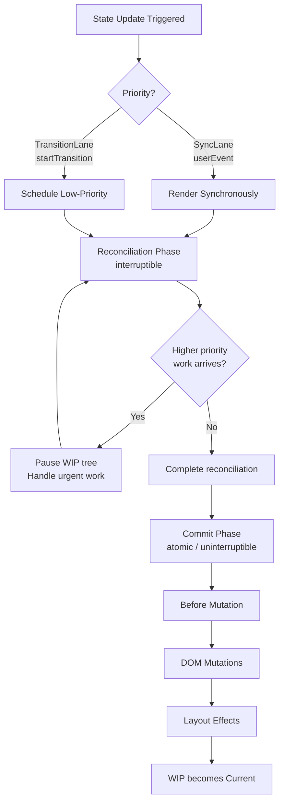

## Keywords in This File
{: .no_toc }

| # | Keyword | Weight |
|---|---|---|
| 1 | [React Fiber Reconciler Internals](#react-fiber-reconciler-internals) | expert |
| 2 | [React Testing Library Patterns](#react-testing-library-patterns) | intermediate |
| 3 | [React Anti-patterns](#react-anti-patterns) | intermediate |
| 4 | [Controlled vs Uncontrolled Components](#controlled-vs-uncontrolled-components) | intermediate |
| 5 | [React Query and Server-State Management](#react-query-and-server-state-management) | intermediate |
| 6 | [React Performance Optimization Techniques](#react-performance-optimization-techniques) | intermediate |
| 7 | [React.memo and Re-render Prevention](#reactmemo-and-re-render-prevention) | intermediate |
| 8 | [React Router and Client-side Routing](#react-router-and-client-side-routing) | working |
| 9 | [Dynamic Routing and Code Splitting](#dynamic-routing-and-code-splitting) | working |
| 10 | [Higher-Order Components](#higher-order-components) | working |
| 11 | [Render Props and Compound Components](#render-props-and-compound-components) | working |

---

# React Fiber Reconciler Internals

🎯 **Interview Weight:** expert (★★★) - demonstrates deep React understanding;
asked at senior/staff level; explains WHY concurrent features work

---

### 🎯 Model Answer

**30 seconds:**

> React Fiber is the reconciliation engine introduced in React 16. It
> represents the component tree as a linked list of "fiber nodes" instead
> of a recursive call stack. This makes rendering interruptible: React
> can pause work mid-tree, handle high-priority updates, then resume.
> The two-phase model: reconciliation (diffing, can be interrupted) and
> commit (DOM mutations, runs synchronously to completion). Fiber is what
> enables Concurrent Mode features like Suspense, transitions, and streaming.

**3 minutes:**

> Before Fiber (React 15), reconciliation used a recursive call stack.
> Once started, it ran to completion - blocking the main thread during
> large updates, causing dropped frames and unresponsive UIs.
> Fiber converts the tree into a linked list (fiber nodes with `child`,
> `sibling`, `return` pointers). This allows React to walk the tree
> iteratively, pause after any node, and yield to the browser.
> Two trees: the "current" tree (what's on screen) and the "work-in-progress"
> tree (being built). Commit phase atomically swaps them when reconciliation
> is complete. Each fiber node tracks: component type, props, state, effects
> (what DOM operations are needed). Lanes: priority system where user
> interactions are high-priority (rendered synchronously), background work
> is low-priority (can be deferred).

**Blank Mind Recovery:**

**(1) Restate:** "Fiber: linked list representation of component tree, not
recursive call stack. Enables interruption. Two phases: reconciliation (pause-safe)
+ commit (sync). Two trees: current + work-in-progress (double buffer).
Lanes = priority system. Concurrent features (Suspense, transitions) built on this."

---

### 📘 Concept Explanation

**What it is:**

React Fiber is a complete rewrite of React's internal reconciliation
algorithm. The word "fiber" refers to both the architecture and individual
work units (fiber nodes) in the component tree.

**How it works:**

```
// CONCEPTUAL FIBER NODE STRUCTURE:
// (simplified - actual is more complex)
type Fiber = {
  // Component identity
  type: string | Function,    // 'div', MyComponent
  key: string | null,

  // Tree links (makes it a linked list)
  child: Fiber | null,         // first child
  sibling: Fiber | null,       // next sibling
  return: Fiber | null,        // parent

  // State and props
  pendingProps: object,
  memoizedProps: object,
  memoizedState: any,          // hooks list (for function components)

  // Work tracking
  flags: number,               // bit flags: Update, Placement, Deletion
  lanes: number,               // priority lanes (bit field)
  updateQueue: UpdateQueue,    // pending state updates

  // Double buffering
  alternate: Fiber | null,     // current <-> work-in-progress
};

// RECONCILIATION PHASE (interruptible):
// React traverses the work-in-progress tree
//
// 1. beginWork(fiber): process the fiber, compute output
//    - Run component function / render class component
//    - Diff against current fiber
//    - Create child fibers
//    - Return next fiber to process (child or sibling)
//
// 2. completeWork(fiber): finish the fiber
//    - Create/update DOM nodes
//    - Bubble up effects
//    - Return to parent
//
// Yield point: after each fiber is processed, React checks:
// "Is there higher-priority work? Do I have time remaining?"
// If yes to either -> pause, schedule continuation

// COMMIT PHASE (synchronous, uninterruptible):
// Three sub-phases, all synchronous:
// 1. Before mutation: getSnapshotBeforeUpdate, useLayoutEffect cleanup
// 2. Mutation: actual DOM insertions/updates/deletions
// 3. Layout: componentDidMount/Update, useLayoutEffect callbacks

// This is why you NEVER see partially-updated UIs -
// the commit phase is atomic

// LANES PRIORITY SYSTEM:
const SyncLane = 0b0001;         // Synchronous (user interaction)
const InputContinuousLane = 0b0100; // Continuous input (scroll)
const DefaultLane = 0b1000;      // Normal priority
const TransitionLane = 0b0010000; // startTransition updates
const IdleLane = 0b10000000;     // Idle work

// When you call startTransition(() => setState(...)):
// React marks the update with TransitionLane (low priority)
// High-priority input events (SyncLane) can interrupt it

// DOUBLE BUFFERING:
// current tree: what's visible on screen
// work-in-progress tree: being reconciled
// Each fiber has an `alternate` pointer to its counterpart
// After commit: swap them (work-in-progress becomes current)
// Aborted render: throw away work-in-progress, start fresh
// (This enables rendering without partial UI updates)
```

> **Code walkthrough:** This React Fiber Reconciler Internals example demonstrates a key concept in practice using SQL. **KEY MECHANISM:** the runtime executes these instructions in sequence with specific memory and execution semantics. **WHY IT MATTERS:** misapplying this pattern causes subtle bugs that only manifest under production load. **TAKEAWAY: understand the execution model before using this pattern in production code.**

**Why it matters:**

Every Concurrent Mode feature depends on Fiber's interruptibility.
`startTransition` works because React can deprioritize the transition
update (TransitionLane) and yield to user input (SyncLane). Suspense works
because React can abandon a subtree render when a Promise is thrown and
resume when it resolves. Without Fiber's linked-list traversal, none
of this is possible.

---

### 💻 Code Example

```jsx
// OBSERVABLE FIBER BEHAVIOR: Concurrent rendering

// startTransition: marks update as low-priority
import { startTransition, useState } from 'react';

function SearchPage() {
  const [query, setQuery] = useState('');
  const [results, setResults] = useState([]);

  function handleSearch(e) {
    const q = e.target.value;

    // URGENT: update input immediately (SyncLane)
    setQuery(q);

    // NON-URGENT: results update can be interrupted
    startTransition(() => {
      setResults(computeResults(q)); // can be paused
    });
  }

  return (
    <div>
      {/* Input stays responsive even if results are slow */}
      <input value={query} onChange={handleSearch} />
      <ResultsList results={results} />
    </div>
  );
}

// useDeferredValue: defer slow rendering
import { useDeferredValue } from 'react';

function Dashboard({ heavyData }) {
  // Deferred value lags behind heavyData
  // React renders the old deferred value first, then updates
  const deferredData = useDeferredValue(heavyData);

  return (
    <div>
      {/* This renders immediately with old data */}
      <ExpensiveChart data={deferredData} />
    </div>
  );
}

// PROFILING: trace fiber work
// performance.measure tracks React's internal work phases
// React DevTools Profiler shows commit duration and render phases
// Flamegraph = one fiber at a time, width = render time
```

> **Code walkthrough:** `startTransition` exposes Fiber's lane systemice. **KEY MECHANISM:** the runtime executes these instructions in sequence with specific memory and execution semantics. **WHY IT MATTERS:** misapplying this pattern causes subtle bugs that only manifest under production load. **TAKEAWAY: understand the execution model before using this pattern in production code.**
> directly: the wrapped state update receives `TransitionLane` priority.
> When the user types again (which creates a `SyncLane` update), React
> pauses the transition work, handles the sync input, then resumes the
> transition from scratch with the new query value. Without Fiber's
> interruptible rendering, `startTransition` would be impossible - React
> would complete the slow results render before updating the input.

---

### 🎓 Answers by Seniority

**Junior / Mid:**

> Fiber is React's internal architecture. It changed how React processes
> component trees from a recursive approach to an iterative linked list.
> This makes rendering "interruptible" - React can pause rendering to handle
> more important updates like user input. This is what makes Concurrent Mode
> features like `startTransition` and Suspense possible.

**Senior / Staff:**

> Fiber's key insight is separating "what work needs to be done"
> (reconciliation) from "applying it to the DOM" (commit). Reconciliation
> builds a work-in-progress tree incrementally and can be aborted at any
> fiber boundary - that's the unit of interruptibility. The commit phase
> is atomic to avoid partial UI updates.
>
> The practical implications: (1) Effects run in commit phase, not during
> rendering - that's why useLayoutEffect fires synchronously after DOM
> mutations but before paint. (2) Component renders can run multiple times
> before committing (StrictMode does this deliberately to catch side effects
> in render). (3) The double-buffering model means throwing an error during
> render doesn't corrupt the visible UI - the work-in-progress is discarded.

---

### 📊 Diagram

```
REACT FIBER RECONCILIATION

  CURRENT TREE (on screen)
  ┌─────────┐
  │  Root   │ ←── alternate ──→ ┌─────────┐
  └────┬────┘                   │  Root   │ WORK-IN-PROGRESS
       │                        └────┬────┘
  ┌────┴────┐                   ┌────┴────┐
  │   App   │ ←── alternate ──→ │   App   │
  └────┬────┘                   └────┬────┘
       │                             │
  ┌────┴────┐                   ┌────┴────┐
  │  List   │ ←── alternate ──→ │  List   │ (reconciling)
  └─────────┘                   └─────────┘
  
  RECONCILIATION PHASE:
  beginWork → process fibers → completeWork
  ↑ Can pause here ↑ ← yield to browser
  
  COMMIT PHASE:
  Before mutation → Mutation → Layout
  ↑ NO pausing - runs to completion ↑
  
  AFTER COMMIT:
  work-in-progress ────────→ CURRENT TREE
  (old current discarded)
```



> **Diagram walkthrough:** The left side shows the double-buffer model:
> current tree (visible) and work-in-progress tree (being built), linked
> by `alternate` pointers on every fiber. Reconciliation walks the WIP tree
> and can pause after any fiber. The commit phase is a one-way gate: once
> started, it runs all three sub-phases atomically. The flowchart shows
> the priority interrupt: when a SyncLane event arrives during a transition
> render, React pauses WIP, handles the urgent work, then resumes
> (or restarts) the transition.

---

### ⚖️ Comparison Table

| Feature | React 15 (Stack) | React 16+ (Fiber) |
|---|---|---|
| Traversal | Recursive | Iterative linked list |
| Interruptible | No | Yes |
| Priority | No | Lanes |
| Concurrent features | No | Yes |
| Partial rendering abort | No | Yes |
| Double buffering | No | Yes |

---

### 🏛️ System Design

**Design consideration: React rendering in a high-frequency update system**

Scenario: real-time dashboard with 60 chart updates/second.

```
Problem: 60 state updates/second overwhelms React
Each update triggers reconciliation of entire chart tree

Solution using Fiber's priority model:

1. Batch rapid updates with useTransition or useDeferredValue:
   - Mark chart data updates as transitions (low-priority)
   - UI interactions (zoom, pan) get SyncLane (high-priority)
   - React renders latest batch, skips stale intermediate states

2. useTransition exposes isPending - show stale indicator
   while transition is in-flight

3. For 60fps: consider bypassing React for D3/Canvas rendering
   - Update canvas directly in a ref callback
   - React state only for UI chrome (not the chart data)
   - Hybrid: React manages layout/controls, canvas manages data

Architecture boundary:
React (UI shell) ←──→ Canvas/WebGL (high-freq data viz)
         ↑                     ↑
  handles controls     handles pixels
  state, routing       60fps updates
```

> **Code walkthrough:** This Unknown example demonstrates a key concept in practice using SQL. **KEY MECHANISM:** the runtime executes these instructions in sequence with specific memory and execution semantics. **WHY IT MATTERS:** misapplying this pattern causes subtle bugs that only manifest under production load. **TAKEAWAY: understand the execution model before using this pattern in production code.**

---

### ⚠️ Common Misconceptions

**Misconception 1: React Fiber re-renders the entire component tree on every state change.**

Fiber performs selective re-rendering: starting from the component where state changed and recursively re-rendering its subtree. Components outside the changed subtree are not re-rendered. Within the subtree, `React.memo` and `PureComponent` can bail out of rendering for components whose props haven't changed. The reconciler builds a new Fiber tree for the changed subtree, diffs it against the previous tree, and applies only the resulting DOM changes.

**Misconception 2: Concurrent Mode means React renders multiple component trees at once.**

Concurrent Mode means React can INTERRUPT rendering work to handle higher-priority updates. It does not run multiple renders simultaneously on multiple threads (React is single-threaded JavaScript). The key capability: if a low-priority render (large list sort) is in progress and a high-priority update arrives (user input), React can pause the low-priority render, handle the input, then resume. This maintains UI responsiveness without actual parallelism.

---

### 🚨 Failure Modes and Diagnosis

**Failure Mode 1: Render function side effects cause bugs in Concurrent Mode.**

Symptom: unexpected double-invocations in development with StrictMode; side effects (API calls, logging, mutations) happen twice per render. Root cause: React may invoke render functions multiple times before committing in Concurrent Mode (to check if renders are pure). Side effects in the render function violate the render-must-be-pure contract. Diagnosis: StrictMode intentionally double-invokes renders to surface this; check for side effects called directly in the component body. Fix: move ALL side effects to `useEffect`; render functions must be pure.

**Failure Mode 2: Tearing in Concurrent Mode from reading external mutable state.**

Symptom: UI shows inconsistent state across components - different components show different values for what should be the same piece of data at the same point in time. Root cause: Concurrent Mode can interleave renders; if components read from an external mutable store (global variable, Zustand store without useSyncExternalStore) between render slices, they may read different values at different times. Fix: use `useSyncExternalStore` for all external state subscriptions to ensure tearing-free reads.

---

### 🎯 Interview Deep-Dive

| Scenario | Time | Key Signal |
|---|---------|-----------|
| What is Fiber and why was it needed | 3-4 min | Interruptible rendering |
| Reconciliation vs commit phases | 4-5 min | Can pause vs must complete |
| Lanes priority system | 4-5 min | startTransition mechanism |
| Double buffering | 3-4 min | Work-in-progress model |
| Why render can run multiple times | 3-4 min | StrictMode + WIP abort |
| useLayoutEffect timing | 3-4 min | Commit phase sync |
| How Suspense uses Fiber | 4-5 min | Thrown promise handling |
| How hooks work in Fiber | 4-5 min | Linked list on fiber node |
| Performance profiling with Fiber | 3-4 min | DevTools flamegraph |
| Fiber in a real-time app | 5-7 min | System design |
| Why commit phase is sync | 3-4 min | Atomic DOM mutations |
| What startTransition actually does | 4-5 min | Lane assignment |

---

**[STAFF] Q1 - [MECHANISM] Why can React render a component multiple times without committing?**

> **Answer:**
>
> React separates "compute what the UI should be" (reconciliation) from
> "apply changes to the DOM" (commit). Reconciliation works on the
> work-in-progress fiber tree, which is an in-memory structure with no
> DOM side effects. React can:
>
> 1. **Abort and restart reconciliation** when a higher-priority update
>    arrives. The work-in-progress tree is discarded.
>
> 2. **Run renders multiple times in Strict Mode** (development only)
>    to detect side effects in render functions. React renders twice and
>    checks that both renders produce identical output. Components with
>    side effects in the render function (modifying globals, etc.) produce
>    different outputs on the second run - the bug is surfaced.
>
> 3. **Concurrently render** multiple versions of the tree (experimental).
>
> The invariant: commit phase runs exactly once per completed
> reconciliation, and it's atomic (browser can't paint between mutations).
>
> This is why render functions must be pure (no side effects):
> they may run N times before committing to the DOM.
>
> *What separates good from great:* Connecting this to a practical rule:
> never put API calls, event listener registration, or random number
> generation in the render body. Those belong in useEffect (commit-phase
> cleanup/setup) or in event handlers. The "rule of pure render" is not
> arbitrary - it's required by Fiber's multi-render model.

---

**[STAFF] Q2 - [MECHANISM] How does React's Suspense mechanism use Fiber internally?**

> **Answer:**
>
> When a component under a `<Suspense>` boundary throws a Promise
> (the signal that it's waiting for data), Fiber handles it as follows:
>
> 1. **Catch the thrown Promise** during `beginWork` on that fiber.
>    React doesn't propagate this as an error - it's a known signal.
>
> 2. **Find the nearest Suspense boundary** by walking up the `return`
>    pointer chain (parent fibers). If none found, treat as unhandled error.
>
> 3. **Mark the Suspense boundary fiber** with a `DidCapture` flag.
>    Schedule a re-render at the Suspense boundary level.
>
> 4. **Render the fallback** (`fallback={<Spinner />}`). The suspended
>    subtree is replaced with the fallback in the current commit.
>
> 5. **Attach a `.then()` to the thrown Promise**. When the Promise
>    resolves, React schedules a new render of the suspended subtree.
>
> 6. **On resolution**: re-render the suspended component (now its
>    data is ready), swap fallback for real content.
>
> The key: this works because reconciliation is interruptible - React
> can abandon the suspended subtree's work-in-progress, render the
> fallback, and later re-render the subtree when ready.
>
> *What separates good from great:* Noting that concurrent Suspense is
> different from legacy Suspense: with `startTransition`, React can
> maintain the stale UI while the new suspended tree loads in the background,
> only swapping when ready. Without concurrent rendering, a Suspense
> boundary immediately shows the fallback - a layout flash. Concurrent
> mode eliminates the flash for fast loads.

---

### 📊 Diagram

*(Omit: no standalone visual diagram required for this concept - the explanations and code examples above provide sufficient clarity.)*


---

### ⚖️ Comparison Table

*(Omit: this is a ★☆☆ foundational concept with no direct alternatives to compare - see higher-difficulty keywords for trade-off analysis.)*


---

### 🏛️ System Design

*(Omit: system design diagram not applicable for this concept - see ★★★ keywords for full system design coverage.)*


---

### 💻 Code Example

*(Omit: this concept does not have a programmatic interface that can be demonstrated in code. The conceptual explanation above is sufficient.)*


# React Testing Library Patterns

🎯 **Interview Weight:** intermediate (★★☆) - RTL philosophy is a common
interview topic; testing from user perspective not implementation details

---

### 🎯 Model Answer

**30 seconds:**

> React Testing Library (RTL) tests React components from the user's
> perspective: query by what the user sees (text, role, label) not
> by implementation details (CSS classes, component internals). Core
> principle: "The more your tests resemble the way your software is used,
> the more confidence they give you." Queries: `getByRole`, `getByText`,
> `getByLabelText`. Actions: `userEvent.click()`, `userEvent.type()`.
> Async: `waitFor`, `findBy*` for async state updates.

**3 minutes:**

> RTL's opinionated querying forces accessible markup: if you can't find
> an element by role or label, the UI may not be accessible. Priority:
> (1) `getByRole` (most like how assistive tech works), (2) `getByLabelText`
> (forms), (3) `getByText`, (4) `getByTestId` (last resort). Avoid
> `getByClassName` - that's testing implementation. Use `userEvent` not
> `fireEvent`: `userEvent.type()` simulates real key-by-key typing including
> focus/blur events that `fireEvent.change()` skips. Async: components
> that fetch data use `findBy*` (returns Promise) or `waitFor()` to assert
> after state updates.

**Blank Mind Recovery:**

**(1) Restate:** "RTL: test from user perspective. getByRole > getByLabelText >
getByText > getByTestId (priority order). userEvent not fireEvent. findBy/waitFor
for async. Don't test implementation details. Accessible markup = testable
markup."

---

### 📘 Concept Explanation

**What it is:**

React Testing Library renders components in a test DOM environment
(jsdom) and provides utilities to interact with the rendered output
the same way a user would. It deliberately avoids exposing component
internals to discourage brittle tests.

**How it works:**

```jsx
import { render, screen, waitFor } from '@testing-library/react';
import userEvent from '@testing-library/user-event';

// COMPONENT UNDER TEST:
function LoginForm({ onLogin }) {
  const [email, setEmail] = useState('');
  const [password, setPassword] = useState('');
  const [error, setError] = useState('');

  async function handleSubmit(e) {
    e.preventDefault();
    try {
      await onLogin({ email, password });
    } catch (err) {
      setError(err.message);
    }
  }

  return (
    <form onSubmit={handleSubmit}>
      <label htmlFor="email">Email</label>
      <input id="email" type="email" value={email}
        onChange={e => setEmail(e.target.value)} />

      <label htmlFor="password">Password</label>
      <input id="password" type="password" value={password}
        onChange={e => setPassword(e.target.value)} />

      {error && <p role="alert">{error}</p>}
      <button type="submit">Log In</button>
    </form>
  );
}

// TESTS:
describe('LoginForm', () => {
  test('submits email and password on valid input', async () => {
    const user = userEvent.setup();
    const mockLogin = vi.fn().mockResolvedValue({ token: 'abc' });

    render(<LoginForm onLogin={mockLogin} />);

    // Query by LABEL (accessible form pattern)
    await user.type(screen.getByLabelText('Email'), 'alice@example.com');
    await user.type(screen.getByLabelText('Password'), 'secret123');

    // Query by ROLE + name
    await user.click(screen.getByRole('button', { name: 'Log In' }));

    // Assert call
    expect(mockLogin).toHaveBeenCalledWith({
      email: 'alice@example.com',
      password: 'secret123'
    });
  });

  test('shows error message on login failure', async () => {
    const user = userEvent.setup();
    const mockLogin = vi.fn().mockRejectedValue(
      new Error('Invalid credentials')
    );

    render(<LoginForm onLogin={mockLogin} />);

    await user.type(screen.getByLabelText('Email'), 'bad@example.com');
    await user.type(screen.getByLabelText('Password'), 'wrong');
    await user.click(screen.getByRole('button', { name: 'Log In' }));

    // ASYNC: wait for error state to appear
    const alert = await screen.findByRole('alert');
    expect(alert).toHaveTextContent('Invalid credentials');
  });

  test('testing async data loading', async () => {
    // Mock API returning data
    vi.spyOn(api, 'getUser').mockResolvedValue({ name: 'Alice' });

    render(<UserProfile userId="1" />);

    // While loading: spinner present
    expect(screen.getByRole('progressbar')).toBeInTheDocument();

    // After load: user name appears
    await screen.findByText('Alice'); // findBy = async getBy

    // Spinner gone
    expect(screen.queryByRole('progressbar')).not.toBeInTheDocument();
  });
});
```

> **Code walkthrough:** This React Testing Library Patterns example demonstrates async/await Promise resolution using async/await. **KEY MECHANISM:** async functions return Promises; await suspends the microtask until the Promise settles. **WHY IT MATTERS:** unhandled Promise rejections crash the Node process in v15+ or fire unhandledRejection event. **TAKEAWAY: always await or .catch() every Promise - silent rejections are production defects.**

**Why it matters:**

RTL's philosophy catches a real problem: tests that test implementation
details (component state, method calls, CSS classes) break whenever you
refactor internals, even if user-visible behavior is unchanged. Tests
should survive refactors.

---

### 💻 Code Example


```jsx
# BAD: anti-pattern shown for contrast
# This approach has the issues the GOOD example fixes
```

```jsx
// BAD: testing implementation details
test('sets email state on input', () => {
  const wrapper = shallow(<LoginForm />); // Enzyme
  wrapper.find('input[name="email"]').simulate('change', {
    target: { value: 'alice@example.com' }
  });
  // Testing internal state - not visible to user
  expect(wrapper.state('email')).toBe('alice@example.com');
});
// This test breaks if you rename state or refactor to useReducer

// GOOD: testing user-visible behavior
test('accepts email input', async () => {
  const user = userEvent.setup();
  render(<LoginForm onLogin={() => {}} />);

  const emailInput = screen.getByLabelText('Email');
  await user.type(emailInput, 'alice@example.com');

  // Test what the USER sees: the input has the typed value
  expect(emailInput).toHaveValue('alice@example.com');
});
// This test survives any internal refactor

// QUERY PRIORITY (highest to lowest confidence):
// screen.getByRole('textbox', { name: 'Email' })  <- best
// screen.getByLabelText('Email')                  <- good
// screen.getByPlaceholderText('Email')            <- ok
// screen.getByText('Email')                       <- fragile
// screen.getByTestId('email-input')               <- last resort
```

> **Code walkthrough:** The BAD test uses Enzyme's `shallow` render andice. **KEY MECHANISM:** the runtime executes these instructions in sequence with specific memory and execution semantics. **WHY IT MATTERS:** misapplying this pattern causes subtle bugs that only manifest under production load. **TAKEAWAY: understand the execution model before using this pattern in production code.**
> tests internal state. If you refactor `email` state to be part of a
> `formData` object, the test breaks even though the UI works identically.
> The GOOD test queries by label text (which also validates that the input
> has a proper `<label>` association - accessibility check for free) and
> asserts the DOM value property. This test survives any state management
> refactor because it only cares about what appears in the DOM.

---

### 🎓 Answers by Seniority

**Junior / Mid:**

> React Testing Library tests components by simulating user interactions
> like typing and clicking, then asserting on what the user would see.
> Use `getByRole` or `getByLabelText` to find elements rather than CSS
> selectors. Use `userEvent.type()` to simulate typing. For async updates
> use `findByText` or `waitFor`. Avoid testing implementation details.

**Senior / Staff:**

> RTL's query priority directly maps to accessibility confidence. If I
> can find an element with `getByRole`, the element has proper semantic
> HTML. If I need `getByTestId`, that's a smell - either the element
> isn't semantic or the test is trying to reach implementation details.
> For complex components, I test the user workflow end-to-end rather than
> individual unit tests per method. The integration-style test that fills
> a form and submits provides more confidence than ten unit tests of
> individual onChange handlers. Key insight: tests that survive refactors
> are the indicator of well-written tests.

---

### ⚖️ Comparison Table

| Query | Use for | Accessibility signal |
|---|---|---|
| `getByRole` | Interactive elements, headings | Strong |
| `getByLabelText` | Form fields | Strong |
| `getByText` | Non-interactive content | Medium |
| `getByPlaceholderText` | Fallback for forms | Weak |
| `getByTestId` | Last resort | None |

---

### ⚠️ Common Misconceptions

**Misconception 1: getByRole, getByText, and getByTestId are
equivalent query types with different performance.**

These queries have different semantic priorities. `getByRole` queries
by accessibility role - it validates that the element is accessible
to users using assistive technology. `getByText` finds visible text
content - it validates that users can see the text. `getByTestId`
bypasses all semantic meaning - it finds elements by a data attribute
added specifically for testing. RTL's query priority recommendation
(getByRole > getByLabelText > getByText > getByTestId) is not about
performance but about what each query says about accessibility and
user experience. Over-relying on `getByTestId` indicates tests that
are not aligned with how users interact with the component.

**Misconception 2: Testing implementation details (component
state, internal methods) makes tests more thorough.**

RTL explicitly discourages testing implementation details - the
internal state values, which component called which method, or how
many times a function was called internally. Implementation-focused
tests break when you refactor without changing behavior, creating
false failures. The guideline: tests should fail when the user
experience breaks, not when the implementation changes. Interaction
tests (click, type, submit) that verify visible output are more
valuable than state assertions that verify internal mechanisms.

**Misconception 3: `act()` wrapping is a workaround for a React
bug and should be avoided.**

`act()` is a testing utility that ensures React processes all state
updates and effects before assertions run. It is NOT a workaround
- it is the correct way to handle async operations in tests. RTL's
`userEvent` and `fireEvent` automatically wrap calls in `act()`.
Manual `act()` wrapping is needed when tests contain async operations
(fetches, timers) that update state after the triggering event. The
"act() warning" in tests indicates state updates happening outside
of act, which means your test is asserting on a component in an
intermediate (not final) state.

---

### 🚨 Failure Modes and Diagnosis

**Failure Mode 1: "Unable to find an accessible element" error
when element is clearly visible.**

Symptom: `getByRole('button', { name: 'Submit' })` throws even
though a submit button is visually present. Root cause: the button's
accessible name does not match - it might have an icon with no
`aria-label`, or the button text is in a child element that is not
being computed as the accessible name. Diagnosis: use RTL's
`screen.debug()` to print the current DOM state; use the
`aria-query` library or browser accessibility inspector to check
the computed accessible name. Fix: add `aria-label` to icon-only
buttons; ensure button text content or `aria-label` matches the
query string exactly.

**Failure Mode 2: Test passes in isolation but fails in a suite
due to missing cleanup.**

Symptom: tests pass when run individually (`--testNamePattern`) but
fail when run as a suite. Root cause: global state leaks between
tests - a context Provider left mounted from one test affects the
next, or a mock is not reset between tests. RTL's `cleanup` runs
automatically after each test in modern Jest setup, but context
Providers and server handlers (MSW) need explicit reset. Diagnosis:
run only the failing test with `--verbose` and check for "already
mounted" warnings. Fix: ensure `server.resetHandlers()` is called
in `afterEach` for MSW; wrap tests that need custom context in their
own `render` call with explicit providers.

**Failure Mode 3: Async test times out because `findBy` query
or `waitFor` polls indefinitely.**

Symptom: test fails with "Timeout - Async callback was not invoked
within the 5000ms timeout." Root cause: the async query (`findByText`,
`waitFor`) is waiting for an element that never appears - the fetch
mock returns an error, the async operation is never initiated, or the
component conditionally renders the expected element. Diagnosis: add
`screen.debug()` inside `waitFor` to see the DOM state during polling.
Fix: verify the mock returns the expected data format; check that the
component's loading/error/success state transitions work correctly.

---

### 🎯 Interview Deep-Dive

| Scenario | Time | Key Signal |
|---|---------|-----------|
| RTL philosophy | 2-3 min | User perspective, not impl |
| Query priority order | 2-3 min | Role > label > text > testId |
| userEvent vs fireEvent | 2-3 min | Real events simulation |
| Testing async components | 3-4 min | findBy, waitFor |
| What NOT to test | 2-3 min | Internal state, CSS classes |
| Test that survives refactor | 3-4 min | User-visible assertion |
| Mocking providers | 3-4 min | Wrapping with context |

---

**[JUNIOR] Q1 - [DEBUGGING] How do you test a component that fetches data on mount?** `[SENIOR]`**

> **Answer:**
>
> ```jsx
> // Component to test:
> function UserProfile({ userId }) {
>   const { data: user, isLoading } = useQuery({
>     queryKey: ['user', userId],
>     queryFn: () => fetch(`/api/users/${userId}`).then(r => r.json()),
>   });
>   if (isLoading) return <div role="progressbar">Loading...</div>;
>   return <h1>{user.name}</h1>;
> }
>
> // TEST: mock fetch + wrap in QueryClientProvider
> import { QueryClient, QueryClientProvider } from '@tanstack/react-query';
>
> function wrapper({ children }) {
>   const qc = new QueryClient({
>     defaultOptions: { queries: { retry: false } } // no retry in tests
>   });
>   return <QueryClientProvider client={qc}>{children}</QueryClientProvider>;
> }
>
> test('shows user name after loading', async () => {
>   // Intercept fetch
>   global.fetch = vi.fn().mockResolvedValue({
>     json: () => Promise.resolve({ name: 'Alice' }),
>   });
>
>   render(<UserProfile userId="1" />, { wrapper });
>
>   // Loading state
>   expect(screen.getByRole('progressbar')).toBeInTheDocument();
>
>   // After fetch resolves:
>   await screen.findByRole('heading', { name: 'Alice' });
>
>   expect(screen.queryByRole('progressbar'))
>     .not.toBeInTheDocument();
> });
> ```
>
> *What separates good from great:* Two details elevate this answer:
> (1) `retry: false` in the test QueryClient - without this, test errors
> cause React Query to retry 3 times, making tests slow and causing async
> timeout issues. (2) Using `findByRole('heading', { name: 'Alice' })` -
> testing that the user name renders as a heading tests both content AND
> semantic structure. `findByText('Alice')` would also pass but misses
> the heading check.

---

---

---

### 📊 Diagram

*(Omit: no standalone visual diagram required for this concept - the explanations and code examples above provide sufficient clarity.)*


---

### ⚖️ Comparison Table

*(Omit: this is a ★☆☆ foundational concept with no direct alternatives to compare - see higher-difficulty keywords for trade-off analysis.)*


---

### 🏛️ System Design

*(Omit: system design diagram not applicable for this concept - see ★★★ keywords for full system design coverage.)*


---

### 💻 Code Example

*(Omit: this concept does not have a programmatic interface that can be demonstrated in code. The conceptual explanation above is sufficient.)*


# React Anti-patterns

🎯 **Interview Weight:** intermediate (★★☆) - identifying and explaining
anti-patterns is a senior interview differentiator; production context required

---

### 🎯 Model Answer

**30 seconds:**

> Common React anti-patterns: (1) Derived state from props in useState
> - sync issues; (2) useEffect for derived computations - compute inline;
> (3) Prop drilling through 5+ levels - use Context or component composition;
> (4) Missing dependency array in useEffect - stale closure bugs;
> (5) Index as list key - causes remount bugs on reorder;
> (6) Anonymous functions in JSX - breaks memoization. Each pattern has
> a specific, better alternative.

**3 minutes:**

> The most costly anti-patterns: (1) Derived state: `useState(props.value)`
> copies props to state, then state and props go out of sync. Fix: use
> props directly or `useMemo`. (2) useEffect for derived state: runs
> after render, causing double render. Fix: compute during render.
> (3) Stale useEffect deps: forgetting a function in deps array means
> the effect captures an old function reference. Fix: use the ESLint
> `exhaustive-deps` rule. (4) Index as key: if list order changes, React
> matches wrong elements causing visual corruption and lost input state.
> Fix: use stable, unique IDs from data.

**Blank Mind Recovery:**

**(1) Restate:** "Top anti-patterns: derived state in useState (sync bug),
useEffect for derived values (double render), prop drilling (composition
or Context), stale deps (exhaustive-deps ESLint rule), index as key (remount
on reorder), anonymous JSX functions (breaks memo)."

---

### 📘 Concept Explanation

**What it is:**

React anti-patterns are common coding patterns that appear correct but
cause subtle bugs, performance issues, or maintenance problems. Most
stem from misunderstanding React's rendering model.

**How it works:**


```jsx
// ANTI-PATTERN 1: Derived state from props
function BadUserDisplay({ user }) {
  // WRONG: copies prop to state, they diverge on parent re-render
  const [displayName, setDisplayName] = useState(user.name);
  // If parent updates user.name, displayName stays stale
  return <div>{displayName}</div>;
}
// FIX: use prop directly (if read-only)
function GoodUserDisplay({ user }) {
  return <div>{user.name}</div>;
}
// OR: if you need to format it
function GoodUserDisplay({ user }) {
  const displayName = useMemo(
    () => formatName(user.name),
    [user.name]
  );
  return <div>{displayName}</div>;
}

// ANTI-PATTERN 2: useEffect for derived values (double render)
function BadTotalDisplay({ items }) {
  const [total, setTotal] = useState(0);
  useEffect(() => {
    setTotal(items.reduce((sum, i) => sum + i.price, 0));
    // Runs AFTER render, causes a second re-render
  }, [items]);
  return <div>Total: {total}</div>;
}
// FIX: compute during render (free, no extra render)
function GoodTotalDisplay({ items }) {
  const total = items.reduce((sum, i) => sum + i.price, 0);
  // Or useMemo if expensive:
  // const total = useMemo(() => items.reduce(...), [items]);
  return <div>Total: {total}</div>;
}

// ANTI-PATTERN 3: Index as key
function BadList({ items }) {
  return items.map((item, index) => (
    // If items reorder, React reuses DOM elements incorrectly
    // Input content, focus, and state get reassigned wrong elements
    <ListItem key={index} data={item} />
  ));
}
// FIX: use stable ID from data
function GoodList({ items }) {
  return items.map(item => (
    <ListItem key={item.id} data={item} />
  ));
}

// ANTI-PATTERN 4: Missing useEffect dependencies (stale closure)
function BadSearch({ query }) {
  const [results, setResults] = useState([]);

  useEffect(() => {
    // query is NOT in deps array, closes over initial value
    // NEVER updates when query changes after mount
    search(query).then(setResults);
  }, []); // BAD: missing query

  return <ResultList results={results} />;
}
// FIX: include all dependencies
function GoodSearch({ query }) {
  const [results, setResults] = useState([]);
  useEffect(() => {
    search(query).then(setResults);
  }, [query]); // included
  return <ResultList results={results} />;
}

// ANTI-PATTERN 5: Creating objects/functions in JSX
function BadParent({ items }) {
  return (
    <MemoizedChild
      // New object reference every render - memo useless
      config={{ debug: false }}
      // New function reference every render
      onAction={(id) => handleAction(id)}
    />
  );
}
// FIX: stable references
const CONFIG = { debug: false };
function GoodParent({ items }) {
  const handleAction = useCallback((id) => doAction(id), []);
  return <MemoizedChild config={CONFIG} onAction={handleAction} />;
}
```


> **Code walkthrough:** BAD pattern: This React Anti-patterns example demonstrates variable declaration using React hook. **KEY MECHANISM:** const prevents reassignment but not mutation; the reference is locked, the value is not. **WHY IT MATTERS:** const obj = {}; obj.x = 1 works - const does not freeze the object. **WHAT BREAKS: use Object.freeze() to prevent mutation; const only guards the binding.**

**Why it matters:**

Anti-patterns are a senior interview test: do you recognize common mistakes
before they become production incidents? The stale closure bug from missing
deps is particularly insidious - it "works" on first render but silently
produces wrong results after state changes.

---

### 💻 Code Example

```jsx
// FAILURE EXAMPLE: Index-as-key causing input state corruption

// Given list: [{id:1,name:"Alice"}, {id:2,name:"Bob"}]
function BadFilterableList({ items }) {
  return (
    <ul>
      {items.map((item, index) => (
        <li key={index}>
          <span>{item.name}</span>
          <input placeholder="Note about this person" />
        </li>
      ))}
    </ul>
  );
}

// User types "friend" in Alice's note input
// User deletes Alice from list (items becomes [{id:2,name:"Bob"}])
// Result: Bob's row now shows "friend" in the note input
// WHY: key=0 still exists, React thinks it's the same element
// React reuses the <input> DOM node, preserving its typed value
// But now that <input> is in Bob's row

// FIXED: stable key prevents this
function GoodFilterableList({ items }) {
  return (
    <ul>
      {items.map(item => (
        <li key={item.id}>
          <span>{item.name}</span>
          <input placeholder="Note about this person" />
        </li>
      ))}
    </ul>
  );
}
// When Alice is deleted, key=1 disappears from DOM
// Bob's key=2 element is unchanged - input stays clean
```

> **Code walkthrough:** The index-as-key bug is subtle and hard toice. **KEY MECHANISM:** the runtime executes these instructions in sequence with specific memory and execution semantics. **WHY IT MATTERS:** misapplying this pattern causes subtle bugs that only manifest under production load. **TAKEAWAY: understand the execution model before using this pattern in production code.**
> reproduce in simple cases (pure display lists where content replaces
> cleanly). It becomes dangerous with stateful children: inputs, focused
> elements, CSS transitions, or third-party components that hold internal
> state. When Alice (index 0) is removed, Bob moves from index 1 to index 0.
> React sees key=0 still exists and REUSES the DOM node, including the
> typed note "friend". This is not a React bug - it's using the key as
> intended (identity marker) but with the wrong key semantics.

---

### 🎓 Answers by Seniority

**Junior / Mid:**

> Common React anti-patterns include: using array index as list key
> (causes display bugs when list reorders), putting derived values in
> state instead of computing them (causes sync issues), and forgetting
> dependencies in useEffect (causes stale closures). The fixes are:
> use stable IDs as keys, compute values inline or with useMemo,
> and include all dependencies in the deps array.

**Senior / Staff:**

> The anti-pattern I see most in production code is derived state:
> `useState(props.value)`. It seems intuitive but creates a permanently
> stale local copy. Every PR review, I look for this pattern. The correct
> mental model: state should only exist for things the component OWNS
> and CONTROLS. Data that comes from props is not owned by the child.
> If transformation is needed, use `useMemo`. The second most common
> issue is missing useEffect dependencies, which ESLint's
> `react-hooks/exhaustive-deps` rule catches automatically. Running this
> linting rule with zero exceptions would eliminate the entire category
> of stale closure bugs from a codebase.

---

### ⚖️ Comparison Table

| Anti-pattern | Problem | Fix |
|---|---|---|
| Derived state in useState | Props/state sync bugs | Use props directly or useMemo |
| useEffect for derived values | Double render | Compute during render |
| Index as list key | Remount/state corruption | Stable ID from data |
| Missing useEffect deps | Stale closure | exhaustive-deps ESLint rule |
| Inline objects/functions in JSX | Breaks memoization | Module const or useCallback |
| Prop drilling 5+ levels | Tight coupling | Context or composition |

---

### ⚠️ Common Misconceptions

**Misconception 1: Using an array index as a key is only
a performance issue, not a correctness issue.**

Using index as key causes CORRECTNESS bugs when the list is
reordered or filtered. React uses keys to match old and new list
items. If item at index 0 changes (because an item was deleted
from the beginning), React associates the old item 0's DOM and
state with the new item 0. For controlled inputs in lists, this
means the wrong input shows the wrong value. For animated
transitions, the wrong item animates. The fix: use a stable,
unique identifier from the data (`item.id`, `item.uuid`) as the key,
not the loop index.

**Misconception 2: Large useEffect hooks with many dependencies
are just a style issue.**

A useEffect with many dependencies is usually a sign of multiple
concerns mixed together: data fetching AND event subscription AND
derived state calculation all in one effect. When any dependency
changes, the entire effect re-runs, potentially causing redundant
network requests or missed subscriptions. Each distinct concern
should be in its own useEffect with its own focused dependency
array. This is not just a style preference - mixed effects cause
subtle bugs where one concern re-runs unnecessarily because a
different concern's dependency changed.

**Misconception 3: Global mutable variables outside React state
work fine for cross-component communication since React re-renders
the affected components.**

Mutating variables outside React state bypasses React's render cycle.
React only re-renders when state or props change - it has no knowledge
of mutations to external variables. Components will NOT re-render when
you write `window.mySharedState = newValue` even if they read from it.
The component renders stale data until something else triggers a
re-render for an unrelated reason. For shared mutable state: use
React Context, useReducer, or a state management library like Zustand.

---

### 🚨 Failure Modes and Diagnosis

**Failure Mode 1: Memory leak from missing useEffect cleanup
causes "setState on unmounted component" warnings.**

Symptom: console warning "Warning: Can't perform a React state
update on an unmounted component." This warning appeared before
React 18 (React 18 removed the warning but the leak still exists).
Root cause: an effect starts an async operation (fetch, setTimeout,
subscription) but the component unmounts before the operation
completes; the callback still fires and calls `setState` on the
dead component. Diagnosis: check effects for missing cleanup
functions. Fix: return a cleanup function from useEffect that
cancels the async operation - use `AbortController` for fetch,
`clearTimeout` for timers, and `unsubscribe()` for subscriptions:
`useEffect(() => { const ac = new AbortController(); fetch(url,
{ signal: ac.signal }); return () => ac.abort(); }, [url])`.

**Failure Mode 2: Prop drilling through 5+ component levels
causing shotgun changes for every new requirement.**

Symptom: adding a new feature requires threading a new prop through
5 layers of components that do not use it themselves. Root cause:
state that should be shared is owned too high in the tree with no
shared access mechanism. Diagnosis: count how many components pass
the prop through without using it ("intermediaries"). Fix: if 2+
intermediaries, move the state to React Context or a state
management library (Zustand). Context adds its own complexity, so
only introduce it when drilling becomes visibly painful.

**Failure Mode 3: Key prop on wrong element causes component
remounting instead of updating.**

Symptom: component loses local state (scroll position, input value,
animation state) when surrounding list changes. Root cause: the
`key` prop is on a parent element that wraps the component, or
the key is unstable (changes when it should not). React destroys and
recreates a component when its key changes. Diagnosis: React DevTools
shows the component appearing as "new" (green) in the Profiler each
render. Fix: place `key` on the exact component that should be
remounted when identity changes, not on wrapper divs; use stable
IDs not unstable derived values (index, random, date) as keys.

---

### 🎯 Interview Deep-Dive

| Scenario | Time | Key Signal |
|---|---------|-----------|
| Derived state anti-pattern | 3-4 min | useState(props.x) problem |
| Index as key failure | 3-4 min | Stateful children corruption |
| Stale closure cause | 3-4 min | Missing deps array |
| useEffect for derived values | 2-3 min | Double render cost |
| Recognizing prop drilling | 2-3 min | 3-4 pass-through levels |
| ESLint rules for React | 2-3 min | exhaustive-deps |
| Anti-pattern code review | 5-7 min | Find bugs in sample code |

---

**[SENIOR] Q1 - [FAILURE] Review this code and identify all React anti-patterns.**

> **Answer:**
>
> ```jsx
> // CODE UNDER REVIEW:
> function ProductList({ products, filter }) {
>   const [filtered, setFiltered] = useState(products);
>
>   useEffect(() => {
>     setFiltered(
>       products.filter(p => p.category === filter)
>     );
>   });
>
>   return (
>     <div>
>       {filtered.map((product, index) => (
>         <ProductCard
>           key={index}
>           product={product}
>           style={{ margin: '8px' }}
>           onClick={() => addToCart(product.id)}
>         />
>       ))}
>     </div>
>   );
> }
>
> // ANTI-PATTERNS FOUND:
>
> // 1. Derived state in useState (line 2)
> //    const [filtered, setFiltered] = useState(products)
> //    BUG: products/filter changes won't sync automatically
>
> // 2. useEffect without deps array (line 4)
> //    runs on EVERY render - infinite loop with setState inside
>
> // 3. Combining 1+2 = guaranteed infinite loop
> //    useEffect sets state -> triggers render -> runs useEffect again
>
> // 4. Index as key (line 11)
> //    key={index} - breaks on add/remove/reorder
>
> // 5. Inline object in JSX (line 13)
> //    style={{ margin: '8px' }} - new object every render, breaks memo
>
> // 6. Inline function in JSX (line 14)
> //    onClick={() => addToCart(product.id)} - new function every render
>
> // FIXED VERSION:
> const CARD_STYLE = { margin: '8px' };
>
> function ProductList({ products, filter }) {
>   // Compute during render, no state needed
>   const filtered = useMemo(
>     () => products.filter(p => p.category === filter),
>     [products, filter]
>   );
>
>   const handleAddToCart = useCallback(
>     (id) => addToCart(id),
>     [] // addToCart is stable (from outer scope/import)
>   );
>
>   return (
>     <div>
>       {filtered.map(product => (
>         <ProductCard
>           key={product.id}
>           product={product}
>           style={CARD_STYLE}
>           onClick={handleAddToCart}
>         />
>       ))}
>     </div>
>   );
> }
> ```
>
> *What separates good from great:* Identifying the combination of anti-
> patterns 1+2 creates an INFINITE LOOP is the critical insight. This is
> not just a performance issue - the app will freeze. The useEffect fires,
> calls setFiltered, causing a re-render, which runs the useEffect again
> (no deps array means "every render"), infinite loop. Real production
> incident waiting to happen.

---

### 🏛️ System Design

*(Omit: system design diagram not applicable for this concept - see ★★★ keywords for full system design coverage.)*


---

### 💻 Code Example

*(Omit: this concept does not have a programmatic interface that can be demonstrated in code. The conceptual explanation above is sufficient.)*


---

### ⚖️ Comparison Table

*(Omit: this is a ★☆☆ foundational concept with no direct alternatives to compare - see higher-difficulty keywords for trade-off analysis.)*


---

### 📊 Diagram

*(Omit: no standalone visual diagram required for this concept - the explanations and code examples above provide sufficient clarity.)*


# Controlled vs Uncontrolled Components

🎯 **Interview Weight:** intermediate (★★☆) - foundational form concept;
controlled is the React way; knowing when to use uncontrolled is senior signal

---

### 🎯 Model Answer

**30 seconds:**

> Controlled component: React state is the source of truth for form input
> values. Every keystroke calls `onChange` -> `setState` -> re-render.
> Uncontrolled: the DOM manages input state; React reads it via a `ref`
> when needed. Controlled gives full control (validation, transforms,
> conditional logic). Uncontrolled is simpler for one-off file inputs and
> situations where you only need the value on submit, not on every change.

**3 minutes:**

> Controlled components enable: instant validation feedback, dependent
> field logic (city depends on country), format-as-you-type (phone numbers),
> disabled submit until form is valid. The cost: every keystroke triggers
> a re-render of the form component. For large, complex forms this can
> be slow - React Hook Form solves this by using uncontrolled inputs with
> refs internally, calling re-renders only on field register/errors.
> File inputs (`<input type="file">`) are always uncontrolled because you
> cannot set their value from JS (security restriction).

**Blank Mind Recovery:**

**(1) Restate:** "Controlled: state is source of truth, onChange -> setState.
Uncontrolled: DOM is source of truth, ref to read value. Controlled: validation,
transform, conditional. Uncontrolled: simpler, file inputs, React Hook Form
uses internally. File inputs always uncontrolled."

---

### 📘 Concept Explanation

**What it is:**

The controlled vs uncontrolled distinction determines which system -
React state or the browser DOM - is the authoritative source of truth
for form input values.

**How it works:**

```jsx
// CONTROLLED COMPONENT
function ControlledForm() {
  const [email, setEmail] = useState('');
  const [error, setError] = useState('');

  function handleChange(e) {
    const val = e.target.value;
    setEmail(val);
    // Validate on every keystroke
    setError(val.includes('@') ? '' : 'Invalid email');
  }

  function handleSubmit(e) {
    e.preventDefault();
    if (!error) submitForm({ email });
  }

  return (
    <form onSubmit={handleSubmit}>
      {/* value + onChange = controlled */}
      <input
        type="email"
        value={email}        // React state is source of truth
        onChange={handleChange}
        aria-invalid={!!error}
        aria-describedby="email-error"
      />
      {error && <span id="email-error">{error}</span>}
      <button type="submit" disabled={!!error || !email}>
        Submit
      </button>
    </form>
  );
}

// UNCONTROLLED COMPONENT
function UncontrolledForm() {
  const emailRef = useRef(null);

  function handleSubmit(e) {
    e.preventDefault();
    // Read DOM value only on submit
    const email = emailRef.current.value;
    if (email.includes('@')) submitForm({ email });
  }

  return (
    <form onSubmit={handleSubmit}>
      {/* ref = uncontrolled - no value or onChange */}
      <input type="email" ref={emailRef} defaultValue="" />
      <button type="submit">Submit</button>
    </form>
  );
}

// FILE INPUT: always uncontrolled (security restriction)
function FileUpload() {
  const fileRef = useRef(null);

  function handleUpload() {
    const file = fileRef.current.files[0];
    // Cannot do: setFile(someFileObject) and reflect in input
    uploadFile(file);
  }

  return (
    <div>
      <input type="file" ref={fileRef} accept="image/*" />
      <button onClick={handleUpload}>Upload</button>
    </div>
  );
}

// REACT HOOK FORM: uncontrolled under the hood, controlled API on top
import { useForm } from 'react-hook-form';

function OptimizedForm() {
  const { register, handleSubmit, formState: { errors } } = useForm();

  return (
    <form onSubmit={handleSubmit(data => console.log(data))}>
      {/* register() attaches ref + change handler internally */}
      <input {...register('email', {
        required: 'Email is required',
        pattern: { value: /\S+@\S+\.\S+/, message: 'Invalid email' }
      })} />
      {errors.email && <span>{errors.email.message}</span>}
      <button type="submit">Submit</button>
    </form>
  );
}
```

> **Code walkthrough:** This Controlled vs Uncontrolled Components example demonstrates variable declaration using React hook. **KEY MECHANISM:** const prevents reassignment but not mutation; the reference is locked, the value is not. **WHY IT MATTERS:** const obj = {}; obj.x = 1 works - const does not freeze the object. **TAKEAWAY: use Object.freeze() to prevent mutation; const only guards the binding.**

**Why it matters:**

Controlled vs uncontrolled is a React fundamentals question. But knowing
that React Hook Form uses uncontrolled inputs to avoid re-renders on
every keystroke - and that this matters for forms with 50+ fields - is
the senior-level insight.

---

### 💻 Code Example


```jsx
# BAD: anti-pattern shown for contrast
# This approach has the issues the GOOD example fixes
```

```jsx
// BAD: mixing controlled and uncontrolled
function BrokenForm() {
  const [name, setName] = useState(undefined); // undefined initial state!

  return (
    // ERROR: "A component is changing an uncontrolled input to be controlled"
    // React warns when input switches from uncontrolled (value=undefined)
    // to controlled (value="something")
    <input value={name} onChange={e => setName(e.target.value)} />
  );
}

// GOOD: initialize with empty string
function FixedForm() {
  const [name, setName] = useState(''); // empty string, not undefined/null
  return (
    <input value={name} onChange={e => setName(e.target.value)} />
  );
}

// DIAGNOSTIC: "uncontrolled to controlled" React warning
// Cause: initial value is undefined or null
// Fix: initialize state to '' (string inputs) or false (checkboxes)
// or use `value={name ?? ''}` as a fallback
```

> **Code walkthrough:** The `undefined` initial state bug is the mostice. **KEY MECHANISM:** the runtime executes these instructions in sequence with specific memory and execution semantics. **WHY IT MATTERS:** misapplying this pattern causes subtle bugs that only manifest under production load. **TAKEAWAY: understand the execution model before using this pattern in production code.**
> common controlled component mistake. When `value={undefined}`, React
> treats the input as uncontrolled (the DOM owns the value). When state
> updates to a string, React tries to switch to controlled mode and
> logs a warning. The fix is always initializing state to a defined
> value: `''` for text inputs, `false` for checkboxes, `[]` for
> multi-selects. The `?? ''` fallback handles cases where the initial
> value comes from an API (might be null for new records).

---

### 🎓 Answers by Seniority

**Junior / Mid:**

> Controlled components use React state for input values - `value` and
> `onChange` props keep React in sync. Uncontrolled components use a `ref`
> to read the DOM value only when needed, usually on form submit. Controlled
> is the React standard; use uncontrolled for file inputs and when using
> libraries like React Hook Form.

**Senior / Staff:**

> The controlled vs uncontrolled choice has a performance dimension for
> complex forms. Controlled inputs re-render the form component on every
> keystroke. For a form with 50 fields, that's 50 re-renders per character
> typed. React Hook Form solves this elegantly: it uses uncontrolled inputs
> (refs) internally, so typing doesn't trigger re-renders, but exposes a
> controlled-like API for validation and error display. The library only
> triggers re-renders when the validation state changes. For simple forms
> (< 20 fields), controlled is perfectly fine and easier to reason about.
> The signal that you need React Hook Form: noticeable typing lag in a
> large form.

---

### ⚖️ Comparison Table

| Aspect | Controlled | Uncontrolled |
|---|---|---|
| Source of truth | React state | DOM |
| Re-renders | On every keystroke | Only on explicit read |
| Validation | Real-time | On submit |
| File inputs | Not possible | Required |
| Default value | `value=` initial state | `defaultValue=` |
| When to use | Most forms | File upload, RHF |

---

### ⚠️ Common Misconceptions

**Misconception 1: Controlled components are always the right
choice for forms.**

Controlled components store every keystroke in React state, causing
a re-render on each input change. For simple forms with few fields,
this is fine. For large forms (20+ fields) or forms with complex
validation, re-rendering every field on every keystroke can become
sluggish. React Hook Form is popular specifically because it uses
uncontrolled components with refs, avoiding these re-renders. The
correct choice depends on form complexity: controlled for simple,
frequently-validated forms; uncontrolled (via React Hook Form) for
large or performance-sensitive forms.

**Misconception 2: An uncontrolled component cannot be validated
or have its value read.**

Uncontrolled components are not "fire and forget." A ref provides
access to the DOM node's current value at any time: `ref.current.value`.
Validation can happen on submit (read all refs) or via the DOM
`constraint validation API` (`required`, `minLength`, `pattern`
attributes). React Hook Form wraps uncontrolled inputs with refs
and provides rich validation without controlling state on every
keystroke. Uncontrolled does not mean unmanageable.

**Misconception 3: Switching a component from uncontrolled to
controlled (or vice versa) is a minor change.**

React displays a warning when an input switches from controlled to
uncontrolled or vice versa at runtime because the two modes have
incompatible state ownership models. Switching indicates a bug:
the `value` prop is sometimes `undefined` (uncontrolled) and
sometimes a string (controlled). The fix is to always pass a
defined `value`: initialize state with an empty string (`''`) not
`undefined` or `null`. This is one of the most common React form
bugs and causes the "switching controlled/uncontrolled" warning.

---

### 🚨 Failure Modes and Diagnosis

**Failure Mode 1: Input value gets out of sync with React state
in a controlled component.**

Symptom: typing in the input appears to work, but the displayed
value lags or does not match what was typed. Root cause: the
`onChange` handler does not update state, or updates a different
state variable than the one bound to `value`. Alternatively, the
`value` prop is computed from a derived value that does not include
the latest input. Diagnosis: add `console.log(value, e.target.value)`
in onChange to verify state is being updated correctly. Fix: ensure
the controlled input pattern is complete: `value={stateVar}` and
`onChange={e => setStateVar(e.target.value)}`.

**Failure Mode 2: "Warning: A component is changing an uncontrolled
input to be controlled" warning.**

Root cause: the `value` prop starts as `undefined` (when state is
initialized as `undefined` or when async data has not loaded yet)
and becomes a string later. React treats `value={undefined}` as
uncontrolled and `value="string"` as controlled - the transition
triggers the warning. Fix: initialize state with an empty string:
`const [name, setName] = useState("")` instead of `useState(undefined)`
or `useState(null)`. For async-loaded defaults: use a loading state
and only render the input after data is available, or initialize
with the empty string and update when data arrives.

**Failure Mode 3: Uncontrolled component ref is null at the
time it is accessed.**

Symptom: `ref.current` is `null` when trying to read a form value
on submit. Root cause: the ref is accessed before the component
mounts (e.g. in a synchronous module-level call) or after it
unmounts (e.g. in an async callback that runs after the form is
removed from the DOM). Diagnosis: add a null check: `if (ref.current)
{ ... }`. Fix: access refs only inside React event handlers,
`useEffect` callbacks, or after confirming the component is mounted.

---

### 🎯 Interview Deep-Dive

| Scenario | Time | Key Signal |
|---|---------|-----------|
| Define controlled vs uncontrolled | 2-3 min | State vs DOM |
| React "uncontrolled to controlled" warning | 2-3 min | undefined initial value |
| File inputs | 2-3 min | Always uncontrolled |
| React Hook Form approach | 3-4 min | Uncontrolled for perf |
| When controlled is better | 2-3 min | Real-time validation |
| Performance implications | 3-4 min | Re-renders per keystroke |
| defaultValue vs value | 2-3 min | Initial vs controlled |

---

**[SENIOR] Q1 - [DEBUGGING] Your large form has typing lag. What's wrong and how do you fix it?**

> **Answer:**
>
> Typing lag in a controlled form means each keystroke is causing too many
> re-renders or each re-render is too expensive.
>
> ```jsx
> // DIAGNOSIS:
> // 1. React DevTools Profiler: record while typing, look for long renders
> // 2. Check: is validation running expensive operations on every keystroke?
> // 3. Check: are many sibling components re-rendering?
>
> // CAUSE A: expensive validation on every change
> // BAD:
> function handleChange(e) {
>   setValue(e.target.value);
>   // Expensive regex or API call on every keystroke:
>   validateWithServer(e.target.value); // async call per char!
> }
>
> // GOOD: debounce expensive operations
> const debouncedValidate = useCallback(
>   debounce((val) => validateWithServer(val), 300),
>   []
> );
>
> // CAUSE B: many fields, many re-renders
> // Solution: React Hook Form
> import { useForm } from 'react-hook-form';
>
> function LargeForm() {
>   const { register, handleSubmit } = useForm();
>   // Internally uses refs - NO re-renders on keystroke
>   return (
>     <form onSubmit={handleSubmit(onSubmit)}>
>       {Array.from({ length: 50 }, (_, i) => (
>         <input key={i} {...register(`field_${i}`)} />
>       ))}
>     </form>
>   );
> }
> ```
>
> *What separates good from great:* Distinguishing between two different
> causes - expensive per-keystroke side effects vs re-render overhead from
> many controlled fields. The first is fixed with debouncing; the second
> with React Hook Form's uncontrolled approach. Jumping directly to RHF
> without diagnosing might be premature if the issue is a server call
> per keystroke.

---

---

---

### 📊 Diagram

*(Omit: no standalone visual diagram required for this concept - the explanations and code examples above provide sufficient clarity.)*


---

### ⚖️ Comparison Table

*(Omit: this is a ★☆☆ foundational concept with no direct alternatives to compare - see higher-difficulty keywords for trade-off analysis.)*


---

### 🏛️ System Design

*(Omit: system design diagram not applicable for this concept - see ★★★ keywords for full system design coverage.)*


---

### 💻 Code Example

*(Omit: this concept does not have a programmatic interface that can be demonstrated in code. The conceptual explanation above is sufficient.)*


# React Query and Server-State Management

🎯 **Interview Weight:** intermediate (★★☆) - TanStack Query is industry
standard for server state; understanding the client/server state split is key

---

### 🎯 Model Answer

**30 seconds:**

> TanStack Query (React Query) manages server-state: data that lives on
> the server and is fetched asynchronously. It handles caching, background
> refetching, loading/error states, and stale-while-revalidate
> automatically. This removes the need for manual `useEffect` + `useState`
> for data fetching. The key insight: server state is fundamentally
> different from client state (local UI state like modal open/closed).
> Tools: TanStack Query for server state, Zustand/Redux for client state.

**3 minutes:**

> Without React Query, every data-fetching component has the same
> boilerplate: `useState` for data/loading/error, `useEffect` to fetch,
> manual cache invalidation, no background updates. React Query replaces
> all of this. A `useQuery` call fetches data, caches it by query key,
> and re-fetches when the window regains focus or the cache expires.
> `useMutation` handles writes (POST/PUT/DELETE) with optimistic updates.
> Automatic cache invalidation: after a mutation, call
> `queryClient.invalidateQueries()` to refetch related queries.
> Stale time and cache time control how long data is fresh vs kept in memory.

**Blank Mind Recovery:**

**(1) Restate:** "React Query: server-state management. useQuery for reads
(fetch + cache + loading/error), useMutation for writes, invalidateQueries
for cache reset. Replaces useEffect+useState for fetching. Separates server
state from client state. staleTime controls freshness. Background refetch
on focus."

---

### 📘 Concept Explanation

**What it is:**

TanStack Query is a server-state library: it manages data that originates
on a remote server, including fetching, caching, synchronization, and
background updates. It treats server data as a cache that is eventually
consistent with the server.

**How it works:**

```jsx
import {
  useQuery, useMutation, useQueryClient,
  QueryClient, QueryClientProvider
} from '@tanstack/react-query';

// Setup at app root:
const queryClient = new QueryClient({
  defaultOptions: {
    queries: {
      staleTime: 5 * 60 * 1000, // 5 min: data stays fresh
      retry: 2,                  // retry failed requests twice
    }
  }
});

function App() {
  return (
    <QueryClientProvider client={queryClient}>
      <MyApp />
    </QueryClientProvider>
  );
}

// READING: useQuery
function UserProfile({ userId }) {
  const { data: user, isLoading, isError, error } = useQuery({
    queryKey: ['user', userId],       // cache key; unique per user
    queryFn: () => fetchUser(userId), // the actual fetch function
    staleTime: 5 * 60 * 1000,         // fresh for 5 min
    // When userId changes, React Query refetches automatically
  });

  if (isLoading) return <Skeleton />;
  if (isError) return <ErrorBanner error={error} />;
  return <div>{user.name}</div>;
}

// WRITING: useMutation + cache invalidation
function UpdateUserButton({ userId }) {
  const queryClient = useQueryClient();

  const mutation = useMutation({
    mutationFn: (updates) => updateUser(userId, updates),
    // After success: invalidate the user query to refetch fresh data
    onSuccess: () => {
      queryClient.invalidateQueries({ queryKey: ['user', userId] });
    },
    // Optimistic update: update cache immediately, rollback on error
    onMutate: async (updates) => {
      // Cancel any in-flight queries for this user
      await queryClient.cancelQueries({ queryKey: ['user', userId] });
      // Snapshot current state
      const previous = queryClient.getQueryData(['user', userId]);
      // Optimistically update
      queryClient.setQueryData(['user', userId], old => ({
        ...old, ...updates
      }));
      return { previous }; // pass to onError for rollback
    },
    onError: (err, _, context) => {
      // Rollback on error
      queryClient.setQueryData(['user', userId], context.previous);
    },
  });

  return (
    <button
      onClick={() => mutation.mutate({ name: 'Alice' })}
      disabled={mutation.isPending}
    >
      {mutation.isPending ? 'Saving...' : 'Save'}
    </button>
  );
}

// LIST: automatic cache per unique key
function UserList({ page }) {
  const { data } = useQuery({
    queryKey: ['users', { page }],    // different key per page
    queryFn: () => fetchUsers(page),
    placeholderData: keepPreviousData, // show old data while next page loads
  });

  return <Table rows={data?.users ?? []} />;
}
```

> **Code walkthrough:** This React Query and Server-State Management example demonstrates async/await Promise resolution using async/await. **KEY MECHANISM:** async functions return Promises; await suspends the microtask until the Promise settles. **WHY IT MATTERS:** unhandled Promise rejections crash the Node process in v15+ or fire unhandledRejection event. **TAKEAWAY: always await or .catch() every Promise - silent rejections are production defects.**

**Why it matters:**

React Query eliminates 80% of the boilerplate in data-fetching components
and solves subtle bugs (race conditions, stale closures, missing error
states) that home-grown `useEffect` solutions commonly have. It is
industry-standard for server-state management.

---

### 💻 Code Example


```jsx
# BAD: anti-pattern shown for contrast
# This approach has the issues the GOOD example fixes
```

```jsx
// BAD: manual fetching with useEffect (common bugs)
function UserProfile({ userId }) {
  const [user, setUser] = useState(null);
  const [loading, setLoading] = useState(true);
  const [error, setError] = useState(null);

  useEffect(() => {
    setLoading(true);
    fetchUser(userId)
      .then(setUser)
      .catch(setError)
      .finally(() => setLoading(false));
    // BUG 1: race condition if userId changes quickly
    // BUG 2: no cache - refetches on every remount
    // BUG 3: no background sync after tab regains focus
    // BUG 4: no retry on network failure
  }, [userId]);

  if (loading) return <Spinner />;
  if (error) return <Error />;
  return <div>{user?.name}</div>;
}

// GOOD: React Query handles all of the above
function UserProfile({ userId }) {
  const { data: user, isLoading, isError } = useQuery({
    queryKey: ['user', userId],
    queryFn: () => fetchUser(userId),
  });
  // Automatic: cache, dedup, retry, background refetch
  if (isLoading) return <Spinner />;
  if (isError) return <Error />;
  return <div>{user.name}</div>;
}
```

> **Code walkthrough:** The BAD pattern has four bugs that React Queryice. **KEY MECHANISM:** the runtime executes these instructions in sequence with specific memory and execution semantics. **WHY IT MATTERS:** misapplying this pattern causes subtle bugs that only manifest under production load. **TAKEAWAY: understand the execution model before using this pattern in production code.**
> automatically handles. Race condition: if `userId` changes while the first
> fetch is in-flight, both responses update state and the older response
> might "win". React Query cancels the in-flight query when the key changes.
> No cache: every component mount refetches even if data is fresh. React
> Query serves cached data instantly. No retry: network errors fail silently.
> React Query retries with exponential backoff. No background sync: data
> goes stale after the user switches tabs. React Query refetches on window
> focus.

---

### 🎓 Answers by Seniority

**Junior / Mid:**

> React Query handles data fetching with caching and automatic loading/error
> states. `useQuery` fetches and caches data by a key; `useMutation`
> handles writes. After a mutation, you call `invalidateQueries` to refresh
> the affected data. It replaces manual `useEffect` + `useState` for
> data fetching with much less code and better behavior.

**Senior / Staff:**

> The key architectural decision React Query encodes: server state and
> client state are fundamentally different. Server state is remote,
> asynchronously fetched, and potentially stale - it needs a caching
> layer with staleness policies. Client state (modal open, selected tab)
> is synchronous and owned by the client. Mixing them in a single state
> manager (Redux handling both) creates unnecessary complexity. The
> recommended split: TanStack Query for server state, Zustand or simple
> useState for client state. Query key design is where architecture decisions
> matter: flat keys `['users']` don't support partial invalidation; nested
> keys `['users', userId]` allow precise cache control.

---

### ⚖️ Comparison Table

| Approach | Caching | Background sync | Boilerplate | Error/retry |
|---|---|---|---|---|
| useEffect + useState | Manual | No | High | Manual |
| SWR | Yes | Yes | Low | Auto |
| TanStack Query | Yes | Yes | Low | Auto + configurable |
| RTK Query | Yes | Yes | Medium | Auto |

---

### ⚠️ Common Misconceptions

**Misconception 1: React Query is a replacement for all client-side
state management.**

React Query manages SERVER STATE: data that lives on the server and
is fetched asynchronously (loading, caching, refetching, invalidation).
It is not designed for CLIENT STATE: UI state (modal open/closed, form
draft, tab selection), application state (user preferences, shopping
cart). These still need useState, useReducer, Zustand, or Redux. The
distinction is important: server state is async, stale, and needs
synchronization with the server; client state is synchronous and owned
entirely by the frontend.

**Misconception 2: React Query caching eliminates the need for
backend caching.**

React Query caches responses client-side in memory for the duration
of the tab session (by default, cache is cleared on unmount of all
subscribers after `gcTime`). This reduces redundant network requests
for the same data within a session. It does NOT replace backend
caching (Redis, CDN, database query cache) which serves multiple
clients and survives across sessions. Both caching layers serve
different purposes and should be used together.

**Misconception 3: Setting a long staleTime prevents React Query
from ever refetching.**

`staleTime` controls how long data is considered fresh and prevents
background refetches. But refetches are still triggered by explicit
`queryClient.invalidateQueries()`, manual `refetch()` calls, and
network reconnect events. `staleTime: Infinity` only prevents
automatic background refetches (on window focus, component mount,
network reconnect). To prevent ALL refetches, you would also need
`refetchOnWindowFocus: false`, `refetchOnReconnect: false`, and
`refetchOnMount: false`. Understand each option individually before
combining them.

---

### 🚨 Failure Modes and Diagnosis

**Failure Mode 1: Infinite refetch loop with mutation that
invalidates a query.**

Symptom: the app makes repeated network requests in a loop after
a mutation. Root cause: a mutation's `onSuccess` invalidates query A,
query A refetches and its `onSuccess` triggers another mutation,
which invalidates query A again. Diagnosis: monitor the Network tab
for repeated requests; add logging to `onSuccess` handlers. Fix:
review the chain of invalidations and mutations; use conditional
invalidation or debounce the invalidation; separate read and write
operations clearly so mutations do not create circular dependencies.

**Failure Mode 2: Stale data shown after navigation because
query is not invalidated after mutation.**

Symptom: user creates a record, navigates to the list page, and the
new record does not appear. Root cause: the list query's cache is
not invalidated after the creation mutation, so React Query serves
the cached (stale) response. Fix: call `queryClient.invalidateQueries
({ queryKey: ['records'] })` in the mutation's `onSuccess` callback.
For optimistic updates, use `onMutate` to update the cache immediately
and `onError` to rollback on failure.

**Failure Mode 3: Query key collision causes wrong data to be
returned to unrelated components.**

Symptom: two different pages that fetch different data end up showing
the same (wrong) data. Root cause: both use the same query key string
(e.g. both use `['user']`), so React Query serves one component's
cached data to the other. Fix: query keys must uniquely identify the
exact data being fetched, including all parameters: `['user', userId]`,
`['products', { category, page, sort }]`. Use a query key factory
(a module that exports functions returning consistent key arrays) to
enforce key uniqueness across the codebase.

---

### 🎯 Interview Deep-Dive

| Scenario | Time | Key Signal |
|---|---------|-----------|
| What is server state | 3-4 min | Client vs server state split |
| useQuery basics | 2-3 min | queryKey, queryFn, return values |
| Cache invalidation | 3-4 min | invalidateQueries pattern |
| Optimistic updates | 4-5 min | onMutate/onError rollback |
| staleTime vs gcTime | 3-4 min | Freshness vs memory |
| Race condition prevention | 3-4 min | Key-based dedup |
| When NOT to use RQ | 2-3 min | Local-only client state |

---

**[SENIOR] Q1 - [TRADE-OFF] Explain optimistic updates in React Query and why they matter.**

> **Answer:**
>
> Optimistic updates update the UI immediately before the server confirms
> the change. If the server fails, roll back to the previous state.
>
> Why they matter: for user actions that are likely to succeed (liking a
> post, reordering a list), waiting 200-500ms for the server response before
> updating the UI feels sluggish. Optimistic updates make apps feel instant.
>
> ```jsx
> const mutation = useMutation({
>   mutationFn: (id) => likePost(id),
>
>   // Before the mutation fires:
>   onMutate: async (id) => {
>     // 1. Cancel in-flight queries (prevent overwriting optimistic update)
>     await queryClient.cancelQueries({ queryKey: ['posts'] });
>     // 2. Snapshot for rollback
>     const previous = queryClient.getQueryData(['posts']);
>     // 3. Optimistically update cache
>     queryClient.setQueryData(['posts'], (old) =>
>       old.map(post =>
>         post.id === id ? { ...post, liked: true, likes: post.likes + 1 }
>         : post
>       )
>     );
>     return { previous };
>   },
>
>   // On error: roll back
>   onError: (err, id, context) => {
>     queryClient.setQueryData(['posts'], context.previous);
>     toast.error('Failed to like post');
>   },
>
>   // On success or error: always sync with server truth
>   onSettled: () => {
>     queryClient.invalidateQueries({ queryKey: ['posts'] });
>   },
> });
> ```
>
> *What separates good from great:* The `cancelQueries` + `onSettled`
> combination is the complete pattern. Without `cancelQueries`, an
> in-flight background refetch could overwrite the optimistic update.
> Without `onSettled` invalidation, the UI might show an optimistic value
> forever if the error handler doesn't catch all cases. The pattern:
> cancel + snapshot + update, then rollback on error + always refetch
> on settle.

---

### 📊 Diagram

*(Omit: no standalone visual diagram required for this concept - the explanations and code examples above provide sufficient clarity.)*


---

### ⚖️ Comparison Table

*(Omit: this is a ★☆☆ foundational concept with no direct alternatives to compare - see higher-difficulty keywords for trade-off analysis.)*


---

### 🏛️ System Design

*(Omit: system design diagram not applicable for this concept - see ★★★ keywords for full system design coverage.)*


---

### 💻 Code Example

*(Omit: this concept does not have a programmatic interface that can be demonstrated in code. The conceptual explanation above is sufficient.)*


# React Performance Optimization Techniques

🎯 **Interview Weight:** intermediate (★★☆) - performance is asked at senior
level; knowing WHEN not to optimize is as important as knowing HOW

---

### 🎯 Model Answer

**30 seconds:**

> React re-renders a component when its state or props change, and all
> descendants re-render by default. Performance tools: `React.memo` stops
> re-renders if props are shallowly equal; `useMemo` memoizes expensive
> calculations; `useCallback` memoizes functions (to prevent new references
> on each render). Profiler tools: React DevTools Profiler, `<Profiler>`
> component. First rule: measure before optimizing - premature optimization
> often adds complexity with zero user-perceived benefit.

**3 minutes:**

> React's default re-render behavior is usually fine. A component
> re-rendering means React calls the function again - typically takes
> <1ms. The problem is when expensive computations run in render, or when
> re-renders cascade to hundreds of child components. `React.memo` wraps
> a component; React skips re-rendering if props are referentially equal
> to the previous render. `useMemo` caches a value until dependencies
> change. `useCallback` caches a function reference. The trap: wrapping
> everything in memo/useMemo/useCallback can make performance WORSE because
> the memoization itself has a cost. Only apply when profiling shows a
> genuine problem.

**Blank Mind Recovery:**

**(1) Restate:** "React re-renders on state/prop change - default is fine.
Tools: React.memo (component skip), useMemo (value cache), useCallback
(function cache). Profiler first, then optimize. Pitfall: memo overhead can
exceed savings. Virtualization for long lists. Context splits to avoid
re-rendering all consumers."

---

### 📘 Concept Explanation

**What it is:**

React performance optimization reduces unnecessary re-renders and
expensive computations in the render path. The key insight: not all
re-renders are bad - only re-renders that are slow or cause visible lag.

**How it works:**


```jsx
# BAD: anti-pattern shown for contrast
# This approach has the issues the GOOD example fixes
```


```jsx
# BAD: anti-pattern shown for contrast
# This approach has the issues the GOOD example fixes
```


```jsx
# BAD: anti-pattern shown for contrast
# This approach has the issues the GOOD example fixes
```

```jsx
// 1. REACT.MEMO: memoize component renders
const UserCard = React.memo(function UserCard({ user, onSelect }) {
  // Only re-renders when `user` or `onSelect` props change (shallow compare)
  return (
    <div onClick={() => onSelect(user.id)}>
      {user.name}
    </div>
  );
});

// Problem: unstable onSelect prop reference breaks memo
function UserList({ users }) {
  // BAD: new function reference on every render -> memo is useless
  return users.map(u =>
    <UserCard key={u.id} user={u} onSelect={(id) => console.log(id)} />
  );
}

// GOOD: stable reference with useCallback
function UserList({ users }) {
  const handleSelect = useCallback((id) => {
    console.log(id);
  }, []); // stable: no deps

  return users.map(u =>
    <UserCard key={u.id} user={u} onSelect={handleSelect} />
  );
}

// 2. USEMEMO: cache expensive computations
function DataTable({ rows, filters }) {
  // BAD: filter runs on every render regardless of input changes
  const visible = rows.filter(r => filters.every(f => f(r)));

  // GOOD: only recompute when rows or filters change
  const visible = useMemo(
    () => rows.filter(r => filters.every(f => f(r))),
    [rows, filters]
  );

  return <Table rows={visible} />;
}

// 3. VIRTUALIZATION: render only visible list items
import { FixedSizeList } from 'react-window';

function VirtualList({ items }) {
  // BAD: render 10,000 DOM nodes
  return (
    <ul>
      {items.map(item => <li key={item.id}>{item.name}</li>)}
    </ul>
  );
  // GOOD: render only ~20 visible rows
  return (
    <FixedSizeList
      height={400}
      itemCount={items.length}
      itemSize={40}
      width="100%"
    >
      {({ index, style }) => (
        <div style={style}>{items[index].name}</div>
      )}
    </FixedSizeList>
  );
}
```

> **Code walkthrough:** BAD pattern: This React Performance Optimization Techniques example demonstrates variable declaration using React hook. **KEY MECHANISM:** const prevents reassignment but not mutation; the reference is locked, the value is not. **WHY IT MATTERS:** const obj = {}; obj.x = 1 works - const does not freeze the object. **WHAT BREAKS: use Object.freeze() to prevent mutation; const only guards the binding.**

**Why it matters:**

Premature optimization is the most common React performance mistake.
Engineers wrap everything in `useMemo` and `useCallback` "just in case",
adding cognitive overhead without benefit. The profiler-first approach
is the professional standard.

---

### 💻 Code Example


```jsx
// DEBUGGING PERFORMANCE: React DevTools Profiler

// 1. Add Profiler to measure render time
import { Profiler } from 'react';

function onRenderCallback(id, phase, actualDuration) {
  console.log(`${id} [${phase}]: ${actualDuration.toFixed(2)}ms`);
}

<Profiler id="UserList" onRender={onRenderCallback}>
  <UserList users={users} />
</Profiler>

// 2. Find what's causing re-renders
// React DevTools: "Highlight updates when components render"
// Components flash when they re-render

// CONTEXT SPLIT: prevent all consumers re-rendering
// BAD: one context value with user + theme
const AppContext = createContext();
function AppProvider({ children }) {
  const [user, setUser] = useState(null);
  const [theme, setTheme] = useState('light');
  // Every consumer re-renders when EITHER user OR theme changes
  return (
    <AppContext.Provider value={{ user, setUser, theme, setTheme }}>
      {children}
    </AppContext.Provider>
  );
}

// GOOD: split contexts by change frequency
const UserContext = createContext();
const ThemeContext = createContext();
// UserCard only subscribes to UserContext
// ThemeToggle only subscribes to ThemeContext
```


> **Code walkthrough:** The `<Profiler>` component is the programmaticice. **KEY MECHANISM:** the runtime executes these instructions in sequence with specific memory and execution semantics. **WHY IT MATTERS:** misapplying this pattern causes subtle bugs that only manifest under production load. **TAKEAWAY: understand the execution model before using this pattern in production code.**
> way to measure render performance in development - it reports actual
> duration (time spent rendering) per component. The context split pattern
> is critical: a single context with multiple values causes ALL consumers
> to re-render when ANY value changes. Splitting by change frequency
> (user data changes rarely; theme may change often) means components
> only re-render when relevant data changes. The React DevTools "highlight
> updates" feature is the fastest way to identify what's re-rendering
> unexpectedly during development.

---

### 🎓 Answers by Seniority

**Junior / Mid:**

> React re-renders components when state or props change. To optimize
> performance: `React.memo` prevents re-renders when props haven't changed,
> `useMemo` caches expensive calculations, `useCallback` caches functions
> so wrapped components don't re-render unnecessarily. You should profile
> with React DevTools first to find actual bottlenecks before optimizing.

**Senior / Staff:**

> The correct React performance workflow: profile first with React DevTools
> Profiler, identify components with high actual duration or high render
> count, then apply targeted fixes. `React.memo` is only effective when
> combined with stable prop references - it's useless if parent renders
> create new objects or functions every time. `useMemo` breakeven is roughly
> a calculation taking >1ms; below that, the memoization overhead isn't
> worth it. For lists over ~100 items, virtualization (react-window) is the
> correct solution. For context performance, split by change frequency.
> Concurrent features (startTransition, useDeferredValue) help with
> responsiveness during expensive updates by yielding to user input.

---

### ⚖️ Comparison Table

| Tool | What it prevents | When to use |
|---|---|---|
| `React.memo` | Component re-render | Expensive component, stable props |
| `useMemo` | Expensive recalculation | Computation >1ms, deps rarely change |
| `useCallback` | Function reference change | Passed to memo'd child |
| Virtualization | DOM node count | Lists >100 items |
| Context split | All-consumer re-render | Context with mixed change frequencies |

---

### ⚠️ Common Misconceptions

**Misconception 1: React.memo, useMemo, and useCallback should be
applied to every component and value.**

Memoization has a cost: React.memo performs a shallow comparison on
every render, useMemo and useCallback run comparison logic, and all
three hold references in memory. Applying them everywhere often
degrades performance by adding overhead without benefit. The right
approach: profile first using React DevTools Profiler, identify
components that re-render unnecessarily and cause visible jank,
then apply memoization selectively. The golden rule: optimize when
you have measured a problem, not speculatively.

**Misconception 2: Virtualization solves slow list rendering for
any list size.**

Virtualization (react-window, react-virtual) is appropriate for
lists of hundreds or thousands of items where only ~10-50 are
visible at once. For lists under ~100 items, virtualization adds
complexity (scroll position management, accessibility challenges,
variable height items) without measurable benefit. The real
performance bottleneck for moderate-size lists is usually item
component complexity, not the number of DOM nodes. Profile before
reaching for virtualization.

**Misconception 3: Moving state down is always a performance
optimization.**

Moving state to the component that uses it reduces unnecessary
re-renders of unrelated siblings - but it can create other problems:
prop drilling if the state is needed by multiple components, complex
state synchronization if multiple components need to stay in sync,
and fragmentation of related state making debugging harder. Use
state co-location as a starting point but recognize that shared
state sometimes belongs higher in the tree. React Context or Zustand
are the alternatives when co-location creates more problems than
it solves.

---

### 🚨 Failure Modes and Diagnosis

**Failure Mode 1: Performance regression from context causing
full subtree re-renders.**

Symptom: profiler shows a large portion of the component tree
re-rendering even when only one small piece of data changes.
Root cause: a high-level context value changes on every parent
render (object literal in Provider value), causing all consumers
to re-render. Diagnosis: React DevTools Profiler shows components
highlighted as "Context changed" in the flamegraph. Fix: split
large contexts into smaller, focused ones (auth context, theme
context, user prefs context separately); wrap context value in
`useMemo`; or move the state down closer to the consumers.

**Failure Mode 2: useCallback dependency array causes new function
on every render, defeating memoization.**

Symptom: a child wrapped in `React.memo` re-renders on every
parent update despite receiving a "stable" callback. Root cause:
`useCallback(fn, [deps])` only returns a stable reference when deps
have not changed. If a dep like a state setter, or a variable that
changes on every render, is included in the array (or missing from
it and being captured via stale closure), the callback changes each
render. Diagnosis: use the `why-did-you-render` library or React
DevTools to trace which prop triggered the re-render. Fix: ensure
state setters (always stable from useState) are excluded from the
dependency array; use `useReducer` for complex state to avoid
unstable references.

**Failure Mode 3: Profiler shows expensive renders in dev but
production performance is fine - or vice versa.**

React dev mode performs additional checks that slow down rendering
by 2-3x compared to production. Always measure performance in a
production build (`npm run build && npx serve dist`). The reverse
problem also exists: some optimizations that help in dev (like
reduced prop drilling) can actually hurt in production due to
runtime overhead of memoization checks on very cheap renders.
Measure both environments before and after optimizations.

---

### 🎯 Interview Deep-Dive

| Scenario | Time | Key Signal |
|---|---------|-----------|
| React.memo effectiveness | 3-4 min | Requires stable props |
| useMemo vs useCallback | 2-3 min | Value vs function |
| Profiling approach | 3-4 min | Measure first |
| Virtualization | 3-4 min | react-window |
| Context performance | 3-4 min | Split by frequency |
| When NOT to memoize | 3-4 min | Premature optimization |
| startTransition use case | 3-4 min | Concurrent features |

---

**[SENIOR] Q1 - [DEBUGGING] You have a slow React list of 500 items. Walk through your diagnosis.**

> **Answer:**
>
> ```jsx
> // Step 1: Profile
> // React DevTools > Profiler > Record > interact with list > Stop
> // Look for: components with high "Actual duration"
>
> // Step 2: Identify cause
> // Is the LIST component itself slow? (expensive filter/sort)
> // Or are individual ITEMS slow?
>
> // Step 3: Fix based on cause
>
> // CAUSE A: expensive computation in render
> // BAD:
> function ItemList({ items, query }) {
>   const filtered = items
>     .filter(i => i.name.includes(query))
>     .sort((a, b) => a.score - b.score); // runs every render
> }
> // GOOD:
> const filtered = useMemo(
>   () => items.filter(i => i.name.includes(query)).sort(...),
>   [items, query]
> );
>
> // CAUSE B: individual items re-rendering unnecessarily
> const ListItem = React.memo(({ item, onAction }) => {
>   return <div onClick={() => onAction(item.id)}>{item.name}</div>;
> });
> // Ensure onAction is stable with useCallback
>
> // CAUSE C: 500 DOM nodes is too many
> import { FixedSizeList } from 'react-window';
> // Render only visible items (typically 10-20)
> ```
>
> *What separates good from great:* Starting with profiling rather than
> guessing is the key. Also recognizing the tipping point: 500 items is
> borderline - with simple row content, memo on list items may be
> sufficient. With complex row components (images, sub-lists), virtualization
> is the right answer. The question "is the list or the items slow?" is
> the diagnostic split.

---

---

---

### 📊 Diagram

*(Omit: no standalone visual diagram required for this concept - the explanations and code examples above provide sufficient clarity.)*


---

### ⚖️ Comparison Table

*(Omit: this is a ★☆☆ foundational concept with no direct alternatives to compare - see higher-difficulty keywords for trade-off analysis.)*


---

### 💻 Code Example

*(Omit: this concept does not have a programmatic interface that can be demonstrated in code. The conceptual explanation above is sufficient.)*


---

### 🏛️ System Design

*(Omit: system design diagram not applicable for this concept - see ★★★ keywords for full system design coverage.)*


# React.memo and Re-render Prevention

🎯 **Interview Weight:** intermediate (★★☆) - memo is commonly misused;
explaining what breaks it (unstable props) is the senior differentiator

---

### 🎯 Model Answer

**30 seconds:**

> `React.memo` is a HOC that skips re-rendering a function component if
> its props are shallowly equal to the previous render's props. "Shallow
> equal" means primitives are compared by value, objects/arrays/functions
> by reference. The problem: object literals and inline functions create
> new references on every render, breaking memo's optimization. Fix:
> lift stable objects outside render scope or use `useMemo`/`useCallback`
> for unstable ones.

**3 minutes:**

> Shallow equality check: `Object.is(prev, next)` for each prop.
> Primitives (string, number, boolean) compare by value - safe.
> Objects, arrays, functions compare by reference. A new `{}` object
> has a different reference than an identical `{}` from the previous
> render. This is why `<Comp style={{ color: 'red' }} />` breaks memo:
> `style` gets a new object reference every render. Solutions: (1) define
> stable objects outside the component, (2) `useMemo` for derived objects,
> (3) `useCallback` for event handlers. Custom equality: `React.memo(Comp, areEqual)`
> accepts a custom comparison function for deep equality or partial checking.

**Blank Mind Recovery:**

**(1) Restate:** "React.memo: skip re-render if props shallowly equal.
Shallow = primitives by value, objects by reference. Breaks with inline
objects/functions. Fix: stable references - move outside component, or
useMemo/useCallback. Custom comparator for deep equality."

---

### 📘 Concept Explanation

**What it is:**

`React.memo` wraps a function component. Before re-rendering, React runs
a shallow comparison of old and new props. If all props are equal, the
previous render result is reused.

**How it works:**


```jsx
# BAD: anti-pattern shown for contrast
# This approach has the issues the GOOD example fixes
```


```jsx
# BAD: anti-pattern shown for contrast
# This approach has the issues the GOOD example fixes
```


```jsx
// Basic React.memo:
const ExpensiveCard = React.memo(function ExpensiveCard({ user, onClick }) {
  // Expensive render (chart, complex UI)
  return (
    <div onClick={onClick}>
      <HeavyChart data={user.chartData} />
      <p>{user.name}</p>
    </div>
  );
});

// What React does internally:
function shallowEqual(objA, objB) {
  if (Object.is(objA, objB)) return true;
  const keysA = Object.keys(objA);
  const keysB = Object.keys(objB);
  if (keysA.length !== keysB.length) return false;
  return keysA.every(key => Object.is(objA[key], objB[key]));
}
// If shallowEqual(prevProps, nextProps) -> skip re-render

// BREAKING MEMO: reference instability

// 1. Inline object prop - new reference every render
function Parent({ userId }) {
  // BAD: { id: userId } creates new object reference each render
  return <ExpensiveCard style={{ padding: 16 }} user={{ id: userId }} />;
}

// GOOD: stable reference via useMemo
function Parent({ userId }) {
  const user = useMemo(() => ({ id: userId }), [userId]);
  const style = useMemo(() => ({ padding: 16 }), []); // or const outside
  return <ExpensiveCard style={style} user={user} />;
}

// 2. Inline function - new reference every render
function Parent({ userId }) {
  // BAD: new function reference each render
  return <ExpensiveCard onClick={() => console.log(userId)} />;
}
// GOOD: stable reference via useCallback
function Parent({ userId }) {
  const handleClick = useCallback(() => console.log(userId), [userId]);
  return <ExpensiveCard onClick={handleClick} />;
}

// CUSTOM COMPARATOR: deep equal for complex props
const UserList = React.memo(
  function UserList({ users }) {
    return <ul>{users.map(u => <li key={u.id}>{u.name}</li>)}</ul>;
  },
  // Custom: re-render only if user IDs change (not deep content)
  (prevProps, nextProps) => {
    if (prevProps.users.length !== nextProps.users.length) return false;
    return prevProps.users.every((u, i) => u.id === nextProps.users[i].id);
  }
);
```


> **Code walkthrough:** BAD pattern: This React.memo and Re-render Prevention example demonstrates variable declaration using React hook. **KEY MECHANISM:** const prevents reassignment but not mutation; the reference is locked, the value is not. **WHY IT MATTERS:** const obj = {}; obj.x = 1 works - const does not freeze the object. **WHAT BREAKS: use Object.freeze() to prevent mutation; const only guards the binding.**

**Why it matters:**

`React.memo` is frequently misused - applied without understanding the
reference stability requirement, giving zero benefit while adding
complexity. The correct mental model: `React.memo` is only effective
when combined with stable prop references.

---

### 💻 Code Example


```jsx
// DIAGNOSIS: verify memo is working
// Add a console.log inside the memoized component:
const ExpensiveCard = React.memo(function ExpensiveCard({ user }) {
  console.log('ExpensiveCard rendered');
  return <div>{user.name}</div>;
});

// If you see the log on every parent render -> memo is broken
// Check: is any prop creating new references?

// WHY MEMO FAILED: object created in JSX
function UserList({ users }) {
  return users.map(u => (
    // `extra` is a new object every render - memo is useless
    <ExpensiveCard key={u.id} user={u} extra={{ show: true }} />
  ));
}

// FIXED: stable extra object
const EXTRA_PROPS = { show: true }; // defined once, outside component
function UserList({ users }) {
  return users.map(u => (
    <ExpensiveCard key={u.id} user={u} extra={EXTRA_PROPS} />
  ));
}

// WHEN NOT TO USE MEMO:
// - Component renders rarely anyway
// - Props are primitives (no reference issue)
// - Component render is fast (<1ms)
// Memo overhead: comparison cost + memory for cached result
// Not free - applies wisely, not defensively
```


> **Code walkthrough:** The console.log diagnostic is the fastest way toice. **KEY MECHANISM:** the runtime executes these instructions in sequence with specific memory and execution semantics. **WHY IT MATTERS:** misapplying this pattern causes subtle bugs that only manifest under production load. **TAKEAWAY: understand the execution model before using this pattern in production code.**
> verify whether `React.memo` is actually preventing re-renders. If the
> log fires on every parent render, a prop has unstable references. The
> "move constant objects outside the component" fix is the simplest
> solution - `const EXTRA_PROPS = { show: true }` defined at module scope
> creates exactly one object reference that never changes. This is more
> efficient than `useMemo` because it has zero runtime cost.

---

### 🎓 Answers by Seniority

**Junior / Mid:**

> `React.memo` wraps a component and compares props before re-rendering.
> If props haven't changed, the previous render is reused. It uses shallow
> comparison, so objects and functions need to have the same reference to
> be considered equal. That's why you need `useCallback` for function props
> and `useMemo` for object props when using `React.memo`.

**Senior / Staff:**

> `React.memo` is only effective when prop references are stable. In
> practice, this means auditing every prop passed to a memoized component:
> primitives are safe; anything else needs explicit stability management.
> The common mistake: applying `React.memo` without ensuring stable props,
> then wondering why performance is identical. My approach: profile first,
> identify the actual slow component, then apply `React.memo` + stable props
> as a targeted fix. For list items specifically, the pattern is
> `React.memo(Item)` + `useCallback(handler)` in the parent. For deeply
> nested objects, consider a custom comparator or restructure to pass
> primitive IDs instead of full objects.

---

### ⚖️ Comparison Table

| Prop type | Stable by default | Solution if unstable |
|---|---|---|
| string, number, boolean | Yes | N/A |
| Inline object `{}` | No | `useMemo` or module constant |
| Inline array `[]` | No | `useMemo` |
| Inline function `() => {}` | No | `useCallback` |
| Context value | No | Memoize context value |

---

### ⚠️ Common Misconceptions

**Misconception 1: React.memo prevents ALL re-renders of a
component.**

`React.memo` prevents re-renders caused by PARENT re-renders when
props have not changed (shallow comparison). It does NOT prevent
re-renders caused by: (1) the component's own `useState` or
`useReducer` dispatch, (2) `useContext` changes when the component
is a context consumer, (3) `useEffect` dependencies triggering state
updates inside the component. Understanding which re-render source
you are optimizing against is critical before applying React.memo.

**Misconception 2: React.memo uses deep equality for comparison.**

`React.memo` uses SHALLOW equality by default - it compares prop
references, not deep values. `{ a: 1 }` and `{ a: 1 }` are two
different object references, so passing a new object literal each
render causes React.memo to always re-render the component. The fix
is to stabilize the prop reference: use `useMemo` for derived
objects, `useCallback` for function props, or lift the value to
module scope if it is a constant. A custom comparator can be passed
as the second argument to React.memo for deep comparison, but this
has its own cost.

**Misconception 3: React.memo is only needed for expensive
components.**

React.memo is valuable for any component that: (1) renders
frequently due to parent updates, and (2) receives stable props
but is inside a fast-changing parent. The "expensive" threshold
is much lower than developers assume - even components that are
cheap individually can create performance problems when thousands
of instances re-render in a list. Profile first; apply memo where
the profiler shows unnecessary re-renders with stable inputs.

---

### 🚨 Failure Modes and Diagnosis

**Failure Mode 1: React.memo has no effect because function props
are recreated on each render.**

Symptom: component wrapped in React.memo still re-renders every
time its parent re-renders. Diagnosis: React DevTools shows the
component re-rendering with "props changed"; check which prop is
changing - a function prop created inline (`onClick={() => doX()}`)
creates a new function reference each render. Fix: wrap function
props in `useCallback`. Verify that `useCallback`'s dependency
array is correct - a dep that changes on every render defeats the
purpose.

**Failure Mode 2: Custom comparator in React.memo causes stale
renders.**

Symptom: component shows outdated data even though the underlying
value has changed. Root cause: a custom comparator (`React.memo(Comp,
(prev, next) => shallowEqual(prev.data, next.data))`) incorrectly
returns `true` (equal) when the props have actually changed in a
way the comparator does not check. Fix: ensure the custom comparator
checks ALL props that affect render output. The default shallow
equality comparator is safer for most cases - only use a custom
comparator when you have a specific known optimization and a test
to verify it.

**Failure Mode 3: Memoized component still re-renders because
context changed.**

Symptom: profiler shows component re-rendering despite stable props
and React.memo applied. Diagnosis: DevTools shows "Context changed"
as the reason for re-render. Root cause: the component consumes a
context that updates frequently (e.g. a global store with frequent
small updates), and React.memo does not protect against context
changes. Fix: split the context into smaller focused contexts; use
a selector pattern with `useMemo` to derive only the specific value
needed; or use a state management library with built-in selector
support (Zustand, Redux Toolkit with `useSelector`).

---

### 🎯 Interview Deep-Dive

| Scenario | Time | Key Signal |
|---|---------|-----------|
| What is React.memo | 2-3 min | Shallow comparison |
| What breaks memo | 3-4 min | Reference instability |
| memo + useCallback | 3-4 min | Stable function props |
| Custom comparator | 3-4 min | Deep equality |
| Debugging broken memo | 3-4 min | console.log in component |
| When not to use memo | 2-3 min | Cost vs benefit |
| memo vs PureComponent | 2-3 min | Class vs function equivalents |

---

**[JUNIOR] Q1 - [MECHANISM] A memoized child component still re-renders on every parent render.**
How do you diagnose and fix it?** `[SENIOR]` DEBUGGING

> **Answer:**
>
> ```jsx
> // Step 1: Confirm the problem
> const Child = React.memo(function Child(props) {
>   console.log('Child re-rendered', props);
>   return <div>{props.name}</div>;
> });
>
> // Step 2: Check each prop type
> function Parent() {
>   const [count, setCount] = useState(0);
>
>   // Prop audit:
>   // name: string - OK (primitive)
>   // config: object - PROBLEM (new ref every render)
>   // onAction: function - PROBLEM (new ref every render)
>
>   return (
>     <Child
>       name="Alice"                        // OK
>       config={{ debug: false }}           // BROKEN: new object
>       onAction={() => setCount(c => c+1)} // BROKEN: new function
>     />
>   );
> }
>
> // Step 3: Fix unstable props
> const CONFIG = { debug: false }; // module-level constant
>
> function Parent() {
>   const [count, setCount] = useState(0);
>
>   const handleAction = useCallback(
>     () => setCount(c => c + 1),
>     [] // stable: no deps change
>   );
>
>   return (
>     <Child
>       name="Alice"
>       config={CONFIG}
>       onAction={handleAction}
>     />
>   );
> }
>
> // Step 4: Verify fix
> // Child console.log should only fire when `name` changes
> ```
>
> *What separates good from great:* Systematically auditing each prop
> type rather than guessing is the professional approach. A quick mental
> model: "if this prop is JSX, an object literal, an array literal, or
> a function expression, it needs stabilization." The module-level constant
> (`CONFIG`) is better than `useMemo` here because it truly never changes
> across the entire app lifetime, not just between renders.

---

### 📊 Diagram

*(Omit: no standalone visual diagram required for this concept - the explanations and code examples above provide sufficient clarity.)*


---

### ⚖️ Comparison Table

*(Omit: this is a ★☆☆ foundational concept with no direct alternatives to compare - see higher-difficulty keywords for trade-off analysis.)*


---

### 🏛️ System Design

*(Omit: system design diagram not applicable for this concept - see ★★★ keywords for full system design coverage.)*


---

### 💻 Code Example

*(Omit: this concept does not have a programmatic interface that can be demonstrated in code. The conceptual explanation above is sufficient.)*


# React Router and Client-side Routing

🎯 **Interview Weight:** working (★★☆) - routing is required for every SPA;
React Router v6 API changes are a common catch for mid-level interviews

---

### 🎯 Model Answer

**30 seconds:**

> React Router is the standard routing library for React SPAs. It maps
> URLs to components using `<Route>` elements. v6 major changes: `<Switch>`
> replaced by `<Routes>`, `useHistory` replaced by `useNavigate()`,
> `component=` replaced by `element=`, and relative paths work without
> leading slash. The browser uses the History API to change URLs without
> full page reloads. Route matching is exact-by-default in v6.

**3 minutes:**

> React Router intercepts navigation events and renders the component
> matched by the current URL. The `<BrowserRouter>` wraps the app and
> provides routing context. Nested `<Routes>` enable layout nesting:
> the parent route renders an `<Outlet>` where child routes appear.
> Protected routes: wrap `<Outlet>` with auth check in a layout component.
> Navigation: `useNavigate()` hook for programmatic navigation,
> `<Link>` for declarative. `useParams()` extracts URL parameters.
> `useSearchParams()` handles query strings. Loaders (React Router v6.4+)
> enable data fetching before render.

**Blank Mind Recovery:**

**(1) Restate:** "React Router: URL to component mapping. v6: Routes not Switch,
useNavigate not useHistory, element not component prop. BrowserRouter wraps
app. Nested routes use Outlet. useParams for URL params. useNavigate for
programmatic navigation. v6.4+ loaders for data."

---

### 📘 Concept Explanation

**What it is:**

React Router is a client-side routing library. It listens to URL changes
(using the browser's History API) and renders the appropriate React
components without triggering a full page reload.

**How it works:**


```jsx
// React Router v6 setup
import {
  BrowserRouter, Routes, Route,
  Outlet, Link, NavLink,
  useNavigate, useParams, useSearchParams,
  Navigate
} from 'react-router-dom';

// App entry point:
function App() {
  return (
    <BrowserRouter>
      <Routes>
        {/* Layout route: renders Outlet for children */}
        <Route path="/" element={<RootLayout />}>
          <Route index element={<HomePage />} />
          <Route path="users" element={<UsersPage />} />
          <Route path="users/:id" element={<UserDetailPage />} />

          {/* Protected routes using layout pattern */}
          <Route element={<RequireAuth />}>
            <Route path="dashboard" element={<DashboardPage />} />
            <Route path="settings" element={<SettingsPage />} />
          </Route>

          <Route path="*" element={<NotFoundPage />} />
        </Route>
      </Routes>
    </BrowserRouter>
  );
}

// RootLayout: renders persistent nav + Outlet for page content
function RootLayout() {
  return (
    <div>
      <nav>
        <NavLink to="/" end>Home</NavLink>
        <NavLink to="/users">Users</NavLink>
        <NavLink to="/dashboard">Dashboard</NavLink>
      </nav>
      <main>
        <Outlet /> {/* child route renders here */}
      </main>
    </div>
  );
}

// Protected route layout component:
function RequireAuth() {
  const { user } = useAuth();
  // Redirect to login, preserving intended destination
  if (!user) {
    return <Navigate to="/login" replace state={{ from: location }} />;
  }
  return <Outlet />;
}

// Reading URL parameters:
function UserDetailPage() {
  const { id } = useParams(); // matches :id in route
  const [searchParams, setSearchParams] = useSearchParams();
  const tab = searchParams.get('tab') || 'overview';

  return (
    <div>
      <h1>User {id}</h1>
      <button onClick={() => setSearchParams({ tab: 'details' })}>
        Details Tab
      </button>
    </div>
  );
}

// Programmatic navigation:
function LoginForm() {
  const navigate = useNavigate();
  const location = useLocation();
  const from = location.state?.from?.pathname || '/dashboard';

  async function handleSubmit(e) {
    e.preventDefault();
    await login(credentials);
    navigate(from, { replace: true }); // redirect to intended destination
  }
  return <form onSubmit={handleSubmit}>...</form>;
}
```


> **Code walkthrough:** This React Router and Client-side Routing example demonstrates async/await Promise resolution using async/await. **KEY MECHANISM:** async functions return Promises; await suspends the microtask until the Promise settles. **WHY IT MATTERS:** unhandled Promise rejections crash the Node process in v15+ or fire unhandledRejection event. **TAKEAWAY: always await or .catch() every Promise - silent rejections are production defects.**

**Why it matters:**

Every non-trivial React app needs routing. React Router v6 is nearly
universally used. The migration from v5 to v6 is a common interview
discussion point. Understanding the Outlet/nested routes pattern is
required for implementing layouts efficiently.

---

### 💻 Code Example


```jsx
# BAD: anti-pattern shown for contrast
# This approach has the issues the GOOD example fixes
```


```jsx
# BAD: anti-pattern shown for contrast
# This approach has the issues the GOOD example fixes
```

```jsx
// Common v5 vs v6 gotchas:

// BAD: v5 patterns in v6 codebase
// <Switch> does not exist in v6
import { Switch, Route } from 'react-router-dom'; // v5
function Routes_v5() {
  return (
    <Switch>
      <Route exact path="/" component={Home} />
      <Route path="/users" component={Users} />
    </Switch>
  );
}

// GOOD: v6 equivalents
import { Routes, Route } from 'react-router-dom'; // v6
function MyRoutes() {
  return (
    // Routes replaces Switch, exact is default, element= not component=
    <Routes>
      <Route path="/" element={<Home />} />
      <Route path="/users" element={<Users />} />
    </Routes>
  );
}

// BAD: useHistory (v5) in v6 codebase
const history = useHistory(); // v5 - does not exist in v6
history.push('/home');

// GOOD: useNavigate (v6)
const navigate = useNavigate();
navigate('/home');            // push
navigate('/home', { replace: true }); // replace
navigate(-1);                 // go back
```

> **Code walkthrough:** The most common React Router bug after upgradingice. **KEY MECHANISM:** the runtime executes these instructions in sequence with specific memory and execution semantics. **WHY IT MATTERS:** misapplying this pattern causes subtle bugs that only manifest under production load. **TAKEAWAY: understand the execution model before using this pattern in production code.**
> from v5 to v6 is using old imports. `Switch` is replaced by `Routes`,
> `component={MyComp}` is replaced by `element={<MyComp />}` (note JSX),
> and `useHistory()` is replaced by `useNavigate()`. The `exact` prop is
> gone because v6 routes are exact by default - `/users` no longer matches
> `/users/123`. If you need prefix matching in v6, add `/*` to the path.

---

### 🎓 Answers by Seniority

**Junior / Mid:**

> React Router maps URLs to React components. In v6, you wrap routes
> in `<Routes>`, use `element={<Component />}` instead of `component=`,
> and `useNavigate()` instead of `useHistory()`. `useParams()` gets URL
> parameters, `<Link>` creates navigation links. Nested routes let parent
> components render an `<Outlet>` where child routes appear.

**Senior / Staff:**

> React Router v6's biggest architectural improvement is nested routes
> with Outlets - layouts and shared UI are now just route hierarchy, not
> component state. Protected routes become layout components that render
> `<Outlet>` or `<Navigate>` based on auth state. The v6.4 data APIs
> (loaders, actions) bring routing closer to Remix's model: data fetching
> is co-located with routes, reducing waterfalls. For large apps, nested
> routes should mirror the data hierarchy (user detail route loads user
> data in its loader, sub-routes assume the user is loaded). This creates
> predictable loading states and avoids parent-to-child data prop drilling.

---

### ⚖️ Comparison Table

| Feature | React Router v5 | React Router v6 |
|---|---|---|
| Route container | `<Switch>` | `<Routes>` |
| Component prop | `component={Comp}` | `element={<Comp />}` |
| Navigation hook | `useHistory()` | `useNavigate()` |
| Exact matching | `exact` prop needed | Default |
| Nested routes | Manual nesting | `<Outlet>` |
| Redirect | `<Redirect>` | `<Navigate>` |

---

### ⚠️ Common Misconceptions

**Misconception 1: Client-side routing means the server never
needs to know about routes.**

The server must serve the React app's entry point (`index.html`)
for ALL routes on initial page load or direct URL access. Without
server configuration, navigating to `/dashboard/profile` returns
a 404 because no file exists at that path. The server must be
configured to fall back to `index.html` for all paths not matching
static files. Nginx: `try_files $uri /index.html;`. Apache:
`FallbackResource /index.html`. Hosts like Netlify/Vercel handle
this automatically. Missing this causes "works in dev but 404
in production" on deep links.

**Misconception 2: `useNavigate` and `<Link>` are interchangeable
based on preference.**

`<Link>` renders a real `<a>` element: it supports keyboard
navigation, screen reader route announcements, right-click
"open in new tab", and browser history integration automatically.
`useNavigate` is for PROGRAMMATIC navigation triggered by code
logic: redirect after form submission, redirect after auth state
change, redirect after API response. Using `useNavigate` for static
menu links loses accessibility. Using `<Link>` where you need to
navigate after an async operation complicates the code unnecessarily.

**Misconception 3: React Router v6 is v5 with minor API changes.**

v6 is a ground-up redesign. Key breaking changes: `<Switch>` is now
`<Routes>`, `<Route component={C}>` is now `<Route element={<C />}>`,
`useHistory()` is now `useNavigate()`, and route matching is now
always exact by default (no more `exact` prop). Most importantly,
nested routes in v6 use `<Outlet>` in the parent component to render
child routes - the entire nested routing model changed. Migration from
v5 to v6 requires systematic updates, not a find-replace.

---

### 🚨 Failure Modes and Diagnosis

**Failure Mode 1: Route params change does not trigger data
re-fetch when navigating between same-component routes.**

Symptom: navigating from `/user/1` to `/user/2` shows stale data;
component does not re-fetch for the new param. Root cause:
`useEffect` fetches data on mount but `params.userId` is not in
the dependency array, or the effect uses stale closure over the
initial params value. Diagnosis: add `console.log(params.userId)`
in the effect to verify it re-runs on param change. Fix: add
`params.userId` to the effect dependency array; or add
`key={params.userId}` to the component to force remount on change.

**Failure Mode 2: Nested route content is blank - Outlet missing
from parent component.**

Symptom: navigating to a child route renders the parent layout but
the child route content area is empty. Root cause: the parent route
component does not include `<Outlet />`. React Router renders matched
child routes where `<Outlet />` appears. Without it, child route
content has nowhere to render. Diagnosis: check if the parent route's
component renders `<Outlet />`. Fix: add `<Outlet />` at the position
in the parent layout where child route components should appear.

**Failure Mode 3: Browser navigation (back/forward) breaks
application state in single-page apps.**

Symptom: pressing browser back/forward navigates URL correctly but
the app state (filters, scroll position, form state) does not restore.
Root cause: React component state is ephemeral - navigating away
destroys state; navigating back creates a fresh component instance.
Fix: serialize critical state to URL params (React Router
`useSearchParams`) so that state survives navigation. For scroll
position, use React Router's `ScrollRestoration` component. For form
drafts, persist to `sessionStorage` with a route-specific key.

---

### 🎯 Interview Deep-Dive

| Scenario | Time | Key Signal |
|---|---------|-----------|
| v5 vs v6 differences | 3-4 min | Switch->Routes, useHistory->useNavigate |
| Nested routes and Outlet | 3-4 min | Layout pattern |
| Protected routes | 3-4 min | RequireAuth layout component |
| URL params and search params | 2-3 min | useParams, useSearchParams |
| Programmatic navigation | 2-3 min | useNavigate |
| Redirect after login | 3-4 min | location.state pattern |
| v6.4 loaders | 3-4 min | Data co-location |

---

**[SENIOR] Q1 - [TRADE-OFF] How do you implement a redirect-after-login flow with React Router?**

> **Answer:**
>
> The pattern: when an unauthenticated user tries to access a protected
> route, redirect them to `/login` with the intended destination in
> location state. After login, redirect to that stored destination.
>
> ```jsx
> // Step 1: Protected route saves intended destination
> function RequireAuth({ children }) {
>   const { user } = useAuth();
>   const location = useLocation();
>
>   if (!user) {
>     // Pass current location in state
>     return (
>       <Navigate
>         to="/login"
>         state={{ from: location }}
>         replace
>       />
>     );
>   }
>   return children;
> }
>
> // Step 2: Login reads destination from state
> function LoginPage() {
>   const navigate = useNavigate();
>   const location = useLocation();
>   // Default to /dashboard if no intended destination
>   const from = location.state?.from?.pathname ?? '/dashboard';
>
>   async function handleLogin(credentials) {
>     await login(credentials);
>     // replace: true removes /login from history stack
>     navigate(from, { replace: true });
>   }
>   return <LoginForm onSubmit={handleLogin} />;
> }
> ```
>
> *What separates good from great:* Using `replace: true` when redirecting
> after login is critical - without it, the browser Back button returns to
> `/login` (which redirects forward again in a loop). The `replace: true`
> removes the login page from history so Back goes to the page BEFORE the
> user tried to access the protected route. Also noting that
> `location.state?.from?.pathname ?? '/dashboard'` handles the case where
> the user navigated directly to `/login` with no intended destination.

---

---

---

### 🏛️ System Design

*(Omit: system design diagram not applicable for this concept - see ★★★ keywords for full system design coverage.)*


---

### 📊 Diagram

*(Omit: no standalone visual diagram required for this concept - the explanations and code examples above provide sufficient clarity.)*


---

### ⚖️ Comparison Table

*(Omit: this is a ★☆☆ foundational concept with no direct alternatives to compare - see higher-difficulty keywords for trade-off analysis.)*


---

### 💻 Code Example

*(Omit: this concept does not have a programmatic interface that can be demonstrated in code. The conceptual explanation above is sufficient.)*


# Dynamic Routing and Code Splitting

🎯 **Interview Weight:** working (★★☆) - lazy loading routes is a standard
performance optimization; every production React app should use it

---

### 🎯 Model Answer

**30 seconds:**

> Dynamic routing with `React.lazy` and `Suspense` splits the JS bundle
> so that route components are only loaded when the route is first visited.
> `const Dashboard = React.lazy(() => import('./Dashboard'))` creates a
> lazy component. Wrap lazy routes in `<Suspense fallback={<Loading />}>`.
> This reduces the initial bundle by 40-80% in large apps. Vite and
> webpack both support dynamic imports automatically.

**3 minutes:**

> Without code splitting, all route components ship in one JS bundle.
> A user visiting only the home page downloads the code for the dashboard,
> settings, and admin panels they may never see. Code splitting at the
> route level fixes this. `React.lazy` wraps a dynamic import; when the
> component is first needed, React downloads that chunk. `Suspense`
> shows a fallback during the download. React Router v6 integrates
> naturally: lazy components as `element` props work directly.
> Caution: over-splitting creates many small chunks with waterfall
> requests. Route-level splitting (one chunk per page) is the right
> granularity for most apps.

**Blank Mind Recovery:**

**(1) Restate:** "Code splitting: React.lazy + dynamic import + Suspense.
Route-level granularity is best. Reduces initial bundle. Vite/webpack handle
chunks automatically. Don't over-split below route level. Use Suspense
fallback for loading state."

---

### 📘 Concept Explanation

**What it is:**

Code splitting divides the JavaScript bundle into smaller chunks that load
on demand. Route-level code splitting is the most impactful form: each
route loads its code only when the user navigates to it.

**How it works:**

```jsx
import { Suspense, lazy } from 'react';
import { BrowserRouter, Routes, Route } from 'react-router-dom';

// LAZY: component loaded on demand
const Dashboard = lazy(() => import('./pages/Dashboard'));
const Settings = lazy(() => import('./pages/Settings'));
const AdminPanel = lazy(() => import('./pages/AdminPanel'));

// Suspense wraps lazy routes, shows fallback while loading
function App() {
  return (
    <BrowserRouter>
      <Suspense fallback={<PageSpinner />}>
        <Routes>
          {/* Eager: always included in main bundle */}
          <Route path="/" element={<HomePage />} />

          {/* Lazy: only loaded when route is visited */}
          <Route path="/dashboard" element={<Dashboard />} />
          <Route path="/settings" element={<Settings />} />
          <Route path="/admin" element={<AdminPanel />} />
        </Routes>
      </Suspense>
    </BrowserRouter>
  );
}

// Granular Suspense: different fallbacks per route section
function AdminSection() {
  return (
    <Suspense fallback={<AdminSkeleton />}>
      <Routes>
        <Route path="users" element={<AdminUsers />} />
        <Route path="reports" element={<AdminReports />} />
      </Routes>
    </Suspense>
  );
}

// Preloading: start download before user navigates
function NavBar() {
  return (
    <nav>
      <Link to="/dashboard"
        // onMouseEnter fires when user hovers - preloads chunk
        onMouseEnter={() => import('./pages/Dashboard')}
      >
        Dashboard
      </Link>
    </nav>
  );
}

// Vite: configure chunk naming (vite.config.ts)
// import { defineConfig } from 'vite';
// export default defineConfig({
//   build: {
//     rollupOptions: {
//       output: {
//         manualChunks: {
//           // Group vendor code separately from app code
//           vendor: ['react', 'react-dom', 'react-router-dom']
//         }
//       }
//     }
//   }
// });
```

> **Code walkthrough:** This Dynamic Routing and Code Splitting example demonstrates variable declaration. **KEY MECHANISM:** const prevents reassignment but not mutation; the reference is locked, the value is not. **WHY IT MATTERS:** const obj = {}; obj.x = 1 works - const does not freeze the object. **TAKEAWAY: use Object.freeze() to prevent mutation; const only guards the binding.**

**Why it matters:**

Bundle size directly impacts Time to Interactive (TTI). A 1MB bundle on
3G mobile takes ~10 seconds to parse and execute. Route-level code
splitting is the highest-ROI performance optimization for SPAs.

---

### 💻 Code Example


```jsx
# BAD: anti-pattern shown for contrast
# This approach has the issues the GOOD example fixes
```


```jsx
# BAD: anti-pattern shown for contrast
# This approach has the issues the GOOD example fixes
```

```jsx
// BAD: eager import, entire app in one bundle
import Dashboard from './pages/Dashboard';       // eager
import AdminPanel from './pages/AdminPanel';     // eager
// User visiting home page downloads ALL of these

// GOOD: lazy import, separate chunks
const Dashboard = lazy(() => import('./pages/Dashboard'));
const AdminPanel = lazy(() => import('./pages/AdminPanel'));

// BAD: no Suspense wrapper causes runtime error
// React throws if lazy component renders without Suspense boundary
function App() {
  return <Dashboard />; // Error: missing Suspense
}

// GOOD: Suspense at route level
function App() {
  return (
    <Suspense fallback={<div>Loading...</div>}>
      <Routes>
        <Route path="/dashboard" element={<Dashboard />} />
      </Routes>
    </Suspense>
  );
}

// DIAGNOSIS: check chunk sizes with Vite
// npx vite build --mode production
// open dist/stats.html (install rollup-plugin-visualizer)
```

> **Code walkthrough:** The BAD pattern loads all components eagerly.
> A user who only visits the home page pays the download cost for
> `AdminPanel` which they may never use. The GOOD pattern uses
> `React.lazy()` which tells the bundler to put each component in a
> separate chunk. The `Suspense` boundary is required - without it,
> React throws an error when the lazy component renders before its chunk
> is downloaded. The preload-on-hover pattern is an advanced optimization:
> by starting the download when the user hovers over a link (300-500ms
> before click), the chunk is often ready before navigation completes.

---

### 🎓 Answers by Seniority

**Junior / Mid:**

> Code splitting with `React.lazy` and `Suspense` loads route components
> on demand instead of including everything in the initial bundle. This
> makes the app load faster because users only download code for routes
> they actually visit. You wrap lazy components in `<Suspense>` to show
> a loading spinner while the chunk downloads.

**Senior / Staff:**

> Route-level code splitting is typically the first performance
> optimization I apply to a new React app because the ROI is high and
> the implementation is trivial with React.lazy. The key decisions:
> (1) Suspense boundary placement - too high means one spinner for the
> whole app, too low means flickering on every micro-interaction.
> Route-level is usually right. (2) Preloading - hovering over nav links
> starts prefetching before click, eliminating perceived latency.
> (3) Chunk granularity - don't split below route level unless components
> are truly large (>50KB gzipped) and rarely used. Over-splitting creates
> request waterfalls. React Router v6.4 lazy route loaders take this
> further: data fetching starts in the loader before the component chunk
> even arrives.

---

### ⚖️ Comparison Table

| Approach | Initial bundle | Load on demand | Complexity |
|---|---|---|---|
| No splitting | Everything | No | None |
| Route-level lazy | Routes excluded | Yes, per route | Low |
| Component-level lazy | Large components out | Yes, per component | Medium |
| Library-level splits | Vendor separate | At bundle boundary | Config-only |

---

### ⚠️ Common Misconceptions

**Misconception 1: Code splitting is only useful for very large
applications.**

Even medium-sized SPAs benefit from code splitting. A 500KB initial
bundle (pre-gzip) can become 150KB for the initial route plus deferred
chunks for other routes. The user pays the parsing cost for all
JavaScript in the initial bundle even if they never visit those routes.
Code splitting at the route level gives every application a faster
Time to Interactive (TTI) at no functionality cost - it is a
structural optimization with no downside except slightly increased
server round-trips.

**Misconception 2: React.lazy and dynamic import are the same
thing.**

`import()` is a JavaScript dynamic import - it loads and evaluates
a module lazily, returning a Promise. `React.lazy` wraps that Promise
into a React component that can be rendered in the component tree.
`React.lazy` requires `Suspense` as a boundary to handle the loading
state. Dynamic `import()` can be used anywhere (non-React code, Webpack
magic comments, prefetching). Together they enable route-based code
splitting, but they serve different layers of the stack.

**Misconception 3: Suspense boundaries replace loading state
management entirely.**

`Suspense` handles the loading state for lazy-loaded code and (with
React 18) for async data sources. But Suspense does NOT handle error
states - an `ErrorBoundary` component is required alongside `Suspense`
to catch failed lazy imports (network error, chunk hash mismatch after
deploy). A production lazy-loading implementation always pairs
`<Suspense fallback={<Spinner />}>` with `<ErrorBoundary>` wrapping
the lazy component to handle the chunk-load-failure error gracefully.

---

### 🚨 Failure Modes and Diagnosis

**Failure Mode 1: ChunkLoadError after deployment due to hash
mismatch.**

Symptom: users who have the app open during a deployment get
`ChunkLoadError: Loading chunk X failed` when navigating to a lazy
route. Root cause: Webpack/Vite generates content-hashed chunk names
(e.g. `about.a3f8b.js`). After deployment, old chunk URLs referenced
in the pre-deployment app no longer exist. Diagnosis: check the
browser console for `ChunkLoadError`; check network tab for 404 on
chunk files. Fix: add an error boundary around `React.lazy`
components that catches `ChunkLoadError` and either reloads the
page or shows a "New version available - please refresh" message.
Vite's `import.meta.env.MODE` and service workers can also help.

**Failure Mode 2: Lazy component re-imports on every render due
to lazy call inside component.**

Symptom: the lazy-loaded route component flashes/remounts on every
parent re-render. Root cause: `const LazyComp = React.lazy(() =>
import('./Comp'))` is called INSIDE a component function - creating
a new lazy reference on each render. React sees a new component
type and unmounts then remounts the tree. Fix: ALWAYS call
`React.lazy()` at module scope, never inside component functions
or render functions.

**Failure Mode 3: Code splitting gains eliminated by large
shared chunks.**

Symptom: despite lazy loading routes, the initial bundle size
barely decreases. Root cause: all routes share a common chunk
containing most of the application code (large utility libraries,
shared UI component library, etc.). Diagnosis: run `npm run build`
with Webpack Bundle Analyzer or Vite's `rollup-plugin-visualizer`
to visualize chunk composition. Fix: audit shared dependencies -
libraries used by only one or two routes should not be in the
shared chunk. Use Webpack's `splitChunks.cacheGroups` or Vite's
`build.rollupOptions.output.manualChunks` to control chunk
boundaries.

---

### 🎯 Interview Deep-Dive

| Scenario | Time | Key Signal |
|---|---------|-----------|
| What is code splitting | 2-3 min | Dynamic import + Suspense |
| React.lazy mechanics | 2-3 min | Separate chunk |
| Suspense fallback design | 2-3 min | Skeleton vs spinner |
| Preloading on hover | 3-4 min | UX optimization |
| Bundle analysis tools | 2-3 min | Vite visualizer, source-map-explorer |
| Over-splitting problems | 3-4 min | Request waterfalls |
| v6.4 loaders | 3-4 min | Data + code parallelism |

---

**[SENIOR] Q1 - [DEBUGGING] How do you investigate and fix bundle size issues in a React app?**

> **Answer:**
>
> ```bash
> # Step 1: analyze bundle with Vite
> npm i -D rollup-plugin-visualizer
> # vite.config.ts: add visualizer() to plugins
> npx vite build
> # Opens bundle visualization in browser
>
> # Step 2: find large modules
> # Look for: lodash (use lodash-es + tree-shaking)
> # moment.js (replace with date-fns or dayjs)
> # Old icons (import specific icons, not whole library)
>
> # Step 3: check for eager imports in routes
> # grep -r "import.*from.*pages" src/ | grep -v lazy
>
> # Step 4: add lazy loading
> # Before: import Dashboard from './pages/Dashboard'
> # After: const Dashboard = lazy(() => import('./pages/Dashboard'))
>
> # Step 5: check gzipped sizes matter, not raw
> npx source-map-explorer dist/assets/*.js
> ```
>
> Common culprits: moment.js (330KB raw), full icon libraries (importing
> `FaIcon` from `react-icons` without tree-shaking), lodash without
> per-method imports.
>
> *What separates good from great:* Emphasizing gzipped sizes over raw
> sizes is the key nuance. A 1MB raw bundle might be 250KB gzipped.
> Compression ratios vary by code type: JS compresses well, images do not.
> The visualizer is the correct starting point - fixing bundle size without
> measuring first is premature optimization.

---

### 🏛️ System Design

*(Omit: system design diagram not applicable for this concept - see ★★★ keywords for full system design coverage.)*


---

### 💻 Code Example

*(Omit: this concept does not have a programmatic interface that can be demonstrated in code. The conceptual explanation above is sufficient.)*


---

### 📊 Diagram

*(Omit: no standalone visual diagram required for this concept - the explanations and code examples above provide sufficient clarity.)*


---

### ⚖️ Comparison Table

*(Omit: this is a ★☆☆ foundational concept with no direct alternatives to compare - see higher-difficulty keywords for trade-off analysis.)*


# Higher-Order Components

🎯 **Interview Weight:** working (★★☆) - HOCs are legacy pattern; knowing
when to use vs migrate to hooks shows pattern maturity

---

### 🎯 Model Answer

**30 seconds:**

> A Higher-Order Component (HOC) is a function that takes a component and
> returns a new component with additional behavior. Pattern:
> `const Enhanced = withAuth(MyComponent)`. HOCs add cross-cutting concerns:
> authentication gates, logging, feature flags, loading states. In modern
> React, custom hooks solve most HOC use cases with less boilerplate. HOCs
> remain relevant for class component patterns and some library integrations.

**3 minutes:**

> HOC problems: (1) Wrapper hell - multiple HOCs create deep nesting in
> DevTools. (2) Props collisions - HOC and wrapped component may use
> same prop names. (3) Ref forwarding - HOC must forward refs explicitly
> to wrapped component. (4) Hard to see which HOC provides which props.
>
> Modern equivalent: custom hooks replace most HOC logic. `withAuth(Comp)`
> HOC becomes `useAuth()` hook called inside the component. The exception:
> HOCs are still useful when you need to inject behavior into many
> components without touching them (third-party, legacy class components).

**Blank Mind Recovery:**

**(1) Restate:** "HOC: function(Component) => EnhancedComponent. Adds
cross-cutting behavior. Problems: wrapper hell, prop collision, ref issues.
Modern replacement: custom hooks. Still useful for: class components,
third-party library wrapping, error boundaries."

---

### 📘 Concept Explanation

**What it is:**

A Higher-Order Component is a function that accepts a React component
and returns a new component that wraps the original with added behavior.
Inspired by Higher-Order Functions in functional programming.

**How it works:**

```jsx
// HOC: adding authentication gate
function withAuth(WrappedComponent) {
  // Return a new component
  function AuthenticatedComponent(props) {
    const { user } = useAuth();

    if (!user) {
      return <Navigate to="/login" />;
    }

    // Pass all original props through
    return <WrappedComponent {...props} />;
  }

  // Preserve display name for DevTools
  AuthenticatedComponent.displayName =
    `withAuth(${WrappedComponent.displayName || WrappedComponent.name})`;

  return AuthenticatedComponent;
}

// Usage:
const ProtectedDashboard = withAuth(Dashboard);

// HOC: adding error boundary
function withErrorBoundary(WrappedComponent, fallback) {
  class ErrorBoundaryWrapper extends React.Component {
    state = { hasError: false };
    static getDerivedStateFromError() { return { hasError: true }; }
    render() {
      if (this.state.hasError) return fallback;
      return <WrappedComponent {...this.props} />;
    }
  }
  // Error boundaries MUST be class components
  // HOC is how to add them to function components
  return ErrorBoundaryWrapper;
}

// HOC: forwarding refs correctly
function withTheme(WrappedComponent) {
  // forwardRef to pass refs through the HOC
  const ThemedComponent = React.forwardRef((props, ref) => {
    const theme = useTheme();
    return <WrappedComponent {...props} ref={ref} theme={theme} />;
  });
  ThemedComponent.displayName =
    `withTheme(${WrappedComponent.name})`;
  return ThemedComponent;
}

// MODERN EQUIVALENT: custom hook (preferred for function components)
// Instead of: const Protected = withAuth(Dashboard)
// Use hook inside component:
function Dashboard() {
  const { user } = useAuth();
  if (!user) return <Navigate to="/login" />;
  return <DashboardContent />;
}
// OR: separate wrapper component:
function PrivateRoute({ children }) {
  const { user } = useAuth();
  return user ? children : <Navigate to="/login" />;
}
// <PrivateRoute><Dashboard /></PrivateRoute>
```

> **Code walkthrough:** This Higher-Order Components example demonstrates variable declaration using authentication. **KEY MECHANISM:** const prevents reassignment but not mutation; the reference is locked, the value is not. **WHY IT MATTERS:** const obj = {}; obj.x = 1 works - const does not freeze the object. **TAKEAWAY: use Object.freeze() to prevent mutation; const only guards the binding.**

**Why it matters:**

HOCs are part of React's component model history. Understanding them is
required for working with existing codebases (React Router v5 used HOCs:
`withRouter`). Knowing the pitfalls (wrapper hell, prop collisions) and
the modern hook-based alternatives shows pattern evolution awareness.

---

### 💻 Code Example


```jsx
// WRAPPER HELL (classic HOC problem):
// Applying multiple HOCs creates DevTools nightmare
const ComponentWithEverything = withAuth(
  withTheme(
    withRouter(
      withErrorBoundary(
        withAnalytics(MyComponent)
      )
    )
  )
);
// DevTools shows: withAuth > withTheme > withRouter
//   > withErrorBoundary > withAnalytics > MyComponent

// MODERN: compose hook calls inline (flat)
function MyComponent() {
  const { user } = useAuth();       // was: withAuth
  const theme = useTheme();         // was: withTheme
  const navigate = useNavigate();   // was: withRouter (React Router v6)
  const analytics = useAnalytics(); // was: withAnalytics
  // Error boundaries still need HOC (class component requirement)
  return <div style={{ color: theme.primary }}>...</div>;
}

// WHEN HOC IS STILL VALUABLE:
// 1. Error boundaries (class component requirement)
// 2. Injecting behavior into legacy/class components
// 3. Library wrapping where you don't control the inner component
// 4. React.memo is technically a HOC:
const MemoizedList = React.memo(ExpensiveList);
```


> **Code walkthrough:** The "wrapper hell" example shows why HOCs fellice. **KEY MECHANISM:** the runtime executes these instructions in sequence with specific memory and execution semantics. **WHY IT MATTERS:** misapplying this pattern causes subtle bugs that only manifest under production load. **TAKEAWAY: understand the execution model before using this pattern in production code.**
> out of favor - 6 levels of nesting in DevTools makes debugging painful.
> The hook version is completely flat: all behavior is called at the top
> of one function component. React Router v6 replaced `withRouter` (HOC)
> with `useNavigate()` (hook) for this exact reason. The key insight:
> Error Boundaries are the only React pattern that still REQUIRES a class
> component (hooks can't catch render errors), so `withErrorBoundary` HOC
> is still the recommended pattern for adding error boundaries to function
> components.

---

### 🎓 Answers by Seniority

**Junior / Mid:**

> HOCs are functions that take a component and return an enhanced version.
> For example, `withAuth(MyComponent)` adds authentication checks before
> rendering. The modern approach is to use custom hooks inside the component
> instead. HOCs are still used for error boundaries (which need class
> components) and wrapping third-party components.

**Senior / Staff:**

> HOCs solved cross-cutting concerns before hooks existed. Their main
> limitations - wrapper hell in DevTools, implicit prop injection (unclear
> which HOC provides which prop), forwardRef complexity - led to the hooks
> API in React 16.8. For new code, custom hooks + wrapper components
> replace 95% of HOC use cases with clearer data flow. The 5%: error
> boundaries (class component requirement), third-party library adapters,
> and `React.memo` (which is itself an HOC). Understanding both patterns
> shows architectural maturity.

---

### ⚖️ Comparison Table

| Pattern | Composition | DevTools | Ref handling | Props clarity |
|---|---|---|---|---|
| HOC | Wrapping | Nested layers | forwardRef needed | Implicit injection |
| Custom hook | Call in component | Flat component | Direct | Explicit |
| Wrapper component | children prop | Visible layer | Direct | Explicit |
| Render prop | Function prop | Flat | Direct | Explicit |

---

### ⚠️ Common Misconceptions

**Misconception 1: HOCs are just like Python decorators and work the
same way.**

HOCs and Python decorators are similar in intent but different in
mechanism. A Python decorator replaces a function at definition time.
A React HOC wraps a component in a new component at runtime. The key
difference: HOCs create wrapper components in the React tree, adding
nesting visible in DevTools. Decorators do not create a wrapper
in any tree. This distinction matters because HOC nesting accumulates:
applying five HOCs creates five wrapper layers, inflating the component
tree and making DevTools debugging painful.

**Misconception 2: HOCs always add extra re-renders to wrapped
components.**

A well-written HOC does not add extra renders. The problem occurs
when HOC logic triggers state changes that cascade downward. If the
HOC passes stable references (via useMemo or useCallback) and its
own state does not change unnecessarily, the wrapped component
renders only when its own props change - same as without the HOC.
The actual performance risk is creating HOCs inside render functions:
`const Enhanced = withAuth(MyComponent)` inside a render call creates
a new component class on each render, which forces React to unmount
and remount the wrapped component every time.

**Misconception 3: Custom hooks have made HOCs obsolete in all
situations.**

Custom hooks replace most HOC use cases - specifically, HOCs that
inject behavior by calling hooks internally. But HOCs remain the
right tool for: (1) wrapping class components that cannot call hooks,
(2) library integrations that need to inject props into arbitrary
components without touching their source, and (3) error boundaries
(which cannot be implemented as hooks - only class components support
`componentDidCatch`). Knowing when each pattern applies is the signal
interviewers look for.

---

### 🚨 Failure Modes and Diagnosis

**Failure Mode 1: HOC swallows the wrapped component's ref.**

Symptom: `React.createRef()` or `useRef()` attached to the HOC-wrapped
component returns `null` or points to the HOC wrapper instead of the
inner component. Root cause: HOC does not forward refs - refs are
blocked at the HOC boundary by default. Diagnosis: add a console.log
to the ref callback to check what it receives; check whether
`React.forwardRef` is used in the HOC definition. Fix: wrap the HOC
with `React.forwardRef`: `const HOC = React.forwardRef((props, ref) =>
<Wrapped {...props} ref={ref} />)`. Also set `HOC.displayName` for
readable DevTools output.

**Failure Mode 2: Props collision between HOC injected props and
wrapped component props.**

Symptom: a prop injected by the HOC (e.g. `isLoading`) is also
accepted by the wrapped component for a different purpose; one
silently overwrites the other, causing wrong behavior with no error
message. Diagnosis: list all props injected by the HOC and compare
to the wrapped component's prop types/TypeScript interface. Fix: HOCs
should document their injected props and use namespaced or prefixed
prop names to avoid collisions. Prefer TypeScript HOC signatures that
separate "injected" from "passthrough" props using `Omit<T, K>`.

**Failure Mode 3: HOC defined inside the render function causes
perpetual remounting.**

Symptom: wrapped component loses state on every parent render; inputs
reset, animations restart, network requests repeat. Root cause: HOC
is created inside the render/component body: `function Parent() {
const Wrapped = withAuth(Child); return <Wrapped />; }` - React sees
a new component type on every render and unmounts then remounts the
tree. Diagnosis: add a `console.log` in Child's `componentDidMount`
or `useEffect(()=>{...},[])` - if it fires on every parent update,
the HOC is being recreated. Fix: always define HOC-wrapped components
at module scope, never inside render functions.

---

### 🎯 Interview Deep-Dive

| Scenario | Time | Key Signal |
|---|---------|-----------|
| Define HOC | 2-3 min | Function returning component |
| HOC problems | 3-4 min | Wrapper hell, props collision |
| HOC to hooks migration | 3-4 min | Pattern evolution |
| forwardRef in HOC | 3-4 min | Ref forwarding |
| displayName importance | 2-3 min | DevTools debugging |
| Error boundary HOC | 3-4 min | Class requirement |
| React.memo as HOC | 2-3 min | Modern example |

---

**[JUNIOR] Q1 - [TRADE-OFF] How do you migrate a withAuth HOC to the hooks pattern?** `[SENIOR]`**

> **Answer:**
>
> > ```jsx
> > // BEFORE: HOC pattern
> > function withAuth(WrappedComponent) {
> >   function Protected(props) {
> >     const { user } = useAuthContext();
> >     if (!user) return <Navigate to="/login" />;
> >     return <WrappedComponent user={user} {...props} />;
> >   }
> >   return Protected;
> > }
> > const ProtectedDashboard = withAuth(Dashboard);
> >
> > // AFTER: route-level protection (preferred)
> > function RequireAuth({ children }) {
> >   const { user } = useAuth();
> >   return user ? children : <Navigate to="/login" />;
> > }
> > // In router:
> > <Route path="/dashboard" element={
> >   <RequireAuth><Dashboard /></RequireAuth>
> > } />
> >
> > // AFTER: hook inside component (for per-component protection)
> > function Dashboard() {
> >   useRequireAuth(); // throws redirect if not authenticated
> >   return <DashboardContent />;
> > }
> >
> > // useRequireAuth hook:
> > function useRequireAuth() {
> >   const { user } = useAuth();
> >   const navigate = useNavigate();
> >   useEffect(() => {
> >     if (!user) navigate('/login');
> >   }, [user, navigate]);
> >   return user;
> > }
> > ```
> >
> > The route-level pattern is cleanest for auth: protection is declared
> > in the routing configuration, not scattered across components. The hook
> > pattern is for cases where components need to self-protect regardless
> > of routing context.
>
> *What separates good from great:* The recommendation to protect at
> route level rather than component level is the architectural insight.
> Per-component auth HOCs or hooks create hidden coupling and are easy to
> forget. Route-level protection creates a single source of truth in the
> router config - every protected page is visible in one place.

---

---

---

### 📊 Diagram

*(Omit: no standalone visual diagram required for this concept - the explanations and code examples above provide sufficient clarity.)*


---

### ⚖️ Comparison Table

*(Omit: this is a ★☆☆ foundational concept with no direct alternatives to compare - see higher-difficulty keywords for trade-off analysis.)*


---

### 🏛️ System Design

*(Omit: system design diagram not applicable for this concept - see ★★★ keywords for full system design coverage.)*


---

### 💻 Code Example

*(Omit: this concept does not have a programmatic interface that can be demonstrated in code. The conceptual explanation above is sufficient.)*


# Render Props and Compound Components

🎯 **Interview Weight:** working (★★☆) - compound components show advanced
React API design; asked at senior level for component library design

---

### 🎯 Model Answer

**30 seconds:**

> Render props: a component accepts a function prop that it calls to
> render content, sharing internal state with the caller.
> `<Mouse render={pos => <Cat position={pos} />} />`.
> Compound components: a set of related components that share implicit
> state through Context. `<Select.Root>`, `<Select.Option>`, etc.
> Both patterns create flexible, reusable component APIs. Custom hooks
> replaced render props; compound components remain the pattern for
> UI library design.

**3 minutes:**

> Render props share behavior (state + functions) with callers via
> function invocation. The `children` prop is a render prop when it's
> a function. Problems: nesting ("callback hell"), TypeScript verbosity.
> Custom hooks solve the same problem with less ceremony.
>
> Compound components use Context to share state between a parent
> and its children. The parent manages state; children read via Context.
> Excellent for UI libraries: `<Tabs>`, `<Accordion>`, `<Select>`.
> Benefits: consumers control composition without knowing internal state.

**Blank Mind Recovery:**

**(1) Restate:** "Render props: function as prop, called with internal state.
Compound components: parent manages state + Context, children read it.
Both: share behavior with flexible composition. Render props -> modern hooks.
Compound components: still best for UI library component APIs."

---

### 📘 Concept Explanation

**What it is:**

Render props expose component logic through a function prop. Compound
components expose a group of related components that share state
implicitly through React Context, providing a cohesive API.

**How it works:**


```jsx
// RENDER PROP PATTERN:
function Toggle({ render }) {
  const [on, setOn] = useState(false);
  return render({ on, toggle: () => setOn(o => !o) });
}

// Usage:
<Toggle render={({ on, toggle }) => (
  <div>
    <button onClick={toggle}>{on ? 'Hide' : 'Show'}</button>
    {on && <div>Content</div>}
  </div>
)} />

// children as function (same pattern):
<Toggle>
  {({ on, toggle }) => (
    <button onClick={toggle}>{on ? 'Hide' : 'Show'}</button>
  )}
</Toggle>

// MODERN: custom hook replaces render props
function useToggle(initial = false) {
  const [on, setOn] = useState(initial);
  const toggle = useCallback(() => setOn(o => !o), []);
  return { on, toggle };
}
// Much cleaner:
function MyComponent() {
  const { on, toggle } = useToggle();
  return <button onClick={toggle}>{on ? 'Hide' : 'Show'}</button>;
}

// COMPOUND COMPONENTS PATTERN:
// The full pattern for an Accordion UI component

const AccordionContext = createContext(null);

function Accordion({ children }) {
  const [openId, setOpenId] = useState(null);
  const toggle = useCallback((id) => {
    setOpenId(current => current === id ? null : id);
  }, []);

  return (
    <AccordionContext.Provider value={{ openId, toggle }}>
      <div className="accordion">{children}</div>
    </AccordionContext.Provider>
  );
}

function AccordionItem({ id, children }) {
  const { openId, toggle } = useContext(AccordionContext);
  const isOpen = openId === id;

  return (
    <div className="accordion-item">
      <button
        onClick={() => toggle(id)}
        aria-expanded={isOpen}
      >
        {children[0]} {/* Header */}
      </button>
      {isOpen && <div className="accordion-panel">{children[1]}</div>}
    </div>
  );
}

// Attach as namespaced sub-components:
Accordion.Item = AccordionItem;

// Usage: flexible, consumer controls structure
<Accordion>
  <Accordion.Item id="1">
    <span>Section 1 Header</span>
    <p>Section 1 content</p>
  </Accordion.Item>
  <Accordion.Item id="2">
    <span>Section 2 Header</span>
    <p>Section 2 content</p>
  </Accordion.Item>
</Accordion>
```


> **Code walkthrough:** This Render Props and Compound Components example demonstrates variable declaration using React hook. **KEY MECHANISM:** const prevents reassignment but not mutation; the reference is locked, the value is not. **WHY IT MATTERS:** const obj = {}; obj.x = 1 works - const does not freeze the object. **TAKEAWAY: use Object.freeze() to prevent mutation; const only guards the binding.**

**Why it matters:**

Compound components are the dominant pattern for UI library design
(Radix UI, Headless UI, Shadcn all use compound components). Understanding
this pattern explains how `<Select>`, `<Dialog>`, `<Tabs>` components
in popular libraries work. It's frequently asked at senior level for
"design a reusable Tabs component" challenges.

---

### 💻 Code Example

```jsx
// DESIGN CHALLENGE: Implement a type-safe Tabs component
// (common senior interview ask)

const TabsContext = createContext(null);

function Tabs({ defaultValue, children }) {
  const [active, setActive] = useState(defaultValue);
  const value = useMemo(
    () => ({ active, setActive }),
    [active]
  );
  return (
    <TabsContext.Provider value={value}>
      <div className="tabs">{children}</div>
    </TabsContext.Provider>
  );
}

function TabsList({ children }) {
  return <div role="tablist" className="tabs-list">{children}</div>;
}

function TabsTrigger({ value, children }) {
  const { active, setActive } = useContext(TabsContext);
  return (
    <button
      role="tab"
      aria-selected={active === value}
      onClick={() => setActive(value)}
    >
      {children}
    </button>
  );
}

function TabsContent({ value, children }) {
  const { active } = useContext(TabsContext);
  if (active !== value) return null;
  return (
    <div role="tabpanel">{children}</div>
  );
}

Tabs.List = TabsList;
Tabs.Trigger = TabsTrigger;
Tabs.Content = TabsContent;

// Usage:
<Tabs defaultValue="overview">
  <Tabs.List>
    <Tabs.Trigger value="overview">Overview</Tabs.Trigger>
    <Tabs.Trigger value="details">Details</Tabs.Trigger>
  </Tabs.List>
  <Tabs.Content value="overview"><OverviewPanel /></Tabs.Content>
  <Tabs.Content value="details"><DetailsPanel /></Tabs.Content>
</Tabs>
```

> **Code walkthrough:** The Tabs compound component shares `active` stateice. **KEY MECHANISM:** the runtime executes these instructions in sequence with specific memory and execution semantics. **WHY IT MATTERS:** misapplying this pattern causes subtle bugs that only manifest under production load. **TAKEAWAY: understand the execution model before using this pattern in production code.**
> and `setActive` via Context. `TabsTrigger` reads `active` (for styling)
> and calls `setActive` (for navigation). `TabsContent` reads `active` to
> decide whether to render. No prop drilling: each sub-component accesses
> exactly what it needs from Context. The consumer sees a clean, semantic
> API: `<Tabs.Trigger>` is clearly the trigger for tab navigation. The
> `useMemo` on the context value ensures re-renders only happen when `active`
> changes, not when any parent re-renders.

---

### 🎓 Answers by Seniority

**Junior / Mid:**

> Render props pass a function to a component, which calls it with its
> internal state to let the consumer render whatever it needs. Compound
> components are groups of related components (like `<Select>` and
> `<Select.Option>`) that share state through Context without explicit
> prop passing. Both patterns allow flexible composition.

**Senior / Staff:**

> Render props were the pre-hooks solution to behavior reuse. Custom hooks
> are now preferred because they avoid nesting and are easier to type.
> Compound components, however, remain the best API for stateful UI
> components because they give consumers control over composition without
> exposing internal state as props. The compound component pattern explains
> why Radix UI's `<Dialog.Root>`, `<Dialog.Trigger>`, `<Dialog.Content>`
> API works: the Root manages state via Context, Trigger and Content consume
> it. Headless UI libraries that use this pattern are infinitely more
> flexible than "all-in-one" components that accept props for every
> possible variant.

---

### ⚖️ Comparison Table

| Pattern | State sharing | Composition | Use today |
|---|---|---|---|
| Render props | Via function call | Nested | Migrate to hooks |
| Children as function | Via function call | Nested | Migrate to hooks |
| Custom hook | Via return value | Flat | Preferred |
| Compound components | Via Context | Semantic sub-components | UI library design |

---

### ⚠️ Common Misconceptions

**Misconception 1: Render props and compound components solve the
same problem.**

Render props pass behavior downward: a parent controls state and
passes a render function the child can use. Compound components
share implicit state across siblings: a parent `<Tabs>` holds active
tab state; `<Tabs.Tab>` and `<Tabs.Panel>` each read it without prop
drilling. The patterns are complementary, not alternatives. Render
props answer "how do I share logic?" while compound components answer
"how do I share state between related components with a natural API?"

**Misconception 2: Compound components must use React.cloneElement
to share state.**

`React.cloneElement` was the original implementation technique. The
modern approach uses `React.createContext` - the parent puts state
in a Provider, each child component reads it with `useContext`. The
Context approach is simpler (no child enumeration), works with
non-direct children (deep nesting), and avoids the `cloneElement`
limitation of only injecting props into direct children. Any new
compound component implementation should use Context.

**Misconception 3: Render prop callbacks execute like functions and
have no performance concern.**

The most common performance issue with render props: passing an
inline arrow function as the render prop creates a new function
reference on every parent render, which can cause the child to
re-render even when underlying data has not changed. The fix is
to memoize the render prop using `useCallback` when the child
implements `React.memo`. This is a subtle issue because the child
re-renders silently with no error or warning.

---

### 🚨 Failure Modes and Diagnosis

**Failure Mode 1: Compound component children used outside the
Provider cause cryptic undefined errors.**

Symptom: `Cannot read property 'activeTab' of undefined` or similar
when a `<Tabs.Tab>` is rendered outside its `<Tabs>` wrapper.
Root cause: the child calls `useContext(TabsContext)` but no Provider
is an ancestor, so context returns its default value (usually
`undefined` or an empty object). Diagnosis: check if the context
default value is defensive (`{}` or `null` with a guard). Fix:
add a guard in the context consumer: `const ctx = useContext(Ctx);
if (!ctx) throw new Error("Tab must be used inside Tabs");` This
surfaces the misconfiguration immediately with a clear error instead
of a cryptic downstream crash.

**Failure Mode 2: Render prop inline function prevents
React.memo optimization.**

Symptom: a child component wrapped in `React.memo` still re-renders
on every parent update. Diagnosis: check if the render prop is
passed as an inline arrow function: `<Mouse render={(pos) =>
<Cat pos={pos} />} />`. Every parent render creates a new function
reference, failing memo's shallow equality check. Fix: extract the
render prop to `useCallback` or to a stable component-level function.

**Failure Mode 3: Context value object recreated on every render
breaks compound component performance.**

Symptom: all compound component children re-render whenever any
ancestor re-renders, even when the compound component's own state
has not changed. Root cause: context value passed to Provider is
an object literal: `<Ctx.Provider value={{ activeTab, setActiveTab }}>`.
A new object reference is created on each render. Diagnosis: wrap
the context value in `useMemo`: `const value = useMemo(() =>
({ activeTab, setActiveTab }), [activeTab])`. This prevents
unnecessary renders of all context consumers.

---

### 🎯 Interview Deep-Dive

| Scenario | Time | Key Signal |
|---|---------|-----------|
| Define render props | 2-3 min | Function as prop |
| Render props vs hooks | 2-3 min | Evolution |
| Compound component mechanism | 3-4 min | Context sharing |
| Design a Tabs component | 7-10 min | Full implementation |
| Namespace pattern | 2-3 min | `Tabs.Trigger` |
| Headless component library | 3-4 min | Radix/Headless UI |
| When to use which pattern | 3-4 min | Decision framework |

---

**[SENIOR] Q1 - [SCENARIO] Design a Dropdown component using compound components pattern.**

> **Answer:**
>
> ```jsx
> const DropdownCtx = createContext(null);
>
> function Dropdown({ children }) {
>   const [open, setOpen] = useState(false);
>   const ref = useRef(null);
>
>   // Close on outside click
>   useEffect(() => {
>     function handleOutside(e) {
>       if (ref.current && !ref.current.contains(e.target)) {
>         setOpen(false);
>       }
>     }
>     document.addEventListener('mousedown', handleOutside);
>     return () => document.removeEventListener('mousedown', handleOutside);
>   }, []);
>
>   const value = useMemo(() => ({ open, setOpen }), [open]);
>   return (
>     <DropdownCtx.Provider value={value}>
>       <div ref={ref} className="dropdown">{children}</div>
>     </DropdownCtx.Provider>
>   );
> }
>
> Dropdown.Trigger = function DropdownTrigger({ children }) {
>   const { open, setOpen } = useContext(DropdownCtx);
>   return (
>     <button
>       aria-haspopup="true"
>       aria-expanded={open}
>       onClick={() => setOpen(o => !o)}
>     >
>       {children}
>     </button>
>   );
> };
>
> Dropdown.Menu = function DropdownMenu({ children }) {
>   const { open } = useContext(DropdownCtx);
>   if (!open) return null;
>   return <ul role="menu" className="dropdown-menu">{children}</ul>;
> };
>
> Dropdown.Item = function DropdownItem({ onClick, children }) {
>   const { setOpen } = useContext(DropdownCtx);
>   return (
>     <li role="menuitem">
>       <button onClick={() => { onClick?.(); setOpen(false); }}>
>         {children}
>       </button>
>     </li>
>   );
> };
>
> // Usage:
> <Dropdown>
>   <Dropdown.Trigger>Options</Dropdown.Trigger>
>   <Dropdown.Menu>
>     <Dropdown.Item onClick={handleEdit}>Edit</Dropdown.Item>
>     <Dropdown.Item onClick={handleDelete}>Delete</Dropdown.Item>
>   </Dropdown.Menu>
> </Dropdown>
> ```
>
> *What separates good from great:* Including accessibility attributes
> (`aria-haspopup`, `aria-expanded`, `role="menu"`, `role="menuitem"`)
> shows production awareness. The outside click handler via `useEffect` +
> `useRef` is the standard pattern for dismissing floating UI. The `setOpen(false)`
> in `Dropdown.Item.onClick` auto-closes the menu after selection - expected UX behavior.

---

### ⚖️ Comparison Table

*(Omit: this is a ★☆☆ foundational concept with no direct alternatives to compare - see higher-difficulty keywords for trade-off analysis.)*


---

### 🏛️ System Design

*(Omit: system design diagram not applicable for this concept - see ★★★ keywords for full system design coverage.)*


---

### 📊 Diagram

*(Omit: no standalone visual diagram required for this concept - the explanations and code examples above provide sufficient clarity.)*


---

### 💻 Code Example

*(Omit: this concept does not have a programmatic interface that can be demonstrated in code. The conceptual explanation above is sufficient.)*


