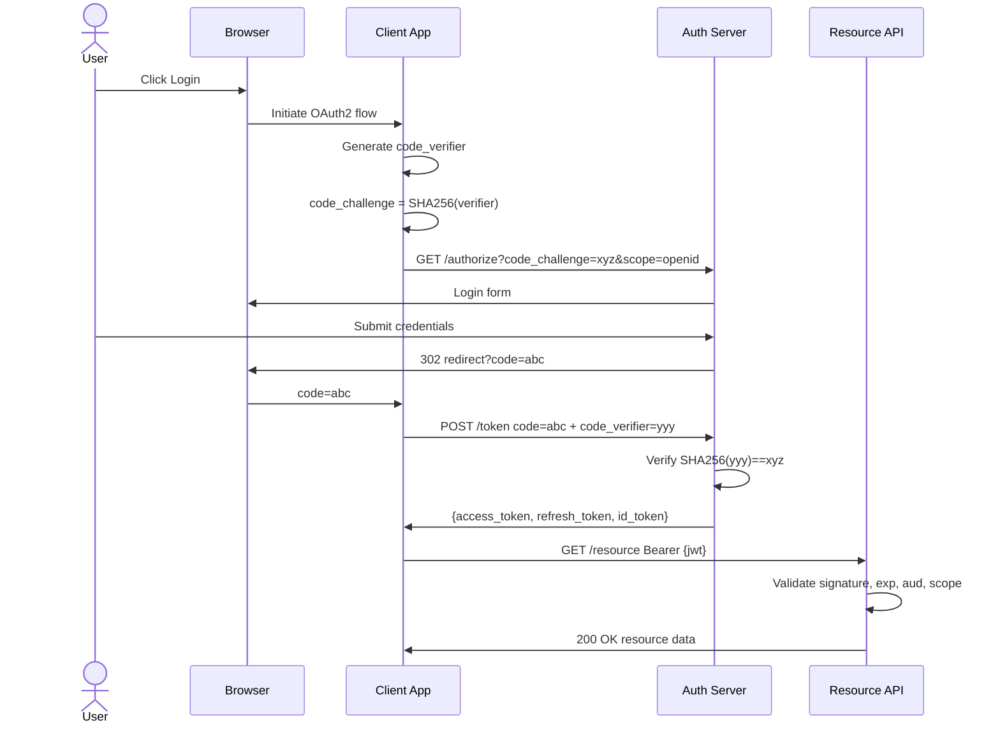

# OAuth2 and JWT Authentication Internals

---

### 🎯 Model Answer

**30 seconds:**
> OAuth2 is an authorization framework that enables delegated access: a user grants an application permission to call an API on their behalf, without sharing their password. JWT (JSON Web Token) is the token format OAuth2 commonly uses. The key mechanism: the OAuth2 server issues a signed JWT containing the user's identity and permissions. APIs validate the JWT cryptographically without calling the OAuth2 server on every request.

**3 minutes:**
> OAuth2 solves a fundamental problem: how does a third-party application (Slack) access user data from another service (Google Calendar) without the user giving Slack their Google password? OAuth2's answer: the user grants consent via Google's authorization server, which issues a token to Slack. Slack presents the token to Google's API. Google validates the token without knowing Slack's code. The four OAuth2 flows address different client types: Authorization code flow (for web apps): redirects the user to the authorization server, returns an auth code, the server exchanges the code for tokens. Never exposes tokens to the browser. Authorization code + PKCE (for mobile/SPA): same as above but without a client secret (public clients can't keep secrets). Code verifier prevents auth code interception. Client credentials flow (for server-to-server): no user interaction. The application authenticates directly with its client_id and client_secret to get an access token. Resource owner password flow: legacy, the client collects the username/password directly. Deprecated for most cases. JWT internals: three Base64-encoded parts separated by dots. Header: `{"alg": "RS256", "typ": "JWT"}`. Payload: `{"sub": "user-123", "iss": "https://auth.example.com", "aud": "https://api.example.com", "exp": 1716912000, "iat": 1716908400, "scope": "read:orders write:orders"}`. Signature: `RSASHA256(base64Header + "." + base64Payload, privateKey)`. The API validates the signature using the authorization server's public key (fetched from the JWKS endpoint at `/.well-known/jwks.json`). Valid signature + unexpired `exp` + correct `aud` = trusted token.

**Blank Mind Recovery:**
**(1) Restate:** "OAuth2 - delegated authorization. JWT - the token format. Together they enable secure third-party API access."
**(2) First principles:** "How does App A prove to API B that User C authorized this access, without App A having User C's password?"
**(3) Bridge:** "Like a hotel key card (JWT). The hotel front desk (OAuth2 server) issues it. The hotel room door reader (API) validates it. The front desk doesn't need to be consulted every time you open the door - the card is self-validating."

---

### 📘 Concept Explanation

**What it is:**
OAuth2 is an authorization framework (RFC 6749) that allows resource owners to grant third-party applications access to their resources without sharing credentials. JWT (RFC 7519) is a token format commonly used as OAuth2 access tokens - self-contained, cryptographically signed, and carrying authorization claims.

**The problem it solves:**
Pre-OAuth2: Slack asks for your Google password to access your calendar. Slack now has your Google password forever, even if you revoke Slack's access. Post-OAuth2: You authorize Slack via Google's consent screen. Google issues a scoped token to Slack. Slack calls Google Calendar API with the token. You can revoke Slack's access without changing your password.

**How it works:**
```
OAuth2 Authorization Code Flow:

User  Browser   Client App   Auth Server  Resource API
 |       |           |            |            |
 | access |           |            |            |
 |------->|           |            |            |
 |        | redirect to Auth Server              |
 |        |---------> GET /authorize?            |
 |        |           client_id=app              |
 |        |           redirect_uri=callback      |
 |        |           scope=read:calendar        |
 |        |           code_challenge=xxx (PKCE)  |
 |        |           state=random               |
 |        |                   |                  |
 |        | consent screen    |                  |
 |<---------------------------------------       |
 | approve|           |            |             |
 |------->|           |            |             |
 |        |           | callback with code       |
 |        |           |<---------302-------------|
 |        |           | POST /token              |
 |        |           | code=abc123              |
 |        |           | code_verifier=yyy (PKCE) |
 |        |           |----------->|             |
 |        |           | {access_token: JWT,      |
 |        |           |  refresh_token: rt123,   |
 |        |           |  expires_in: 3600}       |
 |        |           |<-----------|             |
 |        |           |            |             |
 |        |           | GET /calendar/events     |
 |        |           | Authorization: Bearer JWT|
 |        |           |------------------------->|
 |        |           |            | validate JWT|
 |        |           |            | check scope  |
 |        |           | 200 OK events|           |
 |        |           |<------------------------|
```

**The key insight:**
JWT validation is LOCAL. The API server validates the JWT signature using the OAuth2 server's public key - no network call to the OAuth2 server per request. The public key is fetched once from `/.well-known/jwks.json` and cached. This is what makes JWTs scalable: token validation is a local CPU operation (milliseconds), not a network call (tens of milliseconds).

**When to use it:**
Third-party access delegation (OAuth2 authorization code). Service-to-service authentication without users (client credentials). User-facing APIs where you delegate authentication to an IDP. Any API that needs to interoperate with the OAuth2 ecosystem.

**When NOT to use it:**
Simple internal microservices authentication where mTLS is simpler. APIs where the overhead of the OAuth2 flow is unjustified (simple API keys are more appropriate for developer APIs without delegation requirements).

**Alternatives:**
- mTLS: certificate-based authentication. Stronger revocation (CRL/OCSP) but more operational complexity.
- SAML: XML-based standard for enterprise SSO. More complex than OAuth2/OIDC but dominant in enterprise environments.
- HMAC-based request signing (AWS Signature v4): signs the entire request, not just the identity. Prevents tampering and replay.

**First-principles derivation:**
Authentication delegation requires: the user's consent to share data, a grant issued by the resource owner (user) to the third party, a mechanism for the third party to prove the grant to the API, and a way to revoke the grant independently. OAuth2 addresses all four. JWT as the grant format adds: self-contained claims (no lookup), cryptographic integrity (signature), and time-limited validity (exp claim). The combination achieves authentication delegation at scale without requiring the authorization server to be consulted on every API call.

---

### 💻 Code Example

```java
// Spring Security OAuth2 Resource Server config

@Configuration
@EnableWebSecurity
public class OAuth2ResourceServerConfig {

  // JwtDecoder: validates JWT signatures + claims
  @Bean
  public JwtDecoder jwtDecoder() {
    // Fetch public keys from JWKS endpoint
    // Keys are cached with auto-rotation
    return JwtDecoders.fromIssuerLocation(
        "https://auth.example.com");
    // This fetches:
    // https://auth.example.com/.well-known/
    //   openid-configuration
    // Then fetches JWKS from the jwks_uri
  }

  @Bean
  public SecurityFilterChain securityFilterChain(
      HttpSecurity http) throws Exception {
    return http
        .sessionManagement(s ->
            s.sessionCreationPolicy(
                SessionCreationPolicy.STATELESS))
        .oauth2ResourceServer(oauth2 ->
            oauth2.jwt(jwt -> jwt
                .decoder(jwtDecoder())
                // Custom JWT claims validator
                .jwtAuthenticationConverter(
                    jwtAuthConverter())))
        .authorizeHttpRequests(auth -> auth
            .requestMatchers("/public/**")
                .permitAll()
            // Require specific scope
            .requestMatchers(
                HttpMethod.GET, "/orders/**")
                .hasAuthority("SCOPE_read:orders")
            .requestMatchers(
                HttpMethod.POST, "/orders")
                .hasAuthority("SCOPE_write:orders")
            .anyRequest().authenticated())
        .build();
  }

  private JwtAuthenticationConverter
      jwtAuthConverter() {
    JwtGrantedAuthoritiesConverter converter =
        new JwtGrantedAuthoritiesConverter();
    // Map 'scope' claim -> SCOPE_ prefix
    converter.setAuthorityPrefix("SCOPE_");
    converter.setAuthoritiesClaimName("scope");

    JwtAuthenticationConverter jwtConverter =
        new JwtAuthenticationConverter();
    jwtConverter
        .setJwtGrantedAuthoritiesConverter(
            converter);
    return jwtConverter;
  }
}

// Client credentials flow: service-to-service
@Configuration
public class OAuth2ClientConfig {

  @Bean
  public WebClient ordersApiClient(
      OAuth2AuthorizedClientManager manager) {
    // WebClient with automatic token management
    // Fetches and caches client credentials token
    ServerOAuth2AuthorizedClientExchangeFilterFunction
        oauth2 =
        new ServerOAuth2AuthorizedClientExchange
            FilterFunction(manager);
    return WebClient.builder()
        .filter(oauth2)
        .baseUrl("https://orders-api.internal")
        .build();
  }
}

// Service A calling Service B with auto-token
public class OrderServiceClient {

  public List<Order> getOrders(String userId) {
    // Spring OAuth2 client automatically:
    // 1. Checks if cached token is valid
    // 2. If expired: fetches new token
    // 3. Adds Authorization: Bearer {token}
    return webClient.get()
        .uri("/orders?userId={id}", userId)
        .attributes(clientRegistrationId(
            "orders-service"))
        .retrieve()
        .bodyToFlux(Order.class)
        .collectList()
        .block();
  }
}
```

> **Code walkthrough:** Three components: (1) `JwtDecoder` configured with the issuer URL. Spring Security fetches the OIDC discovery document, finds the JWKS endpoint, fetches public keys, and caches them. Key rotation is automatic (re-fetches on validation failure). (2) `SecurityFilterChain` that validates JWT scopes using `hasAuthority("SCOPE_read:orders")`. Spring Security maps the `scope` claim to Spring authorities with the SCOPE_ prefix. (3) Client credentials pattern: `WebClient` with `OAuth2AuthorizedClientExchangeFilterFunction` handles token fetching and caching automatically. Service A never manually manages tokens - Spring handles the fetch, caching, and refresh lifecycle.

---

### 🎓 Answers by Seniority

**Junior / Mid:** "OAuth2 is for authorization - it lets users grant applications access to their data. The authorization code flow is for web apps: user logs in via the provider, the app gets an authorization code, exchanges it for tokens. JWTs are the tokens - signed JSON containing the user's identity and permissions. The API validates the JWT signature using the OAuth2 provider's public keys."

**Senior / Staff:** "OAuth2 internals I care about in production: (1) PKCE (Proof Key for Code Exchange) is non-negotiable for public clients (mobile, SPA). Without PKCE, an authorization code intercepted by a malicious app (on mobile, another app can intercept the deep link redirect) can be exchanged for tokens. PKCE's code_verifier/code_challenge makes the code useless without the verifier. (2) JWT audience validation is critical. The JWT's `aud` claim must match your API's identifier. Without audience validation: a JWT issued for API A is also valid at API B (if B doesn't validate aud). An attacker who gets a JWT for a low-privilege API can replay it to a high-privilege API. (3) JWKS key rotation: the auth server rotates its signing keys periodically. Cache the JWKS with a short TTL (1 hour) and refresh on validation failure. Don't hardcode public keys. Spring Security does this correctly. (4) Token revocation: OAuth2 access tokens (JWTs) cannot be revoked without a blacklist. The only clean solution is short-lived access tokens (15 min) + revocable refresh tokens (revoked on logout, stored server-side). When the access token expires, the client uses the refresh token. On revocation: delete the refresh token from the server. The client's next refresh attempt fails, forcing re-authentication."

---

### ⚠️ Common Misconceptions

**Misconception:** "OAuth2 is an authentication protocol."
Reality: OAuth2 is an AUTHORIZATION framework. It was designed to grant applications permission to access resources on behalf of a user - not to verify who the user is. Authentication was bolted on later via OpenID Connect (OIDC), which adds an ID token (separate from the access token) that contains user identity information (`sub`, `email`, `name` claims). The practical consequence: if you use OAuth2 access tokens to authenticate users (check who the user is), you're abusing the protocol. Access tokens are opaque strings from the OAuth2 spec's perspective - they're for the resource server to validate, not for extracting user identity. For user identity: use the OIDC ID token (JWT with specific claims: `sub`, `iss`, `aud`, `exp`, `iat`). The `sub` (subject) claim in the ID token is the reliable user identifier. Don't use `email` as the user identifier - email addresses can change and may not be unique across identity providers. Use the opaque `sub` claim with the `iss` (issuer) prefix: `google|123456789`.

---

### 🚨 Failure Modes and Diagnosis

**Failure: JWT tokens fail validation after OAuth2 server key rotation**

Symptoms: After a planned maintenance window, API authentication fails for ALL users simultaneously. JWT validation throws `JwtValidationException: Unable to find key for kid header`. All requests return 401 Unauthorized. The issue resolves itself after 1 hour.

Root cause: The OAuth2 server rotated its signing key. The API server cached the old public key. All new JWTs are signed with the new key. The API tries to validate with the old cached key and fails. The cache TTL is 1 hour, so old keys are served for up to 1 hour after rotation.

Diagnosis: Check the JWT header's `kid` (Key ID) field: `{"alg": "RS256", "kid": "key-2026-new"}`. Check the JWKS endpoint: `curl https://auth.example.com/.well-known/jwks.json` - is `key-2026-new` in the response? If yes: the JWKS has been updated but your cache hasn't been refreshed.

Fix: On JWT validation failure with "unable to find key": immediately retry with a fresh JWKS fetch (not cached). This is the standard behavior in Spring Security's `NimbusJwtDecoder`. Verify that your JwtDecoder is configured with `JwtDecoders.fromIssuerLocation()` (which handles key rotation) rather than a static public key. Coordinate with the OAuth2 server team: key rotation should be announced in advance, and new keys should be added to the JWKS before the old keys are removed (key overlap period). The overlap allows both old and new tokens to be valid simultaneously during the rotation.

---

### 🎯 Interview Deep-Dive

| Category | Time | Minimum |
|---|---|---|
| Definition | 2 min | 1 |
| Mechanism | 3 min | 2 |
| Security | 3 min | 3 |
| Comparison | 3 min | 2 |
| Debugging | 3 min | 2 |
| Design | 3 min | 2 |
| Trade-off | 2 min | 1 |
| Behavioral | 2 min | 1 |

#### Q1 - "What are the OAuth2 grant types and when do you use each?"
> "Four main OAuth2 grant types: (1) Authorization Code: for web applications that run on a server. The user authorizes via the browser, auth server returns a code to the server's redirect URI. Server exchanges code for tokens. The code is single-use and short-lived (minutes). Tokens are never exposed to the browser. (2) Authorization Code + PKCE: for mobile apps and SPAs where there's no server-side redirect URI and no safe way to store a client secret. The code_challenge proves the client who started the flow is the same one completing it. Prevents code interception attacks. Mandatory for public clients. (3) Client Credentials: for server-to-server (machine-to-machine). No user is involved. The service authenticates with client_id + client_secret and gets an access token. Used for microservices calling each other. (4) Device Authorization (Device Code): for devices with limited input (smart TV, IoT). The device displays a code. The user goes to a URL on another device, enters the code, and authorizes. The device polls for the token. The deprecated flows: Resource Owner Password (user sends username/password directly to the app - phishing risk, never use). Implicit flow (deprecated by OAuth2.1 - tokens returned in URL fragment, PKCE replaces it)."

*What separates good from great:* "Knowing that Implicit flow is deprecated in OAuth2.1 (replaced by Authorization Code + PKCE) shows current standards awareness. The Device Authorization flow for IoT/TV shows breadth of OAuth2 knowledge."

---

#### Q2 - "Explain the JWT structure and what each part contains."
> "JWT structure: three Base64URL-encoded parts separated by dots: `header.payload.signature`. Header: `{alg: 'RS256', typ: 'JWT', kid: 'key-id-2026'}`. `alg` is the signing algorithm. `RS256` is RSA-SHA256 (asymmetric - auth server signs with private key, APIs verify with public key). `HS256` is HMAC-SHA256 (symmetric - same secret for sign and verify). `kid` is the Key ID - tells the verifier which public key to use (important when the auth server has multiple active keys). Payload (claims): Standard claims: `iss` (issuer - who issued the token), `sub` (subject - user ID), `aud` (audience - intended recipient), `exp` (expiry Unix timestamp), `iat` (issued at), `jti` (JWT ID - unique ID for this token). Scope claims: `scope: 'read:orders write:orders'`. Custom claims: `tenantId: 'tenant-abc'`, `roles: ['admin', 'user']`. Signature: `Base64URL(RS256(base64Header + '.' + base64Payload, privateKey))`. The signature binds the header and payload together. If either is modified: signature validation fails. Security reminder: the payload is Base64URL-encoded, NOT encrypted. Anyone with the JWT can decode the payload. Never put sensitive data (passwords, PII) in JWT claims."

*What separates good from great:* "The `kid` header explanation (which public key to use during rotation when multiple keys are active simultaneously) and the security reminder about Base64 != encryption are the production JWT implementation details."

---

#### Q3 - "How does JWT signature validation work and what can go wrong?"
> "JWT signature validation: (1) Decode the JWT header, extract `alg` and `kid`. (2) Fetch the public key matching `kid` from the JWKS cache (or JWKS endpoint). (3) Verify: `computedSignature = RS256(header + '.' + payload, publicKey)`. If `computedSignature == signature in JWT`: signature is valid. (4) Validate claims: `exp` > now (not expired). `iss` matches expected issuer. `aud` contains your API's identifier. What can go wrong: (1) Algorithm confusion attack: an attacker changes the `alg` header to `HS256` and signs the JWT with the public key (which is public, so attacker has it). A vulnerable library that accepts 'none' or uses the header's alg for verification (instead of requiring a specific alg) will validate this as 'signed with HMAC using the server's known public key.' Defense: always specify the accepted algorithm explicitly. Never accept 'none'. (2) Missing audience validation: the JWT is valid for another service. Attacker replays it to your service. Defense: always validate `aud` matches your API's identifier. (3) Expired key: the `kid` in the JWT doesn't match any key in the JWKS. Key rotation without proper overlap. Defense: on `kid not found` error, refresh JWKS cache immediately before failing. (4) Clock skew: JWT `exp` is slightly in the past but the token is actually valid (server clocks not synchronized). Defense: allow 30-60 second clock skew tolerance."

*What separates good from great:* "The algorithm confusion attack (attacker changes alg to HS256 and uses the PUBLIC key to sign) is the specific CVE-2015-9235 vulnerability. Knowing the exact attack mechanism shows JWT security depth."

---

#### Q4 - "What is the difference between access tokens and refresh tokens?"
> "Access tokens and refresh tokens serve different purposes with different security properties. Access token: short-lived (15 minutes typical), used to call protected APIs. Includes permissions (scopes, roles). Self-validating (JWT signature). Sent with every API request in Authorization header. Compromise risk: if stolen, valid for up to 15 minutes. Refresh token: long-lived (days to weeks), used to obtain new access tokens when the current one expires. NOT sent to APIs. Only sent to the authorization server's token endpoint. Server-side stored (reference token, not JWT) - can be revoked. Issued once per user authentication. On each access token expiry: the client sends the refresh token to `POST /token` with `grant_type=refresh_token`. The auth server validates the refresh token (still active in DB), issues a new access token. Optionally issues a new refresh token (refresh token rotation). Refresh token rotation: each use of a refresh token issues a new one. The old one is immediately invalidated. If an attacker steals a refresh token and uses it: the original client's next use will fail (token mismatch). This alerts the server to a potential compromise. The server can invalidate both tokens. The security model: access tokens are stateless (any API validates locally) + short-lived (minimize exposure window). Refresh tokens are stateful (server-side) + long-lived (but revocable)."

*What separates good from great:* "Refresh token rotation (each use issues a new token, old immediately invalidated) is the security mechanism that detects refresh token theft. The detection mechanism (original client's use fails after attacker uses the stolen token) shows security depth."

---

#### Q5 - "How do you implement logout with OAuth2 + JWT?"
> "JWT logout challenge: access tokens are stateless, valid until expiry. 'Logout' from the user's perspective should immediately invalidate the session. Three approaches with trade-offs: (1) Invalidate refresh token only: on logout, delete the refresh token from the server. The access token is still valid for up to 15 minutes. User appears logged out (client deletes local tokens) but the access token would still work if an attacker had it. Acceptable if access tokens are short-lived (< 15 min). (2) Token blacklist: add the access token's `jti` (JWT ID) to a Redis blacklist with TTL = token expiry. API validates every token against the blacklist. Immediate revocation. Cost: one Redis lookup per API request. For high-traffic APIs: this adds latency. (3) Token versioning: store a `tokenVersion` field in the user record in the database. Include the version in the JWT. On logout: increment `tokenVersion`. API validates: `jwt.tokenVersion == user.currentTokenVersion`. Single DB read per request. Immediate revocation. Downside: one DB read per request (vs Redis lookup for blacklist). Also: OpenID Connect logout. OIDC defines a `logout_uri` endpoint. On logout: redirect user to the IDP's logout URL. IDP clears the session. For federated login (Google, GitHub as IDP): this is required. The user is still logged in at Google even if your app deletes its tokens."

*What separates good from great:* "The OIDC federated logout point (clearing the IDP session, not just local tokens) is the complete OAuth2 logout implementation. An app that deletes local tokens but leaves the user's Google session open doesn't actually log them out - a new OAuth2 flow would re-authenticate silently."

---

#### Q6 - "Design a token refresh strategy that minimizes user impact."
> "Transparent token refresh strategy for web/mobile apps: (1) Proactive refresh: don't wait for the access token to expire. Track the `exp` claim. When within 60 seconds of expiry, proactively refresh in the background. The user never experiences an expired token error. (2) Request interceptor: add a request interceptor that checks token expiry before every API call. If near expiry: refresh, then send the request with the new token. (3) Concurrent refresh handling: if multiple requests are made simultaneously when the token is about to expire, only one should trigger the refresh. Others should queue and use the new token when it's ready. Implement a refresh mutex: only one refresh at a time. Queued requests get the new token. (4) Refresh failure handling: if the refresh fails (network error): retry with exponential backoff (3 attempts). If the refresh token is rejected (revoked): redirect to login. Clear all stored tokens. (5) Sliding session: re-issue the refresh token on each use (refresh token rotation). The session stays alive as long as the user is active. If idle for longer than refresh token expiry: they must log in again. This is the 'keep me logged in' feature. Short refresh token TTL (1 day) for security. Long TTL (30 days) with sliding expiry for user convenience. The implementation: `last_used` timestamp on the refresh token. If `now - last_used < 30 days`: allow use and issue new token. If `now - last_used > 30 days`: reject, force re-authentication."

*What separates good from great:* "The concurrent refresh handling (mutex to prevent multiple simultaneous refresh calls) and the sliding session via refresh token rotation with last_used timestamp are the production implementation details for seamless session management."

---

#### Q7 - "How does PKCE protect OAuth2 flows for mobile applications?"
> "PKCE (Proof Key for Code Exchange) protects the authorization code flow when the client cannot safely store a client secret. Mobile apps: the client secret would be in the app binary, extractable by decompilation. SPAs: the client secret would be in JavaScript source code, visible to anyone. Without a secret, the standard auth code flow is vulnerable: the authorization code is delivered via a redirect URI (deep link on mobile). A malicious app can register the same deep link URL scheme and intercept the redirect. PKCE solves this: before starting the flow, the client generates a random string: `code_verifier = random_string(32)`. The client computes: `code_challenge = BASE64URL(SHA256(code_verifier))`. The authorization request includes `code_challenge`. The auth server stores the challenge. When exchanging the code for tokens: the client sends `code_verifier`. The auth server verifies: `SHA256(code_verifier) == stored code_challenge`. If an attacker intercepted the code but not the code_verifier: they can't exchange the code for tokens. The math: SHA256 is one-way. Knowing the challenge (in the authorization request, observable) doesn't reveal the verifier. Knowing the verifier is only possible for the legitimate client who generated it. PKCE makes the authorization code exchange non-replayable without the original verifier."

*What separates good from great:* "Explaining why `SHA256(code_verifier) == stored code_challenge` prevents the code interception attack (attacker saw the challenge but not the verifier, and SHA256 is one-way) shows the cryptographic reasoning."

---

#### Q8 - "What JWT claims are mandatory to validate and why?"
> "Mandatory JWT claim validations with security rationale: (1) `exp` (expiry): ALWAYS validate. An expired token is invalid. Missing this check: stolen tokens are valid forever. (2) `iss` (issuer): ALWAYS validate. Ensures the token was issued by your trusted authorization server. Missing: a token issued by a malicious server is accepted if it has the correct structure. (3) `aud` (audience): ALWAYS validate. Ensures the token was issued for YOUR service. Missing: token meant for Service A is accepted by Service B (horizontal privilege escalation). (4) `nbf` (not before): validate if present. The token should not be used before this time. Useful for tokens issued in advance. (5) `jti` (JWT ID): validate against blacklist if you implement token revocation. Not always required. Optional but valuable claims to validate: `scope` or `roles`: check the token has permission for the requested action. A valid token doesn't mean permission for everything. `tenantId` or `orgId` for multi-tenant systems: validate the token's tenant matches the resource's tenant. The common mistake: validating signature + expiry but missing `aud`. An ID token issued for `client_id: my-frontend` is also valid at the API (same issuer, same signature algorithm) if `aud` is not checked. Use access tokens for APIs, not ID tokens. Spring Security validates these by default when configured with `JwtDecoders.fromIssuerLocation()`."

*What separates good from great:* "The specific horizontal privilege escalation scenario (token for Service A used at Service B due to missing `aud` validation) and the ID token vs access token confusion (both are JWTs from the same issuer but for different audiences) are the practical security pitfalls."

---

#### Q9 - "How do you handle OAuth2 in a microservices architecture?"
> "Microservices OAuth2 patterns: (1) API Gateway JWT validation: the gateway validates the JWT before forwarding to services. Services receive the validated claims in forwarded headers (X-User-Id, X-Roles). Services trust the gateway. Gateway must be the only entry point (services not directly accessible). (2) Service-level JWT validation: each service validates the JWT independently. More resilient (no gateway single point of failure for auth). More overhead (each service fetches JWKS, validates signature). Spring Security's `oauth2ResourceServer` makes this straightforward. (3) Service-to-service: OAuth2 client credentials flow. Service A gets a service token for Service B. Service B validates the token's `sub` (which is a service ID) and `scope`. (4) Token propagation vs token exchange: propagation passes the user's access token from service to service. All downstream calls run with the user's identity. Exchange: the service exchanges the user token for a new service-specific token (OAuth2 Token Exchange, RFC 8693). Exchange adds scope downgrading (intermediate service can't use the full user permissions). The security design: avoid propagating user tokens to internal services. Use service tokens for internal calls. The user token is for the public-facing API. Internal tokens have narrow scopes and short lifetimes."

*What separates good from great:* "OAuth2 Token Exchange (RFC 8693) for scoped internal tokens (vs propagating the full user token) is the security-forward microservices approach. Most candidates know token propagation but not the token exchange pattern."

---

#### Q10 - "What is OpenID Connect and how does it extend OAuth2?"
> "OpenID Connect (OIDC) is an authentication layer built on OAuth2. OAuth2 is authorization (permission to access resources). OIDC adds authentication (who the user is). OIDC adds: ID Token: a JWT with specific standard claims about the user (`sub`, `name`, `email`, `picture`, `email_verified`). Separate from the access token. Returned alongside the access token. Userinfo Endpoint: `/userinfo` - the resource server can call this with the access token to get current user info (the ID token snapshot may be stale if user changed email). Discovery Document: `/.well-known/openid-configuration` - machine-readable list of the IDP's endpoints, supported algorithms, and claims. Standard scopes: `openid` scope triggers OIDC mode and gets an ID token. `profile` scope adds name/picture claims. `email` scope adds email claims. The relationship: OAuth2 authorization code flow + `openid` scope = OpenID Connect. All OIDC flows are OAuth2 flows with `openid` scope added. Spring Security OIDC client handles the complete flow: redirect to IDP, exchange code for tokens, validate ID token, create Spring Security authentication from ID token claims. The practical use: use OIDC for user authentication (ID token for who the user is). Use OAuth2 access token for API authorization (what the user can do)."

*What separates good from great:* "The relationship between OAuth2 and OIDC (OIDC = OAuth2 + openid scope, not a separate protocol) and the purpose distinction (ID token for authentication, access token for authorization) is the complete answer that separates deep OAuth2 knowledge from surface-level use."

---

#### Q11 - "How would you migrate a legacy session-based API to OAuth2/JWT?"
> "Migration strategy: strangler fig pattern to avoid big bang. Phase 1 - Add JWT support without removing sessions: modify the auth middleware to accept either a session cookie OR a JWT Bearer token. Existing session-based clients continue working. New clients can use JWT. Run both in parallel indefinitely - no forced migration. Phase 2 - Integrate OAuth2 IDP: set up the authorization server (Keycloak, Okta, or Auth0). Configure existing user accounts in the IDP (import or link). The JWT path now goes through the IDP. Phase 3 - New clients use JWT: mobile apps, new third-party integrations use JWT only. The session path remains for legacy web clients. Phase 4 - Migrate web clients to OIDC: modernize the web app to use OIDC login. Sessions are now managed by the IDP (or can be eliminated entirely). Phase 5 - Sunset sessions: deprecate the session-based login endpoint. Remove session management code. The key constraint: existing user credentials must be migrated. Options: forced password reset (disruptive), hash migration (store old hash, on login validate old hash, re-hash with new algorithm, switch to IDP), or federation (keep old login, IDP federates to legacy auth). Don't break users who are already logged in during migration - ensure session continuity."

*What separates good from great:* "The strangler fig pattern (run both auth mechanisms in parallel, migrate gradually) and the hash migration strategy (validate old hash, re-hash on first login) are the production migration approaches that avoid forcing all users to re-authenticate simultaneously."

---

#### Q12 - "Design the authentication system for a multi-tenant SaaS REST API."
> "Multi-tenant SaaS authentication requirements: tenant isolation (Tenant A's users can't access Tenant B's data), per-tenant customization (some tenants use SSO, others use username/password), and centralized administration (platform admin vs tenant admin vs regular user). Architecture: Single authorization server (Keycloak/Okta) with tenant-specific realms or a single realm with tenant claims. JWT claims include: `sub` (user ID), `tenantId` (tenant identifier), `roles: ['admin', 'user']` (within-tenant roles), `platformRole: 'platform-admin'` (optional). The `tenantId` claim is the critical security check: every API handler validates that the requested resource's `tenantId` matches the JWT's `tenantId`. Row-level security in the database: `WHERE tenantId = ? AND id = ?`. Never rely on the URL or request body for tenant identification - always use the authenticated JWT's tenantId claim. Per-tenant SSO: tenants can configure their own SAML/OIDC federation in the authorization server. The platform's authorization server federates to the tenant's corporate IDP. Users log in with their corporate credentials. The platform JWT still contains `tenantId` after the federation. Tenant admin delegation: platform admin can issue tokens with specific tenant context. The `actAs` or `impersonate` scope allows platforms admins to act as any tenant for support purposes - with full audit logging."

*What separates good from great:* "The `tenantId` claim in JWT + row-level security enforcement (`WHERE tenantId = ?`) is the complete multi-tenant security model. The per-tenant SSO federation (the platform's auth server federates to the tenant's SAML/OIDC IDP) is the enterprise SaaS requirement."

---

### ⚖️ Comparison Table

| Grant Type | Client Type | User Interaction | Client Secret | PKCE |
|---|---|---|---|---|
| Authorization Code | Server-side app | Yes (browser redirect) | Required | Optional (recommended) |
| Auth Code + PKCE | Mobile / SPA | Yes (browser redirect) | No | Required |
| Client Credentials | Service-to-service | No | Required | No |
| Device Authorization | IoT / smart TV | Yes (different device) | Optional | No |

**The deciding factor:** Use Auth Code + PKCE for any public client (mobile, SPA). Use Client Credentials for machine-to-machine. Never use Implicit (deprecated) or Password grant (security risk) for new implementations.

---

### 🏛️ System Design

**Design a complete OAuth2 authentication system for a multi-tier SaaS API**

**Requirements:** Support three client types (web app, mobile app, third-party API clients). Multi-tenant with per-tenant SSO. Token revocation within 60 seconds. 100K req/s at peak.

**Architecture:**

```
[Clients]                [Platform]
 Web App   ----OIDC---> [Auth Server]
 Mobile    ----PKCE---> [Keycloak/Okta]
 3rd Party --CC Flow--> [               ]
                        [   |           ]
                        [   | JWT       ]
                        [   |           ]
              [API Gateway]             
              [JWT validation]          
              [Rate limiting ]          
                    |                   
         [Microservices]                
         [Validate aud+sub+tenantId]    
                    |                   
         [Redis: token blacklist]       
         [DB: refresh tokens]          
         [DB: user data/tenant data]    
```

**Key design decisions:**

**Token lifetimes:** Access token: 15 minutes (short enough to limit exposure, long enough to minimize refresh overhead). Refresh token: 7 days with sliding expiry (stays alive with active use). Refresh token rotation on every use. Service tokens (client credentials): 1 hour.

**Revocation architecture:** Refresh tokens stored in database (revocable). Access tokens: JWT blacklist in Redis with TTL = token expiry. Redis hash per user: `{jti: expiry_timestamp}`. On every request: `EXISTS blacklist:{jti}`. If exists: reject. Cleanup: tokens auto-expire from Redis when TTL expires.

**JWKS and key rotation:** Signing keys rotated every 90 days. New key added to JWKS before old key removed (7-day overlap). Old JWTs (signed with old key) remain valid if within exp. API servers cache JWKS with 1-hour TTL, refresh on kid-not-found error.

**Tenant SSO:** Keycloak Identity Brokering: per-tenant SAML/OIDC IDP configured. User authenticates with corporate IDP. Keycloak issues platform JWT with tenantId claim. Platform never sees the corporate credentials.

**Scaling:** Auth server: horizontal scaling behind load balancer. Stateless (JWTs). Session affinity NOT needed. Redis cluster: rate limiting + token blacklist. Consistent hashing. DB: refresh tokens + tenant configs. Read replicas for validation queries. API Gateway: validates JWT locally (no IDP call per request). JWKS cached in-memory per instance.

---

### 📊 Diagram

```
OAuth2 Authorization Code + PKCE Flow:

User   Browser  Client  AuthServer  ResourceAPI
 |       |        |          |           |
 |click  |        |          |           |
 |------>|        |          |           |
 |       | generate code_verifier        |
 |       | code_challenge=SHA256(verifier)
 |       | redirect to /authorize        |
 |       |------->|          |           |
 |       |        | GET /authorize       |
 |       |        | ?client_id=...       |
 |       |        | &code_challenge=xyz  |
 |       |        | &state=random        |
 |       |        |--------->|           |
 |       | login page        |           |
 |       |<-----------------------------------
 |       | credentials       |           |
 |       |-------------------->          |
 |       | 302 -> callback?code=abc      |
 |       |<---------302------|           |
 |       |        | code=abc |           |
 |       |------->|          |           |
 |       |        | POST /token          |
 |       |        | code=abc             |
 |       |        | code_verifier=yyy    |
 |       |        |--------->|           |
 |       |        |          | verify:   |
 |       |        |          | SHA256(yyy)
 |       |        |          | == xyz?   |
 |       |        | {access_token: JWT,  |
 |       |        |  refresh_token: rt}  |
 |       |        |<---------|           |
 |       |        | GET /resource        |
 |       |        | Authorization: JWT   |
 |       |        |--------------------->|
 |       |        |          | validate JWT
 |       |        |          | check aud/scope
 |       |        | 200 OK   |           |
 |       |        |<---------------------|
```



> **Diagram walkthrough:** The flow shows PKCE protection: the code_challenge (SHA256 of the verifier) is sent with the authorization request. Only the legitimate client who generated the verifier can complete the token exchange. An attacker who intercepts the authorization code cannot exchange it without the code_verifier. The Auth Server never receives the code_verifier directly - only the code_challenge at the start, and verifier at the end. The SHA256 verification proves they match without exposing the verifier in the authorization request.

