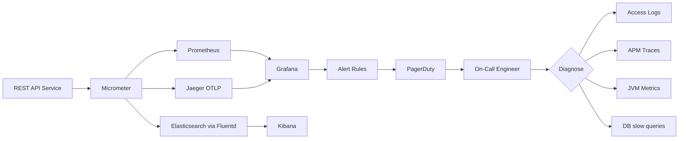

# REST API Production Diagnostics

---

### 🎯 Model Answer

**30 seconds:**
> Diagnosing REST API issues in production requires systematic investigation across four layers: the network (timeouts, DNS, TLS), the infrastructure (load balancer health, CDN cache), the application (error rates, latency percentiles, thread pools), and the dependencies (database, downstream services). The key diagnostic tools are: access logs (what happened), metrics (when and how much), traces (where time was spent), and application logs (why it failed).

**3 minutes:**
> Production API diagnosis starts with the symptom type: latency spike, error rate increase, or availability loss. Each has different investigation paths. For latency: check p99 vs p50. If p99 is high but p50 is normal: a subset of requests is slow - specific endpoints, specific user segments, or specific backend queries. Check database slow query logs, thread pool saturation, external API timeouts. If p50 is high: something is globally wrong - check CPU, memory, GC pause times, thread pool exhaustion. For error rates: filter by error type. 5xx errors are server-side problems. 4xx spikes indicate client-side changes. 429 spikes indicate rate limiting. Specific 502/503 indicate downstream failures. For availability: check if health endpoints respond. The production toolset: grep and awk for access log analysis. curl -v for real-time testing. netstat/ss for connection state. APM tools for distributed traces. jstack for JVM thread state. explain analyze for database query analysis.

**Blank Mind Recovery:**
**(1) Restate:** "REST API production diagnosis - finding root cause of API problems."
**(2) First principles:** "What is the symptom? What layer is it in? What changed recently?"
**(3) Bridge:** "Like medical diagnosis: symptoms tell you which organ to check. Tests confirm. Treatment fixes root cause."

---

### 📘 Concept Explanation

**What it is:**
REST API production diagnostics is the systematic process of identifying, isolating, and resolving production API issues using logs, metrics, traces, and direct observation tools.

**The problem it solves:**
Production APIs fail in ways not reproducible in development. Load, concurrency, network conditions, and dependency behavior differ. Diagnosing production issues requires production tools and systematic investigation.

**How it works:**
```
Diagnostic Decision Tree:

Symptom: API degraded
          |
   +------+-------+
   |              |
Latency        Error Rate
increased       increased
   |              |
 Is it all    Filter by
 endpoints?   error code
   |              |
  Yes/No      5xx  4xx  429

Diagnostic Commands:
# Access log error rate
tail -5000 /var/log/nginx/access.log |
  awk '{print $9}' | sort | uniq -c

# Slow requests > 5s
awk '$NF > 5 {print $0}' access.log | tail -100

# JVM thread dump
jstack {pid}

# DB connection states
ss -tn | grep ESTABLISHED | wc -l

# DB slow queries (PostgreSQL)
SELECT query, calls, mean_exec_time
FROM pg_stat_statements
ORDER BY mean_exec_time DESC LIMIT 10;
```

**The key insight:**
The fastest path to root cause is correlating multiple signals: a latency spike at 14:32 in metrics, a specific endpoint in access logs, a slow database query at 14:32, and a missing index from EXPLAIN ANALYZE. Each signal alone is insufficient. Together they form the complete picture.

**When to use it:**
Production incidents, performance regressions, post-incident review, capacity planning.

**First-principles derivation:**
Production systems have emergent failure modes that don't exist in isolation. Diagnosis requires observability (data about state), correlation (linking signals across time and services), and systematic elimination.

---

### 💻 Code Example

```java
// Production-ready API endpoint with observability

@RestController
@RequestMapping("/orders")
public class OrderController {

  private final MeterRegistry meterRegistry;
  private final Tracer tracer;

  @GetMapping("/{id}")
  public ResponseEntity<Order> getOrder(
      @PathVariable Long id,
      @RequestHeader(value = "X-Request-Id",
          required = false) String requestId) {

    Span span = tracer.nextSpan()
        .name("order.get")
        .tag("order.id", String.valueOf(id))
        .start();

    try (Tracer.SpanInScope ws =
        tracer.withSpan(span)) {

      Timer.Sample timer =
          Timer.start(meterRegistry);
      Order order = orderService.findById(id);

      timer.stop(
          Timer.builder("order.get.latency")
              .tag("status", "success")
              .register(meterRegistry));

      return ResponseEntity.ok()
          .header("X-Request-Id",
              requestId != null ? requestId
                  : UUID.randomUUID().toString())
          .body(order);

    } catch (Exception e) {
      span.tag("error", e.getMessage());
      meterRegistry.counter("order.get.errors",
          "type", e.getClass().getSimpleName())
          .increment();
      throw e;
    } finally {
      span.end();
    }
  }
}

// Slow request logging via AOP
@Aspect
@Component
public class DiagnosticLoggingAspect {

  @Around("@annotation(RequestMapping)")
  public Object logRequest(
      ProceedingJoinPoint pjp) throws Throwable {

    long start = System.currentTimeMillis();
    String traceId = MDC.get("traceId");

    try {
      Object result = pjp.proceed();
      long elapsed =
          System.currentTimeMillis() - start;

      if (elapsed > 1000) {
        log.warn("Slow: method={} elapsed={}ms"
            + " traceId={}",
            pjp.getSignature().getName(),
            elapsed, traceId);
      }
      return result;
    } catch (Exception e) {
      log.error("Failed: method={} error={}"
          + " traceId={}",
          pjp.getSignature().getName(),
          e.getMessage(), traceId);
      throw e;
    }
  }
}
```

> **Code walkthrough:** Two observability components: (1) The controller adds distributed tracing (span per request), latency metrics (Timer), and error counters. The X-Request-Id is echoed for client correlation. This covers the three pillars: traces, metrics, and structured logs via MDC. (2) The AOP aspect logs slow requests (> 1 second) with the traceId, enabling correlation between slow-request log entries and full distributed traces.

---

### 🎓 Answers by Seniority

**Junior / Mid:** "I diagnose API problems by checking application logs, access log status codes, and database slow queries. I use curl to test endpoints manually. For Spring Boot I use the Actuator health and metrics endpoints. I look at error rate and response time dashboards in the monitoring tool."

**Senior / Staff:** "Production API diagnosis is systematic. I start with the signal type: latency, errors, or availability. Each has a different runbook. For latency: APM traces show where time is spent. DB profiling identifies slow queries. Thread pool metrics show saturation. For errors: access log grep shows which endpoints and clients are failing. Application logs with traceId show the complete call chain. The tool I find most valuable: distributed traces with Micrometer + Jaeger. A single traceId links the frontend HTTP request through all microservices to the database query. Without it: correlating logs across N services manually is error-prone and slow. At staff level: observability infrastructure investment before incidents happen. A runbook requiring 10 manual commands takes 45 minutes under pressure. Automated diagnostics (anomaly detection, automatic trace sampling on errors) reduce MTTR from 45 minutes to 10."

---

### ⚠️ Common Misconceptions

**Misconception:** "Checking logs is sufficient for production diagnosis."
Reality: Logs are one of four observability signals. Logs tell you WHAT happened and WHAT errors occurred. They don't tell you: how often (metrics), how long (traces, latency percentiles), or where time was spent across services (distributed traces). The four observability pillars: (1) Metrics: aggregated request rate, error rate, latency percentiles, resource utilization. (2) Logs: discrete event records with context. (3) Traces: distributed request flow from entry through all services. (4) Health checks: binary or graded readiness. Effective production diagnosis requires all four. A 2,000 req/s API generates massive log volume. Without metrics aggregating error rates, you're looking for a needle in a haystack.

---

### 🚨 Failure Modes and Diagnosis

**Failure: Gradual API latency increase over 30 minutes then service failure**

Symptoms: API latency increases from p99=200ms to p99=5000ms over 30 minutes. Then the service stops responding entirely. Health check returns 503.

Root cause: Database connection pool exhaustion. Requests wait for a connection. The wait queue fills up. When the queue is full: new requests immediately fail. The gradual increase is the pool filling. The complete failure is when all connections are held and the queue overflows.

Diagnosis: (1) `ss -tn | grep ESTABLISHED` - count active DB connections. (2) Check `hikari.connections.active` metric - is it at max? (3) Check `hikari.connections.pending` - is there a non-zero pending count? (4) On the DB: `SELECT count(*), state FROM pg_stat_activity GROUP BY state` - are there many 'idle in transaction' connections? (5) Find long-running queries: `SELECT pid, now()-query_start, query FROM pg_stat_activity WHERE state='active' ORDER BY query_start`.

Fix: Cancel the blocking query: `SELECT pg_cancel_backend(pid)`. This frees connections immediately. Add `statement_timeout = '30s'` in PostgreSQL. Set `spring.datasource.hikari.connectionTimeout=30000`.

---

### 🎯 Interview Deep-Dive

| Category | Time | Minimum |
|---|---|---|
| Mechanism | 3 min | 2 |
| Debugging | 4 min | 3 |
| Design | 3 min | 2 |
| Scenario | 4 min | 2 |
| Trade-off | 2 min | 1 |
| Comparison | 2 min | 1 |
| Behavioral | 3 min | 2 |

#### Q1 - "Walk me through diagnosing a sudden increase in 5xx error rates."
> "5xx diagnosis checklist: (1) Isolate scope. All endpoints or specific ones? `grep '5[0-9][0-9]' access.log | awk '{print $7}' | sort | uniq -c | sort -rn`. Top affected endpoint tells you where to focus. (2) Check error type. 500: application exception. 502: bad gateway (app crashed or returned bad response). 503: service unavailable (overloaded or health check failing). 504: gateway timeout (app too slow). Each suggests different root causes. (3) Correlate with recent deployments. `git log --oneline --since='30 minutes ago'`. A 5xx spike immediately after deploy = deployment issue - rollback first, investigate later. (4) Check application logs for the exception. Filter for ERROR level in the time window. `OutOfMemoryError`: heap dump needed. `Connection refused`: downstream service is down. `Timeout`: downstream service is slow. (5) Check downstream health. `curl -v http://service-b/health`. `psql -c 'SELECT 1'`. (6) Check JVM health. `jstat -gcutil {pid} 1000 10`. If FullGC every 5 seconds: memory issue. (7) Rollback if deployment-correlated. Fastest MTTR is rollback while root cause investigation continues in parallel."

*What separates good from great:* "The 500/502/503/504 routing logic (each suggests a different failure location) and the rollback-first principle (fastest MTTR for deployment-caused 5xx) show a systematic on-call protocol."

---

#### Q2 - "How do you diagnose a latency spike affecting only some users?"
> "User-subset latency investigation: (1) Filter access logs for slow requests. `awk '$NF > 5 {print $0}' access.log`. What do slow requests have in common? Same user? Same IP? Same endpoint? Same request size? (2) Check if geographic. Latency from US is normal, EU is high - could be CDN routing issue routing EU requests to US origin. Check CDN regional logs. (3) Check user data volume. A user with 1M orders vs 100 orders - the same endpoint takes 10x longer. `EXPLAIN ANALYZE SELECT * FROM orders WHERE user_id = {slow_user_id}`. Missing index? Table scan instead of index seek? (4) Check time of day pattern. High-traffic periods cause connection pool pressure. Query performance degrades under concurrent load. (5) Check for database hot partition. If orders table is partitioned by date, the current month's partition takes all the write and read load. Recent-data queries are slower under high concurrency. (6) Check payload size correlation. Large request bodies take longer to parse. Check the access log's request_body_size field."

*What separates good from great:* "The user data volume correlation (1M orders vs 100 orders causing different query times) and the database hot partition issue connect application-level and database-level diagnosis."

---

#### Q3 - "Walk through diagnosing a database connection pool exhaustion issue."
> "Connection pool diagnosis: (1) Detect symptom. API response time increases gradually. 'Unable to acquire JDBC Connection' exceptions. HikariCP metric `hikari.connections.active` at max. `hikari.connections.pending` increasing. (2) Find long-running queries holding connections. `SELECT pid, now()-query_start AS duration, state, query FROM pg_stat_activity WHERE state='active' ORDER BY duration DESC LIMIT 20`. Queries running for minutes are holding connections; others can't get connections. (3) Find lock waits. `SELECT * FROM pg_locks l JOIN pg_stat_activity a ON l.pid = a.pid WHERE NOT granted`. Locked queries may also be blocking. (4) Immediate mitigation. Cancel the blocking query: `SELECT pg_cancel_backend({pid})`. This frees connections immediately. For stuck queries: `SELECT pg_terminate_backend({pid})`. (5) Root cause fix. `EXPLAIN ANALYZE {long_running_query}` - is it doing a sequential scan instead of index seek? Add missing index. Add query timeout: `SET statement_timeout = '30s'` per session, or global. (6) Pool sizing review. `maximumPoolSize` needs to match your application's concurrency. Rough guideline: `maximumPoolSize = (core_count * 2) + effective_spindle_count`. Too large: DB is overwhelmed. Too small: application waits unnecessarily."

*What separates good from great:* "The specific SQL for `pg_stat_activity` and `pg_locks` and the `pg_cancel_backend` command show real on-call PostgreSQL experience. The HikariPool sizing formula shows you've thought through the pool sizing problem systematically."

---

#### Q4 - "How do you use distributed tracing for microservices API diagnosis?"
> "Distributed tracing diagnostic process: (1) Get the traceId. User reports order creation failed at 14:32. Find their request in the API gateway logs using user ID. Get the traceId from the log entry. (2) Search in Jaeger for the traceId. The trace shows: API Gateway -> Order Service -> Inventory Service -> Payment Service. (3) Find the failing span. Payment Service span shows duration=30 seconds, status=error. Tag `error: 'Connection timeout to payment gateway'`. (4) Check span timing. Order Service called Payment Service at 14:32:05. Payment Service's external call ran from 14:32:05 to 14:32:35. External payment gateway was slow. (5) Check if it's a pattern. Is this a sustained failure or a spike? Count error spans from Payment Service in the last hour. (6) Check circuit breaker state. Is the circuit breaker to the payment gateway open? Are all payment requests now failing immediately (circuit open) or timing out (circuit closed)? (7) Correlate with external status page. Is the payment gateway reporting an incident? The resolution: enable the fallback path (queue the payment for async retry) rather than returning an error to the user."

*What separates good from great:* "The complete investigation path (traceId -> find failing span -> span timing -> external dependency identification -> circuit breaker state check) is the distributed tracing workflow."

---

#### Q5 - "How do you diagnose a memory leak in a REST API service?"
> "Memory leak diagnosis: (1) Detect symptom. JVM heap increases over time. GC runs more frequently. Eventually OutOfMemoryError. Metric: `jvm.memory.used` increasing without decreasing after GC cycles. (2) Take heap dumps at intervals. `jmap -dump:format=b,file=/tmp/heap1.hprof {pid}`. Take a second dump 30 minutes later. Compare. (3) Analyze with Eclipse MAT. Find the biggest retained object. `OQL: SELECT * FROM java.util.HashMap h WHERE h.size > 10000`. Large HashMaps that grow over time are typically the leak location. (4) Common leak sources in REST APIs: Static caches without eviction bounds (unbounded HashMap grows with every unique URL). HttpClient connection pools not closed properly. Event listeners registered but never deregistered. ThreadLocal variables in a thread pool not cleaned after each request (ThreadLocal values persist until the thread terminates - in a thread pool, threads never terminate). (5) Spring Boot specific: check if `@Scope('request')` beans are actually created per-request. Incorrect scope can hold request-scoped beans in application scope. (6) Fix. Replace unbounded caches with bounded Caffeine cache (`maximumSize`). Add `ThreadLocal.remove()` in a filter's finally block. Review all static fields for growing collections."

*What separates good from great:* "The ThreadLocal memory leak in thread pools (values persist for thread lifetime, in a pool that's effectively forever) is the subtle JVM leak that commonly affects Spring MVC REST applications."

---

#### Q6 - "How do you monitor REST API SLOs and implement alert rules?"
> "SLO/SLI framework: SLI (Service Level Indicator): measured value. Availability = successful_requests / total_requests. Latency SLI = p99 < 500ms. Error rate = 5xx_requests / total_requests. SLO: the target. 99.9% availability (43 min downtime/month). p99 < 500ms for 99% of time windows. Alert implementation: (1) Error budget burn rate alerts. Rather than alerting when availability drops below 99.9%, alert when the error budget is being consumed too fast. If 100% of the monthly error budget would be consumed in 2 hours at current burn rate: page immediately. If it would be consumed in 2 days: create a ticket. This avoids alert fatigue from brief spikes. (2) Prometheus error rate alert: `rate(http_requests_total{code=~'5.*'}[5m]) / rate(http_requests_total[5m]) > 0.01`. Alert when 5xx rate > 1% for 5 minutes. (3) Latency alert: `histogram_quantile(0.99, rate(http_request_duration_seconds_bucket[5m])) > 0.5`. Alert when p99 > 500ms for 5 minutes. (4) Symptom-based alerts only. Alert on user-visible symptoms (high error rate, high latency), not on causes (high CPU). CPU at 90% may not cause user impact. Error rate always does. The SLO review cadence: monthly review to determine if targets need adjustment."

*What separates good from great:* "Error budget burn rate alerting (the SRE practice from Google SRE book) and the symptom-based vs cause-based alert distinction reduce alert fatigue while catching real issues."

---

#### Q7 - "Walk me through investigating an intermittent 500 error."
> "Intermittent 500 investigation: (1) Increase log level without restart. `PUT /actuator/loggers/com.myapp.OrderService -d '{level:DEBUG}'` via Spring Actuator. Capture next occurrence. (2) Add detailed logging around suspected code. Correlate with the next 500 using traceId. (3) Check for race conditions. Intermittent errors often indicate: NullPointerException from lazy initialization in concurrent context, database deadlock (two transactions deadlocking intermittently), cache miss leading to a DB call that occasionally times out. (4) Check for resource exhaustion correlation. Is the 500 correlated with high traffic periods? Connection pool saturation at peak. Thread pool starvation under load. (5) Use load to reproduce. If suspecting a race condition: increase load on the endpoint to increase concurrency and trigger the race more frequently. Or add artificial delay at the suspected concurrent path. (6) Correlation analysis. `grep '500' access.log | awk '{print $4}' | sort` - time of day pattern? `grep '500' access.log | awk '{print $7}' | sort | uniq -c` - specific endpoint? Build a pattern before investigating code."

*What separates good from great:* "Spring Actuator dynamic log level change (without restart) and the correlation analysis before code investigation (build the pattern empirically first) show pragmatic production debugging."

---

#### Q8 - "How do you diagnose slow REST API responses when the database shows fast query times?"
> "Database is fast but API is slow: (1) Serialization cost. JSON serialization of large objects (1MB+ response) can take 100-500ms. Add timing around the serialization: `long s = System.nanoTime(); String json = mapper.writeValueAsString(resp); log.debug('Serialize: {}ms', (System.nanoTime()-s)/1_000_000)`. (2) Middleware overhead. Spring Security filter chain, CORS filter, logging interceptors each add time. Use Spring's request logging filter to measure per-filter overhead. (3) N+1 queries. The database shows each query is fast (5ms) but there are 100 queries per request (one per list item). Each query is fast but 100 total = 500ms. Use `spring.jpa.show-sql=true` temporarily to count queries. Fix with JOIN FETCH or batch loading. (4) External service calls in the critical path. Email verification, fraud check, address validation - even a 'fast' external service adds 50-200ms round-trip latency. Profile with distributed tracing. (5) Thread starvation. A request handler awaits an async operation that uses the same thread pool. The pool is full of waiting handlers - deadlock. Use a separate thread pool for blocking operations. (6) Network latency between services. 5ms per query * 20 queries across different availability zones = 100ms of pure network latency. Co-locate frequently communicating services."

*What separates good from great:* "The N+1 queries hidden behind fast individual query times and the thread starvation deadlock are the non-obvious slow API causes that aren't visible in database metrics."

---

#### Q9 - "How do you implement a production runbook for a REST API incident?"
> "Production runbook for API high error rate alert: Title: API Error Rate > 1% for 5 Minutes. Trigger: Prometheus alert, PagerDuty page. Impact: users experiencing failures. MTTR target: 15 minutes. Step 1 - Triage (2 min): check Grafana error rate dashboard. Is it all endpoints or specific? Check if recent deployment in last 30 min: `kubectl rollout history deployment/api-server`. Step 2 - Quick checks (3 min): `curl -v https://api.myapp.com/health`. `kubectl get pods -n api-prod`. Check downstream health: `curl -v http://db-service/health`. Step 3 - Mitigation (5 min): if deployment-correlated: `kubectl rollout undo deployment/api-server`. If OOM: `kubectl rollout restart deployment/api-server`. If downstream: enable circuit breaker fallback. Step 4 - Root cause (after mitigation): `kubectl logs -n api-prod -l app=api-server --since=30m | grep ERROR`. Step 5 - Escalate if not resolved in 15 min: page senior engineer + database team if DB-related. The runbook value: during a P1 incident under pressure, you execute mechanically. No decision fatigue. Pre-validated steps. The runbook is a living document - update it after every incident with what worked."

*What separates good from great:* "Time-boxing each step (2 min triage, 3 min quick checks, 5 min mitigation) and the specific kubectl commands show an actual production runbook. The note about updating the runbook after each incident shows continuous improvement culture."

---

#### Q10 - "How do you conduct a post-incident review for a REST API outage?"
> "Post-Incident Review (PIR) process: (1) Timeline reconstruction within 24 hours. Create chronological timeline from logs, metrics, deployment records, and on-call notes. When did the incident start? When detected? When was each mitigation applied? When resolved? (2) Five Whys root cause analysis. 'API returned 500s' -> 'DB connection pool exhausted' -> 'A query ran for 30 minutes' -> 'A new LIKE query without an index was deployed' -> 'No performance testing in CI' -> 'No one owns CI performance gates.' Root cause: lack of automated performance testing. Action items address the root cause, not the symptoms. (3) Action items with owners and due dates. No action items = same incident recurs. Categories: immediate fix (add the missing index), short-term (add slow query monitoring), long-term (CI performance testing gate). (4) Blameless culture. Goal: improve the system, not punish individuals. The engineer who deployed without an index is a symptom of a system without automated performance testing. System improvement prevents recurrence. (5) Share widely. Post the PIR to the engineering org. Other teams learn from it. The most valuable knowledge in software engineering: what failed and why."

*What separates good from great:* "The Five Whys reaching a systemic root cause (not stopping at 'developer error') and the three-category action item structure (immediate/short-term/long-term) show mature incident management."

---

#### Q11 - "What metrics should every REST API expose and what should trigger alerts?"
> "Mandatory REST API metrics: (1) Request rate: `http_requests_total{method, endpoint, status}`. Alert: unusual rate drop (routing issue). (2) Error rate: `http_requests_errors_total / http_requests_total`. Alert: > 1% for 5 minutes. (3) Latency percentiles: `http_request_duration_seconds_bucket`. p50, p95, p99, p999. Alert: p99 > SLO threshold for 5 minutes. (4) Active connections. Alert: > 80% of max connections. (5) Thread pool: active threads, queue size. Alert: queue size > 100 for 2 minutes. (6) JVM: heap used, GC time, GC count. Alert: FullGC frequency > 1/min. (7) DB connection pool: active, idle, pending, timeout count. Alert: pending > 0 for 2 minutes. (8) Downstream service latency and error rate. Alert: downstream error rate > 5%. (9) Cache hit rate (if applicable). Alert: hit rate drops below expected baseline. Instrumentation: Spring Boot Micrometer automatically provides (1)-(7) with `spring-boot-actuator`. Add custom metrics for (8)-(9). Alert routing: (2)+(3) = P1 (page immediately). (1)+(7)+(8) = P2 (respond within 30 min). (5)+(6)+(9) = P3 (ticket, investigate next business day)."

*What separates good from great:* "The alert severity routing (P1/P2/P3) and the note that Micrometer auto-provides most metrics show production observability implementation completeness."

---

#### Q12 - "How do you handle production diagnostics when you can't reproduce the issue locally?"
> "When local reproduction fails: (1) Enhanced production logging. Increase log level without restart via Spring Actuator. Add structured logging with all request context. Filter production logs for the failing scenario. (2) Feature flag for debug mode. Deploy a feature flag enabling extra logging for specific users or 1% of traffic. Activate for the affected user. (3) 100% trace sampling for specific users. In distributed tracing: configure 100% sampling for a specific userId tag. Normal traffic: 1% sampled. The affected user's requests: fully traced. Find the failing trace. (4) Shadow traffic replay. Capture production traffic with headers and bodies, replay in production-like environment with extra instrumentation (Goreplay, Apache Traffic Server). (5) Blue-green canary. Deploy suspected fix to 5% of traffic. Compare error rates between old (95%) and new (5%) versions. If canary shows improvement: deploy to 100%. (6) Accept the limitation. Some issues (timing, load, data distribution) cannot be reproduced in isolation. The observability must be sufficient for diagnosis without reproduction. This is the business case for investment in production observability."

*What separates good from great:* "The 100% tracing for specific users and the shadow traffic replay are production diagnostics techniques that target the issue specifically without disrupting all users."

---

### ⚖️ Comparison Table

| Tool | What It Shows | When to Use | Overhead |
|---|---|---|---|
| Access logs | Which request, status, latency | First triage | Low |
| APM traces | Full path across services | Latency and error root cause | Medium |
| Metrics | Aggregated rates and percentiles | Alert and trend | Low |
| JVM profiler | CPU hotspots, thread state | High CPU, deadlock | Medium-high |
| Heap dump | Memory by object type | Memory leak, OOM | High (pause) |
| DB explain analyze | Query execution plan | Slow queries | Low |

**The deciding factor:** Start with access logs and metrics (low overhead, always on). Add traces for cross-service issues. Use profilers and heap dumps only for specific performance/memory issues (higher overhead, require care in production).

---

### 🏛️ System Design

**Design a production observability system for a REST API platform**

**Requirements:** 50 microservices, 1M req/min total, 99.9% SLO, MTTR < 15 minutes for P1 incidents.

**Architecture:**
```
[REST API Services]
    |
    | Micrometer (auto-instrument)
    |
    +---metrics---> [Prometheus (scrape 15s)]
    |                      |
    +---traces---> [Jaeger via OTLP]     [Grafana]
    |                              <-----|
    +---logs----> [Fluentd -> Elasticsearch]
                                  [Kibana]
                                         |
                              [Alert Rules]
                                         |
                              [PagerDuty]
                                         |
                              [On-Call Engineer]
```

**Alert design:** P1 page: error rate > 1% or p99 > 500ms. P2 notify: connection pool pending > 0. P3 ticket: cache hit rate drops. Error budget burn rate: page when 100% of monthly budget would be consumed in 2 hours at current rate.

**Runbook automation:** PagerDuty webhook -> automated script (check health endpoints, check recent deployments, check downstream services) -> posts findings to incident Slack channel before engineer is paged. Reduces MTTR by 3-5 minutes.

**Tracing strategy:** 1% sampling in production. 100% for error traces (always capture failures). 100% for specific userId debug sessions. Retention: 7 days. Storage: Elasticsearch.

---

### 📊 Diagram

```
REST API Observability Stack:

Service           Collection     Analysis
+--------+        +----------+   +----------+
| App    |--metrics--> Prometheus --> Grafana |
| Code   |--traces---> Jaeger    --> Kibana   |
|        |--logs-----> ELK Stack --> Alerts  |
+--------+        +----------+   +----------+
    |                                  |
  Micrometer                    PagerDuty
  (auto-instruments             On-Call
   standard metrics)            Runbook

Alert -> Triage -> Diagnose -> Mitigate
         |            |           |
      Access       APM Traces  Rollback
      Logs         DB Query    or Hotfix
```



> **Diagram walkthrough:** Micrometer instruments each service automatically (HTTP metrics, JVM metrics, DB pool metrics). The three signal types flow to separate stores: Prometheus for metrics, Jaeger for traces, Elasticsearch for logs. Grafana unifies all three for correlation. When an alert fires, the on-call engineer follows the diagnosis decision tree: access logs for request-level investigation, APM traces for cross-service root cause, JVM metrics for resource issues, and DB slow query logs for database performance. All tools link via traceId.
