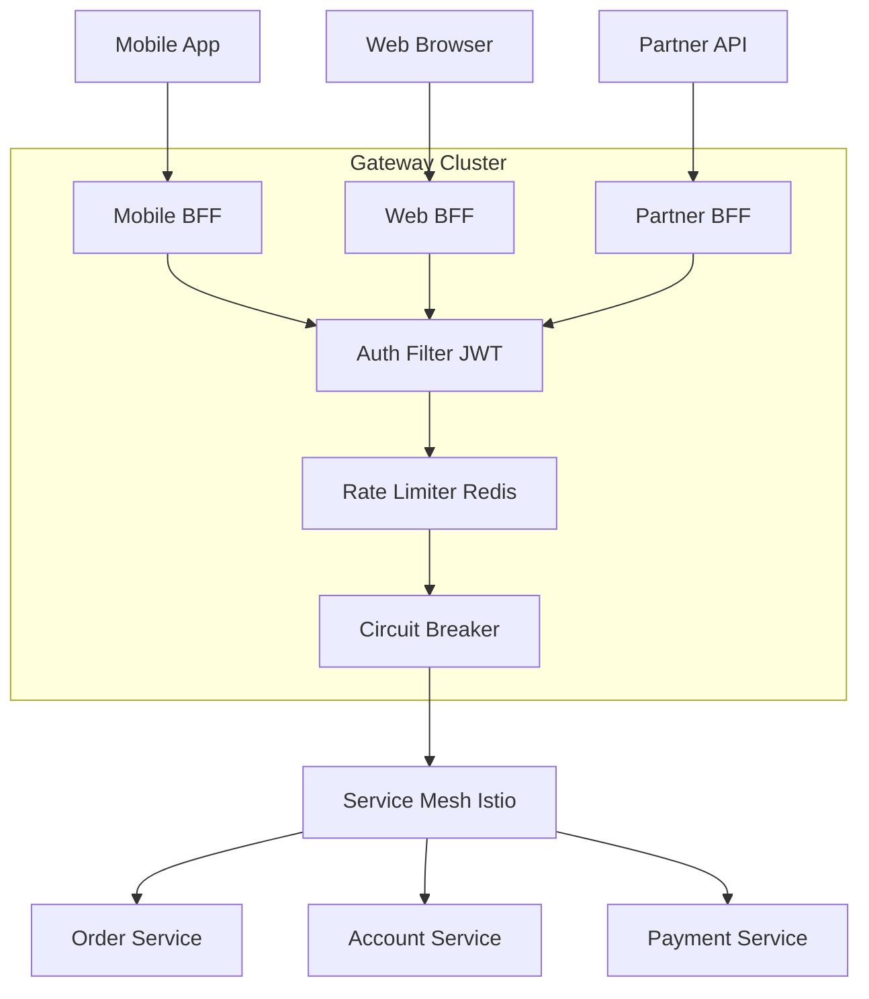

# API Gateway Architecture and Design

---

### 🎯 Model Answer

**30 seconds:**
> An API Gateway is the single entry point for all client-to-service traffic. It handles cross-cutting concerns: authentication, rate limiting, routing, SSL termination, request transformation, and observability. The gateway pattern decouples clients from the internal service topology, allowing services to evolve independently without breaking clients.

**3 minutes:**
> The API Gateway pattern centralizes the cross-cutting concerns that every microservice would otherwise need to implement independently. Without a gateway: each of 50 microservices implements its own authentication, rate limiting, and logging. When the auth algorithm changes, all 50 services must be updated. When you need to add request logging, all 50 services must be changed. The gateway solves this by placing all cross-cutting logic in one place. Architecturally: the gateway sits between the internet and the internal services. Clients know only the gateway's address. The internal service topology is an implementation detail. The gateway routes requests to services based on URL path, HTTP method, or other criteria. Typical gateway responsibilities: (1) Authentication and authorization - validate JWT tokens, check OAuth2 scopes, forward user context to downstream services as claims. (2) Rate limiting - enforce per-client or per-endpoint request quotas. (3) SSL/TLS termination - decrypt HTTPS at the gateway; use HTTP internally (reduces TLS overhead on each service). (4) Request routing - map external URLs to internal service addresses (stable external API over changing internal topology). (5) Request/response transformation - add headers, strip sensitive fields from responses, translate between client formats (mobile vs desktop). (6) Observability - centralized access logging, request tracing, latency measurement across all services. The tradeoff: the gateway is a single point of failure. If it goes down, all APIs go down. This demands high availability: multiple gateway instances behind a load balancer, circuit breakers to protect downstream services, graceful degradation when services are unavailable.

**Blank Mind Recovery:**
**(1) Restate:** "API Gateway - the entry point that handles cross-cutting concerns for all services."
**(2) First principles:** "Without a gateway, each service reimplements auth, rate limiting, logging. Duplication. The gateway centralizes what every service needs."
**(3) Bridge:** "Like a hotel front desk: all guests (clients) go through the front desk (gateway). The front desk handles check-in (auth), enforces policies (rate limits), and directs guests to their rooms (routing). No guest bypasses the front desk."

---

### 📘 Concept Explanation

**What it is:**
An API Gateway is a reverse proxy that serves as the single entry point for client requests to a microservices system, handling cross-cutting concerns that would otherwise be duplicated across services.

**The problem it solves:**
Without a gateway: each service independently handles authentication, rate limiting, SSL, routing, and observability. Any change to these concerns requires updating every service. Clients must know the address of every service. The gateway centralizes shared concerns and provides a stable external API over an evolving internal topology.

**How it works:**
```
Without Gateway (BAD):
Client -> Auth Service (handles its own auth)
Client -> Order Service (handles its own auth)
Client -> Inventory Service (handles its own auth)
Each service: 50x duplication of auth, rate limit, SSL

With Gateway (GOOD):
Client -> [API Gateway]
              | Auth check
              | Rate limit check
              | SSL termination
              | Route: /orders -> Order Service
              | Route: /inventory -> Inventory Service
              | Observability: log, trace all
              |
         Order Service (no auth logic)
         Inventory Service (no auth logic)
         Inventory Service (no rate limit logic)
```

**The key insight:**
The gateway makes the internal service topology invisible to clients. An external URL like `GET /api/v1/orders/{id}` can route to the OrderService today and to the OrderServiceV2 tomorrow without any client changes. The gateway is the contract boundary between the external world and the internal implementation.

**Gateway types by deployment:**
- Ingress Controller (Kubernetes): Kong, Nginx, Traefik
- Managed cloud gateway: AWS API Gateway, Azure API Management
- Self-hosted: Netflix Zuul, Spring Cloud Gateway, Kong OSS

**When to use:**
Any microservices system with multiple external clients. The gateway pays for itself when you have 3+ services all needing the same cross-cutting concerns.

**When NOT to use:**
Single monolithic service: adds latency with no benefit. Internal service-to-service calls: use service mesh (Istio/Linkerd) instead of routing everything through the external gateway.

---

### 💻 Code Example

```java
// BAD: Each service handles cross-cutting concerns
@RestController
public class OrderController {

  // PROBLEM: Every service duplicates this
  @GetMapping("/orders/{id}")
  public Order getOrder(
      @PathVariable Long id,
      @RequestHeader("Authorization") String auth,
      HttpServletRequest request) {

    // Duplicated in every service!
    if (!jwtValidator.validate(auth)) {
      throw new UnauthorizedException();
    }
    // Rate limiting duplicated in every service!
    if (!rateLimiter.allow(getClientId(request))) {
      throw new TooManyRequestsException();
    }
    return orderService.findById(id);
  }
}

// GOOD: Spring Cloud Gateway configuration
// Cross-cutting concerns handled once in the gateway
@Configuration
public class GatewayConfig {

  @Bean
  public RouteLocator routes(
      RouteLocatorBuilder builder) {

    return builder.routes()
        // Order Service route
        .route("order-service", r -> r
            .path("/api/v1/orders/**")
            .filters(f -> f
                // Strip the /api/v1 prefix
                .stripPrefix(2)
                // Add request ID for tracing
                .addRequestHeader(
                    "X-Gateway-Request-Id",
                    UUID.randomUUID().toString())
                // Rate limiting: 100 req/s per user
                .requestRateLimiter(c -> c
                    .setRateLimiter(redisRateLimiter())
                    .setKeyResolver(userKeyResolver()))
                // Retry on 503
                .retry(r2 -> r2
                    .setRetries(3)
                    .setStatuses(
                        HttpStatus.SERVICE_UNAVAILABLE)))
            .uri("lb://order-service"))

        // Inventory Service route
        .route("inventory-service", r -> r
            .path("/api/v1/inventory/**")
            .filters(f -> f
                .stripPrefix(2)
                .circuitBreaker(c -> c
                    .setName("inventoryCircuitBreaker")
                    .setFallbackUri(
                        "forward:/fallback/inventory")))
            .uri("lb://inventory-service"))

        .build();
  }

  // Authentication filter applied to all routes
  @Bean
  public GlobalFilter authenticationFilter() {
    return (exchange, chain) -> {
      String auth = exchange.getRequest()
          .getHeaders()
          .getFirst("Authorization");

      if (auth == null
          || !auth.startsWith("Bearer ")) {
        exchange.getResponse()
            .setStatusCode(
                HttpStatus.UNAUTHORIZED);
        return exchange.getResponse().setComplete();
      }

      // Validate JWT and add claims to headers
      Claims claims = jwtValidator.validate(
          auth.substring(7));

      ServerWebExchange mutatedExchange =
          exchange.mutate()
              .request(r -> r
                  .header("X-User-Id",
                      claims.getSubject())
                  .header("X-User-Roles",
                      String.join(",",
                          claims.get("roles",
                              List.class))))
              .build();

      return chain.filter(mutatedExchange);
    };
  }
}
```

> **Code walkthrough:** The BAD pattern shows every service reimplementing JWT validation and rate limiting - 50 services means 50 copies of this code, all of which must change when the auth logic changes. The GOOD pattern shows Spring Cloud Gateway handling all cross-cutting concerns centrally: routing (path-based), rate limiting (Redis-backed), circuit breaker (fallback URI for Inventory Service), and authentication (global filter that validates JWT and forwards user claims as headers). Downstream services receive `X-User-Id` and `X-User-Roles` headers and trust them completely - no need to re-validate the JWT.

---

### 🎓 Answers by Seniority

**Junior / Mid:** "An API Gateway sits in front of all our microservices and handles common things like authentication and routing. It means our services don't have to implement their own auth. In Spring Boot we use Spring Cloud Gateway or AWS API Gateway. It routes requests based on URL paths to the right service."

**Senior / Staff:** "The API Gateway solves the cross-cutting concern duplication problem in microservices. Every service needs authentication, rate limiting, SSL, logging - without a gateway this is duplicated 50x and every change requires updating every service. The gateway centralizes this. Architecturally there are three main concerns: (1) The gateway becomes a single point of failure - you must run multiple instances behind a load balancer and implement circuit breakers to prevent cascade failures when downstream services fail. (2) The gateway can become a performance bottleneck - keep gateway logic thin (auth, routing, rate limiting) and avoid complex business logic in the gateway. Business logic in the gateway is hard to test, version, and deploy independently. (3) The backend-for-frontend (BFF) pattern extends this: separate gateway instances per client type (mobile, web, 3rd party). Mobile clients need different response shapes (smaller payloads, different fields) than web clients. The BFF pattern gives each client type its own gateway that transforms responses appropriately. At scale: a gateway handling 100K req/s needs to be stateless (rate limit state in Redis, not in-memory), highly available (multi-region with latency-based routing), and observable (every request logged, traced, and metered)."

---

### ⚠️ Common Misconceptions

**Misconception 1:** "The API Gateway should contain business logic."
Reality: The gateway should only handle cross-cutting infrastructure concerns: routing, auth, rate limiting, SSL, header manipulation, circuit breaking. If business logic (price calculation, inventory checking, order validation) lives in the gateway, you now have a system where business requirements drive gateway deployments. The gateway becomes a bottleneck for feature development. It's also hard to test business logic at the gateway level - no access to the full application context. Principle: keep the gateway thin (infrastructure), keep services fat (business logic).

**Misconception 2:** "An API Gateway replaces a service mesh."
Reality: They solve different problems. The API Gateway handles north-south traffic (external clients to internal services). A service mesh (Istio, Linkerd) handles east-west traffic (service-to-service communication). The service mesh provides mTLS between services, service-to-service rate limiting, retries, circuit breaking, and observability for internal calls. Most production systems need both: API Gateway for external traffic + service mesh for internal traffic. Using the API Gateway for service-to-service calls routes all internal traffic through the external gateway - adds latency, creates a bottleneck, and routes traffic outside the cluster unnecessarily.

---

### 🚨 Failure Modes and Diagnosis

**Failure: API Gateway becomes a single point of failure**

Symptom: All APIs return 502 or timeout simultaneously. The gateway instance crashed.

Prevention: (1) Multiple gateway instances behind a load balancer. (2) Health check at the load balancer level - remove unhealthy gateway instances from rotation. (3) Circuit breakers in the gateway to prevent cascade failures (if Order Service is down, gateway returns 503 quickly instead of queueing thousands of requests and timing out). (4) Stateless gateway (JWT validation is stateless; rate limit state in Redis, not in-memory). If a gateway instance crashes, others can serve all requests.

Diagnosis: `kubectl get pods -l app=api-gateway` - are all instances running? `kubectl logs -l app=api-gateway --tail=100 | grep ERROR`. Check load balancer health: are all targets healthy?

---

### 🎯 Interview Deep-Dive

| Category | Time | Minimum |
|---|---|---|
| Mechanism | 3 min | 2 |
| Debugging | 3 min | 2 |
| Design | 4 min | 3 |
| Scenario | 3 min | 2 |
| Trade-off | 3 min | 2 |
| Comparison | 2 min | 1 |
| Behavioral | 2 min | 2 |

#### Q1 - "What responsibilities belong in an API Gateway vs. in a service?"
> "Responsibility boundary: API Gateway handles cross-cutting infrastructure concerns that apply to all services uniformly. Services handle business logic. In the Gateway: authentication (validate JWT, forward user claims as headers). Authorization at the course-grained level (is this token valid for this API?). Rate limiting (per-client quotas). SSL/TLS termination. Request routing (URL to service mapping). Header manipulation (add X-Request-Id, strip internal headers from responses). Circuit breaking (stop routing to unhealthy services). Request/response logging for access audit. In the Service: fine-grained authorization (can this specific user access this specific order?). Business rules (order must have at least 1 item, payment must succeed before fulfillment). Service-specific caching (cache user profiles). Service-specific transformations (calculate order total from line items). The key test: 'Would all 50 services need this identically?' If yes: gateway. If it depends on the service's domain: in the service. Putting business logic in the gateway creates a deployment bottleneck (business features block gateway releases), breaks testability (no application context in gateway tests), and violates the single-responsibility principle."

*What separates good from great:* "The fine-grained vs coarse-grained authorization split (gateway checks token validity, service checks resource ownership) and the 'deployment bottleneck' argument against business logic in the gateway show architectural clarity."

---

#### Q2 - "How would you implement rate limiting in an API Gateway at scale?"
> "Rate limiting at scale requires distributed state. (1) Per-client rate limiting (most common): each API client has a quota (e.g., 1000 req/min). Gateway identifies the client by API key or OAuth2 client_id from the JWT. Uses Redis for the rate limit counter: `INCR client:123:minute:2024-01-15-14-32; EXPIRE client:123:minute:2024-01-15-14-32 60`. If counter > 1000: return 429 with `Retry-After` header. (2) Sliding window algorithm. Avoids the spike at the start of each time window. Uses a sorted set in Redis: `ZADD client:123:requests {current_time} {request_id}; ZREMRANGEBYSCORE client:123:requests 0 {current_time - 60}; ZCARD client:123:requests`. If count > limit: reject. (3) Token bucket algorithm. Allows short bursts. Client has a bucket of tokens (e.g., 100 tokens). Each request consumes 1 token. Tokens are added at a constant rate (e.g., 10/second). If bucket is empty: 429. Allows a burst of 100 requests then steady-state 10/second. (4) Performance consideration. Every request to the gateway requires 2 Redis operations for rate limiting. At 100K req/s this is 200K Redis operations/second. Use Redis pipelines to batch operations. Consider in-memory approximate rate limiting (token bucket with local state, reset from Redis periodically) for ultra-low latency."

*What separates good from great:* "The sliding window vs fixed window trade-off (sliding prevents the burst-at-window-start problem) and the Redis performance optimization (pipelines, local approximate state) show production-scale implementation."

---

#### Q3 - "Explain the Backend-for-Frontend (BFF) pattern and when to use it."
> "Backend-for-Frontend (BFF) is an extension of the API Gateway pattern where each client type (mobile, web, 3rd-party developer API) gets its own gateway instance with tailored response shaping. Problem the BFF solves: a mobile client needs minimal fields (small payload, battery-conscious). A web client needs full data with navigation links. A 3rd-party developer API needs stable, versioned contracts. A single generic gateway must serve all three. Result: the generic gateway either returns the full data (mobile gets 10x more data than it needs) or is constantly changed to accommodate each client type's needs. BFF solution: three separate gateways. Mobile BFF: aggregates multiple service calls into one response, strips fields not needed by mobile, handles mobile-specific auth (biometric auth). Web BFF: returns full data with HATEOAS links, handles web session management. Developer BFF: stable versioned API with full backwards compatibility guarantees. Each BFF is owned by the team that owns the client: mobile team owns the mobile BFF. The BFF team can change the response shape without coordinating with backend service teams. When to use: when client types have significantly different data requirements. When NOT to use: when all clients need the same data - adds complexity without benefit."

*What separates good from great:* "The team ownership alignment (mobile team owns mobile BFF) and the connection to avoiding coordination overhead between client teams and backend teams show the organizational benefit beyond the technical one."

---

#### Q4 - "How does circuit breaking work in an API Gateway?"
> "Circuit breaking prevents cascade failures. Without a circuit breaker: Service A is slow or down. Gateway routes requests to Service A. Requests queue up waiting for Service A to respond. The queue grows. Thread pool in the gateway fills with requests waiting for Service A. All other services also become unreachable because the gateway thread pool is exhausted. This is a cascade failure. With circuit breaker: the circuit breaker in the gateway tracks failure rates for each downstream service. States: Closed (normal): requests pass through, failures tracked. Open (tripped): requests fail immediately (no connection attempt), returns 503 or fallback response. Half-open (recovery): let a few test requests through. If they succeed: close. If they fail: re-open. Configuration example in Spring Cloud Gateway: `spring.cloud.gateway.routes[0].filters[0]: CircuitBreaker=name=inventoryCircuitBreaker, fallbackUri=forward:/fallback/inventory`. The fallback URI serves a cached or degraded response. The circuit opens when: failure rate > 50% in a 10-second window, OR slowness rate > 50% (requests taking > 2 seconds are counted as failures). The circuit breaker protects the gateway's resources (threads) from being exhausted by a slow or failed downstream service."

*What separates good from great:* "The cascade failure mechanism (thread pool exhaustion spreading from one slow service to all services) and the Half-open recovery state show circuit breaker behavior beyond just 'it stops requests.'"

---

#### Q5 - "What are the performance implications of adding an API Gateway?"
> "Gateway performance impact: added latency. Each request passes through the gateway before reaching the service. This adds: (1) Network hop: gateway to service network round-trip. In the same data center: ~1-2ms. Cross-AZ: ~3-5ms. (2) Processing: JWT validation (crypto operation, ~1-5ms), rate limit check (2 Redis ops, ~1-2ms), route lookup (~0ms, cached). Total gateway overhead: ~5-15ms per request. This is acceptable for most APIs. For ultra-low latency APIs (< 10ms response time target): the gateway overhead is significant. (3) The gateway must scale with total traffic. At 100K req/s: the gateway is handling all 100K req/s. Over-provisioned gateway: waste. Under-provisioned gateway: bottleneck. Scale the gateway horizontally (stateless instances). (4) Connection pooling. The gateway maintains connection pools to each downstream service. Cold connections (TLS handshake, TCP setup) add 50-200ms. Warm connection pools eliminate this overhead. (5) Comparison to service mesh: service mesh (Istio sidecar) adds ~1-3ms per hop with lower processing overhead than the gateway. The service mesh sidecar is in the same pod as the service - no network round-trip. For internal service-to-service traffic: service mesh is lower latency than routing through the API gateway."

*What separates good from great:* "The concrete latency numbers (1-5ms per operation, 5-15ms total gateway overhead) and the service mesh comparison for internal traffic show operational understanding."

---

#### Q6 - "How do you handle API versioning at the gateway level?"
> "Gateway-level versioning strategies: (1) URL path versioning (most common): `/api/v1/orders` routes to OrderServiceV1. `/api/v2/orders` routes to OrderServiceV2 or uses a transform. Gateway config: `path: /api/v1/orders/**` -> `lb://order-service-v1`. `path: /api/v2/orders/**` -> `lb://order-service`. The gateway maintains both routes simultaneously. Old clients continue to use v1. New clients use v2. (2) Header-based routing: `API-Version: 2` routes to the new service. All clients use the same URL. Header routing is transparent to the client URL but requires clients to set the header. (3) Canary releases at the gateway: route 5% of v1 traffic to v2 for testing. `route: path=/api/v1/orders/**, weight=5 -> order-service-v2`. `route: path=/api/v1/orders/**, weight=95 -> order-service-v1`. Gradually increase the v2 weight as confidence increases. (4) Response transformation for backwards compatibility: v1 clients expect `{ 'orderDate': '...' }`. v2 service returns `{ 'createdAt': '...' }`. Gateway transform adds the old field name for v1 clients: `.addResponseHeader('X-Deprecated', 'Use createdAt instead')`. And a response body transform (with caution - adds CPU overhead). Best practice: avoid response transforms in the gateway for large response bodies. Prefer versioning at the service level."

*What separates good from great:* "The canary release implementation (weight-based routing with gradual percentage increase) and the warning against large response body transforms in the gateway show production-informed design choices."

---

#### Q7 - "How do you secure an API Gateway against attacks?"
> "API Gateway security hardening: (1) Authentication enforcement. Every request must present a valid credential. JWT validation: check signature, issuer, audience, expiration. OAuth2 token introspection for opaque tokens. API key validation against a key store. Reject requests without valid credentials with 401. (2) Rate limiting as a DoS defense. Limit requests per client and per IP. Per-IP rate limiting protects against unauthenticated DDoS. Per-client rate limiting protects against a single legitimate client overwhelming services. (3) Request validation. Reject requests exceeding size limits (`client_max_body_size 10m` in Nginx). Block requests with suspicious patterns (SQL injection attempts in URL parameters) using WAF rules. (4) TLS configuration. Minimum TLS 1.2. Prefer TLS 1.3. Reject weak cipher suites. Enforce HSTS: `Strict-Transport-Security: max-age=31536000; includeSubDomains`. (5) Remove internal headers from responses. Strip `X-Internal-Service-Id`, `X-Backend-Version` headers before returning to the client. Attackers can use internal header information to target specific service versions. (6) Secrets management. API keys, JWT signing keys, TLS certificates: stored in a secrets manager (HashiCorp Vault, AWS Secrets Manager). Never in environment variables or config files. Rotated regularly. The gateway is the first line of defense - it must be hardened."

*What separates good from great:* "The 'remove internal headers from responses' defense (preventing service version disclosure) and the WAF rule mention for injection defense show defense-in-depth thinking at the gateway."

---

#### Q8 - "What is the difference between an API Gateway and a load balancer?"
> "Load balancer vs API Gateway: a load balancer distributes traffic across multiple identical instances of the same service. It operates at Layer 4 (TCP/UDP) or Layer 7 (HTTP). It has no knowledge of API semantics - it routes based on IP, port, or URL. An API Gateway understands API semantics and adds intelligence on top of routing. Differences: (1) Routing granularity. Load balancer: route by IP:port or simple URL prefix. API Gateway: route by HTTP method + URL path + headers + query parameters. (2) Cross-cutting concerns. Load balancer: none (or very basic Layer 7 health checks). API Gateway: authentication, rate limiting, transformation, circuit breaking. (3) Protocol translation. Load balancer: same protocol in and out. API Gateway: HTTP to gRPC, WebSocket upgrades, REST to SOAP. (4) Cost of error. Load balancer failure: traffic to that service goes down. API Gateway failure: ALL services go down (single entry point). (5) Latency. Load balancer: very low overhead (Layer 4: microseconds, Layer 7: ~1ms). API Gateway: higher overhead (JWT validation, rate limiting: 5-15ms). In practice: the production stack often has both. AWS: Internet -> CloudFront (CDN/DDoS) -> ALB (load balancing across gateway instances) -> API Gateway pods -> ALB (internal load balancing per service) -> Service pods."

*What separates good from great:* "The full stack diagram (CloudFront -> ALB -> Gateway -> ALB -> Service) and the quantitative latency comparison (load balancer microseconds vs gateway 5-15ms) show the complete production networking architecture."

---

#### Q9 - "How do you observe and debug a production API Gateway?"
> "Gateway observability: (1) Access logs: every request logged with client IP, URL, method, status, response time, upstream service name, and upstream latency. Allows correlation: 'client is getting 504' -> access log shows gateway-to-service latency is 30 seconds -> service is slow. (2) Gateway-specific metrics. Request rate per route. Error rate per route. Upstream latency per service. Circuit breaker state (open/closed/half-open). Rate limiter rejection rate. Connection pool utilization. (3) Distributed traces. Each request gets a traceId at the gateway. Propagated to downstream services via `traceparent` header. The trace shows gateway processing time vs service processing time. (4) Debugging a gateway routing issue. `curl -v https://api.myapp.com/api/v1/orders/123` -> check response headers for `X-Upstream-Service` and `X-Request-Id`. `kubectl logs -l app=api-gateway --tail=100 | grep 'orders/123'` -> find the routing decision and upstream call result. (5) Rate limiter debugging. `kubectl exec -it api-gateway -- redis-cli GET client:123:minute:2024-01-15-14-32` -> check current rate limit counter. (6) Circuit breaker state. `GET /actuator/circuitbreakers` (Spring Cloud Gateway Actuator) -> shows current state of each circuit breaker: CLOSED, OPEN, HALF_OPEN, and failure rate."

*What separates good from great:* "The specific commands for debugging (redis-cli for rate limiter state, actuator endpoint for circuit breaker state) and the trace propagation via `traceparent` header show operational production experience."

---

#### Q10 - "Design an API Gateway that handles 1 million requests per second."
> "1M req/s gateway design: (1) Stateless gateway instances. JWT validation is stateless (no external call needed - just crypto). Rate limit state in Redis Cluster (sharded). Routing configuration in memory (loaded from config store at startup). Horizontal scaling: N gateway instances, each handling 50-100K req/s. (2) Redis Cluster for rate limiting. 1M req/s generates 2M Redis ops/s. Redis single node handles ~500K ops/s. Redis Cluster with 6 nodes: 3M ops/s capacity. Shard by client_id for even distribution. Use Redis pipeline (batch multiple ops per network round-trip). (3) Async I/O. Spring Cloud Gateway uses Reactor (non-blocking). 1M req/s with 10ms gateway latency = 10K concurrent requests in-flight. With blocking I/O: need 10K threads. With non-blocking: ~100 event loop threads handle 10K concurrent requests. (4) Connection pooling to upstream services. Pre-warmed HTTP/2 connection pools to each service. HTTP/2 multiplexing: 100+ concurrent requests per TCP connection. (5) Avoid heavy crypto at 1M req/s. JWT RS256 (RSA asymmetric) verification: ~1ms per token = 1M verifications/s = 1,000 CPU-seconds/s. Consider JWT caching (cache valid tokens for their remaining TTL using Redis). Or use HS256 (HMAC, much faster)."

*What separates good from great:* "The JWT caching to avoid 1M crypto operations per second and the HTTP/2 multiplexing for upstream connection pools are the production-scale optimizations that distinguish someone who's operated high-traffic gateways."

---

#### Q11 - "What is service mesh and how does it relate to the API Gateway?"
> "Service mesh handles east-west (service-to-service) traffic. API Gateway handles north-south (external-to-service) traffic. They complement each other. Service mesh (Istio, Linkerd): implemented as a sidecar proxy (Envoy) injected alongside each service pod. The sidecar intercepts all traffic to/from the service. Provides: mTLS between services (encrypted and mutually authenticated internal calls), service-to-service rate limiting, retries, circuit breaking, and observability for internal calls. The service mesh is transparent to the application code - the sidecar handles all the logic. API Gateway: handles the external boundary. Authentication for external clients (JWT from browsers, API keys from external partners). External rate limiting (DDoS protection, partner quotas). External-facing URL routing. The separation: requests from external clients enter through the API Gateway. Requests between services travel through the service mesh. Why not use the API Gateway for service-to-service calls? Every internal call would exit the cluster (to the gateway), travel back in. Adds 2 network hops (10-40ms extra latency). Creates a bottleneck (all internal traffic through the gateway). Routes around the security model (service mesh mTLS). Use the right tool: API Gateway for external, service mesh for internal."

*What separates good from great:* "The concrete extra latency for routing internal calls through the API gateway (2 network hops, 10-40ms) and the service mesh mTLS security model show why the two tools must coexist."

---

#### Q12 - "What goes wrong with API Gateway implementations at scale?"
> "Production API Gateway failure modes: (1) Gateway becomes a business logic dumping ground. Teams add 'quick' business rules in gateway config. Over time: gateway handles pricing rules, feature flags, A/B tests. Any business feature change requires a gateway deployment. Gateway team becomes a bottleneck. Solution: rule of thumb - if it requires understanding the business domain to implement, it doesn't belong in the gateway. (2) Connection pool exhaustion. Gateway maintains connection pools to each service. If a service is slow: gateway threads wait for the pool. Pool exhausts. Other services are unaffected at the service level but unreachable via the gateway. Solution: per-route circuit breakers with fallback URIs. (3) Configuration explosion. 50 services * multiple routes + rate limits + circuit breakers + transforms = thousands of config lines. Configuration errors cause outages. Solution: GitOps for gateway config (all config in git, reviewed, tested in staging before production). (4) Single global rate limit. One rate limit for all clients. A single misbehaving client consuming their quota slows everyone else's experience (if shared counters). Solution: per-client rate limit counters. (5) JWT expiry during long operations. Client's JWT expires mid-operation (long-running download). Gateway rejects the request with 401. Solution: gateway should check JWT expiry with enough buffer (if JWT expires in < 60 seconds: return 401 immediately rather than forwarding and failing mid-response)."

*What separates good from great:* "The JWT expiry during long operations (check expiry with a buffer before forwarding) and the configuration explosion with GitOps solution are production operational challenges not in documentation."

---

### ⚖️ Comparison Table

| Feature | API Gateway | Load Balancer | Service Mesh |
|---|---|---|---|
| Traffic type | North-south (external) | Any | East-west (internal) |
| Auth | Yes (JWT, API key) | No | mTLS only |
| Rate limiting | Per-client quotas | No | Service-to-service |
| Routing | Semantic (method+path+headers) | IP/port/URL prefix | Hostname |
| Latency added | 5-15ms | 1-2ms | 1-3ms (sidecar) |
| Failure impact | All external traffic | One service | One service pair |
| Examples | Kong, AWS API GW, Spring Cloud GW | Nginx, HAProxy, ALB | Istio, Linkerd |

**The deciding factor:** Use all three in production. API Gateway for the external boundary. Load balancer to scale the gateway itself. Service mesh for internal service communication.

---

### 🏛️ System Design

**Design an API Gateway for a financial services platform**

**Requirements:** 100K req/s, financial-grade security, 99.99% availability, 3 client types (mobile, web, partner API), real-time rate limiting.

**Architecture:**
```
Internet
   |
[CloudFront/CDN] -- DDoS mitigation, TLS offload
   |
[AWS ALB] -- load balance across gateway instances
   |         (all AZs, health checks)
[Gateway Cluster] -- 3+ instances, auto-scaling
 | Mobile BFF | Web BFF | Partner API BFF |
   |              |            |
[Auth Service] [Service Mesh (Istio)]
                     |
           [Internal Microservices]
           Order, Account, Payment...
```

**Security layer:**
JWT validation at gateway (RS256, key from JWKS endpoint). Per-client rate limiting in Redis Cluster. WAF rules (OWASP Top 10 protection). TLS 1.3 minimum. Strip internal headers from responses.

**BFF design:**
Mobile BFF: aggregate 3 service calls into 1 response (reduce mobile round trips). Compress responses (gzip). Partner API BFF: strict versioned contracts, API keys, higher rate limits, SLA monitoring.

**High availability:**
Multiple gateway instances across 3 AZs. Load balancer removes unhealthy instances within 30 seconds. Circuit breakers prevent cascade failures. RTO < 30 seconds, RPO = 0 (stateless gateway).

---

### 📊 Diagram

```
API Gateway Architecture:

External Clients         Gateway Layer
+----------+         +-----------------+
| Mobile   |         | Mobile BFF      |
| App      |-------> | (auth, agg,     |
+----------+         |  rate limit)    |
                     +-----------------+
+----------+         +-----------------+
| Web      |         | Web BFF         |
| Browser  |-------> | (auth, cache,   |
+----------+         |  rate limit)    |
                     +-----------------+
+----------+         +-----------------+
| Partner  |         | Partner API BFF |
| API      |-------> | (API keys,      |
+----------+         |  versioning)    |
                     +-----------------+
                          |
                     [Auth Filter]
                     [Rate Limiter]
                     [Circuit Breaker]
                          |
                    Internal Services
                  (via Service Mesh mTLS)
```



> **Diagram walkthrough:** Three BFF instances serve three client types with tailored behavior (Mobile BFF aggregates calls, Partner BFF enforces strict versioning). All three BFFs share the same Auth Filter, Rate Limiter, and Circuit Breaker infrastructure - these are common cross-cutting concerns. Requests exit the gateway cluster to the internal service mesh, which handles service-to-service security (mTLS) and routing. This clean separation means client-specific changes (mobile response shape) don't affect the internal services, and internal service topology changes (splitting the Order Service) don't affect clients.
