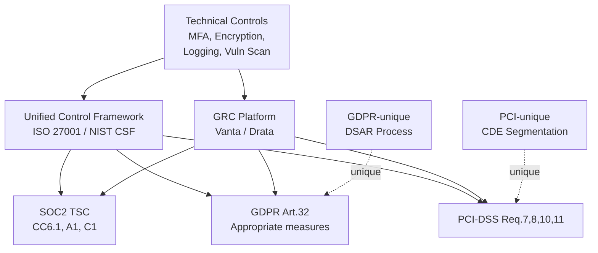

## Keywords in This File
{: .no_toc }

| # | Keyword | Weight |
|---|---|---|
| 1 | [Compliance Frameworks: SOC2, GDPR, and PCI-DSS](#compliance-frameworks-soc2-gdpr-and-pci-dss) | high |

---

# Compliance Frameworks: SOC2, GDPR, and PCI-DSS

---

### 🎯 Model Answer

**30 seconds:**
> Compliance frameworks define minimum security and data protection requirements for
> organizations. SOC2 Type II audits operational security controls over 12 months (Trust
> Service Criteria). GDPR governs personal data of EU residents: consent, data minimization,
> breach notification (72 hours), and data subject rights. PCI-DSS applies to any
> organization that processes, stores, or transmits cardholder data: 12 requirements
> covering network security, encryption, access control, and monitoring.

**3 minutes (Senior):**
> Compliance frameworks are a floor, not a ceiling. SOC2 Type II is a 12-month audit
> of five Trust Service Criteria (Security, Availability, Processing Integrity,
> Confidentiality, Privacy); Security is mandatory; others are optional but commercially
> demanded. Controls: access logging, MFA, encryption at rest and in transit, change
> management, incident response. GDPR: lawful basis for processing (consent, legitimate
> interest, contract), data subject rights (DSAR: access, erasure, portability), Privacy
> by Design, breach notification to DPA within 72 hours. PCI-DSS Level 1 (>6M
> transactions/year): annual QSA audit; 12 requirements including network segmentation
> (CDE isolation), no unprotected PANs, encryption in transit (TLS 1.2+), quarterly
> vulnerability scans, annual penetration tests. The biggest compliance trap: treating
> it as a checkbox exercise produces paperwork but not security; a SOC2-compliant
> organization can still be breached if controls are purely administrative.

**Framework:** Identify -> Implement -> Audit -> Respond -> Improve

**Blank Mind Recovery:**

**(1) Restate:** "SOC2 is for SaaS/cloud security audits. GDPR is for personal data
of EU residents. PCI-DSS is for credit card data. All three require documentation,
controls, and evidence of continuous operation."

**(2) First principles:** "Compliance frameworks exist because organizations cannot
self-certify trust. Third-party audits, standardized requirements, and legally
enforceable obligations create accountability."

**(3) Bridge:** "Compliance frameworks are like building codes. A building code
defines the minimum safety requirements for a structure. You can build above code;
you cannot build below it without legal consequences. Compliance is the minimum
structure for data safety."

---

### 📘 Concept Explanation

**SOC2 (System and Organization Controls 2):**

SOC2 is an auditing standard developed by the AICPA. It assesses whether a service
organization's controls meet the Trust Service Criteria (TSC).

```text
SOC2 TRUST SERVICE CRITERIA:

  Security (CC - Common Criteria):
    MANDATORY for all SOC2 reports
    - Logical access controls (RBAC, MFA)
    - Infrastructure monitoring and alerting
    - Change management and SDLC controls
    - Incident response procedures
    - Risk assessment process
    - Vendor/third-party management

  Availability (A):
    Meets uptime commitments
    - Disaster recovery testing
    - Capacity planning
    - Backup and restore procedures

  Processing Integrity (PI):
    Data processed completely and accurately
    - Data validation controls
    - Error handling procedures

  Confidentiality (C):
    Data designated confidential is protected
    - Data classification policy
    - Encryption at rest and in transit

  Privacy (P):
    Personal information handled per notice
    - Privacy policy implementation
    - Data retention and deletion
    - DSAR process

  Report types:
    SOC2 Type I: point-in-time assessment
    SOC2 Type II: 12-month operational review
    (Type II is commercially required)
```

> **Code walkthrough:** (1) WHAT IT SHOWS: the five SOC2 Trust Service Criteria
> with Security as the mandatory base and four optional criteria that are commercially
> demanded by enterprise customers. (2) KEY MECHANISM: SOC2 Type II requires evidence
> collected over 12 months that controls were operating continuously; the auditor
> samples evidence from throughout the audit period, not just at the time of audit.
> (3) WHY IT MATTERS: SaaS companies selling to enterprises universally require SOC2
> Type II; without it, procurement teams reject the vendor; the sales cycle for
> enterprise customers literally depends on SOC2 certification. (4) WHAT BREAKS:
> treating SOC2 as a one-time audit project; controls must operate continuously for
> 12 months; evidence collection must be automated; manual evidence collection creates
> gaps that auditors find. (5) TAKEAWAY: automate evidence collection from day one;
> use a GRC platform (Vanta, Drata, Secureframe) to continuously collect and map
> evidence; the annual audit reviews automated evidence rather than requiring manual
> gathering.

**GDPR (General Data Protection Regulation):**

GDPR is EU law governing personal data processing. It applies to any organization
that processes data of EU residents, regardless of the organization's location.

```text
GDPR KEY PRINCIPLES AND REQUIREMENTS:

  SIX LAWFUL BASES FOR PROCESSING:
    1. Consent (specific, informed,
       freely given, withdrawable)
    2. Contract (necessary for
       contract performance)
    3. Legal obligation
    4. Vital interests
    5. Public task
    6. Legitimate interests (balancing test)

  DATA SUBJECT RIGHTS:
    - Right of Access (DSAR: 30-day response)
    - Right to Erasure ("right to be forgotten")
    - Right to Portability (machine-readable)
    - Right to Rectification
    - Right to Object to processing
    - Rights re automated decision-making

  TECHNICAL REQUIREMENTS:
    - Privacy by Design: data minimization,
      pseudonymization built in from start
    - Data Protection Impact Assessment (DPIA):
      required for high-risk processing
    - Record of Processing Activities (RoPA)
    - Breach notification: to DPA within 72h,
      to individuals if high risk

  PENALTIES:
    Tier 1: up to EUR 10M or 2% global turnover
    Tier 2: up to EUR 20M or 4% global turnover
    (whichever is higher)
```

> **Code walkthrough:** (1) WHAT IT SHOWS: the GDPR framework covering lawful bases,
> data subject rights, technical requirements, and penalties. (2) KEY MECHANISM: the
> 72-hour breach notification to the DPA is the most operationally challenging; it
> requires that the organization detect a breach, assess its scope, and file a report
> to the national DPA within 72 hours of becoming aware of it; this requires a
> pre-prepared breach notification procedure and incident response plan. (3) WHY IT
> MATTERS: GDPR fines are substantial; Meta's 2023 fine was EUR 1.2B for EU-US data
> transfers; Amazon's 2021 fine was EUR 746M; organizations with global revenue find
> that 4% of global turnover is existential. (4) WHAT BREAKS: right-to-erasure requests
> are technically hard when data is in backups, event logs, analytics databases, and
> data warehouses; implement data tagging and erasure workflows for all data stores;
> test erasure annually. (5) TAKEAWAY: implement GDPR controls as engineering
> requirements; data minimization, pseudonymization, and automated DSAR workflows
> reduce both compliance cost and breach impact.

**PCI-DSS (Payment Card Industry Data Security Standard):**

PCI-DSS is maintained by the PCI Security Standards Council and applies to any
organization that stores, processes, or transmits cardholder data.

```text
PCI-DSS 12 REQUIREMENTS:

  NETWORK SECURITY:
  1. Install and maintain network security
     controls (firewalls, CDE segmentation)
  2. Apply secure configurations to all
     system components (no defaults, hardening)

  ACCOUNT DATA PROTECTION:
  3. Protect stored account data
     (no full PAN storage unless necessary;
      strong cryptography if stored)
  4. Protect cardholder data during
     transmission (TLS 1.2+; no SSL)

  VULNERABILITY MANAGEMENT:
  5. Protect all systems against malware
  6. Develop and maintain secure systems
     (patching; secure SDLC; code review)

  ACCESS CONTROL:
  7. Restrict access by business need
     (least privilege)
  8. Identify users and authenticate access
     (MFA for all non-console admin access)
  9. Restrict physical access to card data

  MONITORING AND TESTING:
  10. Log and monitor all access to system
      components and cardholder data
  11. Test security regularly
      (quarterly ASV scans; annual pentest)

  INFORMATION SECURITY POLICY:
  12. Support security with organizational
      policies and programs
```

> **Code walkthrough:** (1) WHAT IT SHOWS: the twelve PCI-DSS requirements organized
> by domain. (2) KEY MECHANISM: Requirement 3 is the most technically consequential;
> it mandates that Primary Account Numbers (PANs) must never be stored in cleartext;
> if stored, they must be encrypted with AES-256, truncated, or hashed; most
> organizations should avoid storing PANs entirely and use tokenization instead.
> (3) WHY IT MATTERS: a PCI-DSS violation leading to a card data breach results in:
> fines of $5,000-$100,000 per month, revocation of card processing privileges
> (business-ending), mandatory forensic investigation costs. (4) WHAT BREAKS:
> Requirement 1 (network segmentation of the CDE) is often done poorly; the CDE must
> be isolated so that systems outside cannot reach it; insufficient segmentation means
> the PCI scope balloons to the entire organization. (5) TAKEAWAY: scope reduction is
> the most valuable PCI strategy; use tokenization to keep raw PANs out of your systems
> entirely; a scoped-out organization has zero PCI obligations for stored card data.

---

### 💻 Code Example

```python
# GDPR: data minimization and pseudonymization

# BAD: PII directly in logs and analytics
import logging

def process_order_bad(user_email: str,
                      order_details: dict):
    # PII in plaintext log - GDPR risk
    logging.info(f"Processing for {user_email}")
    logging.info(f"Order: {order_details}")
    # Analytics with PII - right to erasure
    # becomes technically complex
    analytics.track("order_processed", {
        "email": user_email,   # PII in analytics
        "amount": order_details["amount"]
    })
```

> **Code walkthrough:** (1) WHAT IT SHOWS: a GDPR anti-pattern where PII (email) is
> logged in plaintext and tracked in analytics, creating obligations that are technically
> difficult to fulfill. (2) KEY MECHANISM: GDPR's right to erasure applies to all data
> stores; when a user requests deletion, you must delete their data from production
> databases, backups, log files, analytics, data warehouses, and third-party services;
> logs with PII make this nearly impossible without log redaction tools. (3) WHY IT
> MATTERS: in the event of a GDPR DSAR, your organization must identify all data held
> about the subject; PII in logs means the response must include log data, which is
> operationally complex to extract and filter. (4) WHAT BREAKS: logging frameworks
> that buffer to disk before writing mean PII persists even after deletion; implement
> PII redaction at the logging layer. (5) TAKEAWAY: design for data minimization from
> the start; use opaque user IDs in logs and analytics; maintain a PII registry that
> maps user IDs to PII in a dedicated privacy store.

```python
# GOOD: pseudonymization and data minimization

import hashlib

PEPPER = "change-me-in-production"
PRIVACY_STORE: dict[str, dict] = {}

def get_or_create_user_id(email: str) -> str:
    """Return opaque ID for this user."""
    user_id = hashlib.sha256(
        (email + PEPPER).encode()
    ).hexdigest()[:16]
    if user_id not in PRIVACY_STORE:
        PRIVACY_STORE[user_id] = {"email": email}
    return user_id

def process_order(user_email: str,
                  order_details: dict):
    user_id = get_or_create_user_id(user_email)
    # Logs contain opaque ID only - no PII
    logging.info(
        f"Processing order user={user_id}"
    )
    analytics.track("order_processed", {
        "user_id": user_id,  # opaque, not PII
        "amount": order_details["amount"]
    })

def handle_gdpr_erasure(user_email: str):
    """Handle right-to-erasure request."""
    user_id = get_or_create_user_id(user_email)
    PRIVACY_STORE.pop(user_id, None)
    db.delete_user(user_id)
    # Other systems store only user_id (not PII)
    # - effectively anonymized after this call
```

> **Code walkthrough:** (1) WHAT IT SHOWS: a GDPR-compliant pseudonymization pattern
> where PII is stored only in a dedicated privacy store mapped to opaque user IDs; all
> other systems use only the opaque ID. (2) KEY MECHANISM: the privacy store is the
> single point of PII; when a right-to-erasure request arrives, deleting from the
> privacy store removes the link between the opaque ID and any real person; all other
> data becomes anonymous. (3) WHY IT MATTERS: right-to-erasure becomes a simple delete
> from the privacy store rather than a complex multi-system operation; this reduces
> compliance cost from days to minutes per request. (4) WHAT BREAKS: pseudonymization
> is only effective if the PEPPER is secret; if compromised, the sha256 hash can be
> reversed; rotate the PEPPER periodically. (5) TAKEAWAY: implement pseudonymization
> as a company-wide standard before any new data pipeline is built; it reduces PII
> scope, simplifies erasure, and enables analytics without exposing PII.

---

### 🎓 Answers by Seniority

**Junior / Mid (0-5 years):**
> SOC2 is a security certification that SaaS companies get to prove their controls to
> enterprise customers. GDPR is EU law about protecting personal data of EU residents:
> you need consent to process personal data and must honor deletion requests. PCI-DSS
> applies if you handle credit card data: you must encrypt it, restrict access, and
> regularly test your security. All three have audit requirements and potential fines.

---

**Senior / Staff (5+ years):**
> Compliance program strategy: map all three frameworks first - there is significant
> overlap. SOC2 Security criteria and PCI-DSS controls share around 60% of requirements
> (access controls, logging, encryption, vulnerability management); GDPR technical
> controls overlap further. A unified control framework (using ISO 27001 or NIST CSF
> as backbone) avoids implementing the same technical control three times. For GDPR:
> Privacy by Design means data minimization and pseudonymization are architecture
> requirements, not retrofits. For PCI: scope reduction via tokenization is the
> highest-value decision; outsource card data handling to Stripe/Braintree and scope
> the CDE to near-zero. Use a GRC platform (Vanta, Drata) for automated evidence
> collection across all three frameworks simultaneously.

---

### ⚠️ Common Misconceptions

**Misconception 1: "SOC2 compliance means the company is secure."**

SOC2 describes controls, not outcomes. A SOC2-compliant organization has documented
controls that were operating during the audit period. The auditor does not test for
the absence of vulnerabilities or the effectiveness of controls against real attacks.
A company can be SOC2 compliant and still be breached.

**Misconception 2: "GDPR only applies to EU companies."**

GDPR applies to any organization that processes personal data of EU residents,
regardless of the organization's location. A US company with European customers must
comply with GDPR for that customer data. Meta's lead supervisory authority (Irish DPC)
has issued billion-euro fines against US technology companies.

**Misconception 3: "We are PCI-compliant because we use Stripe."**

Stripe handles card data, but PCI scope depends on how you integrate. If your
application receives raw card numbers (even briefly) before forwarding to Stripe,
your systems are in scope. Use Stripe Elements, which sends card data directly from
the browser to Stripe - your servers never see the card number. With this integration,
your PCI scope is minimal (SAQ A only).

---

### 🚨 Failure Modes and Diagnosis

**Failure Mode 1: SOC2 evidence gaps discovered during audit.**

Symptom: auditor requests 12 months of evidence for a control (e.g., quarterly access
reviews); team cannot produce Q2 evidence because it was not documented.
Root cause: manual evidence collection; controls ran but evidence was not captured.
Fix: deploy a GRC platform (Vanta, Drata) from day one; automate evidence collection
from AWS/GCP, GitHub, Okta, and Jira; evidence gaps surface in real-time.

**Failure Mode 2: GDPR DSAR response missed 30-day deadline.**

Symptom: user requests access to their data; team cannot identify all data within
30 days; deadline missed; user files complaint with DPA.
Root cause: no PII registry; data scattered across production DB, analytics, data
warehouse, and third-party tools.
Fix: implement a Record of Processing Activities (RoPA) and data inventory before
receiving the first DSAR; build automated DSAR workflow; test internally quarterly.

**Failure Mode 3: PCI audit fails due to CDE scope creep.**

Symptom: QSA determines 50 servers are in scope instead of expected 5;
audit cost and remediation effort balloon.
Root cause: insufficient network segmentation; systems outside the CDE can communicate
with systems inside; QSA flags all connected systems as in scope.
Fix: implement default-deny rules between CDE and non-CDE; use tokenization to remove
most systems from scope entirely; validate segmentation with a network pen test before
the QSA audit.

---

### ⚖️ Comparison Table

| Framework | Scope | Audit Type | Key Penalty | Renewal |
|---|---|---|---|---|
| **SOC2 Type II** | Cloud/SaaS handling customer data | Third-party (CPA firm) | Lost sales, contract breach | Annual |
| **GDPR** | EU residents' personal data | DPA investigation | EUR 20M or 4% global revenue | Continuous |
| **PCI-DSS** | Card data storage/processing | QSA audit or SAQ | Fines + loss of card processing | Annual |
| **ISO 27001** | Any org's ISMS | Certification body | Certification loss | 3-year cycle |
| **HIPAA** | US healthcare data (PHI) | OCR investigation | $100-$50K per violation | Continuous |

---

### 🏛️ System Design

**Unified Compliance Architecture**

```text
  CONTROLS LAYER:

  Identity+Access  Encryption   Logging    Vuln Mgmt
  (MFA, RBAC)      (TLS, AES)   (SIEM)     (Scans)
       |                |           |           |
  +----+----------------+-----------+-----------+
  | Unified Control Framework (ISO 27001/NIST)  |
  +----+----------------+-----------+-----------+
       |                |           |
  SOC2 TSC         GDPR Art.25   PCI Req.10
  (CC6.1, CC7.1)   (Privacy by   (Logging)
                    Design)

  GRC PLATFORM (Vanta/Drata):
  - Maps controls to each framework requirement
  - Collects evidence from AWS/GCP, GitHub, Okta
  - Generates audit-ready evidence packages
  - Tracks control gaps and remediation
```

> **Diagram walkthrough:** (1) WHAT IT DEPICTS: a unified compliance architecture where
> a single set of technical controls satisfies multiple frameworks through a GRC platform
> that maps evidence to specific requirements. (2) HOW TO READ IT: the top layer shows
> technical controls; the middle layer is the unified control framework; the bottom layer
> shows how each framework requirement maps to the controls; the GRC platform is the
> automation layer. (3) KEY RELATIONSHIP: the same MFA control satisfies SOC2 CC6.1,
> GDPR Article 25, and PCI-DSS Requirement 8; implementing it once satisfies all three
> frameworks simultaneously. (4) EDGE CASE: some controls are framework-specific with no
> overlap; GDPR's data subject rights processes have no equivalent in PCI-DSS; implement
> these as separate processes. (5) INSIGHT: a senior engineer sees that the GRC platform's
> value is evidence mapping and automation; without it, compliance is a full-time manual
> job; with it, compliance becomes a monitoring and exception-management function.

---

### 📊 Diagram

```text
COMPLIANCE FRAMEWORK OVERLAP:

  SOC2 Security   GDPR Technical   PCI-DSS 1-12
  +------------+  +-------------+  +----------+
  | MFA        |  | Encryption  |  | MFA      |
  | Logging    |  | Access Ctrl |  | Logging  |
  | Encryption |  | Breach Notif|  | Encrypt  |
  | Vuln Mgmt  |  | Privacy byD |  | VulnMgmt |
  | IR Plan    |  | DPIA        |  | Pentest  |
  | ChangeMgmt |  | DSAR proc   |  | CDE Seg  |
  +-----+------+  +------+------+  +----+-----+
        |                |              |
        +--------+-------+------+-------+
                 |              |
            OVERLAP ~60%    UNIQUE controls
            implement once  per framework
```

> **Diagram walkthrough:** (1) WHAT IT DEPICTS: three compliance frameworks side by
> side showing their key controls and areas of overlap. (2) HOW TO READ IT: each column
> is a framework; the bottom convergence shows that approximately 60% of controls are
> shared across all three. (3) KEY RELATIONSHIP: MFA, logging, encryption, and
> vulnerability management appear in all three frameworks; a single implementation
> satisfies the identity control requirements for all simultaneously. (4) EDGE CASE:
> framework-specific requirements (GDPR DSAR, PCI CDE segmentation) are the unique
> non-overlapping items that require separate implementation. (5) INSIGHT: a senior
> engineer starts a compliance program by building the overlap first, then separately
> addressing the unique requirements for each framework.

The three compliance frameworks share roughly 60% of technical controls.
A unified approach reduces implementation and maintenance effort significantly
while still covering all framework-specific requirements.



> **Diagram walkthrough:** (1) WHAT IT DEPICTS: the flow from a single set of technical
> controls through a unified framework to specific requirements in SOC2, GDPR, and
> PCI-DSS, with the GRC platform as the evidence-mapping automation layer. (2) HOW TO
> READ IT: technical controls (top) feed both the unified framework and the GRC platform;
> the unified framework maps to specific requirements; the GRC platform automates evidence
> collection to each requirement simultaneously. (3) KEY RELATIONSHIP: controls are
> implemented once against the unified framework; the GRC platform handles evidence-to-
> requirement mapping; only framework-specific unique controls (dashed lines) are
> additional work. (4) EDGE CASE: when a new framework is added (e.g., ISO 27001), the
> existing controls already satisfy most of it; only gap analysis and GRC mapping is new
> work. (5) INSIGHT: a senior engineer sees that the GRC platform makes multi-framework
> compliance operationally feasible at startup team sizes.

---

### 🎯 Interview Deep-Dive

| Category | Count | Coverage |
|---|---|---|
| Definition | 2 | SOC2 Type I vs II, GDPR fundamentals |
| Mechanism | 2 | PCI scope reduction, breach notification |
| Application | 3 | GRC tooling, unified controls, compliance-as-code |
| Scenario | 3 | DSAR, PCI audit, startup program |
| Trade-off | 2 | Build vs buy, compliance vs security |

---

**[MID] Q1 (Definition): What is the difference between SOC2 Type I and Type II?**

SOC2 Type I is a point-in-time assessment: the auditor evaluates whether the described
controls are suitably designed as of a specific date. It answers: "Are the controls in
place and designed correctly?" It does not assess whether controls have been operating
effectively over time.

SOC2 Type II is a 12-month operational review: the auditor evaluates whether controls
were operating effectively over the entire audit period. It answers: "Were the controls
designed correctly AND did they operate as intended for 12 months?" The auditor samples
evidence from throughout the period.

Why Type II matters commercially:
- Enterprise buyers almost universally require SOC2 Type II, not Type I.
- Type I can be obtained in 3-4 months; Type II requires a 12-month track record.
- Many enterprise procurement teams accept a "SOC2 Type I in progress" status while
  awaiting Type II; Type I shows intention; Type II shows operational reality.

The five Trust Service Criteria: Security (mandatory), Availability, Processing Integrity,
Confidentiality, Privacy. Most SOC2 reports cover Security only; enterprise customers
may require Availability and Confidentiality additionally.

*What separates good from great:* The points of emphasis for enterprise customers.
Enterprise procurement reviews the "description of the system" section (what controls
exist) and the "test of controls" section (what the auditor tested and results). High-
value evidence: automated user provisioning and de-provisioning with audit trail,
continuous monitoring with documented alerts, quarterly access reviews with evidence of
completion. These show operational rigor, not just paper policies.

---

**[MID] Q2 (Definition): What are the core GDPR requirements that engineers must implement?**

GDPR technical requirements that require engineering implementation:

Data minimization: collect only personal data necessary for the stated purpose.
Engineering: data model review; if a field is not needed for the feature, do not create
it; challenge product requirements that ask for unnecessary PII.

Pseudonymization (Article 25): process personal data in a way that it cannot be attributed
to a specific person without additional information. Engineering: replace PII with opaque
user IDs in non-primary data stores (logs, analytics, ML datasets).

Encryption (Article 32): protect personal data against unauthorized access. Engineering:
AES-256 at rest for all data stores containing personal data; TLS 1.2+ for all transport.

Right to erasure: delete all personal data about a user on request. Engineering: identify
all data stores (prod DB, backups, analytics, data warehouse, third-party integrations);
build a deletion workflow covering all of them; test quarterly.

Breach notification: notify the DPA within 72 hours; notify affected individuals if the
breach is "high risk." Engineering: automated breach detection (SIEM alerts); pre-prepared
notification templates; incident response procedure with the 72-hour clock documented.

*What separates good from great:* The 72-hour clock is the operationally hardest
requirement. It starts when the organization "becomes aware" of a breach. GDPR does not
define "becomes aware" precisely; regulators interpret this as: when sufficient information
is available to confirm a personal data breach occurred. The engineering implication:
automated breach detection, automated breach categorization, and a documented escalation
path must exist before a breach occurs; implementing these during an active breach is too
late.

---

**[SENIOR] Q3 (Mechanism): How does PCI-DSS scope reduction work through tokenization?**

PCI-DSS scope includes every system that stores, processes, or transmits cardholder data.
Reducing scope means minimizing which systems touch card data, because in-scope systems
require PCI controls, regular audits, and carry breach liability.

Tokenization: replace the raw card number (PAN) with a token that maps to the original
PAN in a token vault managed by a payment processor. The token has no value outside the
vault; even if stolen, it cannot be used for fraudulent charges.

Implementation with Stripe:
- Customer enters card details on a browser form powered by Stripe Elements (JavaScript
  served from Stripe's domain).
- Stripe Elements sends card data directly from the browser to Stripe's servers - your
  servers never see it.
- Stripe returns a token (e.g., tok_1234ABC).
- Your server stores only the token; card number never enters your systems.

PCI scope result:
- Systems in scope: none.
- SAQ A (not Level 1 QSA audit): self-assessment only; lowest compliance burden.

Without tokenization (servers process raw PANs):
- Level 1 (>6M transactions/year): annual QSA audit ($50,000-$300,000+) + quarterly
  scans + annual penetration test.

*What separates good from great:* Network segmentation is still required even with Stripe
tokenization. SAQ A requires the web server serving the payment page to be isolated. An
attacker who compromises the web server and injects malicious JavaScript could skim card
data before it reaches Stripe (Magecart attack). Defense: Content Security Policy (CSP)
headers preventing script injection; subresource integrity (SRI) hashes for loaded scripts.

---

**[SENIOR] Q4 (Application): How do you implement automated SOC2 evidence collection?**

Manual SOC2 evidence collection is the biggest compliance time sink. A SOC2 Type II
audit requires evidence for 50-100 controls over 12 months; manual collection requires
days to weeks of engineering and compliance team time.

Automated evidence collection using a GRC platform (Vanta, Drata, Secureframe):

Integrations: GRC platforms connect to AWS/GCP/Azure, GitHub, Okta, Jira, Qualys.
Each integration continuously pulls compliance-relevant events and configurations.

Control mapping: collected evidence maps to specific SOC2 controls automatically.
For example: "quarterly user access review" evidence is generated from Okta data
and tagged to CC6.2.

Continuous monitoring: when a control drifts out of compliance (a user not de-provisioned
within 24 hours of offboarding), the GRC platform raises an alert in real-time rather
than at audit time.

Audit preparation: at audit time, the GRC platform generates a complete evidence package;
the auditor accesses it directly rather than requesting individual files.

*What separates good from great:* The "policy-to-evidence" mapping. A policy document
stating "access is reviewed quarterly" has no value without evidence that it was actually
done. The GRC platform must link the policy to automated evidence (Okta access review
report) and the auditor must trace from control objective to policy to evidence in one
workflow. Organizations that treat GRC as a document management system miss the evidence
automation that makes audit preparation efficient.

---

**[SENIOR] Q5 (Scenario): A GDPR DSAR arrives. Walk me through the response process.**

GDPR requires responding within 30 days (extendable to 90 days with notification).
The response must include all personal data held about the subject, processing purposes,
and any recipients.

Step 1 (Days 1-3) - Verify identity and acknowledge:
Verify the requester's identity before providing data (a bad actor could DSAR for someone
else's data). Request ID verification. Acknowledge receipt (starts the clock transparently).

Step 2 (Days 3-21) - Data discovery:
Query all systems holding personal data for this user: production database, analytics,
CRM, email marketing, third-party integrations, data warehouse, event logs.

Step 3 (Days 21-28) - Legal review:
Review compiled data for: third-party PII in the same records, trade secret privilege,
data involved in ongoing litigation.

Step 4 (Day 28-30) - Deliver response:
Provide through a secure channel; include a summary of processing purposes, retention
periods, and any third parties data was shared with.

*What separates good from great:* The data mapping that precedes any DSAR. A DSAR
response is only as good as the organization's knowledge of where personal data lives.
Organizations without a Record of Processing Activities (RoPA) and data inventory cannot
respond completely within 30 days. Implement the data inventory before the first DSAR;
test the process internally annually.

---

**[SENIOR] Q6 (Scenario): A QSA flagged your CDE segmentation as insufficient. What do you do?**

Insufficient CDE segmentation means: systems outside the CDE can communicate with systems
inside, which brings those outside systems into PCI scope. This is the most common PCI
compliance finding.

Why it matters: PCI-DSS Requirement 1 mandates the CDE be isolated such that out-of-scope
systems cannot access in-scope systems. If your corporate network can reach the CDE, the
corporate network is in scope - potentially hundreds of servers suddenly require PCI controls.

Diagnosing the failure:
1. Network diagram: document all paths into the CDE.
2. Penetration test: tester attempts to reach CDE from non-CDE systems.
3. Firewall rule audit: review all rules permitting traffic to CDE IP ranges.

Remediation:
1. Implement default-deny rules between CDE and non-CDE zones.
2. Create explicit allow rules for required paths only.
3. Remove ad-hoc firewall rules added for convenience.
4. Document all approved paths with business justification.
5. Change control: new firewall rules to CDE require security team approval.
6. Re-test: QSA repeats the network segmentation test.

*What separates good from great:* The jump host architecture. All CDE administrative
access goes through a dedicated bastion host inside the CDE. Admin workstations connect
only to the jump host; the jump host has access to CDE systems; all sessions are recorded.
This limits CDE ingress to a single, monitored point and simplifies the firewall rule audit.

---

**[SENIOR] Q7 (Trade-off): How do you choose between building compliance controls in-house vs a GRC platform?**

In-house compliance evidence collection:
- Pros: total customization; no additional vendor in supply chain.
- Cons: 6-12 months to build a comparable GRC platform; ongoing maintenance cost;
  team lacks SOC2 audit experience and will miss evidence requirements initially.
- When viable: only for very large organizations with unusual control environments.

GRC platform (Vanta, Drata, Secureframe):
- Pros: pre-built integrations; control library mapped to SOC2, GDPR, PCI-DSS;
  auditor-ready evidence packages; continuous gap analysis.
- Cons: $20-$50K/year subscription; vendor dependency.
- When to choose: almost always for organizations under 500 engineers; cost is far
  below the internal development and compliance-time cost.

Cost comparison: GRC platform at $30K/year vs 2 engineers spending 20% of time on
manual evidence collection (2 x 0.2 x $200K = $80K/year). The GRC platform is cheaper
and produces better evidence.

*What separates good from great:* The integration quality matters more than platform
selection. Before signing a contract: test the GitHub integration with your exact PR
approval workflow; test the AWS integration with your IAM policy structure; confirm
that custom controls can be added for controls the platform does not natively support.

---

**[SENIOR] Q8 (Application): How do you build a compliance-as-code practice?**

Compliance-as-code applies engineering practices to compliance controls and evidence.

Policy-as-code: compliance policies are written as machine-readable specifications
(OPA Rego, AWS Config rules, Sentinel). Example: "all S3 buckets must have server-side
encryption enabled" is an OPA policy that evaluates in CI and blocks non-compliant
infrastructure changes.

Infrastructure-as-code with compliance baked in:
- Terraform modules hardened by default: encryption enabled, logging configured,
  public access blocked.
- Developers use approved modules; they get compliance for free.
- A custom module that removes encryption must pass a security review.

Automated evidence generation:
- Every infrastructure change generates compliance evidence: Terraform plan shows
  encryption status, IAM policy shows least-privilege, CloudTrail records all API calls.
- These are automatically ingested by the GRC platform.

Continuous compliance monitoring:
- AWS Config rules evaluate configuration continuously; non-compliant resources alert
  in real-time.
- Falco monitors runtime behavior against security policies.

*What separates good from great:* The "policy drift detection" problem. Infrastructure
compliant when deployed can drift over time. Compliance-as-code requires continuous
monitoring, not point-in-time assessment; a control compliant at deployment must be
continuously monitored. AWS Config, Google SCC, and Prisma Cloud provide continuous
configuration compliance monitoring against deployed infrastructure.

---

**[SENIOR] Q9 (Trade-off): What is the risk of treating compliance as the security goal?**

Compliance defines a minimum floor. Security is about actually protecting against real
threats. These are related but not equivalent.

Time lag: compliance frameworks are updated every few years; the threat landscape moves
faster. PCI-DSS v4.0 (2022) updated requirements that were already best practice in 2018.
Compliance frameworks describe what was known to work.

Scope limitation: compliance controls cover specific defined scope. A real attacker
targets the entire attack surface; compliance does not cover out-of-scope systems even
if they are pathways to in-scope systems.

Implementation quality: a control can satisfy the auditor but provide minimal security
value. "Quarterly vulnerability scans" can be satisfied with a surface-level scan; real
security requires continuous scanning with rapid remediation.

Paperwork vs operations: compliance programs that produce policies without running security
operations (logging without reviewing, IR plan without testing) create a paper compliance
posture that fails during real incidents.

*What separates good from great:* The "compliance plus" posture. Use compliance as the
floor and add security controls based on your actual threat model: threat hunting, red
team exercises, security champions program. These go beyond compliance and provide security
that compliance alone cannot achieve.

---

**[SENIOR] Q10 (Scenario): Building a new product with EU personal data and payment data - what compliance considerations do you start with?**

GDPR Privacy by Design decisions (before first line of code):

Data model: for every field, ask "do we need this?" Email address is PII; use a user ID
mapped to email in a dedicated privacy store. If phone number is only used for 2FA, store
a hash, not the number.

Data retention: define retention periods for each data category; implement automated
deletion workflows from the start; retroactive deletion from a production database with
3 years of data is a multi-sprint effort.

Consent management: for any non-necessary processing, implement consent collection and
storage; consent must be withdrawable.

PCI scope reduction decisions (before first line of code):

Payment processor choice: use Stripe, Braintree, or Adyen with hosted payment fields.
Card data never enters your systems. Design the checkout flow to use these components
from day one.

No direct card storage: never design a feature that stores raw PANs. Use tokens from
the payment processor for recurring billing.

*What separates good from great:* The "Privacy Impact" gate in the product development
process. Before any feature that involves new personal data processing is designed,
require a brief privacy impact review (30 minutes): what data is being collected? What
is the lawful basis? What is the retention period? Who has access? Most features pass
without changes; a few require a full DPIA. Building this gate into the product
development lifecycle prevents compliance debt from accumulating.

---

**[STAFF] Q11 (Application): How do you build a multi-framework compliance program efficiently?**

Multi-framework compliance efficiency requires a control framework backbone and a GRC
platform that maps to multiple standards simultaneously.

Step 1 - Choose a backbone framework: ISO 27001 or NIST CSF. Implement controls against
the backbone; the GRC platform maps them to specific requirements in each target framework.

Step 2 - Control gap analysis: for each target framework, identify controls covered by
the backbone (60-70%: implement once) and framework-specific controls (30-40%: implement
separately).

Step 3 - Unified control inventory: maintain a single control inventory in the GRC
platform mapped to all relevant framework requirements. When a control is tested, evidence
satisfies all mapped requirements simultaneously.

Step 4 - Automated evidence mapping: GRC platform collects evidence from integrated tools
and maps to control objectives across all frameworks. An MFA configuration from Okta
satisfies SOC2 CC6.1, GDPR Article 32, and PCI-DSS Requirement 8 simultaneously.

Step 5 - Framework-specific process layer:
- GDPR: DSAR process, breach notification procedure, RoPA maintenance.
- PCI-DSS: CDE network segmentation, quarterly ASV scans.
- SOC2: annual risk assessment, vendor management reviews.

Efficiency metric: "audit hours per framework" decreases with each cycle from automation.
Year 1: ~200 hours per framework. Year 3: ~50 hours per framework (75% reduction).

*What separates good from great:* The continuous compliance dashboard. A mature program
monitors compliance posture continuously and knows its gap at any time: number of controls
with evidence gaps, controls approaching evidence expiry, open audit findings, projected
readiness for next audit. This eliminates the annual "audit scramble."

---

**[STAFF] Q12 (Scenario): How do you build a compliance program from scratch at a startup that just signed its first enterprise customer?**

Assessment (week 1):
- What does the customer specifically require? (SOC2 Type I? Type II? Which TSCs?)
- What is the timeline? (Type II requires 12 months; can the customer accept Type I
  while Type II is in progress?)
- What other prospects have the same requirements? (Determines ROI of compliance investment.)

Quick wins (weeks 1-4):
- Deploy Vanta or Drata: start evidence collection immediately (the 12-month clock starts
  when the GRC platform begins collecting evidence).
- Enable MFA for all employees: satisfies the most frequently checked control.
- Document and implement an incident response plan: most commonly requested policy.
- Implement RBAC + least privilege: most visible gap in typical startups.

Medium-term (months 2-6):
- Complete SOC2 Security criteria controls following the GRC platform's checklist.
- Remediate control gaps identified by continuous monitoring.
- Commission SOC2 Type I assessment (3-4 months lead time for the auditor).
- Security training for all employees.

Sales acceleration:
- SOC2 Type I report: provide to the prospect while Type II is in progress.
- Completed security questionnaire: maintained in GRC; self-service for prospects.
- SOC2 Type II (12-month mark): first enterprise-grade certification.

*What separates good from great:* The customer-specific requirements analysis. Enterprise
customers have questionnaires that go beyond SOC2: specific encryption requirements,
geographic data residency, penetration test reports, vendor management programs. Answering
the actual customer's questionnaire before starting the compliance program identifies the
specific controls they care about and prioritizes them in the roadmap. Do not assume SOC2
covers everything; the enterprise customer's questionnaire is the real requirements document.
