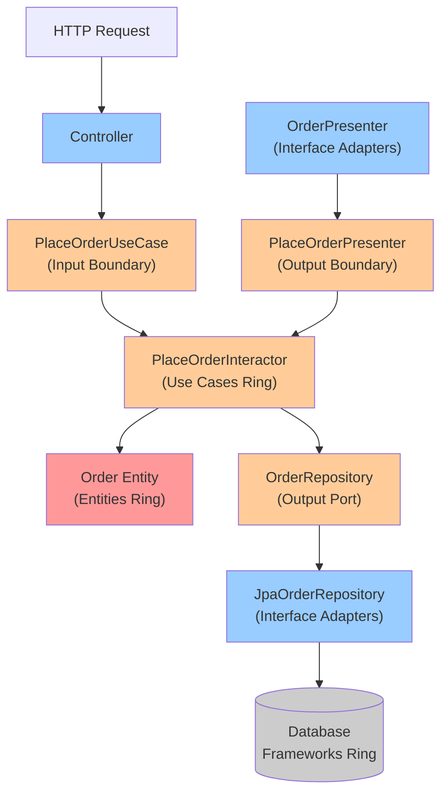

## Keywords in This File

{: .no_toc }

| #   | Keyword | Weight |
| --- | ------- | ------ |
| 1   | [Clean Architecture](#clean-architecture) | critical |
| 2   | [Onion Architecture](#onion-architecture) | high |

---

# Clean Architecture

🎯 Interview Weight: critical - appears at staff level interviews;
tests deep understanding of the Dependency Rule and testable system
design; closely linked to DDD and Hexagonal Architecture.

---

### 🎯 Model Answer

**30 seconds:**
> Clean Architecture (Robert Martin) organizes code into concentric
> rings: Entities (enterprise business rules), Use Cases (application
> business rules), Interface Adapters (controllers, presenters,
> gateways), Frameworks and Drivers (web, database). The Dependency
> Rule is absolute: source code dependencies only point inward. The
> core never knows the database exists. Use Cases never know about
> HTTP. This makes the core fully testable without any infrastructure.

**3 minutes (Senior):**
> Clean Architecture is Robert Martin's named extension of Hexagonal
> Architecture with explicit ring names and a strict Dependency Rule.
> Understanding it requires understanding the four rings and what
> each contains.
>
> The Entities ring is the innermost: enterprise-wide business rules
> that would exist even without a computer. The Order pricing formula,
> the interest calculation, the compliance rule. These change only
> when the fundamental business rules change - rarely.
>
> The Use Cases ring contains application-specific business rules:
> the "Place Order" workflow, the "Process Refund" workflow. These
> orchestrate entities to fulfill a specific use case. They know about
> Entities but not about HTTP or databases.
>
> The Interface Adapters ring contains the translation layer:
> controllers translate HTTP into Use Case calls, presenters translate
> Use Case results into HTTP responses, gateways translate Use Case
> repository calls into database queries.
>
> The Frameworks and Drivers ring is the outermost: Spring, JPA,
> the actual database, the web server. These are the lowest-level
> implementation details.
>
> The Dependency Rule: every source code dependency points inward.
> A Use Case imports from Entities (inner ring) but never from
> Controllers (outer ring). The inner rings define the interfaces
> they need; the outer rings implement them. This is Dependency
> Inversion applied systematically across all rings.
>
> The result: you can run the entire business logic (Entities + Use
> Cases) in a unit test harness with no database, no HTTP server,
> no Spring context. Replace the actual adapters with in-memory
> implementations and the business logic is fully exercisable.

*Adapting up:* Staff adds: "Clean Architecture explicitly separates
Entities from Use Cases - a distinction most teams miss. Entities
are enterprise rules that transcend any specific use case. Use
Cases are application policies specific to this system. An Order
(entity) exists independently; 'Place Order via E-commerce Portal'
(use case) is a specific workflow of this application. This
distinction matters at scale: entities should be reusable across
many use cases; use cases orchestrate entities for specific contexts."

*Adapting down:* Junior: "Clean Architecture organizes code into
four layers from inside out: core business rules (inner) to database
and web (outer). The main rule: outer layers can use inner layers,
but inner layers never use outer layers. The database layer never
appears in the business logic."

**Blank Mind Recovery:**

**(1) Restate:** "You are asking about Clean Architecture - let
me explain the four rings and the Dependency Rule that makes it
powerful."

**(2) First principles:** "Business logic should not depend on
infrastructure. Infrastructure is a detail - the database, the
web framework, the delivery mechanism. Business rules exist
independently of how they are delivered. Clean Architecture
enforces this by making all source code arrows point inward toward
the business rules."

**(3) Bridge:** "Clean Architecture is like a government. The
constitution (Entities) is the most fundamental - it changes
rarely. Legislation (Use Cases) applies the constitution to specific
situations. Government departments (Interface Adapters) implement
the laws. Citizens and external systems (Frameworks/Drivers) are
the outermost. Each layer depends on the one inside it, never the
one outside."

---

### 📘 Concept Explanation

**What it is:**
Clean Architecture is Robert Martin's architectural pattern (2012)
that organizes code into four concentric rings with an absolute
Dependency Rule: source code dependencies only point inward (toward
Entities). The four rings: Entities, Use Cases, Interface Adapters,
Frameworks and Drivers.

**The problem it solves:**
Traditional architectures allow the inner rings (business logic)
to depend on the outer rings (database, frameworks). This ties
business logic to specific technologies. Changing the database
requires changing business logic. Testing business logic requires
infrastructure. Clean Architecture breaks this by reversing all
dependencies.

**How it works:**

```
CLEAN ARCHITECTURE - CONCENTRIC RINGS

        +---------------------------------+
        |  FRAMEWORKS AND DRIVERS         |
        |  (Web, Database, UI, Devices,   |
        |   External Interfaces)          |
        |  +---------------------------+  |
        |  |  INTERFACE ADAPTERS       |  |
        |  |  (Controllers, Presenters,|  |
        |  |   Gateways, Serializers)  |  |
        |  |  +---------------------+  |  |
        |  |  |  USE CASES          |  |  |
        |  |  |  (Application       |  |  |
        |  |  |   Business Rules)   |  |  |
        |  |  |  +---------------+  |  |  |
        |  |  |  |  ENTITIES     |  |  |  |
        |  |  |  |  (Enterprise  |  |  |  |
        |  |  |  |   Business    |  |  |  |
        |  |  |  |   Rules)      |  |  |  |
        |  |  |  +---------------+  |  |  |
        |  |  +---------------------+  |  |
        |  +---------------------------+  |
        +---------------------------------+

THE DEPENDENCY RULE:
  Source code dependencies ONLY point INWARD.
  Entities know nothing outside themselves.
  Use Cases know Entities, nothing outside them.
  Interface Adapters know Use Cases and Entities.
  Frameworks know everything (but nothing knows them).

CROSSING BOUNDARIES:
  Inner ring defines interfaces (Use Case interactor)
  Outer ring implements them (Controller calls interactor)
  Outer ring implements output interfaces (Presenter
    implements the Output Boundary interface defined
    by the Use Case)
```

**The key insight:**
The Dependency Rule is the architecture. Everything else is
consequence. When all arrows point inward, the inner rings are
perfectly isolated: testable without infrastructure, deployable
in any context, understandable without knowing the outer rings.

**When to use it:**
Complex enterprise applications with rich business logic. Systems
that must be independent of frameworks (migrate from one web
framework to another). Applications that need a high-coverage
unit test suite for business logic. Systems where the domain must
survive technology changes.

**When NOT to use it:**
CRUD-heavy applications with minimal business logic - the four-ring
overhead adds boilerplate without isolation value. Early-stage
products with rapidly changing requirements - the ring boundaries
create friction when domain boundaries are being discovered.
Simple microservices that are essentially thin wrappers over
database operations.

**Alternatives:**
- Hexagonal Architecture: the conceptual parent; less naming prescriptive
- Onion Architecture: same ring structure with different ring names
- Traditional layered architecture: simpler, appropriate for CRUD

**First-principles derivation:**
Software has two types of things: policies (business rules - what the
software does) and details (how policies are implemented - database,
web, frameworks). Policies should be independent of details because
details change for different reasons (technology changes) than
policies (business changes). Clean Architecture enforces the
source-code representation of this independence: details depend
on policies, never the reverse.

---

### 💻 Code Example

```java
// --- ENTITIES (innermost - no dependencies) ---

// Domain entity (pure domain - no framework annotations)
public class Order {
    private final OrderId id;
    private final CustomerId customerId;
    private final List<OrderLine> lines;
    private OrderStatus status;
    private Money total;

    // Enterprise rule: order cannot be placed without lines
    public void place() {
        if (lines.isEmpty()) {
            throw new EmptyOrderException(
                "Cannot place order without lines"
            );
        }
        this.total = calculateTotal();
        this.status = OrderStatus.PENDING;
    }

    private Money calculateTotal() {
        return lines.stream()
            .map(l -> l.getUnitPrice()
                .multiply(l.getQuantity()))
            .reduce(Money.ZERO, Money::add);
    }
    // No imports from any outer ring
}

// --- USE CASES (knows Entities, nothing else) ---

// Input boundary - interface defined by Use Case ring
public interface PlaceOrderUseCase {
    void execute(PlaceOrderCommand command);
}

// Output boundary - interface defined by Use Case ring
public interface PlaceOrderPresenter {
    void presentSuccess(OrderId orderId);
    void presentFailure(String reason);
}

// Repository port - interface defined by Use Case ring
public interface OrderRepository {
    void save(Order order);
}

// Use Case interactor - implements input boundary
public class PlaceOrderInteractor
    implements PlaceOrderUseCase {
    private final OrderRepository orderRepository;
    private final PlaceOrderPresenter presenter;

    public PlaceOrderInteractor(
        OrderRepository orderRepository,
        PlaceOrderPresenter presenter
    ) {
        this.orderRepository = orderRepository;
        this.presenter = presenter;
    }

    @Override
    public void execute(PlaceOrderCommand command) {
        Order order = Order.create(
            command.getCustomerId(),
            command.getLines()
        );
        try {
            order.place(); // entity business rule
            orderRepository.save(order);
            presenter.presentSuccess(order.getId());
        } catch (EmptyOrderException e) {
            presenter.presentFailure(e.getMessage());
        }
    }
    // No Spring, no HTTP, no JPA imports
}

// --- INTERFACE ADAPTERS ---

// Controller: translates HTTP -> Use Case command
@RestController
public class OrderController {
    private final PlaceOrderUseCase placeOrderUseCase;

    @PostMapping("/orders")
    public ResponseEntity<OrderResponse> placeOrder(
        @RequestBody PlaceOrderRequest request
    ) {
        PlaceOrderCommand command = new PlaceOrderCommand(
            CustomerId.of(request.getCustomerId()),
            request.getLines().stream()
                .map(this::toOrderLine)
                .collect(Collectors.toList())
        );
        OrderResponsePresenter presenter =
            new OrderResponsePresenter();
        placeOrderUseCase.execute(command);
        return presenter.toHttpResponse();
    }
}

// Presenter: translates Use Case result -> HTTP response
public class OrderResponsePresenter
    implements PlaceOrderPresenter {
    private ResponseEntity<OrderResponse> response;

    @Override
    public void presentSuccess(OrderId orderId) {
        this.response = ResponseEntity.ok(
            new OrderResponse(orderId.value())
        );
    }

    @Override
    public void presentFailure(String reason) {
        this.response = ResponseEntity
            .badRequest()
            .body(new OrderResponse(null, reason));
    }

    public ResponseEntity<OrderResponse> toHttpResponse() {
        return this.response;
    }
}
```

> **Code walkthrough:** The dependency rule is fully enforced:
> `Order` and `PlaceOrderInteractor` have zero imports from outer
> rings. `PlaceOrderInteractor` depends on two interfaces
> (`OrderRepository`, `PlaceOrderPresenter`) defined in the Use Case
> ring. The controller and presenter are in the Interface Adapters
> ring and import from the Use Case ring (inner). The JPA
> implementation of `OrderRepository` would be in the outermost ring.
> To test `PlaceOrderInteractor`: use an in-memory `OrderRepository`
> and a test `PlaceOrderPresenter`. No Spring, no database. Full
> business logic coverage.

```java
// TESTING: Use Case with no infrastructure
class PlaceOrderInteractorTest {
    private final List<Order> savedOrders = new ArrayList<>();
    private OrderRepository inMemoryRepo =
        order -> savedOrders.add(order);

    private String successOrderId;
    private String failureReason;
    private PlaceOrderPresenter testPresenter =
        new PlaceOrderPresenter() {
            @Override
            public void presentSuccess(OrderId id) {
                successOrderId = id.value();
            }
            @Override
            public void presentFailure(String reason) {
                failureReason = reason;
            }
        };

    private final PlaceOrderInteractor interactor =
        new PlaceOrderInteractor(inMemoryRepo, testPresenter);

    @Test
    void placing_empty_order_reports_failure() {
        interactor.execute(new PlaceOrderCommand(
            CustomerId.of("cust-1"),
            Collections.emptyList()
        ));

        assertThat(failureReason).isNotNull();
        assertThat(savedOrders).isEmpty();
        assertThat(successOrderId).isNull();
    }
}
// No @SpringBootTest, no mocks, no database.
// Tests run in < 5ms.
```

> **Code walkthrough:** The test creates the interactor with two
> anonymous implementations of the interfaces: a lambda for the
> repository and an anonymous class for the presenter. The test
> verifies that placing an empty order causes the presenter to receive
> a failure and that no order is saved. This is the Clean Architecture
> payoff: 100% of the business logic is testable with pure Java
> objects, in under 5ms. The actual database and HTTP stack are not
> needed for these assertions.

---

### 🎓 Answers by Seniority

**Junior / Mid (0-5 years):**
> Clean Architecture organizes code into four rings from inside out:
> Entities (core business rules), Use Cases (application workflows),
> Interface Adapters (controllers, serializers), and Frameworks
> (web, database). The rule: each ring can only depend on the ring
> inside it - never the outside. The result: the business logic
> (inner rings) never knows about Spring, JPA, or HTTP. It can be
> tested with plain Java objects, no infrastructure.

*Push deeper:* Explain the difference between Entities and Use
Cases. Entities contain enterprise-wide rules (calculation formulas).
Use Cases contain application-specific workflows (the sequence of
steps to "place an order").

---

**Senior / Staff (5+ years):**
> Clean Architecture is Robert Martin's operationalization of the
> Dependency Inversion Principle at architecture scale. The four
> rings give names to what Hexagonal Architecture calls "inside the
> hexagon" and "adapters." The Entities/Use Cases distinction adds
> precision: enterprise rules (Entities) are reusable across many
> applications; application rules (Use Cases) are specific to this
> system.
>
> The implementation consequence that surprises most developers:
> the Use Case ring defines TWO sets of interfaces, not one. The
> Input Boundary (use case interface called by the controller) and
> the Output Boundary (presenter interface called by the use case).
> The presenter pattern - Use Case calls a presenter interface rather
> than returning a value - is the key to keeping the Use Case ring
> independent of HTTP response concerns.
>
> In practice: I apply Clean Architecture to domain-heavy bounded
> contexts where business rules are complex. For CRUD services,
> a simpler layered architecture is appropriate. The overhead of
> presenter interfaces and Use Case interactors is justified only
> when the Use Case logic is substantive.

---

### ⚠️ Common Misconceptions

| Misconception | Reality |
|---|---|
| Clean Architecture and Hexagonal Architecture are identical | Hexagonal Architecture is the parent concept; Clean Architecture adds named rings (Entities, Use Cases, Interface Adapters, Frameworks) and the Entities vs Use Cases distinction |
| The Dependency Rule means interfaces everywhere | Interfaces are used to CROSS ring boundaries. Within a ring, concrete classes are fine |
| Use Cases are just service classes | Use Cases follow the Interactor pattern with Input Boundary (interface), Output Boundary (presenter interface), and Interactor (implementation) |
| Entities are database entities (JPA @Entity classes) | Entities in Clean Architecture are enterprise business rules with domain behavior - NOT JPA @Entity classes. JPA entities live in the outermost Frameworks ring |
| Clean Architecture makes code more complex | It makes the INNER rings simpler (pure Java, no frameworks). The complexity is in the outer rings (adapters) which is where technology complexity belongs |

---

### 🚨 Failure Modes and Diagnosis

**Failure 1: Use Case importing from Frameworks ring**

*Symptom:* Use Case interactors have `import org.springframework`,
`import javax.persistence`, or `import com.fasterxml.jackson`.
The Use Case cannot run without Spring context.

*Root cause:* Dependency Rule violation. The inner ring imported
the outer ring.

*Diagnostic:*
```bash
grep -r "org.springframework\|javax.persistence\
  \|com.fasterxml" src/main/java/com/example/usecase/
# Any hits = Dependency Rule violation
```

*Fix:* Define interfaces in the Use Case ring. Move the
framework-dependent implementation to the Interface Adapters or
Frameworks ring. Use constructor injection of the interface.

*Prevention:* ArchUnit rule: classes in `..usecase..` must not
depend on `org.springframework` or `javax.persistence`.

**Failure 2: Returning domain objects from Use Case**

*Symptom:* Use Case interactor returns a domain `Order` object
to the controller. When the `Order` class changes, the controller
breaks.

*Root cause:* Use Case returning inner-ring objects to the outer
ring. The outer ring depends on the inner ring's implementation
details.

*Fix:* Introduce an Output Boundary / Presenter interface. The
Use Case calls `presenter.presentOrder(orderId, total, status)`.
The presenter constructs the HTTP response DTO.

*Prevention:* Use Case methods should return void (invoke the
presenter) or return a simple Result type, not domain entities.

**Failure 3: Anemic Use Cases (thin interactors)**

*Symptom:* Use Case interactors are one-line wrappers over a
single service method. Clean Architecture is implemented but adds
ceremony without isolation value.

*Root cause:* Clean Architecture applied to CRUD operations where
it is not needed.

*Fix:* Apply Clean Architecture only to domain-rich use cases.
For simple CRUD, use a thinner pattern (controller -> service
-> repository).

---

### 🎯 Interview Deep-Dive

| Preparation | Target |
|---|---|
| Time to prep | 25 minutes |
| Core themes | Dependency Rule, four rings, Input/Output Boundaries, testability |
| Seniority signal | Junior: ring names; Senior: full implementation; Staff: when to apply |
| Common trap | Confusing JPA @Entity with Clean Architecture Entities |
| Staff differentiator | Entities vs Use Cases distinction, Output Boundary / Presenter pattern |

---

**Q1 [JUNIOR]: What is the Dependency Rule in Clean Architecture?**

*Why they ask:* The Dependency Rule is the heart of Clean Architecture.
Tests whether the candidate understands the core principle.

*Likely follow-up:* "What happens if the Dependency Rule is violated?"

The Dependency Rule: source code dependencies only point inward
toward the Entities ring. An inner ring never imports from an outer
ring.

In concrete terms: the Entities ring has zero imports from any
other ring. The Use Cases ring imports from Entities only. The
Interface Adapters ring imports from Use Cases and Entities. The
Frameworks ring can import from anything.

What happens when violated: business logic becomes coupled to
infrastructure. A Use Case that imports from Spring cannot be
tested without a Spring context. A Use Case that imports from JPA
cannot be tested without a database. The entire testability benefit
is destroyed.

To cross ring boundaries while respecting the rule: define an
interface in the inner ring, implement it in the outer ring. The
inner ring defines `OrderRepository` (interface). The outer ring
implements `JpaOrderRepository`. The dependency arrow points inward
(Use Case -> interface), while the implementation arrow points
outward (JPA implements Use Case interface). This is Dependency
Inversion.

*What separates good from great:* Most candidates describe the
rule. Great candidates describe the mechanism for crossing
boundaries without violating it (inner defines interface, outer
implements = Dependency Inversion) and explain which tests fail
when the rule is violated.

---

**Q2 [MID]: What is the difference between Entities and Use Cases
in Clean Architecture?**

*Why they ask:* The key distinction that separates Clean Architecture
from "just using interfaces."

*Likely follow-up:* "Give an example of each."

Entities contain enterprise-wide business rules: rules that would
exist even without this specific application. The formula for
calculating compound interest exists whether the application is
a banking web app or a command-line tool. The rule that "an order
cannot be placed without order lines" is a business rule that
transcends any specific ordering system.

Entities are stable. They rarely change. They are the most valuable
code in the system. In DDD terms: Entities are Aggregates, Value
Objects, and Domain Services.

Use Cases contain application-specific business rules: the specific
workflows of this application. "Place Order via the E-commerce Web
Portal" is a Use Case. It orchestrates entities to fulfill a
specific workflow. The same enterprise Entities might be used by
a "Place Order via Wholesale API" Use Case with different rules.

Use Cases are more likely to change as the application evolves.
Entities are the most stable.

Example: `Money.multiply(Rate)` is Entity logic - a financial
calculation that transcends any specific use case.
`ProcessMortgageApplication(application)` is a Use Case - a
specific workflow for this system.

*What separates good from great:* Most candidates describe Use Cases
as "service classes." Great candidates explain the stability
difference, give the DDD mapping (Entities = Aggregates, Use Cases
= Application Services), and give a concrete example pair.

---

**Q3 [SENIOR]: Why does the presenter pattern matter in Clean Architecture?**

*Why they ask:* The Output Boundary / Presenter is the most
misunderstood part of Clean Architecture.

*Likely follow-up:* "What is wrong with having the Use Case return a DTO?"

The typical simplification: the Use Case interactor returns a DTO
to the controller. The controller uses the DTO to build the HTTP
response.

The problem: the Use Case is now coupled to the shape of the HTTP
response. If the web API needs to add a new field, the Use Case
DTO must change. If a mobile app needs different fields, a new DTO
is needed - which means a new Use Case or a bag of all possible
fields.

The presenter pattern fixes this: the Use Case defines an Output
Boundary interface with methods like `presentSuccess(OrderId,
total)`. The controller provides a concrete implementation (the
presenter) that constructs the HTTP response. The Use Case calls
the presenter with domain data; the presenter transforms it into
the response format.

Now: if the mobile API needs different fields, create a different
Presenter implementation. The Use Case does not change.

In practice: many implementations simplify by using a Response
Model (DTO) returned from the Use Case. This is a reasonable
pragmatic trade-off for simpler use cases but loses the output
format flexibility.

*What separates good from great:* Most candidates skip the presenter
and return DTOs. Great candidates explain the coupling problem
with DTO return values, describe the presenter pattern solution,
and acknowledge the pragmatic simplification with what is lost.

---

**Q4 [STAFF]: When would you NOT use Clean Architecture?**

*Why they ask:* Tests whether the candidate applies the pattern
contextually rather than dogmatically.

*Likely follow-up:* "What is the cost of Clean Architecture?"

Clean Architecture's costs: four rings of code for every feature.
Every interaction requires: an Input Boundary interface, an Output
Boundary interface, an Interactor implementation, a Controller
adapter, a Presenter adapter, a Gateway adapter. For a feature
that is "add a field to the user profile," this creates 6+ classes
where 2 would suffice.

I would not use Clean Architecture for: (1) CRUD microservices
with thin domain logic - the overhead is not justified; (2) early-stage
product development where domain boundaries are being discovered
- the ring boundaries create friction when everything is changing;
(3) simple query APIs - the Use Case interactor pattern adds overhead
without isolating meaningful business logic.

The signal that Clean Architecture IS justified: the business rules
are complex enough to warrant isolation, there are multiple input
adapters that must exercise the same Use Case, and the team is
large enough that the clear ring boundaries help with communication.

Pragmatic recommendation: use Clean Architecture for domain-rich
bounded contexts. Use simpler patterns (Layered, Spring Data) for
CRUD supporting features in the same codebase.

*What separates good from great:* Most candidates describe it as
always appropriate. Great candidates give specific disqualifying
conditions and the signal that justifies overhead.

---

**Q5 [STAFF]: How does Clean Architecture relate to DDD?**

*Why they ask:* Staff signal: connecting multiple architectural
patterns into a coherent design approach.

*Likely follow-up:* "What goes in the Entities ring vs the Use Cases ring?"

Clean Architecture provides the structural pattern. DDD provides
the tactical design patterns for filling the inner rings.

The mapping:

Clean Architecture Entities ring = DDD Domain Model layer.
Contains: Aggregates, Entities (DDD), Value Objects, Domain Events,
Domain Services. Enterprise business rules.

Clean Architecture Use Cases ring = DDD Application Services.
Contains: Application Services, Command/Query objects, Input/Output
Boundaries. Application Services are thin orchestrators: load
aggregate, call domain method, publish events, persist.

Clean Architecture Interface Adapters = DDD Infrastructure
boundary + Anti-Corruption Layers. Repository implementations,
event publishers, external system adapters.

Clean Architecture Frameworks = DDD Infrastructure. JPA, Spring,
the actual database, external API clients.

DDD's Bounded Context maps to one Clean Architecture application.
Multiple Bounded Contexts communicate through the outermost ring
(Infrastructure), never through the inner rings.

*What separates good from great:* Most candidates describe the two
patterns separately. Great candidates give the specific ring-to-DDD
mapping and describe where ACLs live (Interface Adapters ring).

---

**Q6 [SENIOR]: How do you organize a Clean Architecture project's
file structure?**

*Why they ask:* Tests whether the candidate can translate the
conceptual pattern into a concrete, reproducible codebase structure.

*Likely follow-up:* "How do you prevent dependency violations?"

Package structure:

```
src/main/java/com/example/
  domain/                    <- Entities ring
    model/
      Order.java
      Money.java
      OrderPlaced.java
    service/
      PricingService.java

  application/               <- Use Cases ring
    port/
      in/                    <- Input Boundaries
        PlaceOrderUseCase.java
      out/                   <- Output Boundaries
        PlaceOrderPresenter.java
        OrderRepository.java
    usecase/
      PlaceOrderInteractor.java

  adapter/                   <- Interface Adapters ring
    in/
      web/
        OrderController.java
        OrderResponsePresenter.java
    out/
      persistence/
        JpaOrderRepository.java
      email/
        EmailOrderNotifier.java

  infrastructure/            <- Frameworks ring
    config/
      SpringConfig.java
    Main.java
```

ArchUnit enforcement:
```java
@ArchTest
static final ArchRule dependencyRule =
    noClasses()
        .that().resideInAPackage("..domain..")
        .should().dependOnClassesThat()
        .resideOutsideOfPackage("..domain..");
```

*What separates good from great:* Most candidates give a conceptual
description. Great candidates give the specific package tree and
the ArchUnit rule. The `port/in` vs `port/out` separation is the
implementation detail that shows real experience.

---

**Q7 [STAFF]: What is the cost of Clean Architecture at team scale?**

*Why they ask:* Staff signal: architectural decisions must account
for organizational dynamics.

*Likely follow-up:* "How do you onboard new engineers?"

Onboarding time: new engineers need to understand four rings,
the Dependency Rule, Input/Output Boundaries, and the Presenter
pattern before they can contribute effectively. A junior engineer
used to Spring MVC may take 2-4 weeks to become productive.

Verbosity: Clean Architecture generates 4-6x more classes than
a simple layered approach for the same feature. Code review takes
longer.

Benefits at team scale: the ring boundaries provide a clear
communication framework. "This is an Entity concern vs a Use Case
concern vs an Adapter concern" is a shared vocabulary. Junior
engineers who understand the Dependency Rule can contribute
confidently to the inner rings without understanding the full
framework stack.

ROI: positive when the domain is complex, the team is large, and
the system is long-lived. Negative when the team is small, the
domain is CRUD-heavy, or the system is a short-lived experiment.

*What separates good from great:* Most candidates describe only
technical benefits. Great candidates give specific organizational
costs (onboarding time, verbosity), the conditions for positive
vs negative ROI, and the team communication benefit as a scale
advantage.

---

**Q8 [STAFF]: How does Clean Architecture enforce the Dependency
Rule with tooling?**

*Why they ask:* Tests whether the candidate moves from principle
to practice - automated enforcement.

*Likely follow-up:* "What happens without automated enforcement?"

Without automated enforcement, the Dependency Rule is a convention
that erodes over time. Developers under time pressure take shortcuts
("just import this service temporarily"). Over 6-12 months, the
inner rings accumulate outer ring imports. The architecture exists
on paper but not in code.

Automated enforcement options:

ArchUnit (Java): Declare the dependency rule as a test that
runs in CI:
```java
@ArchTest
static final ArchRule noOutwardDependencies =
    noClasses()
        .that().resideInAPackage("..domain..")
        .should().dependOnClassesThat()
        .resideInAPackage("..adapter..");
```
Any violation fails the build immediately.

Maven/Gradle enforcer: Module-level enforcement. The domain module
declares no dependency on the adapter module. If a developer tries
to add the dependency, the build fails.

Package-level lint: Dependency-cruiser (JavaScript/TypeScript)
enforces the same rule for JavaScript projects.

Architecture decision record: Document the Dependency Rule as an
ADR. When a developer proposes a violation, the ADR is the reference.

The test: "Would a junior engineer violating the Dependency Rule
fail CI within 2 minutes of pushing?" If yes, the rule is enforced.
If not, it is a guideline that will be violated.

*What separates good from great:* Most candidates describe manual
code review. Great candidates give the specific ArchUnit implementation,
describe the erosion pattern without enforcement, and give the
"2 minutes to CI failure" test for enforcement quality.

---

**Q9 [STAFF]: How do you handle framework annotations in Clean Architecture?**

*Why they ask:* Tests practical wisdom about Clean Architecture's
most common implementation tension: Spring annotations.

*Likely follow-up:* "Can domain entities have @Entity annotations?"

The tension: Spring and JPA annotations are convenient. Placing
them in the domain is tempting.

The rule: inner rings (Entities, Use Cases) must not contain
framework annotations. `@Entity`, `@Table`, `@Column` are JPA
annotations that belong in the Frameworks ring. `@Autowired`,
`@Component`, `@Transactional` are Spring annotations that belong
in the Interface Adapters or Frameworks ring.

The implementation: separate domain model from persistence model.
`Order` (domain entity, no annotations). `OrderJpaEntity` (JPA
entity with `@Entity`, `@Table`, `@Column`, lives in the adapter
layer). `OrderMapper` converts between them.

For Spring configuration: Spring's `@Configuration`, `@Bean`
classes live in the Frameworks ring. They wire the domain objects
(Use Case interactors) to their dependencies (adapter implementations).
The domain classes themselves never have Spring annotations.

The pragmatic exception acknowledged by many practitioners:
`@Value` on domain configuration classes (for reading application
properties) is a common violation that many teams accept. The
principle remains: minimize framework annotations in the inner
rings. Zero in the Entities ring. Minimal in the Use Cases ring.

*What separates good from great:* Most candidates say "no annotations
in the domain" without practical details. Great candidates explain
the domain-vs-JPA-entity split, the mapper pattern, and acknowledge
the pragmatic exceptions that real teams make with Spring annotations.

---

### ⚖️ Comparison Table

| Property | Clean Architecture | Hexagonal Architecture | Layered Architecture |
|---|---|---|---|
| Origin | Robert Martin, 2012 | Alistair Cockburn, 2005 | Classic N-Tier |
| Ring structure | 4 named rings | Hexagon interior + adapters | 3 layers |
| Entities vs Use Cases | Explicit distinction | Not named | Not distinguished |
| Presenter pattern | Explicit (Output Boundary) | Optional | Not present |
| Dependency rule | Absolute (inward only) | Same (domain inward) | Top-down |
| Domain isolation | Complete | Complete | Partial |
| Testing domain | No infrastructure needed | No infrastructure needed | Repository must be mocked |
| Overhead | High (4-6x vs layered) | Medium (2-3x vs layered) | Low (baseline) |
| Best for | Complex domain + large team | Complex domain + any size | CRUD + small team |
| DDD alignment | Native | Good | Poor |

---

### 🏛️ System Design

**Applying Clean Architecture in a Payment Processing Service:**

```
PAYMENT SERVICE - CLEAN ARCHITECTURE VIEW

Entities ring:
  - Money (Value Object): amount, currency, arithmetic
  - PaymentMethod (Entity): card, bank, wallet
  - Transaction (Aggregate): authorized, captured, refunded
  - PaymentRule (Domain Service): eligibility check

Use Cases ring:
  - AuthorizePaymentUseCase + Interactor
  - CapturePaymentUseCase + Interactor
  - RefundPaymentUseCase + Interactor
  - Input Boundaries: command interfaces
  - Output Boundaries: presenter interfaces
  - Port: PaymentGatewayPort (interface to external gateway)
  - Port: TransactionRepository (interface)

Interface Adapters ring:
  - REST controllers -> use case commands
  - Presenters -> HTTP responses
  - StripeGatewayAdapter implements PaymentGatewayPort
  - JpaTransactionRepository implements TransactionRepository

Frameworks ring:
  - Spring Boot wiring
  - JPA persistence
  - Stripe SDK
  - HTTP server

QUALITY ATTRIBUTES ADDRESSED:
  - Testability: Authorize/Capture/Refund fully testable
    without Stripe API (inject mock gateway adapter)
  - Security: gateway credentials isolated in outermost
    ring; domain never sees raw card numbers
  - Replaceability: swap Stripe -> Adyen by implementing
    a new GatewayAdapter; no inner ring changes
```

---

### 📊 Diagram

```
CLEAN ARCHITECTURE DEPENDENCY FLOW

  [HTTP Request]
        |
        v
  [Controller] -> [PlaceOrderUseCase] interface
  (Interface      (Input Boundary - Use Case ring)
   Adapters)               |
                           v
               [PlaceOrderInteractor]
               (Use Case ring)
                    |        |
                    v        v
               [Order]  [OrderRepository] interface
               (Entity) (Output Port - Use Case ring)
                              |
                              v
               [JpaOrderRepository]
               (Interface Adapters)
                    |
                    v
               [Database]
               (Frameworks)

  ALL ARROWS POINT INWARD (or to interfaces in inner rings)
```



> **Diagram walkthrough:** All arrows flow from outer rings inward
> or stay within a ring. The Controller (Interface Adapters) depends
> on the `PlaceOrderUseCase` interface (Use Case ring), not on the
> Interactor class. The Interactor depends on the `OrderRepository`
> interface (Use Case ring), which is implemented by `JpaOrderRepository`
> (Interface Adapters). The Entities ring has no outgoing arrows to
> outer rings. The Output Boundary (`PlaceOrderPresenter`) is defined
> in the Use Case ring and implemented in Interface Adapters - the
> Presenter arrow flows outward (implementation) but the interface
> dependency arrow flows inward (Use Case ring defines the interface).

---

---

# Onion Architecture

🎯 Interview Weight: high - closely related to Clean Architecture
and Hexagonal; tests whether the candidate can distinguish
architectural approaches with similar goals.

---

### 🎯 Model Answer

**30 seconds:**
> Onion Architecture (Jeffrey Palermo, 2008) organizes code into
> concentric rings with the domain model at the center. Moving
> outward: Domain Services, Application Services, then Infrastructure.
> The core principle: all coupling flows inward. The domain model
> depends on nothing. Infrastructure depends on everything inward.
> Interfaces defined by inner rings are implemented by outer rings.

**3 minutes (Senior):**
> Onion Architecture was introduced by Jeffrey Palermo in 2008.
> It shares the same core insight as Clean Architecture and Hexagonal
> Architecture - domain at the center, infrastructure at the periphery,
> all coupling flowing inward - but uses different ring names and
> makes the Domain Services ring explicit.
>
> The four rings: Domain Model (innermost - Entities, Value Objects,
> Aggregates), Domain Services (domain logic that spans multiple
> aggregates), Application Services (use case orchestration), and
> Infrastructure (database, web, external services).
>
> The key contribution: the explicit Domain Services ring. In DDD,
> a Domain Service is logic that involves multiple aggregates and
> cannot be placed in any single aggregate. A "transfer money between
> accounts" operation spans two account aggregates - it is a Domain
> Service. Clean Architecture subsumes this in the Use Cases ring;
> Onion Architecture gives it a dedicated layer.
>
> The same Dependency Rule applies: all source code arrows point
> inward. Infrastructure depends on Application Services. Application
> Services depend on Domain Services. Domain Services depend on
> the Domain Model. The Domain Model depends on nothing.

*Adapting up:* Staff adds: "Onion Architecture's explicit Domain
Services ring is the right home for Domain Services in DDD:
cross-aggregate logic like fund transfers, policy evaluation that
spans multiple aggregates, and domain invariants that involve more
than one Aggregate Root."

*Adapting down:* Junior: "Onion Architecture is like Clean
Architecture: business logic at the center, database at the outside.
The layers going outward are: Domain Model (core rules), Domain
Services (logic using multiple domain objects), Application Services
(workflow coordination), and Infrastructure (database, web)."

**Blank Mind Recovery:**

**(1) Restate:** "You are asking about Onion Architecture - let
me explain its ring structure and how it compares to Clean
Architecture."

**(2) First principles:** "Domain logic should not depend on
infrastructure. Onion Architecture puts the domain at the center
and infrastructure at the periphery. All code dependencies flow
toward the center."

**(3) Bridge:** "Think of an actual onion. The core (domain model)
is the most essential. Each layer outward adds context and capability
but depends on the core. Peel away the infrastructure layers -
the core is still intact."

---

### 📘 Concept Explanation

**What it is:**
Onion Architecture (Jeffrey Palermo, 2008) is a layered architecture
pattern with the Domain Model at the center, surrounded by Domain
Services, Application Services, and Infrastructure rings. All
dependencies flow inward. Infrastructure depends on the domain;
the domain knows nothing about infrastructure.

**The problem it solves:**
Same as Clean Architecture and Hexagonal Architecture: traditional
layered architecture creates a dependency from business logic toward
the database. Onion Architecture inverts this by making all
dependencies point toward the domain core.

**How it works:**

```
ONION ARCHITECTURE - RING STRUCTURE

        +-------------------------------+
        |  INFRASTRUCTURE               |
        |  (Database, Web, External     |
        |   APIs, File System)          |
        |  +-------------------------+  |
        |  |  APPLICATION SERVICES   |  |
        |  |  (Use Case Orchestration|  |
        |  |   Transaction Boundary) |  |
        |  |  +-------------------+  |  |
        |  |  |  DOMAIN SERVICES  |  |  |
        |  |  |  (Cross-Aggregate |  |  |
        |  |  |   Domain Logic,   |  |  |
        |  |  |   Domain Ports)   |  |  |
        |  |  |  +-------------+  |  |  |
        |  |  |  | DOMAIN MODEL|  |  |  |
        |  |  |  | (Entities,  |  |  |  |
        |  |  |  |  Value Obj, |  |  |  |
        |  |  |  |  Aggregates)|  |  |  |
        |  |  |  +-------------+  |  |  |
        |  |  +-------------------+  |  |
        |  +-------------------------+  |
        +-------------------------------+

DEPENDENCY RULE:
  Infrastructure -> Application Services
  -> Domain Services -> Domain Model
  Domain Model depends on NOTHING external.
```

**The key insight:**
The Domain Services ring captures the DDD Domain Service concept:
logic that spans multiple aggregates or involves domain invariants
that cannot belong to a single aggregate. Fund transfer logic
(involves both source and destination accounts) is a Domain Service.
This ring is explicit in Onion; implicit (merged with Use Cases)
in Clean Architecture.

**When to use it:**
Identical conditions to Clean Architecture: complex domain,
DDD-aligned design, multiple infrastructure options. Choose Onion
when the Domain Services distinction is important for your team
(DDD-heavy projects).

**When NOT to use it:**
Same as Clean Architecture: CRUD systems, unstable domains, thin
business logic, small teams.

---

### 💻 Code Example

```java
// RING 1: DOMAIN MODEL (innermost - pure domain)

public class BankAccount {
    private final AccountId id;
    private Money balance;

    // Domain rule: cannot overdraw
    public void withdraw(Money amount) {
        if (amount.isGreaterThan(balance)) {
            throw new InsufficientFundsException(
                "Balance: " + balance
                + ", requested: " + amount
            );
        }
        this.balance = balance.subtract(amount);
    }

    public void deposit(Money amount) {
        this.balance = balance.add(amount);
    }
}

// RING 2: DOMAIN SERVICES (cross-aggregate logic)

// Repository interface defined here (infrastructure impl)
public interface AccountRepository {
    Optional<BankAccount> findById(AccountId id);
    void save(BankAccount account);
}

// Domain Service: spans TWO BankAccount aggregates
// Logic cannot belong to either account alone
public class MoneyTransferDomainService {
    // Pure domain - no infrastructure dependencies
    public void transfer(
        BankAccount source,
        BankAccount target,
        Money amount
    ) {
        source.withdraw(amount);
        target.deposit(amount);
    }
}

// RING 3: APPLICATION SERVICES (use case orchestration)

public class MoneyTransferApplicationService {
    private final AccountRepository accountRepository;
    private final MoneyTransferDomainService domainService;

    public void transfer(
        AccountId sourceId,
        AccountId targetId,
        Money amount
    ) {
        // Load
        BankAccount source = accountRepository
            .findById(sourceId)
            .orElseThrow(() ->
                new AccountNotFoundException(sourceId));
        BankAccount target = accountRepository
            .findById(targetId)
            .orElseThrow(() ->
                new AccountNotFoundException(targetId));
        // Delegate to domain service
        domainService.transfer(source, target, amount);
        // Persist
        accountRepository.save(source);
        accountRepository.save(target);
    }
    // No HTTP, no JPA imports here
}

// RING 4: INFRASTRUCTURE (outermost)

@Repository
public class JpaAccountRepository
    implements AccountRepository {
    private final JpaAccountJpaRepository jpaRepo;

    @Override
    public Optional<BankAccount> findById(AccountId id) {
        return jpaRepo.findById(id.value())
            .map(AccountMapper::toDomain);
    }

    @Override
    public void save(BankAccount account) {
        jpaRepo.save(AccountMapper.toJpa(account));
    }
}

@RestController
public class MoneyTransferController {
    private final MoneyTransferApplicationService service;

    @PostMapping("/accounts/transfer")
    public ResponseEntity<Void> transfer(
        @RequestBody TransferRequest request
    ) {
        service.transfer(
            AccountId.of(request.getSourceId()),
            AccountId.of(request.getTargetId()),
            Money.of(request.getAmount(),
                     request.getCurrency())
        );
        return ResponseEntity.ok().build();
    }
}
```

> **Code walkthrough:** The four rings are explicit in the code.
> `BankAccount` (Domain Model) has pure business behavior - no
> annotations, no infrastructure imports. `MoneyTransferDomainService`
> (Domain Services) is the key Onion Architecture concept: the
> transfer logic cannot belong to either account aggregate, so it
> lives in a cross-aggregate domain service. `AccountRepository` is
> defined in the Domain Services ring (inner) and implemented in
> Infrastructure (outer) - the dependency arrow points inward.
> `MoneyTransferApplicationService` (Application Services) orchestrates:
> loads aggregates, delegates to domain service, persists. The
> controller (Infrastructure) is a thin adapter. All arrows point
> inward.

---

### 🎓 Answers by Seniority

**Junior / Mid (0-5 years):**
> Onion Architecture is similar to Clean Architecture: business
> logic at the center, infrastructure at the outside. The layers
> from inside to outside: Domain Model (core entities and rules),
> Domain Services (business logic that uses multiple domain objects),
> Application Services (workflows and orchestration), and
> Infrastructure (database, web API, external services). The key
> rule: each layer can only use the layers inside it.

---

**Senior / Staff (5+ years):**
> Onion Architecture and Clean Architecture are sibling patterns
> with the same fundamental principle but different ring names.
> Onion Architecture's explicit Domain Services ring maps directly
> to DDD's Domain Service concept - logic that spans multiple
> aggregates. Clean Architecture subsumes this in the Use Cases ring.
>
> I prefer Onion Architecture when working with DDD-heavy teams
> because "Domain Service vs Application Service" is a distinction
> the team already uses. The implementation is almost identical.

---

### ⚠️ Common Misconceptions

| Misconception | Reality |
|---|---|
| Onion and Clean Architecture are the same | They share the same principle but Onion names four rings (including Domain Services) while Clean Architecture names a different four (Interface Adapters, Frameworks) |
| Domain Services = Spring @Service classes | Domain Services in Onion are pure domain-logic components with no infrastructure dependencies that coordinate multiple aggregates |
| Application Services are use cases | Application Services are orchestrators that manage transaction scope and call domain logic; the logic itself lives in Domain Services and Domain Model |
| Infrastructure ring is only external systems | Infrastructure ring contains ALL infrastructure: database, web framework, external APIs, file system, email |
| Onion is more complex than Hexagonal | They have the same structural principle; Onion adds naming conventions for more rings |

---

### 🚨 Failure Modes and Diagnosis

**Failure 1: Application Services with domain logic**

*Symptom:* Application Services contain complex business rules
instead of delegating to domain objects. Domain model is anemic.

*Diagnostic:*
```java
// Symptom: business logic in Application Service (wrong!)
public class OrderApplicationService {
    public void placeOrder(OrderCommand cmd) {
        // Business rule should be in Order aggregate
        if (cmd.getItems().isEmpty()) {
            throw new InvalidOrderException("no items");
        }
        // Pricing calculation should be in domain
        BigDecimal total = calculateTotal(cmd.getItems());
        orderRepository.save(new Order(cmd, total));
    }
}
```

*Fix:* Move business rules into domain objects. `Order.place()`
validates its own state. Application Service is: load, call domain
method, save.

**Failure 2: Domain Services with infrastructure dependencies**

*Symptom:* A Domain Service imports Spring, JPA, or HTTP clients.

*Diagnostic:*
```bash
grep -r "org.springframework\|javax.persistence" \
  src/main/java/com/example/domain/service/
# Any hits = infrastructure leaking into domain services
```

*Fix:* Extract the infrastructure call to an interface (defined
in Domain Services ring), implement it in Infrastructure.

**Failure 3: Repository interfaces in Infrastructure ring**

*Symptom:* The `AccountRepository` interface is in the
Infrastructure package. Domain Services import from Infrastructure.

*Fix:* Move repository interfaces to the Domain Services ring.
Infrastructure implements them. Dependency arrow now points inward.

---

### 🎯 Interview Deep-Dive

| Preparation | Target |
|---|---|
| Time to prep | 20 minutes |
| Core themes | Ring structure, Domain Services distinction, comparison with Clean Architecture |
| Seniority signal | Junior: ring names; Senior: Domain Services vs Application Services; Staff: DDD mapping |
| Common trap | Confusing Onion's Domain Services with Spring @Service classes |
| Staff differentiator | Domain Services ring = DDD Domain Services; ACL as Infrastructure adapter |

---

**Q1 [JUNIOR]: What are the rings in Onion Architecture?**

*Why they ask:* Baseline knowledge check.

*Likely follow-up:* "What is the dependency rule?"

Onion Architecture has four rings from inside to outside:

Domain Model (innermost): Entities, Value Objects, Aggregates.
Pure domain objects with business behavior. No external dependencies.
`BankAccount` with `withdraw(money)` behavior.

Domain Services: Business logic that spans multiple aggregates.
`MoneyTransferService` that moves money between two accounts.
Repository and notification interfaces are defined here (implemented
in Infrastructure).

Application Services: Use case orchestration. Entry point for
external requests. Loads domain objects, calls domain logic, manages
transaction boundaries. `MoneyTransferApplicationService.transfer()`.

Infrastructure: The outermost ring. Database implementations (JPA
repositories), web controllers (REST), external API clients,
email senders.

The dependency rule: Infrastructure depends on Application Services.
Application Services depend on Domain Services. Domain Services
depend on Domain Model. Domain Model depends on nothing.

*What separates good from great:* Most candidates describe two
or three rings. Great candidates give all four with an example
for each and explain the Domain Services ring - cross-aggregate
business logic and repository interface definitions.

---

**Q2 [MID]: What is the difference between a Domain Service and
an Application Service in Onion Architecture?**

*Why they ask:* The key distinction separating Onion from simpler
layered approaches.

*Likely follow-up:* "Give an example of logic that belongs in each."

Domain Service: pure domain logic that spans multiple aggregates.
No infrastructure dependencies. No transaction management. No HTTP
knowledge. `MoneyTransferDomainService.transfer(source, target,
amount)` calls `source.withdraw()` and `target.deposit()`. The
logic is "what happens in a transfer" - a domain rule.

Application Service: use case orchestration. Infrastructure-aware
(manages transactions, loads from repositories, publishes events).
Delegates to domain objects; contains no business logic itself.
`MoneyTransferApplicationService.transfer(sourceId, targetId,
amount)` loads both accounts from the repository, calls the Domain
Service, and saves both accounts.

The test: "Does this logic require knowing about transactions,
persistence, or external systems?" If yes: Application Service.
"Does this logic involve a business rule that spans multiple
aggregates?" If yes: Domain Service.

Another test: "Could this logic be reused in a different application
with the same domain?" If yes (domain rule): Domain Service. If
no (workflow specific to this application): Application Service.

*What separates good from great:* Most candidates say "Domain
Service does domain stuff." Great candidates give the specific
criteria (infrastructure-awareness, cross-aggregate logic),
testability consequence, and the reuse test.

---

**Q3 [SENIOR]: How does Onion Architecture compare to Clean Architecture?**

*Why they ask:* Tests architectural breadth - precise comparison
of related patterns.

*Likely follow-up:* "When would you choose one over the other?"

Both share the same fundamental principle: domain at the center,
all dependencies pointing inward.

Key differences:

Ring naming: Onion uses "Domain Model, Domain Services, Application
Services, Infrastructure." Clean Architecture uses "Entities, Use
Cases, Interface Adapters, Frameworks and Drivers."

Domain Services ring: Onion explicitly names and distinguishes
Domain Services from Application Services. Clean Architecture
subsumes Domain Services in the Use Cases ring.

Input/Output Boundary: Clean Architecture prescribes the Input
Boundary / Output Boundary (Presenter) pattern. Onion does not.

DDD alignment: Onion ring names map more naturally to DDD
vocabulary. "Domain Service" is a DDD concept. "Use Cases" is
a Clean Architecture concept.

When to choose: Onion for DDD-heavy teams where the Domain Services
distinction is meaningful. Clean Architecture when the Input/Output
Boundary prescription adds value. Either is appropriate when the
team is already familiar with one.

*What separates good from great:* Most candidates describe both
without precise comparison. Great candidates give specific
differences (ring names, Domain Services distinction, Presenter
pattern presence) and criteria for choosing.

---

**Q4 [SENIOR]: How do you handle cross-cutting concerns in
Onion Architecture?**

*Why they ask:* Tests practical knowledge of applying the pattern
in real systems.

*Likely follow-up:* "Where does transaction management live?"

Transaction management: lives in the Application Services ring.
The Application Service is the transaction boundary: `@Transactional`
is on the Application Service method. Domain Services and Domain
Model are never transaction-aware.

Security / authorization: lives in the Infrastructure ring via
AOP or Spring Security. Authorization checks happen before the
Application Service is called.

Logging: lives in the Infrastructure ring via AOP. Log aspects
intercept Application Service calls (audit logging) and
Infrastructure calls (operation logging). Domain objects do not
log.

Validation: input validation (format, non-null) in the
Infrastructure ring (controller). Domain validation (invariants)
in the Domain Model ring (`account.withdraw()` throws if insufficient
funds). The split: infrastructure validates the request shape;
domain validates the business rules.

*What separates good from great:* Most candidates say "use AOP."
Great candidates give specific placement for each concern with
reasoning: transactions in Application Services (they manage
the unit of work), authorization in Infrastructure (cross-cutting
security), domain validation in Domain Model (business invariants).

---

**Q5 [STAFF]: How does Onion Architecture align with DDD's
strategic design (Bounded Contexts)?**

*Why they ask:* Staff signal: connecting tactical architecture
with strategic DDD.

*Likely follow-up:* "How do two Bounded Contexts communicate?"

Each Bounded Context is one Onion Architecture application. The
Onion Architecture organizes the internals of the Bounded Context.

The mapping:

Onion Ring | DDD Equivalent
Domain Model | Aggregates, Entities, Value Objects, Domain Events
Domain Services | Domain Services, Repository interfaces
Application Services | Application Services, Command/Query handlers
Infrastructure | Repository implementations, event publishers, ACLs

Communication between Bounded Contexts lives in the Infrastructure
ring. An Anti-Corruption Layer (ACL) translates the upstream
context's model into the local context's domain language. The ACL
is an Infrastructure concern: it implements an interface defined
in the Domain Services ring (an outbound port) and translates
by calling the external context's API.

The Context Map determines the integration pattern: Shared Kernel,
Conformist, Customer-Supplier, or Anti-Corruption Layer. The ACL
is implemented as an adapter in the Infrastructure ring.

*What separates good from great:* Most candidates describe DDD
and Onion separately. Great candidates give the ring-to-DDD mapping
and describe the ACL as an Infrastructure adapter implementing
a domain-defined outbound port.

---

**Q6 [STAFF]: How do you test each ring of Onion Architecture?**

*Why they ask:* Complete understanding of the testing strategy.

*Likely follow-up:* "How many integration tests relative to unit tests?"

Each ring has a different testing strategy:

Domain Model ring - pure unit tests. No mocks, no Spring, no
database. `BankAccountTest.withdraw_deducts_balance()`. Runs in
milliseconds. Every business rule gets a dedicated test.

Domain Services ring - unit tests with in-memory implementations.
`MoneyTransferServiceTest` uses `InMemoryAccountRepository`.
No Spring, no database.

Application Services ring - integration tests with component-level
scope. Test the orchestration with all dependencies real. Use
Testcontainers for a real database. Verifies transaction boundaries,
event publication.

Infrastructure ring - integration tests with external systems.
`JpaAccountRepositoryTest` with Testcontainers (real PostgreSQL).
REST controller tests with `@WebMvcTest`.

Testing pyramid: most tests in Domain Model (many, fast, pure
unit). Fewer in Domain Services (unit with in-memory). Fewer in
Application Services (integration). Fewest in Infrastructure
(system).

*What separates good from great:* Most candidates describe "unit
tests for business logic." Great candidates give the specific test
type for each ring with rationale, describe the in-memory adapter
approach (vs Mockito mocks), and describe the pyramid structure.

---

**Q7 [STAFF]: What is the difference between Onion Architecture's
Application Services and a traditional Service Layer?**

*Why they ask:* Tests whether the candidate can articulate the
subtle but important distinction.

*Likely follow-up:* "What goes wrong when the distinction is unclear?"

Traditional Service Layer (Fowler's PEAA): a layer below the
presentation layer that contains business logic. Often implemented
as "fat services" that combine business rules, data access, and
workflow orchestration. No prescribed dependency direction.

Onion Architecture Application Services: thin orchestrators with
three specific responsibilities: (1) loading domain objects from
repository interfaces, (2) calling domain logic on those objects,
(3) persisting results. Application Services contain NO business
logic - all business rules are in inner rings.

What goes wrong when unclear: Application Services accumulate
business logic ("since I am already in the Application Service,
I will add this check here"). This creates the anemic domain
model antipattern: rich Application Services, empty Domain Models.
Business logic becomes untestable (Application Services require
mocked repositories) and scattered across the service layer.

The test: "Could a developer, given the Application Services only,
understand the business rules?" If yes, Application Services have
too much logic. Business rules should be in the domain.

*What separates good from great:* Most candidates say "they are
the same." Great candidates articulate the specific distinction
(thin orchestrator vs business logic container), describe the
anemic domain model antipattern, and give the "understand rules
from services alone?" test.

---

**Q8 [STAFF]: How does Onion Architecture support evolutionary
architecture - adapting as business requirements change?**

*Why they ask:* Staff signal: architecture must support long-term
change, not just current requirements.

*Likely follow-up:* "What is the hardest ring to change and why?"

The Domain Model ring is simultaneously the most stable and the
hardest to change. Stable because it contains enterprise rules that
change rarely. Hard because changing a domain entity (renaming a
field, splitting a concept) cascades: domain services, application
services, and infrastructure adapters all depend on the domain model.

Evolutionary strategy for the Domain Model: use immutable Value
Objects as much as possible (Value Objects are replaced, not
modified - less cascading), introduce domain events for cross-context
change communication (events decouple the timing of model changes
across contexts).

The Infrastructure ring is the easiest to change. Swapping the
database from PostgreSQL to MongoDB means writing a new Infrastructure
adapter; nothing in the inner rings changes. Adding a new REST
endpoint means adding a new Infrastructure controller.

The Application Services ring is where most feature evolution
happens: new use cases are new Application Service methods. Onion
Architecture's isolation ensures new use cases do not break existing
ones (they share Domain Services but have separate orchestration).

Domain Services change when the domain changes: a new cross-aggregate
rule or a change to an existing one. These are high-impact changes
(tested by domain service unit tests) but isolated to the Domain
Services ring.

The fitness function for evolutionary architecture: "Can I change
the database without touching the domain?" (yes = good). "Can I
add a new use case without modifying existing domain objects?"
(yes = good). "Can I change a business rule without modifying
Infrastructure?" (yes = good).

*What separates good from great:* Most candidates describe evolution
abstractly. Great candidates give the specific ring-by-ring
changeability assessment, describe the Value Object immutability
strategy for domain model evolution, and give the three fitness
function questions as the test for architectural health.

---

**Q9 [SENIOR]: Can you have multiple Application Services calling
the same Domain Service in Onion Architecture?**

*Why they ask:* Tests understanding of the composition model in
Onion Architecture.

*Likely follow-up:* "How do you prevent Application Services from
duplicating Domain Service logic?"

Yes - and this is a key architectural benefit. The Domain Service
encapsulates the domain logic once; multiple Application Services
can use it for different workflows.

Example: `MoneyTransferDomainService` implements fund transfer
logic. Three Application Services use it: `CustomerTransferService`
(web-initiated transfers with daily limit checks), `BatchTransferService`
(overnight batch transfers), and `AutoPaymentService` (scheduled
recurring transfers). Each Application Service has different
orchestration (different validation, different notification, different
transaction scope) but they all use the same Domain Service for
the actual transfer operation.

Preventing duplication: if two Application Services contain the
same domain logic (same if/else business rule, same calculation),
that logic belongs in the Domain Model or Domain Services ring.
The Application Service should call the domain object, not
re-implement domain logic.

The signal: if you are copy-pasting business logic between
Application Services, that logic should be extracted to a Domain
Service.

*What separates good from great:* Most candidates say "yes, multiple
Application Services can call Domain Services." Great candidates
give the concrete multi-service example, describe the duplication
detection signal (copy-paste between Application Services), and
explain the extraction rule (duplicated business logic belongs in
Domain Services).

---

### ⚖️ Comparison Table

| Property | Onion Architecture | Clean Architecture | Hexagonal Architecture |
|---|---|---|---|
| Author | Jeffrey Palermo (2008) | Robert Martin (2012) | Alistair Cockburn (2005) |
| Ring count | 4 named rings | 4 named rings | 2 concepts (inside/outside) |
| Inner rings | Domain Model + Domain Services | Entities + Use Cases | "Domain" (single concept) |
| Domain Services distinction | Explicit (own ring) | Implicit (in Use Cases) | Not named |
| Input/Output Boundary | Not prescribed | Explicit pattern | Not prescribed |
| DDD alignment | Strong (ring names match DDD) | Medium (different naming) | Good |
| Presenter pattern | Optional | Recommended | Optional |
| Testing strategy | Ring-by-ring | Ring-by-ring | Adapter-by-adapter |
| Dependency Rule | All arrows inward | All arrows inward | All arrows inward |
| Best context | DDD-heavy teams | Teams wanting prescriptive naming | Conceptual clarity |
