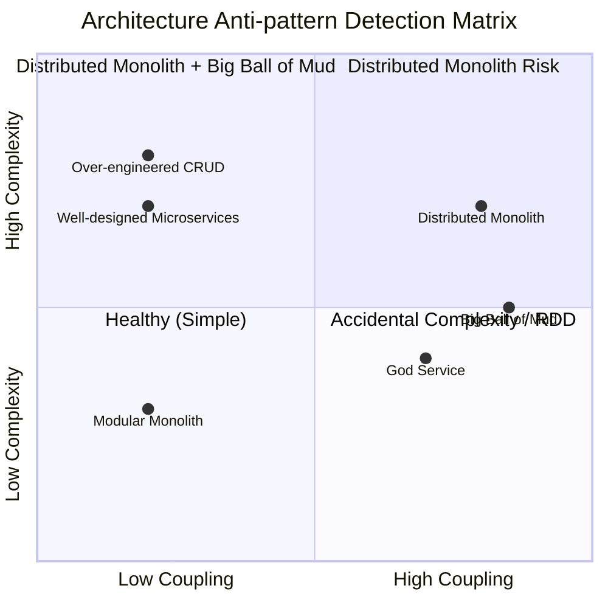
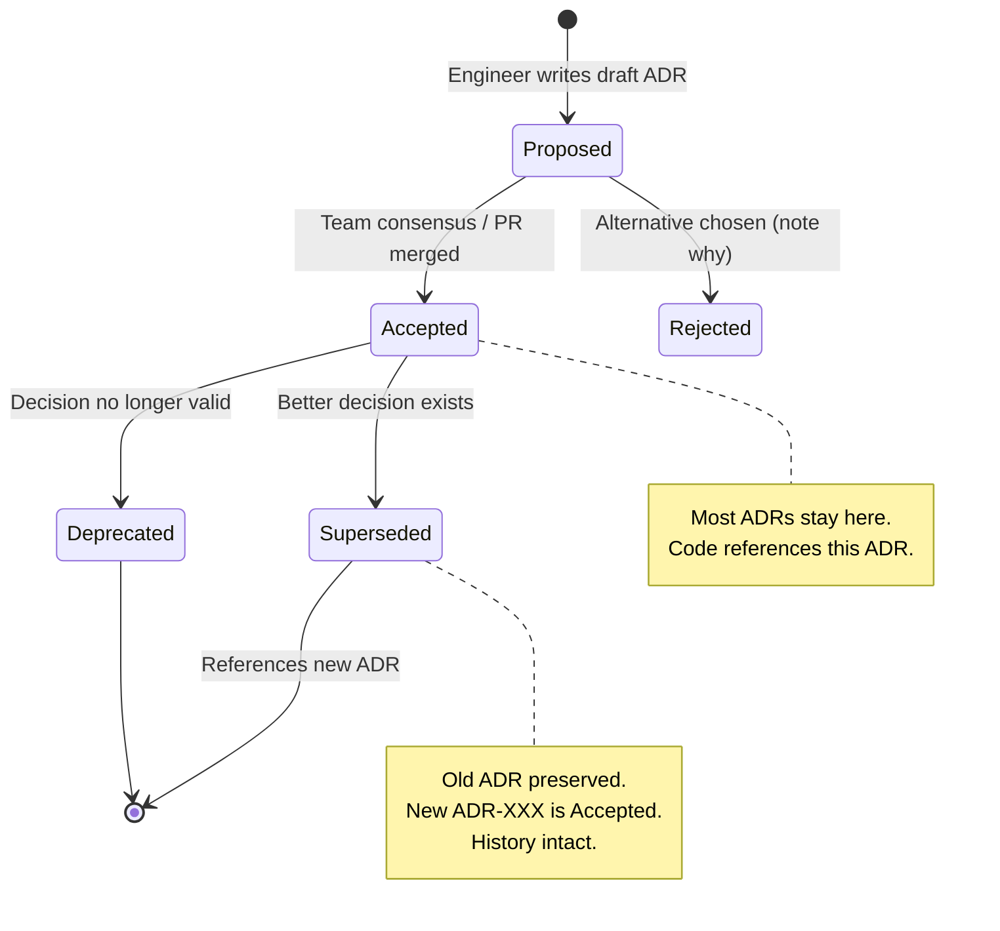

## Keywords in This File

{: .no_toc }

| #   | Keyword | Weight |
| --- | ------- | ------ |
| 1   | [Architecture Anti-patterns](#architecture-anti-patterns) | high |
| 2   | [Architecture Decision Records](#architecture-decision-records) | high |

---

# Architecture Anti-patterns

🎯 Interview Weight: high - behavioral and design questions in senior
interviews frequently involve identifying and fixing anti-patterns;
tests architectural judgment and practical experience.

---

### 🎯 Model Answer

**30 seconds:**
> Architecture anti-patterns are recurring structural problems
> that appear to solve a problem but create worse long-term issues.
> The most damaging: Distributed Monolith (microservices topology
> with monolith coupling), Big Ball of Mud (no enforced structure),
> and God Service (one service that knows too much). They share
> a root cause: coupling that was not managed consciously.

**3 minutes (Senior):**
> Architecture anti-patterns differ from implementation anti-patterns:
> they are structural decisions that affect entire systems, are
> expensive to reverse, and compound over time.
>
> Distributed Monolith: the system appears to be microservices
> (separate deployment units) but services are tightly coupled
> through shared databases, synchronous chains, or shared domain
> models. Symptom: you cannot deploy Service A without coordinating
> with Services B, C, and D. The worst of both worlds: distributed
> system complexity without microservices autonomy.
>
> Big Ball of Mud: no enforced architectural structure. Dependencies
> flow in all directions. Any module can call any other module.
> Cause: accumulated accidental complexity from shortcuts and
> deferred refactoring. Symptom: a small feature change requires
> modifying 8 files across 4 "layers" with cascading side effects.
>
> God Service / God Object: one service accumulates responsibility
> for everything. The "Orchestration Service" that knows the state
> of all other services. Symptom: every feature requires modifying
> the God Service, making it a bottleneck for all delivery.
>
> Identification: coupling metrics (afferent/efferent coupling),
> deployment coordination matrix (who needs to coordinate releases?),
> and schema change blast radius (how many services are affected
> when this database schema changes?).

*Adapting up:* Staff adds: "The hardest anti-pattern conversation
is with the team that created it. Resume-Driven Development
(choosing Kubernetes, microservices, and event sourcing because
'it's what good companies do') is driven by social incentives,
not technical requirements. The remedy is writing an Architecture
Decision Record that explicitly states the forces that justify
the complexity - if the forces cannot be articulated, the complexity
cannot be justified."

*Adapting down:* Junior: "Architecture anti-patterns are common
mistakes in system structure that make the system harder to change
over time. The Big Ball of Mud is when there is no clear structure
and everything is connected to everything else."

**Blank Mind Recovery:**

**(1) Restate:** "You are asking about Architecture Anti-patterns -
recurring structural mistakes that create long-term coupling and
maintenance problems."

**(2) First principles:** "Good architecture makes systems easy
to change. Anti-patterns do the opposite: they make changes
progressively harder because coupling spreads through the system."

**(3) Bridge:** "Architecture anti-patterns are like bad city
planning. A city with no zoning (Big Ball of Mud) has houses next
to factories next to hospitals. Changing one building requires
coordinating with all its neighbors. A Distributed Monolith is a
city with separate districts but a single water/power/sewage system
shared by all - no district can upgrade independently."

---

### 📘 Concept Explanation

**What it is:**
Architecture anti-patterns are structural patterns that appear
beneficial but produce worse outcomes than simpler alternatives.
They accumulate technical debt at the architectural level - the
most expensive kind to repay.

**Core anti-patterns:**

**1. Distributed Monolith**
Appears as microservices but is tightly coupled. Characteristics:
shared databases between services, synchronous dependency chains
(A calls B calls C calls D all in one request), or shared domain
models (a common library with 50 entity classes that all services
depend on and must be versioned together).

```
DISTRIBUTED MONOLITH SYMPTOMS

  ServiceA ----DB SHARED----> ServiceB
  ServiceA ----sync call-----> ServiceB
  ServiceA ----sync call-----> ServiceC
                                  |
                              ServiceC----DB SHARED----> ServiceD
  ServiceA ----sync call-----> ServiceD

  To deploy ServiceA: coordinate with B, C, D
  To change ServiceB's DB schema: notify A, C, D
  A single request spans: A -> B -> C -> D -> A
```

> **Code walkthrough:** This Architecture Anti-patterns example demonstrates a key concept in practice. **KEY MECHANISM:** the runtime executes these instructions in sequence with specific memory and execution semantics. **WHY IT MATTERS:** misapplying this pattern causes subtle bugs that only manifest under production load. **TAKEAWAY: understand the execution model before using this pattern in production code.**

**2. Big Ball of Mud**
No enforced module boundaries. All code can call all code.
Dependency graph is a fully connected mesh. Caused by: short
deadlines, no architectural governance, deferred refactoring,
and the "I'll clean it up later" anti-pattern.

**3. God Service / God Object**
One service or class knows the state of everything and coordinates
everything. Example: `OrderOrchestrationService` that holds the
order state machine, calls inventory, calls payment, calls
notification, calls shipping, calls analytics. Every new feature
goes into this service.

**4. Resume-Driven Development**
Choosing technologies for their career value, not their fitness
for the problem. "We implemented event sourcing with CQRS on a
Kubernetes cluster to handle our 50 requests per day." Symptom:
the architecture complexity significantly exceeds the problem
complexity.

**5. Accidental Complexity**
Complexity that is not inherent to the problem domain. A simple
CRUD application with 12 microservices, a Kafka event bus, and
three caches has accidental complexity. The underlying problem
(CRUD) is simple; the solution's complexity is accidental.

**Identification toolkit:**

```
COUPLING METRICS

Efferent Coupling (Ce): services/classes THIS module depends on
Afferent Coupling (Ca): services/classes that depend on THIS module

Instability = Ce / (Ce + Ca)
- Instability near 0: stable, depended on by others (core)
- Instability near 1: unstable, depends on many others (leaf)

A God Service: high Ca, low Ce (everything depends on it)
A Distributed Monolith: all services have high Ce and Ca
```

> **Code walkthrough:** This Architecture Anti-patterns example demonstrates a key concept in practice. **KEY MECHANISM:** the runtime executes these instructions in sequence with specific memory and execution semantics. **WHY IT MATTERS:** misapplying this pattern causes subtle bugs that only manifest under production load. **TAKEAWAY: understand the execution model before using this pattern in production code.**

---

### 💻 Code Example

```java
// BAD: Distributed Monolith - shared domain model

// Shared library that all 5 services depend on:
// common-domain-1.2.3.jar
public class Order {  // In the shared library
    private Long id;
    private Customer customer;   // Also in shared lib
    private List<OrderItem> items; // Also in shared lib
    private Payment payment;     // Also in shared lib
    private Shipment shipment;   // Also in shared lib
    // 300 fields, all services use this class
}

// OrderService, InventoryService, PaymentService,
// ShippingService, AnalyticsService ALL depend on
// common-domain-1.2.3.jar.
// Changing Order.customer requires:
// - Update common-domain to 1.2.4
// - Update all 5 services to use 1.2.4
// - Deploy all 5 services in coordination
// = not microservices - Distributed Monolith
```

> **Code walkthrough:** The shared `Order` domain class in a commonice. **KEY MECHANISM:** the runtime executes these instructions in sequence with specific memory and execution semantics. **WHY IT MATTERS:** misapplying this pattern causes subtle bugs that only manifest under production load. **TAKEAWAY: understand the execution model before using this pattern in production code.**
> library creates a transitive coupling between all five services.
> Any change to `Order` propagates to all consumers. This is the
> Distributed Monolith: the deployment coordination matrix is 5x5.
> Every release requires planning across all five teams.

```java
// GOOD: Each service owns its own domain model

// OrderService owns its Order representation
// (in orderservice/src/...)
public class Order {
    private OrderId id;
    private CustomerId customerId;  // Reference, not Customer obj
    private List<OrderLine> lines;
    private OrderStatus status;
    // Only what OrderService cares about
}

// PaymentService owns its own representation
// (in paymentservice/src/...)
public class PaymentRecord {
    private PaymentId id;
    private OrderId orderId;   // Reference, not Order object
    private Money amount;
    private PaymentStatus status;
    // Only what PaymentService cares about
}

// Services communicate via published events/APIs,
// NOT via shared domain objects.
// OrderService can change Order without touching
// PaymentService. Each service deployed independently.
```

> **Code walkthrough:** Each service owns its domain model. `OrderService`ice. **KEY MECHANISM:** the runtime executes these instructions in sequence with specific memory and execution semantics. **WHY IT MATTERS:** misapplying this pattern causes subtle bugs that only manifest under production load. **TAKEAWAY: understand the execution model before using this pattern in production code.**
> holds `OrderId`, `CustomerId` (reference, not the Customer object),
> and `OrderLine`. `PaymentService` holds `PaymentRecord` with only
> the fields it needs. Services reference each other by ID, not
> by shared object. An `Order` change in `OrderService` does not
> require any change to `PaymentService`. Deployment coordination
> matrix: 1x1 per service, not 5x5.

---

### 🎓 Answers by Seniority

**Junior / Mid (0-5 years):**
> Architecture anti-patterns are structural mistakes that make
> systems harder to change. The Big Ball of Mud has no clear
> structure. The Distributed Monolith looks like microservices but
> services are too tightly coupled to deploy independently. The
> God Service does too much. All of them share the same root cause:
> coupling that was not managed.

---

**Senior / Staff (5+ years):**
> The Distributed Monolith is the most dangerous anti-pattern because
> it appears to be good architecture from the outside. The tell:
> the deployment coordination matrix. If deploying Service A requires
> coordinating with 3 other teams, it is a Distributed Monolith.
>
> Fixing it requires data ownership: each service owns its data.
> No service reads another's database. Communication is via APIs
> or events. Shared databases are replaced with event-driven
> replication to local read models. This is an 18-24 month migration
> for a mature system. The business case: reduced deployment risk
> and independent team velocity.

---

### ⚠️ Common Misconceptions

| Misconception | Reality |
|---|---|
| Microservices architecture is never a Distributed Monolith | Microservices topology with shared databases or synchronous dependency chains IS a Distributed Monolith |
| Big Ball of Mud only happens in legacy systems | New systems become Big Balls of Mud within 12-18 months without enforced architectural boundaries |
| God Service is obvious and easily avoided | God Services grow gradually. Each individual addition seems reasonable. The accumulation is the problem |
| Accidental complexity is always a mistake | Sometimes there are valid reasons for complexity. The question is: is the complexity justified by the problem? If not, it is accidental |

---

### 🚨 Failure Modes and Diagnosis

**Failure 1: Distributed Monolith discovered in production**

*Symptom:* "Microservices" deployment requires 2-week coordinated
release cycles. A payment service change requires updating the
order service at the same time.

*Diagnostic:*
```bash
# Check shared database usage
# Which services connect to which databases?
kubectl get configmap -o yaml | grep DB_URL
# Multiple services pointing to the same DB = smell

# Deployment coordination matrix: ask teams
# "Who do you need to notify before deploying?"
```

> **Code walkthrough:** This "Who do you need to notify before deploying?" example demonstrates shell script pattern. **KEY MECHANISM:** the shell executes commands sequentially; pipes pass stdout of one command to stdin of the next. **WHY IT MATTERS:** unquoted variables with spaces cause word splitting - IFS splits the value into multiple arguments. **TAKEAWAY: always double-quote variables: "$VAR"; use [[ ]] instead of [ ] for safer conditionals.**

*Fix:* Start with data ownership. Identify which service should
own each database. Build read models for services that need
cross-service data. Migrate to event-driven communication
incrementally. Takes months, not weeks.

**Failure 2: God Service blocking all feature delivery**

*Symptom:* All features require changes to `CoreBusinessService`.
One team owns it. Other teams wait weeks for their changes to
be merged and deployed.

*Diagnostic:*
```bash
# Check change frequency
git log --oneline src/main/java/com/CoreBusinessService.java |
  wc -l
# High number = high churn = probably doing too much

# Count the number of distinct business domains in the class
grep -c "@Service\|@Component" CoreBusinessService.java
# More than 1 = likely a God Service
```

> **Code walkthrough:** This More than 1 = likely a God Service example demonstrice. **KEY MECHANISM:** the runtime executes these instructions in sequence with specific memory and execution semantics. **WHY IT MATTERS:** misapplying this pattern causes subtle bugs that only manifest under production load. **TAKEAWAY: understand the execution model before using this pattern in production code.**

*Fix:* Extract bounded contexts. Identify distinct business
capabilities. Create separate services (or at minimum packages
with enforced boundaries). Migrate clients to the new services
incrementally.

---

### 🎯 Interview Deep-Dive

| Preparation| Target|
|--------|---------------------------------------------------------------------|
| Time to prep| 20 minutes|
| Core themes| Distributed Monolith, coupling metrics, identification toolkit|
| Seniority signal| Junior: definition; Senior: identification; Staff: migration
| Common trap| Claiming microservices always avoid Distributed Monolith|
| Staff differentiator| Deployment coordination matrix, data ownership fix|

---

**Q1 [JUNIOR]: What is the Distributed Monolith anti-pattern?**

*Why they ask:* Fundamental microservices mistake.

*Likely follow-up:* "How would you identify it in a system?"

A Distributed Monolith appears to be microservices (separate
deployment units, different technology stacks) but services are
so tightly coupled that they cannot be deployed independently.
The worst of both worlds: distributed system complexity without
microservices autonomy.

Three coupling forms:
1. Shared databases: ServiceA and ServiceB read/write the same
   database schema. A schema change requires coordinating both.
2. Synchronous chains: a single user request triggers A -> B ->
   C -> D -> response. All four services must be available for
   the request to succeed.
3. Shared domain models: a common library with domain objects
   that all services depend on and must version together.

Identification: the deployment coordination matrix. Ask each team:
"Who do you need to notify before deploying?" If every service
requires notifying 3+ other teams, it is a Distributed Monolith.

*What separates good from great:* Most candidates give the definition.
Great candidates describe all three coupling forms and give the
deployment coordination matrix as the practical identification tool.

---

**Q2 [SENIOR]: How do you identify architecture anti-patterns in
a codebase you did not build?**

*Why they ask:* Tests systematic diagnosis skills.

*Likely follow-up:* "What would you look at first?"

Step 1 - Deployment coordination matrix: interview each team.
"Who must you coordinate with to deploy?" Draw the matrix.
Dense matrix = Distributed Monolith.

Step 2 - Database ownership audit: list all services and their
database connections. Multiple services sharing a database = a
coupling smell. Shared databases are the primary Distributed
Monolith symptom.

Step 3 - Coupling metrics: use a static analysis tool (ArchUnit,
Structure101) to measure afferent coupling (how many things depend
on this module) and efferent coupling (how many things does this
module depend on). A module with high afferent coupling is a
candidate God Object.

Step 4 - Change impact analysis: for the last 10 production bugs,
how many services were involved in each fix? High average impact
radius = Big Ball of Mud or Distributed Monolith.

Step 5 - Complexity vs problem complexity: what is the actual
problem complexity? Does the architecture complexity match it?
Large gap = possible Resume-Driven Development or Accidental
Complexity.

*What separates good from great:* Most candidates describe what
to look for. Great candidates describe a systematic investigation
process with specific tools and metrics for each anti-pattern.

---

**Q3 [STAFF]: How do you fix a Distributed Monolith?**

*Why they ask:* Tests migration strategy and long-term thinking.

*Likely follow-up:* "How long does this take?"

Fixing a Distributed Monolith is an 18-24 month effort for a
mature system. The path:

Phase 1 - Stop digging: no new shared databases, no new synchronous
dependency chains, no new additions to the shared domain model.
The system does not get worse while the fix is in progress.

Phase 2 - Data ownership: assign each database table to exactly
one service. Other services that need that data must request it
via API or receive it via events. For read-heavy consumers,
build local read models (event-sourced projections) that replicate
data the service needs.

Phase 3 - Replace synchronous chains: identify the longest
synchronous dependency chains. Replace with asynchronous (event-
driven) workflows where feasible. Introduce Sagas for cross-service
operations that need coordination.

Phase 4 - Extract the shared domain model: replace shared objects
with service-local models. Services communicate by ID (not by
shared object reference). Each service translates at its boundary
(Anti-Corruption Layer).

The business case: each phase reduces deployment coordination
cost. After Phase 1, no new cross-team coordination is added.
After Phase 2, database deployments are independent. This is
measurable: track the deployment coordination matrix monthly.

*What separates good from great:* Most candidates say "stop sharing
databases." Great candidates give the phased plan, the business
case (measurable reduction in coordination cost), and the realistic
timeline.

---

**Q4 [SENIOR]: What is the difference between accidental and
essential complexity?**

*Why they ask:* Tests theoretical foundation and judgment.

*Likely follow-up:* "Give an example of each."

Essential complexity: complexity that is inherent to the problem
domain. A real-time trading system has essential complexity:
concurrent order matching, regulatory compliance, sub-millisecond
latency requirements, auditability. These requirements drive
architecture decisions. You cannot make this system simple.

Accidental complexity: complexity not inherent to the problem.
A content management system for a blog with 500 visitors per day
built with 15 microservices, Kafka, Redis, and a Kubernetes cluster
has accidental complexity. The problem is simple; the solution
is not.

How to distinguish: ask "if I removed this architectural element,
would the system fail to meet a real requirement?" If yes, it is
essential (or close to it). If no, it may be accidental.

The risk: accidental complexity has carrying costs. Every additional
service is another deployment pipeline, another monitoring endpoint,
another on-call rotation. Accidental complexity consumes engineering
capacity without delivering proportional value.

The remedy: match architecture complexity to problem complexity.
Start simple (modular monolith) and extract when a specific force
(team scaling, independent deployment need, technology fit)
justifies the added complexity.

*What separates good from great:* Most candidates recite the definition.
Great candidates give specific examples, describe the detection
question ("if removed, would a requirement fail?"), and articulate
the carrying cost of accidental complexity.

---

**Q5 [STAFF]: Describe a time you identified an anti-pattern
and fixed it. (BEHAVIORAL)**

*Why they ask:* Tests practical experience and judgment.

*Likely follow-up:* "What resistance did you face?"

Strong answer structure (STAR):

Situation: "Our microservices system for an e-commerce platform
had grown to 12 services over 18 months. Deploy cycle was 2 weeks
because every deployment required coordinating 5-6 teams."

Task: "I was asked to diagnose why deployment frequency was falling.
Hypothesis: Distributed Monolith."

Action: "I conducted a deployment coordination matrix workshop:
had each team draw the services they had to notify before deploying.
The result was a graph with 47 coordination edges for 12 services.
Database audit revealed 3 services sharing the Orders database.

I proposed Phase 1 intervention: freeze shared database access
(new queries must go through the owning service's API). We ran
this for 6 months. The main resistance: the team that owned the
Orders database felt their service was becoming a bottleneck.
We addressed this by introducing an async read model - other
services subscribed to order events and maintained local projections."

Result: "After 6 months, coordination edges dropped from 47 to
18. Deploy cycle dropped from 2 weeks to 3 days. The teams could
see the improvement in the metrics."

*What separates good from great:* Describing what an anti-pattern
is vs describing the specific investigation process, the resistance
encountered, and the measurable outcome.

---

**Q6 [SENIOR]: What is Resume-Driven Development and how do you
prevent it?**

*Why they ask:* Judgment question - tests ability to resist technical
fashion.

*Likely follow-up:* "How do you push back on this as an architect?"

Resume-Driven Development (RDD): choosing architectural elements
because they are impressive on a resume, not because they fit
the problem. Kubernetes for an app with 3 services. Event sourcing
for a CRUD system. Microservices for a 5-person team.

Why it happens: engineers have career incentives to work with
new technologies. "I worked with Kafka at my last job" is valuable
on a resume regardless of whether Kafka was the right choice.

Prevention: Architecture Decision Records (ADRs). An ADR forces
the team to document the forces that justify the decision. "Why
microservices?" must have an answer: "because our mobile and web
teams need independent deployment velocity and our team is 50
engineers" is a justified force. "Because Netflix uses them" is
not.

Technical leadership role: when an engineer proposes a new
technology, ask "what specific problem does this solve that the
simpler alternative cannot?" If the answer is vague, that is a
signal to push back.

The counterpressure: the modular monolith and the staged scaling
principle. Start with the simplest architecture that meets current
requirements. Evolve when a specific force (team size, traffic,
independent scaling) justifies added complexity.

*What separates good from great:* Most candidates give the definition.
Great candidates describe the incentive structure (career incentives
vs technical fit), the ADR as the prevention mechanism, and the
"forces that justify" question.

---

**Q7 [SENIOR]: How do you identify a Big Ball of Mud in a codebase?**

*Why they ask:* Tests diagnostic skills for a common legacy architecture.

*Likely follow-up:* "Where do you start fixing it?"

Identification signals:

Circular dependencies: Module A imports Module B which imports
Module A. Use static analysis tools (ArchUnit, FindBugs, Structure101)
to detect cycles.

Dependency inversion violation: high-level business modules
importing low-level infrastructure modules. Business logic that
imports JDBC drivers directly.

Layer violations: controllers calling repositories directly,
bypassing the service layer. Domain objects with SQL annotations.

Lack of module boundaries: no package-level visibility enforcement.
All classes are public. "Everything can call everything."

Change impact: a change to a utility class requires modifying
25 other classes. Ripple effect means everything is coupled.

Where to start: identify the single most-changed file in git
history. This file is the center of the Big Ball of Mud.
Introduce a package boundary around it. Make its dependencies
explicit. Add ArchUnit tests that enforce the boundary. Repeat
for the next most-changed file.

*What separates good from great:* Most candidates describe what
it looks like. Great candidates give specific detection tools
(ArchUnit, git change frequency), and describe the incremental
extraction strategy starting from the most-changed file.

---

**Q8 [STAFF]: BEHAVIORAL: How do you make the case for fixing
an architecture anti-pattern to non-technical stakeholders?**

*Why they ask:* Tests influence and communication skills.

*Likely follow-up:* "What if they said 'just live with it'?"

The core challenge: anti-patterns have high carrying costs but
the costs are diffuse and long-term. Business stakeholders see
the cost of the fix (engineer time) but not the cost of the
anti-pattern (slower feature delivery, increased bug rate).

The approach: translate to business metrics.

"Our Distributed Monolith means each feature requires coordination
between 4 teams. Average feature cycle time is 6 weeks. Our
competitors release every 2 weeks. If we fix data ownership first
(3 months of engineering), cycle time drops to 3 weeks. That
is 6 additional features per quarter that reach customers."

If stakeholders say "just live with it": quantify the carrying
cost. "We spend 30% of engineer time on coordination overhead.
That is 6 engineer-months per quarter. The fix costs 3 engineer-
months and is self-funding after 2 quarters."

The numbers do not need to be exact - they need to be directionally
correct and based on observable metrics (git history, cycle time,
coordination overhead reported by teams).

*What separates good from great:* "Tell management it slows us
down" vs a specific business metric argument with quantified costs
and a self-funding timeline.

---

**Q9 [STAFF]: What is the relationship between architecture
anti-patterns and Conway's Law?**

*Why they ask:* Tests systems thinking - organization and architecture.

*Likely follow-up:* "How does the Inverse Conway Maneuver work?"

Conway's Law: "Organizations which design systems are constrained
to produce designs which are copies of the communication structures
of those organizations."

Relationship to anti-patterns:

God Service and organizational silos: when one team "owns"
a central capability (authentication, order management), other
teams route all related features through that team. The organizational
bottleneck creates the God Service bottleneck.

Distributed Monolith and team coupling: when two teams share a
codebase or database, their communication overhead creates coupling.
The shared database is often a symptom of two teams that were
once one team.

Big Ball of Mud and monolithic teams: large teams without clear
ownership boundaries produce codebases without clear module
boundaries. Team structure shapes code structure.

The Inverse Conway Maneuver: deliberately design team structures
to produce the target architecture. Want independent microservices?
Create independent teams with end-to-end ownership. The team
structure will produce the architecture.

Practical implication: architectural problems often cannot be
fixed without organizational changes. A Distributed Monolith may
require reorganizing teams before the technical fix is sustainable.

*What separates good from great:* Most candidates describe Conway's
Law in isolation. Great candidates describe the causal mechanism
(organizational structure causes architectural structure), give
specific anti-pattern examples, and describe the Inverse Conway
Maneuver as the remedy.

| Interviewer Type| Emphasis|
| Technical Panel| Coupling metrics, identification toolkit|
| Hiring Manager| Business case for fixing anti-patterns|
| Bar Raiser| Conway's Law relationship, RDD prevention|
| Peer Engineer| Concrete examples: Distributed Monolith, God Service|

---

### ⚖️ Comparison Table

| Anti-pattern| Symptom| Root Cause| Fix|
|---|---|----------|-----------------------------------------------------------|
| Distributed Monolith| Cannot deploy services independently| Shared databases, 
| Big Ball of Mud| Change in module A breaks module B| No enforced module bounda
| God Service| All features require changing one service| No separation of conce
| Accidental Complexity| Architecture complexity exceeds problem complexity| Res
| Resume-Driven Development| Technology chosen without justifiable forces| Caree

---

### 🏛️ System Design

*(Omit: Architecture Anti-patterns is L3, not L4/L5. Applied in
system design reviews and architecture assessments.)*

---

### 📊 Diagram

```plaintext
ANTI-PATTERN IDENTIFICATION FRAMEWORK

COUPLING SIGNAL:
  
  High Ca (afferent) = everything depends on it
  -> God Service / God Object candidate

  High Ce (efferent) = depends on everything
  -> Big Ball of Mud component / integration layer

  High Ca + High Ce = center of the Big Ball of Mud

DEPLOYMENT COORDINATION MATRIX:
  
  Team A: "I must tell B, C, D before deploying"
  Team B: "I must tell A, C before deploying"
  Team C: "I must tell A, B, D, E before deploying"
  -> 47 edges in 12-service system = Distributed Monolith

COMPLEXITY RATIO:
  
  Essential complexity (from problem domain)
  vs
  Actual architecture complexity
  
  Large gap = Accidental Complexity
  Check: "What specific force justifies this element?"
```



> **Diagram walkthrough:** The detection matrix maps systems by
> coupling (horizontal) and complexity (vertical). A modular monolith
> has low coupling and modest complexity - a healthy starting point.
> Well-designed microservices have low coupling despite high complexity
> (managed independently). The Distributed Monolith occupies the
> high coupling + high complexity quadrant - the worst position.
> A God Service has high coupling with moderate complexity, forming
> a central bottleneck. Over-engineered systems (RDD) sit in the
> low coupling + high complexity quadrant - unnecessary complexity
> without the coupling problem but with significant carrying costs.

---

---

---

### 💻 Code Example

*(Omit: this concept does not have a programmatic interface that can be demonstrated in code. The conceptual explanation above is sufficient.)*


---

### 🏛️ System Design

*(Omit: system design diagram not applicable for this concept - see ★★★ keywords for full system design coverage.)*


---

### ⚖️ Comparison Table

*(Omit: this is a ★☆☆ foundational concept with no direct alternatives to compare - see higher-difficulty keywords for trade-off analysis.)*


---

### 📊 Diagram

*(Omit: no standalone visual diagram required for this concept - the explanations and code examples above provide sufficient clarity.)*


# Architecture Decision Records

🎯 Interview Weight: high - ADRs demonstrate architectural maturity;
interviewers use this topic to assess documentation practices,
decision-making rigor, and ability to communicate trade-offs.

---

### 🎯 Model Answer

**30 seconds:**
> An Architecture Decision Record (ADR) is a lightweight document
> that captures an important architectural decision: the context
> that forced the decision, the decision itself, and the consequences
> (positive and negative). ADRs answer the "why" question that
> undocumented systems never can: why was this built this way?
> They prevent the "we don't know why, so we can't change it"
> problem that paralyzes teams inheriting legacy systems.

**3 minutes (Senior):**
> ADRs (Michael Nygard format, 2011) consist of five sections:
> Title (short noun phrase), Status (proposed/accepted/deprecated/superseded),
> Context (the forces that created the need for a decision), Decision
> (the choice made), and Consequences (what becomes easier, what
> becomes harder, what risks are accepted).
>
> The most important section is Context: it captures the forces
> that justified the decision at the time. A team inheriting a
> system 3 years later can read the context and understand why
> the decision was correct then, even if circumstances have changed.
> Without ADRs, the inheriting team sees the decision but not the
> reasoning, and may repeat the same investigation the original
> team conducted.
>
> When to write an ADR: any decision with significant trade-offs,
> non-obvious alternatives, or long-term consequences. Choosing
> PostgreSQL vs MySQL: write an ADR. Choosing a font size: do not
> write an ADR. Choosing to use a modular monolith instead of
> microservices for a 5-person team: definitely write an ADR.
>
> ADR lifecycle: proposed (under discussion), accepted (decided),
> deprecated (the decision is no longer valid), superseded by
> ADR-XXX (replaced by a newer decision with reference).

*Adapting up:* Staff adds: "ADRs are most valuable when they capture
rejected alternatives with reasons. 'We considered Kafka but
rejected it because our team has no Kafka expertise and our message
volume does not justify the operational complexity' is more
valuable than 'we chose RabbitMQ.' The rejected alternatives
prevent the team from relitigating closed decisions."

*Adapting down:* Junior: "An ADR is a short document that records
an architecture decision and the reasons behind it. It is like
a meeting summary for important technical choices. Future developers
can read the ADR to understand why the code is written the way
it is."

**Blank Mind Recovery:**

**(1) Restate:** "You are asking about Architecture Decision Records -
documents that capture architectural decisions and their context."

**(2) First principles:** "Good decisions are made with explicit
context. Without written context, future maintainers cannot
distinguish between a deliberate design choice and an accidental
historical artifact. ADRs make context explicit and durable."

**(3) Bridge:** "An ADR is like a signed contract with an attached
memo of understanding. The decision is the signed contract. The
context is the memo explaining the circumstances that led to the
signature. Years later, if the circumstances change, the parties
can revisit the contract knowing the original intent."

---

### 📘 Concept Explanation

**What it is:**
An ADR (Architecture Decision Record) is a document that captures
an architecturally significant decision. The format was introduced
by Michael Nygard in 2011 and popularized by ThoughtWorks.
ADRs are typically stored as Markdown files in the repository
(`docs/decisions/` or `docs/adr/`) and versioned with the code.

**Standard ADR format (Nygard):**

```
ADR-001: Use PostgreSQL for the primary data store

Status: Accepted

Context:
The system requires a relational data store for transactional
consistency. The team has strong SQL expertise. The data model
is highly relational (orders, customers, products with
foreign keys). We evaluated: PostgreSQL, MySQL, MongoDB, DynamoDB.

Decision:
We will use PostgreSQL 15 as the primary data store.
PostgreSQL was chosen over MySQL due to: better JSON support
(product catalog requires flexible attribute storage), row-level
security (multi-tenant requirement), and LISTEN/NOTIFY for
real-time updates. MongoDB was rejected: our data is highly
relational and document storage would increase application
complexity. DynamoDB was rejected: no transactional support
for our order processing requirements and lack of team expertise.

Consequences:
(+) Strong ACID guarantees for order processing.
(+) Team SQL expertise maps directly.
(+) pg_vector extension available for future semantic search.
(-) Single point of failure without read replicas.
(-) Schema migrations require coordination with deployment.
(-) Limited horizontal write scalability (vertical scaling).
Risks accepted: PostgreSQL operational complexity vs managed
RDS offloads management at the cost of vendor lock-in.
```

> **Code walkthrough:** This Architecture Decision Records example demonstrates a key concept in practice using SQL. **KEY MECHANISM:** the runtime executes these instructions in sequence with specific memory and execution semantics. **WHY IT MATTERS:** misapplying this pattern causes subtle bugs that only manifest under production load. **TAKEAWAY: understand the execution model before using this pattern in production code.**

**ADR lifecycle:**

```plaintext
proposed --> accepted --> deprecated
                    \--> superseded by ADR-XXX
```

> **Code walkthrough:** This Architecture Decision Records example demonstrates a key concept in practice. **KEY MECHANISM:** the runtime executes these instructions in sequence with specific memory and execution semantics. **WHY IT MATTERS:** misapplying this pattern causes subtle bugs that only manifest under production load. **TAKEAWAY: understand the execution model before using this pattern in production code.**

**When to write an ADR:**

Decision requires an ADR when: (1) the trade-offs are non-trivial,
(2) alternatives exist and were considered, (3) the decision
has long-term consequences, (4) future maintainers will ask "why?"

---

### 💻 Code Example

```markdown
<!-- BAD ADR: Missing context and rejected alternatives -->

# ADR-012: Use Kafka for Events

Status: Accepted

Decision: We will use Kafka for all event streaming.

Consequences:
- Fast and scalable.
```

> **Code walkthrough:** This ADR is nearly useless because it records the decision without the reasoning, alternatives considered, or consequences. **KEY MECHANISM:** decisions without documented reasoning become unmaintainable; future engineers cannot evaluate whether the constraint still applies or has been superseded. **WHY IT MATTERS:** teams that inherit undocumented decisions either blindly follow stale constraints or recklessly abandon them without understanding the tradeoffs. **WHAT BREAKS:** architectural drift, repeated debates about already-settled decisions, and inability to onboard new engineers effectively. **TAKEAWAY:** the value of an ADR is in the alternatives-considered and consequences sections - the decision itself is the least important part.
> the decision (Kafka) but not the forces that led to it (what
> alternatives were considered and why rejected?), not the actual
> consequences (what specifically becomes easier/harder?), and
> not the context (what problem required event streaming?). Three
> years later, a new engineer cannot tell if Kafka was chosen
> deliberately or cargo-culted, or whether RabbitMQ would serve
> the current needs better.

```markdown
<!-- GOOD ADR: Full context, rejected alternatives, consequences -->

# ADR-012: Use Apache Kafka for Event Streaming

**Status:** Accepted (2024-03-15)

**Deciders:** Engineering Lead, Platform Architect, Infra Lead

**Supersedes:** None

## Context

The Order Service emits order lifecycle events consumed by:
Inventory Service (reserve items), Notification Service (send
emails), Analytics Service (update dashboards), and the future
Fraud Detection Service. Current implementation uses direct HTTP
calls, creating: tight coupling (Order must know all consumers),
availability dependency (Order fails if Notification is down),
and no event replay capability for new consumers.

Expected event volume: 50,000 events/day (current), 500,000/day
(18-month projection based on 10x growth plan).

## Decision

We will use Apache Kafka 3.5 (managed via Confluent Cloud) for
event streaming between services.

**Evaluated alternatives:**

RabbitMQ: rejected. Lacks log-based persistence (cannot replay
events for Fraud Detection onboarding). Message acknowledgment
model is per-consumer, not offset-based - makes consumer group
management complex for our use case.

AWS EventBridge: rejected. Per-event pricing ($1.00/million) is
cost-prohibitive at 500k/day projection. Schema registry requires
external tooling.

Redis Streams: rejected. No consumer group management for
independent consumer offset tracking. Not suitable for long-
term event retention (>7 days).

Kafka on Confluent: selected. Log-based storage (event replay
for new consumers), consumer group offset management, 7-day
default retention (configurable), managed service offloads
broker management.

## Consequences

**(+) Positive:**
- Order Service decoupled from consumers (publish-subscribe).
- New consumers (Fraud Detection) can replay from day 0.
- Order Service available even if Notification Service is down.
- Schema Registry enforces event contract compatibility.

**(-) Negative:**
- Team must learn Kafka concepts (partitions, offsets, consumer
  groups). Estimated 2-3 weeks onboarding.
- Additional operational dependency (Confluent account, costs
  ~$200/month at current volume).
- Event schema evolution requires backward-compatible changes
  or coordinated consumer updates.

**Risks accepted:**
Confluent vendor dependency. Mitigation: we maintain a
compatibility layer; migration to self-hosted Kafka is possible
if Confluent pricing becomes prohibitive.
```

> **Code walkthrough:** The good ADR records the specific problemice. **KEY MECHANISM:** the runtime executes these instructions in sequence with specific memory and execution semantics. **WHY IT MATTERS:** misapplying this pattern causes subtle bugs that only manifest under production load. **TAKEAWAY: understand the execution model before using this pattern in production code.**
> (tight coupling, no replay), the concrete evaluation of four
> alternatives with specific rejection reasons (not vague preferences),
> and the consequences split into positive (with specifics) and
> negative (with specifics including learning curve and cost).
> The "Risks accepted" section acknowledges vendor lock-in with
> a mitigation strategy. Three years from now, an engineer reading
> this can understand why Kafka and not EventBridge, and whether
> the original forces still apply.

---

### 🎓 Answers by Seniority

**Junior / Mid (0-5 years):**
> An ADR is a short document that records an architectural decision
> and the reasons behind it. The key sections: context (why did
> we need to decide?), decision (what did we choose?), and consequences
> (what are the trade-offs?). ADRs live in the repository so future
> developers can read them alongside the code they explain.

---

**Senior / Staff (5+ years):**
> The most valuable ADR section is the rejected alternatives.
> "We considered X and rejected it because..." prevents the team
> from relitigating closed decisions every time a new engineer
> joins. The second most valuable is the context's force field:
> what was true at the time that made this the right decision?
> When the forces change, the ADR serves as the trigger for
> revisiting the decision.
>
> ADRs as architectural governance: instead of a heavyweight
> Architecture Review Board that reviews every decision, lightweight
> ADRs democratize decision-making. Teams can make decisions
> autonomously as long as they document them. The review becomes
> asynchronous (read the ADR) rather than synchronous (attend the
> meeting).

---

### ⚠️ Common Misconceptions

| Misconception | Reality |
|---|---|
| ADRs are only for big decisions | Any decision where future maintainers will ask "why?" deserves an ADR. The bar is "significant trade-off," not "large scale" |
| ADRs need to be long and formal | A good ADR is 1-2 pages. The Nygard format is deliberately lean. Length does not equal quality |
| ADRs are immutable once accepted | ADRs can be deprecated or superseded. An ADR's status changing is itself a decision that should be documented |
| ADRs are only for architecture decisions | ADRs can document significant technology choices, team conventions, and process decisions - anything with trade-offs and consequences |

---

### 🚨 Failure Modes and Diagnosis

**Failure 1: ADR written after the fact to justify a decision
already made**

*Symptom:* ADR context section says "we decided to use X," then
the context section retroactively provides justifications. The
ADR has no rejected alternatives.

*Fix:* ADRs should be written during or before the decision, not
after. The context section captures the forces that are currently
real, not invented post-hoc. Use ADRs in the RFC (Request for
Comment) process: write the ADR as a proposal (status: proposed),
get feedback, then set status to accepted.

**Failure 2: ADR graveyard - ADRs written but never read**

*Symptom:* The `docs/adr/` folder has 45 ADRs. Engineers make
decisions that contradict existing ADRs because they do not know
the ADRs exist.

*Diagnostic:*
```bash
# Check when ADRs were last accessed
git log --oneline docs/adr/ | tail -20
# All entries old = ADRs not being read or updated
```

> **Code walkthrough:** This All entries old = ADRs not being read or updated example demonstrates shell script pattern using SQL. **KEY MECHANISM:** the shell executes commands sequentially; pipes pass stdout of one command to stdin of the next. **WHY IT MATTERS:** unquoted variables with spaces cause word splitting - IFS splits the value into multiple arguments. **TAKEAWAY: always double-quote variables: "$VAR"; use [[ ]] instead of [ ] for safer conditionals.**

*Fix:* Link ADRs from README.md and relevant source code comments.
Add an onboarding step: "Read ADR-001 through ADR-010 before
writing your first PR." Review ADRs quarterly to identify which
are outdated (status should be deprecated).

---

### 🎯 Interview Deep-Dive

| Preparation | Target |
|---|---|
| Time to prep | 15 minutes |
| Core themes | ADR format, when to write, rejected alternatives |
| Seniority signal | Junior: what an ADR is; Senior: force fields; Staff: ADRs as governance |
| Common trap | Treating ADRs as heavy process rather than lightweight documentation |
| Staff differentiator | Rejected alternatives, ADR as async governance, ADR deprecation lifecycle |

---

**Q1 [JUNIOR]: What is an ADR and what sections does it contain?**

*Why they ask:* Baseline check on documentation practices.

*Likely follow-up:* "Where would you store ADRs?"

An Architecture Decision Record documents an important architectural
decision. The standard Nygard format has five sections:

Title: short noun phrase describing the decision. "Use PostgreSQL
as Primary Data Store" not "Database Decision."

Status: proposed (under discussion), accepted (decided), deprecated
(no longer valid), superseded by ADR-XXX (replaced).

Context: the forces that created the need for a decision. What
problem existed? What alternatives were considered?

Decision: what was chosen and why. Should reference the alternatives
from Context and explain the rejection reasons.

Consequences: what becomes easier (positive), what becomes harder
(negative), what risks are accepted.

Storage: in the repository at `docs/adr/` or `docs/decisions/`.
Versioned with the code so they are discoverable. Named with a
sequential number: `ADR-001-postgresql-primary.md`.

*What separates good from great:* Most candidates describe what
an ADR is. Great candidates name all five sections, explain why
consequences include both positive and negative, and describe
in-repository storage.

---

**Q2 [SENIOR]: What should the Context section of an ADR capture?**

*Why they ask:* Context is the most valuable and most often poorly written section.

*Likely follow-up:* "What is a 'force field' in ADR context?"

The Context section captures the forces that made a decision
necessary. A force field lists:

Problem: what situation required a decision? ("The Order Service
emits events consumed by 5 downstream services. Direct HTTP calls
create tight coupling and availability dependency.")

Constraints: what was fixed? ("The team has no Kafka expertise.
Budget is $500/month for managed services.")

Alternatives considered: what options were evaluated? List them
here with brief descriptions.

Evaluation criteria: what properties mattered? ("We need event
replay capability for new consumers, consumer group offset
management, and a managed service to reduce operational overhead.")

The key purpose: someone reading the ADR 3 years later should
be able to tell whether the forces that drove the decision still
apply. If the forces have changed (e.g., the team now has Kafka
expertise, or the budget constraint was lifted), the ADR is a
trigger to revisit the decision.

Without context, ADRs degenerate to "we chose X" documentation
that is less useful than a git commit message.

*What separates good from great:* Most candidates describe context
as "background." Great candidates describe the force field concept
(problem + constraints + alternatives + criteria), explain why
context is the most valuable section, and articulate the "forces
have changed" revisit trigger.

---

**Q3 [STAFF]: How do ADRs support architecture governance at scale?**

*Why they ask:* Tests understanding of lightweight governance mechanisms.

*Likely follow-up:* "How do you enforce that ADRs are written?"

Traditional governance: an Architecture Review Board reviews
decisions synchronously. Every significant technical decision
requires scheduling a meeting with 5-8 senior architects. This
is synchronous, slow, and a bottleneck for team velocity.

ADRs as async governance: teams document decisions in ADRs and
merge them to the main branch. Architects review asynchronously
(reading the PR with the ADR) and comment or approve. No meeting
required unless the decision is genuinely controversial.

Benefits: (1) decision-making is distributed to teams closest
to the problem; (2) review is async (architects review at their
own pace); (3) decisions are searchable and linked to code;
(4) the ADR itself forces the team to articulate trade-offs
(the act of writing clarifies thinking).

Enforcement: add ADR creation to the definition of done for
"architecturally significant" work. Include ADR review in PR
checklists. Automated: a CI check that any PR adding a new
dependency or changing a core module requires a linked ADR
(enforced by a custom linter or review bot).

Scale: at 100+ engineers, ADRs replace a central Architecture
Review Board for most decisions. Only genuinely cross-cutting
decisions (choosing a primary database, adopting a new runtime)
require synchronous discussion.

*What separates good from great:* Most candidates say "ADRs document
decisions." Great candidates describe the async governance model,
how it replaces or supplements the ARB, the enforcement mechanism,
and the scale threshold where it becomes necessary.

---

**Q4 [SENIOR]: How do you handle an ADR for a decision that was wrong?**

*Why they ask:* Tests intellectual honesty and ADR lifecycle management.

*Likely follow-up:* "What status should you use?"

When a decision turns out to be wrong: do not delete the ADR.
The fact that the decision was wrong is valuable information.
Instead: write a new ADR for the replacement decision, set the
new ADR's status to "accepted," and update the old ADR's status
to "superseded by ADR-XXX."

The superseded ADR should remain readable. If helpful, add a note
at the top: "This decision was superseded by ADR-025 on 2024-06-01.
The original decision was correct at the time but circumstances
changed: team expertise in the domain grew (the original constraint
no longer applies)."

Why keep superseded ADRs: future engineers can trace the full
history of decisions. "Why did we switch from X to Y?" has a
documented answer. The history also shows what conditions led
to the change, which helps predict when the next change might
be justified.

The wrong approach: deleting the old ADR and rewriting history.
This destroys the trail of reasoning and makes it impossible to
understand why the current state is what it is.

*What separates good from great:* Most candidates say "update the
ADR." Great candidates describe the supersession lifecycle (new
ADR + update old status + preserve history), explain why the old
ADR is kept (traceability), and describe what the context note
should say.

---

**Q5 [STAFF]: What is the difference between an ADR and an RFC?**

*Why they ask:* Tests breadth of decision documentation practices.

*Likely follow-up:* "When would you use an RFC instead of an ADR?"

ADR (Architecture Decision Record): records a decision after or
during the point of decision. Focus: preserving the context and
trade-offs of a specific decision for future maintainers. Audience:
future engineers reading the record months or years later.

RFC (Request for Comments): a proposal seeking input before a
decision is made. Focus: gathering feedback from stakeholders to
make a better decision. Audience: current team members who will
review and comment. An RFC may precede an ADR: the RFC discussions
lead to consensus, which is then recorded as an ADR.

Timeline:
```
RFC (proposal + discussion period)
    -> Team consensus reached
        -> ADR written (accepted status)
            -> Code implemented
```

> **Code walkthrough:** This Unknown example demonstrates a key concept in practice. **KEY MECHANISM:** the runtime executes these instructions in sequence with specific memory and execution semantics. **WHY IT MATTERS:** misapplying this pattern causes subtle bugs that only manifest under production load. **TAKEAWAY: understand the execution model before using this pattern in production code.**

When RFC vs ADR alone: significant decisions that affect multiple
teams or have irreversible consequences should go through RFC
first. Smaller decisions within a team's domain can go directly
to ADR (proposed -> accepted in one step if the team is aligned).

Overlap: the RFC document is often the draft ADR. The Context
and Decision sections of the ADR are refined from the RFC discussion.

*What separates good from great:* Most candidates describe ADRs
in isolation. Great candidates describe the RFC -> ADR pipeline,
explain the audience difference (future readers vs current reviewers),
and give the decision criteria for when an RFC is warranted.

---

**Q6 [SENIOR]: What decisions should NOT be ADRs?**

*Why they ask:* Tests judgment - not everything needs documentation.

*Likely follow-up:* "What's the bar for writing an ADR?"

Decisions that should NOT be ADRs:

Routine implementation details: variable naming conventions,
function decomposition within a single file, choice of a specific
algorithm when there is an obvious best option.

Non-architectural tooling: code formatter choice (Prettier vs
ESLint rules), IDE plugins, PR title format. These belong in a
CONTRIBUTING.md or `.editorconfig`, not ADRs.

Decisions with no real alternatives: "use Java because the team
is a Java team" is not a decision that warrants an ADR. There
was no real alternative being considered.

Reversible low-cost decisions: choosing an internal endpoint path
name. These can be changed cheaply. The ADR overhead is not
justified.

The bar for an ADR: (1) the decision has trade-offs that future
engineers will not reconstruct independently; (2) there are
alternatives that were considered and rejected; (3) the consequences
are non-trivial and long-term; (4) the decision would benefit
from explicit justification.

A useful heuristic: would a new senior engineer, seeing this code,
ask "why was this done this way?" If yes, write the ADR.

*What separates good from great:* Most candidates say "big decisions."
Great candidates give the specific exclusion categories, explain
the heuristic ("would a new senior ask why?"), and articulate
the cost-benefit calculation (ADR overhead vs decision significance).

---

**Q7 [STAFF]: How do you introduce ADRs to a team that has never
used them?**

*Why they ask:* Tests change management and practical adoption skills.

*Likely follow-up:* "What resistance did you encounter?"

Introduction approach:

Start with a backfill: write 3-5 ADRs for decisions the team has
already made. Pick decisions that were controversial or that new
engineers frequently ask about. This demonstrates the value
immediately ("oh, that's why we use Kafka") without requiring
any process change yet.

Lightweight format: use the Nygard format exactly. No custom
sections, no templates with 15 fields. The lower the friction,
the more likely the team will write them.

Pick the right trigger: not "we write ADRs for all decisions."
Instead: "we write an ADR when we add a new dependency, change
a core module's responsibility, or make a decision that took
more than a 15-minute discussion."

Make it visible: add an ADR index to the README.md. Link ADRs
from relevant code comments (`# See ADR-012 for why Kafka here`).

Measure adoption: track ADR count in retrospectives. Celebrate
when engineers write ADRs proactively. Note when engineers do not
write them and ask why.

Resistance patterns: "ADRs slow us down" (start with backfill
to show value first), "Nobody reads them" (link from code), "We
don't know what counts" (give the 15-minute discussion heuristic).

*What separates good from great:* Most candidates say "introduce
ADRs in a project." Great candidates describe the backfill approach
(show value first), the lightweight format principle, the specific
trigger definition, and the resistance patterns with responses.

---

**Q8 [STAFF]: BEHAVIORAL: Describe a decision you documented
in an ADR and how it helped later.**

*Why they ask:* Tests real-world ADR usage.

*Likely follow-up:* "What would you have done differently?"

Strong answer structure:

Situation: "I was the architect for a payments processing service.
We chose to implement a custom idempotency layer instead of using
a third-party library, and I wrote ADR-008."

ADR content: "The context captured: our specific idempotency
requirements (24-hour window, 99.999% durability guarantee for
financial transactions), the alternatives evaluated (Stripe's
idempotency-key header pattern, a Redis-based approach, a DB-based
approach), and the decision (DB-based with PostgreSQL unique
constraint on (request-id, customer-id)) with its consequences
(slightly higher write latency, but 99.999% durability without
additional infrastructure)."

How it helped: "Six months later, a new engineer proposed replacing
the custom layer with Redis. They had not seen ADR-008. I pointed
them to the ADR, specifically the durability requirement. They
realized Redis (even with persistence) did not meet our 99.999%
guarantee without significant operational overhead. The ADR
saved 2-3 days of investigation."

What I'd change: "I would have added a 'revisit trigger' to the
ADR: 'Revisit this decision if Redis introduces strong durability
guarantees or if our write latency becomes a bottleneck.' This
would have made the ADR more active rather than purely historical."

*What separates good from great:* Generic ADR description vs
specific decision with specific trade-offs, a concrete example
of the ADR preventing rework, and a retrospective insight about
a revisit trigger.

---

**Q9 [SENIOR]: How do you use ADRs in code reviews?**

*Why they ask:* Tests how ADRs integrate into daily workflow.

*Likely follow-up:* "What if a PR contradicts an existing ADR?"

ADRs in code reviews:

Linking: PRs that implement an ADR should reference it.
"This implements ADR-015 (async event-driven architecture)."
Reviewers can read the ADR for context.

Contradiction check: if a PR violates an existing ADR (adds a
synchronous call between services when ADR-003 says "prefer async"),
the reviewer should flag it with a link to the ADR. The developer
then either: (1) updates the PR to align with the ADR, (2) proposes
superseding the ADR with a new decision, or (3) documents an
exception in the PR with justification.

ADR proposal in PR: for decisions made during development (a
new library added, an architectural pattern chosen), the ADR can
be proposed and accepted as part of the PR. The code and the
decision record are reviewed together.

Review bot automation: some teams add a CI check that scans for
known anti-pattern patterns (shared database access from multiple
services) and requires an ADR if detected. This makes compliance
visible without a manual checklist.

The goal: ADRs should be discoverable at the point they are relevant
(in the codebase, in PRs, in README links), not buried in a docs
folder that engineers never open.

*What separates good from great:* Most candidates say "link ADRs
from PRs." Great candidates describe the contradiction resolution
process, the ADR proposal within a PR, and automated enforcement
as a system.

| Interviewer Type | Emphasis |
|---|---|
| Technical Panel | ADR format, context force field, rejected alternatives |
| Hiring Manager | ADRs as async governance, team adoption |
| Bar Raiser | RFC vs ADR pipeline, supersession lifecycle |
| Peer Engineer | Practical: when to write, code review integration |

---

### ⚖️ Comparison Table

| Property | ADR | RFC | Architecture Wiki |
|---|---|---|---|
| Purpose | Record a decision + trade-offs | Gather feedback before deciding | Document current architecture |
| When written | During or after decision | Before decision | Ongoing maintenance |
| Audience | Future maintainers | Current decision participants | Current and future engineers |
| Status lifecycle | proposed/accepted/deprecated/superseded | open/closed/implemented | Always current |
| Format | Nygard: Context/Decision/Consequences | Proposal + discussion thread | Diagrams + prose |
| Location | Repository (`docs/adr/`) | Shared doc or PR | Confluence/Notion/README |
| Versioned with code | Yes | Sometimes | Rarely |
| Value decay | Increases (context preserved) | Decreases (superseded by ADR) | Decreases (becomes outdated) |

---

### 🏛️ System Design

*(Omit: Architecture Decision Records are an L3 practice. Applied
throughout all system design discussions but not a system design
component itself.)*

---

### 📊 Diagram

```
ADR LIFECYCLE

PROPOSED --> ACCEPTED --> (in use, stable)
                 |
                 +--> DEPRECATED (decision no longer relevant)
                 |
                 +--> SUPERSEDED BY ADR-XXX
                            |
                           ADR-XXX (ACCEPTED)

ADR IN TEAM WORKFLOW:

Engineer encounters new decision
    |
    v
Is it significant? (trade-offs, alternatives, long consequences)
    |           |
   NO          YES
    |           |
   skip        v
          Write ADR (status: proposed)
               |
               v
          Team review (PR / async discussion)
               |
               v
          Set status: accepted
               |
               v
          Implement + link from code
```



> **Diagram walkthrough:** The ADR lifecycle starts with Proposed
> (an engineer drafts the record), moves to Accepted after team
> review (the decision is made), and most ADRs remain in Accepted
> as stable documentation. When circumstances change, Accepted
> ADRs become either Deprecated (the decision is no longer relevant
> to the current system) or Superseded (a better decision was made,
> with the old ADR referencing the new one). Crucially, superseded
> ADRs are never deleted - the full history of decisions and
> their evolution is preserved for future engineers to trace.

---

### 💻 Code Example

*(Omit: this concept does not have a programmatic interface that can be demonstrated in code. The conceptual explanation above is sufficient.)*


---

### 🏛️ System Design

*(Omit: system design diagram not applicable for this concept - see ★★★ keywords for full system design coverage.)*


---

### ⚖️ Comparison Table

*(Omit: this is a ★☆☆ foundational concept with no direct alternatives to compare - see higher-difficulty keywords for trade-off analysis.)*


---

### 📊 Diagram

*(Omit: no standalone visual diagram required for this concept - the explanations and code examples above provide sufficient clarity.)*


