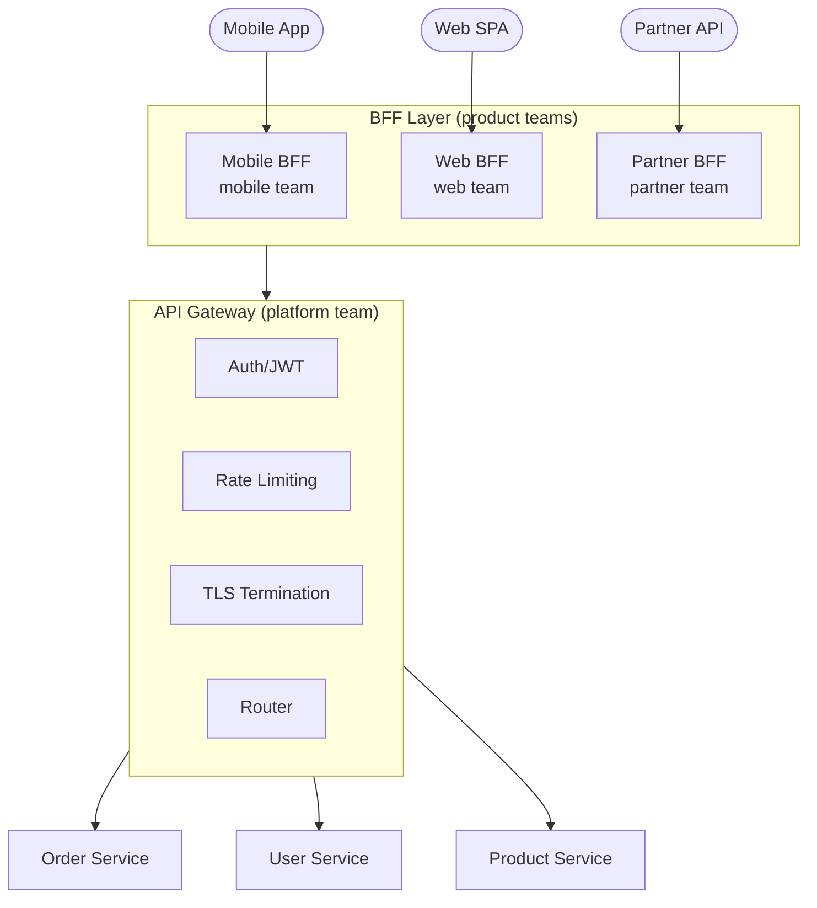
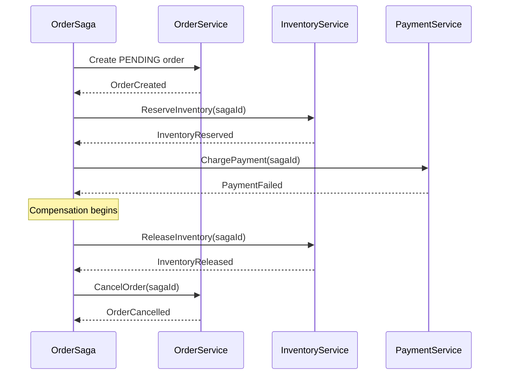

## Keywords in This File

{: .no_toc }

| #   | Keyword | Weight |
| --- | ------- | ------ |
| 1   | [API Gateway Pattern](#api-gateway-pattern) | high |
| 2   | [Saga Pattern for Distributed Transactions](#saga-pattern-for-distributed-transactions) | critical |

---

# API Gateway Pattern

🎯 Interview Weight: high - common in microservices architecture
interviews; tests understanding of edge services, cross-cutting
concerns, and the BFF pattern.

---

### 🎯 Model Answer

**30 seconds:**
> An API Gateway is the single entry point for external clients
> into a microservices system. It handles cross-cutting concerns:
> authentication, TLS termination, rate limiting, and routing.
> The key rule: the Gateway handles infrastructure, not business
> logic. When business logic moves into the Gateway, it becomes
> the SOA ESB anti-pattern.

**3 minutes (Senior):**
> The API Gateway solves the "client-to-service" problem: external
> clients need a stable, simple interface to many internal services.
>
> Core functions: authentication (validate JWT/OAuth tokens before
> requests reach internal services), TLS termination (decrypt HTTPS
> once at the edge), rate limiting (protect internal services from
> abuse), request routing (`/api/orders/**` to Order Service), and
> load balancing.
>
> The Backend for Frontend (BFF) pattern extends this: instead of
> one generic Gateway for all clients, each client type gets its
> own BFF (Mobile BFF, Web BFF, Third-party API BFF). The BFF is
> owned by the product team and can aggregate/transform responses
> for its specific client without changing shared infrastructure.
>
> What the Gateway should NOT do: orchestrate business workflows
> or aggregate responses with business logic. These make the Gateway
> a "smart pipe" - the ESB anti-pattern. The Gateway is infrastructure
> owned by a platform team; business requirements should not drive
> Gateway changes.

*Adapting up:* Staff adds: "When a product team asks 'can you add
special routing logic to the Gateway for our use case,' that is a
signal to build a BFF. A BFF is a service owned by the product
team that implements product-specific logic without changing shared
infrastructure."

*Adapting down:* Junior: "An API Gateway is a front door for your
microservices. Clients call the Gateway, which checks auth, applies
rate limits, and routes to the right service. Internal services
only handle validated requests."

**Blank Mind Recovery:**

**(1) Restate:** "You are asking about the API Gateway Pattern -
the edge service that is the single entry point for external clients."

**(2) First principles:** "External clients need a stable interface
to what may be an unstable internal topology. The Gateway provides
that stable facade and handles cross-cutting concerns once at the
edge rather than in every service."

**(3) Bridge:** "The API Gateway is like a building reception desk.
Visitors (clients) interact with reception (Gateway) which verifies
identity, issues a badge, and directs to the right department.
Reception does not do the department's work - just arrival."

---

### 📘 Concept Explanation

**What it is:**
An API Gateway is a reverse proxy serving as the single entry point
for external clients to a microservices system. Examples: Kong,
AWS API Gateway, Spring Cloud Gateway, Nginx + plugins.

**The problem it solves:**
External clients calling microservices directly face: multiple
service addresses to track, each service must implement auth and
rate limiting independently, internal topology changes break clients.

**How it works:**

```
API GATEWAY PATTERN

  Mobile App  Web Browser  3rd Party API
       |           |             |
       +-----------+-------------+
                   |
            +------+-------+
            |  API GATEWAY  |
            | - Auth (JWT)  |
            | - TLS term.   |
            | - Rate limit  |
            | - Routing     |
            | - Logging     |
            +------+--------+
                   |
       +-----------+-----------+
       |           |           |
  [Order Svc]  [User Svc]  [Product Svc]
```

> **Code walkthrough:** This API Gateway Pattern example demonstrates a key concept in practice using authentication. **KEY MECHANISM:** the runtime executes these instructions in sequence with specific memory and execution semantics. **WHY IT MATTERS:** misapplying this pattern causes subtle bugs that only manifest under production load. **TAKEAWAY: understand the execution model before using this pattern in production code.**

**Backend for Frontend (BFF) pattern:**

```
BFF PATTERN

  Mobile App      Web Browser    Partner API
       |                |               |
  +----+----+     +-----+---+    +------+------+
  | Mobile  |     |  Web    |    | Partner     |
  | BFF     |     |  BFF    |    | BFF         |
  | (mobile |     | (web    |    | (partner    |
  | team)   |     | team)   |    | team)       |
  +---------+     +---------+    +-------------+
                       |
                [Internal Services]
```

> **Code walkthrough:** This API Gateway Pattern example demonstrates a key concept in practice. **KEY MECHANISM:** the runtime executes these instructions in sequence with specific memory and execution semantics. **WHY IT MATTERS:** misapplying this pattern causes subtle bugs that only manifest under production load. **TAKEAWAY: understand the execution model before using this pattern in production code.**

**What should NOT be in the Gateway:**
Business workflow orchestration, data aggregation with business
logic, service-specific transformation with business rules. These
belong in BFFs or orchestration services owned by product teams.

---

### 💻 Code Example

```java
// BAD: API Gateway with business logic (becomes the ESB)
@Component
public class OrderGatewayFilter implements GatewayFilter {
    @Override
    public Mono<Void> filter(
        ServerWebExchange exchange,
        GatewayFilterChain chain
    ) {
        // WRONG: Business aggregation in Gateway filter
        return orderClient.get(orderId)
            .flatMap(order ->
                inventoryClient.get(order.getProductId())
                    .map(inv -> mergeData(order, inv))
            ); // Business logic! ESB anti-pattern
    }
}
// Every new product requirement changes the Gateway.
// Platform team is bottleneck for all product features.
```

> **Code walkthrough:** Business aggregation in the Gateway filterice. **KEY MECHANISM:** the runtime executes these instructions in sequence with specific memory and execution semantics. **WHY IT MATTERS:** misapplying this pattern causes subtle bugs that only manifest under production load. **TAKEAWAY: understand the execution model before using this pattern in production code.**
> makes it a smart pipe - the SOA ESB anti-pattern. The Gateway
> calls two services and merges results with domain logic. Every
> new product requirement that needs a different data combination
> requires a Gateway change, making the platform team a bottleneck
> for every product feature team.

```java
// GOOD: Gateway handles infrastructure; BFF aggregates

// API Gateway: pure infrastructure
@Bean
public RouteLocator routes(
    RouteLocatorBuilder builder
) {
    return builder.routes()
        .route("order-service", r -> r
            .path("/api/orders/**")
            .filters(f -> f
                .stripPrefix(1)
                .requestRateLimiter(c -> c
                    .setRateLimiter(redisRateLimiter())
                    .setKeyResolver(userKeyResolver())
                )
            )
            .uri("lb://order-service")
        )
        // BFF handles aggregation - not the Gateway
        .route("mobile-bff", r -> r
            .path("/mobile/**")
            .uri("lb://mobile-bff")
        )
        .build();
}

// Mobile BFF: owned by mobile product team
@RestController
@RequestMapping("/mobile/orders")
public class MobileOrderController {
    @GetMapping("/{id}")
    public MobileOrderView getOrder(
        @PathVariable String id
    ) {
        Order order = orderClient.getOrder(id);
        // Mobile needs product images - BFF aggregates
        List<ProductImage> images = order.getLines()
            .stream()
            .map(l -> productClient.getImage(
                l.getProductId()
            ))
            .collect(toList());
        return MobileOrderView.from(order, images);
    }
}
// Mobile team changes BFF for mobile requirements.
// API Gateway is unchanged. Platform team not blocked.
```

> **Code walkthrough:** The API Gateway routes `/mobile/**` to theice. **KEY MECHANISM:** the runtime executes these instructions in sequence with specific memory and execution semantics. **WHY IT MATTERS:** misapplying this pattern causes subtle bugs that only manifest under production load. **TAKEAWAY: understand the execution model before using this pattern in production code.**
> Mobile BFF instead of aggregating data. The Mobile BFF (owned
> by the mobile product team) aggregates `Order` with `ProductImage`
> data for mobile clients. When the mobile team needs a different
> response shape, they change only the Mobile BFF - zero Gateway
> changes, zero platform team involvement. The Gateway remains
> pure infrastructure: rate limiting, load balancing, routing.

---

### 🎓 Answers by Seniority

**Junior / Mid (0-5 years):**
> An API Gateway is the front door for a microservices system.
> External clients call the Gateway instead of individual services.
> The Gateway checks authentication, applies rate limits, terminates
> TLS, and routes to the right service. Internal services only
> receive authenticated, rate-limited requests with verified identity
> in request headers.

---

**Senior / Staff (5+ years):**
> The Gateway failure mode is accumulating business logic - the
> ESB anti-pattern. Prevention: strict scope (auth, rate limiting,
> routing, TLS only). Product-specific concerns get their own BFF,
> owned by the product team.
>
> Operationally: the Gateway is in the critical path for all external
> traffic. Required: multi-region deployment, circuit breakers to
> internal services, and first-class observability (request rate,
> error rate, P99 latency, circuit breaker state per route). A
> Gateway outage is a full system outage.

---

### ⚠️ Common Misconceptions

| Misconception | Reality |
|---|---|
| API Gateway = BFF | API Gateway is shared infrastructure (platform team). BFF is client-specific, product-owned aggregation |
| API Gateway should aggregate data | Aggregation with business logic belongs in a BFF or orchestration service, not the shared Gateway |
| API Gateway handles service-to-service auth | Service-to-service communication uses mTLS or service mesh, not the API Gateway |
| Every request goes through the API Gateway | The Gateway is for external clients only. Internal service-to-service calls bypass the Gateway |

---

### 🚨 Failure Modes and Diagnosis

**Failure 1: Gateway is a single point of failure**

*Symptom:* API Gateway goes down. All external traffic fails. No
graceful degradation.

*Diagnostic:*
```bash
curl -I https://api.example.com/health
# HTTP 000 = Gateway unreachable

kubectl top pods -n gateway
# CPU/memory spike or pod crash
```

> **Code walkthrough:** This CPU/memory spike or pod crash example demonstrates HTTP request from shell using container. **KEY MECHANISM:** curl by default follows redirects and suppresses errors; -f flag makes it return non-zero on HTTP errors. **WHY IT MATTERS:** piping curl output to shell without verification runs untrusted code - a supply-chain attack vector. **TAKEAWAY: always use curl -f --retry and verify checksums before piping to bash.**

*Fix:* Multiple Gateway replicas across availability zones.
Upstream load balancer with health checks routes around failed
instances. Circuit breakers prevent downstream failures propagating
back into the Gateway.

**Failure 2: Rate limiter not keyed by user**

*Symptom:* One abusive client sends 10k req/s. Other clients get
503s due to Gateway overload.

*Diagnostic:*
```bash
grep "rate_limited=false" /var/log/gateway/access.log |
  awk '{print $clientId}' | sort | uniq -c | sort -rn
# High-volume client with no rate limits applied
```

> **Code walkthrough:** This High-volume client with no rate limits applied example demonstrates shell script pattern. **KEY MECHANISM:** the shell executes commands sequentially; pipes pass stdout of one command to stdin of the next. **WHY IT MATTERS:** unquoted variables with spaces cause word splitting - IFS splits the value into multiple arguments. **TAKEAWAY: always double-quote variables: "$VAR"; use [[ ]] instead of [ ] for safer conditionals.**

*Fix:* Rate limit keyed by JWT `sub` claim or API key, not IP
address. Per-user limits prevent one client consuming all capacity.

---

### 🎯 Interview Deep-Dive

| Preparation | Target |
|---|---|
| Time to prep | 20 minutes |
| Core themes | Cross-cutting concerns, BFF pattern, no business logic |
| Seniority signal | Junior: routing + auth; Senior: BFF; Staff: Gateway scope enforcement |
| Common trap | Adding business logic to the Gateway |
| Staff differentiator | BFF ownership model, service mesh relationship |

---

**Q1 [JUNIOR]: What is an API Gateway and what does it do?**

*Why they ask:* Foundational pattern for microservices.

*Likely follow-up:* "What is TLS termination?"

An API Gateway is a reverse proxy that is the single entry point
for external clients to a microservices system.

Core functions: authentication (validate JWT/OAuth before requests
reach internal services), TLS termination (HTTPS at edge, HTTP
internally), rate limiting (per-client request limits), routing
(map URL paths to services), load balancing.

TLS termination: the Gateway decrypts HTTPS requests and forwards
as plain HTTP to internal services. Only one TLS certificate to
manage at the Gateway instead of one per service.

Internal services receive the verified identity in request headers
(`X-User-Id`, `X-Roles`) and do not need to handle JWT validation.

*What separates good from great:* Most candidates describe routing.
Great candidates describe all five functions, explain TLS termination
precisely (decrypt once at edge), and note that verified identity
is forwarded in request headers.

---

**Q2 [SENIOR]: What is the Backend for Frontend pattern and when
do you need it?**

*Why they ask:* BFF is the evolution of the basic API Gateway.

*Likely follow-up:* "Who should own the BFF?"

The BFF pattern creates a separate API aggregation layer per client
type: Mobile BFF, Web BFF, Third-party API BFF. Each BFF is
optimized for its client's specific needs.

Why: different clients need different data shapes. Mobile needs
compact responses (small payloads for bandwidth). Web needs richer
data. Third-party APIs need stable versioned interfaces. A single
Gateway cannot serve all three without accumulating client-specific
logic.

Ownership: the API Gateway is platform infrastructure owned by
a platform team. The BFF is product code owned by the team serving
that client (mobile team owns Mobile BFF). Product teams change
their BFF for product requirements without touching shared
infrastructure.

When to use BFF: client types have significantly different data
requirements, client teams need independent change velocity, or
mobile and web requirements evolve at different speeds.

*What separates good from great:* Most candidates describe BFF as
"a gateway per client." Great candidates distinguish Gateway
(infrastructure, platform team) from BFF (product code, product
team) with the ownership model.

---

**Q3 [STAFF]: How do you prevent the API Gateway from becoming
an ESB?**

*Why they ask:* Gateway-as-ESB is a common architectural failure.

*Likely follow-up:* "How do you enforce the scope boundary?"

The failure: product teams request Gateway changes for aggregation
or product-specific routing. The team implements them. Over time,
the Gateway accumulates business logic and becomes the ESB.

Prevention: strict scope documentation (auth, TLS, rate limiting,
routing, logging - nothing else). When product teams request
product logic, redirect to BFF (they own it). Code review: Gateway
filters that call multiple services or merge results are rejected.

Detection metric: a Gateway route calling 3+ services downstream
is aggregation that belongs in a BFF.

Org signal: if the Gateway team blocks feature delivery for product
teams, business logic has leaked into the Gateway.

*What separates good from great:* Most candidates say "don't add
business logic." Great candidates give scope documentation, BFF
redirect, code review enforcement, and metric-based detection.

---

**Q4 [SENIOR]: How do you handle authentication and authorization
in the API Gateway?**

*Why they ask:* Auth at the edge is a fundamental design question.

*Likely follow-up:* "What is the difference between auth and authz here?"

The Gateway handles authentication (who is this?). Each service
handles authorization (what are they allowed to do?).

Gateway authentication: validate JWT (signature, expiry, issuer).
Extract claims (user ID, roles). Add to request headers (`X-User-Id`,
`X-Roles`). Internal services trust these headers - the Gateway
is the only entry point, so network trust is sufficient.

Internal service authorization: check whether the authenticated
user has permission for the specific resource. `OrderService`
verifies `X-User-Id` matches the order's customer ID.

Why separation: the Gateway does not know all service-specific
authorization rules (they change frequently per service). Services
own their own authorization logic.

Service-to-service authentication: uses mTLS (mutual TLS) or
a service mesh, not the API Gateway.

*What separates good from great:* Most candidates say "validate
JWT in Gateway." Great candidates describe the auth vs authz
split, header forwarding with the trust model, and mTLS for
service-to-service (not the Gateway).

---

**Q5 [SENIOR]: How do you implement circuit breaking at the
API Gateway?**

*Why they ask:* Resilience at the edge is critical.

*Likely follow-up:* "What does the Gateway return when a circuit is open?"

Circuit breaking: the Gateway tracks error rates per downstream
service. When a service exceeds the error threshold (e.g., 50%
errors in 10s), the circuit opens. The Gateway returns a fallback
response immediately instead of forwarding to the failing service.

Three states: closed (normal forwarding), open (immediate fallback,
no forwarding), half-open (single probe request; if successful,
close; otherwise stay open).

Spring Cloud Gateway with Resilience4j:
```yaml
filters:
  - name: CircuitBreaker
    args:
      name: orderServiceCB
      fallbackUri: forward:/fallback/orders
```

> **Code walkthrough:** This High-volume client with no rate limits applied example demonstrates YAML configuration pattern. **KEY MECHANISM:** YAML parsers are whitespace-sensitive; indentation errors cause silent value misinterpretation. **WHY IT MATTERS:** unquoted strings starting with special chars (*, &, ?, |) trigger YAML parser errors. **TAKEAWAY: quote strings containing YAML special chars; validate YAML before deploying to production.**

Fallback options: cached response, degraded response (empty list
with message), or 503 with `Retry-After` header.

Purpose: prevents thread exhaustion (all threads blocked waiting
for slow service), cascading timeouts, and thundering herd on
recovery.

*What separates good from great:* Most candidates know circuit
breakers exist. Great candidates describe all three states, fallback
response options, and the thread exhaustion prevention as the
primary benefit.

---

**Q6 [STAFF]: How does service mesh relate to API Gateway?**

*Why they ask:* Tests understanding of where each pattern applies.

*Likely follow-up:* "Do you need both?"

API Gateway: handles external-to-internal traffic. Authentication
of external clients, TLS termination, rate limiting, URL routing.

Service mesh (Istio, Linkerd): handles service-to-service traffic.
mTLS (service identity and encryption), load balancing, circuit
breaking, observability for internal calls. Sidecar proxies on
each pod.

Relationship: complementary, not competing. Gateway is the external-
facing edge. Service mesh manages the internal service fabric.

Do you need both? Yes, for mature microservices. The Gateway handles
user identity (JWT from external clients). The service mesh handles
workload identity (mTLS certificates between services). They
cover different authentication contexts.

Overlap: both provide circuit breaking and load balancing.
Recommendation: use the service mesh for service-to-service
resilience, the Gateway for external resilience. Avoid configuring
the same behavior in both places.

*What separates good from great:* Most candidates confuse the two.
Great candidates describe orthogonal responsibilities (external vs
internal), the complementary deployment model, and the overlap
recommendation to avoid duplicate configuration.

---

**Q7 [SENIOR]: How do you monitor an API Gateway in production?**

*Why they ask:* Operational maturity - Gateway is in the critical path.

*Likely follow-up:* "What metrics trigger an on-call alert?"

Key metrics with alert thresholds:

Request rate per route: alert on significant drop (traffic loss)
or spike (possible attack).

Error rate per route: alert when 5xx > 1% over 5 minutes.

P99 latency per route: alert when P99 > SLA threshold.

Circuit breaker state: alert immediately when any circuit opens
(indicates downstream service failure).

Rate limiter rejections: alert when rejection rate > 5%.

Authentication failure spike: alert on 401 spike (credential
stuffing attack or token expiry issue).

Distributed tracing: inject trace ID (`X-Trace-Id`) on every
request at the Gateway. Enables following requests through all
downstream services.

Connection pool utilization: alert when > 90% to any downstream
service.

*What separates good from great:* Most candidates describe logging.
Great candidates give specific metrics with alert thresholds, trace
ID injection at the edge as a design decision, and circuit breaker
state as the critical operational alert.

---

**Q8 [STAFF]: How do you handle API versioning at the Gateway?**

*Why they ask:* Version management at the edge is a practical design problem.

*Likely follow-up:* "How do you deprecate an old version?"

Gateway routes version-prefixed paths to the appropriate service:

```yaml
# v1 and v2 run simultaneously during migration
- path(/api/v1/orders/**): order-service-v1
- path(/api/v2/orders/**): order-service-v2
```

> **Code walkthrough:** This v1 and v2 run simultaneously during migration example demonstrates YAML configuration pattern. **KEY MECHANISM:** YAML parsers are whitespace-sensitive; indentation errors cause silent value misinterpretation. **WHY IT MATTERS:** unquoted strings starting with special chars (*, &, ?, |) trigger YAML parser errors. **TAKEAWAY: quote strings containing YAML special chars; validate YAML before deploying to production.**

Deprecation process: (1) announce deprecation date; (2) add
`Deprecation` and `Sunset` response headers to v1 routes; (3)
monitor v1 traffic via Gateway metrics; (4) when v1 traffic reaches
zero, remove the v1 route and decommission v1 service instances.

Path-based vs header-based versioning: path-based is more visible
(easy to test in browser, clear in Gateway config). Header-based
(`Accept: application/vnd.api+json;version=2`) is REST-pure but
harder to configure in Gateway and use from browsers.

The Gateway routes to the correct version but does not enforce
the version contract - that is each service's responsibility.

*What separates good from great:* Most candidates describe path
versioning. Great candidates describe simultaneous dual-version
operation, Deprecation/Sunset headers for client notification,
traffic monitoring before decommission, and the path vs header
trade-off.

---

**Q9 [STAFF]: BEHAVIORAL: Have you implemented or evaluated an
API Gateway? What were the trade-offs?**

*Why they ask:* Tests real implementation experience and judgment.

*Likely follow-up:* "What would you change?"

Strong answer structure:

Situation: "We were migrating from a single Spring Boot API to
a microservices architecture with 8 services. We needed a unified
entry point for web and mobile clients."

Evaluation: "I evaluated three options: AWS API Gateway (managed,
per-request pricing), Kong (open-source, plugin ecosystem, self-
hosted), and Spring Cloud Gateway (in-house control, familiar tech,
more operational ownership)."

Decision and trade-offs: "We chose Kong because: managed plugins
for auth and rate limiting (reduced custom code), community OAuth
provider plugins, and the REST Admin API made Gateway configuration
deployable via CI/CD pipeline. Trade-off: self-hosting means we
own availability and upgrades - additional operational burden.
In hindsight, AWS API Gateway's managed SLA would have saved
approximately 2 hours per month of ops overhead."

What I'd change: "I'd evaluate AWS API Gateway more seriously for
the next project. The per-request pricing would be comparable to
our Kong EC2 costs at our traffic volume, but the time saved on
gateway operations would offset any pricing difference."

*What separates good from great:* Most candidates give generic
trade-offs. Great candidates give specific products compared with
specific criteria, quantify operational cost, and give a genuine
retrospective judgment.

| Interviewer Type | Emphasis |
|---|---|
| Technical Panel | BFF pattern, auth flow, circuit breaking |
| Hiring Manager | Trade-off decision, team ownership model |
| Bar Raiser | Gateway scope enforcement, service mesh relationship |
| Peer Engineer | Spring Cloud Gateway config, JWT validation |

---

### ⚖️ Comparison Table

| Property | API Gateway | BFF | Service Mesh |
|---|---|---|---|
| Scope | External clients to internal services | Client-specific aggregation | Service-to-service |
| Owner | Platform team | Product team (per client type) | Platform team |
| Business logic | None | Client-specific aggregation | None |
| Authentication | External client (JWT/OAuth) | Delegates to Gateway | Service identity (mTLS) |
| Examples | Kong, AWS API GW, Spring Cloud GW | Custom service per client | Istio, Linkerd, Consul |
| Count per system | 1 shared | 1 per client type | Sidecar per service |

---

### 🏛️ System Design

*(Omit: API Gateway Pattern is L3, not L4/L5. Covered in SOA and
Microservices system design discussions.)*

---

### 📊 Diagram

```
API GATEWAY WITH BFF PATTERN

External Layer:
  Mobile App   Web SPA    Partner API
      |            |            |
      v            v            v
  Mobile BFF   Web BFF    Partner BFF
  (mobile team)(web team) (partner team)
      |            |            |
      +------------+------------+
                   |
           +--------------+
           |  API GATEWAY  |
           |  (platform    |
           |   team)       |
           |  - Auth       |
           |  - Rate limit |
           |  - TLS        |
           +--------------+
                   |
     +-------------+-------------+
     |             |             |
[Order Svc]   [User Svc]   [Product Svc]
     |             |             |
[Orders DB]   [Users DB]   [Catalog DB]
```



> **Diagram walkthrough:** External clients (mobile, web, partner)
> each connect to their own BFF, which handles client-specific
> aggregation and transformation - owned by the product team serving
> that client. All BFFs route through the shared API Gateway, which
> handles infrastructure concerns (auth, rate limiting, TLS) owned
> by the platform team. Internal services receive only validated,
> authenticated requests from the Gateway. This layering keeps
> business concerns (BFF) separate from infrastructure concerns
> (Gateway), preventing the ESB anti-pattern.

---

---

---

### 💻 Code Example

*(Omit: this concept does not have a programmatic interface that can be demonstrated in code. The conceptual explanation above is sufficient.)*


---

### 🏛️ System Design

*(Omit: system design diagram not applicable for this concept - see ★★★ keywords for full system design coverage.)*


---

### ⚖️ Comparison Table

*(Omit: this is a ★☆☆ foundational concept with no direct alternatives to compare - see higher-difficulty keywords for trade-off analysis.)*


---

### 📊 Diagram

*(Omit: no standalone visual diagram required for this concept - the explanations and code examples above provide sufficient clarity.)*


# Saga Pattern for Distributed Transactions

🎯 Interview Weight: critical - appears in virtually every senior+
distributed systems interview; canonical solution to cross-service
data consistency without 2PC.

---

### 🎯 Model Answer

**30 seconds:**
> The Saga pattern manages distributed transactions across multiple
> services without 2-phase commit. Each service performs a local
> transaction and publishes an event or sends a command. If a step
> fails, compensating transactions undo the previous steps. Two
> styles: Choreography (services react to events, no coordinator)
> and Orchestration (central coordinator manages the flow). Key
> trade-off: eventual consistency - Sagas are ACD but not ACID
> (no Isolation).

**3 minutes (Senior):**
> In microservices, "Place Order" involves three services: create
> order, reserve inventory, charge payment - with separate databases.
> A single ACID transaction is impossible. 2-Phase Commit (2PC)
> requires distributed locks (scalability problem) and all services
> available simultaneously (availability problem).
>
> A Saga sequences local transactions: (1) OrderService creates
> PENDING order. (2) InventoryService reserves items. (3) PaymentService
> charges customer. (4) OrderService confirms. Failure: PaymentService
> triggers compensating transactions - InventoryService releases
> reservation, OrderService cancels.
>
> The critical property: Sagas lack Isolation. A PENDING order is
> visible to other operations while the saga runs. Countermeasures:
> semantic locks (PENDING = no modification by other operations),
> optimistic locking (version numbers reject concurrent modification),
> and saga step ordering (put most-likely-to-fail step first).

*Adapting up:* Staff adds: "The semantic lock anti-pattern is the
most underappreciated Saga problem. PENDING orders visible to other
sagas must be handled explicitly. The countermeasures (semantic
locks, optimistic locking) are as important as the compensation
mechanism itself."

*Adapting down:* Junior: "A Saga coordinates multiple services for
an operation that requires all to succeed. If one service fails,
previous services undo their work. This 'undo' is called a
compensating transaction."

**Blank Mind Recovery:**

**(1) Restate:** "You are asking about the Saga Pattern - the
coordination mechanism for multi-service distributed transactions."

**(2) First principles:** "Operations spanning multiple services
with separate databases cannot use a single transaction. We need
a way to coordinate local transactions and undo them if any step
fails."

**(3) Bridge:** "A Saga is like a multi-step hotel booking. Book
hotel, flight, car. If the car fails: cancel flight (compensation),
cancel hotel (compensation). Each booking is a separate transaction
that can be cancelled. The hotel and flight are already booked
(committed) when you try the car."

---

### 📘 Concept Explanation

**What it is:**
The Saga pattern (Garcia-Molina, 1987; applied to microservices by
Chris Richardson) manages distributed transactions using a sequence
of local transactions with compensating transactions for rollback.

**The problem it solves:**
ACID transactions require participants in a single database.
Microservices have separate databases. 2PC works across databases
but requires distributed locks (scalability) and all participants
available (availability). Sagas solve cross-service consistency
without distributed locks.

**Two Saga styles:**

```
CHOREOGRAPHY SAGA (event-driven)

OrderSvc:       publish OrderCreated
InventorySvc:   subscribe, reserve, publish InventoryReserved
PaymentSvc:     subscribe, charge, publish PaymentProcessed
OrderSvc:       subscribe, mark CONFIRMED

FAILURE (PaymentFailed):
PaymentSvc:     publish PaymentFailed
InventorySvc:   subscribe, release, publish InventoryReleased
OrderSvc:       subscribe, mark CANCELLED
```

```plaintext
ORCHESTRATION SAGA (central coordinator)

[OrderSaga Orchestrator]
  1. --ReserveInventory--> InventorySvc
  2. <--InventoryReserved--
  3. --ChargePayment------> PaymentSvc
  4. <--PaymentProcessed---
  5. --ConfirmOrder-------> OrderSvc

FAILURE:
  3. <--PaymentFailed------
  4. --ReleaseInventory---> InventorySvc (compensation)
  5. --CancelOrder--------> OrderSvc (compensation)
```

> **Code walkthrough:** This Saga Pattern for Distributed Transactions example demonstrates a key concept in practice. **KEY MECHANISM:** the runtime executes these instructions in sequence with specific memory and execution semantics. **WHY IT MATTERS:** misapplying this pattern causes subtle bugs that only manifest under production load. **TAKEAWAY: understand the execution model before using this pattern in production code.**

**Compensating transactions:**
Each step has a corresponding compensation. `ReserveInventory`
-> `ReleaseInventory`. `ChargePayment` -> `RefundPayment`. Compensations
are new transactions (commit in DB), not rollbacks.

**ACID properties for Sagas:**
- Atomicity: via compensation (not rollback)
- Consistency: eventual (not immediate)
- Isolation: NOT provided (intermediate states visible)
- Durability: each local transaction is durable

---

### 💻 Code Example

```java
// BAD: Attempting distributed coordination without Saga

@Transactional  // Covers only LOCAL database!
public Order placeOrder(PlaceOrderCommand cmd) {
    Order order = orderFactory.create(cmd);
    orderRepo.save(order);  // local transaction

    // These HTTP calls commit in SEPARATE databases.
    // NOT part of the local @Transactional!
    inventoryService.reserve(
        cmd.getProductId(), cmd.getQuantity()
    );
    paymentService.charge(
        cmd.getCustomerId(), order.getTotal()
    );
    // If paymentService throws:
    // - Order is rolled back (good - @Transactional)
    // - Inventory reservation is NOT rolled back
    // -> Reserved items with no corresponding order
    return order;
}
```

> **Code walkthrough:** `@Transactional` covers only the localice. **KEY MECHANISM:** the runtime executes these instructions in sequence with specific memory and execution semantics. **WHY IT MATTERS:** misapplying this pattern causes subtle bugs that only manifest under production load. **TAKEAWAY: understand the execution model before using this pattern in production code.**
> `orderRepo.save()`. The HTTP calls to `inventoryService` and
> `paymentService` commit in their own databases. If `paymentService.charge()`
> throws, Spring rolls back the local `Order`, but the inventory
> reservation persists in `InventoryService`'s database. The system
> is now inconsistent: items are reserved for an order that no
> longer exists. The annotation is misleading - it creates a false
> sense of distributed atomicity that does not exist.

```java
// GOOD: Orchestration Saga with persisted state and compensation

@Entity
public class OrderSagaState {
    @Id private UUID sagaId;
    private String orderId;
    private String productId;
    private int quantity;
    private BigDecimal total;
    private String customerId;
    private SagaStep currentStep;
    private SagaStatus status;
}

@Service
public class PlaceOrderSaga {

    @Transactional
    public void start(PlaceOrderCommand cmd) {
        Order order = orderFactory.create(cmd);
        orderRepo.save(order);
        // Persist state BEFORE sending command (crash safety)
        OrderSagaState state = new OrderSagaState(
            UUID.randomUUID(), order.getId(),
            cmd.getProductId(), cmd.getQuantity(),
            order.getTotal(), cmd.getCustomerId(),
            SagaStep.INVENTORY_RESERVING, SagaStatus.RUNNING
        );
        sagaRepo.save(state);
        commandBus.send(new ReserveInventoryCommand(
            state.getSagaId(),
            cmd.getProductId(), cmd.getQuantity()
        ));
    }

    @EventHandler
    @Transactional
    public void onInventoryReserved(
        InventoryReservedReply reply
    ) {
        OrderSagaState state =
            sagaRepo.findBySagaId(reply.getSagaId());
        state.setCurrentStep(SagaStep.PAYMENT_PROCESSING);
        sagaRepo.save(state);
        commandBus.send(new ChargePaymentCommand(
            reply.getSagaId(),
            state.getCustomerId(), state.getTotal()
        ));
    }

    @EventHandler
    @Transactional
    public void onPaymentProcessed(
        PaymentProcessedReply reply
    ) {
        OrderSagaState state =
            sagaRepo.findBySagaId(reply.getSagaId());
        Order order = orderRepo.findById(state.getOrderId());
        order.confirm();
        orderRepo.save(order);
        state.setStatus(SagaStatus.COMPLETED);
        sagaRepo.save(state);
    }

    // COMPENSATION: payment failed
    @EventHandler
    @Transactional
    public void onPaymentFailed(PaymentFailedReply reply) {
        OrderSagaState state =
            sagaRepo.findBySagaId(reply.getSagaId());
        // Compensate step 1: release inventory reservation
        commandBus.send(new ReleaseInventoryCommand(
            reply.getSagaId(),
            state.getProductId(), state.getQuantity()
        ));
        // Compensate step 0: cancel the order
        Order order = orderRepo.findById(state.getOrderId());
        order.cancel("PAYMENT_FAILED");
        orderRepo.save(order);
        state.setStatus(SagaStatus.COMPENSATING);
        sagaRepo.save(state);
    }
}
```

> **Code walkthrough:** The Orchestration Saga persists its stateice. **KEY MECHANISM:** the runtime executes these instructions in sequence with specific memory and execution semantics. **WHY IT MATTERS:** misapplying this pattern causes subtle bugs that only manifest under production load. **TAKEAWAY: understand the execution model before using this pattern in production code.**
> before sending each command - if it crashes between the save and
> the send, recovery reads the persisted state and resubmits the
> command (Outbox pattern). `onPaymentFailed()` implements compensation:
> sends `ReleaseInventoryCommand` (undoes the inventory reservation
> from step 1) and cancels the order. The `@Transactional` annotation
> on each handler ensures the saga state update and command enqueue
> are atomic. The saga state tracks which steps completed so compensation
> only reverses completed steps.

---

### 🎓 Answers by Seniority

**Junior / Mid (0-5 years):**
> A Saga coordinates multiple services for an operation that requires
> all of them to succeed. Each service does its own local transaction.
> If a step fails, previous services execute compensating transactions
> to undo their work. Two styles: Choreography (services react to
> each other's events) and Orchestration (a central Saga orchestrator
> manages the flow).

---

**Senior / Staff (5+ years):**
> The key Saga insight: they are ACD but not ACID - no Isolation.
> Intermediate states are visible. A PENDING order exists for 200ms
> while inventory is reserved. Another operation can read it.
>
> Countermeasures: semantic locks (PENDING = block concurrent
> modifications), optimistic locking (version numbers detect
> concurrent changes). Saga step ordering: put the most-likely-to-fail
> step first (usually payment) to minimize compensation frequency.
>
> Operationally: saga state must be persisted for crash recovery.
> Compensating transactions must be idempotent (they may be retried).
> Monitor saga duration - RUNNING > 5 minutes is an alert. A saga
> stuck in RUNNING is equivalent to a distributed deadlock.

---

### ⚠️ Common Misconceptions

| Misconception | Reality |
|---|---|
| Saga provides ACID properties | Sagas are ACD - no Isolation. Intermediate states are visible to concurrent operations |
| Choreography is always better than Orchestration | Choreography is loosely coupled but hard to debug. Orchestration has a central coordinator but is visible and manageable |
| Compensating transactions = database rollbacks | Compensations are new transactions (semantic undos that commit), not rollbacks |
| All saga steps can be compensated | Some steps (sent notifications, cleared payments) cannot be undone. Put non-compensable steps last |

---

### 🚨 Failure Modes and Diagnosis

**Failure 1: Saga stuck in non-terminal state**

*Symptom:* Orders show PENDING indefinitely. Inventory shows items
reserved but no confirmed order. Customers call support.

*Root cause:* Reply message was lost. Compensating transaction
never triggered.

*Diagnostic:*
```sql
-- Find stuck sagas (running for over 5 minutes)
SELECT saga_id, order_id, current_step, started_at
FROM order_saga_state
WHERE status = 'RUNNING'
  AND started_at < NOW() - INTERVAL '5 minutes';
```

> **Code walkthrough:** This Unknown example demonstrates query execution using SQL. **KEY MECHANISM:** the query planner builds an execution plan based on table statistics and indexes. **WHY IT MATTERS:** SELECT * reads all columns even if only 2 are needed - widens rows, increases I/O. **TAKEAWAY: always SELECT only the columns you need; index the columns in WHERE and JOIN clauses.**

*Fix:* Saga timeout monitor: a scheduled job finds stuck sagas
and triggers compensation automatically. Or implement max-duration
sagas that compensate on timeout.

**Failure 2: Non-idempotent compensating transaction**

*Symptom:* Customer charged multiple times. Duplicate refunds
issued due to retry.

*Root cause:* `RefundPayment` not idempotent. Retried on network
timeout.

*Fix:*
```java
public void refundPayment(
    String paymentId, String sagaId
) {
    // Idempotency key: (paymentId, sagaId)
    if (refundRepo.existsByPaymentIdAndSagaId(
        paymentId, sagaId
    )) {
        log.info("Duplicate refund skipped: {}",
            paymentId);
        return;
    }
    paymentGateway.refund(paymentId);
    refundRepo.save(new Refund(paymentId, sagaId));
}
```

> **Code walkthrough:** This Unknown example demonstrates Java API usage. **KEY MECHANISM:** the JVM compiles to bytecode that runs on the JVM; JIT compiles hot paths to native. **WHY IT MATTERS:** unchecked assumptions about thread safety cause data races under concurrent load. **TAKEAWAY: document thread-safety guarantees on every shared mutable class.**

---

### 🎯 Interview Deep-Dive

| Preparation | Target |
|---|---|
| Time to prep | 30 minutes |
| Core themes | Choreography vs Orchestration, compensating transactions, isolation problem |
| Seniority signal | Junior: concept; Senior: compensation + recovery; Staff: ACD + semantic locks |
| Common trap | Claiming Sagas are ACID |
| Staff differentiator | Isolation countermeasures, idempotent compensation, saga monitoring |

---

**Q1 [JUNIOR]: What is the Saga pattern and why do we need it?**

*Why they ask:* Foundation for distributed systems consistency.

*Likely follow-up:* "Why can't we use a single database transaction?"

In microservices, each service has its own database. Operations
spanning multiple services cannot use a single ACID transaction.

2-Phase Commit (2PC) exists but: requires distributed locks
(scalability bottleneck), requires all participants available
simultaneously (availability problem), complex to implement.

The Saga pattern sequences local transactions. Each service commits
its local transaction and publishes an event or receives a command.
If a step fails, compensating transactions undo previous steps.

"Place Order" saga: create PENDING order -> reserve inventory ->
charge payment -> confirm order. Payment failure: release inventory
(compensation), cancel order (compensation).

*What separates good from great:* Most candidates describe the
happy path. Great candidates describe the compensation mechanism
for the failure path and explain the 2PC problems (distributed
locks, availability) that Sagas solve.

---

**Q2 [MID]: Compare Choreography and Orchestration sagas.**

*Why they ask:* The most common Saga follow-up question.

*Likely follow-up:* "When would you choose one over the other?"

Choreography: services react to events. `OrderCreated` -> inventory
reserves + publishes `InventoryReserved` -> payment charges +
publishes `PaymentProcessed` -> order confirms. No central coordinator.

Choreography advantages: loose coupling (services only know about
events), no central bottleneck.

Choreography disadvantages: saga workflow is distributed across
services (hard to trace the full flow), compensation requires
each service to handle failure events, debugging requires correlated
traces across services.

Orchestration: central `OrderSaga` orchestrator sends commands
and waits for replies. Knows the full workflow and tracks state.

Orchestration advantages: workflow visible in one place, easier
debugging (one orchestrator log), centralized compensation management.

Orchestration disadvantages: central bottleneck, orchestrator
coupled to all participant services.

Choice: choreography for simple sagas (2-3 steps, simple
compensation). Orchestration for complex sagas (5+ steps, complex
compensation, monitoring requirements).

*What separates good from great:* Most candidates give definitions.
Great candidates give the debugging contrast (distributed trace
vs central log), compensation location difference, and specific
decision criteria.

---

**Q3 [STAFF]: What is the isolation problem with Sagas and how
do you handle it?**

*Why they ask:* The subtlest Saga problem - tests deep understanding.

*Likely follow-up:* "What are semantic locks?"

Sagas lack Isolation: intermediate states are visible. A PENDING
order exists for 200-500ms while inventory is being reserved.
Another operation can read this PENDING order.

Anomalies:

Dirty reads: Operation B reads PENDING order created by Saga A.
Saga A compensates (payment failed), order is cancelled. Operation
B made a decision based on data that no longer exists.

Lost updates: two sagas read inventory = 10 and both reserve 8.
Both succeed momentarily. Total reservation = 16 > stock = 10.
Classic race condition from lack of isolation.

Countermeasures:

Semantic locks: add a "processing" flag or PENDING status. Other
operations reject or queue when they encounter a PENDING order.
The status itself is the lock.

Optimistic locking: version numbers on records. Each saga step
checks the version before updating. If the version changed, the
step detects conflict and retries or compensates.

Saga step ordering: put the most-likely-to-fail step first.
If payment is most likely to fail, check it before reserving
inventory. Reduces how often compensation is needed.

*What separates good from great:* Most candidates say "no isolation."
Great candidates describe specific anomalies (dirty reads, lost
updates), give semantic locks and optimistic locking as countermeasures,
and describe step ordering as a prevention optimization.

---

**Q4 [SENIOR]: How do you implement saga recovery after a crash?**

*Why they ask:* Tests operational depth.

*Likely follow-up:* "What if the orchestrator crashes between steps?"

Three requirements: persisted saga state, idempotent steps, recovery job.

Save state before sending command: the orchestrator saves the
current step to the database before sending the next command.
If it crashes after saving, the recovery process reads the persisted
state and resubmits the command.

Outbox pattern: write the command to an `outbox` table in the
same database transaction as the saga state update. A separate
process reads the outbox and sends to the message broker. This
ensures the command is sent if and only if the saga state is saved.

```java
@Transactional  // Atomic: state update + command enqueue
public void advanceSaga(UUID sagaId, SagaStep nextStep,
                        Command cmd) {
    OrderSagaState state = sagaRepo.findById(sagaId);
    state.setCurrentStep(nextStep);
    sagaRepo.save(state);
    outboxRepo.save(new OutboxMessage(cmd)); // sent by relay
}
```

> **Code walkthrough:** This Unknown example demonstrates Spring declarative transaction using @Transactional. **KEY MECHANISM:** Spring wraps the method in a proxy that begins/commits a DB transaction. **WHY IT MATTERS:** calling @Transactional from the same class bypasses the proxy - no transaction. **TAKEAWAY: never self-invoke @Transactional methods; inject the bean instead.**

Idempotent steps: recovery resubmits the last command. Receiving
services must handle duplicates via (sagaId, stepId) idempotency key.

Recovery job: query for sagas in RUNNING state not updated for
> 5 minutes. For each, resubmit the command for the current step.

*What separates good from great:* Most candidates say "save saga
state." Great candidates describe the exact ordering (save before
send), Outbox pattern for reliable delivery, idempotency at each
step, and the recovery job.

---

**Q5 [SENIOR]: What are compensating transactions and what are
their limits?**

*Why they ask:* Core Saga rollback mechanism.

*Likely follow-up:* "Can all saga steps be compensated?"

Compensating transactions are business-level undos: new transactions
that semantically reverse the original. `ReserveInventory` ->
add back quantity. `ChargePayment` -> issue refund. They commit
in the database - they do not roll back.

Compensation limits (pivot transactions): some steps cannot be
undone. An email already sent cannot be unsent. A payment that
cleared the bank may take days to refund. These are pivot
transactions.

Practical handling: (1) put non-compensable steps last - they
execute only when all compensable steps have succeeded; (2) for
notifications, send a follow-up ("your order was cancelled") instead
of trying to unsend the original; (3) accept the edge case with
customer support runbooks.

All compensating transactions must be idempotent: implement with
a (sagaId, stepId) idempotency key. If a compensation is retried
(network failure), it must produce the same result.

*What separates good from great:* Most candidates say "undo the
step." Great candidates describe pivot transactions (non-compensable
steps), the design strategy (non-compensable last), and idempotency
with implementation approach.

---

**Q6 [STAFF]: When should you NOT use Sagas?**

*Why they ask:* Tests judgment over pattern dogmatism.

*Likely follow-up:* "What alternative would you use?"

Avoid Sagas when:

Strong isolation is required: Sagas do not provide isolation. If
the business rule requires no other operation see intermediate
states (strict inventory oversell prevention, financial double-
booking), Sagas are insufficient. Reconsider service boundaries -
the operation may belong in one service with one ACID transaction.

Frequent coordination between 1-2 services: if two services
constantly need cross-service transactions, they may be one
Bounded Context incorrectly split. Merge them.

Fire-and-forget workflows with no compensation needed: `OrderPlaced`
-> `NotificationService` sends email. If email fails, retry. No
compensation. This is EDA, not a Saga.

The team cannot manage eventual consistency: if the business cannot
tolerate eventual consistency (regulatory requirements, financial
reconciliation), redesign to avoid cross-service transactions.

*What separates good from great:* Most candidates use Sagas for
all distributed transactions. Great candidates give specific counter-
indicators, the "redesign service boundary" alternative, and
distinguish EDA (no-compensation) from Sagas.

---

**Q7 [SENIOR]: How do you test Sagas?**

*Why they ask:* Sagas are complex to test correctly.

*Likely follow-up:* "How do you test compensating transactions?"

Unit tests for saga steps: test each handler in isolation. Mock
command bus and event publisher. Assert correct command sent and
saga state updated.

Failure path tests (most important): inject failure at each
compensable step. Verify compensation triggers and saga reaches
COMPENSATED state. Assert each compensated service is back to
pre-saga state.

```java
@Test
void placeOrderSaga_paymentFails_compensatesInventory() {
    inventoryService.setAvailable(productId, 10);
    paymentService.rejectNextCharge("INSUFFICIENT_FUNDS");

    saga.start(new PlaceOrderCommand(
        customerId, productId, qty, total
    ));

    await().atMost(5, SECONDS).untilAsserted(() -> {
        // Compensation: inventory released
        assertThat(
            inventoryService.getAvailable(productId)
        ).isEqualTo(10);
        assertThat(
            orderRepo.findLatest().getStatus()
        ).isEqualTo(CANCELLED);
        assertThat(
            sagaRepo.findLatest().getStatus()
        ).isEqualTo(COMPENSATED);
    });
}
```

> **Code walkthrough:** This Unknown example demonstrates Java API usage. **KEY ice. **KEY MECHANISM:** the runtime executes these instructions in sequence with specific memory and execution semantics. **WHY IT MATTERS:** misapplying this pattern causes subtle bugs that only manifest under production load. **TAKEAWAY: understand the execution model before using this pattern in production code.**

Idempotency tests: replay the same reply event twice. Assert saga
state and service states unchanged after second replay.

Crash recovery tests: start saga, stop orchestrator mid-saga,
restart it. Assert saga resumes from persisted state and completes.

*What separates good from great:* Most candidates describe happy
path tests. Great candidates describe failure path tests for each
compensable step, `await().untilAsserted()` for eventual consistency,
and crash recovery tests.

---

**Q8 [STAFF]: BEHAVIORAL: Describe a distributed transaction
problem you solved with Sagas.**

*Why they ask:* Tests real-world application and judgment.

*Likely follow-up:* "What made compensation the hardest part?"

Strong answer structure:

Situation: "Our ride-hailing booking required coordinating: reserve
a driver (DriverService), authorize a payment hold (PaymentService),
confirm booking (BookingService) - three services, three databases."

Problem: "Successful driver reservation followed by failed payment
authorization left the driver reserved but the booking uncreated.
The driver was unavailable for 30 seconds until the timeout."

Solution: "Choreography Saga. `BookingService` published `RideRequested`.
`DriverService` reserved and published `DriverReserved`. `PaymentService`
authorized and published `PaymentAuthorized`. `BookingService`
confirmed on both events. On `PaymentAuthorizationFailed`:
`DriverService` received `PaymentFailed` and released the reservation."

Challenge: "The hardest part was idempotent compensation in
`DriverService`. The release event could arrive twice due to retry.
We added `(reservationId, sagaId)` as the idempotency key."

Result: "Driver reservation leakage dropped from approximately
50 incidents per day to zero."

*What separates good from great:* Generic saga description vs
specific failure that motivated the solution, exact compensation
mechanism, and a real idempotency problem encountered in practice.

---

**Q9 [STAFF]: Compare Saga with Outbox Pattern and Process Manager.**

*Why they ask:* Tests breadth of related coordination patterns.

*Likely follow-up:* "When do you need a Process Manager instead of a Saga?"

Outbox Pattern: reliable event/command publishing. Events written
to an `outbox` table in the same DB transaction as state changes.
A relay process reads and publishes to the broker. Solves the
"publish atomically with state change" problem. Not a coordination
pattern - it is a reliable delivery mechanism.

Saga: coordination for multi-step atomic-like distributed operations
with compensation. Each step is a local transaction. Uses Outbox
Pattern internally for reliable command delivery.

Process Manager: coordination for complex long-running workflows
with parallel steps, waiting states, or decisions based on
accumulated context. Spans days or weeks (e.g., multi-stage approval
workflow waiting for human input). More expressive state machine
than a Saga.

Saga vs Process Manager: a Saga is short-lived (seconds to minutes),
atomic-like, compensation-focused. A Process Manager is long-lived
(minutes to days), complex state machine, may involve human actors.

Using all three together: a Process Manager orchestrates a multi-
step business approval. Each automated step triggers a Saga for
multi-service atomic coordination. Each Saga step uses the Outbox
Pattern for reliable delivery.

*What separates good from great:* Most candidates confuse these.
Great candidates define each with a use case, describe the time
horizon distinction (Saga = seconds; Process Manager = days), and
describe how they compose.

| Interviewer Type| Emphasis|
|----------------|---------------------------------------------|
| Technical Panel| Compensation mechanics, isolation problem|
| Hiring Manager| When Saga vs redesign service boundaries|
| Bar Raiser| ACD vs ACID, semantic locks, testing strategy|
| Peer Engineer| Choreography vs Orchestration, crash recovery|

---

### ⚖️ Comparison Table

| Property| Choreography Saga| Orchestration Saga| 2PC|
|---|---------|-------------------------------|--------------------------------|
| Coordinator| None (event-driven)| Central orchestrator| Transaction coordinato
| Coupling| Low (events only)| Medium (orchestrator knows all)| High (all locked
| Isolation| None| None| Full (distributed locks)|
| Scalability| High| Medium| Low|
| Debugging| Hard (distributed traces)| Easy (one orchestrator log)| Hard (lock 
| Compensation| Per-service event handlers| Centralized in orchestrator| Coordin
| Best for| Simple loose workflows (2-3 steps)| Complex workflows (5+ steps)| Si
| Consistency| Eventual| Eventual| Immediate|
| Technology| Kafka, RabbitMQ, Eventuate| Eventuate, Temporal, custom| JTA, XA t

---

### 🏛️ System Design

*(Omit: Saga Pattern is L3, not L4/L5. Applied in system design
discussions for order management, payment processing, and inventory
management systems at the microservices integration layer.)*

---

### 📊 Diagram

```
ORCHESTRATION SAGA: PLACE ORDER FLOW

[OrderSaga]     [OrderSvc]   [InventorySvc] [PaymentSvc]
    |               |               |              |
    |--start()----> |               |              |
    |               |--create()     |              |
    |               | PENDING order |              |
    |               |               |              |
    |--ReserveInventory-----------> |              |
    |               |               |--reserve()   |
    | <--InventoryReserved---------- |              |
    |               |               |              |
    |--ChargePayment-----------------------------> |
    |               |               |     --charge()
    | <--PaymentFailed-----------------------------|
    |               |               |              |
    |--ReleaseInventory-----------> |              |
    |               |               |--release()   |
    |--cancel()---> |               |              |
    |               | CANCELLED     |              |
```



> **Diagram walkthrough:** The Orchestration Saga sends commands
> sequentially to each participant service and waits for replies.
> After `InventoryReserved`, it advances to `ChargePayment`. On
> `PaymentFailed`, the saga enters compensation mode: it sends
> `ReleaseInventory` (to undo the reservation committed in step 2)
> and then `CancelOrder` (to undo the order creation from step 1).
> Compensation always runs in reverse order of the original steps.
> The saga persists its current state at each transition, enabling
> crash recovery by resubmitting the last command from persisted state.

---

### 💻 Code Example

*(Omit: this concept does not have a programmatic interface that can be demonstrated in code. The conceptual explanation above is sufficient.)*


---

### 🏛️ System Design

*(Omit: system design diagram not applicable for this concept - see ★★★ keywords for full system design coverage.)*


---

### ⚖️ Comparison Table

*(Omit: this is a ★☆☆ foundational concept with no direct alternatives to compare - see higher-difficulty keywords for trade-off analysis.)*


---

### 📊 Diagram

*(Omit: no standalone visual diagram required for this concept - the explanations and code examples above provide sufficient clarity.)*


