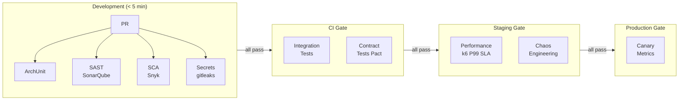

## Keywords in This File

{: .no_toc }

| #   | Keyword | Weight |
| --- | ------- | ------ |
| 1   | [Architecture Fitness Functions](#architecture-fitness-functions) | high |

---

# Architecture Fitness Functions

🎯 Interview Weight: high - appears in staff-level architecture
interviews; tests knowledge of evolutionary architecture and
automated governance; strong differentiator from candidates who
only know manual review.

---

### 🎯 Model Answer

**30 seconds:**
> Architecture fitness functions are automated tests that verify
> architectural properties. They bring the same rigor to architecture
> that unit tests bring to behavior: run in CI/CD, fail the build
> when a property is violated. Examples: ArchUnit to enforce package
> boundaries, performance regression tests to enforce latency SLAs,
> chaos engineering to enforce resilience. The concept comes from
> "Building Evolutionary Architectures" (Ford, Parsons, Kua).

**3 minutes (Senior):**
> A fitness function is any mechanism that provides an objective
> integrity assessment of an architectural characteristic. The
> term comes from evolutionary computation: a fitness function
> measures how well a candidate solution meets the objectives.
>
> For architecture: instead of relying on code reviews and
> architecture review boards to catch violations (slow, inconsistent),
> encode the architectural rules as executable tests. When the
> code evolves, the fitness functions continuously verify that the
> architecture has not regressed.
>
> Types: atomic (test a single architectural dimension), holistic
> (test multiple dimensions simultaneously). Triggered (run on
> deployment) vs continuous (run in production monitoring). Manual
> (a checklist that a human runs) vs automated (a test that runs
> in CI/CD).
>
> Examples: ArchUnit for structural rules (package boundaries,
> no circular dependencies, dependency direction enforcement).
> Performance regression tests for latency SLAs (fail if P99 >
> 2s). Consumer-Driven Contract Tests for API coupling. Chaos
> engineering for resilience. Security SAST for security properties.
>
> The key insight: fitness functions make architectural governance
> scalable. A team of 2 architects cannot manually review 500 PRs
> per week. But automated fitness functions run on every PR and
> flag violations immediately.

*Adapting up:* Staff adds: "The real power of fitness functions
is making architectural trade-offs explicit and measurable. Instead
of 'we should avoid circular dependencies' (aspirational), we have
a ArchUnit test that fails the build on any cycle. The architectural
property is now enforced, not hoped for. Over time, the fitness
function suite becomes the architectural specification of the
system."

*Adapting down:* Junior: "Fitness functions are automated tests
that check architectural rules. Instead of a developer forgetting
to follow a rule, the CI pipeline fails and shows exactly which
rule was violated. Same idea as unit tests but for architecture
rules instead of behavior."

**Blank Mind Recovery:**

**(1) Restate:** "You are asking about Architecture Fitness Functions -
automated tests for architectural properties."

**(2) First principles:** "We automate behavior testing with unit
tests because manual testing is slow and unreliable. The same
principle applies to architecture: encode architectural rules as
automated tests that run on every change."

**(3) Bridge:** "Fitness functions are like structural integrity
checks in a building. When a construction crew adds a new beam,
sensors automatically check that load distribution hasn't exceeded
tolerances. In software, when a developer adds a new dependency,
ArchUnit automatically checks it doesn't create a package cycle."

---

### 📘 Concept Explanation

**What it is:**
Architecture fitness functions (from "Building Evolutionary
Architectures" by Ford, Parsons, and Kua, 2017) are automated,
executable tests that verify architectural characteristics and
constraints. They are the architectural equivalent of unit tests.

**Classification:**

| Dimension | Categories |
|---|---|
| Scope | Atomic (single characteristic), Holistic (multi-characteristic) |
| Trigger | Triggered (on deployment), Continuous (always running in production) |
| Automation | Automated (CI/CD), Manual (process checklist) |

**Fitness functions by architectural concern:**

```
FITNESS FUNCTION TAXONOMY

Structural (ArchUnit):
  - Package boundary enforcement
  - Dependency direction rules
  - No circular dependencies
  - Layer violation detection

Performance:
  - Latency regression tests (k6, JMeter)
  - Memory usage regression tests
  - Throughput minimum tests

Reliability:
  - Chaos engineering (Chaos Monkey, Gremlin)
  - Circuit breaker tests
  - Health check validation

Security:
  - SAST (SonarQube, Checkmarx)
  - Dependency vulnerability scan (Snyk)
  - Secrets detection (gitleaks)

API Coupling:
  - Consumer-Driven Contract Tests (Pact)
  - OpenAPI schema validation tests

Scalability:
  - Load tests at N and 10N traffic
  - Auto-scaling validation tests
```

**ArchUnit - the primary structural fitness function tool:**
ArchUnit is a Java testing library that allows describing and
testing architecture rules as unit tests. Runs in the standard
test suite. Integrates with JUnit 5 and build tools.

---

### 💻 Code Example

```java
// BAD: Architectural rules exist only in documentation
// "Architecture.md: Domain layer must not depend on
// Infrastructure layer."
// Result: developer adds a JDBC import to a domain class
// No one notices until a code review (if ever)

// Domain class violating architecture rule:
package com.example.domain;

import org.springframework.jdbc.core.JdbcTemplate; // WRONG!
// Infrastructure concern imported into domain layer

public class OrderService {
    private JdbcTemplate jdbc; // Domain knows about JDBC!

    public Order process(OrderCommand cmd) {
        // Domain logic mixed with SQL
        jdbc.execute("INSERT INTO orders...");
    }
}
// This violation persists until someone manually catches it.
// Architecture.md says it's wrong; the code does it anyway.
```

> **Code walkthrough:** Without an automated fitness function, the
> architectural rule "domain must not depend on infrastructure"
> is aspirational. The `OrderService` domain class imports
> `JdbcTemplate` (Spring infrastructure). This means the domain
> is now coupled to the Spring JDBC library, cannot be unit tested
> without Spring context, and violates the Clean Architecture
> dependency rule. No build tool caught this. It will persist
> until a manual code review (if that happens).

```java
// GOOD: ArchUnit fitness function enforces the architecture rule

// Architecture fitness functions in test suite
// src/test/java/com/example/ArchitectureTest.java

@AnalyzeClasses(
    packages = "com.example",
    importOptions = ImportOption.DoNotIncludeTests.class
)
public class ArchitectureTest {

    // Rule 1: Domain layer must not depend on infrastructure
    @ArchTest
    static final ArchRule domainMustNotDependOnInfrastructure =
        noClasses()
            .that().resideInPackage("..domain..")
            .should().dependOnClassesThat()
            .resideInAnyPackage(
                "..infrastructure..",
                "..persistence..",
                "org.springframework.jdbc.."
            )
            .because("Domain layer must be framework-agnostic");

    // Rule 2: No circular dependencies between packages
    @ArchTest
    static final ArchRule noCyclicDependencies =
        slices().matching("com.example.(*)..").should()
            .beFreeOfCycles();

    // Rule 3: All Feign clients must have circuit breakers
    @ArchTest
    static final ArchRule feignClientsMustHaveCircuitBreakers =
        classes()
            .that().areAnnotatedWith(FeignClient.class)
            .should().beAnnotatedWith(CircuitBreaker.class)
            .because(
                "All external service calls must be protected"
                + " by a circuit breaker"
            );

    // Rule 4: Repository classes only in persistence package
    @ArchTest
    static final ArchRule repositoriesInPersistenceLayer =
        classes()
            .that().haveNameMatching(".*Repository")
            .should().resideInPackage("..persistence..")
            .because("Repositories belong in persistence layer");

    // Rule 5: Controllers must not access repositories directly
    @ArchTest
    static final ArchRule noDirectRepoAccessFromControllers =
        noClasses()
            .that().resideInPackage("..controller..")
            .should().accessClassesThat()
            .resideInPackage("..repository..")
            .because("Controllers must use services, not repos");
}

// These tests run on every build. If a developer adds a
// JDBC import to a domain class, the build fails immediately
// with a clear message: "Domain layer must be framework-agnostic.
// Violation: OrderService in domain imports JdbcTemplate."
```

> **Code walkthrough:** Each `@ArchTest` field is an ArchUnit rule
> that runs as a standard JUnit test. `domainMustNotDependOnInfrastructure`
> scans all classes in `..domain..` packages and asserts none
> import from infrastructure packages or Spring JDBC. `noCyclicDependencies`
> uses the slice mechanism to detect circular package dependencies.
> `feignClientsMustHaveCircuitBreakers` scans for all Feign clients
> and asserts each has `@CircuitBreaker`. When any rule is violated,
> the test fails with a message showing the exact class and violation.
> These run on every PR, catching architectural drift immediately.

---

### 🎓 Answers by Seniority

**Junior / Mid (0-5 years):**
> Architecture fitness functions are automated tests that check
> architectural rules. ArchUnit tests run in the CI pipeline and
> fail the build if a package dependency rule or layer rule is
> violated. This catches architectural drift automatically instead
> of relying on code reviews to catch every violation.

---

**Senior / Staff (5+ years):**
> The key value of fitness functions is scalable governance. A
> senior architect cannot manually review every PR for architectural
> compliance. But a suite of fitness functions runs on every PR
> and provides immediate, consistent enforcement. The developer
> gets specific feedback: "This class violates the dependency
> direction rule: domain cannot import infrastructure."
>
> The fitness function suite also serves as the living specification
> of architectural decisions. The ArchUnit tests are more accurate
> and current than any architecture document because they are
> executable and fail the build when violated. New engineers can
> read the ArchUnit tests to understand the architectural constraints.
>
> At scale (100+ services), holistic fitness functions become
> critical: Consumer-Driven Contract Tests that verify API
> compatibility before any deployment, chaos engineering that
> validates resilience continuously in production, and platform
> security scans that run on every service's deployment pipeline.

---

### ⚠️ Common Misconceptions

| Misconception | Reality |
|---|---|
| Fitness functions are only for large teams | Even a 5-person team benefits from automated architectural governance. The cost of architectural drift is proportional to codebase age, not team size |
| ArchUnit replaces all architectural governance | ArchUnit handles structural rules well. Performance, resilience, and coupling fitness functions require different tools (k6, Pact, chaos engineering) |
| Fitness functions slow down development | Fast fitness functions (ArchUnit, unit-level tests) add < 30 seconds to CI. The cost of missed architectural violations is far higher |
| Fitness functions must be perfect before starting | Start with 3-5 rules that you know are important. Add more as violations occur. The suite grows incrementally |

---

### 🚨 Failure Modes and Diagnosis

**Failure 1: Fitness function violation ignored in CI**

*Symptom:* ArchUnit tests fail in CI but developers merge PRs
anyway ("it's just an architecture test"). Architectural debt
accumulates.

*Root cause:* Fitness function results are informational, not
blocking. No enforcement.

*Fix:* Architecture tests must block PR merges. Treat architectural
rule violations the same as failing unit tests. If a rule is not
important enough to block a merge, it is not important enough
to be a fitness function.

**Failure 2: Performance fitness function has no baseline**

*Symptom:* Performance regression test passes at 5s P99, but the
production SLA is 2s. The test was written without referencing
the actual requirement.

*Diagnostic:*
```java
// Find the requirement-grounded threshold
@Test
void paymentProcessingMeetsSLA() {
    // SLA: P99 < 2s at 1000 req/s
    // This MUST come from the QA scenario, not a guess
    LoadTestResult result = loadTest(1000, Duration.ofMinutes(1));
    assertThat(result.getP99())
        .isLessThan(Duration.ofSeconds(2)); // SLA from ADR-015
}
```

*Fix:* Every performance fitness function must reference the QA
scenario that defines its threshold. Document the source (e.g.,
"ADR-015 defines P99 < 2s as the payment SLA"). Threshold changes
require updating the referenced document.

---

### 🎯 Interview Deep-Dive

| Preparation | Target |
|---|---|
| Time to prep | 25 minutes |
| Core themes | ArchUnit rules, fitness function taxonomy, evolutionary architecture |
| Seniority signal | Junior: concept; Senior: ArchUnit implementation; Staff: holistic fitness functions, governance scale |
| Common trap | Thinking fitness functions = only ArchUnit |
| Staff differentiator | Fitness function as living spec, multi-dimensional holistic functions |

---

**Q1 [MID]: What is an architecture fitness function and how is
it different from a unit test?**

*Why they ask:* Foundational concept question.

*Likely follow-up:* "What tool would you use to implement one?"

A unit test verifies the behavioral correctness of code: "given
this input, the function returns this output."

An architecture fitness function verifies the structural integrity
of the codebase: "given this architecture rule, no class in the
codebase violates it."

Example unit test: `assertThat(orderService.process(cmd)).hasStatus(CONFIRMED)`

Example fitness function: `noClasses().that().resideIn("..domain..").should().dependOn("..infrastructure..")`

Both run in the CI/CD pipeline. Both fail the build when violated.
The difference is what they test: behavior vs architecture.

Tools: ArchUnit (structural rules in Java), Fitness Function Framework
(JVM), consumer-driven contract tests (Pact) for API coupling,
k6 or JMeter for performance regression, chaos engineering (Gremlin,
Chaos Monkey) for resilience.

*What separates good from great:* Most candidates describe ArchUnit.
Great candidates clarify the behavior vs architecture distinction,
give examples of both types of tests, and describe the range of
tools for different architectural properties.

---

**Q2 [SENIOR]: Implement three ArchUnit fitness functions for a
layered architecture.**

*Why they ask:* Tests practical ArchUnit knowledge.

*Likely follow-up:* "How would you add this to a CI pipeline?"

```java
@AnalyzeClasses(packages = "com.example")
class LayeredArchitectureTest {

    // Rule 1: Presentation layer cannot skip to data layer
    @ArchTest
    static final ArchRule presentationToServiceOnly =
        classes().that()
            .resideInPackage("..presentation..")
            .should().onlyDependOnClassesThat()
            .resideInAnyPackage(
                "..presentation..",
                "..application..",
                "java..",
                "org.springframework.web.."
            );

    // Rule 2: Domain layer is pure - no framework imports
    @ArchTest
    static final ArchRule domainPurity =
        noClasses().that()
            .resideInPackage("..domain..")
            .should().dependOnClassesThat()
            .resideInAnyPackage(
                "org.springframework..",
                "javax.persistence..",
                "..infrastructure.."
            );

    // Rule 3: No cycles between slices
    @ArchTest
    static final ArchRule noCycles =
        slices().matching("com.example.(*)..")
            .should().beFreeOfCycles();
}
```

CI pipeline integration:
```yaml
# Maven: runs automatically with mvn test
# Gradle: runs with ./gradlew test
# No special CI configuration needed -
# ArchUnit tests are standard JUnit tests
```

*What separates good from great:* Most candidates describe rules
in words. Great candidates write actual ArchUnit code with the
correct API (`.that()`, `.should()`, `.resideInPackage()`), handle
the allowed dependencies correctly (the framework imports that
are acceptable in the presentation layer), and note that ArchUnit
runs as standard JUnit tests.

---

**Q3 [STAFF]: What are holistic fitness functions and why do they matter?**

*Why they ask:* Tests depth of fitness function knowledge.

*Likely follow-up:* "Give an example of a holistic fitness function."

Atomic fitness function: tests one architectural dimension in
isolation. "Package A does not depend on Package B." "P99 latency
< 2s." Each test a single property.

Holistic fitness function: tests multiple architectural dimensions
simultaneously. Real system behavior often requires that multiple
properties hold together.

Example: a service deployment fitness function that verifies:
- The new deployment does not break any consumer's contract (Pact)
- The new deployment passes the circuit breaker test (resilience)
- The new deployment's P99 latency is within 10% of the baseline (performance)
- The new deployment has no critical security vulnerabilities (SAST/SCA)

All four must pass before deployment proceeds. Any one failure
blocks the deployment. This is holistic because a partial pass
(e.g., performance OK but contract broken) is still a failure.

Another example: chaos engineering + availability. Inject random
service failures. Verify: (1) requests do not fail (circuit breaker
fires), (2) the service recovers within 30 seconds (health restoration),
(3) no data is corrupted during the failure (data integrity).

Holistic fitness functions catch interactions between architectural
properties that atomic tests miss.

*What separates good from great:* Most candidates describe atomic
tests only. Great candidates describe holistic fitness functions
with a concrete multi-dimensional example, and explain why the
interaction between properties matters.

---

**Q4 [SENIOR]: How do Consumer-Driven Contract Tests function as
fitness functions for API coupling?**

*Why they ask:* Contract tests are an important coupling fitness function.

*Likely follow-up:* "How do you integrate Pact into CI/CD?"

Consumer-Driven Contract Tests (CDCT) verify that a service's
API is compatible with the expectations of its consumers. They
are fitness functions for the coupling between services.

Without CDCTs: a provider service changes its API (removes a
field, changes a field type). Consumers break at runtime in staging
or production. The coupling was not detected until deployment.

With CDCTs (using Pact): the consumer defines a contract (what
API fields it needs and their types). The provider runs the consumer's
contract against its actual implementation. If the provider's
implementation does not satisfy the contract, the build fails.

```java
// Consumer side (Order Service consuming User Service)
@Pact(consumer = "order-service", provider = "user-service")
RequestResponsePact userPact(PactDslWithProvider builder) {
    return builder
        .given("user 123 exists")
        .uponReceiving("a request for user 123")
        .path("/users/123")
        .method("GET")
        .willRespondWith()
        .status(200)
        .body(new PactDslJsonBody()
            .stringType("id", "123")
            .stringType("email", "user@example.com")
            // Order Service needs only id and email
        )
        .toPact();
}

// Provider side (User Service verification)
@Provider("user-service")
@PactFolder("target/pacts")
class UserServiceContractTest {
    @TestTarget
    public final MockMvcTarget target = new MockMvcTarget();
    // Runs all consumer pacts against the actual controller
}
```

CI/CD integration: consumer runs pact tests -> uploads contract to
Pact Broker -> provider downloads and verifies contract -> passes
only if contract is satisfied -> can-i-deploy check gates deployment.

*What separates good from great:* Most candidates describe CDCTs
in theory. Great candidates write actual Pact DSL code, describe
the Pact Broker as the coordination mechanism, and describe the
can-i-deploy gate in the CI/CD pipeline.

---

**Q5 [STAFF]: How does chaos engineering implement fitness functions
for resilience?**

*Why they ask:* Chaos engineering is the resilience fitness function.

*Likely follow-up:* "How do you run chaos engineering safely?"

Chaos engineering (Principles of Chaos Engineering, Netflix):
deliberately inject failures into a running system and verify
that the system's resilience properties hold.

As a fitness function: define a hypothesis ("the system maintains
95% availability under random service failures"). Inject failures.
Measure. The fitness function passes if the hypothesis holds.

Example chaos experiments:

Service failure: terminate a random service instance. Hypothesis:
circuit breaker fires, requests route to remaining instances,
no user-visible errors. Measurement: error rate in Grafana.

Network latency injection: add 2s latency to all calls to the
Inventory Service. Hypothesis: timeout fires within 3s, fallback
response returned, no thread exhaustion. Measurement: P99 latency
and thread pool utilization.

Database connection exhaustion: limit DB connections to 10% of
normal. Hypothesis: connection pool rejects gracefully, service
returns 503 with Retry-After, no cascading failures.

Tools: Chaos Monkey (Netflix, random instance termination), Gremlin
(comprehensive fault injection: CPU, memory, latency, packet loss),
AWS Fault Injection Simulator, Toxiproxy (network-level fault injection).

Running safely: (1) start with staging environment, never production
initially; (2) define blast radius (scope experiments to non-critical
services initially); (3) have rollback plan; (4) establish baseline
metrics before introducing chaos; (5) run during business hours
(teams available to respond); (6) graduate to production as confidence
grows.

*What separates good from great:* Most candidates know chaos
engineering by name. Great candidates describe it as a fitness
function (hypothesis-driven), give specific experiment types with
measurement criteria, and describe the gradual approach to production
chaos.

---

**Q6 [SENIOR]: How do you build a fitness function for performance
regression?**

*Why they ask:* Performance fitness functions are critical for production SLAs.

*Likely follow-up:* "How do you set the threshold?"

A performance regression fitness function runs a load test against
the service in CI/CD and fails if latency or throughput regresses
beyond a threshold.

```javascript
// k6 load test as fitness function
import http from 'k6/http';
import { check } from 'k6';

export const options = {
    scenarios: {
        payment_sla: {
            executor: 'constant-arrival-rate',
            rate: 1000,         // 1000 requests/second
            duration: '60s',
            preAllocatedVUs: 100,
        },
    },
    thresholds: {
        // Fitness function: P99 must be < 2s (from ADR-015)
        'http_req_duration{p(99)}': ['p(99)<2000'],
        // Fitness function: error rate < 0.1%
        'http_req_failed': ['rate<0.001'],
    },
};

export default function () {
    const res = http.post(
        'http://payment-service/api/payments',
        JSON.stringify({ amount: 100, currency: 'USD' }),
        { headers: { 'Content-Type': 'application/json' } }
    );
    check(res, {
        'status is 200': (r) => r.status === 200,
    });
}
```

Threshold setting: thresholds must come from the QA scenario or
ADR, not from the current performance. "Our payment SLA is P99 <
2s" defines the threshold. Current performance may be 1.4s; the
threshold is still 2s (the SLA, not the current state).

Running in CI: run the performance test against a local or staging
environment with production-like data volume. Use a fixed dataset
to ensure reproducibility. Flag >10% latency regression from
baseline (the baseline being the current P99, even if below SLA).

*What separates good from great:* Most candidates describe load
testing. Great candidates write actual k6 threshold configuration,
explain the threshold-from-SLA principle (not from current
performance), and describe the dual threshold: absolute SLA + relative
regression detection.

---

**Q7 [STAFF]: How do you introduce fitness functions to a team
that has never used them?**

*Why they ask:* Tests change management for architectural tooling.

*Likely follow-up:* "How do you prioritize which fitness functions to write first?"

Introduction strategy:

Step 1 - Identify the most painful architectural violations: ask
"what architectural rules do we keep violating in code reviews?"
The top answer is the first fitness function to implement.

Step 2 - Start with one ArchUnit rule: pick the most clear-cut
rule (e.g., "no database access from controller layer"). Write
the ArchUnit test. Run it. It will likely fail on existing code.

Step 3 - Handle existing violations: ArchUnit provides `@ArchIgnore`
for legacy violations. Suppress existing violations, enforce the
rule for new code only. Incrementally fix the old violations.

Step 4 - Add to CI as a build gate: the ArchUnit test must fail
the build. "Informational" fitness functions are never taken
seriously.

Step 5 - Grow incrementally: add a new fitness function whenever
a new architectural rule is established. After 6 months, the test
suite has 10-20 rules covering the most important properties.

Prioritization: fitness functions for rules that are (a) frequently
violated and (b) expensive to violate are the highest priority.
Circular dependencies (frequently created, expensive to untangle)
are a top priority. Layer violations (frequently created, expensive
to refactor) are second.

*What separates good from great:* Most candidates say "add ArchUnit
to the project." Great candidates describe the discovery process
(find the most violated rules), handle existing violations with
`@ArchIgnore`, enforce as build gates, and grow incrementally.

---

**Q8 [STAFF]: How do fitness functions relate to Architecture
Decision Records?**

*Why they ask:* Tests integration of governance mechanisms.

*Likely follow-up:* "Which comes first - the ADR or the fitness function?"

The relationship: ADRs capture the decision and rationale; fitness
functions enforce the decision automatically.

The workflow:
(1) Team makes an architectural decision: "Domain layer must not
depend on infrastructure layer (Clean Architecture)." Write ADR-007.
(2) Write a fitness function that encodes the rule: ArchUnit test
for `domainMustNotDependOnInfrastructure`.
(3) Reference the ADR in the fitness function: `because("ADR-007: Clean Architecture - domain independence")`.

Benefits of linking ADR to fitness function:
- The fitness function test failure message includes the ADR reference.
  "This violates ADR-007. See docs/adr/ADR-007-clean-architecture.md."
- When the ADR is superseded or deprecated, the fitness function
  must be updated. The link makes this explicit.
- New engineers can find the ADR from the fitness function failure
  message - the failure points to the rationale.

The fitness function IS the enforcement of the ADR. Without a
fitness function, the ADR is documentation that can be ignored.
With a fitness function, the ADR is an enforceable rule.

*What separates good from great:* Most candidates describe ADRs and
fitness functions separately. Great candidates describe the
explicit linkage between them, the failure message referencing
the ADR, and the insight that the fitness function is the
enforcement mechanism for the ADR.

---

**Q9 [STAFF]: What fitness functions would you add to a microservices
deployment pipeline?**

*Why they ask:* Tests holistic architectural governance thinking.

*Likely follow-up:* "How do you prevent fitness function explosion?"

A deployment pipeline fitness function suite for microservices:

Pre-build (triggered on every commit):
- SAST: SonarQube / Checkmarx (security + code quality)
- SCA: Snyk (dependency CVEs)
- Secrets scan: gitleaks (no credentials in code)
- ArchUnit (structural rules for this service)

Build gate (before integration tests):
- Compilation + unit tests + code coverage gate
- ArchUnit tests pass

Integration gate (before deployment):
- Consumer-Driven Contract Tests (Pact): this service's contract
  with all consumers still satisfied
- Provider contract verification: consumers' expectations still met
- API schema validation (OpenAPI schema regression)

Performance gate (before production deployment):
- k6 load test: P99 < SLA threshold
- Memory usage regression: < 10% increase from baseline

Deployment gate (canary):
- Error rate in production canary < 0.1% (holistic fitness function)
- Latency in production canary < SLA (real production data)
- Circuit breaker state nominal after 5 minutes

Preventing fitness function explosion: each fitness function must
justify its cost. A fitness function that takes 15 minutes to
run is a fast-feedback problem. Move slow tests to asynchronous
(run after deploy to staging, not before deploy). Keep the
total pre-merge gate under 10 minutes.

*What separates good from great:* Most candidates list a few tests.
Great candidates describe a pipeline-stage organization, include
the canary deployment gate as a real-world production fitness
function, and address the feedback time problem.

---

**Q10 [STAFF]: BEHAVIORAL: Have you implemented architecture fitness
functions in a project? What did you learn?**

*Why they ask:* Tests real-world experience.

*Likely follow-up:* "What fitness function had the biggest impact?"

Strong answer structure:

Situation: "I joined a 3-year-old Java monolith being refactored
into a modular monolith. The team had documented architectural
rules in README files but frequently violated them. Reviews caught
violations only occasionally."

Action: "I introduced ArchUnit to the project. Started with three
rules: no controller accessing repository directly, no domain
class importing Spring, and no circular package dependencies.
The first run failed on 47 violations in existing code."

Handling existing violations: "Used `@ArchIgnore` on the legacy
violations with a TODO and the violating class name. Enforced the
rule for new code immediately. Ran a monthly 'cleanup sprint' to
fix archived violations."

Impact: "After 3 months: zero new violations in any of the three
rules. After 6 months: all 47 legacy violations fixed. The team
stopped arguing in code reviews about layer violations - the rule
was non-negotiable once enforced by the build."

Most impactful fitness function: "The no-circular-dependencies
rule. We had a cycle that prevented parallelizing 4 module builds.
When ArchUnit caught the cycle in a new PR, the developer untangled
it on the spot. Build time for those 4 modules dropped from 8
minutes to 2 minutes because they could now build in parallel."

*What separates good from great:* Generic "we added ArchUnit" vs
specific numbers (47 violations), the `@ArchIgnore` migration
strategy, a concrete outcome (build time improvement from cycle
removal), and an honest account of the initial failure count.

---

**Q11 [STAFF]: How do you build a fitness function for service
coupling (beyond contract tests)?**

*Why they ask:* API coupling is a critical architectural property.

*Likely follow-up:* "How do you detect synchronous coupling chains?"

Service coupling fitness functions beyond Pact contract tests:

Synchronous call chain depth: a fitness function that detects
dependency chains longer than a defined depth. A request spanning
A -> B -> C -> D -> E is dangerous (5 services must all be available).

Implementation approach: distributed tracing (Jaeger, Zipkin).
Analyze trace data in CI (integration test suite): assert no trace
spans more than 3 services in the critical path.

```python
# Fitness function: analyze traces from integration tests
def test_no_deep_synchronous_chains():
    # Run integration tests and collect traces
    traces = collect_traces(run_integration_suite())
    for trace in traces:
        depth = max_synchronous_depth(trace)
        assert depth <= 3, (
            f"Trace {trace.id} has sync depth {depth} > 3. "
            f"Consider async decomposition. "
            f"See ADR-014."
        )
```

Fan-out measurement: number of synchronous downstream services
called per request. High fan-out = coupling smell.

Schema coupling detection: if service A's DB schema is directly
imported by service B (shared entity class), static analysis
detects the shared import and fails the build.

*What separates good from great:* Most candidates describe contract
tests only. Great candidates describe trace-based coupling detection
for synchronous chains, the maximum depth rule as a concrete
threshold, and schema coupling detection via static analysis.

---

**Q12 [STAFF]: How do fitness functions enable evolutionary architecture?**

*Why they ask:* The conceptual foundation of fitness functions.

*Likely follow-up:* "What does evolutionary architecture mean?"

Evolutionary architecture: an architecture designed to guide
evolution through fitness functions rather than resist change
through upfront specification. From "Building Evolutionary
Architectures" (Ford, Parsons, Kua).

The problem fitness functions solve: traditional architectures
assume stability. The architect designs the "correct" architecture
upfront. As requirements evolve, the architecture drifts from
the original design. Without automated enforcement, the drift
accumulates silently.

Evolutionary architecture: instead of designing a stable architecture,
design an architecture with clear properties (quality attributes),
express those properties as fitness functions, and let the
architecture evolve as long as the fitness functions continue
to pass.

The mental shift: "Is this change architecturally correct?" becomes
"Does this change violate any fitness function?" If not, the
change is architecturally acceptable. The fitness functions
define the boundaries of acceptable evolution.

Example: a team wants to migrate from a layered architecture to
a hexagonal architecture. Without fitness functions: the migration
is a big-bang rewrite that requires a major architectural decision.
With fitness functions: add the hexagonal architecture rules as
fitness functions. All new code must satisfy them. Old code is
migrated incrementally. At any point, the fitness functions show
progress.

The fitness function suite IS the evolutionary architecture
specification. It grows as the architecture evolves.

*What separates good from great:* Most candidates describe fitness
functions as testing tools. Great candidates describe the conceptual
shift (fitness functions as the specification, not the tests),
the evolutionary architecture philosophy (design for guided evolution,
not stability), and the incremental migration use case.

| Interviewer Type | Emphasis |
|---|---|
| Technical Panel | ArchUnit implementation, chaos engineering |
| Hiring Manager | Governance scalability, team introduction |
| Bar Raiser | Evolutionary architecture philosophy, holistic fitness functions |
| Peer Engineer | Practical: ArchUnit rules, k6 thresholds, Pact |

---

### ⚖️ Comparison Table

| Type | Tool | Property Tested | Trigger |
|---|---|---|---|
| Structural | ArchUnit | Package boundaries, dependency direction, no cycles | Every build |
| Performance | k6, JMeter | Latency SLA, throughput minimum | Pre-production deploy |
| Resilience | Chaos Monkey, Gremlin, Toxiproxy | Availability under failure, recovery time | Scheduled in production |
| API Coupling | Pact (CDCTs) | Contract compatibility between services | Every build (consumer + provider) |
| Security | SonarQube, Snyk, gitleaks | OWASP violations, CVEs, secrets | Every PR |
| Data Integrity | Custom | No data corruption under failure | Chaos test runs |

---

### 🏛️ System Design

*(Omit: Architecture Fitness Functions is L4, a governance and
tooling pattern applied at the architecture level. Used throughout
all system design conversations but not itself a system component.)*

---

### 📊 Diagram

```
FITNESS FUNCTION PIPELINE INTEGRATION

PR Created
    |
    v
Pre-merge gate (< 5 min target):
  [SAST] [SCA] [Secrets] [ArchUnit] [Unit Tests]
    |
    v (all pass)
Merge to main
    |
    v
Build gate:
  [Integration Tests] [Contract Tests (Pact)]
    |
    v (all pass)
Deploy to staging
    |
    v
Staging gate:
  [Performance regression test (k6)]
  [API schema regression]
  [Consumer contract verification]
    |
    v (all pass)
Canary deploy to production
    |
    v
Production gate (5 min observation):
  [Error rate < 0.1%]
  [Latency within SLA]
  [Circuit breakers nominal]
    |
    v (all pass)
Full production rollout
```



> **Diagram walkthrough:** Fitness functions are organized by
> pipeline stage to maximize both coverage and developer feedback
> speed. The fastest checks (ArchUnit, SAST, secrets) run at PR
> time to give immediate feedback. Integration and contract tests
> run after merge. Performance regression and chaos tests run
> in staging where a full deployment is available. Production
> canary metrics are the final holistic fitness function: real
> traffic against real infrastructure is the ultimate test of
> all architectural properties simultaneously.
