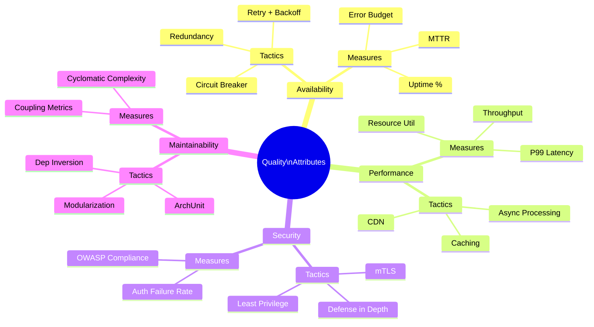

## Keywords in This File

{: .no_toc }

| #   | Keyword | Weight |
| --- | ------- | ------ |
| 1   | [Non-Functional Requirements and Quality Attributes](#non-functional-requirements-and-quality-attributes) | critical |

---

# Non-Functional Requirements and Quality Attributes

🎯 Interview Weight: critical - architecture interviews at senior+
level always involve quality attribute trade-offs; NFRs are the
primary drivers of architectural decisions; tested in every
system design interview at Google, Amazon, Meta.

---

### 🎯 Model Answer

**30 seconds:**
> Quality attributes (non-functional requirements) describe HOW
> a system behaves, not what it does. They are the primary drivers
> of architectural decisions: availability requirements drive
> redundancy choices, performance requirements drive caching and
> async patterns, security requirements drive authentication and
> encryption design. The architect's core job is to identify which
> quality attributes are architecturally significant - those that
> require structural trade-offs - and design to meet them.

**3 minutes (Senior):**
> Quality attributes (QAs) are system properties that cut across
> all functional requirements: availability (uptime), performance
> (latency/throughput), scalability (handle growth), security
> (confidentiality/integrity/availability), maintainability
> (modifiability, testability), reliability (correct behavior
> under failure), and portability.
>
> The key insight: quality attributes trade off against each other.
> You cannot maximize all of them simultaneously. Availability
> conflicts with consistency (CAP theorem). Performance conflicts
> with security (encryption adds latency). Maintainability conflicts
> with performance (abstraction layers add overhead). The architect's
> job is to identify which QAs are "architecturally significant"
> for a given system - those that require structural decisions.
>
> Quality Attribute Workshop (QAW) process: (1) list stakeholders,
> (2) identify quality attribute scenarios (stimulus + environment
> + response + measure), (3) prioritize scenarios, (4) evaluate
> architectures against scenarios. A scenario: "Under normal load
> (1000 req/s), a payment request must complete within 2 seconds
> (P99) with 99.95% availability."
>
> Architecture tactics: each QA has specific tactics. Availability:
> redundancy (active-active, active-passive), health monitoring,
> retry with backoff. Performance: caching, async processing,
> connection pooling, CDN. Security: input validation, encryption,
> access control. The architecture is the sum of QA tactic choices.

*Adapting up:* Staff adds: "The most dangerous quality attribute
is the one everyone assumes but nobody measures. Availability is
the classic: teams say '99.9% SLA' but never measure actual
error budget consumption. I instrument QA metrics from day one:
latency percentiles, error rates, and deployment frequency. The
metrics drive architectural conversations rather than opinions."

*Adapting down:* Junior: "Quality attributes describe how well
the system works - how fast, how reliable, how secure. They are
different from features (what the system does). An architect
designs the system structure to meet the quality attributes."

**Blank Mind Recovery:**

**(1) Restate:** "You are asking about Quality Attributes - the
non-functional properties that describe how a system behaves."

**(2) First principles:** "A system can have all the right features
(functional requirements) and still be unusable if it is too slow,
too unreliable, or too insecure. Quality attributes capture the
structural properties that make a system production-worthy."

**(3) Bridge:** "Quality attributes are like the structural
properties of a building: load-bearing capacity, fire resistance,
energy efficiency, sound insulation. The architect must design
for these before laying any bricks. Changing them after construction
is expensive. The same is true in software."

---

### 📘 Concept Explanation

**What it is:**
Quality attributes (QAs), also called non-functional requirements
(NFRs), describe the operational and developmental characteristics
of a system. They are measurable properties that constrain the
design of the functional features.

ISO 25010 Quality Model categorizes QAs into 8 characteristics:
1. Functional Suitability (correctness, completeness)
2. Performance Efficiency (time behavior, resource utilization)
3. Compatibility (coexistence, interoperability)
4. Usability (learnability, operability)
5. Reliability (maturity, fault tolerance, recoverability)
6. Security (confidentiality, integrity, authenticity)
7. Maintainability (modularity, reusability, testability)
8. Portability (adaptability, installability)

**Quality Attribute Scenarios:**
A concrete, measurable specification: [Stimulus Source] + [Stimulus]
+ [Environment] + [Artifact] + [Response] + [Response Measure].

Example: "A standard user (source) submits a payment request
(stimulus) under peak load of 5000 req/s (environment) to the
Payment API (artifact). The system returns a payment confirmation
(response) within 2 seconds P99 with 99.95% success rate (measure)."

**Critical QA trade-offs:**

```
QUALITY ATTRIBUTE TRADE-OFF MAP

  Availability <------> Consistency (CAP Theorem)
      "Choose partition tolerance + one of the two"

  Performance <-------> Security
      "Encryption, validation, auth checks add latency"

  Maintainability <---> Performance
      "Abstraction layers add overhead"

  Scalability <-------> Consistency
      "Distributed systems need eventual consistency"

  Cost <----------> All others
      "Every QA improvement has a cost"
```

**Architecture tactics by quality attribute:**

| QA | Tactics |
|---|---|
| Availability | Redundancy, health monitoring, retry + backoff, circuit breaker |
| Performance | Caching, async, connection pooling, CDN, data sharding |
| Security | Input validation, encryption at rest/transit, auth, RBAC |
| Maintainability | Modularization, dependency inversion, automated testing |
| Scalability | Horizontal scaling, stateless design, partitioning |

---

### 💻 Code Example

```java
// BAD: QA requirements implicit and unmeasured
@RestController
public class PaymentController {
    @PostMapping("/payments")
    public PaymentResponse processPayment(
        @RequestBody PaymentRequest req
    ) {
        // No timeout defined
        // No circuit breaker
        // No rate limiting
        // No input validation beyond @Valid
        // No latency measurement
        return paymentService.process(req);
    }
}
// "The system should be fast" is not a QA.
// No way to know if this meets requirements.
// No architecture tactic enforces availability.
```

> **Code walkthrough:** The controller has no architecture tactics
> for the quality attributes that matter for payment processing:
> no timeout (one slow downstream hangs all threads), no circuit
> breaker (cascading failure risk), no rate limiting (one abusive
> client can exhaust capacity), and no latency measurement. When
> production incidents occur, there is no data to diagnose against
> the QA requirements because those requirements were never made
> explicit.

```java
// GOOD: QA requirements explicit, tactics implemented,
// metrics instrumented

@RestController
@RequiredArgsConstructor
public class PaymentController {

    private final PaymentService paymentService;
    private final MeterRegistry meterRegistry;

    // QA: Availability - circuit breaker
    // QA: Performance - timeout (2s P99 requirement)
    // QA: Security - input validation
    // QA: Observability - latency measurement
    @PostMapping("/payments")
    @Timed(value = "payment.process",
           percentiles = {0.5, 0.95, 0.99})
    @CircuitBreaker(name = "payment",
                    fallbackMethod = "paymentFallback")
    @RateLimiter(name = "paymentRateLimiter")
    public ResponseEntity<PaymentResponse> processPayment(
        @Valid @RequestBody PaymentRequest req,
        @RequestHeader("X-Idempotency-Key") String idemKey
    ) {
        // QA: Security - idempotency prevents double charges
        Timer.Sample sample = Timer.start(meterRegistry);
        try {
            PaymentResponse response =
                paymentService.process(req, idemKey);
            sample.stop(Timer.builder("payment.success")
                .register(meterRegistry));
            return ResponseEntity.ok(response);
        } catch (PaymentException e) {
            sample.stop(Timer.builder("payment.error")
                .tag("reason", e.getCode())
                .register(meterRegistry));
            throw e;
        }
    }

    // QA: Availability - graceful degradation on failure
    public ResponseEntity<PaymentResponse> paymentFallback(
        PaymentRequest req, String idemKey, Exception e
    ) {
        // Return queued response - async processing
        return ResponseEntity.accepted()
            .body(PaymentResponse.queued(idemKey));
    }
}

// application.yml: QA thresholds as configuration
// resilience4j.circuitbreaker.instances.payment:
//   failureRateThreshold: 50      # Open at 50% errors
//   waitDurationInOpenState: 30s  # Try again after 30s
//   permittedCallsInHalfOpenState: 5
//   slidingWindowSize: 10
// resilience4j.timelimiter.instances.payment:
//   timeoutDuration: 2s           # 2s P99 requirement
```

> **Code walkthrough:** Each annotation maps to a specific quality
> attribute tactic: `@Timed` instruments latency percentiles (P50,
> P95, P99) against the 2s requirement, `@CircuitBreaker` implements
> the availability tactic (fail-fast when the downstream service
> is unhealthy), `@RateLimiter` implements the performance tactic
> (prevent single-client overconsumption), and the `X-Idempotency-Key`
> header implements the security/reliability tactic (no double
> charges). The `paymentFallback` implements graceful degradation
> (availability tactic: queue rather than reject). The `application.yml`
> configuration makes the QA thresholds explicit and tunable without
> code changes.

---

### 🎓 Answers by Seniority

**Junior / Mid (0-5 years):**
> Quality attributes describe how a system behaves - speed,
> reliability, security, maintainability. They differ from features
> in that they apply to all features, not just one. Availability
> means the system is up when users need it. Performance means
> it responds quickly. Security means it protects data. The
> architect chooses the system structure (caching, redundancy,
> encryption) to meet these attributes.

---

**Senior / Staff (5+ years):**
> Quality attributes drive architecture. When a team says "we need
> 99.99% availability," that is the decision point for active-active
> multi-region deployment (not active-passive, which cannot achieve
> that SLA under a regional failure). When a team says "P99 under
> 100ms," that constrains the database choice, the caching strategy,
> and which services can be synchronous vs async.
>
> The dangerous anti-pattern: implied quality attributes. "The
> system should be fast" is not an architecture driver. "P99 < 100ms
> at 10,000 req/s with < 0.1% error rate" is. The second statement
> constrains the architecture; the first does not.
>
> Error budget: formalize QA trade-offs as an error budget. A
> 99.95% availability SLA allows 21.9 minutes of downtime per
> month. Track actual error budget consumption. When error budget
> is depleted, stop feature delivery and fix reliability. This
> converts an abstract QA into an operational reality.

---

### ⚠️ Common Misconceptions

| Misconception | Reality |
|---|---|
| NFRs are less important than features | NFRs drive architectural structure. A feature can be added post-launch; an architectural tactic for availability requires structural changes |
| All quality attributes can be maximized simultaneously | QAs trade off. Availability vs consistency (CAP). Performance vs security. An architect makes explicit trade-off decisions |
| NFRs are set once and never change | QA requirements evolve. A startup's 99.9% SLA may become 99.99% after a major client is signed. Architecture must evolve with requirements |
| Performance = speed | Performance includes latency (response time), throughput (requests/second), resource utilization (CPU/memory), and scalability under load |

---

### 🚨 Failure Modes and Diagnosis

**Failure 1: QA requirements not elicited, assumed from context**

*Symptom:* System performs fine in development. At 10x production
load, latency spikes to 8 seconds. No SLA was defined, so teams
argue about whether this is acceptable.

*Root cause:* Quality attribute scenarios were never written.
"Fast" and "reliable" were assumed to be understood.

*Diagnostic:*
```bash
# What is the actual P99 latency in production?
# (You may not know what "acceptable" is without a defined SLA)
curl -s https://api.example.com/metrics |
  grep payment_process_seconds_max
# p99=8.1 - but what is the requirement?
```

*Fix:* Quality Attribute Workshop (QAW) before the next major
architecture decision. Produce concrete scenarios with measurable
response measures. "P99 < 2s at 5000 req/s under peak load."

**Failure 2: Availability tactic chosen for the wrong threat model**

*Symptom:* Deployed active-passive with automatic failover (5-minute
RTO). Customer reports "the system was down for 30 minutes."
Post-mortem: a deployment bug caused the primary to fail but the
passive detected it as a network blip, delaying failover.

*Root cause:* Active-passive with a 5-minute RTO does not meet
99.99% availability. The tactic was chosen without validating
against the availability scenario.

*Fix:* Match the availability tactic to the availability requirement.
99.9% (8.76 hours/year): active-passive. 99.99% (52.6 minutes/year):
active-active with health-based routing. 99.999% (5.26 minutes/year):
active-active multi-region with chaos engineering validation.

---

### 🎯 Interview Deep-Dive

| Preparation | Target |
|---|---|
| Time to prep | 30 minutes |
| Core themes | QA trade-offs, scenarios, architecture tactics |
| Seniority signal | Junior: definition; Senior: trade-offs + tactics; Staff: error budget, QAW |
| Common trap | Listing NFRs without trade-offs |
| Staff differentiator | QA scenarios, error budget operationalization |

---

**Q1 [MID]: What is the difference between functional requirements
and quality attributes?**

*Why they ask:* Baseline architectural thinking question.

*Likely follow-up:* "Give an example of a quality attribute scenario."

Functional requirements: what the system does. "Process a payment."
"Retrieve a customer's order history." "Send an email notification."

Quality attributes: how the system does it. "Process a payment
within 2 seconds (P99) with 99.95% success rate at 5000 requests
per second." "Retrieve order history with no PII exposed to
unauthorized users." "Send email notifications even when the
notification service has a transient failure."

The distinction matters architecturally: functional requirements
drive the domain model and business logic. Quality attributes
drive the structural decisions: caching, redundancy, async messaging,
encryption, modularization. Two systems with identical functionality
but different quality attributes need different architectures.

A quality attribute scenario: "(Source) A standard customer
(Stimulus) submits a payment request (Environment) under peak
Friday load of 5000 req/s (Artifact) to the Payment API
(Response) and receives a confirmation (Measure) within 2 seconds
P99 with 99.95% success rate."

*What separates good from great:* Most candidates give a textbook
definition. Great candidates give a concrete QA scenario with
the full stimulus/environment/response/measure structure, and
explain why this precision is necessary for architecture decisions.

---

**Q2 [SENIOR]: What is the CAP theorem and what are its
architectural implications?**

*Why they ask:* The fundamental distributed systems trade-off.

*Likely follow-up:* "What does 'eventual consistency' mean?"

CAP theorem (Brewer, 2000): a distributed system can guarantee at
most two of three properties:
- Consistency: all nodes see the same data at the same time.
- Availability: every request receives a response (not necessarily
  the latest data).
- Partition Tolerance: the system continues operating when network
  partitions occur.

Since network partitions are inevitable in distributed systems,
the real choice is: under a partition, do you prefer Consistency
(reject requests if you cannot guarantee up-to-date data) or
Availability (return possibly stale data)?

CA (not P-tolerant): single-node systems. Acceptable only when
partition tolerance is not needed (single data center, high-
reliability network). PostgreSQL on a single node.

CP (Consistency over Availability): reject requests during
partitions rather than return stale data. Useful for financial
transactions where stale data leads to correctness violations.
ZooKeeper, HBase.

AP (Availability over Consistency): return possibly stale data
during partitions. Useful for user-facing features where stale
data is acceptable (product catalog, recommendation engine).
Cassandra, DynamoDB (default), CouchDB.

Architectural implication: choose CP for operations where stale
data causes business harm (inventory reservation, payment
processing). Choose AP for operations where stale data is
acceptable and availability is critical (product listings, user
profiles).

*What separates good from great:* Most candidates define the theorem.
Great candidates describe the CP vs AP choice as a business decision
(not just a technical one), give concrete examples for each, and
note that partition tolerance is non-negotiable for distributed
systems.

---

**Q3 [SENIOR]: How do you define and measure availability as a
quality attribute?**

*Why they ask:* Availability is the most common and most misunderstood QA.

*Likely follow-up:* "What is an error budget?"

Availability formula: `Availability = MTTF / (MTTF + MTTR)`
where MTTF = Mean Time To Failure, MTTR = Mean Time To Recovery.

SLA levels and what they mean in practice:

| SLA | Downtime/year | Downtime/month |
|---|---|---|
| 99% | 87.6 hours | 7.3 hours |
| 99.9% | 8.76 hours | 43.8 minutes |
| 99.99% | 52.6 minutes | 4.4 minutes |
| 99.999% | 5.26 minutes | 26 seconds |

Error budget: `1 - availability_target`. For 99.9% SLA, the error
budget is 0.1% = 43.8 minutes per month. The error budget is
"allowed failure." If the team burns the error budget before
month end, they stop new deployments and focus on reliability.

Measuring availability: instrument every API endpoint with success
and error rate metrics. Availability = success_requests /
total_requests over the SLA window.

Architectural decisions driven by availability target:
- 99.9%: active-passive with manual failover, reasonable.
- 99.99%: active-active with automatic health-based routing required.
  Single-region failures must be transparent to users.
- 99.999%: active-active multi-region. Chaos engineering to validate.

*What separates good from great:* Most candidates give a definition.
Great candidates describe the error budget as an operational tool,
give the SLA-to-downtime translation, and link availability targets
to specific architectural tactic choices.

---

**Q4 [STAFF]: How do you conduct a Quality Attribute Workshop?**

*Why they ask:* Tests systematic approach to eliciting architectural requirements.

*Likely follow-up:* "What do you do with the results?"

The Quality Attribute Workshop (QAW) is a structured elicitation
session to identify architecturally significant quality attribute
requirements.

Steps:

(1) Identify stakeholders: business owners, product managers,
operations, security, development leads. Each has different QA
priorities.

(2) Business and mission presentation (15 min): the product owner
presents the system's business context. What is the cost of
downtime? What is the competitive landscape? What drives the
technology choices?

(3) Architectural plan presentation (15 min): the current or
proposed architecture. What are the key structural decisions?
Where are the risks?

(4) Elicit quality attribute scenarios (60 min): each stakeholder
proposes scenarios. "As the head of operations, I need the system
to recover from a regional data center failure within 4 minutes."
Write each scenario as: source, stimulus, environment, artifact,
response, response measure.

(5) Prioritize scenarios (30 min): rank scenarios by business
impact and implementation difficulty. The top scenarios are the
architecture drivers.

(6) Evaluate architecture against drivers: can the current or
proposed architecture meet the top-priority scenarios? Where does
it fail?

Output: a prioritized list of quality attribute scenarios that
the architecture must meet. These become acceptance criteria.

*What separates good from great:* Most candidates describe QA
categories. Great candidates describe the QAW as a stakeholder-
inclusive process, give the full scenario format (stimulus/environment/
response/measure), and describe the output as acceptance criteria.

---

**Q5 [STAFF]: How do availability, consistency, and performance
trade off in a real system design?**

*Why they ask:* Core system design judgment question.

*Likely follow-up:* "How would you design the payment service?"

Real example: an e-commerce checkout with payment processing.

Availability vs Consistency: the inventory check on checkout must
be consistent (if we show "in stock" and reserve, we cannot
oversell). But the catalog browsing can be available over consistent
(showing slightly stale prices is acceptable; catalog unavailability
loses sales).

Decision: two-tier approach. Catalog: AP (Cassandra, eventually
consistent replicas, CDN-cached). Order and Inventory: CP (PostgreSQL,
strong consistency for reservation and payment).

Performance vs Consistency: the payment processing path must be
synchronous and consistent (confirm payment before returning).
The order confirmation email, analytics update, and loyalty points
can be asynchronous (decouple from the synchronous payment path).

Decision: payment path is synchronous with strong consistency.
Post-payment events (email, analytics, loyalty) are async via
message queue. The synchronous path is as short as possible:
validate, charge, reserve, confirm. Everything else is async.

Performance vs Security: TLS adds ~1ms per connection (with
session resumption, amortized). JWT validation adds ~0.5ms.
For a 2s P99 requirement, these are acceptable. If P99 were 50ms,
we'd need careful profiling.

The architecture: PostgreSQL for transactional data (CP), Cassandra
for catalog (AP), Redis for sessions (AP, eventual), Kafka for
post-payment events (async, at-least-once).

*What separates good from great:* Most candidates describe the
trade-offs abstractly. Great candidates give a concrete two-tier
design with specific technology choices justified by the specific
QA requirements.

---

**Q6 [STAFF]: How do you use architecture fitness functions to
enforce quality attributes?**

*Why they ask:* Tests knowledge of automated QA enforcement.

*Likely follow-up:* "What tools do you use?"

Architecture fitness functions (from "Building Evolutionary
Architectures") are automated tests that verify architectural
properties continuously.

For availability:
```java
// Fitness function: circuit breaker configured for all external calls
@ArchTest
static final ArchRule circuitBreakerRule =
    classes().that().areAnnotatedWith(FeignClient.class)
        .should().beAnnotatedWith(CircuitBreaker.class)
        .because("All Feign clients must have circuit breakers");
```

For performance:
```java
// Fitness function: latency regression test
@Test
void paymentProcessingLatencyUnder2Seconds() {
    // Load test: 1000 requests at 500 req/s
    LoadTestResult result = loadTest(
        "/api/payments", 1000, 500
    );
    assertThat(result.getP99Latency())
        .isLessThan(Duration.ofSeconds(2));
}
```

For security:
```java
// ArchUnit: no direct DB access from controllers
@ArchTest
static final ArchRule noDirectDbInControllers =
    noClasses().that().resideInPackage("..controller..")
        .should().accessClassesThat()
        .resideInPackage("..repository..");
```

For maintainability:
```java
// ArchUnit: no circular dependencies between packages
@ArchTest
static final ArchRule noCycles =
    slices().matching("com.example.(*)..").should()
        .beFreeOfCycles();
```

These run in the CI/CD pipeline. A QA violation fails the build.

*What separates good from great:* Most candidates describe monitoring.
Great candidates describe fitness functions as automated architectural
governance in CI/CD, give concrete examples for multiple QA categories,
and mention specific tools (ArchUnit for structural, JMeter/k6
for performance, chaos engineering for resilience).

---

**Q7 [STAFF]: How do you handle conflicting quality attribute
requirements from different stakeholders?**

*Why they ask:* Tests stakeholder management and architectural trade-off facilitation.

*Likely follow-up:* "Give a concrete example."

Conflicting QA requirements are common. Business wants maximum
availability. Security requires strict authentication (which adds
latency and can fail). Operations wants simplicity. Development
wants maintainability.

The facilitation process:

(1) Make the conflict explicit: "The security team requires every
request to call the central policy engine for authorization. The
availability team requires no single point of failure in the
critical path. These are in direct conflict."

(2) Quantify the impact: "Adding the central policy engine adds
12ms average latency and, when it fails, causes 100% error rate.
Our availability requirement is 99.99%."

(3) Propose tiered solutions: can we cache policy decisions?
Can we use a sidecar pattern (local policy cache, async refresh)?
Can we differentiate: strict auth for sensitive operations, cached
auth for read operations?

(4) Document the resolution as an ADR: "We will cache authorization
decisions for 30 seconds for read APIs. Write APIs require live
policy evaluation. Consequence: a 30-second window where a revoked
permission is still honored for reads. Risk accepted: consistent
with our threat model (insider threats respond within minutes)."

(5) Make the accepted risk explicit: every trade-off has a loser.
The ADR records who agreed to accept the risk.

*What separates good from great:* Most candidates say "prioritize
requirements." Great candidates describe the facilitation process,
the quantification step, the tiered solution pattern, and ADR
documentation of accepted risks.

---

**Q8 [SENIOR]: What is the utility tree in architecture evaluation?**

*Why they ask:* Tests knowledge of the ATAM evaluation method.

*Likely follow-up:* "How does it relate to architecture decisions?"

A utility tree is a hierarchical decomposition of the system's
quality attribute goals, used in the Architecture Tradeoff Analysis
Method (ATAM).

Structure: Root ("Utility") -> QA categories -> QA sub-categories
-> concrete scenarios (leaf nodes). Each leaf scenario is rated:
(H/M/L) importance to business x (H/M/L) difficulty to achieve.

Example utility tree:
```
Utility
  Performance
    Latency
      -> "P99 < 2s for payment at 5000 req/s" (H, H)
      -> "P99 < 100ms for catalog at 50000 req/s" (H, M)
    Throughput
      -> "10000 payments/minute" (M, H)
  Availability
    Uptime
      -> "99.99% for payment API" (H, H)
      -> "99.9% for catalog API" (M, M)
  Security
    Confidentiality
      -> "PCI DSS compliance for payment data" (H, H)
```

High-importance, high-difficulty scenarios are the architecture
drivers - they require specific structural decisions and must be
tested against the proposed architecture.

*What separates good from great:* Most candidates have not heard
of the utility tree. Great candidates describe the hierarchical
structure, the (importance x difficulty) scoring, and the use of
high-high scenarios as architecture drivers.

---

**Q9 [STAFF]: How do security requirements affect architectural
decisions?**

*Why they ask:* Security QA is a common architecture interview theme.

*Likely follow-up:* "What is defense in depth?"

Security as a quality attribute requires structural decisions:

Authentication and Authorization: every service in the critical
path must validate identity. JWT validation at the API Gateway
(authentication). Service-specific authorization logic per endpoint.
This adds latency (the security-performance trade-off).

Defense in depth: multiple security layers so no single failure
exposes the system. Network layer (firewall, VPC, WAF), transport
layer (TLS everywhere), application layer (input validation,
output encoding), data layer (encryption at rest, column-level
encryption for PII).

Principle of Least Privilege: services only have access to what
they need. The Order Service only reads from its own database.
The Payment Service has credentials only for the payment processor.
This contains the blast radius of a security breach.

Zero Trust Architecture: "never trust, always verify." Even
internal services must authenticate with each other (mTLS). No
implicit trust based on network location.

Structural implication: implementing Zero Trust requires a service
mesh (Istio/Linkerd) for mTLS between services, a secrets manager
(Vault/AWS Secrets Manager) for credential management, and a
centralized identity provider.

OWASP Top 10 architectural impact: injection requires parameterized
queries (structural constraint on ORM usage). Broken authentication
requires session management architecture. Insecure design requires
threat modeling as a process.

*What separates good from great:* Most candidates list security
requirements. Great candidates describe defense in depth as a
structural principle, Zero Trust as an architectural pattern with
implementation requirements, and the OWASP Top 10 mapped to
architectural decisions.

---

**Q10 [STAFF]: How do you define and measure performance quality attributes?**

*Why they ask:* Performance is both misunderstood and critical to system design.

*Likely follow-up:* "What is the difference between latency and throughput?"

Performance encompasses four dimensions:

Latency: time from request submission to response receipt. Measured
as percentiles: P50 (median), P95, P99. P99 matters more than
average - 1% of users experience the worst-case. "Average latency"
hides the long tail.

Throughput: requests processed per unit time. 5000 req/s sustained.
Throughput and latency interact: at low load, latency is low.
As load increases, latency rises. The "knee of the curve" is the
throughput at which latency starts to degrade non-linearly.

Resource utilization: CPU, memory, disk I/O, network I/O at a
given throughput. High CPU at moderate throughput signals inefficiency.

Scalability: the rate at which capacity grows with added resources.
Linear: 2x resources = 2x throughput. Sub-linear: diminishing
returns (Amdahl's Law - sequential portions limit speedup).

Concrete measurement:
```bash
# Load test to find P99 at various throughputs
k6 run --vus 100 --duration 60s payment-load-test.js
# Output: p(99)=1840ms at 5000 req/s

# Find the throughput knee
for rate in 1000 2000 5000 10000; do
  k6 run --vus 100 \
    -e TARGET_RATE=$rate payment-test.js
done
```

Architecture tactics: caching (reduce load on databases), async
processing (decouple slow work from critical path), CDN (reduce
latency for static content), horizontal sharding (distribute
write load), read replicas (distribute read load).

*What separates good from great:* Most candidates describe latency.
Great candidates describe all four dimensions, explain why P99
matters more than average, describe the throughput-latency knee,
and give the architecture tactics mapped to each dimension.

---

**Q11 [STAFF]: How do you measure and enforce maintainability as
a quality attribute?**

*Why they ask:* Maintainability is the most important long-term QA.

*Likely follow-up:* "How do you prevent maintainability degradation?"

Maintainability comprises: modifiability (how easily can the
system be changed?), testability (how easily can the system be
verified?), reusability (how easily can components be reused?),
and analyzability (how easily can faults be diagnosed?).

Metrics:

Coupling metrics: afferent coupling (Ca), efferent coupling (Ce).
High instability (Ce high, Ca low) = leaf modules. High stability
(Ca high, Ce low) = core modules. Core modules should be simple
and rarely changed.

Test coverage: not a proxy for correctness but for change safety.
80% branch coverage on core business logic is a minimum.

Cyclomatic complexity: a method with complexity > 10 is hard to
understand, test, and modify. Enforce with SonarQube or similar.

Change frequency vs defect rate: modules that change frequently
and produce defects are maintainability hotspots.

Architecture-level maintainability: ArchUnit to enforce package
boundaries, no-cycles rules, and dependency direction rules.
These are continuous architectural fitness functions.

Example ArchUnit rule:
```java
@ArchTest
static final ArchRule domainIndependence =
    noClasses().that().resideInPackage("..domain..")
        .should().dependOnClassesThat()
        .resideInPackage("..infrastructure..");
```

Maintainability anti-patterns: God Classes (cyclomatic complexity
> 50), circular dependencies (nothing can change without breaking
something else), and missing abstraction boundaries.

*What separates good from great:* Most candidates say "clean code."
Great candidates describe specific metrics (coupling, complexity,
change frequency vs defect rate), give ArchUnit rules as automated
maintainability fitness functions, and describe the God Class as
the primary maintainability anti-pattern.

---

**Q12 [STAFF]: BEHAVIORAL: Describe a time you made an
architectural decision based on quality attribute requirements.
What was the outcome?**

*Why they ask:* Tests practical application of QA reasoning.

*Likely follow-up:* "What trade-off did you accept?"

Strong answer structure:

Situation: "I was designing the architecture for a fintech payment
processing service. The product requirements were clear, but the
quality attribute requirements were implicit: 'fast and reliable.'"

Task: "I facilitated a Quality Attribute Workshop with the product
owner, head of operations, and security lead. The output was a
prioritized list of QA scenarios."

Top scenarios:
- "Payment P99 < 2s at 5000 req/s (H, H)" - architecture driver.
- "99.99% availability for payment API (H, H)" - architecture driver.
- "PCI DSS compliance (H, H)" - architecture driver.

Decision: "The 99.99% availability + P99 < 2s combination required
active-active deployment. A single region could not meet 99.99%.
The active-active design required synchronization: we chose
PostgreSQL with synchronous replication (CP, 2s latency overhead).
We mitigated the latency by making only the payment commit
synchronous; the downstream events (notification, analytics) were
async."

Trade-off accepted: "Synchronous replication adds 8ms average
latency (within our 2s budget). We accepted potential cross-region
write conflicts, handled by application-level idempotency."

Outcome: "System launched meeting 99.994% availability in the
first quarter. P99 was 1.4s at peak load."

*What separates good from great:* Generic "we needed high availability"
vs specific QA scenarios with difficulty ratings, the active-active
decision explicitly justified by the 99.99% requirement, and a
quantified outcome.

| Interviewer Type | Emphasis |
|---|---|
| Technical Panel | QA trade-offs, architecture tactics, fitness functions |
| Hiring Manager | QA Workshop process, stakeholder management |
| Bar Raiser | Error budget, CAP theorem, utility tree |
| Peer Engineer | Concrete implementation: circuit breakers, metrics |

---

### ⚖️ Comparison Table

| QA | Tactics | Conflicts With | Measurement |
|---|---|---|---|
| Availability | Redundancy, circuit breaker, retry | Consistency (CAP) | Error rate, uptime % |
| Performance | Caching, async, CDN, sharding | Security (encryption overhead), maintainability | P50/P95/P99 latency, throughput |
| Security | Defense in depth, mTLS, RBAC | Performance (auth latency), maintainability (complexity) | Vulnerability scan, OWASP compliance |
| Maintainability | Modularization, dependency inversion, testing | Performance (abstraction overhead) | Coupling metrics, cyclomatic complexity |
| Scalability | Horizontal scaling, stateless design | Consistency (distributed coordination) | Throughput under load, scaling linearity |
| Reliability | Idempotency, fault isolation, chaos engineering | Performance (redundant processing) | MTTR, error rate, recovery time |

---

### 🏛️ System Design

**Quality attributes in a payment processing system:**

Availability (99.99%): active-active multi-region deployment.
PostgreSQL with synchronous replication for the transaction record.
Regional health checks route traffic away from failing regions.
Circuit breakers prevent cascading failures.

Performance (P99 < 2s): synchronous path limited to: validate
request, charge payment, reserve inventory, return confirmation.
Everything else (notifications, analytics, loyalty points) is
async via Kafka. Redis cache for rate limiting state (O(1) lookups).

Security (PCI DSS): TLS everywhere. JWT validation at API Gateway.
Secrets managed by Vault (not in config files). Payment card data
never stored in application DB (tokenized via payment processor).
Column-level encryption for any remaining PII.

Maintainability: clean architecture (domain independent of
infrastructure). ArchUnit fitness functions run in CI. 85% branch
coverage on domain and application layers.

---

### 📊 Diagram

```
QUALITY ATTRIBUTE TRADE-OFF LANDSCAPE

           HIGH CONSISTENCY
                 |
     ZooKeeper   |    PostgreSQL
     HBase       |    (primary)
     (CP)        |
-----------------+----------------
     (AP)        |    (hybrid)
   Cassandra     |    Redis
   DynamoDB      |    (sessions, cache)
                 |
            LOW CONSISTENCY
(Availability) <-----------> (Consistency)
           PARTITION TOLERANCE (always required in distributed)
```



> **Diagram walkthrough:** The trade-off landscape shows the CAP
> theorem in action: systems choose between consistency and availability
> under network partitions. CP systems (ZooKeeper, HBase) reject
> requests during partitions to maintain consistency. AP systems
> (Cassandra, DynamoDB) return possibly stale data to remain
> available. Hybrid systems like Redis can be configured either
> way depending on the use case. The mindmap shows each quality
> attribute with its architectural tactics (structural decisions
> that realize the QA) and its measurable response measures. The
> architect's job is to select the right combination of tactics
> given the priority of each quality attribute and their inherent
> conflicts.
