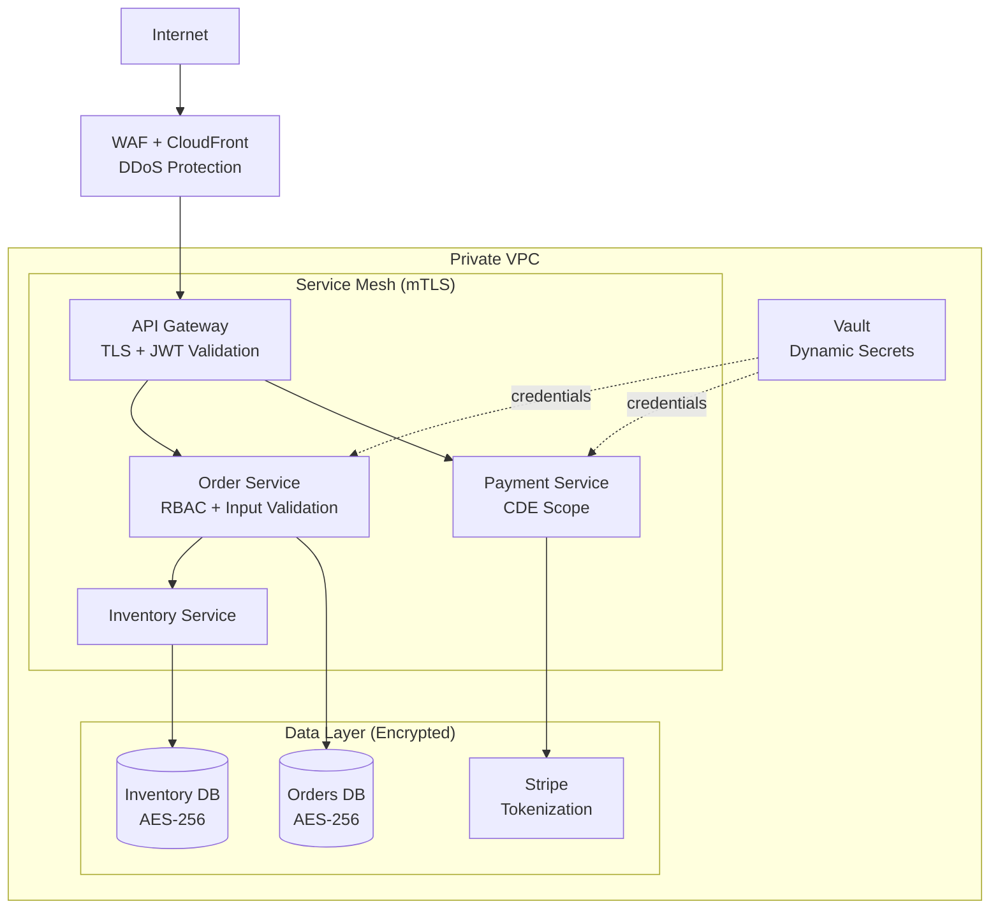

## Keywords in This File

{: .no_toc }

| #   | Keyword | Weight |
| --- | ------- | ------ |
| 1   | [Security Architecture - Threat Modeling and Defense in Depth](#security-architecture-threat-modeling-and-defense-in-depth) | critical |

---

# Security Architecture - Threat Modeling and Defense in Depth

🎯 Interview Weight: critical - every L4+ architecture interview
asks about security; STRIDE, Zero Trust, and defense in depth
are the canonical answers; OWASP awareness is a bar-raiser signal.

---

### 🎯 Model Answer

**30 seconds:**
> Security architecture uses defense in depth - multiple overlapping
> security layers so that no single failure exposes the system.
> Threat modeling (STRIDE) identifies threats before implementation.
> Zero Trust enforces "never trust, always verify" - even internal
> services authenticate with each other. The architect's job is
> to design security properties into the structure, not bolt them
> on afterward.

**3 minutes (Senior):**
> Security architecture starts with threat modeling: systematically
> identifying threats before designing countermeasures. STRIDE
> (Spoofing, Tampering, Repudiation, Information Disclosure, Denial
> of Service, Elevation of Privilege) is the canonical threat
> taxonomy. For each threat, design a countermeasure into the
> architecture.
>
> Defense in depth: layer security so an attacker who bypasses
> one layer faces another. Network layer (WAF, firewall, VPC),
> transport layer (TLS everywhere), application layer (input
> validation, output encoding, auth), data layer (encryption at
> rest, column-level encryption for PII).
>
> Zero Trust Architecture: "never trust, always verify." The
> traditional perimeter model trusts everything inside the network.
> Zero Trust eliminates implicit trust: every service must authenticate
> every request (mTLS), every user must authenticate every access
> (no session-based implicit trust), and access is granted per
> request, not per session. This limits the blast radius of any
> breach.
>
> Principle of Least Privilege: services and users have access
> only to what they need for their specific task. The Payment
> Service has read/write access only to the payments table, not
> the entire database. A compromised Payment Service cannot exfiltrate
> the user table.

*Adapting up:* Staff adds: "The most common security architecture
failure is not a technical vulnerability but a process failure:
security requirements are identified too late (during pen testing,
not during design). I introduce threat modeling as a design-time
activity: before any technical design is finalized, we run a STRIDE
analysis with the security team. The output becomes an explicit
list of security requirements that are tracked like functional
requirements."

*Adapting down:* Junior: "Security architecture means designing
the system so that attackers cannot gain access to data or system
functions they should not have. We use multiple layers of defense,
validate all inputs, encrypt sensitive data, and require proper
authentication for every action."

**Blank Mind Recovery:**

**(1) Restate:** "You are asking about Security Architecture -
designing security properties into the system structure."

**(2) First principles:** "An attacker will find the weakest link.
Defense in depth ensures that no single weak link exposes the
entire system. Threat modeling ensures we think like an attacker
before writing code."

**(3) Bridge:** "Security architecture is like fortress design.
The moat (network firewall), the walls (TLS/mTLS), the guards
(authentication), the vault (encryption at rest) - each layer
provides independent protection. If the moat is crossed, the walls
hold. If the walls are breached, the guards stop the attacker.
Defense in depth."

---

### 📘 Concept Explanation

**STRIDE Threat Model:**

| Threat | Description | Countermeasure |
|---|---|---|
| Spoofing | Impersonating another entity | Authentication (JWTs, mTLS) |
| Tampering | Modifying data in transit or at rest | Integrity checking (HMAC, digital signatures), TLS |
| Repudiation | Denying having performed an action | Non-repudiation (audit logs, digital signatures) |
| Information Disclosure | Exposing data to unauthorized parties | Encryption, access control |
| Denial of Service | Preventing legitimate access | Rate limiting, circuit breakers, DDoS protection |
| Elevation of Privilege | Gaining higher access than authorized | Least privilege, RBAC, input validation |

**Defense in Depth Layers:**

```
DEFENSE IN DEPTH - LAYERED SECURITY

Network Layer:
  WAF (block malicious patterns)
  Firewall / Security Group (allow-list ports)
  VPC / Private Subnets (isolate internal services)
  DDoS Protection (rate limiting at edge)

Transport Layer:
  TLS 1.3 everywhere (in transit encryption)
  mTLS between internal services (Zero Trust)
  Certificate pinning for sensitive clients

Application Layer:
  Input validation (reject before processing)
  Output encoding (prevent injection)
  Authentication (JWT validation at Gateway)
  Authorization (RBAC, resource ownership)
  Idempotency (prevent replay attacks)

Data Layer:
  Encryption at rest (AES-256 for databases)
  Column-level encryption for PII/payment data
  Key rotation (secrets manager)
  Data masking in logs (no PII in log files)
```

**Zero Trust Architecture:**

Traditional perimeter model: trust everything inside the network
boundary. A compromised internal service can access everything.

Zero Trust: no implicit trust based on network location. Every
request is verified regardless of origin.

Zero Trust principles:
1. Verify explicitly: authenticate every request (user identity +
   device health + location context).
2. Use least privileged access: just-in-time, just-enough access.
3. Assume breach: design as if an attacker is already inside.

**OAuth2 and OIDC flows for API security:**

Authorization Code Flow (web apps): user authenticates with IDP,
gets auth code, exchanges for JWT access token and refresh token.
Client Credentials Flow (service-to-service): service authenticates
with client ID + secret, gets access token for machine-to-machine
communication.

---

### 💻 Code Example

```java
// BAD: Security anti-patterns - multiple OWASP Top 10 violations
@RestController
public class UserController {

    @GetMapping("/users/{id}")
    public User getUser(@PathVariable String id) {
        // OWASP A01: Broken Access Control
        // No authorization check - any authenticated user can
        // access any user's data
        return userRepo.findById(id); // SQL injection risk!
    }

    @PostMapping("/users")
    public User createUser(@RequestBody User user) {
        // OWASP A03: Injection - raw SQL string concatenation
        String sql = "INSERT INTO users VALUES ('" +
            user.getName() + "')"; // SQL injection!
        jdbcTemplate.execute(sql);

        // OWASP A02: Cryptographic Failures
        // Storing password in plaintext
        user.setPassword(user.getPassword());
        return userRepo.save(user);
    }

    @GetMapping("/admin/users")
    public List<User> getAllUsers(
        @RequestHeader("X-Internal") boolean isInternal
    ) {
        // OWASP A01: Header-based access control bypassed
        // by any caller setting the header
        if (isInternal) return userRepo.findAll();
        throw new ForbiddenException();
    }
}
```

> **Code walkthrough:** Three OWASP Top 10 violations in one class.
> `getUser()` has no authorization check - any authenticated user
> can access any other user's data (A01: Broken Access Control).
> `createUser()` builds SQL via string concatenation (A03: Injection).
> Passwords are stored in plaintext (A02: Cryptographic Failures).
> `getAllUsers()` uses a client-controlled header for access control
> (A01 again) - any client can set `X-Internal: true` and access
> all user data. These are not edge cases; they are common patterns
> in codebases without security-conscious architecture.

```java
// GOOD: Security architecture with OWASP mitigations

@RestController
@RequiredArgsConstructor
@PreAuthorize("isAuthenticated()")  // All endpoints require auth
public class UserController {

    private final UserRepository userRepo;
    private final PasswordEncoder passwordEncoder;
    private final UserAuthorizationService authzService;
    private final AuditLogger auditLogger;

    @GetMapping("/users/{id}")
    public UserResponse getUser(
        @PathVariable UUID id,
        @AuthenticationPrincipal JwtClaims claims
    ) {
        // A01 Fix: Authorization check - can this user
        // access this resource?
        authzService.assertCanRead(claims.getUserId(), id);

        User user = userRepo.findById(id)
            .orElseThrow(() -> new NotFoundException(id));

        // Audit log: non-repudiation
        auditLogger.log(AuditEvent.userAccessed(
            claims.getUserId(), id
        ));

        // Return DTO: never expose internal model
        // (prevents information disclosure)
        return UserResponse.from(user);
    }

    @PostMapping("/users")
    public ResponseEntity<UserResponse> createUser(
        @Valid @RequestBody CreateUserRequest request,
        @AuthenticationPrincipal JwtClaims claims
    ) {
        // A03 Fix: parameterized queries via JPA (no string concat)
        // A02 Fix: BCrypt hashing (irreversible, salted)
        User user = User.builder()
            .name(request.getName())  // validated by @Valid
            .email(request.getEmail()) // validated by @Email
            .passwordHash(
                passwordEncoder.encode(request.getPassword())
            )  // BCrypt: cost factor 12
            .build();
        User saved = userRepo.save(user);

        // A09 Fix: Audit log for sensitive operations
        auditLogger.log(AuditEvent.userCreated(
            claims.getUserId(), saved.getId()
        ));

        return ResponseEntity.created(
            URI.create("/users/" + saved.getId())
        ).body(UserResponse.from(saved));
    }
}

// Authorization service: resource-level access control
@Service
public class UserAuthorizationService {
    public void assertCanRead(UUID requesterId, UUID resourceId) {
        // Users can read their own data
        if (requesterId.equals(resourceId)) return;
        // Admins can read any user's data
        if (securityContext.hasRole("ADMIN")) return;
        // All other cases: denied
        throw new ForbiddenException(
            "User " + requesterId +
            " cannot access user " + resourceId
        );
    }
}
```

> **Code walkthrough:** The fixed version addresses each vulnerability
> systematically. `@PreAuthorize("isAuthenticated()")` enforces
> authentication at the class level (no unauthenticated access).
> `authzService.assertCanRead()` implements resource-level authorization
> (A01 fix): the requesting user must be the resource owner or an
> admin. JPA parameterized queries eliminate SQL injection (A03 fix).
> `passwordEncoder.encode()` with BCrypt (cost factor 12) stores
> an irreversible, salted hash (A02 fix). `AuditLogger` provides
> non-repudiation. `UserResponse.from(user)` returns a DTO that
> exposes only what the client needs (preventing information
> disclosure of internal fields).

---

### 🎓 Answers by Seniority

**Junior / Mid (0-5 years):**
> Security architecture means building security into the system
> structure, not adding it later. Key principles: validate all
> inputs (prevent injection), authenticate every request (verify
> identity), authorize every access (verify permission for the
> specific resource), encrypt sensitive data at rest and in transit,
> and log security-relevant events for audit.

---

**Senior / Staff (5+ years):**
> The architectural security decision with the biggest impact is
> usually not a specific control but the principle of least
> privilege applied systematically. Each service has credentials
> only for its own database. Each service can call only the APIs
> it needs. If Service A is compromised, the blast radius is
> limited to Service A's permissions.
>
> Zero Trust eliminates the "trusted internal network" assumption.
> Internal services authenticate via mTLS (each has a workload
> identity certificate). A compromised service cannot impersonate
> another service. Combined with least privilege, a compromise is
> contained to a small blast radius.
>
> Threat modeling as a process: STRIDE analysis before any major
> architectural decision. The output is a list of threats with
> their countermeasures mapped to specific architectural components.
> Security requirements tracked in the backlog like functional
> requirements. Pen testing confirms but does not replace design-time
> threat modeling.

---

### ⚠️ Common Misconceptions

| Misconception | Reality |
|---|---|
| Security is a feature to add after the core is built | Security retrofitted post-implementation is 10x more expensive and less effective than security designed in from the start |
| TLS between internal services is unnecessary overhead | Zero Trust requires mTLS for internal services. Internal network trust is the assumption attackers exploit after initial breach |
| JWT validation at the API Gateway is sufficient authorization | Authentication (JWT validation) is not authorization. Each service must check whether the authenticated user has permission for the specific resource |
| Rate limiting prevents all DoS attacks | Rate limiting helps but does not prevent sophisticated DDoS. DDoS protection requires edge infrastructure (CloudFront, Cloudflare) |

---

### 🚨 Failure Modes and Diagnosis

**Failure 1: Insecure Direct Object Reference (IDOR)**

*Symptom:* Security researcher reports they can access any user's
data by changing the user ID in the URL from their ID to another's.

*Root cause:* No resource-level authorization check. Authentication
passed (user is logged in) but authorization not checked (can
this user access this resource?).

*Diagnostic:*
```bash
# Can user ID 123 access user ID 456's data?
curl -H "Authorization: Bearer <user-123-token>" \
  https://api.example.com/users/456
# 200 OK = IDOR vulnerability
```

*Fix:* Add resource-level authorization to every endpoint that
accesses user data. Verify requesting user ID matches resource
owner ID (or requester is an authorized admin).

**Failure 2: Secret credentials in source code**

*Symptom:* GitHub security scanner alerts on API key committed
to repository. Key was already live for 6 months and accessed
by external IP addresses.

*Diagnostic:*
```bash
# Find secrets in git history (even deleted files)
git log --all --full-history -- "*.yml" |
  grep -A 5 "password\|secret\|api_key"

# Use truffleHog or gitleaks
gitleaks detect --source . --report-path gitleaks-report.json
```

*Fix:* Rotate all exposed credentials immediately. Implement
secrets management (Vault, AWS Secrets Manager). Remove secrets
from git history (git-filter-repo). Add pre-commit hook to scan
for secrets (gitleaks, detect-secrets). CI/CD pipeline secret
scanning.

---

### 🎯 Interview Deep-Dive

| Preparation | Target |
|---|---|
| Time to prep | 30 minutes |
| Core themes | STRIDE, defense in depth, Zero Trust, OWASP Top 10 |
| Seniority signal | Junior: OWASP basics; Senior: STRIDE + ZT; Staff: threat modeling as process |
| Common trap | Confusing authentication with authorization |
| Staff differentiator | Threat modeling at design time, blast radius limitation |

---

**Q1 [MID]: What is the STRIDE threat model?**

*Why they ask:* Standard threat classification framework.

*Likely follow-up:* "How do you apply STRIDE to a specific system?"

STRIDE is a threat taxonomy that helps identify security threats
systematically. Each letter maps to a threat category and countermeasure:

S - Spoofing: claiming to be someone else. Countermeasure:
authentication (JWT, mTLS, API keys).

T - Tampering: modifying data without authorization. Countermeasure:
integrity checks (TLS, HMAC, digital signatures), authorization.

R - Repudiation: denying having performed an action. Countermeasure:
non-repudiation (audit logs, digital signatures).

I - Information Disclosure: exposing data to unauthorized parties.
Countermeasure: authorization, encryption at rest and in transit.

D - Denial of Service: preventing legitimate access. Countermeasure:
rate limiting, circuit breakers, DDoS protection.

E - Elevation of Privilege: gaining higher access than authorized.
Countermeasure: least privilege, RBAC, input validation.

Application: for each component in the architecture diagram, apply
each STRIDE threat. "For the API Gateway: S - can an attacker
spoof a service? Countermeasure: mTLS. I - does the Gateway log
sensitive data? Countermeasure: data masking."

*What separates good from great:* Most candidates memorize the
acronym. Great candidates apply STRIDE to a specific architecture
component and give concrete countermeasures for each threat.

---

**Q2 [SENIOR]: What is Zero Trust Architecture?**

*Why they ask:* Modern security architecture pattern.

*Likely follow-up:* "How does a service mesh implement Zero Trust?"

Zero Trust (coined by Forrester, popularized by Google BeyondCorp):
"Never trust, always verify." Eliminates the assumption that
everything inside the network perimeter is trusted.

Traditional perimeter model: firewall at the edge, everything
inside is trusted. Problem: a single breach inside the perimeter
(phishing, supply chain, malicious insider) gives the attacker
free movement.

Zero Trust principles:
1. Verify explicitly: every request is authenticated and authorized
   regardless of network location. Internal services are not exempt.
2. Least privileged access: just-in-time, just-enough access.
   No standing permissions. Time-limited credentials.
3. Assume breach: design for containment. The attacker is already
   inside. Limit blast radius via least privilege and network
   segmentation.

Implementation: mTLS between all services (service mesh: Istio/
Linkerd provides workload identity certificates). Central identity
provider (Vault, Keycloak) for service credentials. Policy enforcement
point at each service (OPA, authorization service).

*What separates good from great:* Most candidates give the definition.
Great candidates describe the three principles, explain mTLS as
the implementation mechanism for internal service trust, and
articulate the "assume breach" principle and blast radius limitation.

---

**Q3 [STAFF]: How do you perform threat modeling for a new system?**

*Why they ask:* Tests proactive security design process.

*Likely follow-up:* "When in the development process do you do it?"

Threat modeling is a design-time activity, not a post-implementation
one. The ideal time: before any code is written, when architectural
decisions can still incorporate security requirements cheaply.

Process (Microsoft STRIDE approach):

(1) Define the system: draw a Data Flow Diagram (DFD). Identify
processes, data stores, external entities, and data flows. Mark
trust boundaries (where data crosses from one trust zone to another).

(2) Apply STRIDE to each element: for each process, data flow,
and data store, ask "what STRIDE threats apply?" Be exhaustive.

(3) For each threat, assess risk: likelihood x impact. High
likelihood, high impact threats are the architecture drivers.

(4) Design countermeasures: map each high-risk threat to an
architectural countermeasure. Authentication for spoofing. TLS
for tampering. RBAC for elevation of privilege.

(5) Validate: add the countermeasures to the architecture. Review
with the security team. Track as security requirements in the
backlog.

Output: a threat model document with the DFD, threat list,
risk assessment, and countermeasure map. This becomes the input
to pen testing (confirming countermeasures work) and security
review.

*What separates good from great:* Most candidates say "use STRIDE."
Great candidates describe the full process (DFD, trust boundaries,
STRIDE per element, risk assessment, countermeasure design),
emphasize design-time timing, and describe the output as tracked
security requirements.

---

**Q4 [SENIOR]: What is the OWASP Top 10 and which items have
architectural implications?**

*Why they ask:* OWASP is the canonical application security reference.

*Likely follow-up:* "How does Broken Access Control affect architecture?"

OWASP Top 10 (2021) items with architectural implications:

A01 - Broken Access Control (most common): architectural response:
resource-level authorization at every service, not just at the
Gateway. A centralized authorization service or per-service RBAC.
Functional access control tests in CI.

A02 - Cryptographic Failures: architectural response: encryption
at rest for PII/payment data (AES-256). TLS 1.3 in transit. BCrypt
(not MD5/SHA1) for passwords. Secrets manager (not config files)
for credentials.

A03 - Injection: architectural response: ORM with parameterized
queries (no raw SQL string concatenation). Input validation at
service boundary. Output encoding before rendering.

A05 - Security Misconfiguration: architectural response: infrastructure
as code (IaC) for consistent configuration. Secrets scanning in
CI/CD. CIS benchmark compliance checks. Principle of least privilege
for service accounts.

A07 - Authentication Failures: architectural response: centralized
identity provider (Keycloak, Auth0). Token-based authentication
(short-lived JWTs + refresh tokens). MFA for admin access.

A09 - Security Logging and Monitoring Failures: architectural
response: audit log service (append-only, tamper-evident). Security
event correlation (SIEM). Alert on authentication failure spikes.

*What separates good from great:* Most candidates list the OWASP
Top 10. Great candidates map each item to a specific architectural
countermeasure and describe why it requires structural design
(not just coding practice).

---

**Q5 [STAFF]: How do you implement defense in depth in a microservices
architecture?**

*Why they ask:* Tests depth of security architecture knowledge.

*Likely follow-up:* "What does each layer protect against?"

Defense in depth in microservices:

Network layer: VPC with private subnets. Internal services not
publicly accessible. Security groups with allow-list rules. WAF
at the edge (block OWASP patterns: SQL injection, XSS). DDoS
protection (AWS Shield, Cloudflare). No direct internet access
for database or cache instances.

Transport layer: TLS 1.3 for all external traffic. mTLS for
service-to-service communication (service mesh handles certificate
management). Certificate rotation automated (Cert-Manager).
HSTS (HTTP Strict Transport Security) for external APIs.

Application layer: input validation at service boundaries (reject
before processing). Output encoding (prevent XSS if any HTML is
generated). JWT validation at API Gateway. Resource-level
authorization in each service. Idempotency keys for mutation
operations (prevent replay attacks).

Data layer: AES-256 encryption at rest for all database volumes.
Column-level encryption for PII (customer email, SSN) and payment
data. No PII in log files (data masking before logging). Secrets
stored in Vault (not environment variables or config files). Key
rotation on a schedule.

The layered model: if an attacker bypasses the WAF (network), they
face TLS (transport). If they obtain a service certificate (transport
bypass), they face JWT validation (application). If they compromise
a service (application bypass), they face column-level encryption
(data). Each layer provides independent protection.

*What separates good from great:* Most candidates describe TLS and
firewalls. Great candidates describe all four layers with specific
technologies at each layer and articulate why the layering matters
(independent protection).

---

**Q6 [STAFF]: How do you implement secrets management in a
production microservices system?**

*Why they ask:* Secrets management is a common security gap.

*Likely follow-up:* "What do you do when a secret is compromised?"

Anti-patterns: credentials in config files, environment variables
baked into container images, secrets in git repositories.

Production secrets management with HashiCorp Vault:

Architecture:
```
Service starts
    |
    v
Authenticate with Vault (using Kubernetes service account)
    |
    v
Receive short-lived credentials (TTL: 1 hour)
    |
    v
Use credentials for DB/API access
    |
    v
Auto-renew via Vault agent sidecar before expiry
```

Dynamic secrets: Vault generates a unique DB credential per service
instance on startup. TTL: 1 hour. Vault automatically rotates the
credential. If a credential is compromised, it expires in at most
1 hour without manual rotation.

Secret scanning in CI: gitleaks or detect-secrets scans every
commit. Pre-commit hook prevents secrets from entering the
repository. Pipeline scanning prevents merging secret-containing code.

When a secret is compromised: (1) identify all systems using the
secret, (2) rotate immediately, (3) audit access logs for the
secret's usage window, (4) determine blast radius, (5) notify
affected parties per incident response plan.

*What separates good from great:* Most candidates say "use a secrets
manager." Great candidates describe dynamic credentials with short
TTLs (reduce compromise window), the Vault agent sidecar pattern,
CI scanning, and the incident response process for a compromised
secret.

---

**Q7 [SENIOR]: How does OAuth2 work for API security and what are
the architecture implications?**

*Why they ask:* OAuth2 is the standard for API authentication.

*Likely follow-up:* "When do you use client credentials vs authorization code flow?"

OAuth2 provides a framework for delegated authorization. Two main
flows for API security:

Authorization Code Flow (user-facing applications):
(1) User clicks "Login with Google."
(2) Redirect to Google IDP with client_id and redirect_uri.
(3) User authenticates, IDP returns auth code.
(4) Application server exchanges code for access_token + refresh_token.
(5) Application uses access_token for API calls (Bearer token).

Client Credentials Flow (service-to-service):
(1) Service authenticates with IDP using client_id + client_secret.
(2) IDP returns access_token.
(3) Service includes token in all API calls.
(4) Receiving service validates the token with IDP (or validates
the JWT signature locally).

Architectural implications:

Token validation: API Gateway validates JWT signature and expiry.
Internal services trust the verified identity in forwarded headers
(no re-validation needed for every service hop - performance
optimization).

Token scope: access tokens contain claims (user ID, roles, scopes).
Services check scopes against required permissions. "payment:write"
scope required for payment mutations.

Refresh token rotation: access tokens are short-lived (15 minutes).
Refresh tokens are long-lived but rotated on each use. Compromise
of an access token is time-limited.

Architectural decision: JWT (stateless validation) vs opaque
tokens (stateful validation via IDP introspection). JWT: faster
(local validation), larger tokens, cannot be revoked immediately.
Opaque tokens: slower (IDP call), smaller, immediately revocable.

*What separates good from great:* Most candidates describe OAuth2
flows. Great candidates describe both flows with use cases, explain
the Gateway validation + header forwarding pattern, JWT vs opaque
token trade-off, and token scope for authorization.

---

**Q8 [STAFF]: How do you architect a system to be PCI DSS compliant?**

*Why they ask:* PCI DSS is the most common regulatory compliance requirement for payment systems.

*Likely follow-up:* "What is cardholder data environment scope?"

PCI DSS (Payment Card Industry Data Security Standard) protects
cardholder data. The architect's first goal: minimize the scope
of the Cardholder Data Environment (CDE) - the components that
store, process, or transmit cardholder data.

Scope reduction via tokenization: the application never stores
raw card numbers. The payment processor (Stripe, Braintree) handles
the card data and returns a token. The application stores only
the token. The CDE is now limited to the payment processor.

For the components that remain in scope (the payment service
that sends card data to the processor):

Network segmentation: CDE components isolated in a separate network
segment (VPC subnet). Only necessary ports open. Network logs
retained for 90 days.

Encryption: PCI DSS requires TLS 1.2+ for all cardholder data
in transit. AES-256 for data at rest (if any cardholder data is
stored, which tokenization eliminates).

Access control: no direct production access. All access via
bastion host with MFA. Access logs retained 12 months. Least
privilege: only the payment service process account has CDE access.

Audit logging: all access to CDE components logged. Log integrity
protection (append-only, SIEM). Alert on anomalous access patterns.

Vulnerability management: quarterly vulnerability scans. Annual
penetration test. Patch management SLA (critical patches within
30 days).

*What separates good from great:* Most candidates describe PCI
DSS requirements. Great candidates describe tokenization as the
scope reduction strategy, network segmentation for remaining CDE
components, and the architectural decisions (TLS, access control,
audit logging) required by each requirement.

---

**Q9 [STAFF]: BEHAVIORAL: Describe a security vulnerability you
identified or fixed in a production system.**

*Why they ask:* Tests real security architecture experience.

*Likely follow-up:* "How did you prevent recurrence?"

Strong answer structure:

Situation: "During a security review of our e-commerce API, I
identified that our `/api/orders/{id}` endpoint returned order
details including shipping addresses for any authenticated user,
not just the order owner."

Diagnosis: "OWASP A01 - Broken Access Control, specifically an
Insecure Direct Object Reference (IDOR). The endpoint authenticated
the user (valid JWT required) but did not check whether the
authenticated user owned the order resource."

Fix: "Added resource-level authorization: `assertOrderOwnership(
jwtClaims.getUserId(), orderId)`. This throws `ForbiddenException`
if the requesting user is not the order owner or an admin. Deployed
within 4 hours of identification."

Prevention: "(1) Added security code review checklist item: every
endpoint that returns user-specific data must have a resource
ownership check. (2) Added OWASP IDOR test cases to the integration
test suite (test that user A cannot access user B's resources).
(3) The fix was generalized into a reusable `ResourceAccessControl`
component used by all sensitive endpoints."

Impact assessment: "Log analysis showed no successful IDOR
exploitation before the fix. The endpoint had existed for 8 months.
Disclosed to security team with a 30-day lookback on log analysis."

*What separates good from great:* "We had a security bug and fixed
it" vs specific OWASP category, the exact root cause, the fix, and
the systematic prevention measures to avoid recurrence.

---

**Q10 [STAFF]: How do you measure security posture architecturally?**

*Why they ask:* Tests ability to quantify security quality attributes.

*Likely follow-up:* "How do you use DAST vs SAST?"

Security posture measurement at the architecture level:

SAST (Static Application Security Testing): analyze source code
for vulnerabilities without execution. Tools: SonarQube, Snyk
Code, Checkmarx. Run in CI. Flag OWASP Top 10 patterns.
Architectural use: gate merges on critical vulnerability findings.

DAST (Dynamic Application Security Testing): test the running
application. Tools: OWASP ZAP, Burp Suite. Scan for injection,
broken auth, IDOR, exposure of sensitive data. Run in staging
environment.

SCA (Software Composition Analysis): scan dependencies for known
CVEs. Tools: Snyk, OWASP Dependency-Check. Run in CI. Alert on
critical CVEs in dependencies. Architectural use: block builds
with critical unpatched CVEs.

Security metrics dashboard:
- CVE resolution time (critical: < 24h, high: < 7 days)
- Authentication failure rate (spike = potential attack)
- Percentage of services with mTLS enabled
- Secrets scanner findings (target: zero)
- Open security findings by severity and age
- Time-to-detect a simulated attack (red team exercise)

Architecture fitness functions for security:
- All Feign clients must have circuit breakers (ArchUnit)
- No direct SQL string concatenation (SAST rule)
- No secrets in code (pre-commit hook + CI scan)
- All endpoints have `@PreAuthorize` (custom ArchUnit rule)

*What separates good from great:* Most candidates describe pen
testing. Great candidates describe SAST + DAST + SCA as the
security testing triangle, define specific metrics with SLAs
(critical CVE resolution < 24h), and describe architecture fitness
functions as automated security governance.

---

**Q11 [STAFF]: What is the principle of least privilege and how
do you implement it architecturally?**

*Why they ask:* Least privilege is the single most impactful security principle.

*Likely follow-up:* "How does this limit blast radius?"

Principle of Least Privilege (PoLP): every user, service, and
process has access only to the specific resources it needs for
its specific task - and nothing more.

Application at the service level: each service has a dedicated
database credential with access only to its own tables. The Order
Service has `SELECT, INSERT, UPDATE` on `orders` table only.
The Payment Service has credentials only for the payments table.
A compromised Order Service cannot read payment data.

Application at the user level: RBAC (Role-Based Access Control).
`customer` role: access own orders and profile. `support` role:
read-only access to any customer's orders. `admin` role: full
access. No role has unlimited access.

Application at the network level: service-to-service communication
via allow-list. Order Service can call Inventory Service and
Payment Service. It cannot call the Auth Service (no reason for
it). The allow-list is enforced by the service mesh policy.

Application at the infrastructure level: Lambda functions, EC2
instances, and Kubernetes pods have IAM roles with specific
permissions. No role has `*` (wildcard) permissions.

Blast radius limitation: if any component is compromised, the
attacker's access is limited to the permissions of that component.
A compromised Order Service cannot exfiltrate the payment data
or manipulate the user authentication service.

*What separates good from great:* Most candidates define PoLP.
Great candidates apply it at four levels (service, user, network,
infrastructure), describe the blast radius limitation as the
primary benefit, and give a concrete example of what a compromise
cannot do.

---

**Q12 [STAFF]: How do you handle security requirements in an agile
development process?**

*Why they ask:* Tests integration of security into development workflow.

*Likely follow-up:* "How do you avoid security being a bottleneck?"

The challenge: agile moves fast. Security reviews that block sprints
create incentives to bypass them.

Security as a built-in, not a bolt-on:

Security champion model: one engineer per team receives security
training and serves as the team's security advocate. Reviews PRs
for security implications. Reduces dependence on a central security
team.

Security user stories: security requirements treated as first-class
user stories in the backlog. "As a security engineer, I need all
user-specific endpoints to have resource ownership checks so that
IDOR vulnerabilities are impossible." Tracked, prioritized, and
delivered like any other story.

Threat modeling in sprint 0: before any feature implementation,
5-10 minutes of STRIDE analysis for new features that handle
user data or external input. Output: security user stories for
that feature.

Automated security gates in CI: SAST (SonarQube), SCA (Snyk),
secrets scanning (gitleaks) run on every PR. Critical findings
block merge. High findings require team acknowledgment.

Security acceptance criteria: every story that handles user data
includes: "authentication check", "resource ownership check",
"no PII in logs." These are as reviewable as functional acceptance
criteria.

*What separates good from great:* Most candidates say "have a
security team review." Great candidates describe the security
champion model (distribute security), threat modeling in sprint 0
(shift left), automated gates (fast feedback), and security
acceptance criteria (make security requirements explicit and trackable).

| Interviewer Type | Emphasis |
|---|---|
| Technical Panel | STRIDE application, OWASP mitigations, Zero Trust implementation |
| Hiring Manager | Security process (QAW, threat modeling, champion model) |
| Bar Raiser | Defense in depth, PCI DSS scope reduction, blast radius |
| Peer Engineer | Practical: JWT validation, secrets management, ArchUnit |

---

### ⚖️ Comparison Table

| Security Pattern | Purpose | Protection Against | Limitation |
|---|---|---|---|
| Defense in Depth | Multiple security layers | Single-point failures | Complexity increases |
| Zero Trust | No implicit network trust | Lateral movement after breach | Requires mTLS infrastructure |
| RBAC | Role-based access control | Unauthorized access | Role explosion if not governed |
| Principle of Least Privilege | Minimal access per entity | Blast radius limitation | Overhead of access management |
| OAuth2 / OIDC | Delegated authorization | Identity spoofing | Token management complexity |
| STRIDE Threat Modeling | Design-time threat identification | Architectural security gaps | Requires security expertise |

---

### 🏛️ System Design

**Security architecture for a payment processing system:**

External clients connect via CloudFront (DDoS, WAF) -> API Gateway
(JWT validation, rate limiting) -> internal services via mTLS
(service mesh).

CDE scope reduction: Stripe tokenization. Application never sees
raw card numbers. CDE boundary: only the payment service (single
microservice in isolated subnet).

Secrets: Vault with dynamic credentials for database access.
Vault agent sidecar for automatic renewal. No secrets in environment
variables or config files.

Data protection: AES-256 for database volumes. Column-level
encryption for customer PII. No PII in application logs (data
masking via log filter).

Access control: RBAC with three roles (customer, support, admin).
Resource-level authorization on all endpoints. Audit log for all
sensitive operations (append-only, SIEM integration).

Security pipeline: SAST (SonarQube), SCA (Snyk), secrets scan
(gitleaks) on every PR. DAST (OWASP ZAP) on staging weekly.
Quarterly pen test. Annual PCI DSS assessment.

---

### 📊 Diagram

```
DEFENSE IN DEPTH LAYERS

Internet
    |
    v
[WAF + DDoS] ---- Network Layer
    |               (block known bad patterns,
    v               rate limit at edge)
[Firewall] ------ Network Layer
    |               (port allow-list, VPC isolation)
    v
[API Gateway] --- Transport + Application Layer
    |               (TLS termination, JWT validation,
    |                rate limiting)
    v
[Service Mesh] -- Transport Layer
    |               (mTLS between services,
    |                workload identity)
    v
[Service] ------- Application Layer
    |               (input validation, RBAC,
    |                resource ownership check)
    v
[Database] ------ Data Layer
                    (encryption at rest,
                     column-level encryption for PII,
                     least-privilege credentials)
```



> **Diagram walkthrough:** Incoming traffic passes through CloudFront
> and WAF (block DDoS and OWASP patterns), then the API Gateway
> (TLS termination and JWT validation). Inside the VPC, services
> communicate via the service mesh with mTLS - no service is implicitly
> trusted by another. Each service applies its own application-layer
> controls (RBAC, input validation, resource ownership). Data at
> rest is AES-256 encrypted. Payment data is tokenized via Stripe
> (CDE scope reduction). Vault provides dynamic credentials with
> short TTLs for database access. This is defense in depth: an
> attacker who bypasses one layer faces the next.
