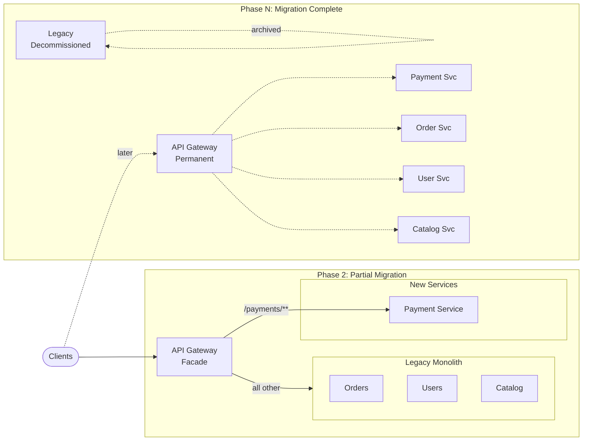

## Keywords in This File

{: .no_toc }

| #   | Keyword | Weight |
| --- | ------- | ------ |
| 1   | [Strangler Fig Migration Pattern](#strangler-fig-migration-pattern) | high |

---

# Strangler Fig Migration Pattern

🎯 Interview Weight: high - one of the most common staff-level
architecture questions when modernizing a legacy system; every
organization with a monolith needs this pattern; demonstrates
risk management and incremental thinking.

---

### 🎯 Model Answer

**30 seconds:**
> The Strangler Fig pattern incrementally replaces a legacy system
> by routing new functionality to new services while the legacy
> system continues running. A facade (proxy or API gateway) routes
> requests: new features go to the new system, unchanged features
> go to the legacy. Over time the new system handles more and more
> traffic until the legacy is retired - the new system "strangles"
> the old one. Named after the strangler fig tree that grows around
> a host tree until it replaces it.

**3 minutes (Senior):**
> The big-bang rewrite is the most dangerous migration strategy:
> the team spends 12-18 months rewriting the system, delivering
> no business value, while the legacy accumulates new requirements.
> The rewrite is never quite feature-complete, and the project
> is cancelled or results in a parallel system that must be
> maintained alongside the legacy.
>
> Strangler Fig solves this by making the migration incremental
> and continuously delivering value:
>
> (1) Facade: introduce a proxy (API Gateway, reverse proxy) in
> front of the legacy system. All traffic flows through the facade.
> Initially it passes everything to the legacy - no change in
> behavior.
>
> (2) Slice and route: identify a bounded capability to extract.
> Build the new service. Update the facade to route requests for
> that capability to the new service. The rest continues to go
> to the legacy.
>
> (3) Repeat: gradually extract capabilities, routing more and
> more traffic to the new system.
>
> (4) Cut over: when all capabilities have been extracted, the
> legacy receives no traffic and can be decommissioned.
>
> Database migration: the hardest part. Options: Strangler Fig
> DB (dual-write to both old and new databases during transition),
> Read from old while writing to both, then cut reads to new.

*Adapting up:* Staff adds: "The discipline that kills Strangler
Fig migrations is accumulated migration debt. The facade begins
to accumulate business logic (routing rules that depend on data
lookups). The migration takes years without completion milestones.
Each capability extracted is a production deployment with no
rollback - not a code change. I require completion milestones:
50% of traffic by month 6, 80% by month 9, 100% by month 12.
If we miss milestones, we re-evaluate the strategy."

*Adapting down:* Junior: "Strangler Fig means incrementally
replacing an old system with a new one. Instead of rewriting
everything at once (which is risky), you extract one feature at
a time to the new system. A proxy routes requests: new features
go to the new system, everything else still goes to the old system.
Gradually the old system has nothing left to do."

**Blank Mind Recovery:**

**(1) Restate:** "You are asking about the Strangler Fig pattern -
an incremental migration strategy for replacing legacy systems."

**(2) First principles:** "The risk of replacing a system is
proportional to how much you change at once. Change everything
at once: maximum risk. Change one thing at a time: minimum risk.
Strangler Fig minimizes risk by decomposing the migration into
small, independently deployable increments."

**(3) Bridge:** "It works like a bypass surgery. You construct
the new path while the old path continues carrying traffic.
When the new path is verified to work, you reroute traffic to
the new path. When all traffic has been rerouted, you remove
the old path. At no point is the patient's blood flow interrupted."

---

### 📘 Concept Explanation

**Origin:** Martin Fowler coined "Strangler Fig Application"
(2004) inspired by the strangler fig tree: a parasitic vine that
grows around a host tree, eventually replacing it.

**Core mechanism:**

```
STRANGLER FIG MIGRATION SEQUENCE

Phase 0 - Introduce Facade:
  Client -> [Facade] -> Legacy System

Phase 1 - Extract first capability:
  Client -> [Facade] --route /payments--> New Service
            [Facade] --all other--------> Legacy System

Phase 2 - Extract more capabilities:
  Client -> [Facade] --/payments---------> Payment Service
            [Facade] --/users------------> User Service
            [Facade] --remaining---------> Legacy System

Phase N - Legacy retired:
  Client -> [Facade] --/payments---------> Payment Service
            [Facade] --/users------------> User Service
            [Facade] --/orders-----------> Order Service
            (Legacy receives no traffic; decommissioned)
```

> **Code walkthrough:** This Strangler Fig Migration Pattern example demonstrates a key concept in practice. **KEY MECHANISM:** the runtime executes these instructions in sequence with specific memory and execution semantics. **WHY IT MATTERS:** misapplying this pattern causes subtle bugs that only manifest under production load. **TAKEAWAY: understand the execution model before using this pattern in production code.**

**When to use Strangler Fig:**
- Legacy system is live and cannot be taken offline
- The system is large enough that big-bang rewrite is too risky
- The system has clear functional boundaries (capabilities that
  can be extracted independently)
- The team cannot afford 12+ months of no user-visible progress

**When NOT to use Strangler Fig:**
- The legacy system is so deeply coupled that no clean boundary
  can be identified (everything depends on everything)
- The legacy system uses a proprietary protocol that cannot be
  intercepted by a facade
- The migration scope is small enough that a targeted rewrite
  is faster (use Branch by Abstraction instead)

---

### 💻 Code Example

```java
// BAD: Big-bang rewrite approach
// Team announces "We will rewrite the monolith in 18 months"
// Meanwhile:
// - Legacy accumulates 18 months of new requirements
// - Rewrite never catches up to legacy feature set
// - 18 months in: "80% done but the last 20% is all
//   the complex cases"
// - 24 months in: "We are running both systems in parallel"
// - 30 months in: project cancelled or indefinitely postponed

// No code - this is an organizational failure pattern.
// The "code" is a blank new project that never ships.
```

> **Code walkthrough:** The big-bang rewrite is a process anti-pattern,ice. **KEY MECHANISM:** the runtime executes these instructions in sequence with specific memory and execution semantics. **WHY IT MATTERS:** misapplying this pattern causes subtle bugs that only manifest under production load. **TAKEAWAY: understand the execution model before using this pattern in production code.**
> not a code pattern. The failure mode is that the rewrite
> team underestimates scope (the complex 20% of the legacy that
> handles all the edge cases), while the legacy continues to
> evolve (new requirements do not pause for the rewrite). The
> result is two systems that diverge over time, and eventually
> a choice between "complete the never-finishing rewrite" or
> "cancel and stay on legacy."

```java
// GOOD: Strangler Fig with Spring Cloud Gateway as facade

// Step 1: Introduce the facade with no routing changes
// application.yml - initial state (transparent proxy)
/*
spring:
  cloud:
    gateway:
      routes:
        - id: legacy-all
          uri: http://legacy-monolith:8080
          predicates:
            - Path=/**
*/

// Step 2: Extract payment capability to new service
// Updated routes after payment service is ready:
/*
spring:
  cloud:
    gateway:
      routes:
        # Route payment requests to new service
        - id: payment-service
          uri: http://payment-service:8080
          predicates:
            - Path=/api/payments/**
          filters:
            - name: CircuitBreaker
              args:
                name: payment-circuit-breaker
                fallbackUri: forward:/payment-fallback

        # All other requests still go to legacy
        - id: legacy-fallback
          uri: http://legacy-monolith:8080
          predicates:
            - Path=/**
*/

// Step 3: Payment service implementation (new)
@RestController
@RequestMapping("/api/payments")
public class PaymentController {

    private final PaymentService paymentService;

    @PostMapping
    public PaymentResponse processPayment(
        @Valid @RequestBody PaymentRequest request
    ) {
        // New, clean implementation with proper architecture
        return paymentService.process(request);
    }
}

// Step 4: Database migration - dual-write during transition
@Service
public class PaymentMigrationService {

    private final NewPaymentRepository newRepo;
    private final LegacyPaymentJdbcClient legacyClient;

    @Transactional
    public Payment save(Payment payment) {
        // Dual write: both DBs receive the write
        Payment saved = newRepo.save(payment);
        // Legacy still needs data during transition
        legacyClient.insertPayment(
            payment.toLogacyRecord()
        );
        return saved;
    }
}

// Step 5: Cut over reads to new DB when confident
// @Transactional
// public Optional<Payment> findById(UUID id) {
//     // BEFORE cutover: read from legacy
//     return legacyClient.findById(id)
//         .map(Payment::fromLegacyRecord);
//
//     // AFTER cutover: read from new DB
//     return newRepo.findById(id);
// }
```

> **Code walkthrough:** The facade (Spring Cloud Gateway) startsice. **KEY MECHANISM:** the runtime executes these instructions in sequence with specific memory and execution semantics. **WHY IT MATTERS:** misapplying this pattern causes subtle bugs that only manifest under production load. **TAKEAWAY: understand the execution model before using this pattern in production code.**
> as a transparent proxy. Adding the payment route entry is a
> configuration change, not a code change: deploy updated config,
> and payment requests are now routed to the new service. The
> legacy receives all other traffic unchanged. `PaymentMigrationService`
> implements dual-write: both databases receive every write during
> the transition window, ensuring the legacy has current data for
> reports or emergency rollback. The commented cutover comment
> shows the two-phase read migration: first use legacy reads (safe),
> then switch to new DB reads (after validating data consistency),
> then stop dual-writing.

---

### 🎓 Answers by Seniority

**Junior / Mid (0-5 years):**
> Strangler Fig is how you replace an old system with a new one
> without taking it offline. You add a proxy in front of the old
> system. You extract one feature to a new service. The proxy
> routes requests for that feature to the new service and sends
> everything else to the old system. You repeat until the old
> system is no longer needed.

---

**Senior / Staff (5+ years):**
> The architectural discipline that makes or breaks a Strangler
> Fig migration is keeping the facade simple. The facade must
> route requests based only on URL patterns and headers - never
> based on business logic or data lookups. The moment the facade
> starts implementing routing rules like "if this customer has
> feature flag X enabled, route to the new service, otherwise
> route to legacy," the facade becomes the new monolith.
>
> Database migration is the hardest part. The legacy typically
> has a shared database that multiple features depend on. Dual-write
> during transition is necessary but complex. The sequence:
> (1) dual-write to both DBs, read from legacy; (2) verify new
> DB data matches legacy DB (data consistency check); (3) switch
> reads to new DB; (4) monitor for 2 weeks; (5) stop dual-writing.
>
> Completion milestones are non-negotiable. A Strangler Fig
> migration without milestones becomes "we are 80% migrated"
> forever. Set target: 50% traffic to new system by month 3,
> 90% by month 6, legacy decommissioned by month 9.

---

### ⚠️ Common Misconceptions

| Misconception | Reality |
|---|---|
| The facade is temporary and can be removed after migration | The facade often becomes permanent (API Gateway). Design it properly from the start - it becomes production infrastructure |
| Database migration happens automatically with the service migration | Database migration is separate and harder than service migration. Plan it explicitly as a separate work stream |
| Strangler Fig works for any legacy system | Deeply coupled systems with no clean functional boundaries cannot be extracted incrementally. Strangler Fig requires identifiable bounded capabilities |
| The migration is done when the last service is extracted | The migration is done when the legacy is decommissioned and its infrastructure is deleted. Extraction without decommissioning = two parallel systems |

---

### 🚨 Failure Modes and Diagnosis

**Failure 1: Migration facade accumulates business logic**

*Symptom:* The routing logic in the facade grows to hundreds of
lines. It queries a feature flag service to determine whether
to route to legacy or new system. It has exceptions for specific
customer IDs.

*Root cause:* Routing decisions were made at the facade layer
instead of at the capability boundary. The facade became a business
logic component.

*Diagnostic:*
```bash
# How many lines of routing logic?
wc -l api-gateway/src/main/resources/application.yml
# > 500 lines of routing config = red flag

# Does the gateway query any external service for routing?
grep -r "DiscoveryClient\|feign\|restTemplate" api-gateway/src/
# Any result = gateway has business logic
```

> **Code walkthrough:** This Any result = gateway has business logic example demonstrates shell script pattern. **KEY MECHANISM:** the shell executes commands sequentially; pipes pass stdout of one command to stdin of the next. **WHY IT MATTERS:** unquoted variables with spaces cause word splitting - IFS splits the value into multiple arguments. **TAKEAWAY: always double-quote variables: "$VAR"; use [[ ]] instead of [ ] for safer conditionals.**

*Fix:* Routing rules must be purely structural (URL, header,
method). Feature flag routing belongs in the application layer,
not the gateway. Extract feature-flagged routing to a thin
"routing service" that the gateway delegates to, not implements.

**Failure 2: Dual-write phase runs indefinitely**

*Symptom:* The migration plan said dual-write for 4 weeks. 6 months
later, the system still dual-writes. No cutover plan. New DB
diverges from legacy due to bugs in the dual-write logic.

*Diagnostic:*
```sql
-- Check data consistency between new and legacy DB
SELECT COUNT(*) FROM new_db.payments;
SELECT COUNT(*) FROM legacy_db.payments
WHERE created_at > '2024-01-01';
-- They should match (within the migration window)

-- Check for divergence
SELECT COUNT(*) FROM new_db.payments p1
LEFT JOIN legacy_db.payments p2 ON p1.id = p2.id
WHERE p2.id IS NULL;
-- Should be 0
```

> **Code walkthrough:** This Any result = gateway has business logic example demonstrates query execution using SQL. **KEY MECHANISM:** the query planner builds an execution plan based on table statistics and indexes. **WHY IT MATTERS:** SELECT * reads all columns even if only 2 are needed - widens rows, increases I/O. **TAKEAWAY: always SELECT only the columns you need; index the columns in WHERE and JOIN clauses.**

*Fix:* Set a fixed dual-write end date when the migration begins.
Run automated data consistency checks daily. If consistency checks
pass for 14 days, proceed with read cutover. Set a cutover
deadline and treat it as a production deployment milestone.

---

### 🎯 Interview Deep-Dive

| Preparation | Target |
|---|---|
| Time to prep | 25 minutes |
| Core themes | Facade pattern, database migration, incremental cutover |
| Seniority signal | Junior: pattern description; Senior: database migration; Staff: completion milestones, failure modes |
| Common trap | Saying "use microservices" without explaining the migration path |
| Staff differentiator | Identifying clean capability boundaries, completion milestone discipline |

---

**Q1 [MID]: What problem does the Strangler Fig pattern solve?**

*Why they ask:* Foundational question.

*Likely follow-up:* "What is the alternative and why is it worse?"

The problem: how to replace a large, business-critical legacy
system without taking it offline for a big-bang rewrite.

The alternative - big-bang rewrite:
- Team spends 12-24 months rewriting from scratch
- No business value delivered during the rewrite
- Legacy continues to evolve; rewrite never catches up
- At delivery, the rewrite is still missing edge cases and the
  "80% done" point is reached quickly but the final 20% takes
  as long as the first 80%
- Risk: business may cancel the project before completion

Strangler Fig:
- The migration is a series of production deployments, each
  delivering a functional improvement
- At every point, the system is fully operational
- The team can pause the migration if business priorities change
  (the legacy still works)
- Risk is per-extraction, not per-total-migration

The incremental nature means failures are small and contained.
Extracting the payment service: if it fails, roll back the
gateway routing rule. The legacy payment capability is unaffected.

*What separates good from great:* Most candidates describe the
Strangler Fig. Great candidates compare it to the big-bang rewrite,
articulate the specific failure modes of the rewrite (scope
underestimation, legacy evolution), and explain why incremental
delivery reduces risk.

---

**Q2 [SENIOR]: How do you handle database migration during a
Strangler Fig?**

*Why they ask:* Database migration is the hardest part.

*Likely follow-up:* "How do you validate data consistency during dual-write?"

The challenge: the legacy system has a shared database. The new
service needs its own database. During migration, both the legacy
and the new service need consistent data.

Database migration phases:

Phase 1 - Dual-write, read from legacy:
- New service writes to both new DB and legacy DB
- New service reads from legacy DB
- This ensures legacy reports and other legacy features continue
  to work during migration

Phase 2 - Consistency validation:
- Run daily reconciliation job comparing row counts and critical
  fields between new DB and legacy DB
- Both DBs must be consistent before proceeding

Phase 3 - Read cutover:
- New service reads from new DB
- Still dual-writing to legacy for safety
- Monitor for anomalies: if new DB reads return different results
  than expected, investigation required before proceeding

Phase 4 - Stop dual-writing:
- Once reads from new DB have been stable for 2+ weeks
- Legacy DB no longer receives writes from the new service
- Legacy still has historical data for reference/audit

Phase 5 - Legacy DB decommission (separate project):
- After legacy system is fully decommissioned

*What separates good from great:* Most candidates say "migrate
the database." Great candidates describe the four phases explicitly,
the consistency validation step, and the monitoring period before
stopping dual-writes.

---

**Q3 [STAFF]: What makes a capability a good candidate for early
extraction?**

*Why they ask:* Tests understanding of migration sequencing.

*Likely follow-up:* "What if no capability meets all criteria?"

Criteria for a good first extraction target:

Low coupling: the capability has few dependencies on other legacy
capabilities. "Payment processing" that only needs customer ID
and order amount is better than "order management" that depends
on inventory, shipping, and customer data.

Clear boundary: the capability has a well-defined API surface
in the legacy system. If there is no clean boundary (the code
is scattered across multiple legacy modules with shared state),
extraction will require significant refactoring before migration
starts.

High business value: extracting this capability delivers measurable
business value (not just technical debt reduction). "Mobile payment
support" is high business value. "Code cleanup" is not.

Low data coupling: the capability does not share core transactional
data with other capabilities. Payment data (transaction records)
is fairly standalone. Customer profile data is shared by everything.

Good test coverage: the capability has existing automated tests
that can serve as a correctness baseline for the new service.

First extraction recommendation: authentication and user management
is a frequent good first candidate. It has a clear API surface,
low coupling to business logic, high security benefit (isolate
auth in its own service), and good test coverage.

*What separates good from great:* Most candidates say "start
with a simple one." Great candidates define specific criteria
(coupling, boundary, business value, data coupling, test coverage)
and give a reasoning framework for sequencing extractions.

---

**Q4 [STAFF]: How do you manage the Strangler Fig facade long-term?**

*Why they ask:* Tests architectural discipline for a permanent component.

*Likely follow-up:* "When does the facade become a permanent production component?"

The facade is not temporary. It becomes the API Gateway. Design
it as a production component from day one.

Facade responsibilities (permanent):
- SSL termination
- Authentication (JWT validation)
- Rate limiting
- Request logging and tracing
- Routing to services

Facade responsibilities (migration-specific, must be removed):
- Routing rules that differentiate legacy vs new
- Any business logic that determines routing

Removing migration-specific routing: as each capability is fully
migrated, remove the legacy routing rule from the facade. When
the migration is complete, the facade has only standard API
Gateway responsibilities.

Governance: the facade routing configuration is version-controlled
(Git) and reviewed like any production code change. Routing rule
additions require justification (which migration phase they support).
Routing rules with no associated service (legacy routes with no
traffic) are removed on a schedule.

Anti-pattern: keeping legacy routing rules "just in case" after
the legacy is decommissioned. These orphan routing rules clutter
the facade config and hide the true topology.

*What separates good from great:* Most candidates treat the facade
as temporary scaffolding. Great candidates recognize it becomes
permanent infrastructure, distinguish migration-specific from
permanent responsibilities, and describe the governance process
for removing migration routing rules.

---

**Q5 [STAFF]: What is Event Interception and when do you use it
in a Strangler Fig?**

*Why they ask:* Tests knowledge of advanced migration techniques.

*Likely follow-up:* "How is this different from dual-write?"

Event Interception: intercept events or state changes from the
legacy system and replay them to the new system. Used when
the new service needs to maintain a read model derived from
legacy events.

Use case: the legacy system has a customer table that is updated
by many legacy processes. The new Customer Service needs to
maintain an up-to-date read model of customer data.

Without event interception: the new Customer Service would need
to be updated by every legacy process that touches the customer
table (very high coupling to legacy internals).

With event interception: capture all changes to the customer
table via database CDC (Change Data Capture) - Debezium, Maxwell,
or database triggers. Publish change events to Kafka. The new
Customer Service consumes the change events and maintains its
own projection.

```
Legacy DB customer table
    |
    | (Debezium CDC)
    v
Kafka: customer.changes topic
    |
    v
New Customer Service (consumes events, maintains own DB)
```

> **Code walkthrough:** This Unknown example demonstrates a key concept in practice using Kafka messaging. **KEY MECHANISM:** the runtime executes these instructions in sequence with specific memory and execution semantics. **WHY IT MATTERS:** misapplying this pattern causes subtle bugs that only manifest under production load. **TAKEAWAY: understand the execution model before using this pattern in production code.**

The new Customer Service does not depend on the legacy internals.
It reads a stream of change events. When the legacy is decommissioned,
the Customer Service simply stops receiving legacy events and
becomes the source of truth.

*What separates good from great:* Most candidates know dual-write.
Great candidates describe Event Interception as a CDC-based
alternative to dual-write, explain Debezium as the mechanism,
and describe the decoupling benefit (new service does not depend
on legacy internals).

---

**Q6 [SENIOR]: How do you measure Strangler Fig migration progress?**

*Why they ask:* Progress measurement and completion criteria.

*Likely follow-up:* "How do you know when you can decommission the legacy?"

Migration progress metrics:

Traffic percentage: what percentage of total requests is handled
by the new system vs the legacy? Target: 100% by milestone date.

```bash
# From API Gateway access logs (nginx, CloudFront, etc.)
# Count requests by upstream
grep "legacy-upstream" access.log | wc -l
grep "new-service" access.log | wc -l
# Ratio = migration progress percentage
```

> **Code walkthrough:** This Ratio = migration progress percentage example demonstrates shell script pattern. **KEY MECHANISM:** the shell executes commands sequentially; pipes pass stdout of one command to stdin of the next. **WHY IT MATTERS:** unquoted variables with spaces cause word splitting - IFS splits the value into multiple arguments. **TAKEAWAY: always double-quote variables: "$VAR"; use [[ ]] instead of [ ] for safer conditionals.**

Capabilities migrated: what percentage of the legacy's functional
capabilities have been extracted? Maintain a capability inventory
in the migration tracker.

Data migration completeness: what percentage of legacy data has
been migrated to new service databases? Run daily reconciliation
to measure.

Legacy traffic to zero: the migration is complete not when the
new system handles 100% of traffic, but when the legacy receives
zero traffic for a defined period (e.g., 14 days with zero requests).

Decommission criteria:
1. Zero traffic to legacy for 14 consecutive days
2. All data migrated and consistency verified
3. All consumers updated to use new service APIs
4. Legacy DB no longer receiving writes for 30 days
5. Legacy decommission approved by business (for regulatory data retention)

*What separates good from great:* Most candidates say "percentage
of features migrated." Great candidates describe traffic
measurement from gateway logs, the "zero traffic" criterion
(not "100% migrated"), and the explicit decommission checklist.

---

**Q7 [STAFF]: How is Branch by Abstraction different from Strangler Fig?**

*Why they ask:* Tests knowledge of related patterns.

*Likely follow-up:* "When would you use one versus the other?"

Branch by Abstraction: a code-level migration technique. Extract
a large internal module behind an abstraction. Create a new
implementation of the abstraction. Run both implementations
simultaneously. Gradually move traffic from old to new. Remove
the old implementation when complete.

Strangler Fig: a system-level migration technique. Route requests
through a facade. Extract capabilities to new services. Route
more traffic to new services over time.

Comparison:

| Dimension | Branch by Abstraction | Strangler Fig |
|---|---|---|
| Level | Code (module level) | System (service level) |
| Scope | Single codebase refactoring | Multi-service migration |
| Facade | Interface / abstract class | API Gateway / reverse proxy |
| Data migration | Typically same DB | Separate DBs per service |
| Use case | Replacing a library, framework, or module within a monolith | Replacing an entire system with microservices |

They are complementary. Within a Strangler Fig migration, you
might use Branch by Abstraction to replace the legacy payment
library in the new Payment Service.

*What separates good from great:* Most candidates know Strangler
Fig only. Great candidates describe Branch by Abstraction, compare
both patterns across the dimensions above, and describe them
as complementary techniques used at different scales.

---

**Q8 [STAFF]: BEHAVIORAL: Describe a legacy system migration you
led or participated in.**

*Why they ask:* Tests real-world migration experience.

*Likely follow-up:* "What would you do differently?"

Strong answer structure:

Context: "We had a 7-year-old Java EE monolith handling order
management. It had 300,000 lines of code, zero automated tests,
and a single database shared across 15 functional areas. Business
needed us to add a mobile API but the legacy could not be extended
without major regression risk."

Migration approach: "We introduced a Spring Cloud Gateway as
the facade. First extraction: the product catalog (low coupling,
high read traffic, could be cached independently). Product catalog
served by a new Spring Boot service. Gateway routed `/api/products/**`
to the new service. All other requests still went to the monolith."

Database challenge: "The product catalog data was in the legacy
DB alongside order data. We set up Debezium CDC to stream product
changes to Kafka. The new catalog service consumed the events
and built its own Postgres read model. We ran this for 4 weeks
before cutting reads over to the new service."

Progress and completion: "After 9 months: 7 capabilities extracted,
70% of traffic through new services. After 14 months: 100% traffic
through new services, legacy receiving zero requests for 3 weeks.
Decommissioned the legacy server and its database in month 15."

What I would do differently: "I would set stricter facade governance
from the start. By month 6, the gateway configuration had grown
to 400 lines with feature-flag based routing logic. I had to
refactor it back to structural routing only. The lesson: the
facade must have routing rules reviewed in every PR like production
code."

*What separates good from great:* "We migrated to microservices"
vs specific numbers (LOC, timeline), specific techniques (Debezium
CDC, feature-flag anti-pattern), honest reflection on what went
wrong (facade governance), and concrete decommission criteria.

---

**Q9 [STAFF]: How do you handle synchronous dependencies between
capabilities during a Strangler Fig migration?**

*Why they ask:* Tests handling of the hard cases.

*Likely follow-up:* "How do you avoid creating a distributed monolith?"

The hardest case: Capability A (already extracted to new service)
depends synchronously on Capability B (still in the legacy).

Problem: if A calls the legacy synchronously, A is now coupled
to the legacy system's availability. Also, when B is eventually
extracted, A must be updated to point to the new B service.

Options:

Option 1 - Extract B before A (resequence): if the dependency
is strong, extract the dependency first. When A is extracted,
it calls the already-extracted B service. No legacy dependency.

Option 2 - Anti-Corruption Layer (ACL): A calls a thin ACL
service that translates between the new service model and the
legacy model. The ACL calls the legacy. When B is extracted,
only the ACL is updated - not A.

Option 3 - Tolerate legacy coupling temporarily: A calls the
legacy for capability B during the migration period. Document
the coupling explicitly. Extract B as soon as possible to
remove the dependency.

Anti-pattern: extracted services call the legacy via the
same shared database (bypassing the service boundary entirely).
This creates the worst coupling: data-level coupling that
is invisible at the API level.

*What separates good from great:* Most candidates say "extract
dependencies first." Great candidates describe the Anti-Corruption
Layer pattern as a decoupling mechanism, identify the shared
database anti-pattern as the worst-case coupling, and explain
why sequencing extractions by dependency order prevents coupling issues.

---

**Q10 [STAFF]: What is the Incremental Architecture Replacement
and how does it differ from Strangler Fig?**

*Why they ask:* Tests breadth of migration patterns.

*Likely follow-up:* "When would you choose each approach?"

Incremental Architecture Replacement: a broader migration pattern
where the architecture itself changes gradually rather than
capabilities being extracted service by service. Used when
the goal is to change the architectural style (e.g., monolith
to modular monolith) rather than extract individual services.

Strangler Fig: extract capabilities from a legacy system to
separate deployed services. Architectural change is to microservices.
The legacy and new system coexist with a routing facade.

Modular Monolith Migration (a form of Incremental Architecture
Replacement): refactor the monolith into well-defined internal
modules with clean boundaries, without deploying them as separate
services. This is the Strangler Fig + Branch by Abstraction
combination applied within a single deployment unit.

When to use Strangler Fig: the organization is ready for operational
complexity of microservices. Network latency between services
is acceptable. The deployment infrastructure supports independent
service deployment.

When to use Modular Monolith first: the team does not have
the operational maturity for microservices (no service mesh,
no distributed tracing, no container orchestration). The modular
monolith establishes clean module boundaries within the monolith,
and individual modules can be extracted to services later if needed.

*What separates good from great:* Most candidates know only
Strangler Fig. Great candidates describe the modular monolith
as an intermediate step, explain when the operational prerequisites
for microservices are not yet met, and present a layered migration
strategy.

---

**Q11 [SENIOR]: What role does the API Gateway play in Strangler Fig?**

*Why they ask:* Tests the facade pattern in production context.

*Likely follow-up:* "What cross-cutting concerns does it handle?"

The API Gateway is the Strangler Fig facade. It plays two roles:

Migration-specific role (temporary):
- Routing rules that differentiate legacy vs new services
- Traffic percentage routing (canary: 10% to new service,
  90% to legacy)
- Header-based routing (feature flags: users in experiment
  get routed to new service)

Permanent API Gateway role:
- SSL termination
- Authentication (JWT validation)
- Rate limiting and throttling
- Request/response transformation
- CORS handling
- Load balancing across service instances
- Observability (access logging, request tracing)

Canary routing example:
```yaml
# Route 10% of payment traffic to new service
spring:
  cloud:
    gateway:
      routes:
        - id: payment-canary
          uri: http://payment-service-v2:8080
          predicates:
            - Path=/api/payments/**
            - Weight=payment, 10
        - id: payment-legacy
          uri: http://legacy-monolith:8080
          predicates:
            - Path=/api/payments/**
            - Weight=payment, 90
```

> **Code walkthrough:** This Route 10% of payment traffic to new service example demonstrates YAML configuration pattern. **KEY MECHANISM:** YAML parsers are whitespace-sensitive; indentation errors cause silent value misinterpretation. **WHY IT MATTERS:** unquoted strings starting with special chars (*, &, ?, |) trigger YAML parser errors. **TAKEAWAY: quote strings containing YAML special chars; validate YAML before deploying to production.**

The canary route allows validating the new service with real
production traffic (10%) before full cutover. Monitor error rates
and latency for the canary group before increasing the percentage.

*What separates good from great:* Most candidates describe routing.
Great candidates describe both migration-specific and permanent
roles, the canary routing configuration for gradual cutover, and
the monitoring approach for validating the canary before full cutover.

---

**Q12 [STAFF]: How do you handle the strangler fig facade when
you have multiple client types (web, mobile, third-party)?**

*Why they ask:* Tests real-world complexity.

*Likely follow-up:* "How do you avoid breaking mobile clients during migration?"

Multiple client types add complexity: web clients may accept
breaking changes (redirected by browser), mobile clients cannot
be forced to update (old app versions in production for months),
third-party clients have API contracts that must not break.

Versioning strategy: the facade preserves the legacy API contract.
New services implement the same API contract as the legacy they
replace. Clients are not aware of the migration.

When the new service has a better API design: the facade
handles translation. The facade accepts the legacy API format
from clients, transforms it to the new service format, and
translates the response back to the legacy format.

```
Mobile client (old app version)
    |
    | (legacy API format: /api/v1/payment)
    v
[API Gateway facade]
    | (translates to new format)
    v
Payment Service (new API: /api/payments)
```

> **Code walkthrough:** This Route 10% of payment traffic to new service example demonstrates a key concept in practice. **KEY MECHANISM:** the runtime executes these instructions in sequence with specific memory and execution semantics. **WHY IT MATTERS:** misapplying this pattern causes subtle bugs that only manifest under production load. **TAKEAWAY: understand the execution model before using this pattern in production code.**

API versioning in the facade: when the new service introduces
a new API version (`/api/v2/payment`), both versions are
supported simultaneously. Old clients get `/v1`, new clients
get `/v2`. The facade routes both.

Third-party clients: migrate with a notification period (90 days).
Maintain both API versions during the migration window. Deprecate
the legacy API version with clear deprecation notices and a
hard cutoff date communicated to third parties.

*What separates good from great:* Most candidates ignore client
diversity. Great candidates describe the legacy API preservation
strategy for mobile clients (cannot force updates), facade
translation for new service APIs, and the formal deprecation
process for third-party clients.

| Interviewer Type | Emphasis |
|---|---|
| Technical Panel | Facade implementation, dual-write, Debezium CDC |
| Hiring Manager | Risk management, completion milestones, rollback |
| Bar Raiser | Anti-Corruption Layer, incremental architecture replacement |
| Peer Engineer | Practical: gateway routing config, consistency validation |

---

### ⚖️ Comparison Table

| Pattern | Level | Use Case | Risk Profile |
|---|---|---|---|
| Strangler Fig | System | Replace deployed system with microservices | Incremental, per-capability |
| Branch by Abstraction | Code | Replace module or library within codebase | Low, within single deployment |
| Big-Bang Rewrite | System | Full system replacement in parallel | Very high, all-or-nothing |
| Incremental Architecture Replacement | System | Change architecture style gradually | Low, per-boundary |
| Blue-Green Deployment | Infrastructure | Zero-downtime full-system cutover | Medium, requires full parallel system |

---

### 🏛️ System Design

*(Omit: Strangler Fig Migration is L4, an architectural migration
pattern. It is the mechanism for how to perform a system design
change, not itself a system design. Applied in all migration
scenarios but best discussed in the context of a specific system
being migrated.)*

---

### 📊 Diagram

```
STRANGLER FIG - MIGRATION PHASES

Phase 0: Status quo
  Clients ---> [Legacy Monolith]
                  (orders, payments, users, catalog)

Phase 1: Facade introduced
  Clients ---> [Facade / Gateway] ---> [Legacy Monolith]
               (transparent proxy)

Phase 2: First extraction
  Clients ---> [Facade] --/payments/--> [Payment Service]
                         --all other--> [Legacy Monolith]

Phase N: Migration complete
  Clients ---> [Facade] --/payments/--> [Payment Service]
                         --/orders/---> [Order Service]
                         --/users/----> [User Service]
                         --/catalog/--> [Catalog Service]
               Legacy: zero traffic -> decommission
```



> **Diagram walkthrough:** Phase 0 has no facade - clients hit
> the monolith directly. Phase 1 introduces the transparent facade
> (no behavior change). Phase 2 extracts the first capability
> (payments): the facade routes `/payments/**` to the new Payment
> Service; all other requests still go to the legacy. This is
> the Strangler Fig in action - the legacy has been "strangled"
> out of payment processing while remaining fully operational
> for all other capabilities. Phase N shows the end state: the
> facade is now a permanent API Gateway routing to independent
> services; the legacy is decommissioned because it receives
> no traffic.

---

### 💻 Code Example

*(Omit: this concept does not have a programmatic interface that can be demonstrated in code. The conceptual explanation above is sufficient.)*


---

### 🏛️ System Design

*(Omit: system design diagram not applicable for this concept - see ★★★ keywords for full system design coverage.)*


---

### ⚖️ Comparison Table

*(Omit: this is a ★☆☆ foundational concept with no direct alternatives to compare - see higher-difficulty keywords for trade-off analysis.)*


---

### 📊 Diagram

*(Omit: no standalone visual diagram required for this concept - the explanations and code examples above provide sufficient clarity.)*


