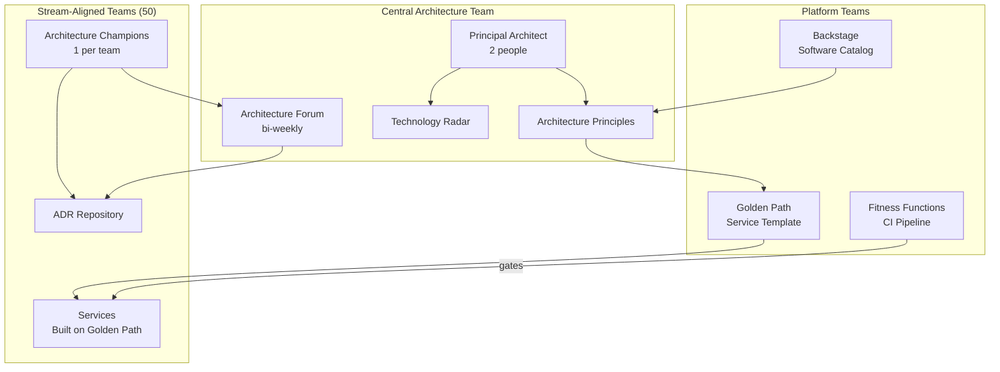

## Keywords in This File

{: .no_toc }

| #   | Keyword | Weight |
| --- | ------- | ------ |
| 1   | [Architecture Governance at Scale](#architecture-governance-at-scale) | high |

---

# Architecture Governance at Scale

🎯 Interview Weight: high - every staff+ interview includes a
governance question; tests strategic thinking, team influence
without authority, and the ability to scale architectural
standards across multiple teams without becoming a bottleneck.

---

### 🎯 Model Answer

**30 seconds:**
> Architecture governance at scale means ensuring consistent
> architectural quality across many teams without requiring
> every decision to go through a central bottleneck. The key
> mechanisms: architecture principles as guardrails (define
> the boundaries, not the solution), golden paths (self-service
> defaults that encode best practices), fitness functions for
> automated enforcement, and Architecture Decision Records for
> distributed decision-making. The goal is governance that
> scales with team count, not against it.

**3 minutes (Senior):**
> At 3 teams, an Architecture Review Board (ARB) can review
> every significant decision. At 30 teams, the ARB becomes
> a bottleneck: teams wait weeks for approval, workarounds
> accumulate, the ARB is blamed for slowness while teams bypass
> it. The governance model that works at 3 teams breaks at 30.
>
> At scale, governance shifts from centralized approval to
> distributed guardrails:
>
> Architecture principles: "Prefer asynchronous communication
> for cross-service interactions." Teams make their own decisions
> within the principles. The principle defines what matters,
> not how to implement it.
>
> Golden path / paved road: self-service infrastructure templates
> that encode architectural best practices. New services created
> from the golden path get circuit breakers, structured logging,
> distributed tracing, and health checks by default. Teams do
> not need to know how to configure these - they get them for
> free.
>
> Automated fitness functions: ArchUnit, Pact, SAST run on every
> PR. Architectural standards are enforced by CI, not by human
> review.
>
> Architecture champions: one engineer per team trained in
> architecture. They make local architectural decisions, escalate
> only genuinely novel problems. They attend a weekly architecture
> forum to share learnings across teams.
>
> ADRs: teams write ADRs for significant decisions. The central
> architecture team reviews ADRs but does not block them - they
> advise and the team decides.

*Adapting up:* Principal adds: "The governance failure mode I
have seen most often is governance that measures process compliance
rather than outcome quality. The ARB approves 95% of proposals
with no changes - it is a rubber stamp. The fitness functions
are informational, not blocking. The golden path is rarely used
because it is outdated. Governance that does not have teeth and
does not produce quality outcomes is theater. I measure governance
effectiveness by leading indicators: architectural fitness function
failure rate (should be < 1% of PRs), golden path adoption rate
(target: > 80%), P75 time from ADR submission to decision (target:
< 48 hours)."

*Adapting down:* Junior: "Architecture governance means making
sure all teams follow the same standards. At small scale, one
architect can review every decision. At large scale, you need
automated tools (like ArchUnit tests in CI) and templates
(golden paths) so teams can follow standards without needing
an architect to approve every change."

**Blank Mind Recovery:**

**(1) Restate:** "You are asking about Architecture Governance
at Scale - how to ensure consistent architecture standards
across many teams."

**(2) First principles:** "Governance exists to prevent architectural
drift - the gradual erosion of architectural quality as teams
make local decisions without considering system-wide implications.
At small scale, one person can prevent drift. At large scale,
automation and distributed responsibility replace the central
bottleneck."

**(3) Bridge:** "Think of it like city building codes. The building
department does not design every building. They set codes (minimum
standards), provide pre-approved designs (golden path), and
inspect at key milestones (fitness functions in CI). Individual
architects make thousands of decisions daily. The building
department focuses on the 5% of novel cases that require
expert review."

---

### 📘 Concept Explanation

**Governance Models:**

| Model | Mechanism | Scales to | Risk |
|---|---|---|---|
| Centralized ARB | Central approval for every significant decision | 3-5 teams | Bottleneck, bypass |
| Federated + Guardrails | Principles + golden path + fitness functions | 30-300 teams | Inconsistency without monitoring |
| Enabling Teams (Team Topologies) | Platform team enables stream-aligned teams | 100+ teams | Platform team capacity |
| Self-service + Automation | Full automation, minimal human review | Unlimited | Quality erosion without metrics |

**Architecture Principles as Guardrails:**

Principles are not implementation rules. They define what matters
without constraining how teams implement it.

Good principle: "Design for failure: assume any dependency can
fail at any time. All services must handle dependency failures
gracefully."

Bad principle (too prescriptive): "All services must use Resilience4j
CircuitBreaker with default threshold of 50%." (This is
implementation, not principle.)

Bad principle (too vague): "Be resilient." (No actionable guidance.)

**Technology Radar:**

ThoughtWorks Technology Radar: a quadrant/ring visualization of
technology adoption recommendations. Four rings: Adopt (use now),
Trial (worth pursuing), Assess (worth exploring), Hold (use with
caution or avoid).

Internal technology radar: a company-wide tech radar that guides
technology choices across teams. Prevents technology proliferation
(every team using a different message broker). Teams can still
make local decisions but are expected to justify deviations.

---

### 💻 Code Example

```java
// BAD: Architecture governance via email and documents

// Architecture email thread:
// "Team A, your PR uses blocking HTTP calls between services.
//  This violates our async-first principle.
//  Please rewrite using messaging."
//
// Two weeks later: PR merged with blocking calls anyway.
// No one followed up. The violation persists in production.
//
// The governance documentation:
// "docs/architecture/principles.md" - last updated 14 months ago
// "docs/architecture/decisions/" - 3 ADRs, all from 2 years ago
//
// Result: every team makes their own architectural decisions
// in isolation. 8 teams, 6 different message brokers in use.
// No one knows why.
```

> **Code walkthrough:** Document-only governance fails because
> documents are not enforced and go stale. Email governance fails
> because follow-through depends on individual vigilance. The
> architectural standards exist in principle but not in practice.
> The 8-team, 6-broker situation is real: when governance does not
> have teeth, teams optimize locally and the system-level
> architecture becomes incoherent.

```java
// GOOD: Architecture governance via automated fitness functions
// and golden path

// 1. Golden path: new service scaffolding includes
//    architectural standards automatically

// service-template/src/main/resources/application.yml
// (included in every new service via template)
/*
resilience4j:
  circuitbreaker:
    instances:
      default:
        failure-rate-threshold: 50
        wait-duration-in-open-state: 10s
        permitted-calls-in-half-open-state: 5

management:
  endpoints:
    web:
      exposure:
        include: health,info,prometheus,metrics
  tracing:
    sampling:
      probability: 1.0  # 100% trace sampling

logging:
  structured: true
  pattern:
    level: "%5p [${spring.application.name},%X{traceId:-},%X{spanId:-}]"
*/

// 2. ArchUnit fitness function: no direct synchronous calls
//    across aggregate boundaries (async-first principle)
@ArchTest
static final ArchRule asyncFirstPrinciple =
    noClasses()
        .that().resideInPackage("..domain..")
        .should().accessClassesThat()
        .resideInPackage("..feign..")
        .because(
            "ADR-011: Domain layer must not make synchronous"
            + " HTTP calls. Use application services with"
            + " async messaging for cross-service communication."
        );

// 3. Architecture decision via ADR (tracked, not gated)
// docs/decisions/ADR-011-async-first.md:
/*
# ADR-011: Async-First Cross-Service Communication

Status: Accepted
Deciders: Architecture Forum (all champions)

Context: Synchronous HTTP chains between services create
availability coupling. If Service B is down, Service A fails.

Decision: All cross-service communication that is not a
direct query for user-facing data MUST be asynchronous
(event-driven via Kafka).

Consequences:
  + Services are decoupled from each other's availability
  - Eventual consistency model required for cross-service data
  - Debugging async flows requires distributed tracing

Fitness function: ArchUnit rule in all services'
ArchitectureTest.java enforces this.
*/

// 4. Technology radar enforcement via dependency management
// Parent POM: defines approved versions of all dependencies
/*
<dependencyManagement>
  <!-- ADOPT: Spring Boot 3.x - use for all new services -->
  <dependency>
    <groupId>org.springframework.boot</groupId>
    <artifactId>spring-boot-dependencies</artifactId>
    <version>3.2.0</version>
    <type>pom</type>
    <scope>import</scope>
  </dependency>
  <!-- HOLD: Quarkus - not on radar yet; requires ARB approval -->
  <!-- If team uses Quarkus, Dependabot will flag the deviation -->
</dependencyManagement>
*/
```

> **Code walkthrough:** Four governance mechanisms working together.
> The golden path template (application.yml) ensures every new
> service has circuit breakers, observability, and structured
> logging configured correctly by default - teams get these
> for free without knowing how to configure them. The ArchUnit
> rule (`asyncFirstPrinciple`) is the automated enforcement of
> ADR-011: any PR that introduces synchronous HTTP calls from
> the domain layer fails the build with a reference to the ADR.
> The ADR itself documents the decision and its fitness function.
> The parent POM manages approved dependency versions: deviation
> from the technology radar requires explicit effort (overriding
> managed versions), creating friction that prompts discussion.

---

### 🎓 Answers by Seniority

**Junior / Mid (0-5 years):**
> Architecture governance means making sure all teams follow the
> same standards. At small scale, an architect reviews decisions.
> At large scale, we use ArchUnit tests in CI to catch violations
> automatically, and templates (golden paths) so teams start with
> the right defaults. This way, governance scales with the number
> of teams.

---

**Senior / Staff (5+ years):**
> The governance question at scale is: "how do I enforce standards
> across 20 teams without becoming the bottleneck?" My answer:
> automate the enforceable standards (fitness functions), make
> the recommended approach the path of least resistance (golden
> path), and reserve human review for genuinely novel decisions
> (ADR process).
>
> Architecture champions: one per team, trained in architecture
> standards, empowered to make local decisions. They escalate
> only the 5% of decisions that are genuinely novel. Weekly
> architecture forum: champions share learnings, propose principle
> changes. The result: distributed architecture competence,
> not central bottleneck.
>
> Governance theater detection: if the ARB approves 95% of
> submissions unchanged, it is a rubber stamp. If fitness
> functions are informational but not blocking, they are ignored.
> Governance only works if it has teeth - automated blocking on
> fitness function violations, clear escalation path for deviations.

---

### ⚠️ Common Misconceptions

| Misconception | Reality |
|---|---|
| More architectural rules = better governance | Too many rules create friction without corresponding quality improvement. Govern the properties that matter most (10-15 principles maximum) |
| Architecture Review Board ensures quality | ARB ensures process compliance. Quality is ensured by fitness functions that measure outcomes, not by review boards that measure process |
| Governance slows down teams | Governance without automation slows teams. Automated governance (fitness functions, golden path) speeds teams by preventing rework |
| Architecture standards are for large organizations only | Any team larger than 5 engineers benefits from explicit architectural standards. Without them, each engineer carries a different mental model of "the right way" |

---

### 🚨 Failure Modes and Diagnosis

**Failure 1: Architecture Review Board as bottleneck**

*Symptom:* Teams complain that the ARB takes 3 weeks to review
proposals. Teams work around the ARB by framing architectural
changes as "implementation details." The ARB processes grow but
produce no measurable quality improvement.

*Diagnostic:*
```
Governance health metrics:
- Average ARB review cycle time > 2 weeks: WARNING
- % of architectural changes that bypass ARB: > 30%: CRITICAL
- % of ARB submissions approved unchanged: > 90%: RUBBER_STAMP
- ARB escalations vs team decision ratio: < 5%: BOTTLENECK
```

*Fix:* Shift from centralized approval to federated guardrails.
Convert the most common ARB decisions into golden path defaults.
Convert the most common ARB prohibitions into fitness function
rules. Reserve the ARB for genuinely novel decisions (< 10% of
architectural decisions).

**Failure 2: Technology proliferation**

*Symptom:* 15 teams, 9 different message brokers in use. 6 different
approaches to authentication. Onboarding new engineers takes
4 weeks because the technology landscape is so fragmented.

*Diagnostic:*
```bash
# Find all unique dependencies across all service pom.xml files
find . -name "pom.xml" -exec grep -h "<artifactId>" {} \; |
  sort | uniq -c | sort -rn |
  grep -i "queue\|message\|kafka\|rabbit\|activemq\|sqs"
# Multiple message broker libraries = technology proliferation
```

*Fix:* Publish an internal technology radar with ADOPT/HOLD rings.
Parent POM with managed dependency versions: using a non-adopted
technology requires overriding the managed version (friction).
Migrate HOLD technology usage to ADOPT technology on a schedule.

---

### 🎯 Interview Deep-Dive

| Preparation | Target |
|---|---|
| Time to prep | 30 minutes |
| Core themes | Golden path, fitness functions, technology radar, architecture forum |
| Seniority signal | Junior: process; Senior: automated enforcement; Staff: governance as product, metrics |
| Common trap | Describing ARB as the governance model |
| Staff differentiator | Governance metrics, theater detection, architecture as product |

---

**Q1 [STAFF]: What is the difference between centralized and
federated architecture governance?**

*Why they ask:* Governance model selection.

*Likely follow-up:* "Which model do you prefer and why?"

Centralized governance: all significant architectural decisions
go through a central body (Architecture Review Board, Chief
Architect). Consistent decisions, but scales poorly. At 20+ teams,
the central body becomes a bottleneck.

Federated governance: architecture principles, standards, and
tooling are defined centrally, but teams make their own decisions
within those guardrails. Scales to any number of teams.

The federated model requires:
1. Clear principles: teams need to know what the guardrails are
2. Golden path: teams need a fast path to a good default
3. Fitness functions: automated enforcement so "within guardrails"
   can be verified without human review
4. Architecture champions: each team has someone with architecture
   context who can make local decisions correctly

Hybrid model (most organizations): centralized for cross-cutting
concerns (security standards, data residency, PII handling), federated
for service-level decisions (framework choice within approved set,
database choice within approved set, internal architecture).

*What separates good from great:* Most candidates prefer one
model. Great candidates describe the hybrid, identify the
specific concerns that require centralization (security, compliance)
vs those that benefit from federation (service-level decisions),
and describe what makes federation work (principles + golden
path + fitness functions).

---

**Q2 [STAFF]: What is the Golden Path (or Paved Road) and how
do you build one?**

*Why they ask:* Golden path is the most scalable governance mechanism.

*Likely follow-up:* "How do you keep the golden path from going stale?"

Golden path (Netflix), paved road (Spotify), or service template:
a pre-configured, best-practice-encoding starting point for new
services. Teams use the golden path to avoid re-solving the same
problems every time.

What the golden path includes:
- Service template (code scaffolding with correct structure)
- Dependencies (approved versions of all standard libraries)
- Configuration (circuit breakers, structured logging, tracing)
- CI/CD pipeline template (with all standard fitness functions)
- Kubernetes/Helm chart template (with resource limits, probes)
- README template (with standard sections: purpose, API, runbook)

Building the golden path:
(1) Identify the most common configuration decisions new services
    get wrong (circuit breakers, tracing, health checks)
(2) Encode the correct answer in the template
(3) Publish the template with a self-service creation tool
    (Backstage software catalog, Cookiecutter, Maven archetype)
(4) Measure adoption: what % of new services use the template?

Preventing staleness: the golden path is a product. It has
an owner. It is updated when standards change. Services created
from old versions of the template get notified via Dependabot
(the template version is a dependency). The owner's responsibility:
keep the golden path more attractive than building from scratch.

*What separates good from great:* Most candidates describe templates.
Great candidates describe the "path of least resistance" principle
(the golden path must be easier than building from scratch),
the anti-staleness mechanism (versioned template + Dependabot),
and measuring adoption rate.

---

**Q3 [STAFF]: How do you implement a technology radar internally?**

*Why they ask:* Technology radar is a governance mechanism.

*Likely follow-up:* "How do teams deviate from the radar?"

ThoughtWorks Technology Radar: a quadrant (techniques, tools,
platforms, languages) with four rings (Adopt, Trial, Assess, Hold).

Internal radar for a company:

Adopt ring: technologies approved for production use. All new
services should use these. The golden path uses Adopt technologies.

Trial ring: new technologies being evaluated. One or two teams
are running trials. Not for general production use yet. Teams
that want to trial a technology apply to run a time-boxed pilot.

Assess ring: technologies the architecture team is watching.
Not yet ready for trial. Teams are aware these exist.

Hold ring: technologies no longer recommended. Existing use is
tolerated but no new adoption. Migration plan required for
services using Hold technologies.

Process for placing technologies:
(1) Engineer or team proposes a new technology
(2) Architecture forum (champions + architecture team) assesses:
    maturity, community, operational overhead, fit with existing stack
(3) Consensus decision on initial ring placement
(4) Trial teams report outcomes at the next radar update cycle (quarterly)
(5) Based on trial results: move to Adopt, stay in Trial, or move to Hold

Deviation process: a team wants to use a non-Adopt technology.
They write an ADR explaining the technical justification and
tradeoffs. The architecture forum reviews. If approved, the team
runs with a sunset plan (what would trigger moving back to the
radar recommendation?).

*What separates good from great:* Most candidates describe the
ThoughtWorks radar format. Great candidates describe the internal
process (trial pilots, quarterly updates, deviation process),
and the feedback loop between trials and radar placement.

---

**Q4 [STAFF]: How do you handle Conway's Law in governance?**

*Why they ask:* Conway's Law is a governance lever.

*Likely follow-up:* "What is the Inverse Conway Maneuver?"

Conway's Law: "Organizations which design systems are constrained
to produce designs which are copies of the communication structures
of those organizations." (Mel Conway, 1967.)

The implication for governance: you cannot govern the architecture
independently of the organizational structure. If the team
structure does not match the desired architecture, the architecture
will be fought continuously.

Example: a team wants to move to microservices but all engineers
are in a single "backend team" that owns all services. The team's
communication structure is a monolith (everyone talks to everyone),
so the "microservices" they produce are tightly coupled.

Inverse Conway Maneuver (Team Topologies): deliberately design
the team structure to match the desired architecture.

Stream-aligned teams: small (5-8 people), own one or a few
services end-to-end. They produce services that are as decoupled
as their team is from other teams.

Platform team: provides the golden path, shared infrastructure,
and enabling capabilities. Reduces the cognitive load of
stream-aligned teams.

Governance implication: architectural governance must work with
team topology, not against it. If you want independent deployability,
you need teams that can deploy independently. If those teams
do not exist (every deployment requires coordination with a
central ops team), independent deployability will never be achieved.

*What separates good from great:* Most candidates define Conway's
Law. Great candidates describe the Inverse Conway Maneuver,
Team Topologies (stream-aligned + platform teams), and the
governance implication: architectural goals require organizational
design, not just technical standards.

---

**Q5 [STAFF]: How do you measure the health of your architecture
governance?**

*Why they ask:* Governance metrics demonstrate outcome focus.

*Likely follow-up:* "What does governance theater look like?"

Governance health metrics:

Fitness function compliance rate:
- % of PRs that pass all fitness functions on first attempt
- Target: > 99%
- Below 95%: architecture standards are not understood or
  tools are poorly configured

Golden path adoption rate:
- % of new services created from the golden path template
- Target: > 80%
- Below 50%: golden path is too complex, outdated, or unknown

ADR decision velocity:
- P75 time from ADR submission to decision (Accepted/Rejected)
- Target: < 48 hours for most decisions
- Above 2 weeks: governance is a bottleneck

Technology radar compliance:
- % of production services using only Adopt-ring technologies
- % of services with Hold-ring technology that has a sunset plan
- Target: 100% have sunset plans for Hold technology

Architecture debt inventory:
- Count of known architectural violations (documented)
- Count reduced or increased quarter-over-quarter?
- Trend down: governance is working
- Trend up: governance is not preventing new debt

*What separates good from great:* Most candidates describe governance
processes. Great candidates measure governance outcomes with
specific metrics, have targets for each metric, and can detect
governance theater (process compliance without quality improvement).

---

**Q6 [SENIOR]: What is architecture debt and how is it different
from technical debt?**

*Why they ask:* Tests distinction between code-level and structural debt.

*Likely follow-up:* "How do you manage architecture debt?"

Technical debt: code-level shortcuts that reduce long-term
maintainability. Missing tests, duplicated code, complex methods,
outdated dependencies. Resolvable by refactoring within the
existing architecture.

Architecture debt: structural shortcuts that violate architectural
principles. Circular dependencies between services. Synchronous
calls where asynchronous was designed. Shared databases between
services. A monolith module used as a service. Architecture debt
is not resolvable by refactoring - it requires structural change.

Why the distinction matters: technical debt can be addressed
continuously in normal sprints. Architecture debt often requires
planned migrations (Strangler Fig, Extract Service) that span
multiple sprints.

Managing architecture debt:
(1) Visibility: architecture debt register (documented, prioritized).
    Each item: description, services affected, migration path, estimated
    effort, business risk if not addressed.
(2) Prevention: fitness functions prevent new architecture debt
    from being introduced.
(3) Reduction: each sprint or quarter, allocate capacity to
    reducing architecture debt (typically 20% of team capacity).
(4) Business case: architecture debt is not just technical.
    "Our shared database between Payment Service and Order Service
    means we cannot scale them independently. To handle Black
    Friday traffic, we need to separate the databases. Estimated
    effort: 3 sprints. Risk of not doing it: we cannot scale
    payment processing beyond 1,000 req/s."

*What separates good from great:* Most candidates define technical
debt. Great candidates articulate the architecture vs technical
debt distinction, describe the architecture debt register,
and translate architecture debt into a business risk language
(scale, reliability, development speed).

---

**Q7 [STAFF]: How do you run an Architecture Forum effectively?**

*Why they ask:* Architecture Forum is the scalable governance mechanism.

*Likely follow-up:* "How do you prevent it from becoming another bottleneck?"

Architecture Forum: a regular meeting (weekly or bi-weekly) where
architecture champions from all teams share learnings, propose
standard changes, and review ADRs.

The forum is NOT: an approval body. It does not block team
decisions. It is a learning and alignment forum.

Format (60 minutes, bi-weekly):
- 10 min: ADR review (one or two pending ADRs - champions provide
  input, decision by consensus)
- 20 min: architectural lessons learned (one team shares a
  decision they made, what they learned, what other teams should know)
- 15 min: technology radar update (any new technologies to assess?)
- 15 min: open architecture discussion (no agenda items: free form)

Anti-patterns:
- The forum as a status meeting (here is what each team did):
  no value for architectural learning
- The forum as an approval meeting (teams present for approval):
  bottleneck
- The forum dominated by one voice (the lead architect decides
  everything): not a forum, an announcement

Success indicators: champions bring problems to the forum
before they become production issues. ADRs are completed
within 48 hours of forum review. Technology decisions are
consistent across teams without individual negotiation.

*What separates good from great:* Most candidates describe the
ARB. Great candidates describe the Architecture Forum as a
learning body (not approval), the specific format that prevents
it from becoming a meeting theater, and the success indicators.

---

**Q8 [STAFF]: How do Staff Engineers and Principal Architects
divide governance responsibilities?**

*Why they ask:* Tests understanding of engineering roles in governance.

*Likely follow-up:* "What does 'technical leadership without authority' mean?"

Staff Engineer: embedded in or aligned with a specific area
(domain or set of teams). Responsible for technical quality
within that area. Makes local architectural decisions. Represents
the area in the Architecture Forum. Implements the golden path
for their area. Mentors champions in their teams.

Principal Architect: broad cross-cutting scope. Sets the overall
architectural direction. Responsible for the technology radar.
Identifies architectural patterns that should become standards.
Resolves architectural conflicts between areas. Works on
organization-wide architectural challenges (data strategy,
platform direction).

Governance responsibilities:

| Responsibility | Staff Engineer | Principal Architect |
|---|---|---|
| Service-level ADRs | Owns and decides | Reviews on escalation |
| Cross-service ADRs | Co-author, advocate | Final decision |
| Golden path updates | Implements for area | Reviews for consistency |
| Technology radar | Nominates technologies | Curates radar |
| Fitness function suite | Implements for area | Sets standards |
| Architecture forum | Attends, contributes | Facilitates |

"Technical leadership without authority": neither Staff Engineers
nor Principal Architects have the authority to order engineers
to implement architectural decisions. They influence through
quality of reasoning, track record, and relationship. The golden
path and fitness functions are governance mechanisms that do
not require authority - they are structural.

*What separates good from great:* Most candidates describe job titles.
Great candidates describe the scope and responsibility division,
the "without authority" dynamic (influence vs mandate), and
why structural governance (golden path, fitness functions) is
more effective than authority-based governance.

---

**Q9 [STAFF]: How do you govern API contracts across hundreds
of services?**

*Why they ask:* API governance is a specific hard problem at scale.

*Likely follow-up:* "How do you handle breaking changes?"

API contract governance at scale (100+ services):

Schema registry: central registry for all API schemas
(OpenAPI for REST, Protobuf/Avro for Kafka). Teams register
their API schema. The registry is version-controlled. Schema
changes require a PR to the registry with review.

Backwards compatibility enforcement: a CI step runs for every
API schema change and verifies that the new schema is backwards
compatible with all registered consumer schemas. A breaking
change (removing a field) fails the CI gate.

Versioning policy (ADR-enforced):
- Additive changes (new fields, new endpoints): no version bump required
- Breaking changes (removed fields, changed types): require a new
  API version (`/api/v2/`) with a migration period
- Deprecation timeline: old version remains for 6 months
  with deprecation headers

Consumer-Driven Contract Tests (Pact): for critical integrations,
consumers register expectations. Providers verify these expectations
on every release. A provider that breaks a consumer's contract
cannot deploy.

API governance metrics:
- % of services with registered OpenAPI schema: target 100%
- Average time from API breaking change detected to resolution
- Number of active deprecated API versions

*What separates good from great:* Most candidates describe API
versioning. Great candidates describe the schema registry as
the governance mechanism, backwards compatibility CI gates,
CDCT as the provider-side enforcement, and the deprecation
timeline policy.

---

**Q10 [STAFF]: BEHAVIORAL: Describe a time you improved
architectural governance in an organization.**

*Why they ask:* Tests real leadership experience in governance.

*Likely follow-up:* "What resistance did you face?"

Strong answer structure:

Situation: "Joined a 12-team organization as Staff Engineer.
Each team made independent architectural decisions. Result:
4 different ORM frameworks in use, 3 different event buses,
no consistent observability. Onboarding new engineers took
6+ weeks to understand 'how we do things here.'"

Diagnosis: "The problem was not that teams made different decisions.
It was that there was no mechanism to share learnings. Each
team independently solved the same problems with different solutions.
There was no golden path, no architecture forum, no ADR process."

Actions: "(1) Created a lightweight ADR template and published
the first 5 ADRs documenting existing significant decisions
as a retroactive record. (2) Started a bi-weekly Architecture
Forum with one champion per team. (3) Built a service template
(Maven archetype) with standard dependencies - Spring Boot 3,
Resilience4j, Micrometer, Testcontainers for integration tests.
(4) Added 5 ArchUnit rules as the initial fitness function suite."

Results: "After 3 months: 90% of new services used the template.
After 6 months: the forum had produced 12 ADRs covering key
decisions. After 12 months: the 4 ORM framework teams had
migrated to the standard. The onboarding time dropped from 6 weeks
to 2 weeks."

Resistance: "The most common objection was 'This adds overhead
without business value.' I addressed it by measuring onboarding
time reduction and calculating the cost of the duplicated
decisions. The 12 teams each spent approximately 20 hours solving
the same configuration problems that the template now handled.
That is 240 engineer-hours saved in the first year."

*What separates good from great:* "We standardized the stack"
vs specific mechanisms (ADR template, service template, forum),
specific numbers (onboarding time, engineer-hours saved), and
honest account of resistance with a data-driven counter-argument.

---

**Q11 [STAFF]: How do you govern data architecture across
microservices?**

*Why they ask:* Data governance is a specific governance domain.

*Likely follow-up:* "How do you handle data ownership?"

Data governance principles for microservices:

Data ownership: each service owns its data. No other service
accesses that data directly. All data access is via the owning
service's API. This is enforced by: each service has its own
database, and no service's database credentials are shared.

PII data registry: a central catalog of all PII data in the
system. Which service owns it? What is the retention policy?
Who has access? Required for GDPR compliance and data breach
response.

Data contract for events: every Kafka event has a registered
Avro schema in the schema registry. Schema changes are versioned.
Consumers are protected from breaking schema changes by the
schema registry compatibility check.

Data residency: data for EU customers must reside in EU data
centers. Governance mechanism: infrastructure-level enforcement
(separate database instances per region), tested by security
fitness functions that verify data routing at the infrastructure
level.

Anti-pattern: "data lake" governance exemptions. "The data
lake needs direct database access for reporting." This exemption
becomes permanent and creates a second data access path that
bypasses all service-level controls. Alternative: each service
publishes events to Kafka; the data lake consumes events.
No direct DB access required.

*What separates good from great:* Most candidates describe data
ownership in theory. Great candidates describe PII data registry,
event schema registry, data residency enforcement, and the
anti-pattern of data lake exemptions with a specific alternative.

---

**Q12 [STAFF]: When should you override architectural governance
standards?**

*Why they ask:* Tests judgment and pragmatism alongside governance rigor.

*Likely follow-up:* "Who has the authority to grant exceptions?"

Governance standards must have an exception process, otherwise
teams bypass governance entirely rather than engage with it.

Legitimate exception cases:
1. Performance requirement that the standard approach cannot meet.
   "The payment service needs sub-millisecond latency. The standard
   ORM framework adds 30ms overhead. We need raw JDBC for this
   hot path."
2. Third-party integration constraint. "This payment gateway
   requires a proprietary SDK that conflicts with our standard
   HTTP client."
3. Regulatory requirement. "PCI DSS requires network isolation
   that conflicts with our standard service mesh configuration."

Exception process:
(1) Team writes an ADR explaining the technical justification
    and the trade-offs of the exception.
(2) Architecture Forum reviews within 48 hours.
(3) Decision: Accepted (exception granted with conditions),
    Rejected (find another way), or Escalated (too novel,
    needs principal architect review).
(4) Accepted exceptions are time-bounded: "Exception to use
    raw JDBC in the payment service hot path. Review in 12 months
    or when the ORM framework's performance issue is resolved."

Anti-pattern: permanent exceptions with no review date. An exception
granted 3 years ago is a permanent deviation that no one remembers
the reason for.

*What separates good from great:* Most candidates either enforce
standards rigidly or grant exceptions freely. Great candidates
describe a structured exception process with justification,
time bounds, and review dates - and distinguish legitimate
technical justifications from convenience-based exceptions.

| Interviewer Type | Emphasis |
|---|---|
| Technical Panel | Fitness functions, schema registry, ADR process |
| Hiring Manager | Team-level governance, Conway's Law, organizational design |
| Bar Raiser | Governance metrics, theater detection, exception process |
| Peer Engineer | Golden path implementation, ArchUnit rules, forum format |

---

### ⚖️ Comparison Table

| Governance Mechanism | Scales To | Enforces | Limitation |
|---|---|---|---|
| Architecture Review Board | 5-10 teams | Novel decisions | Bottleneck at 10+ teams |
| Architecture Principles | Unlimited | Philosophy / direction | Not enforceable automatically |
| Golden Path | Unlimited | Recommended approach | Requires maintenance; stale if not owned |
| Fitness Functions | Unlimited | Structural rules | Requires tooling investment |
| Technology Radar | Unlimited | Technology selection guidance | Cannot block non-compliance without parent POM |
| Architecture Forum | 30-100 teams | Learnings, ADR decisions | Slow if overloaded |
| Architecture Champions | Unlimited | Local quality | Requires training investment |

---

### 🏛️ System Design

**Architecture governance system for a 50-team organization:**

Team structure: 50 stream-aligned teams, 3 platform teams (infra,
data, security), 8 staff engineers (domain-aligned), 2 principal
architects.

Governance mechanisms:
- Backstage software catalog: all services registered with owner,
  status, APIs, dependencies. Provides visibility for architects.
- Golden path: service template published as Backstage scaffolder.
  One-click new service creation with all standards pre-configured.
- ADR repository: all significant decisions in version-controlled
  ADR folder. Arc42 template. Review via PR in the ADR repo.
- Fitness function suite: ArchUnit + SAST + SCA + Pact run on
  all service CI pipelines via reusable GitHub Actions workflow.
- Technology radar: quarterly update, published on internal wiki.
  Parent POM enforces Adopt ring dependency versions.
- Architecture Forum: 50 champions + 8 staff engineers, bi-weekly.
  Facilitated by principal architects.

Process: team has architectural question -> champion consults
principles + golden path -> if novel: write ADR -> submit to
forum -> decision within 48 hours -> if ADR accepted: update
golden path if appropriate + add fitness function if enforceable.

---

### 📊 Diagram

```
ARCHITECTURE GOVERNANCE AT SCALE

     Principles           Golden Path
  (What matters)     (How to do it right)
       |                      |
       v                      v
  [Architecture         [Service Template
    Forum]               + Parent POM]
       |                      |
       v                      v
  [ADR Process]         [Fitness Functions]
  (Decision docs)       (Automated enforcement)
       |                      |
       v                      v
  [Technology          [Architecture Champions]
    Radar]              (Distributed competence)
  (Tech selection)
```



> **Diagram walkthrough:** The central architecture team sets
> direction (principles, technology radar) but does not approve
> team decisions. The platform teams convert principles into
> executable mechanisms: the golden path that encodes best
> practices, fitness functions that enforce standards automatically,
> and Backstage that provides visibility. Champions are the
> distributed architecture competence in each team. The Architecture
> Forum is the learning and alignment forum - not an approval
> body. ADRs are written by teams and reviewed by the forum within
> 48 hours. The result: governance that scales with team count,
> not against it.
