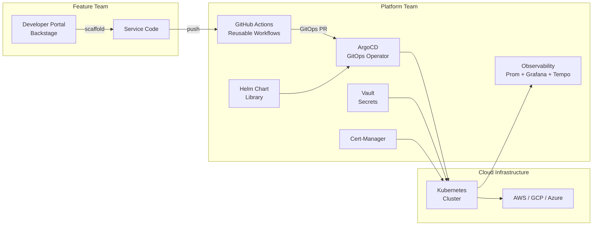

## Keywords in This File

{: .no_toc }

| #   | Keyword | Weight |
| --- | ------- | ------ |
| 1   | [Platform Engineering and Internal Developer Platforms](#platform-engineering-and-internal-developer-platforms) | high |

---

# Platform Engineering and Internal Developer Platforms

🎯 Interview Weight: high - appears at staff+ and engineering
manager interviews at organizations with 20+ teams; tests
understanding of developer experience as a product discipline
and Team Topologies thinking.

---

### 🎯 Model Answer

**30 seconds:**
> Platform engineering treats the internal developer platform
> as a product. The platform team builds self-service capabilities
> (golden path templates, CI/CD pipelines, observability, Kubernetes
> abstractions) so that feature teams can focus on delivering
> business value without becoming infrastructure experts. The
> goal: reduce cognitive load on stream-aligned teams. The measure:
> developer experience and time from commit to production.

**3 minutes (Senior):**
> The traditional ops model: feature teams throw code over the
> wall to operations. This creates coordination overhead, slow
> deployment cycles, and misaligned incentives.
>
> DevOps solved this for small teams: "you build it, you run it."
> But at 50 feature teams, each team cannot also be an expert in
> Kubernetes, Terraform, observability, service mesh configuration,
> security scanning, and secrets management. Cognitive load overwhelms
> the team's capacity to deliver features.
>
> Platform engineering solves this: a dedicated platform team
> builds self-service infrastructure that encodes best practices
> and reduces the cognitive load on feature teams. The platform
> is a product with internal customers (the feature teams).
>
> Internal Developer Platform (IDP): the self-service infrastructure
> layer. Feature teams interact with the IDP via a developer portal
> (Backstage) or CLI. The IDP abstracts away Kubernetes, Terraform,
> secrets management, and CI/CD configuration. A team creates a
> new service via the portal: the IDP provisions the namespace,
> pipeline, monitoring, and deploys the service. The team sees
> only the relevant abstractions.
>
> Measured by: DORA metrics (deployment frequency, lead time for
> change, change failure rate, mean time to recovery). If the
> platform is working, DORA metrics improve across all teams.

*Adapting up:* Principal adds: "The failure mode I see most often
is the platform team building what they think feature teams need
rather than what feature teams actually need. The platform is a
product. It needs product management: user research (talk to the
feature teams), a prioritized backlog, a product roadmap, and
success metrics (adoption rate, support tickets, developer satisfaction
scores). A platform team that does not talk to its customers
builds infrastructure that no one uses."

*Adapting down:* Junior: "Platform engineering creates shared
tools and services that all feature teams use. Instead of every
team setting up their own CI/CD, monitoring, and Kubernetes
configuration, the platform team builds these once. Feature teams
use the platform to deploy their services without needing to
understand all the infrastructure details."

**Blank Mind Recovery:**

**(1) Restate:** "You are asking about Platform Engineering and
Internal Developer Platforms - how organizations create shared
infrastructure that reduces cognitive load on feature teams."

**(2) First principles:** "Every team that needs to understand
Kubernetes, Terraform, and service mesh configuration in addition
to their domain problem has more cognitive load than a team that
just delivers domain features. Reducing the scope of what each
team must understand increases their capacity for domain work."

**(3) Bridge:** "The platform team is like a construction contractor's
materials supplier. The contractor (feature team) builds houses.
The supplier (platform team) provides standardized materials -
pre-cut lumber, pre-mixed concrete, standard window sizes. The
contractor does not need to understand how to manufacture lumber.
They focus on building houses. The supplier ensures the materials
are high quality, available when needed, and documented."

---

### 📘 Concept Explanation

**Team Topologies Model (from Team Topologies by Skelton and Pais):**

| Team Type | Purpose | Interaction Model |
|---|---|---|
| Stream-aligned team | Deliver a value stream (domain features) | Owns services end-to-end |
| Platform team | Reduce cognitive load on stream-aligned teams | X-as-a-Service |
| Enabling team | Upskill stream-aligned teams temporarily | Collaboration (time-bounded) |
| Complicated Subsystem team | Specialist problem domain (ML, algo trading) | X-as-a-Service |

**IDP Components:**

```
INTERNAL DEVELOPER PLATFORM LAYERS

Developer Portal (Backstage)
  - Service catalog (all services, owners, status)
  - Self-service scaffolding (create new service)
  - Documentation hub
  - API catalog

Compute Platform (Kubernetes)
  - Namespace provisioning
  - Resource quota management
  - Pod security policies
  - Auto-scaling configuration

CI/CD Pipeline Platform (GitHub Actions / ArgoCD)
  - Pipeline templates
  - Deployment workflows
  - GitOps for production

Observability Platform
  - Structured log aggregation (ELK / Loki)
  - Metrics platform (Prometheus / Grafana)
  - Distributed tracing (Jaeger / Tempo)
  - Alerting templates

Secrets and Config Management
  - Vault integration
  - External Secrets Operator
  - Environment-specific config

Security Platform
  - SAST / SCA in CI templates
  - Container image scanning
  - Network policies
  - Certificate management (Cert-Manager)
```

---

### 💻 Code Example

```yaml
# BAD: Feature team manages all infrastructure directly
# Every team writes their own Kubernetes manifests,
# CI/CD pipelines, monitoring configuration

# Team A's pipeline.yml - manually maintained
steps:
  - run: docker build -t my-service:$SHA .
  - run: docker push registry/my-service:$SHA
  # Missing: image scanning, SAST, secret detection
  # Missing: deployment verification
  # Missing: rollback procedure

# Team A's deployment.yaml - manually maintained
apiVersion: apps/v1
kind: Deployment
metadata:
  name: my-service
spec:
  replicas: 1  # Wrong: no autoscaling
  template:
    spec:
      containers:
        - image: my-service:latest  # Wrong: no image tag
          resources: {}  # Wrong: no resource limits
          # Missing: readiness/liveness probes
          # Missing: security context
          # Missing: secrets management
```

> **Code walkthrough:** Two files maintained independently by each
> of 50 feature teams. The CI/CD pipeline is missing security
> gates (no SAST, no image scanning, no secret detection). The
> Kubernetes manifest has no resource limits (one runaway pod
> can OOM the node), no probes (Kubernetes cannot determine health),
> `latest` image tag (no reproducibility), and no security context
> (runs as root by default). Multiply by 50 teams and 200 services:
> the organization has 200 differently configured deployments, most
> of them incorrectly configured.

```yaml
# GOOD: Platform team provides golden path templates

# Service creation via Backstage (developer experience)
# Developer runs: `backstage create service`
# Platform provisions everything below automatically.

# Generated CI/CD pipeline (from platform template)
# .github/workflows/deploy.yml - generated, not hand-written
name: Deploy Service
on:
  push:
    branches: [main]

jobs:
  security-gates:
    uses: platform-team/workflows/.github/workflows/
      security-gates.yml@main
    # Includes: SAST, SCA, secrets scan, image scan
    # Failure blocks deployment

  build-and-push:
    needs: security-gates
    uses: platform-team/workflows/.github/workflows/
      build-push.yml@main
    with:
      image-name: ${{ github.repository }}
      # Platform handles: registry auth, image tagging,
      # vulnerability report upload

  deploy:
    needs: build-and-push
    uses: platform-team/workflows/.github/workflows/
      gitops-deploy.yml@main
    with:
      environment: production
      # Platform handles: GitOps PR to ArgoCD repo,
      # deployment verification, rollback on failure

# Generated Helm chart values (from platform template)
# helm/values.yaml - platform defaults, team overrides only what matters
replicaCount: 2              # Platform sets minimum

autoscaling:
  enabled: true              # Platform default: always on
  minReplicas: 2
  maxReplicas: 10
  targetCPUUtilizationPercentage: 70

resources:                   # Platform sets safe defaults
  requests:
    memory: "256Mi"
    cpu: "100m"
  limits:
    memory: "512Mi"
    cpu: "500m"

probes:                      # Platform-generated from
  readiness:                 # standard health endpoint
    path: /actuator/health/readiness
  liveness:
    path: /actuator/health/liveness

securityContext:             # Platform-enforced
  runAsNonRoot: true
  readOnlyRootFilesystem: true
  allowPrivilegeEscalation: false

observability:               # Platform auto-wires
  metricsEnabled: true       # Prometheus scraping
  tracingEnabled: true       # Jaeger agent injection
  logFormat: structured      # Centralized log ingestion
```

> **Code walkthrough:** The feature team does not write any of
> this directly. The Backstage scaffolder generates the CI/CD
> pipeline referencing reusable platform workflows. The security
> gates workflow (SAST, SCA, image scanning) is maintained by
> the platform team and updated for all 200 services by updating
> a single reusable workflow. The Helm chart values enforce the
> platform's production-readiness standards: resource limits
> (prevent node OOM), autoscaling (handle load), probes (correct
> health reporting), security context (non-root, read-only filesystem).
> Feature teams override only the values specific to their service
> (image name, replica count). The platform team owns the quality
> of the defaults.

---

### 🎓 Answers by Seniority

**Junior / Mid (0-5 years):**
> Platform engineering creates shared tools for all feature teams.
> The platform team builds the CI/CD templates, monitoring
> dashboards, and Kubernetes abstractions once. Feature teams
> use them via a developer portal. This prevents 50 teams from
> each maintaining their own CI/CD configuration with different
> quality levels.

---

**Senior / Staff (5+ years):**
> The key insight is treating the platform as a product with
> internal customers. A platform team that builds whatever they
> think is needed and throws it over the wall to feature teams
> is an ops team with a new name. A real platform team runs user
> research (talking to the feature teams), maintains a backlog
> of platform improvements, tracks adoption metrics, and provides
> support SLAs for the platform.
>
> DORA metrics as the platform success measure: a platform that
> is working shows up as higher deployment frequency and lower
> lead time for change across all feature teams. If DORA metrics
> are not improving, the platform is not reducing the friction
> it was meant to reduce.
>
> The "paved road" vs "guardrails" balance: the platform should
> make the right way the easy way. But teams must be able to
> deviate when they have a legitimate reason. The platform is
> a self-service offering, not a mandate enforced by the platform
> team.

---

### ⚠️ Common Misconceptions

| Misconception | Reality |
|---|---|
| Platform team = renamed ops team | Platform teams have internal customers, a product roadmap, and measure success by customer outcomes (DORA metrics). Ops teams measure success by system uptime |
| Platform engineering requires Kubernetes | Platform engineering is a discipline. The platform runs on whatever compute is available. Serverless, PaaS, and managed services can all be platform offerings |
| Feature teams lose control with platform engineering | Feature teams gain control: they can deploy independently without waiting for ops. They lose the burden of managing infrastructure they did not want to manage |
| Platform engineering is only for large organizations | Any organization with 5+ feature teams benefits from shared platform capabilities. The investment pays off quickly in reduced cognitive load and consistent security baselines |

---

### 🚨 Failure Modes and Diagnosis

**Failure 1: Platform team builds for themselves, not for users**

*Symptom:* The platform team built a sophisticated Kubernetes
abstraction layer. Adoption rate: 15%. Feature teams continue
to write raw Kubernetes manifests. The platform team blames
"lack of team buy-in."

*Root cause:* Platform built without user research. The abstraction
solved a problem the platform team had, not a problem the feature
teams had. No feedback loop from feature teams to platform backlog.

*Diagnostic:*
```
Platform health metrics:
- Golden path adoption rate: < 50%: WARNING
- Support tickets from feature teams per month: > 10 per team: OVERLOADED
- Feature team NPS for platform: < 30: POOR
- Time to create a new service using platform: > 30 min: FRICTION
```

*Fix:* Treat platform as a product. Assign a platform product
manager. Conduct quarterly user research interviews with feature
team leads. Maintain a public platform roadmap. Address the top
3 friction points from user research in each quarter.

**Failure 2: Platform becomes a shared-services bottleneck**

*Symptom:* Feature teams must submit tickets to the platform team
for any production changes. Platform team backlog has 200 tickets.
Features are delayed waiting for platform team capacity.

*Root cause:* Platform team is doing "platform as a service" with
manual approvals rather than "platform as self-service." Every
operation requires platform team involvement.

*Fix:* Self-service is the goal. Any operation that requires
a platform team ticket is a failure. Convert manual operations
to self-service. Feature teams provision namespaces, manage secrets,
configure scaling - via the IDP portal, not via tickets.

---

### 🎯 Interview Deep-Dive

| Preparation | Target |
|---|---|
| Time to prep | 25 minutes |
| Core themes | IDP as product, cognitive load, DORA metrics, golden path |
| Seniority signal | Junior: tooling; Senior: product model; Staff: Team Topologies, metrics |
| Common trap | Describing platform engineering as just Kubernetes/DevOps |
| Staff differentiator | Platform as product model, user research, DORA as success metric |

---

**Q1 [STAFF]: What is cognitive load and how does platform
engineering reduce it?**

*Why they ask:* Core justification for platform engineering.

*Likely follow-up:* "How do you measure cognitive load?"

Cognitive load (Team Topologies): the total amount of mental
effort required by a team to do their work. Three types: intrinsic
(the domain problem itself), germane (learning/problem solving),
extraneous (accidental complexity from tooling and infrastructure).

A feature team's intrinsic cognitive load: understanding the
domain (orders, payments, inventory). This is unavoidable and
valuable.

Extraneous cognitive load without platform engineering: understand
Kubernetes, Terraform, Prometheus, Jaeger, Vault, certificate
rotation, network policies, image scanning, secrets rotation,
CI/CD configuration, Helm charts, security context. This is
accidental complexity - it does not make the team better at
their domain problem.

Platform engineering reduces extraneous cognitive load: the team
interacts with a high-level abstraction (Backstage portal, CLI,
Helm values with sensible defaults). The platform hides the
complexity of Kubernetes, Terraform, and infrastructure security.

Measurement: developer satisfaction surveys, time spent on
infrastructure vs feature development, number of infrastructure-related
support tickets per team.

*What separates good from great:* Most candidates describe platform
engineering as DevOps tooling. Great candidates use the cognitive
load language from Team Topologies, distinguish intrinsic from
extraneous cognitive load, and describe the measurement approach.

---

**Q2 [STAFF]: What are DORA metrics and how do they measure
platform effectiveness?**

*Why they ask:* DORA metrics are the canonical engineering effectiveness measure.

*Likely follow-up:* "What is a good deployment frequency?"

DORA metrics (DevOps Research and Assessment, Accelerate by Forsgren,
Humble, Kim):

Deployment Frequency: how often does the organization deploy
to production? Elite performers: multiple times per day.

Lead Time for Change: time from code committed to code in production.
Elite: < 1 day.

Change Failure Rate: percentage of deployments that cause a
production incident. Elite: 0-15%.

Mean Time to Recovery: time to restore service after an incident.
Elite: < 1 hour.

How platform engineering moves these metrics:

Higher deployment frequency: self-service deployment with automated
gates removes the coordination overhead of manual deployments.
Teams deploy when ready, not when operations approves.

Lower lead time: automated CI/CD with no manual steps. Each commit
triggers the pipeline. No ticket queue.

Lower change failure rate: automated security gates, fitness functions,
and deployment verification catch issues before production.

Lower MTTR: platform-provided observability (Grafana dashboards,
distributed tracing) makes incidents faster to diagnose.

*What separates good from great:* Most candidates list DORA metrics.
Great candidates connect each metric to a specific platform
capability, describe what elite performance looks like, and use
DORA as the success measure for the platform investment.

---

**Q3 [STAFF]: How is an Internal Developer Platform different
from a traditional IT portal?**

*Why they ask:* Tests understanding of the platform product model.

*Likely follow-up:* "What makes Backstage a good IDP foundation?"

Traditional IT portal: a request management system. Teams submit
tickets. Ops team processes tickets. Manual provisioning.
Response time: days to weeks. Portal is a UI for a manual process.

Internal Developer Platform: a self-service capability. Teams
provision infrastructure themselves via APIs, CLIs, and portals.
No ticket queue. Response time: minutes.

Key differences:

| Dimension | IT Portal | Internal Developer Platform |
|---|---|---|
| Primary user | Ops team (the portal is their tool) | Feature teams (the IDP is their tool) |
| Provisioning | Manual (ops team does the work) | Automated (team does it themselves) |
| Interaction model | Submit ticket, wait for response | Self-service, immediate |
| Response time | Days to weeks | Minutes |
| Measurement | Ticket resolution time | DORA metrics (team outcomes) |

Backstage as IDP foundation: open-source developer portal framework
from Spotify. Provides software catalog (all services, owners,
docs), scaffolding (create service from template), plugin system
(integrate with any tool: CI/CD, monitoring, Vault). Used by
thousands of organizations as the frontend for their IDP.

*What separates good from great:* Most candidates describe DevOps
tooling. Great candidates articulate the fundamental difference
(manual ops vs self-service), describe Backstage's role (frontend
for the IDP, not the IDP itself), and explain the measurement
shift from ticket metrics to DORA metrics.

---

**Q4 [STAFF]: How do you build and maintain a golden path without
it going stale?**

*Why they ask:* Golden path sustainability is the hardest platform challenge.

*Likely follow-up:* "What if teams have diverged from the golden path?"

The golden path goes stale when: the platform team lacks capacity
to maintain it, nobody owns the update lifecycle, and teams
learn to work around it rather than on it.

Preventing staleness:

Ownership: the golden path has a named owner on the platform team.
"Sarah owns the Java service template. Any PR to the template
requires her review."

Versioning: the template is a versioned library. Services declare
which template version they use. Dependabot (or Renovate) creates
automatic PRs to update the template version in all services.

Feedback loop: when a feature team works around the golden path
or asks a support question about it, that is a signal the path
needs improvement. All workarounds are tracked in the platform
backlog.

Update schedule: the template is reviewed quarterly. New Java
LTS versions, new Spring Boot versions, and new security baselines
are incorporated on a schedule.

Migration support: when a major template version is released,
provide a migration guide. Identify which services are on the
old version. Offer to pair-program the migration.

Adoption monitoring: use Backstage to report which services
are on which template version. Target: 80%+ on current major
version.

*What separates good from great:* Most candidates describe the
template. Great candidates describe the entire lifecycle: versioning
(Dependabot alerts), ownership (named owner), feedback loop
(support signals), and adoption monitoring.

---

**Q5 [STAFF]: What is the Team Topologies stream-aligned team
model and why does it matter for platform design?**

*Why they ask:* Team Topologies is the architectural framework for platform design.

*Likely follow-up:* "What is the interaction mode between platform and stream-aligned teams?"

Stream-aligned team: aligned to a business domain flow of work.
Owns everything needed to deliver their domain: frontend, backend,
data, testing, operations. Small (5-8 people). Can deploy independently.

The stream-aligned team's cognitive load must be bounded: if the
team must also be experts in infrastructure, security, and
observability, they cannot effectively focus on their domain.
The platform team reduces extraneous cognitive load to make
stream-aligned teams viable.

Interaction mode (Team Topologies): platform-to-stream-aligned
interaction is X-as-a-Service. The platform provides self-service
capabilities. Stream-aligned teams consume them with minimal
collaboration required. The interaction is asymmetric: the platform
team provides, the stream-aligned team consumes.

Anti-pattern: platform team in collaboration mode with all
stream-aligned teams simultaneously. This means the platform team
is constantly involved in feature team work. Cognitive load
is reduced for one team but transferred to the platform team.
At 20 stream-aligned teams, the platform team becomes the bottleneck.

Platform team interaction principle: the less the platform team
needs to interact with stream-aligned teams on a day-to-day basis,
the more successful the platform is.

*What separates good from great:* Most candidates describe teams.
Great candidates describe the interaction mode (X-as-a-Service
vs collaboration), explain why the anti-pattern (platform always
in collaboration mode) defeats the purpose, and articulate the
measure of success (how little day-to-day interaction is needed).

---

**Q6 [STAFF]: BEHAVIORAL: Describe a platform engineering
initiative you led or contributed to.**

*Why they ask:* Tests real platform engineering experience.

*Likely follow-up:* "What did you measure to know it was working?"

Strong answer structure:

Situation: "Joined an organization with 18 feature teams and
no shared platform. Each team maintained their own CI/CD pipelines,
Kubernetes manifests, and observability configuration. Incidents
took 90 minutes on average to diagnose because tracing was
inconsistent across services."

Diagnosis: "Developer survey: teams reported spending 40% of
their time on infrastructure and tooling. Feature cycle time
was 3 weeks (code to production). Deployment frequency: once
per week per team."

Platform initiative: "(1) Built a GitHub Actions reusable workflow
library: security gates, build/push, GitOps deploy. Reduced each
team's pipeline from 200 lines of custom YAML to 15 lines of
workflow references. (2) Created a Helm chart library with
standard templates: resource limits, probes, autoscaling, security
context. Teams override only service-specific values. (3) Deployed
Backstage with all 35 services registered. (4) Standardized
observability: all services emit structured logs to Loki,
metrics to Prometheus, traces to Tempo."

Results: "After 6 months: deployment frequency increased from
once/week to 3x/day per team. Lead time for change dropped from
3 weeks to 4 hours. Incident diagnosis time: from 90 minutes
to 15 minutes (distributed tracing). Infrastructure time in
developer survey: from 40% to 12%."

*What separates good from great:* "We built a platform" vs specific
components (reusable workflows, Helm library, Backstage), before/after
DORA metrics, and specific developer experience improvements
(40% to 12% infrastructure time).

---

**Q7 [STAFF]: How do you handle platform team capacity constraints?**

*Why they ask:* Platform team is a shared resource.

*Likely follow-up:* "How do you prioritize platform work?"

The platform team serves all feature teams. At 50 feature teams,
a platform team of 8 engineers serves 200+ engineers. Every
platform initiative affects 50 teams.

Capacity management:

Product management: the platform has a product manager (or a
senior platform engineer acting as PM). All requests go through
the backlog. Not all requests are accepted. The PM evaluates:
how many teams are affected, what is the cognitive load reduction,
what is the effort?

Self-service as the primary capacity multiplier: every manual
operation that is converted to self-service reduces the platform
team's ongoing support burden. The investment in self-service
has a higher ROI than adding headcount.

Enabling team model: for new platform capabilities, an enabling
team temporarily embeds with feature teams to help them adopt
the new capability. The enabling team upskills the feature team
and then withdraws. This multiplies the impact of each platform
investment.

Support SLA: define what the platform team commits to: P0 (platform
down): 30 minutes. P1 (feature blocked): 4 hours. P2 (guidance
needed): 2 business days. Clear SLAs prevent the "I need this
immediately" culture that makes platform teams reactive instead
of strategic.

*What separates good from great:* Most candidates say "prioritize
carefully." Great candidates describe the product management model
(backlog + PM), self-service as the capacity multiplier, the
enabling team model for adoption, and explicit SLAs.

---

**Q8 [STAFF]: How does platform engineering relate to the
"you build it, you run it" DevOps model?**

*Why they ask:* Tests understanding of the evolution from DevOps.

*Likely follow-up:* "Does platform engineering conflict with DevOps?"

"You build it, you run it" (Werner Vogels, Amazon, 2006): the
team that builds a service is responsible for operating it in
production. No handoff to a separate ops team. This creates
accountability and fast feedback.

At small scale: a team of 8 can be "full stack" - feature development
AND operations. The cognitive load is manageable.

At scale: a team of 8 must deliver features AND understand
Kubernetes, Terraform, Vault, observability, service mesh,
certificate management, image scanning... the cognitive load
exceeds the team's capacity.

Platform engineering does not contradict "you build it, you run it."
It enables it at scale. The feature team still owns their service
in production (you run it). The platform reduces the infrastructure
expertise they need to do so (the platform handles Kubernetes
abstractions, CI/CD templates, observability wiring).

The feature team "runs" their service via the platform's self-service
operations: they read their Grafana dashboards (platform-provided),
query their distributed traces (platform-provided), and deploy
via the GitOps pipeline (platform-provided). They do not configure
Grafana, deploy Jaeger, or write Helm charts.

*What separates good from great:* Most candidates describe them
as conflicting. Great candidates articulate the enabling relationship:
platform engineering makes "you build it, you run it" viable at
scale by reducing the operational expertise required.

---

**Q9 [STAFF]: What metrics do you track for internal developer
platform health?**

*Why they ask:* Platform product health requires metrics.

*Likely follow-up:* "How do you detect when the platform is causing friction?"

Platform health metrics:

Developer experience (DevEx) metrics:
- DORA metrics across all teams (deployment frequency, lead time,
  MTTR, change failure rate) - platform impacts all four
- Developer satisfaction survey (quarterly NPS for platform)
- "Time to first deployment" for a new service (measure of
  golden path effectiveness)

Adoption metrics:
- % of new services using golden path template
- % of services on current template major version
- % of CI pipelines using platform reusable workflows

Reliability metrics:
- Platform availability (Backstage, CI/CD, Kubernetes control plane)
- P99 pipeline execution time (how long does CI take?)
- Platform incident count and MTTR

Self-service effectiveness:
- % of operations that require a platform team ticket (target: < 5%)
- Support ticket volume (trend down = better self-service)
- Time to resolve platform support tickets

The leading indicator for platform failure: support ticket volume
increasing while adoption rate is decreasing. Teams are struggling
with the platform but not using it.

*What separates good from great:* Most candidates describe DORA.
Great candidates describe the full health dashboard (DevEx, adoption,
reliability, self-service effectiveness) with specific targets
and failure signals.

---

**Q10 [STAFF]: How do you prevent the platform team from becoming
an ivory tower?**

*Why they ask:* Platform isolation is a real failure mode.

*Likely follow-up:* "How do you keep the platform team grounded in feature team reality?"

Ivory tower failure mode: the platform team builds technically
impressive infrastructure that does not reflect how feature teams
actually work. Feature teams work around the platform. The platform
team does not know because they do not interact with feature teams.

Prevention mechanisms:

Rotation: platform team engineers rotate into feature teams
for one sprint per quarter. They experience the platform from
the consumer perspective. What is painful? What is missing?
This is the most effective feedback mechanism.

Office hours: weekly 30-minute open Q&A where any feature team
engineer can ask the platform team questions. The questions are
the backlog input.

Platform team builds on their own platform: the platform team
uses the golden path for their own services (monitoring for
the platform, CI for the platform). If the golden path is
painful, the platform team feels it first.

Advisory council: representatives from 5-6 feature teams meet
monthly with the platform team to review the roadmap and provide
input. Not a governance body - an advisory input to the platform
backlog.

Transparency: public platform roadmap. Feature teams can see
what is being worked on and why. They can comment and vote.

*What separates good from great:* Most candidates describe feedback
mechanisms. Great candidates describe rotation as the most powerful
mechanism (experience, not just feedback), the platform team
using their own platform (dogfooding), and the transparency
of a public roadmap.

---

**Q11 [STAFF]: What is the relationship between platform engineering
and cloud cost optimization?**

*Why they ask:* Cost is a platform concern.

*Likely follow-up:* "Who is responsible for cloud costs in a platform model?"

Cloud cost ownership in a platform model:

Feature teams own their resource consumption (you build it, you
pay for it). Each team has a cost budget. Teams see their cost
per service via the platform's cost visibility dashboard.

Platform team provides: cost visibility tooling (Kubecost, AWS Cost
Explorer integration in Backstage), resource limit templates
(preventing runaway resource consumption), auto-scaling defaults
(scale down during low traffic), and spot/preemptible instance
configuration.

Cost governance mechanisms:

Resource limit enforcement: the Helm template's resource limits
are not optional. A service without limits cannot be deployed.
This prevents one service from consuming all cluster resources.

Cost allocation: namespaces per team with resource quotas. The
cluster cost allocates per namespace. Teams see their portion
of the bill.

Rightsizing: platform provides automated rightsizing recommendations
(based on actual utilization vs requested resources). If a service
requests 4 CPU but uses 0.2 CPU, the platform flags this as
over-provisioned.

Cost as a DORA-adjacent metric: "cost per deployment" as a platform
health metric. If a platform change reduces cost per deployment
across 50 teams, that is measurable platform value.

*What separates good from great:* Most candidates describe cost
as a separate concern. Great candidates describe the feature
team ownership model (you pay for what you use), the platform's
enabling role (visibility, limits, rightsizing), and cost per
deployment as a platform value metric.

---

**Q12 [STAFF]: How do you handle security in a platform engineering
model?**

*Why they ask:* Security is a platform responsibility.

*Likely follow-up:* "How does the platform team handle OWASP Top 10 compliance?"

Security responsibilities in platform engineering:

Platform team owns: security infrastructure defaults. Container
security contexts (non-root, read-only filesystem). Network
policies (default-deny with allow-list). Secret management
(Vault integration). Certificate management (Cert-Manager).
SAST/SCA pipeline gates. Container image scanning. Secrets
detection in CI.

Feature teams own: application-level security. Input validation.
Authorization logic. Not storing PII in logs. Proper authentication
in their code.

Security is "built in, not bolted on" via the platform: every
service created from the golden path template gets security
context, network policy, secret management, and security gates
in CI automatically. The feature team does not configure these -
they are platform defaults.

Security posture monitoring via platform: centralized view of
open CVEs across all services (Snyk dashboard). Services with
critical CVEs are flagged in Backstage. Platform team tracks
CVE resolution SLAs across all teams.

OWASP Top 10 at the platform level: A05 (security misconfiguration)
is addressed by the platform defaults (no misconfigured services
by default). A02 (cryptographic failures) is partially addressed
by TLS everywhere (platform-enforced). A09 (security logging)
is addressed by the platform's structured logging standard.
Feature teams still own A01, A03, and A07.

*What separates good from great:* Most candidates describe security
features. Great candidates describe the responsibility split
(platform owns infrastructure security, team owns application
security), the "built-in" mechanism (platform defaults in golden
path), and the OWASP Top 10 mapping to platform vs team responsibility.

| Interviewer Type | Emphasis |
|---|---|
| Technical Panel | Backstage, CI/CD templates, Kubernetes abstractions |
| Hiring Manager | Team Topologies, cognitive load, DORA metrics |
| Bar Raiser | Platform as product model, ivory tower prevention, cost governance |
| Peer Engineer | Practical: reusable workflows, Helm defaults, golden path versioning |

---

### ⚖️ Comparison Table

| Approach | Cognitive Load Reduction | Self-Service | Autonomy | Best For |
|---|---|---|---|---|
| Traditional Ops (ticket-based) | None | None | Low | < 5 teams, stable systems |
| DevOps (you build it, you run it) | None | High | High | 5-15 teams with ops-skilled engineers |
| Platform Engineering | High | High | High | 15+ teams |
| Fully Managed PaaS (Heroku, Railway) | Very High | Very High | Low | Startups, non-infra-critical workloads |

---

### 🏛️ System Design

**Internal Developer Platform for a 50-team organization:**

Components: Backstage (developer portal, service catalog, scaffolding),
GitHub Actions reusable workflows (CI/CD templates), Helm chart
library (Kubernetes deployment templates), ArgoCD (GitOps operator),
Vault (secrets management), Prometheus + Grafana + Tempo + Loki
(observability stack), Cert-Manager (certificate management),
External Secrets Operator (Vault-to-Kubernetes secret sync).

Feature team journey for a new service:
(1) Developer runs `backstage create service` in the portal.
(2) Backstage scaffolding creates a new GitHub repo with the
    service template code, CI/CD pipeline, and Helm chart.
(3) First commit triggers the CI pipeline: SAST, SCA, secrets scan,
    image build, and deployment to development environment.
(4) Merge to main triggers production deployment via GitOps.

The feature team interacts only with: their service code, the
Backstage portal, and the Grafana dashboards. All infrastructure
complexity is abstracted by the platform.

---

### 📊 Diagram

```
INTERNAL DEVELOPER PLATFORM - ABSTRACTION LAYERS

Feature Team Experience:
  [Backstage Portal] -> Create Service, View Docs, Check Status
         |
         v
  [CI/CD Templates] -> Reusable workflows: SAST, build, deploy
         |
         v
  [Kubernetes Platform] -> Namespace, resource limits, scaling
         |
         v
  [Observability] -> Dashboards, traces, alerts (auto-wired)
         |
         v
  [Security] -> Vault secrets, network policy, cert management
         |
         v
  Cloud Infrastructure (invisible to feature teams)
```



> **Diagram walkthrough:** The feature team interacts with Backstage
> (scaffolding new services, checking status) and their own service
> code. The platform team owns everything below: the reusable
> GitHub Actions workflows (CI security gates, build, deploy),
> the Helm chart library (Kubernetes deployment standards), ArgoCD
> (GitOps operator that syncs manifests to Kubernetes), the
> observability stack (automatically wired to all services), and
> Vault (secrets management). Feature teams never interact with
> Kubernetes directly or configure Prometheus. This is the
> cognitive load reduction in action: the platform absorbs
> infrastructure complexity so feature teams can focus on
> domain logic.
