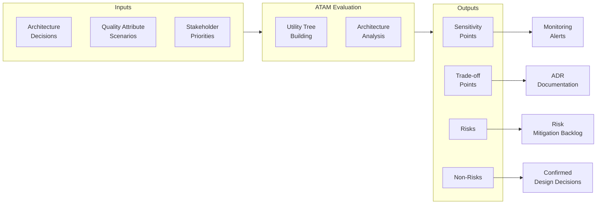

## Keywords in This File

{: .no_toc }

| #   | Keyword | Weight |
| --- | ------- | ------ |
| 1   | [Software Architecture Quality Attributes and ISO 25010](#software-architecture-quality-attributes-and-iso-25010) | medium |
| 2   | [Architecture Tradeoff Analysis Method - ATAM](#architecture-tradeoff-analysis-method---atam) | medium |

---

# Software Architecture Quality Attributes and ISO 25010

🎯 Interview Weight: medium - appears in principal/staff interviews
at quality-conscious organizations; demonstrates theoretical
grounding; ISO 25010 provides the vocabulary for quality attribute
discussions.

---

### 🎯 Model Answer

**30 seconds:**
> ISO 25010 is the international standard for software product
> quality. It defines eight quality characteristics - functional
> suitability, reliability, performance efficiency, usability,
> security, compatibility, maintainability, and portability -
> with sub-characteristics under each. For architects, it provides
> a complete vocabulary for quality attribute requirements and
> a framework for ensuring that non-functional requirements are
> comprehensive, not ad hoc.

**3 minutes (Senior):**
> Quality attributes (non-functional requirements) drive
> architectural decisions. An architecture is fundamentally a
> set of decisions made to achieve a specific quality attribute
> profile. The problem: most projects define quality requirements
> informally ("the system should be fast"). ISO 25010 provides
> a complete taxonomy that prevents gaps.
>
> The eight ISO 25010 quality characteristics:
> (1) Functional Suitability: does the system do what it is
>     supposed to do?
> (2) Performance Efficiency: response time, throughput, resource
>     utilization.
> (3) Compatibility: coexistence and interoperability with other
>     systems.
> (4) Usability: learnability, operability, user error protection.
> (5) Reliability: fault tolerance, recoverability, availability.
> (6) Security: confidentiality, integrity, non-repudiation,
>     authentication, authorization.
> (7) Maintainability: modularity, reusability, analyzability,
>     modifiability, testability.
> (8) Portability: adaptability, installability, replaceability.
>
> Architecture evaluation: ISO 25010 is used in architecture
> evaluation (ATAM) to define the utility tree - the root is
> "quality," branches are characteristics, leaves are specific
> scenarios ("the system processes 10,000 orders/second at P99
> < 2s"). The utility tree makes quality attributes explicit
> and measurable.

**Blank Mind Recovery:**

**(1) Restate:** "You are asking about ISO 25010 and software
quality attributes - the international standard for defining
what 'quality' means for software."

**(2) First principles:** "Every software system has quality
requirements: it must be fast enough, available enough, secure
enough. ISO 25010 provides a complete list of all the quality
dimensions a system might need, so architects do not miss any."

**(3) Bridge:** "ISO 25010 is like a nutritional label for software.
Just as a nutritional label lists all components (calories, fat,
protein, vitamins) so you can assess the complete nutritional
profile, ISO 25010 lists all quality characteristics so architects
can assess the complete quality profile."

---

### 📘 Concept Explanation

**ISO 25010 Quality Model:**

```
ISO 25010 QUALITY CHARACTERISTICS

Functional Suitability
  - Functional completeness
  - Functional correctness
  - Functional appropriateness

Performance Efficiency
  - Time behaviour (response/throughput)
  - Resource utilization
  - Capacity

Compatibility
  - Co-existence
  - Interoperability

Usability
  - Appropriateness recognizability
  - Learnability
  - Operability
  - User error protection
  - User interface aesthetics
  - Accessibility

Reliability
  - Maturity
  - Availability
  - Fault tolerance
  - Recoverability

Security
  - Confidentiality
  - Integrity
  - Non-repudiation
  - Accountability
  - Authenticity

Maintainability
  - Modularity
  - Reusability
  - Analyzability
  - Modifiability
  - Testability

Portability
  - Adaptability
  - Installability
  - Replaceability
```

**Quality Attribute Scenarios (BASS, CLEMENTS, KAZMAN):**

A quality attribute scenario has six parts:
- Stimulus source: who/what generates the stimulus
- Stimulus: the event or condition
- Environment: system state when stimulus occurs
- Artifact: what part of the system is affected
- Response: what the system does
- Response measure: how we measure the response

Example: "Under normal operation (environment), when a user submits
a payment request (stimulus) from the mobile app (source), the
payment service (artifact) processes and responds (response) within
2 seconds at P99 (response measure)."

---

### 💻 Code Example

```java
// BAD: Quality attribute requirements defined informally
// "The system should be fast and reliable."
// No measurement criteria. No scenarios.
// Architect makes arbitrary decisions: no shared frame of reference.
// Developer marks it done: implemented, but never tested against criteria.
// Result: "fast" means 20s to the developer, 200ms to the customer.
```

> **Code walkthrough:** The informally defined quality attribute
> is the most common QA anti-pattern. Without a response measure
> ("P99 < 2s at 1,000 req/s"), "fast" is undefined. The architect
> cannot make a principled design decision (caching? async? different
> DB?). The developer cannot verify their implementation. The tester
> cannot write a test. ISO 25010 + the six-part scenario format
> eliminates this by requiring explicit, measurable response criteria.

```java
// GOOD: Quality attributes defined with ISO 25010 scenarios

/**
 * Quality Attribute Worksheet (from SEI Software Architecture
 * in Practice)
 *
 * QA-001: Performance Efficiency - Time Behaviour
 * Stimulus source: Mobile customer
 * Stimulus: Submit payment request
 * Environment: Peak load (Black Friday, 10x normal volume)
 * Artifact: Payment service
 * Response: Process and return result
 * Response measure: P99 < 2s; error rate < 0.1%
 *
 * Architectural decisions driven by QA-001:
 * - Async payment confirmation (immediate ACK, async processing)
 * - Circuit breaker to payment gateway (prevent cascade)
 * - Horizontal autoscaling (Kubernetes HPA, 2-20 replicas)
 * - Cache payment method lookup (Redis, 60s TTL)
 *
 * Fitness function for QA-001:
 * Run k6 load test at 10x normal volume. Assert P99 < 2s.
 * Gate production deployment.
 *
 * QA-002: Reliability - Availability
 * Stimulus source: Hardware failure
 * Stimulus: Database primary instance fails
 * Environment: Normal operation
 * Artifact: Order management service + database
 * Response: Fail over to replica; resume normal operation
 * Response measure: RTO < 30 seconds; no data loss (RPO = 0)
 *
 * Architectural decisions driven by QA-002:
 * - Synchronous replication (RPO = 0: no async lag)
 * - Automatic failover (AWS RDS Multi-AZ: 30s failover)
 * - Connection pool retry logic (survive 30s failover window)
 * - Health check: detect replica promotion within 5 seconds
 *
 * QA-003: Security - Integrity + Confidentiality
 * Stimulus source: External attacker
 * Stimulus: Attempt to access another user's order data
 * Environment: Normal operation
 * Artifact: Order API
 * Response: Reject request with 403 Forbidden
 * Response measure: 100% of unauthorized requests rejected;
 *                   security incident logged within 1 second
 */
```

> **Code walkthrough:** Three quality attribute scenarios following
> the six-part format. Each scenario is ISO 25010 classified
> (Performance Efficiency - Time Behaviour, Reliability - Availability,
> Security - Integrity). Each scenario drives specific architectural
> decisions (async confirmation, circuit breaker, Multi-AZ, retry
> logic, authorization check). Each scenario has a fitness function
> that can be automated (k6 test, chaos test, security integration
> test). The quality attribute worksheet is the link between
> requirements and architectural decisions - it makes the
> traceability explicit.

---

### 🎓 Answers by Seniority

**Junior / Mid (0-5 years):**
> ISO 25010 is a standard that defines what software quality means.
> It lists all the quality attributes a software system might
> have: performance, reliability, security, maintainability, and
> others. Architects use it to make sure they have not missed
> any important quality requirement when designing a system.

---

**Senior / Staff (5+ years):**
> The most valuable use of ISO 25010 is as a completeness checklist
> for quality attribute requirements. In requirements workshops,
> stakeholders naturally articulate functional requirements and
> a few obvious quality requirements ("it must be fast, it must
> be secure"). ISO 25010 provides a structured prompt for the
> quality attributes that are not mentioned: "We have covered
> performance and security. Have we discussed maintainability?
> What is our requirement for testability? For modifiability?"
>
> The sub-characteristics are particularly valuable. "Security"
> without sub-characteristics misses non-repudiation (audit logs),
> accountability, and authenticity. A compliance requirement might
> demand non-repudiation specifically - you only know to ask
> about it if you know the sub-characteristic exists.

---

### ⚠️ Common Misconceptions

| Misconception | Reality |
|---|---|
| ISO 25010 is for compliance documentation only | ISO 25010 is a practical engineering tool for quality attribute elicitation, scenario definition, and architecture evaluation |
| Performance and performance efficiency are the same | ISO 25010 Performance Efficiency has three sub-characteristics: time behaviour (latency), resource utilization (CPU/memory), and capacity (maximum throughput). Architects must address all three |
| ISO 25010 replaces ATAM | ISO 25010 provides the vocabulary for quality attributes; ATAM is the evaluation method that uses that vocabulary to assess architectural decisions |

---

### 🚨 Failure Modes and Diagnosis

**Failure: Missing quality attribute sub-characteristics**

*Symptom:* The system meets the "security" requirement but fails
a GDPR audit because no non-repudiation mechanism exists (no
audit log of data access).

*Root cause:* Security requirement defined without ISO 25010
sub-characteristics. "Security" was interpreted as authentication
and authorization only. ISO 25010 Security also includes:
non-repudiation (proof actions occurred), accountability (traceability
to actors).

*Fix:* Use ISO 25010 sub-characteristics as the checklist for
each quality characteristic. For Security: explicitly define
requirements for confidentiality, integrity, non-repudiation,
accountability, and authenticity. Each sub-characteristic gets
its own scenario and response measure.

---

### 🎯 Interview Deep-Dive

| Preparation | Target |
|---|---|
| Time to prep | 20 minutes |
| Core themes | Eight ISO 25010 quality characteristics, six-part scenario format |
| Seniority signal | Junior: names the 8 characteristics; Senior: uses scenarios; Staff: traces QA to architecture decisions |
| Common trap | Confusing functional requirements with quality attributes |
| Staff differentiator | Quality attribute traceability to specific architectural decisions |

---

**Q1 [SENIOR]: What are the eight ISO 25010 quality characteristics?**

*Why they ask:* Baseline knowledge check.

*Likely follow-up:* "Which ones conflict with each other most often?"

(1) Functional Suitability: the system does what it is supposed
to do, correctly, and appropriately.

(2) Performance Efficiency: time behaviour (latency), resource
utilization, and capacity.

(3) Compatibility: coexistence (operates alongside other systems)
and interoperability (exchanges data correctly).

(4) Usability: learnability, operability, error protection, and
accessibility.

(5) Reliability: availability, fault tolerance, and recoverability.

(6) Security: confidentiality, integrity, non-repudiation,
accountability, and authenticity.

(7) Maintainability: modularity, reusability, analyzability,
modifiability, and testability.

(8) Portability: adaptability, installability, and replaceability.

Most common conflicts: Performance Efficiency vs Security (TLS
adds latency overhead), Performance Efficiency vs Maintainability
(optimization reduces code clarity), Reliability vs Portability
(platform-specific failover mechanisms are not portable).

*What separates good from great:* Most candidates list the 8.
Great candidates identify specific conflicts between characteristics
and articulate the architectural trade-off they force.

---

**Q2 [STAFF]: How do you use ISO 25010 in architecture evaluation?**

*Why they ask:* Practical application of the standard.

*Likely follow-up:* "How does this connect to the utility tree in ATAM?"

In architecture evaluation (ATAM), ISO 25010 provides the vocabulary
for building the utility tree:

Root: "Quality"
Level 1 branches: ISO 25010 characteristics (Performance Efficiency,
Reliability, Security, Maintainability...)
Level 2 branches: ISO 25010 sub-characteristics (Time Behaviour,
Availability, Confidentiality, Modifiability...)
Leaves: specific scenarios with response measures

Example utility tree fragment:
```
Quality
  Performance Efficiency
    Time Behaviour
      Payment processing: P99 < 2s at peak load [H, H]
      Page load: P95 < 3s on 4G network [H, M]
    Resource Utilization
      CPU < 70% at peak load [M, M]
  Reliability
    Availability
      99.9% uptime (< 8.7 hours/year downtime) [H, H]
    Fault Tolerance
      Single node failure: no data loss, < 30s recovery [H, H]
  Maintainability
    Testability
      80% line coverage for domain logic [M, L]
```

The [H, M] notation: importance to business (H/M/L) and technical
risk of achieving it (H/M/L). ATAM evaluates architecture decisions
against the high-importance, high-risk leaves first.

*What separates good from great:* Most candidates describe the utility
tree concept. Great candidates construct a partial utility tree
with ISO 25010 classification, explain the importance/risk scoring,
and describe how ATAM prioritizes evaluation based on the scores.

---

**Q3 [SENIOR]: How do quality attribute requirements drive
architectural decisions?**

*Why they ask:* Traceability from requirements to design.

*Likely follow-up:* "How do you document this traceability?"

Quality attribute traceability: every significant architectural
decision is traceable to one or more quality attribute scenarios.

Example: "We use microservices" is not a sufficient architectural
decision. The decision is: "We use independent deployability
(Reliability - Availability sub-characteristic) as the primary
decomposition driver. Teams must be able to deploy their services
without coordinating with other teams. This requires independent
deployment pipelines and independent databases."

Documentation: Architecture Decision Records (ADRs) include the
quality attribute scenario that drives the decision. ADR-007:
"Decision: Use asynchronous communication for cross-service
calls. QA Scenario: QA-004 (Reliability - Fault Tolerance).
If Service B is unavailable, Service A must continue to operate
(resilience). Synchronous HTTP calls create availability coupling.
Asynchronous messaging decouples availability."

The traceability serves two purposes: (1) justifies the decision
to stakeholders who question it; (2) triggers re-evaluation when
the driving quality attribute changes.

*What separates good from great:* Most candidates describe QA
requirements and design separately. Great candidates describe
the traceability mechanism (ADR with QA scenario reference),
the "why" of each architectural decision, and what happens
when the driving QA changes.

---

**Q4 [STAFF]: What is the difference between quality attributes
in use and quality attributes of the product?**

*Why they ask:* ISO 25010 distinguishes product quality from quality in use.

*Likely follow-up:* "How does this affect how you define requirements?"

ISO 25010 has two related models: Product Quality (8 characteristics)
and Quality in Use (5 characteristics).

Product Quality: attributes of the software product itself.
Measurable by static analysis, dynamic testing, and architectural
review. The 8 characteristics above.

Quality in Use: the quality experienced by a specific user in
a specific context of use. Measured by observing real users
in real environments.

Quality in Use characteristics:
(1) Effectiveness: can users achieve their goals accurately and completely?
(2) Efficiency: do users achieve goals with appropriate resource expenditure?
(3) Satisfaction: are users satisfied?
(4) Freedom from risk: does the system avoid negative consequences?
(5) Context coverage: does the system work in all intended contexts?

The relationship: product quality (e.g., Performance Efficiency -
Time Behaviour: P99 < 2s) is necessary but not sufficient for
quality in use (Efficiency: users can complete checkout in < 3 minutes).
A product can have excellent technical quality attributes and
poor quality in use (3-tap checkout that takes 3 minutes because
the form is confusing).

Architectural implication: quality in use requirements often
drive architecture decisions that pure product quality misses.
"Users in low-bandwidth regions must complete checkout" drives
progressive web app, offline support, and progressive loading
requirements that a pure "P99 < 2s" requirement would not capture.

*What separates good from great:* Most candidates only know the
product quality model. Great candidates distinguish product quality
from quality in use, describe the 5 QiU characteristics, and
articulate how QiU drives different architectural decisions.

---

**Q5 [STAFF]: How would you apply ISO 25010 Maintainability
to evaluate an architecture?**

*Why they ask:* Maintainability is the most impactful long-term QA.

*Likely follow-up:* "How do you measure maintainability objectively?"

ISO 25010 Maintainability has five sub-characteristics:

Modularity: the system is composed of components that can be
changed independently. Architecture evaluation: identify the
deployment units (services, modules). Can each be modified
and deployed without affecting others? Circular dependencies
violate modularity. Measured by: ArchUnit - no cycles detected.

Reusability: components can be used in multiple contexts. Architecture
evaluation: are there shared libraries for common concerns (logging,
auth, config)? Is there duplication across services that should
be abstracted? Measured by: code duplication metrics (SonarQube).

Analyzability: the system's behavior can be understood and
diagnosed efficiently. Architecture evaluation: is there distributed
tracing? Are logs structured with correlation IDs? Can an engineer
trace a request end-to-end? Measured by: P75 time to diagnose
a production incident.

Modifiability: the system can be modified without introducing
defects. Architecture evaluation: what is the blast radius of
a change? If I change the Payment Service's API, how many other
services must change? Measured by: Consumer-Driven Contract
Tests - breaking change detected automatically.

Testability: the system can be tested efficiently. Architecture
evaluation: can domain logic be unit-tested without a running
database? Is there a clean separation between domain and
infrastructure? Measured by: unit test execution time, test
coverage of domain logic.

*What separates good from great:* Most candidates describe
maintainability qualitatively. Great candidates apply the five
sub-characteristics specifically to an architecture, with
measurable criteria for each.

---

**Q6 [SENIOR]: How does ISO 25010 Security relate to the OWASP Top 10?**

*Why they ask:* Connects the theoretical standard to practical security.

*Likely follow-up:* "Which OWASP Top 10 items fall under each ISO 25010 security sub-characteristic?"

ISO 25010 Security sub-characteristics and OWASP mapping:

Confidentiality (only authorized parties can access data):
OWASP A02 (Cryptographic Failures), A01 (Broken Access Control)

Integrity (only authorized parties can modify data):
OWASP A03 (Injection), A08 (Software and Data Integrity Failures)

Non-repudiation (actions can be proven to have occurred):
OWASP A09 (Security Logging and Monitoring Failures) - no logs
means no non-repudiation

Accountability (actions can be traced to the responsible entity):
OWASP A09 again - audit logs with user identity

Authenticity (identities can be verified):
OWASP A07 (Authentication Failures), A02 (Cryptographic Failures
in authentication tokens)

Using ISO 25010 sub-characteristics for security requirements:
instead of "the system must be secure" (unmeasurable), define
a scenario per sub-characteristic:
- Confidentiality: unauthorized users cannot access other users' data
- Non-repudiation: all data access events are logged with user ID
  and timestamp, retained for 90 days
- Authenticity: all API requests are authenticated with a JWT
  signed by the organization's IDP

*What separates good from great:* Most candidates describe OWASP
and ISO 25010 separately. Great candidates map OWASP Top 10 items
to specific ISO 25010 sub-characteristics, and describe how the
sub-characteristics generate more complete security requirements.

---

**Q7 [STAFF]: When should you prioritize Maintainability over
Performance Efficiency?**

*Why they ask:* Quality attribute trade-off reasoning.

*Likely follow-up:* "How do you get stakeholder agreement on this trade-off?"

Maintainability vs Performance Efficiency is one of the most
common architectural trade-offs:

When Maintainability wins:
- System is early-stage or frequently changing. Unmaintainable
  code that is also fast becomes a liability as the feature
  velocity requirement grows.
- Performance requirements are not near the limit. If the system
  currently runs at 5% of capacity, the performance buffer means
  maintainability is the bigger risk.
- The team is growing. New engineers joining a codebase with
  good maintainability (modularity, testability, analyzability)
  ramp up in days, not months.

When Performance Efficiency wins:
- System is at capacity limit. The current architecture cannot
  meet the response time SLA under peak load.
- The performance requirement is fixed and non-negotiable (financial
  trading: microsecond latency, regulatory requirement).
- The architectural patterns exist to achieve both. (In many
  cases, caching and async processing achieve performance targets
  without sacrificing maintainability.)

Stakeholder process: use the utility tree. Assign importance
scores to each QA. "Maintainability: High importance (team is
growing from 5 to 20 engineers). Performance Efficiency: Medium
importance (we are at 20% capacity)." The importance scores
create stakeholder alignment on the priority.

*What separates good from great:* Most candidates pick one.
Great candidates describe the conditions for each choice,
reference the utility tree for stakeholder alignment, and
articulate the nuance that the trade-off is context-dependent.

---

**Q8 [STAFF]: How do you convert informal quality requirements
into measurable scenarios using ISO 25010?**

*Why they ask:* Requirements elicitation and measurement are core skills.

*Likely follow-up:* "What happens when stakeholders cannot agree on response measures?"

Process for converting informal to measurable:

Informal: "The system must be highly available."

Step 1 - ISO 25010 classification: Reliability - Availability.

Step 2 - Apply the scenario format:
- Stimulus source: a server failure in AWS us-east-1
- Stimulus: the primary database instance becomes unavailable
- Environment: peak trading hours
- Artifact: the order management service + database
- Response: the system detects the failure and fails over to
  the replica
- Response measure: RTO < 30 seconds, RPO = 0 (no data loss)

Step 3 - Validate with stakeholders: present the scenario.
"Is 30 seconds recovery time acceptable? Is zero data loss required
or can we tolerate 5 minutes of data loss?" Stakeholders often
cannot answer until the scenario is concrete.

Step 4 - Architecture decisions from scenario: RTO < 30s requires
synchronous replication and automatic failover (not manual).
RPO = 0 requires synchronous replication (async replication has
lag). This drives the choice of AWS RDS Multi-AZ over read replicas.

When stakeholders disagree on response measures: cost-of-downtime
analysis. "30-second RTO requires multi-AZ: $X/month additional
cost. What is the revenue impact of 30 minutes of downtime?"
Trade-off quantification creates alignment.

*What separates good from great:* Most candidates describe the
scenario format. Great candidates walk through the full conversion
process (informal -> classified -> scenario -> architecture
decision), describe the stakeholder validation step (the scenario
makes requirements concrete), and the cost-of-downtime technique
for disagreements.

---

**Q9 [STAFF]: How do quality attributes in ISO 25010 apply to
microservices vs monolithic architectures?**

*Why they ask:* Tests contextual application of the standard.

*Likely follow-up:* "Which architecture gives better Maintainability?"

ISO 25010 quality attribute profile comparison:

| Quality Attribute | Monolith | Microservices |
|---|---|---|
| Performance Efficiency | Often better (no network latency between modules) | Potential network overhead; compensated by independent scaling |
| Reliability - Availability | Single point of failure; full outage if process crashes | Independent availability per service; partial failures possible |
| Maintainability - Modularity | Poor if boundaries are not enforced (big ball of mud risk) | Strong modularity by deployment boundary; module replacement possible |
| Maintainability - Testability | Simple (unit tests, integration tests in one codebase) | Complex (integration testing across services requires containers) |
| Maintainability - Analyzability | Simple traces (single process) | Complex (requires distributed tracing) |
| Security | Single auth boundary; simpler attack surface | Multiple service auth; more attack surface; requires mTLS |
| Portability | Simple (single deployable unit) | Complex (many services to deploy consistently) |

Key insight: "Microservices give better Maintainability" is wrong.
Microservices give better Modularity (a Maintainability sub-characteristic)
but worse Testability and Analyzability. Whether microservices
overall improve Maintainability depends on the team's investment
in distributed tracing and contract testing.

*What separates good from great:* Most candidates say "microservices
are more maintainable." Great candidates apply the Maintainability
sub-characteristics, show the mixed picture (better modularity,
worse testability/analyzability), and qualify the answer with
the tooling investment required.

---

---

# Architecture Tradeoff Analysis Method - ATAM

🎯 Interview Weight: medium - appears at principal/staff interviews
focused on architecture evaluation; demonstrates systematic
approach to validating architectural decisions; required
knowledge for architecture reviews in regulated industries.

---

### 🎯 Model Answer

**30 seconds:**
> ATAM (Architecture Tradeoff Analysis Method) is a structured
> architecture evaluation method from the Software Engineering
> Institute. It assesses whether an architecture can achieve its
> quality attribute requirements by identifying sensitivity points
> (architectural decisions that significantly affect one quality
> attribute), trade-off points (decisions that affect multiple
> quality attributes in opposing ways), and risks (architectural
> decisions with uncertain quality attribute impact).

**3 minutes (Senior):**
> ATAM is a facilitated architecture evaluation process, not a
> testing method. It does not test the running system; it evaluates
> the architectural design against quality attribute requirements.
>
> The inputs: the architecture (decisions, rationale, components),
> the quality attribute requirements (expressed as scenarios in
> the utility tree format), and the stakeholders.
>
> The process has four phases:
> (1) Partnership and preparation: stakeholders agree on scope
>     and scenarios.
> (2) Evaluation part 1: the architecture team presents the
>     architecture. Evaluators build the utility tree.
> (3) Evaluation part 2: analyze architecture decisions against
>     quality attribute scenarios. Identify sensitivity points,
>     trade-off points, risks, and non-risks.
> (4) Follow-up: document findings, prioritize risks, propose
>     mitigations.
>
> The outputs: a risk register for the architecture, identified
> trade-off points (decisions with opposing effects on different
> quality attributes), sensitivity points (decisions that significantly
> affect one or more quality attributes), and non-risks (decisions
> confirmed to be safe).
>
> Value: ATAM validates architectural decisions before building.
> Finding a fundamental trade-off issue in design is 10-100x
> cheaper than finding it in production.

**Blank Mind Recovery:**

**(1) Restate:** "You are asking about ATAM - Architecture Tradeoff
Analysis Method - a systematic method for evaluating whether
an architectural design can achieve its quality requirements."

**(2) First principles:** "Architectural decisions are made under
uncertainty. ATAM systematically reduces that uncertainty by
analyzing each decision against quality requirements and identifying
the risky decisions before implementation."

**(3) Bridge:** "ATAM is like a pre-flight checklist for an aircraft.
Before the plane flies, engineers check each system against
performance and safety requirements. Not to test the actual
flight but to identify any design issues before passengers board.
ATAM does the same for architecture: validate the design before
the organization invests in building it."

---

### 📘 Concept Explanation

**ATAM outputs - four categories:**

Sensitivity points: architectural decisions that significantly
affect a specific quality attribute. "Caching strategy X has
a high sensitivity to Performance Efficiency - Time Behaviour."
If the cache invalidation is wrong, latency spikes.

Trade-off points: architectural decisions that affect multiple
quality attributes in opposing ways. "Synchronous replication
(for RPO = 0) has a trade-off: higher Reliability (no data loss)
vs lower Performance Efficiency (write latency increases with
synchronous replication)."

Risks: identified potential failures in the architecture against
quality attribute scenarios. "The single-threaded event loop
is a risk for the 10,000 concurrent users scenario."

Non-risks: decisions confirmed not to be risks against quality
attribute scenarios. "The stateless service design is confirmed
safe for the horizontal scaling scenario."

**ATAM utility tree format:**

```
Utility Tree

Quality
  Performance Efficiency
    Time Behaviour
      [H, H] Payment: P99 < 2s at peak
        Trade-off: async processing gains latency
                   but adds eventual consistency
        Sensitivity: cache hit rate (miss = 10x latency)
        Risk: thread pool sizing not analyzed at 10x load
      [H, M] Search: P95 < 500ms at normal load
  Reliability
    Availability
      [H, H] 99.9% uptime; RTO < 30s
        Trade-off: Multi-AZ improves availability,
                   adds cost and complexity
        Non-risk: Kubernetes pod restart confirmed < 30s
```
[H, H] = High importance, High technical risk

---

### 💻 Code Example

*(Omit: ATAM is a process and facilitation method, not a code
pattern. Code examples are not applicable. The outputs are
documents: utility tree, risk register, trade-off analysis.)*

---

### 🎓 Answers by Seniority

**Junior / Mid (0-5 years):**
> ATAM is a method for evaluating whether an architecture design
> will meet its quality requirements. A group of stakeholders
> and architects analyzes architectural decisions and identifies
> where they create trade-offs or risks. It is done before building
> the system to find design issues early.

---

**Senior / Staff (5+ years):**
> The most useful ATAM output is the trade-off point list. Every
> significant architectural decision makes multiple quality
> attributes better or worse simultaneously. Microservices improve
> Modularity but worsen Analyzability. Caching improves Time
> Behaviour but risks Integrity (stale data). ATAM forces
> architects to be explicit about these trade-offs rather than
> discovering them in production.
>
> At scale, ATAM is rarely run as a full formal evaluation (it
> requires 2-3 days of facilitated workshops). Lightweight ATAM
> is more practical: use the utility tree format for any
> architectural review, identify trade-offs and risks explicitly
> in ADRs. The core insight (analyze decisions against quality
> attribute scenarios) is applied continuously, not just at
> formal review points.

---

### ⚠️ Common Misconceptions

| Misconception | Reality |
|---|---|
| ATAM tests the running system | ATAM evaluates the architectural design before implementation. It is a design review method, not a testing method |
| ATAM replaces performance testing | ATAM identifies potential performance risks in the design. Actual performance testing validates those risks against the implemented system |
| Full ATAM must be run for every project | Full ATAM (2-3 day workshops) is appropriate for high-risk, long-lived systems. Lightweight ATAM (utility tree + trade-off analysis in ADRs) is practical for most decisions |

---

### 🚨 Failure Modes and Diagnosis

**Failure: Trade-off point discovered in production**

*Symptom:* The team implemented caching for performance. In
production, cache invalidation races cause 0.1% of users to
receive stale order status data. Business rules require data
consistency. This is an Integrity vs Time Behaviour trade-off.

*Root cause:* Trade-off point not identified during architecture
review. ATAM question: "Does caching affect any other quality
attribute?" would have surfaced the Integrity risk.

*Fix:* Use the ATAM trade-off question explicitly in architecture
reviews: "For each architectural decision, what other quality
attributes are affected, and in which direction?" A trade-off
between Performance Efficiency and Security/Integrity is
flagged, and the architect designs the cache invalidation strategy
to handle it.

---

### 🎯 Interview Deep-Dive

| Preparation | Target |
|---|---|
| Time to prep | 20 minutes |
| Core themes | Four ATAM outputs, utility tree, trade-off vs sensitivity points |
| Seniority signal | Junior: ATAM process; Senior: trade-off vs sensitivity; Staff: lightweight ATAM in ADRs |
| Common trap | Confusing ATAM with testing or performance testing |
| Staff differentiator | Practical application (lightweight ATAM in reviews), trade-off analysis in ADRs |

---

**Q1 [SENIOR]: What are the four types of ATAM findings?**

*Why they ask:* Core ATAM knowledge.

*Likely follow-up:* "Give an example of a trade-off point."

Sensitivity point: an architectural decision that has a strong
effect on one quality attribute. The value of the quality attribute
is sensitive to this decision. Example: "Cache hit rate is a
sensitivity point for Performance Efficiency - Time Behaviour.
If the hit rate drops below 80%, P99 latency exceeds the 2s SLA."

Trade-off point: an architectural decision that affects multiple
quality attributes, improving some and degrading others. Example:
"Synchronous replication is a trade-off point: it improves Reliability
(RPO = 0, no data loss) but degrades Performance Efficiency (write
latency increases by 20-40ms per write operation)."

Risk: an architectural decision that might not achieve a quality
attribute requirement. The outcome is uncertain. Example: "The
single-threaded event loop is a risk for the 10,000 concurrent
user scenario. Our load tests only ran to 1,000 concurrent users.
The behavior under 10x load is not characterized."

Non-risk: an architectural decision that has been analyzed against
quality attribute scenarios and confirmed not to be a risk.
Example: "The stateless service design is a non-risk for the
horizontal scaling scenario. Stateless services can be scaled
by adding replicas with no coordination. This is confirmed by
the autoscaling test results."

*What separates good from great:* Most candidates describe ATAM.
Great candidates give a concrete example of each type of finding,
with a specific quality attribute and architectural decision in each.

---

**Q2 [STAFF]: How do you run a lightweight ATAM review for an
architectural decision?**

*Why they ask:* Practical ATAM application.

*Likely follow-up:* "How is this different from a standard code review?"

Lightweight ATAM in an ADR review (30 minutes):

(1) State the quality attribute scenarios relevant to this decision.
"ADR-019 proposes in-memory caching for product catalog lookups.
Relevant QA scenarios: QA-001 (Performance Efficiency: P95 < 500ms),
QA-003 (Security - Integrity: product data must be current within
1 minute of update)."

(2) Identify sensitivity points. "Cache hit rate is a sensitivity
point for QA-001. Below 80% hit rate, latency exceeds the SLA.
The proposed TTL of 10 minutes requires high hit rate - this
must be monitored."

(3) Identify trade-off points. "Caching is a trade-off point:
improves QA-001 (Performance Efficiency) but risks QA-003
(Integrity). Product updates to the catalog will not be visible
to all clients for up to 10 minutes. Is this acceptable for
QA-003?"

(4) Identify risks. "The cache eviction policy under memory pressure
is not documented. If memory is exhausted, cache eviction may
degrade to random replacement, causing unexpected cache misses
and latency spikes."

(5) Document findings in the ADR. "Trade-off: Performance vs Integrity.
Resolution: business accepts 10-minute staleness for catalog data
(see ADR-019 context). Risk: eviction policy. Resolution: configure
LRU eviction with 75% memory limit alert."

This is not a full ATAM. It applies the core ATAM thinking to
a specific decision in 30 minutes.

*What separates good from great:* Most candidates describe full
ATAM. Great candidates describe the lightweight application to
a specific architectural decision, with the exact steps and outputs,
and explain how it fits into the ADR process.

---

**Q3 [STAFF]: What is the utility tree and how do you build one?**

*Why they ask:* The utility tree is the core ATAM tool.

*Likely follow-up:* "How do you prioritize which leaves to evaluate first?"

The utility tree is a hierarchical decomposition of quality
attribute requirements.

Building the utility tree:

Step 1 - Root: "Quality" (the system's overall quality objective).

Step 2 - Level 1 (ISO 25010 characteristics): list the quality
characteristics relevant to this system. For an e-commerce
platform: Performance Efficiency, Reliability, Security, Maintainability.

Step 3 - Level 2 (sub-characteristics or quality attribute categories):
refine each characteristic. Performance Efficiency: Time Behaviour,
Resource Utilization. Reliability: Availability, Fault Tolerance.

Step 4 - Leaves (specific scenarios): for each sub-characteristic,
write one or more specific scenarios with a response measure.
"Time Behaviour: payment P99 < 2s at 10x peak load."

Step 5 - Score each leaf (Importance, Technical Risk): [H/M/L, H/M/L].
Importance: how critical is this to business success?
Technical Risk: how confident are we that the architecture achieves this?

Prioritization: evaluate leaves with [H, H] first (high importance,
high technical risk). These are the decisions most likely to
require architectural changes.

*What separates good from great:* Most candidates describe the
utility tree structure. Great candidates describe the full building
process including ISO 25010 classification, the scenario format
at the leaves, and the importance/risk scoring for prioritization.

---

**Q4 [STAFF]: How do you use ATAM findings to improve an architecture?**

*Why they ask:* Tests actionable use of evaluation results.

*Likely follow-up:* "When do you escalate an ATAM risk to a stakeholder?"

ATAM findings to architecture actions:

Sensitivity points: add monitoring and alerting for the sensitive
variable. If cache hit rate is a sensitivity point for latency,
add a Grafana alert: "cache hit rate < 80% for 5 minutes."
Add a performance fitness function: k6 load test with cache hit
rate monitoring.

Trade-off points: document the trade-off explicitly in the ADR.
"We accept X (worse Integrity) to gain Y (better Performance)."
This is now a documented decision. Future engineers know why
the trade-off was made. If business requirements change (Integrity
becomes more important), the ADR flags which decision to revisit.

Risks: each risk gets a mitigation task in the project backlog.
"Risk: thread pool sizing not characterized at 10x load. Mitigation:
run load test at 10x before production launch." The risk is
tracked until the mitigation is done and the risk is confirmed
or disproved.

Non-risks: document as confirmed in the ADR. "The stateless
design for horizontal scaling is confirmed non-risk by load
test #42. The system scaled linearly from 1 to 50 replicas."
This gives future engineers confidence in the decision.

Escalating risks: risks that cannot be mitigated by the engineering
team (require business trade-off decisions, budget, or schedule
changes) are escalated to stakeholders with the trade-off framed:
"We can mitigate this risk by X, at cost Y. Without mitigation,
the risk is Z."

*What separates good from great:* Most candidates describe ATAM
outputs. Great candidates describe the translation from findings
to specific actions (monitoring, ADR updates, backlog tasks,
stakeholder escalations), and the different treatment for each
type of finding.

---

**Q5 [SENIOR]: When is ATAM appropriate and when is it overkill?**

*Why they ask:* Tests judgment in applying heavyweight methods.

*Likely follow-up:* "What is the minimum viable architecture evaluation?"

Full ATAM (2-3 day facilitated workshop with all stakeholders):
appropriate for:
- High-stakes, long-lived systems (banking core platform, healthcare
  records, air traffic control)
- First-of-kind systems with novel quality requirements
- Systems where architectural rework would be extremely expensive
  (embedded systems, large platform systems with many integrations)
- Regulated industries where architecture review evidence is required

Lightweight ATAM (30-60 minute review for individual decisions):
appropriate for:
- Normal enterprise software development
- Individual architectural decisions (ADR review)
- Sprint 0 architecture review

Minimum viable architecture evaluation:
- Identify the 3-5 quality attribute scenarios that are highest
  risk (importance: High, confidence: Low)
- For each scenario: what architectural decisions affect it?
- For each decision: what are the trade-offs? What are the risks?
- Document findings in ADRs
- Add fitness functions for the sensitivity points

This takes 2-4 hours and can be done without any special facilitation.

*What separates good from great:* Most candidates describe full
ATAM. Great candidates describe the three levels (full ATAM,
lightweight ATAM, minimum viable evaluation), the criteria for
each level, and articulate why heavyweight methods applied
inappropriately create process overhead without value.

---

**Q6 [STAFF]: How does ATAM relate to Architecture Decision Records?**

*Why they ask:* Integration of evaluation methods with governance.

*Likely follow-up:* "Should every ADR have a trade-off analysis?"

ATAM and ADRs are complementary and mutually reinforcing:

ADRs capture decisions; ATAM provides the analysis framework for
making those decisions well.

An ADR informed by ATAM thinking:
- Context: what quality attribute scenarios is this decision addressing?
- Decision: the architectural choice
- Sensitivity points: which quality attributes are sensitive to this decision?
- Trade-offs: which quality attributes improve, which degrade?
- Risks: what uncertainty exists about the decision's impact?
- Consequences: what must be monitored, tested, or mitigated?

Example (ADR + ATAM):
```markdown
# ADR-022: Use Redis cache for product catalog

Status: Accepted

## Context
QA-001 (Performance Efficiency): P95 < 500ms.
Current P95 without caching: 1,200ms.
Catalog data is read-heavy, updated infrequently.

## Decision
Cache product catalog responses in Redis (TTL: 10 minutes).

## Trade-off Analysis (ATAM)
Trade-off: QA-001 (Performance) vs QA-003 (Integrity).
Accepting up to 10 minutes of stale catalog data for the
performance benefit.
Business accepted: yes (see ticket ARCH-155).

## Risks
Sensitivity: cache hit rate. < 80% hit rate: P95 exceeds SLA.
Alert: cache_hit_rate < 80% -> PagerDuty.

## Consequences
Add k6 performance test gating deployment.
Add cache hit rate monitoring dashboard.
```

*What separates good from great:* Most candidates describe ADRs
and ATAM separately. Great candidates show the integrated format
where ATAM analysis (trade-offs, sensitivity points, risks) appears
in the ADR's consequences section.

---

**Q7 [STAFF]: What is the difference between ATAM risks,
non-risks, and sensitivity points in practice?**

*Why they ask:* Tests practical understanding of ATAM findings.

*Likely follow-up:* "How do you present these to a non-technical stakeholder?"

Practical distinction (from a real architecture evaluation):

Scenario: "The system must handle 10,000 concurrent users at P99
< 2s (from QA-001)."

Sensitivity point finding: "Database connection pool size is a
sensitivity point for QA-001. If the pool is undersized (< 200
connections at 10,000 concurrent users), P99 spikes to 10+ seconds
as requests queue for connections. Action: load test the connection
pool configuration before go-live."

Risk finding: "The event sourcing implementation stores all events
in a single Kafka partition for audit purposes. At 10,000 concurrent
users, this partition may become a throughput bottleneck. The
maximum Kafka partition throughput is approximately 10MB/s; the
event payload size at peak is not characterized. This is an
unresolved risk."

Non-risk finding: "The stateless service design is a non-risk
for QA-001 horizontal scaling. A stateless service can be scaled
by adding replicas. The load balancer has been tested distributing
load across 1, 5, and 20 replicas with linear scaling. The auto-scaling
configuration targets 70% CPU utilization, providing headroom
for traffic spikes."

Presenting to non-technical stakeholders: "We found 2 risks that
need mitigation before launch, 3 sensitivity points that need
monitoring, and 5 non-risks that are confirmed safe. The two
risks are: (1) the single Kafka partition for audit events may
be a bottleneck; we need to test this before launch. (2) The
database connection pool size needs validation under full load.
These are solvable problems with known mitigations."

*What separates good from great:* Most candidates define the
terms. Great candidates provide concrete examples of each finding
type from a realistic scenario, and describe how to communicate
the findings to stakeholders in business terms (risks to mitigate,
confirmed safe decisions).

---

**Q8 [STAFF]: How would you run a minimal ATAM-style evaluation
for a new microservices architecture before implementation?**

*Why they ask:* Practical application under constraints.

*Likely follow-up:* "Who should attend and why?"

Minimal ATAM evaluation (half-day):

Pre-work: architect prepares the utility tree (top-5 quality
attribute scenarios) and the architecture decision inventory
(top-10 significant decisions).

Session (4 hours):

Hour 1 - Architecture presentation: architect presents the
architecture with a clear decision log. Evaluators ask clarifying
questions only (no critique yet).

Hour 2 - Utility tree review: review the quality attribute scenarios.
Stakeholders score importance. Technical team scores confidence.
Identify [H, H] leaves for focus.

Hour 3 - ATAM analysis: for each [H, H] scenario, analyze the
relevant architectural decisions. Ask: sensitivity points? Trade-offs?
Risks? Non-risks? Document findings live.

Hour 4 - Finding synthesis: prioritize risks by importance and
technical risk score. Assign mitigation owners. Identify decisions
that need ADRs. Identify monitoring requirements for sensitivity points.

Attendees: architect (presents), 2-3 senior engineers (technical
depth), product owner or tech lead (business priority scoring),
security engineer (security scenarios), one "devil's advocate"
(finds edge cases).

Output: a one-page risk register with owners and due dates.

*What separates good from great:* Most candidates describe full
ATAM. Great candidates describe the minimal format with a specific
4-hour agenda, explain the pre-work that makes the session efficient,
and describe the essential attendees and their roles.

---

**Q9 [STAFF]: How does ATAM apply to microservices decomposition decisions?**

*Why they ask:* ATAM applied to the most common modern architecture decision.

*Likely follow-up:* "What trade-off points are typical in microservices decisions?"

Microservices decomposition is a set of architectural decisions
evaluated against quality attribute scenarios in ATAM.

Common sensitivity points in microservices:
- Service boundary definition: highly sensitive to Maintainability
  (wrong boundary = high coupling between services, making modification
  expensive)
- Synchronous vs asynchronous communication: sensitive to Reliability
  (sync creates availability coupling)
- Database per service: sensitive to both Maintainability (isolation)
  and Performance Efficiency (cross-service queries become network calls)

Common trade-off points in microservices:
- Independent deployability (improves Reliability - Availability)
  vs distributed tracing overhead (degrades Maintainability - Analyzability)
- Database per service (improves Maintainability - Modularity)
  vs cross-service query performance (degrades Performance Efficiency)
- Small service granularity (improves team autonomy and Maintainability -
  Reusability) vs integration overhead (degrades Performance Efficiency
  and Maintainability - Testability)

ATAM evaluation of the decomposition: for each proposed service
boundary, ask: "What quality attribute scenarios require this
boundary? What quality attributes does this boundary hurt?" The
boundaries that appear as trade-off points in multiple scenarios
are the ones that deserve the most careful consideration.

*What separates good from great:* Most candidates describe microservices
benefits. Great candidates apply ATAM thinking (sensitivity points,
trade-offs) to specific microservices decomposition decisions,
naming the quality attributes affected and the direction of impact.

| Interviewer Type | Emphasis |
|---|---|
| Technical Panel | ATAM outputs, utility tree construction, trade-off identification |
| Hiring Manager | When to use full vs lightweight ATAM, stakeholder communication |
| Bar Raiser | ATAM + ADR integration, practical lightweight ATAM format |
| Peer Engineer | Trade-off point identification, sensitivity point monitoring |

---

### ⚖️ Comparison Table

| Method | Purpose | When to Use | Time Investment |
|---|---|---|---|
| Full ATAM | Evaluate high-risk architecture designs | Safety-critical, long-lived, first-of-kind systems | 2-3 days |
| Lightweight ATAM | Evaluate individual architectural decisions | Standard enterprise decisions, ADR reviews | 30-60 min |
| Architecture Review Board | Approve architectural decisions | When centralized governance is appropriate | Variable |
| Fitness Functions | Continuously validate architectural properties | All production systems | Low (automated) |

---

### 🏛️ System Design

*(Omit: ATAM is an evaluation method, not a system component.
It is applied to system designs, not implemented as one.)*

---

### 📊 Diagram

```
ATAM PROCESS OVERVIEW

Input:                      Output:
Architecture Design  -->  [ATAM Evaluation] --> Sensitivity Points
Quality Attribute           |                   Trade-off Points
  Scenarios           Utility Tree              Risks
                       Analysis                 Non-risks

UTILITY TREE STRUCTURE

Quality
  |
  +-- Performance Efficiency
  |     |-- Time Behaviour
  |     |     |-- [H,H] Payment P99 < 2s -- RISK: thread pool
  |     |     +-- [H,M] Search P95 < 500ms
  |     +-- Resource Utilization
  |           +-- [M,L] CPU < 70% peak
  +-- Reliability
  |     +-- Availability
  |           +-- [H,H] 99.9% uptime -- TRADE-OFF: Multi-AZ cost
  +-- Maintainability
        +-- Modifiability
              +-- [M,M] Change service in 1 sprint
```



> **Diagram walkthrough:** ATAM takes three inputs: the architectural
> decisions (what was designed), the quality attribute scenarios
> (what the system must achieve), and stakeholder priorities
> (which quality attributes matter most). The evaluation builds
> a utility tree (decomposing quality requirements) and analyzes
> each architectural decision against the scenarios. The four
> output types map to different actions: sensitivity points drive
> monitoring alerts (the sensitive variable must be watched),
> trade-off points drive ADR documentation (the decision and
> its trade-offs are recorded), risks drive mitigation backlog
> items (each risk has an owner and mitigation plan), and non-risks
> confirm design decisions (documented as confirmed safe).
