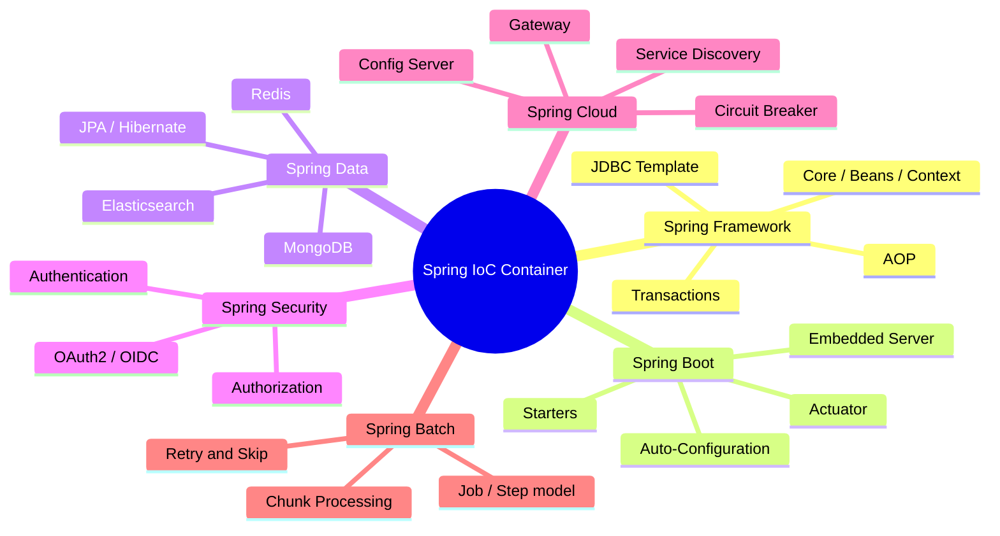
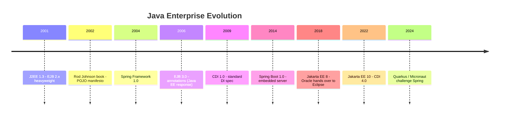
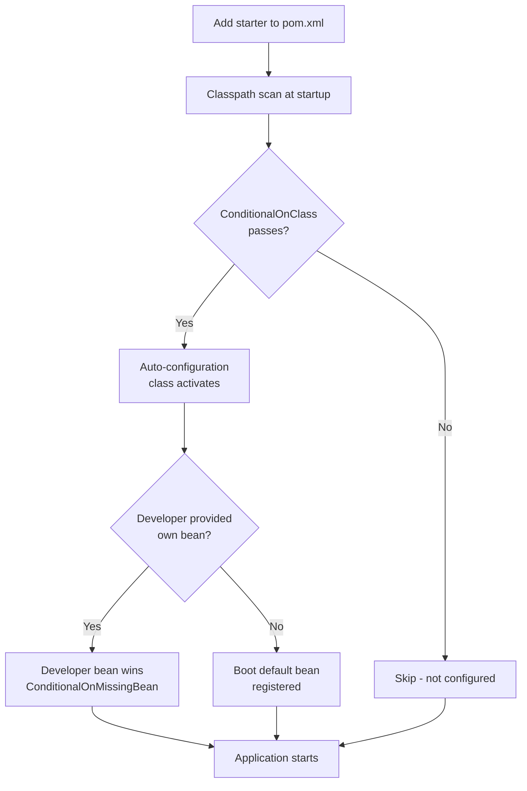

## Keywords in This File
{: .no_toc }

| # | Keyword | Weight |
|---|---|---|
| 1 | [Spring Ecosystem Overview](#spring-ecosystem-overview) | high |
| 2 | [Spring vs Java EE History](#spring-vs-java-ee-history) | medium |
| 3 | [Why Spring Boot Exists](#why-spring-boot-exists) | high |
| 4 | [Spring vs Spring Boot vs Spring Cloud](#spring-vs-spring-boot-vs-spring-cloud) | high |

---

# Spring Ecosystem Overview

**Interview Weight:** high - Asked as a warm-up at every level.
Interviewers use this to gauge whether you understand the full
Spring landscape or only the corner you happened to use.
Signals breadth before depth.

---

### 🎯 Model Answer

**30 seconds:**

> Spring is a family of Java projects built around a shared
> IoC container. The core is Spring Framework - dependency
> injection, AOP, transactions, and MVC. Spring Boot adds
> auto-configuration so you can start a production-ready service
> in minutes. Around those two, the ecosystem adds Spring Data
> (database access), Spring Security (auth), Spring Cloud
> (microservices), and Spring Batch (bulk processing).

**3 minutes (Senior):**

> The Spring ecosystem has a clear center of gravity: the IoC
> container. Everything else attaches to it. Spring Framework
> provides the container plus the foundational modules: context,
> beans, AOP, JDBC template, transactions, and Spring MVC or
> WebFlux for HTTP handling.
>
> Spring Boot is not a separate framework - it is an opinionated
> packaging of Spring Framework with auto-configuration and
> embedded servers. Most new projects start with Boot rather than
> bare Framework because Boot eliminates 80% of boilerplate while
> remaining fully open for customization.
>
> The surrounding projects solve specific domains: Spring Data
> provides repository abstractions over JPA, MongoDB, Redis, and
> Elasticsearch. Spring Security handles authentication and
> authorization. Spring Cloud adds Netflix OSS-inspired patterns
> (circuit breakers, service discovery, config server) for
> microservices. Spring Batch handles chunk-oriented bulk
> processing with restart/retry semantics.
>
> The key trade-off: the ecosystem's breadth means Spring can
> do almost anything, but also means diagnosing a runtime problem
> requires knowing which sub-project is involved. A
> LazyInitializationException looks like Hibernate, but may be
> caused by Spring's transaction proxy boundary. Knowing the
> ecosystem map is how you diagnose fast.

**Framework:** IoC CONTAINER (center) → FRAMEWORK (core modules)
→ BOOT (opinionated packaging) → ECOSYSTEM (domain projects)

*Adapting up:* Discuss Spring's container as the integration
point for all sub-projects, GraalVM native support tradeoffs
across the ecosystem, and how reactive (WebFlux) and
imperative (MVC) coexist.

*Adapting down:* Spring = IoC container + web + database.
Spring Boot = Spring + auto-config + embedded server.
Three sentences, done.

**Blank Mind Recovery:**

**(1) Restate:** "You are asking about the Spring ecosystem -
let me map the main projects and how they relate."

**(2) First principles:** "Any enterprise Java stack needs:
a container for wiring dependencies, a web layer, database
access, security, and distributed coordination. Spring has
a dedicated project for each of these."

**(3) Bridge:** "This is similar to how the Node.js ecosystem
works - a runtime core (Spring Framework = Node.js core),
opinionated wrapper (Spring Boot = Express), and domain
libraries around it - except Spring's pieces are much more
integrated."

---

### 📘 Concept Explanation

**What it is:**

Spring is a family of open-source Java projects maintained by
VMware (Broadcom). All projects share the Spring IoC container
as their foundation. Spring Framework is the core; Spring Boot
and the domain projects (Data, Security, Cloud, Batch,
Integration) compose around it.

**The problem it solves:**

Before Spring, Java enterprise development meant J2EE: EJB
components deployed into heavyweight application servers (JBoss,
WebLogic, WebSphere). Wiring dependencies required vendor-
specific descriptors. Testing was near-impossible because
components needed the container to function. Spring replaced
this with a lightweight container you could start in a JUnit
test, and POJO-based programming where objects are just Java
objects with no framework inheritance required.

**How it works:**

```
  SPRING ECOSYSTEM (from center outward)

  +-----------------------------------------+
  |         Spring IoC Container            |
  |     (ApplicationContext / BeanFactory)  |
  +-----------------------------------------+
           |              |
  +--------+----+   +------+--------+
  | Spring MVC  |   | Spring Data   |
  | / WebFlux   |   | (JPA, Mongo,  |
  | (HTTP layer)|   |  Redis, etc.) |
  +-------------+   +---------------+
           |              |
  +--------+----+   +------+--------+
  | Spring      |   | Spring Cloud  |
  | Security    |   | (Config,      |
  | (auth/authz)|   |  Gateway...)  |
  +-------------+   +---------------+
           |
  +--------+----+
  | Spring Boot |
  | (ties it    |
  |  all together|
  | via AutoConfig)
  +-------------+
```



> **Diagram walkthrough:** The IoC container sits at the center
> of every Spring project. Spring Framework provides the
> container plus core modules. Spring Boot is not a separate
> project on the same level - it is an orchestration layer
> that wires auto-configuration on top of Framework. All domain
> projects (Data, Security, Cloud, Batch) plug into the container
> and expose their functionality as beans, making them composable
> through standard dependency injection.

**The key insight:**

The IoC container is the integration bus. Every Spring project
exposes its functionality as beans registered in the
ApplicationContext. This means Spring Data's repositories,
Spring Security's filters, and your own services all compose
through the same DI mechanism. When you debug Spring problems,
you are almost always debugging bean creation, bean lifecycle,
or proxy interception - not framework-specific code.

**When to use it:**

- Java backend services where team knows Spring
- Applications needing database access + HTTP + security
  combined (Spring's strength is composability)
- Teams wanting convention-over-configuration defaults
  with the ability to override everything

**When NOT to use it:**

- Startup-time-sensitive serverless functions (Spring
  Cold start is 2-10 seconds; Spring Native with GraalVM
  AOT compilation helps but adds build complexity)
- Scripts or CLI tools (overhead outweighs benefit)
- Projects requiring a minimal runtime footprint where
  Quarkus or Micronaut native compilation is preferred

**Alternatives:**

- Quarkus - container-native from the ground up, AOT
  compilation, faster cold start
- Micronaut - AOT DI at compile time, no reflection at
  runtime, lower memory footprint
- Jakarta EE (formerly Java EE) - standard specification,
  multiple compatible implementations (Payara, WildFly)

**First-principles derivation:**

Given the constraint "Java enterprise apps need wired-together
components without hard-coded coupling," three options exist:
service locator (you find dependencies), static factory (you
create dependencies), or inversion of control (the container
provides dependencies). Service locators create hidden coupling.
Factories create tight coupling to the factory. IoC is the
necessary solution - it decouples who needs a dependency from
who creates it, enabling both testability and modularity.
Spring is the most successful implementation of IoC for Java.

---

### 💻 Code Example

**Wrong vs Right: Manual wiring vs Spring DI**

```java
// BAD - manual wiring: tight coupling, untestable
public class OrderService {
    // Hard-coded instantiation: cannot swap in tests
    private PaymentGateway gateway = new StripeGateway();
    private OrderRepo repo = new JpaOrderRepo(
        new DataSource(...)   // nested construction hell
    );
    public void placeOrder(Order o) { ... }
}
```

```java
// GOOD - Spring DI: constructor injection
@Service
public class OrderService {
    private final PaymentGateway gateway;
    private final OrderRepo repo;

    // Spring injects these - test can pass mocks
    public OrderService(
        PaymentGateway gateway,
        OrderRepo repo) {
        this.gateway = gateway;
        this.repo = repo;
    }

    public void placeOrder(Order o) { ... }
}
```

> **Code walkthrough:** The BAD example creates dependencies
> internally - `OrderService` controls its own wiring, making
> it impossible to test in isolation or swap implementations.
> The GOOD example declares dependencies as constructor
> parameters; Spring's IoC container resolves and injects them
> at startup. In a test, you pass `new OrderService(mockGateway,
> mockRepo)` directly - no Spring container needed for unit tests.
> Constructor injection also makes dependencies explicit and
> supports immutability (final fields).

**Production Example: Ecosystem composition**

```java
// Spring Boot + Data JPA + Security in one app
// All wired through the same IoC container

@SpringBootApplication  // triggers auto-configuration
public class ShopApp {
    public static void main(String[] args) {
        SpringApplication.run(ShopApp.class, args);
    }
}

// Spring Data: repository is a bean automatically
public interface ProductRepo
    extends JpaRepository<Product, Long> {
    List<Product> findByCategoryAndPriceBelow(
        String category, BigDecimal maxPrice);
}

// Spring Security: method-level security
@Service
public class ProductService {
    private final ProductRepo repo;
    public ProductService(ProductRepo repo) {
        this.repo = repo;
    }

    @PreAuthorize("hasRole('BUYER')")
    public List<Product> search(
        String category, BigDecimal max) {
        return repo.findByCategoryAndPriceBelow(
            category, max);
    }
}
```

> **Code walkthrough:** Three Spring projects composing through
> the same container. `@SpringBootApplication` triggers
> auto-configuration which detects JPA on the classpath and
> configures the EntityManagerFactory, DataSource, and
> transaction manager without XML. Spring Data scans for
> `JpaRepository` subtypes and generates the query from the
> method name at startup. Spring Security intercepts the
> `@PreAuthorize` annotation via AOP proxy. The developer wrote
> zero wiring code - all coordination happens through the
> container.

---

### 🎓 Answers by Seniority

**Junior / Mid (0-5 years):**

> Spring is a family of Java frameworks built around an IoC
> container. Spring Framework provides dependency injection and
> web support. Spring Boot wraps it with auto-configuration so
> you can build a web service without any XML. Spring Data gives
> you repository abstractions over databases, and Spring Security
> handles authentication and authorization.

*Push deeper:* Explain what the IoC container is, what problem
it solves, and name two domain projects with their purpose.

---

**Senior / Staff (5+ years):**

> Spring's core is the IoC container - the ApplicationContext
> that manages bean lifecycle and dependency wiring. Every
> Spring project exposes its functionality as beans, making
> them composable. I think of Spring as a platform where the
> container is the integration bus: Spring Data's repositories,
> Spring Security's filters, your services - all wired together
> through the same DI mechanism. The main trade-off at scale is
> startup time and memory: a full Spring Cloud application may
> take 10-30 seconds to start and consume 300-500MB RAM. For
> serverless or fast-scaling environments, Spring Native or
> alternatives like Quarkus address this.

*Push deeper:* Discuss the ApplicationContext initialization
phases, BeanPostProcessor extension points, conditional bean
loading with @Conditional, and GraalVM native compilation
trade-offs.

---

### ⚠️ Common Misconceptions

| # | Misconception | Reality | Danger |
|---|---|---|---|
| 1 | Spring and Spring Boot are the same thing | Spring Boot is an opinionated packaging of Spring Framework, not a separate framework | Building Boot apps without understanding Framework leads to debugging failures with no conceptual model |
| 2 | Spring handles everything in the web layer | Spring MVC/WebFlux handles HTTP routing; a separate servlet container (Tomcat, Jetty, Undertow) handles the actual TCP socket and HTTP parsing | Diagnosing connection-refused vs 404 vs 500 requires knowing where the HTTP stack boundary is |
| 3 | Spring Security is just login forms | Spring Security is a filter chain that intercepts every request; it handles authentication (who), authorization (what), CSRF protection, session management, and OAuth2 | Disabling Security "temporarily" in prod removes all of these protections simultaneously |
| 4 | Spring Data generates SQL at runtime from method names | Query derivation happens at startup (ApplicationContext loading); invalid method names fail fast at boot, not at first call | A startup failure from a malformed query name looks like "context failed to start" - not a SQL error |

---

### 🚨 Failure Modes and Diagnosis

**Failure 1 - ApplicationContext fails to start**

Symptom: Application exits immediately with
`Application context failed to start` and a BeanCreationException
stack trace.

Root cause: One of the beans threw an exception during
construction or initialization - often a missing configuration
property, a failed database connection during `@PostConstruct`,
or a circular dependency.

Diagnostic steps:

1. Read the full stack trace - Spring wraps the original
   exception in BeanCreationException. The root cause is always
   at the bottom of the "Caused by" chain.
2. Search for `Caused by:` in the log - the last `Caused by:`
   is the real error (e.g., `Connection refused` for DB,
   `NoSuchBeanDefinitionException` for missing dependency).
3. Enable debug logging: `logging.level.org.springframework=DEBUG`
   to see which bean is being created when the failure occurs.

Fix: Address the root cause. For missing properties, add to
`application.properties`. For DB connection, check the URL/port.
For circular dependency, introduce `@Lazy` or refactor.

---

**Failure 2 - Wrong project dependency added**

Symptom: Feature works in local but fails in deployment; or
a Spring Security filter fires unexpectedly after adding a
dependency.

Root cause: Spring Boot auto-configuration is classpath-driven.
Adding `spring-boot-starter-security` to pom.xml immediately
activates full security auto-configuration, including a default
login page and CSRF protection - even if you did not write any
security configuration.

Diagnostic: Check `actuator/conditions` endpoint (if Actuator is
enabled): shows every `@ConditionalOnClass` and
`@ConditionalOnBean` evaluation. See exactly which auto-configs
are active and why.

Fix: Understand what each starter activates before adding it.
For Spring Security, add explicit security configuration or
disable unwanted auto-configs with `@SpringBootApplication(
exclude = SecurityAutoConfiguration.class)` if security is
not needed.

---

### 🎯 Interview Deep-Dive

| Preparation time | Recommended approach |
|---|---|
| 15 min | Name all major Spring projects and one sentence each |
| 30 min | Add the IoC container as the integration mechanism |
| 45 min | Add the auto-configuration model and classpath scanning |
| 1 hour | Add a production failure story involving the ecosystem |
| 2 hours | Study BeanPostProcessor, ApplicationContext phases, and conditional beans |

---

**[JUNIOR] Q1: What is Spring, and what problem does it
solve?** [CONCEPTUAL]

*Why they ask:* Baseline gate. Tests whether you can explain
the core value proposition before discussing any specific feature.

*Likely follow-up:* "Why would you use Spring instead of just
writing plain Java?"

Spring is a framework built around Inversion of Control (IoC).
The central problem it solves is dependency management in large
applications. Without a framework, every class that needs a
collaborator must create or find it - hard-coded construction,
service locators, or factories scattered everywhere. This makes
the code untestable (cannot substitute mocks) and tightly coupled
(changing an implementation requires hunting all creation sites).

Spring's IoC container inverts this: instead of classes finding
their dependencies, the container creates all objects and injects
their dependencies. You declare what a class needs in its
constructor; Spring figures out what to create and in what order.

The practical result: a 200-class application can be composed
entirely through configuration, with each class testable in
isolation by passing mock dependencies directly.

Beyond IoC, Spring adds web (MVC/WebFlux), data access
(JDBC template, JPA), transactions, and security as modular
layers on top of the container.

*What separates good from great:* Explaining that IoC makes
testing tractable - not just "it wires dependencies" but why
that changes the development model fundamentally.

---

**[JUNIOR] Q2: What is the difference between Spring Framework
and the Spring ecosystem?** [CONCEPTUAL]

*Why they ask:* Tests ecosystem breadth awareness.

*Likely follow-up:* "Which Spring project have you used most?"

Spring Framework is the foundational library: IoC container,
AOP, transactions, Spring MVC, and Spring WebFlux. It is the
`spring-context`, `spring-beans`, `spring-web`, and
`spring-tx` jars.

The Spring ecosystem is the collection of separate projects that
build on top of Spring Framework:

- Spring Boot: auto-configuration + embedded servers + starters
- Spring Data: repository abstractions (JPA, MongoDB, Redis)
- Spring Security: authentication, authorization, OAuth2
- Spring Cloud: microservices patterns (config, gateway,
  circuit breaker, service discovery)
- Spring Batch: bulk processing with restart/retry
- Spring Integration: enterprise integration patterns (EIP)

All ecosystem projects share the IoC container. They expose their
components as beans, and your code interacts with them through
standard DI.

*What separates good from great:* Knowing that Spring Data
generates query implementations at startup, not at call time -
and that this affects startup duration for large repositories.

---

**[MID] Q3: How does Spring Boot relate to Spring Framework?
Is Boot a replacement?** [CONCEPTUAL]

*Why they ask:* A very common misconception. Tests whether
the candidate understands auto-configuration vs the framework itself.

*Likely follow-up:* "Can you use Spring Framework without
Spring Boot?"

Spring Boot is not a replacement for Spring Framework - it is
an opinionated packaging layer built on top of it. Every
Spring Boot application IS a Spring Framework application. Boot
adds three things:

1. **Auto-configuration**: detects libraries on the classpath
   and creates default bean configurations automatically. If
   `spring-data-jpa` is on the classpath and a DataSource is
   configured, Boot creates `EntityManagerFactory`,
   `JpaTransactionManager`, and `LocalContainerEntityManagerFactory
   Bean` without any XML or Java config.

2. **Starters**: curated dependency bundles (e.g.,
   `spring-boot-starter-web` brings Tomcat + Spring MVC +
   Jackson + validation). Eliminates "which 15 jars do I need?"

3. **Embedded servers**: Tomcat, Jetty, or Undertow bundled
   in the JAR. Deploy as `java -jar app.jar` instead of a
   WAR to an application server.

You absolutely can use Spring Framework without Boot: add
`spring-context` as a dependency, create your own
`ApplicationContext`, and configure everything manually. Large
enterprise shops with existing deployment pipelines may do
this. But for new projects, Boot is almost always preferred.

*What separates good from great:* Knowing that Boot's
auto-configuration is implemented through `@Conditional`
annotations evaluated at startup - and that you can see
which auto-configs fired and why via `spring.autoconfigure
.report=true` or the Actuator `/conditions` endpoint.

---

**[MID] Q4: What are Spring starters and why do they
exist?** [CONCEPTUAL]

*Why they ask:* Tests understanding of dependency management
conventions.

*Likely follow-up:* "What does spring-boot-starter-web include?"

Before starters, adding Spring web support required manually
identifying and adding 10-15 compatible JAR dependencies:
`spring-webmvc`, `jackson-databind`, `jackson-core`,
`jackson-annotations`, Tomcat, `spring-context`, and more.
Version mismatches between these jars were a constant source
of cryptic `NoClassDefFoundError` and
`IncompatibleClassChangeError` failures.

Starters solve this with a single dependency declaration that
transitively pulls in a curated, version-compatible set:

`spring-boot-starter-web` includes: Spring MVC, Jackson,
Hibernate Validator, Tomcat, and Spring Boot itself.
`spring-boot-starter-data-jpa` includes: Spring Data JPA,
Hibernate ORM, JDBC, and transaction support.
`spring-boot-starter-security` includes: Spring Security core,
Spring Security web, and config.

Starters also trigger auto-configuration: just having the
JAR on the classpath tells Spring Boot to activate the
relevant defaults. Remove the starter, the auto-configuration
disappears.

*What separates good from great:* Understanding that starters
are just POMs with transitive dependencies - you can create
your own internal company starter to standardize logging,
metrics, and security configuration across microservices.

---

**[SENIOR] Q5: When would you NOT use Spring for a Java
service?** [TRADE-OFF]

*Why they ask:* Tests whether you can reason about
trade-offs, not just apply Spring everywhere.

*Likely follow-up:* "How would you address Spring's startup
time problem?"

Spring has real costs that matter in specific scenarios:

**Startup time**: A full Spring Boot web app starts in 3-10
seconds on a cold JVM. A Spring Cloud microservice with
database + security + service discovery may take 15-30
seconds. For Lambda functions or rapidly-scaling containers
that spin up and down, this cold start latency is unacceptable.
Alternative: Quarkus or Micronaut with AOT compilation (50-200ms
startup); or Spring Native with GraalVM (similar startup with
the familiar Spring API).

**Memory footprint**: Spring Framework's reflection-based
DI, JIT-compiled classes, and metaspace usage mean a minimal
Spring Boot app uses 100-200MB RAM. A Quarkus native binary
may use 30-50MB.

**CLI tools and scripts**: Spring's overhead is unjustified
for a command-line utility. A plain Java `main()` or
Picocli-based CLI starts in milliseconds.

**Simple CRUD**: For a 3-endpoint CRUD service, Spring is
fine - but the auto-configuration complexity can be overkill.
Javalin or Micronaut may be simpler.

*What separates good from great:* Mentioning Spring Native
(GraalVM AOT) as a path to keep the Spring API while solving
the startup problem - with the caveat that AOT has constraints
(limited reflection, no dynamic proxy generation at runtime).

---

**[SENIOR] Q6: How would you debug a Spring application that
fails to start?** [DEBUGGING]

*Why they ask:* Tests production debugging skills on
the most common Spring failure mode.

*Likely follow-up:* "What is a circular dependency and how
does Spring detect it?"

A startup failure always manifests as a BeanCreationException.
Spring wraps every bean creation failure in this exception, so
the real cause is at the bottom of the "Caused by" chain.

Step 1: Find the root cause. In the stack trace, scan for
the last "Caused by:" - this is the actual error:
`java.net.ConnectException: Connection refused` (database is down),
`NoSuchBeanDefinitionException` (missing bean),
`IllegalStateException` (conflicting configuration).

Step 2: Enable debug logging to see which bean was being
created: `logging.level.org.springframework.context=DEBUG`.
This shows the bean creation sequence and the exact bean name
that failed.

Step 3: Check auto-configuration decisions:
`spring.autoconfigure.report=true` (written to the log on
startup failure) or GET `/actuator/conditions` (if the app
can start partially).

Common causes and fixes:
- Database connection refused: datasource URL wrong, DB not
  running, firewall. Fix: check `spring.datasource.url` and
  connectivity.
- Circular dependency (Bean A needs B, B needs A): Spring
  detects constructor injection cycles and throws immediately.
  Fix: use `@Lazy` on one injection point, or refactor to
  break the cycle.
- Missing `@Component`/`@Service`/`@Repository`: Spring
  cannot find a bean declared as a dependency. Fix: check
  component scan base packages and that the class is annotated.

*What separates good from great:* Knowing how to read the
"Caused by" chain, not just the BeanCreationException
surface message. And knowing that circular dependencies
fail fast with constructor injection but silently cause
issues with field injection (Spring falls back to resolving
them at runtime via proxy, masking the design problem).

---

**[STAFF] Q7: How would you standardize Spring configuration
across 50 microservices in an organization?** [ARCHITECTURE]

*Why they ask:* Tests org-level thinking and Spring's
organizational scaling patterns.

*Likely follow-up:* "What is Spring Cloud Config and when
would you use it over Kubernetes ConfigMaps?"

Standardizing Spring configuration at scale requires solving
three problems: who owns the configuration, how is it
distributed, and how do services pick up changes without restart.

**Custom Spring Boot Starter** (internal library):
Create an `org-spring-boot-starter` that configures shared
concerns: structured logging format (Logback + JSON), Actuator
exposure rules, security defaults (JWT validation config),
circuit breaker defaults (Resilience4j), and Micrometer metrics.
Every service adds this one dependency and gets corporate
standards automatically. Teams override only what they need.

**Spring Cloud Config Server**:
Externalize `application.yml` to a Git repository (config repo).
Spring Cloud Config Server serves configuration over HTTP.
Each service fetches config at startup from
`config-server:8888/{app-name}/{profile}`. Config changes
are pushed to Git and services refresh via `@RefreshScope`
beans (triggered by `/actuator/refresh` or bus refresh).

**Config as Code**:
Prefer `application.yml` in the config repo with environment-
specific `application-{profile}.yml` overlays over secret
injection via environment variables for non-sensitive config.
Use Kubernetes secrets or Vault for credentials.

**Trade-off**: Config Server adds a hard dependency at startup
(circuit breaker pattern: if Config Server is down, no service
can start). Mitigate with fast-fail config and a bootstrap
cache. Kubernetes ConfigMaps are simpler for small teams but
lack the Git history, versioning, and dynamic refresh that
Config Server provides.

*What separates good from great:* Articulating the organizational
trade-off between standardization (custom starter enforces
it) and flexibility (override mechanism must exist), and
knowing the Spring Cloud Config refresh model (bus vs. per-
service `/actuator/refresh`).

| Interviewer Type | Emphasis |
|---|---|
| Technical Panel | Lead with IoC container as integration bus. Precise terminology. |
| Hiring Manager | Lead with business impact: faster development, standardized patterns. |
| Bar Raiser | Lead with trade-offs: startup time, memory, Spring vs Quarkus. |
| Peer Engineer | "The thing I keep finding is that Spring problems are always bean wiring problems..." |

---

---

# Spring vs Java EE History

**Interview Weight:** medium - Asked at senior+ interviews to test
whether you understand why Spring dominates rather than just using
it. Signals historical context and architectural judgment.

---

### 🎯 Model Answer

**30 seconds:**

> Java EE (J2EE) in the early 2000s required EJB components that
> only worked inside heavyweight application servers - testing was
> nearly impossible. Rod Johnson's Spring Framework (2003) provided
> a lightweight POJO-based alternative with IoC and DI that ran in
> a plain JVM. Spring won because it was simpler, testable, and
> faster to develop with. Java EE evolved (EJB3, CDI, JAX-RS)
> and is now Jakarta EE, but Spring's ecosystem momentum means
> it remains the dominant choice for new Java backends.

**3 minutes (Senior):**

> The Java enterprise war is a story of complexity vs. pragmatism.
> J2EE 1.3 and 1.4 (2001-2003) mandated EJB components: session
> beans required home interfaces, remote interfaces, deployment
> descriptors, and could only be tested inside a running container.
> A simple CRUD operation required writing 5-7 classes and files.
> The application servers themselves (WebLogic, WebSphere, JBoss)
> each had proprietary extensions, making portability theoretical
> rather than practical.
>
> Rod Johnson published "Expert One-on-One J2EE Design and
> Development" in 2002, arguing that most enterprise Java did not
> need EJB at all. The code that became Spring Framework emerged
> from that book. Spring 1.0 (2004) used XML configuration and
> a plain JVM - no application server required. POJOs were beans.
> Tests ran in milliseconds without container startup.
>
> Java EE responded: EJB3 (2006) adopted annotations and became
> much simpler. CDI (2009) provided a standard DI mechanism. But
> the specification process was slow (4-5 year release cycles)
> while Spring shipped every 6-12 months with features teams
> actually wanted.
>
> Spring Boot (2014) widened the gap further: where Java EE
> required deploying a WAR to an app server, Boot embedded Tomcat
> in the JAR and added auto-configuration. Today Jakarta EE (the
> renamed Java EE under Eclipse Foundation) is a valid choice,
> with Quarkus and Payara implementing it natively for cloud
> environments. But Spring's library ecosystem, documentation,
> and community make it the default for most Java shops.

**Framework:** J2EE PAIN (EJB complexity) → SPRING EMERGES
(IoC, POJO, testable) → JAVA EE RESPONDS (EJB3, CDI) →
SPRING BOOT WIDENS GAP (2014) → TODAY (Jakarta EE vs Spring)

*Adapting up:* Discuss the current competition: Spring vs
Quarkus (Red Hat), Micronaut (OCI), and how all three are
converging on AOT compilation and GraalVM for cloud-native
deployment.

*Adapting down:* J2EE was complex, Spring made it simple,
Spring Boot made it even simpler. That is the one-sentence
history.

**Blank Mind Recovery:**

**(1) Restate:** "You are asking about why Spring emerged and
how it relates to Java EE history."

**(2) First principles:** "Any framework needs to solve
dependency wiring, request handling, and database access.
The question is how much ceremony does it demand? J2EE
demanded a lot; Spring demanded much less."

**(3) Bridge:** "This is analogous to the Angular vs React
history - a heavyweight, opinionated framework (Angular/J2EE)
vs a lightweight, composable alternative (React/Spring) - where
the lighter option won on developer experience."

---

### 📘 Concept Explanation

**What it is:**

The progression from J2EE (Java 2 Enterprise Edition, pre-2006)
through Java EE (Java Enterprise Edition, 2006-2017) to Jakarta
EE (2017-present) is the standardized Java enterprise specification.
Spring Framework is the dominant alternative/complement to this
specification, which emerged because the specification was too
heavyweight for practical development.

**The problem it solves:**

J2EE EJB 2.x had serious design problems:

1. Every bean required 3 interfaces (bean, home, remote) plus
   deployment descriptors - massive boilerplate.
2. Beans could only be instantiated by the container. Unit testing
   required starting a container, which took minutes.
3. Container-managed transactions and security used opaque
   mechanisms. Debugging was painful.
4. Vendor lock-in was real: each app server had proprietary
   extensions that migration projects were expected to "port."

Spring solved these by making objects plain Java objects (POJOs):
no framework superclass, no required interfaces, testable with
`new MyService(mockDependency)`.

**How it works (timeline):**

```
YEAR  EVENT
2001  J2EE 1.3: EJB 2.1 - XML descriptors, home interfaces
2002  Rod Johnson: "Expert One-on-One J2EE" book
2004  Spring Framework 1.0: XML config, POJO beans
2006  EJB 3.0: annotations, no home interfaces (J2EE response)
2009  CDI 1.0: standard DI spec in Java EE 6
2013  Java EE 7: WebSocket, JSON-P, Batch API
2014  Spring Boot 1.0: auto-config, embedded Tomcat, starters
2017  Oracle transfers Java EE to Eclipse Foundation
2018  Jakarta EE 8: same as Java EE 8, renamed
2020  Jakarta EE 9: namespace change (javax.* -> jakarta.*)
2022  Jakarta EE 10: CDI 4.0, REST 3.1
2024  Quarkus / Micronaut: Jakarta EE + AOT compilation
```



> **Diagram walkthrough:** The timeline shows a clear pattern:
> J2EE was heavy and slow to evolve. Spring emerged from
> community frustration and moved faster than the specification
> body. Java EE's annotations-based simplification (EJB3, CDI)
> came 2-4 years after Spring proved the concept worked. Spring
> Boot arrived in 2014, further widening the gap by solving
> deployment complexity. Jakarta EE is now healthy but serves
> a different audience: teams that want specification
> compliance and multiple vendor choices over Spring's
> ecosystem lock-in.

**The key insight:**

Spring's success is not primarily technical - it is organizational.
The Spring team ships features based on developer demand on 6-12
month cycles. The Jakarta EE specification process involves
multiple vendors agreeing on every change - release cycles are
3-5 years. By the time EJB3 was released, Spring had already
won the hearts of developers who experienced EJB 2.x pain.
First-mover advantage in developer mindshare proved insurmountable.

**When to use Jakarta EE instead of Spring:**

- Multi-vendor portability requirement (regulated enterprise,
  government contracts requiring spec compliance)
- Quarkus + Jakarta EE combination for cloud-native native
  compilation with a standards-based API
- Existing team expertise in CDI, JAX-RS, JPA standard API

**When NOT to switch from Spring to Jakarta EE:**

- Existing Spring codebase with deep Boot and Data integration
- Team built around Spring ecosystem tooling
- Spring Native provides the same cloud-native benefits without
  API change

**Alternatives:**

- Jakarta EE (Quarkus, Payara, WildFly) - spec-compliant, portable
- Micronaut - JVM microservices, AOT DI, faster startup
- Vert.x - reactive first, polyglot, event loop model

**First-principles derivation:**

Given two competing philosophies - "standards prevent vendor
lock-in" (Java EE) vs "pragmatism ships faster" (Spring) -
the pragmatic option typically wins in competitive developer
markets because individual developers choose the tool that
makes them more productive. Organizations standardize after
they have seen the winner emerge, not before. This is the
pattern in every developer tool: vi vs emacs, Ant vs Maven vs
Gradle, SOAP vs REST.

---

### 💻 Code Example

**Wrong vs Right: EJB 2.x vs Spring POJO bean**

```java
// BAD: J2EE EJB 2.x Session Bean
// Requires 3 interfaces + descriptor + container

// 1. Remote interface
public interface OrderService extends EJBObject {
    void placeOrder(Order o) throws RemoteException;
}

// 2. Home interface
public interface OrderServiceHome extends EJBHome {
    OrderService create() throws CreateException,
        RemoteException;
}

// 3. Bean implementation
public class OrderServiceEJB
    implements SessionBean {  // MUST extend SessionBean
    private SessionContext ctx;
    public void setSessionContext(
        SessionContext ctx) {
        this.ctx = ctx;
    }
    public void ejbCreate() {}
    public void ejbRemove() {}
    public void ejbActivate() {}
    public void ejbPassivate() {}
    public void placeOrder(Order o) {
        // actual logic buried in ceremony
    }
}
// Plus: ejb-jar.xml deployment descriptor (100+ lines)
// Testing: start JBoss/WebLogic, deploy EAR, then test
```

```java
// GOOD: Spring POJO bean - same business logic
// Zero framework coupling, testable in isolation

@Service  // that's it - one annotation
public class OrderService {
    private final OrderRepo repo;
    private final PaymentGateway gateway;

    public OrderService(
        OrderRepo repo,
        PaymentGateway gateway) {
        this.repo = repo;
        this.gateway = gateway;
    }

    @Transactional
    public void placeOrder(Order o) {
        repo.save(o);
        gateway.charge(o.getPayment());
    }
}

// Test: new OrderService(mockRepo, mockGateway)
// No container required. Runs in milliseconds.
```

> **Code walkthrough:** The EJB 2.x version requires three separate
> interface definitions, five lifecycle callback methods with no
> implementation, and an XML deployment descriptor. None of this
> code expresses business logic. The Spring version is 15 lines
> with zero framework coupling beyond the `@Service` annotation.
> Testing changes from "deploy to a running JBoss instance" to
> "call new with mock arguments." This developer-experience gap
> is why Spring won, not any technical superiority in the container
> mechanics.

---

### 🎓 Answers by Seniority

**Junior / Mid (0-5 years):**

> J2EE in the early 2000s required EJB components that were
> complex and hard to test. Spring emerged as a simpler alternative
> using IoC and plain Java objects. It became dominant because it
> was faster to develop with. Java EE evolved to EJB3 with
> annotations and is now Jakarta EE, but Spring's ecosystem and
> momentum kept it as the default for Java backends.

*Push deeper:* Explain the specific EJB pain points (home
interfaces, container dependency for testing) and contrast
with Spring's POJO model.

---

**Senior / Staff (5+ years):**

> The J2EE/Spring history is a textbook case of pragmatism
> defeating process. EJB 2.x mandated so much ceremony that
> real business logic was buried in framework boilerplate, and
> unit testing required a running application server. Spring's
> insight was that dependency injection and transaction management
> could be done in plain Java without the container constraints.
> Java EE responded with EJB3 in 2006 - but by then Spring had
> already won developer mindshare. Today Jakarta EE is technically
> excellent (Quarkus native compilation is impressive), but
> switching away from Spring means leaving behind a larger
> ecosystem of tutorials, libraries, and community knowledge.
> The switching cost is mostly social, not technical.

*Push deeper:* Discuss the current landscape: Spring vs Quarkus
vs Micronaut, AOT compilation, and whether the specification
vs ecosystem trade-off has changed with GraalVM.

---

### ⚠️ Common Misconceptions

| # | Misconception | Reality | Danger |
|---|---|---|---|
| 1 | Java EE is dead | Jakarta EE is active (Jakarta EE 10, 2022), with Quarkus and Payara as modern runtimes | Dismissing Jakarta EE blinds you to legitimate use cases (spec compliance, multi-vendor portability) |
| 2 | Spring replaced Java EE entirely | Spring implements some Java EE/Jakarta EE specs directly (JPA via Hibernate, JTA transactions, Bean Validation) - they coexist and overlap | Thinking Spring and Jakarta EE are mutually exclusive; Spring Data JPA IS Jakarta EE JPA |
| 3 | CDI (Jakarta EE) and Spring DI are equivalent | CDI is a specification; Spring DI is an implementation that predates CDI and has different scoping, proxy, and event semantics | Assuming Spring beans behave like CDI beans leads to scope and proxy interception surprises |
| 4 | EJB is entirely gone from modern Java | EJB 3.x (stateless session beans) is still valid in Jakarta EE and used in legacy enterprise apps. EJB 2.x patterns are gone | In an enterprise shop, "EJB" may mean EJB3 @Stateless beans, not the EJB2 horror story |

---

### 🚨 Failure Modes and Diagnosis

**Failure 1 - javax.* vs jakarta.* import conflicts**

Symptom: `ClassNotFoundException: javax.persistence.Entity`
or `NoSuchMethodError` at startup after upgrading from
Spring Boot 2.x to 3.x.

Root cause: Spring Boot 3 requires Jakarta EE 9+ namespaces.
All `javax.*` packages renamed to `jakarta.*`.
`javax.persistence.Entity` is now `jakarta.persistence.Entity`.
Any library compiled against old `javax.*` is incompatible.

Diagnostic: Search the classpath for libraries importing
`javax.persistence`, `javax.servlet`, `javax.validation`.
Run `mvn dependency:tree` and look for old Hibernate,
Tomcat, or Bean Validation versions.

Fix: Upgrade all dependencies to Jakarta EE 9-compatible
versions: Hibernate 6+, Tomcat 10+, Spring Boot 3+.
Perform a global find/replace in your source code from
`javax.` to `jakarta.` where appropriate.

---

**Failure 2 - Deploying Spring Boot JAR to a legacy app server**

Symptom: Spring Boot WAR deployed to WebLogic 12 throws
`ClassLoader conflict` errors or ignores the embedded Tomcat.

Root cause: Spring Boot's embedded server is only used when
running as `java -jar`. When deployed to an existing app server,
the server's container takes control. Spring Boot provides a
`SpringBootServletInitializer` for this case, but it requires
specific packaging and configuration.

Fix: For app server deployment, use `spring-boot-starter-web`
with Tomcat scope `provided`, extend `SpringBootServletInitializer`,
and package as WAR. Better: migrate to `java -jar` deployment
in a container (Docker) - this eliminates the app server entirely.

---

### 🎯 Interview Deep-Dive

| Preparation time | Recommended approach |
|---|---|
| 15 min | Know the EJB 2.x problems (3 interfaces, XML, untestable) |
| 30 min | Add the Spring 1.0 response and why POJO model won |
| 45 min | Add the EJB3/CDI counter-evolution and Jakarta EE rename |
| 1 hour | Add Spring Boot 2014 and the embedding server shift |
| 2 hours | Study the current landscape: Quarkus, Micronaut, AOT |

---

**[JUNIOR] Q1: Why did Spring become popular over Java EE?**
[CONCEPTUAL]

*Why they ask:* Tests awareness of the ecosystem history and the
technical reasons behind Spring's dominance.

*Likely follow-up:* "Is Java EE still relevant?"

Spring became popular for three specific, concrete reasons
rooted in developer pain:

First, testability. EJB 2.x components required a running
application server (JBoss, WebSphere). Starting the server
took 30-120 seconds. Every test cycle was slow. Spring's POJO
beans could be tested with `new MyService(mockDep)` in
milliseconds. This alone was transformative.

Second, simplicity. EJB 2.x required writing 3 interfaces per
component plus XML deployment descriptors. Spring required
one class and a bean declaration. The signal-to-noise ratio
of Spring code was dramatically higher.

Third, pragmatism. Spring Framework added features developers
actually needed (declarative transactions, JDBC templates,
clean exception hierarchy for database errors) without
waiting for committee-driven specification cycles.

Jakarta EE is still relevant: Quarkus uses Jakarta EE APIs
(CDI, JPA, JAX-RS) with AOT native compilation. For teams
that want spec compliance and multi-vendor portability,
Jakarta EE on Quarkus is a compelling modern option.

*What separates good from great:* Mentioning testability as
the primary winning factor - not just "simpler" but specifically
"testable without a running container."

---

**[MID] Q2: What is CDI and how does it compare to
Spring DI?** [COMPARISON]

*Why they ask:* Tests depth of knowledge beyond just using Spring.

*Likely follow-up:* "Which is better for a new project?"

CDI (Contexts and Dependency Injection) is the standard DI
specification in Jakarta EE, introduced in Java EE 6 (2009).
It was heavily influenced by Spring's success.

Core concepts are similar: beans are discovered via annotations
(`@ApplicationScoped`, `@RequestScoped` vs Spring's `@Service`,
`@Component`). Injection uses `@Inject` (Jakarta/CDI) vs
`@Autowired` (Spring). Both support lifecycle callbacks,
interceptors (similar to AOP), and events.

Key differences:

**Scope model**: CDI's scope model is more formalized. CDI has
`@ApplicationScoped`, `@SessionScoped`, `@RequestScoped`,
`@ConversationScoped`. Spring's `@Scope` is more flexible but
less standardized. CDI's scopes are part of the spec; Spring's
are implementation-defined.

**Proxy mechanics**: CDI wraps all non-`@Dependent` beans in
client proxies by default. Spring creates proxies only for
beans with AOP advice (including `@Transactional`). This means
CDI has more consistent proxy behavior but also more overhead
for simple beans.

**Event system**: CDI's `Event<T>` is simpler and more type-safe
than Spring's `ApplicationEvent` / `@EventListener` system.

For new projects in 2026: Spring Boot with Spring DI for teams
that want ecosystem depth; Quarkus with CDI for teams that want
standards compliance, native compilation, and fast startup.

*What separates good from great:* Knowing that Spring
integrates with CDI beans in Jakarta EE 9+ environments,
and that the two can coexist.

---

**[SENIOR] Q3: What were the specific technical problems
with EJB 2.x, and how did Spring solve them?** [MECHANISM]

*Why they ask:* Tests depth of historical context and whether
you understand the motivation behind IoC.

*Likely follow-up:* "Why was EJB 2.x designed that way in
the first place?"

EJB 2.x had five concrete technical problems:

1. **Required interfaces**: Every EJB needed a local interface,
   a home interface, and an EJBObject/EJBLocalObject implementation.
   This is three files plus the implementation class for every
   component.

2. **Deployment descriptors**: XML files (ejb-jar.xml) mapping
   classes to roles, transaction attributes, and security. Changes
   required repackaging and redeployment.

3. **Container dependency for testing**: EJBs could only be
   created by the container. There was no `new MyBean()`. Testing
   meant deploying to JBoss or WebSphere, a 1-3 minute cycle per
   test run.

4. **Entity beans were a disaster**: CMP (Container-Managed
   Persistence) Entity Beans were the standard ORM solution.
   They were slow, hard to query, and led developers back to
   manual JDBC anyway. JPA replaced them entirely.

5. **Checked RemoteException everywhere**: RMI-style checked
   exceptions in every method signature, even for local calls.

Spring solved each: POJOs needed zero interfaces. Annotations
or Java `@Configuration` replaced XML. `new Service(mockDep)` in
tests. Spring JDBC template and then Spring Data replaced entity
beans. Runtime exceptions instead of checked RemoteException.

EJB 2.x was designed around a distributed objects paradigm
(everything was potentially remote, hence home interfaces for
JNDI lookup and RemoteException). The assumption that every bean
should be distributable turned out to be wrong for most
enterprise apps.

*What separates good from great:* Explaining WHY EJB was
designed with home interfaces (remote object paradigm, JNDI
lookup model) - not just that it was complex, but why it was
complex, and why that assumption was wrong.

---

**[SENIOR] Q4: How does the current Quarkus vs Spring
competition differ from the old Spring vs Java EE competition?**
[ARCHITECTURE]

*Why they ask:* Tests awareness of the current landscape and
trajectory thinking.

*Likely follow-up:* "Would you recommend Quarkus for a new project?"

The Spring vs J2EE competition was about developer experience:
Spring was simpler to develop with. The Spring vs Quarkus
competition is about runtime characteristics: startup time and
memory footprint.

Quarkus uses AOT compilation: at build time, it resolves
all CDI injection, JPA metamodel, and Jackson serialization
metadata. The result is a native binary with 50ms startup
and 30MB RSS vs Spring Boot's 3-second startup and 200MB RSS.
This matters for serverless (AWS Lambda, Azure Functions) and
fast-scaling container fleets.

The key architectural difference: Spring's IoC container is
inherently dynamic - beans can be conditionally registered,
`@Refresh`-scoped beans change at runtime, and AOP proxies
are created reflectively. Quarkus's container is static by
design - all injection decisions made at build time.

This constraint is also Quarkus's limitation: dynamic class
loading, runtime reflection, and classpath scanning are
restricted. Libraries that depend on reflection-heavy patterns
(some legacy XML parsers, certain JPA extensions) may not
compile to native image.

For a new greenfield Java microservice in 2026: Quarkus for
latency-sensitive or cost-optimized serverless/container
workloads; Spring Boot for teams with existing Spring expertise
and libraries that don't compile to native cleanly.

*What separates good from great:* Understanding that the
choice is not "better framework" but "which runtime
characteristics matter for this specific deployment model."

| Interviewer Type | Emphasis |
|---|---|
| Technical Panel | Lead with EJB 2.x specific problems: 3 interfaces, untestable, deployment descriptor. |
| Hiring Manager | Lead with developer productivity story: testable code, faster cycles. |
| Bar Raiser | Lead with current landscape: Spring vs Quarkus vs Micronaut and when each wins. |
| Peer Engineer | "The EJB home interface pattern was RMI thinking applied where it didn't belong..." |

---

---

# Why Spring Boot Exists

**Interview Weight:** high - One of the most common Spring
questions. Tests whether you understand the problems Boot
solves vs just knowing how to use it. Interviewers use this
to gate more advanced configuration and auto-configuration
questions.

---

### 🎯 Model Answer

**30 seconds:**

> Spring Framework is powerful but required extensive
> configuration: dozens of XML files, manual dependency selection
> from 50+ JARs, and WAR deployment to an application server.
> Spring Boot exists to eliminate that ceremony. It auto-configures
> Spring based on what is on the classpath, bundles curated
> dependency sets as starters, and embeds Tomcat so you deploy
> with `java -jar`. The result is a production-ready service in
> under 10 minutes instead of hours.

**3 minutes (Senior):**

> Before Spring Boot, starting a Spring MVC project required:
> selecting 10-15 compatible JARs manually (wrong versions caused
> ClassNotFoundException at runtime), writing a `web.xml` for the
> DispatcherServlet, creating a Spring XML context file for bean
> definitions, configuring Jackson for JSON serialization
> separately, setting up a transaction manager, and deploying a
> WAR file to a standalone Tomcat or JBoss installation. A
> senior developer could do this in an afternoon. A junior
> developer might spend two days on configuration problems.
>
> Spring Boot's insight was "convention over configuration":
> if `jackson-databind` is on the classpath, configure it
> automatically with sensible defaults. If `spring-data-jpa` is
> present and a DataSource is configured, create an
> EntityManagerFactory automatically. The developer only
> configures where they deviate from the convention.
>
> Three pillars: auto-configuration (classpath-driven defaults),
> starters (curated dependency sets), and embedded servers
> (Tomcat/Jetty inside the JAR). Together they compress the
> time from project creation to first HTTP endpoint from
> hours to minutes.
>
> The non-obvious implication: auto-configuration makes the
> system opaque. A developer who only knows Boot may not know
> why certain beans exist or how to override defaults. The
> `spring.autoconfigure.report=true` setting and the
> `/actuator/conditions` endpoint expose what Boot did and why,
> making the magic visible when needed.

**Framework:** PROBLEM (Spring config ceremony) → SOLUTION
(auto-config + starters + embedded server) → MECHANISM
(@ConditionalOnClass, META-INF/spring/factories) →
TRADE-OFF (convention vs. control) → DIAGNOSIS (conditions
endpoint)

*Adapting up:* Discuss the limits of auto-configuration:
when you need to override defaults, how to write custom
auto-configs for internal libraries, and the GraalVM AOT
constraint that auto-config must be AOT-friendly.

*Adapting down:* Spring Boot exists to remove configuration
boilerplate. Three features: auto-configure, starters,
embedded server. That is the answer.

**Blank Mind Recovery:**

**(1) Restate:** "You are asking why Spring Boot was created
and what problem it solves."

**(2) First principles:** "Any productivity tool exists to
compress the distance between 'I have an idea' and 'the
idea is running.' Spring Boot compresses that distance for
Spring applications."

**(3) Bridge:** "This is the same reason Rails exists for
Ruby: 'convention over configuration' turns a week of setup
into a day of real development."

---

### 📘 Concept Explanation

**What it is:**

Spring Boot is an opinionated framework that auto-configures
Spring Framework and third-party libraries based on the
classpath contents and `application.properties`. It eliminates
the explicit wiring that bare Spring Framework requires. It is
not a separate framework - it is a layer on top of Spring
Framework.

**The problem it solves:**

Spring Framework with Spring MVC, Spring Data JPA, Spring
Security, and Jackson required:

1. Manual JAR dependency selection (and version alignment)
2. `web.xml` servlet registration
3. XML or Java `@Configuration` classes for every integration
4. A standalone application server (Tomcat, JBoss) to run in
5. Explicit datasource, transaction manager, and entity
   manager factory configuration

A minimal Spring MVC + JPA application could require 300-500
lines of configuration code before a single line of business
logic was written. Boot eliminates 80-90% of this.

**How it works:**

```
  SPRING BOOT AUTO-CONFIGURATION MECHANISM

  JAR added to classpath
         |
  @ConditionalOnClass checks (META-INF/spring/factories)
         |
  Condition TRUE?
     YES |           NO
         |            +---> skip auto-config
  Default @Configuration
  applied automatically
         |
  Developer overrides?
     YES |           NO
         |            +---> Boot default stands
  Developer bean takes
  precedence (via
  @ConditionalOnMissingBean)
```



> **Diagram walkthrough:** Auto-configuration is classpath-driven
> and conditional. Each auto-config class uses
> `@ConditionalOnClass` to check if the target library is present.
> If it is, the configuration applies - but only if the developer
> has not already provided their own bean (checked via
> `@ConditionalOnMissingBean`). This means auto-configuration never
> overrides explicit developer configuration. The entire mechanism
> is visible at runtime through the `/actuator/conditions` endpoint,
> which shows every condition evaluated and its result.

**The key insight:**

Auto-configuration is not magic - it is a set of `@Configuration`
classes with `@Conditional` guards that activate only when the right
libraries and properties are present. Every auto-configuration
class yields to the developer: `@ConditionalOnMissingBean` means
"apply my default only if the developer has not already provided one."
This "opinionated but overridable" model is Boot's core design
principle. When something does not work as expected, finding and
reading the relevant auto-configuration class is the fastest
path to understanding what Boot did.

**When to use it:**

- All new Spring applications (greenfield microservices, monoliths)
- Internal tools that need an HTTP endpoint
- Batch jobs (spring-boot-starter-batch)
- Any application where you do not need to customize the
  application server container itself

**When NOT to use it:**

- Legacy WAR deployment to WebLogic/WebSphere with
  container-managed transactions (use SpringServletInitializer
  pattern or migrate the container)
- Highly specialized container configurations where Boot's
  embedded server defaults conflict with security requirements
- AOT compilation critical path: some Boot auto-configs use
  reflection heavily and require configuration hints for GraalVM

**Alternatives:**

- Spring Framework (bare) - full control, no auto-configuration
- Quarkus - similar auto-configuration via build-time AOT
- Micronaut - compile-time DI, no reflection

**First-principles derivation:**

Given the constraint "every Spring application needs the same
10-15 pieces wired together in the same way," two options exist:
document the wiring and expect each developer to do it (the
pre-Boot approach), or codify the wiring as default configuration
that activates automatically (Boot). The codified default wins
on developer productivity and eliminates a class of wiring bugs
(wrong version, missing component). The cost is opacity:
developers who never learned the explicit wiring cannot diagnose
when the default is wrong.

---

### 💻 Code Example

**Wrong vs Right: Manual Spring config vs Spring Boot**

```java
// BAD: Manual Spring MVC + JPA setup (pre-Boot)
// web.xml required to register DispatcherServlet
// (XML file - abridged, full version is 30+ lines)

// AppConfig.java - manual wiring
@Configuration
@EnableWebMvc
@EnableTransactionManagement
@ComponentScan(basePackages = "com.example")
public class AppConfig
    implements WebMvcConfigurer {

    @Bean
    public DataSource dataSource() {
        HikariConfig config = new HikariConfig();
        config.setJdbcUrl(
            "jdbc:postgresql://localhost/mydb");
        config.setUsername("user");
        config.setPassword("pass");
        return new HikariDataSource(config);
    }

    @Bean
    public LocalContainerEntityManagerFactoryBean
        entityManagerFactory() {
        // 10+ lines of JPA setup
        LocalContainerEntityManagerFactoryBean em
            = new LocalContainerEntityManagerFactoryBean();
        em.setDataSource(dataSource());
        em.setPackagesToScan("com.example.model");
        // ... vendor adapter, JPA properties
        return em;
    }

    @Bean
    public PlatformTransactionManager txManager() {
        return new JpaTransactionManager(
            entityManagerFactory().getObject());
    }
    // Plus: Jackson config, MVC message converters,
    // validation, exception handlers, etc.
}
// Deployed as WAR to standalone Tomcat
```

```java
// GOOD: Spring Boot - same capabilities
// application.properties:
// spring.datasource.url=jdbc:postgresql://localhost/mydb
// spring.datasource.username=user
// spring.datasource.password=pass
// spring.jpa.hibernate.ddl-auto=validate

@SpringBootApplication  // all the above, auto-configured
public class MyApp {
    public static void main(String[] args) {
        SpringApplication.run(MyApp.class, args);
    }
}
// Run: java -jar myapp.jar
// All wiring done automatically. No web.xml, no manual beans.
```

> **Code walkthrough:** The BAD example shows roughly 40 lines
> of infrastructure code before any business logic - and this
> is abridged (full manual setup is 100-200 lines). Every line
> is boilerplate that is identical across all Spring apps.
> The GOOD example is 8 lines including the class declaration.
> `@SpringBootApplication` triggers classpath scanning, which
> detects `spring-boot-starter-data-jpa` and `postgresql` on
> the classpath, reads `application.properties`, and creates
> DataSource, EntityManagerFactory, and JpaTransactionManager
> automatically. The behavior is identical; the configuration
> work is zero.

**Production Example: Overriding auto-configuration**

```java
// Boot creates a default DataSource from application.properties.
// Override only what you need - Boot yields to your bean.

@Configuration
public class DataSourceConfig {

    // @ConditionalOnMissingBean is why this works:
    // Boot's HikariCP DataSource @Bean has that annotation.
    // Defining your own DataSource here takes precedence.
    @Bean
    @Primary
    public DataSource primaryDataSource(
        @Value("${db.url}") String url,
        @Value("${db.pool.size:10}") int poolSize) {

        HikariConfig config = new HikariConfig();
        config.setJdbcUrl(url);
        config.setMaximumPoolSize(poolSize);
        config.setConnectionTimeout(5000);
        config.addDataSourceProperty(
            "cachePrepStmts", "true");
        config.addDataSourceProperty(
            "prepStmtCacheSize", "250");
        return new HikariDataSource(config);
    }
}
// Boot's DataSource auto-config backs off entirely.
// You have a custom pool with PreparedStatement caching.
```

> **Code walkthrough:** This shows the override pattern. Spring
> Boot's `DataSourceAutoConfiguration` creates a HikariCP pool
> by default - but only via `@ConditionalOnMissingBean(DataSource
> .class)`. When you declare your own `DataSource` bean, that
> condition evaluates to false and Boot's default is skipped
> entirely. You get full control of pool sizing and connection
> properties without losing any other auto-configuration. This
> "opinionated but overridable" pattern is the key to working
> productively with Boot's defaults.

---

### 🎓 Answers by Seniority

**Junior / Mid (0-5 years):**

> Spring Boot exists to remove the boilerplate of configuring
> Spring from scratch. Before Boot, you had to manually wire
> together a dozen JAR files, write XML configuration, and
> deploy to a separate application server. Boot auto-configures
> Spring based on what libraries are on the classpath, provides
> starter dependencies for common tasks, and embeds Tomcat so
> you can run with `java -jar`. It uses convention over
> configuration: sensible defaults for everything, and you only
> configure what you need to change.

*Push deeper:* Explain what `@SpringBootApplication` does,
what auto-configuration is, and what happens when Boot detects
a specific library on the classpath.

---

**Senior / Staff (5+ years):**

> Spring Boot exists because Spring Framework is powerful but
> has a high configuration tax. Boot's auto-configuration
> mechanism is `@Configuration` classes with `@Conditional`
> guards: if `HikariCP` is on the classpath and no `DataSource`
> bean exists, create one using `application.properties`. The
> key is `@ConditionalOnMissingBean` - Boot always yields to
> explicit developer configuration. The practical result is an
> "80/20 rule": 80% of applications need the defaults, so Boot
> handles that 80% automatically. The 20% that need custom
> behavior just declare a bean and Boot backs off. What I watch
> for in production: auto-configuration that activates
> unexpectedly (e.g., Spring Security auto-config locking down
> all endpoints after adding a security dependency). The
> `/actuator/conditions` endpoint is the first tool I reach for
> to see exactly which auto-configs fired and why.

*Push deeper:* Discuss writing custom auto-configurations for
internal company starters, the `@EnableAutoConfiguration`
exclusion mechanism, and AOT compilation constraints.

---

### ⚠️ Common Misconceptions

| # | Misconception | Reality | Danger |
|---|---|---|---|
| 1 | Spring Boot is a separate framework from Spring Framework | Boot is a packaging layer on top of Spring Framework. Every Boot app IS a Spring Framework app | Debugging Boot auto-configuration without Framework knowledge is guessing |
| 2 | Auto-configuration cannot be overridden | Auto-configuration always uses `@ConditionalOnMissingBean`. Declare your own bean and Boot backs off entirely | Developers add complex workarounds not knowing they can simply declare a replacement bean |
| 3 | Adding spring-boot-starter-security makes the app more secure by default | It activates security auto-configuration that blocks all requests until configured - it does NOT add production-ready security automatically | Partially configured security is worse than no security (fake sense of safety, blocked legitimate requests) |
| 4 | `application.properties` is the only way to configure Boot | Boot supports 17 property sources in strict priority order: command-line args, JNDI, system properties, OS environment, profile-specific files, then application.properties | In Kubernetes deployments, environment variables override application.properties. Debugging config values requires knowing the priority order |

---

### 🚨 Failure Modes and Diagnosis

**Failure 1 - Auto-configuration activates unexpectedly**

Symptom: Adding a dependency changes application behavior
without any code changes. Example: adding
`spring-boot-starter-security` causes all HTTP requests to
return 401 Unauthorized.

Root cause: Auto-configuration is classpath-driven. The presence
of the security JAR on the classpath triggers
`SecurityAutoConfiguration`, which activates the security
filter chain with a default policy of "deny all until
authenticated."

Diagnostic:
1. Check `/actuator/conditions` endpoint: shows all
   auto-configuration classes and whether they activated.
2. Or set `logging.level.org.springframework.boot
   .autoconfigure=DEBUG` and look for "Positive matches" in
   the startup log.

Fix: Add explicit security configuration, or exclude the
auto-config: `@SpringBootApplication(exclude =
{SecurityAutoConfiguration.class})`. Never add starters
without reading what auto-configuration they activate.

---

**Failure 2 - Property not taking effect**

Symptom: Changed `application.properties` but the application
still uses the old value in production.

Root cause: Spring Boot property sources have a strict
priority order. Environment variables override
`application.properties`. In Kubernetes, a ConfigMap or
Secret mounted as environment variables has higher priority.

Diagnostic:
1. GET `/actuator/env` endpoint: shows every property source,
   the value in each, and which one is "winning."
2. Or add `logging.level.org.springframework.boot
   .context.config=TRACE` to see which property files Boot
   loaded and in what order.

Fix: Use `/actuator/env` as the first tool for any
"configuration not working" investigation. Never assume
`application.properties` is the final word on a property value.

---

### 🎯 Interview Deep-Dive

| Preparation time | Recommended approach |
|---|---|
| 15 min | Explain what Boot does vs bare Spring in one paragraph |
| 30 min | Explain auto-configuration mechanism: @Conditional, classpath |
| 45 min | Add the override pattern: @ConditionalOnMissingBean |
| 1 hour | Add the property source priority order and actuator/env |
| 2 hours | Study a real auto-configuration class source (DataSourceAutoConfiguration) |

---

**[JUNIOR] Q1: What does @SpringBootApplication do?**
[MECHANISM]

*Why they ask:* Tests whether you understand the annotation
or just know how to type it.

*Likely follow-up:* "What would happen if you removed it?"

`@SpringBootApplication` is a composed annotation equivalent
to three annotations combined:

1. `@SpringBootConfiguration` - marks this class as a
   configuration class (equivalent to `@Configuration`)
2. `@EnableAutoConfiguration` - tells Spring Boot to start
   adding beans based on classpath settings, auto-configuration
   classes, and `application.properties`
3. `@ComponentScan` - scans the package of the annotated class
   and all sub-packages for `@Component`, `@Service`,
   `@Repository`, `@Controller`, and `@Configuration` classes

If you removed `@SpringBootApplication`:
- No component scanning: your services and controllers would
  not be found
- No auto-configuration: DataSource, JPA, MVC, and other
  auto-configs would not activate
- No configuration class: the `main` class would not be
  treated as a config source

Practically, `@SpringBootApplication` should be on the root
package class so that `@ComponentScan` covers the entire
application. Placing it in a sub-package causes missed beans.

*What separates good from great:* Knowing the three component
annotations and what each does, and the practical implication
of placing `@SpringBootApplication` in the wrong package.

---

**[JUNIOR] Q2: What are Spring Boot starters?** [CONCEPTUAL]

*Why they ask:* Tests understanding of dependency management
conventions and the classpath-driven auto-configuration model.

*Likely follow-up:* "Can you create a custom starter?"

A Spring Boot starter is a Maven or Gradle dependency that
provides a curated, compatible set of transitive dependencies.
It is just a POM file with a list of dependencies - no code.
The convention is `spring-boot-starter-{feature}`.

`spring-boot-starter-web` transitively includes: Spring MVC,
Jackson (JSON serialization), Hibernate Validator (bean
validation), Tomcat (embedded), and Spring Boot core. Without
the starter, you would add each of these individually and
manage version alignment - a common source of runtime errors.

The connection to auto-configuration: starters put JARs on
the classpath. Auto-configuration activates based on what is
on the classpath. Adding `spring-boot-starter-data-jpa` puts
Hibernate, Spring Data JPA, and HikariCP on the classpath,
triggering `DataSourceAutoConfiguration`,
`HibernateJpaAutoConfiguration`, and
`JpaRepositoriesAutoConfiguration`.

You can create a custom starter for your organization:
package shared configuration (logging, security, metrics)
in a module with `spring.factories` pointing to your
auto-configuration class. Every team adds one dependency
and gets corporate standards automatically.

*What separates good from great:* Connecting starters to
auto-configuration - starters are not magic, they put JARs
on the classpath, and auto-configuration reacts to what
is there.

---

**[MID] Q3: How does Spring Boot auto-configuration work
under the hood?** [MECHANISM]

*Why they ask:* Differentiates candidates who understand the
mechanism from those who accept it as magic.

*Likely follow-up:* "How do you disable a specific
auto-configuration?"

Auto-configuration works through `META-INF/spring/org.
springframework.boot.autoconfigure.AutoConfiguration.imports`
(Spring Boot 2.7+; previously `spring.factories`). This file
lists all auto-configuration classes.

At startup, `@EnableAutoConfiguration` loads all classes
from that file. Each class is annotated with conditions:

- `@ConditionalOnClass(DataSource.class)` - only activate
  if HikariCP is on the classpath
- `@ConditionalOnProperty("spring.datasource.url")` - only
  if the property is set
- `@ConditionalOnMissingBean(DataSource.class)` - only if
  the developer has not already provided a DataSource

Spring evaluates all conditions and activates only the
configurations that pass. The `@ConditionalOnMissingBean`
condition is what makes Boot "opinionated but overridable":
your bean always takes precedence.

To disable a specific auto-configuration:
```java
@SpringBootApplication(
    exclude = {DataSourceAutoConfiguration.class})
public class MyApp { ... }
```
Or in `application.properties`:
`spring.autoconfigure.exclude=org.springframework.boot
.autoconfigure.jdbc.DataSourceAutoConfiguration`

Seeing what activated: GET `/actuator/conditions` shows
"Positive matches" (activated), "Negative matches"
(conditions failed), and "Exclusions."

*What separates good from great:* Knowing the exact file
(`AutoConfiguration.imports`) and the `@ConditionalOnMissing
Bean` mechanism that makes override possible - not just
"Spring detects libraries automatically."

---

**[SENIOR] Q4: How would you debug a Spring Boot application
where a configuration property is not taking effect?**
[DEBUGGING]

*Why they ask:* Tests knowledge of the property source
priority model - a common production debugging scenario.

*Likely follow-up:* "What is the priority of environment
variables vs application.properties?"

Spring Boot has 17 property sources evaluated in strict
priority order (highest wins):

1. Command-line arguments (`--server.port=9090`)
2. JNDI attributes
3. Java System properties (`-Dserver.port=9090`)
4. OS environment variables (`SERVER_PORT=9090`)
5. Profile-specific properties (`application-prod.properties`)
6. `application.properties` / `application.yml`
7. Default properties (set programmatically)

In Kubernetes deployments, Secrets and ConfigMaps are often
injected as environment variables - which have priority over
`application.properties`. A property "not working" is often
because an env var is overriding it.

Diagnostic approach:

Step 1: GET `/actuator/env` - this shows every property source
and the winning value for each property. Look at the `"property
Sources"` array in order; the first source with a given
property wins.

Step 2: If Actuator is not available, add:
`logging.level.org.springframework.boot.context
.config=TRACE` and examine the startup log for which files
were loaded.

Step 3: Check for typos. Spring relaxed binding allows
`server.port`, `SERVER_PORT`, `server-port` to all bind to
the same property - but only if the key itself is recognized.

*What separates good from great:* Knowing the exact priority
order and using `/actuator/env` as the first tool - not
re-reading the properties file wondering what went wrong.

---

**[SENIOR] Q5: What is the trade-off between Spring Boot's
auto-configuration and explicit configuration?** [TRADE-OFF]

*Why they ask:* Tests engineering judgment about convention
vs. control.

*Likely follow-up:* "When have you had to override an
auto-configuration?"

Auto-configuration trades control for speed. The gains are
real: a new service starts with working database connection
pooling, JSON serialization, and health endpoints without
writing any configuration. For a team building a fifth
microservice that looks like the previous four, auto-config
reduces setup from hours to minutes.

The costs appear at two points:

**Unexpected activation**: A new JAR on the classpath
activates an auto-configuration you did not intend. Adding
`spring-kafka` for event consumption activates Kafka consumer
configuration even if you only want the producer. The consumer
group starts polling immediately, causing confusing behavior.
Mitigation: read starter documentation before adding; use
`/actuator/conditions` to audit after adding.

**Opacity during debugging**: When behavior is wrong, you
need to know which auto-config created the offending bean.
Junior developers often spend hours configuring explicitly
what Boot was already configuring - creating duplicate beans
and conflicts. The fix is to read the auto-configuration
source code and understand what Boot is doing before adding
explicit configuration.

My production decision rule: use auto-configuration for
standard concerns (datasource, JPA, web, security) and
override only the properties that differ from defaults.
Move to explicit configuration when the auto-config cannot
be tuned with properties alone (custom pool configuration,
multi-datasource setups, custom security filter chain).

*What separates good from great:* Articulating that the
trade-off is "speed vs. debuggability" and knowing exactly
when to cross the line from properties-based override to
explicit `@Configuration` beans.

---

**[STAFF] Q6: How would you design an internal Spring
Boot starter for 30 microservices in your organization?**
[ARCHITECTURE]

*Why they ask:* Tests ability to apply Boot's extensibility
mechanisms at organizational scale.

*Likely follow-up:* "How do you handle breaking changes in
the starter?"

An internal starter is a JAR with a `META-INF/spring/
org.springframework.boot.autoconfigure.AutoConfiguration
.imports` file listing your auto-configuration classes.

Design for a typical enterprise starter:

**1. Shared dependencies** (in pom.xml):
Logging: Logback + Logstash JSON appender
Metrics: Micrometer + Prometheus registry
Tracing: Micrometer Tracing + Zipkin/OTLP exporter
Health: Actuator with standard endpoint exposure
Security: JWT validation filter (org-specific)

**2. Auto-configuration classes**:
`@CorpLoggingAutoConfiguration` - configures JSON log
format, adds correlation ID MDC filter
`@CorpMetricsAutoConfiguration` - registers Prometheus
registry, common JVM metrics
`@CorpSecurityAutoConfiguration` - adds JWT validation
filter with corp token issuer URL

Each uses `@ConditionalOnMissingBean` so teams can override
any component. Each uses `@ConditionalOnProperty` so features
can be disabled: `corp.security.enabled=false` for internal
tools that do not need auth.

**3. Versioning**:
Follow semver. Patch: bug fixes in config. Minor: new opt-in
features (`@ConditionalOnProperty`, default off). Major:
breaking changes to beans (require explicit migration). Ship
a migration guide with every major version. Use Spring Boot's
`spring-boot-configuration-processor` to generate IDE
metadata for all custom properties.

*What separates good from great:* Using `@Conditional`
annotations defensively - every auto-config class should be
overridable and disableable. Teams hate frameworks they
cannot escape from; a good starter is invisible until you
need it and transparent when you do.

| Interviewer Type | Emphasis |
|---|---|
| Technical Panel | Lead with auto-configuration mechanism: @ConditionalOnClass, @ConditionalOnMissingBean. |
| Hiring Manager | Lead with developer velocity story: hours to minutes for new service setup. |
| Bar Raiser | Lead with the opacity trade-off and how to make Boot's magic visible (conditions endpoint). |
| Peer Engineer | "The thing that bites everyone once is adding a starter and not knowing what it activates..." |

---

---

# Spring vs Spring Boot vs Spring Cloud

**Interview Weight:** high - The most common Spring
disambiguation question. Interviewers ask this to filter
candidates who understand the ecosystem hierarchy from those
who use the terms interchangeably.

---

### 🎯 Model Answer

**30 seconds:**

> Spring Framework is the library - IoC container, DI, AOP,
> MVC, and transactions. Spring Boot is an opinionated wrapper
> that auto-configures Spring Framework for you - you get a
> production-ready service in minutes. Spring Cloud adds
> distributed systems patterns on top of Spring Boot:
> externalized configuration, service discovery, circuit
> breakers, and API gateways. It is a layered stack: Cloud
> requires Boot, Boot runs on Framework.

**3 minutes (Senior):**

> The three layers serve different concerns at different
> scales. Spring Framework solves the fundamental Java
> enterprise problem: how do you wire together a large
> object graph cleanly, manage transactions, and handle HTTP
> requests? It is the foundation that everything else rests on.
>
> Spring Boot solves the developer productivity problem:
> Spring Framework is powerful but required hours of
> configuration to set up a new project. Boot auto-configures
> Framework based on classpath contents, provides starters
> for dependency management, and embeds servers so you
> deploy with `java -jar`. For 95% of services, Boot is
> the right entry point.
>
> Spring Cloud solves the distributed systems problem: once
> you have 10 microservices, you need externalized
> configuration management (so you do not redeploy to
> change a timeout value), service discovery (so services
> find each other without hardcoded URLs), circuit breakers
> (so one failing service does not cascade failures),
> and an API gateway for routing and cross-cutting concerns.
> Spring Cloud provides all of these as Spring Boot
> auto-configurations.
>
> The practical decision: start with Spring Boot for any
> new service. Add Spring Cloud dependencies only when you
> have the specific distributed systems problems they solve.
> Premature Spring Cloud adoption adds operational complexity
> without benefit - a Config Server is a new service to run,
> monitor, and scale.

**Framework:** WHAT EACH SOLVES: Framework (wiring) →
Boot (productivity) → Cloud (distributed coordination)
→ USE WHEN: Framework alone (legacy/full control),
Boot (all new services), Cloud (>3-5 microservices with
cross-service config/discovery needs)

*Adapting up:* Discuss Spring Cloud's relationship to
cloud-provider services: Spring Cloud AWS, Spring Cloud
GCP, Spring Cloud Azure provide auto-configurations for
cloud-native services. And Spring Cloud Gateway vs
traditional Zuul as the evolution of the API gateway
pattern.

*Adapting down:* Framework = the library. Boot = makes
Framework easy. Cloud = adds microservices patterns to Boot.
Use Boot for most things. Add Cloud when you need
service discovery or centralized config.

**Blank Mind Recovery:**

**(1) Restate:** "You are asking about the difference between
Spring Framework, Spring Boot, and Spring Cloud."

**(2) First principles:** "Every distributed system needs:
dependency wiring, application setup, and cross-service
coordination. Each of these three handles one concern."

**(3) Bridge:** "Think of it as layers: Framework is the
engine, Boot is the car, Cloud is the GPS and traffic
management system."

---

### 📘 Concept Explanation

**What it is:**

Three levels of the Spring stack, each adding a layer of
abstraction above the previous:

- Spring Framework: the core library (IoC container, AOP,
  transactions, Spring MVC, WebFlux)
- Spring Boot: opinionated packaging of Framework with
  auto-configuration, starters, and embedded servers
- Spring Cloud: distributed systems patterns packaged as
  Spring Boot starters (externalized config, service
  discovery, circuit breakers, gateways)

**The problem each solves:**

Spring Framework solves coupling: without IoC, components
create their own dependencies, making large codebases
untestable and rigid.

Spring Boot solves configuration ceremony: setting up a
Spring Framework application from scratch requires 100-300
lines of configuration before the first business logic line.

Spring Cloud solves distributed coordination: in a
microservices architecture, services need to find each other,
share configuration, tolerate failures of dependencies, and
route traffic. None of these concerns belong in individual
services.

**How it works (layer diagram):**

```
  SPRING STACK - LAYERED VIEW

  +-------------------------------+
  |       YOUR APPLICATION        |
  |   @Service  @Repository       |
  |   @Controller  @Entity        |
  +-------------------------------+
  |       SPRING CLOUD            |
  | Config Client  Eureka Client  |
  | Circuit Breaker  Gateway      |
  +-------------------------------+
  |       SPRING BOOT             |
  | Auto-configuration  Starters  |
  | Embedded Server  Actuator     |
  +-------------------------------+
  |     SPRING FRAMEWORK          |
  | IoC Container  AOP  Tx  MVC   |
  +-------------------------------+
  |          JVM / JDK            |
  +-------------------------------+
```

```mermaid
block-beta
  columns 1
  block:app["Your Application\n(@Service @Controller @Repository)"]
  end
  block:cloud["Spring Cloud\n(Config, Discovery, Circuit Breaker, Gateway)"]
  end
  block:boot["Spring Boot\n(Auto-configuration, Starters, Embedded Server, Actuator)"]
  end
  block:framework["Spring Framework\n(IoC Container, AOP, Transactions, MVC, WebFlux)"]
  end
  block:jvm["JVM / JDK"]
  end
  app --> cloud
  cloud --> boot
  boot --> framework
  framework --> jvm
```

> **Diagram walkthrough:** The layering is strictly hierarchical:
> Spring Cloud depends on Spring Boot, which depends on Spring
> Framework, which runs on the JVM. You do not skip layers. Your
> application code sits on top of all three, using whichever
> layer provides the abstraction you need (most code interacts
> only with the Framework level - `@Service`, `@Transactional`,
> `@Controller` - and Boot/Cloud work transparently beneath it).
> The key insight: removing Cloud from the stack does not break
> your application code; it removes the distributed systems
> infrastructure. Removing Boot changes how Spring is wired
> (manual configuration). Removing Framework breaks everything
> (the container itself is gone).

**The key insight:**

Spring Cloud does not add new core programming model - it adds
infrastructure auto-configurations. `@EnableDiscoveryClient`
registers the service with Eureka. `@FeignClient` creates a
proxy that resolves service names through discovery instead of
hardcoded URLs. `@CircuitBreaker` wraps a method call in
Resilience4j. All of these are just Spring Boot
auto-configurations that activate when you add the right
starter. The programming model (beans, DI, AOP) is unchanged;
the infrastructure behavior is added transparently.

**When to use each level:**

Spring Framework alone: rarely, only when you need complete
control over the ApplicationContext and Boot's opinions
conflict with an existing deployment infrastructure.

Spring Boot: all new applications, all microservices, all
tools with an HTTP endpoint.

Spring Cloud: when you have 3+ microservices that need any of:
externalized configuration that can be updated without
redeployment, service discovery so services do not use
hardcoded URLs, circuit breakers for downstream dependency
failures, an API gateway for routing/auth/rate limiting.

**When NOT to add Spring Cloud:**

A two-service system does not need a Config Server. The
operational cost of running Config Server (HA, monitoring,
access control for secrets) outweighs the benefit for small
deployments. Use Kubernetes ConfigMaps and Secrets instead
for simple cases.

**Alternatives:**

- Kubernetes-native approach: replace Spring Cloud Config with
  ConfigMaps, replace Eureka with DNS-based discovery (kube-dns),
  replace circuit breakers with Istio/Envoy service mesh
- Consul + Vault: replace Spring Cloud Config + Eureka with
  HashiCorp tooling, integrate via Spring Cloud Consul
- AWS/GCP/Azure native: Spring Cloud AWS/GCP/Azure integrate
  with managed service-discovery and config services

**First-principles derivation:**

As a system grows from 1 service to 10+, three coordination
problems emerge that cannot be solved inside individual
services: where are the other services (discovery), what
configuration do they share (centralized config), and what
happens when one fails (circuit breaking). Each problem could
be solved by a custom library per team, or by a shared
platform convention. Spring Cloud is the convention layer.
Teams that skip it solve these problems ad-hoc, inconsistently.

---

### 💻 Code Example

**Recognition Example: Identifying which layer each annotation belongs to**

```java
// FRAMEWORK LAYER - always present
@Service           // IoC: marks as service bean
@Repository        // IoC: marks as data access bean
@Transactional     // AOP: wraps in transaction proxy
@Controller        // IoC + MVC: HTTP handler

// BOOT LAYER - adds operational concerns
@SpringBootApplication  // Boot: triggers auto-config
// application.properties properties:
// server.port, spring.datasource.url, logging.level.*
// @ConfigurationProperties - Boot: type-safe config
// @ConditionalOnProperty  - Boot: conditional activation

// CLOUD LAYER - adds distributed concerns
@EnableDiscoveryClient  // Cloud: register with Eureka
@FeignClient("order-service")  // Cloud: discovery-based HTTP
@CircuitBreaker(name = "payments")  // Cloud: Resilience4j
// @RefreshScope - Cloud: re-reads config on /actuator/refresh
```

> **Code walkthrough:** Seeing an annotation immediately tells
> you which layer is involved. Framework annotations (`@Service`,
> `@Transactional`) appear in every Spring application.
> Boot annotations and properties appear in all Boot apps.
> Cloud annotations appear only in services that need
> distributed coordination. If you see `@FeignClient` or
> `@EnableDiscoveryClient`, you are in a microservices deployment
> with a service registry. This layering test is useful when
> debugging: a `@FeignClient` resolution failure is a Cloud/
> discovery problem; a `@Transactional` rollback failure is
> a Framework/AOP problem.

**Wrong vs Right: Premature Spring Cloud vs appropriate scope**

```java
// BAD: Spring Cloud Config for a two-service system
// Config Server requires its own service, HA setup,
// Git repo for config, and each service bootstraps
// from Config Server at startup. If Config Server
// is down, NO service can start.
// All this for two services that could use
// application.properties and env vars.

// bootstrap.yml on each service:
// spring.cloud.config.uri: http://config-server:8888
// (hard dependency at startup - single point of failure)
```

```java
// GOOD: Kubernetes-native config for small deployments
// application.properties in each service +
// Kubernetes ConfigMap for env-specific overrides +
// Kubernetes Secret for credentials.
// No extra service to operate. No startup dependency.

// application.properties
server.port=8080
spring.datasource.url=${DB_URL}     // from K8s Secret
spring.cache.redis.host=${REDIS_HOST} // from ConfigMap

// Kubernetes ConfigMap (ops team manages, no redeploy)
// DB_URL: jdbc:postgresql://prod-db:5432/orders
// REDIS_HOST: redis-cluster.prod.svc.cluster.local

// Only add Spring Cloud Config when you need dynamic
// refresh without restart, or >10 services sharing config.
```

> **Code walkthrough:** The BAD example shows Spring Cloud Config
> added prematurely. For two services, you now operate three (the
> two original + Config Server), and all services have a hard
> startup dependency on Config Server. If Config Server is down,
> both services fail to start. The GOOD example uses Kubernetes
> ConfigMap and Secret as externalized config - no extra service,
> no startup dependency, managed by the operations team. Add
> Spring Cloud Config when the dynamic refresh capability (change
> config without restarting services) is specifically needed, or
> when you have 10+ services with shared configuration that
> centralizing would genuinely simplify.

**Production Example: Spring Cloud with Eureka + Feign**

```java
// Service A: registers with Eureka, exposes endpoint
@SpringBootApplication
@EnableDiscoveryClient  // registers with Eureka at startup
public class InventoryService {
    public static void main(String[] args) {
        SpringApplication.run(InventoryService.class, args);
    }
}

// Service B: calls Service A by name, not URL
// spring.application.name=order-service (in properties)
@FeignClient(
    name = "inventory-service",  // Eureka service ID
    fallbackFactory = InventoryFallback.class
)
public interface InventoryClient {
    @GetMapping("/inventory/{productId}")
    InventoryDto getInventory(@PathVariable String productId);
}

@Service
public class OrderService {
    private final InventoryClient inventory;

    public OrderService(InventoryClient inventory) {
        this.inventory = inventory;
    }

    @Transactional
    public Order createOrder(OrderRequest req) {
        // Feign resolves "inventory-service" to a real
        // IP:port via Eureka. No hardcoded URL.
        InventoryDto inv = inventory.getInventory(
            req.getProductId());
        if (inv.getQuantity() < req.getQuantity()) {
            throw new InsufficientInventoryException();
        }
        return orderRepo.save(new Order(req));
    }
}
```

> **Code walkthrough:** Service A uses `@EnableDiscoveryClient`
> to register with Eureka using its `spring.application.name`.
> Service B declares a `@FeignClient` referencing the service
> name, not a URL. Spring Cloud generates a proxy that resolves
> the name through Eureka at runtime - load-balancing across all
> healthy instances. The `fallbackFactory` handles circuit-breaker
> open state gracefully. The application code is completely
> decoupled from deployment topology. Adding a second inventory
> service instance is transparent - Feign automatically includes
> it in load balancing.

---

### 🎓 Answers by Seniority

**Junior / Mid (0-5 years):**

> Spring Framework is the core library that provides the IoC
> container, dependency injection, and web support. Spring Boot
> builds on Framework by adding auto-configuration and embedded
> servers, so you can build a service without writing any wiring
> code. Spring Cloud adds microservices infrastructure on top of
> Boot: externalized configuration, service discovery, and
> circuit breakers. They are layered: Cloud needs Boot, Boot
> needs Framework. For most services, Spring Boot is all you need.

*Push deeper:* Explain a specific Spring Cloud feature
(Config Server or Feign) and when you would add it.

---

**Senior / Staff (5+ years):**

> Spring Framework is the IoC container and foundational modules
> (MVC, AOP, transactions) - the thing that all other Spring
> projects build on. Spring Boot wraps Framework with
> auto-configuration and starters, eliminating 80% of setup
> work. Spring Cloud adds distributed coordination: Config Server
> for centralized, dynamic configuration; Eureka/Consul for
> service discovery; Resilience4j circuit breakers; and Spring
> Cloud Gateway for API gateway patterns. The layering is strict:
> each builds on the previous. My decision rule: always use Boot.
> Add Cloud components incrementally, only for the specific
> distributed problems you actually have. Config Server adds
> operational overhead (another service to run and HA); Eureka
> can be replaced by Kubernetes DNS for many use cases. The
> Kubernetes-native approach replaces 60% of Spring Cloud's
> features for teams already on k8s.

*Push deeper:* Discuss Spring Cloud Gateway vs traditional
load balancers, Spring Cloud Config vs Kubernetes ConfigMaps,
and which Spring Cloud components survive in a k8s-first world.

---

### ⚠️ Common Misconceptions

| # | Misconception | Reality | Danger |
|---|---|---|---|
| 1 | You need Spring Cloud for microservices | Spring Cloud solves specific distributed problems. Many microservices use Spring Boot + Kubernetes without Spring Cloud | Adding Spring Cloud prematurely adds operational complexity (Config Server HA, Eureka cluster management) without benefit |
| 2 | Spring Cloud replaces Kubernetes features | Spring Cloud and Kubernetes solve overlapping but distinct problems. They coexist. Spring Cloud Config + k8s ConfigMaps is redundant; choose one | Running both Spring Cloud Config Server AND Kubernetes ConfigMaps for config creates two sources of truth |
| 3 | @EnableDiscoveryClient is required for service-to-service calls | Feign/RestTemplate can call hardcoded URLs or use Kubernetes DNS without a discovery registry. @EnableDiscoveryClient is only needed with Eureka/Consul | Adding unnecessary dependencies increases startup time and adds a runtime dependency on the registry |
| 4 | Spring Cloud is one library | Spring Cloud is an umbrella of independent projects: Spring Cloud Config, Netflix Eureka, Gateway, Circuit Breaker (Resilience4j), Sleuth, Bus | Adding spring-cloud-dependencies BOM and one starter does not activate all Cloud features - each feature needs its own starter |

---

### 🚨 Failure Modes and Diagnosis

**Failure 1 - Config Server unavailable at startup**

Symptom: All microservices fail to start with
`Could not resolve placeholder 'some.property'` or
`Connection refused` to the Config Server URL.

Root cause: Spring Cloud Config Client sets a hard startup
dependency by default: if the Config Server is unreachable,
the service fails to start. In a deployment where Config
Server starts last (or restarts), this cascades to a full
outage.

Diagnostic: Check bootstrap.yml for `spring.cloud.config.
uri` and whether `spring.cloud.config.fail-fast=true` is
set (it is the default for cloud-native profiles).

Fix:
1. Set `spring.cloud.config.fail-fast=false` for services
   where local defaults are acceptable as fallback.
2. Deploy Config Server with high availability (2+ instances)
   behind a load balancer.
3. Configure retry: `spring.cloud.config.retry.max-attempts=6`
   with exponential backoff gives 30 seconds for Config Server
   to start before failing.
4. Consider moving to Kubernetes ConfigMaps + Secrets if
   dynamic refresh is not required.

---

**Failure 2 - Eureka client using stale registrations**

Symptom: Feign client calls fail with connection refused
even though the target service is running.

Root cause: Eureka has an aggressive caching model. After
a service instance goes down, Eureka's client cache may
hold the stale registration for up to 90 seconds (default
eviction period + client cache refresh interval). Feign
resolves addresses from the Eureka client cache.

Diagnostic:
1. Check Eureka Server dashboard (port 8761) - is the
   instance showing as DOWN?
2. Check the client: `GET /actuator/service-registry` shows
   the instance's registration status.
3. Check Eureka server heartbeat timeout configuration:
   `eureka.instance.lease-renewal-interval-in-seconds` (default 30)
   and `eureka.instance.lease-expiration-duration-in-seconds`
   (default 90).

Fix: In development, set aggressive intervals (10s heartbeat,
30s expiry). In production, the default 90s is acceptable
- clients should implement Feign retry + Resilience4j circuit
breaker to handle transient stale-registration failures.
For Kubernetes deployments, replacing Eureka with k8s
Services + Ingress eliminates the caching problem entirely.

---

### 🎯 Interview Deep-Dive

| Preparation time | Recommended approach |
|---|---|
| 15 min | Explain Framework vs Boot vs Cloud in two sentences each |
| 30 min | Add the layering diagram and what each layer adds |
| 45 min | Add the decision rule: Boot always, Cloud only for specific problems |
| 1 hour | Add one Spring Cloud failure story (Config Server unavailable) |
| 2 hours | Study Spring Cloud Config vs k8s ConfigMaps trade-off in depth |

---

**[JUNIOR] Q1: What is Spring Cloud used for?**
[CONCEPTUAL]

*Why they ask:* Tests ecosystem breadth beyond Spring Boot.

*Likely follow-up:* "Name two specific Spring Cloud features."

Spring Cloud provides distributed systems infrastructure for
microservices architectures. The core problems it solves:

Externalized configuration: `spring-cloud-config` provides a
central config server backed by a Git repository. Services
fetch their `application.properties` from the server at startup.
Config can be updated in Git and pushed to running services via
`/actuator/refresh` without restarting them.

Service discovery: `spring-cloud-netflix-eureka` provides a
registry where services register themselves and look up other
services by name. Feign clients resolve service names to
actual IP:port through this registry, eliminating hardcoded
service URLs.

Circuit breakers: `spring-cloud-circuitbreaker` (backed by
Resilience4j) wraps downstream calls. When a service returns
errors repeatedly, the circuit opens and a fallback runs
instead of repeatedly calling a failing dependency.

API Gateway: Spring Cloud Gateway provides a reactive HTTP
gateway with routing, predicates, and filters - centralized
rate limiting, auth, and request transformation without
modifying individual services.

*What separates good from great:* Naming the specific
problem each feature solves (not just the feature name),
and noting that Kubernetes can replace several Spring Cloud
features for teams already on k8s.

---

**[MID] Q2: When should you use Spring Cloud Config vs
Kubernetes ConfigMaps?** [COMPARISON]

*Why they ask:* Tests architectural judgment on a common
real-world decision.

*Likely follow-up:* "What does @RefreshScope do?"

Both provide externalized configuration for services.
The decision criteria:

**Spring Cloud Config** is superior when:
- Dynamic refresh without restart is required (change a
  feature flag in Git, push to all running services via
  Spring Cloud Bus without redeployment)
- You need configuration encryption at rest (Spring Cloud
  Config integrates with Vault or symmetric encryption)
- A non-Kubernetes environment (VMs, bare metal)
- Git-based config audit trail is a compliance requirement

**Kubernetes ConfigMaps** are superior when:
- You are already on Kubernetes (no extra service to operate)
- Dynamic refresh is not needed (configuration rarely changes)
- Simplicity matters: ConfigMap is a Kubernetes primitive;
  every k8s operator already understands it
- You want config and service lifecycle managed together
  (rolling updates replace the service, picking up new
  ConfigMap values naturally)

`@RefreshScope`: when a bean is annotated `@RefreshScope`,
Spring Cloud re-creates it when `/actuator/refresh` is called.
Properties are re-read from the config source. Without
`@RefreshScope`, changing config at runtime has no effect
on existing beans - they were initialized with the old values.

*What separates good from great:* Naming the specific case
where Spring Cloud Config wins decisively - dynamic refresh
for running services without restart - and saying that for
teams on Kubernetes without that requirement, ConfigMaps
plus occasional rolling deployments is simpler.

---

**[MID] Q3: What is a Feign client and how does it
relate to Spring Cloud?** [MECHANISM]

*Why they ask:* Tests understanding of the discovery-to-HTTP
client integration.

*Likely follow-up:* "What happens when the target service
is down?"

Feign is a declarative HTTP client that integrates with Spring
Cloud's service discovery. You declare an interface annotated
with `@FeignClient(name = "service-name")` and annotate
methods with Spring MVC annotations (`@GetMapping`,
`@PostMapping`). Spring Cloud generates a proxy implementation
that:

1. Resolves the service name to an IP:port via the configured
   discovery client (Eureka, Consul, or Kubernetes)
2. Selects an instance using client-side load balancing
   (Spring Cloud LoadBalancer, formerly Ribbon)
3. Makes the HTTP call using the underlying HTTP client
   (OkHttp or HttpURLConnection)
4. Deserializes the response via Jackson

When the target service is down, Feign throws a
`FeignException` (5xx) or `RetryableException`. Without a
circuit breaker, every call will fail and wait for the timeout.
With `@CircuitBreaker` integration (Resilience4j), after
a threshold of failures the circuit opens and the fallback
method is called immediately without attempting the HTTP call.

For resilience, always pair Feign with:
- `@CircuitBreaker` or `@Retry` annotations
- A fallback factory returning a safe default response
- `feign.client.config.default.connectTimeout` and
  `readTimeout` properties (default is no timeout - dangerous)

*What separates good from great:* Knowing that Feign default
configuration has no timeout and that an unresponsive
downstream service will hold threads indefinitely without
explicit timeout configuration.

---

**[SENIOR] Q4: How does Spring Cloud Gateway differ from
a traditional NGINX reverse proxy?** [COMPARISON]

*Why they ask:* Tests understanding of where application-level
gateways fit vs infrastructure-level proxies.

*Likely follow-up:* "When would you use both?"

NGINX is an infrastructure proxy: it routes based on URL
path, hostname, and load balances by IP. It knows nothing
about the application layer beyond HTTP headers. It is fast
(C, event loop), stable, and handles millions of connections.

Spring Cloud Gateway is a reactive Java gateway that runs
on top of Spring WebFlux. It routes based on predicates
(path, method, header, query param) and applies filters
(add header, strip prefix, rate limit, auth). Because it is
Java code, filters can be arbitrarily complex: call a user
service to validate a JWT, fetch feature flags from Redis,
emit metrics per route.

**Where Spring Cloud Gateway wins**:
- JWT validation with service-specific claim checking
- Rate limiting with per-user quotas stored in Redis
- Response transformation (add headers, rewrite body)
- A/B testing and canary routing based on headers or
  user segments
- Integration with Spring Security for OAuth2 flows

**Where NGINX wins**:
- Pure static content serving
- TLS termination with hardware acceleration
- Connection-level load balancing for non-HTTP protocols
- When you need the lowest possible latency proxy

**Using both**: A common production pattern has NGINX
(or a cloud load balancer) at the edge for TLS termination
and basic rate limiting, with Spring Cloud Gateway behind
it for application-level routing and auth. Each does
what it is optimized for.

*What separates good from great:* Knowing that Spring
Cloud Gateway's power comes at a cost: it is another service
to run, monitor, and scale. A gateway that becomes a
bottleneck affects all services. Rate limiting in the
gateway should use a distributed store (Redis) rather than
in-memory to work across gateway replicas.

---

**[STAFF] Q5: How do you design the migration from a
Spring Boot monolith to microservices using Spring Cloud?**
[ARCHITECTURE]

*Why they ask:* Tests ability to reason about the Spring
ecosystem as a migration platform, not just a greenfield
choice.

*Likely follow-up:* "What is the Strangler Fig pattern?"

A monolith-to-microservices migration with Spring has a
natural progression:

**Phase 1 - Preparation in the monolith** (no Spring Cloud yet):
Refactor the monolith to use Spring's module boundaries.
Identify seams: `@Service` classes that represent future
service boundaries. Introduce facades between them - callers
use an interface, not a concrete class. Extract clean domain
boundaries. Run the monolith as Spring Boot with good health
endpoints and metrics (Actuator) as the baseline.

**Phase 2 - Extract the first service** (add Spring Cloud Boot):
Extract the least-coupled domain (often User Profile or
Notification) as a separate Spring Boot service. Add Spring
Cloud Config for centralized configuration - the monolith
and the new service both use Config Server. This establishes
the pattern before you have 10 services.

**Phase 3 - Add discovery** (Eureka or k8s Services):
Add Spring Cloud Eureka or use Kubernetes Services. The
extracted services register; the monolith calls them via
Feign instead of direct method call. The monolith stub that
previously called the internal service now calls the Feign
client.

**Phase 4 - Strangler Fig**:
Each new feature or bounded context goes into a new service.
The monolith shrinks as domains migrate out. Spring Cloud
Gateway routes new traffic to new services; old traffic
stays in the monolith. When a domain is fully migrated,
remove it from the monolith.

**Key risk**: distributed transactions. A monolith uses one
`@Transactional` boundary. Microservices require Saga pattern
(choreography or orchestration via Spring events or Spring
Integration). Identify transactional boundaries before
extracting services.

*What separates good from great:* Understanding that
adding Spring Cloud without first refactoring the monolith
to clean module boundaries just creates a distributed
monolith - all the network overhead of microservices with
all the coupling of a monolith.

| Interviewer Type | Emphasis |
|---|---|
| Technical Panel | Lead with the three-layer stack and what problem each solves. |
| Hiring Manager | Lead with the decision rule: Boot always, Cloud only for specific distributed problems. |
| Bar Raiser | Lead with Spring Cloud vs Kubernetes-native approach and when each wins. |
| Peer Engineer | "The thing I keep seeing is Spring Cloud added too early, before the distributed problems actually exist..." |
