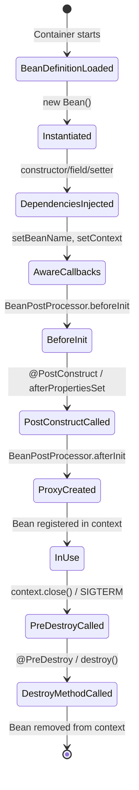

## Keywords in This File
{: .no_toc }

| # | Keyword | Weight |
|---|---|---|
| 1 | [IoC Container and ApplicationContext](#ioc-container-and-applicationcontext) | critical |
| 2 | [Dependency Injection Types](#dependency-injection-types) | high |
| 3 | [Bean Lifecycle](#bean-lifecycle) | high |
| 4 | [Spring Stereotypes and Component Scanning](#spring-stereotypes-and-component-scanning) | medium |
| 5 | [Spring Configuration Styles](#spring-configuration-styles) | high |

---

# IoC Container and ApplicationContext

**Interview Weight:** critical - The foundational Spring
question. Interviewers use this to gate all follow-up
questions. Failing to explain the IoC container is an
immediate signal of shallow Spring knowledge.

---

### 🎯 Model Answer

**30 seconds:**

> The IoC container is the core of Spring. Inversion of
> Control means objects do not create their dependencies -
> the container creates and injects them. ApplicationContext
> is Spring's primary IoC container interface. It reads
> configuration (XML, annotations, or Java config), creates
> all beans in the correct order, injects their dependencies,
> calls lifecycle callbacks, and manages them for the
> application's lifetime.

**3 minutes (Senior):**

> Inversion of Control solves the dependency management
> problem in large object graphs. Without IoC, class A that
> needs class B must instantiate B directly: tight coupling,
> untestable (cannot substitute a mock), and fragile when B
> needs its own dependencies. IoC inverts this: A declares
> that it needs B (via constructor parameter or field), and
> the container is responsible for creating B and providing
> it to A.
>
> ApplicationContext is the full-featured IoC container in
> Spring. It extends BeanFactory (which handles the basic
> create-and-cache bean lifecycle) with enterprise features:
> event publication, internationalization (MessageSource),
> AOP integration, environment abstraction, and resource
> loading. In a Spring Boot application, the ApplicationContext
> is created automatically by `SpringApplication.run()`.
>
> Internally, the ApplicationContext initializes in phases:
> first it reads all bean definitions (from annotations,
> XML, or @Configuration classes), then it creates
> BeanFactoryPostProcessors (which can modify bean
> definitions before instantiation), then it creates
> BeanPostProcessors (which wrap beans after creation -
> this is how `@Transactional` and `@Async` work), then
> it instantiates all singleton beans eagerly, calling
> `@PostConstruct` and `afterPropertiesSet()` on each.
>
> The non-obvious insight: almost all Spring problems are
> container problems - wrong bean scope, missing bean
> definition, circular dependency, or a BeanPostProcessor
> wrapping the wrong proxy. Understanding the container's
> initialization sequence is the foundation for diagnosing
> all of these.

**Framework:** WHAT (container creates + wires objects) →
WHY (eliminates coupling, enables testing) →
HOW (reads definitions → creates BPPs → creates beans →
lifecycle callbacks) → TRADE-OFF (startup cost for
testability and modularity)

*Adapting up:* Discuss BeanFactoryPostProcessor vs
BeanPostProcessor (definition-time vs instance-time), the
ApplicationContext hierarchy (parent/child contexts in Spring
MVC), and how GraalVM AOT compilation changes the container
(static bean definitions, no runtime reflection).

*Adapting down:* IoC = the container creates your objects
and injects their dependencies. ApplicationContext = the
container itself. Three sentences, done.

**Blank Mind Recovery:**

**(1) Restate:** "You are asking about the Spring IoC
container and ApplicationContext."

**(2) First principles:** "Any large object graph needs
something to manage creation and wiring. Without a container,
every class manually creates its dependencies - untestable
and brittle. The container inverts that responsibility."

**(3) Bridge:** "This is like a factory that knows how to
build every object in your application and connects them
together - you just declare what you need, the factory
builds and delivers it."

---

### 📘 Concept Explanation

**What it is:**

The IoC (Inversion of Control) container is a runtime
component that reads bean definitions, creates bean
instances, injects their dependencies, manages their
lifecycle, and destroys them at shutdown. ApplicationContext
is Spring's primary IoC container interface, extending
BeanFactory with enterprise capabilities.

**The problem it solves:**

Without IoC, creating a service with five dependencies
requires either:
- Hard-coded `new` calls inside the constructor (untestable,
  rigid)
- A service locator (hidden coupling, hard to test in isolation)
- Manual factory methods (works but does not scale to dozens
  of components)

IoC externalizes all object creation: the container reads
all component declarations, resolves the dependency graph,
and creates objects in the correct dependency order.
Changing an implementation means changing one configuration
entry, not hunting all `new ConcreteImpl()` call sites.

**How it works:**

```
  APPLICATION CONTEXT INITIALIZATION PHASES

  1. Load Bean Definitions
     (read @Component, @Bean, XML, etc.)
           |
  2. Apply BeanFactoryPostProcessors
     (PropertyPlaceholderConfigurer, etc.)
     [modifies bean definitions]
           |
  3. Create BeanPostProcessors
     (AutowiredAnnotationBeanPostProcessor,
      AopProxyCreatingBeanPostProcessor, etc.)
     [these wrap beans AFTER creation]
           |
  4. Instantiate Singleton Beans (eager)
     a. Create instance (constructor injection)
     b. Inject field/setter dependencies
     c. Call BeanPostProcessor.beforeInit()
     d. Call @PostConstruct / afterPropertiesSet()
     e. Call BeanPostProcessor.afterInit()
        -> @Transactional proxies created HERE
```

```mermaid
flowchart TD
    A[Load Bean Definitions\n@Component scan, @Configuration, XML] --> B[Apply BeanFactoryPostProcessors\nModify definitions, resolve properties]
    B --> C[Instantiate BeanPostProcessors\nAOP proxy creators, Autowired annotation processors]
    C --> D[Instantiate Singleton Beans]
    D --> E[Constructor injection]
    E --> F[Field / Setter injection]
    F --> G[BeanPostProcessor.beforeInitialization]
    G --> H[@PostConstruct / afterPropertiesSet]
    H --> I[BeanPostProcessor.afterInitialization\nAOP proxies created here]
    I --> J[Bean ready in context]
```

> **Diagram walkthrough:** The initialization sequence has two
> critical phases that developers confuse. BeanFactoryPostProcessors
> run before any bean instances are created - they manipulate
> bean definitions (e.g., PropertyPlaceholderConfigurer replaces
> `${property}` placeholders in definitions). BeanPostProcessors
> run after each bean is created, wrapping it in a proxy if
> needed - this is where `@Transactional` and `@Async` proxies
> are created. Understanding this sequence explains why
> `@PostConstruct` executes after injection (step H) and why
> calling a `@Transactional` method from `@PostConstruct` works
> (the proxy is already in place at step I by the time other
> beans use this bean, but `@PostConstruct` itself runs on the
> raw object - a common source of self-invocation bugs).

**The key insight:**

BeanFactory vs ApplicationContext: BeanFactory is the minimal
container (create beans on demand, basic lifecycle). ApplicationContext
extends it with eager singleton initialization, event publication
(`ApplicationEventPublisher`), environment abstraction (`Environment`
and `PropertySources`), and AOP integration. Always use
ApplicationContext. BeanFactory only appears in resource-constrained
environments (old Android, embedded) or as an internal detail.

**When to use it:**

- It is always present in Spring applications; you do not choose
  to use it - you interact with it
- Explicitly obtain beans from context with `ApplicationContext
  .getBean()` only as a last resort (anti-pattern: service locator
  pattern eliminates IoC benefits)
- Extend the container via BeanPostProcessor when you need to
  intercept all beans of a certain type (e.g., add metrics to
  all `@Service` beans)

**When NOT to use it:**

- Simple unit tests: do not start a Spring container for unit
  tests. Use `new MyService(mockDep)` instead. Only start
  a context for integration tests.
- Lambda functions with millisecond startup requirements:
  container initialization adds 2-10 seconds

**Alternatives:**

- Guice (Google) - DI container, no Spring extras
- CDI (Jakarta EE) - standard spec DI container
- Dagger (Android, compile-time) - no reflection

**First-principles derivation:**

Given "hundreds of objects with interconnected dependencies,"
two approaches exist: each object manages its own dependencies
(distributed coupling), or one component manages all
dependencies (centralized IoC). Centralized IoC enables a
single change point for implementation swaps, enables
testability (inject mocks), and enables cross-cutting concerns
via proxy (transactions, security, caching) without modifying
business logic. The cost is a startup phase and the "magic"
of proxy-based features that can confuse developers who do
not know the container model.

---

### 💻 Code Example

**Wrong vs Right: Service locator vs IoC**

```java
// BAD: service locator - hidden dependency, untestable
@Service
public class OrderService {
    public void placeOrder(Order o) {
        // Service locator: hides the dependency,
        // cannot be replaced in tests
        PaymentGateway gw =
            ServiceRegistry.get(PaymentGateway.class);
        gw.charge(o.getPayment());
    }
}
// Test: must set up ServiceRegistry - framework intrusion
// Changing PaymentGateway impl requires changing registry
```

```java
// GOOD: constructor injection - explicit, testable
@Service
public class OrderService {
    private final PaymentGateway gateway;

    // Spring injects; test passes mock
    public OrderService(PaymentGateway gateway) {
        this.gateway = gateway;
    }

    public void placeOrder(Order o) {
        gateway.charge(o.getPayment());
    }
}

// Test - zero Spring context needed:
PaymentGateway mock = Mockito.mock(PaymentGateway.class);
OrderService svc = new OrderService(mock);
svc.placeOrder(testOrder);
verify(mock).charge(any());
```

> **Code walkthrough:** The service locator pattern hides
> the dependency inside the method body. To test it, you must
> configure the registry - coupling the test to the framework.
> The constructor injection version is a plain Java object:
> `new OrderService(mock)` is all a test needs. The container
> still handles creation and injection in production; the
> pattern just makes dependencies visible and substitutable.
> This is the core IoC benefit: testability through explicit
> dependency declaration.

**Internal Mechanism Example: ApplicationContext inspection**

```java
// Programmatic ApplicationContext inspection
// (diagnostic tool - not normal application code)
@Component
public class BeanInspector
    implements ApplicationContextAware {

    private ApplicationContext context;

    @Override
    public void setApplicationContext(
        ApplicationContext ctx) {
        this.context = ctx;
    }

    public void printBeans() {
        String[] beanNames =
            context.getBeanDefinitionNames();
        Arrays.stream(beanNames)
            // filter to your package
            .filter(n -> n.startsWith("com.example"))
            .forEach(name -> {
                Object bean = context.getBean(name);
                // isInterface = proxy wrapping?
                System.out.println(name + " -> "
                    + bean.getClass().getSimpleName()
                    + " proxy="
                    + AopUtils.isAopProxy(bean));
            });
    }
}
```

> **Code walkthrough:** `ApplicationContextAware` is a Spring
> callback interface - the container injects itself into the
> bean after creation. `getBeanDefinitionNames()` lists every
> registered bean name. `AopUtils.isAopProxy(bean)` detects
> whether the bean has been wrapped by a proxy (meaning it has
> `@Transactional`, `@Cacheable`, `@Async`, or another AOP
> advice). This diagnostic tool is useful when a
> `@Transactional` method is not rolling back - you can verify
> whether the bean in the context is the actual proxy or the
> raw class.

---

### 🎓 Answers by Seniority

**Junior / Mid (0-5 years):**

> IoC means the Spring container creates objects and injects
> their dependencies instead of objects creating their own
> dependencies. ApplicationContext is the container that does
> this. It reads annotations and configuration, creates beans,
> injects what each bean needs, and manages the whole lifecycle.
> This makes code testable because you can pass mock dependencies
> instead of real ones.

*Push deeper:* Explain the bean definition loading, lifecycle
callbacks (`@PostConstruct`), and what happens when two beans
depend on each other.

---

**Senior / Staff (5+ years):**

> The IoC container inverts dependency management: instead of
> objects constructing their own collaborators, the container
> constructs everything and wires it together. ApplicationContext
> is Spring's full container: it initializes in phases - load
> definitions, apply post-processors, instantiate singletons.
> The BeanPostProcessor phase is where Spring's AOP proxies are
> created for `@Transactional`, `@Cacheable`, and `@Async` beans.
> Almost all Spring debugging comes back to understanding this
> sequence: a `@Transactional` not rolling back is often because
> the proxy was not created (bean bypassed BeanPostProcessor),
> or because the method was called on the raw object via self-
> invocation. Understanding container initialization is the
> foundation for all Spring debugging.

*Push deeper:* Discuss parent/child ApplicationContext in Spring
MVC, AnnotationConfigApplicationContext vs
GenericWebApplicationContext, and the AOT context preparation
model in Spring 6.

---

### ⚠️ Common Misconceptions

| # | Misconception | Reality | Danger |
|---|---|---|---|
| 1 | `@Autowired` is the only way to inject dependencies | Constructor injection (Spring auto-detects single constructor in Spring 4.3+), setter injection, and field injection all work. Constructor injection is preferred | Exclusive use of field injection makes beans impossible to instantiate outside the container in tests |
| 2 | BeanFactory and ApplicationContext are interchangeable | ApplicationContext is the correct choice for all applications. BeanFactory lacks AOP integration, event publication, and eager singleton initialization | Using BeanFactory directly means `@Transactional` and `@Async` annotations do not work |
| 3 | The container creates a new bean instance for every call | Singleton scope (default) creates ONE instance per container; prototype scope creates a new instance per request. Most beans are singletons | Storing request-specific state in a singleton bean causes data corruption in concurrent requests |
| 4 | `ApplicationContext.getBean()` is the normal way to get beans | Service locator anti-pattern. Normal use is injection - the container provides beans to other beans. `getBean()` is only for bootstrapping (main method) or test utilities | Using `getBean()` throughout code re-introduces the coupling IoC was designed to eliminate |

---

### 🚨 Failure Modes and Diagnosis

**Failure 1 - NoSuchBeanDefinitionException**

Symptom: `NoSuchBeanDefinitionException: No qualifying bean
of type 'com.example.MyService' available`.

Root cause: The bean was not registered in the context.
Common causes: missing `@Component`/`@Service`/`@Repository`
annotation, the class is outside the component scan base
package, or the bean is defined in a `@Configuration` class
that is not imported.

Diagnostic steps:
1. Check that the class has the correct stereotype annotation.
2. Check that `@SpringBootApplication` (or `@ComponentScan`)
   is in a parent package of the bean class.
3. Add `logging.level.org.springframework=DEBUG` - Boot logs
   every scanned component and every registered bean during
   startup.
4. Check if the bean is conditional: `@ConditionalOnProperty`
   may have disabled it.

Fix: Add the correct annotation, adjust the base package, or
import the missing configuration class.

---

**Failure 2 - Circular dependency (constructor injection)**

Symptom: `The dependencies of some of the beans in the
application context form a cycle: A -> B -> A`.

Root cause: Bean A requires B in its constructor; Bean B
requires A in its constructor. Spring cannot satisfy either
without the other existing first.

Diagnostic: The error message names the cycle explicitly.

Fix options (in order of preference):
1. Refactor the design - a circular dependency usually
   indicates an architectural problem. Extract shared logic
   into a third bean C that both A and B depend on.
2. Switch to setter injection on one of the beans. Spring
   can create A without B (null field), then create B
   injecting A, then set A's B field.
3. Annotate one injection point with `@Lazy` - Spring
   creates a proxy placeholder that resolves the real bean
   lazily.

Avoid: `spring.main.allow-circular-references=true` (Spring
Boot 2.6+ disables circular references by default for good
reason). Enabling it masks the design problem.

---

### 🎯 Interview Deep-Dive

| Preparation time | Recommended approach |
|---|---|
| 15 min | Define IoC and ApplicationContext in two sentences each |
| 30 min | Add the initialization phases diagram |
| 45 min | Add BeanPostProcessor role in AOP proxy creation |
| 1 hour | Add circular dependency diagnosis + fix options |
| 2 hours | Study BeanDefinition, BeanFactoryPostProcessor source code |

---

**[JUNIOR] Q1: What is Inversion of Control?** [CONCEPTUAL]

*Why they ask:* The absolute foundation. Cannot discuss
Spring without understanding IoC.

*Likely follow-up:* "What is the difference between IoC
and DI?"

Inversion of Control is a design principle where the control
of object creation and lifecycle is handed to a container or
framework rather than the object itself. The "control" being
inverted is: who creates objects and who wires their
dependencies.

In traditional code: `OrderService` creates its own
`PaymentGateway` instance - it controls its dependencies.
With IoC: the container creates `PaymentGateway`, creates
`OrderService`, and injects `PaymentGateway` into it. The
control is inverted from the object to the container.

Dependency Injection (DI) is the specific technique Spring
uses to implement IoC. DI means: declare what you need
(via constructor parameter, field, or setter), and have
it provided from outside. IoC is the broader principle;
DI is the implementation mechanism.

*What separates good from great:* Distinguishing IoC (the
principle: external control of lifecycle) from DI (the
specific technique: external provision of dependencies).
And knowing that IoC could be implemented with a service
locator instead of DI - but DI is more testable because
dependencies are explicit.

---

**[JUNIOR] Q2: What is the difference between BeanFactory
and ApplicationContext?** [COMPARISON]

*Why they ask:* Tests depth of container knowledge.

*Likely follow-up:* "When would you use BeanFactory directly?"

BeanFactory is the root interface of Spring's container
hierarchy. It provides the basic contract: get a bean by
name, get a bean by type, check if a bean exists. Beans
are created lazily by default (on first `getBean()` call).

ApplicationContext extends BeanFactory and adds:
- **Eager singleton initialization**: all singleton beans
  are created at startup, not on first use. Startup failure
  is immediate (not hidden until first request).
- **Event publication**: `publishEvent()` dispatches
  ApplicationEvents to registered listeners.
- **MessageSource**: internationalization support.
- **ResourceLoader**: unified resource loading (classpath,
  file system, URL).
- **Environment**: property sources and profile support.
- **AOP integration**: `@Transactional`, `@Async`,
  `@Cacheable` require ApplicationContext. They rely on
  BeanPostProcessors that are only registered in
  ApplicationContext implementations.

In practice: always use ApplicationContext. BeanFactory
is rarely used directly - it is an internal detail of
ApplicationContext's implementation, or appears in very
constrained environments (old Android).

*What separates good from great:* Knowing that
`@Transactional` does NOT work with bare BeanFactory,
because the `InfrastructureAdvisorAutoProxyCreator`
BeanPostProcessor is only registered by ApplicationContext.

---

**[MID] Q3: What happens during ApplicationContext
initialization?** [MECHANISM]

*Why they ask:* Tests deep container knowledge. Required
for diagnosing startup failures and AOP problems.

*Likely follow-up:* "When are BeanPostProcessors created
vs regular beans?"

ApplicationContext initialization follows a strict sequence:

Phase 1 - Bean definition loading: Spring scans all
`@Component` annotated classes, reads all `@Configuration`
classes, and parses XML (if used). Every bean is registered
as a `BeanDefinition` object describing its class, scope,
dependencies, and init/destroy methods. No instances yet.

Phase 2 - BeanFactoryPostProcessor execution: Beans
implementing `BeanFactoryPostProcessor` run now, before
any bean instances are created. `PropertyPlaceholder
Configurer` replaces `${property}` placeholders in bean
definitions. `ConfigurationClassPostProcessor` processes
`@Configuration` classes and registers their `@Bean` methods.

Phase 3 - BeanPostProcessor instantiation: Beans implementing
`BeanPostProcessor` are created first, before regular beans.
These include `AutowiredAnnotationBeanPostProcessor`
(handles `@Autowired`), `CommonAnnotationBeanPostProcessor`
(handles `@PostConstruct`, `@PreDestroy`), and
`AnnotationAwareAspectJAutoProxyCreator` (creates AOP
proxies for `@Transactional`, `@Cacheable`, etc.).

Phase 4 - Singleton bean instantiation: All remaining
singleton beans are created eagerly. For each:
constructor injection → field/setter injection →
`BeanPostProcessor.postProcessBeforeInitialization()` →
`@PostConstruct` / `afterPropertiesSet()` →
`BeanPostProcessor.postProcessAfterInitialization()`
(AOP proxy creation happens here).

*What separates good from great:* Knowing that AOP proxies
are created in `postProcessAfterInitialization()` - AFTER
`@PostConstruct`. This means `@PostConstruct` runs on
the raw bean, not the proxy. Calling `this.transactional
Method()` inside `@PostConstruct` calls the raw method
without a transaction.

---

**[SENIOR] Q4: How does Spring handle a circular dependency
between two beans?** [DEBUGGING]

*Why they ask:* Very common interview question that tests
both container knowledge and design judgment.

*Likely follow-up:* "Why is circular dependency considered
a design problem?"

Spring handles singleton circular dependencies through a
three-level cache (only for field/setter injection):

1. `singletonObjects` (level 1): fully initialized beans.
2. `earlySingletonObjects` (level 2): partially constructed
   beans (pre-initialization), exposed for resolution.
3. `singletonFactories` (level 3): factories that can create
   a partially constructed bean on demand.

When A needs B and B needs A (with setter injection):
Spring starts creating A, puts a factory in the level-3 cache,
then starts creating B. B's injection requires A - Spring
finds A in the level-3 cache, creates an early reference
(partial A), and finishes B. Then A's injection of B
completes normally. Finally A's initialization completes.

This mechanism ONLY works for singleton beans with setter
or field injection. Constructor injection circular dependencies
always fail (Spring cannot create A without B, and B without
A - there is no early reference for constructor injection).

Spring Boot 2.6+ disabled this automatic resolution by
default. The fix is required:
1. Redesign to eliminate the cycle (extract C that both use).
2. Use `@Lazy` on one injection point (deferred creation).
3. Use setter injection on one side (not recommended for
   other reasons - prefer constructor).

*What separates good from great:* Explaining the three-level
cache mechanism and why it only works for setter/field
injection - and recommending design refactoring over enabling
the circular-dependency workaround.

---

**[STAFF] Q5: How would you implement a custom BeanPostProcessor
to add metrics to all service beans?** [ARCHITECTURE]

*Why they ask:* Tests advanced container extension knowledge.

*Likely follow-up:* "What is the difference between a
BeanPostProcessor and a BeanFactoryPostProcessor?"

A BeanPostProcessor intercepts every bean after it is created.
To add metrics (measure method execution time) to all `@Service`
beans:

```java
@Component
public class MetricsBeanPostProcessor
    implements BeanPostProcessor {

    private final MeterRegistry registry;

    public MetricsBeanPostProcessor(
        MeterRegistry registry) {
        this.registry = registry;
    }

    @Override
    public Object postProcessAfterInitialization(
        Object bean, String beanName) {
        // Only instrument @Service beans
        if (!bean.getClass().isAnnotationPresent(
            Service.class)) {
            return bean; // unchanged
        }
        // Create a timing proxy
        return Proxy.newProxyInstance(
            bean.getClass().getClassLoader(),
            bean.getClass().getInterfaces(),
            (proxy, method, args) -> {
                Timer timer = Timer.builder(
                    "service.method.duration")
                    .tag("class", beanName)
                    .tag("method", method.getName())
                    .register(registry);
                return timer.recordCallable(
                    () -> method.invoke(bean, args));
            });
    }
}
```

> **Code walkthrough:** The BPP implements
> `postProcessAfterInitialization()` which runs after every
> bean is fully initialized. It checks for `@Service` annotation
> (target only services, not repositories or infrastructure).
> For matching beans, it creates a JDK dynamic proxy that wraps
> every method call in a Micrometer Timer. Note: this only
> works if the service class implements an interface (JDK proxy
> requirement). For classes without interfaces, use CGLIB:
> Spring's `ProxyFactory.getProxy(bean.getClass())`.

This approach is exactly how Spring's own AOP works:
`AnnotationAwareAspectJAutoProxyCreator` is a
BeanPostProcessor that wraps `@Transactional` and
`@Cacheable` beans in proxies. Your custom BPP follows
the same pattern.

*What separates good from great:* Noting the JDK proxy
limitation (interfaces required) vs CGLIB (works on
classes), and understanding that you are implementing the
same mechanism Spring uses for `@Transactional` - not
fighting the framework.

| Interviewer Type | Emphasis |
|---|---|
| Technical Panel | Lead with the initialization phases sequence. Use precise terminology (BeanPostProcessor vs BeanFactoryPostProcessor). |
| Hiring Manager | Lead with the testing benefit: constructor injection makes beans testable without a container. |
| Bar Raiser | Lead with the three-level singleton cache and why circular dependencies are design problems. |
| Peer Engineer | "The first Spring thing that clicks is the container initialization phases - once you see it, every Spring problem makes sense..." |

---

---

# Dependency Injection Types

**Interview Weight:** high - One of the top 5 Spring questions
at every level. Interviewers use this to gauge practical
Spring knowledge and whether you understand why constructor
injection is preferred. Expect follow-ups on testability
and circular dependencies.

---

### 🎯 Model Answer

**30 seconds:**

> Spring supports three injection types. Constructor injection:
> dependencies are declared as constructor parameters - the
> recommended approach. Field injection (`@Autowired` on a
> field): convenient but makes beans untestable outside the
> container. Setter injection: dependencies set via setters
> after construction - for optional dependencies. Constructor
> injection is preferred because it makes dependencies explicit,
> supports immutability (final fields), and requires no Spring
> container for unit tests.

**3 minutes (Senior):**

> Constructor injection should be the default in all Spring
> code. The practical reasons are compelling: with constructor
> injection, a `@Service` can be tested with `new MyService
> (mockDep1, mockDep2)` - no Spring container needed. With
> field injection, `@Autowired private Repo repo`, the field
> is null unless Spring has injected it - you either start a
> Spring context or use `ReflectionTestUtils.setField()`.
>
> Constructor injection also forces design honesty. If a class
> has seven constructor parameters, that is a signal the class
> has too many responsibilities. Field injection hides this:
> you can add a seventh `@Autowired` field without noticing
> the growing complexity. Spring 4.3+ added a feature that
> removes even the `@Autowired` annotation requirement: if a
> class has exactly one constructor, Spring injects it without
> any annotation.
>
> Setter injection is legitimate for optional dependencies -
> a plugin system where the plugin may or may not be present.
> Mark optional with `@Autowired(required = false)`. For
> required dependencies, always use constructor injection.
>
> The only situation where field injection may be acceptable
> is in `@SpringBootTest` test classes where you are
> intentionally using the Spring context and the test itself
> is not a POJO. But even there, constructor injection works
> fine with `@Autowired` on the test constructor.

**Framework:** TYPES (constructor, field, setter) →
PREFERRED (constructor: final fields, testable, explicit) →
AVOID (field: null outside container, hides complexity) →
WHEN-SETTER (optional deps, framework integration)

*Adapting up:* Discuss `@Qualifier` and `@Primary` for
ambiguous injection, `@Lazy` for deferred injection,
`ObjectProvider<T>` for programmatic conditional injection,
and how Spring 6 + GraalVM AOT prefers constructor injection
(field injection requires reflection at runtime).

*Adapting down:* Use constructor injection. Avoid
`@Autowired` on fields. That is the two-sentence answer.

**Blank Mind Recovery:**

**(1) Restate:** "You are asking about the different ways
Spring can inject dependencies."

**(2) First principles:** "Dependency injection needs to
set a value into an object. The three places you can set
a value are: the constructor, a field, or a setter method."

**(3) Bridge:** "This is like the difference between passing
a configuration to a function upfront (constructor) vs setting
it on an object after creation (field/setter). Upfront is
more explicit and predictable."

---

### 📘 Concept Explanation

**What it is:**

Three mechanisms by which Spring's IoC container provides
a bean with its dependencies:

1. Constructor injection: dependencies as constructor params
2. Field injection: `@Autowired` directly on a field
3. Setter injection: `@Autowired` on a setter method

**The problem it solves:**

Each mechanism makes the container's job the same (provide
the dependency) but differs in when injection happens,
testability outside the container, and what the API
communicates to callers.

**How it works:**

Constructor injection: Spring calls the constructor with
resolved dependencies. Bean cannot exist without all
required dependencies - impossible to create a partially
initialized bean. Fields declared `final`.

Field injection: Spring uses reflection (`field.set(bean,
value)`) after construction. Bean can exist with null fields
if Spring is absent. Spring 4.3+ handles this via
`AutowiredAnnotationBeanPostProcessor`.

Setter injection: Spring calls the setter method after
construction. Bean can be created without the dependency
and have it injected later. Enables optional dependencies
via `@Autowired(required = false)`.

```
  INJECTION TIMING:

  CONSTRUCTOR: [create] -> [inject] (atomic)
                              ^
                    must have all deps at creation time

  FIELD:       [create] -> [BPP runs] -> [inject via reflection]
                                                ^
                                       bean exists before injection

  SETTER:      [create] -> [BPP runs] -> [call setter]
                                                ^
                                       bean exists before injection
```

**The key insight:**

Constructor injection is the only type that creates an
immutable, fully initialized object. Field and setter
injection create an object first, then configure it - a
window exists where the object is partially constructed.
This is not just a testing inconvenience; it is an object
design issue. A class that can exist without its dependencies
is a class with optional invariants. Required dependencies
should never be optional.

**When to use each:**

- Constructor injection: always, for required dependencies
- Setter injection: optional dependencies, or when the
  dependency is overridable after construction
- Field injection: only in tests annotated with
  `@SpringBootTest` where IoC behavior is deliberately tested

**When NOT to use field injection:**

- Production beans: makes them untestable without container
- Beans that should be usable in non-Spring contexts
- Any bean where you want to verify required-dependency
  invariants at construction time

**Alternatives:**

- `@Inject` (Jakarta EE standard annotation): equivalent
  to Spring's `@Autowired` for constructor/field/setter;
  works with Spring when `javax.inject` is on classpath
- `ObjectProvider<T>`: programmatic injection with lazy
  resolution and optional semantics

**First-principles derivation:**

An object's collaborators are part of its behavioral contract.
Required collaborators should be visible in the public API
(constructor signature). Optional collaborators should be
explicit (setter or builder). Hiding them inside a field
annotated with a framework annotation makes the contract
implicit and framework-specific. Constructor injection is
the most honest representation of an object's contract.

---

### 💻 Code Example

**Wrong vs Right: Field injection vs constructor injection**

```java
// BAD: field injection - untestable, hides dependencies
@Service
public class InvoiceService {
    @Autowired
    private CustomerRepo customerRepo;  // null outside Spring

    @Autowired
    private PdfGenerator pdfGenerator;  // null outside Spring

    @Autowired
    private EmailSender emailSender;   // null outside Spring
    // 7 @Autowired fields -> design smell

    public void generateInvoice(Long customerId) {
        Customer c = customerRepo.findById(customerId)
            .orElseThrow();
        byte[] pdf = pdfGenerator.generate(c);
        emailSender.send(c.getEmail(), pdf);
    }
}

// Test requires Spring context or ReflectionTestUtils -
// both are slow and fragile
```

```java
// GOOD: constructor injection - testable, explicit
@Service
public class InvoiceService {
    private final CustomerRepo customerRepo;
    private final PdfGenerator pdfGenerator;
    private final EmailSender emailSender;

    // Spring 4.3+: @Autowired not needed for 1 constructor
    public InvoiceService(
        CustomerRepo customerRepo,
        PdfGenerator pdfGenerator,
        EmailSender emailSender) {
        this.customerRepo = customerRepo;
        this.pdfGenerator = pdfGenerator;
        this.emailSender = emailSender;
    }
    // ... same business logic
}

// Unit test - no Spring, no context, runs in <1ms:
InvoiceService svc = new InvoiceService(
    Mockito.mock(CustomerRepo.class),
    Mockito.mock(PdfGenerator.class),
    Mockito.mock(EmailSender.class)
);
```

> **Code walkthrough:** The field injection version has three
> fields that are null when the object is created by `new` -
> only Spring's reflection-based injection populates them.
> Any test must start a Spring context or use
> `ReflectionTestUtils.setField()`, adding hundreds of
> milliseconds to each test run. The constructor injection
> version passes all dependencies at construction time:
> the object is fully initialized as soon as `new` returns.
> Unit tests pass mocks directly. Spring 4.3+ requires no
> `@Autowired` annotation when there is exactly one constructor.

**Production Example: Qualifier for ambiguous injection**

```java
// Two PaymentGateway implementations:
@Service("stripe")
public class StripeGateway implements PaymentGateway {...}

@Service("paypal")
public class PaypalGateway implements PaymentGateway {...}

// BAD: Spring throws NoUniqueBeanDefinitionException
@Service
public class CheckoutService {
    // Two beans of type PaymentGateway - which one?
    public CheckoutService(PaymentGateway gateway) {...}
}

// GOOD option 1: @Qualifier
@Service
public class CheckoutService {
    public CheckoutService(
        @Qualifier("stripe") PaymentGateway gateway) {
        this.gateway = gateway;
    }
}

// GOOD option 2: @Primary on the default implementation
@Service
@Primary  // used when no @Qualifier specified
public class StripeGateway implements PaymentGateway {...}

// GOOD option 3: Map injection (all implementations)
@Service
public class PaymentRouter {
    private final Map<String, PaymentGateway> gateways;
    // Spring injects: {"stripe" -> Stripe, "paypal" -> PP}
    public PaymentRouter(
        Map<String, PaymentGateway> gateways) {
        this.gateways = gateways;
    }
    public void route(String method, Payment p) {
        gateways.get(method).charge(p);
    }
}
```

> **Code walkthrough:** When multiple beans of the same type
> exist, Spring cannot choose without help. `@Qualifier` names
> the exact bean to inject. `@Primary` marks one implementation
> as the default when no qualifier is specified. The Map
> injection pattern (option 3) is elegant for strategy patterns:
> Spring constructs a map keyed by bean name containing all
> implementations - a clean open/closed extension point.

---

### 🎓 Answers by Seniority

**Junior / Mid (0-5 years):**

> Spring supports three injection types: constructor, field,
> and setter. Constructor injection is recommended: you declare
> dependencies as constructor parameters and Spring provides
> them. Field injection uses `@Autowired` directly on a field
> and is convenient but makes testing harder because fields
> are null outside the Spring container. Setter injection is
> for optional dependencies. I always use constructor injection
> for required dependencies.

*Push deeper:* Explain why constructor injection is preferred
for testability and what happens when you try to test a
field-injected bean without Spring.

---

**Senior / Staff (5+ years):**

> Constructor injection is the only correct choice for required
> dependencies. The reason is not just style - it is testability
> and object design. A bean with constructor injection is a plain
> Java object: `new MyService(mockDep)` works in tests without
> Spring. A bean with field injection requires the Spring
> container or reflection hacks to test. At scale, this doubles
> test run times. The secondary benefit: final fields guarantee
> the bean is immutable and fully initialized. Spring 4.3+
> eliminates even the `@Autowired` annotation for single-
> constructor classes. I also use `@Qualifier` vs `@Primary`
> strategically: `@Primary` for "the default when context is
> ambiguous," `@Qualifier` for "this specific call must use
> this specific implementation." For strategy patterns, Map
> injection is more extensible than either.

*Push deeper:* Discuss `ObjectProvider<T>` for lazy/optional
injection, `@Lazy` for deferred proxy creation, and the
injection implications of `@Scope("prototype")` beans injected
into `@Scope("singleton")` beans.

---

### ⚖️ Comparison Table

| Injection Type | Fields final? | Testable without container? | Hides design smells? | Use for |
|---|---|---|---|---|
| Constructor | Yes | Yes - `new Bean(mock)` | No - 7 params is obvious | Required dependencies (default) |
| Field (`@Autowired`) | No | No - null outside Spring | Yes - 20 fields looks fine | Avoid in production beans |
| Setter | No | Partially - setter can be called | No | Optional/overridable dependencies |
| `@Inject` (Jakarta) | Yes (constructor) | Yes | Same as Spring DI | JakartaEE/portable code |

**The deciding factor:** Required dependencies always use
constructor injection. The question is purely whether a
dependency is required. If a bean must have it to function,
the constructor must demand it.

---

### ⚠️ Common Misconceptions

| # | Misconception | Reality | Danger |
|---|---|---|---|
| 1 | `@Autowired` is required on every injected field | Spring 4.3+ automatically uses the single constructor of a class without any annotation | Unnecessary `@Autowired` annotations clutter code; teams add them believing they are required |
| 2 | Field injection is fine for testing because you can use `ReflectionTestUtils.setField()` | This is a workaround, not a solution. It makes tests fragile (refactoring field names breaks tests silently), slow, and framework-dependent | A codebase where all tests use `ReflectionTestUtils` has hidden constructor-injection debt |
| 3 | Setter injection is always optional injection | Setter injection can inject required dependencies (without `required = false`) - it is about timing, not optionality. But it should only be used for genuinely optional dependencies | Marking required dependencies as setter-injected creates a window where the bean is partially constructed |
| 4 | Using `@Qualifier` with field injection is as clean as with constructor injection | It is functionally equivalent, but field injection still lacks testability. The qualifier annotation on a constructor parameter is explicit API; on a field it is hidden convention | Code reviews miss field-injected `@Qualifier` dependencies; constructor parameters are impossible to miss |

---

### 🚨 Failure Modes and Diagnosis

**Failure 1 - NullPointerException on `@Autowired` field in test**

Symptom: A service method throws NPE on an `@Autowired` field
in a unit test. The field is null.

Root cause: The service was instantiated with `new ServiceClass()`
in the test. `@Autowired` field injection only works when Spring
creates the bean. Fields remain null when the object is created
directly.

Diagnostic: Check the test - if it uses `new`, not `@Autowired`
or `@MockBean`, field injection will not happen.

Fix: Switch the production bean to constructor injection.
The test becomes `new ServiceClass(mockDep)`. No Spring
context needed, no reflection magic.

---

**Failure 2 - NoUniqueBeanDefinitionException**

Symptom: `NoUniqueBeanDefinitionException: expected single
matching bean but found 2: stripe, paypal`.

Root cause: Spring found multiple beans of the requested type
and no disambiguation via `@Primary` or `@Qualifier`.

Diagnostic: Search for all classes implementing the
injected type. Check if any have `@Primary`.

Fix options: Add `@Primary` to the default implementation,
add `@Qualifier("beanName")` at the injection point, or
use Map injection to receive all implementations.

---

### 🎯 Interview Deep-Dive

| Preparation time | Recommended approach |
|---|---|
| 15 min | Name the 3 injection types and why constructor is preferred |
| 30 min | Add the testability argument with a concrete example |
| 45 min | Add @Qualifier vs @Primary and when each applies |
| 1 hour | Add Map injection pattern for strategy pattern |
| 2 hours | Study ObjectProvider, @Lazy injection, and prototype-in-singleton problem |

---

**[JUNIOR] Q1: What is the difference between constructor
injection and field injection?** [COMPARISON]

*Why they ask:* Tests practical Spring knowledge and understanding
of the preferred pattern.

*Likely follow-up:* "Which one do you prefer and why?"

Constructor injection declares dependencies as constructor
parameters. Spring calls the constructor with resolved values.
The bean is fully initialized when the constructor returns.
Fields can be `final`.

Field injection uses `@Autowired` (or `@Inject`) directly on
a field. Spring uses reflection to set the field value after
construction. The bean exists in a partially initialized state
between construction and injection.

The practical difference is testability:

Constructor injection allows `new MyService(mockDep)` - no
Spring container needed. Field injection requires either a
Spring context or `ReflectionTestUtils.setField(bean, "dep",
mock)`. The latter is fragile: if the field is renamed, the
string in `setField()` silently stops working until the test
runs.

I use constructor injection exclusively for production beans.
The extra code (constructor declaration) is offset by the
testing benefit and the design honesty it enforces.

*What separates good from great:* Mentioning that Spring 4.3+
eliminates the `@Autowired` annotation requirement for single-
constructor classes, making constructor injection zero-boilerplate.

---

**[MID] Q2: When would you use setter injection over
constructor injection?** [TRADE-OFF]

*Why they ask:* Tests nuanced understanding beyond the "always
use constructor injection" rule.

*Likely follow-up:* "Are there cases where circular dependencies
require setter injection?"

Setter injection is legitimate in two scenarios:

First, genuinely optional dependencies: a plugin system where
a `ReportExporter` may or may not have a `PdfPlugin` installed:
`@Autowired(required = false) public void setPdf(PdfPlugin p)`.
If no `PdfPlugin` bean exists, Spring does not call the setter
and the field remains null. The service works without it.

Second, circular dependencies (last resort): when two beans
genuinely must reference each other and refactoring is not
possible, setter injection on one side allows the three-level
singleton cache to resolve the cycle. Spring creates A, caches
the early reference, creates B (injecting the early A), then
completes A by calling its setter with B. This works but
signals a design problem.

For all required dependencies, constructor injection is
superior: the constructor signature documents exactly what
the class needs to function, and the compiler enforces it.

*What separates good from great:* Acknowledging that setter
injection for circular dependencies is a smell, not a solution,
and recommending refactoring to extract a shared C component
that both A and B depend on.

---

**[SENIOR] Q3: Why does injecting a prototype-scoped bean
into a singleton-scoped bean cause a problem, and how do
you fix it?** [MECHANISM]

*Why they ask:* Tests deep scope and injection interaction
knowledge. A common production mistake.

*Likely follow-up:* "What is @Lookup?"

The problem: a singleton bean is created once. If it has a
constructor-injected prototype bean, the prototype instance
is created once during the singleton's construction and used
forever. The prototype effectively becomes a singleton - a
single shared instance for all uses of the singleton, which
defeats the purpose of prototype scope.

The symptoms appear as state corruption: a prototype bean
that accumulates request-specific state in a singleton parent
causes cross-request data leakage.

Fix option 1 - `ApplicationContext.getBean()` each time:
Inject `ApplicationContext` and call `ctx.getBean(Prototype
.class)` each time you need a fresh instance. Works but is
the service-locator anti-pattern.

Fix option 2 - `@Lookup` annotation:

```java
@Service
public abstract class OrderProcessor {
    // Spring overrides this method to return a new
    // prototype instance each time it is called.
    // Class must be non-final; method must be non-final.
    @Lookup
    protected abstract OrderContext createContext();

    public void process(Order o) {
        OrderContext ctx = createContext(); // fresh instance
        ctx.setOrder(o);
        ctx.execute();
    }
}
```

Fix option 3 - `ObjectProvider<T>` (cleanest):

```java
@Service
public class OrderProcessor {
    private final ObjectProvider<OrderContext> ctxProvider;
    public OrderProcessor(
        ObjectProvider<OrderContext> ctxProvider) {
        this.ctxProvider = ctxProvider;
    }
    public void process(Order o) {
        OrderContext ctx = ctxProvider.getObject(); // fresh
        ctx.setOrder(o);
        ctx.execute();
    }
}
```

`ObjectProvider` is the cleanest solution: injectable through
constructor, type-safe, no abstract class required, supports
optional beans and prototype resolution.

*What separates good from great:* Knowing all three solutions
and recommending `ObjectProvider` as the modern approach,
while explaining why the naive constructor injection silently
fails (prototype becomes singleton).

---

**[STAFF] Q4: How does Spring 6 with GraalVM AOT compilation
change dependency injection?** [ARCHITECTURE]

*Why they ask:* Tests awareness of the frontier of Spring's
evolution and the implications for DI patterns.

*Likely follow-up:* "What is the Spring AOT engine?"

GraalVM native image compilation (ahead-of-time) performs
closed-world analysis: all code paths must be known at build
time. Reflection at runtime is restricted - you must provide
reflection hints explicitly.

Spring's IoC container traditionally relies on runtime
reflection for:
- Field injection (`field.set(bean, value)`)
- Reading `@Autowired`, `@PostConstruct` via reflection
- Dynamic proxy creation (CGLIB for non-interface beans)

For GraalVM native compilation, Spring 6 introduces the
AOT engine. It runs at build time and:
1. Analyzes the application context
2. Generates static code for bean registration and wiring
   (instead of reflective lookup)
3. Generates reflection hints for remaining uses
4. Generates proxy configuration for CGLIB

Implications for DI:
- Constructor injection works perfectly (no reflection needed)
- Field injection requires generated reflection hints
  (works but adds build-time overhead)
- `@Transactional` proxies are generated at build time
  (not at runtime)

The direction: constructor injection becomes even more
strongly preferred in the AOT world. It requires no reflection
metadata. Field injection requires additional hint generation.
For teams planning GraalVM native deployment, field injection
should be eliminated entirely.

*What separates good from great:* Connecting the DI type
preference (constructor > setter > field) to the runtime
mechanism (no reflection > setter reflection > field
reflection) and to the GraalVM constraint (no runtime
reflection without hints).

| Interviewer Type | Emphasis |
|---|---|
| Technical Panel | Lead with testability argument and Spring 4.3+ single-constructor autowiring. |
| Hiring Manager | Lead with test speed: constructor injection eliminates Spring context startup in unit tests. |
| Bar Raiser | Lead with @Lookup, ObjectProvider, and the prototype-in-singleton failure mode. |
| Peer Engineer | "The code review I do that adds the most value: changing @Autowired fields to constructor injection..." |

---

---

# Bean Lifecycle

**Interview Weight:** high - The second most common Spring
internals question. Interviewers use this to distinguish
candidates who use Spring from those who understand it.
Required for diagnosing initialization order bugs.

---

### 🎯 Model Answer

**30 seconds:**

> A Spring bean's lifecycle has three main phases: initialization,
> use, and destruction. During initialization: the container
> creates the bean, injects dependencies, calls
> `@PostConstruct` or `afterPropertiesSet()` for setup work.
> During use: the bean handles requests. During destruction:
> `@PreDestroy` or `destroy()` runs for cleanup (connections,
> threads). Understanding the lifecycle is essential because
> many common bugs happen at the phase boundaries.

**3 minutes (Senior):**

> The bean lifecycle integrates with the container in two ways:
> through lifecycle annotations (`@PostConstruct`,
> `@PreDestroy`) and through framework interfaces
> (`InitializingBean`, `DisposableBean`, `BeanNameAware`,
> `ApplicationContextAware`).
>
> The order within initialization matters: constructor runs
> first, then dependency injection, then `@PostConstruct`.
> This means `@PostConstruct` can safely use injected
> dependencies - they are already set. But it cannot call
> a `@Transactional` method on `this` and expect a
> transaction, because the AOP proxy is not `this` - the
> raw bean calls `this.method()` directly, bypassing the proxy.
>
> For destruction, `@PreDestroy` runs when the
> ApplicationContext is closed (Spring Boot app shutdown,
> or `context.close()`). In production, this is where you
> drain in-flight requests, flush caches, close database
> connections, and stop background threads. A missing
> `@PreDestroy` on a `ScheduledExecutorService` is a classic
> source of "thread still running after shutdown" bugs.
>
> The practical gotcha: prototype-scoped beans are not
> tracked by the container after creation. `@PreDestroy`
> never runs for prototype beans. You are responsible for
> cleanup.

**Framework:** INIT (new → inject → @PostConstruct) →
USE (handle requests, calls through proxy) →
DESTROY (@PreDestroy → destroy() → container closes)
→ GOTCHAS (self-invocation, prototype no-destroy,
@PostConstruct on proxy vs raw)

*Adapting up:* Discuss `SmartLifecycle` for ordered
startup/shutdown across beans, `ApplicationContext
.registerShutdownHook()` for JVM shutdown integration,
and the distinction between context.close() and a Docker
SIGTERM signal.

*Adapting down:* @PostConstruct = runs after injection,
good for setup. @PreDestroy = runs before shutdown, good
for cleanup. That is the two-sentence lifecycle.

**Blank Mind Recovery:**

**(1) Restate:** "You are asking about the Spring bean
lifecycle - what happens from creation to destruction."

**(2) First principles:** "Any managed object has three
phases: initialization (setup), active use, and cleanup.
Spring's lifecycle callbacks let you hook into each phase."

**(3) Bridge:** "This is like Java's servlet lifecycle:
init(), service(), destroy() - but for any Spring bean,
not just servlets."

---

### 📘 Concept Explanation

**What it is:**

The Spring bean lifecycle is the sequence of events from
bean definition to bean destruction, including container
callbacks at each phase. The lifecycle applies to beans
in the ApplicationContext - primarily singleton-scoped beans.

**The problem it solves:**

Enterprise beans frequently need setup work after injection
(opening database connection pools, loading caches,
starting background threads) and cleanup before shutdown
(closing connections, flushing buffers, gracefully stopping
threads). Without lifecycle callbacks, you would need to
call `init()` and `destroy()` manually in application code,
coupling business code to lifecycle management.

**How it works:**

```
  SINGLETON BEAN LIFECYCLE

  1. Container reads @Component / @Bean definition
  2. Container creates bean instance via constructor
  3. Dependencies injected (constructor, then field/setter)
  4. BeanNameAware.setBeanName() called (if implemented)
  5. BeanFactoryAware.setBeanFactory() called
  6. ApplicationContextAware.setApplicationContext() called
  7. BeanPostProcessor.postProcessBeforeInitialization()
  8. InitializingBean.afterPropertiesSet() called
     @PostConstruct method called
  9. BeanPostProcessor.postProcessAfterInitialization()
     -> @Transactional / @Cacheable proxies created HERE
  10. Bean is in use (application runtime)
  --- shutdown signal ---
  11. @PreDestroy method called
  12. DisposableBean.destroy() called
```



> **Diagram walkthrough:** The lifecycle flows through two
> distinct zones: initialization (steps 1-9) and destruction
> (steps 11-12). The critical boundary for developers is
> between steps 8 and 9: `@PostConstruct` runs on the raw
> bean (step 8), then `BeanPostProcessor.postProcessAfter
> Initialization()` wraps the bean in an AOP proxy (step 9).
> After step 9, every reference to this bean in the context
> is the proxy, not the raw object. Self-invocation from
> `@PostConstruct` (`this.method()`) calls the raw object,
> bypassing the proxy. This is the most common bean lifecycle
> bug in Spring applications.

**The key insight:**

`@PostConstruct` runs on the raw bean, before AOP proxies
are created. Calling `this.transactionalMethod()` from
`@PostConstruct` executes without a transaction. The AOP
proxy is created in `postProcessAfterInitialization()`,
which runs AFTER `@PostConstruct`. After that, all external
callers call through the proxy - but `this` inside the bean
always refers to the raw object.

**When to use @PostConstruct:**

- Loading data from a database into a cache
- Establishing a connection to an external service
- Starting a background thread or scheduled task
- Validating configuration properties at startup

**When NOT to use @PostConstruct:**

- Code that must run in a transaction (use a separate bean
  and inject it, or trigger via ApplicationReadyEvent)
- Code with circular dependencies on beans not yet fully
  initialized (difficult to guarantee order)

**Alternatives:**

- `ApplicationReadyEvent` listener: fires after the full
  context is initialized AND embedded server is started.
  Safe for transactional code. Use `@EventListener(Application
  ReadyEvent.class)` instead of `@PostConstruct` for
  data loading with `@Transactional`.
- `SmartLifecycle` for ordered startup across multiple beans

**First-principles derivation:**

A managed object needs initialization after setup and
cleanup before teardown. These cannot happen in the
constructor (dependencies not injected yet) or in business
methods (lifecycle concerns mixed with business logic).
Lifecycle callbacks are the clean separation of lifecycle
management from business logic. Spring standardized this
via annotations (`@PostConstruct`, `@PreDestroy`) that
work without implementing Spring interfaces.

---

### 💻 Code Example

**Wrong vs Right: Initialization in constructor vs @PostConstruct**

```java
// BAD: initialization in constructor
// Dependencies not injected when constructor runs
@Service
public class ProductCacheService {
    private final ProductRepo repo;
    private final Map<Long, Product> cache;

    public ProductCacheService(ProductRepo repo) {
        this.repo = repo;
        // BAD: repo is injected but other fields may not be;
        // in field injection, repo would be null here!
        // Also: if loadAll() fails, no bean is created.
        // Error is a BeanCreationException, not cache miss.
        this.cache = repo.findAll().stream()
            .collect(toMap(Product::getId,
                Function.identity()));
    }
}
```

```java
// GOOD: initialization in @PostConstruct
@Service
public class ProductCacheService {
    private final ProductRepo repo;
    private final Map<Long, Product> cache
        = new ConcurrentHashMap<>();

    public ProductCacheService(ProductRepo repo) {
        this.repo = repo;
        // constructor only stores injected dependencies
    }

    @PostConstruct
    void loadCache() {
        // All dependencies injected; safe to use them
        repo.findAll().forEach(p ->
            cache.put(p.getId(), p));
        log.info("Cache loaded: {} products",
            cache.size());
    }

    @PreDestroy
    void evictCache() {
        cache.clear();
        log.info("Cache evicted at shutdown");
    }
}
```

> **Code walkthrough:** The BAD version runs database-loading
> code in the constructor. For field injection, the fields
> may not be populated yet during construction. For constructor
> injection, the repo is available, but the pattern is still
> wrong: if the database query fails, the constructor throws,
> and Spring wraps it in `BeanCreationException` - hiding the
> real cause. The GOOD version defers the data load to
> `@PostConstruct`, which runs after all injection is complete.
> Failure here is clearly associated with the post-construction
> phase. `@PreDestroy` ensures the cache is evicted cleanly
> at shutdown, preventing stale reads if the bean is ever
> re-created.

**Failure Example: @PostConstruct + @Transactional pitfall**

```java
// BAD: @Transactional method called from @PostConstruct
// runs WITHOUT a transaction - proxy not yet created
@Service
public class ReportService {
    private final ReportRepo repo;

    public ReportService(ReportRepo repo) {
        this.repo = repo;
    }

    @PostConstruct
    void initDefaultReports() {
        // this.createDefaultReports() calls the RAW method
        // NO transaction wrapping - proxy created after @PC
        createDefaultReports();  // may fail silently
    }

    @Transactional
    public void createDefaultReports() {
        // Without transaction: changes not committed
        // No rollback on exception either
        repo.save(new Report("default"));
    }
}
```

```java
// GOOD: use ApplicationReadyEvent for transactional init
@Service
public class ReportService {
    private final ReportRepo repo;

    public ReportService(ReportRepo repo) {
        this.repo = repo;
    }

    // Fires after full context + server ready
    // Proxy IS in place; @Transactional WORKS here
    @EventListener(ApplicationReadyEvent.class)
    @Transactional
    public void initDefaultReports() {
        repo.save(new Report("default"));  // committed
    }
}
```

> **Code walkthrough:** The BAD version calls a `@Transactional`
> method from `@PostConstruct`. The AOP transaction proxy is
> created AFTER `@PostConstruct` runs (in
> `postProcessAfterInitialization`). So `this.create
> DefaultReports()` calls the raw method directly - no
> transaction. The database save may or may not commit depending
> on autocommit settings. The GOOD version uses
> `@EventListener(ApplicationReadyEvent.class)` - this fires
> after the full context is initialized and all proxies are in
> place. The method is called through the proxy (because the
> event listener infrastructure routes through the proxy), so
> `@Transactional` works correctly.

---

### 🎓 Answers by Seniority

**Junior / Mid (0-5 years):**

> A Spring bean's lifecycle has three phases. First, the
> container creates the bean and injects its dependencies.
> Then `@PostConstruct` runs - good for initialization work
> like loading a cache. Then the bean is in use. When the
> application shuts down, `@PreDestroy` runs for cleanup.
> The order within initialization matters: `@PostConstruct`
> always runs after all injection is complete, so it is safe
> to use injected dependencies in it.

*Push deeper:* Explain why calling a `@Transactional` method
from `@PostConstruct` does not work, and how to fix it.

---

**Senior / Staff (5+ years):**

> The lifecycle has two important boundaries. First: injection
> completes before `@PostConstruct` - safe to use all
> injected dependencies. Second: AOP proxies are created after
> `@PostConstruct` (in `postProcessAfterInitialization`) - so
> `this.transactionalMethod()` from `@PostConstruct` bypasses
> the proxy and runs without a transaction. For initialization
> that requires transactional database access, I use
> `@EventListener(ApplicationReadyEvent.class)` instead, which
> fires after all proxies exist and the server is started.
> For shutdown, I use `@PreDestroy` for connection/resource
> cleanup. The prototype scope gotcha: `@PreDestroy` never
> runs for prototype beans - the container releases them
> immediately after injection. You own prototype cleanup.

*Push deeper:* Discuss `SmartLifecycle` for ordered startup,
`ApplicationContext.registerShutdownHook()` for JVM exit
hook, and the SIGTERM-to-graceful-shutdown chain in
Spring Boot (SIGTERM → active requests drain → context.close()
→ `@PreDestroy`).

---

### ⚖️ Comparison Table

| Callback | Phase | Can use injected deps? | @Transactional works? | Runs for prototype? |
|---|---|---|---|---|
| Constructor | Before injection | No | No | Yes |
| `@PostConstruct` | After injection, before proxy | Yes | No (proxy not yet) | Yes |
| `ApplicationReadyEvent` | After full context | Yes | Yes | N/A (event, not lifecycle) |
| `@PreDestroy` | Before context close | Yes | No (context closing) | No |
| `DisposableBean.destroy()` | Same as @PreDestroy | Yes | No | No |

**The deciding factor:** Use `@PostConstruct` for non-transactional
setup. Use `ApplicationReadyEvent` when the setup needs a
transaction. Use `@PreDestroy` for resource cleanup at shutdown.

---

### ⚠️ Common Misconceptions

| # | Misconception | Reality | Danger |
|---|---|---|---|
| 1 | `@PostConstruct` can safely call `@Transactional` methods on the same class | AOP proxy is not yet created when `@PostConstruct` runs. `this.method()` calls the raw object. No transaction wrapper. | Silent data loss: saves appear to succeed (no exception) but are not committed if autocommit is off |
| 2 | `@PreDestroy` runs for all beans | `@PreDestroy` does NOT run for prototype-scoped beans. The container releases prototypes immediately after injection. | Resources held by prototype beans (threads, connections) are never released at shutdown |
| 3 | The bean lifecycle callbacks require implementing Spring interfaces | `@PostConstruct` and `@PreDestroy` are Jakarta EE annotations (javax/jakarta). They work without any Spring interface. `InitializingBean` and `DisposableBean` are Spring-specific. | Implementing `InitializingBean` adds Spring coupling unnecessarily |
| 4 | Spring Boot automatically calls @PreDestroy on application shutdown | Only if the ApplicationContext is closed properly. Spring Boot registers a JVM shutdown hook (`registerShutdownHook()`), which handles SIGTERM on most platforms. Kill -9 bypasses it. | Container shutdown in Docker without SIGTERM (e.g., pod deletion with grace period 0) skips @PreDestroy |

---

### 🚨 Failure Modes and Diagnosis

**Failure 1 - @PostConstruct transaction silent failure**

Symptom: Data seeded in `@PostConstruct` appears to load
without error, but the data is missing from the database.

Root cause: `@Transactional` method called from `@PostConstruct`
runs without a transaction (proxy not yet created). With
Spring Data JPA, the EntityManager's autocommit behavior
depends on the JPA provider configuration. Often, work is
done but never committed.

Diagnostic:
1. Check if the method calling is `@Transactional` and called
   via `this.` from `@PostConstruct`.
2. Add `TRACE` logging for `org.springframework.transaction`:
   if no "Creating new transaction" appears, no transaction
   was started.
3. `SELECT` the data immediately after `@PostConstruct`
   completes - in a new transaction. If it is missing,
   the initial save was rolled back or never committed.

Fix: Move the initialization logic to an `@EventListener(
ApplicationReadyEvent.class)` method, which fires after
all AOP proxies are in place.

---

**Failure 2 - Thread leak from missing @PreDestroy**

Symptom: Application reports "thread still running" warnings
after shutdown. Or: new deployment fails because previous
threads from the old instance are still running.

Root cause: A `ScheduledExecutorService` or custom `Thread`
was started in `@PostConstruct` but no `@PreDestroy` shuts
it down.

Diagnostic:
1. `jstack <pid>` or Thread dump: look for threads with
   names matching your executor. If they are still RUNNABLE
   or WAITING after shutdown initiated, they were not stopped.
2. Check `@PreDestroy` methods for all `@Service` beans that
   start threads.

Fix:
```java
@PostConstruct
void start() {
    executor = Executors.newScheduledThreadPool(2);
    executor.scheduleAtFixedRate(this::poll, 0, 5, SECONDS);
}

@PreDestroy
void stop() {
    executor.shutdown();
    try {
        executor.awaitTermination(10, TimeUnit.SECONDS);
    } catch (InterruptedException e) {
        executor.shutdownNow();
        Thread.currentThread().interrupt();
    }
}
```

---

### 🎯 Interview Deep-Dive

| Preparation time | Recommended approach |
|---|---|
| 15 min | Memorize: new → inject → @PostConstruct → in-use → @PreDestroy |
| 30 min | Add the AOP proxy timing: created AFTER @PostConstruct |
| 45 min | Add ApplicationReadyEvent as the fix for transactional init |
| 1 hour | Add prototype scope: @PreDestroy never runs |
| 2 hours | Study SmartLifecycle, ApplicationContext shutdown hooks |

---

**[JUNIOR] Q1: What does @PostConstruct do?** [CONCEPTUAL]

*Why they ask:* Tests lifecycle awareness at the foundation level.

*Likely follow-up:* "When does it run relative to dependency injection?"

`@PostConstruct` marks a method to be called by the container
after the bean has been fully constructed and all dependencies
have been injected. It is used for initialization logic that
requires access to injected dependencies.

Timing: constructor runs first, then all dependencies are
injected, then `@PostConstruct`. This ordering guarantee means
`@PostConstruct` can safely use any injected field or
constructor-set dependency.

Common uses:
- Loading data into an in-memory cache
- Establishing a connection to an external resource
- Validating that configuration values are within expected bounds
- Starting a background thread or scheduler

Rules:
- The method must have `void` return type
- The method must take no parameters
- Only one `@PostConstruct` per class
- Must not throw checked exceptions

*What separates good from great:* Knowing that `@PostConstruct`
runs AFTER injection but BEFORE AOP proxy creation - which
means it cannot use `@Transactional` on its own class.

---

**[MID] Q2: What is the difference between @PostConstruct,
InitializingBean, and the init-method attribute?** [COMPARISON]

*Why they ask:* Tests comprehensive lifecycle knowledge.

*Likely follow-up:* "Which one is preferred and why?"

All three achieve the same result: run initialization code
after dependencies are set. The differences are technical and
coupling-related.

`@PostConstruct`: a Jakarta EE annotation (not Spring-specific).
Works with Spring, CDI, and any Jakarta EE container. Zero
Spring coupling. Preferred for all new code.

`InitializingBean.afterPropertiesSet()`: a Spring interface.
Implementing it couples your class to Spring. Has been
available since Spring 1.0. Common in older Spring code and
Spring's own infrastructure classes. Functionally identical
to `@PostConstruct`.

`init-method` attribute: specified in `@Bean(initMethod = "myInit")`
or in XML. Useful when you cannot modify a third-party class
(to add `@PostConstruct`). Allows any method name. Used when
integrating non-Spring libraries into the Spring context.

Execution order when all three are present: `@PostConstruct`
first, then `afterPropertiesSet()`, then the `init-method`.

Preference: `@PostConstruct` - it communicates lifecycle
intent without Spring coupling and is discoverable via
IDE inspection of the annotation.

*What separates good from great:* Knowing the execution
order when multiple mechanisms are combined, and that
`init-method` is the right choice for third-party
library integration.

---

**[SENIOR] Q3: A Spring bean's @PostConstruct is calling a
@Transactional method on this, but the data is not being
saved. Why?** [DEBUGGING]

*Why they ask:* One of the most common real-world Spring bugs.
Tests deep understanding of proxy creation timing.

*Likely follow-up:* "How do you fix it?"

This is the classic `@PostConstruct` + `@Transactional` timing
bug. The root cause is the bean lifecycle sequence:

1. Container creates the bean instance
2. Dependencies are injected
3. `@PostConstruct` runs (on the raw bean)
4. `BeanPostProcessor.postProcessAfterInitialization()` runs
   - THIS is where the `@Transactional` AOP proxy is created

When `@PostConstruct` calls `this.save()`, `this` refers to the
raw bean object. The AOP transaction proxy has not been created
yet (it is created in step 4, after `@PostConstruct`). The call
bypasses the proxy and executes without any transaction manager
involvement.

Depending on JPA autocommit settings, the save either:
- Completes silently without committing (autocommit off)
- Commits immediately per statement (autocommit on - but
  then no rollback on exception)

Diagnosis:
1. Add TRACE logging for `org.springframework.transaction`
2. Check: does "Creating new transaction..." appear during
   the `@PostConstruct` execution? If not, no transaction was active.

Fix: Move the transactional initialization to an
`@EventListener(ApplicationReadyEvent.class)` method:

```java
@EventListener(ApplicationReadyEvent.class)
@Transactional
public void initData() {
    // Context fully initialized, proxy is in place
    repo.save(new Entity("default"));
}
```

`ApplicationReadyEvent` fires after ALL beans are fully
initialized, meaning AOP proxies ARE in place. The method
is invoked through the event infrastructure, which respects
the proxy, so `@Transactional` works correctly.

*What separates good from great:* Explaining not just the
"what" (transaction missing) but the "why" (proxy created
after `@PostConstruct`), and naming `ApplicationReadyEvent`
as the standard fix.

---

**[STAFF] Q4: How does Spring Boot implement graceful
shutdown, and what is @PreDestroy's role?** [ARCHITECTURE]

*Why they ask:* Tests production operations knowledge around
Spring shutdown behavior.

*Likely follow-up:* "What happens to in-flight requests
during shutdown?"

Spring Boot 2.3+ ships with built-in graceful shutdown support.
The mechanism:

1. **SIGTERM signal** arrives (Kubernetes pod deletion, ctrl+c,
   process manager stop). JVM receives SIGTERM.

2. **ApplicationContext shutdown hook fires**: Spring Boot
   registers `context.registerShutdownHook()` at startup.
   When SIGTERM is received, the JVM shutdown hook calls
   `context.close()`.

3. **`server.shutdown=graceful`** (Spring Boot 2.3+): before
   closing the context, the embedded server (Tomcat) stops
   accepting new requests but waits for in-flight requests
   to complete. `spring.lifecycle.timeout-per-shutdown-phase`
   (default 30 seconds) is the maximum wait time.

4. **SmartLifecycle beans stop**: beans implementing
   `SmartLifecycle` with `isRunning()=true` have `stop()`
   called in reverse phase order. Scheduled executors,
   message listeners (Kafka, RabbitMQ) stop here.

5. **`@PreDestroy` methods run**: after Lifecycle beans stop,
   all `@PreDestroy` methods execute. Resources are released:
   database connections returned to pool, caches flushed,
   background threads stopped.

6. **Context closes**: bean registry cleared, all references
   released.

Configuration for production:
```properties
server.shutdown=graceful
spring.lifecycle.timeout-per-shutdown-phase=30s
```

Missing `@PreDestroy` on a Kafka consumer means the consumer
group rebalances immediately on pod deletion, causing
partition reassignment thrash during rolling deployments.

*What separates good from great:* Knowing that `kill -9`
(SIGKILL) bypasses the JVM shutdown hook and `@PreDestroy`
never runs. Kubernetes pod deletion sends SIGTERM first, waits
`terminationGracePeriodSeconds`, then sends SIGKILL. The
Spring Boot `timeout-per-shutdown-phase` must be less than
Kubernetes `terminationGracePeriodSeconds`.

| Interviewer Type | Emphasis |
|---|---|
| Technical Panel | Lead with initialization sequence and AOP proxy timing boundary. |
| Hiring Manager | Lead with graceful shutdown and in-flight request handling. |
| Bar Raiser | Lead with @PostConstruct + @Transactional bug and ApplicationReadyEvent fix. |
| Peer Engineer | "The @PostConstruct transaction bug is one that everyone hits once and never forgets..." |

---

---

# Spring Stereotypes and Component Scanning

**Interview Weight:** medium - Asked frequently to check
whether candidates understand the semantic differences
between `@Component`, `@Service`, `@Repository`, and
`@Controller`, and the role of component scanning in
bean registration.

---

### 🎯 Model Answer

**30 seconds:**

> Spring stereotypes are specializations of `@Component` that
> add semantic meaning. `@Service` marks business logic,
> `@Repository` marks data access and enables exception
> translation, `@Controller`/`@RestController` marks HTTP
> request handlers. Component scanning discovers all classes
> annotated with these stereotypes in a configured package
> tree and registers them as beans automatically - no
> explicit declaration needed.

**3 minutes (Senior):**

> All four stereotypes are `@Component` under the hood -
> they all result in Spring registering the class as a bean.
> The differences are primarily semantic and secondarily
> functional: `@Repository` is the only one with a distinct
> technical behavior beyond bean registration. It activates
> Spring's `PersistenceExceptionTranslationPostProcessor`,
> which wraps JDBC and JPA exceptions with Spring's
> `DataAccessException` hierarchy - vendor-neutral, unchecked
> exceptions that preserve the original cause.
>
> Component scanning is triggered by `@ComponentScan` or
> by `@SpringBootApplication` (which includes `@ComponentScan`
> for the package of the annotated class and all sub-packages).
> At startup, Spring classpath-scans for classes annotated
> with stereotype annotations, reads their class metadata,
> and registers them as bean definitions.
>
> A common pitfall: placing the main class in a sub-package
> (`com.example.app.main.Application`) means only
> `com.example.app.main` and below is scanned - sibling
> packages like `com.example.app.service` are missed. The
> fix: move the main class to the root package
> (`com.example.app.Application`) or configure
> `@ComponentScan(basePackages = "com.example.app")`.

**Framework:** WHAT (stereotypes = semantic @Component) →
HOW (@ComponentScan at startup, classpath scan) →
FUNCTIONAL DIFFERENCE (@Repository = exception translation)
→ GOTCHA (main class package determines scan root)

*Adapting up:* Discuss `@Configuration` as a special
stereotype (processes `@Bean` methods), meta-annotations
(creating custom stereotypes by annotating with `@Service`),
and classpath scanning performance in large codebases
(indexed component scanning with `spring-context-indexer`).

*Adapting down:* `@Service`, `@Repository`, `@Controller`
are all `@Component`. Use the specific one that matches what
the class does. Spring finds them automatically.

**Blank Mind Recovery:**

**(1) Restate:** "You are asking about Spring's stereotype
annotations and how component scanning works."

**(2) First principles:** "Spring needs to know which classes
to manage. Two ways: declare them explicitly (in
@Configuration), or annotate them and scan for them
(@Component scanning)."

**(3) Bridge:** "Component scanning is like a build
annotation processor: Spring reads annotations at startup
and builds the bean registry from them."

---

### 📘 Concept Explanation

**What it is:**

Spring stereotypes are meta-annotations that mark classes
as Spring-managed components. `@Component` is the base;
`@Service`, `@Repository`, `@Controller`, and
`@RestController` are specialized stereotypes. Component
scanning is the mechanism by which Spring discovers these
annotated classes and registers them as bean definitions.

**The problem it solves:**

Before component scanning (Spring 2.5), all beans had to be
explicitly declared in XML or Java `@Configuration` files.
In a large application with hundreds of classes, this became
maintenance overhead - adding a class required editing a
central configuration file. Component scanning automates
this: annotate a class and it is automatically discovered.

**How it works:**

```
  COMPONENT SCANNING FLOW

  @SpringBootApplication on Application.class
    in com.example.app
           |
  Scans: com.example.app.**
           |
  Finds: classes annotated with
    @Component, @Service, @Repository,
    @Controller, @RestController,
    @Configuration, or any meta-annotation
    that includes @Component
           |
  Creates BeanDefinition for each
           |
  Container instantiates and injects them
```

**Stereotype semantics:**

- `@Component`: generic Spring-managed component. Use when
  no more specific stereotype applies.
- `@Service`: marks a business service class. No technical
  difference from `@Component` beyond semantic clarity.
- `@Repository`: marks a data access class. Enables Spring's
  `PersistenceExceptionTranslationPostProcessor` - wraps
  persistence exceptions in `DataAccessException`.
- `@Controller`: marks a Spring MVC controller. Enables
  `@RequestMapping` method detection. Returns view names.
- `@RestController`: `@Controller` + `@ResponseBody`.
  All methods return JSON/XML directly (no view resolution).

**The key insight:**

The only stereotype with a behavioral difference is
`@Repository`. `@Service` and `@Component` are semantically
different but technically identical for the container.
`@Repository` triggers exception translation via the
`PersistenceExceptionTranslationPostProcessor` - a
BeanPostProcessor that wraps the repository in a proxy
that intercepts persistence exceptions and re-throws them
as Spring's `DataAccessException` hierarchy.

**When to use each:**

- Business logic class: `@Service`
- Data access (JPA repository, JDBC DAO): `@Repository`
- HTTP controller returning views: `@Controller`
- HTTP controller returning JSON/XML: `@RestController`
- Infrastructure/utility (not business, not data access,
  not HTTP): `@Component`

**When NOT to use component scanning:**

- Framework libraries: library beans should be declared in
  `@Configuration` classes via `@Bean`, not via component
  scanning. Scanning is for application code only.
- Very large classpaths (thousands of classes): component
  scanning at startup is slow. Use Spring's
  `spring-context-indexer` to pre-generate an index at
  compile time for O(1) bean discovery.

**First-principles derivation:**

Any component system needs a registry (what exists) and a
discovery mechanism (how components are found). Explicit
registration (XML, `@Bean`) is flexible but verbose.
Implicit discovery via annotation scanning trades verbosity
for convention: any class following the stereotype convention
is automatically registered. Spring provides both and lets
the developer choose per-class. Most application classes
benefit from convention (stereotypes); infrastructure classes
benefit from explicit control (`@Bean`).

---

### 💻 Code Example

**Recognition Example: Identifying stereotypes**

```java
// @RestController: HTTP + JSON response (most common)
@RestController
@RequestMapping("/api/orders")
public class OrderController {
    // @RequestMapping methods detected via component scan
    @GetMapping("/{id}")
    public OrderDto getOrder(@PathVariable Long id) {...}
}

// @Service: business logic, no web/data coupling
@Service
public class OrderService {
    // @Transactional works here (AOP proxy wraps this)
    @Transactional
    public Order placeOrder(OrderRequest req) {...}
}

// @Repository: data access + exception translation
@Repository
public class JdbcOrderRepo {
    // SQLException thrown here is translated to
    // DataAccessException by PersistenceExceptionTranslation
    // PostProcessor (active because of @Repository)
    public void save(Order o) throws DataAccessException {...}
}

// @Component: utility, not business/data/web
@Component
public class IdGenerator {
    public String generate() {
        return UUID.randomUUID().toString();
    }
}
```

> **Code walkthrough:** Each stereotype communicates intent
> at a glance. `@RestController` declares HTTP handling
> responsibilities. `@Service` declares business logic
> ownership. `@Repository` declares data persistence
> responsibility AND activates exception translation.
> `@Component` is the catch-all for utilities. This semantic
> clarity improves codebase navigation and expresses
> architectural layering through annotation choice.

**Wrong vs Right: Component scanning base package**

```java
// BAD: main class in sub-package - scans too narrow
// Project structure:
// com.example.app.main.Application   <- here
// com.example.app.service.OrderService
// com.example.app.repo.OrderRepo

// Only scans com.example.app.main - misses service and repo!
// Symptom: NoSuchBeanDefinitionException for OrderService
package com.example.app.main;

@SpringBootApplication  // scans com.example.app.main.*
public class Application { ... }
```

```java
// GOOD: main class in root package
// com.example.app.Application        <- root
// com.example.app.service.OrderService
// com.example.app.repo.OrderRepo

package com.example.app;  // root package

@SpringBootApplication  // scans com.example.app.*
public class Application { ... }
// Now OrderService and OrderRepo are found automatically
```

> **Code walkthrough:** `@SpringBootApplication` triggers
> `@ComponentScan` rooted at the package of the annotated
> class. Placing the class in a sub-package narrows the scan
> to that sub-package and its descendants only. Sibling
> packages are missed. The convention: always place the main
> application class in the root package (`com.example.app`,
> not `com.example.app.main`). Alternatively, configure the
> scan explicitly: `@SpringBootApplication(scanBasePackages =
> "com.example.app")`.

---

### 🎓 Answers by Seniority

**Junior / Mid (0-5 years):**

> Spring stereotypes are annotations that mark classes as
> Spring-managed beans. `@Component` is the base. `@Service`
> is for business services, `@Repository` for data access,
> `@Controller` for MVC controllers, and `@RestController`
> for REST APIs. They are all `@Component` technically, but
> `@Repository` also activates exception translation. Spring
> finds these classes automatically through component scanning,
> which searches the package of the main class and all
> sub-packages.

*Push deeper:* Explain what exception translation means for
`@Repository` and what happens when the main class is in
the wrong package.

---

**Senior / Staff (5+ years):**

> Stereotypes are semantic markers that also drive component
> scanning registration. The only one with a distinct
> technical behavior is `@Repository`, which activates
> `PersistenceExceptionTranslationPostProcessor` - wrapping
> JDBC/JPA exceptions in vendor-neutral `DataAccessException`.
> Component scanning is triggered by `@ComponentScan` (via
> `@SpringBootApplication`) and scans from the annotated
> class's package down. The placement of the main class
> therefore defines the scan root - a common misconfiguration
> source. At scale (10,000+ classes), component scanning at
> startup becomes measurably slow. `spring-context-indexer`
> pre-generates a `META-INF/spring.components` file at compile
> time, making bean discovery O(1) instead of O(n * classpath).

*Push deeper:* Discuss custom stereotype annotations
(annotating with `@Service` to create a domain-specific
stereotype), `@Conditional` as a filter on component
scanning, and the indexed scanning mechanism.

---

### ⚠️ Common Misconceptions

| # | Misconception | Reality | Danger |
|---|---|---|---|
| 1 | `@Service`, `@Repository`, and `@Component` are functionally identical | `@Repository` enables exception translation. The others are semantically distinct but technically equivalent | Annotating a DAO class with `@Service` instead of `@Repository` disables exception translation - SQLExceptions leak through uncaught |
| 2 | Component scanning scans the entire classpath | It only scans the packages configured in `@ComponentScan`. Default is the package of the `@SpringBootApplication` class and sub-packages | Beans in sibling packages are silently missed - NoSuchBeanDefinitionException with no obvious cause |
| 3 | @Configuration is not a stereotype | `@Configuration` is a `@Component`. It is registered by component scanning and treated as a source of `@Bean` method declarations | Using @Configuration without understanding it is a component causes confusion about when it is processed |
| 4 | Spring scans all annotations on a class for component detection | Spring only detects classes annotated with `@Component` or meta-annotations that include `@Component`. Custom annotations without `@Component` in their hierarchy are ignored | Inventing a `@MyService` annotation without annotating it with `@Component` means Spring never finds the beans |

---

### 🚨 Failure Modes and Diagnosis

**Failure 1 - Bean not found due to package mismatch**

Symptom: `NoSuchBeanDefinitionException: No qualifying bean
of type 'com.example.service.OrderService' available`.

Root cause: `OrderService` exists and is annotated, but the
`@ComponentScan` root does not include its package.

Diagnostic:
1. Check the main class package vs the service class package.
2. Enable debug logging: `logging.level.org.springframework
   .context.annotation=DEBUG`. Look for log lines showing
   which packages were scanned.
3. Check if the class IS found: `grep` for "Component Scan" in
   startup log or use `/actuator/beans` to see all registered
   beans.

Fix: Move the main class to the root package, or add
`@SpringBootApplication(scanBasePackages = "com.example")`.

---

**Failure 2 - @Repository exception translation not working**

Symptom: `java.sql.SQLException` or `javax.persistence
.PersistenceException` leaks out of a DAO method instead of
being wrapped in a Spring `DataAccessException`.

Root cause: The DAO class is annotated with `@Component` or
`@Service` instead of `@Repository`. The
`PersistenceExceptionTranslationPostProcessor` only translates
exceptions from `@Repository`-annotated classes.

Diagnostic: Check the DAO class annotation. If it is
`@Component` or `@Service`, change to `@Repository` and
verify the issue is resolved.

Fix: Use `@Repository` for all data access classes. This
also provides architectural clarity for code review and
documentation.

---

### 🎯 Interview Deep-Dive

| Preparation time | Recommended approach |
|---|---|
| 15 min | Name 4 stereotypes and which one has a technical difference |
| 30 min | Add the component scanning base package rule |
| 45 min | Add exception translation detail for @Repository |
| 1 hour | Add the indexed scanning optimization for large classpaths |
| 2 hours | Study meta-annotation composition and custom stereotypes |

---

**[JUNIOR] Q1: What is the difference between @Component,
@Service, and @Repository?** [COMPARISON]

*Why they ask:* Direct stereotype disambiguation. Very common.

*Likely follow-up:* "Is @Service just a syntactic alias for @Component?"

All three result in Spring registering the class as a singleton
bean. The differences:

`@Component` is the generic marker - use it when no more
specific stereotype applies.

`@Service` communicates that the class contains business
logic. Same container behavior as `@Component`. The difference
is semantic: it tells developers and tools that this class
is in the service layer, not the web layer or data layer.

`@Repository` communicates data access responsibility AND
adds a technical behavior: it enables Spring's persistence
exception translation. When a `@Repository`-annotated class
throws a JPA `EntityNotFoundException` or JDBC
`SQLException`, Spring's
`PersistenceExceptionTranslationPostProcessor` intercepts
it and re-throws it as a Spring `DataAccessException`
subclass. This decouples callers from the persistence
technology - service classes catch `DataAccessException`
instead of provider-specific exceptions.

*What separates good from great:* Knowing `@Repository`'s
exception translation behavior, and articulating why it
matters: if you swap from Hibernate to JDBC, service classes
catching `DataAccessException` are unaffected.

---

**[MID] Q2: How does component scanning work, and what
are its performance implications?** [MECHANISM]

*Why they ask:* Tests depth beyond just knowing annotations.

*Likely follow-up:* "How would you speed up startup in a
large application?"

Component scanning works in three steps at startup:

1. Determine scan packages: from `@ComponentScan` or
   `@SpringBootApplication` annotation's `basePackages`.
   Default: the package of the annotated class and all
   sub-packages.

2. Classpath scan: Spring uses `ClassPathScanningCandidate
   ComponentProvider` to scan every `.class` file in the
   configured packages (using ASM bytecode reader to read
   annotations without loading classes). For each class
   with `@Component` (or a meta-annotation including it),
   a BeanDefinition is created.

3. Register definitions: all discovered BeanDefinitions
   are registered in the BeanDefinitionRegistry.

Performance: scanning reads every class file in the
configured packages. In a modular Spring application
with 5,000 classes, this adds 1-2 seconds to startup.
In a microservices context (100+ modules on classpath),
this can be 5-10 seconds.

Optimization: `spring-context-indexer` (add to
`pom.xml`) generates a `META-INF/spring.components` file
at compile time. At startup, Spring reads this index instead
of scanning the classpath. Bean discovery becomes O(1).
The tradeoff: requires all components to be compiled with
the indexer present. Third-party components without the
index fall back to classpath scanning.

*What separates good from great:* Knowing the ASM-based
class scanning (classes are not loaded by ClassLoader,
just read as bytes - avoids premature class loading) and
the `spring-context-indexer` optimization.

---

**[SENIOR] Q3: How would you create a custom stereotype
annotation?** [MECHANISM]

*Why they ask:* Tests meta-annotation composition knowledge.

*Likely follow-up:* "What is a meta-annotation?"

A meta-annotation is an annotation that annotates another
annotation. Spring's stereotype system uses meta-annotations:
`@Service` is annotated with `@Component`. This makes
`@Service` a meta-annotation of `@Component` - beans
annotated with `@Service` are treated as if they had
`@Component`.

To create a custom stereotype for a domain-specific service:

```java
@Target(ElementType.TYPE)
@Retention(RetentionPolicy.RUNTIME)
@Service  // Makes this a Spring component
@Transactional(readOnly = true)  // Default behavior
public @interface QueryService {
    // All beans annotated with @QueryService:
    // 1. Are registered as Spring beans (@Service)
    // 2. Have @Transactional(readOnly = true) by default
    // 3. Communicate architectural role clearly
}

@QueryService  // instead of @Service + @Transactional
public class ProductQueryService {
    // readOnly=true by default - no manual annotation
    public List<Product> search(String term) {...}
}
```

*What separates good from great:* Noting that custom
stereotypes are also useful for team conventions: a
`@DomainService` annotation that combines `@Service` with
custom AOP advice (e.g., domain event publishing) enforces
architectural patterns without per-class annotation repetition.

| Interviewer Type | Emphasis |
|---|---|
| Technical Panel | Lead with @Repository exception translation and meta-annotation composition. |
| Hiring Manager | Lead with architectural clarity: stereotypes communicate layering intent. |
| Bar Raiser | Lead with scan performance and spring-context-indexer optimization. |
| Peer Engineer | "The @Repository exception translation is one of those features that saves you at 2am when vendor exceptions start leaking..." |

---

---

# Spring Configuration Styles

**Interview Weight:** high - Tests whether you understand
the evolution of Spring configuration and can choose
the right style. Interviewers probe the trade-offs between
XML, Java `@Configuration`, and annotation-based
configuration.

---

### 🎯 Model Answer

**30 seconds:**

> Spring supports three configuration styles. XML configuration
> (legacy): beans declared in XML files, good for enterprise
> integration but verbose. Annotation-based configuration:
> `@Component`, `@Service`, `@Autowired` on classes,
> discovered via component scanning. Java `@Configuration`:
> `@Bean` methods in a `@Configuration` class, full
> programmatic control. Modern Spring applications combine
> annotation-based scanning with Java `@Configuration` for
> infrastructure beans. XML is kept only for legacy
> integration (legacy app servers, Spring Integration, etc.)

**3 minutes (Senior):**

> The three configuration styles represent an evolution in
> Spring's design philosophy. XML (Spring 1.0-2.5) was the
> only option: bean declarations, dependency wiring, property
> injection - all in XML. The advantage: centralized
> configuration visible in one place without touching the
> class. The disadvantage: no refactoring safety, verbose,
> and no compile-time checking.
>
> Java `@Configuration` (Spring 3.0, 2009) brought type
> safety: `@Bean` methods return the actual type, IDE
> refactoring works, compile-time verification exists.
> A `@Configuration` class is processed by Spring's
> `ConfigurationClassPostProcessor`, which creates CGLIB
> subclasses to intercept `@Bean` method calls - ensuring
> that calling `dataSource()` from `entityManagerFactory()`
> in the same config class returns the singleton bean,
> not a new instance.
>
> Annotation-based scanning (`@Component`, `@Autowired`)
> lets the class declare its own role and dependencies.
> Best for application beans. The limitation: cannot be
> used for third-party library beans (you cannot add
> `@Service` to a JAR class).
>
> Modern best practice: annotation scanning for application
> beans, Java `@Configuration` for infrastructure beans
> (DataSource, TransactionManager, messaging infrastructure)
> and third-party library wiring. XML only for legacy systems.

**Framework:** XML (legacy, centralized) →
@Configuration (type-safe, programmatic) →
Annotation scanning (convention, auto-discovery)
→ MODERN APPROACH (scanning + @Configuration)

*Adapting up:* Discuss `@Configuration(proxyBeanMethods
= false)` for lite mode (no CGLIB subclass, better
GraalVM compatibility), `@Import` and `@ImportSelector`
for conditional configuration, and `@PropertySource` for
loading external properties files.

*Adapting down:* Use annotations (`@Service`, `@Autowired`)
for your classes. Use `@Bean` in `@Configuration` for
library beans you do not own. Avoid XML in new code.

**Blank Mind Recovery:**

**(1) Restate:** "You are asking about the different ways
to configure beans in Spring."

**(2) First principles:** "Spring needs to know about beans
three things: what they are, what they need, and how to
create them. Different configuration styles express this
in different syntaxes."

**(3) Bridge:** "This is like the evolution from web.xml
to Spring MVC annotations - the information is the same,
but the syntax evolved from XML declarations to code-level
annotations."

---

### 📘 Concept Explanation

**What it is:**

Three mechanisms for declaring beans and their dependencies
to the Spring IoC container:

1. XML configuration: `<bean>` declarations in XML files
2. Java `@Configuration`: `@Bean` factory methods in a
   Java class
3. Annotation scanning: `@Component`/stereotypes on the
   class itself, `@Autowired` for injection

**The problem each solves:**

XML separated configuration from code - useful when
configuration needed to change without recompiling.
Java `@Configuration` kept separation but added type safety.
Annotation scanning eliminated the separation entirely for
application beans, trading centralization for convenience.

**How it works:**

XML: `ClassPathXmlApplicationContext` reads the XML, creates
`BeanDefinition` objects, registers them.

Java `@Configuration`: `ConfigurationClassPostProcessor`
(a `BeanFactoryPostProcessor`) processes `@Configuration`
classes. It reads `@Bean` methods and creates
`BeanDefinition` objects. CGLIB subclass is created for
each `@Configuration` class to intercept `@Bean` method
calls (ensuring singleton beans are returned from cache
on subsequent calls).

Annotation scanning: `ClassPathScanningCandidateComponent
Provider` scans packages, finds classes with `@Component`
(and stereotypes), creates `BeanDefinition` objects.

All three paths converge at the same `BeanDefinitionRegistry`.
They can be mixed freely.

**The key insight:**

`@Configuration` with `proxyBeanMethods = true` (default)
creates a CGLIB proxy of the configuration class. This proxy
intercepts calls between `@Bean` methods: if
`entityManagerFactory()` calls `dataSource()`, the proxy
intercepts and returns the already-created singleton. Without
this proxy, each call to `dataSource()` would create a new
`DataSource` instance.

`@Configuration(proxyBeanMethods = false)` (lite mode):
no CGLIB subclass. `@Bean` methods are regular Java methods.
Calling one `@Bean` method from another creates a new
instance every time. Use lite mode when methods are
independent (no cross-references), for faster startup,
or for GraalVM native compatibility.

**When to use each:**

- Annotation scanning: all application beans (services,
  repositories, controllers)
- Java `@Configuration`: infrastructure beans (DataSource,
  TransactionManager), third-party library beans, beans
  requiring complex construction logic
- XML: integrating with legacy Spring XML context, Spring
  Integration flows, or when configuration must be changed
  without recompilation

**When NOT to use XML for new code:**

No compile-time safety, no refactoring support, verbose.
XML configuration is a legacy choice for new projects.

**Alternatives:**

- Spring Boot auto-configuration: removes most explicit
  configuration by generating it from classpath inspection
- Kotlin DSL: Spring 5+ supports a Kotlin bean DSL for
  functional bean registration (no annotation processing)

**First-principles derivation:**

Bean configuration needs to express: what type, what
scope, how to create (factory method vs constructor),
what dependencies. XML expressed all of this as data
(externalized, refactoring-unsafe). Annotations expressed
it as metadata on code (coupled, refactoring-safe).
`@Configuration` expressed it as code (most flexible,
type-safe, composable). Each trade-off was the right
choice for the era's priorities.

---

### 💻 Code Example

**Wrong vs Right: XML bean definition vs Java @Configuration**

```xml
<!-- BAD: XML bean definition (legacy) -->
<!-- No compile-time checking. String-based references. -->
<!-- Renaming DataSource class breaks this silently. -->
<beans xmlns="http://www.springframework.org/schema/beans">
  <bean id="dataSource"
        class="com.zaxxer.hikari.HikariDataSource">
    <property name="jdbcUrl"
              value="${spring.datasource.url}"/>
    <property name="maximumPoolSize" value="10"/>
  </bean>

  <bean id="orderService"
        class="com.example.OrderServiceImpl">
    <!-- String reference - IDE can't navigate -->
    <constructor-arg ref="orderRepo"/>
    <constructor-arg ref="paymentGateway"/>
  </bean>
</beans>
```

```java
// GOOD: Java @Configuration - type-safe, refactoring-safe
@Configuration
public class DataConfig {

    @Bean
    public DataSource dataSource(
        @Value("${spring.datasource.url}") String url) {
        HikariConfig cfg = new HikariConfig();
        cfg.setJdbcUrl(url);
        cfg.setMaximumPoolSize(10);
        return new HikariDataSource(cfg);
    }

    // Calling dataSource() here returns the SAME singleton
    // (CGLIB proxy intercepts the call)
    @Bean
    public EntityManagerFactory emf() {
        LocalContainerEntityManagerFactoryBean factory =
            new LocalContainerEntityManagerFactoryBean();
        factory.setDataSource(dataSource()); // singleton!
        factory.afterPropertiesSet();
        return factory.getObject();
    }
}
```

> **Code walkthrough:** The XML version uses string references
> (`ref="orderRepo"`) and string class names. Renaming
> `OrderServiceImpl` or `orderRepo` breaks the XML silently
> at runtime. The Java version uses actual class types and
> method references - IDE navigation, refactoring, and
> compile-time checking all work. The `dataSource()` call
> inside `emf()` illustrates the CGLIB proxy behavior:
> normally this would create a second `DataSource`, but the
> proxy intercepts it and returns the already-registered
> singleton from the bean cache.

**Internal Mechanism Example: proxyBeanMethods false**

```java
// @Configuration(proxyBeanMethods = true) - DEFAULT
// CGLIB subclass created; @Bean method calls intercepted
@Configuration
public class FullConfig {
    @Bean
    public DataSource dataSource() {
        return new HikariDataSource(...);
    }

    @Bean
    public JdbcTemplate jdbcTemplate() {
        // dataSource() is intercepted by CGLIB proxy -
        // returns the singleton, not a new instance
        return new JdbcTemplate(dataSource());
    }
}

// @Configuration(proxyBeanMethods = false) - LITE MODE
// No CGLIB; @Bean method calls create new instances each time
// Use ONLY when @Bean methods do not call each other
@Configuration(proxyBeanMethods = false)
public class LiteConfig {
    // These beans do not reference each other - safe
    @Bean
    public ObjectMapper objectMapper() {
        return new ObjectMapper()
            .findAndRegisterModules();
    }

    @Bean
    public Clock clock() {
        return Clock.systemUTC();
    }
}
```

> **Code walkthrough:** `proxyBeanMethods = true` creates a
> CGLIB subclass of `FullConfig`. When `jdbcTemplate()` calls
> `dataSource()`, the CGLIB subclass intercepts the call,
> looks up the singleton in the context, and returns it.
> Without CGLIB, `dataSource()` would run again creating a
> second connection pool. `LiteConfig` with
> `proxyBeanMethods = false` is faster (no CGLIB overhead,
> no proxy) and works for GraalVM native compilation (CGLIB
> generates bytecode at runtime, which AOT compilation cannot
> handle). Use lite mode when your `@Bean` methods are
> independent.

---

### 🎓 Answers by Seniority

**Junior / Mid (0-5 years):**

> Spring supports XML configuration (declaring beans in
> XML files, now legacy), Java `@Configuration` (using
> `@Bean` methods in a Java class, type-safe), and
> annotation-based scanning (`@Component`, `@Service` on
> classes, auto-discovered). Modern Spring uses annotation
> scanning for application code and `@Configuration` for
> infrastructure beans. I would never use XML for new code -
> no type safety, no IDE refactoring, verbose.

*Push deeper:* Explain the CGLIB proxy behavior in
`@Configuration` and why calling one `@Bean` method from
another returns the singleton.

---

**Senior / Staff (5+ years):**

> The three styles coexist and complement each other.
> Annotation scanning is ideal for application beans because
> it is lowest-ceremony. `@Configuration` is ideal for
> infrastructure beans and third-party library wiring because
> you need programmatic control and cannot annotate library
> classes. The key `@Configuration` detail: by default, Spring
> creates a CGLIB subclass that intercepts `@Bean` method
> calls between methods within the same class - ensuring that
> a second call to `dataSource()` returns the singleton from
> the context, not a new instance. This behavior can be
> disabled with `proxyBeanMethods = false` (lite mode) for
> better startup performance and GraalVM compatibility, but
> only when `@Bean` methods are independent and do not
> reference each other.

*Push deeper:* Discuss `@Import` and `@ImportSelector` for
programmatic configuration inclusion, `@PropertySource` for
external property files, and the `@Configuration` inheritance
model.

---

### ⚖️ Comparison Table

| Style | Type Safety | Refactoring | Boot Preference | Use Case |
|---|---|---|---|---|
| XML | None | Unsafe (string refs) | Legacy only | Legacy apps, Spring Integration XML flows |
| Java `@Configuration` | Full | Safe (IDE aware) | Infrastructure beans | Third-party library beans, complex factory logic |
| Annotation scanning | Full | Safe | Application beans | Services, repos, controllers you own |
| Boot auto-config | Full (generated) | N/A | Default for standard libs | All standard infrastructure |

**The deciding factor:** Do you own the class? If yes,
annotate it with the stereotype. If no (library class),
use `@Bean` in `@Configuration`.

---

### ⚠️ Common Misconceptions

| # | Misconception | Reality | Danger |
|---|---|---|---|
| 1 | `@Bean` methods in `@Configuration` always return new instances | With `proxyBeanMethods = true` (default), calling a `@Bean` method from within the same class returns the singleton via CGLIB proxy interception | Two DataSource pools created instead of one if `@Bean` cross-calls are not proxied |
| 2 | You must choose one style and stick to it | All three styles can coexist. Spring Boot auto-configuration uses `@Configuration`; your code uses annotations; legacy XML is imported with `@ImportResource`. Mix freely. | Refusing to use `@Configuration` for third-party beans forces awkward workarounds |
| 3 | `@Configuration(proxyBeanMethods = false)` is always better (faster) | Lite mode is only valid when `@Bean` methods are independent. If they call each other, lite mode creates multiple instances of the same bean. | Two connection pools or two transaction managers silently created |
| 4 | `@Component` on a class and `@Bean` on a method do the same thing | Both register a bean, but `@Bean` offers more control: custom bean name, init/destroy methods, conditional creation. `@Component` is class-level; `@Bean` is method-level in a configuration class. | Using `@Component` on a class you do not own (subclass + @Component) pollutes the hierarchy with Spring coupling |

---

### 🚨 Failure Modes and Diagnosis

**Failure 1 - Two DataSource instances created**

Symptom: Two database connection pools are observed in
metrics (`hikaricp.connections` shows 2x the configured
max). Or: one pool is configured, another uses defaults.

Root cause: A `@Configuration` class has
`proxyBeanMethods = false` (or is a `@Component`, which
is not CGLIB-proxied), and one `@Bean` method calls another.

Diagnostic: Search for `@Configuration(proxyBeanMethods
= false)` in the codebase. Check if any `@Bean` methods
within those classes call other `@Bean` methods.

Fix: Remove `proxyBeanMethods = false` if `@Bean` methods
reference each other. Or pass the dependency as a method
parameter (Spring injects it):

```java
@Bean
public EntityManagerFactory emf(DataSource ds) {
    // Spring passes the DataSource singleton as parameter
    // No need to call dataSource() directly
    factory.setDataSource(ds);
    return factory.getObject();
}
```

---

**Failure 2 - @ImportResource not loading XML beans**

Symptom: Beans declared in a Spring XML file are not found
in a Spring Boot application.

Root cause: Spring Boot does not scan for XML files by
default. XML must be explicitly imported.

Fix:

```java
@SpringBootApplication
@ImportResource("classpath:legacy-beans.xml")
public class App { ... }
```

---

### 🎯 Interview Deep-Dive

| Preparation time | Recommended approach |
|---|---|
| 15 min | Name 3 styles and when each is appropriate |
| 30 min | Add the CGLIB proxy behavior in @Configuration |
| 45 min | Add proxyBeanMethods = false lite mode and when to use it |
| 1 hour | Add @Import, @ImportResource, @PropertySource |
| 2 hours | Study ConfigurationClassPostProcessor source code |

---

**[JUNIOR] Q1: What is a @Configuration class and how is
it different from @Component?** [COMPARISON]

*Why they ask:* Tests understanding of the @Configuration
special treatment.

*Likely follow-up:* "What happens if you use @Component
instead of @Configuration?"

A `@Configuration` class declares beans via `@Bean` factory
methods. It IS a `@Component` (component scanning finds it),
but it receives special treatment from Spring's
`ConfigurationClassPostProcessor`:

1. Spring creates a CGLIB subclass of the `@Configuration`
   class (by default). This subclass overrides all `@Bean`
   methods to check the singleton cache before creating a
   new instance.

2. `@Bean` methods within the same `@Configuration` class
   can call each other to express bean dependencies.
   The CGLIB proxy ensures the called method returns the
   singleton, not a new instance.

If you annotate with `@Component` instead of
`@Configuration`: no CGLIB subclass is created. `@Bean`
methods still register beans, but cross-method calls create
new instances. Spring logs a warning in some versions.
This is "lite mode" behavior.

The practical distinction: use `@Configuration` for classes
with interdependent `@Bean` methods. Use `@Component` (or
nothing, since `@SpringBootApplication` is a `@Configuration`)
for simple cases with no cross-bean references.

*What separates good from great:* Knowing about the CGLIB
subclass creation and that it is disabled by
`proxyBeanMethods = false` - and understanding that
GraalVM native compilation prefers lite mode because
runtime CGLIB bytecode generation is not supported.

---

**[MID] Q2: How does @Bean interact with @Autowired when
both are in the same codebase?** [MECHANISM]

*Why they ask:* Tests understanding of how the two
configuration styles compose.

*Likely follow-up:* "Can a @Bean method reference a
component-scanned bean?"

`@Bean` methods in a `@Configuration` class and
component-scanned beans (`@Service`, `@Repository`) all
end up in the same `ApplicationContext`. They can depend
on each other freely.

A `@Bean` method can receive component-scanned beans as
method parameters - Spring injects them:

```java
@Configuration
public class BatchConfig {
    // JobRepository and OrderRepo are @Component beans.
    // Spring injects them into the @Bean method parameter.
    @Bean
    public Job orderProcessingJob(
        JobRepository jobRepo,    // Spring-injected
        OrderRepo orderRepo) {    // @Repository bean
        return new JobBuilder("orderJob", jobRepo)
            .start(orderStep(orderRepo))
            .build();
    }
}
```

A component-scanned bean can be injected with a `@Bean`
bean via `@Autowired` normally:

```java
@Service
public class ReportService {
    private final DataSource ds; // @Bean from DataConfig

    public ReportService(DataSource ds) { this.ds = ds; }
}
```

The two styles are fully composable. The `ApplicationContext`
is one unified registry regardless of how each bean was
declared.

*What separates good from great:* Knowing that `@Bean`
method parameters are resolved from the context by type
(same as `@Autowired`) - this is the clean way to declare
dependencies between `@Configuration` beans and
component-scanned beans without using `@Autowired` on
fields in configuration classes.

---

**[SENIOR] Q3: When would you use XML configuration in a
modern Spring Boot application?** [TRADE-OFF]

*Why they ask:* Tests whether you can articulate a legitimate
use case for "legacy" tooling.

*Likely follow-up:* "How do you import XML into a Boot app?"

XML configuration has legitimate uses in 2026:

Spring Integration: Spring Integration's visual flow
designers and some legacy enterprise integration patterns
(XML-based route definitions) still use XML. Complex
routing topologies with many components can be more readable
in XML than Java DSL.

Legacy app migration: A monolith being extracted to
microservices may have hundreds of existing XML bean
definitions. Migrating them all to Java config before
extracting services is risky (breaks working code).
Importing the XML and migrating incrementally is safer.

External configuration requirement: Some enterprise
environments require bean configuration to be modifiable
without recompiling (ops team changes a timeout value).
XML files can be mounted as Kubernetes ConfigMaps and
Spring can re-read them. (Note: `application.properties`
is a better solution for properties; XML for full bean
redefinition.)

How to import XML into Spring Boot:
```java
@SpringBootApplication
@ImportResource({
    "classpath:legacy-context.xml",
    "file:/config/override-beans.xml"
})
public class App { ... }
```

*What separates good from great:* Giving a concrete,
specific use case for XML rather than vaguely saying
"legacy support," and knowing `@ImportResource`.

---

**[STAFF] Q4: How does the choice of configuration style
affect GraalVM native image compilation?** [ARCHITECTURE]

*Why they ask:* Tests awareness of the Spring ecosystem's
current evolution direction.

*Likely follow-up:* "What is Spring AOT processing?"

GraalVM native image performs closed-world analysis at
build time. Features that rely on runtime behavior are restricted:
reflection, dynamic proxy generation, and classpath scanning
at runtime.

Configuration style impacts:

**Annotation scanning**: requires runtime classpath scanning
and reflection to read annotations. Spring 6 AOT engine
pre-processes this at build time: it runs the component
scan during the build and emits static bean registration
code. The result is AOT-friendly, but the processing is
deferred to build time.

**Java `@Configuration` with `proxyBeanMethods = true`**: 
requires CGLIB bytecode generation at runtime to create
the proxy subclass. CGLIB is not supported in native images
(no runtime bytecode generation). Spring AOT generates
the CGLIB proxy bytecode at build time, but this requires
all `@Configuration` classes to be processed by the AOT
engine. Complex dynamic configurations may fail.

**Java `@Configuration(proxyBeanMethods = false)`** (lite mode):
no CGLIB required. The `@Bean` methods are called directly.
Most AOT-friendly configuration style. Preferred for new
code targeting native image compilation.

**XML**: requires runtime XML parsing and reflection for
class loading. Spring AOT supports XML via
`@ImportResource`, but it generates static code from the
XML at build time. Complex property injection via XML
may need reflection hints.

Recommended for native image: `proxyBeanMethods = false`
for all new `@Configuration` classes. Annotation scanning
is fine (AOT handles it). XML should be avoided where
possible.

*What separates good from great:* Knowing that Spring
AOT processes `@Configuration` classes and generates
static initialization code at build time - and that
`proxyBeanMethods = false` is the Spring project's
recommendation for new code targeting GraalVM.

| Interviewer Type | Emphasis |
|---|---|
| Technical Panel | Lead with CGLIB proxy in @Configuration and proxyBeanMethods behavior. |
| Hiring Manager | Lead with the evolution story: XML to annotations to Java config, and why each change improved productivity. |
| Bar Raiser | Lead with proxyBeanMethods = false for GraalVM AOT and when it creates correctness issues. |
| Peer Engineer | "The two-DataSource bug from proxyBeanMethods=false is subtle - happened to us in production once..." |
