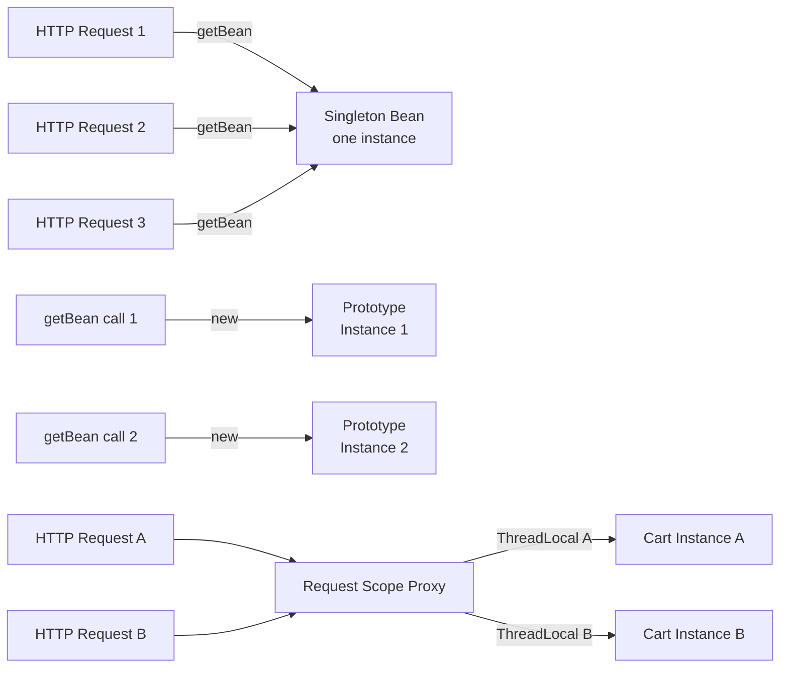
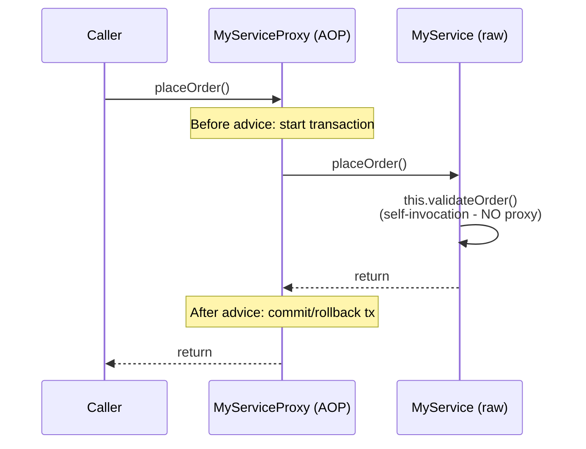

## Keywords in This File
{: .no_toc }

| # | Keyword | Weight |
|---|---|---|
| 1 | [Bean Scopes](#bean-scopes) | high |
| 2 | [Spring AOP and Proxy Mechanics](#spring-aop-and-proxy-mechanics) | critical |
| 3 | [Spring Profiles and Conditional Beans](#spring-profiles-and-conditional-beans) | high |
| 4 | [Spring Environment and Property Sources](#spring-environment-and-property-sources) | high |
| 5 | [Spring Expression Language SpEL](#spring-expression-language-spel) | medium |

---

# Bean Scopes

**Interview Weight:** high - Asked to catch scope/threading
bugs and to test whether candidates know that "singleton"
in Spring means one instance per container, not globally.
Self-invocation, prototype-in-singleton, and request-scoped
beans in async contexts are the favorite follow-ups.

---

### 🎯 Model Answer

**30 seconds:**

> Spring has six built-in scopes. Singleton (default):
> one instance per ApplicationContext, shared across all
> threads - must be stateless or thread-safe. Prototype:
> a new instance every time the bean is requested from
> the container. Request and Session: one instance per
> HTTP request/session (web contexts only). Application:
> one per ServletContext. WebSocket: one per WebSocket
> session. The most common production bug: mutable state
> in a singleton bean causes cross-request data corruption.

**3 minutes (Senior):**

> Singleton scope is correct for the overwhelming majority
> of Spring beans: stateless services, DAOs, factories.
> One instance handles all concurrent requests, which is
> fine because stateless beans are thread-safe by definition.
>
> Prototype scope creates a new instance per `getBean()`
> call. The container hands it over and forgets about it -
> `@PreDestroy` never runs. Use prototype for beans with
> per-use mutable state (a command object, a request
> handler that accumulates state). The prototype-in-singleton
> injection problem: injecting a prototype into a singleton
> creates it once - the prototype effectively becomes a
> singleton. Fix with `ObjectProvider<T>` or `@Lookup`.
>
> Request and session scopes are backed by proxies - the
> singleton-scoped service holds a proxy that delegates
> to the actual request-scoped instance for the current
> request. This proxy creation is why you must declare
> `@Scope(value = "request", proxyMode =
> ScopedProxyMode.TARGET_CLASS)` - without `proxyMode`,
> injection into a singleton fails because the request
> scope does not exist at singleton creation time.
>
> The async thread gotcha: request-scoped beans are bound
> to a ThreadLocal. If you submit work to a thread pool
> from an HTTP request, the worker thread has a different
> ThreadLocal context - the request-scoped bean is not
> available in the async thread. Propagate the context
> explicitly with `RequestContextHolder`.

**Framework:** SINGLETON (stateless, thread-safe, default)
→ PROTOTYPE (per-request, your cleanup responsibility)
→ WEB SCOPES (request/session, proxy-backed, ThreadLocal)
→ GOTCHA (prototype-in-singleton, async thread context loss)

*Adapting up:* Discuss custom scopes (`Scope` interface
implementation), `@Scope("refresh")` from Spring Cloud for
beans that reload on config change, and the
`ScopedProxyMode` options (TARGET_CLASS for CGLIB,
INTERFACES for JDK proxy).

*Adapting down:* Singleton = shared, Prototype = new each
time, Request = one per web request. Use singleton unless
the bean has per-request state.

**Blank Mind Recovery:**

**(1) Restate:** "You are asking about Spring bean scopes -
how many instances of a bean Spring creates."

**(2) First principles:** "Every object creation policy
answers: when is a new instance created? Singleton: once.
Prototype: every request. Web scopes: once per web unit
(request, session)."

**(3) Bridge:** "This is similar to database connection
pool scoping: one pool per application (singleton), vs
one connection per transaction (prototype-like), vs one
session per user (session scope)."

---

### 📘 Concept Explanation

**What it is:**

Bean scope defines how many instances of a bean the Spring
container creates and how long they live. The scope is set
via `@Scope` annotation or `@Bean(scope = ...)`.

**The problem it solves:**

Different beans have different state requirements. A service
that formats dates is stateless - one instance is optimal.
A shopping cart must be per-user-session - sharing it would
mix users' data. Scope provides the mechanism to match
instance lifetime to usage pattern.

**How it works:**

```
  SPRING SCOPES AND INSTANCE COUNT

  Singleton scope (default):
  Request 1 ─┐
  Request 2 ─┤─► [One OrderService instance]
  Request 3 ─┘   (concurrent, must be stateless)

  Prototype scope:
  Request 1 ──► [New OrderBuilder instance]
  Request 2 ──► [New OrderBuilder instance]
  Request 3 ──► [New OrderBuilder instance]

  Request scope (proxy):
  HTTP Request A ──► [ShoppingCart instance A]
                     (bound to Thread A's context)
  HTTP Request B ──► [ShoppingCart instance B]
                     (bound to Thread B's context)
```



> **Diagram walkthrough:** Singleton scope routes all
> requests to a single shared instance - the bean must be
> stateless or synchronized. Prototype creates a fresh
> instance for every `getBean()` call - the container does
> not track it afterward. Request scope introduces a proxy:
> all callers (including singleton services) hold a reference
> to the proxy. The proxy delegates each call to the
> request-specific instance stored in a ThreadLocal. This
> proxy indirection is what makes request-scoped beans
> injectable into singleton-scoped services.

**The key insight:**

Web scopes (request, session) require proxy injection into
singleton beans. The singleton bean is created once, long
before any request exists. Spring creates a scope proxy
that the singleton holds. When a method is called, the
proxy delegates to the actual scope-specific bean for the
current request/session. Without `proxyMode =
ScopedProxyMode.TARGET_CLASS`, the injection fails at
startup because there is no current request context.

**When to use each:**

- Singleton: stateless services, DAOs, factories (default,
  99% of beans)
- Prototype: beans with per-use mutable state, builder
  objects, "command" objects
- Request: shopping cart, request-level user context,
  request tracing metadata
- Session: user preferences, authentication state for
  UI (browser-facing apps)
- Application: heavyweight resources shared across the
  entire web application (servlet context level)

**When NOT to use singleton for stateful beans:**

A mutable field in a singleton bean is shared across all
concurrent requests. `private String currentUser` in a
singleton corrupts requests: Request A sets currentUser
= "alice", Request B sets it to "bob" - now A and B
both see "bob". Use request scope or pass state as
method parameters.

**Alternatives:**

- ThreadLocal manually (no Spring): same semantics as
  request scope but without Spring proxy management
- Immutable value objects passed as method parameters:
  eliminates state management entirely
- `@SessionAttributes` in Spring MVC for controller-
  specific session data

---

### 💻 Code Example

**Wrong vs Right: Mutable state in singleton**

```java
// BAD: mutable field in singleton - race condition
@Service  // singleton scope by default
public class OrderProcessor {
    // DANGER: shared across all concurrent requests
    private String currentUserId;   // NOT thread-safe
    private List<String> errors = new ArrayList<>();

    public OrderResult process(OrderRequest req) {
        currentUserId = req.getUserId(); // Thread A sets
        // Thread B may overwrite before the log below
        log.info("Processing for {}", currentUserId);
        errors.clear();  // Clears errors from another req!
        // ... process
        return new OrderResult(errors);
    }
}
```

```java
// GOOD: stateless singleton - no shared mutable state
@Service
public class OrderProcessor {
    private final OrderRepo repo;
    private final PaymentGateway gateway;

    public OrderProcessor(
        OrderRepo repo, PaymentGateway gateway) {
        this.repo = repo;
        this.gateway = gateway;
    }

    // All state is local to the method call
    public OrderResult process(OrderRequest req) {
        List<String> errors = new ArrayList<>();
        // userId is a parameter, not an instance field
        String userId = req.getUserId();
        log.info("Processing for {}", userId);
        // ... process using local variables only
        return new OrderResult(errors);
    }
}
```

> **Code walkthrough:** The BAD version stores request-
> specific state (`currentUserId`, `errors`) in instance
> fields of a singleton. Two concurrent requests write to
> the same memory. Request A may log B's userId; B may clear
> A's errors list. This is a classic concurrency bug that
> does not reproduce in low-traffic development. The GOOD
> version stores all state in method-local variables. The
> singleton holds only immutable injected dependencies
> (thread-safe) and has zero instance state. All operations
> use method parameters, making the code deterministic
> under any level of concurrency.

**Production Example: Request-scoped bean with proxy**

```java
// Request-scoped bean: new instance per HTTP request
@Component
@Scope(value = "request",
       proxyMode = ScopedProxyMode.TARGET_CLASS)
public class RequestContext {
    private String correlationId;
    private String userId;
    // Spring creates one instance per HTTP request
    // and destroys it when the request completes

    public void setCorrelationId(String id) {
        this.correlationId = id;
    }
    public String getCorrelationId() {
        return correlationId;
    }
}

// Singleton service holds a proxy to RequestContext
@Service
public class AuditService {
    private final RequestContext ctx;  // holds PROXY

    public AuditService(RequestContext ctx) {
        // ctx is a CGLIB proxy, not the real instance
        this.ctx = ctx;
    }

    public void audit(String action) {
        // ctx.getCorrelationId() delegates through proxy
        // to the real RequestContext for THIS HTTP request
        log.info("Action {} by correlationId={}",
            action, ctx.getCorrelationId());
    }
}
```

> **Code walkthrough:** `proxyMode = ScopedProxyMode
> .TARGET_CLASS` is critical. Without it, Spring cannot
> inject `RequestContext` into the singleton `AuditService`
> at startup time (no HTTP request exists during context
> initialization). With it, Spring injects a CGLIB proxy.
> When `ctx.getCorrelationId()` is called during an HTTP
> request, the proxy routes to the actual `RequestContext`
> instance for the current request (stored in
> `RequestContextHolder` / ThreadLocal). If called outside
> an HTTP request (e.g., in a background thread or test),
> it throws `ScopeNotActiveException`.

---

### 🎓 Answers by Seniority

**Junior / Mid (0-5 years):**

> Spring has several bean scopes. Singleton (default) creates
> one instance shared across all usages - correct for stateless
> services. Prototype creates a new instance every time it is
> requested - good for beans with per-request state. Request
> and session scopes create beans per HTTP request or session
> - only available in web applications. The most important
> rule: singleton beans must be stateless. Putting mutable
> per-request data in a singleton field causes cross-request
> data corruption.

*Push deeper:* Explain the proxy mechanism for request scope
injection into singleton beans.

---

**Senior / Staff (5+ years):**

> Scope determines instance lifetime. Singleton is the right
> default: stateless services are inherently thread-safe.
> The key production risk is mutable state in singletons -
> instance fields shared across concurrent requests cause data
> corruption that is invisible at low traffic and catastrophic
> at high traffic. For request-scoped beans injected into
> singletons: Spring creates a scope proxy (CGLIB or JDK
> proxy) that delegates to the request-specific instance via
> ThreadLocal. The `proxyMode = TARGET_CLASS` is mandatory.
> The async thread gotcha: if you dispatch to a thread pool
> inside an HTTP request, the worker thread has a clean
> ThreadLocal - your request-scoped bean is not there. Propagate
> context explicitly with Spring's `TaskDecorator` or
> `RequestContextHolder.getRequestAttributes()` copy.

*Push deeper:* Discuss `@Scope("refresh")` in Spring Cloud,
custom scope implementations, and `ScopedProxyMode.INTERFACES`
vs `TARGET_CLASS` (when to use each proxy mechanism).

---

### ⚖️ Comparison Table

| Scope | Instances | Thread-Safe? | Injection via Proxy? | Use Case |
|---|---|---|---|---|
| Singleton (default) | 1 per context | Yes (if stateless) | No | All stateless beans |
| Prototype | 1 per `getBean()` | Yes (not shared) | No | Per-use stateful beans |
| Request | 1 per HTTP request | Yes (per-thread) | Yes (required) | Request context, per-request audit |
| Session | 1 per HTTP session | Depends on sessions | Yes (required) | User preferences, shopping cart |
| Application | 1 per ServletContext | Yes (if stateless) | No | App-wide shared resources |
| Custom (e.g., refresh) | Framework-defined | Framework-defined | Yes (typically) | Spring Cloud config refresh |

**The deciding factor:** Is the bean stateless? Singleton.
Does it have per-request mutable state? Request scope.
Per-user mutable state? Session. Per-invocation? Prototype.

---

### ⚠️ Common Misconceptions

| # | Misconception | Reality | Danger |
|---|---|---|---|
| 1 | Singleton in Spring means one instance globally in the JVM | Singleton means one instance per ApplicationContext. Multiple contexts (e.g., parent+child in Spring MVC, two test contexts) have their own singletons | Two beans of the same type in different contexts are independent instances |
| 2 | Prototype beans are destroyed and cleaned up by the container | The container creates prototype beans but does NOT track them afterward. `@PreDestroy` never runs for prototypes. | Resource leaks: JDBC connections, file handles, threads opened in @PostConstruct of a prototype bean are never released |
| 3 | Request-scoped beans are safe in async threads | Request scope uses ThreadLocal. Spawning a thread pool task from an HTTP request creates a thread without the request context. The request-scoped bean throws `ScopeNotActiveException` in the worker thread. | NullPointerException or ScopeNotActiveException in async jobs that try to access request-scoped beans |
| 4 | You can inject request-scoped beans into singletons without proxy | Without `proxyMode`, Spring throws `BeanCreationException` at startup: "Error creating bean with name 'singleton': Scope 'request' is not active for the current thread" | Application fails to start in certain deployment configurations |

---

### 🚨 Failure Modes and Diagnosis

**Failure 1 - Data corruption from mutable singleton state**

Symptom: Intermittent wrong data in API responses under load.
One user's data appears in another user's response. Not
reproducible in development (low concurrency). Appears at
10+ concurrent users.

Root cause: A mutable instance field in a singleton service
stores per-request state. Multiple threads share the field
and overwrite each other's values.

Diagnostic:
1. Search for non-final instance fields in `@Service`/
   `@Component` classes (excluding injected dependencies).
2. Look for instance fields of types like `String`, `List`,
   `Map`, `int` that are mutated in non-constructor methods.
3. Thread dump: find the service class in multiple threads
   at the same time, check which fields they are reading.

Fix: Move all per-request state to method-local variables
or method parameters. If state must persist across method
calls within a request, use request scope with proxy.

---

**Failure 2 - ScopeNotActiveException in async context**

Symptom: `ScopeNotActiveException: No thread-bound request
found` in a Kafka consumer, `@Async` method, or background
task that tries to access a request-scoped bean.

Root cause: Request scope uses `RequestContextHolder`, which
stores context in a ThreadLocal. Background threads do not
have this ThreadLocal populated.

Diagnostic: Check the stack trace for `SimpleThreadScope`
or `RequestContextHolder.currentRequestAttributes()` in the
call stack.

Fix: Pass request-specific data explicitly (userId, correlationId)
as method parameters to async tasks rather than via request-
scoped beans. Or use `RequestContextHolder.getRequestAttributes()`
to copy the context and set it in the worker thread:
```java
RequestAttributes attrs =
    RequestContextHolder.getRequestAttributes();
executor.submit(() -> {
    RequestContextHolder.setRequestAttributes(attrs);
    try { doWork(); }
    finally { RequestContextHolder.resetRequestAttributes(); }
});
```

---

### 🎯 Interview Deep-Dive

| Preparation time | Recommended approach |
|---|---|
| 15 min | Name 4 scopes and when each is appropriate |
| 30 min | Add the proxy mechanism for request/session scope |
| 45 min | Add prototype-in-singleton injection problem and fix |
| 1 hour | Add async thread context loss and fix |
| 2 hours | Study ScopedProxyMode, custom Scope implementation |

---

**[JUNIOR] Q1: What is the default Spring bean scope and
what does it mean?** [CONCEPTUAL]

*Why they ask:* Baseline scope knowledge.

*Likely follow-up:* "Why is singleton safe when multiple
threads use the same instance?"

The default scope is singleton. One instance of the bean is
created per ApplicationContext. All calls to `getBean()` and
all `@Autowired` injections of the same type return the same
instance. The instance lives from context initialization to
context close.

Singleton beans are safe for concurrent use IF they are
stateless - they hold only immutable state (final fields set
in the constructor) or thread-safe collaborators (other
singleton beans, `ConcurrentHashMap`, `AtomicLong`). Stateless
means: no instance field stores data that differs per request
or per user.

This is correct for 99% of Spring beans: services that
process requests, repositories that execute queries, factories
that create objects. All of these hold only injected
collaborators and have no per-request state.

*What separates good from great:* Clarifying that "singleton
per container" (not "singleton globally") and explaining
why stateless beans are thread-safe: multiple threads can
enter the same method simultaneously, but they each use
their own stack frame (local variables) - no sharing occurs.

---

**[MID] Q2: What is the prototype-in-singleton injection
problem?** [MECHANISM]

*Why they ask:* Tests advanced scope interaction knowledge.

*Likely follow-up:* "How do you fix it?"

The problem: when you inject a prototype-scoped bean into
a singleton-scoped bean via constructor injection, the
prototype bean is created once - during the singleton's
construction. Every call to the singleton uses the same
prototype instance - it effectively becomes a singleton.

```java
@Component
@Scope("prototype")
public class ReportBuilder { // should be fresh per use
    private final List<String> lines = new ArrayList<>();
    public void addLine(String l) { lines.add(l); }
    public String build() { return String.join("\n", lines); }
}

@Service
public class ReportService {
    private final ReportBuilder builder; // SHARED instance!
    public ReportService(ReportBuilder builder) {
        this.builder = builder; // created ONCE at startup
    }
    public String generate(List<String> data) {
        data.forEach(builder::addLine); // accumulates across calls!
        return builder.build(); // includes previous calls' data
    }
}
```

The `builder` is shared across all calls to `generate()`.
Lines accumulate across requests.

Fixes: `ObjectProvider<ReportBuilder>` (inject the provider,
call `getObject()` per use), `@Lookup` method (Spring overrides
the method to return a fresh prototype), or `ApplicationContext
.getBean(ReportBuilder.class)` per use (service locator,
acceptable here).

*What separates good from great:* Demonstrating the bug with
a concrete example showing data accumulation, and preferring
`ObjectProvider` as the cleanest modern fix.

---

**[SENIOR] Q3: How do request-scoped beans work with
singleton-scoped services?** [MECHANISM]

*Why they ask:* Tests proxy and scope interaction - a
prerequisite for building web-layer Spring applications.

*Likely follow-up:* "What happens if you call a request-scoped
bean from a @Scheduled task?"

Request-scoped beans cannot be directly injected into
singletons. The singleton is created once at startup, before
any HTTP request exists. Spring solves this with a scope proxy:

`@Scope(value = "request", proxyMode = ScopedProxyMode
.TARGET_CLASS)` tells Spring to inject a CGLIB proxy object
into the singleton. The proxy implements the same interface
(or extends the class with `TARGET_CLASS`) and delegates
every method call to the real request-scoped bean.

The real bean is stored in `RequestContextHolder`
(ThreadLocal keyed by request). When a method is called on
the proxy, the proxy retrieves the real bean from the current
thread's request context and delegates to it.

Without `proxyMode`, Spring cannot inject the request-scoped
bean into the singleton at startup time and throws a
`BeanCreationException`.

Calling a request-scoped bean from `@Scheduled` task: the
scheduler runs in a thread with no HTTP request context.
`RequestContextHolder` returns null. The proxy throws
`ScopeNotActiveException`. Fix: do not use request-scoped
beans in scheduled tasks - pass the required data as method
arguments instead.

*What separates good from great:* Understanding the proxy
delegation mechanism (ThreadLocal lookup on each call) and
the failure mode in non-HTTP threads.

---

**[SENIOR] Q4: How have you used bean scopes to solve a
production problem?** [BEHAVIORAL]

*Why they ask:* Tests real-world application of scope knowledge.

*Likely follow-up:* "What was the concurrency risk if you had
not changed the scope?"

Answer using STAR format:

**S:** We had a reporting service that generated PDF reports.
The original `ReportGenerator` bean was singleton-scoped. It
had an instance field `List<ReportSection> sections` that
was populated during report generation and reset at the end.

**T:** Under high load (10+ concurrent report requests), some
reports were missing sections or contained sections from
other reports. The bug was intermittent and only appeared
under load.

**A:** I traced the issue to the shared `sections` list on the
singleton. Thread A would add its sections; Thread B would
clear the list mid-generation. I changed `ReportGenerator`
to prototype scope and injected it via `ObjectProvider<Report
Generator>` in the calling service, calling `getObject()`
to create a fresh builder per report.

**R:** All intermittent data corruption stopped. The change
also made the service easier to test in isolation - each
test got a fresh `ReportGenerator` without state from
previous tests.

*What separates good from great:* The ability to narrate
a specific failure that was reproduced, diagnosed, and fixed
with scope knowledge - not a generic answer.

---

**[STAFF] Q5: How would you implement a custom Spring scope
for a multi-tenant application?** [ARCHITECTURE]

*Why they ask:* Tests ability to extend the Spring container
with custom behavior.

*Likely follow-up:* "What is the Scope interface?"

A multi-tenant scope creates one bean instance per tenant
(identified by a tenant ID in the request context). Useful
for tenant-specific caches, tenant-aware connection pools,
or tenant configuration objects.

Implementation:

```java
public class TenantScope implements Scope {
    // One instance per tenant ID
    private final Map<String, Map<String, Object>>
        tenantBeans = new ConcurrentHashMap<>();

    @Override
    public Object get(String name,
        ObjectFactory<?> objectFactory) {
        String tenantId = TenantContext.getCurrentTenant();
        tenantBeans.computeIfAbsent(tenantId,
            t -> new ConcurrentHashMap<>());
        return tenantBeans.get(tenantId)
            .computeIfAbsent(name,
                n -> objectFactory.getObject());
    }

    @Override
    public Object remove(String name) {
        String tenantId = TenantContext.getCurrentTenant();
        Map<String, Object> beans =
            tenantBeans.get(tenantId);
        return (beans != null) ? beans.remove(name) : null;
    }

    @Override
    public String getConversationId() {
        return TenantContext.getCurrentTenant();
    }
    // ... registerDestructionCallback, resolveContextualObject
}

// Register the custom scope
@Configuration
public class TenantScopeConfig
    implements BeanFactoryPostProcessor {
    @Override
    public void postProcessBeanFactory(
        ConfigurableListableBeanFactory bf) {
        bf.registerScope("tenant", new TenantScope());
    }
}

// Use it:
@Component
@Scope(value = "tenant",
       proxyMode = ScopedProxyMode.TARGET_CLASS)
public class TenantCache {
    private final Map<String, Object> data =
        new ConcurrentHashMap<>();
    // One instance per tenant
}
```

*What separates good from great:* Knowing the `Scope`
interface contract (`get`, `remove`, `registerDestruction
Callback`, `resolveContextualObject`, `getConversationId`),
understanding why a proxy is still needed for injection
into singletons, and considering the memory management
concern (tenant beans accumulate and need eviction when
tenants are deactivated).

| Interviewer Type | Emphasis |
|---|---|
| Technical Panel | Lead with proxy mechanism for request scope injection. |
| Hiring Manager | Lead with singleton data corruption bug and its business impact. |
| Bar Raiser | Lead with prototype-in-singleton problem and custom scope implementation. |
| Peer Engineer | "The singleton mutable state bug is one of those things you see in every codebase once..." |

---

---

# Spring AOP and Proxy Mechanics

**Interview Weight:** critical - The most important advanced
Spring concept for senior/staff interviews. Required for
understanding why `@Transactional`, `@Cacheable`, and
`@Async` sometimes fail. Self-invocation is the favorite
follow-up at every level.

---

### 🎯 Model Answer

**30 seconds:**

> Spring AOP is Aspect-Oriented Programming: it intercepts
> method calls on beans to add cross-cutting behavior like
> transactions, caching, security, and logging without
> modifying the business class. Spring implements AOP via
> proxy: it wraps the bean in a proxy object that intercepts
> calls. The proxy can use JDK dynamic proxies (interface-
> based) or CGLIB (subclass-based). The critical limitation:
> self-invocation - calling `this.method()` from within the
> same class bypasses the proxy, so `@Transactional` on an
> internal method call is silently ignored.

**3 minutes (Senior):**

> Spring AOP is a proxy-based AOP implementation, not
> bytecode weaving (unlike AspectJ). Every Spring bean
> annotated with `@Transactional`, `@Cacheable`, `@Async`,
> or `@Secured` is wrapped in a proxy object by the
> `AnnotationAwareAspectJAutoProxyCreator` BeanPostProcessor.
>
> Two proxy types: JDK dynamic proxy (requires the bean to
> implement an interface - creates a proxy implementing the
> same interface) and CGLIB (creates a subclass of the bean
> class - used when no interface exists or
> `proxyTargetClass = true`). The proxy intercepts method
> calls and runs the advice (transaction start/commit,
> cache lookup, security check) around the actual method.
>
> The self-invocation problem: inside a bean, `this` refers
> to the actual object, not the proxy. Calling
> `this.someMethod()` from within the bean skips the proxy
> entirely - no AOP advice runs. If `someMethod()` is
> `@Transactional`, it runs without a transaction. This is
> the most common Spring AOP bug and explains many
> "transactions not working" complaints.
>
> To call another method with AOP applied from within the
> same bean: inject a self-reference (`@Autowired private
> MyService self`), use `AopContext.currentProxy()`, or
> refactor to a separate bean.

**Framework:** WHAT (intercept method calls, add behavior)
→ HOW (proxy wraps bean: JDK or CGLIB) →
WHERE APPLIED (BeanPostProcessor.afterInit) →
LIMITATION (self-invocation bypasses proxy) →
FIX (self-inject or separate bean)

*Adapting up:* Discuss full AspectJ weaving vs Spring AOP
(compile-time vs runtime proxy), `@Aspect` and advice types
(Before, After, Around, AfterReturning, AfterThrowing),
pointcut expressions, and `@EnableAspectJAutoProxy
(exposeProxy = true)` for `AopContext.currentProxy()`.

*Adapting down:* Spring AOP wraps beans in proxies. The
proxy intercepts calls and adds behavior (transactions,
caching). Calling a method on `this` inside the class bypasses
the proxy. That is the essential model.

**Blank Mind Recovery:**

**(1) Restate:** "You are asking about Spring AOP and how
proxy-based method interception works."

**(2) First principles:** "Cross-cutting concerns (logging,
transactions, security) should not be in business logic.
AOP intercepts method calls to add these concerns without
modifying the class. Spring does this via runtime proxies."

**(3) Bridge:** "This is like a middleware layer in web
frameworks: a request filter intercepts HTTP requests before
and after the handler runs. Spring AOP intercepts Java method
calls the same way."

---

### 📘 Concept Explanation

**What it is:**

Spring AOP is a programming paradigm for separating
cross-cutting concerns (logging, transactions, security,
caching) from business logic. Spring implements AOP using
runtime proxy objects that intercept method calls and
execute advice code around the actual method.

**The problem it solves:**

Transaction management without AOP:
```java
// Repeated in every service method that needs a transaction:
TransactionStatus tx = txManager.getTransaction(def);
try {
    doBusinessLogic();  // your code
    txManager.commit(tx);
} catch (Exception e) {
    txManager.rollback(tx);
    throw e;
}
```

With AOP (`@Transactional`), the transaction management is
expressed once as an aspect and applied to any annotated method
without any boilerplate in the business class.

**How it works:**

```
  SPRING AOP PROXY MECHANICS

  Without AOP:
  Caller --> [MyService] --> execute()

  With AOP (Spring default - proxy-based):
  Caller --> [MyServiceProxy]
                    |
              Run advice "before"
              (start transaction, etc.)
                    |
              [MyService].execute()  <- actual method
                    |
              Run advice "after"
              (commit/rollback tx, etc.)
                    |
  Return to caller

  Self-invocation (BYPASSES PROXY):
  [MyService].outer() --> this.inner()
                                |
                         Goes directly to [MyService].inner()
                         No proxy interception!
                         @Transactional on inner() is IGNORED
```



> **Diagram walkthrough:** All external callers call through
> the proxy. The proxy runs before/after advice (transaction,
> caching, security) then delegates to the real bean. Inside
> the bean, `this.validateOrder()` bypasses the proxy entirely
> because `this` refers to the raw `MyService` object, not
> the proxy. Any AOP annotations on `validateOrder()` are
> ignored in this call path. This is the self-invocation
> problem: internal calls on `this` never pass through the
> proxy, so they never trigger AOP advice.

**The key insight:**

Spring AOP's proxy model means AOP only applies to external
calls - calls that come through the proxy from outside the
bean. `this.method()` inside the same class is always a
direct call to the raw object. This is the architectural
constraint that explains every "my `@Transactional` is not
working" bug report. The solution is either a separate bean
(method in another service), self-injection
(`@Autowired MyService self`), or `AopContext.currentProxy()`.

**When to use Spring AOP:**

- Cross-cutting concerns that must apply to many beans
  without modifying them: transactions, security, caching,
  audit logging, metrics, retry logic
- Adding behavior to third-party library calls (via around
  advice on the method calling the library)

**When NOT to use Spring AOP:**

- Private methods: AOP cannot intercept private methods
  (no proxy override possible)
- Fine-grained performance-critical code: each proxied
  method call adds overhead (reflection + advice chain)
- Non-Spring-managed objects: AOP only applies to beans
  in the ApplicationContext. Objects created with `new`
  are not proxied.

**Alternatives:**

- AspectJ: compile-time weaving into bytecode, works on
  `this` calls, works on private methods, no proxy overhead
- Manual decoration pattern: wrap explicitly, no framework needed
- Spring AOP `exposeProxy = true` + `AopContext.currentProxy()`

---

### 💻 Code Example

**Failure Example: Self-invocation with @Transactional**

```java
// BAD: self-invocation bypasses @Transactional proxy
@Service
public class OrderService {
    private final OrderRepo repo;

    public OrderService(OrderRepo repo) {
        this.repo = repo;
    }

    // External callers go through the proxy - TX works
    public void processOrder(Order o) {
        validateOrder(o);         // this.validateOrder()
        saveWithTransaction(o);   // this.saveWithTransaction()
    }

    @Transactional   // IGNORED when called via this.
    public void saveWithTransaction(Order o) {
        repo.save(o);  // NO transaction active!
        // If repo.save throws, nothing rolls back
    }
}
```

```java
// GOOD option 1: separate the logic into a different bean
@Service
public class OrderService {
    private final OrderRepo repo;
    private final OrderPersistence persistence; // other bean

    public void processOrder(Order o) {
        validateOrder(o);
        persistence.saveWithTransaction(o); // PROXY call!
    }
}

@Service
public class OrderPersistence {
    @Transactional  // WORKS - called via proxy
    public void saveWithTransaction(Order o) {
        repo.save(o);
    }
}

// GOOD option 2: self-injection (quick fix, less clean)
@Service
public class OrderService {
    @Autowired
    private OrderService self;  // proxy reference

    public void processOrder(Order o) {
        validateOrder(o);
        self.saveWithTransaction(o);  // via proxy!
    }

    @Transactional
    public void saveWithTransaction(Order o) { ... }
}
```

> **Code walkthrough:** The BAD example calls `this.save
> WithTransaction()`. Inside the bean, `this` is the raw
> `OrderService` object - the proxy is in the caller's hand.
> The `@Transactional` advice never runs; the save executes
> without a transaction. The GOOD option 1 extracts the
> transactional logic to a separate bean - all calls to
> `persistence.saveWithTransaction()` go through that bean's
> proxy. Option 2 injects a self-reference: `self` is the
> proxy (not `this`). Calling `self.method()` goes through
> the proxy and triggers AOP advice. Option 1 is architecturally
> cleaner; Option 2 is a quick fix.

**Internal Mechanism Example: JDK vs CGLIB proxy**

```java
// JDK PROXY: bean must implement an interface
public interface PaymentService {
    void charge(Payment p);
}

@Service
public class StripePaymentService
    implements PaymentService {
    @Transactional
    public void charge(Payment p) { ... }
}
// Spring creates: JDK Proxy implementing PaymentService
// Injection type: PaymentService (interface)
// Cannot inject as StripePaymentService!

// CGLIB PROXY: works on classes (no interface required)
@Service
public class NotificationService {
    // No interface - Spring uses CGLIB subclass
    @Async
    public void send(Notification n) { ... }
}
// Spring creates: CGLIB subclass of NotificationService
// Cannot override final or private methods
// Injection type: NotificationService (concrete class)

// Check proxy type at runtime (diagnostic):
Object bean = ctx.getBean(PaymentService.class);
boolean isJdk = Proxy.isProxyClass(bean.getClass());
boolean isCglib = bean.getClass().getName()
    .contains("$$EnhancerBySpringCGLIB");
```

> **Code walkthrough:** JDK dynamic proxies require an
> interface - the proxy implements the same interface, so
> callers must inject via the interface type, not the
> concrete class. CGLIB creates a subclass of the concrete
> class - works without an interface, but cannot proxy
> `final` classes or `final` methods (cannot be overridden).
> Spring Boot defaults to CGLIB for all proxied beans
> (`spring.aop.proxy-target-class=true`). The runtime check
> using `$$EnhancerBySpringCGLIB` in the class name is a
> common diagnostic tool when debugging proxy behavior.

---

### 🎓 Answers by Seniority

**Junior / Mid (0-5 years):**

> Spring AOP intercepts method calls on beans to add
> cross-cutting behavior without modifying the business
> class. It works via proxy objects: Spring wraps each
> bean in a proxy that runs advice code before and after
> the actual method. `@Transactional`, `@Cacheable`, and
> `@Async` all work this way. The critical rule: calling
> a method on `this` within the same class bypasses the
> proxy. If `@Transactional` is on a method called via
> `this.method()`, no transaction is created.

*Push deeper:* Explain JDK proxy vs CGLIB and when each
is used.

---

**Senior / Staff (5+ years):**

> Spring AOP is proxy-based, not bytecode weaving. The
> `AnnotationAwareAspectJAutoProxyCreator` BeanPostProcessor
> detects annotations like `@Transactional` and wraps the
> bean in a proxy. JDK dynamic proxies for interface-based
> beans; CGLIB for concrete classes (Spring Boot default).
> Every `@Transactional`, `@Cacheable`, `@Async`, `@Secured`
> annotation relies on this proxy chain. The self-invocation
> constraint is fundamental: `this.method()` is not a proxy
> call. Solutions in preference order: (1) separate bean,
> (2) self-injection, (3) `AopContext.currentProxy()` with
> `exposeProxy = true`. At staff level, I evaluate whether
> proxy-based AOP is the right tool or if compile-time
> AspectJ weaving is warranted (AspectJ works on `this` calls
> and private methods - no proxy limitation).

*Push deeper:* Discuss custom `@Aspect` writing, around
advice for retry logic, pointcut expressions, and the
performance cost of deeply chained advice.

---

### ⚖️ Comparison Table

| Mechanism | Interface Required | Works on self-calls? | Private methods? | Use Case |
|---|---|---|---|---|
| Spring AOP (JDK Proxy) | Yes | No | No | Interface-based beans |
| Spring AOP (CGLIB) | No | No | No | Concrete class beans (default) |
| AspectJ (compile-time) | No | Yes | Yes | High-performance, fine-grained AOP |
| AspectJ (LTW) | No | Yes | Yes | Production AOP without recompile |
| Manual decorator | No | Yes | Yes | One-off wrapping, no framework |

**The deciding factor:** If you need AOP on private methods
or `this` calls: use AspectJ. For standard cross-cutting
concerns (tx, cache, security) on public methods called from
outside the bean: Spring AOP is sufficient and zero-overhead-
per-configuration.

---

### ⚠️ Common Misconceptions

| # | Misconception | Reality | Danger |
|---|---|---|---|
| 1 | `@Transactional` on a method guarantees a transaction whenever that method runs | Only when called via the proxy (external call through Spring context). `this.method()` inside the same class bypasses the proxy - no transaction. | Silent data loss: saves without transaction are not rolled back on exception |
| 2 | CGLIB proxy can proxy any class | CGLIB proxies extend the class via subclassing. `final` classes and `final` methods cannot be subclassed. | `@Transactional` on a `final` method silently does nothing (Spring 5+ logs a warning) |
| 3 | Spring AOP and AspectJ are the same | Spring AOP uses runtime proxies; AspectJ uses bytecode weaving. Spring supports AspectJ annotations (`@Aspect`) but applies them via Spring's proxy mechanism, not true AspectJ weaving unless configured with LTW or compile-time weaving. | Expecting Spring AOP to intercept `this` calls (like AspectJ does) leads to subtle bugs |
| 4 | Adding `@Transactional` to a private method makes it transactional | AOP proxies cannot override private methods (no subclassing or interface implementation for private methods). The annotation is silently ignored. | Developers believe the private method is transactional; rollback on exception does not happen |

---

### 🚨 Failure Modes and Diagnosis

**Failure 1 - @Transactional on self-invoked method has no effect**

Symptom: Database changes persist even when an exception is
thrown. No transaction rollback occurs. Method is annotated
with `@Transactional(rollbackFor = Exception.class)`.

Root cause: The method is called via `this.method()` from
within the same class. The proxy is bypassed.

Diagnostic:
1. Confirm the method is called from within the same class:
   check if the call is `this.method()`, a direct method
   call, or from a different bean.
2. Add TRACE logging for `org.springframework.transaction`:
   "Creating new transaction" must appear if a transaction
   started. If absent, no transaction was active.
3. Verify the bean in context is a proxy:
   `AopUtils.isAopProxy(context.getBean(MyService.class))`
   should return true.

Fix: Extract the method to a separate bean, or inject
a self-reference: `@Autowired MyService self`.

---

**Failure 2 - @Async has no effect (runs synchronously)**

Symptom: A method annotated with `@Async` runs synchronously
in the caller's thread. Blocking I/O in the "async" method
still blocks the web request.

Root cause: Either `@EnableAsync` is not on a configuration
class, or the method is called via `this.method()`.

Diagnostic:
1. Check for `@EnableAsync` on a `@Configuration` class in
   the application.
2. Verify the call site: is it calling `asyncService.method()`
   (external, via proxy) or `this.method()` (internal, no proxy)?
3. Check if the bean is proxied: look for
   `$$EnhancerBySpringCGLIB` in the bean class name.

Fix: Add `@EnableAsync`. Move the async method to a
separate bean if calling from the same class.

---

### 🎯 Interview Deep-Dive

| Preparation time | Recommended approach |
|---|---|
| 15 min | Explain proxy mechanics: external call through proxy vs this call |
| 30 min | Add JDK vs CGLIB proxy difference and when each applies |
| 45 min | Add three solutions to self-invocation problem |
| 1 hour | Add @Aspect writing and around advice example |
| 2 hours | Study AnnotationAwareAspectJAutoProxyCreator, AspectJ vs Spring AOP |

---

**[JUNIOR] Q1: What does @Transactional actually do?**
[MECHANISM]

*Why they ask:* Tests whether candidates know how transaction
management is implemented.

*Likely follow-up:* "What happens if an exception is thrown?"

`@Transactional` is an AOP annotation processed by
`TransactionInterceptor`. When a method annotated with
`@Transactional` is called via the Spring proxy:

1. Spring's transaction advisor checks if a transaction
   is already active (based on the propagation policy).
2. If no transaction exists (default propagation: REQUIRED),
   Spring calls `PlatformTransactionManager.getTransaction()`
   to start one.
3. The actual method executes within the transaction.
4. On success: `txManager.commit(transactionStatus)`.
5. On unchecked exception (RuntimeException, Error):
   `txManager.rollback(transactionStatus)`.
6. On checked exception: by default, Spring does NOT
   rollback. Override with `rollbackFor = Exception.class`.

The transaction boundary matches the method: starts at the
opening `{` of the annotated method and ends at the closing
`}`. Any code inside the method shares the same transaction.

*What separates good from great:* Knowing that checked
exceptions do NOT trigger rollback by default - a common
source of "data partially committed" bugs when using
checked exceptions in transactional methods.

---

**[MID] Q2: What is the difference between JDK dynamic proxy
and CGLIB proxy in Spring?** [COMPARISON]

*Why they ask:* Tests proxy mechanism depth.

*Likely follow-up:* "Can you inject a CGLIB-proxied bean
by its interface?"

JDK dynamic proxy uses `java.lang.reflect.Proxy`. It creates
a proxy class at runtime that implements the same interfaces
as the target bean. The proxy object does NOT extend the
bean class - it implements the interface(s).

Requirements: the bean must implement at least one interface.
The proxy is injected via the interface type, not the concrete
class. Attempting to inject by concrete class type fails:
`ClassCastException: $Proxy0 cannot be cast to ConcreteClass`.

CGLIB uses bytecode generation to create a subclass of the
bean class at runtime. No interface required. The proxy
IS-A subclass of the bean. Can be injected by concrete type.
Restrictions: cannot proxy `final` classes (cannot subclass)
or `final` methods (cannot override).

Spring Boot 2.0+ defaults to CGLIB for all proxied beans
(`spring.aop.proxy-target-class=true`). This eliminates
"inject by interface vs class" issues. If you need JDK
proxies (for serialization or reflection compatibility),
set `proxyTargetClass = false`.

*What separates good from great:* Knowing that Spring Boot
2.0+ changed the default to CGLIB (to fix the ClassCastException
when injecting by class type), and why `final` methods
cannot be proxied by either mechanism.

---

**[SENIOR] Q3: You have a method A that calls method B on
the same bean. B is @Transactional and A is not. Does B
run in a transaction?** [DEBUGGING]

*Why they ask:* The classic self-invocation test.

*Likely follow-up:* "What if A is also @Transactional with
REQUIRES_NEW propagation?"

No. Method A is called via the proxy (external call), but
A calls B directly as `this.methodB()`. The proxy is not
involved in this internal call. `methodB()` runs without
any transaction wrapper.

This is the self-invocation problem. The proxy intercepts
the initial call to A. Inside A, `this` refers to the raw
bean object. All internal calls (`this.X()`) bypass the proxy.

Even if A IS `@Transactional(propagation = REQUIRES_NEW)`:
if A calls B via `this.B()`, B's `@Transactional` annotation
is ignored - B participates in A's transaction (not a new one)
or runs in no transaction if A is not transactional.

Solutions:
1. Move B to a separate `@Service` bean and inject it.
2. Self-inject: `@Autowired MyService self; self.methodB()`.
3. `AopContext.currentProxy()` (requires `@EnableAspect
   JAutoProxy(exposeProxy = true)`).
4. Full AspectJ weaving (works on all calls including `this`).

*What separates good from great:* Explaining clearly that
even `REQUIRES_NEW` on B does not help if called via `this`
- the proxy mechanism is bypassed entirely, not just the
propagation.

---

**[SENIOR] Q4: How do you write a custom aspect to log
execution time of all @Service methods?** [HANDS-ON]

*Why they ask:* Tests ability to write AOP aspects, not
just consume them.

*Likely follow-up:* "What is the difference between
@Before and @Around advice?"

```java
@Aspect
@Component
public class ExecutionTimeAspect {
    private static final Logger log =
        LoggerFactory.getLogger(ExecutionTimeAspect.class);

    // Pointcut: all public methods in @Service classes
    @Pointcut("within(@org.springframework.stereotype"
        + ".Service *)")
    public void serviceBean() {}

    // Around advice: runs before AND after the method
    @Around("serviceBean()")
    public Object logExecutionTime(
        ProceedingJoinPoint pjp) throws Throwable {
        long start = System.currentTimeMillis();
        try {
            return pjp.proceed(); // run actual method
        } finally {
            long elapsed = System.currentTimeMillis()
                - start;
            log.info("{}.{} took {}ms",
                pjp.getTarget().getClass().getSimpleName(),
                pjp.getSignature().getName(),
                elapsed);
        }
    }
}
// Requires @EnableAspectJAutoProxy on a @Configuration class
```

Around advice is the most powerful: it controls whether
`pjp.proceed()` is called (can short-circuit), can modify
parameters, and can modify the return value. `@Before` only
runs before - cannot influence execution. `@AfterReturning`
runs after successful return. `@AfterThrowing` only on exception.

*What separates good from great:* Noting that the `try/finally`
around `pjp.proceed()` ensures the timer runs even on
exception, and that `@Around` must call `proceed()` or the
actual method never executes.

---

**[STAFF] Q5: How would you design an audit logging system
using Spring AOP that captures who changed what in a
30-service microservices application?** [ARCHITECTURE]

*Why they ask:* Tests AOP design at organizational scale.

*Likely follow-up:* "How would you ensure the audit data
is stored even if the transaction rolls back?"

Design:

**Aspect definition**: `@Around` advice on all methods in
`@Service` or `@Repository` beans annotated with a custom
`@Audited` annotation. The advice captures: calling user
(from SecurityContext), method name, input parameters, return
value, execution duration, tenant ID, and correlation ID.

**Separate transaction for audit**: The main transaction may
roll back. Audit records should persist even on rollback.
Use `REQUIRES_NEW` propagation for the audit save:

```java
@Transactional(propagation = Propagation.REQUIRES_NEW)
public void save(AuditRecord record) {
    auditRepo.save(record);  // separate transaction
}
```

**Async audit write**: Do not block the main request thread
on audit I/O. Emit to an in-memory queue or Kafka topic.
An async consumer writes to the audit store.

**Distribution**: In a shared internal library
(custom Spring Boot starter), ship the `@Audited` annotation,
the AOP aspect, and the Kafka producer. All 30 services
add the starter and get audit logging with zero extra code.

*What separates good from great:* Understanding that audit
records must survive business transaction rollback (separate
transaction or async emit), and proposing the shared starter
as the distribution mechanism - not requiring each team to
implement audit logging separately.

| Interviewer Type | Emphasis |
|---|---|
| Technical Panel | Lead with proxy mechanics and self-invocation explanation with concrete code. |
| Hiring Manager | Lead with the business impact: @Transactional bugs that cause data loss. |
| Bar Raiser | Lead with Spring AOP vs AspectJ trade-offs and the custom aspect design. |
| Peer Engineer | "Self-invocation is the thing that bites everyone: once you've debugged it, you never forget..." |

---

---

# Spring Profiles and Conditional Beans

**Interview Weight:** high - Asked in every senior-level
Spring interview to verify you understand environment-specific
configuration. Follow-ups target conditional bean creation,
`@ConditionalOnProperty`, and how to test with specific profiles.

---

### 🎯 Model Answer

**30 seconds:**

> Spring Profiles group beans and configuration that should
> only be active in specific environments (dev, test,
> production). A bean annotated with `@Profile("prod")` is
> only registered when the "prod" profile is active.
> Activated via `spring.profiles.active` property or
> `ConfigurableEnvironment.setActiveProfiles()`. Spring Boot
> extends this with `@Conditional` annotations - beans that
> activate based on any condition: classpath contents,
> property values, bean existence. Auto-configuration
> uses `@ConditionalOnClass`, `@ConditionalOnProperty`, and
> `@ConditionalOnMissingBean` to configure only what is
> needed.

**3 minutes (Senior):**

> Profiles solve environment-specific configuration:
> in-memory H2 database for local development, real
> PostgreSQL for production. Without profiles, you need
> to swap configuration files manually or use property
> substitution with hardcoded if/else logic.
>
> With profiles: `@Profile("dev")` on a `DataSource` bean
> makes it register only when "dev" is active. `@Profile
> ("!dev")` means "any profile except dev". Multiple active
> profiles are supported: `spring.profiles.active=prod,metrics`
> activates both.
>
> `@Conditional` is the more powerful sibling: any arbitrary
> condition implements the `Condition` interface and returns
> true/false. Spring Boot's `@ConditionalOnClass` activates
> a bean only if a class is on the classpath -  this is how
> Kafka auto-configuration activates only when the Kafka
> client JAR is present. `@ConditionalOnProperty("feature
> .flag.payments")` activates only when that property is
> set to `true`. `@ConditionalOnMissingBean(DataSource.class)`
> registers a default DataSource only if none is already
> defined.
>
> Profile activation: `spring.profiles.active` in
> `application.properties`, `SPRING_PROFILES_ACTIVE` env
> var, JVM system property `-Dspring.profiles.active=prod`,
> or programmatically. Spring Boot also supports profile-
> specific property files: `application-prod.properties`
> overrides `application.properties` when prod is active.

**Framework:** PROFILE (environment grouping) →
ACTIVATION (property/env var/programmatic) →
CONDITIONAL (arbitrary condition) →
BOOT EXTENSIONS (@ConditionalOnClass, OnProperty, OnMissing)
→ PROPERTY FILES (application-{profile}.properties)

*Adapting up:* Discuss profile-specific property sources
precedence, `@ConditionalOnExpression`, and writing custom
`@Conditional` implementations. Also: profile group
composition in Spring Boot 2.4+ via `spring.profiles.group`.

*Adapting down:* Profiles let you have different beans in
different environments. `@Profile("dev")` = only in dev.
`@Profile("prod")` = only in production.
`spring.profiles.active=dev` in your application.properties
activates the dev profile.

**Blank Mind Recovery:**

**(1) Restate:** "You are asking about how Spring enables
different bean configurations in different environments."

**(2) First principles:** "Different environments need different
implementations. Dev uses an in-memory database; production
uses a real one. Profiles are the mechanism for this."

**(3) Bridge:** "This is like environment variables in a
Dockerfile: `DATABASE_URL` is different per environment.
Spring profiles do the same at the bean level."

---

### 📘 Concept Explanation

**What it is:**

Spring Profiles are named environments that control which
beans are registered in the ApplicationContext. Only beans
matching an active profile are instantiated and registered.
`@Conditional` is the low-level API: any boolean condition
controls bean registration. Profiles are syntactic sugar
over `@Conditional`.

**The problem it solves:**

Without profiles: production and development share the same
bean definitions. To use a test double, you comment out the
production bean and add the mock bean. Manual, error-prone,
and never accidentally shipped to production once - always
once. Profiles make environment-specific beans an explicit,
safe mechanism.

**How it works:**

Profile activation at startup populates
`Environment.getActiveProfiles()`. The
`ProfileCondition` implements `Condition` and checks whether
the bean's `@Profile` value matches the active profiles. Any
bean whose condition returns false is never added to the
`BeanDefinitionRegistry`.

Profile-specific property files: Spring Boot loads
`application.properties` first, then `application-{profile}
.properties`. Properties in the profile-specific file
override the base file. Multiple active profiles: last
loaded file wins for duplicate properties.

**When to use each:**

- `@Profile("dev")`: beans that should never exist in
  production (H2 datasource, DataLoader that pre-fills test
  data, verbose debug logging config)
- `@ConditionalOnProperty`: feature flags, toggling optional
  features (enable/disable metrics, enable/disable rate
  limiting)
- `@ConditionalOnClass`: library auto-configuration (only
  configure if the library is present)
- `@ConditionalOnMissingBean`: allow customization override
  (register a default, but skip if user provided their own)

**When NOT to use @Profile("test"):**

Using `@Profile("test")` to mark mock beans and activating
the "test" profile in tests is a reasonable pattern, but it
couples the test configuration to the application's profile
awareness. Prefer `@TestConfiguration` and `@MockBean` for
tests - these are test-framework concerns that do not need
to be in the production profile set.

---

### 💻 Code Example

**Wrong vs Right: Hardcoded environment switching**

```java
// BAD: environment check in production code
@Service
public class EmailService {
    // Env check in business logic - unclean, unscalable
    public void send(String to, String body) {
        if (System.getenv("ENV").equals("dev")) {
            // "fake send" - but this logic is in prod code!
            log.info("FAKE email to {}", to);
        } else {
            smtpClient.send(to, body);
        }
    }
}
```

```java
// GOOD: profile-based bean selection
// Production email service
@Service
@Profile("!dev")  // Active in all non-dev profiles
public class SmtpEmailService implements EmailService {
    public void send(String to, String body) {
        smtpClient.send(to, body);
    }
}

// Dev email service: prints instead of sending
@Service
@Profile("dev")   // Active only in dev profile
public class FakeEmailService implements EmailService {
    public void send(String to, String body) {
        log.info("DEV: Fake email to {}: {}", to, body);
    }
}

// Any bean that needs EmailService:
@Service
public class OrderService {
    // Injected bean depends on active profile
    // No if/else in OrderService - it never knows
    private final EmailService emailService;
    public OrderService(EmailService emailService) {
        this.emailService = emailService;
    }
}
```

> **Code walkthrough:** The BAD version pollutes business
> logic with environment detection. Every service that needs
> environment-switching must repeat this pattern. The GOOD
> version uses the `EmailService` interface with two
> implementations: `SmtpEmailService` is registered in all
> non-dev profiles, `FakeEmailService` in dev. `OrderService`
> has no environment awareness - it receives whichever
> implementation matches the active profile. Adding a new
> environment ("staging") with specific behavior only requires
> adding a new `@Profile("staging")` implementation.

**Production Example: @ConditionalOnProperty feature flag**

```java
// Feature flag: only register if property is enabled
@Configuration
@ConditionalOnProperty(
    name = "features.payments.newCheckout",
    havingValue = "true",
    matchIfMissing = false  // disabled by default
)
public class NewCheckoutConfig {
    @Bean
    public CheckoutService newCheckoutService(
        PaymentGateway gateway) {
        return new NewCheckoutService(gateway);
    }
}

// Fallback: registered when the feature flag is missing
// or set to false
@Configuration
@ConditionalOnMissingBean(CheckoutService.class)
public class LegacyCheckoutConfig {
    @Bean
    public CheckoutService legacyCheckoutService(...) {
        return new LegacyCheckoutService(...);
    }
}
```

```yaml
# application-prod.properties
features.payments.newCheckout=false  # old checkout

# application-prod-canary.properties
features.payments.newCheckout=true   # canary testing
```

> **Code walkthrough:** `@ConditionalOnProperty` registers
> the new checkout bean only when `features.payments
> .newCheckout=true`. `@ConditionalOnMissingBean` registers
> the legacy checkout as a fallback when no `CheckoutService`
> bean exists. This creates a safe feature flag: enable
> globally by changing `application.properties`, enable
> in one environment using profile-specific files, or
> enable in Kubernetes via ConfigMap injection. No code
> changes needed to flip the flag.

---

### 🎓 Answers by Seniority

**Junior / Mid (0-5 years):**

> Spring Profiles let you define beans that are only active
> in certain environments. `@Profile("dev")` on a bean means
> it is only created when the "dev" profile is active. You
> activate profiles with `spring.profiles.active=dev` in
> `application.properties` or via environment variable. This
> is how you use an in-memory database in development and a
> real database in production without code changes. In tests,
> `@ActiveProfiles("test")` on the test class activates the
> test profile.

*Push deeper:* Explain `@ConditionalOnProperty` and how
Spring Boot auto-configuration uses conditionals.

---

**Senior / Staff (5+ years):**

> Profiles are syntactic sugar over `@Conditional`. Any
> `@Profile` annotation translates to a `ProfileCondition`
> check at bean registration time. For fine-grained control,
> `@ConditionalOnProperty`, `@ConditionalOnClass`, and
> `@ConditionalOnMissingBean` are more expressive. The
> `@ConditionalOnMissingBean` pattern is the key to
> Spring Boot auto-configuration's overridability: register
> sensible defaults, but yield to user-provided beans.
> For production feature flags, I prefer
> `@ConditionalOnProperty` over `@Profile` because it does
> not require the build/deploy system to know which profiles
> exist - the flag is just a property that can be changed
> in the config server or Kubernetes ConfigMap without a
> redeployment.

*Push deeper:* Discuss Spring Boot 2.4+ profile groups
(`spring.profiles.group`), `@ConditionalOnExpression` for
complex conditions, and writing custom `Condition`
implementations.

---

### ⚖️ Comparison Table

| Mechanism | Granularity | Runtime Changeable | Use Case |
|---|---|---|---|
| `@Profile` | Bean group (environment-level) | No (set at startup) | Environment-specific implementations (dev vs prod) |
| `@ConditionalOnProperty` | Individual bean | No (set at startup) | Feature flags, optional integrations |
| `@ConditionalOnClass` | Individual bean | No (classpath-fixed) | Library auto-configuration |
| `@ConditionalOnMissingBean` | Individual bean | No | Override-by-convention defaults |
| External config (ConfigMap) | Property value | Yes (with restart or refresh scope) | Kubernetes-driven feature flags |

**The deciding factor:** Is this an environment distinction
(dev vs prod)? Use `@Profile`. Is this a feature toggle?
Use `@ConditionalOnProperty`. Is this a default that users
should be able to override? Use `@ConditionalOnMissingBean`.

---

### ⚠️ Common Misconceptions

| # | Misconception | Reality | Danger |
|---|---|---|---|
| 1 | `spring.profiles.active` in application.properties always wins | A JVM system property (`-Dspring.profiles.active`) or OS environment variable (`SPRING_PROFILES_ACTIVE`) overrides application.properties. This is intentional for containerized deployments. | Dev profile accidentally activated in production because application.properties sets it and the deployment doesn't override |
| 2 | `@Profile("test")` on beans is the right way to create test doubles | `@MockBean` and `@TestConfiguration` are the correct test mechanisms. `@Profile("test")` requires activating the "test" profile for every test, which couples test configuration to the profile system. | Test beans registered in non-test contexts when profile configuration is misconfigured |
| 3 | `@ConditionalOnMissingBean` only checks beans of that type | `@ConditionalOnMissingBean` by default checks by type. But it searches beans defined EARLIER in the configuration loading order. If your custom bean is defined after the auto-configuration bean, the auto-configuration sees no existing bean and registers itself. | Two DataSource beans in the context when you expected your custom one to replace the auto-configured one |
| 4 | Profile-specific properties files fully replace application.properties | Profile-specific files (application-prod.properties) OVERRIDE specific properties, but do not replace the base file. Properties only in application.properties remain active. | Sensitive development defaults (debug flags, H2 connection) that were not in application.properties but expected to be absent in production |

---

### 🚨 Failure Modes and Diagnosis

**Failure 1 - Dev H2 DataSource active in production**

Symptom: Production application connects to an in-memory H2
database. Data does not persist. Discovered after deployment
when data inserted in prod is not there after restart.

Root cause: `spring.profiles.active=dev` in
`application.properties` was committed; production deployment
did not set `SPRING_PROFILES_ACTIVE` to override it.

Diagnostic:
`GET /actuator/env` (if Actuator is enabled):
```json
{"spring.profiles.active": ["dev"], "source": "application.properties"}
```
Or: `GET /actuator/info` showing active profiles.

Fix:
1. Remove `spring.profiles.active` from `application.properties`.
2. Set `SPRING_PROFILES_ACTIVE=prod` in the production
   environment (Kubernetes env var, ECS task definition).
3. For local dev: use `.env` file or IDE run configuration.

---

**Failure 2 - Two DataSource beans in context**

Symptom: `NoUniqueBeanDefinitionException: Expected single
matching bean but found 2: dataSource, customDataSource`.

Root cause: Spring Boot auto-configured a DataSource AND
your `@ConditionalOnMissingBean` custom DataSource was also
registered because it was defined before the auto-configured
bean was processed (or in the wrong loading order).

Diagnostic:
`/actuator/beans` shows both bean names. Check the auto-
configuration report: `--debug` startup flag shows the
auto-configuration candidates and why each was applied or
skipped.

Fix: Use `@Primary` on your custom DataSource to resolve
ambiguity. Or use `spring.autoconfigure.exclude=
DataSourceAutoConfiguration.class` to exclude the auto-
configuration entirely.

---

### 🎯 Interview Deep-Dive

| Preparation time | Recommended approach |
|---|---|
| 15 min | Explain @Profile and how to activate profiles |
| 30 min | Add @Conditional and how Boot auto-config uses it |
| 45 min | Add @ConditionalOnMissingBean ordering gotcha |
| 1 hour | Add profile-specific property files precedence |
| 2 hours | Write a custom Condition implementation |

---

**[JUNIOR] Q1: How do you set the active profile in a
Spring Boot application?** [CONCEPTUAL]

*Why they ask:* Tests basic profile activation knowledge.

*Likely follow-up:* "Which method wins if multiple sources
set the active profile?"

Five ways to set the active profile, in precedence order
(highest to lowest):

1. JVM system property: `-Dspring.profiles.active=prod`
2. OS environment variable: `SPRING_PROFILES_ACTIVE=prod`
3. `application.properties`: `spring.profiles.active=prod`
4. Programmatic: `SpringApplication.setAdditionalProfiles()`
5. `@ActiveProfiles("test")` on a test class

For production deployments, environment variable
(`SPRING_PROFILES_ACTIVE`) is the standard approach: set
by Kubernetes, ECS, or the CI/CD pipeline. The
`application.properties` method is convenient for local
development defaults but should never set "prod" profile.

Multiple profiles can be active simultaneously:
`SPRING_PROFILES_ACTIVE=prod,metrics` activates both.

*What separates good from great:* Knowing the precedence
order and why environment variable is the preferred
production mechanism: it is externalized (not committed to
source), overridable per deployment, and standard across
container orchestration platforms.

---

**[MID] Q2: What is the difference between @Profile and
@Conditional?** [COMPARISON]

*Why they ask:* Tests understanding of the abstraction layers.

*Likely follow-up:* "How does @ConditionalOnClass work
internally?"

`@Profile` is syntactic sugar over `@Conditional`. Annotating
a bean with `@Profile("prod")` is equivalent to:

```java
@Conditional(ProfileCondition.class)
```

where `ProfileCondition` checks if "prod" is in
`Environment.getActiveProfiles()`.

`@Conditional` accepts any class implementing the `Condition`
interface: `matches(ConditionContext, AnnotatedTypeMetadata)`.
You can write any logic: check if an environment variable is
set, if a file exists, if another bean is registered.

`@ConditionalOnClass("kafka.clients.KafkaProducer")` uses
a `Condition` that checks `ConditionContext.getClassLoader()
.loadClass(className)`. If the class is not on the classpath,
the condition returns false and the bean is not registered.

`@ConditionalOnMissingBean(DataSource.class)` checks the
`BeanDefinitionRegistry` for existing beans of type
`DataSource`. If none exists, the condition passes and
the default DataSource is registered.

*What separates good from great:* Explaining the `Condition`
interface and that all Spring Boot's `@ConditionalOn*`
annotations are just convenient wrappers over it.

---

**[SENIOR] Q3: Describe how you would manage database
configuration across dev, staging, and production
environments in a Spring Boot Kubernetes deployment.**
[ARCHITECTURE]

*Why they ask:* Tests end-to-end environment configuration
design.

*Likely follow-up:* "How do you handle database passwords
securely?"

Design:

**Base configuration** (`application.properties`):
```properties
spring.jpa.hibernate.ddl-auto=validate
spring.datasource.hikari.maximumPoolSize=10
```
Sensible defaults that apply everywhere.

**Environment-specific overrides**:
```
application-dev.properties: H2 datasource, ddl-auto=create
application-staging.properties: postgres/staging URL, pool 5
application-prod.properties: postgres/prod URL, pool 50
```
These files are committed to source control. They contain
non-sensitive configuration only (URLs yes, passwords no).

**Secrets via Kubernetes Secret / Spring Cloud Config**:
Database passwords are injected via environment variables
from Kubernetes secrets or a HashiCorp Vault-backed Spring
Cloud Config Server:
```
SPRING_DATASOURCE_PASSWORD=${database-password}
```
Never committed to source control.

**Profile activation**: Kubernetes Deployment manifest sets
`SPRING_PROFILES_ACTIVE: prod` in the container spec.

*What separates good from great:* The clear separation:
non-sensitive config in profile property files (committed),
secrets via environment variables from secret management
(never committed). And knowing that
`SPRING_DATASOURCE_PASSWORD` overrides any value in
application.properties via Spring Boot's property source
precedence.

---

**[SENIOR] Q4: How have you used Spring Profiles to manage
environment-specific configuration in a real application?**
[BEHAVIORAL]

*Why they ask:* Validates practical experience.

*Likely follow-up:* "What mistakes did you make initially?"

**S:** We had a monolith being extracted into microservices.
Each service needed to send emails (order confirmations,
password resets). In production, this meant real SMTP.
In development, accidental emails to real customers would
be a disaster.

**T:** We needed a zero-risk mechanism to prevent dev/test
emails from reaching real users, without manual config
file changes before each deployment.

**A:** I created an `EmailService` interface with two
implementations: `SmtpEmailService` annotated
`@Profile("!dev")` and `ConsoleEmailService` annotated
`@Profile("dev")`. The console implementation printed
emails to stdout. Activated the "dev" profile in
`application.properties` for local development. CI/CD
set `SPRING_PROFILES_ACTIVE=staging` and `=prod` for
respective environments.

**R:** Zero accidental emails to real customers from
dev/test since rollout. Onboarding time for new developers
improved: they could run the full stack locally without
SMTP credentials.

*What separates good from great:* The recognition that
the failure mode (email to real customers) has business
impact, and the solution (profile-based implementation
selection) has zero runtime if/else cost.

| Interviewer Type | Emphasis |
|---|---|
| Technical Panel | Lead with @Conditional mechanism and Boot auto-config use. |
| Hiring Manager | Lead with the dev vs prod environment safety problem solved. |
| Bar Raiser | Lead with @ConditionalOnMissingBean ordering gotcha and custom Condition. |
| Peer Engineer | "The dev profile committed to application.properties has caused prod incidents at every company I've been at..." |

---

---

# Spring Environment and Property Sources

**Interview Weight:** high - Tested at mid-to-senior level
to verify understanding of configuration precedence and how
Spring Boot resolves property values. The favorite follow-up:
what happens when the same key appears in multiple sources?

---

### 🎯 Model Answer

**30 seconds:**

> Spring's Environment abstraction is a unified API for
> accessing configuration properties from any source:
> JVM system properties, OS environment variables,
> application.properties files, `@PropertySource` annotations,
> and command-line arguments. Each source has a precedence
> order. When the same key appears in multiple sources, the
> highest-precedence source wins. Spring Boot defines a
> 17-level property source precedence. The most important
> levels: command-line arguments beat environment variables
> beat application.properties.

**3 minutes (Senior):**

> The `Environment` interface provides `getProperty(key)` -
> it searches all registered `PropertySource` objects in
> precedence order and returns the first value found. The
> underlying `PropertySources` is an ordered list of sources.
>
> Spring Boot's precedence (high to low, simplified):
> 1. Command-line arguments (`--spring.datasource.url=...`)
> 2. Java system properties (`-Dspring.datasource.url=...`)
> 3. OS environment variables (`SPRING_DATASOURCE_URL`)
> 4. Profile-specific files (`application-prod.properties`)
> 5. Default properties (`application.properties`)
>
> Spring Boot does property name relaxed binding:
> `spring.datasource.url` matches `SPRING_DATASOURCE_URL`
> (OS env, which cannot use dots) and `spring.datasource-url`
> (kebab-case variant). This is "relaxed binding."
>
> `@Value("${spring.datasource.url}")` injects a property
> into a field. `@ConfigurationProperties(prefix = "spring
> .datasource")` binds a whole prefix to a POJO. The POJO
> approach is preferred for complex configuration because
> it supports validation (`@Validated`, `@NotNull`), IDE
> autocomplete, and type-safe access.

**Framework:** ENVIRONMENT (unified property API) →
PROPERTY SOURCES (ordered list, first match wins) →
BOOT PRECEDENCE (command-line > env vars > files) →
RELAXED BINDING (dots = underscores = kebab) →
INJECTION (@Value vs @ConfigurationProperties)

*Adapting up:* Discuss `EnvironmentPostProcessor` for adding
custom sources, Spring Cloud Config Server as a high-
precedence source, and Vault integration for secrets via
`spring-cloud-vault`.

*Adapting down:* Spring reads configuration from files and
environment variables. If the same key exists in multiple
places, environment variable beats application.properties.
`@Value("${key}")` injects the value.

**Blank Mind Recovery:**

**(1) Restate:** "You are asking about how Spring resolves
property values from multiple sources like application.
properties and environment variables."

**(2) First principles:** "Configuration comes from multiple
places. You need one API to access them all, and a clear
rule for which source wins when there is a conflict."

**(3) Bridge:** "This is like CSS specificity: inline style
beats class selector beats element selector. Spring has the
same precedence model for property sources."

---

### 📘 Concept Explanation

**What it is:**

`Environment` is the Spring abstraction for all configuration.
It exposes two capabilities: profiles (which environments
are active) and properties (access any config key by name).
Internally, `Environment` delegates to an ordered list of
`PropertySource` objects. The ordering determines precedence.

**The problem it solves:**

Configuration comes from JVM system properties, OS
environment variables, .properties files, YAML files,
remote config servers, AWS Parameter Store, and many other
sources. Without a unified abstraction, code would need to
know which source to query for which property. `Environment`
provides one API; the sources are swapped or reordered
without code changes.

**How it works:**

Spring Boot populates `StandardServletEnvironment` (or
`StandardEnvironment` for non-web) with `PropertySource`
objects in the Boot precedence order. Each source wraps a
data provider (a Properties file, the OS environment,
Java system properties) and implements `getProperty(name)`.

`Environment.getProperty("key")` iterates the list, calling
`getProperty("key")` on each source until a non-null value
is found. The first match wins.

Relaxed binding applies to `@ConfigurationProperties` binding:
`spring.datasource.url` in the POJO maps to any of:
- `spring.datasource.url` (canonical)
- `SPRING_DATASOURCE_URL` (OS env var)
- `spring.datasource-url` (kebab)
- `spring_datasource_url` (underscore)

`@Value` does NOT do relaxed binding - it matches the
exact key string only.

**When to use each injection method:**

`@Value("${key}")`: simple, single-value injection. Quick
prototype or rarely-configured property. Validation not
built in.

`@ConfigurationProperties(prefix = "app.payment")`: any
configuration object with multiple properties. Supports
JSR-303 validation with `@Validated`. IDE support for
autocomplete in `application.properties`. Generates metadata
for documentation. Preferred for all non-trivial
configuration.

---

### 💻 Code Example

**Wrong vs Right: @Value vs @ConfigurationProperties**

```java
// BAD: scattered @Value injection
@Service
public class PaymentService {
    @Value("${payment.gateway.url}")       // no validation
    private String url;
    @Value("${payment.gateway.apiKey}")    // sensitive!
    private String apiKey;
    @Value("${payment.gateway.timeout:5000}") // magic default
    private int timeoutMs;
    // 5+ fields: no cohesion, no IDE autocomplete,
    // no central validation, hard to unit-test
}
```

```java
// GOOD: @ConfigurationProperties for grouped config
@ConfigurationProperties(prefix = "payment.gateway")
@Validated
public class PaymentProperties {
    @NotBlank
    private String url;
    @NotBlank
    private String apiKey;
    @Min(1000) @Max(30000)
    private int timeoutMs = 5000;  // type-safe default

    // Getters and setters (or use record in Java 16+)
    public String getUrl() { return url; }
    public void setUrl(String url) { this.url = url; }
    // ...
}

// Enable in a @Configuration class:
@Configuration
@EnableConfigurationProperties(PaymentProperties.class)
public class PaymentConfig {
    @Bean
    public PaymentGateway gateway(PaymentProperties props) {
        return new PaymentGateway(
            props.getUrl(),
            props.getApiKey(),
            Duration.ofMillis(props.getTimeoutMs())
        );
    }
}
```

```yaml
# application.properties
payment.gateway.url=https://api.payments.io
payment.gateway.api-key=${PAYMENT_API_KEY}
payment.gateway.timeout-ms=8000
```

> **Code walkthrough:** The BAD version scatters `@Value`
> annotations across the class with no grouping, no
> validation, and inconsistent default syntax. Typos in
> property names are only caught at runtime (`IllegalArgumentException:
> Could not resolve placeholder`). The GOOD version defines
> a `PaymentProperties` POJO annotated with
> `@ConfigurationProperties(prefix = "payment.gateway")`.
> Spring binds all properties under that prefix to the POJO
> fields using relaxed binding (`api-key` in properties maps
> to `apiKey` field). `@Validated` triggers JSR-303
> validation at startup - a blank `url` or an out-of-range
> `timeoutMs` fails fast with a descriptive error before
> accepting any traffic.

---

### 🎓 Answers by Seniority

**Junior / Mid (0-5 years):**

> Spring reads configuration from many sources: application
> .properties, application.yml, environment variables, JVM
> system properties. The `Environment` interface provides a
> single API to access any property. If the same key appears
> in multiple sources, Spring Boot has a precedence order:
> command-line arguments beat environment variables beat
> property files. I inject properties using `@Value("${key}")`
> for simple cases or `@ConfigurationProperties(prefix =
> "app.payment")` for grouped configuration. The latter is
> better: IDE support, type safety, and startup validation.

*Push deeper:* Explain relaxed binding and the difference
between `@Value` relaxed binding behavior vs
`@ConfigurationProperties`.

---

**Senior / Staff (5+ years):**

> `Environment` is an ordered `PropertySources` chain. The
> high-to-low precedence for Spring Boot: command-line >
> system properties > OS env vars > profile-specific files >
> application.properties. A common Kubernetes deployment
> pattern: application.properties holds sensible defaults;
> Kubernetes ConfigMap provides environment-specific overrides
> via env vars; Kubernetes Secrets provide sensitive values.
> No code change needed per environment - just different env
> vars. The important subtlety: `@Value` does NOT support
> relaxed binding. If your property file uses `my.api-key`
> but your env var is `MY_API_KEY`, `@Value("${my.api-key}")
> `  matches the file but NOT the env var directly.
> `@ConfigurationProperties` handles all relaxed binding
> variants transparently.

*Push deeper:* Discuss `EnvironmentPostProcessor` for adding
custom sources, Spring Cloud Config as a precedence-1 source,
and encrypted properties via Jasypt or Vault.

---

### ⚖️ Comparison Table

| Injection Method | Relaxed Binding | Validation | IDE Support | Use Case |
|---|---|---|---|---|
| `@Value("${key}")` | No (exact match) | Manual | Limited | Single simple property |
| `@ConfigurationProperties` | Yes (dots/underscores/kebab) | JSR-303 (`@Validated`) | Full autocomplete | Grouped configuration POJO |
| `Environment.getProperty()` | No | Manual | None | Programmatic, dynamic key access |
| Spring Cloud Config | Yes | Yes (server-side) | Full | Centralized config, runtime refresh |

**The deciding factor:** More than 2 related properties?
Use `@ConfigurationProperties`. Single value? `@Value` is
fine. Dynamic key at runtime? `Environment.getProperty()`.

---

### ⚠️ Common Misconceptions

| # | Misconception | Reality | Danger |
|---|---|---|---|
| 1 | `@Value` supports relaxed binding (dots match underscores) | `@Value` uses the exact key string. `@Value("${my.api.key}")` does NOT match `MY_API_KEY` env var. Only `@ConfigurationProperties` does relaxed binding. | Properties injected from application.properties in dev but from env vars in production; @Value fails silently with the default value or throws at startup |
| 2 | Environment variables always override application.properties | True only if the env var's property source is registered with higher precedence. Spring Boot does register OS env vars above application.properties by default. But a custom `PropertySource` added after env vars may have higher precedence. | Unexpected values if a custom `PropertySource` or Spring Cloud Config is in the chain |
| 3 | Property files override environment variables | In Spring Boot's default ordering, environment variables have HIGHER precedence than property files. The application cannot override env vars set by the deployment platform. | Developers set a value in application.properties expecting it to override a Kubernetes env var; it silently loses |
| 4 | `@ConfigurationProperties` requires `@EnableConfigurationProperties` | Since Spring Boot 2.2, `@ConfigurationProperties` beans annotated with `@Component` (or discovered by component scan) are automatically processed. `@EnableConfigurationProperties` is only needed for classes not in the component scan scope. | Extra boilerplate added unnecessarily |

---

### 🚨 Failure Modes and Diagnosis

**Failure 1 - Property not resolved, using wrong value**

Symptom: Application connects to the dev database in
staging. `spring.datasource.url` is set correctly in
the Kubernetes ConfigMap but the application ignores it.

Root cause: The env var is `SPRING_DATASOURCE_URL` but the
`@Value` annotation is `@Value("${spring.datasource.url}")`.
If the bean uses `@Value`, it only matches the canonical
dot-notation key - not the env var form.

Diagnostic:
1. Check `/actuator/env` for the effective value and source:
```json
{
  "spring.datasource.url": {
    "value": "jdbc:postgresql://prod-db...",
    "origin": "System Environment Property \"SPRING_DATASOURCE_URL\""
  }
}
```
2. If `@Value` is receiving a different value, check the
   property source order in `/actuator/env`.

Fix: Use `@ConfigurationProperties` (handles relaxed binding)
or use the exact same key in the env var as in the annotation.

---

**Failure 2 - Startup failure: Could not resolve placeholder**

Symptom: `IllegalArgumentException: Could not resolve
placeholder 'payment.gateway.api-key' in value
"${payment.gateway.api-key}"`.

Root cause: The property is not defined in any registered
property source.

Diagnostic:
1. Check `/actuator/env` for the property key.
2. Check if the property file is in the classpath
   (`src/main/resources/`).
3. Check if the key name matches exactly (dots, hyphens, case).

Fix: Add a default value to prevent hard failure:
`@Value("${payment.gateway.api-key:default-key}")`.
Or provide the property via environment variable.
For required properties, the startup failure is correct
behavior - fix by providing the property.

---

### 🎯 Interview Deep-Dive

| Preparation time | Recommended approach |
|---|---|
| 15 min | Explain @Value vs @ConfigurationProperties |
| 30 min | Add property source precedence order |
| 45 min | Add relaxed binding and @Value limitation |
| 1 hour | Add /actuator/env diagnostic + EnvironmentPostProcessor |
| 2 hours | Study PropertySourcesPropertyResolver source code |

---

**[JUNIOR] Q1: What is the difference between @Value
and @ConfigurationProperties?** [COMPARISON]

*Why they ask:* Tests the most common property injection
patterns.

*Likely follow-up:* "Which would you use for a complex
configuration object?"

`@Value("${key}")` injects a single property value into
a field, constructor parameter, or method parameter. It
uses SpEL syntax. It does NOT support relaxed binding -
the key must match exactly.

`@ConfigurationProperties(prefix = "app.payment")` binds
all properties under the prefix to a Java object's fields.
It supports relaxed binding (dots, underscores, kebab-case
all work). It supports JSR-303 validation when the class
is annotated with `@Validated`. IDE tooling (IntelliJ,
VS Code) provides autocomplete for properties in
`application.properties`.

When to use each:
- Single value, rarely changes: `@Value`. Quick and direct.
- Multiple related values, complex object: `@ConfigurationProperties`.
  Group configuration by concern (database config, payment
  config, feature flags), validate at startup, document
  via metadata.

For any real production service, prefer `@ConfigurationProperties`
for more than 2 related properties. The `@Value` approach
does not scale: 10 `@Value` fields in one class are hard
to discover, test, and validate.

*What separates good from great:* Mentioning that
`@ConfigurationProperties` generates IDE metadata via the
Spring Boot configuration processor annotation processor -
if `spring-boot-configuration-processor` is in the pom.xml,
IDE autocomplete works for all bound properties.

---

**[MID] Q2: What is relaxed binding in Spring Boot?**
[MECHANISM]

*Why they ask:* Tests understanding of how property names
map across formats.

*Likely follow-up:* "Does @Value support relaxed binding?"

Relaxed binding allows `@ConfigurationProperties` to match
a field to multiple property name variants:

Field `timeoutMs` with prefix `app.payment` matches:
- `app.payment.timeoutMs` (camelCase)
- `app.payment.timeout-ms` (kebab-case - RECOMMENDED in
  properties files)
- `app.payment.timeout_ms` (underscore)
- `APP_PAYMENT_TIMEOUTMS` (OS env var, all caps, no separator)
- `APP_PAYMENT_TIMEOUT_MS` (OS env var, underscore)

This matters because different environments express the
same configuration in different syntactic forms:
- `application.properties`: uses dots and kebab (`timeout-ms`)
- OS environment (Linux, Kubernetes): uses underscores and
  uppercase (`APP_PAYMENT_TIMEOUT_MS`)
- JVM system property: uses dots (`-Dapp.payment.timeout-ms`)

`@Value` does NOT support relaxed binding. `@Value("${app
.payment.timeout-ms}")` matches only `app.payment.timeout-ms`
in property files - it does NOT match `APP_PAYMENT_TIMEOUT_MS`
env var directly (Spring Boot's property source layer
normalizes env var names for `@ConfigurationProperties`
but not for `@Value`).

*What separates good from great:* The specific callout that
`@Value` does NOT support relaxed binding - this is the most
common misconception and the source of "works in dev, breaks
in prod" bugs where dev uses properties files and prod uses
env vars.

---

**[SENIOR] Q3: In what order does Spring Boot resolve
property values when the same key exists in multiple
sources?** [MECHANISM]

*Why they ask:* Tests production configuration knowledge.

*Likely follow-up:* "How would you add a custom property
source with higher precedence than command-line args?"

Spring Boot defines 17 property source levels (simplified,
high to low):

1. Devtools global settings (only when devtools active)
2. `@TestPropertySource` on test classes
3. `@SpringBootTest` `properties` attribute
4. Command-line arguments (`--key=value`)
5. `SPRING_APPLICATION_JSON` env var or system property
6. `ServletConfig` init parameters
7. `ServletContext` init parameters
8. JNDI attributes
9. Java system properties (`-Dkey=value`)
10. OS environment variables
11. Profile-specific application property files outside jar
12. Profile-specific application property files inside jar
13. Application property files outside jar
    (`application.properties` in ./config)
14. Application property files inside jar
    (`application.properties` in classpath)
15. `@PropertySource` annotations
16. Default properties (`SpringApplication.setDefaultProperties`)

In practice, the critical ordering: command-line (4) >
system properties (9) > OS env vars (10) > profile-specific
files (12) > application.properties (14).

Adding a custom source above command-line: implement
`EnvironmentPostProcessor`, add your `PropertySource` to
`environment.getPropertySources().addFirst(source)`. Register
via `spring.factories` (Boot 2.x) or
`META-INF/spring/aot.factories` (Boot 3.x).

*What separates good from great:* Knowing that the full list
exists (17 levels), that profile-specific files are higher
precedence than the base application.properties, and that
`EnvironmentPostProcessor` is the extension point for custom
sources.

---

**[STAFF] Q4: How would you design a configuration system
for a 20-service platform with environment-specific config,
secrets, and runtime feature flags?** [ARCHITECTURE]

*Why they ask:* Tests end-to-end configuration management
design.

*Likely follow-up:* "How do you handle config changes
without service restarts?"

Design:

**Layered configuration strategy**:

Layer 1 - Source control (`application.properties`):
Non-sensitive defaults. Committed. Visible to everyone.
Connection pool sizes, timeout defaults, feature flag
defaults (disabled).

Layer 2 - Environment-specific files (`application-prod
.properties`):
Non-sensitive per-environment values (database URLs,
external service endpoints, log levels). Committed.

Layer 3 - Spring Cloud Config Server:
Centralized config server backed by Git. Serves all
services their application.properties by environment.
Higher precedence than local files. Allows updating config
without redeployment (with `@RefreshScope`).

Layer 4 - Kubernetes Secrets / HashiCorp Vault:
Sensitive values (passwords, API keys, certificates).
Injected as environment variables into pods. Never in source
control.

**Runtime feature flags**:
Store in Config Server with `@RefreshScope` beans or in a
dedicated feature flag service (Unleash, LaunchDarkly).
Services poll or receive push notifications.

**Security**: Separate read tokens per service to the Config
Server. Audit who changed what. Rotate secrets without
redeployment using Vault dynamic secrets.

*What separates good from great:* The explicit separation
of concerns across four layers (code defaults, env config,
centralized config, secrets), the `@RefreshScope` mention
for runtime updates, and Vault for secret rotation without
restarts.

| Interviewer Type | Emphasis |
|---|---|
| Technical Panel | Lead with property source precedence order and relaxed binding. |
| Hiring Manager | Lead with the environment-config layering strategy. |
| Bar Raiser | Lead with @Value's lack of relaxed binding and EnvironmentPostProcessor. |
| Peer Engineer | "The env var not overriding @Value is one of those production incidents that takes 3 hours to trace..." |

---

---

# Spring Expression Language SpEL

**Interview Weight:** medium - Asked less frequently but
appears in advanced Spring Security and Spring Data
interviews. Key questions: SpEL in `@PreAuthorize`,
`@Value`, and `@Cacheable` `condition`/`unless` attributes.

---

### 🎯 Model Answer

**30 seconds:**

> Spring Expression Language (SpEL) is a runtime expression
> language for querying and manipulating object graphs.
> Used in `@Value` for computed property injection, in
> `@PreAuthorize` for fine-grained security expressions
> (`@PreAuthorize("hasRole('ADMIN') and
> #order.userId == authentication.principal.id")`), in
> `@Cacheable` `condition` and `unless` for conditional
> caching, and in Spring Batch for step expressions.
> SpEL evaluates at runtime against a context that provides
> variables, the root object, and functions.

**3 minutes (Senior):**

> SpEL is parsed to an AST and evaluated against an
> `EvaluationContext`. The context provides:
> - Root object: the object `#root` refers to (varies by
>   annotation - in `@Cacheable` it is the method invocation)
> - Variables: named values accessible as `#variableName`
>   (method parameters, `authentication`, `result`)
> - Functions: static methods registered as SpEL functions
>
> In `@Value("#{systemProperties['java.home']}")`:
> `#{}` delimiters invoke SpEL (vs `${}` for property
> placeholder). This fetches the JVM system property
> `java.home` at bean creation.
>
> In `@Cacheable(key = "#request.userId + '_' + #request
> .region")`: builds the cache key from method parameters
> using SpEL.
>
> In `@PreAuthorize("hasRole('ADMIN') or
> #userId == authentication.name")`: the expression accesses
> Spring Security's `authentication` object and the method
> parameter `userId` (by name, requires `-parameters`
> compiler flag or `@Param`).
>
> Performance note: SpEL expressions are compiled to Java
> bytecode lazily after repeated execution (SpEL compiled
> mode). Expressions used thousands of times per second
> should use compiled SpEL or be pre-parsed and cached as
> `Expression` objects.

**Framework:** WHAT (runtime expression language) →
WHERE (Value, PreAuthorize, Cacheable condition) →
HOW (#var, #root, #{} vs ${}) →
PERFORMANCE (compiled SpEL for hot paths)

*Adapting up:* Discuss `ExpressionParser`, custom
`EvaluationContext`, registering custom SpEL functions,
and SpEL compiled mode configuration (`SpelParserConfiguration
(SpelCompilerMode.IMMEDIATE, classLoader)`).

*Adapting down:* SpEL lets you write simple expressions in
annotations. `#paramName` accesses method parameters.
`#{expression}` in `@Value` evaluates at runtime.
`${key}` in `@Value` looks up a property.

---

### 📘 Concept Explanation

**What it is:**

SpEL is a Java expression language that evaluates string
expressions against an object graph at runtime. It supports
property access, method invocation, logical and comparison
operators, conditional expressions, collection operations,
and regular expressions.

**The problem it solves:**

Without SpEL, fine-grained security checks require Java code:

```java
// Without SpEL - boilerplate in every method
public void updateOrder(Long orderId, Order order) {
    Authentication auth = SecurityContextHolder.getContext()
        .getAuthentication();
    User currentUser = (User) auth.getPrincipal();
    if (!currentUser.getId().equals(order.getUserId()) &&
        !currentUser.getRoles().contains("ADMIN")) {
        throw new AccessDeniedException("Not authorized");
    }
    // actual business logic
}
```

With SpEL in `@PreAuthorize`:
```java
@PreAuthorize("hasRole('ADMIN') or " +
    "#order.userId == authentication.principal.id")
public void updateOrder(Long orderId, Order order) {
    // Spring checks the expression before calling this
}
```

**How it works:**

`ExpressionParser` parses the string to an `Expression` (AST).
`Expression.getValue(EvaluationContext)` evaluates against
the context. Each annotation type sets up the context with
specific root objects and variables:

- `@Cacheable key`: root = `MethodInvocation`, variables =
  method parameters by name, `#result` for `unless`
- `@PreAuthorize`: root = Security `MethodInvocation`,
  variables = `authentication`, `principal`, method params
- `@Value`: root = current bean's `BeanFactory`

**When to use SpEL:**

- `@PreAuthorize` / `@PostAuthorize`: fine-grained security
  expressions that access the security context and method
  parameters
- `@Cacheable` `key`, `condition`, `unless`: dynamic cache
  keys, skip caching for null results, cache only on success
- `@Value("#{...}")`: computed injection at startup (Spring
  bean references, system properties, math)

**When NOT to use SpEL:**

- Complex business logic: SpEL is not debuggable, not
  type-checked, not refactoring-safe. Move logic to a Java
  method and call it from the expression.
- Hot code paths without compiled mode: SpEL interpreted
  mode is 10-50x slower than direct Java. Use compiled SpEL
  or cache parsed `Expression` objects.
- For simple property lookups: use `${}` (property
  placeholder), not `#{}` (SpEL). SpEL has more overhead.

---

### 💻 Code Example

**Production Example: @PreAuthorize and @Cacheable with SpEL**

```java
// Fine-grained security with SpEL
@Service
public class OrderService {

    // Only admin can see all orders.
    // Non-admin can only see their own orders.
    @PreAuthorize(
        "hasRole('ADMIN') or " +
        "#userId == authentication.principal.username")
    public List<Order> getOrders(String userId) {
        return repo.findByUserId(userId);
    }

    // Cache the result, but NOT if the order list is empty
    // Cache key: userId + "-" + date (e.g. "user123-2024")
    @Cacheable(
        value = "orders",
        key = "#userId + '-' + T(java.time.Year).now()",
        unless = "#result.isEmpty()")
    public List<Order> getYearOrders(String userId) {
        return repo.findByUserIdAndYear(
            userId,
            Year.now().getValue()
        );
    }

    // Post-authorization: check after the method runs
    // Useful when the check needs the return value
    @PostAuthorize(
        "returnObject.userId == authentication.principal.username "
        + "or hasRole('ADMIN')")
    public Order getOrderById(Long orderId) {
        return repo.findById(orderId)
            .orElseThrow(OrderNotFoundException::new);
    }
}
```

> **Code walkthrough:** `@PreAuthorize` evaluates before the
> method runs. The expression `#userId` accesses the method
> parameter named `userId` (requires Spring Security method
> security enabled via `@EnableMethodSecurity`). If the
> expression evaluates to false, Spring throws
> `AccessDeniedException` before `getOrders` executes.
> `@Cacheable` with `unless` prevents caching empty results:
> the cache would serve stale empty lists for later requests
> even after data was inserted. `T(java.time.Year)` is SpEL's
> type operator - it accesses a static class. `@PostAuthorize`
> runs after the method: useful when the authorization
> decision needs the data (e.g., the returned order's
> `userId`).

**Wrong vs Right: SpEL for complex logic**

```java
// BAD: complex business logic in SpEL annotation
// Not debuggable, not testable, not type-safe
@PreAuthorize(
    "hasRole('ADMIN') or " +
    "(#order.status == 'PENDING' and " +
    "#order.amount < 1000 and " +
    "#order.createdDate.isAfter(T(java.time.LocalDate)" +
    ".now().minusDays(30)) and " +
    "authentication.principal.tier == 'PREMIUM')"
)
public void approveOrder(Order order) { ... }
```

```java
// GOOD: delegate complex logic to a service bean in SpEL
@PreAuthorize(
    "@orderSecurityService.canApprove(authentication, #order)"
)
public void approveOrder(Order order) { ... }

// Security logic is now testable, debuggable Java code
@Service("orderSecurityService")
public class OrderSecurityService {
    public boolean canApprove(
        Authentication auth, Order order) {
        if (hasRole(auth, "ADMIN")) return true;
        return order.getStatus() == PENDING
            && order.getAmount().compareTo(
                new BigDecimal("1000")) < 0
            && order.getCreatedDate().isAfter(
                LocalDate.now().minusDays(30))
            && getPrincipal(auth).getTier() == PREMIUM;
    }
}
```

> **Code walkthrough:** The BAD version embeds 5-condition
> business logic in an annotation string. No IDE support,
> no unit tests, refactoring the `Order` class does not
> update the string, and a typo causes a runtime evaluation
> exception. The `@beanName.method()` SpEL syntax
> (prefixed with `@`) invokes a Spring bean method. The
> GOOD version delegates to `orderSecurityService.canApprove()`:
> this method is plain Java, fully testable, type-safe,
> and IDE-navigable. The SpEL expression becomes a
> one-liner that is readable and maintainable.

---

### 🎓 Answers by Seniority

**Junior / Mid (0-5 years):**

> SpEL is a Spring expression language used in annotations.
> In `@Value("#{...}")`, curly braces with hash invoke SpEL
> and can reference Spring beans or system properties.
> In `@Cacheable(key = "#userId")`, `#userId` refers to
> the method parameter named `userId`. In `@PreAuthorize
> ("hasRole('ADMIN')")`, this checks the user's role before
> the method runs. The key distinction: `${}` in `@Value`
> is a property placeholder (reads configuration), `#{}`
> is SpEL (evaluates an expression at runtime).

*Push deeper:* Explain `#result` in `@Cacheable unless`
and `@PostAuthorize`.

---

**Senior / Staff (5+ years):**

> SpEL is a runtime expression language with its own AST
> and evaluation engine. The `EvaluationContext` provides
> variables, the root object, and registered functions.
> Each Spring feature that uses SpEL sets up a specific
> context: in Spring Security method expressions,
> `authentication`, `principal`, and method parameters by
> name are in scope. The key design pattern: use SpEL for
> the expression structure, but delegate complex logic to
> a `@Service` bean via `@beanName.method(#param)`. This
> keeps SpEL readable and moves business logic to testable
> Java. For high-throughput paths, pre-parse expressions
> as `Expression` objects and use SpEL compiled mode to
> avoid repeated parsing overhead.

*Push deeper:* Discuss `ExpressionParser` and `Expression`
objects for programmatic SpEL, custom EvaluationContext,
and SpEL compiled mode performance.

---

### ⚖️ Comparison Table

| Use Case | `${}` Placeholder | `#{}` SpEL | When to Use |
|---|---|---|---|
| Read property key | Yes | Possible but overkill | `@Value("${key}")` for property files |
| Access method parameters | No | Yes (`#param`) | `@Cacheable key`, `@PreAuthorize` |
| Reference Spring bean | No | Yes (`@beanName`) | Delegate complex logic |
| Type access | No | Yes (`T(Class).method()`) | Static method call in expression |
| Complex computation | No | Yes but avoid | Delegate to Java method instead |

**The deciding factor:** Need a property from a config file?
Use `${}`. Need to reference a method parameter or bean?
Use `#{}`. Need complex logic? Use `@beanName.method()`
in SpEL to delegate to Java.

---

### ⚠️ Common Misconceptions

| # | Misconception | Reality | Danger |
|---|---|---|---|
| 1 | `#paramName` always works in @PreAuthorize | Method parameter names are available only if compiled with `-parameters` flag (Java 8+) or Spring Data's `@Param`. Without it, you get `EvaluationException: variable not found: paramName`. | Security expressions fail at runtime in prod builds that strip debug info |
| 2 | `@Cacheable unless = "#result == null"` prevents null caching | `unless` evaluates AFTER the method runs. `#result` is available. But if you want to prevent caching null, use `unless = "#result == null"`. The common mistake is using `condition` (which runs BEFORE, cannot access `#result`) instead of `unless`. | Null values cached, causing cache hits that serve null to callers |
| 3 | `${}` and `#{}` are interchangeable in @Value | `${}` resolves a property key from the Environment (property files, env vars). `#{}` evaluates a SpEL expression. They serve different purposes. `@Value("#{${my.value} * 2}")` nests a property lookup inside SpEL. | Property not found (dollar in SpEL context or hash in property context) |
| 4 | SpEL performance is always acceptable | Interpreted SpEL is significantly slower than direct Java method calls. For expressions evaluated thousands of times per second (tight loops, per-request security checks), compile SpEL or cache `Expression` objects. | Unexpected throughput degradation in high-traffic services using @PreAuthorize on every endpoint |

---

### 🚨 Failure Modes and Diagnosis

**Failure 1 - EvaluationException: variable not found**

Symptom: `org.springframework.expression.spel.SpelEvaluation
Exception: EL1008E: Property or field 'userId' cannot be
found on object of type`.

Root cause: Spring cannot find the method parameter by name.
Either the code was compiled without `-parameters` flag,
or the annotation references a parameter name that does
not match.

Diagnostic: Check the compilation flags in build tool.
For Maven:
```xml
<plugin>
  <groupId>org.apache.maven.plugins</groupId>
  <artifactId>maven-compiler-plugin</artifactId>
  <configuration>
    <parameters>true</parameters>
  </configuration>
</plugin>
```
For Gradle: `compileJava.options.parameters = true`

Fix: Add `-parameters` flag to the compiler, or use
explicit `@Param` annotation (Spring Data) or explicit
index syntax: `#a0` for the first argument.

---

**Failure 2 - Cache condition using #result causes error**

Symptom: `EvaluationException: #result is not available
during condition check`.

Root cause: `@Cacheable(condition = "#result != null")` -
`#result` is only available in `unless`, not `condition`.
`condition` is evaluated BEFORE the method runs; `unless`
is evaluated AFTER.

Fix: Change `condition` to `unless`:
```java
@Cacheable(value = "users",
           unless = "#result == null")
public User findUser(Long id) { ... }
```

---

### 🎯 Interview Deep-Dive

| Preparation time | Recommended approach |
|---|---|
| 15 min | Explain #{} vs ${} and #paramName in @Cacheable |
| 30 min | Add @PreAuthorize with authentication object |
| 45 min | Add @beanName delegation pattern |
| 1 hour | Add condition vs unless distinction |
| 2 hours | Study ExpressionParser, compiled SpEL, custom EvaluationContext |

---

**[MID] Q1: What is the difference between #{} and ${}
in @Value?** [COMPARISON]

*Why they ask:* Tests basic SpEL literacy.

*Likely follow-up:* "Can you use both in the same @Value?"

`${}` is a property placeholder. Spring resolves it by
looking up the key in the `Environment` (property files,
env vars, system properties). It is simple substitution.

`#{}` is SpEL. Spring parses the expression and evaluates
it against an `EvaluationContext` at bean creation time.
It can access Spring beans, system properties, invoke
methods, and perform arithmetic.

Examples:
- `@Value("${server.port}")` - looks up the `server.port`
  property and injects the string value
- `@Value("#{T(java.lang.Runtime).getRuntime()
  .availableProcessors()}")` - calls a static Java method
  and injects the integer result
- `@Value("#{@myBean.someProperty}")` - accesses a property
  of another Spring bean
- `@Value("#{${some.property} > 0 ? 'yes' : 'no'}")` -
  nests a property lookup inside SpEL

They can be combined: `@Value("#{${timeout.seconds} * 1000}")` -
reads `timeout.seconds` as a property then multiplies by
1000 in SpEL to get milliseconds.

*What separates good from great:* The nested form combining
`${}` inside `#{}` - demonstrates understanding that `${}`
is resolved first as a value substitution, then SpEL
evaluates the resulting expression.

---

**[SENIOR] Q2: How does @PreAuthorize work with method
parameter access?** [MECHANISM]

*Why they ask:* Spring Security method security is a
critical production concern.

*Likely follow-up:* "What if the parameter name is not available?"

`@PreAuthorize` uses Spring Security's
`MethodSecurityInterceptor`. Before the method executes,
the interceptor creates a `MethodSecurityEvaluationContext`
that contains:
- `authentication`: the current `Authentication` object
- `principal`: `authentication.getPrincipal()`
- Method parameters: bound by name if compiled with
  `-parameters`, or by index (`#a0`, `#a1`)

`@PreAuthorize("hasRole('ADMIN') or
#userId == authentication.name")`:

1. Spring AOP intercepts the method call
2. `MethodSecurityInterceptor` creates the evaluation context
3. `#userId` is resolved from method parameters by name
4. `authentication.name` accesses `Authentication.getName()`
5. If the expression returns false, throws `AccessDeniedException`

Parameter name resolution requires either:
- Java 8+ compilation with `-parameters` flag
- Spring Data `@Param` annotation
- `ParameterNameDiscoverer` (uses debug info or ASM)

Without `-parameters`, use `#a0` (first arg), `#a1` (second),
etc. as a fallback - but these are brittle if parameter
order changes.

*What separates good from great:* Knowing the parameter
name resolution mechanism and the `-parameters` compiler
flag requirement - this is a real production issue when
the build system strips debug information.

| Interviewer Type | Emphasis |
|---|---|
| Technical Panel | Lead with #{} vs ${} and SpEL evaluation context. |
| Hiring Manager | Lead with @PreAuthorize for access control without boilerplate. |
| Bar Raiser | Lead with @beanName delegation pattern and compiled SpEL performance. |
| Peer Engineer | "The condition vs unless mistake with #result is a rite of passage for every Spring developer..." |

---
