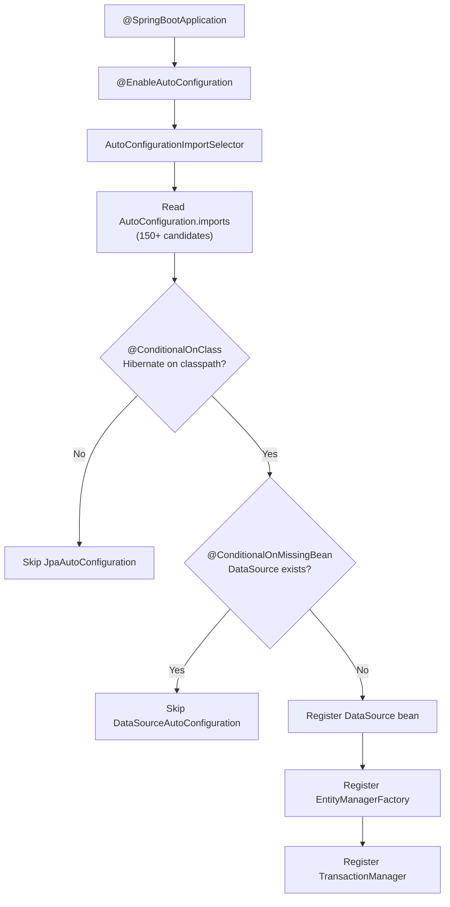

## Keywords in This File
{: .no_toc }

| # | Keyword | Weight |
|---|---|---|
| 1 | [Spring Boot Auto-Configuration](#spring-boot-auto-configuration) | critical |
| 2 | [Spring Boot Starters](#spring-boot-starters) | high |
| 3 | [Spring Boot Actuator](#spring-boot-actuator) | high |
| 4 | [Spring Boot Testing](#spring-boot-testing) | high |
| 5 | [Spring Boot Externalized Configuration](#spring-boot-externalized-configuration) | high |

---

# Spring Boot Auto-Configuration

**Interview Weight:** critical - The core mechanic that
defines Spring Boot. Every senior Spring interview asks
about auto-configuration to confirm you understand what
Boot is actually doing vs. vanilla Spring. Follow-ups
target the debug mechanism, exclusions, and how to write
your own.

---

### 🎯 Model Answer

**30 seconds:**

> Spring Boot auto-configuration automatically configures
> your application based on the JARs on the classpath and
> the properties you have set. If `spring-boot-starter-data-jpa`
> is on the classpath and you have not defined a `DataSource`
> bean, Spring Boot auto-configures a `DataSource`,
> `EntityManagerFactory`, and `TransactionManager` for you.
> Each auto-configuration class uses `@Conditional` annotations
> to check if it should apply. The debug report
> (`--debug` startup flag or `ConditionEvaluationReport`)
> shows what was configured and why.

**3 minutes (Senior):**

> Auto-configuration works through a chain of mechanisms.
> `@SpringBootApplication` includes `@EnableAutoConfiguration`,
> which imports `AutoConfigurationImportSelector`. This
> selector reads `META-INF/spring/org.springframework
> .boot.autoconfigure.AutoConfiguration.imports` (Boot 3.x)
> or `META-INF/spring.factories` (Boot 2.x). This file
> lists all auto-configuration classes to consider.
>
> Each auto-configuration class is annotated with
> `@Conditional` variants: `@ConditionalOnClass` (only if
> a class is on the classpath), `@ConditionalOnMissingBean`
> (only if the bean is not already defined), and
> `@ConditionalOnProperty` (only if a property is set).
> These conditions ensure auto-configuration backs off when
> the user provides their own beans.
>
> Auto-configuration ordering is controlled by
> `@AutoConfigureBefore`, `@AutoConfigureAfter`, and
> `@AutoConfigureOrder`. This ensures `DataSourceAutoConfiguration`
> runs before `JpaBaseConfiguration` (which needs a DataSource).
>
> To override auto-configuration: define your own bean of
> the same type (auto-config sees it via `@ConditionalOnMissingBean`
> and skips). To disable auto-configuration entirely:
> `@SpringBootApplication(exclude = DataSourceAutoConfiguration
> .class)` or `spring.autoconfigure.exclude` property.
> To debug: `--debug` or set `logging.level.org.springframework
> .boot.autoconfigure=DEBUG` to see the `ConditionEvaluationReport`.

**Framework:** TRIGGER (@EnableAutoConfiguration, imports file) →
CONDITIONS (@ConditionalOnClass/Missing/Property) →
ORDERING (Before/After/Order) →
OVERRIDE (own bean beats auto-config) →
DEBUG (--debug, ConditionEvaluationReport)

*Adapting up:* Discuss writing custom auto-configuration
with `@AutoConfiguration`, registering in the imports file,
using `@ConditionalOnSingleCandidate`, and Spring Boot 3's
AOT auto-configuration processing for native images.

*Adapting down:* Spring Boot sees what JARs you have and
automatically sets up beans for you. If you want to customize
it, define your own bean with the same type - Boot's bean
backs off automatically.

**Blank Mind Recovery:**

**(1) Restate:** "You are asking about how Spring Boot
automatically configures the application without XML or
explicit bean definitions."

**(2) First principles:** "Configuration is repetitive.
Every JPA application needs a DataSource, EntityManagerFactory,
TransactionManager. Auto-configuration codifies that
repetition into convention."

**(3) Bridge:** "This is like convention-over-configuration
in Rails: if you follow the convention (have the JPA JAR,
have the datasource properties), the framework does the
configuration for you. You only override when you deviate
from convention."

---

### 📘 Concept Explanation

**What it is:**

Auto-configuration is Spring Boot's mechanism for
registering beans automatically based on classpath contents,
existing beans, and properties. Each auto-configuration
class is a `@Configuration` class conditioned on the
presence of specific classes, missing beans, or property
values.

**The problem it solves:**

Before Spring Boot, setting up a Spring web application
required: configure a DispatcherServlet, set up a
ViewResolver, configure a message converter, set up Jackson,
configure ContentNegotiation. Each Spring project repeated
this setup. Auto-configuration codifies the 95% case into
defaults that apply automatically, leaving only the 5%
customization to the user.

**How it works:**

```
  AUTO-CONFIGURATION LOADING SEQUENCE

  1. @SpringBootApplication includes @EnableAutoConfiguration
  2. AutoConfigurationImportSelector reads:
     META-INF/spring/...AutoConfiguration.imports
     (Boot 3) or spring.factories (Boot 2)
  3. Loads list of ALL auto-configuration candidates
     (e.g., 150+ classes in spring-boot-autoconfigure)
  4. For each candidate, evaluates @Conditional conditions:
     - @ConditionalOnClass: is the class on the classpath?
     - @ConditionalOnMissingBean: is the bean already defined?
     - @ConditionalOnProperty: is the property set?
  5. Passing classes are registered as @Configuration beans
  6. @AutoConfigureAfter/Before ordering is applied
  7. Bean definitions created from @Bean methods
```



> **Diagram walkthrough:** The selector loads all candidate
> auto-configuration classes from the imports file. Each
> candidate then evaluates its conditions from top to bottom.
> `JpaAutoConfiguration` requires Hibernate on the classpath
> (`@ConditionalOnClass`). If present, it checks for an
> existing `DataSource` bean (`@ConditionalOnMissingBean`).
> If you already defined a `DataSource`, the auto-config
> skips it. If not, it creates one from your datasource
> properties. This "back off when user provides" pattern
> is the key design that makes auto-configuration overridable.

**The key insight:**

Auto-configuration backs off via `@ConditionalOnMissingBean`.
You override auto-configured beans by defining your own
bean of the same type in any `@Configuration` class. The
auto-configuration sees your bean exists and skips
registering its version. You never need to explicitly
exclude auto-configurations just to customize - just
provide your own bean.

**When to write custom auto-configuration:**

- Building a shared library that multiple Spring Boot
  services use (database connector, message bus client,
  tracing library)
- Creating a Spring Boot starter for your company's internal
  infrastructure
- Integrating a third-party library into the Spring ecosystem

**When NOT to rely on auto-configuration:**

- Security-critical beans: explicitly verify what auto-config
  registered. `DataSourceAutoConfiguration` may create a
  public H2 console in dev environments if not excluded.
- Complex multi-database setups: auto-configuration assumes
  one DataSource. Two or more DataSources require explicit
  configuration.

---

### 💻 Code Example

**Recognition Example: Reading the debug report**

```
# Run with: java -jar app.jar --debug
# Or: logging.level.org.springframework.boot.autoconfigure=DEBUG

# Positive matches (auto-configured):
JacksonAutoConfiguration matched:
  - @ConditionalOnClass found required class
    'com.fasterxml.jackson.databind.ObjectMapper'
  - @ConditionalOnMissingBean (types:
    com.fasterxml.jackson.databind.ObjectMapper)
    did not find any beans of type ObjectMapper

DataSourceAutoConfiguration matched:
  - @ConditionalOnClass found required classes
    'javax.sql.DataSource', 'org.springframework.jdbc
    .datasource.embedded.EmbeddedDatabaseType'
  - @ConditionalOnMissingBean did not find any beans

# Negative matches (NOT auto-configured, and why):
ReactiveWebServerFactoryAutoConfiguration:
  Did not match:
  - @ConditionalOnClass did not find required class
    'org.springframework.http.ReactiveHttpInputMessage'

# Exclusions (explicitly excluded):
DataSourceAutoConfiguration was excluded because of
    spring.autoconfigure.exclude configuration
```

> **Code walkthrough:** The auto-configuration debug report
> is the primary diagnostic tool. "Positive matches" shows
> what auto-configuration applied and why each condition
> passed. "Negative matches" shows what was considered but
> skipped (usually because a class is not on the classpath).
> "Exclusions" shows what was explicitly excluded. This
> report answers "why is Spring Boot creating this bean?"
> and "why is it NOT creating that bean?" - the two most
> common auto-configuration debugging questions.

**Wrong vs Right: Overriding auto-configuration**

```java
// BAD: excluding and re-implementing from scratch
@SpringBootApplication(exclude = {
    DataSourceAutoConfiguration.class,
    HibernateJpaAutoConfiguration.class,
    TransactionAutoConfiguration.class
})
public class App {
    // Now you must manually configure everything...
    @Bean
    public DataSource dataSource() { ... }
    @Bean
    public EntityManagerFactory emf() { ... }
    @Bean
    public PlatformTransactionManager txManager() { ... }
    // 50+ lines of manual configuration
}
```

```java
// GOOD: just provide your own bean, auto-config backs off
@Configuration
public class DataConfig {
    @Bean  // @ConditionalOnMissingBean sees this and skips
    public DataSource dataSource() {
        HikariConfig config = new HikariConfig();
        config.setJdbcUrl(url);
        config.setMaximumPoolSize(50);    // custom pool size
        config.setConnectionTimeout(3000); // custom timeout
        // HibernateJpaAutoConfiguration and
        // TransactionAutoConfiguration still run normally
        // - they use your custom DataSource
        return new HikariDataSource(config);
    }
}
```

> **Code walkthrough:** The BAD version excludes three
> auto-configuration classes and re-implements everything
> manually. This is 50+ lines of configuration that must
> be maintained as Spring Boot versions change. The GOOD
> version defines only a `DataSource` bean with the custom
> settings. Spring Boot's `DataSourceAutoConfiguration`
> sees the bean exists (`@ConditionalOnMissingBean` fails)
> and skips. The JPA and transaction auto-configurations
> still run and use your custom `DataSource`. One bean
> definition overrides the part you care about, and Boot
> handles the rest.

---

### 🎓 Answers by Seniority

**Junior / Mid (0-5 years):**

> Spring Boot auto-configuration automatically registers
> beans based on what JARs are on the classpath. If the
> Hibernate JAR is present and I have not defined a
> `DataSource` bean, Spring Boot creates one from my
> `application.properties`. Each auto-configuration class
> has conditions that check whether to apply. If I define
> my own bean, the auto-configuration sees it and backs
> off - I do not need to explicitly exclude anything. To
> see what auto-configuration ran and why, I run with
> `--debug` and read the `ConditionEvaluationReport`.

*Push deeper:* Explain `@ConditionalOnMissingBean` ordering
gotchas and how to write a custom auto-configuration.

---

**Senior / Staff (5+ years):**

> Auto-configuration works via `AutoConfigurationImportSelector`
> reading `AutoConfiguration.imports` (or `spring.factories`
> in Boot 2.x) to get all candidates. Each candidate is a
> `@Configuration` class conditioned on classpath, missing
> beans, and properties. The "back off on user beans" pattern
> via `@ConditionalOnMissingBean` is the key design. The
> `@ConditionalOnMissingBean` ordering issue: if your custom
> bean is declared in a configuration class loaded AFTER
> the auto-configuration bean, the auto-config sees no
> existing bean and registers itself. Solution: prefer
> letting auto-configuration run first (it is ordered
> via `@AutoConfigureAfter`) - your `@Configuration` class
> is loaded in the normal Spring context, which loads AFTER
> auto-configuration. For custom library auto-configuration:
> annotate with `@AutoConfiguration` (Boot 3) or `@Configuration`
> + register in `spring.factories` (Boot 2), use
> `@ConditionalOnMissingBean` for all `@Bean` methods, test
> with `ApplicationContextRunner`.

*Push deeper:* Discuss AOT processing of auto-configuration
for native images, `@AutoConfigureBefore/After` ordering,
and `ApplicationContextRunner` for testing auto-configuration.

---

### ⚖️ Comparison Table

| Mechanism | When It Applies | Override Method |
|---|---|---|
| `@ConditionalOnClass` | If class is on classpath | Remove the JAR |
| `@ConditionalOnMissingBean` | If no bean of type exists | Define your own bean |
| `@ConditionalOnProperty` | If property is set to value | Change the property |
| `spring.autoconfigure.exclude` | Hard exclude regardless of conditions | N/A (explicit disable) |
| `@SpringBootApplication(exclude=...)` | Compile-time exclude | N/A (explicit disable) |

**The deciding factor:** Customize behavior? Define your
own bean. Completely disable a feature (no DataSource at all)?
Use `exclude`. Debug why something is or isn't configured?
Use `--debug`.

---

### ⚠️ Common Misconceptions

| # | Misconception | Reality | Danger |
|---|---|---|---|
| 1 | Spring Boot auto-configuration requires no understanding - it "just works" | Auto-configuration applies 150+ bean registrations based on classpath. Without understanding which beans are auto-configured, you may have security misconfigurations (H2 console enabled), unexpected double beans, or missing expected beans. | H2 console exposed in production (DataSourceAutoConfiguration + H2ConsoleAutoConfiguration active without auth) |
| 2 | You must exclude auto-configuration to customize beans | `@ConditionalOnMissingBean` backs off when you define your own bean. Exclusion is only needed to disable a feature entirely. | Unnecessary complexity from manual configuration of the entire JPA stack |
| 3 | All auto-configuration classes in `spring.factories` are always loaded | The file lists candidates. Each candidate is evaluated against conditions. Most candidates are NOT applied in a typical application because their conditions don't match. | No performance concern - unapplied candidates are just skipped |
| 4 | `@ConditionalOnMissingBean` works regardless of bean registration order | The condition checks beans registered at the time the condition is evaluated. User `@Configuration` classes load in the main context phase; auto-configuration loads in the import phase before that. Auto-configuration correctly sees user beans. | Usually works, but custom `ImportSelector`s or early-loading configurations may cause unexpected condition evaluation order |

---

### 🚨 Failure Modes and Diagnosis

**Failure 1 - H2 console exposed in production**

Symptom: `GET /h2-console` returns a web page in a
production application. Security audit flag.

Root cause: `spring-boot-starter-data-jpa` or `h2` on the
classpath triggers `H2ConsoleAutoConfiguration`. The H2
console is enabled by default in dev profile or without
Spring Security active.

Diagnostic: Check `GET /actuator/beans` for `h2Console`
bean. Check `spring.h2.console.enabled` property.

Fix:
```properties
# Explicitly disable H2 console in production
spring.h2.console.enabled=false
```
Or exclude:
```java
@SpringBootApplication(exclude =
    H2ConsoleAutoConfiguration.class)
```

---

**Failure 2 - Expected auto-configured bean is missing**

Symptom: Application fails with `NoSuchBeanDefinitionException`
for a bean you expected Spring Boot to auto-configure.

Root cause: The condition for the auto-configuration was
not met (wrong JAR, existing bean of same type, property
not set).

Diagnostic:
1. Run with `--debug`. Look for the auto-configuration class
   in "Negative matches" or "Unconditional classes".
2. Check which condition failed and why.
3. Verify the JAR is in the classpath (for `@ConditionalOnClass`).
4. Check if an unexpected bean of the same type is registered
   (for `@ConditionalOnMissingBean`).

Fix: Address the failed condition - add the JAR, remove the
conflicting bean, or provide the required property.

---

### 🎯 Interview Deep-Dive

| Preparation time | Recommended approach |
|---|---|
| 15 min | Explain what auto-configuration is and how to override it |
| 30 min | Add the debug report and how to read it |
| 45 min | Add @ConditionalOnMissingBean override pattern vs exclusion |
| 1 hour | Add AutoConfiguration.imports file structure |
| 2 hours | Write a custom auto-configuration for a mock library |

---

**[JUNIOR] Q1: What does @SpringBootApplication do?**
[CONCEPTUAL]

*Why they ask:* Tests understanding of the entry point annotation.

*Likely follow-up:* "What would happen if you split
@SpringBootApplication into its component annotations?"

`@SpringBootApplication` is a composed annotation combining
three annotations:

1. `@SpringBootConfiguration`: marks this as a
   `@Configuration` class (a source of bean definitions)
2. `@EnableAutoConfiguration`: triggers auto-configuration
   via `AutoConfigurationImportSelector`
3. `@ComponentScan`: scans the package of the annotated class
   and all sub-packages for Spring components
   (`@Component`, `@Service`, `@Repository`, `@Controller`)

Splitting it into the three separate annotations is equivalent
and sometimes done when you need to customize individual
behavior - for example, using `@ComponentScan(basePackages
= {"com.example.a", "com.example.b"})` to scan specific
packages instead of the default.

`@SpringBootApplication` is placed on the main class. The
class's package becomes the base package for component
scanning. This is why the convention of placing the main
class in the top-level package (e.g., `com.example`) and
all application code in sub-packages (e.g., `com.example
.service`) is important: component scanning covers the
entire application.

*What separates good from great:* Knowing that the base
package for component scanning is the main class's package -
placing the main class in `com.example` scans all of
`com.example.*` but NOT other root packages.

---

**[MID] Q2: How would you debug why an expected bean is
not auto-configured?** [DEBUGGING]

*Why they ask:* Tests practical debugging of Boot's magic.

*Likely follow-up:* "What is the ConditionEvaluationReport?"

Three-step debugging approach:

1. **Run with `--debug` flag**:
   `java -jar app.jar --debug`
   This activates the `ConditionEvaluationReport` which
   logs all auto-configuration decisions.

2. **Read the negative matches**:
   The report shows every auto-configuration class that
   did NOT apply and the condition that failed. Example:
   ```
   DataSourceAutoConfiguration:
     Did not match:
     - @ConditionalOnClass did not find required classes
       'javax.sql.DataSource' (OnClassCondition)
   ```
   This tells you the condition and exactly what was missing.

3. **Address the failed condition**:
   - `OnClassCondition`: add the required JAR
   - `OnMissingBeanCondition`: remove or rename the
     existing conflicting bean
   - `OnPropertyCondition`: set the required property

Alternatively: `GET /actuator/conditions` (Spring Boot
Actuator) provides the condition evaluation report as JSON
at runtime without restarting with `--debug`.

*What separates good from great:* Knowing about
`/actuator/conditions` endpoint as a runtime diagnostic
without needing to restart with a flag - especially useful
in deployed environments.

---

**[SENIOR] Q3: How would you write a custom auto-configuration
for an internal HTTP client library?** [HANDS-ON]

*Why they ask:* Tests ability to extend Spring Boot's
auto-configuration mechanism.

*Likely follow-up:* "How do you test auto-configuration?"

```java
// 1. The auto-configuration class
@AutoConfiguration  // Boot 3 annotation
@ConditionalOnClass(InternalHttpClient.class)
@EnableConfigurationProperties(InternalHttpClientProperties.class)
public class InternalHttpClientAutoConfiguration {

    @Bean
    @ConditionalOnMissingBean  // Back off if user provides own
    public InternalHttpClient internalHttpClient(
        InternalHttpClientProperties props) {
        return InternalHttpClient.builder()
            .timeout(props.getTimeout())
            .maxConnections(props.getMaxConnections())
            .build();
    }
}

// 2. Properties class
@ConfigurationProperties(prefix = "internal.http")
public class InternalHttpClientProperties {
    private Duration timeout = Duration.ofSeconds(5);
    private int maxConnections = 50;
    // getters/setters
}

// 3. Register in META-INF/spring/
// org.springframework.boot.autoconfigure.AutoConfiguration.imports
// (Boot 3) or META-INF/spring.factories (Boot 2):
// com.example.InternalHttpClientAutoConfiguration

// 4. Test with ApplicationContextRunner
class InternalHttpClientAutoConfigurationTest {
    private final ApplicationContextRunner runner =
        new ApplicationContextRunner()
            .withConfiguration(
                AutoConfigurations.of(
                    InternalHttpClientAutoConfiguration.class
                ));

    @Test
    void registersClientWhenClassPresent() {
        runner.run(ctx ->
            assertThat(ctx)
                .hasSingleBean(InternalHttpClient.class));
    }

    @Test
    void backsOffWhenBeanPresent() {
        runner.withBean(InternalHttpClient.class,
            () -> mock(InternalHttpClient.class))
            .run(ctx ->
                assertThat(ctx)
                    .hasSingleBean(InternalHttpClient.class)
                    .doesNotHaveBean(
                        InternalHttpClientAutoConfiguration
                        .class));
    }
}
```

*What separates good from great:* Using `ApplicationContextRunner`
to test auto-configuration in isolation - this is the
standard testing approach recommended by the Spring Boot docs.

---

**[STAFF] Q4: How does Spring Boot auto-configuration
interact with GraalVM native image compilation?**
[ARCHITECTURE]

*Why they ask:* Tests awareness of Boot's modern evolution.

*Likely follow-up:* "What is Spring AOT processing?"

GraalVM native images require all reflection, proxy
generation, and classpath scanning to be declared at
build time (closed-world assumption).

Auto-configuration traditionally relies on runtime
classpath scanning (to evaluate `@ConditionalOnClass`),
CGLIB proxy generation (for `@Configuration` classes),
and dynamic bean registration.

Spring Boot 3 AOT engine processes auto-configuration at
build time:

1. During the build, the AOT engine loads all auto-
   configuration candidates and evaluates conditions using
   the build classpath.
2. Conditions that pass at build time generate static bean
   registration code (no reflection needed at runtime).
3. Conditions that cannot be evaluated at build time
   (like `@ConditionalOnProperty` with runtime values)
   generate conditional checks in the static code.
4. CGLIB proxies are generated at build time as compiled
   classes.

For custom auto-configuration to be AOT-compatible:
- Use `@ConditionalOnClass` (build-time evaluable)
- Use `proxyBeanMethods = false` where possible
- Register reflection hints for any classes accessed
  via reflection using `RuntimeHintsRegistrar`

*What separates good from great:* Understanding the shift
from runtime conditional evaluation to build-time static
generation - and why `@ConditionalOnProperty` still works
at runtime (the property value is not known at build time,
so it generates conditional code that runs at startup).

| Interviewer Type | Emphasis |
|---|---|
| Technical Panel | Lead with condition evaluation mechanism and debug report. |
| Hiring Manager | Lead with the productivity gain: zero boilerplate configuration. |
| Bar Raiser | Lead with writing custom auto-configuration and AOT compatibility. |
| Peer Engineer | "The first time you read the --debug auto-config report you realize how much Boot is actually doing for you..." |

---

---

# Spring Boot Starters

**Interview Weight:** high - Asked to confirm you understand
the dependency management model. Follow-ups target
transitive dependency exclusion, custom starters, and
why starters exist as a separate concept from auto-configuration.

---

### 🎯 Model Answer

**30 seconds:**

> Spring Boot starters are curated dependency bundles.
> `spring-boot-starter-web` pulls in Spring MVC, Tomcat,
> Jackson, and all their transitive dependencies at
> compatible versions, so you do not need to know every
> JAR needed for a web application. A starter JAR itself
> typically contains no code - it is just a `pom.xml`
> (or `build.gradle`) that lists the right dependencies.
> Auto-configuration is a separate concern: it is triggered
> by the JARs on the classpath regardless of which starter
> added them.

**3 minutes (Senior):**

> Starters solve two problems: dependency discovery and
> version compatibility. Without starters, developers must
> know which JARs are needed for a given feature and which
> versions are compatible. A Spring MVC application needs:
> `spring-webmvc`, `spring-web`, `spring-context`,
> `jackson-databind`, `jackson-core`, `jackson-annotations`,
> `tomcat-embed-core`, and many more. Getting compatible
> versions requires consulting release notes.
>
> Starters solve this by packaging related dependencies
> together. `spring-boot-starter-web` has exactly the right
> dependencies at verified-compatible versions. The version
> compatibility is managed by `spring-boot-dependencies`
> BOM (Bill of Materials), which defines versions for all
> Spring and third-party JARs. When you import the BOM
> (`spring-boot-starter-parent` parent POM or `dependencyManagement`
> import), you do not need to specify versions for any
> starter dependency.
>
> A starter can also trigger auto-configuration by ensuring
> the required auto-configuration classes are on the classpath.
> `spring-boot-starter-data-jpa` includes Hibernate, which
> triggers `HibernateJpaAutoConfiguration`. But the starter
> and auto-configuration are separate artifacts: you can
> use a library without its starter (manage deps manually)
> or use a starter without relying on auto-configuration
> (exclude and configure manually).

**Framework:** PROBLEM (dep discovery + version compat) →
STARTER (bundled deps, no code) →
BOM (spring-boot-dependencies, version management) →
TRIGGER (classpath presence triggers auto-config) →
CUSTOM (company-wide starter for internal libs)

*Adapting up:* Discuss creating company custom starters
(naming convention `{company}-{feature}-spring-boot-starter`),
transitive dependency exclusion (`<exclusions>` in Maven),
and the `spring-boot-autoconfigure` vs `spring-boot-starter`
artifact split.

*Adapting down:* A starter is a pre-packaged set of
dependencies. Adding `spring-boot-starter-web` to your
pom.xml gives you everything needed for a web app. No
need to add Spring MVC, Tomcat, and Jackson separately.

---

### 📘 Concept Explanation

**What it is:**

A Spring Boot starter is a Maven/Gradle dependency artifact
that contains only a `pom.xml` (no Java code) listing
all the transitive dependencies needed for a specific
feature. Adding one starter provides all required JARs at
compatible versions.

**The problem it solves:**

Dependency compatibility management. Without starters,
developers manually assemble JARs and face "dependency
hell": `jackson-databind` 2.12 requires `jackson-core`
2.12 but another library pulled in `jackson-core` 2.9.
Starters and the BOM pin all versions together.

**How it works:**

The Spring Boot BOM (`spring-boot-dependencies`) defines
versions for 200+ dependencies. Importing the BOM (via
`spring-boot-starter-parent` or `dependencyManagement`)
means you never specify a version for managed dependencies.

A starter such as `spring-boot-starter-data-jpa` is just:

```xml
<dependencies>
  <dependency>
    <groupId>org.springframework.boot</groupId>
    <artifactId>spring-boot-starter</artifactId>
  </dependency>
  <dependency>
    <groupId>org.springframework.boot</groupId>
    <artifactId>spring-boot-starter-aop</artifactId>
  </dependency>
  <dependency>
    <groupId>org.springframework.boot</groupId>
    <artifactId>spring-boot-starter-jdbc</artifactId>
  </dependency>
  <dependency>
    <groupId>org.hibernate.orm</groupId>
    <artifactId>hibernate-core</artifactId>
  </dependency>
  <!-- spring-data-jpa, jakarta.persistence-api, etc. -->
</dependencies>
```

The presence of Hibernate and Spring Data JPA on the
classpath then triggers their respective auto-configurations.

**Naming conventions:**

- Official Spring Boot starters: `spring-boot-starter-{name}`
- Third-party library starters: `{name}-spring-boot-starter`
- Custom company starters: `{company}-{name}-spring-boot-starter`

Never name a custom starter `spring-boot-starter-*` -
that namespace is reserved for official Spring artifacts.

**When to create custom starters:**

- Shared infrastructure for multiple internal services
  (metrics, audit logging, internal HTTP client, internal
  authentication library)
- Each service adds one starter and gets all dependencies,
  configuration, and auto-configured beans

---

### 💻 Code Example

**Production Example: Excluding transitive dependency**

```xml
<!-- Common: exclude Tomcat to use Jetty instead -->
<dependency>
  <groupId>org.springframework.boot</groupId>
  <artifactId>spring-boot-starter-web</artifactId>
  <exclusions>
    <exclusion>
      <!-- Remove Tomcat from spring-boot-starter-web -->
      <groupId>org.springframework.boot</groupId>
      <artifactId>spring-boot-starter-tomcat</artifactId>
    </exclusion>
  </exclusions>
</dependency>

<!-- Add Jetty instead -->
<dependency>
  <groupId>org.springframework.boot</groupId>
  <artifactId>spring-boot-starter-jetty</artifactId>
</dependency>
```

> **Code walkthrough:** `spring-boot-starter-web` bundles
> Tomcat as the default embedded servlet container. By
> excluding `spring-boot-starter-tomcat` and adding
> `spring-boot-starter-jetty`, the classpath now has Jetty
> instead of Tomcat. `EmbeddedWebServerFactoryCustomizerAutoConfiguration`
> detects Jetty on the classpath and auto-configures the
> Jetty server. This is the typical pattern for switching
> embedded servers (Tomcat to Jetty or Undertow) without
> changing any application code.

**Production Example: Custom company starter**

```
my-company-tracing-spring-boot-starter/
  src/main/resources/
    META-INF/spring/
      ...AutoConfiguration.imports   # lists auto-config
  pom.xml                            # lists dependencies
  (NO Java source code in the starter artifact itself)

my-company-tracing-autoconfigure/
  src/main/java/
    TracingAutoConfiguration.java    # @AutoConfiguration
    TracingProperties.java           # @ConfigurationProperties
  src/main/resources/
    META-INF/spring/
      ...AutoConfiguration.imports
```

```java
// Any microservice adds one dependency:
// <dependency>
//   <groupId>com.mycompany</groupId>
//   <artifactId>my-company-tracing-spring-boot-starter</artifactId>
// </dependency>
// Gets: Micrometer tracing, correlation ID propagation,
// log MDC injection, all auto-configured.
```

> **Code walkthrough:** The convention of splitting a custom
> starter into two artifacts (starter + autoconfigure) mirrors
> the Spring Boot architecture. The `starter` artifact is
> pure dependency management. The `autoconfigure` artifact
> contains the Java code. This allows other projects to
> depend on just the `autoconfigure` if they want the
> configuration classes without the full dependency bundle.
> Services depend on the `starter`, which transitively
> brings in both.

---

### 🎓 Answers by Seniority

**Junior / Mid (0-5 years):**

> Spring Boot starters are dependency bundles that provide
> all JARs needed for a feature. `spring-boot-starter-web`
> gives me Spring MVC, Tomcat, and Jackson without having
> to know all the individual JARs. The version management
> is handled by the Spring Boot BOM. Starters are separate
> from auto-configuration: a starter adds JARs to the
> classpath, and those JARs trigger auto-configuration.
> I can exclude transitive dependencies from a starter using
> Maven's `<exclusions>` block.

*Push deeper:* Explain the BOM and why you do not specify
versions for starter dependencies.

---

**Senior / Staff (5+ years):**

> Starters solve dependency discovery and version compatibility.
> The `spring-boot-dependencies` BOM pins all managed
> dependency versions. Starters are just POM-only artifacts
> with no code. The code (auto-configuration classes) lives
> in `spring-boot-autoconfigure`. This separation matters:
> the classpath presence (from the starter) triggers auto-
> configuration, but the two are independent. For company-
> wide starters, the naming convention is
> `{company}-{feature}-spring-boot-starter`, and the starter
> artifact should depend on a `{company}-{feature}-spring-boot-autoconfigure`
> artifact containing the actual `@AutoConfiguration` classes.
> Testing: use `ApplicationContextRunner` to test auto-configuration
> in isolation from the starter dependencies.

*Push deeper:* Discuss how Spring Boot manages third-party
library versions that conflict with Boot's BOM, and
`spring-boot-starter-parent` vs manual BOM import.

---

### ⚖️ Comparison Table

| Concern | Starter | Auto-Configuration |
|---|---|---|
| What it is | POM-only dependency bundle | `@Configuration` class with conditions |
| Contains code? | No | Yes (bean factory methods) |
| Purpose | Puts JARs on classpath | Registers beans from those JARs |
| Override? | Exclude deps | Define your own bean |
| Testing tool | N/A (it's just pom.xml) | `ApplicationContextRunner` |

**The key relationship:** Starter puts JARs on classpath →
auto-configuration sees JARs via `@ConditionalOnClass` →
beans are registered. They are separate but designed to
work together.

---

### ⚠️ Common Misconceptions

| # | Misconception | Reality | Danger |
|---|---|---|---|
| 1 | Starter and auto-configuration are the same thing | Starters are dependency management (POM only). Auto-configuration is bean registration (`@Configuration` with conditionals). A starter may trigger auto-configuration, but they are separate artifacts. | Confusion about where to put code when writing a custom starter |
| 2 | You must use a starter to get auto-configuration | Auto-configuration is triggered by classpath presence. If you manually add the required JARs without a starter, auto-configuration still applies. | No practical danger, just a conceptual misunderstanding |
| 3 | The starter version pinning is automatic with no parent POM | BOM version management only applies when you import `spring-boot-dependencies` or use `spring-boot-starter-parent`. Without the BOM, you specify versions manually and risk compatibility issues. | Dependency conflicts when mixing Spring Boot starters without the BOM |
| 4 | Custom starters can be named `spring-boot-starter-*` | That namespace is reserved for official Spring Boot artifacts. Custom starters must use the `{name}-spring-boot-starter` convention. | Potential naming conflict and confusion with official starters |

---

### 🚨 Failure Modes and Diagnosis

**Failure 1 - NoClassDefFoundError at runtime after adding starter**

Symptom: Application starts fine but throws
`NoClassDefFoundError` at runtime when calling a specific
feature.

Root cause: A transitive dependency was excluded from the
starter (possibly by another starter's exclusion block)
or the version was overridden to an incompatible version.

Diagnostic: Run `mvn dependency:tree` (Maven) or
`./gradlew dependencies` (Gradle). Look for the expected
class's JAR:
- Is it present?
- Is it the expected version?
- Is it marked as `(conflict with ...)` or `(excluded)`?

Fix: Remove the exclusion, add the dependency explicitly,
or align versions.

---

**Failure 2 - Conflicting versions between two starters**

Symptom: Startup fails with `ClassCastException` or
`NoSuchMethodError` when two libraries that share a
transitive dependency use incompatible versions.

Root cause: Two starters pull in different versions of
the same transitive dependency (e.g., two starters
require different versions of `jackson-databind`).

Diagnostic: `mvn dependency:tree | grep jackson`
Look for `(conflict with ...)` annotations.

Fix: Add an explicit dependency in your `pom.xml` to force
the correct version. Or use `<dependencyManagement>` to
pin the version:
```xml
<dependencyManagement>
  <dependencies>
    <dependency>
      <groupId>com.fasterxml.jackson.core</groupId>
      <artifactId>jackson-databind</artifactId>
      <version>2.15.4</version>
    </dependency>
  </dependencies>
</dependencyManagement>
```

---

### 🎯 Interview Deep-Dive

| Preparation time | Recommended approach |
|---|---|
| 15 min | Explain what a starter is and why it exists |
| 30 min | Add BOM and version management |
| 45 min | Add custom starter creation and naming convention |
| 1 hour | Add transitive dependency exclusion and conflict resolution |

---

**[JUNIOR] Q1: What is the difference between
spring-boot-starter-web and spring-boot-starter-webflux?**
[COMPARISON]

*Why they ask:* Tests understanding of starter selection.

*Likely follow-up:* "Can you include both in the same project?"

`spring-boot-starter-web` sets up a blocking, servlet-based
web stack: Spring MVC, embedded Tomcat, Jackson. Uses a
thread-per-request model. Standard choice for traditional
REST APIs.

`spring-boot-starter-webflux` sets up a reactive, non-blocking
web stack: Spring WebFlux, embedded Netty (default), Project
Reactor. Uses an event loop model. For reactive programming
with `Flux` and `Mono`.

Including both is possible but unusual. Spring Boot will
default to the servlet stack when both are present (you need
to explicitly set `spring.main.web-application-type=reactive`
to force reactive). Mixed configurations can create subtle
bugs.

The practical choice: use `spring-boot-starter-web` for
standard APIs with blocking I/O. Use `spring-boot-starter-webflux`
for reactive applications with non-blocking I/O (streaming,
SSE, high-concurrency with low thread counts).

*What separates good from great:* Knowing that including
both starters does not automatically give you a mixed stack
- Spring Boot selects one web application type, and the
default with both present is servlet.

---

**[MID] Q2: How does the Spring Boot BOM help with
dependency management?** [MECHANISM]

*Why they ask:* Tests build tool and version management depth.

*Likely follow-up:* "How do you override a BOM-managed version?"

The Spring Boot BOM (`spring-boot-dependencies`) is a POM
file that defines `<dependencyManagement>` for hundreds of
libraries. When you import it, every managed dependency
can be used without specifying a version - the BOM provides
the compatible version.

Two ways to import the BOM:

1. `spring-boot-starter-parent` parent POM: inherits the
   BOM + plugin configurations + resource filtering. The
   simplest option.

2. Manual `dependencyManagement` import: for projects that
   already have a different parent POM:
   ```xml
   <dependencyManagement>
     <dependencies>
       <dependency>
         <groupId>org.springframework.boot</groupId>
         <artifactId>spring-boot-dependencies</artifactId>
         <version>3.2.0</version>
         <type>pom</type>
         <scope>import</scope>
       </dependency>
     </dependencies>
   </dependencyManagement>
   ```

To override a BOM-managed version: add the dependency
explicitly to `<dependencyManagement>` with your version.
Maven uses the most specific declaration (your override
wins over the imported BOM):
```xml
<dependencyManagement>
  <dependencies>
    <!-- Override Jackson version from BOM -->
    <dependency>
      <groupId>com.fasterxml.jackson.core</groupId>
      <artifactId>jackson-databind</artifactId>
      <version>2.16.0</version>  <!-- overrides BOM -->
    </dependency>
  </dependencies>
</dependencyManagement>
```

*What separates good from great:* Knowing the two BOM
import methods, and the correct technique for overriding
a specific BOM-managed version (explicit `dependencyManagement`
entry, not a direct dependency).

| Interviewer Type | Emphasis |
|---|---|
| Technical Panel | Lead with BOM and version management mechanism. |
| Hiring Manager | Lead with the productivity value: one line vs 20 JAR declarations. |
| Bar Raiser | Lead with custom starter architecture and ApplicationContextRunner testing. |
| Peer Engineer | "The dependency:tree command has saved me from countless ClassCastExceptions..." |

---

---

# Spring Boot Actuator

**Interview Weight:** high - Every production Spring Boot
interview asks about Actuator for observability and ops.
Key follow-ups: securing endpoints, custom health indicators,
custom metrics with Micrometer, and `/actuator/env` for
configuration debugging.

---

### 🎯 Model Answer

**30 seconds:**

> Spring Boot Actuator exposes HTTP endpoints and JMX beans
> for monitoring and managing a running application. The
> key endpoints: `/actuator/health` (liveness/readiness for
> Kubernetes), `/actuator/metrics` (Micrometer metrics -
> JVM, HTTP, database), `/actuator/env` (environment and
> property values), `/actuator/beans` (registered beans),
> `/actuator/conditions` (auto-configuration report), and
> `/actuator/loggers` (change log levels at runtime without
> restart). All non-health endpoints are disabled by default
> and must be explicitly exposed.

**3 minutes (Senior):**

> Actuator adds an observation layer to the running
> application without changing business code. It integrates
> with Micrometer for metrics (counter, gauge, timer,
> distribution summary) exported to any monitoring backend
> (Prometheus, Datadog, CloudWatch) via a single `management
> .metrics.export.*` property.
>
> The health endpoint supports hierarchical health indicators.
> `DataSourceHealthIndicator` checks if the database is
> reachable; `DiskSpaceHealthIndicator` checks available disk.
> Spring Boot 2.3+ split health into liveness (`/actuator/
> health/liveness`) and readiness (`/actuator/health/readiness`)
> for Kubernetes probes. Liveness: is the JVM alive (not
> deadlocked)? Readiness: can the app serve traffic (is the
> context fully started, are dependencies available)?
>
> Security: expose only what is needed. In production:
> expose `/health` (Kubernetes probes), `/metrics` (Prometheus),
> and no others - or put management endpoints on a separate
> port accessible only internally. Never expose `/env`,
> `/beans`, or `/threaddump` to the public internet.
>
> Custom health indicator:
> ```java
> @Component
> public class ExternalApiHealth implements HealthIndicator {
>     public Health health() {
>         return apiClient.ping().isOk()
>             ? Health.up().build()
>             : Health.down()
>                 .withDetail("reason", "API unreachable")
>                 .build();
>     }
> }
> ```

**Framework:** ENDPOINTS (health, metrics, env, loggers) →
SECURITY (expose selectively, management port) →
HEALTH GROUPS (liveness, readiness for Kubernetes) →
MICROMETER (metrics export, counters, timers) →
CUSTOM INDICATORS (HealthIndicator, @Timed)

*Adapting up:* Discuss `@Timed` and `MeterRegistry` for
custom application metrics, `ObservationRegistry` (Spring
Boot 3 observation API), Prometheus scrape configuration,
and Kubernetes pod health probe configuration.

*Adapting down:* Actuator is like an admin panel built
into your app. `/health` tells you if it is running.
`/metrics` shows performance data. `/loggers` lets you
change log levels without restarting.

---

### 📘 Concept Explanation

**What it is:**

Spring Boot Actuator is a sub-module of Spring Boot that
adds production-ready features: health checks, metrics,
environment info, thread dumps, HTTP trace, bean listings,
and more via HTTP endpoints. It integrates with Micrometer
for metrics collection and export.

**The problem it solves:**

Observability in production. Without Actuator: checking
if the database is reachable requires adding custom /health
code; getting JVM metrics requires JMX tools; changing a
log level requires SSH + config file edit + restart.
Actuator provides these out of the box.

**How it works:**

Actuator endpoints are implemented as Spring beans that
implement `Endpoint` (for generic) or `WebEndpoint` for
HTTP. They are discovered by Actuator infrastructure and
mapped to HTTP paths under `/actuator/`.

Endpoint visibility is controlled by two properties:
- `management.endpoints.enabled-by-default=false`: whether
  endpoints are enabled by default
- `management.endpoints.web.exposure.include`: which enabled
  endpoints are exposed over HTTP

Health endpoint: aggregates `HealthIndicator` beans. Each
indicator contributes `UP`, `DOWN`, or `OUT_OF_SERVICE`
status. The overall health is the worst status of all
indicators.

Metrics: Micrometer's `MeterRegistry` is auto-wired into
every auto-configured bean that produces metrics (Tomcat,
Hikari, JVM). Custom metrics: inject `MeterRegistry` and
create `Counter`, `Timer`, `Gauge` objects.

**When to use each endpoint:**

| Endpoint | Use Case |
|---|---|
| `/health` | Kubernetes liveness/readiness probes |
| `/metrics` | Prometheus scraping |
| `/env` | Debugging which property value is active |
| `/loggers` | Change log levels in production without restart |
| `/threaddump` | Diagnosing thread contention or deadlock |
| `/conditions` | Debugging auto-configuration decisions |
| `/beans` | Confirming which beans are registered |

---

### 💻 Code Example

**Production Example: Health indicator and custom metric**

```java
// Custom health indicator for external dependency
@Component
public class PaymentGatewayHealth
    implements HealthIndicator {

    private final PaymentGatewayClient client;

    public PaymentGatewayHealth(
        PaymentGatewayClient client) {
        this.client = client;
    }

    @Override
    public Health health() {
        try {
            PingResponse r = client.ping();
            if (r.isHealthy()) {
                return Health.up()
                    .withDetail("latencyMs",
                        r.getLatencyMs())
                    .build();
            }
            return Health.down()
                .withDetail("reason", r.getErrorCode())
                .build();
        } catch (Exception e) {
            return Health.down(e).build();
        }
    }
}

// Custom business metric with Micrometer
@Service
public class OrderService {
    private final Counter orderCounter;
    private final Timer orderTimer;

    public OrderService(MeterRegistry registry) {
        this.orderCounter = Counter.builder("orders.placed")
            .description("Total orders placed")
            .tag("channel", "web")
            .register(registry);

        this.orderTimer = Timer.builder("orders.processing")
            .description("Order processing time")
            .register(registry);
    }

    public Order placeOrder(OrderRequest req) {
        return orderTimer.record(() -> {
            Order order = processOrder(req);
            orderCounter.increment();
            return order;
        });
    }
}
```

> **Code walkthrough:** `PaymentGatewayHealth` implements
> `HealthIndicator.health()`. Spring Actuator discovers it
> and includes its status in `/actuator/health`. When the
> payment gateway is unreachable, the health endpoint returns
> `DOWN` - Kubernetes readiness probe sees this and stops
> routing traffic to the pod until it recovers. The
> `OrderService` injects `MeterRegistry` and creates named
> metrics with tags. Prometheus scrapes `/actuator/metrics/
> orders.placed` and `/actuator/metrics/orders.processing`.
> Grafana dashboards can then show order rate and latency.

**Wrong vs Right: Actuator security**

```properties
# BAD: all endpoints exposed to the world
management.endpoints.web.exposure.include=*
# Every endpoint accessible at /actuator/*
# /actuator/env shows all properties including secrets
# /actuator/shutdown allows remote JVM termination
```

```properties
# GOOD: minimal exposure, management on internal port
# Only expose health and metrics
management.endpoints.web.exposure.include=health,metrics
management.endpoint.health.show-details=when-authorized
# Put management on a separate internal port
management.server.port=8081
# Kubernetes probes use 8081 (internal network only)
# Public port 8080 has no /actuator access
```

> **Code walkthrough:** `management.endpoints.web.exposure
> .include=*` exposes every Actuator endpoint including
> `/actuator/env` (shows all property values including
> database passwords, API keys injected via environment
> variables), `/actuator/heapdump` (downloads the full JVM
> heap - contains all in-memory data), and `/actuator/shutdown`
> (if enabled, terminates the JVM remotely). The GOOD version
> exposes only `health` and `metrics` (needed for Kubernetes
> and Prometheus), moves management to a separate port, and
> requires authorization to see health details. The management
> port is only accessible within the Kubernetes cluster
> network, not from the internet.

---

### 🎓 Answers by Seniority

**Junior / Mid (0-5 years):**

> Spring Boot Actuator adds monitoring endpoints to my
> application. The most important is `/actuator/health` -
> it returns UP or DOWN, which Kubernetes uses for liveness
> and readiness probes. `/actuator/metrics` exposes JVM
> and application metrics that Prometheus can scrape.
> `/actuator/loggers` lets me change log levels at runtime
> without restarting. I only expose the endpoints I need
> (health and metrics) and put them on an internal port so
> they are not accessible from the public internet.

*Push deeper:* Explain custom health indicators and
Micrometer metric types.

---

**Senior / Staff (5+ years):**

> Actuator is the observability backbone. The three non-
> negotiable endpoints for production: `/health` for
> Kubernetes probes (split into liveness and readiness in
> Boot 2.3+), `/metrics` for Prometheus scraping, and
> `/loggers` for runtime debug without restart. Custom health
> indicators for every external dependency: if the payment
> gateway, message broker, or cache is unreachable, the
> readiness probe should return DOWN so traffic stops routing
> to the pod. Micrometer's counter and timer are the two
> most useful metric types: counter for rates (orders/second,
> errors/second), timer for latency histograms. Security:
> management port should be on an internal network, never
> exposed to the internet. `/actuator/env` shows ALL properties
> including injected secrets - never expose it publicly.

*Push deeper:* Discuss `ObservationRegistry` in Spring Boot 3
(unified tracing + metrics API), custom `Endpoint`
implementations, and health group configuration for
Kubernetes probes.

---

### ⚖️ Comparison Table

| Endpoint | Default Enabled | Default Exposed | Production Use |
|---|---|---|---|
| `/health` | Yes | Yes | Kubernetes probes, always expose |
| `/metrics` | Yes | No | Prometheus, expose on internal port |
| `/loggers` | Yes | No | Runtime debug, expose on internal port |
| `/env` | Yes | No | Config debug only, never public |
| `/heapdump` | Yes | No | Incident analysis only, never public |
| `/shutdown` | No | No | Avoid enabling |
| `/conditions` | Yes | No | Debugging auto-config, dev only |

---

### ⚠️ Common Misconceptions

| # | Misconception | Reality | Danger |
|---|---|---|---|
| 1 | `management.endpoints.web.exposure.include=*` is safe for development | It exposes `/actuator/heapdump` which downloads all in-memory data, and `/actuator/env` which shows all environment values including secrets. Never use `*` in any environment with external access. | Secret values (API keys, database passwords) leaked via /actuator/env if accidentally deployed to a public-facing env |
| 2 | Health endpoint DOWN means the JVM is down | Actuator health returns DOWN when a `HealthIndicator` fails - the JVM and application are still running. Only the health STATUS is down. Kubernetes uses this to stop routing traffic, not to restart the pod (readiness, not liveness). | Misunderstanding leads to panic when health shows DOWN; the app is still running |
| 3 | Custom metrics require modifying Actuator | Custom metrics use Micrometer's `MeterRegistry`. Inject `MeterRegistry`, create counters/timers, and they automatically appear at `/actuator/metrics/{metricName}`. No Actuator customization needed. | Developers avoid adding custom metrics thinking it is complex |
| 4 | Actuator liveness and readiness are the same | Liveness: is the JVM alive and not deadlocked? Should rarely be DOWN (if DOWN, Kubernetes restarts the pod). Readiness: can the pod serve traffic? Can be transiently DOWN during startup or when dependencies are unavailable. | Putting dependency health in the liveness probe causes pod restarts when the database is briefly slow |

---

### 🚨 Failure Modes and Diagnosis

**Failure 1 - Kubernetes pod in crash loop due to liveness probe**

Symptom: Pods repeatedly restart. Logs show the application
starts, then Kubernetes kills it before it can serve traffic.

Root cause: A custom health indicator was added to the
liveness group. The indicator checks an external dependency
(database, payment gateway) that is briefly unavailable.
Kubernetes interprets the liveness failure as "JVM is
deadlocked" and restarts the pod.

Diagnostic:
1. Check which health indicators are in the liveness group:
   `GET /actuator/health/liveness`
2. Check `management.endpoint.health.group.liveness.include`
   property.

Fix:
```properties
# Liveness: only check if the JVM itself is alive
management.endpoint.health.group.liveness.include=\
  livenessState

# Readiness: check external dependencies
management.endpoint.health.group.readiness.include=\
  readinessState,db,paymentGateway
```

Liveness group should only contain `livenessState` (built
into Boot 2.3+). Readiness group can include all dependency
checks. Kubernetes maps liveness to restart, readiness to
traffic stop.

---

**Failure 2 - /actuator/health returns 503 in production**

Symptom: Load balancer receives 503 from `/actuator/health`
and marks the instance as unhealthy. Service appears down.

Root cause: A `HealthIndicator` is returning DOWN. The
overall health status downgrades to DOWN, and Actuator
returns HTTP 503.

Diagnostic:
`GET /actuator/health` with `show-details=always` (or
`when-authorized` in prod with auth headers):
```json
{
  "status": "DOWN",
  "components": {
    "db": {"status": "UP"},
    "paymentGateway": {
      "status": "DOWN",
      "details": {"reason": "Connection timeout"}
    }
  }
}
```

The component with `DOWN` status is identified. Investigate
the dependency directly.

---

### 🎯 Interview Deep-Dive

| Preparation time | Recommended approach |
|---|---|
| 15 min | List key endpoints and what each does |
| 30 min | Add liveness vs readiness split |
| 45 min | Add custom health indicator and Micrometer metrics |
| 1 hour | Add Actuator security best practices |
| 2 hours | Study ObservationRegistry (Boot 3), custom Endpoint |

---

**[MID] Q1: What is the difference between liveness and
readiness probes in Spring Boot Actuator?** [COMPARISON]

*Why they ask:* Kubernetes deployment knowledge is expected
for any production Spring Boot engineer.

*Likely follow-up:* "Which health indicators should go in
each group?"

Spring Boot 2.3 introduced explicit liveness and readiness
health groups, designed for Kubernetes pod probes:

**Liveness** (`/actuator/health/liveness`):
- Answers: "Is the JVM alive and non-deadlocked?"
- Only `livenessState` should be in this group
- If DOWN: Kubernetes restarts the pod
- Should almost never be DOWN (deadlock is the primary case)
- NEVER include external dependency checks here - a database
  outage would cause unnecessary pod restarts

**Readiness** (`/actuator/health/readiness`):
- Answers: "Can this pod serve traffic right now?"
- Should include: `readinessState`, database, caches,
  messaging systems, external APIs
- If DOWN: Kubernetes stops routing new requests to this
  pod (keeps it running, just not receiving traffic)
- Correct behavior for: app startup not complete, database
  connection pool exhausted, dependent service unreachable

Kubernetes probe configuration:
```yaml
livenessProbe:
  httpGet:
    path: /actuator/health/liveness
    port: 8081
  failureThreshold: 3
  periodSeconds: 10
readinessProbe:
  httpGet:
    path: /actuator/health/readiness
    port: 8081
  failureThreshold: 3
  periodSeconds: 5
```

*What separates good from great:* The clear articulation
that liveness failure = pod restart, readiness failure =
traffic removed (pod still runs). Putting external checks
in liveness is a common mistake that causes unnecessary
pod restarts during dependency blips.

---

**[SENIOR] Q2: How would you add custom business metrics
to a Spring Boot Actuator application?** [HANDS-ON]

*Why they ask:* Verifies practical Micrometer knowledge.

*Likely follow-up:* "What is the difference between Counter, Gauge, and Timer?"

Inject `MeterRegistry` and create meters programmatically:

```java
@Service
public class PaymentService {
    private final Counter successCounter;
    private final Counter failureCounter;
    private final Timer latencyTimer;
    private final AtomicLong activePayments;

    public PaymentService(MeterRegistry registry) {
        this.successCounter = Counter
            .builder("payments.processed")
            .tag("status", "success")
            .register(registry);

        this.failureCounter = Counter
            .builder("payments.processed")
            .tag("status", "failure")
            .register(registry);

        this.latencyTimer = Timer
            .builder("payments.latency")
            .publishPercentiles(0.5, 0.95, 0.99)
            .register(registry);

        this.activePayments = registry.gauge(
            "payments.active",
            new AtomicLong(0));
    }

    public PaymentResult charge(Payment p) {
        activePayments.incrementAndGet();
        try {
            return latencyTimer.record(() -> {
                PaymentResult r = gateway.charge(p);
                (r.isSuccess() ? successCounter
                               : failureCounter).increment();
                return r;
            });
        } finally {
            activePayments.decrementAndGet();
        }
    }
}
```

Meter types:
- `Counter`: cumulative count only goes up (total orders,
  total errors)
- `Gauge`: current value at point in time (active connections,
  queue depth)
- `Timer`: records call duration + count (latency with
  percentiles)
- `DistributionSummary`: records value distribution (payment
  amounts, request size)

*What separates good from great:* Using `publishPercentiles`
on the Timer - p99 latency is more actionable than average
for SLA monitoring. And using `AtomicLong` as a Gauge
value that updates in real-time.

| Interviewer Type | Emphasis |
|---|---|
| Technical Panel | Lead with endpoint security configuration and management port. |
| Hiring Manager | Lead with liveness vs readiness and Kubernetes probe configuration. |
| Bar Raiser | Lead with custom HealthIndicator design and ObservationRegistry. |
| Peer Engineer | "The /actuator/env endpoint showing secrets in prod is one of those things that ends careers if discovered by auditors..." |

---

---

# Spring Boot Testing

**Interview Weight:** high - Tested at every level to verify
you can write meaningful tests for Spring applications.
Key questions: difference between @SpringBootTest and
@WebMvcTest, when to use each, @MockBean, and
TestContainers integration.

---

### 🎯 Model Answer

**30 seconds:**

> Spring Boot provides tiered testing annotations. `@SpringBootTest`
> loads the full application context - use for integration
> tests. `@WebMvcTest` loads only the web layer (controllers,
> filters, exception handlers) - faster, for controller unit
> tests. `@DataJpaTest` loads only JPA components with an
> in-memory database - for repository tests. `@MockBean`
> replaces a Spring bean with a Mockito mock in the test
> context. The principle: test the smallest slice that
> exercises the contract being verified.

**3 minutes (Senior):**

> Spring Boot's test slices are the key feature: they load
> only the beans relevant to the layer being tested. This
> reduces context loading time from 20+ seconds
> (`@SpringBootTest`) to 2-3 seconds (`@WebMvcTest`).
>
> `@SpringBootTest(webEnvironment = RANDOM_PORT)` starts
> a real server on a random port. Good for full end-to-end
> tests (few in the suite). `@SpringBootTest(webEnvironment
> = MOCK)` uses a mock servlet environment - no real port,
> but all beans loaded. Good for service-level integration
> tests.
>
> `@WebMvcTest` loads only: controllers, controller advice
> (`@ControllerAdvice`), JSON serializers/deserializers,
> security filters. Everything else (services, repos) must
> be mocked with `@MockBean`. Use `MockMvc` to perform
> HTTP requests without a real server.
>
> `@MockBean` creates a Mockito mock AND registers it in
> the Spring context (replacing the real bean). Each
> `@MockBean` causes a new context to be created if the
> test context cache already has a context for those beans -
> overusing `@MockBean` destroys context caching and
> massively slows the test suite.
>
> TestContainers: start a real Postgres container for
> `@DataJpaTest` to test against a real database. JPA
> behavior differences (Postgres vs H2) are real production
> bugs. `@Testcontainers` + `@Container` + `@DynamicPropertySource`
> is the modern pattern.

**Framework:** SLICES (@WebMvcTest, @DataJpaTest for speed)
→ FULL (@SpringBootTest for integration) →
ISOLATION (@MockBean for dependencies) →
REAL DB (TestContainers) →
CONTEXT CACHE (minimize @MockBean variation)

*Adapting up:* Discuss context caching strategy, `@TestConfiguration`
vs `@MockBean`, Spring Boot 3 AOT testing, and
`WebTestClient` for reactive stack testing.

*Adapting down:* Use `@WebMvcTest` for controller tests
(fast, only loads web layer). Use `@SpringBootTest` for
integration tests (slow, loads everything). Use `@MockBean`
to replace services with mocks in either type.

---

### 📘 Concept Explanation

**What it is:**

Spring Boot Test provides annotations that control which
parts of the application context are loaded for each test.
The goal is to load only what is needed - minimizing test
startup time while maintaining test coverage.

**The problem it solves:**

Loading a full `ApplicationContext` for every test: 15-30
second startup, all beans initialized (database connections,
HTTP clients, caches). A 500-test suite with full context
loads = 2+ hours. Test slices load a focused subset in
2-5 seconds.

**How it works:**

Each slice annotation activates a specific set of
`AutoConfigurationImportFilter` exclusions and
`AutoConfiguration` inclusions. `@WebMvcTest` disables
all auto-configuration except web-related ones:
`WebMvcAutoConfiguration`, `SecurityAutoConfiguration`,
`MockMvcAutoConfiguration`.

Spring Boot caches application contexts between tests.
Two tests with the same context configuration (same slices,
same `@MockBean` declarations) share a context. A new
`@MockBean` declaration creates a new context variation.

**Test slice comparison:**

| Annotation | Loads | Use For |
|---|---|---|
| `@SpringBootTest` | Full context | Integration tests |
| `@WebMvcTest` | Controllers + web config | Controller unit tests |
| `@DataJpaTest` | JPA + H2 (default) | Repository tests |
| `@JsonTest` | Jackson config | Serialization tests |
| `@RestClientTest` | RestTemplate + MockServer | HTTP client tests |

**Context cache optimization:**

Each unique combination of: annotations, `@MockBean` types,
`@TestPropertySource` values = one cached context.
To maximize cache hits: centralize `@MockBean` declarations
in a base test class, minimize `@TestPropertySource`
variations, use `@TestConfiguration` instead of `@MockBean`
where possible.

---

### 💻 Code Example

**Wrong vs Right: Full context vs slice**

```java
// BAD: @SpringBootTest for a controller test
// Loads: ALL beans, database, cache, message broker, etc.
// Startup: 15-30 seconds per context load
@SpringBootTest
@AutoConfigureMockMvc
public class OrderControllerTest {
    @Autowired MockMvc mockMvc;

    @MockBean OrderService orderService; // stubs one dep

    @Test
    void getOrder_returnsJson() throws Exception {
        given(orderService.getOrder(1L))
            .willReturn(order());
        mockMvc.perform(get("/orders/1"))
            .andExpect(status().isOk())
            .andExpect(jsonPath("$.id").value(1));
    }
}
```

```java
// GOOD: @WebMvcTest for controller test
// Loads: ONLY web layer (controller, filters, serializers)
// Startup: 2-3 seconds
@WebMvcTest(OrderController.class)
class OrderControllerTest {
    @Autowired MockMvc mockMvc;
    @Autowired ObjectMapper mapper;

    // @MockBean is REQUIRED here because @WebMvcTest
    // does NOT load @Service beans
    @MockBean OrderService orderService;

    @Test
    void getOrder_returnsExpectedJson() throws Exception {
        given(orderService.getOrder(1L))
            .willReturn(new Order(1L, "alice", PENDING));

        mockMvc.perform(get("/orders/1")
            .accept(MediaType.APPLICATION_JSON))
            .andExpect(status().isOk())
            .andExpect(jsonPath("$.id").value(1))
            .andExpect(jsonPath("$.status").value("PENDING"));
    }

    @Test
    void getOrder_notFound_returns404() throws Exception {
        given(orderService.getOrder(99L))
            .willThrow(new OrderNotFoundException(99L));

        mockMvc.perform(get("/orders/99"))
            .andExpect(status().isNotFound());
    }
}
```

> **Code walkthrough:** `@SpringBootTest` loads the entire
> application context including databases, caches, and
> message brokers, then mocks out individual beans. This
> is like building a car to test the windshield wiper.
> `@WebMvcTest(OrderController.class)` loads only the web
> layer - the exact slice needed to verify HTTP request
> handling, response serialization, and status codes. The
> `@MockBean OrderService` stubs the service, allowing
> the test to verify controller behavior independently.
> The second test verifies that `OrderNotFoundException`
> is mapped to a 404 response - this tests the
> `@ControllerAdvice` exception handling, which IS in the
> web slice and does not require a mock.

**Production Example: TestContainers with @DataJpaTest**

```java
@DataJpaTest
@Testcontainers
@AutoConfigureTestDatabase(replace = NONE) // Don't use H2
class OrderRepositoryTest {

    @Container
    static PostgreSQLContainer<?> postgres =
        new PostgreSQLContainer<>("postgres:15-alpine");

    @DynamicPropertySource
    static void registerProperties(
        DynamicPropertyRegistry registry) {
        registry.add("spring.datasource.url",
            postgres::getJdbcUrl);
        registry.add("spring.datasource.username",
            postgres::getUsername);
        registry.add("spring.datasource.password",
            postgres::getPassword);
    }

    @Autowired OrderRepository repo;

    @Test
    void findByStatus_returnsOnlyMatchingOrders() {
        repo.save(new Order(null, "alice", PENDING));
        repo.save(new Order(null, "bob", SHIPPED));

        List<Order> pending = repo.findByStatus(PENDING);

        assertThat(pending).hasSize(1)
            .extracting(Order::getUserId)
            .containsExactly("alice");
    }
}
```

> **Code walkthrough:** `@AutoConfigureTestDatabase(replace
> = NONE)` prevents Spring from replacing the DataSource
> with an embedded H2 - we want the real PostgreSQL. The
> `@Container` starts a Postgres Docker container (shared
> across all tests in the class via `static`). `@DynamicPropertySource`
> registers the container's connection details into the
> Spring test context after the container starts. This
> pattern ensures the `findByStatus` query behaves exactly
> as it would in production - H2 would accept JPQL queries
> that Postgres rejects, masking bugs.

---

### 🎓 Answers by Seniority

**Junior / Mid (0-5 years):**

> Spring Boot testing is layered. `@SpringBootTest` loads
> the full context for integration tests. `@WebMvcTest`
> loads only the web layer for controller tests and is much
> faster. `@DataJpaTest` loads only JPA components for
> repository tests. `@MockBean` replaces a Spring bean with
> a Mockito mock in the test context. I use slices by default
> and `@SpringBootTest` only for true end-to-end tests.

*Push deeper:* Explain context caching and why overusing
`@MockBean` slows test suites.

---

**Senior / Staff (5+ years):**

> Test performance comes from context slices + context
> caching. `@WebMvcTest` is 5-10x faster than
> `@SpringBootTest` for controller tests. The context
> cache stores contexts by their configuration signature.
> Each unique `@MockBean` type creates a new context
> signature and breaks cache sharing. A common performance
> mistake: 50 controller tests each with slightly different
> `@MockBean` declarations = 50 context loads. Fix:
> base class with all `@MockBean` declarations; all
> controller tests extend it. For database tests: use
> TestContainers instead of H2. H2 accepts SQL that
> Postgres rejects - bugs that only appear in production
> (Postgres-specific SQL keywords, constraint behavior
> differences, index usage differences). TestContainers
> adds 3-5 seconds per test run but prevents entire classes
> of production bugs.

*Push deeper:* Discuss `ApplicationContextRunner` for
testing auto-configuration, `@TestConfiguration` vs
`@MockBean`, and Spring Boot 3 AOT testing with
`SpringRunner`.

---

### ⚖️ Comparison Table

| Annotation | Context Load Time | What It Tests | Mock Required? |
|---|---|---|---|
| `@SpringBootTest(MOCK)` | 15-30s | Full application, mock servlet | `@MockBean` for external deps |
| `@SpringBootTest(RANDOM_PORT)` | 15-30s | Full application, real HTTP | `@MockBean` or test containers |
| `@WebMvcTest` | 2-5s | Web layer (controllers, serializers) | `@MockBean` for all services |
| `@DataJpaTest` | 3-8s (H2) / 10s (TC) | JPA layer + DB queries | None (uses real DB or H2) |
| `@JsonTest` | 1-2s | JSON serialization/deserialization | None |

---

### ⚠️ Common Misconceptions

| # | Misconception | Reality | Danger |
|---|---|---|---|
| 1 | `@WebMvcTest` loads all beans | @WebMvcTest loads only web layer beans. `@Service` and `@Repository` beans are NOT loaded. You must use `@MockBean` or `@Import` to provide them. | `NoSuchBeanDefinitionException` for service beans in @WebMvcTest; developers switch to @SpringBootTest, losing the speed benefit |
| 2 | H2 is equivalent to PostgreSQL for testing JPA | H2 and PostgreSQL have different SQL dialects, constraint behavior, JSON support, and index usage. A query that works in H2 can fail in PostgreSQL. | Production failures from queries that passed in H2 tests: native queries, PostgreSQL-specific functions, enum handling |
| 3 | Each `@MockBean` in a test does not affect other tests | @MockBean causes Spring to create a new ApplicationContext specific to that mock configuration. Multiple tests with different @MockBean sets = multiple context loads = slow test suite. | 10-minute test suite grows to 30 minutes as @MockBean usage proliferates |
| 4 | @SpringBootTest(webEnvironment = RANDOM_PORT) is needed for MockMvc | RANDOM_PORT starts a real server. MockMvc works with webEnvironment = MOCK (default) or with DEFINED_PORT. RANDOM_PORT is for TestRestTemplate or WebTestClient over real HTTP. | Unnecessary real server startup adds overhead to MockMvc-based tests |

---

### 🚨 Failure Modes and Diagnosis

**Failure 1 - Test suite takes 20+ minutes**

Symptom: Local test suite that used to take 5 minutes now
takes 20+. CI pipeline fails from timeout.

Root cause: Context caching is broken. Each test (or test
class) is loading a new ApplicationContext because `@MockBean`
declarations differ, or `@TestPropertySource` values vary.

Diagnostic:
Enable context cache logging:
```properties
# in test application.properties
logging.level.org.springframework.test
  .context.cache=DEBUG
```
Look for: `Storing ApplicationContext in cache under key
[ContextKey[...]]`. Each unique key = one context load.
Count distinct keys.

Fix: Consolidate `@MockBean` declarations in a shared base
class so all tests that use the same mocks share one context.

---

**Failure 2 - @WebMvcTest fails: No qualifying bean of type**

Symptom: `NoSuchBeanDefinitionException: No qualifying
bean of type 'OrderService' available`.

Root cause: `@WebMvcTest` does not load `@Service` beans.
The controller under test injects `OrderService`, but no
`OrderService` is in the test context.

Fix: Add `@MockBean OrderService orderService;` to the test
class. This creates a Mockito mock of `OrderService` and
registers it in the test context, satisfying the controller's
injection.

---

### 🎯 Interview Deep-Dive

| Preparation time | Recommended approach |
|---|---|
| 15 min | Explain @SpringBootTest vs @WebMvcTest difference |
| 30 min | Add @MockBean behavior and context caching |
| 45 min | Add @DataJpaTest + TestContainers |
| 1 hour | Add context cache optimization strategy |
| 2 hours | Write a full @WebMvcTest + @DataJpaTest test set |

---

**[MID] Q1: When would you use @SpringBootTest vs
@WebMvcTest?** [COMPARISON]

*Why they ask:* The most fundamental Spring Boot testing question.

*Likely follow-up:* "What is the performance difference?"

`@WebMvcTest`: use for controller-layer tests. It loads only
web beans: controllers, `@ControllerAdvice`, filters,
`WebMvcConfigurer` customizers, Jackson serializers. All
services and repositories must be `@MockBean`. Startup:
2-5 seconds. Use for: HTTP status codes, request mapping,
response JSON structure, security rules, error handling.

`@SpringBootTest`: use for integration tests. Loads the
full `ApplicationContext` including all auto-configuration.
Startup: 15-30 seconds. Use for: testing the full stack
(controller through database), verifying that beans wire
correctly, testing startup conditions.

Rule of thumb: 80-90% of tests should use slices
(`@WebMvcTest`, `@DataJpaTest`). 10-20% use
`@SpringBootTest` for true integration coverage.

A controller test with `@SpringBootTest` + `@MockBean`
for every service effectively tests the same things as
`@WebMvcTest` but takes 10x longer to start. The only
reason to use `@SpringBootTest` for a controller test is
when you need the full context for a specific reason (e.g.,
testing Spring Security configuration that requires the
full security filter chain to be wired).

*What separates good from great:* Knowing the performance
numbers (2-5s vs 15-30s) and the specific reason
`@SpringBootTest` is sometimes needed for security tests
- the security filter chain is only fully configured with
the full context.

---

**[SENIOR] Q2: How does Spring Boot test context caching
work, and how do you optimize it?** [MECHANISM]

*Why they ask:* Context loading is the biggest Spring test
performance issue.

*Likely follow-up:* "What breaks the cache?"

Spring Test caches `ApplicationContext` objects by their
"context cache key" - a hash of all factors that define
the context configuration:
- Test annotations and their attributes
- `@MockBean` and `@SpyBean` type signatures  
- `@TestPropertySource` locations and properties
- Active profiles
- Context loader and class

Two tests with identical configuration share one context.
Different configuration = separate context load.

Things that break cache sharing:
- Each test class adds a different `@MockBean` type
- Tests use `@TestPropertySource` with different values
- Tests use different `@ActiveProfiles`

Optimization strategies:
1. **Base test class**: extract all `@MockBean` declarations
   to a base class. All subclasses share the context.
2. **Minimize @MockBean**: use `@TestConfiguration` to
   provide test-specific implementations instead of mocks
   when the same test double is used across many tests.
3. **Uniform properties**: put test properties in
   `src/test/resources/application.properties` rather than
   per-class `@TestPropertySource`.
4. **Separate slices**: do not mix `@WebMvcTest` and
   `@DataJpaTest` in the same class.

*What separates good from great:* Knowing that `@MockBean`
is the #1 cause of context cache misses in large test
suites, and the base-class consolidation pattern.

| Interviewer Type | Emphasis |
|---|---|
| Technical Panel | Lead with slice selection and context caching. |
| Hiring Manager | Lead with the productivity impact: fast tests enable faster iteration. |
| Bar Raiser | Lead with TestContainers vs H2 production parity and context cache optimization. |
| Peer Engineer | "The @MockBean-per-test context proliferation is something every project hits at around 200 tests..." |

---

---


---

---

# Spring Boot Externalized Configuration

**Interview Weight:** high - Configuration management is
asked in every senior Spring Boot interview. Property
source precedence and @ConfigurationProperties binding
are the most common follow-up topics.

---

### 🎯 Model Answer

**30 seconds:**

> Spring Boot supports 24 property source locations in
> a defined precedence order. The top sources (command-line
> args, SPRING_APPLICATION_JSON, OS environment variables)
> override lower sources (application.properties,
> application.yml). Use @ConfigurationProperties for
> type-safe, structured configuration with relaxed binding
> and validation. Use @Value only for single isolated
> properties. Spring Boot 2.4+ introduced
> spring.config.import for composable, modular config.

**3 minutes (Senior):**

> PropertySource precedence (highest to lowest, top wins):
> 1. Command-line arguments (--spring.datasource.url=...)
> 2. SPRING_APPLICATION_JSON (env var or system property)
> 3. ServletConfig and ServletContext init params
> 4. JNDI (java:comp/env)
> 5. System properties (java -D...)
> 6. OS environment variables
> 7. RandomValuePropertySource (random.*)
> 8. Profile-specific files outside jar
>    (application-{profile}.properties)
> 9. application.properties outside jar
> 10. Profile-specific files inside jar
> 11. application.properties inside jar
> 12. @PropertySource annotations
> 13. Default properties (setDefaultProperties)
>
> @ConfigurationProperties provides: relaxed binding
> (snake_case, SCREAMING_SNAKE_CASE, kebab-case all map
> to the same field), JSR-303 validation via @Validated,
> and IDE completion via spring-configuration-metadata.
> @Value is processed by Spring EL - it lacks relaxed
> binding and cannot be validated declaratively.
>
> Spring Boot 2.4+ config data: use spring.config.import
> to compose multiple config files. Kubernetes ConfigMaps
> mounted as directory trees work with spring.config.import
> = configtree:/config/. Profiles apply to imported files.

**Blank Mind Recovery:**

**(1) Restate:** "You are asking about how Spring Boot
reads and merges configuration from multiple sources
like files, environment variables, and command-line
arguments."

**(2) First principles:** "Any production system needs to
run in multiple environments (dev, staging, prod) with
different settings. The only way to do this without
rebuilding the artifact is to inject configuration from
outside - environment variables, mounted files, or
command-line arguments. Spring Boot formalizes this into
a 24-level precedence hierarchy so behavior is predictable
when multiple sources define the same property."

**(3) Bridge:** "Think of PropertySource precedence like
CSS specificity: inline styles beat class styles beat
element styles. Command-line args (inline) beat env
variables (class) beat properties files (element). The
artifact (JAR) provides defaults that get overridden by
the environment it runs in."

---

### 📘 Concept Explanation

**@ConfigurationProperties example:**

```java
// BAD: @Value scattered across services
@Service
public class PaymentService {
    @Value("${payment.url}")
    private String url;

    @Value("${payment.api-key}")
    private String apiKey;

    @Value("${payment.timeout-ms:5000}")
    private int timeoutMs;
    // No validation, no type safety, no IDE support
    // Refactoring renames break silently
}
```

> **Code walkthrough:** @Value works field by field with
> no structural relationship. There is no validation
> gate - the application starts even if payment.url is
> missing (unless @Value fails at binding time). There
> is no way to see all payment configuration in one place.
> Relaxed binding does not apply to @Value, so
> PAYMENT_API_KEY (env var) does NOT map to
> ${payment.api-key}.

```java
// GOOD: @ConfigurationProperties with validation
@ConfigurationProperties(prefix = "payment")
@Validated
public class PaymentProperties {
    @NotBlank
    private String url;

    @NotBlank
    private String apiKey;

    @Min(100) @Max(30000)
    private int timeoutMs = 5000;

    // standard getters and setters
    public String getUrl() { return url; }
    public void setUrl(String url) {
        this.url = url;
    }
    public String getApiKey() { return apiKey; }
    public void setApiKey(String apiKey) {
        this.apiKey = apiKey;
    }
    public int getTimeoutMs() {
        return timeoutMs;
    }
    public void setTimeoutMs(int timeoutMs) {
        this.timeoutMs = timeoutMs;
    }
}

@SpringBootApplication
@EnableConfigurationProperties(PaymentProperties.class)
public class App { }

@Service
public class PaymentService {
    private final PaymentProperties props;

    public PaymentService(PaymentProperties props) {
        this.props = props;
    }
}
```

> **Code walkthrough:** @ConfigurationProperties groups
> all payment properties under the "payment" prefix.
> @Validated applies JSR-303 validation at application
> startup - missing required fields fail-fast before the
> first request. Relaxed binding applies: the env var
> PAYMENT_API_KEY maps to apiKey. @EnableConfigurationProperties
> registers PaymentProperties as a Spring bean; or add
> @Component directly. IDE autocomplete works with the
> spring-boot-configuration-processor annotation
> processor on the classpath.

**PropertySource precedence diagram:**

```
Highest Priority
  +-----------------------+
  | Command-line args     | --spring.port=9090
  | SPRING_APPLICATION_JSON (env var)        |
  | OS env variables      | SPRING_PORT=9090 |
  | System properties     | -Dspring.port    |
  | application-{profile}.properties (ext)   |
  | application.properties (ext jar)  |
  | application-{profile}.properties  |
  | application.properties (in jar)   |
  | @PropertySource annotations       |
  | Default properties    |
  +-----------------------+
Lowest Priority
```

```mermaid
flowchart LR
    A[Environment starts] --> B[PropertySources loaded]
    B --> C{Precedence chain}
    C -->|Highest| D[CLI args: --key=val]
    C -->|2nd| E[OS env: KEY=val]
    C -->|3rd| F[application-prod.yml]
    C -->|Lowest| G[application.yml]
    D & E & F & G --> H[MutablePropertySources]
    H --> I[@Value injection]
    H --> J[@ConfigurationProperties binding]
    J --> K[@Validated JSR-303 checks]
    K -->|Fail| L[ApplicationContext fails to start]
    K -->|Pass| M[Bean created]
```

> **Diagram walkthrough:** When the ApplicationContext
> starts, Spring Boot assembles a MutablePropertySources
> chain from all detected sources in precedence order.
> Every property lookup walks the chain from highest to
> lowest; the first source that contains the key wins.
> @ConfigurationProperties binding reads from this chain
> with relaxed binding applied. @Validated checks fire
> after binding; a validation failure prevents the bean
> from being created and the ApplicationContext fails to
> start, giving a clear startup error.

---

### 🎓 Answers by Seniority

**Junior:** "I use application.properties or
application.yml to configure my Spring Boot app. I use
spring.profiles.active to switch between dev and prod
profiles. For sensitive values I use environment
variables, which override the properties file."

**Mid:** "PropertySource precedence controls which value
wins when the same property is defined in multiple places.
CLI args win; application.properties in the JAR is the
lowest. I use @ConfigurationProperties for structured,
validated config instead of scattered @Value annotations.
Profile-specific files (application-prod.yml) let me
define environment-specific values without code changes."

**Senior:** "I use @ConfigurationProperties with @Validated
for fail-fast startup validation. Relaxed binding means
env vars in SCREAMING_SNAKE_CASE automatically map to
camelCase fields without any mapping code. For Kubernetes,
I use spring.config.import=configtree:/config/ to mount
ConfigMap and Secret volumes as a directory tree, where
each file is a property. Spring Boot 2.4+ supports
this natively without custom PropertySourceLocators."

**Staff:** "Configuration is a security and reliability
surface. I enforce: no secrets in properties files
(use vault or Kubernetes Secrets), @ConfigurationProperties
with @Validated for all structured config, and a common
configuration contract via a shared auto-configuration
starter. I use spring.config.import to compose
environment-specific overlays cleanly. I enable the
/actuator/env endpoint (admin-only) for production
debugging of resolved property values, which eliminates
'what value is actually active in prod' investigations."

---

### ⚠️ Common Misconceptions

**1. "application.properties and application.yml can both
have the same property - last one wins"**

Wrong. Spring Boot only loads one - either .properties
or .yml for a given source location. If both exist, .properties
takes precedence over .yml for the same location.

**2. "@Value supports relaxed binding"**

Wrong. @Value uses Spring EL and does exact key matching.
PAYMENT_URL (env var) does NOT inject into
`@Value("${payment.url}")`. Use @ConfigurationProperties
for relaxed binding.

**3. "Environment variables must exactly match property
names"**

Wrong. Spring Boot converts property names:
payment.api-key → PAYMENT_API_KEY (env var).
PAYMENT_API_KEY → payment.api-key (property). This is
relaxed binding - works automatically with
@ConfigurationProperties.

**4. "spring.profiles.active can only be set in
application.properties"**

Wrong. You can set spring.profiles.active as a command-
line argument (--spring.profiles.active=prod), as an
OS env var (SPRING_PROFILES_ACTIVE=prod), or as a JVM
system property (-Dspring.profiles.active=prod).

---

### 🚨 Failure Modes and Diagnosis

**Failure 1: @ConfigurationProperties binding silently
uses defaults because env var name is wrong**

Symptom: Production service uses wrong configuration
(default value instead of env var value). Difficult to
notice until behavior differs from expected.

Root cause: Env var name does not match relaxed binding
conventions. Example: PAYMENT_APIKEY instead of
PAYMENT_API_KEY (underscore missing between api and key).

Diagnosis: GET /actuator/env - look for the property
under the "systemEnvironment" PropertySource. Verify
the resolved value matches expectation.

Fix: Use /actuator/env to see which PropertySource is
winning. Rename the env var to match relaxed binding.

**Failure 2: @Value injection fails at startup because
property is missing**

Symptom: Application fails to start with
`java.lang.IllegalArgumentException: Could not resolve
placeholder 'some.property' in value "${some.property}"`.

Root cause: Property defined in profile-specific file
but active profile not set.

Diagnosis: Check spring.profiles.active env var. Check
which application-{profile}.yml files exist.

Fix: Provide a default: `@Value("${some.property:default}")`.
Or fix the missing profile activation.

**Failure 3: Properties file in JAR overrides env vars**

Symptom: Local properties file from the JAR is
overriding environment variable configuration in
production.

Root cause: This cannot happen with correct precedence
understanding. OS env vars are higher priority than
application.properties inside the JAR. If env vars are
being overridden, the issue is usually an @PropertySource
annotation or a custom PropertySourceLocator registered
at higher precedence.

Diagnosis: GET /actuator/env, look at the property
source list. Find which source is winning.

Fix: Remove the custom PropertySourceLocator or
reorder PropertySource precedence.

---

### 🎯 Interview Deep-Dive

| Experience | Time | Depth |
|---|---|---|
| Junior | 2 min | application.properties, profiles |
| Mid | 4 min | PropertySource precedence, @ConfigProps |
| Senior | 6 min | Relaxed binding, validation, config import |
| Staff | 8 min | Platform config standards, vault, k8s |

---

**[JUNIOR] Q1 - How do you configure a Spring Boot
application for different environments?**

*Why they ask:* Basic Spring Boot configuration awareness.

*Likely follow-up:* "What overrides application.properties?"

Use Spring profiles: create application-dev.yml,
application-prod.yml, application-staging.yml. Activate
the profile via the SPRING_PROFILES_ACTIVE environment
variable or --spring.profiles.active command-line argument.

```yaml
# application.yml (defaults for all envs)
server:
  port: 8080

spring:
  datasource:
    url: jdbc:h2:mem:testdb  # dev default

---
# application-prod.yml (production overrides)
spring:
  datasource:
    url: ${DATABASE_URL}
  jpa:
    show-sql: false
```

The profile-specific file merges with application.yml.
Profile-specific values override defaults.

*What separates good from great:* Knowing that profiles
apply to imported config files, not just application.yml,
and that profiles can be activated from multiple sources.

---

**[MID] Q2 - What is the PropertySource precedence
order in Spring Boot?**

*Why they ask:* Tests production configuration debugging
knowledge.

*Likely follow-up:* "What happens if the same property
is in both an env variable and application.properties?"

From highest to lowest priority:
1. Command-line arguments (--server.port=9090)
2. SPRING_APPLICATION_JSON env var/system property
3. OS environment variables (SERVER_PORT=9090)
4. JVM system properties (-Dserver.port=9090)
5. Profile-specific application files outside JAR
6. application.properties/yml outside JAR
7. Profile-specific application files inside JAR
8. application.properties/yml inside JAR
9. @PropertySource annotations
10. Default properties

OS environment variables OVERRIDE application.properties
inside the JAR. This is correct for containerized
deployments - the container's env vars configure the
application without rebuilding the image.

*What separates good from great:* Explaining WHY this
order exists - it enables 12-factor app compliance,
where config comes from the environment, not the
codebase.

---

**[SENIOR] Q3 - What is relaxed binding and where does
it NOT apply?**

*Why they ask:* Common source of production bugs when
config does not load from env vars.

*Likely follow-up:* "Does @Value support relaxed binding?"

Relaxed binding maps property names across naming
conventions. The property payment.api-key can be
supplied as:
- payment.api-key (kebab-case, canonical form)
- payment.apiKey (camelCase)
- payment.api_key (underscore)
- PAYMENT_API_KEY (SCREAMING_SNAKE_CASE, for env vars)

All four forms resolve to the same @ConfigurationProperties
field.

Relaxed binding applies to:
- @ConfigurationProperties binding
- @ConstructorBinding

Relaxed binding does NOT apply to:
- @Value("${payment.api-key}") - exact key match only
- Environment.getProperty("payment.api-key") - exact match

This is the most common source of env var configuration
not working: the developer uses @Value and wonders why
PAYMENT_API_KEY does not inject.

*What separates good from great:* The specific list of
where relaxed binding works vs does not, and the practical
consequence for @Value.

---

**[SENIOR] Q4 - How does @ConfigurationProperties
validation work?**

*Why they ask:* Fail-fast behavior is critical for
production reliability.

*Likely follow-up:* "What happens if a required property
is missing?"

```java
@ConfigurationProperties(prefix = "payment")
@Validated
public class PaymentProperties {
    @NotBlank
    private String url;

    @NotNull
    @Min(1000)
    @Max(60000)
    private Integer timeoutMs;

    @Valid  // cascade validation to nested objects
    @NotNull
    private RetryConfig retry;

    // getters/setters
}

public class RetryConfig {
    @Min(1) @Max(10)
    private int maxAttempts = 3;
    // getters/setters
}
```

> **Code walkthrough:** @Validated on the
> @ConfigurationProperties class enables JSR-303
> validation after property binding. @NotBlank on url
> means an empty or missing value fails validation.
> @Valid cascades validation to nested objects.
> Validation failure throws BindValidationException at
> startup - the application does not start, giving a
> clear error: "payment.url must not be blank". This
> is fail-fast: config errors surface at deploy time,
> not after the first request fails.

The application fails to start with a clear validation
message. This is the intended behavior - better to fail
at startup than to fail the first payment request.

*What separates good from great:* @Valid for cascaded
nested object validation, and explaining that startup
failure is the correct behavior for invalid config.

---

**[STAFF] Q5 - How do you manage secrets in production
Spring Boot services without storing them in files?**

*Why they ask:* Security and secrets management is a
platform concern.

*Likely follow-up:* "How would you integrate HashiCorp
Vault?"

Three primary approaches for secrets management:

**1. Kubernetes Secrets as env vars:**
```yaml
# k8s deployment.yaml
env:
  - name: PAYMENT_API_KEY
    valueFrom:
      secretKeyRef:
        name: payment-secrets
        key: api-key
```
Spring Boot reads PAYMENT_API_KEY via OS env var
PropertySource. Simple, works with Spring Boot defaults.
Risk: secrets visible in pod spec, logged in audit.

**2. Kubernetes Secrets as configtree volumes:**
```yaml
volumeMounts:
  - name: secrets
    mountPath: /secrets
    readOnly: true
```
```yaml
# application.yml
spring:
  config:
    import: "configtree:/secrets/"
```
Each file in /secrets/ becomes a property. Content:
`/secrets/payment.api-key` → property `payment.api-key`.
Secrets never appear in env vars (less logging risk).

**3. HashiCorp Vault via Spring Cloud Vault:**
```yaml
spring:
  cloud:
    vault:
      host: vault.internal
      authentication: KUBERNETES
  config:
    import: vault://
```
Vault provides dynamic secrets with TTL, automatic
rotation, and audit logging. Spring Cloud Vault
fetches secrets at startup and populates the
PropertySources chain.

*What separates good from great:* Knowing configtree
(Kubernetes-native) vs Vault (enterprise secrets
management) vs env vars (simple, less secure), and
being able to recommend based on the team's maturity
and compliance requirements.

---

**[MID] Q6 - What is spring.config.import and when
would you use it?**

*Why they ask:* Spring Boot 2.4+ feature commonly
missed.

*Likely follow-up:* "How is it different from @PropertySource?"

spring.config.import (Spring Boot 2.4+) allows importing
additional configuration files from within application.yml:

```yaml
spring:
  config:
    import:
      - optional:classpath:common.yml
      - optional:file:./local-override.yml
      - configtree:/config/
```

Use cases:
- Shared base configuration across modules
- Kubernetes ConfigMap volumes (configtree)
- Optional environment-specific overrides
- Cloud config server imports

Differences from @PropertySource:
- @PropertySource only loads .properties files, not
  .yml files (Spring Boot processes yml with its own
  loader)
- spring.config.import supports yml, profile-specific
  variants, and configtree
- @PropertySource processes after @Configuration, while
  spring.config.import is processed during the
  config data loading phase

*What separates good from great:* Knowing that @PropertySource
cannot load .yml files (a common gotcha) and that
spring.config.import is the correct solution for
composable YAML-based configuration.

---

**[MID] Q7 - How do you handle default values for
optional configuration properties?**

*Why they ask:* Common practical question about
configuration design.

With @ConfigurationProperties, set field defaults:
```java
@ConfigurationProperties(prefix = "cache")
public class CacheProperties {
    private int ttlSeconds = 300;  // default 5 min
    private int maxSize = 1000;
    private boolean enabled = true;
    // getters/setters
}
```

The defaults apply when the property is not defined
in any PropertySource. @Validated can enforce minimums
without requiring the property to be present.

With @Value: `@Value("${cache.ttl-seconds:300}")`.
The :default syntax provides a fallback.

Recommendation: prefer @ConfigurationProperties for
structured config - defaults are colocated with the
type definition and are visible in the IDE. @Value
defaults are scattered through the code.

*What separates good from great:* Explaining that defaults
in @ConfigurationProperties serve as documentation - a
developer reading the properties class knows what values
are optional and what the default behavior is.

---

**[SENIOR] Q8 - How do you profile-specific @ConfigurationProperties?**

*Why they ask:* Profile-scoped configuration beans.

*Likely follow-up:* "What is @ConditionalOnProperty?"

Two approaches:

**1. Profile-specific application files (preferred):**
```yaml
# application-prod.yml
payment:
  url: https://api.payment.com
  timeout-ms: 3000
```
The values override the defaults in application.yml
when the prod profile is active.

**2. Profile-specific @ConfigurationProperties bean:**
```java
@Profile("prod")
@ConfigurationProperties(prefix = "payment.prod")
public class ProdPaymentProperties { ... }
```
Use this only when prod and non-prod configs have
fundamentally different structures. Usually overkill
and adds complexity.

Prefer approach 1 (profile files) for value overrides
and approach 2 only when the configuration structure
itself changes between environments.

*What separates good from great:* Advising AGAINST
@Profile on @ConfigurationProperties as a default
approach - profile files are simpler and keep
configuration in one place.

---

**[STAFF] Q9 - How would you build a company-wide
configuration standard for 100 Spring Boot services?**

*Why they ask:* Platform engineering, configuration
governance.

*Likely follow-up:* "How do you prevent services from
using @Value instead of @ConfigurationProperties?"

Platform configuration standard (5 components):

1. **Shared starter:** `platform-config-spring-boot-starter`
   includes a common auto-configuration that sets:
   - Management port to 8081
   - /actuator/env restricted to admin role
   - Logging to structured JSON (Logback)
   - Default actuator endpoint exposure

2. **ArchUnit rules:** enforced in CI:
   ```java
   noClasses().should()
     .beAnnotatedWith(Value.class)
     .because("Use @ConfigurationProperties");
   ```
   Fails the build if @Value is used outside test code.

3. **Config contract:** shared @ConfigurationProperties
   classes for platform-wide concepts (database pooling,
   tracing, circuit breakers) are published from the
   platform team. Services import them via the starter.

4. **spring.config.import:** services import a platform
   common.yml via the starter's auto-configuration,
   which provides sensible defaults for all platform
   settings.

5. **Audit:** /actuator/env available to platform team
   in all environments for debugging configuration drift.

Result: consistent, auditable configuration across
all 100 services with zero per-service boilerplate.

*What separates good from great:* ArchUnit for compile-
time enforcement and the shared properties class
pattern for zero-drift platform configuration.

| Interviewer Type | Emphasis |
|---|---|
| Technical Panel | Lead with PropertySource precedence, relaxed binding, and @ConfigurationProperties validation. |
| Hiring Manager | Lead with fail-fast validation preventing production misconfigurations. |
| Bar Raiser | Lead with platform configuration standards, secrets management, and ArchUnit enforcement. |
| Peer Engineer | "Every production config bug I have seen starts with the wrong env var name - show them /actuator/env immediately." |

---

### ⚖️ Comparison Table

| Feature | @Value | @ConfigurationProperties |
|---|---|---|
| Relaxed binding | No | Yes |
| Nested objects | No | Yes |
| JSR-303 validation | No | Yes (with @Validated) |
| IDE completion | Partial | Full (with processor) |
| Default value syntax | `${key:default}` | Field initializer |
| Metadata generation | No | Yes (annotation processor) |
| Refactor safety | Low (string key) | High (Java field) |
| When to use | Single isolated value | Structured config group |

