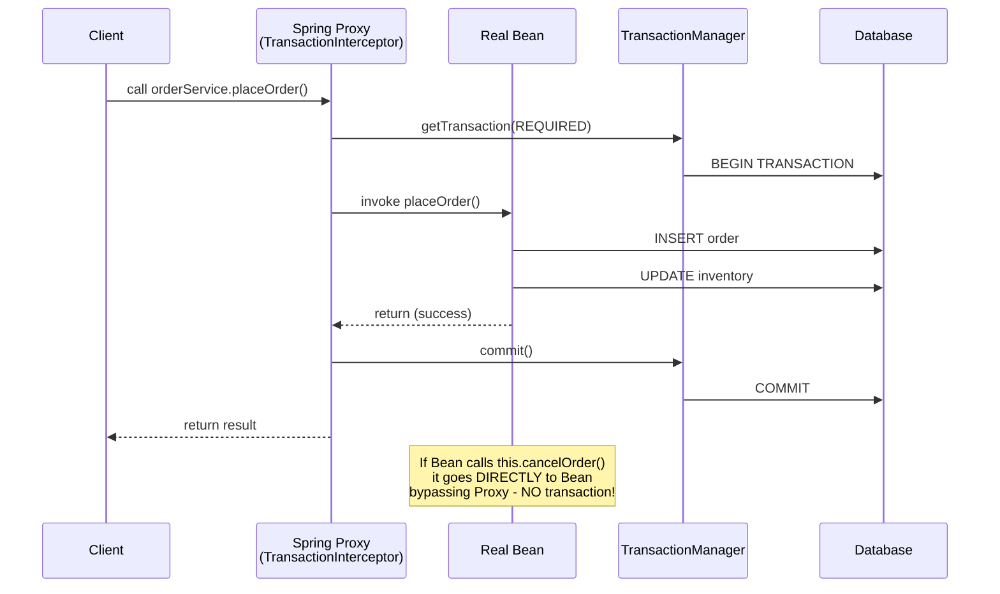
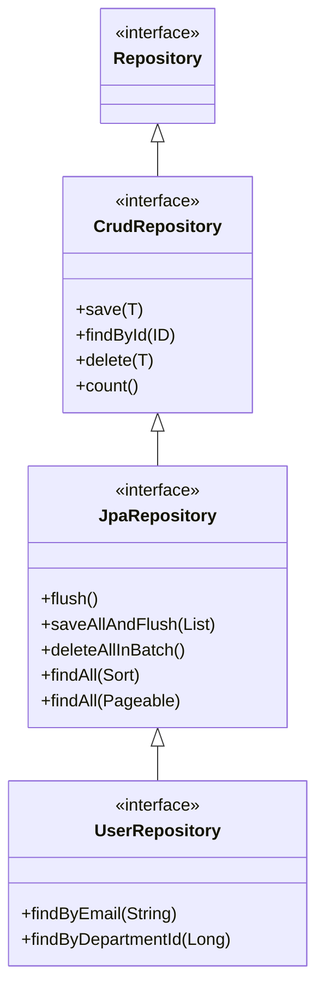

## Keywords in This File
{: .no_toc }

| # | Keyword | Weight |
|---|---|---|
| 1 | [Spring Transaction Management](#spring-transaction-management) | critical |
| 2 | [Transaction Propagation and Isolation](#transaction-propagation-and-isolation) | critical |
| 3 | [Spring Data JPA Repositories](#spring-data-jpa-repositories) | high |
| 4 | [Spring Cache Abstraction](#spring-cache-abstraction) | medium |
| 5 | [Spring Events and ApplicationEventPublisher](#spring-events-and-applicationeventpublisher) | medium |

---

# Spring Transaction Management

**Interview Weight:** critical - The most important Spring
data topic. Every enterprise application handles transactions.
Interviews test `@Transactional` semantics, the proxy
mechanism, propagation levels, isolation levels, and the
infamous self-invocation bug. Senior interviews always
probe failure modes.

---

### 🎯 Model Answer

**30 seconds:**

> Spring Transaction Management provides declarative
> transaction handling via `@Transactional`. Annotating
> a method with `@Transactional` wraps it in a transaction:
> Spring creates a proxy that begins a transaction before
> the method, commits on success, and rolls back on
> unchecked exceptions (by default). The transaction
> is bound to the current thread via `TransactionSynchronizationManager`.
> Spring supports multiple transaction managers:
> `JpaTransactionManager` for JPA, `DataSourceTransactionManager`
> for plain JDBC.

**3 minutes (Senior):**

> Spring Transaction Management is implemented via AOP
> proxies. When you call a `@Transactional` method on a
> Spring bean, you are actually calling the proxy. The
> proxy's `TransactionInterceptor` calls
> `PlatformTransactionManager.getTransaction()` to begin
> or join a transaction (based on propagation), invokes
> the target method, then commits or rolls back.
>
> Transaction rollback rules:
> - Default: roll back on `RuntimeException` and `Error`
>   (unchecked exceptions)
> - Default: COMMIT on checked exceptions (`IOException`,
>   `SQLException` - unless declared with `throws`)
> - Override: `rollbackFor = Exception.class` to roll back
>   on checked exceptions too
>
> Transaction binding: the current transaction is stored in
> `ThreadLocal` by `TransactionSynchronizationManager`.
> This is why: (a) you must use the Spring-managed
> `DataSource`/`EntityManager`, not a new `Connection`
> created directly; (b) the transaction does NOT propagate
> to new threads (`CompletableFuture.supplyAsync()` runs
> in a new thread with no transaction context).
>
> The critical limitation: self-invocation breaks `@Transactional`.
> When a method in the same class calls another
> `@Transactional` method, the call bypasses the proxy
> - no transaction is started. This is the most common
> production bug with Spring transactions.

**Framework:** @Transactional (declaration) →
PROXY (AOP intercepts) →
TransactionManager (begin/commit/rollback) →
ThreadLocal (transaction context binding) →
PROPAGATION (how nested transactions behave) →
ISOLATION (concurrency control)

*Adapting up:* Discuss `TransactionTemplate` (programmatic
transactions), `@TransactionalEventListener`, transaction
synchronization callbacks (`afterCommit`, `afterRollback`),
and distributed transactions (Saga pattern vs XA).

*Adapting down:* `@Transactional` on a method means "wrap
this in a database transaction". If the method completes
without error, commit. If it throws an unchecked exception,
roll back. Spring handles all the JDBC transaction code
so you don't have to.

---

### 📘 Concept Explanation

**What it is:**

Declarative transaction management via `@Transactional`.
A Spring AOP proxy intercepts annotated method calls to
begin, commit, or roll back transactions via a
`PlatformTransactionManager`.

**The problem it solves:**

Without Spring transactions: every method that needs a
transaction must manually: `conn.setAutoCommit(false)`;
do work; `conn.commit()`; catch exception and `conn.rollback()`.
Boilerplate in every service method. With `@Transactional`,
a one-line annotation handles all transaction lifecycle code.

**The proxy mechanism:**

```
  SPRING TRANSACTION PROXY MODEL

  Client Code
      |
      v  (calls proxy, not direct)
  +--------------------------+
  |  Spring Proxy Bean       |
  |  (TransactionInterceptor)|
  |  1. begin transaction    |
  |  2. -> call real method  |
  |  3. commit / rollback    |
  +--------------------------+
      |
      v  (proxy calls the real bean)
  +--------------------------+
  |  Real Bean (your code)   |
  |  @Transactional method   |
  +--------------------------+

  SELF-INVOCATION BUG:
  Real Bean calls its OWN @Transactional method
      |
      v  (BYPASSES proxy! no transaction)
  +--------------------------+
  |  Real Bean direct call   |
  |  @Transactional ignored  |
  +--------------------------+
```



> **Diagram walkthrough:** The client calls the Spring proxy,
> not the real bean directly. The proxy begins the transaction
> via the `TransactionManager` before delegating to the real
> bean. When the bean returns normally, the proxy commits.
> If the bean throws a `RuntimeException`, the proxy rolls
> back. The critical failure mode: if the real bean calls
> another `@Transactional` method on itself (`this.method()`),
> the call goes directly to the real bean, bypassing the
> proxy entirely. No transaction is created for that inner
> method call.

**Rollback rules:**

| Exception Type | Default Behavior | Override |
|---|---|---|
| `RuntimeException` (unchecked) | ROLLBACK | `noRollbackFor` |
| `Error` | ROLLBACK | `noRollbackFor` |
| Checked exception (`Exception`, `IOException`) | COMMIT | `rollbackFor = Exception.class` |

---

### 💻 Code Example

**Wrong vs Right: Transaction gotchas**

```java
// BAD: multiple anti-patterns in one class
@Service
@Transactional  // Class-level: applies to ALL methods
public class OrderService {

    // BAD 1: catching RuntimeException inside
    // @Transactional - rollback does NOT happen!
    public void placeOrder(Order order) {
        try {
            inventoryService.reserve(order);
            orderRepo.save(order);
        } catch (RuntimeException e) {
            log.error("Order failed", e);
            // Transaction thinks: no exception thrown
            // -> COMMITS despite the error!
        }
    }

    // BAD 2: self-invocation bypasses proxy
    public void processOrders(List<Order> orders) {
        for (Order o : orders) {
            // this.processOne() bypasses the proxy!
            // No transaction for each individual order!
            this.processOne(o);
        }
    }

    @Transactional(propagation = Propagation.REQUIRES_NEW)
    public void processOne(Order order) {
        orderRepo.save(order);
        // This @Transactional is IGNORED when called
        // from processOrders via this.*
    }

    // BAD 3: @Transactional on private method - ignored
    @Transactional
    private void internalUpdate(Order order) {
        orderRepo.save(order);  // no transaction proxy
    }
}
```

```java
// GOOD: correct transaction patterns
@Service
public class OrderService {

    private final OrderRepository orderRepo;
    private final InventoryService inventoryService;
    // Inject self-reference for self-invocation fix
    @Lazy
    @Autowired
    private OrderService self;

    // GOOD 1: let exceptions propagate for rollback
    @Transactional
    public void placeOrder(Order order) {
        inventoryService.reserve(order);  // may throw
        orderRepo.save(order);
        // Any RuntimeException propagates -> rollback
    }

    // GOOD 2: use injected self-reference for
    // REQUIRES_NEW (avoids self-invocation bypass)
    @Transactional
    public void processOrders(List<Order> orders) {
        for (Order o : orders) {
            // Call via proxy (injected self-reference)
            self.processOne(o);
        }
    }

    @Transactional(propagation = Propagation.REQUIRES_NEW)
    public void processOne(Order order) {
        orderRepo.save(order);
        // REQUIRES_NEW: each order in its own transaction
        // One order failure does not roll back others
    }

    // GOOD 3: @Transactional only works on public methods
    @Transactional
    public void publicUpdate(Order order) {
        orderRepo.save(order);  // proxy intercepts this
    }
}
```

> **Code walkthrough:** BAD 1 swallows the RuntimeException,
> so the transaction interceptor sees no exception and commits.
> Data is persisted in an invalid state. The fix: let
> RuntimeExceptions propagate - only catch them to transform
> or log, then rethrow. BAD 2 uses `this.processOne()` which
> calls the real object directly, bypassing the proxy.
> `@Transactional(propagation = REQUIRES_NEW)` on `processOne`
> is silently ignored. Fix: inject a self-reference using
> `@Lazy @Autowired` - the injected reference is the proxy.
> BAD 3: Spring's proxy cannot intercept private methods
> (JDK and CGLIB proxies only intercept public methods).
> `@Transactional` on private methods is silently ignored.

---

### 🎓 Answers by Seniority

**Junior / Mid (0-5 years):**

> `@Transactional` starts a database transaction before
> a method and commits after it succeeds. If the method
> throws a `RuntimeException`, Spring rolls back the
> transaction. This is declarative: I annotate the method
> and Spring handles the JDBC transaction code. I use it
> on service layer methods that perform multiple database
> operations that must succeed or fail together. Common
> gotcha: calling another `@Transactional` method in the
> same class from a non-transactional method - the inner
> method's transaction annotation is ignored because Spring
> uses proxies.

*Push deeper:* Ask about rollback on checked vs unchecked
exceptions.

---

**Senior / Staff (5+ years):**

> Spring transactions are proxy-based AOP. The client
> calls the proxy, the proxy's `TransactionInterceptor`
> begins the transaction, invokes the real method, then
> commits or rolls back. Key failure modes I always check:
> (1) self-invocation - caught it in a payment processing
> service where `processRefund()` called `this.deductFunds()`
> expecting REQUIRES_NEW isolation, but the inner transaction
> never started; (2) checked exception swallowing - service
> catches `RuntimeException` and logs it, transaction sees
> no exception and commits inconsistent data; (3) `@Transactional`
> on private methods - silently ignored. Correct rollback
> rule: roll back on unchecked, commit on checked (by
> default). For checked exceptions that should trigger
> rollback: `@Transactional(rollbackFor = Exception.class)`.
> For `TransactionTemplate` (programmatic): use when you
> need fine-grained control over multiple transactions
> in one method.

*Push deeper:* Discuss transaction synchronization callbacks,
`@TransactionalEventListener(phase = AFTER_COMMIT)`, and
distributed transactions.

---

### ⚖️ Comparison Table

| Approach | When to Use | Drawback |
|---|---|---|
| `@Transactional` (declarative) | Standard service operations | Proxy limitations (self-invocation, private methods) |
| `TransactionTemplate` (programmatic) | Fine-grained control, multiple transactions in one method | More verbose |
| `@TransactionalEventListener` | Trigger side effects AFTER commit | Events not sent if transaction rolls back |
| XA / JTA | Distributed transactions (multi-DB or DB + JMS) | Significant complexity and performance overhead |

---

### ⚠️ Common Misconceptions

| # | Misconception | Reality | Danger |
|---|---|---|---|
| 1 | `@Transactional` works on private methods | Spring proxies only intercept public methods. `@Transactional` on private, protected, or package-private methods is silently ignored. | Method executes without any transaction - data may be partially persisted |
| 2 | Checked exceptions trigger rollback | Default rollback rule: only `RuntimeException` and `Error`. Checked exceptions cause COMMIT. Use `rollbackFor = Exception.class` to change this. | Checked exception thrown in transactional method: COMMITS inconsistent data |
| 3 | `@Transactional` on a class applies to all methods including inherited ones | `@Transactional` on a class applies to all public methods declared in THAT class. Methods inherited from superclasses without `@Transactional` on the superclass are NOT covered. | Inherited utility methods execute without transactions |
| 4 | Self-invocation can be fixed with `@Transactional(propagation = REQUIRES_NEW)` on the called method | The propagation setting doesn't matter - the proxy is never reached when called via `this`. The annotation is completely ignored. Fix requires either injection of self-reference or extracting to a separate bean. | Transaction configuration that appears correct but never executes |

---

### 🚨 Failure Modes and Diagnosis

**Failure 1 - Partial data committed after exception**

Symptom: After a service method throws an exception,
some database rows were inserted but the operation should
have fully rolled back.

Root cause: Exception is caught inside the `@Transactional`
method (doesn't propagate), OR the exception is a checked
exception (commit by default), OR the `@Transactional`
is not on a public method.

Diagnostic:
```java
// Enable Spring transaction debug logging
logging.level.org.springframework.transaction=DEBUG
// Shows: Getting/Creating transaction, committing, rolling back
```

Look for: `Initiating transaction commit` in logs when
you expected rollback. Check: is the exception a
`RuntimeException`? Is it propagating out of the method?

Fix: Let `RuntimeException` propagate. Add
`rollbackFor = Exception.class` for checked exceptions.

---

**Failure 2 - REQUIRES_NEW transaction not starting**

Symptom: A method annotated with `@Transactional(propagation
= REQUIRES_NEW)` executes in the caller's transaction
instead of its own.

Root cause: Self-invocation - the method is called via
`this.method()` in the same class, bypassing the proxy.

Diagnostic: Enable transaction debug logging. Look for:
`Participating in existing transaction` when you expected
`Suspending current transaction, creating new transaction`.

Fix:
```java
// Option 1: inject self (for keeping in same class)
@Lazy @Autowired private MyService self;
self.methodWithRequiresNew();

// Option 2: extract to separate Spring bean (cleaner)
@Autowired private OrderTransactionHelper helper;
helper.methodWithRequiresNew();
```

---

### 🎯 Interview Deep-Dive

| Preparation time | Recommended approach |
|---|---|
| 15 min | Explain @Transactional and rollback rules |
| 30 min | Add proxy mechanism and self-invocation |
| 45 min | Add propagation levels and isolation levels |
| 1 hour | Add checked exception gotcha and @TransactionalEventListener |
| 2 hours | Add distributed transactions, Saga pattern, and transaction monitoring |

---

**[MID] Q1: What is the self-invocation problem in Spring
transactions and how do you fix it?** [MECHANISM]

*Why they ask:* The most common Spring transaction bug.

*Likely follow-up:* "How do proxies work in Spring?"

The self-invocation problem: when a method in a Spring
bean calls another `@Transactional` method on the same
bean via `this.method()`, the call bypasses the Spring
proxy. The `TransactionInterceptor` never runs. The
`@Transactional` annotation is completely ignored.

Example:
```java
@Service
public class OrderService {

    @Transactional
    public void processOrders(List<Order> orders) {
        for (Order o : orders) {
            this.processOne(o);  // bypasses proxy!
        }
    }

    @Transactional(propagation = REQUIRES_NEW)
    public void processOne(Order order) {
        // This @Transactional is NEVER reached
    }
}
```

Root cause: Spring uses JDK or CGLIB proxies to wrap beans.
The proxy sits between the client and the real bean. When
code inside the bean calls `this`, it refers to the real
bean object, not the proxy wrapper. The proxy is bypassed.

Three fixes:

1. **Inject self-reference** (easiest, same class):
   ```java
   @Lazy @Autowired
   private OrderService self;
   self.processOne(o);  // calls the proxy
   ```

2. **Extract to separate bean** (cleanest design):
   ```java
   @Autowired
   private OrderTransactionHelper helper;
   helper.processOne(o);  // calls helper's proxy
   ```

3. **Use `ApplicationContext.getBean()`** (rarely justified):
   ```java
   context.getBean(OrderService.class).processOne(o);
   ```

Recommendation: prefer Option 2 (separate bean). It
also improves cohesion - methods that need separate
transaction boundaries often belong in a separate class.

*What separates good from great:* Explaining WHY the proxy
is bypassed (the `this` reference in Java is the direct
object, not the proxy wrapper) and recommending extraction
to a separate bean as the cleanest architectural fix.

---

**[SENIOR] Q2: Explain transaction propagation. When would
you use REQUIRES_NEW vs NESTED?** [CONCEPTUAL]

*Why they ask:* Propagation is misunderstood even by experienced developers.

*Likely follow-up:* "What is the difference between NESTED and REQUIRES_NEW?"

Transaction propagation defines what happens when a
`@Transactional` method is called while a transaction
is already active.

| Propagation | Behavior | Use Case |
|---|---|---|
| `REQUIRED` (default) | Join existing, or create new | Standard service methods |
| `REQUIRES_NEW` | Always create a new transaction, suspend the current | Audit logging (must persist regardless of caller rollback) |
| `NESTED` | Create a savepoint in the existing transaction | Try/catch sub-operations; rollback to savepoint on failure |
| `SUPPORTS` | Join if exists, non-transactional if not | Read-only queries that can run in or out of a transaction |
| `NOT_SUPPORTED` | Suspend current transaction, run non-transactionally | Operations that must NOT run in a transaction |
| `NEVER` | Throw if a transaction exists | Non-transactional operations that should never be in a transaction |
| `MANDATORY` | Throw if NO transaction exists | Methods that require an existing transaction from caller |

`REQUIRES_NEW` vs `NESTED`:

**REQUIRES_NEW**: starts a completely new, independent
transaction. The outer transaction is suspended. If
`REQUIRES_NEW` method commits, that work is permanent
even if the outer transaction rolls back. Use: audit
logging (must record the attempt even if the business
operation fails).

**NESTED**: creates a savepoint within the SAME transaction.
If the nested method rolls back, only the nested work
is undone (rollback to savepoint). If the outer transaction
rolls back, everything rolls back (including nested work).
Only supported with JDBC savepoints (not JPA). Use: bulk
processing where individual item failures should be skipped
but the outer transaction continues.

*What separates good from great:* The concrete behavioral
difference: `REQUIRES_NEW` creates a separate DB transaction
(two commits/rollbacks); `NESTED` uses a savepoint within
the same DB transaction (one eventual commit or full
rollback).

---

**[SENIOR] Q3: How would you implement reliable side-effect
execution AFTER a transaction commits?** [HANDS-ON]

*Why they ask:* Common requirement: send email/event after order is committed.

*Likely follow-up:* "What if the event publishing itself fails?"

Problem: you want to send an email or publish an event
after an order is saved, but ONLY if the database transaction
commits successfully.

Wrong approach:
```java
@Transactional
public void placeOrder(Order order) {
    orderRepo.save(order);
    emailService.sendConfirmation(order);
    // If DB commit fails AFTER email is sent:
    // email sent but order not in DB - inconsistency!
}
```

Correct approach: `@TransactionalEventListener`:

```java
// In service: publish event (still within transaction)
@Transactional
public void placeOrder(Order order) {
    orderRepo.save(order);
    // Event is published to ApplicationEventMulticaster
    // Listener is invoked AFTER commit (not now)
    eventPublisher.publishEvent(
        new OrderPlacedEvent(order.getId()));
}

// Listener: runs after transaction commits
@Component
public class OrderEventHandler {

    @TransactionalEventListener(
        phase = TransactionPhase.AFTER_COMMIT)
    public void onOrderPlaced(OrderPlacedEvent event) {
        // DB transaction is committed before this runs
        emailService.sendConfirmation(
            event.getOrderId());
    }
}
```

`AFTER_COMMIT`: listener runs after the transaction commits.
If the transaction rolls back: listener is NOT invoked.
Email is only sent if the order is persisted.

Limitation: `onOrderPlaced` runs outside the transaction.
If the email service fails, the order is already committed.
For guaranteed delivery: publish to a transactional outbox
(save the email intent to the DB within the same transaction,
a background job sends emails). This is the Transactional
Outbox pattern.

*What separates good from great:* Knowing `@TransactionalEventListener`
and the Transactional Outbox pattern for fully guaranteed
side-effect delivery.

| Interviewer Type | Emphasis |
|---|---|
| Technical Panel | Lead with proxy mechanism and self-invocation (hardest to understand). |
| Hiring Manager | Lead with data consistency guarantees and failure modes. |
| Bar Raiser | Lead with propagation semantics, @TransactionalEventListener, and Outbox pattern. |
| Peer Engineer | "The checked exception commit-instead-of-rollback bug has lost data in more codebases than I can count..." |

---

---

# Transaction Propagation and Isolation

**Interview Weight:** critical - Senior engineers must
know all propagation levels and the four standard isolation
levels. Questions probe: what happens when two transactions
modify the same row, what dirty read/phantom read means,
and which isolation level to choose for a given scenario.
Often paired with "have you ever had a database deadlock?"

---

### 🎯 Model Answer

**30 seconds:**

> Transaction propagation controls what happens when a
> transactional method is called while another transaction
> is active. `REQUIRED` (default) joins the existing
> transaction. `REQUIRES_NEW` creates a new independent
> transaction, suspending the current. Transaction isolation
> controls what one transaction can see of another concurrent
> transaction's uncommitted work. Higher isolation levels
> prevent more anomalies but reduce concurrency.
> `READ_COMMITTED` (default in most databases) prevents
> dirty reads. `REPEATABLE_READ` additionally prevents
> non-repeatable reads. `SERIALIZABLE` prevents all
> anomalies but serializes all access.

**3 minutes (Senior):**

> The four isolation levels and what they prevent:
>
> - `READ_UNCOMMITTED`: can read uncommitted data from
>   other transactions. Susceptible to dirty reads,
>   non-repeatable reads, phantom reads. Almost never used.
> - `READ_COMMITTED` (default: PostgreSQL, Oracle): reads
>   only committed data. Prevents dirty reads. Still
>   susceptible to non-repeatable reads (another transaction
>   updates the same row between two reads in your
>   transaction) and phantom reads.
> - `REPEATABLE_READ` (default: MySQL InnoDB): re-reading
>   the same row returns the same value (row-level lock).
>   Prevents dirty reads and non-repeatable reads. Still
>   susceptible to phantom reads (another transaction inserts
>   a new row that matches your WHERE clause).
> - `SERIALIZABLE`: full isolation. Transactions execute
>   as if they are the only transaction in the system.
>   Prevents all anomalies. Implemented via range locks.
>   Significant concurrency reduction.
>
> Deadlocks occur when two transactions hold locks the
> other needs, and both wait forever. Prevention: consistent
> lock ordering (always acquire locks in the same order
> across all transactions). Detection: the DB detects and
> kills one transaction (deadlock victim). Handle in
> application code with retry logic.
>
> Spring's `@Transactional(isolation = ...)` maps to JDBC
> `Connection.setTransactionIsolation()`. The Spring
> `isolation` attribute is only meaningful when creating
> a new transaction (not when joining an existing one -
> the existing transaction's isolation cannot be changed).

**Framework:** PROPAGATION (how transactions nest) →
ISOLATION (what concurrent transactions see) →
ANOMALIES (dirty read, non-repeatable, phantom) →
LOCKING (database enforces isolation via locks) →
DEADLOCK (prevention + retry)

*Adapting up:* Discuss MVCC (Multi-Version Concurrency
Control) as the mechanism behind `READ_COMMITTED` in
PostgreSQL (no read locks needed, old versions of rows
are kept), optimistic locking vs pessimistic locking
trade-offs, and choosing isolation per use case.

*Adapting down:* Isolation level = how much your transaction
is affected by other transactions running at the same time.
Low isolation: faster but you might read "dirty" data.
High isolation: safer but slower. Most apps use
READ_COMMITTED - you only see data that other transactions
have already committed.

---

### 📘 Concept Explanation

**What it is:**

Transaction isolation levels control the visibility of
uncommitted changes between concurrent transactions.
Propagation levels control whether a method call creates
a new transaction or participates in an existing one.

**The four isolation anomalies:**

| Anomaly | What happens | Prevented by |
|---|---|---|
| Dirty Read | Transaction A reads data written by Transaction B before B commits. If B rolls back, A has read phantom data. | READ_COMMITTED + |
| Non-Repeatable Read | Transaction A reads a row. Transaction B updates and commits. A reads same row again: different value. | REPEATABLE_READ + |
| Phantom Read | Transaction A reads rows matching a WHERE clause. Transaction B inserts a new matching row. A re-executes the same WHERE: new row appears. | SERIALIZABLE |
| Lost Update | Two transactions read the same row, both modify it, both commit: one update is overwritten. | Optimistic/Pessimistic locking |

**Isolation level matrix:**

```
  ISOLATION LEVEL  | DIRTY READ | NON-REPEAT | PHANTOM
  -----------------+------------+------------+---------
  READ UNCOMMITTED |  possible  |  possible  | possible
  READ COMMITTED   |  prevented |  possible  | possible
  REPEATABLE READ  |  prevented |  prevented | possible
  SERIALIZABLE     |  prevented |  prevented | prevented
```

**Propagation levels (key ones):**

```
  REQUIRED (default):
  Outer txn exists?  YES -> join it
  Outer txn exists?  NO  -> create new

  REQUIRES_NEW:
  Outer txn exists?  YES -> suspend outer, create new
  Outer txn exists?  NO  -> create new

  NESTED:
  Outer txn exists?  YES -> create savepoint
  Outer txn exists?  NO  -> create new

  SUPPORTS:
  Outer txn exists?  YES -> join it
  Outer txn exists?  NO  -> run non-transactional

  NOT_SUPPORTED:
  Outer txn exists?  YES -> suspend outer, run non-tx
  Outer txn exists?  NO  -> run non-transactional
```

---

### 💻 Code Example

**Production Example: Audit log with REQUIRES_NEW**

```java
// Audit writes must persist even if business rollback
@Service
public class AuditService {

    private final AuditLogRepository auditRepo;

    // REQUIRES_NEW: own transaction, independent of caller
    @Transactional(propagation = Propagation.REQUIRES_NEW)
    public void recordAttempt(
        String action, String userId, boolean success) {
        AuditLog log = new AuditLog(
            action, userId, success, Instant.now());
        auditRepo.save(log);
        // Commits independently of caller's transaction
    }
}

@Service
public class OrderService {

    private final OrderRepository orderRepo;
    private final AuditService auditService;

    @Transactional
    public void placeOrder(
        Order order, String userId) {
        try {
            orderRepo.save(order);
            // Audit logs in its own transaction
            // and commits regardless of order outcome
            auditService.recordAttempt(
                "PLACE_ORDER", userId, true);
        } catch (InsufficientFundsException e) {
            // Order transaction will roll back
            // But audit record PERSISTS (own transaction)
            auditService.recordAttempt(
                "PLACE_ORDER", userId, false);
            throw e;  // re-throw to trigger rollback
        }
    }
}
```

> **Code walkthrough:** `AuditService.recordAttempt()` uses
> `REQUIRES_NEW`: it always creates a new, independent
> database transaction. When `OrderService.placeOrder()`
> calls it, the outer order transaction is suspended.
> The audit log is committed immediately in its own
> transaction. Then the outer transaction resumes. If the
> outer transaction rolls back (e.g., `InsufficientFundsException`),
> the audit record is already committed and remains in
> the database. This is the correct pattern for audit
> logging: the audit trail must be preserved even when
> the audited operation fails.

**Wrong vs Right: Isolation level selection**

```java
// BAD: using SERIALIZABLE for a high-volume
// read-heavy reporting query
@Transactional(
    isolation = Isolation.SERIALIZABLE,
    readOnly = true)
public List<OrderSummary> getDailySummary(
    LocalDate date) {
    return orderRepo.findSummaryByDate(date);
}
// SERIALIZABLE acquires range locks on the date range
// All other writers to the orders table are blocked
// Causes deadlocks and timeouts under load

// BAD: using READ_UNCOMMITTED for financial queries
@Transactional(
    isolation = Isolation.READ_UNCOMMITTED)
public BigDecimal getAccountBalance(Long accountId) {
    return accountRepo.findBalance(accountId);
    // May read uncommitted, not-yet-committed updates
    // Balance may reflect a transaction that later rolls back
}
```

```java
// GOOD: choosing isolation per use case
// Financial balance: READ_COMMITTED (see only committed)
@Transactional(
    isolation = Isolation.READ_COMMITTED,
    readOnly = true)
public BigDecimal getAccountBalance(Long accountId) {
    return accountRepo.findBalance(accountId);
}

// Inventory check + reserve: REPEATABLE_READ
// (must see consistent quantity throughout the transaction)
@Transactional(isolation = Isolation.REPEATABLE_READ)
public void reserveInventory(String sku, int qty) {
    int available = inventoryRepo.findQuantity(sku);
    if (available < qty) {
        throw new InsufficientStockException(sku);
    }
    inventoryRepo.decrementBy(sku, qty);
    // REPEATABLE_READ: available will not change
    // between the read and the update
}

// Reporting query: READ_COMMITTED (accepts slightly
// inconsistent snapshot, avoids locking writers)
@Transactional(
    isolation = Isolation.READ_COMMITTED,
    readOnly = true)
public List<OrderSummary> getDailySummary(
    LocalDate date) {
    return orderRepo.findSummaryByDate(date);
}
```

> **Code walkthrough:** Isolation level selection is a
> trade-off between consistency and concurrency. The BAD
> version uses `SERIALIZABLE` for a read-heavy reporting
> query - this acquires range locks that block all writers
> to the orders table, causing deadlocks at production load.
> The GOOD version uses `READ_COMMITTED` for reporting
> (acceptable for aggregated daily summaries where slight
> inconsistency is tolerable) and `REPEATABLE_READ` for
> inventory reservation (must see consistent quantity
> throughout the check-and-update operation to prevent
> overselling).

---

### 🎓 Answers by Seniority

**Junior / Mid (0-5 years):**

> Transaction isolation controls how much concurrent
> transactions affect each other. `READ_COMMITTED` (the
> default for most databases) means my transaction only
> sees rows that other transactions have already committed.
> I cannot read "dirty" uncommitted data. Higher isolation
> levels like `REPEATABLE_READ` additionally ensure that
> if I read a row twice in the same transaction, I get
> the same value both times, even if another transaction
> committed an update in between. I use `@Transactional
> (isolation = Isolation.REPEATABLE_READ)` in Spring when
> I need this guarantee.

*Push deeper:* Ask what phantom read is and how to prevent it.

---

**Senior / Staff (5+ years):**

> The key to isolation levels is understanding the trade-off:
> higher isolation = fewer anomalies but lower concurrency.
> In production, I have seen two common mistakes: (1) using
> `SERIALIZABLE` for reporting queries that become a
> deadlock source under load; (2) using `READ_UNCOMMITTED`
> for "performance" in financial queries, reading uncommitted
> data that later rolls back. My default: `READ_COMMITTED`
> for most operations, `REPEATABLE_READ` for check-and-update
> patterns (inventory reservation, balance checks with
> conditional updates). MVCC databases like PostgreSQL
> implement `READ_COMMITTED` without read locks (uses
> row versioning), so there's minimal performance penalty
> vs `READ_UNCOMMITTED` - no reason to use the latter.
> For deadlock prevention: always acquire locks in a
> consistent order across all transactions. When deadlocks
> happen in production, add retry with exponential backoff.

*Push deeper:* Discuss optimistic locking (`@Version` in JPA)
as an alternative to pessimistic locks for concurrency
control.

---

### ⚖️ Comparison Table

| Isolation Level | Dirty Read | Non-Repeatable Read | Phantom Read | Typical Use |
|---|---|---|---|---|
| READ_UNCOMMITTED | Possible | Possible | Possible | Analytics on approximate data only |
| READ_COMMITTED | Prevented | Possible | Possible | Standard OLTP (PostgreSQL default) |
| REPEATABLE_READ | Prevented | Prevented | Possible | Check-and-update patterns (MySQL default) |
| SERIALIZABLE | Prevented | Prevented | Prevented | Financial totals, strict consistency |

---

### ⚠️ Common Misconceptions

| # | Misconception | Reality | Danger |
|---|---|---|---|
| 1 | Spring's `isolation` attribute changes isolation for an existing transaction | `isolation` is only applied when creating a NEW transaction. If the method joins an existing transaction (REQUIRED propagation, existing txn), the isolation attribute is IGNORED and the existing transaction's isolation is used. | Developer sets isolation on an inner method, it has no effect because the outer transaction's isolation applies |
| 2 | SERIALIZABLE is always safe for concurrent operations | SERIALIZABLE prevents read anomalies via range locks. Under high concurrency, it frequently causes deadlocks. Applications must handle `DeadlockLoserDataAccessException` with retry logic. | SERIALIZABLE on a high-volume table causes cascading deadlocks and application failures |
| 3 | REQUIRES_NEW is just like NESTED | REQUIRES_NEW creates a completely separate DB transaction (two commits). NESTED creates a savepoint within the SAME DB transaction. If the outer rolls back, NESTED work is lost. REQUIRES_NEW work persists. | Using NESTED for audit logging: if the outer transaction rolls back, the audit log is also lost |
| 4 | readOnly = true on @Transactional prevents all writes | `readOnly = true` is a hint, not a constraint. The database may or may not enforce read-only mode. Hibernate uses it to skip dirty checking (performance optimization). JPA/JDBC still allows writes if you issue them. | Assuming readOnly prevents accidental writes: it does not enforce read-only access |

---

### 🚨 Failure Modes and Diagnosis

**Failure 1 - Deadlock under concurrent load**

Symptom: `DeadlockLoserDataAccessException` in logs.
Intermittent transaction failures under concurrent traffic.

Root cause: Two transactions acquiring locks in different
order. Transaction A locks row X, waits for row Y.
Transaction B locks row Y, waits for row X. Circular wait.

Diagnostic:
```sql
-- PostgreSQL: check blocked queries
SELECT pid, wait_event_type, wait_event, query
FROM pg_stat_activity
WHERE state = 'active';

-- Show deadlock details in pg_locks
SELECT * FROM pg_locks WHERE granted = false;
```

Fix:
1. Consistent lock ordering (sort rows by ID before
   processing in batch operations)
2. Retry logic:
   ```java
   @Retryable(
     value = DeadlockLoserDataAccessException.class,
     maxAttempts = 3,
     backoff = @Backoff(delay = 100))
   @Transactional
   public void processWithRetry(Order order) { ... }
   ```
3. Reduce transaction scope (shorter = fewer locks held)

---

**Failure 2 - Phantom read causing overselling**

Symptom: Inventory decrements correctly per transaction,
but total decrements exceed initial stock. Inventory
goes negative.

Root cause: `READ_COMMITTED` allows phantom reads.
Transaction A reads stock = 1, Transaction B reads stock
= 1, both proceed with reservation, both decrement.
Stock goes to -1.

Diagnostic: check inventory delta vs order count.
Enable query logging to see concurrent reservation queries.

Fix: Use `REPEATABLE_READ` or `SELECT FOR UPDATE` (pessimistic
lock):
```java
@Lock(LockModeType.PESSIMISTIC_WRITE)
@Query("SELECT i FROM Inventory i WHERE i.sku = :sku")
Optional<Inventory> findBySkuForUpdate(@Param("sku") String sku);
```

---

### 🎯 Interview Deep-Dive

| Preparation time | Recommended approach |
|---|---|
| 15 min | Explain the four isolation levels and their anomalies |
| 30 min | Add propagation levels with examples |
| 45 min | Add isolation selection by use case |
| 1 hour | Add deadlock prevention and retry patterns |
| 2 hours | Add MVCC, optimistic locking, and distributed transaction trade-offs |

---

**[MID] Q1: What is a dirty read and which isolation level
prevents it?** [CONCEPTUAL]

*Why they ask:* Tests basic isolation knowledge.

*Likely follow-up:* "What is a phantom read?"

A dirty read occurs when Transaction A reads data written
by Transaction B, but B has NOT yet committed. If B later
rolls back, A's read contained data that was never
permanently written. A made decisions based on data that
doesn't exist.

Example:
```
T1: UPDATE accounts SET balance = 0 WHERE id = 1
T2: SELECT balance FROM accounts WHERE id = 1
    -- Reads balance = 0 (dirty, T1 not committed)
T1: ROLLBACK  -- T1 rolls back
    -- T2 made decisions based on balance = 0
    -- which was never actually committed
```

Prevented by: `READ_COMMITTED` and above. At
`READ_COMMITTED`, a transaction only reads committed data.
T2 would read the original balance, not T1's uncommitted
update.

Non-repeatable read: T1 reads a row. T2 updates and commits.
T1 re-reads same row: different value. Prevented by
`REPEATABLE_READ`.

Phantom read: T1 reads rows matching a condition. T2
inserts a new matching row and commits. T1 re-runs same
query: new row appears. Prevented by `SERIALIZABLE`.

*What separates good from great:* Providing a concrete
timeline showing the two transactions and the point where
the anomaly occurs, not just defining it abstractly.

---

**[SENIOR] Q2: When would you choose pessimistic locking
over optimistic locking?** [TRADE-OFF]

*Why they ask:* Tests concurrent access design trade-offs.

*Likely follow-up:* "How do you implement optimistic locking in JPA?"

**Optimistic locking**: no DB locks held. Each row has
a `@Version` column. At update time, check that the version
hasn't changed:
```java
@Entity
public class Account {
    @Version
    private Long version;  // incremented on each update
}
// JPA UPDATE: WHERE id = ? AND version = ?
// If version changed: OptimisticLockException -> retry
```
Works well when: conflicts are rare (most reads, few writes
to the same row), retries are acceptable.

**Pessimistic locking**: `SELECT FOR UPDATE` acquires a
DB row lock. Only one transaction can hold the lock.
```java
@Lock(LockModeType.PESSIMISTIC_WRITE)
Optional<Inventory> findBySkuForUpdate(String sku);
```
Works well when: conflicts are frequent (contended rows),
retries are expensive, or you cannot tolerate
`OptimisticLockException` at the application layer.

When to choose pessimistic:
1. High-contention rows: a shared counter updated by many
   concurrent transactions (retry rate would be very high
   with optimistic)
2. Long-running operations: if you must hold the "lock"
   for the duration of a complex operation spanning multiple
   DB calls
3. Financial operations: you cannot afford retries that
   might interleave with other changes

When to choose optimistic:
1. Low-contention rows (most data in typical CRUD apps)
2. Read-heavy workloads
3. When you want to avoid DB locks entirely

*What separates good from great:* Framing the choice as
"what is the expected conflict rate?" - pessimistic locking
is wasteful when conflicts are rare because every read
acquires a lock even when no conflict occurs.

---

**[SENIOR] Q3: How do you handle deadlocks in a Spring
application?** [DEBUGGING + BEHAVIORAL]

*Why they ask:* Tests real-world production problem experience.

*Likely follow-up:* "Have you had a deadlock in production? Walk me through how you diagnosed it."

Deadlock prevention (preferred): design to prevent deadlocks.

1. **Consistent lock ordering**: in bulk operations, sort
   entities by primary key before processing:
   ```java
   orders.sort(Comparator.comparing(Order::getId));
   orders.forEach(this::processOrder);
   // All transactions acquire locks in id-ascending order
   // Circular dependency impossible
   ```

2. **Reduce lock scope**: acquire locks as late as possible,
   release as early as possible. Short transactions hold
   locks for less time.

3. **Use SELECT FOR UPDATE only when needed**: don't lock
   rows that you only read.

Deadlock detection and recovery (when deadlocks occur):

```java
// Spring Retry with deadlock detection
@Retryable(
    value = {DeadlockLoserDataAccessException.class,
             CannotAcquireLockException.class},
    maxAttempts = 3,
    backoff = @Backoff(delay = 200, multiplier = 2))
@Transactional
public void processOrder(Order order) {
    // Retry up to 3 times on deadlock
}

@Recover
public void recover(DeadlockLoserDataAccessException ex,
    Order order) {
    // After 3 retries, handle failure gracefully
    alertService.sendDeadlockAlert(order.getId());
    throw new OrderProcessingException(
        "Order processing failed after retries");
}
```

Production diagnosis:
```sql
-- PostgreSQL: show deadlock in pg_log
-- Look for: ERROR: deadlock detected
-- DETAIL: Process N waits for ShareLock on transaction M

-- MySQL: show deadlock details
SHOW ENGINE INNODB STATUS;
-- Shows: DEADLOCK FOUND, TRANSACTION details
```

*What separates good from great:* Distinguishing prevention
(consistent ordering) from detection+recovery (retry with
backoff), and knowing the specific Spring exception types
(`DeadlockLoserDataAccessException`, `CannotAcquireLockException`)
to catch in retry logic.

| Interviewer Type | Emphasis |
|---|---|
| Technical Panel | Lead with isolation anomalies (dirty read, phantom read) and when they occur. |
| Hiring Manager | Lead with production deadlock handling and retry strategy. |
| Bar Raiser | Lead with MVCC, optimistic vs pessimistic locking, and isolation selection by use case. |
| Peer Engineer | "The isolation setting being ignored when joining an existing transaction - that one is subtle and has bitten a lot of teams..." |

---

---


---

---

# Spring Data JPA Repositories

**Interview Weight:** high - Spring Data JPA reduces
boilerplate significantly. Interviewers ask about the
repository hierarchy, query derivation, and when to
use @Query vs derived method names.

---

### 🎯 Model Answer

**30 seconds:**

> Spring Data JPA provides interfaces that generate
> repository implementations at runtime. The hierarchy:
> Repository (marker) → CrudRepository (CRUD) →
> PagingAndSortingRepository (paging) → JpaRepository
> (JPA-specific + batch operations). Extend JpaRepository
> for most use cases. Query derivation auto-generates
> JPQL from method names: findByLastNameAndStatus(String,
> Status) generates a type-safe JPQL query. Use @Query
> for complex queries. Use @Modifying + @Query for update
> and delete operations.

**3 minutes (Senior):**

> Repository interfaces are not real implementations at
> compile time. Spring Data's RepositoryFactoryBeanSupport
> creates a JDK dynamic proxy (or CGLIB subclass) at
> startup that routes method calls to the appropriate
> store-specific implementation.
>
> Query derivation parses method names into JPQL. Rules:
> findBy, readBy, getBy, queryBy → SELECT. countBy →
> SELECT COUNT. deleteBy, removeBy → DELETE. Between
> keywords: And, Or, Between, LessThan, GreaterThan,
> Like, In, NotIn, IsNull, IsNotNull, OrderBy.
>
> Limitations of query derivation: method names become
> unreadable beyond 3-4 conditions. Use @Query for
> complex queries. Native queries via
> @Query(nativeQuery=true) when JPQL is insufficient.
>
> Projection interfaces and DTO projections reduce data
> transfer: define an interface with getters matching
> entity field names, use as return type.

**Blank Mind Recovery:**

**(1) Restate:** "You are asking about Spring Data JPA
repositories - the abstraction layer that generates
data access code from interface declarations."

**(2) First principles:** "Every data access layer has
the same CRUD operations. Spring Data generates these
at runtime so developers only declare what they need.
Method name conventions encode the query intent
in a readable format."

**(3) Bridge:** "Spring Data repositories are like a
code generator baked into the runtime. You declare
findByEmailAndStatus(String, Status) and Spring
generates the equivalent of SELECT * FROM users WHERE
email=? AND status=? automatically."

---

### 📘 Concept Explanation

```java
// BAD: manual repository with repeated boilerplate
@Repository
public class UserRepositoryImpl {

    @PersistenceContext
    private EntityManager em;

    public Optional<User> findByEmail(String email) {
        List<User> users = em.createQuery(
            "SELECT u FROM User u WHERE u.email=:e",
            User.class)
            .setParameter("e", email)
            .getResultList();
        return users.isEmpty()
            ? Optional.empty()
            : Optional.of(users.get(0));
    }
    // Repeated for every query variation
}
```

> **Code walkthrough:** Manual JPQL queries require
> EntityManager boilerplate for every method. Parameter
> binding is error-prone (string names). Every new query
> adds more boilerplate. Spring Data generates all of
> this from the method signature.

```java
// GOOD: Spring Data JPA repository
public interface UserRepository
        extends JpaRepository<User, Long> {

    // Query derivation
    Optional<User> findByEmail(String email);

    List<User> findByLastNameAndStatusOrderByCreatedAtDesc(
        String lastName, UserStatus status);

    long countByStatus(UserStatus status);

    // @Query for complex cases
    @Query("""
        SELECT u FROM User u
        WHERE u.department.name = :deptName
        AND u.salary > :minSalary
        AND SIZE(u.roles) > :minRoles
        """)
    List<User> findHighEarnersByDepartment(
        @Param("deptName") String deptName,
        @Param("minSalary") BigDecimal minSalary,
        @Param("minRoles") int minRoles);

    // Modifying query (update/delete)
    @Modifying
    @Transactional
    @Query("UPDATE User u SET u.status = :status"
         + " WHERE u.lastLoginDate < :cutoff")
    int deactivateInactiveUsers(
        @Param("status") UserStatus status,
        @Param("cutoff") LocalDate cutoff);

    // Projection for partial data
    List<UserSummary> findByDepartmentId(Long deptId);
}

// Projection interface
public interface UserSummary {
    String getFirstName();
    String getLastName();
    String getEmail();
}
```

> **Code walkthrough:** JpaRepository<User, Long> provides
> all CRUD + paging methods. findByEmail uses query
> derivation - Spring generates JPQL. findHighEarnersByDepartment
> uses @Query for a complex join + aggregate query.
> deactivateInactiveUsers uses @Modifying for a bulk
> UPDATE - @Transactional is required for modifying
> queries. UserSummary projection only selects 3 fields,
> reducing data transfer for list views.

```
Repository hierarchy:

Repository<T,ID>          (marker)
   └── CrudRepository      (save, find, delete)
        └── PagingAndSortingRepository
              └── JpaRepository<T,ID>
                    (flush, saveAll, findAll + Pageable)
```



> **Diagram walkthrough:** The hierarchy builds from
> basic CRUD to paging to JPA-specific operations.
> UserRepository extends JpaRepository and gains all
> parent methods automatically. Spring Data scans for
> Repository subtypes at startup and creates runtime
> proxy implementations. Custom methods (findByEmail,
> etc.) are resolved via query derivation or @Query
> annotations.

---

### 🎓 Answers by Seniority

**Junior:** "Spring Data JPA repositories let me define
data access methods as interface methods without
implementation. I extend JpaRepository and Spring
generates the implementations. findByEmail generates
a JPQL query automatically."

**Mid:** "I use JpaRepository for most cases. Query
derivation works for simple queries (2-3 conditions).
For complex queries I use @Query with JPQL. For bulk
updates I use @Modifying + @Query + @Transactional.
I use projection interfaces to fetch only the fields
I need instead of full entities."

**Senior:** "Spring Data creates JDK dynamic proxy at
startup. For N+1 prevention, I use @EntityGraph on
repository methods to specify fetch joins. For large
datasets, I use Pageable with Page<T> return type.
I avoid repository methods with too many parameters -
use Spring Data Specifications or QueryDSL for dynamic
query building."

**Staff:** "Repositories are the boundary between domain
and persistence. I do not let JpaRepository's save()
and delete() methods leak Spring Data semantics into
service layer - I wrap them in domain-specific method
names. For complex reporting queries, I use native SQL
via @Query(nativeQuery=true) or a read repository backed
by a separate DataSource (read replica). I test
repositories with @DataJpaTest (in-memory H2) for unit
tests and TestContainers for integration tests."

---

### ⚠️ Common Misconceptions

**1. "deleteByX() runs in a loop of individual deletes"**

Correct and it is a problem. Spring Data's deleteByX()
first fetches matching entities, then deletes them one
by one (to fire JPA lifecycle callbacks). Use
@Modifying + @Query DELETE for bulk deletes.

**2. "findAll() is fine for all queries"**

findAll() loads every entity. For large tables, this
causes OutOfMemoryError. Always use Pageable or stream
the results with findAll(Sort).

**3. "Spring Data JPA is separate from JPA"**

Spring Data JPA uses JPA as its underlying persistence
mechanism. @Entity, @Id, etc. are standard JPA. Spring
Data adds the repository abstraction on top. The entity
model is JPA; the access layer is Spring Data.

---

### 🚨 Failure Modes and Diagnosis

**Failure 1: N+1 query per entity on findAll()**

Symptom: Loading a list of users generates N+1 queries:
1 for all users, then N individual queries for each
user's department.

Root cause: Department is @ManyToOne LAZY. Accessing
user.getDepartment().getName() in a loop triggers
N separate queries.

Diagnosis:
```sql
-- Enable SQL logging
spring.jpa.show-sql=true
spring.jpa.properties.hibernate.format_sql=true
-- Or use p6spy/datasource-proxy for parameterized logs
```
Count queries - if count ≈ result set size + 1: N+1.

Fix: Add @EntityGraph to repository method:
```java
@EntityGraph(
    attributePaths = {"department"})
List<User> findAll();
```
Or use JOIN FETCH in @Query.

**Failure 2: @Modifying without @Transactional fails**

Symptom: TransactionRequiredException when calling
bulk update repository method.

Root cause: @Modifying requires an active transaction.
Without @Transactional on the repository method, no
transaction exists (repositories don't start transactions
by default for query methods).

Fix: Add @Transactional to the @Modifying method.
Usually @Transactional is on the service method; if
not, add it to the repository method.

---

### 🎯 Interview Deep-Dive

| Experience | Time | Depth |
|---|---|---|
| Junior | 2 min | Repository hierarchy, method naming |
| Mid | 4 min | @Query, @Modifying, projections |
| Senior | 6 min | N+1 fix, dynamic queries, @EntityGraph |
| Staff | 8 min | Repository design, read/write split |

---

**[JUNIOR] Q1 - What is the difference between
CrudRepository and JpaRepository?**

*Why they ask:* Repository hierarchy awareness.

CrudRepository provides: save(), findById(), findAll(),
delete(), count(), existsById().

JpaRepository extends PagingAndSortingRepository (which
adds findAll(Pageable) and findAll(Sort)) and adds:
- saveAll(Iterable) - batch save
- flush() - synchronize persistence context
- saveAndFlush() - save + flush immediately
- deleteAllInBatch(Iterable) - bulk delete
- getReferenceById(ID) - load by reference (no DB hit)

For most use cases, extend JpaRepository. It provides
the richest API including pagination.

*What separates good from great:* Knowing the full
hierarchy (Repository → Crud → PagingAndSorting → Jpa)
and that each adds capabilities upward.

---

**[MID] Q2 - How do you implement pagination with
Spring Data JPA?**

*Why they ask:* Pagination is standard for list endpoints.

```java
// Repository method
Page<User> findByStatus(
    UserStatus status, Pageable pageable);

// Controller
@GetMapping("/users")
public Page<UserDto> getUsers(
        @RequestParam UserStatus status,
        @RequestParam(defaultValue = "0") int page,
        @RequestParam(defaultValue = "20") int size,
        @RequestParam(defaultValue = "id") String sort) {
    Pageable pageable = PageRequest.of(
        page, size, Sort.by(sort));
    return userRepository.findByStatus(
        status, pageable)
        .map(userMapper::toDto);
}
```

Page<T> response contains:
- content: list of items on current page
- totalElements: total record count
- totalPages: ceil(total / size)
- number: current page (0-based)
- size: page size

Use Slice<T> instead of Page<T> when you don't need
the total count (avoids COUNT query).

*What separates good from great:* Knowing Slice vs Page
trade-off (COUNT query cost) and showing the controller
integration with PageRequest.

---

**[SENIOR] Q3 - How do you build dynamic queries in
Spring Data JPA?**

*Why they ask:* Real-world queries are often dynamic
(filter by optional parameters).

Option 1: Spring Data Specifications (Criteria API):
```java
public interface UserRepository
        extends JpaRepository<User, Long>,
                JpaSpecificationExecutor<User> {
}

Specification<User> spec = Specification
    .where(hasStatus(status))
    .and(inDepartment(departmentId))
    .and(salaryBetween(min, max));

List<User> users = repo.findAll(spec);
```

Option 2: QueryDSL (more readable):
```java
QUser user = QUser.user;
JPAQuery<User> query = new JPAQuery<>(em);
query.from(user)
     .where(user.status.eq(status)
         .and(user.department.id.eq(deptId)));
```

Option 3: @Query with SpEL for conditional logic
(limited, prone to mistakes).

Recommendation: Specifications for simple dynamic
filters; QueryDSL for complex type-safe queries; native
SQL with JdbcTemplate for reports requiring specific
SQL optimization.

*What separates good from great:* Knowing multiple
options and when each is appropriate.

| Interviewer Type | Emphasis |
|---|---|
| Technical Panel | Query derivation rules, @Modifying semantics, N+1 fix. |
| Hiring Manager | Spring Data removes boilerplate = team goes faster. |
| Bar Raiser | Repository design pattern, read/write split, dynamic query strategies. |
| Peer Engineer | "Always check query count with SQL logging before shipping a list endpoint." |

---

### ⚖️ Comparison Table

| Mechanism | Best For | Limitations |
|---|---|---|
| Query derivation | Simple 1-3 condition queries | Unreadable at 4+ conditions |
| @Query JPQL | Complex joins, aggregates | Not portable to native SQL |
| @Query nativeQuery | DB-specific SQL, CTEs, window functions | Not portable, not refactor-safe |
| Specifications | Dynamic filter combinations | Verbose criteria code |
| QueryDSL | Type-safe complex dynamic queries | Extra code gen setup |
| JdbcTemplate | Bulk operations, reporting queries | No ORM mapping |


---

---

# Spring Cache Abstraction

**Interview Weight:** medium - Caching is a production
performance concern. Questions target: cache annotations,
when to invalidate, cache aside vs read-through, and
pitfalls (stale data, cache stampede).

---

### 🎯 Model Answer

**30 seconds:**

> Spring Cache Abstraction provides declarative caching
> via annotations. `@Cacheable("orders")` caches a method's
> return value keyed by parameters. On second call with
> the same parameters, the cached value is returned without
> executing the method. `@CacheEvict` removes cache entries.
> `@CachePut` updates the cache without skipping the method.
> The cache provider (Redis, Caffeine, EhCache, etc.) is
> plugged in via `CacheManager`.

**3 minutes (Senior):**

> Spring Cache works via AOP proxies (same mechanism as
> `@Transactional`). `@Cacheable` creates a proxy that
> checks the cache before calling the real method. Cache
> key is derived from method parameters by default
> (using `SimpleKeyGenerator` for single params, or
> `SpEL` expressions for custom keys: `@Cacheable(key
> = "#id")`).
>
> Cache providers are configured via `CacheManager` bean.
> Spring Boot auto-configures: Caffeine (in-process, high
> performance), Redis (distributed, survives restart),
> EhCache, JCache (JSR-107). Multiple cache managers
> can exist; select per annotation with `cacheManager`.
>
> Key production concerns:
> - **Cache stampede**: when a popular cache entry expires,
>   many concurrent requests all miss and call the database
>   simultaneously. Prevention: probabilistic early expiry,
>   or use `@Cacheable` with a lock (not natively supported
>   in Spring - requires Redis + Redisson or Caffeine
>   with synchronization).
> - **Stale data**: `@CacheEvict` is only called on the
>   current JVM's method invocation. If another service
>   instance updates the data, its cache is evicted but
>   other instances still serve stale data. Solution:
>   distributed cache (Redis) with shared eviction.
> - **Cache key collision**: `@Cacheable(value = "items")`
>   on two different entity types using the same ID will
>   collide. Use distinct cache names per entity.

**Framework:** @Cacheable (read-aside) →
CacheManager (provider plug-in) →
SpEL key expressions (custom keys) →
@CacheEvict (invalidation) →
DISTRIBUTED CACHE (Redis for multi-instance)

*Adapting up:* Discuss cache-aside vs read-through vs
write-through patterns, Redis Pub/Sub for distributed
cache invalidation, conditional caching (`condition`,
`unless`), and Caffeine eviction policies (LRU, LFU,
time-based expiry).

*Adapting down:* `@Cacheable` saves the result of a method
call so the next call with the same input returns instantly
without running the method again. Like memoization. The
result is stored in a cache (in-memory or Redis). `@CacheEvict`
clears the stored result when the data changes.

---

### 📘 Concept Explanation

**What it is:**

Spring Cache Abstraction provides a unified, provider-
agnostic caching API via annotations. The actual cache
store (Caffeine, Redis, EhCache) is interchangeable.
Caching logic is separated from business logic.

**The three core annotations:**

| Annotation | Purpose | Method runs? |
|---|---|---|
| `@Cacheable` | Return cached value if present; else run method and cache result | Only on cache miss |
| `@CachePut` | Always run method, update cache with result | Always |
| `@CacheEvict` | Remove entry from cache | Always (unless condition fails) |

**Cache key resolution:**

By default: method parameters compose the key.
- No parameters: empty key (one entry per method)
- One parameter: parameter value is the key
- Multiple parameters: `SimpleKey` combining all parameters
- Custom: `@Cacheable(key = "#orderId")` (SpEL)

```
  CACHEABLE PROXY FLOW

  Call: getOrder(42L)
        |
        v  (proxy checks)
  Cache "orders" has key 42?
        |
    YES +--> return cached value (method NOT called)
        |
    NO  +--> call real method --> OrderDto result
              --> cache.put(42, result)
              --> return result
```

---

### 💻 Code Example

**Production Example: Service-level caching**

```java
@Service
public class ProductService {

    private final ProductRepository repo;

    // Cache product lookup - products change infrequently
    @Cacheable(
        value = "products",
        key = "#id",
        unless = "#result == null")
    public ProductDto getProduct(Long id) {
        return repo.findById(id)
            .map(mapper::toDto)
            .orElse(null);  // null not cached (unless clause)
    }

    // Update product AND update cache
    @CachePut(value = "products", key = "#result.id")
    public ProductDto updateProduct(
        Long id, UpdateProductRequest req) {
        Product product = repo.findById(id)
            .orElseThrow(() ->
                new ProductNotFoundException(id));
        product.update(req);
        return mapper.toDto(repo.save(product));
    }

    // Evict cache on delete
    @CacheEvict(value = "products", key = "#id")
    public void deleteProduct(Long id) {
        repo.deleteById(id);
    }

    // Evict all products (e.g. after bulk import)
    @CacheEvict(value = "products", allEntries = true)
    public void clearProductCache() {}
}
```

```java
// application.yml: Caffeine cache with TTL
spring:
  cache:
    type: caffeine
    caffeine:
      spec: maximumSize=1000,expireAfterWrite=5m
```

> **Code walkthrough:** `@Cacheable(unless = "#result ==
> null")` prevents caching null values (null would be
> cached for a non-existent ID, masking later inserts -
> the null would be returned until eviction). `@CachePut`
> updates the cache entry after the method executes - this
> is used for updates to keep the cache in sync without
> requiring the next read to miss. `@CacheEvict(allEntries
> = true)` clears the entire cache region - use after bulk
> operations where individual key eviction is impractical.
> The Caffeine spec sets a 5-minute TTL: cache entries
> expire after 5 minutes regardless of eviction, which
> provides a safety net for stale data even if `@CacheEvict`
> is missed.

---

### 🎓 Answers by Seniority

**Junior / Mid (0-5 years):**

> Spring Cache uses annotations to cache method results.
> `@Cacheable` on a method stores the result in a cache
> keyed by the method parameters. On repeat calls with
> the same parameters, the cached value is returned without
> calling the method. `@CacheEvict` removes the cached
> entry when data changes. I configure the cache provider
> (like Caffeine for in-process, or Redis for distributed
> caching across multiple service instances) in application
> properties. Spring Boot auto-configures the `CacheManager`.

*Push deeper:* Ask about the cache stampede problem.

---

**Senior / Staff (5+ years):**

> Spring Cache is powerful but has several production
> traps. Cache stampede: when a high-traffic entry expires,
> many concurrent requests miss simultaneously, all hitting
> the database. For high-traffic keys, use probabilistic
> early expiration (Caffeine supports this) or lock-based
> refresh. Stale data in multi-instance deployments: in-
> process caches (Caffeine) are per-instance. One instance
> evicts, others still serve stale. Use Redis for distributed
> caching where eviction propagates to all instances. Cache
> key design: always use distinct `value` names per entity
> type, and always set explicit `key` SpEL expressions -
> relying on default key generation across refactors is
> fragile. TTL is a mandatory backstop: even with `@CacheEvict`,
> always configure a TTL. Cache entries that are never
> evicted due to a code path bug will serve stale data
> indefinitely. TTL = self-healing ceiling.

*Push deeper:* Discuss Redis Pub/Sub for cache invalidation
broadcasts, bloom filters for cache penetration prevention,
and cache warming strategies after deployment.

---

### ⚖️ Comparison Table

| Cache Pattern | When to Use | Spring Support |
|---|---|---|
| Cache-aside (@Cacheable) | Read-heavy, tolerate slight staleness | Native, all providers |
| Read-through | Cache managed by the store, not app code | Redis with Spring Data |
| Write-through | Write to cache AND DB simultaneously | @CachePut on write methods |
| Write-behind | Write to cache, async flush to DB | Not native, custom impl needed |

---

### ⚠️ Common Misconceptions

| # | Misconception | Reality | Danger |
|---|---|---|---|
| 1 | Spring caching works without @EnableCaching | `@EnableCaching` on a `@Configuration` class is required to activate caching. Without it, all cache annotations are silently ignored. | Methods annotated with @Cacheable execute on every call; no caching occurs |
| 2 | @CacheEvict in a method body executes immediately | `@CacheEvict` is processed by the proxy AFTER the method returns. If the method throws an exception, the eviction is skipped by default. Use `beforeInvocation = true` to evict before the method runs. | Cache serves stale data after a failed update because eviction was skipped |
| 3 | In-process caching (Caffeine) works fine in multi-instance deployments | Each JVM has its own cache. When one instance writes to the DB and evicts its local cache, all other instances still serve stale data from their local caches. | Cache inconsistency between service instances in a scaled deployment |
| 4 | @Cacheable is safe to use on methods with side effects | `@Cacheable` may skip the method entirely on cache hit. If the method has side effects (logging, audit, metric increment), those side effects are skipped on cache hits. | Audit logs and metrics are incomplete for cache hits |

---

### 🚨 Failure Modes and Diagnosis

**Failure 1 - @Cacheable not caching (method always executes)**

Symptom: Database is queried on every call despite
`@Cacheable`.

Root cause: (1) `@EnableCaching` not present, (2)
self-invocation (same class, proxy bypass), (3) method
is `private` (proxy can't intercept), (4) cache provider
not configured (falls back to `NoOpCacheManager`).

Diagnostic:
```java
// Check which CacheManager is auto-configured
@Autowired CacheManager cacheManager;
log.info("Cache manager: {}", 
    cacheManager.getClass().getSimpleName());
// If: NoOpCacheManager -> no cache provider found
```

Fix: Add `@EnableCaching` on a `@Configuration` class.
Add `spring-boot-starter-cache` + a provider (Caffeine,
Redis). For self-invocation: extract cached method to
a separate bean.

---

**Failure 2 - Stale cache data across instances**

Symptom: After updating a product, some API calls return
the old value. Inconsistency observed across different
requests.

Root cause: Multiple service instances with local Caffeine
caches. One instance evicted its cache after update; others
did not.

Fix: Switch to Redis:
```yaml
spring:
  cache:
    type: redis
  data:
    redis:
      host: redis-host
      port: 6379
```

Add `spring-boot-starter-data-redis`. Spring Boot auto-
configures `RedisCacheManager`. All instances share the
same Redis cache; eviction by one instance is visible
to all.

---

### 🎯 Interview Deep-Dive

| Preparation time | Recommended approach |
|---|---|
| 15 min | Explain @Cacheable, @CacheEvict, and @CachePut |
| 30 min | Add cache providers and CacheManager configuration |
| 45 min | Add stale data in multi-instance deployments |
| 1 hour | Add cache stampede, TTL strategy, and key design |

---

**[MID] Q1: What is the difference between @Cacheable and
@CachePut?** [COMPARISON]

*Why they ask:* Core annotation distinction.

*Likely follow-up:* "When would you use @CachePut over @Cacheable?"

`@Cacheable`: on cache HIT, the method is NOT executed.
The cached value is returned directly. On cache MISS,
the method executes and the result is stored.

`@CachePut`: the method ALWAYS executes. The result is
stored in the cache (or updates an existing entry). Never
skips the method.

Use `@Cacheable` for: read operations where you want to
return the cached value on repeat calls.

Use `@CachePut` for: write/update operations where you want
to keep the cache in sync. After updating an entity, `@CachePut`
stores the fresh value so the next `@Cacheable` read
returns the updated data without a cache miss.

```java
// Pattern: update both DB and cache atomically
@CachePut(value = "products", key = "#result.id")
public ProductDto updateProduct(...) {
    // Always runs, updates cache with fresh data
}

@Cacheable(value = "products", key = "#id")
public ProductDto getProduct(Long id) {
    // Returns cached data from @CachePut if available
}
```

*What separates good from great:* Explaining the write-
update cache pattern: `@CachePut` on writes ensures the
cache is immediately consistent after updates, so reads
via `@Cacheable` get fresh data without the expensive
cache miss.

---

**[SENIOR] Q2: How would you prevent a cache stampede for
a high-traffic endpoint?** [ARCHITECTURE]

*Why they ask:* Cache stampede is a real production failure mode.

*Likely follow-up:* "What is a thundering herd problem?"

Cache stampede (thundering herd): a popular cache entry
expires. Many concurrent requests all miss simultaneously.
They all query the database simultaneously. Database gets
a spike of identical queries. May cause DB overload or
cascade failure.

Solutions:

**1. TTL with jitter**: add random offset to expiry time.
Different requests expire at different times, reducing
simultaneous misses:
```java
// Caffeine: set expiry with variance in a custom scheduler
// Or Redis: expireAt = baseExpiry + random(0, 30 seconds)
redisTemplate.expire(key,
    Duration.ofMinutes(5).plus(
        Duration.ofSeconds(new Random().nextInt(30))));
```

**2. Probabilistic Early Expiration (PER)**: before the
entry expires, with increasing probability, one request
recomputes and refreshes the cache while others still get
the old value. Caffeine supports async refresh:
```java
LoadingCache<Long, Product> cache = Caffeine.newBuilder()
    .expireAfterWrite(5, TimeUnit.MINUTES)
    .refreshAfterWrite(4, TimeUnit.MINUTES)
    // refreshAfterWrite: async refresh 1 min before expiry
    // Requests during refresh still get old (non-blocking)
    .build(id -> productRepo.findById(id).orElseThrow());
```

**3. Redis + Lua atomic lock**: one thread recomputes,
others wait and then get the fresh value.

For most applications: TTL jitter + Caffeine
`refreshAfterWrite` is sufficient. Redis atomic lock
for extreme traffic (millions of RPM on a single key).

*What separates good from great:* Knowing `refreshAfterWrite`
vs `expireAfterWrite` in Caffeine - `refreshAfterWrite`
refreshes the cache entry asynchronously while still
serving the old value during refresh, preventing stampede.

| Interviewer Type | Emphasis |
|---|---|
| Technical Panel | Lead with @Cacheable vs @CachePut distinction and proxy mechanism. |
| Hiring Manager | Lead with stale data risk and distributed cache. |
| Bar Raiser | Lead with cache stampede, TTL design, and multi-instance consistency. |
| Peer Engineer | "Missing @EnableCaching and wondering why nothing is cached - every developer's first Spring Cache gotcha..." |

---

---

# Spring Events and ApplicationEventPublisher

**Interview Weight:** medium - Async decoupling within
a single application. Questions target: custom events,
`@EventListener`, `@TransactionalEventListener`,
synchronous vs async event handling, and when events
are appropriate vs direct method calls.

---

### 🎯 Model Answer

**30 seconds:**

> Spring's event system allows beans to publish and listen
> to events without direct coupling. `ApplicationEventPublisher
> .publishEvent(event)` publishes an event. `@EventListener`
> methods on any Spring bean receive it. By default, events
> are synchronous (published in the same thread). Async
> events require `@Async` on the listener. `@TransactionalEventListener`
> delays listener execution until after the current
> transaction commits - essential for ensuring side effects
> (email, external calls) only happen after DB changes
> are permanent.

**3 minutes (Senior):**

> Spring events implement the Observer pattern at the
> application context level. Events were historically
> required to extend `ApplicationEvent`. Since Spring 4.2,
> any object can be an event (plain POJO).
>
> Key mechanics:
> - `ApplicationEventMulticaster` dispatches events to
>   listeners
> - Default: `SimpleApplicationEventMulticaster` dispatches
>   synchronously (one thread, caller blocks until all
>   listeners complete)
> - Async: `SimpleApplicationEventMulticaster` with a
>   `TaskExecutor`, or individual `@Async` on listeners
> - Ordered listeners: `@Order(1)` on listener methods
>   for synchronous ordering
>
> `@TransactionalEventListener(phase = AFTER_COMMIT)`:
> the listener is bound to the transaction phase. If no
> transaction is active, the event is discarded by default
> (configurable with `fallbackExecution = true`).
>
> When to use events vs direct method calls:
> - Events for: post-transaction side effects (email,
>   audit, external API), decoupling modules that should
>   not know about each other, optional listeners that
>   may or may not exist
> - Direct calls for: required business logic, synchronous
>   flows where the caller needs the result, testability
>   of the interaction (events are harder to trace)

**Framework:** ApplicationEventPublisher (publish) →
@EventListener (receive) →
@TransactionalEventListener (post-commit timing) →
@Async (non-blocking listener) →
OBSERVER PATTERN (decoupled modules)

*Adapting up:* Discuss Spring Cloud function integration,
replacing events with a message broker (Kafka, RabbitMQ)
for cross-service communication, and the Transactional
Outbox pattern for guaranteed event delivery.

*Adapting down:* Spring events are like a notification
system within the application. One component says "order
placed". Other components that care (email service, audit
service) respond. The publisher does not know who is listening.
Components are decoupled.

---

### 📘 Concept Explanation

**What it is:**

Spring's built-in event system allows beans to communicate
via events without direct dependencies. Publishers and
listeners are decoupled: the publisher does not know which
or how many listeners exist.

**Event flow:**

```
  SPRING EVENT FLOW (default: synchronous)

  OrderService.placeOrder()
      |
      v
  eventPublisher.publishEvent(OrderPlacedEvent)
      |
      v  (ApplicationEventMulticaster)
  EmailNotificationListener.onOrderPlaced()  -- blocks
      |
      v
  AuditLogListener.onOrderPlaced()           -- blocks
      |
      v
  Returns to OrderService (after all listeners done)
```

For async (`@Async`): listeners execute in separate threads;
publisher continues immediately.

**@TransactionalEventListener phases:**

| Phase | Trigger |
|---|---|
| `AFTER_COMMIT` | After successful commit |
| `AFTER_ROLLBACK` | After rollback |
| `AFTER_COMPLETION` | After commit or rollback |
| `BEFORE_COMMIT` | Before commit (still in transaction) |

---

### 💻 Code Example

**Production Example: Post-commit event handling**

```java
// Event (plain POJO, no ApplicationEvent needed)
public record OrderPlacedEvent(
    Long orderId,
    String customerEmail,
    BigDecimal total) {}

// Publisher: service knows nothing about email/audit
@Service
@RequiredArgsConstructor
public class OrderService {

    private final OrderRepository orderRepo;
    private final ApplicationEventPublisher eventPublisher;

    @Transactional
    public Order placeOrder(OrderRequest req) {
        Order order = orderRepo.save(
            new Order(req));
        // Publish AFTER save, BEFORE commit
        // TransactionalEventListener defers execution
        eventPublisher.publishEvent(
            new OrderPlacedEvent(
                order.getId(),
                req.getCustomerEmail(),
                order.getTotal()));
        return order;
    }
}

// Listener 1: email after commit
@Component
@Slf4j
public class OrderEmailNotifier {

    private final EmailService emailService;

    @Async  // runs in separate thread
    @TransactionalEventListener(
        phase = TransactionPhase.AFTER_COMMIT)
    public void onOrderPlaced(OrderPlacedEvent event) {
        // DB is committed; order definitely exists
        emailService.sendConfirmation(
            event.customerEmail(), event.orderId());
    }
}

// Listener 2: audit log after commit
@Component
public class OrderAuditListener {

    private final AuditRepository auditRepo;

    @TransactionalEventListener(
        phase = TransactionPhase.AFTER_COMMIT)
    @Transactional(propagation = REQUIRES_NEW)
    public void onOrderPlaced(OrderPlacedEvent event) {
        // New transaction: persists audit log
        auditRepo.save(new AuditEntry(
            "ORDER_PLACED", event.orderId()));
    }
}
```

> **Code walkthrough:** `OrderService` publishes `OrderPlacedEvent`
> inside the transaction, before commit. Listeners with
> `@TransactionalEventListener(AFTER_COMMIT)` receive the
> event only after the order transaction commits. This
> guarantees: if the order commit fails, no email is sent
> and no audit log is written. `OrderEmailNotifier` uses
> `@Async` - email sending is slow and non-critical;
> it should not block the HTTP response thread. `OrderAuditListener`
> uses `@Transactional(REQUIRES_NEW)` - the audit log
> runs in its own transaction (the AFTER_COMMIT listener
> runs outside the original transaction, so REQUIRES_NEW
> starts a fresh one).

---

### 🎓 Answers by Seniority

**Junior / Mid (0-5 years):**

> Spring events let components communicate without direct
> coupling. I inject `ApplicationEventPublisher` and call
> `publishEvent(new MyEvent(...))`. Any bean with an
> `@EventListener` method matching the event type receives
> it. I use `@TransactionalEventListener` when the listener
> should only run after the database transaction commits,
> like sending a confirmation email after an order is saved.
> By default, events are synchronous. I add `@Async` to
> listener methods that should run in a background thread.

*Push deeper:* Ask what happens if there is no transaction
when a `@TransactionalEventListener` receives an event.

---

**Senior / Staff (5+ years):**

> Spring events are appropriate for intra-application
> decoupling and post-transaction side effects. The key
> architectural question: is this listener optional or
> required? If required (the feature does not work without
> it), use a direct method call - events hide the dependency.
> If optional (the feature works even without the listener),
> events are appropriate.
>
> `@TransactionalEventListener` + `@Async` + `REQUIRES_NEW`
> is the pattern for "after commit, in background thread,
> with its own DB transaction". This covers: audit logging,
> notifications, downstream system updates. Key limitation:
> there is no delivery guarantee. If the application crashes
> after commit but before the listener runs, the event
> is lost. For guaranteed delivery: use the Transactional
> Outbox pattern (save event to `outbox` table in the same
> transaction, background job polls and delivers). For
> cross-service events: use Kafka or RabbitMQ.

*Push deeper:* Discuss replacing Spring events with Kafka
for cross-service communication and the delivery guarantees
each provides.

---

### ⚖️ Comparison Table

| Mechanism | Coupling | Delivery Guarantee | Use Case |
|---|---|---|---|
| Direct method call | High (explicit dependency) | Guaranteed (synchronous) | Required business logic |
| Spring event | Low (decoupled) | None (in-process, no persistence) | Optional side effects, module decoupling |
| @TransactionalEventListener | Low | None (process crash loses event) | Post-commit side effects |
| Kafka/RabbitMQ | Very low | Yes (durable, at-least-once) | Cross-service, guaranteed delivery |

---

### ⚠️ Common Misconceptions

| # | Misconception | Reality | Danger |
|---|---|---|---|
| 1 | `@TransactionalEventListener` events are guaranteed to be delivered | `@TransactionalEventListener` defers execution to after commit, but if the application crashes between commit and listener execution, the event is lost. No persistence. | Application crash causes silent loss of events (emails not sent, audit entries missing) |
| 2 | Events published inside a `@Transactional` method are always received | If the transaction rolls back, events published inside it are NOT delivered by `@TransactionalEventListener(AFTER_COMMIT)`. However, they ARE delivered by `@EventListener` (synchronous, no transaction awareness). | Developers use @EventListener for post-commit logic: events are fired even when the transaction rolls back |
| 3 | `@Async` on `@TransactionalEventListener` runs before the transaction commits | `@TransactionalEventListener(AFTER_COMMIT)` always runs after commit regardless of `@Async`. `@Async` only affects threading (background vs same thread). Timing is controlled by the phase. | No danger; this is clarifying a common confusion |
| 4 | `@TransactionalEventListener` without a transaction always executes | By default, `@TransactionalEventListener` events published outside a transaction are discarded. Set `fallbackExecution = true` to allow execution without a transaction. | Events published in non-transactional code are silently lost |

---

### 🚨 Failure Modes and Diagnosis

**Failure 1 - Listener not invoked for @TransactionalEventListener**

Symptom: `@TransactionalEventListener(AFTER_COMMIT)` method
is never called.

Root causes:
1. Event published outside a transaction (no transaction
   active when `publishEvent` is called)
2. Transaction rolled back (AFTER_COMMIT only fires on
   successful commit)
3. Listener bean not in Spring context (missing `@Component`)

Diagnostic: Enable debug logging:
```
logging.level.org.springframework.transaction=DEBUG
logging.level.org.springframework.context.event=DEBUG
```

Look for: "No active transaction found for
@TransactionalEventListener" or "Transaction rolled back".

Fix: Ensure event is published within a `@Transactional`
method. Add `fallbackExecution = true` if publishing
can occur outside transactions.

---

**Failure 2 - Circular event publishing causing StackOverflowError**

Symptom: `StackOverflowError` when an event listener
publishes another event that triggers the same listener.

Root cause: Listener A listens to EventX, processes it,
and publishes EventX again (or EventY that triggers A).
Infinite loop.

Diagnostic: Check event listener chains. Stack trace will
show the listener method repeating.

Fix: Add a guard condition in the listener:
```java
@EventListener
public void onOrderUpdated(OrderUpdatedEvent event) {
    if (event.isProcessed()) return;  // guard
    // do work
    // If publishing again, mark as processed:
    eventPublisher.publishEvent(
        new OrderUpdatedEvent(event.orderId(), true));
}
```

---

### 🎯 Interview Deep-Dive

| Preparation time | Recommended approach |
|---|---|
| 15 min | Explain @EventListener and event publishing |
| 30 min | Add @TransactionalEventListener and transaction phases |
| 45 min | Add @Async and when to use events vs direct calls |
| 1 hour | Add delivery guarantees and Transactional Outbox pattern |

---

**[MID] Q1: When should you use Spring events instead of
a direct method call?** [TRADE-OFF]

*Why they ask:* Architecture decision that tests understanding of coupling.

*Likely follow-up:* "What are the drawbacks of event-driven design?"

Use direct method call when:
- The called behavior is required (the feature breaks
  without it)
- The caller needs the result of the called operation
- Testability matters: direct call is explicit, easy to
  mock and verify
- The interaction should be obvious to future readers

Use Spring events when:
- The listener is optional (feature works with 0 or N listeners)
- The interaction crosses module boundaries that should
  not know about each other
- Multiple listeners should respond to the same event
  (adding a new listener requires no change to the publisher)
- Post-transaction side effects (email after commit)

Drawbacks of events: hidden dependencies (hard to trace
what happens when an event is published), no compile-time
guarantee that listeners exist, harder to test end-to-end
flow, no delivery guarantee.

Rule of thumb: "Would the order placement fail if the email
listener was removed?" If yes: direct call. If no: event.

*What separates good from great:* Framing the decision as
"required vs optional" behavior, and noting that events
hide dependencies - a significant debugging and readability
cost.

---

**[SENIOR] Q2: How do you guarantee that an event-triggered
side effect (like an email) is sent exactly once after an
order is committed?** [ARCHITECTURE]

*Why they ask:* Tests understanding of distributed reliability.

*Likely follow-up:* "What is the Transactional Outbox pattern?"

`@TransactionalEventListener(AFTER_COMMIT)` is not
sufficient for guaranteed delivery. Between commit and
listener execution, the application can crash. The event
is lost.

**Transactional Outbox Pattern** for guaranteed delivery:

```java
@Transactional
public Order placeOrder(OrderRequest req) {
    Order order = orderRepo.save(new Order(req));
    // Save event to outbox IN THE SAME TRANSACTION
    outboxRepo.save(new OutboxEvent(
        "ORDER_PLACED",
        objectMapper.writeValueAsString(
            new OrderPlacedEvent(order.getId())),
        EventStatus.PENDING));
    return order;
    // Both order AND outbox event commit atomically
}

// Background poller (every 5 seconds):
@Scheduled(fixedDelay = 5000)
@Transactional
public void processOutboxEvents() {
    List<OutboxEvent> pending =
        outboxRepo.findByStatus(EventStatus.PENDING);
    for (OutboxEvent event : pending) {
        try {
            emailService.send(event);  // or Kafka publish
            event.setStatus(EventStatus.SENT);
        } catch (Exception e) {
            event.incrementRetries();
            // Will retry on next poll
        }
    }
}
```

Guarantees: order and outbox event committed atomically.
Even if the app crashes, the outbox entry is in the DB.
The background poller retries until delivery succeeds.
At-least-once delivery: idempotent consumers required
(process events with same ID more than once safely).

*What separates good from great:* Explaining the Outbox
pattern and the atomic commit of business data + event
record, and noting the at-least-once delivery requirement
(idempotent consumers).

| Interviewer Type | Emphasis |
|---|---|
| Technical Panel | Lead with @TransactionalEventListener phases and proxy mechanics. |
| Hiring Manager | Lead with decoupling benefit and module separation. |
| Bar Raiser | Lead with delivery guarantees, Transactional Outbox, and when to use Kafka. |
| Peer Engineer | "The @EventListener vs @TransactionalEventListener confusion is a classic - events fire even on rollback with plain @EventListener..." |

---

---

