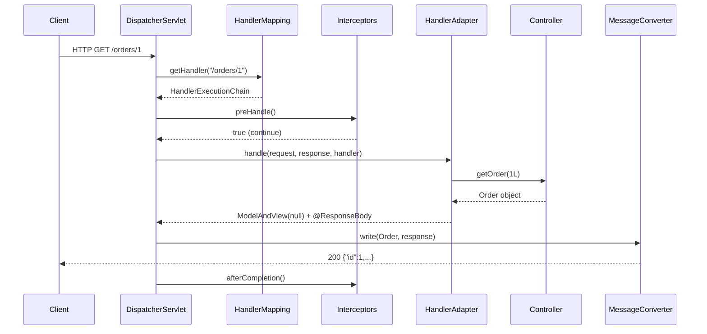
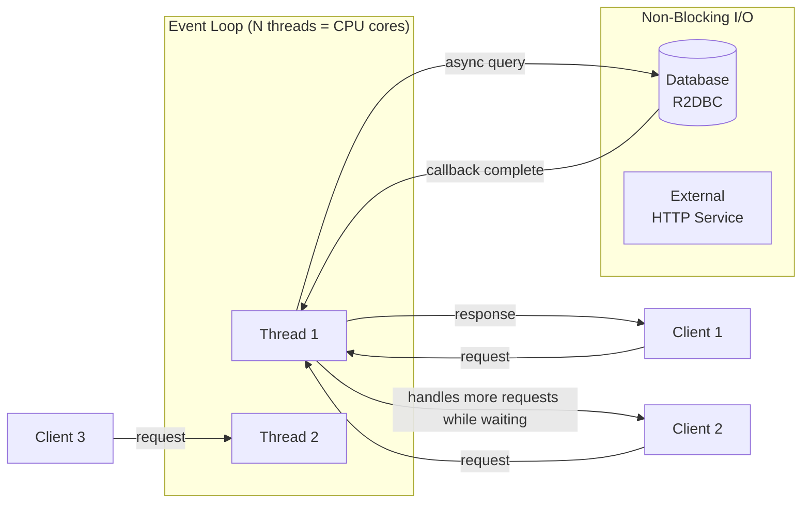

## Keywords in This File
{: .no_toc }

| # | Keyword | Weight |
|---|---|---|
| 1 | [DispatcherServlet Request Lifecycle](#dispatcherservlet-request-lifecycle) | critical |
| 2 | [REST Controller Patterns](#rest-controller-patterns) | high |
| 3 | [Spring MVC Exception Handling](#spring-mvc-exception-handling) | high |
| 4 | [Spring WebFlux Reactive Model](#spring-webflux-reactive-model) | critical |
| 5 | [Content Negotiation and MessageConverters](#content-negotiation-and-messageconverters) | medium |

---

# DispatcherServlet Request Lifecycle

**Interview Weight:** critical - The foundational Spring MVC
question at mid-senior level. Every "how does Spring MVC
work" question traces to DispatcherServlet. Follow-ups:
handler mapping ordering, interceptors vs filters vs AOP,
and what happens when no handler is found.

---

### 🎯 Model Answer

**30 seconds:**

> DispatcherServlet is Spring MVC's front controller. Every
> HTTP request goes through it. It delegates to a
> `HandlerMapping` to find the correct controller method,
> then to a `HandlerAdapter` to invoke it, then to a
> `ViewResolver` to resolve the view (or writes directly
> for REST). Along the way, `HandlerInterceptors` can
> pre/post-process the request. Exceptions are handled by
> `HandlerExceptionResolver`s. The full lifecycle has
> 12 steps from request arrival to response dispatch.

**3 minutes (Senior):**

> DispatcherServlet implements the Front Controller pattern.
> One servlet handles all requests and delegates to
> specialized components.
>
> The 12-step lifecycle:
> 1. Request arrives at `DispatcherServlet.doService()`
> 2. `WebApplicationContext`, `LocaleResolver`, `ThemeResolver`
>    are bound to the request as attributes
> 3. `HandlerMapping.getHandler()` - find the handler chain
>    (handler + interceptors) for the request URL + method
> 4. `HandlerAdapter` selected for the handler type
>    (e.g., `RequestMappingHandlerAdapter` for
>    `@RequestMapping` methods)
> 5. `HandlerInterceptor.preHandle()` called for each
>    interceptor - any can return false to abort
> 6. `HandlerAdapter.handle()` - invoke the handler:
>    bind parameters, call the method, get `ModelAndView`
> 7. If async was started, skip to step 12
> 8. `HandlerInterceptor.postHandle()` called in reverse order
> 9. `processDispatchResult()` - process `ModelAndView`
> 10. `ViewResolver.resolveViewName()` - resolve the view
> 11. `View.render()` - render the response
> 12. `HandlerInterceptor.afterCompletion()` called in
>     reverse order (always, even on exception)
>
> For REST APIs (no view): step 10-11 are replaced by
> `HttpMessageConverter` writing the response body.
> `@ResponseBody` triggers this path.
>
> Exception at any step: `HandlerExceptionResolver`s
> process it. `ExceptionHandlerExceptionResolver` finds
> `@ExceptionHandler` methods. `DefaultHandlerException
> Resolver` handles standard Spring exceptions
> (e.g., 404 for no handler found).

**Framework:** FRONT CONTROLLER (one servlet) →
HANDLER MAPPING (URL to handler) →
INTERCEPTORS (pre/post, cross-cutting) →
ADAPTER (invoke handler, bind params) →
MESSAGE CONVERTER (REST body writing) →
EXCEPTION RESOLVER (error handling)

*Adapting up:* Discuss `HandlerMapping` ordering
(`@Order` or `Ordered`), programmatic handler registration
(`RouterFunctionMapping` in functional Spring MVC),
`AsyncHandlerInterceptor` for async requests, and request
processing events for monitoring.

*Adapting down:* DispatcherServlet receives all requests.
It finds which controller method handles the URL (handler
mapping), calls it (handler adapter), and either renders
a view or writes JSON (message converters). If something
goes wrong, exception resolvers handle it.

**Blank Mind Recovery:**

**(1) Restate:** "You are asking about how Spring MVC
processes an HTTP request end to end."

**(2) First principles:** "A web framework needs: routing
(URL to handler), parameter binding (HTTP params to Java
objects), execution, response writing. DispatcherServlet
orchestrates all of these via specialized delegates."

**(3) Bridge:** "This is like an airport: DispatcherServlet
is the control tower. HandlerMapping is the gate assignment
system. HandlerAdapter is the ground crew that prepares the
plane (binds parameters). Interceptors are security checks.
MessageConverters write the boarding pass (response body)."

---

### 📘 Concept Explanation

**What it is:**

`DispatcherServlet` is Spring MVC's Front Controller - the
single `HttpServlet` that receives all HTTP requests and
delegates to a set of specialized strategy beans to handle
routing, parameter binding, view resolution, and exception
handling.

**The problem it solves:**

Without a front controller: each URL maps to a separate
servlet. Cross-cutting concerns (security, logging, content
negotiation) must be duplicated in every servlet. Front
Controller centralizes all routing decisions and cross-cutting
behavior in one place.

**How it works:**

```
  DISPATCHERSERVLET REQUEST LIFECYCLE

  HTTP Request
      |
      v
  [DispatcherServlet.doDispatch()]
      |
      v
  1. HandlerMapping.getHandler()
     RequestMappingHandlerMapping: matches URL + method
     BeanNameUrlHandlerMapping: matches bean name
     ...
      |
      v
  2. HandlerAdapter selected for handler type
      |
      +-- 3. HandlerInterceptor.preHandle() (each)
      |        returns false? --> abort, return response
      |
      v
  4. HandlerAdapter.handle() -- invoke controller method
     - Bind @PathVariable, @RequestParam, @RequestBody
     - Validate @Valid/@Validated params
     - Execute @RequestMapping method
     - Returns ModelAndView (or null for @ResponseBody)
      |
      v
  5. HandlerInterceptor.postHandle() (reverse order)
      |
      v
  6. processDispatchResult()
     ModelAndView? --> ViewResolver.resolveView()
                   --> View.render()
     @ResponseBody? --> HttpMessageConverter.write()
      |
      v
  7. HandlerInterceptor.afterCompletion() (always)
      |
      v
  HTTP Response dispatched
```



> **Diagram walkthrough:** Every request enters
> `DispatcherServlet` and traverses the same processing
> pipeline. `HandlerMapping` finds the matching controller
> method (the most specific URL pattern wins). Interceptors
> can inspect or abort the request before it reaches the
> controller. `HandlerAdapter` handles the framework-level
> plumbing: binding HTTP parameters to Java types, validating
> input, and invoking the method. For `@ResponseBody` methods,
> `DispatcherServlet` uses a `HttpMessageConverter` to
> serialize the return value directly to the response body
> - no `ViewResolver` is involved. `afterCompletion` always
> runs regardless of exceptions (used for cleanup).

**The key insight:**

`HandlerInterceptors` vs `Filters` vs `AOP`:
- `Filter` (Servlet): before DispatcherServlet - sees raw
  `HttpServletRequest`. Cross-servlet; use for auth, CORS,
  compression
- `HandlerInterceptor`: inside DispatcherServlet, after
  handler mapping but before invocation. Knows the handler;
  can inspect annotations on the controller method
- `AOP` (`@Aspect`): around the Java method call; can access
  method parameters as Java objects; no HTTP knowledge

For URL-based concerns: `Filter`. For handler-aware concerns
(rate limiting per role): `HandlerInterceptor`. For business
service concerns (audit logging, transaction boundaries): AOP.

**When the lifecycle breaks (failure modes):**

- Handler not found: `NoHandlerFoundException` → 404 (if
  `throwExceptionIfNoHandlerFound = true`, else default
  servlet handling)
- Parameter binding failure: `MethodArgumentNotValidException`
  → 400 (if `@Valid` is present)
- Exception in handler: `HandlerExceptionResolver` processes
  (finds `@ExceptionHandler` methods)
- `postHandle` not called on exception: if handler throws,
  `postHandle` is skipped; `afterCompletion` still runs

---

### 💻 Code Example

**Internal Mechanism Example: HandlerInterceptor**

```java
// HandlerInterceptor: runs inside DispatcherServlet
// Knows which handler (controller method) was matched
@Component
public class RateLimitInterceptor
    implements HandlerInterceptor {

    private final RateLimiter rateLimiter;

    // preHandle: BEFORE the controller method
    // Return false to abort; set response directly
    @Override
    public boolean preHandle(
        HttpServletRequest req,
        HttpServletResponse res,
        Object handler) throws Exception {

        if (handler instanceof HandlerMethod hm) {
            // Access annotation on the specific method
            RateLimit limit = hm.getMethodAnnotation(
                RateLimit.class);
            if (limit != null) {
                String clientId = req.getHeader(
                    "X-Client-Id");
                if (!rateLimiter.tryAcquire(
                    clientId, limit.requestsPerSecond())) {
                    res.setStatus(429);
                    res.getWriter().write(
                        "{\"error\": \"Rate limit exceeded\"}");
                    return false; // abort processing
                }
            }
        }
        return true; // continue
    }

    // afterCompletion: ALWAYS runs, even on exception
    // Use for cleanup (release resources, MDC cleanup)
    @Override
    public void afterCompletion(
        HttpServletRequest req,
        HttpServletResponse res,
        Object handler,
        Exception ex) {
        MDC.remove("clientId");
    }
}

// Register the interceptor
@Configuration
public class MvcConfig implements WebMvcConfigurer {
    @Autowired RateLimitInterceptor rateLimitInterceptor;

    @Override
    public void addInterceptors(
        InterceptorRegistry registry) {
        registry.addInterceptor(rateLimitInterceptor)
            .addPathPatterns("/api/**");
    }
}
```

> **Code walkthrough:** `preHandle` is called after
> `HandlerMapping` resolves the controller method but before
> it is invoked. The `handler` parameter can be cast to
> `HandlerMethod` to access the controller class, method,
> and any annotations on it. This is the key advantage of
> `HandlerInterceptor` over `Filter`: it knows WHICH method
> was matched and can read method-level annotations like
> `@RateLimit`. Returning `false` from `preHandle` aborts
> the request - the response must be fully written by the
> interceptor before returning false. `afterCompletion`
> always runs regardless of exceptions, making it the
> correct place for cleanup (MDC, thread-local resources).

**Failure Example: Interceptor exception vs filter exception**

```java
// Filter: exception here bypasses DispatcherServlet
// ExceptionHandlerExceptionResolver NEVER sees it
@Component
public class AuthFilter extends OncePerRequestFilter {
    @Override
    protected void doFilterInternal(...) {
        if (!isValid(req)) {
            throw new AuthException(); // NOT caught by @ExceptionHandler!
            // Response is 500, not 401
        }
    }
}

// Fix: write the response directly in the Filter
@Component
public class AuthFilter extends OncePerRequestFilter {
    @Autowired ObjectMapper mapper;

    @Override
    protected void doFilterInternal(...) {
        if (!isValid(req)) {
            res.setStatus(401);
            res.setContentType("application/json");
            mapper.writeValue(res.getWriter(),
                Map.of("error", "Unauthorized"));
            return;
        }
        filterChain.doFilter(req, res);
    }
}
```

> **Code walkthrough:** Exceptions thrown in `Filter` are
> outside DispatcherServlet's scope. `@ExceptionHandler`
> methods in `@ControllerAdvice` are processed by
> `ExceptionHandlerExceptionResolver` inside the Dispatcher,
> not before it. A `Filter` exception results in a 500
> response or servlet container error page. The fix: write
> the error response directly in the filter using
> `ObjectMapper`. This is the correct pattern for security
> filters in Spring Security (which also writes responses
> directly from authentication/authorization filters).

---

### 🎓 Answers by Seniority

**Junior / Mid (0-5 years):**

> DispatcherServlet is Spring MVC's entry point for all
> HTTP requests. It uses a `HandlerMapping` to find which
> controller method handles the URL, a `HandlerAdapter` to
> call it, and `ViewResolver` or `MessageConverter` to write
> the response. Interceptors can run before and after the
> controller for cross-cutting concerns like logging or
> rate limiting. If the controller throws an exception,
> `HandlerExceptionResolver` handles it (maps to HTTP
> status codes via `@ExceptionHandler`).

*Push deeper:* Explain the difference between interceptors
and filters and when to use each.

---

**Senior / Staff (5+ years):**

> DispatcherServlet implements the Front Controller pattern.
> The lifecycle: `HandlerMapping` resolves the handler chain
> (handler + interceptors), `HandlerAdapter` selects and
> invokes the handler, `HandlerInterceptors` run pre/post,
> `MessageConverter` writes the response for REST. The
> key architectural decision: `Filter` vs `HandlerInterceptor`
> vs `AOP`. Filters run before DispatcherServlet and know
> nothing about the handler - use for auth, compression,
> CORS. `HandlerInterceptors` run inside DispatcherServlet
> after routing is resolved - use for handler-aware
> cross-cutting concerns that need to read method annotations.
> AOP operates on Java method calls, not HTTP - use for
> business service cross-cutting.
>
> The exception handling topology is critical: exceptions
> in `Filter` are NOT caught by `@ExceptionHandler` in
> `@ControllerAdvice`. Security filters must write error
> responses directly. Exceptions in the handler (controller)
> ARE caught by `HandlerExceptionResolver`.

*Push deeper:* Discuss `HandlerMapping` ordering, async
request processing lifecycle, and programmatic route
registration with `RouterFunction`.

---

### ⚖️ Comparison Table

| Component | Location | HTTP Awareness | Handler Awareness | Use Case |
|---|---|---|---|---|
| `Filter` | Before DispatcherServlet | Full (raw HTTP) | None | Auth, compression, CORS |
| `HandlerInterceptor` | Inside DispatcherServlet | Full | Full (method + annotations) | Rate limiting per endpoint, handler-aware logging |
| `AOP` (`@Aspect`) | Around Java method | None | None | Business logic cross-cutting |
| `@ExceptionHandler` | Inside DispatcherServlet | Full | Full | Per-controller error mapping |
| `@ControllerAdvice` | All controllers | Full | Full | Global error mapping |

---

### ⚠️ Common Misconceptions

| # | Misconception | Reality | Danger |
|---|---|---|---|
| 1 | `@ExceptionHandler` catches all exceptions in the application | `@ExceptionHandler` (via `ExceptionHandlerExceptionResolver`) only catches exceptions thrown by handlers (controllers). Exceptions in Filters are outside DispatcherServlet's scope. | Security filter exceptions result in unformatted 500 responses instead of clean JSON 401/403 |
| 2 | `HandlerInterceptor.postHandle()` always runs | `postHandle()` is skipped if the handler throws an exception. Only `afterCompletion()` is guaranteed to run (similar to `finally` block). | Resource cleanup in `postHandle()` is never called on exceptions - use `afterCompletion()` for cleanup |
| 3 | `HandlerMapping` always uses URL pattern matching | Spring 5.3+ supports path variable and method-level matching. Multiple `HandlerMapping` beans can exist (e.g., `RequestMappingHandlerMapping` and `RouterFunctionMapping`). The one with the lowest `order` value takes precedence. | Custom `HandlerMapping` not applied because a higher-priority mapping claims the route first |
| 4 | Async requests follow the same lifecycle | For `@Async` or `DeferredResult`/`Callable`, DispatcherServlet completes the initial request cycle, then resumes when the async result is available. `postHandle` is called after the async result is set, not after the initial dispatch. | Interceptor state assumptions break in async controllers |

---

### 🚨 Failure Modes and Diagnosis

**Failure 1 - Security filter exception returns HTML 500**

Symptom: API returns an HTML error page (Spring Boot
error page) with 500 status when authentication fails,
instead of a JSON 401 response.

Root cause: A `Filter` (often a custom JWT filter) throws
an exception. This is outside DispatcherServlet.
`@ControllerAdvice` never runs. Spring Boot's error page
mechanism handles it.

Diagnostic: Check the filter that runs before the controller.
Look for `throw new ...` in filter code.

Fix: Write the response directly in the filter:
```java
res.setStatus(HttpServletResponse.SC_UNAUTHORIZED);
res.setContentType("application/json");
res.getWriter().write("{\"error\": \"Unauthorized\"}");
return;  // don't call filterChain.doFilter
```

---

**Failure 2 - HandlerInterceptor resource leak**

Symptom: Thread-local resource (MDC, database connection)
leaks when a controller throws an exception.

Root cause: Cleanup code is in `postHandle()` which is
skipped on exception.

Fix: Move cleanup to `afterCompletion()`:
```java
@Override
public void afterCompletion(
    HttpServletRequest req, HttpServletResponse res,
    Object handler, Exception ex) {
    MDC.clear();         // always runs
    dbContext.close();   // always runs
}
```

---

### 🎯 Interview Deep-Dive

| Preparation time | Recommended approach |
|---|---|
| 15 min | Name the 6 key lifecycle steps: mapping, adapter, interceptors, handler, message converter, exception resolver |
| 30 min | Add Filter vs HandlerInterceptor vs AOP comparison |
| 45 min | Add what happens when no handler found and exception lifecycle |
| 1 hour | Add HandlerMapping ordering and multiple mapping strategies |
| 2 hours | Trace a real request through DispatcherServlet source code |

---

**[JUNIOR] Q1: What is the difference between a
HandlerInterceptor and a Servlet Filter?** [COMPARISON]

*Why they ask:* Core Spring MVC architecture question.

*Likely follow-up:* "Which would you use for JWT validation?"

Both intercept HTTP requests, but they operate at different
levels:

**Servlet Filter** (javax.servlet.Filter):
- Part of the Servlet API, not Spring
- Runs before `DispatcherServlet` processes the request
- No knowledge of which controller will handle the request
- No access to Spring's `ModelAndView` or handler metadata
- Can access raw `HttpServletRequest` and `HttpServletResponse`
- Cannot call `@ExceptionHandler` for exception handling
  (must write response directly)

**HandlerInterceptor** (Spring interface):
- Runs inside `DispatcherServlet`, after handler mapping
- Knows which controller method was matched (`HandlerMethod`)
- Can read annotations on the controller method
- Exceptions propagate to `HandlerExceptionResolver`
- Access to `ModelAndView` in `postHandle`

Which to use for JWT validation: `Filter`. JWT validation
must run before DispatcherServlet decides routing, must
apply to all requests (including those not in Spring's
handler mappings), and must write 401 directly. Spring
Security's `JwtAuthenticationFilter` is a `Filter` for
exactly this reason.

When to use `HandlerInterceptor`: when the cross-cutting
logic needs to know WHICH handler was matched. For example,
a rate limiter that reads a `@RateLimit` annotation on the
specific controller method.

*What separates good from great:* The concrete example of
JWT in a Filter (before DispatcherServlet, writes 401
directly) vs `HandlerInterceptor` for annotation-aware
concerns, and knowing WHY exceptions in Filters can't be
handled by `@ExceptionHandler`.

---

**[MID] Q2: What is HandlerMapping ordering and why does
it matter?** [MECHANISM]

*Why they ask:* Tests understanding of handler resolution.

*Likely follow-up:* "What happens if two HandlerMappings
match the same URL?"

Spring MVC can have multiple `HandlerMapping` beans.
Common ones: `RequestMappingHandlerMapping` (handles
`@RequestMapping` methods), `BeanNameUrlHandlerMapping`
(maps bean names to URLs), `RouterFunctionMapping`
(functional endpoints).

DispatcherServlet calls each mapping in ORDER (lowest
`@Order` value = highest priority) until one returns a
non-null handler. The first match wins.

Default ordering:
1. `RequestMappingHandlerMapping` (order = 0)
2. `BeanNameUrlHandlerMapping` (order = 2)
3. `RouterFunctionMapping` (order = 3)

If a custom `HandlerMapping` is added without an `@Order`,
it defaults to the lowest priority
(`Integer.MAX_VALUE`). To override `RequestMappingHandlerMapping`
for a specific URL, use `@Order` with a negative value.

When two `HandlerMapping` beans match the same URL:
the one with the lowest order value wins. This is a source
of subtle bugs when adding functional routes alongside
annotated controllers.

*What separates good from great:* The ability to explain
ordering with a concrete scenario: "I added a
`RouterFunctionMapping` for `/health` but my `@GetMapping
("/health")` controller still handles it - because
`RequestMappingHandlerMapping` has lower order (higher
priority)."

---

**[SENIOR] Q3: Walk me through what happens when a
Spring MVC controller throws an unchecked exception.**
[MECHANISM]

*Why they ask:* Tests exception lifecycle depth.

*Likely follow-up:* "What if there is no matching @ExceptionHandler?"

When a controller throws an unchecked exception:

1. `HandlerAdapter.handle()` propagates the exception to
   `DispatcherServlet.doDispatch()`.
2. `postHandle()` is NOT called (skipped on exception).
3. `DispatcherServlet.processHandlerException()` iterates
   registered `HandlerExceptionResolver`s in order.
4. `ExceptionHandlerExceptionResolver` (highest priority):
   looks for a `@ExceptionHandler` method in the
   controller class, then in `@ControllerAdvice` classes,
   that handles the exception type. If found, invokes it
   and returns a `ModelAndView`.
5. `ResponseStatusExceptionResolver`: checks if the
   exception or any of its causes has `@ResponseStatus`.
   If found, sets the HTTP status.
6. `DefaultHandlerExceptionResolver`: handles Spring
   framework exceptions (e.g., `MethodArgumentNotValidException`
   → 400, `NoHandlerFoundException` → 404).
7. If no resolver handles it: `DispatcherServlet` re-throws
   the exception. The servlet container handles it (typically
   a 500 response or error page).
8. `afterCompletion()` IS called with the exception as the
   last parameter. This is guaranteed, even on exception.

*What separates good from great:* Knowing the exact order
of exception resolvers and that `postHandle` is skipped
but `afterCompletion` runs. Also: for Spring Boot, if no
resolver handles the exception, Spring Boot's
`BasicErrorController` generates the error response
(the JSON `{"timestamp":..., "status":500, "error":...}`
format).

---

**[SENIOR] Q4: How does the DispatcherServlet lifecycle
change for an async @Async or DeferredResult request?**
[MECHANISM]

*Why they ask:* Tests advanced MVC knowledge for high-
concurrency scenarios.

*Likely follow-up:* "What happens to the HTTP thread while the async result is being produced?"

For `DeferredResult` or `Callable` returns from a
controller:

1. Steps 1-6 proceed normally until the controller returns
   a `DeferredResult` (or `Callable`).
2. `WebAsyncManager` detects the async return type.
3. `AsyncHandlerInterceptor.afterConcurrentHandlingStarted()`
   is called (interceptors must implement
   `AsyncHandlerInterceptor` for this callback).
4. The HTTP servlet thread is RELEASED (returned to the
   thread pool). The request is not yet complete.
5. When `DeferredResult.setResult(value)` is called
   (from any thread): DispatcherServlet resumes on a new
   thread.
6. `HandlerInterceptor.preHandle()` is called again
   (second pass).
7. The result is processed (message conversion, view
   rendering).
8. `afterCompletion()` is called.

The key: the HTTP thread is released between steps 4 and 5.
This is how async controllers avoid blocking the HTTP
thread pool for long operations (database queries, external
calls).

*What separates good from great:* Knowing that `preHandle`
is called twice (once for the initial request, once for
the async dispatch) and that interceptors that store
state in `preHandle` may have issues with the second
invocation.

---

**[STAFF] Q5: How would you add a custom request processing
stage to the DispatcherServlet lifecycle without modifying
Spring's source code?** [ARCHITECTURE]

*Why they ask:* Tests deep extensibility knowledge.

*Likely follow-up:* "What extension points exist?"

Spring MVC provides multiple extension points:

1. **`HandlerInterceptor`**: adds pre/post/afterCompletion
   hooks around handler execution. Good for: auth, logging,
   MDC population, rate limiting with handler context.

2. **`HandlerMethodArgumentResolver`**: adds support for
   a new `@RequestMapping` parameter type. Spring resolves
   method parameters by calling each registered resolver.
   Register via `WebMvcConfigurer.addArgumentResolvers()`.
   Example: resolve a `@CurrentUser` annotation to the
   current authenticated user:

```java
public class CurrentUserArgumentResolver
    implements HandlerMethodArgumentResolver {

    @Override
    public boolean supportsParameter(MethodParameter p) {
        return p.hasParameterAnnotation(CurrentUser.class);
    }

    @Override
    public Object resolveArgument(
        MethodParameter param,
        ModelAndViewContainer mvc,
        NativeWebRequest request,
        WebDataBinderFactory binder) {
        Authentication auth = SecurityContextHolder
            .getContext().getAuthentication();
        return (User) auth.getPrincipal();
    }
}
```

3. **`HandlerMethodReturnValueHandler`**: adds support for
   a new return type from `@RequestMapping` methods.

4. **`ResponseBodyAdvice`**: intercepts the return value
   before it is written by `HttpMessageConverter`. Use for
   wrapping all responses in a standard envelope
   (`{"data": ..., "meta": ...}`).

5. **`RequestBodyAdvice`**: intercepts the request body
   before deserialization. Use for decryption or signature
   verification.

*What separates good from great:* Knowing the full
extensibility API and selecting the right extension point
for the described need. `HandlerMethodArgumentResolver`
is the cleanest way to add annotation-driven parameter
resolution; `ResponseBodyAdvice` is the right tool for
response wrapping.

| Interviewer Type | Emphasis |
|---|---|
| Technical Panel | Lead with the full lifecycle sequence and component roles. |
| Hiring Manager | Lead with Filter vs Interceptor and the security exception issue. |
| Bar Raiser | Lead with async lifecycle and custom extension points. |
| Peer Engineer | "The 'my @ExceptionHandler doesn't catch filter exceptions' problem has cost every team a day of debugging..." |

---

---

# REST Controller Patterns

**Interview Weight:** high - Tested at every level. Everyone
building APIs needs this. Follow-ups target `@RestController`
vs `@Controller`, HATEOAS, idempotency, and proper HTTP
status code selection.

---

### 🎯 Model Answer

**30 seconds:**

> Spring MVC REST controllers are built with `@RestController`
> (combination of `@Controller` + `@ResponseBody`). Methods
> are mapped to URLs with `@GetMapping`, `@PostMapping`,
> etc. Return values are serialized to JSON by Jackson via
> `HttpMessageConverter`. `ResponseEntity<T>` is used when
> you need to control headers and status codes.
> `@PathVariable` binds URL path segments; `@RequestBody`
> deserializes the request body; `@RequestParam` binds
> query parameters.

**3 minutes (Senior):**

> `@RestController` is a composed annotation that marks the
> class as a Spring component AND applies `@ResponseBody`
> to every method. Without `@ResponseBody`, Spring tries
> to interpret the return value as a view name. With it,
> the return value is serialized to the response body via
> the matching `HttpMessageConverter`.
>
> HTTP method and status code selection is part of the
> contract: POST creates a resource and returns 201 Created
> with a `Location` header. PUT replaces a resource (should
> be idempotent). PATCH updates partially. DELETE removes
> (should be idempotent, typically returns 204 No Content).
> GET retrieves (idempotent, cacheable).
>
> `ResponseEntity<T>` gives full control: status code,
> headers, body. Use when the response headers matter
> (Location on POST, ETag/Last-Modified for caching) or
> when the status code is conditional.
>
> `@Valid` on `@RequestBody` triggers JSR-303 validation.
> If validation fails, Spring throws `MethodArgumentNotValidException`
> which maps to 400 Bad Request by `DefaultHandlerExceptionResolver`.
> The error response body is handled by `@ExceptionHandler`
> or `@ControllerAdvice`.

**Framework:** @RestController (mapping + body writing) →
HTTP SEMANTICS (right method + status code) →
ResponseEntity (header + status control) →
@Valid (input validation) →
REST CLIENT (@FeignClient, RestClient for calling upstream)

*Adapting up:* Discuss REST vs REST+HATEOAS (Spring HATEOAS,
`EntityModel`, `LinkRelation`), OpenAPI documentation with
springdoc-openapi, `@JsonView` for context-sensitive
serialization, and versioning strategies (URL vs header vs
content negotiation).

*Adapting down:* `@RestController` on a class. Methods with
`@GetMapping("/url")` etc. Return your objects directly
for JSON. Use `ResponseEntity` when you need to set the
status code.

---

### 📘 Concept Explanation

**What it is:**

Spring REST controllers are Spring MVC controller classes
annotated with `@RestController`. They handle HTTP requests,
invoke business logic, and return objects serialized to
JSON (or other formats) via `HttpMessageConverter`.

**The problem it solves:**

Before Spring MVC REST support: write a `HttpServlet`,
manually read the request body, call `ObjectMapper` to
serialize/deserialize, write the response body. Spring MVC
handles all of this, reducing a REST endpoint to a Java
method that takes typed arguments and returns a typed object.

**HTTP semantics - correct status codes:**

| Operation | Method | Success Status | Notes |
|---|---|---|---|
| Create resource | POST | 201 Created | Include Location header |
| Full update | PUT | 200 OK | Idempotent |
| Partial update | PATCH | 200 OK | |
| Delete | DELETE | 204 No Content | Idempotent |
| Read | GET | 200 OK | Idempotent, cacheable |
| Resource not found | any | 404 Not Found | |
| Validation error | POST/PUT | 400 Bad Request | Include error details |
| Auth failed | any | 401 Unauthorized | |
| Access denied | any | 403 Forbidden | |

---

### 💻 Code Example

**Wrong vs Right: Controller anti-patterns vs best practices**

```java
// BAD: multiple anti-patterns
@RestController
@RequestMapping("/orders")
public class OrderController {

    // BAD: returning 200 for a created resource
    @PostMapping
    public Order createOrder(@RequestBody Order order) {
        return service.create(order);  // Should be 201!
    }

    // BAD: using @GetMapping for a delete operation
    @GetMapping("/delete/{id}")
    public void deleteOrder(@PathVariable Long id) {
        service.delete(id);  // Should be @DeleteMapping!
    }

    // BAD: no input validation
    @PutMapping("/{id}")
    public Order updateOrder(@PathVariable Long id,
        @RequestBody Order order) {
        // What if order.name is null? NullPointerException later
        return service.update(id, order);
    }

    // BAD: exception propagated as 500 for business error
    @GetMapping("/{id}")
    public Order getOrder(@PathVariable Long id) {
        return service.getOrder(id);  // throws if not found
        // Results in 500 Internal Server Error for 404 case
    }
}
```

```java
// GOOD: REST best practices
@RestController
@RequestMapping("/api/v1/orders")
public class OrderController {

    private final OrderService service;
    private final OrderDtoMapper mapper;

    public OrderController(
        OrderService service, OrderDtoMapper mapper) {
        this.service = service;
        this.mapper = mapper;
    }

    // POST returns 201 Created + Location header
    @PostMapping
    public ResponseEntity<OrderDto> createOrder(
        @Valid @RequestBody CreateOrderRequest req) {
        Order order = service.create(req);
        URI location = ServletUriComponentsBuilder
            .fromCurrentRequest()
            .path("/{id}")
            .buildAndExpand(order.getId())
            .toUri();
        return ResponseEntity.created(location)
            .body(mapper.toDto(order));
    }

    // GET returns 200, 404 handled globally
    @GetMapping("/{id}")
    public OrderDto getOrder(@PathVariable Long id) {
        // OrderNotFoundException thrown by service
        // Mapped to 404 by @ControllerAdvice
        return mapper.toDto(service.getOrder(id));
    }

    // DELETE returns 204 No Content
    @DeleteMapping("/{id}")
    @ResponseStatus(HttpStatus.NO_CONTENT)
    public void deleteOrder(@PathVariable Long id) {
        service.delete(id);
    }

    // PATCH for partial update
    @PatchMapping("/{id}")
    public OrderDto updateOrderStatus(
        @PathVariable Long id,
        @Valid @RequestBody UpdateStatusRequest req) {
        return mapper.toDto(
            service.updateStatus(id, req.getStatus()));
    }
}
```

> **Code walkthrough:** The BAD version returns 200 for POST
> (incorrect - created resources should be 201), uses GET
> for destructive operations (breaks HTTP idempotency
> semantics - GET requests can be cached and retried),
> skips input validation, and lets service exceptions
> propagate as 500. The GOOD version uses `ResponseEntity
> .created(location)` for POST (201 + Location header),
> separate HTTP methods matching their semantics, `@Valid`
> for input validation, a dedicated DTO class (no domain
> object leakage to the API layer), and lets the service
> throw typed exceptions that a `@ControllerAdvice` maps
> to correct HTTP status codes.

---

### 🎓 Answers by Seniority

**Junior / Mid (0-5 years):**

> `@RestController` combines `@Controller` and `@ResponseBody`
> so all methods return data serialized to JSON. Methods are
> mapped to URLs with `@GetMapping`, `@PostMapping`, etc.
> `@PathVariable` binds `{id}` in the URL; `@RequestBody`
> deserializes JSON from the request body; `@RequestParam`
> binds query parameters. I use `ResponseEntity<T>` when I
> need to control the response status code and headers, like
> returning 201 with a Location header after creating a
> resource.

*Push deeper:* Explain correct HTTP status codes for each
operation and why POST should return 201 not 200.

---

**Senior / Staff (5+ years):**

> REST controllers are the first and last layer of the API
> contract. The key discipline: HTTP semantics must be
> correct. POST creates (201 + Location), PUT replaces
> (200, idempotent), DELETE removes (204, idempotent).
> Use DTOs at the API boundary - never expose domain
> objects directly (breaks encapsulation, leaks internals,
> makes API changes dependent on domain model changes).
> `@Valid` on `@RequestBody` is non-negotiable for input
> validation. API versioning: URL versioning (`/api/v1/`)
> is the most pragmatic for initial versions. Content
> negotiation versioning (`Accept: application/vnd.myapi.v2`)
> is cleaner REST but harder to implement and test.
> For internal microservices, I prefer simple URL versioning.

*Push deeper:* Discuss HATEOAS, hypermedia controls, OpenAPI
contract generation, and idempotency keys for POST operations.

---

### ⚖️ Comparison Table

| Return Type | Status Control | Header Control | Use Case |
|---|---|---|---|
| `T` (POJO) | Auto (200 OK) | None | Simple GET/POST returning data |
| `ResponseEntity<T>` | Full control | Full control | POST with Location header, conditional responses |
| `@ResponseStatus(...)` | Static status code | None | DELETE returning 204 |
| `Mono<T>` / `Flux<T>` | Via ResponseEntity wrapper | Via ResponseEntity wrapper | WebFlux reactive endpoints |

---

### ⚠️ Common Misconceptions

| # | Misconception | Reality | Danger |
|---|---|---|---|
| 1 | `@ResponseBody` is only for JSON responses | `HttpMessageConverter` writes any format based on `Accept` header: JSON, XML, protobuf, plain text. The converter is chosen by content negotiation. | Controller returns XML when client sends `Accept: application/xml` unexpectedly |
| 2 | POST should return 200 OK with the created object | POST should return 201 Created with a `Location` header pointing to the new resource URI. 200 is ambiguous: did you create or just execute? | Clients cannot determine the created resource's URL; HTTP caching and idempotency semantics are violated |
| 3 | `@RestController` vs `@Controller` + `@ResponseBody` are equivalent | `@RestController` applies `@ResponseBody` to ALL methods. With `@Controller`, you can have some methods return views and others return data by selectively adding `@ResponseBody`. | Using @RestController when some methods should render views causes empty responses |
| 4 | Input validation requires no extra configuration | `@Valid` on `@RequestBody` requires a JSR-303 implementation (Hibernate Validator) on the classpath. `spring-boot-starter-validation` provides this. Without it, `@Valid` is silently ignored. | No validation occurs; invalid data passes through to the database |

---

### 🚨 Failure Modes and Diagnosis

**Failure 1 - Validation not triggered for @RequestBody**

Symptom: `@NotBlank` on a DTO field does not throw a
validation error. Invalid data is persisted.

Root cause: `spring-boot-starter-validation` not in
`pom.xml`, OR `@Valid` annotation missing on the controller
parameter.

Diagnostic: Check classpath for `hibernate-validator`.
Check controller method signature for `@Valid`.

Fix:
```xml
<dependency>
  <groupId>org.springframework.boot</groupId>
  <artifactId>spring-boot-starter-validation</artifactId>
</dependency>
```
And on the controller parameter: `@Valid @RequestBody
CreateOrderRequest req`.

---

**Failure 2 - POST returning 200 instead of 201**

Symptom: API clients cannot determine the new resource URI.
Monitoring shows no 201 responses.

Root cause: Controller returns the object directly without
`ResponseEntity.created()`.

Fix: Wrap in `ResponseEntity.created(location).body(dto)`.
`location` is the URL of the new resource.

---

### 🎯 Interview Deep-Dive

| Preparation time | Recommended approach |
|---|---|
| 15 min | Explain @RestController and basic mapping annotations |
| 30 min | Add correct HTTP status codes per operation |
| 45 min | Add ResponseEntity and Location header |
| 1 hour | Add @Valid, DTO pattern, and versioning strategies |
| 2 hours | Add HATEOAS links, OpenAPI generation, idempotency keys |

---

**[JUNIOR] Q1: What is the difference between @Controller
and @RestController?** [COMPARISON]

*Why they ask:* The most basic Spring MVC question.

*Likely follow-up:* "When would you use @Controller instead?"

`@Controller` marks a class as a Spring MVC controller.
Methods return view names (strings) that are resolved by
`ViewResolver` to template files (Thymeleaf, JSP). The
return value is used as a model attribute for the view.

`@RestController` = `@Controller` + `@ResponseBody`.
`@ResponseBody` tells Spring to serialize the return value
directly to the HTTP response body via `HttpMessageConverter`,
bypassing view resolution. Jackson converts Java objects
to JSON.

Use `@Controller` for: MVC applications with server-side
HTML rendering (Thymeleaf templates, JSP).

Use `@RestController` for: REST APIs that return JSON/XML
data (mobile apps, SPAs, microservices).

You can mix: `@Controller` with `@ResponseBody` on specific
methods allows some methods to return views and others
to return data in the same controller. This is unusual
but valid (e.g., a form controller that returns the form
view on GET and JSON on AJAX POST).

*What separates good from great:* The concrete distinction
between "view name returned" vs "object serialized to body"
and the use case for mixing both in the same `@Controller`.

---

**[MID] Q2: What HTTP status code should a REST endpoint
return for each of: successful create, successful delete,
validation error, resource not found?** [CONCEPTUAL]

*Why they ask:* HTTP semantics are the REST API contract.

*Likely follow-up:* "What should the response body look like for a 400?"

| Operation | Status | Reason |
|---|---|---|
| Successful resource creation | 201 Created | Created, not just OK. Location header points to new resource |
| Successful delete | 204 No Content | Success, no body |
| Validation error | 400 Bad Request | Client sent invalid data - their fault |
| Resource not found | 404 Not Found | The resource does not exist |
| Auth token missing/invalid | 401 Unauthorized | Not authenticated |
| Authenticated but not allowed | 403 Forbidden | Authenticated but no permission |
| Business logic error (insufficient funds) | 422 Unprocessable Entity | Data is valid syntax but fails business rules |
| Server error | 500 Internal Server Error | Framework-level catch-all |

For 400 response body: include field-level error details:
```json
{
  "errors": [
    {"field": "email", "message": "must not be blank"},
    {"field": "amount", "message": "must be positive"}
  ]
}
```

`MethodArgumentNotValidException.getBindingResult()`
provides the field errors for constructing this response.

*What separates good from great:* Distinguishing 422 from
400 (400 = syntactically invalid request, 422 = valid
format but fails business rules) and providing the error
response body structure.

---

**[SENIOR] Q3: How would you design a REST API versioning
strategy for a public API that serves 50+ clients?**
[ARCHITECTURE]

*Why they ask:* Versioning is a production API concern.

*Likely follow-up:* "What happens when you need to make a breaking change?"

Three main strategies:

**URL versioning** (`/api/v1/orders`): most visible,
easiest to test (curl), works with all clients, easy to
route at load balancer level. Downside: URL is supposed
to identify a resource, not a version. Pragmatic choice
for most teams.

**Header versioning** (`Accept-Version: 2`): cleaner REST
semantics (URL identifies the resource). Harder to test
(must include header in every request), browser clients
need custom headers, more complex routing.

**Content negotiation** (`Accept: application/vnd.api.v2+json`):
most RESTful (uses Accept header as designed). Complex
to implement and test. Requires all clients to send
custom MIME types.

Recommendation for 50+ clients: URL versioning. Breaking
changes create a new version endpoint. Old endpoints remain
active with deprecation notices (HTTP Sunset header:
`Sunset: Sat, 31 Dec 2024 23:59:59 GMT`). Run multiple
versions concurrently. Clients migrate on their own schedule.

Migration timeline: announce deprecation 6-12 months in
advance. Track client usage per version in metrics (tag
by version: `api.requests{version=v1}`). Retire when
traffic drops below a threshold.

*What separates good from great:* The `Sunset` header for
deprecation communication, monitoring per-version traffic,
and a realistic migration timeline.

| Interviewer Type | Emphasis |
|---|---|
| Technical Panel | Lead with HTTP semantics: correct status codes and idempotency. |
| Hiring Manager | Lead with REST contract design and client impact. |
| Bar Raiser | Lead with API versioning strategy and deprecation lifecycle. |
| Peer Engineer | "The 'POST returns 200 and no Location header' pattern is in every legacy codebase I've touched..." |

---

---

# Spring MVC Exception Handling

**Interview Weight:** high - Critical for production API
quality. Every API surface produces errors; how they are
handled defines the client experience. Follow-ups: `@ExceptionHandler`
vs `@ControllerAdvice`, exception hierarchy design, and
returning machine-readable error responses.

---

### 🎯 Model Answer

**30 seconds:**

> Spring MVC exception handling is centralized in
> `@ControllerAdvice` classes. A `@ControllerAdvice` bean
> has `@ExceptionHandler` methods that handle specific
> exception types thrown by any controller in the application.
> Each `@ExceptionHandler` method returns the appropriate
> HTTP response (status code, error body). The alternative
> is per-controller `@ExceptionHandler` for controller-
> specific errors. Spring Boot's `ProblemDetail` (since
> Boot 3 / RFC 9457) provides a standard error response
> format.

**3 minutes (Senior):**

> Spring's exception handling chain (in order):
> 1. `@ExceptionHandler` on the throwing controller class
>    (most specific, highest priority)
> 2. `@ExceptionHandler` in `@ControllerAdvice` classes
>    (ordered by `@Order` if multiple exist)
> 3. `ResponseStatusExceptionResolver` - handles
>    `@ResponseStatus` on exception class or
>    `ResponseStatusException`
> 4. `DefaultHandlerExceptionResolver` - handles Spring
>    framework exceptions (TypeMismatch → 400, etc.)
> 5. Spring Boot's `BasicErrorController` - catch-all for
>    unhandled exceptions (renders Spring Boot error page
>    or JSON error body)
>
> Exception hierarchy design: use a base exception class
> (`AppException extends RuntimeException`) with a `code`
> field. Define concrete subclasses (`OrderNotFoundException`,
> `InsufficientFundsException`). Map them to HTTP status
> codes in `@ControllerAdvice`. This keeps business logic
> exceptions clean and centralizes HTTP mapping in one place.
>
> For REST APIs: return `ProblemDetail` (RFC 9457 standard):
> ```json
> {
>   "type": "https://errors.api.example.com/not-found",
>   "title": "Order Not Found",
>   "status": 404,
>   "detail": "Order 12345 does not exist",
>   "instance": "/api/orders/12345"
> }
> ```
> Spring 6 / Boot 3 supports `ProblemDetail` natively via
> `ResponseEntityExceptionHandler.handleException()`.

**Framework:** HANDLER RESOLUTION (exception resolver chain) →
@ControllerAdvice (global centralization) →
EXCEPTION HIERARCHY (base + subtypes) →
PROBLEM DETAIL (RFC 9457, standard error format) →
FILTER EXCEPTION HANDLING (outside Spring MVC)

*Adapting up:* Discuss `ResponseEntityExceptionHandler`
(extend to customize Boot 3 ProblemDetail format),
`ErrorController` implementation, custom exception codes
for i18n, and distributed tracing correlation IDs in
error responses.

*Adapting down:* Create a class annotated with
`@ControllerAdvice`. Add methods with `@ExceptionHandler(MyException.class)`.
Those methods run when your controllers throw those
exceptions. Return a `ResponseEntity` with the right status
code and error body.

---

### 📘 Concept Explanation

**What it is:**

Spring MVC exception handling converts Java exceptions
thrown during request processing into HTTP responses with
appropriate status codes and error bodies. Centralized in
`@ControllerAdvice` classes via `@ExceptionHandler` methods.

**The problem it solves:**

Without centralized exception handling: every controller
method has try/catch boilerplate. Same exception type mapped
to different status codes in different controllers. Error
response format inconsistent. With `@ControllerAdvice`:
one place defines all exception-to-HTTP mappings.

**The exception resolver chain:**

```
  EXCEPTION HANDLING CHAIN
  (First resolver that handles the exception wins)

  Exception thrown by controller
      |
      v
  1. @ExceptionHandler on same controller class?
     Yes --> invoke, return response
      |
      v  (if not handled)
  2. @ExceptionHandler in @ControllerAdvice?
     Yes --> invoke, return response
      |
      v  (if not handled)
  3. ResponseStatusExceptionResolver
     @ResponseStatus on exception class?
     Yes --> set status, empty body
      |
      v  (if not handled)
  4. DefaultHandlerExceptionResolver
     Framework exception? (MethodArgumentNotValid, etc.)
     Yes --> set standard status
      |
      v  (if not handled)
  5. Spring Boot BasicErrorController
     --> /error endpoint --> JSON or HTML error page
```

**RFC 9457 Problem Detail format (Spring 6+):**

Standard error response format adopted by Spring MVC.
`ProblemDetail` bean:
```java
ProblemDetail.forStatusAndDetail(
    HttpStatus.NOT_FOUND,
    "Order " + id + " does not exist")
```

Enables API clients to handle errors programmatically
with a predictable schema. The `type` URI distinguishes
error types machine-readably.

---

### 💻 Code Example

**Production Example: Global exception handler**

```java
// Centralized exception handling for all controllers
@ControllerAdvice
@Slf4j
public class GlobalExceptionHandler
    extends ResponseEntityExceptionHandler {

    // Business exception: order not found
    @ExceptionHandler(OrderNotFoundException.class)
    public ResponseEntity<ProblemDetail>
        handleOrderNotFound(
            OrderNotFoundException ex,
            HttpServletRequest request) {

        log.warn("Order not found: {}", ex.getMessage());
        ProblemDetail problem = ProblemDetail
            .forStatusAndDetail(
                HttpStatus.NOT_FOUND,
                ex.getMessage());
        problem.setType(URI.create(
            "https://errors.example.com/order-not-found"));
        problem.setInstance(
            URI.create(request.getRequestURI()));
        return ResponseEntity
            .status(HttpStatus.NOT_FOUND)
            .body(problem);
    }

    // Business rule violation: insufficient funds
    @ExceptionHandler(InsufficientFundsException.class)
    public ResponseEntity<ProblemDetail>
        handleInsufficientFunds(
            InsufficientFundsException ex) {

        ProblemDetail problem = ProblemDetail
            .forStatusAndDetail(
                HttpStatus.UNPROCESSABLE_ENTITY,
                ex.getMessage());
        problem.setProperty("available",
            ex.getAvailableBalance());
        problem.setProperty("required",
            ex.getRequiredAmount());
        return ResponseEntity
            .unprocessableEntity()
            .body(problem);
    }

    // Catch-all: unexpected exceptions
    // Do NOT return exception details to clients
    @ExceptionHandler(Exception.class)
    public ResponseEntity<ProblemDetail>
        handleUnexpected(
            Exception ex,
            HttpServletRequest request) {

        String correlationId = UUID.randomUUID().toString();
        // Log with correlationId for tracing
        log.error("[{}] Unexpected error: {}",
            correlationId, ex.getMessage(), ex);

        ProblemDetail problem = ProblemDetail
            .forStatus(HttpStatus.INTERNAL_SERVER_ERROR);
        problem.setDetail(
            "An unexpected error occurred. Ref: "
            + correlationId);
        // Do NOT include exception message in response!
        return ResponseEntity.internalServerError()
            .body(problem);
    }
}
```

> **Code walkthrough:** Extending `ResponseEntityExceptionHandler`
> gives you Spring's built-in handling for framework
> exceptions (validation errors, method not allowed, etc.)
> as a base. `@ExceptionHandler(OrderNotFoundException.class)`
> handles that specific type and returns a `ProblemDetail`
> body (RFC 9457 format). The `InsufficientFundsException`
> handler adds domain-specific fields (`available`,
> `required`) to the Problem Detail - clients can read these
> to display useful messages. The catch-all `Exception`
> handler is critical: it prevents internal exception messages
> from leaking to clients (security concern - exception
> messages may contain SQL, stack traces, internal URLs).
> A correlation ID ties the client-facing error to the
> server log entry.

**Wrong vs Right: Exception hierarchy design**

```java
// BAD: using RuntimeException directly in business logic
@Service
public class OrderService {
    public Order getOrder(Long id) {
        return repo.findById(id).orElseThrow(() ->
            // Generic, hard to map to specific HTTP codes
            new RuntimeException(
                "Order not found: " + id));
    }
}

// BAD: spreading HTTP codes into service layer
@Service
public class OrderService {
    public ResponseEntity<Order> getOrder(Long id) {
        // HTTP concepts in business layer - WRONG
        return repo.findById(id)
            .map(ResponseEntity::ok)
            .orElse(ResponseEntity.notFound().build());
    }
}
```

```java
// GOOD: typed exception hierarchy
// Base class
public abstract class AppException extends RuntimeException {
    private final String errorCode;
    public AppException(String message, String errorCode) {
        super(message);
        this.errorCode = errorCode;
    }
    public String getErrorCode() { return errorCode; }
}

// Specific domain exceptions
public class OrderNotFoundException extends AppException {
    private final Long orderId;
    public OrderNotFoundException(Long id) {
        super("Order " + id + " does not exist",
            "ORDER_NOT_FOUND");
        this.orderId = id;
    }
    public Long getOrderId() { return orderId; }
}

public class InsufficientFundsException extends AppException {
    private final BigDecimal available, required;
    // constructor + getters
}

// Service: clean, no HTTP concepts
@Service
public class OrderService {
    public Order getOrder(Long id) {
        return repo.findById(id)
            .orElseThrow(() ->
                new OrderNotFoundException(id));
    }
}
```

> **Code walkthrough:** The first BAD version uses generic
> `RuntimeException` - the `@ControllerAdvice` cannot
> distinguish "order not found" from "DB connection failed"
> and cannot map them to different status codes. The second
> BAD version leaks HTTP concepts into the service layer:
> the service now knows about REST responses, making it
> untestable without an HTTP context. The GOOD version
> defines a clean exception hierarchy. Services throw
> domain exceptions with no HTTP awareness. The
> `GlobalExceptionHandler` in the web layer maps each
> exception type to the appropriate HTTP response. This
> is the correct separation of concerns.

---

### 🎓 Answers by Seniority

**Junior / Mid (0-5 years):**

> Spring MVC exception handling is centralized with
> `@ControllerAdvice`. Methods in a `@ControllerAdvice`
> class annotated with `@ExceptionHandler(MyException.class)`
> run when any controller throws that exception. I return
> a `ResponseEntity` with the right status code and an
> error body from these methods. This avoids putting
> try/catch in every controller and ensures consistent
> error responses across the API.

*Push deeper:* Explain the exception resolver chain and
what happens when no `@ExceptionHandler` matches.

---

**Senior / Staff (5+ years):**

> Centralized exception handling in `@ControllerAdvice`
> is the only scalable pattern. The exception hierarchy
> design is the key architectural decision: base exception
> class with a code field, typed subclasses for each
> business error. Services throw typed domain exceptions.
> The `@ControllerAdvice` maps each type to HTTP status
> codes. This separation means: services are testable
> without HTTP context, HTTP codes are defined in one
> place, adding a new error type requires only a new
> exception class + one `@ExceptionHandler` method.
> For the error response format: RFC 9457 ProblemDetail
> (supported natively in Spring 6/Boot 3) gives clients
> a predictable, parseable error schema. The catch-all
> `Exception` handler must NOT include exception details
> in the response body - stack traces and DB error messages
> are security vulnerabilities.

*Push deeper:* Discuss `ResponseEntityExceptionHandler`
inheritance, correlation IDs in error responses, and error
monitoring (alerting on 5xx rates).

---

### ⚖️ Comparison Table

| Mechanism | Scope | Priority | Use Case |
|---|---|---|---|
| `@ExceptionHandler` in controller | That controller only | Highest | Controller-specific error mapping |
| `@ExceptionHandler` in `@ControllerAdvice` | All controllers | Medium | Global application error mapping |
| `@ResponseStatus` on exception class | All | Low | Simple static status code |
| `ResponseStatusException` | Thrown anywhere | Medium | Programmatic status code |
| `BasicErrorController` | Catch-all | Lowest | Unhandled exceptions fallback |

---

### ⚠️ Common Misconceptions

| # | Misconception | Reality | Danger |
|---|---|---|---|
| 1 | `@ControllerAdvice` handles all exceptions including those from Filters | `@ControllerAdvice` only handles exceptions from handlers (controllers). Exceptions from `Filter` code never reach Spring MVC's exception resolution chain. | Security filter exceptions return unformatted 500 responses |
| 2 | Returning exception.getMessage() to clients is informative and helpful | Exception messages often contain internal details: SQL queries, internal hostnames, table names, stack frames. This is an OWASP A5 security vulnerability (sensitive data exposure). | Internal infrastructure details exposed to attackers via error messages |
| 3 | @ResponseStatus on the exception class is sufficient for REST APIs | `@ResponseStatus` sets the status code and a default reason phrase but provides no structured body. REST clients cannot parse the error programmatically. | Clients receive status codes with no actionable error details |
| 4 | A catch-all Exception handler means other @ExceptionHandlers don't apply | Spring applies the MOST SPECIFIC matching handler. `RuntimeException` handler vs `IllegalArgumentException` handler: if an `IllegalArgumentException` is thrown, the `IllegalArgumentException` handler runs, not the `RuntimeException` handler. | Developers add catch-all handlers expecting them to override specific handlers |

---

### 🚨 Failure Modes and Diagnosis

**Failure 1 - All errors return 500 HTML error page**

Symptom: API clients receive Spring Boot's HTML error page
(`Whitelabel Error Page`) for all errors.

Root cause: No `@ControllerAdvice` with `@ExceptionHandler`
methods, OR the exception is thrown from a `Filter`
(outside Spring MVC), OR `@ControllerAdvice` class is not
in a package scanned by Spring.

Diagnostic: Check `GET /actuator/beans` for the expected
`@ControllerAdvice` bean. Check if the exception is thrown
from a `Filter`.

Fix: Create `@ControllerAdvice` class in a Spring-scanned
package. For Filter exceptions: write response directly
in the filter.

---

**Failure 2 - @ExceptionHandler not invoked for subclass**

Symptom: `@ExceptionHandler(AppException.class)` does not
handle a thrown `OrderNotFoundException extends AppException`.

Root cause: A more specific `@ExceptionHandler` elsewhere
(possibly in `DefaultHandlerExceptionResolver`) is claiming
the exception first. Or the exception is wrapped in another
exception type.

Diagnostic: Enable debug logging for
`org.springframework.web.servlet.DispatcherServlet`. Look
for "Could not find @ExceptionHandler" messages.

Fix: Check the exception resolver order. Verify the
exception class hierarchy. Use `@ExceptionHandler(Exception
.class)` as a catch-all to confirm exception type at
runtime:
```java
log.error("Caught: {}", ex.getClass().getName());
```

---

### 🎯 Interview Deep-Dive

| Preparation time | Recommended approach |
|---|---|
| 15 min | Explain @ControllerAdvice and @ExceptionHandler |
| 30 min | Add exception resolver chain order |
| 45 min | Add exception hierarchy design and HTTP code mapping |
| 1 hour | Add ProblemDetail format and security considerations |
| 2 hours | Add correlation ID tracking and error monitoring patterns |

---

**[JUNIOR] Q1: What is @ControllerAdvice and what is it
used for?** [CONCEPTUAL]

*Why they ask:* Basic Spring MVC question.

*Likely follow-up:* "Can you limit @ControllerAdvice to specific controllers?"

`@ControllerAdvice` is a specialization of `@Component`
that makes a class a "global controller" - it applies to
all controllers in the application (or a subset, configured
via attributes).

Primary uses:
1. Global `@ExceptionHandler`: methods that handle exceptions
   from any controller
2. `@ModelAttribute`: methods that add model attributes
   to all controller models (rarely used with REST)
3. `@InitBinder`: global `WebDataBinder` customization

`@ControllerAdvice` can be scoped:
```java
// Only for controllers in specific packages
@ControllerAdvice(basePackages = "com.example.orders")

// Only for specific controller types
@ControllerAdvice(assignableTypes = {
    OrderController.class, InvoiceController.class
})

// Only for controllers annotated with @RestController
@ControllerAdvice(annotations = RestController.class)
```

`@RestControllerAdvice` = `@ControllerAdvice` + `@ResponseBody`,
for REST-only advice that returns data bodies (not views).

*What separates good from great:* Knowing about scoping
`@ControllerAdvice` to specific packages or annotations -
useful in multi-module applications where different modules
have different error formats.

---

**[MID] Q2: How do you return machine-readable error
responses from a Spring Boot REST API?** [HANDS-ON]

*Why they ask:* Tests practical error response design.

*Likely follow-up:* "What is RFC 9457?"

Three options, ranked by standardization:

**Option 1: Custom error DTO** (common but non-standard):
```java
public class ErrorResponse {
    private int status;
    private String code;
    private String message;
    private List<FieldError> errors;
}
```
Readable, but every API has a different format.

**Option 2: `ResponseStatusException`** (quick, limited):
```java
throw new ResponseStatusException(
    HttpStatus.NOT_FOUND, "Order not found");
```
Simple, but no structured body beyond status + reason.

**Option 3: ProblemDetail** (RFC 9457, standard, Spring 6+):
```java
ProblemDetail problem = ProblemDetail
    .forStatusAndDetail(HttpStatus.NOT_FOUND,
        "Order " + id + " does not exist");
problem.setType(URI.create(
    "https://errors.api.example.com/not-found"));
problem.setTitle("Order Not Found");
problem.setProperty("orderId", id);
```

Response:
```json
{
  "type": "https://errors.api.example.com/not-found",
  "title": "Order Not Found",
  "status": 404,
  "detail": "Order 12345 does not exist",
  "orderId": 12345
}
```

`type` is a stable URI that identifies the error type.
Clients can check `type` to route to error-specific
handling code.

*What separates good from great:* Recommending ProblemDetail
as the industry-standard format (RFC 9457 is widely
adopted), explaining the `type` URI as a machine-readable
error code, and noting that Spring 6/Boot 3 supports it
natively.

---

**[SENIOR] Q3: How do you design the exception hierarchy
for a 10-service microservices platform?** [ARCHITECTURE]

*Why they ask:* Tests cross-service error handling design.

*Likely follow-up:* "How do you propagate errors across services?"

Shared library approach:

1. **Base exception in shared library**:
   ```java
   public abstract class DomainException extends RuntimeException {
       private final String errorCode;   // Machine-readable
       private final HttpStatus status;  // HTTP mapping
       // constructor, getters
   }
   ```

2. **Domain-specific subclasses in each service**:
   `OrderNotFoundException`, `InsufficientFundsException`,
   etc. Each carries the relevant domain data.

3. **Shared `@ControllerAdvice` base class** in the library:
   maps `DomainException` subclasses to ProblemDetail
   responses. Each service can extend and override.

4. **Cross-service error propagation**:
   When Service A calls Service B via HTTP and B returns
   an error, A should: (a) log the correlation ID from
   the response, (b) decide whether to translate to a domain
   exception for its own callers or propagate the original
   error. Do NOT pass through internal service error details
   to the API gateway's clients - translate to appropriate
   domain exceptions.

5. **Correlation ID**: attach a trace ID (Micrometer Tracing,
   OpenTelemetry) to every error response. Clients include
   it in support requests. Backend teams trace the full
   call chain.

*What separates good from great:* The explicit decision
to NOT pass through downstream service errors to upstream
clients (each service owns its error contract), and the
correlation ID for cross-service tracing.

| Interviewer Type | Emphasis |
|---|---|
| Technical Panel | Lead with exception resolver chain and exception hierarchy design. |
| Hiring Manager | Lead with consistent error format and client experience. |
| Bar Raiser | Lead with security (no exception.getMessage() to clients), ProblemDetail RFC, and cross-service error propagation. |
| Peer Engineer | "The 'stack trace in the 500 response body' security issue is in more prod APIs than I'd like to admit..." |

---

---


---

---

# Spring WebFlux Reactive Model

**Interview Weight:** critical - Senior/staff architects
must know when and why reactive is appropriate. Questions
test the threading model, backpressure, error handling in
reactive chains, and the key limitation: the reactive
model requires reactive all the way down. Blocking in a
reactive pipeline is the classic production bug.

---

### 🎯 Model Answer

**30 seconds:**

> Spring WebFlux is Spring's reactive web framework built
> on Project Reactor. It uses an event loop model (Netty
> by default) instead of one thread per request. `Mono<T>`
> represents 0-1 values; `Flux<T>` represents 0-N values.
> Both are lazy - nothing executes until subscribed. WebFlux
> enables high concurrency with a small thread pool: instead
> of blocking a thread waiting for I/O, the thread is
> released and resumes when the I/O completes. The critical
> rule: never block in a reactive pipeline. Blocking calls
> (JDBC, synchronous HTTP, Thread.sleep) starve the event
> loop threads.

**3 minutes (Senior):**

> WebFlux's event loop model: Netty uses a small set of
> event loop threads (typically N = number of CPU cores).
> Each thread handles multiple connections via non-blocking
> I/O. A thread never blocks waiting for I/O - it registers
> a callback and handles other connections. This enables
> tens of thousands of concurrent connections with 4-8
> threads (vs traditional servlet model: 200 threads for
> 200 concurrent requests).
>
> `Mono<T>` and `Flux<T>` are lazy reactive sequences.
> Nothing executes until `subscribe()` is called. The
> reactive chain describes the processing pipeline:
> ```java
> Flux<Order> orders = orderRepo.findByUserId(userId)  // DB query
>     .filter(o -> o.getStatus() == PENDING)            // filter
>     .map(orderMapper::toDto)                          // transform
>     .onErrorMap(e -> new ServiceException(e));        // error handling
> // Nothing executes here. The chain is assembled but not started.
> ```
> WebFlux subscribes when it writes the response.
>
> Backpressure: `Flux` supports backpressure propagation.
> The subscriber controls the rate: `limitRate(100)` buffers
> and requests 100 elements at a time. Prevents a fast
> producer from overwhelming a slow consumer.
>
> When NOT to use WebFlux: teams new to reactive programming,
> applications using JDBC (no reactive JDBC driver for most
> databases - use R2DBC instead), applications with primarily
> CPU-bound work (reactive provides no benefit for CPU-bound
> work), debugging complexity (stack traces in reactive code
> are not readable by human beings without tooling).

**Framework:** EVENT LOOP (small threads, N connections) →
MONO/FLUX (lazy, declarative pipeline) →
BACKPRESSURE (subscriber controls rate) →
NEVER BLOCK (starves event loop) →
R2DBC (reactive DB access)

*Adapting up:* Discuss `publishOn`/`subscribeOn` for thread
switching, reactive security with `ReactiveSecurityContextHolder`,
`WebClient` vs `RestTemplate`, and Micrometer for reactive
stream tracing.

*Adapting down:* WebFlux is like an event-driven JavaScript
server (Node.js). Instead of many threads waiting for
results, a few threads handle many requests by switching
between them while waiting for I/O. `Mono` is like a
Promise: it represents a future value. `Flux` is like an
Observable: it represents a stream of values.

**Blank Mind Recovery:**

**(1) Restate:** "You are asking about Spring WebFlux and
reactive programming model."

**(2) First principles:** "Threads are expensive. Blocking
a thread waiting for a database query wastes a thread that
could be doing other work. Reactive programming solves
this by releasing the thread during I/O and resuming when
the result is ready."

**(3) Bridge:** "This is like how Node.js handles thousands
of concurrent connections with a single thread: event loop
+ callbacks. WebFlux does the same in Java with Project
Reactor."

---

### 📘 Concept Explanation

**What it is:**

Spring WebFlux is a non-blocking, reactive web framework
that uses an event loop model (Netty by default). It
processes HTTP requests using `Mono` (0-1 elements) and
`Flux` (0-N elements) from Project Reactor, which implement
the Reactive Streams specification.

**The problem it solves:**

Traditional servlet model: one thread per concurrent request.
200 concurrent requests = 200 threads. Threads are blocked
waiting for I/O (database queries, HTTP calls). At high
concurrency, you need hundreds of threads, which consume
significant memory and CPU context-switching overhead.

Reactive model: N event loop threads (N = CPU cores).
Threads never block. When I/O is needed, the thread
registers a callback and processes other requests. When
the I/O completes, the callback is invoked and processing
resumes. This enables 10,000+ concurrent connections with
8 threads.

**How it works:**

```
  SERVLET (BLOCKING) MODEL vs WEBFLUX (REACTIVE)

  SERVLET:
  Thread 1: [Request 1] --> [DB query wait........] --> [Response]
  Thread 2: [Request 2] --> [DB query wait........] --> [Response]
  Thread 3: [Request 3] --> [DB query wait........] --> [Response]
  ...
  Thread 200: [Request 200] --> ...
  Requests 201+: WAIT (thread pool exhausted)

  WEBFLUX (EVENT LOOP):
  Thread 1: [Req 1 recv] [Req 2 recv] [Req 1 resp] [Req 3 recv] [Req 2 resp]
  Thread 2: [Req 4 recv] [Req 5 recv] [Req 4 resp] [Req 6 recv] [Req 5 resp]
  (I/O callbacks resume processing on the same thread)
  Threads are NEVER blocked waiting for I/O.
```



> **Diagram walkthrough:** The event loop model multiplexes
> multiple client requests on a single thread. When a request
> requires I/O (database query, HTTP call), the thread does
> NOT wait - it registers a callback and immediately handles
> the next request. When the I/O completes, the callback
> is scheduled and processed on the same thread. This is
> only possible because the I/O layer is non-blocking:
> R2DBC for databases, `WebClient` for HTTP. Blocking I/O
> (`DriverManager.getConnection()`, `RestTemplate`) would
> block the event loop thread, preventing it from handling
> other requests.

**The key insight:**

Reactive is NOT just about performance. The primary benefit
is efficient resource usage under high concurrency - using
a fixed-size thread pool to handle variable, high-volume
concurrent I/O. Reactive provides NO benefit for:
- CPU-bound work (no I/O waiting to overlap)
- Low-concurrency applications (fewer threads than servlet
  model provides no advantage)

The reactive programming model is significantly more complex.
The team must understand reactive operators, error
propagation, backpressure, context propagation, and testing
with `StepVerifier`. The productivity cost is real.

**Mono and Flux operators:**

```
Mono lifecycle:
subscribe --> onSubscribe --> onNext(value) --> onComplete
                          --> onError(exception)

Flux lifecycle:
subscribe --> onSubscribe --> onNext * N --> onComplete
                                       --> onError
```

Common operators: `map` (synchronous transform), `flatMap`
(async transform, returns Mono/Flux), `filter`, `take(N)`,
`limitRate(N)`, `onErrorMap`, `onErrorResume`,
`doOnNext`, `publishOn(scheduler)`, `subscribeOn(scheduler)`.

---

### 💻 Code Example

**Wrong vs Right: Blocking in reactive pipeline**

```java
// BAD: blocking call inside reactive pipeline
// Blocks the event loop thread!
@GetMapping("/orders/{id}")
public Mono<OrderDto> getOrder(@PathVariable Long id) {
    return Mono.just(id)
        .map(orderId -> {
            // BLOCKING: uses JDBC, blocks the thread
            Order order = jdbcOrderRepository.findById(
                orderId);  // Entire event loop stalls!
            return orderMapper.toDto(order);
        });
}

// Also BAD: Thread.sleep in reactive pipeline
Mono.just("value")
    .map(v -> {
        Thread.sleep(100); // Blocks event loop thread!
        return v;
    });
```

```java
// GOOD: reactive pipeline with R2DBC (non-blocking DB)
@GetMapping("/orders/{id}")
public Mono<OrderDto> getOrder(@PathVariable Long id) {
    return r2dbcOrderRepository.findById(id)  // non-blocking
        .map(orderMapper::toDto)
        .switchIfEmpty(Mono.error(
            new OrderNotFoundException(id)));
}

// GOOD: if blocking I/O is unavoidable, isolate it
// on a bounded elastic scheduler (not the event loop)
@GetMapping("/orders/{id}")
public Mono<OrderDto> getOrderWithLegacyJdbc(
    @PathVariable Long id) {
    return Mono.fromCallable(() ->
            jdbcOrderRepository.findById(id))  // blocking
        .subscribeOn(Schedulers.boundedElastic())
        // ^ runs on dedicated thread pool, not event loop
        .map(orderMapper::toDto);
}
```

> **Code walkthrough:** The BAD version calls JDBC inside
> the reactive `map` operator. JDBC blocks the calling
> thread. Since map runs on the event loop thread, the
> entire event loop stalls for the duration of the DB query.
> Other requests cannot be processed during this time -
> the reactive benefit is completely negated. The GOOD
> version uses R2DBC: a fully reactive, non-blocking
> database driver. The DB call returns `Mono<Order>` and
> never blocks. If you have no choice but to use blocking
> I/O (legacy JDBC, synchronous third-party library):
> use `Schedulers.boundedElastic()` to run the blocking
> call on a dedicated thread pool, away from the event
> loop.

**Production Example: Reactive service with WebClient**

```java
@Service
public class OrderService {
    private final R2dbcOrderRepository orderRepo;
    private final WebClient inventoryClient;  // not RestTemplate

    public Mono<OrderConfirmation> placeOrder(
        OrderRequest req) {
        return orderRepo.findById(req.getUserId())
            // Check inventory via async HTTP
            .flatMap(user ->
                inventoryClient.get()
                    .uri("/inventory/{sku}",
                        req.getSku())
                    .retrieve()
                    .bodyToMono(InventoryItem.class)
                    .flatMap(item -> {
                        if (item.getQuantity()
                            < req.getQuantity()) {
                            return Mono.error(
                                new InsufficientStockException(
                                    req.getSku()));
                        }
                        return orderRepo.save(
                            new Order(user, req));
                    })
            )
            .map(order ->
                new OrderConfirmation(order.getId()))
            // Retry on transient HTTP failures
            .retryWhen(Retry.backoff(3,
                Duration.ofMillis(100))
                .filter(e -> e instanceof WebClientException))
            // Timeout the entire operation
            .timeout(Duration.ofSeconds(5));
    }
}
```

> **Code walkthrough:** The entire operation is a reactive
> chain: look up user (R2DBC, async), check inventory
> (WebClient, async HTTP), save order (R2DBC, async). No
> thread ever blocks. `flatMap` is used for async transforms
> (operations that return `Mono`/`Flux`) vs `map` for
> synchronous transforms. `retryWhen` implements exponential
> backoff retry for transient HTTP failures. `timeout`
> ensures the chain completes or errors within 5 seconds -
> preventing indefinitely hanging requests that consume
> resources without completing.

---

### 🎓 Answers by Seniority

**Junior / Mid (0-5 years):**

> Spring WebFlux is Spring's reactive web framework. Instead
> of one thread per request, it uses a small event loop
> that handles many requests without blocking. `Mono<T>`
> is a reactive type for 0-1 values (like a Future);
> `Flux<T>` for streams of values. Nothing in a reactive
> pipeline executes until subscribed. WebFlux is non-blocking:
> it uses Netty and reactive database drivers (R2DBC) to
> avoid blocking threads. The main rule: never call blocking
> code (JDBC, `Thread.sleep`, synchronous HTTP) inside a
> reactive pipeline - it blocks the event loop.

*Push deeper:* Explain `map` vs `flatMap` and when each
is used.

---

**Senior / Staff (5+ years):**

> WebFlux is appropriate for high-concurrency I/O-bound
> workloads: API gateways, chat servers, streaming data
> pipelines. The event loop model enables 10x+ concurrency
> with the same hardware vs servlet. The cost: reactive
> programming complexity, testing complexity (`StepVerifier`),
> debugging difficulty (reactive stack traces are long and
> non-sequential), and the entire call chain must be reactive.
> One blocking call (JDBC, old SDK) stalls the event loop.
> In practice: if your team knows reactive well and you
> have a genuine high-concurrency requirement, WebFlux is
> the right choice. For standard CRUD microservices,
> Spring MVC with virtual threads (Project Loom, Spring
> Boot 3.2+) provides similar throughput benefits with
> familiar programming model and better debuggability.

*Push deeper:* Discuss `publishOn` vs `subscribeOn`,
context propagation in reactive (SecurityContext, MDC),
and reactive testing with `StepVerifier`.

---

### ⚖️ Comparison Table

| Concern | Spring MVC (Servlet) | Spring WebFlux |
|---|---|---|
| Threading model | Thread per request (Tomcat pool) | Event loop (Netty, N threads) |
| Concurrency | Bounded by thread pool size | Bounded by CPU and I/O capacity |
| Blocking I/O | Fine (thread blocks, others proceed) | Dangerous (blocks event loop) |
| Programming model | Imperative (familiar) | Reactive (Mono/Flux, operators) |
| Debugging | Standard stack traces | Operator chains, non-sequential traces |
| DB access | JDBC (any driver) | R2DBC required for non-blocking |
| Best for | Standard CRUD services, teams new to reactive | High-concurrency I/O-bound, streaming, API gateways |
| Virtual threads (Loom) | First-class support (Boot 3.2+) | Not applicable (event loop model) |

---

### ⚠️ Common Misconceptions

| # | Misconception | Reality | Danger |
|---|---|---|---|
| 1 | WebFlux is always faster than Spring MVC | WebFlux has lower resource usage under HIGH concurrency. At low to medium concurrency, Spring MVC is often faster (less overhead). WebFlux provides no benefit for CPU-bound work. | Adopting WebFlux for simple CRUD services with low traffic: added complexity with no benefit |
| 2 | You can mix blocking and reactive code freely | Any blocking call inside a reactive pipeline blocks the event loop thread. The entire reactive benefit is lost. Even one blocking call per request can cause timeout cascades under load. | Subtle blocking calls (hidden in libraries, lazy initialization, logging with synchronous appenders) stall the event loop at random |
| 3 | WebFlux handles exceptions like Spring MVC | Reactive exceptions flow through the reactive chain (operator-based error handling). `@ExceptionHandler` in WebFlux works for terminal errors, but errors in the middle of a reactive chain must be handled with `onErrorMap`, `onErrorResume`, etc. | Unhandled errors in mid-chain `flatMap` calls propagate as 500 errors with no meaningful message |
| 4 | `Mono.fromCallable()` makes blocking code safe in WebFlux | `Mono.fromCallable()` alone still runs on the current thread (event loop). It MUST be combined with `.subscribeOn(Schedulers.boundedElastic())` to offload to a separate thread pool. | Blocking code "wrapped" in Mono.fromCallable() without subscribeOn still blocks the event loop |

---

### 🚨 Failure Modes and Diagnosis

**Failure 1 - Event loop blocked, all requests time out**

Symptom: Under moderate load, all requests time out
simultaneously. The application appears healthy (JVM is
running) but unresponsive.

Root cause: A blocking call in the reactive pipeline blocks
one or more event loop threads. All new requests are queued.
The event loop never returns to process them.

Diagnostic:
1. Thread dump: look for event loop threads (NIO or
   Netty threads) in BLOCKED or WAITING state.
2. BlockHound (Reactor debugging library): add
   `BlockHound.install()` to detect blocking calls in
   non-blocking contexts at startup.
3. Check for: JDBC calls, `RestTemplate`, `Thread.sleep`,
   `CountDownLatch.await()`, synchronous file reads.

Fix: Replace blocking I/O with reactive equivalents (R2DBC,
WebClient). If unavoidable: offload to
`Schedulers.boundedElastic()`.

---

**Failure 2 - Empty Flux/Mono swallowed silently**

Symptom: Controller returns 200 with empty body when the
expected data is not found, instead of 404.

Root cause: `Mono.empty()` or `Flux.empty()` is returned
from the repository. Without `.switchIfEmpty()`, WebFlux
returns 200 with no body.

Diagnostic: Add `.log()` operator to the reactive chain
to see signals (onNext, onComplete, onError):
```java
return repo.findById(id).log(); // logs each signal
```

Fix:
```java
return repo.findById(id)
    .switchIfEmpty(Mono.error(
        new OrderNotFoundException(id)));
```

---

### 🎯 Interview Deep-Dive

| Preparation time | Recommended approach |
|---|---|
| 15 min | Explain the event loop model and why blocking is dangerous |
| 30 min | Add Mono vs Flux and the never-block rule |
| 45 min | Add map vs flatMap, error handling with onErrorMap |
| 1 hour | Add backpressure, subscribeOn/publishOn, WebClient |
| 2 hours | Add BlockHound debugging, StepVerifier testing, context propagation |

---

**[MID] Q1: What is the difference between map and flatMap
in Project Reactor?** [MECHANISM]

*Why they ask:* Core reactive operator knowledge.

*Likely follow-up:* "When would you use concatMap instead of flatMap?"

`map`: synchronous, one-to-one transformation. Takes a
value and returns a value (not a Mono/Flux). Runs on the
current thread inline.

```java
Mono<Order> mono = Mono.just(orderDto)
    .map(dto -> mapper.toDomain(dto)); // sync transform
```

`flatMap`: async, one-to-Mono transformation. Takes a
value and returns a `Mono<V>`. The emitted Mono is
subscribed to and its value is propagated. Used when the
transformation involves async I/O.

```java
Mono<Order> order = Mono.just(orderId)
    .flatMap(id -> repo.findById(id)); // async DB call
```

The key difference: `map` is for in-memory operations
(no I/O). `flatMap` is for async operations that return
`Mono` or `Flux` (database queries, HTTP calls).

`flatMap` on a `Flux` subscribes to inner publishers
concurrently. `concatMap` subscribes sequentially
(preserves order, lower throughput). Use `concatMap`
when the order of results must match the order of inputs.

*What separates good from great:* The `flatMap` vs
`concatMap` distinction: `flatMap` is faster (parallel
inner subscriptions) but may reorder elements.
`concatMap` preserves order at the cost of serialization.
The wrong choice causes intermittent ordering bugs in
production.

---

**[SENIOR] Q2: You have a reactive service that calls a
legacy library that uses JDBC. How do you integrate it
safely?** [DEBUGGING]

*Why they ask:* Most real applications have some legacy blocking code.

*Likely follow-up:* "How would you detect accidental blocking?"

The correct approach: wrap the blocking call and offload
it to `Schedulers.boundedElastic()`:

```java
public Mono<LegacyResult> callLegacy(String id) {
    return Mono.fromCallable(() ->
            legacyService.blockingCall(id))  // blocking
        .subscribeOn(Schedulers.boundedElastic());
    // Runs blocking call on dedicated bounded thread pool
    // Event loop threads are unaffected
}
```

`Schedulers.boundedElastic()`: dedicated thread pool for
blocking I/O. Bounded (max 10 * CPU threads by default).
If the pool is full, extra tasks are queued (bounded queue).
Do NOT use `Schedulers.parallel()` for blocking - it is
the event loop parallel scheduler.

Detection: use BlockHound in test environments:
```java
// In application startup or test setup:
BlockHound.install();
// Any blocking call on a non-blocking thread throws:
// BlockingOperationError: Blocking call! sleep
```

Monitoring: track `boundedElastic` thread pool queue depth
in Actuator metrics. If tasks are queueing, the blocking
calls are a throughput bottleneck.

*What separates good from great:* Knowing `Schedulers
.boundedElastic()` specifically (not `Schedulers.parallel()`
or `Schedulers.newBoundedElastic()`), and recommending
BlockHound for test-time detection of accidental blocking.

---

**[SENIOR] Q3: When would you choose WebFlux over Spring MVC
with virtual threads?** [TRADE-OFF]

*Why they ask:* Spring Boot 3.2+ makes virtual threads
a viable alternative. Tests architectural decision-making.

*Likely follow-up:* "What are virtual threads?"

Spring Boot 3.2 supports virtual threads (Project Loom,
JDK 21). Virtual threads are lightweight user-space threads
managed by the JVM, not the OS. Millions of virtual threads
can run concurrently. Blocking a virtual thread does NOT
block an OS thread - the JVM suspends it and runs another.

Virtual threads make Spring MVC's blocking model scalable:
```properties
spring.threads.virtual.enabled=true  # Boot 3.2+
```
Tomcat now uses virtual threads. 10,000 concurrent JDBC
queries = 10,000 virtual threads, each blocking without
OS thread exhaustion.

**When to choose WebFlux:**
- Streaming data (server-sent events, large file streaming,
  bidirectional communication)
- Backpressure requirements: controlling the rate of data
  flow between producer and consumer
- Fully reactive stack where all I/O is reactive (R2DBC,
  reactive Redis)
- Team is already proficient with reactive programming

**When to choose Spring MVC + virtual threads:**
- New projects (simpler model, better debuggability)
- Teams unfamiliar with reactive
- Legacy JDBC dependencies (no reactive driver)
- Standard request/response CRUD APIs

*What separates good from great:* Understanding that
virtual threads largely obsolete the throughput argument
for WebFlux in JDK 21+, but WebFlux still wins for
streaming, backpressure control, and fully reactive stacks.

---

**[STAFF] Q4: How would you design a reactive API gateway
that aggregates data from 5 upstream microservices?**
[ARCHITECTURE]

*Why they ask:* Tests advanced reactive composition and error handling at scale.

*Likely follow-up:* "How do you handle partial failures?"

Design:

```java
@GetMapping("/dashboard/{userId}")
public Mono<DashboardResponse> getDashboard(
    @PathVariable String userId) {

    // Parallel calls to all 5 upstream services
    Mono<UserProfile> profile = userClient
        .getProfile(userId)
        .timeout(Duration.ofSeconds(2));

    Mono<OrderSummary> orders = orderClient
        .getSummary(userId)
        .timeout(Duration.ofSeconds(2))
        .onErrorReturn(OrderSummary.empty()); // fallback

    Mono<NotificationCount> notifications =
        notificationClient
            .getCount(userId)
            .timeout(Duration.ofSeconds(1))
            .onErrorReturn(NotificationCount.zero());

    Mono<RewardsBalance> rewards = rewardsClient
        .getBalance(userId)
        .timeout(Duration.ofSeconds(2))
        .onErrorReturn(RewardsBalance.unknown());

    Mono<FeedItems> feed = feedClient
        .getTopItems(userId, 5)
        .timeout(Duration.ofSeconds(3))
        .onErrorReturn(FeedItems.empty());

    // Execute ALL in parallel, wait for ALL
    return Mono.zip(profile, orders,
                    notifications, rewards, feed)
        .map(tuple -> DashboardResponse.from(
            tuple.getT1(), tuple.getT2(),
            tuple.getT3(), tuple.getT4(),
            tuple.getT5()));
}
```

**Partial failure strategy**:
- Critical data (user profile): fail the request if unavailable
- Non-critical data (rewards, notifications): return defaults
  on failure - dashboard degrades gracefully
- Timeouts per service: don't let a slow service block
  the entire dashboard

**Monitoring**:
- Track per-service success rate and latency
- Alert on high `onErrorReturn` invocation rate
  (upstream degraded)
- Circuit breaker (Resilience4j reactive) for sustained failures

*What separates good from great:* The explicit differentiation
between critical and non-critical upstream calls, and
using `onErrorReturn` with meaningful defaults for non-
critical services rather than failing the entire request.
This is the circuit breaker / fallback pattern applied
at the service composition level.

| Interviewer Type | Emphasis |
|---|---|
| Technical Panel | Lead with event loop model and blocking prohibition. |
| Hiring Manager | Lead with when to choose WebFlux vs Spring MVC (trade-off). |
| Bar Raiser | Lead with virtual threads comparison, BlockHound, and reactive gateway design. |
| Peer Engineer | "The first time the event loop blocked in prod and all requests stopped - that was an educational incident..." |

---

---

# Content Negotiation and MessageConverters

**Interview Weight:** medium - Commonly tested when
discussing REST API design. Follow-ups target how Spring
selects the response format, custom converters, and the
`produces`/`consumes` constraints on mappings.

---

### 🎯 Model Answer

**30 seconds:**

> Content negotiation is how Spring selects the format
> for the HTTP response body. The client signals its
> preferred format via the `Accept` header
> (`Accept: application/json`, `Accept: application/xml`).
> Spring checks the registered `HttpMessageConverter`
> list for one that supports both the Java return type
> and the requested media type. The first match wins.
> `@RequestMapping(produces = "application/json")` restricts
> a method to only produce JSON. `@RequestMapping(consumes
> = "application/json")` requires the request body to be
> JSON.

**3 minutes (Senior):**

> `HttpMessageConverter<T>` is the interface that reads
> request bodies and writes response bodies. Spring MVC
> registers a set of default converters at startup,
> including `MappingJackson2HttpMessageConverter` (JSON,
> when Jackson is on classpath), `StringHttpMessageConverter`
> (plain text), `ByteArrayHttpMessageConverter` (byte[]),
> and `MappingJackson2XmlHttpMessageConverter` (XML, when
> `jackson-dataformat-xml` is on classpath).
>
> Content negotiation algorithm:
> 1. Determine candidate media types from `produces` on
>    the handler method (if specified) OR all types
>    supported by registered converters
> 2. Parse `Accept` header from the request
> 3. Negotiate: find the highest-priority `Accept` type
>    that is also in the candidate list
> 4. Find the converter that handles both the return
>    type and negotiated media type
> 5. Write the response
>
> If no match: 406 Not Acceptable response.
>
> `produces` and `consumes` on `@RequestMapping` are
> constraints (affect handler selection), not just
> documentation. If the client sends `Accept: application/xml`
> but the method has `produces = "application/json"`,
> that method is NOT selected for the request.
>
> Custom converter: implement `HttpMessageConverter<T>`,
> register via `WebMvcConfigurer.extendMessageConverters()`.
> Use cases: protocol buffers, custom binary format, CSV
> output.

**Framework:** ACCEPT HEADER (client preference) →
CONTENT NEGOTIATION (algorithm, strategy) →
HttpMessageConverter (reads/writes body) →
produces/consumes (handler method constraints) →
@JsonView / Jackson config (JSON customization)

*Adapting up:* Discuss `ContentNegotiationStrategy`
implementations (header-based, URL extension, parameter-based),
custom `HttpMessageConverter` for protobuf, and `@JsonView`
for context-sensitive JSON field inclusion.

*Adapting down:* When you return an object from a controller,
Spring converts it to JSON using Jackson. That conversion
is done by `HttpMessageConverter`. If the client sends
`Accept: application/xml`, Spring tries to find a converter
that can produce XML instead. If no XML converter is
registered, it returns 406 Not Acceptable.

---

### 📘 Concept Explanation

**What it is:**

Content negotiation is the mechanism by which Spring MVC
determines the media type of the HTTP response body.
`HttpMessageConverter` is the component that performs
the actual serialization and deserialization between
Java objects and the wire format (JSON, XML, binary, etc.).

**Default HttpMessageConverter chain (Spring Boot + Jackson):**

| Converter | Supported Types | Media Types |
|---|---|---|
| `ByteArrayHttpMessageConverter` | `byte[]` | `application/octet-stream`, `*/*` |
| `StringHttpMessageConverter` | `String` | `text/plain`, `*/*` |
| `ResourceHttpMessageConverter` | `Resource` | `*/*` |
| `MappingJackson2HttpMessageConverter` | Any POJO | `application/json` |
| `MappingJackson2XmlHttpMessageConverter` | Any POJO | `application/xml` |

**Content negotiation algorithm:**

```
  Request: Accept: application/xml, application/json;q=0.8

  Step 1: Handler method has produces = "application/json"
  Step 2: Accept types: [application/xml (q=1.0),
                         application/json (q=0.8)]
  Step 3: Negotiate:
    - application/xml NOT in produces -> skip
    - application/json in produces AND q > 0 -> match
  Step 4: Find converter for (OrderDto.class, application/json)
    -> MappingJackson2HttpMessageConverter
  Step 5: Write JSON response
```

**The `produces` and `consumes` constraints:**

```java
// Restricts this method to only match when:
// - Client accepts application/json (produces)
// - Request body is application/json (consumes)
@PostMapping(
    path = "/orders",
    produces = MediaType.APPLICATION_JSON_VALUE,
    consumes = MediaType.APPLICATION_JSON_VALUE)
public ResponseEntity<OrderDto> createOrder(
    @RequestBody CreateOrderRequest req) { ... }
```

If a client sends `Content-Type: application/xml` but the
method has `consumes = "application/json"`, the method
is not selected - 415 Unsupported Media Type response.

---

### 💻 Code Example

**Wrong vs Right: MessageConverter configuration**

```java
// BAD: replacing all message converters
@Configuration
public class WebConfig implements WebMvcConfigurer {

    // DANGEROUS: this REPLACES all default converters!
    @Override
    public void configureMessageConverters(
        List<HttpMessageConverter<?>> converters) {
        converters.add(
            new MappingJackson2HttpMessageConverter());
        // Now ONLY Jackson converter is registered.
        // String, byte[], Resource converters are GONE.
        // Downloads, plain text responses all break.
    }
}
```

```java
// GOOD: extending the default converter list
@Configuration
public class WebConfig implements WebMvcConfigurer {

    // extendMessageConverters preserves defaults,
    // adds custom converters at the END
    @Override
    public void extendMessageConverters(
        List<HttpMessageConverter<?>> converters) {
        // Add custom CSV converter
        converters.add(new CsvHttpMessageConverter());
        // Jackson and others still registered before this
    }
}

// Custom converter for CSV output
public class CsvHttpMessageConverter
    extends AbstractHttpMessageConverter<List<?>> {

    public CsvHttpMessageConverter() {
        super(new MediaType("text", "csv"));
    }

    @Override
    protected boolean supports(Class<?> clazz) {
        return List.class.isAssignableFrom(clazz);
    }

    @Override
    protected List<?> readInternal(Class clazz,
        HttpInputMessage input) throws IOException {
        throw new UnsupportedOperationException();
    }

    @Override
    protected void writeInternal(List<?> items,
        HttpOutputMessage output) throws IOException {
        // Write CSV to output.getBody()
    }
}
```

> **Code walkthrough:** The BAD version uses
> `configureMessageConverters()` which REPLACES all default
> converters with only the converters added in this method.
> After this: returning a `String` from a controller will
> fail because `StringHttpMessageConverter` is gone.
> Returning a `Resource` for file downloads will fail.
> The GOOD version uses `extendMessageConverters()` which
> appends to the default list, preserving all built-in
> converters. The custom `CsvHttpMessageConverter` extends
> `AbstractHttpMessageConverter` and is invoked when the
> client requests `Accept: text/csv`.

---

### 🎓 Answers by Seniority

**Junior / Mid (0-5 years):**

> Content negotiation is how Spring decides whether to
> return JSON or XML (or another format). The client
> includes an `Accept` header like `Accept: application/json`.
> Spring finds a registered `HttpMessageConverter` that
> supports the return type AND the requested media type.
> Jackson's `MappingJackson2HttpMessageConverter` handles
> JSON by default when Jackson is on the classpath.
> `produces = "application/json"` on a `@GetMapping`
> restricts that method to only return JSON.

*Push deeper:* Explain what happens when no converter matches.

---

**Senior / Staff (5+ years):**

> `HttpMessageConverter` is the serialization layer of
> Spring MVC. Understanding the default converter list
> and the content negotiation algorithm matters for API
> design and debugging. Common production issue: `Accept:
> */*` is the default when clients don't set the header.
> Spring resolves `*/*` to the first converter's media
> type - typically JSON. This is fine until a client sends
> a valid but unexpected `Accept` type. `produces` on the
> method is the production-safe way to ensure the method
> only matches when the client accepts the supported format,
> returning 406 instead of serving an unexpected format.
> For microservices with internal clients, always set
> `produces` explicitly - it documents the contract and
> prevents accidental format serving.

*Push deeper:* Discuss `@JsonView`, Jackson `ObjectMapper`
customization via `JacksonCustomizer` bean, and protobuf
converters.

---

### ⚖️ Comparison Table

| Concern | `configureMessageConverters()` | `extendMessageConverters()` |
|---|---|---|
| Effect | Replaces all default converters | Appends to default converters |
| Risk | High - default converters (String, byte[], Resource) are removed | Low - safe to call |
| Use case | Complete control over converter list | Adding custom converters |

---

### ⚠️ Common Misconceptions

| # | Misconception | Reality | Danger |
|---|---|---|---|
| 1 | `produces` and `consumes` are just documentation annotations | They are handler selection constraints. A request with mismatching `Accept` or `Content-Type` does not even reach the method body - the dispatcher returns 406/415. | Unexpected 406/415 responses when API clients don't set headers correctly |
| 2 | `configureMessageConverters()` adds converters | `configureMessageConverters()` REPLACES the entire default converter list. `extendMessageConverters()` adds to it. | Using configureMessageConverters() removes String and byte[] converters, breaking plain text and download endpoints |
| 3 | Content type is only determined by `Accept` header | Spring supports three content negotiation strategies: `Accept` header (default), URL path extension (deprecated, .json/.xml suffix), and request parameter (`?format=json`). All can be active simultaneously. | URL-based content negotiation (`/orders.xml`) can bypass `produces` constraints |
| 4 | No `Accept` header means the client accepts everything | `Accept: */*` is the implicit default and Spring treats it as matching any media type. The first matching converter is selected. Without `produces` constraints, the first registered converter's format is returned. | JSON responses returned when client wanted something else; harder to detect with `*/*` |

---

### 🚨 Failure Modes and Diagnosis

**Failure 1 - 406 Not Acceptable with no error details**

Symptom: API client receives 406 with empty body or default
Spring error page.

Root cause: Client sends `Accept: application/xml` but no
XML converter is registered (no `jackson-dataformat-xml`
dependency), OR method has `produces = "application/json"`
and client sends `Accept: application/xml`.

Diagnostic:
1. Check the `Accept` header in the request (wireshark,
   HTTP proxy, or `HttpServletRequest.getHeader("Accept")`
   in a filter)
2. Check registered converters:
   ```java
   @Autowired
   List<HttpMessageConverter<?>> converters;
   // log all converters and their supported media types
   ```

Fix: Add `jackson-dataformat-xml` for XML support, OR
instruct the client to send `Accept: application/json`.

---

**Failure 2 - String return value serialized as JSON string
(double-encoded)**

Symptom: Method returns `"hello"` (String). Client receives
`"\"hello\""` - a JSON-encoded string.

Root cause: `MappingJackson2HttpMessageConverter` is before
`StringHttpMessageConverter` in the converter list AND
matches `*/*`. Jackson serializes the String as a JSON
string literal.

Fix: Return `ResponseEntity<String>` with explicit
`Content-Type: text/plain` header, OR use `produces =
"text/plain"` on the mapping, OR ensure
`StringHttpMessageConverter` is first in the list for
`text/plain` responses.

---

### 🎯 Interview Deep-Dive

| Preparation time | Recommended approach |
|---|---|
| 15 min | Explain Accept header and HttpMessageConverter |
| 30 min | Add produces/consumes constraints and what they do |
| 45 min | Add content negotiation algorithm and 406 responses |
| 1 hour | Add custom converter registration and configureVsExtend |

---

**[JUNIOR] Q1: What is the Accept header and how does
Spring use it?** [CONCEPTUAL]

*Why they ask:* Basic HTTP and Spring MVC knowledge.

*Likely follow-up:* "What does Spring return if no converter matches?"

The `Accept` header is an HTTP request header indicating
the media types the client can process:
- `Accept: application/json` - client wants JSON
- `Accept: application/xml` - client wants XML
- `Accept: */*` - client accepts any format

Spring uses the `Accept` header in the content negotiation
algorithm to select which `HttpMessageConverter` to use
to write the response body.

Algorithm: find the intersection between the client's
`Accept` types and the media types supported by converters
that can write the controller's return type. Select the
highest-priority match (highest `q` value).

If no match: Spring returns 406 Not Acceptable. This means:
"I can produce this resource, but not in any format you
accept."

`Accept: */*` matches everything - Spring returns the
format of the first matching converter (usually JSON with
Spring Boot's default auto-configuration).

*What separates good from great:* Knowing 406 is the
specific status code for content negotiation failure and
distinguishing it from 415 (Unsupported Media Type -
for request body format rejection).

---

**[MID] Q2: How would you add CSV export support to a
Spring MVC REST endpoint?** [HANDS-ON]

*Why they ask:* Tests ability to implement custom converters.

*Likely follow-up:* "How would you test this?"

Three approaches:

**Option 1: Custom HttpMessageConverter** (cleanest, proper):
```java
@GetMapping(value = "/orders",
    produces = {"application/json", "text/csv"})
public List<OrderDto> getOrders() {
    return service.getAllOrders();
}
```
Register a `CsvHttpMessageConverter` that handles
`List<OrderDto>` + `text/csv`. Client sends
`Accept: text/csv` → CSV response. Client sends
`Accept: application/json` → JSON response. Same endpoint,
same method.

**Option 2: Separate endpoint** (simple, less REST):
```java
@GetMapping("/orders/export.csv")
public void exportCsv(HttpServletResponse response)
    throws IOException {
    response.setContentType("text/csv");
    response.setHeader("Content-Disposition",
        "attachment; filename=orders.csv");
    csvWriter.write(service.getAllOrders(),
        response.getWriter());
}
```

**Option 3: `ResponseEntity<byte[]>`**:
```java
@GetMapping(value = "/orders/export",
    produces = "text/csv")
public ResponseEntity<byte[]> exportCsv() {
    byte[] csv = csvExporter.export(service.getAllOrders());
    return ResponseEntity.ok()
        .header("Content-Disposition",
            "attachment; filename=orders.csv")
        .contentType(MediaType.parseMediaType("text/csv"))
        .body(csv);
}
```

Recommendation: Option 1 for content-negotiated APIs.
Option 3 for simple one-off export endpoints.

*What separates good from great:* Recommending Option 1
(custom converter via `extendMessageConverters`) for a
proper content-negotiated API where the same resource can
be rendered in multiple formats, vs Option 3 for pragmatic
one-off export features.

---

**[SENIOR] Q3: A request returns JSON when the client
expected XML. The client is sending Accept: application/xml.
How do you diagnose this?** [DEBUGGING]

*Why they ask:* Content negotiation debugging is a real scenario.

*Likely follow-up:* "How do you add XML support?"

Diagnostic steps:

1. **Verify the Accept header is actually being sent**:
   log it in a filter or interceptor. Many HTTP clients
   default to `Accept: */*` which matches JSON.

2. **Check if XML converter is registered**:
   ```java
   @Autowired
   private List<HttpMessageConverter<?>> converters;
   // On startup, log each converter and getSupportedMediaTypes()
   ```
   `MappingJackson2XmlHttpMessageConverter` must be present.

3. **Check if `produces` is set**: if the method has
   `produces = "application/json"`, it will not match
   `Accept: application/xml` requests (you'll get 406,
   not a wrong format).

4. **Add XML support** if missing:
   ```xml
   <dependency>
     <groupId>com.fasterxml.jackson.dataformat</groupId>
     <artifactId>jackson-dataformat-xml</artifactId>
   </dependency>
   ```
   Spring Boot auto-registers `MappingJackson2XmlHttpMessageConverter`
   when this is on the classpath.

5. **Content negotiation ordering**: `Accept: application/xml,
   application/json;q=0.8` - the order matters. If the
   method returns JSON despite this header, the JSON
   converter may be selected due to a higher `q` value
   override or `produces` constraint.

*What separates good from great:* The specific diagnostic
steps (verify header is sent, verify converter registration,
check produces constraint) rather than just "add the XML
dependency" - which is step 4 but may not even be the root
cause.

| Interviewer Type | Emphasis |
|---|---|
| Technical Panel | Lead with HttpMessageConverter chain and content negotiation algorithm. |
| Hiring Manager | Lead with API design (produces/consumes as contract enforcement). |
| Bar Raiser | Lead with custom converter implementation and debugging content negotiation failures. |
| Peer Engineer | "The configureMessageConverters() vs extendMessageConverters() footgun has broken prod builds more than once..." |
