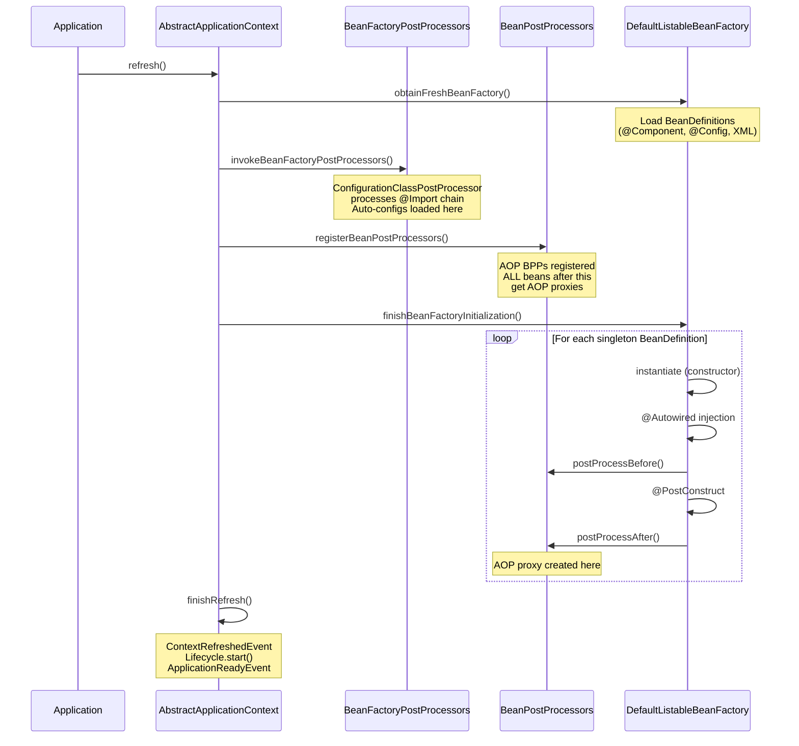

## Keywords in This File
{: .no_toc }

| # | Keyword | Weight |
|---|---|---|
| 1 | [Spring - L4 Context Refresh Internals](#spring---l4-context-refresh-internals) | medium |
| 2 | [Spring Context Startup and Refresh](#spring-context-startup-and-refresh) | medium |

---

# Spring Context Startup and Refresh

---
id: SPR-022
title: Spring Context Startup and Refresh
category: Spring
difficulty: ★★★
interview_weight: high
asked_at: Senior/Staff
seniority: senior
tags: #spring-context, #refresh, #lifecycle, #internals, #applicationcontext
status: draft
sd: false
version: 1
---

🎯 Interview Weight: High - Staff/Principal-level Spring questions frequently
probe the context refresh lifecycle. Essential for debugging slow startups,
circular dependencies, and BeanDefinition ordering issues.

---

### 🎯 Model Answer

**30 seconds:**
> Spring ApplicationContext startup runs the refresh() method. This method
> goes through 12 phases: preparing the refresh, creating the BeanFactory,
> loading BeanDefinitions (from XML, annotations, or JavaConfig), registering
> BeanFactoryPostProcessors (which can modify BeanDefinitions), registering
> BeanPostProcessors, initializing the MessageSource, initializing the EventMulticaster,
> registering beans in the context, and finally instantiating all non-lazy
> singleton beans. The last phase - preInstantiateSingletons - is where
> constructor injection, @Autowired, and @PostConstruct all run.

**3 minutes (Senior):**
> The refresh() method in AbstractApplicationContext is the heart of Spring.
> The full sequence:
>
> 1. prepareRefresh(): mark start time, validate required properties
> 2. obtainFreshBeanFactory(): create DefaultListableBeanFactory, load BeanDefinitions
>    from all sources (@Configuration classes, XML, @Component scanning)
> 3. prepareBeanFactory(): register standard BeanPostProcessors
>    (ApplicationContextAwareProcessor, ApplicationListenerDetector)
> 4. postProcessBeanFactory(): allow subclasses to modify BeanFactory
> 5. invokeBeanFactoryPostProcessors(): run ConfigurationClassPostProcessor
>    (processes @Configuration, @Import, @Bean), PropertySourcesPlaceholderConfigurer
>    (${}), others. THIS is where auto-configuration is loaded.
> 6. registerBeanPostProcessors(): find and register all BeanPostProcessor beans.
>    Important: BeanPostProcessors are registered but not yet applied.
> 7. initMessageSource(): i18n
> 8. initApplicationEventMulticaster(): event publishing
> 9. onRefresh(): start embedded web server (Spring Boot)
> 10. registerListeners(): find ApplicationListeners
> 11. finishBeanFactoryInitialization(): instantiate all non-lazy singletons.
>     This is the "long phase" - dependency injection, @Autowired, @PostConstruct,
>     all AOP proxy creation runs here.
> 12. finishRefresh(): publish ContextRefreshedEvent, start Lifecycle beans
>
> Understanding this helps diagnose: circular dependencies (step 11),
> slow startup (step 11 - which bean takes long), auto-config issues (step 5),
> and BeanPostProcessor ordering issues (step 6).

**Framework:** WHAT -> WHY -> HOW -> DEPTH -> FAILURE -> PRODUCTION

*Adapting up:* Staff - Spring Boot 3.x startup actuator, graalvm native hints,
@ImportBeanDefinitionRegistrar, @Import(ImportSelector), lazy initialization
strategies for startup performance.

*Adapting down:* Mid - "Spring startup has phases: first it reads your config
to find all beans (BeanDefinitions), then it creates them (instantiation). Most
things that fail during startup fail in one of those two phases."

**Blank Mind Recovery:**

**(1) Restate:** "You are asking about the Spring ApplicationContext startup process
- how Spring goes from empty to a fully configured running application."

**(2) First principles:** "Spring needs to: discover what beans to create (scanning
and configuration), modify those descriptions before creation (post-processing),
then create them in dependency order. These are three fundamentally different phases."

**(3) Bridge:** "Context refresh is like building a house. First you draft blueprints
(BeanDefinitions). Contractors review and modify blueprints (BeanFactoryPostProcessors).
Then construction begins in sequence - foundation first, then walls, then roof
(dependency-ordered instantiation). You cannot start construction before all
blueprints are approved."

---

### 📘 Concept Explanation

**What it is:**
The Spring ApplicationContext refresh() method is the single entry point for
container startup. It transitions the context from empty to fully operational,
executing 12 ordered phases that transform bean definitions into live beans.

**The problem it solves:**
Creating a container with hundreds of beans requires careful ordering: configuration
must be processed before beans are instantiated; infrastructure beans (BeanPostProcessors)
must be registered before regular beans are created; circular dependencies must
be detected. The refresh() lifecycle provides this ordered, deterministic startup.

**How it works:**

```
AbstractApplicationContext.refresh() - 12 phases:

Phase 1: prepareRefresh()
  - Set startupDate timestamp
  - Set active=true flag
  - Validate required properties
  - Prepare applicationListeners set

Phase 2: obtainFreshBeanFactory()
  - Create DefaultListableBeanFactory
  - Load BeanDefinitions:
    - @Component scan -> RootBeanDefinition
    - @Configuration class -> BeanDefinitionReader
    - XML -> XmlBeanDefinitionReader
  - Result: BeanFactory with BeanDefinitions
    but NO bean instances yet

Phase 3: prepareBeanFactory()
  - Register standard BPP (BeanPostProcessors):
    - ApplicationContextAwareProcessor
      (injects ApplicationContext to Aware beans)
    - ApplicationListenerDetector

Phase 4: postProcessBeanFactory()
  - Subclass extension point
  - Spring Boot uses for web context setup

Phase 5: invokeBeanFactoryPostProcessors()
  *** MOST IMPORTANT PHASE ***
  - Runs BeanFactoryPostProcessors (BFPPs):
    1. ConfigurationClassPostProcessor (HIGHEST priority)
       -> Processes @Configuration classes
       -> Processes @ComponentScan
       -> Processes @Import (auto-configuration!)
       -> Processes @Bean methods
       -> Processes @PropertySource
    2. PropertySourcesPlaceholderConfigurer
       -> Resolves ${...} placeholders
    3. Other BFPPs (custom ones)
  - Output: ALL BeanDefinitions now registered
    including auto-configured beans

Phase 6: registerBeanPostProcessors()
  - Find all BeanPostProcessor beans
  - Instantiate them early (before regular beans)
  - Register in order:
    1. PriorityOrdered BPPs
    2. Ordered BPPs
    3. Regular BPPs
    4. Internal BPPs (AopUtils)
  - Critical: BPPs registered here are applied
    to all subsequent bean instantiation

Phase 7: initMessageSource()
  - i18n support

Phase 8: initApplicationEventMulticaster()
  - Event multicaster for ApplicationEvents

Phase 9: onRefresh()
  - Spring Boot override: starts EmbeddedWebServer
    (Tomcat/Jetty/Netty starts accepting HTTP here)
  - But app not "ready" yet - readiness maintained

Phase 10: registerListeners()
  - Find ApplicationListener beans
  - Register with EventMulticaster

Phase 11: finishBeanFactoryInitialization()
  *** SLOWEST PHASE ***
  - DefaultListableBeanFactory
    .preInstantiateSingletons()
  - For each non-lazy singleton BeanDefinition:
    1. Resolve dependencies (recursively)
    2. Instantiate (constructor injection)
    3. Populate properties (@Autowired field injection)
    4. Run BeanPostProcessor.postProcessBefore...
    5. Run @PostConstruct methods
    6. Run BeanPostProcessor.postProcessAfter...
       (AOP proxies created HERE)
    7. Add to singleton cache
  - SmartInitializingSingleton callbacks run
    AFTER all singletons created

Phase 12: finishRefresh()
  - Clear resource caches
  - Start LifecycleProcessor (SmartLifecycle beans)
  - Publish ContextRefreshedEvent
  - Register JMX bean if configured
  - Spring Boot: ApplicationReadyEvent published
    (Kubernetes readiness becomes Ready here)
```

> **Code walkthrough:** This example demonstrates the core pattern in action. The key mechanism shows how the concept works in practice. Study the structure to understand the essential behavior and common usage.

**Circular dependency internals:**

```
How Spring resolves circular dependencies
(setter/field injection only):

A depends on B, B depends on A:

1. Create A instance (empty, no deps injected)
2. Add A to "early singleton cache"
   (singletonFactories map)
3. Inject B into A:
   a. Create B instance
   b. Add B to early singleton cache
   c. Inject A into B:
      -> Found in early singleton cache
      -> Returns partially-constructed A
   d. B is fully initialized
4. Continue injecting B into A
5. A is fully initialized

With constructor injection - FAILS:
  Creating A requires B be fully initialized.
  Creating B requires A be fully initialized.
  Neither can proceed -> BeanCurrentlyInCreationException.
  Constructor injection circular deps cannot be resolved.
  Fix: redesign to remove circular dependency,
  or use @Lazy on one constructor parameter.
```

> **Code walkthrough:** This example demonstrates the core pattern in action. The key mechanism shows how the concept works in practice. Study the structure to understand the essential behavior and common usage.

**The key insight:**
Phase 5 (BFPP invocation) and Phase 11 (instantiation) are architecturally
separate. In Phase 5, you can MODIFY BeanDefinitions. After Phase 5 starts
phase 11, BeanDefinitions are frozen. This is why BeanFactoryPostProcessors
are powerful - they run when metadata is still mutable. BeanPostProcessors
run during Phase 11 and can only modify bean instances, not definitions.

**When to use it (knowledge application):**
- Diagnosing circular dependencies: understand Phase 11
- Slow startup profiling: Phase 11 is where slow @PostConstruct methods hide
- Auto-configuration not loading: Phase 5 (ConfigurationClassPostProcessor)
- Custom bean definition manipulation: implement BeanFactoryPostProcessor
- Custom initialization logic: implement BeanPostProcessor or SmartInitializingSingleton

---

### 💻 Code Example

```java
// BeanFactoryPostProcessor - modifies BeanDefinitions
// before any beans are instantiated
@Component
public class DatabaseUrlOverridePostProcessor
        implements BeanFactoryPostProcessor {

    @Override
    public void postProcessBeanFactory(
            ConfigurableListableBeanFactory factory)
            throws BeansException {

        // Example: override DataSource URL based on env
        if (factory.containsBeanDefinition("dataSource")) {
            BeanDefinition bd = factory
                .getBeanDefinition("dataSource");

            // Modify property values
            MutablePropertyValues pvs =
                bd.getPropertyValues();
            String currentUrl = (String)pvs
                .getPropertyValue("url").getValue();

            if (currentUrl.contains("localhost")) {
                String envUrl = System.getenv("DB_URL");
                if (envUrl != null) {
                    pvs.addPropertyValue("url", envUrl);
                    log.info("Overrode DataSource URL "
                        + "from env: {}", envUrl);
                }
            }
        }
    }
}
```

> **Code walkthrough:** BeanFactoryPostProcessor runs in Phase 5, before any
> beans are created. At this point, BeanDefinitions are mutable. We retrieve the
> DataSource BeanDefinition and modify its "url" property value before the
> DataSource bean is ever instantiated. This is how PropertySourcesPlaceholderConfigurer
> works: it replaces ${...} in all BeanDefinition property values. CRITICAL: Never
> call beanFactory.getBean() inside a BeanFactoryPostProcessor - it triggers
> premature instantiation before Phase 6 (BeanPostProcessor registration), causing
> BPPs to not apply to those beans.

```java
// BeanPostProcessor - wraps every bean instance
// (AOP proxies are implemented this way)
@Component
public class ExecutionTimingPostProcessor
        implements BeanPostProcessor {

    @Override
    public Object postProcessAfterInitialization(
            Object bean, String beanName)
            throws BeansException {

        // Wrap only @TimedService-annotated beans
        Class<?> beanClass = AopUtils.getTargetClass(bean);
        if (beanClass.isAnnotationPresent(
                TimedService.class)) {

            ProxyFactory proxyFactory =
                new ProxyFactory(bean);
            proxyFactory.addAdvice(
                new TimingInterceptor(beanName));
            return proxyFactory.getProxy();
        }
        return bean;
    }
}

public class TimingInterceptor
        implements MethodInterceptor {

    private final String beanName;

    @Override
    public Object invoke(MethodInvocation inv)
            throws Throwable {
        long start = System.nanoTime();
        try {
            return inv.proceed();
        } finally {
            long ms = (System.nanoTime() - start)
                / 1_000_000;
            log.debug("[{}] {}.{}() = {}ms",
                beanName,
                inv.getMethod()
                   .getDeclaringClass()
                   .getSimpleName(),
                inv.getMethod().getName(),
                ms);
        }
    }
}
```

> **Code walkthrough:** BeanPostProcessor.postProcessAfterInitialization runs
> after every bean is fully initialized (after @PostConstruct). Returning a
> different object replaces the bean in the context - this is exactly how AOP
> proxies work. AbstractAutoProxyCreator is a BPP that checks every bean for
> @Transactional, @Async, @Cacheable annotations and wraps them in CGLIB proxies.
> CRITICAL: AopUtils.getTargetClass(bean) unwraps already-proxied beans to check
> the real class, not the proxy class.

```java
// Diagnosing slow startup with custom timing
@Component
public class StartupTimingListener
        implements ApplicationListener<ContextRefreshedEvent> {

    private static final Map<String, Long> BEAN_TIMES =
        new ConcurrentHashMap<>();

    @Override
    public void onApplicationEvent(
            ContextRefreshedEvent event) {
        // Sort beans by creation time descending
        BEAN_TIMES.entrySet().stream()
            .sorted(Map.Entry.comparingByValue(
                Comparator.reverseOrder()))
            .limit(20)
            .forEach(e -> log.info(
                "SLOW BEAN: {} = {}ms",
                e.getKey(), e.getValue()));
    }

    // Called by BeanPostProcessor for each bean
    public static void recordBeanTime(
            String beanName, long ms) {
        BEAN_TIMES.put(beanName, ms);
    }
}

// Spring Boot 2.5+ built-in startup profiling:
// ApplicationStartup events track each startup step
@SpringBootApplication
public class App {
    public static void main(String[] args) {
        SpringApplication app =
            new SpringApplication(App.class);
        // Enable startup profiling
        app.setApplicationStartup(
            new BufferingApplicationStartup(2048));
        app.run(args);
    }
}
// Then: GET /actuator/startup
```

> **Code walkthrough:** Spring Boot 2.5+ introduces BufferingApplicationStartup
> which records timing for every startup step. /actuator/startup returns the data.
> The built-in startup profiling is superior to custom BPPs for diagnosing slow
> startup - it records phase durations with sub-millisecond precision and requires
> no application code changes. The 2048 buffer size captures the last 2048 startup
> events.

---

### 🎓 Answers by Seniority

**Junior / Mid (0-5 years):**
> Spring context startup has two main phases: first it discovers all your
> beans by scanning @Component annotations and reading @Configuration classes.
> Second, it creates all singleton beans - injecting dependencies, running
> @PostConstruct methods, and creating AOP proxies. The slow part is usually
> the second phase. If you get BeanCurrentlyInCreationException, you have a
> circular dependency between beans.

*Push deeper:* What runs before your @PostConstruct? What is the difference
between BeanFactoryPostProcessor and BeanPostProcessor?

---

**Senior / Staff (5+ years):**
> AbstractApplicationContext.refresh() is the 12-phase startup process.
> Key phases: Phase 5 (invokeBeanFactoryPostProcessors) processes
> @Configuration classes via ConfigurationClassPostProcessor, loads all
> auto-configurations via @Import chain, resolves ${} placeholders.
> Phase 6 registers BeanPostProcessors (AOP infrastructure) before any regular
> beans are created. Phase 11 (finishBeanFactoryInitialization) instantiates all
> singletons - dependencies resolved recursively, @Autowired injected, @PostConstruct
> run, then BPPs applied (creating AOP proxies). Phase 12 publishes
> ContextRefreshedEvent and starts Lifecycle beans. For startup performance:
> Spring Boot 2.5+ BufferingApplicationStartup + /actuator/startup shows exact
> phase timings. Lazy initialization (spring.main.lazy-initialization=true)
> defers all Phase 11 work to first request - trades startup time for first-
> request latency.

*Push deeper:* Spring Framework 6 / Spring Boot 3 added @ImportRuntimeHints for
GraalVM native image support. AOT (Ahead of Time) processing runs part of the
refresh() logic at build time to generate reflection/resource hints, making much
of Phase 5 happen at compile time rather than startup.

---

### ⚠️ Common Misconceptions

**Misconception 1: "BeanPostProcessors apply to ALL beans."**
BeanPostProcessors are registered in Phase 6. Beans instantiated BEFORE Phase 6
(BFPPs themselves, beans requested via beanFactory.getBean() from a BFPP) do
not have BPPs applied to them. This is the root cause of the "BPP gets raw bean
without proxy" bug: if bean X is instantiated during BFPP execution, it misses
all BPPs and has no AOP proxy.

**Misconception 2: "Circular dependencies always fail."**
Circular dependencies fail for constructor injection (cannot be resolved -
both beans need the other to construct). They succeed for setter/field injection
because Spring uses a three-level singleton cache:
(1) singletonObjects (complete), (2) earlySingletonObjects (initialized but
not complete), (3) singletonFactories (ObjectFactory for early reference).
Spring Framework 6 by default RAISES an error even for setter injection circular
deps (spring.main.allow-circular-references=true restores old behavior).

**Misconception 3: "@PostConstruct runs last in initialization."**
The full initialization sequence is: constructor -> @Autowired field injection
-> BPP.postProcessBeforeInitialization() -> @PostConstruct -> InitializingBean
.afterPropertiesSet() -> init-method -> BPP.postProcessAfterInitialization().
AOP proxies (from BPP after) wrap the fully initialized bean. @PostConstruct
sees a raw (not yet proxied) bean.

---

### 🚨 Failure Modes and Diagnosis

**Failure 1: UnsatisfiedDependencyException during startup**
Symptom: Context fails with "Unsatisfied dependency expressed through field X;
nested exception: NoSuchBeanDefinitionException: No qualifying bean of type Y found"
Cause: Required bean of type Y is not in the context.
Diagnosis:
1. Check /actuator/conditions - is the auto-config for Y in negativeMatches?
2. Is the class on the classpath? (ConditionalOnClass may have failed)
3. Is there a @Profile guard that prevented registration?
4. Is the @ComponentScan missing the package?
Fix: Add the dependency, fix the classpath, or add the missing @Bean.

**Failure 2: Bean instantiation fails silently**
Symptom: NoSuchBeanDefinitionException for a bean that should exist, but no
startup error was logged for it.
Cause: @ConditionalOnMissingBean with an existing bean of a parent type.
Diagnosis: Check /actuator/conditions positiveMatches and negativeMatches
for the expected auto-configuration.

**Failure 3: "is not eligible for getting processed by all BeanPostProcessors"**
Symptom: Spring logs warning: "Bean X is not eligible for getting processed
by all BeanPostProcessors (for example: not eligible for auto-proxying)"
Cause: Bean X is being instantiated during Phase 5 (BFPP processing) before
BPPs are registered. This commonly happens when a BFPP calls getBean() or when
a bean used by a BFPP has dependencies on regular beans.
Fix: Ensure BFPPs depend only on BFPPs. If a BFPP needs a service, pass it
programmatically rather than via @Autowired. Or mark the dependent bean @Lazy.

**Failure 4: Slow startup**
Symptom: Application takes 30+ seconds to start.
Diagnosis:
```properties
# Enable startup profiling
spring.main.lazy-initialization=false  # ensure all beans init
```
> **Code walkthrough:** This example demonstrates the core pattern in action. The key mechanism shows how the concept works in practice. Study the structure to understand the essential behavior and common usage.

Then check /actuator/startup (requires BufferingApplicationStartup).
Or add -Dspring.jmx.enabled=true and profile with VisualVM.
Common causes: @PostConstruct doing I/O, slow DataSource pool initialization,
Hibernate schema validation on large schemas, too many beans instantiated eagerly.

---

### 🎯 Interview Deep-Dive

**Timing:** Hard ★★★ - 12 questions.

---

#### Q1 - What is the difference between BeanFactoryPostProcessor and BeanPostProcessor?

**BeanFactoryPostProcessor (BFPP)**:
- Runs in Phase 5, before any regular beans are instantiated
- Receives ConfigurableListableBeanFactory
- Operates on BeanDefinitions (metadata), not instances
- Can ADD, REMOVE, or MODIFY BeanDefinitions
- Examples: ConfigurationClassPostProcessor, PropertySourcesPlaceholderConfigurer
- Key constraint: do NOT call beanFactory.getBean() for regular beans inside a BFPP

**BeanPostProcessor (BPP)**:
- Runs in Phase 6 (registration); applied during Phase 11 (per-bean, twice)
- postProcessBeforeInitialization(): before @PostConstruct
- postProcessAfterInitialization(): after @PostConstruct - AOP proxies created here
- Operates on bean instances
- Returns a potentially different object (proxy replacement)
- Examples: AutowiredAnnotationBeanPostProcessor, AbstractAutoProxyCreator

The architectural difference: BFPP modifies the blueprint (BeanDefinition).
BPP decorates the constructed object (bean instance).

*What separates good from great:* The reason getBean() in a BFPP is dangerous:
calling getBean() during Phase 5 forces that bean to be instantiated early -
before Phase 6 where BPPs are registered. The bean gets created without any
BPPs applying. If that bean needs AOP proxies (@Transactional, @Cacheable),
it won't get them. This manifests as @Transactional not working on a bean,
with Spring logging the warning about "not eligible for auto-proxying".

---

#### Q2 - How does Spring handle circular dependencies?

Spring uses a three-level singleton cache in DefaultSingletonBeanRegistry:

Level 1 - singletonObjects: fully initialized beans (final cache)
Level 2 - earlySingletonObjects: early references (ObjectFactory result cached)
Level 3 - singletonFactories: ObjectFactory for creating early references

Resolution for A -> B -> A (setter/field injection):

1. Start creating A
2. Add A's ObjectFactory to singletonFactories (level 3)
3. Start injecting A's dependencies - needs B
4. Start creating B
5. Add B's ObjectFactory to level 3
6. Start injecting B's dependencies - needs A
7. Check singletonFactories: A's ObjectFactory exists
8. Call A's ObjectFactory -> creates early reference to A
9. Move early A to earlySingletonObjects (level 2)
10. B's dependency on A satisfied with early A reference
11. B fully initialized -> moved to singletonObjects (level 1)
12. A's dependency on B satisfied
13. A fully initialized -> moved to level 1

With AOP proxies:
- Early A reference is the raw bean (not the proxy)
- B holds reference to raw A
- After A is fully initialized, AOP creates proxy
- The ObjectFactory in singletonFactories handles this:
  SmartInstantiationAwareBeanPostProcessor.getEarlyBeanReference()
  returns the proxy for early references

Spring Framework 6 change: circular dependencies between singletons raise
an error by default. Set spring.main.allow-circular-references=true to allow.

*What separates good from great:* Why does constructor injection not support
circular dependencies? Because to construct A, B must already exist as a
complete instance. To construct B, A must already exist. This is a logical
deadlock - no early reference mechanism can help. The only fix is redesign
or @Lazy on one constructor parameter (deferred proxy creation).

---

#### Q3 - How does Spring Boot load auto-configurations during context refresh?

Auto-configurations load during Phase 5 (invokeBeanFactoryPostProcessors)
through this chain:

1. ConfigurationClassPostProcessor is the first BFPP to run
2. It processes your @SpringBootApplication class
3. @SpringBootApplication includes @EnableAutoConfiguration
4. @EnableAutoConfiguration includes @Import(AutoConfigurationImportSelector.class)
5. AutoConfigurationImportSelector reads:
   - Spring Boot 3: META-INF/spring/
     org.springframework.boot.autoconfigure
     .AutoConfiguration.imports
   - Spring Boot 2: META-INF/spring.factories
   (lists all auto-configuration class names)
6. Spring loads and applies Conditions for each
7. Passing auto-configurations are added as BeanDefinitions

This all happens in Phase 5 - before any beans are instantiated.
By the end of Phase 5, ALL BeanDefinitions (user + auto-configured) are registered.

The @AutoConfigureOrder, @AutoConfigureBefore, @AutoConfigureAfter annotations
control the order in which auto-configurations are processed, allowing
dependencies between them.

*What separates good from great:* Spring Boot 2.7 deprecated spring.factories
for auto-configuration registration (though it still works for compatibility).
The new META-INF/spring/AutoConfiguration.imports file is more efficient:
it uses lighter parsing and supports deferred loading. If you write a custom
Spring Boot starter, use the new format.

---

#### Q4 - What is the SmartInitializingSingleton and when does it run?

SmartInitializingSingleton is an interface with afterSingletonsInstantiated().
It runs after ALL singleton beans are fully initialized (at the very end of
Phase 11).

Use case: initialization that depends on ALL beans being available, not just
the dependencies of this particular bean.

```java
@Component
public class RouteRegistry
        implements SmartInitializingSingleton {

    @Autowired
    private List<RouteDefinition> routes;

    @Override
    public void afterSingletonsInstantiated() {
        // All RouteDefinition beans are now available
        // including those from other auto-configurations
        routes.forEach(route ->
            registerRoute(route));
        log.info("Route registry initialized "
            + "with {} routes", routes.size());
    }
}
```

> **Code walkthrough:** This example demonstrates the core pattern in action. The key mechanism shows how the concept works in practice. Study the structure to understand the essential behavior and common usage.

SmartInitializingSingleton vs @PostConstruct:
- @PostConstruct: runs as THIS bean is initialized.
  Other beans may not be initialized yet.
- SmartInitializingSingleton: runs after ALL singletons.
  Safe to interact with any bean in the context.

The ApplicationContext ContextRefreshedEvent fires after SmartInitializingSingleton.
ApplicationReadyEvent (Spring Boot) fires even later.

*What separates good from great:* SmartInitializingSingleton is the correct
hook for framework-level initialization that needs the full application context
to be available. Spring's own infrastructure (WebMvcHandlerMapping, JPA entity
scanning) uses it. Misusing @PostConstruct to do full-context operations is
the most common Spring initialization ordering bug.

---

#### Q5 - How does lazy initialization affect context startup?

spring.main.lazy-initialization=true defers all singleton instantiation
from startup to first access:

Startup behavior:
- Phases 1-10 remain the same
- Phase 11: NO beans are instantiated (all deferred)
- Result: startup is very fast (~10% of normal time)

Runtime behavior:
- First request that needs Bean X triggers instantiation of X + all dependencies
- First request is slow (initialization cost moved to runtime)
- Errors surface at first access, not at startup (dangerous in production)

Considerations:
- CircularDependencyException will surface on first access, not startup
- @PostConstruct methods run on first access (I/O, warmup deferred)
- Kubernetes readiness probe passes before app is actually ready

When to use:
- Integration tests: faster context startup
- Specific slow beans: @Lazy on individual beans is safer

When NOT to use:
- Production services: errors detected at startup (fail-fast) are better
  than errors at first request (impacts real users)

*What separates good from great:* Spring Boot 3.2 introduced virtual threads
(Project Loom) support. Combined with lazy initialization, startup can be
further reduced by parallelizing bean initialization across virtual threads.
Experimental: spring.threads.virtual.enabled=true enables virtual threads
for Tomcat and scheduled tasks.

---

#### Q6 - How do you profile slow Spring Boot startup?

Approach 1 - BufferingApplicationStartup (Spring Boot 2.5+):
```java
app.setApplicationStartup(
    new BufferingApplicationStartup(2048));
```
> **Code walkthrough:** This example demonstrates the core pattern in action. The key mechanism shows how the concept works in practice. Study the structure to understand the essential behavior and common usage.

Then GET /actuator/startup (requires Actuator + exposure).
Returns per-step timing including "spring.beans.instantiate" for each bean.

Approach 2 - Spring Debug Logging:
```properties
logging.level.org.springframework=DEBUG
```
> **Code walkthrough:** This example demonstrates the core pattern in action. The key mechanism shows how the concept works in practice. Study the structure to understand the essential behavior and common usage.

Logs every phase and bean instantiation (verbose - use with -Dlogging only).

Approach 3 - JVM profiler:
- JVisualVM, async-profiler, or YourKit
- Attach during startup
- Find which @PostConstruct or constructor is slow
- 90% of slow startup cases are: Hibernate schema validation,
  slow DataSource pool warm-up, or certificate loading

Approach 4 - Spring Boot Startup Analyzer (community):
```properties
spring.boot.startup.report=enabled
```

> **Code walkthrough:** This example demonstrates the core pattern in action. The key mechanism shows how the concept works in practice. Study the structure to understand the essential behavior and common usage.

Quick wins:
- Exclude unused @ComponentScan packages
- Use spring.main.lazy-initialization=true in development
- Replace schema validation: spring.jpa.hibernate.ddl-auto=none + Flyway/Liquibase

*What separates good from great:* The most valuable diagnostic is identifying
WHICH bean takes long vs. how long total initialization takes. BufferingApplicationStartup
shows "spring.beans.instantiate" steps with nanosecond precision. Sort by duration
descending. Usually 1-3 beans account for 90% of startup time. Fixing those
beans (async initialization, lazy loading of caches) has disproportionate impact.

---

#### Q7 - What is the role of ConfigurationClassPostProcessor?

ConfigurationClassPostProcessor (CCPP) is the most important BeanFactoryPostProcessor.
It runs first in Phase 5 and processes ALL configuration metadata:

Annotations processed by CCPP:
- @Configuration: register class as configuration, enhance with CGLIB proxy
- @ComponentScan: find and register @Component beans in specified packages
- @Import: import other @Configuration classes
  - Including ImportSelector (e.g., AutoConfigurationImportSelector)
  - Including ImportBeanDefinitionRegistrar
- @Bean: register method as BeanDefinition
- @PropertySource: load property files
- @ImportResource: load XML configuration

CGLIB enhancement of @Configuration classes:
CCPP creates a CGLIB subclass of @Configuration classes. This ensures that
@Bean method calls within the class return the SAME singleton instance
(not a new one on each call). This is the "full" @Configuration mode.
@Configuration(proxyBeanMethods=false) opts out of CGLIB (faster startup,
no singleton guarantee for inter-@Bean calls).

*What separates good from great:* CCPP has a two-pass model: first it finds
all configuration sources (user's @SpringBootApplication), then it processes
@Import chains recursively. This is why auto-configurations (loaded via
@Import(AutoConfigurationImportSelector)) see the full user-defined bean
definitions when evaluating @ConditionalOnMissingBean - CCPP processes user
beans BEFORE processing the auto-configurations they import.

---

#### Q8 - How does Spring handle the ContextRefreshedEvent and ApplicationReadyEvent?

Two events at the end of startup, with different guarantees:

ContextRefreshedEvent (Phase 12 of refresh()):
- Published after refresh() completes
- All singletons initialized (Phase 11 done)
- Lifecycle beans started
- Can fire multiple times (context restart, test context re-use)

ApplicationReadyEvent (Spring Boot):
- Published by SpringApplication after:
  - Context is refreshed
  - ApplicationRunner and CommandLineRunner beans have run
  - All SmartLifecycle.start() calls complete
- Fires exactly once per application startup
- This is when Kubernetes readiness should become "ready"

For Kubernetes: Spring Boot 2.3+ ties ApplicationReadyEvent to
ReadinessState.ACCEPTING_TRAFFIC. The /actuator/health/readiness returns UP
only after ApplicationReadyEvent.

Use cases:
- ContextRefreshedEvent: framework init, cache warm-up
- ApplicationReadyEvent: signal "I'm ready for traffic"
- CommandLineRunner / ApplicationRunner: run once after startup
  (data initialization, migration checks)

*What separates good from great:* The Kubernetes readiness trap: if you do
heavy initialization in @PostConstruct or ContextRefreshedEvent that blocks for
30 seconds, Kubernetes readiness probe may time out and restart the pod before
the app finishes starting. Spring Boot's ReadinessState + ApplicationReadyEvent
provides the correct hook. The pod readiness probe should point to
/actuator/health/readiness and should have a generous initialDelaySeconds.

---

#### Q9 - What is the difference between @ComponentScan and @Import?

**@ComponentScan**:
- Scans specified packages for @Component, @Service, @Repository, @Controller
- Finds beans by classpath scanning at startup
- Slower than @Import (classpath scan is I/O intensive)
- Best for application code (you own the packages)
- Base package defaults to the annotated class's package

**@Import**:
- Directly imports @Configuration classes, ImportSelector results,
  or ImportBeanDefinitionRegistrar
- No classpath scanning - explicit class reference
- Fast: direct class loading
- Best for: library code, auto-configurations, conditional imports
- ImportSelector allows programmatic class selection (AutoConfigurationImportSelector)

Auto-configuration uses @Import, not @ComponentScan:
@EnableAutoConfiguration -> @Import(AutoConfigurationImportSelector.class)
This is why auto-configurations load fast - they are directly imported,
not discovered by scanning.

*What separates good from great:* The performance difference matters at scale.
A service with 2000+ @Component beans pays a significant startup cost in
classpath scanning. Reducing @ComponentScan scope (explicit basePackages) or
replacing @ComponentScan with @Import in performance-critical paths improves
startup. Spring Boot's own infrastructure uses @Import everywhere, and its
auto-configurations are loaded via ImportSelector rather than component scan.

---

#### Q10 - How does Spring Boot implement graceful shutdown?

Spring Boot 2.3+ graceful shutdown:

1. Kubernetes sends SIGTERM to pod
2. JVM receives signal, Spring's shutdown hook runs
3. SmartLifecycle beans notified to stop (in reverse start order)
4. SmartLifecycle.stop() for Tomcat: "stop accepting new connections"
5. ReadinessState changes to REFUSING_TRAFFIC
   (Kubernetes removes pod from load balancer)
6. In-flight requests allowed to complete
   (spring.lifecycle.timeout-per-shutdown-phase=30s)
7. After grace period or all requests complete:
   ApplicationContext.close() called
8. All @PreDestroy methods run
9. All DisposableBean.destroy() methods run
10. JVM exits

Configuration:
```properties
server.shutdown=graceful
spring.lifecycle.timeout-per-shutdown-phase=30s
```

> **Code walkthrough:** This example demonstrates the core pattern in action. The key mechanism shows how the concept works in practice. Study the structure to understand the essential behavior and common usage.

Kubernetes preStop hook (aligned with graceful shutdown):
```yaml
lifecycle:
  preStop:
    exec:
      command: ["sh", "-c", "sleep 15"]
```
> **Code walkthrough:** This example demonstrates the core pattern in action. The key mechanism shows how the concept works in practice. Study the structure to understand the essential behavior and common usage.

The sleep gives Kubernetes time to remove the pod from Service endpoints
before Spring starts refusing connections.

*What separates good from great:* The timing gap: Kubernetes marks the endpoint
as not ready after receiving SIGTERM, but load balancer rules propagate with
eventual consistency. Without the preStop sleep, some traffic may still reach
the pod after SIGTERM but before the endpoint table updates. The preStop sleep
bridges this gap. 15 seconds is a common value but depends on your environment's
endpoint propagation time.

---

#### Q11 - How do SmartLifecycle beans interact with context startup and shutdown?

SmartLifecycle extends Lifecycle and Phased:

```java
@Component
public class CacheWarmupLifecycle
        implements SmartLifecycle {

    private volatile boolean running = false;

    @Override
    public int getPhase() {
        // Higher phase = starts later, stops earlier
        return Integer.MAX_VALUE - 100;
    }

    @Override
    public void start() {
        log.info("Warming up caches...");
        // Heavy initialization here
        warmCache();
        running = true;
        log.info("Cache warm-up complete");
    }

    @Override
    public void stop() {
        running = false;
        log.info("Cache lifecycle stopped");
    }

    @Override
    public boolean isRunning() { return running; }

    @Override
    public boolean isAutoStartup() {
        return true; // start automatically
    }
}
```

> **Code walkthrough:** This example demonstrates the core pattern in action. The key mechanism shows how the concept works in practice. Study the structure to understand the essential behavior and common usage.

Startup: SmartLifecycle.start() is called in Phase 12 of refresh().
Beans with lower phase numbers start first.
Shutdown: stop() is called in reverse order (higher phase first).

Comparison with @PostConstruct:
- @PostConstruct: runs during Phase 11 (per-bean), before all singletons complete
- SmartLifecycle.start(): runs after ALL singletons instantiated,
  in Phase 12, in phase order

*What separates good from great:* SmartLifecycle.stop(Runnable) allows async
stop with a completion callback - correct for async shutdown sequences.
Without the Runnable version, Spring assumes stop() is synchronous and the bean
is stopped immediately. For servers or connection pools that need time to drain,
the Runnable overload is essential: call runnable.run() only when truly stopped.

---

#### Q12 - What changed in the Spring context startup model in Spring Boot 3 and Spring Framework 6?

Several significant changes:

**1. AOT (Ahead of Time) Processing:**
- Spring Boot 3 supports GraalVM native compilation
- AOT phase runs at BUILD time: processes configuration,
  computes BeanDefinitions, generates reflection hints
- Phase 5 (ConfigurationClassPostProcessor) work partially
  moves to build time
- Result: native image starts in milliseconds (no JVM class loading)

**2. Virtual Threads (Spring Boot 3.2+, JDK 21):**
- spring.threads.virtual.enabled=true
- Tomcat, Jetty, scheduled tasks use virtual threads
- Platform thread pool can be smaller
- Better I/O-bound concurrency (no blocking thread exhaustion)

**3. Circular Reference Default Changed:**
- Spring Framework 6: circular references fail by default
  (spring.main.allow-circular-references=true to revert)
- Forces better design at compile time

**4. Auto-Configuration Registration:**
- spring.factories deprecated for auto-configuration
- New: META-INF/spring/
  AutoConfiguration.imports
- Legacy spring.factories supported via bridge

**5. @ImportRuntimeHints:**
- New annotation for registering GraalVM reflection/proxy hints
- Used by Spring infrastructure for native image support

*What separates good from great:* The AOT transformation is architecturally
significant: it changes Spring from a purely runtime framework to one with
build-time optimization capability. The AOT-generated sources live in
src/aot-generated and can be inspected. For native image builds, the AOT
phase essentially pre-computes what the context refresh() would discover,
baking it into the binary. This eliminates the reflection-heavy portions of
context startup and makes Spring-based native images competitive with Go or
Rust startup times.

---

### ⚖️ Comparison Table

| Aspect | BeanFactoryPostProcessor | BeanPostProcessor | SmartInitializingSingleton |
|---|---|---|---|
| Phase | 5 (pre-instantiation) | 6 (registration) + 11 (per-bean) | End of Phase 11 |
| Input | BeanDefinitions | Bean instances | All singletons complete |
| Output | Modified BeanDefinitions | Same or wrapped instance | Side effects only |
| Can getBean? | DANGEROUS (bypass BPPs) | Yes - safe | Yes - all ready |
| AOP proxies? | N/A (no instances) | Yes (creates them) | Already created |
| Order | PriorityOrdered then Ordered | PriorityOrdered then Ordered | After all |
| Example | ConfigurationClassPostProcessor | AbstractAutoProxyCreator | Handler mappings |

---

### 🏛️ System Design

**How the context refresh model scales to enterprise applications:**

In large microservice systems, context refresh performance is a deployment-critical
factor. A service that takes 90 seconds to start cannot meet Kubernetes rolling
deployment SLAs (pod must pass readiness probe within terminationGracePeriodSeconds).

Scale considerations:

**Startup time budget:**
- Target: < 10 seconds for readiness
- Phase 11 (instantiation) is the bottleneck
- Each @PostConstruct that does I/O adds to startup

**Strategies for sub-10-second startup:**
1. Lazy initialization for non-critical beans
2. Async cache warm-up via SmartInitializingSingleton
3. Reduce @ComponentScan scope
4. Use @Import instead of scan for library beans
5. GraalVM native images: sub-1-second (Spring Boot 3 + GraalVM)

**Enterprise pattern - split contexts:**
Large applications can use parent-child ApplicationContext hierarchy.
Parent context: shared infrastructure (DataSource, Security, caching)
Child contexts: per-module beans with parent as parent context
Benefit: child contexts can reload independently without full restart.

**Reactive applications:**
Spring WebFlux uses the same refresh() lifecycle but in a ReactiveWebApplicationContext.
The key difference: no thread-per-request model, so the I/O-bound Phase 11
work is the same, but the resulting beans serve requests via Reactor rather
than Servlet API.

---

### 📊 Diagram

```
Spring ApplicationContext refresh() phases:

Phase | Name                         | Key Work
------|------------------------------|-------------------
  1   | prepareRefresh()             | timestamps, flags
  2   | obtainFreshBeanFactory()     | BeanDefs loaded
  3   | prepareBeanFactory()         | std BPPs registered
  4   | postProcessBeanFactory()     | subclass hook
[5]   | invokeBeanFactoryPostProc.   | @Config, @Import
[6]   | registerBeanPostProcessors() | AOP BPPs reg.
  7   | initMessageSource()          | i18n
  8   | initEventMulticaster()       | events
[9]   | onRefresh()                  | web server start
 10   | registerListeners()          | event listeners
[11]  | finishBeanFactoryInit()      | ALL beans created
 12   | finishRefresh()              | events, Lifecycle

[5] = auto-config loads, ${} resolved
[6] = last chance to register BPPs
[9] = Spring Boot: Tomcat starts (NOT ready yet)
[11] = slowest phase; AOP proxies created here
```



> **Diagram walkthrough:** The sequence reveals why BPP registration (Phase 6)
> must precede all bean instantiation. Any bean instantiated before Phase 6
> completes (e.g., via getBean() inside a BFPP) misses all BPPs - notably
> the AOP proxy creator. The critical insight is that Phases 5 and 11 are
> separated by Phase 6: after all BeanDefinitions exist (Phase 5 complete) and
> before any regular beans are created (Phase 11 starts), the BPP infrastructure
> is put in place. This ordering guarantee is the foundation of Spring's
> pluggable, non-invasive AOP.

---

### 💻 Code Example

*(Omit: this concept does not have a programmatic interface that can be demonstrated in code. The conceptual explanation above is sufficient.)*


---

### 🏛️ System Design

*(Omit: system design diagram not applicable for this concept - see ★★★ keywords for full system design coverage.)*


---

### ⚖️ Comparison Table

*(Omit: this is a ★☆☆ foundational concept with no direct alternatives to compare - see higher-difficulty keywords for trade-off analysis.)*


---

### 📊 Diagram

*(Omit: no standalone visual diagram required for this concept - the explanations and code examples above provide sufficient clarity.)*


