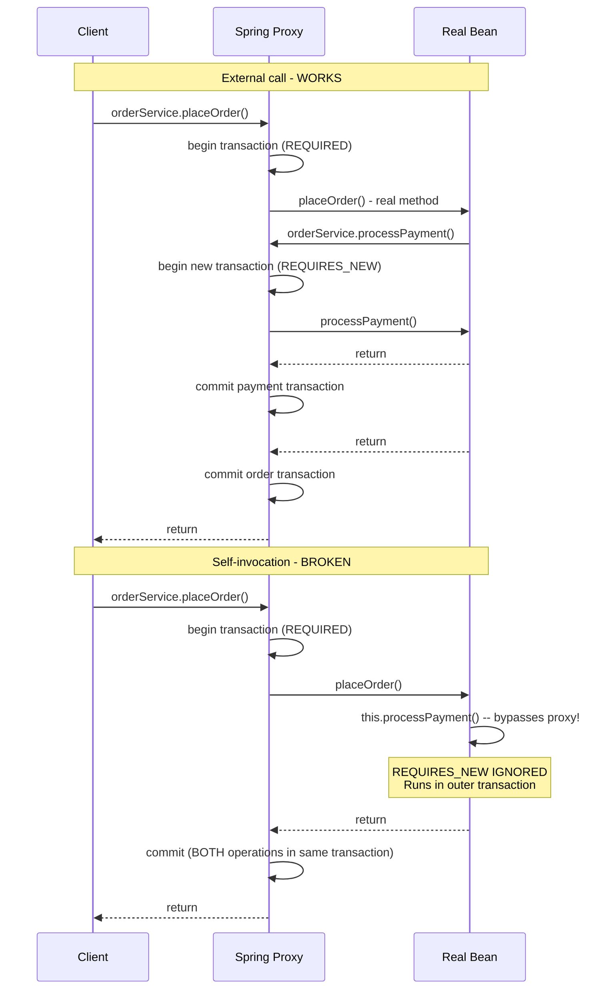

## Keywords in This File
{: .no_toc }

| # | Keyword | Weight |
|---|---|---|
| 1 | [BeanPostProcessor and Extension Points](#beanpostprocessor-and-extension-points) | expert |
| 2 | [Transactional Self-Invocation Anti-Pattern](#transactional-self-invocation-anti-pattern) | critical |
| 3 | [Spring Proxy Anti-Patterns](#spring-proxy-anti-patterns) | expert |
| 4 | [Spring Security Architecture](#spring-security-architecture) | critical |
| 5 | [Spring Performance Diagnostics](#spring-performance-diagnostics) | high |
| 6 | [Spring Performance Diagnostics](#spring-performance-diagnostics) | high |

---

# BeanPostProcessor and Extension Points

**Interview Weight:** expert - Senior/staff engineers
building frameworks, libraries, or custom Spring integrations
must know extension points. Questions test: when to use
`BeanPostProcessor` vs `BeanFactoryPostProcessor`, custom
annotations with AOP, and the initialization callback chain.
This is a differentiation topic between senior and staff
candidates.

---

### 🎯 Model Answer

**30 seconds:**

> `BeanPostProcessor` is a Spring extension interface that
> lets you intercept bean initialization. Its two methods,
> `postProcessBeforeInitialization()` and
> `postProcessAfterInitialization()`, run for every bean
> in the container. Spring uses `BeanPostProcessors`
> internally for AOP proxy creation, `@Autowired` injection,
> and `@PostConstruct`/`@PreDestroy`. `BeanFactoryPostProcessor`
> runs before any beans are instantiated and modifies the
> bean definitions (metadata), not the beans themselves.

**3 minutes (Senior):**

> Spring's bean lifecycle extension points:
>
> **BeanFactoryPostProcessor** (modifies bean definitions):
> runs after bean definitions are loaded but before beans
> are instantiated. Use to modify `BeanDefinition` metadata,
> add new bean definitions, or resolve `${property.placeholder}`
> in bean definitions. Example: `PropertySourcesPlaceholderConfigurer`.
>
> **BeanPostProcessor** (modifies bean instances):
> runs for every bean after instantiation and before the
> bean is ready for use. Two methods:
> - `postProcessBeforeInitialization()`: after injection,
>   before `@PostConstruct`/`afterPropertiesSet()`
> - `postProcessAfterInitialization()`: after `@PostConstruct`.
>   THIS is where AOP proxies are created
>   (`AbstractAutoProxyCreator`). The proxy is returned
>   in place of the real bean, so the application context
>   holds proxies, not real beans.
>
> Key bean lifecycle order:
> 1. Constructor
> 2. `@Autowired` field/setter injection
> 3. `BeanPostProcessor.postProcessBeforeInitialization()`
> 4. `@PostConstruct` method
> 5. `InitializingBean.afterPropertiesSet()`
> 6. `@Bean(initMethod = "...")`
> 7. `BeanPostProcessor.postProcessAfterInitialization()`
>    (AOP proxy created here)
> 8. Bean ready for use
>
> When would YOU write a `BeanPostProcessor`?
> - Custom annotation processing: apply behavior to all
>   beans annotated with `@MyAnnotation`
> - Framework infrastructure: scan beans for metrics
>   registration, tracing instrumentation, validation
> - Custom proxy creation: wrap beans with custom behavior
>   at initialization time

**Framework:** BeanFactoryPostProcessor (definitions) →
BeanPostProcessor (instances) →
INITIALIZATION CALLBACKS (@PostConstruct, afterPropertiesSet) →
AOP PROXY CREATION (postProcessAfterInitialization) →
CUSTOM ANNOTATION PROCESSORS

*Adapting up:* Discuss `InstantiationAwareBeanPostProcessor`
(can short-circuit instantiation), `SmartInstantiationAwareBeanPostProcessor`
(circular dependency resolution), and how Spring Boot's
auto-configuration uses `BeanFactoryPostProcessors` to
add conditional bean definitions.

*Adapting down:* `BeanPostProcessor` is like a filter for
every Spring bean being created. Spring calls your `BeanPostProcessor`
for every bean in the container, giving you a chance to
inspect or wrap it. Spring uses this internally to add
transaction proxies around `@Transactional` beans.

---

### 📘 Concept Explanation

**What it is:**

Spring's extension point model allows framework authors
and library developers to hook into bean creation, inspect
and modify beans, add behavior, or replace beans with
proxies.

**The two core extension points:**

```
  BEAN CREATION TIMELINE

  Configuration (XML / @Configuration / @ComponentScan)
        |
        v
  BeanFactoryPostProcessor.postProcessBeanFactory()
  [Modifies BeanDefinitions: adds beans, resolves props]
        |
        v
  Bean instantiation (new MyBean())
        |
        v
  Dependency injection (@Autowired)
        |
        v
  BPP.postProcessBeforeInitialization() [for each bean]
  (e.g. @Required checking, custom annotation scan)
        |
        v
  @PostConstruct, afterPropertiesSet(), initMethod
        |
        v
  BPP.postProcessAfterInitialization() [for each bean]
  (e.g. AOP proxy wrapping, custom interceptors)
        |
        v
  Bean ready: stored in ApplicationContext
```

```mermaid
flowchart TD
    config[Bean Definitions Loaded] --> bfpp[BeanFactoryPostProcessor\nModify BeanDefinitions]
    bfpp --> inst[Instantiate Bean\nnew Constructor]
    inst --> inject[Dependency Injection\n@Autowired]
    inject --> pre[BPP.postProcessBeforeInitialization]
    pre --> init[@PostConstruct\nafterPropertiesSet]
    init --> post[BPP.postProcessAfterInitialization\nAOP Proxy Created Here]
    post --> ready[Bean Ready\nStored in Context]
```

> **Diagram walkthrough:** `BeanFactoryPostProcessor` runs
> once per container startup, before any beans are created.
> It can add or modify `BeanDefinition` objects (metadata).
> `BeanPostProcessor` runs once per bean, after the bean
> is instantiated and injected. The critical point: AOP
> proxy creation happens in `postProcessAfterInitialization`.
> The method receives the real bean instance but can return
> a DIFFERENT object (the proxy). The proxy is what the
> rest of the application gets when they inject this bean.

---

### 💻 Code Example

**Wrong vs Right: Custom BeanPostProcessor**

```java
// BAD: BeanPostProcessor that tries to use @Autowired beans
@Component
public class MetricsRegistrar
    implements BeanPostProcessor {

    // BAD: @Autowired in BeanPostProcessor is risky
    // MetricsRegistry is also a bean; if it's not yet
    // created, Spring may have initialization ordering
    // issues or circular dependency problems
    @Autowired
    private MetricsRegistry metricsRegistry;

    @Override
    public Object postProcessAfterInitialization(
        Object bean, String beanName) {
        // BAD: creates dependencies during BPP phase
        // BPPs are instantiated early; injecting beans
        // here can break normal bean initialization order
        if (bean.getClass()
            .isAnnotationPresent(Monitored.class)) {
            metricsRegistry.register(beanName);
        }
        return bean;
    }
}
```

```java
// GOOD: BeanPostProcessor with proper dependencies
@Component
public class MetricsRegistrar
    implements BeanPostProcessor, ApplicationContextAware {

    // Use ApplicationContext lookup instead of @Autowired
    // in BeanPostProcessor to avoid ordering issues
    private ApplicationContext context;

    @Override
    public void setApplicationContext(
        ApplicationContext ctx) {
        this.context = ctx;
    }

    @Override
    public Object postProcessAfterInitialization(
        Object bean, String beanName)
        throws BeansException {

        Monitored annotation = AnnotationUtils.findAnnotation(
            bean.getClass(), Monitored.class);

        if (annotation == null) {
            return bean;  // most beans: no-op, fast path
        }

        // Get MetricsRegistry lazily (avoids ordering issues)
        MetricsRegistry registry =
            context.getBean(MetricsRegistry.class);
        registry.register(beanName, annotation.tags());

        log.debug("Registered metrics for bean: {}",
            beanName);
        return bean;  // return the original bean unchanged
    }
}

// Custom annotation
@Target(ElementType.TYPE)
@Retention(RetentionPolicy.RUNTIME)
public @interface Monitored {
    String[] tags() default {};
}

// Usage: any bean with @Monitored is registered
@Monitored(tags = {"service", "order"})
@Service
public class OrderService { ... }
```

> **Code walkthrough:** The BAD version uses `@Autowired`
> in a `BeanPostProcessor`. `BeanPostProcessors` are
> initialized very early in the container lifecycle, before
> most other beans. Injecting regular beans into a BPP
> via `@Autowired` can prevent those beans from being
> post-processed themselves (they are created early to
> satisfy the BPP's dependency). This is a subtle ordering
> issue that causes `@Transactional` and AOP to stop
> working on injected beans. The GOOD version uses lazy
> `context.getBean()` to resolve `MetricsRegistry` only
> when the first `@Monitored` bean is processed - after
> the container is fully initialized. The fast path
> (`if (annotation == null) return bean`) is critical:
> the BPP runs for EVERY bean in the container; doing
> expensive work for beans that don't have the annotation
> slows startup.

---

### 🎓 Answers by Seniority

**Junior / Mid (0-5 years):**

> `BeanPostProcessor` is a Spring extension interface that
> gets called for every bean being created in the application
> context. Spring uses it internally for AOP proxy creation
> (transaction proxies, caching proxies) and annotation
> processing. I would write a custom `BeanPostProcessor`
> if I needed to add behavior to all beans of a certain
> type or annotation, like registering every bean annotated
> with `@Monitored` with a metrics system at startup.

*Push deeper:* Ask about the difference from `BeanFactoryPostProcessor`.

---

**Senior / Staff (5+ years):**

> Understanding the bean lifecycle extension points is
> essential when building frameworks or libraries on top
> of Spring. `BeanFactoryPostProcessor` modifies bean
> DEFINITIONS before instantiation - use for conditional
> bean registration, property resolution, adding bean
> definitions programmatically. `BeanPostProcessor`
> intercepts bean INSTANCES - use for annotation scanning,
> custom proxy creation, framework instrumentation.
>
> The most important production insight: `BeanPostProcessors`
> themselves are instantiated very early. Any bean they
> `@Autowire` is created before the normal bean lifecycle
> runs. This means those beans miss other `BeanPostProcessors`.
> AOP (transactional proxying, caching) does NOT apply to
> beans created early to satisfy BPP `@Autowired` dependencies.
> This is why you sometimes see `@Transactional` silently
> not working on a bean - it was instantiated early as
> a BPP dependency and was never post-processed for AOP.

*Push deeper:* Discuss `SmartInstantiationAwareBeanPostProcessor`
and circular dependency resolution via early bean references.

---

### ⚖️ Comparison Table

| Extension Point | Phase | Modifies | Use Cases |
|---|---|---|---|
| `BeanFactoryPostProcessor` | Before instantiation | `BeanDefinition` (metadata) | Property resolution, conditional bean registration |
| `BeanPostProcessor` | After instantiation | Bean instance (can replace with proxy) | AOP proxying, annotation scanning, instrumentation |
| `@PostConstruct` | After injection | None (method call) | Bean-specific initialization after dependencies are set |
| `InitializingBean` | After injection | None (method call) | Framework-style init (prefer `@PostConstruct`) |
| `ApplicationListener` | Application events | None (event reaction) | React to context refresh, context close |

---

### ⚠️ Common Misconceptions

| # | Misconception | Reality | Danger |
|---|---|---|---|
| 1 | `BeanPostProcessor.postProcessAfterInitialization()` returns the same bean | It CAN return a different object (a proxy). Spring's AOP infrastructure returns a CGLIB/JDK proxy here. The original bean is wrapped. Callers interact with the proxy. | Returning a different object from postProcessAfterInitialization can replace the real bean - used intentionally for proxying but dangerous if accidental |
| 2 | `@Autowired` in a `BeanPostProcessor` works normally | BPPs are created early. Beans injected into BPPs via `@Autowired` are also created early, before other BPPs have run. AOP, `@Transactional`, `@Cacheable` will NOT work on those eagerly-created beans. | @Transactional silently stops working on beans created early as BPP dependencies |
| 3 | `BeanFactoryPostProcessor` and `BeanPostProcessor` are interchangeable | `BeanFactoryPostProcessor`: modifies definitions, runs once. `BeanPostProcessor`: modifies instances, runs once per bean. They serve completely different purposes at different lifecycle stages. | Using the wrong one causes errors (BeanFactoryPostProcessor cannot access bean instances; BeanPostProcessor cannot modify definitions) |
| 4 | Custom BeanPostProcessors significantly slow application startup | BPP overhead is typically negligible. The fast-path check (return immediately if annotation absent) keeps overhead at one `getClass()` call per bean. Only expensive operations in BPPs (reflection, network calls) slow startup. | Premature optimization concerns about BPPs prevent teams from using this powerful extension point |

---

### 🚨 Failure Modes and Diagnosis

**Failure 1 - @Transactional not working on a service**

Symptom: A `@Transactional` method does not start a
transaction. Database changes are not committed/rolled back.

Root cause: The bean was created early as a dependency
of a `BeanPostProcessor`. The `AutoProxyCreator` BPP
(which creates transactional proxies) did NOT run for
this bean because it was already created before the
BPP was registered.

Diagnostic:
```
Enable debug: logging.level.org.springframework=DEBUG
Look for: "Bean '...' is not eligible for getting processed 
by all BeanPostProcessors (for example: not eligible for 
auto-proxying)"
```

Fix: Remove `@Autowired` of this bean from all
`BeanPostProcessor` classes. Use `ApplicationContext
.getBean()` lazily instead.

---

**Failure 2 - Custom BPP runs for framework beans**

Symptom: Custom `BeanPostProcessor` throws `ClassCastException`
or `NullPointerException` on Spring framework beans
(Infrastructure classes, `DataSource` beans, etc.).

Root cause: BPP runs for ALL beans, including Spring
internal infrastructure beans. These beans may not have
the expected structure or annotations.

Fix: Add type/annotation guard at the start of the method:
```java
if (!(bean instanceof MyMarkerInterface)) return bean;
// or
if (!bean.getClass().isAnnotationPresent(
    MyAnnotation.class)) return bean;
```

---

### 🎯 Interview Deep-Dive

| Preparation time | Recommended approach |
|---|---|
| 15 min | Explain BeanPostProcessor and when it runs |
| 30 min | Add BeanFactoryPostProcessor distinction and lifecycle order |
| 45 min | Add AOP proxy creation in postProcessAfterInitialization |
| 1 hour | Add BPP dependency ordering pitfall and @Transactional failure |
| 2 hours | Add InstantiationAwareBeanPostProcessor and circular dependency resolution |

---

**[SENIOR] Q1: Explain the bean lifecycle in Spring from
instantiation to ready-to-use.** [MECHANISM]

*Why they ask:* Tests depth of Spring internals knowledge.

*Likely follow-up:* "Where in the lifecycle are AOP proxies created?"

Complete lifecycle:

```
1. BeanFactoryPostProcessor runs
   (modifies BeanDefinitions, resolves @PropertySource)

2. Bean instantiation
   (constructor or factory method)

3. Dependency injection
   (@Autowired fields, setter injection)

4. BeanPostProcessor.postProcessBeforeInitialization()
   (runs before init callbacks; usually no-op for most BPPs)

5. Initialization callbacks (in order):
   a. @PostConstruct method
   b. InitializingBean.afterPropertiesSet()
   c. @Bean(initMethod = "...")

6. BeanPostProcessor.postProcessAfterInitialization()
   AOP proxy creation: AbstractAutoProxyCreator wraps
   @Transactional, @Cacheable, @Async beans with
   CGLIB/JDK proxies. The proxy is what's stored.

7. Bean published to ApplicationContext
   (getBean() returns the proxy, not the real bean)

8. Destruction (on context close):
   a. @PreDestroy method
   b. DisposableBean.destroy()
   c. @Bean(destroyMethod = "...")
```

Key point: by step 6, any `@Transactional` bean has been
replaced with a proxy. Client code calling the bean
calls the proxy. The proxy starts/commits/rolls back
transactions transparently.

*What separates good from great:* Knowing that `postProcessAfterInitialization`
returns a proxy (not the original bean) and that AOP
proxy creation is just a `BeanPostProcessor` like any
other - Spring's AOP infrastructure is not "special code",
it's the same extension point available to any developer.

---

**[STAFF] Q2: You are building a library that adds distributed
tracing to all Spring beans annotated with @Traced. How
would you implement this?** [ARCHITECTURE]

*Why they ask:* Tests ability to design Spring framework extensions.

*Likely follow-up:* "How is this different from how Spring AOP works?"

Design using `BeanPostProcessor` + CGLIB proxy:

```java
@Component
public class TracingBeanPostProcessor
    implements BeanPostProcessor {

    private final TracingInterceptor tracingInterceptor;
    private final ProxyFactory proxyFactory;

    @Override
    public Object postProcessAfterInitialization(
        Object bean, String beanName) {

        // Only process @Traced beans
        if (!bean.getClass()
            .isAnnotationPresent(Traced.class)) {
            return bean;
        }

        // Create CGLIB proxy wrapping the bean
        ProxyFactory proxy = new ProxyFactory(bean);
        proxy.addAdvice(tracingInterceptor);
        // Interceptor runs around EVERY method call:
        // 1. Start span, set trace context
        // 2. Invoke real method
        // 3. Record duration, set span status
        // 4. Close span

        log.debug("Wrapping {} with tracing proxy",
            beanName);
        return proxy.getProxy();
    }
}

// Interceptor: runs around every method on @Traced beans
public class TracingInterceptor
    implements MethodInterceptor {

    @Override
    public Object invoke(MethodInvocation invocation)
        throws Throwable {
        String spanName = invocation.getMethod()
            .getDeclaringClass().getSimpleName()
            + "." + invocation.getMethod().getName();
        Span span = tracer.startSpan(spanName);
        try {
            Object result = invocation.proceed();
            span.setStatus(SpanStatus.OK);
            return result;
        } catch (Throwable t) {
            span.recordException(t);
            span.setStatus(SpanStatus.ERROR);
            throw t;
        } finally {
            span.close();
        }
    }
}
```

This is exactly how Spring AOP works: `AbstractAutoProxyCreator`
is a `BeanPostProcessor` that wraps `@Transactional`,
`@Cacheable`, `@Async` beans with proxies. Custom
`BeanPostProcessors` use the same mechanism.

*What separates good from great:* Explaining that Spring
AOP itself IS a `BeanPostProcessor` - the `AbstractAutoProxyCreator`.
Custom proxy creation via `BeanPostProcessor` is the same
mechanism, not a different one.

| Interviewer Type | Emphasis |
|---|---|
| Technical Panel | Lead with lifecycle order and where AOP proxies are created. |
| Hiring Manager | Lead with when you would write a BeanPostProcessor in practice. |
| Bar Raiser | Lead with BPP dependency ordering pitfall and implementing custom proxy-based instrumentation. |
| Peer Engineer | "The 'BPP dependency causes @Transactional to stop working' bug is one of the most confusing Spring issues to diagnose..." |

---

---

# Transactional Self-Invocation Anti-Pattern

**Interview Weight:** critical - The most common Spring
production bug. This is tested at every senior interview.
Questions probe: why it happens, what it looks like in code,
all fix strategies, and real production consequences.

---

### 🎯 Model Answer

**30 seconds:**

> Self-invocation is when a `@Transactional` method calls
> another `@Transactional` method on the SAME Spring bean
> instance using `this.method()`. This bypasses the AOP
> proxy. The second method's `@Transactional` annotation
> is silently ignored - no transaction is started or
> modified. It is one of the most common production bugs
> in Spring applications because it is easy to write,
> does not fail at startup, and is difficult to diagnose
> without understanding proxies.

**3 minutes (Senior):**

> Spring's `@Transactional` works via AOP proxies.
> When you call a Spring bean's method from outside, you
> call the proxy, which intercepts and manages the
> transaction. When code inside the bean calls
> `this.otherMethod()`, `this` refers to the real object,
> NOT the proxy. The proxy is never involved. Whatever
> transactional semantics are declared on `otherMethod`
> are completely ignored.
>
> The most dangerous variant: a service method has
> `@Transactional(propagation = REQUIRES_NEW)` on an
> inner method that should execute in its own transaction.
> When called via self-invocation, it joins or inherits
> the caller's transaction. Audit logs that should persist
> independently roll back with the main transaction.
> Payment deductions that should be independent are
> rolled back together.
>
> Fix strategies:
> 1. **Inject self-reference**: `@Lazy @Autowired MyService self` -
>    `self` is the proxy. Calling `self.method()` goes
>    through the proxy.
> 2. **Extract to a separate bean**: cleanest. Methods that
>    need independent transactional behavior belong in
>    a different class.
> 3. **Use `AopContext.currentProxy()`**: `((MyService)
>    AopContext.currentProxy()).method()` - requires
>    `exposeProxy = true` on the class-level
>    `@EnableAspectJAutoProxy`. Fragile, not recommended.
> 4. **Use `TransactionTemplate` programmatically**: for
>    precise control without proxies.

**Framework:** PROXY MECHANISM (why this fails) →
DETECTION (debug logging + runtime check) →
FIX 1 (self-injection) →
FIX 2 (extract bean) →
FIX 3 (TransactionTemplate)

*Adapting up:* Discuss AspectJ weave-time AOP as an
alternative that does NOT have self-invocation limitations
(weaves directly into bytecode, not proxy-based), and
the `exposeProxy` approach for emergency fixes.

*Adapting down:* When a Spring bean calls a method on
itself (`this.method()`), Spring's transaction code is
skipped. It's like calling the method directly on the
Java object without any Spring involvement.

---

### 📘 Concept Explanation

**What it is:**

Self-invocation is when a Spring-managed bean's method
calls another method on the same bean instance. Since
Spring AOP uses proxies, self-invocation bypasses the
proxy and all AOP advice (including transaction management).

**The proxy mechanism visualized:**

```
  EXTERNAL CALL (works correctly):
  Client --> [PROXY] --> Real Bean
             (proxy intercepts,
              starts transaction,
              calls real method,
              commits/rolls back)

  SELF-INVOCATION (proxy bypassed):
  Real Bean.methodA() {
      this.methodB();  // 'this' = Real Bean, NOT proxy
  }  --> Real Bean.methodB()
         (proxy never involved,
          @Transactional on methodB IGNORED)
```



> **Diagram walkthrough:** In the correct call pattern,
> each call from client to the bean goes through the proxy.
> The proxy manages transaction lifecycle based on
> propagation settings. In self-invocation, `this
> .processPayment()` calls the real bean directly.
> The proxy is never consulted. `REQUIRES_NEW` is never
> applied. Both operations run in the same outer transaction.
> If the outer transaction rolls back, the payment - which
> was supposed to be in its own independent transaction -
> also rolls back.

---

### 💻 Code Example

**Wrong vs Right: Three self-invocation scenarios**

```java
// BAD: self-invocation in three common patterns
@Service
public class OrderService {

    // PATTERN 1: REQUIRES_NEW bypassed
    @Transactional
    public void processOrder(Order order) {
        orderRepo.save(order);
        // BAD: audit should use its own transaction
        // but self-invocation means it joins this one
        this.auditOrderCreation(order.getId());
    }

    @Transactional(propagation = Propagation.REQUIRES_NEW)
    public void auditOrderCreation(Long orderId) {
        auditRepo.save(new AuditEntry(orderId));
        // This @Transactional is IGNORED!
        // Runs in processOrder's transaction
        // If processOrder rolls back, audit is lost!
    }

    // PATTERN 2: @Cacheable bypassed
    @Cacheable("orders")
    public Order findOrder(Long id) {
        return orderRepo.findById(id).orElseThrow();
    }

    @Transactional
    public void updateAndRefresh(Long id) {
        orderRepo.updateStatus(id, COMPLETED);
        // BAD: this.findOrder() bypasses @Cacheable proxy
        // Hits DB every time, does NOT cache
        Order order = this.findOrder(id);
        notifyCustomer(order);
    }

    // PATTERN 3: @Async bypassed
    @Async
    public void sendNotification(Long orderId) {
        notificationService.send(orderId);
    }

    @Transactional
    public void completeOrder(Long orderId) {
        orderRepo.completeOrder(orderId);
        // BAD: @Async bypassed, runs synchronously
        // Blocks the HTTP thread until notification done
        this.sendNotification(orderId);
    }
}
```

```java
// GOOD: Fix 1 - Self-injection via @Lazy
@Service
public class OrderService {

    // Inject self-reference: 'self' is the proxy
    @Lazy
    @Autowired
    private OrderService self;

    @Transactional
    public void processOrder(Order order) {
        orderRepo.save(order);
        // Calls via proxy: REQUIRES_NEW is honored
        self.auditOrderCreation(order.getId());
    }

    @Transactional(propagation = Propagation.REQUIRES_NEW)
    public void auditOrderCreation(Long orderId) {
        auditRepo.save(new AuditEntry(orderId));
        // Now runs in its OWN independent transaction
    }
}

// GOOD: Fix 2 - Extract to separate bean (cleanest)
@Service
public class OrderService {

    private final OrderAuditService auditService;

    @Transactional
    public void processOrder(Order order) {
        orderRepo.save(order);
        // auditService is a different bean = its own proxy
        auditService.auditOrderCreation(order.getId());
    }
}

@Service
public class OrderAuditService {

    @Transactional(propagation = Propagation.REQUIRES_NEW)
    public void auditOrderCreation(Long orderId) {
        auditRepo.save(new AuditEntry(orderId));
        // Correctly independent transaction
    }
}
```

> **Code walkthrough:** The BAD patterns show three variants
> of self-invocation: `@Transactional(REQUIRES_NEW)` silently
> running in the caller's transaction, `@Cacheable` bypassed
> (no caching), and `@Async` bypassed (synchronous execution).
> All share the same root cause: `this` bypasses the AOP
> proxy. Fix 1 (self-injection with `@Lazy`) is a quick
> fix that keeps code in the same class. `@Lazy` prevents
> circular dependency issues. Fix 2 (extract to separate
> bean) is architecturally cleaner: if a method needs its
> own transaction, it logically belongs in a separate
> component. Both fixes work by routing the call through
> a Spring proxy.

---

### 🎓 Answers by Seniority

**Junior / Mid (0-5 years):**

> Self-invocation in Spring means calling a method on
> `this` within a Spring bean. Since Spring uses AOP proxies
> for `@Transactional` and `@Cacheable`, the proxy sits
> between callers and the real bean. When you call
> `this.method()` inside the bean, you bypass the proxy.
> Any `@Transactional` or `@Cacheable` on that method is
> ignored. The fix is to either inject the bean into itself
> using `@Lazy @Autowired`, or better, extract the method
> to a separate Spring bean.

*Push deeper:* Ask what happens specifically with REQUIRES_NEW.

---

**Senior / Staff (5+ years):**

> Self-invocation is the silent killer of transactional
> semantics in Spring. I have seen this bug in production
> at multiple companies. The worst variant: `REQUIRES_NEW`
> for audit logging silently running in the caller's
> transaction. Business operation fails, rolls back -
> audit log is also rolled back. No trace of what happened.
>
> Detection is the hard part: no exception at startup,
> no stack trace, just wrong behavior. Diagnosis: enable
> Spring transaction debug logging and look for the
> transaction count (should see SEPARATE transactions for
> REQUIRES_NEW calls). Or add `@Transactional(readOnly=true)`
> on a method that should be read-only and test that
> writes fail - if they don't, the proxy is bypassed.
>
> Architectural fix: extract methods with separate
> transactional behavior to their own beans. Self-injection
> (`@Lazy`) is a code smell - it suggests the class is
> doing too much and needs to be split.

*Push deeper:* Discuss AspectJ weave-time AOP as the only
way to fully eliminate self-invocation limitations.

---

### ⚖️ Comparison Table

| Fix | Pros | Cons |
|---|---|---|
| Self-injection `@Lazy @Autowired MyService self` | Quick fix, same class | Circular dependency; code smell; not intuitive |
| Extract to separate bean | Clean design, proper separation of concerns | Requires refactoring |
| `AopContext.currentProxy()` | Works without separate bean | Requires `exposeProxy=true`; brittle and unclear |
| `TransactionTemplate` (programmatic) | Full control, no proxy needed | Verbose; loses declarative simplicity |
| AspectJ weave-time | No self-invocation problem at all | Requires AspectJ compiler/weaver; complex build setup |

---

### ⚠️ Common Misconceptions

| # | Misconception | Reality | Danger |
|---|---|---|---|
| 1 | @Transactional(propagation = REQUIRES_NEW) always creates a new transaction | It creates a new transaction only when called via the proxy. Self-invocation silently uses the caller's transaction. | Audit logs expected to survive rollbacks are lost |
| 2 | Spring throws an error when self-invocation bypasses @Transactional | Spring is completely silent about this. The annotation is ignored with no warning, no log, no exception. The code compiles and runs; it just has wrong transactional behavior. | Production data corruption with no visible error |
| 3 | @Lazy on the self-reference prevents the circular dependency | `@Lazy` breaks the circular dependency by deferring initialization. Without `@Lazy`, Spring detects `OrderService` depends on `OrderService` and throws `BeanCurrentlyInCreationException`. `@Lazy` makes the injection work. | Without @Lazy, application fails to start with circular dependency error |
| 4 | Extracting to a separate bean is over-engineering | Extracting methods with distinct transactional requirements to separate beans is correct separation of concerns. It eliminates a whole class of proxy-bypass bugs and makes the transactional boundaries explicit. | Leaving self-invocation workarounds in the codebase: ticking time bomb as the code evolves |

---

### 🚨 Failure Modes and Diagnosis

**Failure 1 - Audit logs missing after transaction failure**

Symptom: When a business operation fails, audit entries
(expected to record the attempt) are also missing.

Root cause: `auditService.record()` is called via
self-invocation. Despite `REQUIRES_NEW`, it runs in the
same transaction. When the outer transaction rolls back,
the audit is also rolled back.

Diagnostic:
1. `logging.level.org.springframework.transaction=DEBUG`
2. Look for: "Participating in existing transaction" when
   expecting "Creating new transaction"
3. Add test: call `auditOrderCreation()` via self-invocation,
   then roll back outer transaction, check if audit entry
   exists.

Fix: Extract `auditOrderCreation` to a separate
`OrderAuditService` bean. The AuditService bean has its
own proxy; `REQUIRES_NEW` is honored.

---

**Failure 2 - @Async method running synchronously**

Symptom: A method annotated with `@Async` runs on the
HTTP request thread instead of a background thread.
Response time includes the async work.

Root cause: `this.asyncMethod()` bypasses the proxy.
`@Async` is implemented via a `BeanPostProcessor`
(`AsyncAnnotationBeanPostProcessor`) that wraps the bean
in a proxy. Calling via `this` bypasses the async executor.

Diagnostic: Check if the async method's thread name in
logs is the same as the caller's thread (e.g., both on
`http-nio-8080-exec-1`). True async would show a different
thread name (`task-1` or similar).

Fix: Same as transactional - inject self-reference (`@Lazy
@Autowired`) or extract to separate bean.

---

### 🎯 Interview Deep-Dive

| Preparation time | Recommended approach |
|---|---|
| 15 min | Explain self-invocation and proxy mechanism |
| 30 min | Add code examples of the three variants |
| 45 min | Add fix strategies with trade-offs |
| 1 hour | Add diagnosis technique (transaction debug logging) |

---

**[SENIOR] Q1: Walk me through exactly why self-invocation
breaks @Transactional.** [MECHANISM]

*Why they ask:* Tests proxy mechanism understanding.

*Likely follow-up:* "How does AspectJ solve this?"

1. Spring creates a proxy for `OrderService` at startup
   (via `BeanPostProcessor` `AbstractAutoProxyCreator`).
   The proxy wraps the real `OrderService` bean.

2. Spring stores the PROXY in the application context.
   When any code does `@Autowired OrderService orderService`,
   they get the proxy.

3. When external code calls `orderService.processOrder()`,
   they call the proxy. The proxy's `TransactionInterceptor`
   runs, starts a transaction, calls the real
   `processOrder()` method.

4. Inside `processOrder()`, `this` refers to the real
   `OrderService` object (the target of the proxy, not the
   proxy itself). When `this.auditOrderCreation()` is called,
   Java's method dispatch goes directly to the real object.
   The proxy is not in the call path.

5. `auditOrderCreation()`'s `@Transactional(REQUIRES_NEW)`
   is processed by `TransactionInterceptor`, which only runs
   when the proxy intercepts the call. Since the real object
   is called directly, `TransactionInterceptor` never runs.
   No new transaction is created.

AspectJ solution: AspectJ weaves transaction code directly
into the bytecode of the target class (at compile time
or load time). The `this.auditOrderCreation()` call in
the bytecode IS the transaction code. No proxy needed.
Self-invocation works because the interception is in the
method itself, not in a separate proxy object.

*What separates good from great:* Tracing the exact call
path from proxy to real bean and explaining why `this`
refers to the real bean. Knowing that AspectJ weaving
eliminates proxy indirection entirely.

---

**[SENIOR] Q2: You're reviewing a pull request and you
see @Transactional(propagation = REQUIRES_NEW) on a
method that's called from another method in the same
class. What do you say?** [BEHAVIORAL]

*Why they ask:* Tests ability to catch production bugs in code review.

*Likely follow-up:* "Have you seen this bug in production?"

Immediate code review comment:

"This `REQUIRES_NEW` propagation will be silently ignored.
`methodA` calls `this.methodB()` which bypasses the Spring
proxy - `@Transactional` is only applied when called via
the proxy. `methodB` will run in `methodA`'s transaction
instead of its own independent transaction.

This means:
- If `methodA` rolls back, `methodB`'s work also rolls back
- The intended REQUIRES_NEW behavior is not happening

Two fix options:
1. Inject `@Lazy @Autowired MyService self` and call
   `self.methodB()` - quick fix, keeps code in same class
2. Extract `methodB` to a separate `@Service` bean - cleaner
   design; methods with independent transaction requirements
   often have enough responsibility to warrant their own class

Given that `methodB` does audit logging, option 2 is
preferred: create an `AuditService` bean. Audit logging
is a distinct concern from the business operation."

In production: this specific pattern caused an audit
compliance issue where all failed payment attempts were
not recorded (audit ran in payment transaction, payment
rolled back, audit lost).

*What separates good from great:* Not just identifying the
bug but explaining the production consequence (what data
would be wrong), and recommending the architecturally
superior fix (extract to separate bean) rather than just
the quick fix.

| Interviewer Type | Emphasis |
|---|---|
| Technical Panel | Lead with exact proxy mechanism and why this bypasses it. |
| Hiring Manager | Lead with production consequence (data loss) and code review identification. |
| Bar Raiser | Lead with AspectJ alternative, all three fix strategies, and which to use in which context. |
| Peer Engineer | "Every Spring developer hits this bug once. The question is whether they understand why so they don't hit it again..." |

---

---

# Spring Proxy Anti-Patterns

**Interview Weight:** expert - Senior engineers must know
all proxy-related failure modes. Self-invocation is the
most common (covered above), but there are four additional
anti-patterns that cause production bugs. This topic
differentiates senior from staff candidates.

---

### 🎯 Model Answer

**30 seconds:**

> Spring AOP proxies have several anti-patterns beyond
> self-invocation: (1) `@Transactional` on private or
> final methods (silently ignored - proxies can't intercept
> these), (2) `@Transactional` on concrete class methods
> with JDK proxy (JDK proxy requires interface, CGLIB
> required for class proxying), (3) casting a Spring bean
> to its concrete class when it's a JDK proxy (throws
> `ClassCastException`), and (4) using `instanceof` on
> a CGLIB proxy returns false for the target's interface
> if the proxy is class-based. Understanding the two proxy
> types (JDK and CGLIB) is essential to avoiding these.

**3 minutes (Senior):**

> Spring uses two proxy mechanisms:
>
> **JDK Dynamic Proxy**: creates a proxy that implements
> the same interface(s) as the target bean. Requires the
> target to implement at least one interface. The proxy
> IS an instance of the interface. Casting to the concrete
> class throws `ClassCastException`.
>
> **CGLIB Proxy**: creates a proxy by subclassing the
> target class. Does not require interfaces. Works for
> any class. The proxy IS a subclass of the target. Cannot
> proxy `final` classes or `final` methods (subclassing
> is blocked by `final`).
>
> Spring Boot default (since 2.0): CGLIB for most beans.
> Interface-based beans can still use JDK proxies with
> `spring.aop.proxy-target-class=false`.
>
> Anti-patterns catalog:
>
> 1. **@Transactional on private method**: CGLIB proxy can
>    only override public methods. Private methods are not
>    overridden. `@Transactional` is silently ignored.
>
> 2. **@Transactional on final method**: CGLIB can't
>    override final methods. Same result.
>
> 3. **@Transactional on final class**: CGLIB can't
>    subclass final classes. Application fails to start.
>
> 4. **Casting proxy to concrete class (JDK proxy)**:
>    `OrderServiceImpl service = (OrderServiceImpl)
>    applicationContext.getBean(OrderService.class)` -
>    if JDK proxy is used, the proxy is NOT an instance
>    of `OrderServiceImpl`. ClassCastException.
>
> 5. **@Async + interface methods**: `@Async` on an
>    interface default method is not inherited by the
>    implementing class's proxy. Must be on the concrete
>    implementation.
>
> 6. **Spring Security @PreAuthorize on non-spring-managed
>    object**: security proxy only applies to Spring beans.
>    If you instantiate with `new`, Spring does not proxy
>    the object and security annotations are ignored.

**Framework:** PROXY TYPES (JDK vs CGLIB) →
PRIVATE/FINAL LIMITATIONS →
CAST PROBLEMS →
INTERFACE vs CLASS PROXY →
@ASYNC/@SECURITY on non-proxied code

*Adapting up:* Discuss `@EnableAspectJAutoProxy(proxyTargetClass
= true)` to force CGLIB globally, and the Spring AOP
`AnnotationAwareAspectJAutoProxyCreator` which selects
proxy type per bean.

*Adapting down:* Spring wraps your classes with a proxy
to add transaction/caching/security behavior. The proxy
has limitations: it can't intercept private methods or
final methods. If your `@Transactional` is on a private
method, Spring cannot intercept it.

---

### 📘 Concept Explanation

**The two Spring proxy types:**

```
  JDK DYNAMIC PROXY:
  OrderService (interface)
       |  implements
  OrderServiceImpl  --wrapped by--> Proxy implements OrderService
  (target)                          (delegates to target)

  - Proxy IS-A OrderService (interface)
  - Proxy is NOT-A OrderServiceImpl
  - Cast to OrderServiceImpl -> ClassCastException!
  - Can intercept: all interface methods
  - Cannot intercept: methods not in interface


  CGLIB PROXY:
  OrderService (class or interface)
       |  extends
  OrderServiceImpl  --wrapped by--> CGLIBProxy extends OrderServiceImpl
  (target)                          (overrides methods)

  - Proxy IS-A OrderServiceImpl (subclass)
  - Can intercept: all public non-final methods
  - Cannot intercept: private methods (not overridable)
  - Cannot intercept: final methods (not overridable)
  - Cannot proxy: final classes
```

**Spring Boot default proxy selection:**

Spring Boot 2.0+ defaults to `proxyTargetClass = true`
(CGLIB). Before 2.0: JDK proxy if interface present.
Change:
```yaml
spring:
  aop:
    proxy-target-class: false  # Force JDK proxy
```

---

### 💻 Code Example

**Wrong vs Right: Proxy anti-patterns**

```java
// BAD: all the proxy anti-patterns in one class
@Service
public class OrderService {

    // ANTI-PATTERN 1: @Transactional on private method
    @Transactional  // SILENTLY IGNORED
    private void updateInventory(Order order) {
        inventoryRepo.decrement(order.getSku(), 1);
        // No transaction! Method is private.
    }

    // ANTI-PATTERN 2: @Transactional on final method
    @Transactional  // SILENTLY IGNORED on final
    public final void sendConfirmation(Order order) {
        // CGLIB can't override final methods
        notificationService.send(order);
    }

    // ANTI-PATTERN 3: incorrect cast to concrete class
    // (in some configurations)
    public void exampleCast() {
        // If JDK proxy is used for OrderProcessor:
        OrderProcessor processor = context
            .getBean(OrderProcessor.class);
        // ClassCastException if JDK proxy and casting
        // to implementation class:
        OrderProcessorImpl impl =
            (OrderProcessorImpl) processor;
    }

    // ANTI-PATTERN 4: @PreAuthorize on non-Spring object
    public void processExternal() {
        // 'new' creates a regular Java object, not a bean
        // @PreAuthorize on ExternalProcessor is IGNORED
        ExternalProcessor processor =
            new ExternalProcessor();
        processor.adminOnlyOperation();  // no security check
    }
}

// ANTI-PATTERN 5: @Transactional on final class
@Transactional  // ERROR at startup: cannot proxy final class
public final class FinalOrderService {
    public void createOrder(Order order) { ... }
}
```

```java
// GOOD: proxy-safe patterns
@Service
public class OrderService {

    // GOOD 1: @Transactional on public method
    @Transactional
    public void createOrder(Order order) {
        inventoryRepo.decrement(order.getSku(), 1);
        orderRepo.save(order);
        // Both in one transaction via public method
    }

    // GOOD 2: No final on @Transactional methods
    @Transactional
    public void sendConfirmation(Order order) {
        notificationService.send(order);
    }

    // GOOD 3: Always get bean as interface type
    // (or use @Autowired directly, not getBean)
    public void exampleCorrectLookup() {
        // Get as interface (always works with both proxies)
        OrderProcessor processor =
            context.getBean(OrderProcessor.class);
        processor.process();  // calls proxy
    }

    // GOOD 4: Use Spring-managed beans for security
    @Autowired
    private ExternalProcessor externalProcessor;
    // Spring-injected: Spring created it, so it's proxied
    // @PreAuthorize on externalProcessor methods is active
}

// GOOD 5: Not final = CGLIB can proxy it
@Transactional
public class OrderService { ... }  // no 'final'
```

> **Code walkthrough:** ANTI-PATTERN 1: CGLIB generates
> a subclass of `OrderService`. Private methods are not
> overridable in subclasses (Java language rule). The
> subclass cannot intercept private methods. `@Transactional`
> on private is completely ignored - no warning logged.
> ANTI-PATTERN 2: `final` methods cannot be overridden by
> subclasses in Java. CGLIB cannot intercept them.
> ANTI-PATTERN 4 is particularly dangerous for security:
> creating objects with `new` bypasses Spring's container
> entirely. No injection, no proxy, no `@PreAuthorize`.
> The developer who wrote `new ExternalProcessor()` thinks
> the security annotation protects the method, but it does
> not. Always inject Spring beans; never use `new` for
> security-sensitive objects.

---

### 🎓 Answers by Seniority

**Junior / Mid (0-5 years):**

> Spring proxies have limitations: `@Transactional` and
> other AOP annotations don't work on private or final
> methods because Spring's CGLIB proxy works by subclassing
> the target class. Subclasses can't override private or
> final methods. Also, `@Transactional` doesn't work if
> you call `this.method()` (self-invocation) because
> the call bypasses the proxy. The fix is to always put
> `@Transactional` on public non-final methods, and use
> separate beans or self-injection to avoid self-invocation.

*Push deeper:* Ask about JDK vs CGLIB proxy types.

---

**Senior / Staff (5+ years):**

> The proxy anti-patterns all stem from one root cause:
> proxy-based AOP has structural limitations because it
> relies on delegation (JDK proxy) or inheritance (CGLIB).
> Both have Java language constraints: interfaces can only
> have their methods intercepted via delegation; subclasses
> cannot override private/final. The practical checklist
> I use in code reviews:
> - Is `@Transactional` on a public, non-final method?
> - Is the bean not instantiated with `new`?
> - Are there no final methods with AOP annotations?
> - Are there no self-invocation calls for REQUIRES_NEW/Async?
>
> The security one is the most dangerous: `new SecurityService()`
> silently bypasses all `@PreAuthorize`. I have seen this
> in codebases where developers created service instances
> in tests or in factory methods using `new` instead of
> injecting Spring beans.

*Push deeper:* Discuss how AspectJ load-time weaving
eliminates all these proxy limitations.

---

### ⚖️ Comparison Table

| Proxy Type | Target Requirement | Intercepts Private? | Intercepts Final? | When Used |
|---|---|---|---|---|
| JDK Dynamic Proxy | Must implement interface | No | No | When `proxyTargetClass=false` and interface present |
| CGLIB | No interface required | No (not overridable) | No (not overridable) | Spring Boot 2.0+ default |
| AspectJ | None (bytecode weaving) | Yes | Yes | When configured with AspectJ compiler/weaver |

---

### ⚠️ Common Misconceptions

| # | Misconception | Reality | Danger |
|---|---|---|---|
| 1 | `@Transactional` on a private method logs a warning | Spring is completely silent. No log, no exception, no startup error. The annotation is just ignored. | Developer adds @Transactional private method thinking it's protected; production data corruption |
| 2 | CGLIB proxy cannot proxy interfaces | CGLIB can proxy both classes AND interfaces (it subclasses the class OR creates a proxy implementing the interface). The distinction is: JDK proxy uses interface delegation, CGLIB uses subclassing. | Confusion about when each proxy type is used |
| 3 | Spring Security @PreAuthorize protects all methods on all objects | @PreAuthorize only runs when the method is called via a Spring proxy. Objects created with `new`, or static methods, or methods called via `this`, are not protected. | Security annotations on non-Spring-managed objects provide no protection |
| 4 | Using `final` on a Spring bean class is fine | CGLIB proxy creates a subclass. `final class` cannot be subclassed. Spring will throw `BeanCreationException: Cannot subclass final class` at startup if the bean needs proxying. | Application fails to start when @Transactional is on a final class |

---

### 🚨 Failure Modes and Diagnosis

**Failure 1 - ClassCastException when casting Spring bean**

Symptom: `ClassCastException: $Proxy cannot be cast to
OrderServiceImpl`.

Root cause: JDK proxy is active for `OrderServiceImpl`
(because it implements an interface and `proxyTargetClass`
is false). The JDK proxy implements `OrderService` (the
interface) but is NOT an instance of `OrderServiceImpl`.

Diagnostic: Check application startup log for "Creating
JDK dynamic proxy for" vs "Creating CGLIB proxy for".
Check `spring.aop.proxy-target-class` setting.

Fix option 1: Cast to the interface, not the class:
```java
OrderService service = (OrderService) bean;  // works
```

Fix option 2: Set `spring.aop.proxy-target-class=true`
(use CGLIB; proxy IS-A OrderServiceImpl).

---

**Failure 2 - Application fails to start: cannot subclass final class**

Symptom: `BeanCreationException: Cannot subclass final
class OrderService` at startup.

Root cause: `OrderService` is `final` but has `@Transactional`,
`@Cacheable`, or `@Async` - requiring CGLIB proxy creation.

Fix: Remove `final` from the class declaration (or use
AspectJ if `final` is required for security reasons).

---

### 🎯 Interview Deep-Dive

| Preparation time | Recommended approach |
|---|---|
| 15 min | Explain JDK vs CGLIB proxy types and their limitations |
| 30 min | Add anti-pattern catalog (private, final, cast, new) |
| 45 min | Add startup failure vs silent failure categories |
| 1 hour | Add AspectJ as the solution to all proxy limitations |

---

**[SENIOR] Q1: What is the difference between a JDK proxy
and a CGLIB proxy in Spring?** [MECHANISM]

*Why they ask:* Tests proxy fundamentals.

*Likely follow-up:* "Which does Spring Boot use by default and why?"

**JDK Dynamic Proxy** (`java.lang.reflect.Proxy`):
- Requires: target bean must implement at least one interface
- Creates: a proxy that implements the same interface(s)
- Mechanism: method calls on the proxy are delegated to
  an `InvocationHandler` which invokes the target
- The proxy IS-A interface, NOT-A concrete class
- Cannot intercept: methods not in the interface

**CGLIB Proxy** (Code Generation Library):
- Requires: class must not be `final`
- Creates: a subclass of the target class at runtime
- Mechanism: method calls invoke the overriding subclass
  method, which calls the target via the parent
- The proxy IS-A subclass of the target class
- Cannot intercept: `private` methods, `final` methods

**Spring Boot 2.0+ default**: CGLIB (`proxyTargetClass =
true`). Reason: avoids JDK proxy cast issues (the proxy
IS-A the concrete class, so casting works). Also avoids
"must implement interface" requirement.

The trade-off: CGLIB requires concrete constructors to be
accessible. `final` classes/methods cannot be proxied.

*What separates good from great:* Knowing that Spring Boot
changed the default to CGLIB in Boot 2.0 to eliminate the
ClassCastException issues that were common with JDK proxies
when code cast to concrete types.

---

**[SENIOR] Q2: You discover that Spring Security @PreAuthorize
is not protecting a method. Walk through all the reasons
this could be happening.** [DEBUGGING]

*Why they ask:* Security failures are critical production issues.

*Likely follow-up:* "How do you write a test to verify security is applied?"

Systematic diagnosis - all reasons `@PreAuthorize` might
not apply:

1. **Method Security not enabled**:
   `@EnableMethodSecurity` (Boot 3) or `@EnableGlobalMethodSecurity(prePostEnabled=true)`
   (Boot 2) not on any `@Configuration` class. Without
   this: annotations compile and run but have no effect.

2. **Object not a Spring bean**:
   Created with `new ServiceClass()`. Spring's security
   proxy is not wrapping it. No protection.

3. **Self-invocation**:
   `this.securedMethod()` bypasses the security proxy.

4. **Method is private or final**:
   Proxy cannot intercept it.

5. **@PreAuthorize on interface, not implementation**:
   Depends on proxy type. With JDK proxy, the interface
   method is intercepted. With CGLIB, only the
   implementation's annotations are intercepted.

6. **Wrong security context**:
   `SecurityContextHolder` is empty. The expression
   `hasRole(...)` evaluates against the security context.
   If the context is not populated (missing filter, wrong
   thread), the check may pass without authentication.

Test to verify:
```java
@Test
@WithMockUser(roles = "USER")  // user WITHOUT admin role
public void adminMethodDeniesUser() {
    assertThatThrownBy(() -> service.adminMethod())
        .isInstanceOf(AccessDeniedException.class);
}

@Test
@WithMockUser(roles = "ADMIN")
public void adminMethodAllowsAdmin() {
    assertThatCode(() -> service.adminMethod())
        .doesNotThrowAnyException();
}
```

*What separates good from great:* Systematically covering
all six reasons (not just self-invocation), and providing
a test pattern that verifies security actually applies
at runtime.

| Interviewer Type | Emphasis |
|---|---|
| Technical Panel | Lead with JDK vs CGLIB differences and anti-pattern catalog. |
| Hiring Manager | Lead with security implications of incorrect proxy usage. |
| Bar Raiser | Lead with systematic @PreAuthorize diagnosis and AspectJ alternative. |
| Peer Engineer | "The 'new ServiceClass()' security bypass is terrifying when you find it in payment processing code..." |

---

---

# Spring Security Architecture

**Interview Weight:** critical for senior roles - Every
production Spring application has security requirements.
Questions test: the filter chain, authentication vs
authorization, JWT validation, CSRF, and common
vulnerabilities. Tightly related to OWASP Top 10.

---

### 🎯 Model Answer

**30 seconds:**

> Spring Security is built on a servlet filter chain.
> `DelegatingFilterProxy` bridges the servlet container
> and Spring. `FilterSecurityInterceptor` and the
> `SecurityFilterChain` process authentication and
> authorization for every request. Authentication
> establishes identity (who are you?). Authorization
> determines access (what can you do?). `SecurityContextHolder`
> stores the current `Authentication` object in a
> `ThreadLocal` for the duration of the request.

**3 minutes (Senior):**

> Spring Security's request processing pipeline:
> 1. Request enters servlet container
> 2. `DelegatingFilterProxy` delegates to Spring's
>    `FilterChainProxy`
> 3. `FilterChainProxy` selects the matching
>    `SecurityFilterChain` (by request pattern)
> 4. Request passes through the filter chain:
>    - `SecurityContextPersistenceFilter`: loads/saves
>      `SecurityContext` (session or stateless)
>    - `UsernamePasswordAuthenticationFilter`: for form
>      login (if configured)
>    - `BearerTokenAuthenticationFilter`: for JWT/OAuth2
>    - `ExceptionTranslationFilter`: converts
>      `AccessDeniedException` → 403, `AuthenticationException`
>      → 401 redirect
>    - `FilterSecurityInterceptor` / `AuthorizationFilter`:
>      enforces access control rules
>
> JWT flow:
> 1. Client sends `Authorization: Bearer <jwt>` header
> 2. `BearerTokenAuthenticationFilter` extracts the token
> 3. `JwtDecoder` validates signature, expiry, claims
> 4. `Authentication` object is created and stored in
>    `SecurityContextHolder`
> 5. `@PreAuthorize("hasRole('ADMIN')")` checks the roles
>    in the `Authentication` object
>
> Key security configuration in Spring Boot 3+:
> `SecurityFilterChain` bean replaces `WebSecurityConfigurerAdapter`.
> Configure via `http.authorizeHttpRequests()`,
> `http.oauth2ResourceServer()`, etc.

**Framework:** FILTER CHAIN (request pipeline) →
AUTHENTICATION (who are you?) →
AUTHORIZATION (what can you do?) →
SecurityContextHolder (ThreadLocal storage) →
JWT/OAuth2 (modern auth pattern)

*Adapting up:* Discuss OAuth2 authorization code flow,
`@EnableMethodSecurity` for method-level security,
CSRF token handling in SPA vs traditional forms, and
CORS configuration for cross-origin requests.

*Adapting down:* Spring Security adds a series of filters
to every HTTP request. These filters check who you are
(authentication: verify your JWT or session) and what
you're allowed to do (authorization: check your roles).
If either check fails, it returns 401 or 403 without
reaching your controller.

---

### 📘 Concept Explanation

**The filter chain architecture:**

```
  HTTP Request
      |
      v
  Servlet Container (Tomcat)
      |
      v  DelegatingFilterProxy
  FilterChainProxy
      |
      v
  SecurityFilterChain:
  [ SecurityContextPersistenceFilter ]
  [ LogoutFilter                     ]
  [ BearerTokenAuthenticationFilter  ] <-- JWT processing
  [ ExceptionTranslationFilter       ] <-- 401/403 mapping
  [ AuthorizationFilter              ] <-- access control
      |
      v  (if all filters pass)
  DispatcherServlet --> Controller
```

**Authentication vs Authorization:**

| Concept | Question | Spring Object | 401 or 403? |
|---|---|---|---|
| Authentication | Who are you? | `Authentication` in `SecurityContext` | 401 Unauthorized |
| Authorization | What can you do? | Roles/authorities in `Authentication` | 403 Forbidden |

**JWT Validation flow:**

```
  Bearer token received:
    1. Extract header.payload.signature
    2. Verify signature: HMAC or RSA public key
    3. Verify exp: token not expired
    4. Verify iss: trusted issuer
    5. Extract claims: sub (user ID), roles
    6. Build Authentication object
    7. Store in SecurityContextHolder
```

---

### 💻 Code Example

**Production Example: JWT-secured REST API configuration**

```java
// Spring Boot 3 SecurityFilterChain
@Configuration
@EnableMethodSecurity  // Enables @PreAuthorize, @PostAuthorize
public class SecurityConfig {

    @Bean
    public SecurityFilterChain apiSecurityChain(
        HttpSecurity http,
        JwtDecoder jwtDecoder) throws Exception {

        http
            .csrf(csrf -> csrf.disable())
            // CSRF disabled for stateless REST APIs
            // (CSRF attacks require cookies/sessions)
            .sessionManagement(session -> session
                .sessionCreationPolicy(
                    SessionCreationPolicy.STATELESS))
            // No session: every request must provide JWT
            .authorizeHttpRequests(auth -> auth
                .requestMatchers("/public/**")
                    .permitAll()
                .requestMatchers("/actuator/health")
                    .permitAll()
                .requestMatchers("/admin/**")
                    .hasRole("ADMIN")
                .anyRequest()
                    .authenticated())
            .oauth2ResourceServer(oauth2 -> oauth2
                .jwt(jwt -> jwt.decoder(jwtDecoder)));

        return http.build();
    }

    @Bean
    public JwtDecoder jwtDecoder() {
        // RSA public key from authorization server
        // (or JWK Set URI for dynamic key rotation)
        return NimbusJwtDecoder
            .withJwkSetUri(
                "https://auth.example.com/.well-known/jwks")
            .build();
    }
}

// Method-level security
@RestController
@RequestMapping("/api/orders")
public class OrderController {

    @PreAuthorize("hasRole('ADMIN') or " +
                  "#userId == authentication.name")
    @GetMapping("/user/{userId}")
    public List<OrderDto> getUserOrders(
        @PathVariable String userId) {
        return orderService.getOrders(userId);
    }

    @PreAuthorize("hasRole('ADMIN')")
    @DeleteMapping("/{id}")
    public void deleteOrder(@PathVariable Long id) {
        orderService.delete(id);
    }
}
```

> **Code walkthrough:** `SessionCreationPolicy.STATELESS`
> means no HTTP session is created or used. Every request
> must provide a JWT in the `Authorization: Bearer` header.
> CSRF is disabled: CSRF attacks require the victim's browser
> to include a session cookie in a cross-site request.
> Stateless JWTs are not automatically sent by browsers
> (must be explicitly added in JavaScript), so CSRF attacks
> using JWTs are not a concern. `JwtDecoder` with a JWK
> Set URI fetches public keys from the authorization server
> and rotates automatically when the key set changes.
> `@PreAuthorize("#userId == authentication.name")` uses
> SpEL: users can only access their own orders, not others'.
> ADMIN role overrides this restriction.

**Wrong vs Right: Security configuration mistakes**

```java
// BAD: common security misconfigurations
@Configuration
public class InsecureConfig {

    // BAD 1: permitting all - disables all security
    // (seen in "just for now" dev configs that ship to prod)
    @Bean
    public SecurityFilterChain securityChain(
        HttpSecurity http) throws Exception {
        http.authorizeHttpRequests(auth ->
            auth.anyRequest().permitAll());  // ALL requests permitted!
        return http.build();
    }

    // BAD 2: validating JWT manually (error-prone)
    @GetMapping("/api/data")
    public ResponseEntity<?> getData(
        @RequestHeader("Authorization") String token) {
        // Manual validation - easy to get wrong
        // (missing expiry check, wrong algo, etc.)
        String jwt = token.substring(7); // "Bearer "
        Claims claims = Jwts.parser()
            .setSigningKey("hardcoded-secret")  // BAD!
            .parseClaimsJws(jwt)
            .getBody();
        // If this passes, returns data
    }
}

// BAD 3: CSRF disabled for non-REST apps
// (disabled CSRF on a form-based web app is a vulnerability)
http.csrf(csrf -> csrf.disable());  // dangerous for sessions!
```

```java
// GOOD: secure REST API
@Configuration
@EnableMethodSecurity
public class SecurityConfig {

    @Bean
    public SecurityFilterChain chain(HttpSecurity http)
        throws Exception {
        http
            .csrf(csrf -> csrf.disable())  // OK for stateless JWT API
            .sessionManagement(s -> s.sessionCreationPolicy(
                SessionCreationPolicy.STATELESS))
            .authorizeHttpRequests(auth -> auth
                .requestMatchers(
                    HttpMethod.GET, "/public/**").permitAll()
                .anyRequest().authenticated())
            .oauth2ResourceServer(oauth2 -> oauth2
                .jwt(Customizer.withDefaults()))
            // Spring handles JWT validation correctly:
            // signature, expiry, issuer, audience
            .exceptionHandling(ex -> ex
                .authenticationEntryPoint(
                    new HttpStatusEntryPoint(
                        HttpStatus.UNAUTHORIZED))
                .accessDeniedHandler(
                    new HttpStatusAccessDeniedHandler(
                        HttpStatus.FORBIDDEN)));
        return http.build();
    }
}
```

> **Code walkthrough:** BAD 1 (`anyRequest().permitAll()`)
> is the nuclear option - it disables all security. This
> is sometimes added in a test configuration and accidentally
> merged to production. BAD 2 manually validates JWTs -
> common mistakes include missing expiry validation, not
> verifying the algorithm (alg=none attack), and hardcoding
> the signing key. Spring Security's `JwtDecoder` handles
> all of this correctly. BAD 3 disabling CSRF on a form-
> based web application (one that uses cookies/sessions)
> is an OWASP A8 (Cross-Site Request Forgery) vulnerability.
> CSRF should only be disabled for stateless REST APIs
> that use JWTs in the `Authorization` header (not cookies).

---

### 🎓 Answers by Seniority

**Junior / Mid (0-5 years):**

> Spring Security adds a filter chain to every HTTP request.
> The filters check authentication (is this a valid JWT
> or session?) and authorization (does this user have the
> right role?). I configure it with a `SecurityFilterChain`
> bean. For REST APIs with JWTs, I disable sessions
> (`STATELESS`) and configure `oauth2ResourceServer`
> to validate JWTs. `@PreAuthorize("hasRole('ADMIN')")`
> on a controller method checks the user's roles before
> the method runs.

*Push deeper:* Ask about the difference between 401 and 403.

---

**Senior / Staff (5+ years):**

> Spring Security's filter chain is the first line of defense
> and the most complex configuration area in a Spring app.
> The key security decisions: (1) CSRF: disable only for
> stateless JWT APIs (cookies = CSRF risk; JWTs in
> Authorization header = no CSRF risk); (2) session policy:
> STATELESS for REST APIs, avoids session fixation attacks;
> (3) JWT validation: always use a battle-tested library
> (Spring's `JwtDecoder` / Nimbus) not manual string
> parsing - manual validation misses alg=none attacks and
> expiry edge cases; (4) method-level security:
> `@PreAuthorize` with SpEL expressions for ABAC (attribute-
> based: `#userId == authentication.name`) not just RBAC.
> The `authenticationEntryPoint` customization is production-
> important: the default 401 response from Spring Security
> includes a WWW-Authenticate header suggesting form login,
> which confuses REST clients.

*Push deeper:* Discuss OAuth2 authorization code flow,
token refresh, and key rotation with JWK Set URI.

---

### ⚖️ Comparison Table

| Security Concern | Configuration | Risk Without |
|---|---|---|
| CSRF | Enable for session-based apps; disable for stateless JWT | OWASP A8: CSRF attacks possible |
| JWT validation | `JwtDecoder` with JWK URI | Expired tokens accepted; alg=none attack |
| Session management | `STATELESS` for REST APIs | Session fixation attacks |
| CORS | `http.cors()` with `CorsConfigurationSource` | All cross-origin requests blocked or allowed too broadly |
| Method security | `@EnableMethodSecurity` + `@PreAuthorize` | Resource-level access control bypassed |

---

### ⚠️ Common Misconceptions

| # | Misconception | Reality | Danger |
|---|---|---|---|
| 1 | Disabling CSRF is always safe for APIs | CSRF should only be disabled for stateless APIs using JWTs in the `Authorization` header. If your REST API uses session cookies (older pattern), CSRF protection is required. | CSRF vulnerability on session-based REST APIs |
| 2 | `403 Forbidden` means the user is not logged in | 401 Unauthorized = not authenticated (no/invalid credentials). 403 Forbidden = authenticated but not authorized (valid credentials, insufficient permissions). | Wrong error handling in client applications |
| 3 | JWT tokens are encrypted and cannot be read | JWTs are BASE64URL-encoded, not encrypted by default. The header and payload are readable by anyone. Only the SIGNATURE is verified (prevents tampering). For sensitive data in tokens: use JWE (JSON Web Encryption). | Storing sensitive data (passwords, PII) in JWT payload exposed to anyone who intercepts the token |
| 4 | Spring Security protects all endpoints by default | With Spring Boot auto-configuration, Spring Security applies basic security to all endpoints. But with a custom `SecurityFilterChain` bean, you TAKE OVER the configuration. A missing `anyRequest().authenticated()` leaves endpoints open. | Custom SecurityFilterChain without anyRequest clause leaves endpoints unprotected |

---

### 🚨 Failure Modes and Diagnosis

**Failure 1 - All requests return 401 despite valid JWT**

Symptom: API returns 401 for all requests with a valid
JWT token.

Root causes:
1. JWT algorithm mismatch (token signed with RS256,
   decoder configured for HS256)
2. `JwtDecoder` configured with wrong JWK URI or key
3. JWT expiry (token `exp` claim is in the past)
4. Missing `Authorization: Bearer` prefix

Diagnostic:
```java
// Add JWT decode logging
logging.level.org.springframework.security=DEBUG
// Shows JWT validation steps and failure reason

// Or decode manually to inspect claims:
String[] parts = token.split("\\.");
String payload = new String(Base64.getDecoder()
    .decode(parts[1]));
log.info("JWT payload: {}", payload);
// Check: exp, iss, aud match your configuration
```

---

**Failure 2 - @PreAuthorize not enforced on some endpoints**

Symptom: Users can access admin endpoints without the
ADMIN role.

Root causes:
1. `@EnableMethodSecurity` not present
2. Bean created with `new` (not Spring-managed)
3. Method is private or final
4. Controller method overrides interface method where
   `@PreAuthorize` is defined (depends on proxy config)

Diagnostic:
```java
@Test
@WithMockUser(roles = "USER")
public void adminEndpointForbidsNonAdmin() {
    // If this does NOT throw AccessDeniedException:
    // @PreAuthorize is not being applied
    assertThatThrownBy(() -> controller.adminMethod())
        .isInstanceOf(AccessDeniedException.class);
}
```

---

### 🎯 Interview Deep-Dive

| Preparation time | Recommended approach |
|---|---|
| 15 min | Explain filter chain and SecurityContextHolder |
| 30 min | Add JWT validation flow and CSRF decision |
| 45 min | Add @PreAuthorize, @EnableMethodSecurity, SpEL expressions |
| 1 hour | Add OAuth2 resource server configuration |
| 2 hours | Add OAuth2 authorization code flow, key rotation, CORS |

---

**[MID] Q1: What is the difference between authentication
and authorization in Spring Security?** [CONCEPTUAL]

*Why they ask:* Foundational security concepts.

*Likely follow-up:* "What HTTP status code does each return?"

**Authentication**: establishing identity. "Who are you?"
Process: client provides credentials (JWT, username+password,
certificate). Spring Security validates them. On success,
creates an `Authentication` object with the user's identity
and stores it in `SecurityContextHolder`.

**Authorization**: access control. "What are you allowed
to do?" Process: Spring Security checks the authenticated
user's roles/authorities against the access rules for
the requested resource.

HTTP status codes:
- Authentication failure (no credentials or invalid): `401 Unauthorized`
  - Despite the name, 401 = authentication failure
  - `WWW-Authenticate` header indicates expected auth type
- Authorization failure (valid identity, insufficient permission): `403 Forbidden`

Spring Security mapping:
- `AuthenticationException` → `ExceptionTranslationFilter` → 401
- `AccessDeniedException` → `ExceptionTranslationFilter` → 403

*What separates good from great:* Noting the confusing
HTTP standard naming (401 = authentication issue, not
authorization issue) and explaining how `ExceptionTranslationFilter`
maps Spring Security exceptions to HTTP status codes.

---

**[SENIOR] Q2: How do you prevent common web security
vulnerabilities in a Spring Boot REST API?** [TRADE-OFF]

*Why they ask:* Tests practical security knowledge (OWASP Top 10).

*Likely follow-up:* "How do you test your security configuration?"

Key OWASP vulnerabilities and Spring Security prevention:

**A1 - Broken Access Control**: every API endpoint must
have explicit authorization. `anyRequest().authenticated()`
as minimum. `@PreAuthorize` for resource-level access.
Never trust client-provided user IDs: `#userId == authentication.name`.

**A2 - Cryptographic Failures**: JWTs signed with RSA
(asymmetric) not HMAC-SHA256 with shared secrets. Use
`RS256` or `ES256`. Key rotation via JWK Set URI.

**A3 - Injection**: Spring Data JPA with parameterized
queries (JPQL with `@Param` or Criteria API). Never build
queries from user input strings.

**A5 - Security Misconfiguration**: disable unused features.
CSRF for non-JWT APIs. No exception details in 500 responses.
Spring Boot Actuator endpoints secured or disabled.

**A7 - Identification and Authentication Failures**: JWT
expiry enforced (`exp` claim). JWK rotation supported.
Rate limiting on auth endpoints (Spring Cloud Gateway
or custom filter).

**A8 - Cross-Site Request Forgery**: disabled for stateless
JWT APIs. Enabled for session-based apps.

**A9 - Vulnerable Components**: `spring-boot-starter-security`
on the latest Spring Boot release. Dependabot for
automated security updates.

*What separates good from great:* Mapping specific OWASP
categories to Spring Security configuration - not just
"use HTTPS" generic advice, but specific Spring API
choices that prevent each vulnerability class.

| Interviewer Type | Emphasis |
|---|---|
| Technical Panel | Lead with filter chain and JWT validation flow. |
| Hiring Manager | Lead with what happens when security is misconfigured (OWASP mapping). |
| Bar Raiser | Lead with OAuth2 resource server, key rotation, and ABAC vs RBAC. |
| Peer Engineer | "The anyRequest().permitAll() in dev config that made it to prod - every team has this story..." |

---

---

# Spring Performance Diagnostics

**Interview Weight:** high - Production performance
debugging is tested at L4 level. Interviewers want
real diagnostic commands, not theory.

---

### 🎯 Model Answer

**30 seconds:**

> Spring performance problems fall into: slow startup,
> slow request handling, memory pressure, and database
> latency. Diagnose with: Actuator /conditions (startup
> auto-config), /metrics/http.server.requests (request
> latency), /actuator/heapdump (memory analysis).
> For N+1 SQL: datasource-proxy to count queries per
> request. For request tracing: Micrometer Tracing with
> OpenTelemetry or Zipkin. For slow startup: spring.main
> .lazy-initialization=true reduces initial bean creation.

**3 minutes (Senior):**

> Five diagnostic categories with tools:
>
> Startup: --debug flag shows auto-config report.
> /actuator/conditions shows matched conditions.
> spring.main.lazy-initialization=true reduces startup
> time (beans created on first use, not at startup).
>
> Request latency: Micrometer timer metrics at
> /actuator/metrics/http.server.requests (by URI, method,
> status, percentiles). Distributed tracing with Micrometer
> Tracing for cross-service spans.
>
> Database: datasource-proxy logs SQL with real parameter
> values (unlike show-sql which logs ?). assertSelectCount
> in tests detects N+1 at CI time.
>
> Memory: /actuator/heapdump for heap analysis in Eclipse
> MAT. Add -XX:+HeapDumpOnOutOfMemoryError to JVM args
> for OOM analysis. Common Spring leaks: unbounded
> @Cacheable (no TTL), large ApplicationContext with
> unused beans.
>
> Threads: /actuator/threaddump for deadlock detection.
> /actuator/metrics/executor.active for thread pool
> saturation.

**Blank Mind Recovery:**

**(1) Restate:** "You are asking about diagnosing
performance problems in production Spring Boot
applications."

**(2) First principles:** "Performance issues have root
causes: too much work, waiting too long, or out of
resources. Diagnosis means measuring which category
and which code path before optimizing."

**(3) Bridge:** "Performance diagnosis is like a
detective investigation: gather evidence (metrics,
traces, heap dump), form a hypothesis, test it, fix
the root cause."

---

### 📘 Concept Explanation

```
Performance Diagnostics Toolkit

STARTUP (slow to start):
  --debug flag or /actuator/conditions
  spring.main.lazy-initialization=true (reduces start)

HTTP REQUESTS (slow endpoints):
  /actuator/metrics/http.server.requests
  Micrometer Tracing (Zipkin / OTLP)
  @Timed on methods

DATABASE (slow queries, N+1):
  spring.jpa.show-sql=true (dev, no params)
  datasource-proxy (parameterized logs + count)
  assertSelectCount() in @DataJpaTest

MEMORY (OOM, leaks):
  /actuator/heapdump + Eclipse MAT
  -XX:+HeapDumpOnOutOfMemoryError
  /actuator/metrics/jvm.memory.used

THREADS (deadlocks, pool exhaustion):
  /actuator/threaddump
  /actuator/metrics/executor.active
  /actuator/metrics/hikaricp.connections
```

```mermaid
flowchart TD
    A[Performance Issue] --> B{Symptom?}
    B -->|Slow startup| C[--debug + lazy init]
    B -->|High latency| D[Micrometer metrics]
    B -->|High DB load| E[datasource-proxy]
    B -->|OOM / memory| F[heapdump + MAT]
    B -->|Thread blocked| G[threaddump]
    D --> H[Which endpoint?]
    H --> I[Distributed trace]
    E --> J[Query count > 1?]
    J -->|N+1| K[@EntityGraph / FETCH JOIN]
    J -->|No| L[EXPLAIN ANALYZE]
```

> **Diagram walkthrough:** Each symptom maps to a specific
> diagnostic tool. High latency requires Micrometer to
> identify the slow endpoint, then distributed tracing
> to see which downstream call is slow. High DB load
> requires datasource-proxy to count queries per request.
> N+1 is the most common Spring/JPA issue and is fixed
> with @EntityGraph or FETCH JOIN at the repository level.

```java
// N+1 detection in tests (datasource-proxy)
@SpringBootTest
@ActiveProfiles("test")
class UserServiceTest {

    @Autowired UserService svc;

    @Test
    void getAllUsersWithDept_noNPlusOne() {
        // datasource-proxy assertSelectCount:
        // fails test if more than 1 query executed
        assertSelectCount(1, () ->
            svc.getAllUsersWithDepartment());
    }
}

// Fix: @EntityGraph
public interface UserRepository
        extends JpaRepository<User, Long> {

    @EntityGraph(
        attributePaths = {"department"})
    List<User> findAllWithDepartment();
}
```

> **Code walkthrough:** assertSelectCount fails the test
> if more than 1 SQL SELECT executes. This makes N+1
> a build failure before it reaches production.
> @EntityGraph on the repository method adds a JOIN
> FETCH to the generated query, loading users and
> departments in a single SQL query instead of N+1.

---

### 🎓 Answers by Seniority

**Mid:** "For slow endpoints I check
/actuator/metrics/http.server.requests. For database
issues I enable SQL logging. For startup I check
/actuator/conditions."

**Senior:** "I use datasource-proxy with assertSelectCount
in integration tests to prevent N+1. For production:
Micrometer + Prometheus + Grafana. Distributed tracing
with Micrometer Tracing to see cross-service spans.
Heap dump via /actuator/heapdump for memory analysis."

**Staff:** "Performance SLAs are deployment gates.
P99 latency thresholds in CI. assertSelectCount prevents
N+1 reaching production. -XX:+HeapDumpOnOutOfMemoryError
ensures forensics on every OOM. Lazy initialization
and virtual threads (JDK 21) reduce cold start for
containerized deployments."

---

### 🚨 Failure Modes and Diagnosis

**Failure: OOM in production with no heap dump**

Symptom: Service crashed with OutOfMemoryError, nothing
to analyze.

Root cause: JVM OOM dump not configured.

Fix: Add JVM argument:
```
-XX:+HeapDumpOnOutOfMemoryError
-XX:HeapDumpPath=/tmp/heapdumps/
```

Also set Kubernetes pod OOM limit to ensure the dump
file is written before the pod is killed.

**Failure: Slow P99 latency that disappears under
investigation**

Symptom: P99 spikes every 5 minutes, then resolves.
No slow queries in logs.

Root cause: GC pause (Full GC triggered by memory
pressure). GC pauses stop-the-world for 200-500ms.

Diagnosis: Enable GC logging: `-Xlog:gc*:file=/tmp/gc.log`.
Correlate GC logs with latency spikes.

Fix: Increase heap size (-Xmx). Or switch to ZGC
(concurrent, <1ms pauses): `-XX:+UseZGC`.

---

### 🎯 Interview Deep-Dive

| Experience | Time | Depth |
|---|---|---|
| Mid | 3 min | Actuator metrics, SQL logging tools |
| Senior | 5 min | datasource-proxy, Micrometer, tracing setup |
| Staff | 7 min | CI perf gates, GC tuning, virtual threads |

---

**[SENIOR] Q1 - How do you detect and prevent N+1
queries in a Spring Boot application?**

*Why they ask:* N+1 is the most common Spring/JPA
performance bug.

N+1 pattern: 1 query for parent entities + N queries
for each child entity. Symptom: 200 users = 201 queries.

Detection methods:
1. datasource-proxy + assertSelectCount in tests
2. SQL log analysis: count SELECT statements per request
3. Hibernate statistics: hibernate.statistics=true

Prevention:
1. @EntityGraph on repository method
2. JOIN FETCH in @Query JPQL
3. Batch fetching: hibernate.default_batch_fetch_size=100
   (groups N queries into batches of 100)

```java
// Hibernate statistics (dev only)
@Bean
public Properties hibernateProperties() {
    Properties p = new Properties();
    p.put("hibernate.generate_statistics", "true");
    return p;
}
// Logs: "Statistics: queries=201, time=3450ms"
```

*What separates good from great:* Knowing batch fetching
(hibernate.default_batch_fetch_size) as a middle-ground
fix that reduces N queries to N/100 queries without
JOIN FETCH.

---

**[STAFF] Q2 - How do you set performance thresholds
as deployment gates?**

*Why they ask:* Engineering quality at scale.

Three layers of performance gates:

1. **Unit/integration test assertions:**
   assertSelectCount for N+1. Response time assertions
   for critical paths.

2. **Load test stage in CI/CD:**
   Gatling or k6 load test against staging.
   Gate: P99 < 200ms at 100 concurrent users.
   Gate: error rate < 0.1%.

3. **Production monitoring alerts:**
   Prometheus AlertManager rule:
   P99 latency > threshold → PagerDuty alert.
   Memory usage > 80% → alert.

Deployment approval requires all three gates to pass.
Production anomalies trigger rollback via circuit breaker.

*What separates good from great:* Three-layer approach
(test → load test → prod monitoring) and specific
thresholds.

| Interviewer Type | Emphasis |
|---|---|
| Technical Panel | Real commands, datasource-proxy, Micrometer, tracing. |
| Hiring Manager | Performance issues prevent incidents and save money. |
| Bar Raiser | CI perf gates, GC tuning, virtual threads, systematic approach. |
| Peer Engineer | "assertSelectCount in CI has saved us from N+1 three times. It pays for itself on day one." |

---

---

# Spring Performance Diagnostics

**Interview Weight:** expert - Senior/staff engineers are
expected to diagnose and resolve production performance
issues. Questions target: slow startup, high memory usage,
request latency spikes, connection pool exhaustion, and
using Actuator + Micrometer for observability.

---

### 🎯 Model Answer

**30 seconds:**

> Spring performance diagnostics spans three areas:
> startup, memory, and request latency. Startup: use
> Spring Boot's startup actuator endpoint or `--debug`
> flag to see which auto-configurations and bean creation
> steps are slow. Memory: heap analysis with `jmap` or
> heap dump from `/actuator/heapdump`, analyze with Eclipse
> MAT. Request latency: Micrometer metrics
> (`http.server.requests`) with Prometheus/Grafana, traces
> with Micrometer Tracing/Zipkin, and Spring Boot Actuator
> `/metrics` endpoint.

**3 minutes (Senior):**

> The production performance diagnostic toolkit:
>
> **Startup performance**:
> - `spring.jmx.enabled=false`: JMX registration adds
>   startup time
> - `spring.main.lazy-initialization=true`: defers bean
>   creation to first use (reduces startup time but shifts
>   latency to first request)
> - `--debug` flag: shows all auto-configuration evaluations
> - Spring Boot Startup Actuator: `/actuator/startup` shows
>   per-bean creation time
>
> **Request latency**:
> - Micrometer + Prometheus: `http.server.requests{method,
>   uri, status}` - request count and latency per endpoint
> - Slow endpoints: `http.server.requests` p99 latency
> - Trace IDs: Micrometer Tracing propagates trace IDs
>   across service calls; Zipkin/Jaeger for distributed
>   trace visualization
>
> **Connection pool exhaustion (HikariCP)**:
> - Symptom: requests time out with "Unable to acquire
>   JDBC Connection"
> - Metrics: `hikaricp.connections.active`,
>   `hikaricp.connections.pending`
> - Root cause: transactions not closed, connection leak,
>   pool too small for load
>
> **Memory and GC**:
> - `/actuator/metrics/jvm.memory.used` by memory pool
> - `/actuator/heapdump` for heap analysis
> - Frequent Full GC: look for large `@Cacheable` caches,
>   entity managers not being cleared, large response objects

**Framework:** STARTUP ANALYSIS (actuator/startup, --debug) →
REQUEST METRICS (Micrometer, Prometheus) →
TRACING (Micrometer Tracing, Zipkin) →
CONNECTION POOL (HikariCP metrics) →
MEMORY (heap dump, GC monitoring)

*Adapting up:* Discuss GraalVM native images for sub-second
startup (Spring Boot 3 native support), JVM virtual threads
(Boot 3.2) for connection pool efficiency, and OpenTelemetry
integration.

*Adapting down:* Spring Boot Actuator exposes health and
metrics endpoints. Micrometer collects metrics that Prometheus
scrapes and Grafana displays. You can see request counts,
latency, connection pool usage, and JVM memory all in one
dashboard.

---

### 📘 Concept Explanation

**The observability stack:**

```
  APPLICATION (Spring Boot)
  Micrometer Meters (counters, timers, gauges)
    |
    v
  Actuator /metrics endpoint
    |  (pull-based scrape every 15s)
    v
  Prometheus (time-series DB)
    |
    v
  Grafana (dashboards, alerts)

  SEPARATE TRACE PIPELINE:
  Micrometer Tracing (Brave/OTel)
    |  (push-based, async)
    v
  Zipkin / Jaeger (distributed trace store)
```

**HikariCP connection pool metrics:**

| Metric | Meaning | Alert Threshold |
|---|---|---|
| `hikaricp.connections.active` | Connections in use | > 80% of pool |
| `hikaricp.connections.pending` | Threads waiting for connection | > 0 for > 5s |
| `hikaricp.connections.timeout.total` | Connections that timed out | > 0 in 5 min |
| `hikaricp.connections.creation` | Time to create new connections | > 1000ms |

**Slow startup diagnosis:**

```
spring-boot-autoconfigure: condition evaluation
    MVC autoconfiguration: matches (Spring MVC found)
    JPA autoconfiguration: matches (JPA found)
    ...

Bean creation timeline (from /actuator/startup):
  dataSource: 850ms (slow! investigate)
  entityManagerFactory: 200ms
  transactionManager: 5ms
```

---

### 💻 Code Example

**Production Example: Complete observability configuration**

```java
@Configuration
public class ObservabilityConfig {

    // Custom metrics: business metric
    @Bean
    public MeterBinder orderMetrics(
        OrderRepository orderRepo) {
        return registry -> {
            // Gauge: current pending order count
            Gauge.builder("orders.pending.count",
                orderRepo,
                repo -> repo.countByStatus(
                    OrderStatus.PENDING))
                .description("Pending orders")
                .register(registry);
        };
    }
}

// Controller with manual metric recording
@RestController
@RequiredArgsConstructor
public class OrderController {

    private final MeterRegistry meterRegistry;
    private final OrderService orderService;

    @PostMapping("/orders")
    public ResponseEntity<OrderDto> createOrder(
        @RequestBody @Valid CreateOrderRequest req) {

        // Time the business operation (manual timer)
        Timer.Sample sample = Timer.start(meterRegistry);
        try {
            OrderDto result = orderService.create(req);
            // Record success counter
            meterRegistry.counter(
                "orders.created",
                "region", req.getRegion()).increment();
            sample.stop(meterRegistry.timer(
                "order.creation.time",
                "success", "true"));
            return ResponseEntity.ok(result);
        } catch (Exception e) {
            sample.stop(meterRegistry.timer(
                "order.creation.time",
                "success", "false"));
            throw e;
        }
        // Note: @Timed annotation on the method also works:
        // @Timed(value = "order.creation.time",
        //        extraTags = {"method", "createOrder"})
    }
}
```

```yaml
# application.yml: expose Actuator endpoints
management:
  endpoints:
    web:
      exposure:
        include: health,metrics,info,startup,heapdump
  endpoint:
    health:
      show-details: when-authorized  # not always!
  metrics:
    tags:
      application: ${spring.application.name}
      environment: ${spring.profiles.active}

# HikariCP tuning
spring:
  datasource:
    hikari:
      maximum-pool-size: 20         # default: 10
      minimum-idle: 5
      connection-timeout: 30000     # 30s before error
      idle-timeout: 600000          # 10min idle
      max-lifetime: 1800000         # 30min max connection
      leak-detection-threshold: 60000  # 1min: warn on leaks
```

> **Code walkthrough:** The `Gauge` for pending order count
> automatically records the current state on each Prometheus
> scrape - no need to manually update it. The `Timer.Sample`
> pattern records the duration of the order creation and
> tags it with success/failure - allows computing error rate
> and latency separately. The `management.endpoints.health
> .show-details: when-authorized` setting is security-
> important: health endpoint details (DB status, disk usage)
> should not be visible to unauthenticated users in production.
> `leak-detection-threshold: 60000` logs a warning with
> stack trace if a connection is held for more than 60
> seconds - the stack trace points to the code that acquired
> the connection, making connection leaks easy to find.

---

### 🎓 Answers by Seniority

**Junior / Mid (0-5 years):**

> Spring Boot Actuator provides health and metrics endpoints.
> I add `spring-boot-starter-actuator` and configure
> `management.endpoints.web.exposure.include`. `/actuator/health`
> shows DB, disk, and application health. `/actuator/metrics`
> shows JVM and HTTP metrics. For production monitoring,
> I add `micrometer-registry-prometheus` to expose metrics
> that Prometheus scrapes, then visualize in Grafana.
> HikariCP metrics show connection pool usage - I watch
> `hikaricp.connections.active` vs pool size.

*Push deeper:* Ask about diagnosing a connection pool exhaustion issue.

---

**Senior / Staff (5+ years):**

> Performance diagnosis in production follows a layered
> approach: (1) symptoms: latency spike, timeout, OOM -
> identify WHAT is slow; (2) metrics: Prometheus/Grafana
> for request latency (p50/p99), connection pool,
> GC pause time - identify WHERE; (3) traces: Micrometer
> Tracing with Zipkin for distributed trace of slow requests
> - identify WHICH operation; (4) profiling: async-profiler
> flame graph on the JVM for CPU-bound issues, heap dump
> for memory.
>
> Most common Spring-specific root causes in production:
> (1) Connection pool exhaustion: transactions not closed,
> pool too small, upstream DB slow; (2) N+1 queries: Hibernate
> lazy loading triggers hundreds of queries per request;
> (3) Large caches: `@Cacheable` caches holding millions
> of objects, causing long GC pause times; (4) Slow startup:
> excessive classpath scanning, unnecessary auto-configurations;
> (5) Thread pool exhaustion: default Tomcat pool (200
> threads) insufficient under high concurrent load.

*Push deeper:* Discuss GraalVM native images for startup
performance and JVM virtual threads for concurrency.

---

### ⚖️ Comparison Table

| Concern | Tool | Key Metric |
|---|---|---|
| Request latency | Micrometer + Prometheus | `http.server.requests` p99 |
| Connection pool | HikariCP metrics | `hikaricp.connections.pending` |
| Slow SQL | Spring Data Datasource Proxy / P6Spy | SQL execution time |
| Memory | `/actuator/heapdump` + MAT | Largest retained heap objects |
| GC performance | `/metrics/jvm.gc.pause` | GC pause frequency and duration |
| Startup time | `/actuator/startup` | Per-bean initialization time |
| Distributed traces | Micrometer Tracing + Zipkin | Trace span duration per service |

---

### ⚠️ Common Misconceptions

| # | Misconception | Reality | Danger |
|---|---|---|---|
| 1 | `spring.main.lazy-initialization=true` reduces production latency | Lazy initialization reduces startup time but shifts bean creation to the first request for each bean. First users experience high latency while beans initialize. In production, use startup warmup or eager initialization for critical beans. | First-request latency spikes in production after deployment |
| 2 | Exposing all Actuator endpoints is fine in production | Actuator endpoints expose internal state (heap dumps, environment variables with secrets, DB connection info). `heapdump` in particular can expose all in-memory data. Always restrict Actuator endpoints to internal networks or require authentication. | Heap dump endpoint exposed publicly allows attackers to extract sensitive data from memory |
| 3 | HikariCP connection pool size should be as large as possible | More connections = more DB server threads, more lock contention, more memory. The optimal pool size depends on the DB's max connections and query concurrency. HikariCP's recommendation: `(cores * 2) + disk_spindles` for pool size. | Oversized connection pool saturates the DB server with connection overhead |
| 4 | Micrometer counters are the same as timers | Counters count events (monotonically increasing). Timers record duration and count (includes p50/p99/max latency). For request performance, always use a timer not a counter. | Using counters for latency measurement loses all latency information (can only compute rate, not duration) |

---

### 🚨 Failure Modes and Diagnosis

**Failure 1 - Connection pool exhaustion under load**

Symptom: `Unable to acquire JDBC Connection within 30000ms`.
Application becomes unresponsive. All requests timeout.

Root cause: Transactions are held open too long (slow
queries, deadlocks, connection leaks) OR pool size too
small for current load.

Diagnostic:
1. Monitor `hikaricp.connections.active` vs pool size
2. Enable connection leak detection:
   ```yaml
   spring.datasource.hikari.leak-detection-threshold: 30000
   ```
   This logs a warning + stack trace when a connection
   is held for > 30 seconds.
3. Check for long-running transactions: PostgreSQL
   `pg_stat_activity WHERE state = 'idle in transaction'`.

Fix:
- Increase `maximum-pool-size` (with caution)
- Fix leaking transactions (connections not released)
- Reduce transaction scope (shorter = faster release)
- Add query timeout: `spring.datasource.hikari.connection-timeout`

---

**Failure 2 - High latency after deployment (slow startup)**

Symptom: First requests after deployment are very slow
(10-30 seconds). Normal latency after warmup.

Root cause:
1. Lazy initialization (`spring.main.lazy-initialization
   = true`): first requests trigger bean creation.
2. JPA schema validation (`spring.jpa.hibernate.ddl-auto
   = validate`): validates schema on startup, first call
   may trigger remaining entity scans.
3. Connection pool growth: HikariCP creates connections
   lazily. First requests wait for connection establishment.

Fix:
1. Application warmup endpoint: call key endpoints during
   deployment pipeline before routing traffic.
2. Set `minimum-idle: 5` in HikariCP to pre-create connections.
3. Disable lazy init for beans on critical request paths.

---

### 🎯 Interview Deep-Dive

| Preparation time | Recommended approach |
|---|---|
| 15 min | Explain Actuator endpoints and Micrometer metrics |
| 30 min | Add HikariCP pool metrics and connection exhaustion diagnosis |
| 45 min | Add distributed tracing with Micrometer Tracing |
| 1 hour | Add heap dump analysis and N+1 query detection |
| 2 hours | Add GraalVM native performance, virtual threads, and JVM profiling |

---

**[SENIOR] Q1: How do you diagnose a connection pool
exhaustion issue in production?** [DEBUGGING]

*Why they ask:* Very common production incident.

*Likely follow-up:* "How do you prevent it from happening again?"

Systematic diagnosis:

**Step 1: Confirm the symptom**
Log: `Unable to acquire JDBC Connection`
Metric: `hikaricp.connections.pending > 0`

**Step 2: Check pool utilization**
```
hikaricp.connections.active / maximum-pool-size
```
If consistently > 90%: pool is too small. If spikes
suddenly: connection leak or slow queries.

**Step 3: Enable leak detection**
```yaml
spring.datasource.hikari.leak-detection-threshold: 30000
```
Watch logs for: `Connection leak detection triggered for
{stack trace}`. The stack trace shows WHERE the connection
was acquired.

**Step 4: Check DB-side**
```sql
-- PostgreSQL: find long-running queries
SELECT pid, now() - pg_stat_activity.query_start AS duration,
       query, state
FROM pg_stat_activity
WHERE state != 'idle'
ORDER BY duration DESC;
```

**Step 5: Check transaction boundaries**
Are `@Transactional` methods holding connections longer
than needed? Are external HTTP calls (slow) happening
inside a transaction (holding the connection)?

Prevention:
1. Never make external HTTP calls inside a `@Transactional`
   method
2. Keep transaction methods short and focused
3. Set connection timeout and leak detection in HikariCP
4. Monitor `hikaricp.connections.pending` with alerting

*What separates good from great:* The specific advice
to NEVER make external HTTP calls inside a transaction -
this is the #1 cause of connection exhaustion in microservices.
The HTTP call may take 2-10 seconds; the DB connection
is held the entire time.

---

**[STAFF] Q2: How would you approach a performance audit
of a Spring Boot application before a major traffic event?**
[ARCHITECTURE]

*Why they ask:* Tests systematic performance thinking.

*Likely follow-up:* "What would you do if you found a slow query?"

Pre-event performance audit checklist:

**1. Load test at expected + 2x peak traffic**
Use Gatling or k6. Identify breaking point.
Monitor: p99 latency, error rate, connection pool metrics.

**2. Database query analysis**
Enable slow query log (`log_min_duration_statement = 100ms`
in PostgreSQL). Look for:
- N+1 queries (many identical queries with different IDs)
- Missing indexes (Seq Scan on large tables)
- Large result sets without pagination

**3. HikariCP sizing**
`maximum-pool-size` should be based on DB's `max_connections`.
Rule: `(db_max_connections / number_of_service_instances)
* 0.8` (leave 20% headroom for admin, other services).

**4. JVM tuning**
Current heap size adequate for peak? Run GC under load.
Alert if GC pause > 500ms or GC overhead > 5%.
Consider G1GC (default) vs ZGC for low-latency needs.

**5. Caching audit**
Are frequently-read, rarely-changed entities cached?
Cache hit rate: `cache.gets{result=hit}` /
`cache.gets{result=miss}`. Target > 90% hit rate for
hot paths.

**6. Connection pool monitoring alerts**
Set alerts: `hikaricp.connections.pending > 0` for > 10s.
Gives time to scale before users see errors.

**7. Spring Boot startup time**
Consider lazy initialization with warmup. Or reduce
auto-configurations with `@SpringBootApplication(exclude=...)`.

*What separates good from great:* The HikariCP sizing
formula based on DB max connections (not just "increase
the number") and the specific slow query detection approach
(slow query log + N+1 identification via repeated query
patterns).

| Interviewer Type | Emphasis |
|---|---|
| Technical Panel | Lead with Micrometer metrics structure and HikariCP diagnosis. |
| Hiring Manager | Lead with systematic approach to performance incidents. |
| Bar Raiser | Lead with distributed tracing, heap analysis, and pre-event performance audit framework. |
| Peer Engineer | "The external HTTP call inside @Transactional pattern causing connection pool exhaustion - seen it in 3 different companies..." |
