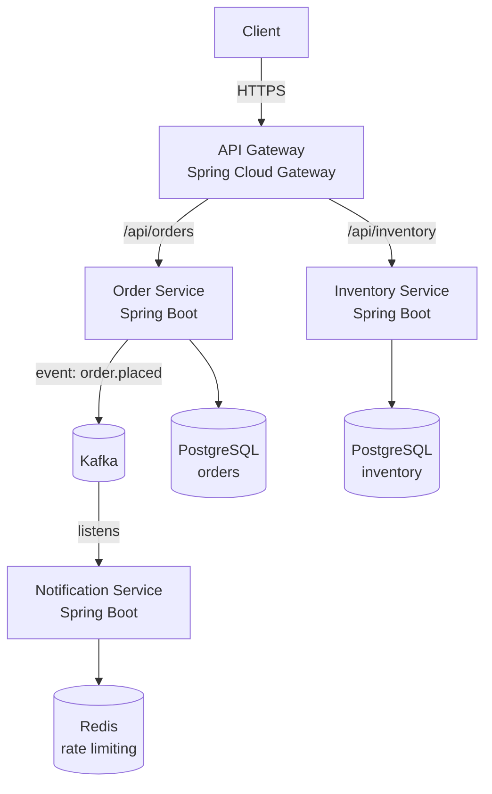

## Keywords in This File
{: .no_toc }

| # | Keyword | Weight |
|---|---|---|
| 1 | [Spring in Microservices Architecture](#spring-in-microservices-architecture) | architect |
| 2 | [Spring Cloud Service Discovery and Config](#spring-cloud-service-discovery-and-config) | high |
| 3 | [Spring Application Migration Strategy](#spring-application-migration-strategy) | architect |
| 4 | [Spring Security OAuth2 at Scale](#spring-security-oauth2-at-scale) | architect |

---

# Spring in Microservices Architecture

**Interview Weight:** architect - Staff+ engineers are
expected to have strong opinions on service boundaries,
communication patterns, and Spring's role in a microservices
ecosystem. Questions target: service decomposition, inter-
service communication, distributed data consistency, and
observability. This is a leadership/design conversation
topic.

---

### 🎯 Model Answer

**30 seconds:**

> Spring Boot is the de-facto standard for microservices
> on the JVM. Each service is a standalone Spring Boot
> application with its own `ApplicationContext`, persistence,
> and deployment. Services communicate via HTTP REST
> (synchronous) or messaging (asynchronous, Kafka/RabbitMQ).
> Spring Cloud provides infrastructure integrations:
> service discovery (Eureka), configuration (Config Server),
> circuit breaking (Resilience4j), and API gateway (Spring
> Cloud Gateway).

**3 minutes (Senior):**

> The key architectural decisions in a Spring microservices
> system:
>
> **Service boundaries**: define by domain capability,
> not technical layer. An "order service" owns order
> state and order lifecycle. It should have its own
> database schema. No shared databases across services
> (causes deployment coupling and schema coordination
> problems).
>
> **Communication patterns**:
> - Synchronous (HTTP REST with `WebClient`): use for
>   queries where the caller needs an immediate response.
>   Fast, simple. Fails if the downstream service is down
>   (tight coupling).
> - Asynchronous (Kafka/RabbitMQ events): use for commands
>   where eventual consistency is acceptable. Loose
>   coupling. Harder to debug, requires idempotent consumers.
>
> **Distributed data consistency**: no distributed
> transactions in microservices (XA is fragile and slow).
> Use the Saga pattern: sequence of local transactions,
> each publishing an event. On failure: compensating
> transactions roll back previous steps. Choreography
> (events, each service listens) or Orchestration (a
> central Saga orchestrator calls each service).
>
> **Observability**: Micrometer Tracing with OpenTelemetry.
> Trace ID propagates across services via HTTP headers
> (`traceparent` W3C header). All logs include trace ID.
> One dashboard in Grafana/Jaeger shows the full request
> path across all services.

**Framework:** SERVICE BOUNDARIES (domain ownership) →
COMMUNICATION (sync vs async) →
DATA CONSISTENCY (Saga, Outbox) →
OBSERVABILITY (trace propagation) →
RESILIENCE (circuit breaker, timeout, retry)

*Adapting up:* Discuss Domain-Driven Design (bounded contexts,
aggregates) as the foundation for service boundaries,
event sourcing + CQRS for audit trails and read optimization,
and gRPC as an alternative to REST for high-throughput
internal communication.

*Adapting down:* Microservices = many small Spring Boot
applications that talk to each other. Each has its own
database. They communicate via HTTP or Kafka messages.
Spring Cloud adds discovery (where is the other service?)
and configuration (shared config server).

---

### 📘 Concept Explanation

**The microservices topology:**

```
  SPRING MICROSERVICES TOPOLOGY

  Clients
    |  HTTPS
    v
  API Gateway (Spring Cloud Gateway)
  [Rate limiting, Auth, Routing]
    |
    +---> Order Service (Spring Boot)
    |       [POST /orders, GET /orders/:id]
    |       [PostgreSQL: orders schema]
    |
    +---> Inventory Service (Spring Boot)
    |       [GET /inventory/:sku, PUT /inventory/:sku]
    |       [PostgreSQL: inventory schema]
    |
    +---> Notification Service (Spring Boot)
            [listens to Kafka: order.placed events]
            [sends emails/SMS]

  Kafka: order.placed, order.cancelled, payment.processed
  Config Server: shared config for all services
  Zipkin/Jaeger: distributed traces
  Prometheus/Grafana: metrics
```



> **Diagram walkthrough:** Each service owns its data store.
> The API Gateway routes external traffic and enforces
> cross-cutting concerns (rate limiting, JWT validation).
> Services communicate via Kafka for decoupled async flows
> (order placed -> notification) and via direct HTTP for
> synchronous queries (order service checking inventory
> before confirming). The separate databases (polyglot
> persistence) means services can be deployed independently.
> No shared schema = no coordination on schema migrations.

**The Saga pattern for distributed consistency:**

```
  ORDER PLACEMENT SAGA (Choreography):

  OrderService:
  1. Create order (PENDING)  --event--> order.placement.initiated
                                            |
  InventoryService:                         v
  2. Reserve inventory       --event--> inventory.reserved
  (OR: reservation.failed)                  |
                                            v
  PaymentService:
  3. Charge payment          --event--> payment.processed
  (OR: payment.failed)                      |
                                            v
  OrderService:
  4. Confirm order (CONFIRMED) <-- all events received

  COMPENSATION (on failure):
  payment.failed --> OrderService cancels order
               --> InventoryService releases reservation
```

---

### 💻 Code Example

**Production Example: Service communication patterns**

```java
// Synchronous: WebClient for inventory check
@Service
public class OrderService {

    private final WebClient inventoryClient;
    private final ApplicationEventPublisher events;

    // Check inventory before creating order (sync)
    @Transactional
    public Order placeOrder(OrderRequest req) {
        // Synchronous inventory check: need immediate answer
        InventoryResponse inventory = inventoryClient.get()
            .uri("/inventory/{sku}", req.getSku())
            .retrieve()
            .bodyToMono(InventoryResponse.class)
            // Circuit breaker: if inventory service is down,
            // fail fast instead of waiting
            .timeout(Duration.ofSeconds(2))
            .onErrorReturn(new InventoryResponse(
                req.getSku(), 0, false))
            .block();  // WebFlux sync bridge

        if (!inventory.isAvailable()) {
            throw new InsufficientStockException(
                req.getSku());
        }

        Order order = orderRepo.save(new Order(req));
        // Save event to outbox (same transaction)
        outboxRepo.save(new OutboxEvent(
            "ORDER_PLACED", order.getId().toString()));
        return order;
    }
}

// Async: Kafka producer (via outbox poller)
@Service
@Slf4j
public class OutboxEventPoller {

    private final KafkaTemplate<String, String> kafka;
    private final OutboxRepository outboxRepo;

    @Scheduled(fixedDelay = 1000)
    @Transactional
    public void processOutbox() {
        List<OutboxEvent> pending =
            outboxRepo.findTop100ByStatus(PENDING);
        for (OutboxEvent event : pending) {
            try {
                kafka.send("order.placed",
                    event.getAggregateId(),
                    event.getPayload());
                event.setStatus(SENT);
            } catch (Exception e) {
                log.error("Failed to publish event: {}",
                    event.getId(), e);
                event.incrementRetries();
            }
        }
    }
}

// Async: Kafka consumer (notification service)
@Component
@Slf4j
public class OrderPlacedConsumer {

    private final NotificationService notificationService;
    private final ProcessedEventRepository processed;

    @KafkaListener(topics = "order.placed",
        groupId = "notification-service")
    @Transactional
    public void onOrderPlaced(
        @Payload String payload,
        @Header(KafkaHeaders.RECEIVED_KEY) String orderId) {

        // Idempotency: check if already processed
        if (processed.existsByEventId(orderId)) {
            log.debug("Duplicate event: {}, skipping",
                orderId);
            return;
        }

        OrderPlacedEvent event = deserialize(payload);
        notificationService.sendConfirmation(event);

        // Record as processed (prevents duplicate notifications)
        processed.save(new ProcessedEvent(orderId));
    }
}
```

> **Code walkthrough:** The Order Service uses synchronous
> `WebClient` for inventory check (needs immediate answer
> before creating the order) with a 2-second timeout and
> circuit-breaker-like fallback. The order creation uses
> the Transactional Outbox pattern: the event is saved
> to the `outbox` table IN THE SAME TRANSACTION as the order.
> The poller publishes to Kafka outside the transaction.
> This guarantees: if the service crashes after order commit
> but before Kafka publish, the outbox poller will retry.
> The Notification Service consumer checks for idempotency:
> Kafka delivers at-least-once, so the same event may arrive
> twice. The `ProcessedEvent` table prevents duplicate
> notifications.

---

### 🎓 Answers by Seniority

**Senior / Staff (5+ years):**

> Microservices with Spring require discipline in three
> areas: service boundary definition, communication pattern
> selection, and observability. Service boundaries: follow
> domain ownership. "Who owns the data?" defines the service.
> Shared databases across services create deployment
> coupling - one service's schema migration blocks another's
> deployment.
>
> Communication: synchronous REST for queries (need immediate
> answer). Asynchronous events for state changes (order
> placed, payment processed). The Transactional Outbox
> pattern ensures events are reliably published even if
> the service crashes mid-operation.
>
> Distributed consistency without distributed transactions:
> Saga pattern. Each service does its local work and
> publishes an event. On failure: compensating transactions
> undo previous steps. This requires careful design: each
> step must be idempotent (re-runnable safely).
>
> Observability is non-negotiable: Micrometer Tracing
> with trace ID propagation across services. Without it,
> you cannot diagnose issues that span multiple services.

*Push deeper:* Discuss Domain-Driven Design bounded contexts
and aggregate roots as the basis for service boundary decisions.

---

### ⚖️ Comparison Table

| Communication | Coupling | Latency | Failure Mode | Use Case |
|---|---|---|---|---|
| REST/HTTP (WebClient) | Tight (caller waits) | Low (direct) | Cascading failure if downstream down | Queries, need immediate response |
| Kafka (async events) | Loose (fire and forget) | Higher (async) | Events backlog if consumer slow | State changes, cross-service workflows |
| gRPC | Tight (binary, fast) | Very low | Cascading failure | High-throughput internal service calls |

---

### ⚠️ Common Misconceptions

| # | Misconception | Reality | Danger |
|---|---|---|---|
| 1 | Microservices are inherently more reliable than monoliths | A monolith has one deployment, one process, one failure domain. Microservices have N services, N failure points, N network hops. Without circuit breakers and timeouts, microservices cascade failures more readily than monoliths. | Adopting microservices without resilience patterns: one slow service causes the entire system to hang |
| 2 | Each microservice can share a database for simplicity | Shared databases create deployment coupling (both services must coordinate schema migrations) and runtime coupling (both services scale together). This is the "distributed monolith" anti-pattern. | Teams cannot deploy services independently; schema migrations require synchronized releases |
| 3 | REST is always the right inter-service communication | REST is synchronous and tight-coupling. A service calling 5 downstream services in sequence has additive latency and cascading failure risk. Async events decouple services and enable better fault tolerance. | System-wide slowdown when one downstream service is slow, even if the operation doesn't need the result immediately |
| 4 | The Saga pattern is only needed for financial transactions | Saga (or any distributed consistency pattern) is needed for ANY multi-step operation across services where partial failure is possible. Order placement + inventory reservation + notification is a Saga even for a free service. | Partial failures leave the system in inconsistent state (order confirmed, inventory not reserved) |

---

### 🚨 Failure Modes and Diagnosis

**Failure 1 - Cascading failure from slow downstream service**

Symptom: All requests to the Order Service time out.
The Order Service itself is healthy but depends on the
Inventory Service which is responding slowly.

Root cause: Order Service makes synchronous HTTP calls
to Inventory Service with no timeout. When Inventory
is slow (10s response), all Order Service threads block.
Thread pool exhausted. All requests queue and eventually
time out.

Diagnosis: check downstream service latency metrics.
Check thread pool (`tomcat.threads.busy`).

Fix:
1. Add timeout to all outbound HTTP calls:
   `webClient.timeout(Duration.ofSeconds(2))`
2. Add circuit breaker (Resilience4j):
   ```java
   @CircuitBreaker(name = "inventory",
       fallbackMethod = "fallback")
   public InventoryResponse checkInventory(String sku) {
       return inventoryClient.get(sku);
   }
   // fallback: return cached or default response
   ```
3. Bulkhead: separate thread pool for each downstream service.

---

### 🎯 Interview Deep-Dive

**[STAFF] Q1: How would you design service boundaries
for an e-commerce platform?** [ARCHITECTURE]

*Why they ask:* Tests Domain-Driven Design and decomposition thinking.

*Likely follow-up:* "When would you merge two services?"

Domain-Driven Design approach: identify bounded contexts.
Each bounded context = potential service.

E-commerce bounded contexts:
- **Order Management**: order lifecycle (created → confirmed
  → shipped → delivered). Owns: Order, OrderItem, OrderStatus.
- **Inventory**: product availability and reservation.
  Owns: Inventory, Reservation.
- **Catalog**: product information, pricing, categories.
  Owns: Product, Category, Price.
- **Customer**: user accounts, addresses, preferences.
  Owns: Customer, Address.
- **Payment**: payment processing, refunds. Owns: Payment,
  Refund. (Often a thin adapter over Stripe/PayPal.)
- **Notification**: emails, SMS, push. Stateless, event-driven.

Key questions for each boundary:
1. Who owns the state transitions? (belongs in that service)
2. Who is the authoritative source of truth? (owns the DB)
3. Would separate teams deploy this? (deployment boundary)

Merge signal: if two services ALWAYS change together
(every PR touches both), they should be one service.

*What separates good from great:* Applying DDD vocabulary
(bounded context, aggregate root) and the "deploy
independently" test for service boundaries.

---

**[STAFF] Q2: How do you maintain data consistency across
services without distributed transactions?** [TRADE-OFF]

*Why they ask:* Fundamental microservices challenge.

*Likely follow-up:* "What are the limitations of the Saga pattern?"

Three approaches:

**1. Eventual Consistency via Events (Choreography Saga)**:
Each service publishes events when state changes. Other
services listen and react. No central coordinator.
Pros: loose coupling. Cons: hard to monitor, complex
failure scenarios.

**2. Saga Orchestration**: a central `SagaOrchestrator`
bean calls each service in sequence. Tracks state.
On failure, calls compensating methods.
```java
@Saga
public class PlaceOrderSaga {
    @SagaEventHandler
    public void handle(OrderCreatedEvent event) {
        commandGateway.send(new ReserveInventoryCommand(
            event.getOrderId(), event.getSku()));
    }
    @SagaEventHandler
    public void handle(InventoryReservationFailed event) {
        commandGateway.send(new CancelOrderCommand(
            event.getOrderId()));
    }
}
```
Pros: explicit workflow, easy to monitor. Cons: central
point of coordination.

**3. Outbox + CQRS for read consistency**: writes use
Outbox pattern (guaranteed event publishing). Reads use
CQRS projections (views built from events). Stale reads
for a few seconds are acceptable.

Limitations: Saga requires all operations to be idempotent
(retry-safe). Compensating transactions cannot always
fully undo state (you cannot unsend an email). Complex
failure scenarios require careful design.

*What separates good from great:* Acknowledging the
fundamental limitation: Saga provides "eventually consistent"
not "ACID consistent". Some operations (sent emails, fired
missiles) cannot be compensated. Design must account for
this.

| Interviewer Type | Emphasis |
|---|---|
| Technical Panel | Lead with service boundary design and communication patterns. |
| Hiring Manager | Lead with distributed consistency challenges and Saga pattern. |
| Bar Raiser | Lead with DDD bounded contexts, CQRS, and the fundamental limitations of distributed consistency. |
| Peer Engineer | "The 'shared database for simplicity' that became the distributed monolith - every team eventually learns this lesson..." |

---

---

# Spring Cloud Service Discovery and Config

**Interview Weight:** high for senior/architect roles -
Service discovery and centralized configuration are the
two foundational Spring Cloud concerns. Questions test:
how Eureka works, Config Server patterns, dynamic refresh,
and alternatives (Kubernetes-native service discovery).

---

### 🎯 Model Answer

**30 seconds:**

> Spring Cloud provides two foundational infrastructure
> services for microservices: (1) Service Discovery
> (Eureka): services register themselves by name; clients
> look up service instances by name instead of hardcoded
> URLs. (2) Config Server: centralized configuration
> from Git. All services pull their `application.yml`
> properties from the Config Server at startup.
> `@RefreshScope` enables dynamic property refresh without
> restart. Both can be replaced by Kubernetes-native
> equivalents (Service DNS, ConfigMap/Secret) when running
> on Kubernetes.

**3 minutes (Senior):**

> **Eureka Service Discovery**:
> - Eureka Server: registry of service instances
> - Each service registers: `{service-name, host, port,
>   health endpoint}` and sends heartbeats every 30s
> - Client-side load balancing: `WebClient` + `@LoadBalanced`
>   resolves `http://order-service/api/orders` to a
>   live instance IP. No client-side LB proxy needed.
> - Self-preservation mode: if 85% of heartbeats are lost,
>   Eureka assumes a network partition (not services dying)
>   and stops evicting registrations. Prevents cascading
>   deregistration during network issues.
>
> **Spring Cloud Config Server**:
> - Backed by Git, filesystem, Vault, or AWS S3
> - Services bootstrap by calling the Config Server before
>   creating the `ApplicationContext`
> - Hierarchy: `application.yml` (shared), `{service-name}
>   .yml` (service-specific), `{service-name}-{profile}.yml`
>   (profile-specific)
> - Dynamic refresh: `@RefreshScope` on beans. POST to
>   `/actuator/refresh` triggers re-injection of `@Value`
>   fields. Spring Cloud Bus broadcasts refresh events
>   to all instances via Kafka/RabbitMQ.
>
> **Kubernetes alternative**: when deploying to Kubernetes,
> native service discovery (CoreDNS: `order-service
> .namespace.svc.cluster.local`) and ConfigMaps/Secrets
> can replace Eureka + Config Server. Reduces infrastructure
> components.

**Framework:** EUREKA REGISTRY (register + discover) →
CLIENT LOAD BALANCING (WebClient + @LoadBalanced) →
CONFIG SERVER (centralized, Git-backed) →
@RefreshScope (dynamic refresh) →
K8S ALTERNATIVE (reduce infra complexity)

*Adapting up:* Discuss Consul as an alternative to Eureka
(service discovery + health checking + KV store), HashiCorp
Vault for secrets management (Spring Cloud Vault), and
service mesh (Istio/Linkerd) as an alternative to client-
side load balancing.

*Adapting down:* When you have 20 microservices, you can't
hardcode IP addresses. Eureka is a phonebook: services
register their address. Clients ask Eureka "where is the
order service?" and get a live IP. Config Server is a
central place to store all configuration. Change one
property in Git, push to Config Server, all services
get the update.

---

### 📘 Concept Explanation

**Service Discovery workflow:**

```
  EUREKA SERVICE DISCOVERY

  At startup:
  Order Service --> Eureka Server:
    "I am 'order-service' at 10.0.1.5:8080"
    (registration + heartbeat every 30s)

  Inventory Service --> Eureka Server:
    "I am 'inventory-service' at 10.0.1.6:8081"

  At request time:
  Order Service:
  WebClient.get("http://inventory-service/inventory/SKU")
    --> Spring Load Balancer (Eureka client)
    --> "inventory-service instances?"
    --> Eureka: [10.0.1.6:8081, 10.0.1.7:8081]
    --> Round-robin: pick 10.0.1.6:8081
    --> Actual HTTP call: 10.0.1.6:8081/inventory/SKU
```

**Config Server hierarchy:**

```
  Config Server (Git repo)
  ├── application.yml          (all services)
  ├── order-service.yml        (order-service only)
  └── order-service-prod.yml   (order-service, prod profile)

  Property resolution order (highest wins):
  1. order-service-prod.yml
  2. order-service.yml
  3. application.yml
```

**Dynamic refresh with @RefreshScope:**

```
  Git repo: change database.pool.size = 20
                  |
                  v push
  Config Server: updates in-memory config
                  |
                  v POST /actuator/refresh
                  |  (or Spring Cloud Bus broadcast)
  Service instance: @RefreshScope beans re-created
                  |
                  v
  @Value("${database.pool.size}") injected: 20
```

---

### 💻 Code Example

**Production Example: Config Server and @RefreshScope**

```java
// Order Service: uses @RefreshScope for dynamic refresh
@Service
@RefreshScope  // Bean re-created on /actuator/refresh
@Slf4j
public class OrderLimitService {

    @Value("${order.max-daily-limit:1000}")
    private int maxDailyLimit;

    @Value("${order.fraud-threshold:5000}")
    private BigDecimal fraudThreshold;

    public void validateOrder(Order order) {
        if (order.getTotal().compareTo(fraudThreshold)
            > 0) {
            throw new FraudSuspectedException(
                order.getId());
        }
    }
}

// Refreshing all instances via Spring Cloud Bus
// (Kafka-based broadcast - one call updates all instances)
// application.yml:
// spring:
//   cloud:
//     bus:
//       enabled: true

// Trigger refresh on one instance:
// POST http://order-service-1/actuator/busrefresh
// -> Kafka message published
// -> ALL order-service instances receive and refresh
```

```java
// Service discovery: WebClient with load balancing
@Configuration
public class WebClientConfig {

    @Bean
    @LoadBalanced  // Resolves service names via Eureka
    public WebClient.Builder webClientBuilder() {
        return WebClient.builder();
    }
}

@Service
public class InventoryClient {

    private final WebClient.Builder webClientBuilder;

    // 'inventory-service' resolved by Eureka
    // No hardcoded IP - uses service registry
    public Mono<InventoryResponse> checkStock(
        String sku) {
        return webClientBuilder.build()
            .get()
            .uri("http://inventory-service/inventory/{sku}",
                sku)
            .retrieve()
            .bodyToMono(InventoryResponse.class)
            .timeout(Duration.ofSeconds(2));
    }
}
```

> **Code walkthrough:** `@RefreshScope` marks a bean for
> re-creation when a refresh event occurs. When `POST
> /actuator/busrefresh` is called on any instance, Spring
> Cloud Bus publishes a message to Kafka. All instances
> listening on the Kafka bus topic receive the refresh
> event. Each instance destroys and recreates all
> `@RefreshScope` beans, re-injecting `@Value` properties
> from the updated Config Server. `@LoadBalanced` on the
> `WebClient.Builder` installs a load-balancer exchange
> function. The `http://inventory-service/...` URL is
> intercepted, the service name `inventory-service` is
> resolved via Eureka to a live instance IP, and the
> real request is made. Client-side load balancing means
> no separate load-balancer proxy between services.

---

### 🎓 Answers by Seniority

**Senior / Staff (5+ years):**

> Service discovery and centralized configuration are two
> foundational concerns for microservices. Eureka solves
> the "where is service X?" problem - essential when
> services have dynamic IPs (containers, autoscaling).
> Config Server solves the "how do I manage 20 services'
> configuration?" problem - centralized, Git-backed,
> auditable.
>
> However: on Kubernetes, these are largely solved by the
> platform. Kubernetes Service DNS provides service
> discovery natively. Kubernetes ConfigMaps and Secrets
> provide configuration. Using Eureka + Config Server on
> K8s adds infrastructure overhead. My recommendation:
> use Spring Cloud infra when not on K8s. On K8s: prefer
> native K8s primitives for service discovery and config;
> use Spring Cloud only for advanced features like
> distributed refresh or non-K8s services.
>
> `@RefreshScope` gotcha: beans annotated with `@RefreshScope`
> are proxied. Constructor injection is preferred (cleaner).
> If a `@RefreshScope` bean depends on a non-refreshable
> bean, that dependency is NOT refreshed.

*Push deeper:* Discuss Consul as a Eureka alternative
(also provides health checking and KV store) and Spring
Cloud Vault for secrets management.

---

### ⚖️ Comparison Table

| Concern | Spring Cloud (Non-K8s) | Kubernetes-native | Trade-off |
|---|---|---|---|
| Service Discovery | Eureka / Consul | CoreDNS + Services | Spring Cloud: more features; K8s native: simpler stack |
| Configuration | Config Server (Git-backed) | ConfigMap + Secrets | Config Server: Git audit trail, dynamic refresh; K8s: simpler |
| Load Balancing | Spring Cloud Load Balancer (client-side) | kube-proxy or service mesh | Client-side: flexible; Service mesh: transparent |
| Secrets | Spring Cloud Vault | K8s Secrets + Vault CSI | K8s Secrets: simpler; Vault: more control |

---

### ⚠️ Common Misconceptions

| # | Misconception | Reality | Danger |
|---|---|---|---|
| 1 | Config Server is the only safe place for secrets | Config Server backed by Git stores secrets in plaintext in the Git repo (without encryption). Use Spring Cloud Vault, AWS Secrets Manager, or K8s Secrets for actual secrets. Config Server is for non-sensitive configuration. | Secrets in Config Server Git repo exposed to everyone with repo access |
| 2 | @RefreshScope refreshes all properties in the bean | Only `@Value`-injected fields and `@ConfigurationProperties` beans in `@RefreshScope` are updated. Fields set in the constructor (from configuration passed in) are not updated. The bean is re-created, so constructor injection will use the new values. | Fields populated in the constructor using values that are later changed may not refresh correctly |
| 3 | Eureka self-preservation mode prevents all evictions | Self-preservation only kicks in when > 15% of heartbeats are lost (network partition assumption). Individual service instances that fail will still be evicted after the lease expiry (90 seconds by default). | Expecting immediate eviction after a service crash: takes up to 90s plus renew interval |
| 4 | You must use Spring Cloud Config Server for all configuration | Static configuration (values that never change) can be in `application.yml` bundled with the JAR. Config Server is valuable for environment-specific config and config that needs dynamic refresh. Overusing it adds complexity. | Over-centralizing all configuration including build-time constants in Config Server adds unnecessary service dependencies |

---

### 🚨 Failure Modes and Diagnosis

**Failure 1 - Service unavailable after Config Server restart**

Symptom: All microservices become unhealthy after the
Config Server is restarted. Services cannot start.

Root cause: Services use `spring.config.import=configserver:`
(fail-fast mode by default). If Config Server is not
available at startup, the service fails to start. In
rolling restarts, all services may restart simultaneously
if Config Server is temporarily unavailable.

Fix:
```yaml
spring:
  cloud:
    config:
      fail-fast: false  # Warning instead of error on failure
      retry:
        max-attempts: 6
        initial-interval: 1000
        max-interval: 2000
```

Or: cache the last successful config locally (Config
Server client caches by default). Services use cached
config if Config Server is unreachable.

---

**Failure 2 - Eureka deregisters healthy instances**

Symptom: Healthy service instances are deregistered from
Eureka. Requests fail with `No instances available`.

Root cause: Eureka renew threshold: if the instance's
heartbeat interval is too long (GC pauses, overloaded
service), Eureka considers it gone and evicts it.

Fix: tune Eureka eviction threshold to be lenient for
high-GC services:
```yaml
eureka:
  instance:
    lease-renewal-interval-in-seconds: 10  # heartbeat frequency
    lease-expiration-duration-in-seconds: 30  # eviction wait
```

---

### 🎯 Interview Deep-Dive

**[SENIOR] Q1: When would you use Spring Cloud Eureka vs
Kubernetes-native service discovery?** [TRADE-OFF]

*Why they ask:* Architecture decision between Spring Cloud and K8s.

*Likely follow-up:* "What are the advantages of a service mesh?"

Use Eureka when:
- Not running on Kubernetes (bare metal, VM, Docker Swarm)
- Need cross-cloud service discovery (services in multiple
  environments need to discover each other)
- Client-side load balancing features (zone-aware routing,
  weighted load balancing) are needed

Use Kubernetes-native (CoreDNS) when:
- Running on Kubernetes (K8s is the environment)
- Simpler stack preferred (fewer components to operate)
- `order-service.default.svc.cluster.local` DNS resolution
  is sufficient

Service mesh (Istio, Linkerd) as a third option:
- Adds mutual TLS, circuit breaking, observability sidecar
- Transparent to application code (no Spring Cloud client)
- Higher operational complexity (Istio is notoriously complex)

Pragmatic recommendation: on Kubernetes, use K8s DNS for
discovery. Add Istio only if mTLS or advanced traffic
management (canary, A/B) is needed. Avoid adding Spring
Cloud Eureka when K8s already solves the problem.

*What separates good from great:* Not advocating for Spring
Cloud on K8s just because it's familiar - knowing when
to use platform-native capabilities vs framework abstractions.

| Interviewer Type | Emphasis |
|---|---|
| Technical Panel | Lead with Eureka mechanics and Config Server hierarchy. |
| Hiring Manager | Lead with centralized config management and operational benefits. |
| Bar Raiser | Lead with K8s native vs Spring Cloud trade-offs and service mesh positioning. |
| Peer Engineer | "The 'Config Server down = all services down' incident during a rolling restart is a rite of passage for Spring Cloud teams..." |

---

---

# Spring Application Migration Strategy

**Interview Weight:** architect - Staff engineers are
regularly asked to lead migrations. Questions target:
monolith-to-microservices strategy, version upgrades
(Spring Boot 2 -> 3, Java 8 -> 21), strangler fig pattern,
and how to migrate without big-bang rewrites.

---

### 🎯 Model Answer

**30 seconds:**

> Spring application migration follows the Strangler Fig
> pattern: gradually extract functionality from the
> monolith into new services, routing traffic incrementally.
> For Spring Boot version upgrades: use the Spring Boot
> Migration Guide and Spring Boot Migrator tool. For Java
> upgrades: address deprecated APIs, test with newer JVM,
> use `--enable-preview` for new features. Never big-bang
> rewrite - do small, testable migrations.

**3 minutes (Senior):**

> Monolith-to-microservices migration strategy:
>
> **Strangler Fig**: route specific URL prefixes or
> features to new microservices via the API Gateway.
> The monolith handles everything else. Over time, more
> and more traffic is routed to microservices. The monolith
> "strangled" as its scope shrinks. Never taken offline.
>
> Practical steps:
> 1. Add comprehensive integration tests to the monolith
>    (you need a regression safety net)
> 2. Identify the FIRST service to extract: look for
>    services that change frequently, have clear boundaries,
>    and are not deeply coupled to core monolith state
> 3. Extract the module: new Spring Boot app, same
>    database initially (shared DB, transitional)
> 4. API Gateway routes the module's URLs to the new service
> 5. Migrate the data: split the database schema, add
>    an anti-corruption layer for cross-service data needs
> 6. Decommission the monolith module
>
> Spring Boot 2 -> 3 migration:
> - Java 17 minimum (Spring Boot 3 requires Java 17)
> - `javax.*` -> `jakarta.*` namespace (the biggest pain)
> - Security config: `WebSecurityConfigurerAdapter` removed
>   -> `SecurityFilterChain` bean
> - Actuator: some endpoint paths changed
> - Spring Boot Migrator (open-source CLI) automates
>   most namespace changes
>
> The anti-pattern to avoid: big-bang rewrite. "We'll
> rewrite the entire monolith in microservices over 18 months"
> almost always fails. The team is chasing a moving target
> (monolith keeps changing), the risk is enormous (nothing
> in production for 18 months), and the new architecture
> is designed without production learnings.

**Framework:** STRANGLER FIG (gradual extraction) →
ANTI-CORRUPTION LAYER (cross-service data isolation) →
DATA MIGRATION (schema separation) →
VERSION UPGRADE (Boot 2→3, Java 8→21) →
NEVER BIG-BANG (incremental delivery)

*Adapting up:* Discuss Branch by Abstraction technique for
in-place refactoring of tightly-coupled components,
database migration patterns (strangler Fig for DB: dual
write, migrate reads, cut over), and feature flags for
gradual rollout of migrated services.

*Adapting down:* Migration = changing the application
without breaking what's working. The Strangler Fig
pattern: keep the old application running. Route a small
slice of traffic to the new version. When it works,
route more. Never take the old one offline until the
new one handles everything.

---

### 📘 Concept Explanation

**The Strangler Fig pattern:**

```
  PHASE 1: Monolith handles everything
  Client --> API Gateway --> Monolith
                              (orders, inventory, catalog)

  PHASE 2: Extract catalog service
  Client --> API Gateway --+-> Catalog Service (new)
                           |    (GET /catalog/**)
                           +-> Monolith
                                (orders, inventory)

  PHASE 3: Extract inventory service
  Client --> API Gateway --+-> Catalog Service
                           +-> Inventory Service (new)
                           |    (GET/PUT /inventory/**)
                           +-> Monolith
                                (orders)

  PHASE N: Monolith is gone
  Client --> API Gateway --+-> Order Service
                           +-> Inventory Service
                           +-> Catalog Service
```

**Spring Boot 2 -> 3 migration checklist:**

| Change | Impact | Tool |
|---|---|---|
| Java 17 required | JVM upgrade + removed APIs | `jdeps` for deprecated API analysis |
| `javax.*` → `jakarta.*` | Mass import changes | Spring Boot Migrator |
| Security config API | `WebSecurityConfigurerAdapter` removed | Spring Boot Migrator |
| Actuator paths | Some paths renamed | Update monitoring config |
| Hibernate 6 | Query syntax changes, stricter schema | Test all JPA queries |
| `spring.datasource.url` format | Some drivers changed | Check each driver |

---

### 💻 Code Example

**Wrong vs Right: Big-bang vs incremental migration**

```java
// BAD: big-bang migration approach
// 18-month plan: "Rewrite everything in microservices"
// - Team writes new OrderService, InventoryService,
//   CatalogService from scratch
// - Monolith keeps changing with new features
// - After 18 months: new services don't cover all
//   monolith edge cases
// - Deployment: big-bang cutover, everything fails
// - Result: roll back to monolith, wasted 18 months

// GOOD: Strangler Fig extraction
// Step 1: extract Catalog (least coupled, read-heavy)

// New CatalogService: Spring Boot app
@SpringBootApplication
public class CatalogServiceApplication { ... }

@RestController
@RequestMapping("/api/catalog")
public class CatalogController {
    // Same URLs as the monolith catalog endpoints
    @GetMapping("/products/{id}")
    public ProductDto getProduct(@PathVariable Long id) {
        return catalogService.getProduct(id);
    }
}
```

```yaml
# API Gateway (Spring Cloud Gateway): route catalog to new service
spring:
  cloud:
    gateway:
      routes:
        # New catalog service (extracted)
        - id: catalog-service
          uri: lb://catalog-service
          predicates:
            - Path=/api/catalog/**
          # Route to new service FIRST

        # Monolith handles everything else
        - id: monolith
          uri: http://monolith:8080
          predicates:
            - Path=/**
```

> **Code walkthrough:** The Strangler Fig works at the
> routing layer. The API Gateway routes `/api/catalog/**`
> to the new Catalog Service. All other requests still
> go to the monolith. This is a safe, incremental migration:
> the monolith is untouched and still handles all non-
> catalog traffic. If the Catalog Service has issues,
> simply change the routing to send catalog traffic back
> to the monolith. Zero downtime. The team can deploy
> and test the Catalog Service in production with a small
> slice of traffic before routing everything.

**Wrong vs Right: Spring Boot 2 -> 3 migration**

```java
// BEFORE (Spring Boot 2, Java EE):
import javax.persistence.Entity;
import javax.persistence.Id;
import javax.validation.constraints.NotNull;
import javax.servlet.http.HttpServletRequest;

// Security config (deprecated WebSecurityConfigurerAdapter):
@Configuration
public class SecurityConfig
    extends WebSecurityConfigurerAdapter {
    @Override
    protected void configure(HttpSecurity http)
        throws Exception {
        http.authorizeRequests()
            .antMatchers("/public/**").permitAll()
            .anyRequest().authenticated();
    }
}
```

```java
// AFTER (Spring Boot 3, Jakarta EE 10):
import jakarta.persistence.Entity;
import jakarta.persistence.Id;
import jakarta.validation.constraints.NotNull;
import jakarta.servlet.http.HttpServletRequest;

// Security config (SecurityFilterChain bean):
@Configuration
@EnableWebSecurity
public class SecurityConfig {
    @Bean
    public SecurityFilterChain filterChain(
        HttpSecurity http) throws Exception {
        http.authorizeHttpRequests(auth -> auth
            .requestMatchers("/public/**").permitAll()
            .anyRequest().authenticated());
        return http.build();
    }
}
```

> **Code walkthrough:** The biggest Spring Boot 2 -> 3
> change is the `javax.*` to `jakarta.*` namespace change.
> Every import must be updated. Spring Boot Migrator CLI
> automates this: it scans the project, updates imports,
> and applies security config migration recipes. The
> security API change is the second-largest: `WebSecurityConfigurerAdapter`
> was deprecated in Boot 2.7 and removed in Boot 3.
> The new `SecurityFilterChain` bean approach is more
> composable (multiple chains for different URL patterns).

---

### 🎓 Answers by Seniority

**Senior / Staff (5+ years):**

> Migration strategy is about reducing risk. Big-bang
> rewrites have a near-100% failure rate for large systems.
> The Strangler Fig guarantees: at any point, you can stop
> the migration and the system is still working (running
> on the monolith). Each extracted service is a ship-
> whenever-ready deliverable.
>
> For Spring Boot 2->3 migrations, I schedule:
> - Week 1: upgrade to latest Boot 2.x (all deprecation
>   warnings visible)
> - Week 2: upgrade Java to 17 (fix any API removals)
> - Week 3: run Spring Boot Migrator to handle `javax`
>   -> `jakarta` and security config
> - Week 4: fix remaining failures (Hibernate 6 query
>   changes, custom serializers)
> - Week 5: performance testing on new JVM version
>
> The Database migration is the hardest part of monolith
> extraction: shared database must be split before service
> can be fully independent. Pattern: dual-write to old
> and new schema, migrate reads, cut over writes, remove
> old schema. Takes months per entity.

*Push deeper:* Discuss Branch by Abstraction for in-place
refactoring without long-lived feature branches.

---

### ⚖️ Comparison Table

| Approach | Risk | Speed | When to Use |
|---|---|---|---|
| Big-bang rewrite | Very high | Slow (months/years) | Almost never |
| Strangler Fig | Low | Steady (one service at a time) | Default for microservices migration |
| Branch by Abstraction | Medium | Fast (single module) | In-place refactoring of tightly coupled code |
| Feature flags | Low | Fast | Gradual traffic shift to new code |

---

### ⚠️ Common Misconceptions

| # | Misconception | Reality | Danger |
|---|---|---|---|
| 1 | Extracting a service first requires extracting its database | Initial extraction can use the same database (shared DB transitionally). Database split is a separate, later step. Trying to do both simultaneously increases risk significantly. | Over-scoping initial migration causes delays and risk; shared DB is acceptable short-term |
| 2 | Spring Boot Migrator handles all changes for Boot 2->3 | Migrator handles imports, security config, and many deprecations. But Hibernate 6 query changes, custom serializer updates, and library compatibility (3rd party libraries with javax imports) require manual work. | Teams expect Migrator to be fully automated; residual issues cause extended migration timelines |
| 3 | Microservices are always the destination for migration | Not all monoliths should become microservices. A modular monolith (well-structured internal modules, clear domain boundaries) may be the right architecture for a team that cannot support the operational overhead of 20+ services. | Migrating to microservices increases operational complexity; teams must be ready |
| 4 | The Strangler Fig works only for HTTP services | Strangler Fig applies at any integration point: HTTP routing (API Gateway), message queue routing (topic routing), or even within a monolith (Branch by Abstraction). | Limiting Strangler Fig thinking to HTTP prevents its application to DB layer and batch process migrations |

---

### 🚨 Failure Modes and Diagnosis

**Failure 1 - javax imports after Spring Boot 3 upgrade**

Symptom: `ClassNotFoundException: javax.persistence.Entity`
after upgrading to Spring Boot 3.

Root cause: Spring Boot 3 requires Jakarta EE 10 (`jakarta.*`
namespace). Third-party libraries still using `javax.*`
cause conflicts.

Fix:
1. Run Spring Boot Migrator on first-party code
2. Check all dependencies for Boot 3 compatibility:
   `mvn dependency:tree | grep javax`
3. Update incompatible libraries (Hibernate 5->6,
   Spring Security, etc.)
4. For libraries without Jakarta-compatible versions:
   find alternatives or exclude and reimplement

---

### 🎯 Interview Deep-Dive

**[STAFF] Q1: Walk through how you would lead a migration
from a Spring Boot monolith to microservices over 2 years.**
[BEHAVIORAL + ARCHITECTURE]

*Why they ask:* Tests real-world migration leadership experience.

*Likely follow-up:* "What would you do if the business kept adding features to the monolith during the migration?"

Year 1: Foundation and first extractions

**Month 1-2: Assessment**
- Map the monolith: domain modules, coupling points, DB schema
- Identify service candidates: well-bounded, high-change
  modules (good first targets)
- Set up infrastructure: API Gateway, basic observability
- Write comprehensive integration tests (regression safety net)

**Month 3-6: First service extraction**
- Extract the highest-value, lowest-coupling service
  (e.g., Catalog: read-heavy, few dependencies)
- API Gateway routes `/catalog/**` to new service
- Run old and new in parallel. A/B test.
- Database split (gradual): dual-write, migrate reads,
  cut over writes

**Month 7-12: Next 2-3 services**
- Apply learnings from first extraction
- Build service template: Spring Boot starter with
  security, observability, tracing pre-configured
- Shared library for common patterns (error format,
  audit logging, JWT validation)

Year 2: Scale and completion

**Month 13-18: Accelerate**
- Teams own individual services
- Pipeline: each service has its own CI/CD
- Decommission monolith modules as services mature

**Month 19-24: Monolith retirement**
- Last modules extracted
- Monolith decommissioned
- Post-migration review: what worked, what didn't

Handling ongoing monolith changes: use feature flags.
New features that belong to a planned-extraction module:
implement in both monolith and new service, route with
flag. When service is ready, flip the flag.

*What separates good from great:* The "service template"
for month 7-12 - every team shouldn't reinvent security,
observability, and tracing. A shared starter reduces
per-service setup time from weeks to hours.

| Interviewer Type | Emphasis |
|---|---|
| Technical Panel | Lead with Strangler Fig pattern mechanics. |
| Hiring Manager | Lead with risk reduction and delivery cadence (never big-bang). |
| Bar Raiser | Lead with database migration strategy and feature flag-enabled parallel operation. |
| Peer Engineer | "The 'we'll rewrite in 18 months' project that delivered nothing - every senior developer has this story..." |

---

---

# Spring Security OAuth2 at Scale

**Interview Weight:** architect - OAuth2 and OIDC are
the standard for enterprise authentication. Staff/architect
candidates must understand: OAuth2 flows, resource server
configuration, JWT claims mapping, multi-tenancy, key
rotation, and token introspection vs local JWT validation.
This topic spans security, performance, and scalability.

---

### 🎯 Model Answer

**30 seconds:**

> OAuth2 defines authorization flows for third-party
> access delegation. The four flows are: authorization
> code (web apps, most secure), client credentials
> (service-to-service, no user), implicit (deprecated),
> and device code (CLI/IoT). Spring Security's
> `oauth2ResourceServer` configures a service as an OAuth2
> resource server, validating JWTs locally via `JwtDecoder`
> with the authorization server's JWK Set. This avoids
> a network round-trip per request (vs token introspection).

**3 minutes (Senior):**

> OAuth2 roles:
> - **Authorization Server**: issues tokens (Keycloak,
>   Auth0, AWS Cognito, Spring Authorization Server)
> - **Resource Server**: your API. Validates tokens and
>   enforces authorization.
> - **Client**: the application calling your API
> - **Resource Owner**: the user who grants access
>
> The two validation strategies:
>
> **Local JWT validation** (preferred for high-scale):
> The resource server fetches the authorization server's
> public keys (JWK Set URL). Tokens are validated locally
> using the public key. Fast (no network call per request).
> Key rotation: the JWK Set URL is polled periodically;
> when the authorization server rotates keys, the new
> keys are fetched automatically.
>
> **Token introspection** (for opaque tokens):
> The resource server calls the authorization server's
> `/introspect` endpoint with each token. Validates and
> gets token metadata. Slower (network call per request).
> Required when tokens are opaque (not JWTs) or when
> real-time revocation checking is needed (JWT is valid
> until expiry; introspection reflects immediate revocation).
>
> Multi-tenancy: multiple authorization servers (one per
> tenant). Spring Security supports multi-tenancy via
> `JwtIssuerReactiveAuthenticationManagerResolver`:
> dynamically selects the `JwtDecoder` based on the `iss`
> claim in the token.

**Framework:** OAUTH2 FLOWS (authorization code, client credentials) →
RESOURCE SERVER (local JWT validation) →
JWK ROTATION (automatic key refresh) →
TOKEN INTROSPECTION (real-time revocation) →
MULTI-TENANCY (multiple issuers)

*Adapting up:* Discuss PKCE (Proof Key for Code Exchange)
for public clients, pushed authorization requests (PAR),
Distributed Claims (combining claims from multiple
sources), and OAuth2 token exchange (RFC 8693) for service-
to-service impersonation.

*Adapting down:* OAuth2 is a security framework for "letting
a third-party app access your data". When you click
"Login with Google", that's OAuth2. Your API uses OAuth2
resource server to validate the JWT tokens that the
authorization server (Google, Keycloak) issues.

---

### 📘 Concept Explanation

**OAuth2 authorization code flow:**

```
  AUTHORIZATION CODE FLOW (web apps)

  User's Browser --> Client App:
    "Login"
         |
         v
  Client App --> Authorization Server:
    GET /authorize?client_id=app&redirect_uri=...
    &response_type=code&scope=openid+profile
         |
         v
  Authorization Server --> User's Browser:
    Login page + consent screen
         |
         v (user logs in and consents)
  Authorization Server --> Client App:
    Redirect: https://app/callback?code=AUTH_CODE
         |
         v
  Client App --> Authorization Server:
    POST /token {code, client_secret}
         |
         v
  Authorization Server --> Client App:
    {access_token: JWT, refresh_token: ...}
         |
         v
  Client App --> Resource Server (your API):
    GET /api/orders
    Authorization: Bearer JWT
         |
         v
  Resource Server: validate JWT, serve response
```

**Client credentials flow (service-to-service):**

```
  Service A --> Authorization Server:
    POST /token {client_id, client_secret, grant_type=client_credentials}
  Authorization Server --> Service A:
    {access_token: JWT}
  Service A --> Service B (Resource Server):
    GET /api/data
    Authorization: Bearer JWT
```

No user involved. Service A authenticates as itself.

**JWT structure:**

```
  HEADER.PAYLOAD.SIGNATURE
  {alg: RS256, kid: key-id}
  {sub: user-id, iss: auth-server-url, exp: timestamp,
   roles: [ADMIN, USER], email: user@example.com}
  RSA_SIGNATURE_OVER(header.payload)
```

---

### 💻 Code Example

**Production Example: OAuth2 resource server with multi-tenancy**

```java
// application.yml: single authorization server
spring:
  security:
    oauth2:
      resourceserver:
        jwt:
          jwk-set-uri: https://auth.example.com/realms/app/protocol/openid-connect/certs
          # Spring fetches public keys from this URI
          # Automatically rotates when authorization server
          # updates its keys (kid-based key selection)
```

```java
// Multi-tenant: multiple authorization servers
@Configuration
@EnableWebSecurity
public class MultiTenantSecurityConfig {

    // JWK Set URI per trusted issuer
    private final Map<String, String> trustedIssuers = Map.of(
        "https://auth.tenant-a.com/",
        "https://auth.tenant-a.com/.well-known/jwks",
        "https://auth.tenant-b.com/",
        "https://auth.tenant-b.com/.well-known/jwks"
    );

    @Bean
    public SecurityFilterChain securityChain(
        HttpSecurity http) throws Exception {
        http
            .oauth2ResourceServer(oauth2 -> oauth2
                .authenticationManagerResolver(
                    // Resolves auth manager by 'iss' claim
                    jwtIssuerAuthManagerResolver()));
        return http.build();
    }

    @Bean
    public JwtIssuerAuthenticationManagerResolver
        jwtIssuerAuthManagerResolver() {

        return new JwtIssuerAuthenticationManagerResolver(
            issuer -> {
                if (!trustedIssuers.containsKey(issuer)) {
                    throw new IllegalArgumentException(
                        "Untrusted issuer: " + issuer);
                }
                JwtDecoder decoder =
                    NimbusJwtDecoder.withJwkSetUri(
                        trustedIssuers.get(issuer))
                        .build();
                return new JwtAuthenticationProvider(
                    decoder)::authenticate;
            });
    }
}
```

```java
// Custom JWT claims converter: map roles from custom claim
@Component
public class KeycloakRolesConverter
    implements Converter<Jwt, Collection<GrantedAuthority>> {

    @Override
    public Collection<GrantedAuthority> convert(Jwt jwt) {
        // Keycloak stores roles in "realm_access.roles"
        Map<String, Object> realmAccess =
            jwt.getClaim("realm_access");
        if (realmAccess == null) {
            return Collections.emptyList();
        }
        List<String> roles = (List<String>)
            realmAccess.get("roles");
        return roles.stream()
            .map(role -> new SimpleGrantedAuthority(
                "ROLE_" + role.toUpperCase()))
            .collect(Collectors.toList());
    }
}

@Configuration
public class SecurityConfig {
    @Bean
    public SecurityFilterChain chain(
        HttpSecurity http,
        KeycloakRolesConverter rolesConverter)
        throws Exception {
        http.oauth2ResourceServer(oauth2 -> oauth2
            .jwt(jwt -> jwt.jwtAuthenticationConverter(
                token -> {
                    Collection<GrantedAuthority> authorities =
                        rolesConverter.convert(token);
                    return new JwtAuthenticationToken(
                        token, authorities);
                })));
        return http.build();
    }
}
```

> **Code walkthrough:** The multi-tenant configuration
> uses `JwtIssuerAuthenticationManagerResolver` to dynamically
> select the `JwtDecoder` based on the `iss` (issuer)
> claim in the JWT. Each tenant has its own authorization
> server with its own JWK Set. The resolver looks up the
> JWK Set URI from a trusted issuers map. Critically: if
> the issuer is not in the trusted map, it throws
> `IllegalArgumentException` - preventing unrecognized
> issuers from authenticating. The custom `KeycloakRolesConverter`
> maps Keycloak's non-standard `realm_access.roles` claim
> to Spring Security's `GrantedAuthority` format. Without
> this converter, `hasRole('ADMIN')` would not work because
> Spring Security looks for `ROLE_ADMIN` in the standard
> `scope` claim, not Keycloak's format.

---

### 🎓 Answers by Seniority

**Senior / Staff (5+ years):**

> OAuth2 at scale requires decisions in three areas:
> token validation strategy, key rotation, and multi-
> tenancy. Local JWT validation (JWK Set-based) is the
> right choice for high-scale: no network round-trip per
> request. The trade-off: JWTs cannot be immediately
> revoked. If a user's token is compromised, it remains
> valid until the `exp` claim. Mitigation: short expiry
> (15-minute access tokens) + refresh token rotation.
>
> Key rotation: the authorization server rotates signing
> keys periodically for security. `NimbusJwtDecoder` with
> a JWK Set URI handles this: it fetches the JWK Set on
> startup and caches it. When a token arrives with a `kid`
> (key ID) not in the cache, it re-fetches the JWK Set.
> This handles key rotation without service restart.
>
> Multi-tenancy: each tenant should have their own JWT
> issuer. `JwtIssuerAuthenticationManagerResolver` routes
> tokens to the correct decoder by `iss` claim. Always
> validate the issuer strictly (allowlist, not wildcard).
> An incorrect issuer claim could allow cross-tenant
> token reuse.

*Push deeper:* Discuss token introspection for real-time
revocation, PKCE for mobile clients, and Spring
Authorization Server as a self-hosted alternative.

---

### ⚖️ Comparison Table

| Approach | Latency | Revocation | Use Case |
|---|---|---|---|
| Local JWT validation (JWK Set) | Low (no network) | Not real-time (until expiry) | High-scale APIs, stateless services |
| Token introspection | Higher (network per request) | Real-time | Opaque tokens, immediate revocation needed |
| Session-based (Spring Session) | Medium (session store) | Immediate | Web apps with server-side sessions |

---

### ⚠️ Common Misconceptions

| # | Misconception | Reality | Danger |
|---|---|---|---|
| 1 | JWT tokens can be immediately revoked | JWTs are stateless. A valid JWT token is accepted until its `exp` claim expires. No server-side state means no revocation list. Mitigation: short expiry + refresh token rotation + introspection for critical operations. | Compromised JWT remains valid until expiry; no way to force logout immediately |
| 2 | `JwtDecoder` must be restarted to pick up new keys | `NimbusJwtDecoder` with JWK Set URI automatically re-fetches keys when it receives a JWT with an unknown `kid`. Key rotation by the authorization server is transparent to the resource server. | Teams add unnecessary restart procedures for key rotation |
| 3 | All OAuth2 flows are equally secure | Authorization code + PKCE is the most secure for user-facing apps. Client credentials is for service-to-service. Implicit flow (deprecated in OAuth2.1) is insecure (token in URL fragment, subject to referrer leakage). | Using implicit flow or client credentials for user-facing apps violates security best practices |
| 4 | The `scope` claim maps to Spring Security roles | `scope` contains OAuth2 scopes (read, write, admin). Spring Security maps these to `SCOPE_read`, `SCOPE_write` authorities. Custom role claims (Keycloak `realm_access`, Auth0 `permissions`) require a custom `Converter<Jwt, Collection<GrantedAuthority>>`. | @PreAuthorize("hasRole('ADMIN')") never passes because roles are in a non-standard claim |

---

### 🚨 Failure Modes and Diagnosis

**Failure 1 - JWT signature validation fails after key rotation**

Symptom: 401 responses with "Signature verification failed"
after the authorization server rotates signing keys.

Root cause: `JwtDecoder` is configured with a hardcoded
public key (not JWK Set URI). When the authorization
server rotates to a new key, the hardcoded key no longer
matches.

Fix: Always use JWK Set URI:
```java
NimbusJwtDecoder.withJwkSetUri(
    "https://auth.example.com/.well-known/jwks")
    .build();
```
Never hardcode public keys for long-term deployments.

---

**Failure 2 - Unauthorized (401) despite valid token -
role not found**

Symptom: `@PreAuthorize("hasRole('ADMIN')")` always denies.
Token has admin role in a custom claim.

Root cause: Spring Security looks for `ROLE_ADMIN` in
the `GrantedAuthority` list. The default JWT converter
reads `scope` claim, not the custom role claim (e.g.,
Keycloak's `realm_access.roles`).

Diagnostic:
```java
@GetMapping("/debug-auth")
@PreAuthorize("isAuthenticated()")
public Map<String, Object> debugAuth(
    @AuthenticationPrincipal Jwt jwt) {
    return Map.of(
        "claims", jwt.getClaims(),
        "authorities", SecurityContextHolder.getContext()
            .getAuthentication().getAuthorities());
}
// Compare claims with authorities to find the gap
```

Fix: implement custom `Converter<Jwt, Collection<GrantedAuthority>>`
that reads the correct claim.

---

### 🎯 Interview Deep-Dive

**[STAFF] Q1: How would you design authentication and
authorization for a multi-tenant SaaS platform?**
[ARCHITECTURE]

*Why they ask:* Complex real-world OAuth2 design question.

*Likely follow-up:* "How do you prevent cross-tenant data access?"

Architecture for multi-tenant SaaS:

**Authentication**: one authorization server with tenant
namespacing (Keycloak realms per tenant, or Auth0 organizations).
JWT `iss` claim identifies the tenant.
`JwtIssuerAuthenticationManagerResolver` routes to the
correct decoder.

**Tenant extraction**: extract `tenantId` from JWT claims
at the security filter level. Store in thread-local context:
```java
@Component
public class TenantContextFilter extends OncePerRequestFilter {
    @Override
    protected void doFilterInternal(
        HttpServletRequest request,
        HttpServletResponse response,
        FilterChain chain) throws ServletException, IOException {

        Authentication auth = SecurityContextHolder.getContext()
            .getAuthentication();
        if (auth instanceof JwtAuthenticationToken jwt) {
            String tenantId = jwt.getToken()
                .getClaim("tenant_id");
            TenantContext.setCurrentTenant(tenantId);
        }
        try {
            chain.doFilter(request, response);
        } finally {
            TenantContext.clear();  // Always clear!
        }
    }
}
```

**Data isolation**: every DB query includes tenant filter.
Spring Data JPA global filter via Hibernate `@Filter`:
```java
@Component
@RequiredArgsConstructor
public class TenantFilterInterceptor
    implements HibernatePropertiesCustomizer {
    @Override
    public void customize(Map<String, Object> props) {
        // Configure global filter applied to all queries
    }
}
```

Or: row-level security in PostgreSQL (most robust).

**Authorization**: RBAC per tenant. `ROLE_ADMIN` in tenant
A should not grant access to tenant B's data. Always
check `tenantId` in authorization logic.

*What separates good from great:* The `TenantContext.clear()`
in the `finally` block - thread-local values must always
be cleared after use. In thread-pooled servers, the same
thread handles multiple requests. A leaked tenant context
causes request A's tenant to affect request B.

| Interviewer Type | Emphasis |
|---|---|
| Technical Panel | Lead with OAuth2 flows and JWT validation mechanics. |
| Hiring Manager | Lead with security design for multi-tenant SaaS. |
| Bar Raiser | Lead with token revocation strategy, PKCE, and multi-tenancy with cross-tenant isolation. |
| Peer Engineer | "The 'hasRole always fails because Keycloak puts roles in realm_access' - that first Keycloak integration always takes half a day..." |
