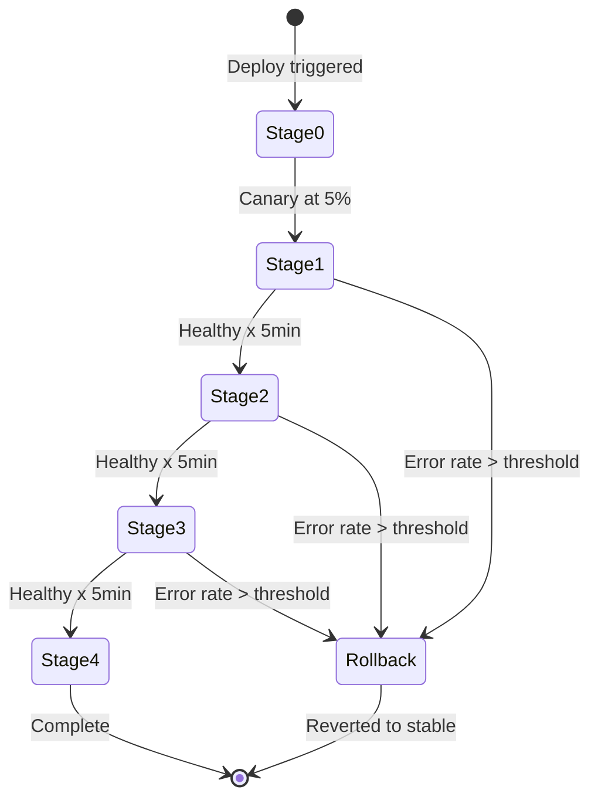

## Keywords in This File

{: .no_toc }

| #   | Keyword | Weight |
| --- | ------- | ------ |
| 1   | [Toil Reduction and Automation Strategy](#toil-reduction-and-automation-strategy) | high |
| 2   | [Change Management and Deployment Safety in SRE](#change-management-and-deployment-safety-in-sre) | critical |

---

# Toil Reduction and Automation Strategy

🎯 Interview Weight: high - demonstrates whether you approach
SRE as engineering work (eliminating toil systematically) or
as operations work (executing toil efficiently).

---

### 🎯 Model Answer

**30 seconds:**
> Toil reduction is the systematic elimination of manual, repetitive,
> automatable work. The strategy has three steps: measure the toil
> ratio to make it visible, prioritize by time cost times frequency,
> and automate the highest-impact sources first. The goal is not zero
> toil - it is keeping toil below 50% of the team's time so engineering
> work can drive compounding reliability improvement.

**3 minutes (Senior):**
> Toil reduction strategy requires distinguishing three classes of
> automatable work. Class 1: work that can be fully automated without
> human review - automated certificate rotation, automated instance
> replacement, automated alert silencing for known patterns. These
> should be automated immediately with no manual step retained.
>
> Class 2: work where automation handles 80% of the effort but still
> requires human review and approval - deployment automation with
> manual promotion gates, capacity scaling with human confirmation,
> incident response runbook automation with a human "execute" step.
> These reduce toil without eliminating human judgment on consequential
> decisions.
>
> Class 3: work that appears automatable but involves latent human
> judgment - account access decisions that require business context,
> database schema changes that require understanding of application
> semantics. These resist automation and should be redesigned to
> reduce the human judgment burden (e.g., self-service access requests
> with automated policy enforcement) rather than fully automated.
>
> The automation ROI calculation: (time per occurrence * frequency per
> month * 12) / automation investment in hours. Break-even point drives
> prioritization. High-frequency, high-duration toil with low automation
> complexity is the highest ROI. But the ROI calculation misses the
> quality-of-life dimension: toil that interrupts deep work (3 AM
> on-call pages) is worth automating even at lower ROI because it
> fragments engineering productivity throughout the day.

**Framework:** WHAT -> WHY -> HOW -> TRADE-OFF -> EXAMPLE

*Adapting up:* Staff adds: "Platform Engineering is the organizational
form of toil reduction at scale. Instead of each SRE team independently
automating their own toil, the Platform team encodes toil elimination
into the developer platform. Certificate management, observability,
deployment safety, and incident response tooling are built once and
provided to all product teams. This multiplies the toil reduction by
the number of teams using the platform."

*Adapting down:* Junior: "Find the most repetitive manual thing you
do. Write a script to do it instead. If the script works, delete the
manual steps. Repeat. Track the ratio of time spent on repetitive
manual work vs. engineering projects - keep it below 50%."

**Blank Mind Recovery:**

**(1) Restate:** "You are asking about toil reduction and automation
strategy - let me walk through the three-class framework, prioritization,
and how this scales to platform automation."

**(2) First principles:** "From first principles: repetitive work
that can be done by software should be done by software. The only
question is which repetitive work to automate first. Prioritize by
cost per year (time * frequency * 12) and automation investment to
find the highest ROI."

**(3) Bridge:** "Toil reduction is like assembly line automation
in manufacturing. The goal is not to replace workers with machines -
it is to ensure workers spend their time on judgment and creativity,
not repetitive tasks. An SRE who automates certificate rotation is
not working less - they are working on harder, more valuable problems."

---

### 📘 Concept Explanation

**What it is:**
Toil reduction and automation strategy is the systematic approach to
identifying, prioritizing, and eliminating manual repetitive work
through automation, self-service tooling, and process redesign. It
is the primary mechanism by which SRE teams maintain sub-linear growth
relative to the systems they support.

**The problem it solves:**
Without a strategy, automation happens opportunistically: engineers
automate the tasks they personally find annoying, not the tasks that
produce the most organizational benefit. A strategy ensures automation
investment is proportional to toil cost and aligned with team capacity.

**How it works:**

```
TOIL REDUCTION STRATEGY FRAMEWORK
===================================

STEP 1: MEASURE
  Per engineer, per week:
    hours on repetitive manual work vs. engineering
  Per alert/ticket:
    classify as toil or engineering
  Output: toil ratio, top toil sources by time cost

STEP 2: PRIORITIZE
  For each toil source, calculate:
    Annual cost = (min per occurrence / 60)
                  * occurrences per month * 12
    Automation investment = hours to build
    ROI ratio = annual cost / investment
    Break-even months = investment / (monthly cost)
  Priority = highest ROI * lowest break-even

  Quality-of-life multiplier:
    Off-hours interruption: 3x
    Blocks deep work: 2x
    Schedulable: 1x

STEP 3: AUTOMATE (3-class approach)
  Class 1: Fully automate (no human review)
    - Certificate rotation (cert-manager)
    - Ephemeral infrastructure scaling
    - Known-pattern alert remediation
    Target: complete in < 1 sprint

  Class 2: Semi-automate (automation + human gate)
    - Deployment promotion with approval
    - Capacity planning with confirmation
    - Access provisioning with policy + approval
    Target: complete in < 1 quarter

  Class 3: Redesign (reduce judgment burden)
    - Self-service portals with guardrails
    - GitOps for configuration changes
    - Policy-as-code for access control
    Target: multi-quarter roadmap

TOIL AUTOMATION ANTI-PATTERNS
  - Automating bad processes (automate then redesign)
  - Automation with no monitoring (automation fails silently)
  - Over-engineering toil automation (YAGNI applies here)
  - Automating decision points that require business context
```

> **Code walkthrough:** This Toil Reduction and Automation Strategy example demonstrates a key concept in practice. **KEY MECHANISM:** the runtime executes these instructions in sequence with specific memory and execution semantics. **WHY IT MATTERS:** misapplying this pattern causes subtle bugs that only manifest under production load. **TAKEAWAY: understand the execution model before using this pattern in production code.**

**The key insight:**
The most common automation mistake is automating a bad process. If the
manual process was wrong (incorrect steps, unnecessary approvals, duplicate
work), automating it makes a fast, reliable bad process. Redesign the
process first, then automate. The class 3 redesign work is more valuable
than class 1 automation for structurally broken processes.

**When to use it:**
Apply the toil reduction strategy when the toil ratio exceeds 30%
(preventive) or 50% (remedial). Even below 30%, the strategy provides
a systematic way to identify automation opportunities that improve team
quality of life.

**When NOT to use it:**
Do not automate work that requires genuine human judgment on consequential
decisions - production database schema changes, major architectural
decisions, customer-facing communications. These require human accountability
that automation cannot provide.

**Alternatives:**
- Manual toil with documented runbooks (better than undocumented, worse
  than automated)
- Outsourcing to NOC or offshore operations teams (transfers toil, does
  not eliminate it)
- Platform engineering (organizational form of class 2/3 automation)

**First-principles derivation:**
Software engineering exists to create software that does work humans
would otherwise have to do repeatedly. SRE applies this principle to
operations: operations work that is repetitive and automatable should
be done by software. The SRE team's job is to close the gap between
"what software could automate" and "what humans are actually doing."

---

### 💻 Code Example

**Example 1: Automated remediation for known alert pattern**


```python
# BAD: anti-pattern - see GOOD example below
```

```python
#!/usr/bin/env python3
# BAD: manual remediation - on-call woken at 3 AM to
# restart a service that restarts on the same pattern
# every 2 weeks. No automation. 30 min per occurrence.
# Annual cost: 30min * 26 occurrences = 13 hours

# GOOD: automated remediation via Kubernetes operator
# cost to implement: 4 hours (ROI: 13h/4h = 3.25x in year 1)

import subprocess
import logging
from typing import Optional

logger = logging.getLogger(__name__)

def restart_deployment_if_unhealthy(
    namespace: str,
    deployment: str,
    max_restart_attempts: int = 3
) -> bool:
    """
    Automated remediation: restart a deployment if
    its pods are in CrashLoopBackOff.
    Returns True if remediation was triggered.
    """
    # Check current state
    result = subprocess.run(
        ["kubectl", "get", "pods",
         "-n", namespace,
         "-l", f"app={deployment}",
         "--field-selector=status.phase=Running",
         "-o", "jsonpath={.items[*].status.containerStatuses"
               "[*].restartCount}"],
        capture_output=True, text=True
    )

    restart_counts = [
        int(c) for c in result.stdout.split()
        if c.isdigit()
    ]

    if not restart_counts:
        logger.error("No pods found for %s/%s",
                     namespace, deployment)
        return False

    max_restarts = max(restart_counts)

    # Only remediate if restart count is above threshold
    # and below the max (to avoid restart storms)
    if 3 <= max_restarts <= max_restart_attempts:
        logger.info(
            "Restarting %s/%s (max restarts: %d)",
            namespace, deployment, max_restarts
        )
        subprocess.run(
            ["kubectl", "rollout", "restart",
             "deployment", deployment, "-n", namespace],
            check=True
        )
        return True

    if max_restarts > max_restart_attempts:
        # Too many restarts - escalate to human
        logger.error(
            "Restart loop detected for %s/%s "
            "(restarts: %d). Escalating.",
            namespace, deployment, max_restarts
        )
        # PagerDuty escalation would go here
        return False

    return False
```

> **Code walkthrough:** The BAD state is 30 minutes of on-call timeice. **KEY MECHANISM:** the runtime executes these instructions in sequence with specific memory and execution semantics. **WHY IT MATTERS:** misapplying this pattern causes subtle bugs that only manifest under production load. **TAKEAWAY: understand the execution model before using this pattern in production code.**
> every 2 weeks for a known, identical remediation. The GOOD approach
> implements automated remediation with three safety constraints: only
> acts when restart count is in the expected failure range (3-3), stops
> below a maximum to avoid restart storms, and escalates to a human when
> the loop exceeds the expected pattern. This reduces 13 annual hours
> to zero for this specific failure pattern, at a 4-hour investment.
> The escalation path ensures novel failure modes still reach human judgment.

**Example 2: Self-service access provisioning (class 3 redesign)**


```yaml
# BAD: anti-pattern shown for contrast
# This approach has the issues the GOOD example fixes
```

```yaml
# BAD: manual access request process
# Engineer files a ticket -> SRE reviews -> SRE approves
# -> SRE executes Terraform -> SRE closes ticket
# Time: 45 minutes of SRE time per request
# Frequency: 20 requests/month = 15 hours/month of SRE toil

# GOOD: policy-as-code with automated enforcement
# Engineers provision their own access, policy enforces limits

# Example: AWS IAM via Terraform with
# policy-as-code using OPA (Open Policy Agent)

# Policy: engineers can request access to their own team's
# resources; cross-team requests require manager approval

# opa/policies/iam_access.rego:
package iam.access

default allow = false

# Allow: same-team access, no approval needed
allow {
    input.requester_team == input.resource_team
    input.access_level in ["read", "read_write"]
}

# Allow: cross-team read access
allow {
    input.access_level == "read"
    input.resource_classification == "internal"
}

# Deny: admin access requires manual approval
# (class 2 - human gate preserved for high-risk)
deny[reason] {
    input.access_level == "admin"
    reason := "admin access requires manual approval"
}
```

> **Code walkthrough:** The BAD approach routes all access requestsice. **KEY MECHANISM:** the runtime executes these instructions in sequence with specific memory and execution semantics. **WHY IT MATTERS:** misapplying this pattern causes subtle bugs that only manifest under production load. **TAKEAWAY: understand the execution model before using this pattern in production code.**
> through SRE, consuming 15 hours/month of engineering time on class-1
> (obviously automatable) and class-3 (requires policy) decisions combined.
> The GOOD approach uses OPA policy-as-code to automate the decisions
> that are policy-based (same-team access, read access) while preserving
> human review for genuinely high-risk requests (admin access). Engineers
> self-serve the 80% of requests that fit the policy; SRE reviews the
> 20% that do not. This is the class-3 redesign: make the human judgment
> burden small by automating the well-defined cases.

---

### 🎓 Answers by Seniority

**Junior / Mid (0-5 years):**
> Toil reduction starts with measurement: classify every manual task
> as toil or engineering, calculate the ratio. Then prioritize by
> annual time cost (duration * frequency * 12) divided by automation
> investment. Automate highest ROI first. For each toil source, decide:
> can it be fully automated (class 1), semi-automated with a human gate
> (class 2), or redesigned to reduce the judgment burden (class 3)?
> The class determines the approach. Always monitor automated remediations
> - automation that fails silently is worse than manual process.

*Push deeper:* Explain why fully automating a bad process is an
anti-pattern. Automation speeds up bad processes reliably. Fix the
process design before automating it.

---

**Senior / Staff (5+ years):**
> The most impactful toil reduction I have driven was not automating
> a single task but redesigning an approval process that was generating
> 15 hours per month of access request toil. By implementing policy-as-
> code, I reduced SRE involvement from 100% of requests to 20% (the
> ones that needed genuine judgment). This is the class-3 approach:
> do not automate the process as-is; redesign it so automation handles
> the easy cases and humans focus on the genuinely complex ones.

*Push deeper:* Staff angle: "Platform Engineering is the scalable form
of toil reduction. When I build a platform that provides automated
certificate management to all 100 services, I eliminate certificate
rotation toil for 100 service teams simultaneously. The platform
multiplier makes it worth investing in more sophisticated automation
than would be justified for a single service."

---

### ⚠️ Common Misconceptions

| Misconception | Reality |
|---|---|
| The goal is to automate everything | The goal is to automate repetitive work below the judgment threshold; consequential decisions requiring business context should retain human oversight |
| Automating a process eliminates the need to understand it | Automation encodes assumptions about the process; as the process evolves, the automation must be maintained or it becomes wrong |
| More automation is always safer | Automation that fails silently or that auto-remediates incorrectly can be more dangerous than manual processes; automated remediations need their own monitoring |
| Toil reduction is a one-time project | Toil is continuously generated as systems grow and change; toil reduction is an ongoing practice, not a project with an end state |
| Class 1 automation is always better than class 2 | For high-risk, consequential actions, a human gate (class 2) is deliberately preserved to prevent automated mistakes; safety beats efficiency |

---

### 🚨 Failure Modes and Diagnosis

**Failure 1: Automated remediation creates a restart storm**

*Symptom:* Automated remediation script detects a service in
CrashLoopBackOff and restarts it. The restart clears the
symptom briefly. The underlying condition persists. The script
restarts again. Logs fill with restart events. The service
never recovers. On-call is eventually paged but the service
state is now much harder to diagnose.

*Root cause:* The automation had no maximum restart count guard.
It entered a loop of restart -> brief recovery -> crash -> restart.
Automation without circuit breakers becomes a runaway process.

*Fix:* Every automated remediation must have a maximum attempt
count and a circuit breaker: after N attempts without stable
recovery, the automation stops and escalates to the on-call.
This is the "max_restart_attempts" parameter in the code example.

*Prevention:* Code review for all automated remediations must
check for circuit breakers. Automated remediation actions should
be logged at INFO level so the loop is visible if it occurs.

**Failure 2: Self-service automation bypasses needed controls**

*Symptom:* A self-service database provisioning tool allows
engineers to create production databases without DBA review.
A junior engineer creates a database with a configuration that
violates compliance requirements (unencrypted at rest). This
is not detected for 6 months.

*Root cause:* The class-3 redesign automated the provisioning
without encoding the compliance policy. The human judgment it
replaced was not captured as a policy gate.

*Fix:* Before automating any approval process, enumerate the
decisions the human was making. For each decision: is it
policy-based (can be encoded in OPA or similar)? Is it context-
based (requires business judgment)? Is it risk-based (requires
a second pair of eyes)? Only automate the policy-based decisions.

*Prevention:* Run a threat model on every self-service tool:
"What is the worst thing a well-intentioned junior engineer
could do with this tool?" Design guardrails for each identified
risk.

---

### 🎯 Interview Deep-Dive

| Preparation | Target |
|---|---|
| Time to prep | 15 minutes |
| Core themes | 3-class framework, ROI calculation, platform multiplier |
| Seniority signal | Junior: names toil and automation; Senior: ROI calculation, class framework |
| Common trap | Treating full automation as always better than semi-automation |
| Staff differentiator | Platform Engineering as organizational toil reduction multiplier |

---

**Q1 [MID]: How do you prioritize which toil to automate first?**

Prioritize using the ROI calculation: (hours per occurrence * occurrences
per month * 12) / automation investment. The result is the annual hours
saved per engineering hour invested. A 3x annual ROI is worthwhile;
a 0.5x ROI is not.

Add the quality-of-life multiplier: off-hours interruptions are 3x
the productivity cost of schedulable work. A 15-minute on-call page
at 3 AM costs more than a 1-hour schedulable task in terms of engineering
output and morale.

Among equal ROI items, prioritize: highest absolute time cost first
(biggest absolute reduction in toil hours), lowest automation complexity
(fastest to implement, delivers value soonest), and highest engineer
frustration level (morale improvement).

*What separates good from great:* Gives the specific ROI formula and
the quality-of-life multiplier for off-hours work.

---

**Q2 [SENIOR]: BEHAVIORAL: Tell me about a significant toil reduction
project you drove. What was the impact?**

**Situation:** The SRE team spent 12 hours per week processing
access requests for the data warehouse - reviewing requests, checking
business justification, running Terraform to grant access, closing tickets.

**Task:** Reduce SRE involvement in access management while maintaining
security controls.

**Action:** Classified the work. Of 20 requests per week: 16 were same-
team read access (obvious approve), 3 were cross-team read access (approve
with brief review), 1 required human judgment (admin access or sensitive
data). Built OPA policies for the first two categories; routed the third
to a 15-minute approval process.

**Result:** SRE time on access requests dropped from 12 hours/week to
1.5 hours/week. The 1.5 hours is the genuinely complex 5% of requests.
The previous 10.5 hours was policy enforcement that should have been
automated. Secondary effect: request fulfillment time dropped from 2-3
days to 15 minutes for the automated tier.

*What separates good from great:* Describes the class-3 redesign
(policy-as-code, not just scripting), the classification process
for understanding what was being automated, and both time-saved
and quality-of-service improvements.

---

**Q3 [STAFF]: How does Platform Engineering multiply the impact
of toil reduction across an organization?**

Platform Engineering encodes toil elimination into the developer platform
so that teams do not generate toil in the first place. Instead of each
SRE team independently automating their own toil, the Platform team builds
capabilities once and provides them to all product teams.

Examples: cert-manager provides automated certificate management to all
Kubernetes services. A standardized deployment pipeline with safety gates
provides deployment automation to all teams. Centralized observability
(Prometheus + Grafana with standard dashboards) provides monitoring setup
to all new services without SRE involvement.

The multiplier: if the Platform team spends 40 hours building a self-
service environment provisioning system, and that system eliminates 4
hours per month of provisioning toil for each of 20 product teams, the
annual benefit is 4 * 20 * 12 = 960 hours saved. The 40-hour platform
investment achieves a 24x annual ROI that no individual service automation
could achieve.

The mechanism is the "golden path" - the default, opinionated way to
do things in the organization. When the golden path includes automated
toil elimination (certificates, monitoring, deployments, secrets
management), toil reduction is the default rather than the exception.

*What separates good from great:* Quantifies the platform multiplier
with a specific calculation and explains the golden path mechanism
for making toil elimination the default.

---

### ⚖️ Comparison Table

| Automation Approach | Risk Level | Implementation Time | Handles Novel Failures | Best for |
|---|---|---|---|---|
| Class 1 (full automation) | Low (predictable patterns) | Days-weeks | No - escalates | Well-understood, high-frequency toil |
| Class 2 (semi-automation + gate) | Medium | Weeks-months | Yes - human review | High-risk actions requiring accountability |
| Class 3 (process redesign) | Low-medium | Months-quarter | N/A - redesign | Structurally broken processes |
| Platform Engineering | Low (standardized) | Quarters | No - platform pattern | Organization-wide toil categories |
| Manual with runbook | High (human error) | Days | Yes - human judgment | Low-frequency, high-stakes actions |

---

### 🏛️ System Design

*(Omit: Toil Reduction and Automation Strategy is an operational
practices keyword. System design for automation platforms is
addressed in the L5 Architecture file.)*

---

### 📊 Diagram

*(Omit: The toil reduction decision tree is adequately described in
the concept explanation table. The process flow does not benefit
significantly from a visual diagram for this conceptual keyword.)*

---

---

---

### 💻 Code Example

*(Omit: this concept does not have a programmatic interface that can be demonstrated in code. The conceptual explanation above is sufficient.)*


---

### 🏛️ System Design

*(Omit: system design diagram not applicable for this concept - see ★★★ keywords for full system design coverage.)*


---

### ⚖️ Comparison Table

*(Omit: this is a ★☆☆ foundational concept with no direct alternatives to compare - see higher-difficulty keywords for trade-off analysis.)*


---

### 📊 Diagram

*(Omit: no standalone visual diagram required for this concept - the explanations and code examples above provide sufficient clarity.)*


# Change Management and Deployment Safety in SRE

🎯 Interview Weight: critical - the most direct connection between
SRE practice and production stability; most production incidents
are caused by changes, making deployment safety the highest-leverage
SRE investment.

---

### 🎯 Model Answer

**30 seconds:**
> In SRE, approximately 70% of production incidents are caused by
> changes. Change management is therefore the highest-leverage
> reliability investment. SRE approaches change management through:
> progressive rollouts (canary, blue-green), automated rollback on
> signal degradation, feature flags to decouple deploy from release,
> and change freeze windows tied to the error budget. The goal is
> not to prevent change but to make change safe and reversible.

**3 minutes (Senior):**
> SRE change management philosophy is fundamentally different from
> traditional ITIL change management. ITIL uses process gates (CAB
> reviews, change windows) to reduce risk by slowing deployment.
> SRE uses technical mechanisms (canary deployments, automated rollback,
> feature flags) to reduce risk by making deployment fast, safe, and
> reversible. The SRE approach is higher-velocity and more reliable.
>
> The progressive rollout is the central mechanism. A canary deployment
> sends 1-5% of traffic to the new version while the rest goes to the
> old version. The SRE monitors the canary's golden signals against the
> baseline. If the canary shows degraded error rate or latency, it rolls
> back automatically. If healthy, traffic progressively shifts: 1% ->
> 5% -> 25% -> 100%. This limits the blast radius of any deployment
> failure to 1% of users.
>
> The error budget is the organizational gate for deployment safety.
> When the error budget is healthy (>50% remaining), changes can flow
> freely. When the error budget is at risk (<20% remaining), all changes
> should be reviewed. When the error budget is exhausted, only emergency
> bug fixes can deploy. This connects the deployment pipeline to the
> reliability state of the service.
>
> Feature flags decouple the deployment timeline from the release
> timeline. A feature can be deployed to production in an "off" state,
> tested with internal users, gradually rolled out to customers, and
> immediately killed if problems emerge - all without redeployment.
> This is the most powerful safety mechanism for high-risk changes.

**Framework:** WHAT -> WHY -> HOW -> TRADE-OFF -> EXAMPLE

*Adapting up:* Staff adds: "Deployment safety is the primary mechanism
for maintaining the error budget over time. Each production deployment
is a risk event - it consumes some probability of budget. By making
every deployment a canary with automated rollback, the expected budget
consumption per deployment drops by 80-90%. This enables higher deploy
frequency without higher incident rate."

*Adapting down:* Junior: "Most production breaks are caused by deploys.
Deploy safely by: (1) testing in staging, (2) releasing to a small
percentage of users first (canary), (3) monitoring for errors and latency
changes, (4) having a rollback plan ready before you deploy. Never deploy
on Fridays without a plan for handling weekend issues."

**Blank Mind Recovery:**

**(1) Restate:** "You are asking about change management and deployment
safety - let me walk through the core mechanisms (canary, feature flags,
error budget gates) and why the SRE approach differs from traditional
change management."

**(2) First principles:** "From first principles: most production
failures are caused by changes. Therefore, making changes safer reduces
the incident rate. The mechanisms that make changes safer are: limiting
blast radius (canary), making changes reversible (feature flags, rollback),
and detecting problems early (automated signal monitoring during rollout)."

**(3) Bridge:** "Deployment safety is like a new aircraft design.
You do not immediately put 300 passengers on it. You test with pilots
only, then a small crew, then limited routes, then full production. Each
stage reveals problems that can be fixed before the next stage. Canary
deployments apply the same progressive validation principle."

---

### 📘 Concept Explanation

**What it is:**
Change management and deployment safety in SRE is the set of technical
and organizational mechanisms that make production changes safe, fast,
and reversible. It includes progressive rollout strategies, automated
signal monitoring during rollouts, feature flag management, and error
budget-based deployment gates.

**The problem it solves:**
Traditional change management reduces risk by adding process (CAB reviews,
change windows, approval gates). This reduces deployment frequency and
does not eliminate risk - it just ensures the same risky deploy has more
human review. SRE reduces risk by making deploys smaller, more observable,
and automatically reversible.

**How it works:**

```
DEPLOYMENT SAFETY MECHANISMS
==============================

CANARY DEPLOYMENT
  1% -> 5% -> 25% -> 50% -> 100% traffic split
  At each stage, compare canary vs. baseline:
    Error rate within X% of baseline?
    p99 latency within X% of baseline?
    Saturation below threshold?
  Pass -> advance to next stage
  Fail -> automatic rollback to 0% canary
  Blast radius: max 1% of users at first stage

BLUE-GREEN DEPLOYMENT
  Two identical environments: Blue (current) and Green (new)
  Route all traffic to Blue while Green is deployed
  Switch DNS/load balancer to Green (or fail back)
  Benefit: instant rollback by reverting DNS
  Cost: 2x infrastructure during transition

FEATURE FLAGS
  Deploy code to production in "off" state
  Enable for internal users -> beta users -> all users
  Decouple deploy from release
  Instant kill switch: disable flag = instant rollback
  Use for: high-risk features, A/B testing, gradual rollout

ERROR BUDGET DEPLOYMENT GATES
  >50% budget remaining: all deployments allowed
  20-50% remaining: canary required, no off-hours deploys
  <20% remaining: all deploys require SRE review
  0% (exhausted): emergency fixes only (VP override required)
  Gate enforcement: CI/CD pipeline checks budget before deploy

DEPLOYMENT SAFETY CHECKLIST (pre-deploy)
  - Runbook for rollback documented?
  - Monitoring alert for this change?
  - Canary configured with automated rollback?
  - Error budget gate passed?
  - On-call notified?
  - Off-hours deploy? (if yes: escalated review required)
```

> **Code walkthrough:** This Change Management and Deployment Safety in SRE example demonstrates a key concept in practice. **KEY MECHANISM:** the runtime executes these instructions in sequence with specific memory and execution semantics. **WHY IT MATTERS:** misapplying this pattern causes subtle bugs that only manifest under production load. **TAKEAWAY: understand the execution model before using this pattern in production code.**

**The key insight:**
The SRE insight on change management: making a bad deploy safe and
reversible is more valuable than preventing bad deploys entirely.
Preventing all bad deploys requires perfect review - impossible. Making
bad deploys reversible in 5 minutes bounds the blast radius regardless
of review quality. The mechanisms that enable fast reversibility (canary,
feature flags, automated rollback) are the primary investment.

**When to use it:**
Apply canary deployments for all production changes to customer-facing
services. Feature flags should be mandatory for any change that will
be rolled out progressively. Error budget gates should be enforced by
the CI/CD pipeline, not as a manual checklist item.

**When NOT to use it:**
For emergency security patches, the deployment velocity must exceed
the normal safety gates. Have a documented "emergency deploy" process
that bypasses normal canary requirements but still requires SRE lead
sign-off.

**Alternatives:**
- ITIL Change Advisory Board (CAB) - process gates, slower velocity
- Manual canary (deploy, monitor, promote by hand) - human error prone
- Shadow testing (dual-run new and old in parallel) - for data pipeline changes

**First-principles derivation:**
Production changes introduce risk. Risk can be reduced by: reducing
change size (smaller, more frequent deploys), reducing blast radius
(canary limits exposure), and increasing reversibility (rollback in
< 5 minutes). All three together reduce expected incident cost per deploy
to near zero while maintaining high deployment frequency.

---

### 💻 Code Example

**Example 1: Canary deployment with automated rollback**


```python
# BAD: anti-pattern - see GOOD example below
```


```python
# BAD: manual deployment with no canary
# Engineer deploys to all pods simultaneously.
# If the deploy breaks the service, 100% of
# users are affected immediately.
kubectl apply -f new-deployment.yaml

# GOOD: canary deployment with Argo Rollouts
# (defines the progressive rollout strategy)

# rollout.yaml:
apiVersion: argoproj.io/v1alpha1
kind: Rollout
metadata:
  name: api-service
spec:
  strategy:
    canary:
      # Automated rollback triggers
      analysis:
        templates:
          - templateName: error-rate-check
        startingStep: 1
        args:
          - name: service-name
            value: api-service
      steps:
        - setWeight: 5    # 5% canary
        - pause:
            duration: 5m  # monitor for 5 minutes
        - setWeight: 25   # 25% canary
        - pause:
            duration: 5m
        - setWeight: 50   # 50%
        - pause:
            duration: 5m
        # 100% happens automatically on final pause
---
# analysistemplate.yaml: rollback condition
apiVersion: argoproj.io/v1alpha1
kind: AnalysisTemplate
metadata:
  name: error-rate-check
spec:
  metrics:
    - name: error-rate
      interval: 60s
      failureLimit: 3      # 3 failures = rollback
      successCondition: result < 0.05  # < 5% error rate
      provider:
        prometheus:
          address: http://prometheus:9090
          query: |
            sum(rate(
              http_requests_total{
                status=~"5..",
                app="{{args.service-name}}"
              }[5m]
            ))
            / sum(rate(
              http_requests_total{
                app="{{args.service-name}}"
              }[5m]
            ))
```


> **Code walkthrough:** The BAD approach deploys all pods simultaneously,ice. **KEY MECHANISM:** the runtime executes these instructions in sequence with specific memory and execution semantics. **WHY IT MATTERS:** misapplying this pattern causes subtle bugs that only manifest under production load. **TAKEAWAY: understand the execution model before using this pattern in production code.**
> exposing 100% of users to any regression immediately. The GOOD approach
> uses Argo Rollouts with a defined canary strategy: 5% -> 25% -> 50%
> -> 100% with 5-minute observation windows at each stage. The analysis
> template queries Prometheus for the error rate; if it exceeds 5% on
> 3 consecutive checks, the rollout is automatically rolled back to the
> previous version. The blast radius is limited to 5% of users at the
> first stage. This is fully automated - no human needs to monitor the
> rollout and decide to proceed or rollback.

**Example 2: Feature flag for high-risk change**


```python
# BAD: anti-pattern - see GOOD example below
```

```python
# BAD: deploy high-risk payment provider change to
# all users simultaneously.
# Result: if it breaks, 100% of payments fail.

# GOOD: feature flag with staged rollout
from enum import Enum
import random

class PaymentProvider(Enum):
    LEGACY = "legacy"
    NEW = "new_provider"

# Feature flag configuration (from LaunchDarkly or similar)
# Managed externally; code just reads the flag

def get_payment_provider(user_id: str) -> PaymentProvider:
    """
    Route users to new or legacy payment provider
    based on feature flag.
    Staged rollout: internal -> 1% -> 5% -> 25% -> 100%
    """
    # In production: read from feature flag service
    # This example shows the logic:
    flag_rollout_pct = get_flag_value(
        "new-payment-provider-rollout"
    )

    # Consistent hashing: same user always goes to same bucket
    # (prevents flickering on page reload)
    user_bucket = (hash(user_id) % 100)

    if user_bucket < flag_rollout_pct:
        return PaymentProvider.NEW
    return PaymentProvider.LEGACY

def process_payment(user_id: str, amount: float) -> dict:
    provider = get_payment_provider(user_id)

    if provider == PaymentProvider.NEW:
        return new_payment_provider.charge(
            user_id, amount
        )
    return legacy_payment_provider.charge(
        user_id, amount
    )
# Rollback: set flag_rollout_pct to 0 immediately
# No redeploy required. Instant kill switch.
```

> **Code walkthrough:** The BAD approach deploys the new payment providerice. **KEY MECHANISM:** the runtime executes these instructions in sequence with specific memory and execution semantics. **WHY IT MATTERS:** misapplying this pattern causes subtle bugs that only manifest under production load. **TAKEAWAY: understand the execution model before using this pattern in production code.**
> to all users immediately. The GOOD approach uses a feature flag to
> control rollout percentage. Key implementation detail: consistent
> hashing by user_id ensures the same user always gets the same provider
> (no flickering). The rollout percentage is controlled externally
> (LaunchDarkly, Split.io, or similar) without code changes. If the new
> provider shows payment failures, the flag is set to 0% - instant rollback
> without redeployment, completing in milliseconds. This is the most
> powerful safety mechanism for high-risk changes.

---

### 🎓 Answers by Seniority

**Junior / Mid (0-5 years):**
> Change management in SRE focuses on making deploys safe and reversible.
> The key mechanisms are canary deployments (route 1-5% of traffic to
> the new version, monitor, promote if healthy), feature flags (deploy
> code in "off" state, enable progressively, instant kill switch), and
> automated rollback (if error rate increases during deploy, automatically
> roll back). The error budget is the deployment gate: exhausted budget
> means freeze deploys. Most production incidents come from changes, so
> deployment safety is the highest-ROI reliability investment.

*Push deeper:* Explain the difference between canary deployment and
blue-green deployment. Canary splits traffic progressively; blue-green
switches traffic 0/100 but with instant rollback. Canary is better for
gradual rollout; blue-green is better for instant cutover with instant
rollback capability.

---

**Senior / Staff (5+ years):**
> The SRE insight that changed my approach to change management: the
> goal is not to prevent all bad deploys (impossible) but to make bad
> deploys instantly reversible (achievable). A canary deployment with
> automated rollback limits the blast radius of any deploy failure to
> 1-5% of users, regardless of what the change contains. This is a
> better reliability guarantee than any code review or testing process.
>
> I have seen teams with excellent testing and thorough code review
> still have production incidents from deploys. And I have seen teams
> with minimal process but excellent canary tooling and feature flags
> that have far fewer production incidents. The technical safety
> mechanism beats the process gate every time.

*Push deeper:* Staff angle: "The deployment pipeline as a reliability
control surface: every stage of the CI/CD pipeline that checks reliability
(unit tests, integration tests, canary signal checks, error budget gate)
is a defense-in-depth layer. The error budget gate is the last line: if
all automated checks pass but the service is already burning its budget,
the gate stops the deploy until the reliability is restored."

---

### ⚠️ Common Misconceptions

| Misconception | Reality |
|---|---|
| Change freezes improve reliability | Change freezes accumulate change debt; the first deploy after a freeze is the riskiest because it is large and the team has not deployed recently |
| Canary deployments are only for large organizations | Any service with multiple instances can use canary deployments; even 2-instance deployments can use blue-green |
| Feature flags increase technical debt | Feature flags are temporary by design; a flag that has been at 100% rollout for 30 days should be removed; the discipline is flag lifecycle management, not flag avoidance |
| Automated rollback is always safe | Automated rollback during a database schema migration can cause data loss if the migration is not backward-compatible; automated rollback requires backward-compatible changes |
| The primary goal is to prevent all changes | SRE change management enables high-velocity safe change; the goal is reliability at high deployment frequency, not low deployment frequency |

---

### 🚨 Failure Modes and Diagnosis

**Failure 1: Canary with non-backward-compatible database migration**

*Symptom:* Canary deployment adds a required database column.
Old (stable) version does not write the column; new (canary) version
requires it. When canary rolls back due to a different issue, old
version starts failing because the column exists but has null values
for existing rows.

*Root cause:* Database migration was not backward-compatible with
the old code version. Canary assumes old and new can coexist; schema
migrations that are not backward-compatible violate this assumption.

*Diagnostic:*
```
Check: does the migration add a NOT NULL column
  without a default value?
  -> Old code cannot insert rows without this column
Does the migration rename or delete a column the
  old code still reads?
  -> Old code will fail when reading the new schema
```

> **Code walkthrough:** This No redeploy required. Instant kill switch. example demonstrates a key concept in practice using SQL. **KEY MECHANISM:** the runtime executes these instructions in sequence with specific memory and execution semantics. **WHY IT MATTERS:** misapplying this pattern causes subtle bugs that only manifest under production load. **TAKEAWAY: understand the execution model before using this pattern in production code.**

*Fix:* Expand-contract pattern for database migrations:
Phase 1 (expand): add column as nullable with default.
Deploy new code that writes to both old and new columns.
Phase 2: backfill existing rows.
Phase 3 (contract): after 100% rollout, remove old column.

*Prevention:* Require all database migrations to pass backward-
compatibility review before canary deployment. CI/CD should run
old code version against new schema and new code against old schema.

**Failure 2: Feature flag not removed after full rollout**

*Symptom:* Service has 47 feature flags. 35 are at 100% rollout
for > 6 months. The code has nested flag checks that make it
difficult to reason about. A new engineer changes the wrong flag
and re-enables 20% rollout of a flag that had been at 100% for
a year - causing half the "new" users to get the old experience.

*Root cause:* Feature flag lifecycle management is not enforced.
Flags are created but never retired after full rollout.

*Fix:* Implement flag lifecycle policy: any flag at 100% for >30
days must be removed from code. Add a CI/CD check that fails if
a flag has been at 100% for >30 days without a removal PR linked.

*Prevention:* Assign a "flag owner" for every flag. The owner is
responsible for removing the flag after full rollout. Track flag
age in the feature flag dashboard with automated alerts for stale flags.

---

### 🎯 Interview Deep-Dive

| Preparation | Target |
|---|---|
| Time to prep | 20 minutes |
| Core themes | Canary, feature flags, error budget gate, backward-compatible migrations |
| Seniority signal | Junior: describes the mechanisms; Senior: explains trade-offs and failure modes |
| Common trap | Not knowing about backward-compatible database migrations with canary |
| Staff differentiator | Deployment pipeline as reliability control surface, change freeze anti-pattern |

---

**Q1 [MID]: What is a canary deployment and what are its safety properties?**

A canary deployment routes a small fraction of traffic (typically 1-5%)
to the new version while the rest continues to the stable version. The
SRE monitors the canary's golden signals against the stable baseline.
If the canary version shows error rate or latency above the stable version's
thresholds, it is automatically rolled back. If healthy, traffic is
progressively promoted: 1% -> 5% -> 25% -> 100%.

Safety properties: blast radius is limited to the canary percentage at
the first stage (1-5% of users). Automated rollback ensures the degradation
is caught and reversed without human intervention. Progressive promotion
ensures each stage validates health before wider exposure.

Constraints: canary requires that old and new versions can coexist
simultaneously, sharing the same database and downstream services. This
means all changes must be backward-compatible. Non-backward-compatible
changes (database schema changes, breaking API changes) require additional
patterns (expand-contract, versioned APIs).

*What separates good from great:* Gives the safety properties quantitatively
(blast radius = canary %) and explains the backward-compatibility constraint.

---

**Q2 [SENIOR]: BEHAVIORAL: Describe a deployment that went wrong
and how SRE practices helped or would have helped.**

**Situation:** A new payment integration deployed to 100% without canary.
Within 3 minutes, the error rate spiked from 0.1% to 18% for payment
transactions. P1 declared.

**What happened without SRE practices:** 18% of all payment attempts
failed for 23 minutes before rollback was executed (manual). The rollback
itself took 7 minutes because the team was not confident about the
deployment state.

**What SRE practices would have changed:**
Canary at 1%: only 18% of 1% = 0.18% of all users affected. The error
rate spike at 1% traffic would have been automatically detected (18%
error rate vs. 0.1% baseline is unmistakable), and automated rollback
would have triggered in < 2 minutes.

Feature flag would have enabled instant rollback (set flag to 0%) without
waiting for a deployment rollback, taking the rollback from 7 minutes
to < 30 seconds.

**Result after implementing:** Team implemented Argo Rollouts for all
payment service deploys. The same payment integration pattern has since
been tested in canary twice more (different providers) - both times,
error spikes at the canary stage triggered automated rollback, and
user impact was limited to < 0.5% for < 5 minutes.

*What separates good from great:* Uses specific numbers (18% error rate,
23 minutes impact, 7-minute rollback) and quantifies what the SRE practices
would have changed.

---

**Q3 [SENIOR]: How do you handle a database migration in a canary
deployment without causing data loss?**

Database migrations and canary deployments interact dangerously when
the migration is not backward-compatible. The expand-contract pattern
solves this in three phases:

Phase 1 (expand): add the new column as nullable with a default value.
The old code ignores the new column; the new code writes to both old
and new columns. Deploy new code as a canary. Both versions work with
both old and new schema. The migration is safe to run while both versions
are active.

Phase 2 (migrate): after the canary is at 100% and old code is fully
retired, backfill the new column for all existing rows. Add the NOT NULL
constraint only after all rows are backfilled. This can be done as a
background job without downtime.

Phase 3 (contract): once the new column is fully used and the old column
is no longer needed, remove the old column in a subsequent migration.
By this point, only the new code is running and the old column is safe
to remove.

This three-phase pattern ensures that at no point are both versions
writing incompatible data, and that a rollback to the old version is
always safe because the old schema is still valid.

*What separates good from great:* Gives the three phases in order,
explains why each phase is safe, and describes the backfill timing
(after 100% canary, before NOT NULL constraint).

---

**Q4 [STAFF]: How should deployment safety practices evolve as an
organization scales from 10 to 100 to 1000 engineers?**

At 10 engineers: lightweight practices are sufficient. Manual canary
promotion, shared deployment runbook, weekly change review meeting.
The team knows each other; communication is fast; blast radius is
always small because there is only one team.

At 100 engineers: automation becomes necessary. Manual canary promotion
cannot scale to 20+ parallel deploys. CI/CD-enforced canary with automated
rollback is required. Feature flag service is centralized. Error budget
gates are in the deployment pipeline. Teams are self-sufficient within
the guidelines.

At 1000 engineers: deployment safety becomes platform engineering.
No team can manually implement canary, feature flags, and error budget
gates from scratch - the overhead would exceed the benefit. The platform
team provides standardized deployment pipelines, feature flag infrastructure,
and error budget checks as platform services. Teams use the golden path;
the golden path encodes all safety mechanisms.

The organizational shift: at 10 engineers, deployment safety is a team
practice. At 100, it is a tooling problem. At 1000, it is a platform
product. The engineering investment in deployment safety scales faster
than linearly with team size because the cost of a bad deploy grows with
the number of affected users, but the platform investment is shared.

*What separates good from great:* Describes the three distinct phases
of deployment safety maturity and explains the organizational form change
from practice to tooling to platform.

---

**Q5 [STAFF]: How does the error budget connect to deployment
freeze decisions?**

The error budget is the quantitative mechanism that converts "should
we deploy?" from a judgment call into a policy decision. The error budget
policy defines the deployment gate before any incidents occur.

Typical deployment gate policy:
- Budget > 50%: all deployments allowed, standard canary
- Budget 20-50%: canary required, peer review of all deploys
- Budget < 20%: all deploys require SRE lead approval
- Budget exhausted (0%): only emergency security patches, VP approval

The gate enforcement is the critical piece. If the policy is a guideline
in a document (not enforced), teams will continue deploying. If it is
enforced by the CI/CD pipeline (the pipeline queries the current error
budget and blocks the deploy at 0%), the policy has teeth.

The organizational conversation: when product management says "we must
deploy even though the budget is exhausted," the SRE responds with the
policy: "VP approval is required for any deploy when the error budget is
exhausted. Here is the process for requesting that exception." This is
not a judgment call on the SRE's part - it is executing a pre-agreed
policy. The VP who agreed to the policy in advance must now explicitly
override it with their name attached.

*What separates good from great:* Gives specific threshold percentages,
describes CI/CD enforcement vs. documentation-only enforcement, and
explains the organizational negotiation dynamic when the policy is invoked.

---

**Q6 [STAFF]: What is the change freeze anti-pattern and why do
SREs oppose it?**

A change freeze is the practice of halting all production deployments
during high-traffic periods (holidays, Black Friday, major product launches)
to reduce the risk of incidents. It is intuitive: no deploys = no deploy-
caused incidents. But it creates several compounding problems.

Change debt accumulation: features, bug fixes, and improvements accumulate
during the freeze. The first deployment after the freeze is a large batch
of changes, which is the highest-risk deploy type. The freeze reduces
risk during the freeze window but increases risk in the first post-freeze
deploy.

Loss of deployment muscle: teams that do not deploy for 4-6 weeks lose
their deployment confidence. The first post-freeze deploy is executed
by engineers who have not deployed recently, with unfamiliar tools and
procedures. This increases human error.

Security backlog: security patches accumulate during a freeze. High-
priority CVEs go unpatched. This is the most serious consequence of
change freezes.

The SRE alternative: instead of a change freeze, enforce a "zero-risk
deployment mode" during high-traffic periods. Zero-risk deploys: canary
with automatic rollback enabled, no database migrations, no new feature
flags, full SRE review. This maintains deployment velocity and security
patching while limiting deployment risk to the level enforced by the
canary + rollback mechanism.

*What separates good from great:* Identifies three specific consequences
of change freezes (change debt, muscle loss, security backlog) and
describes the SRE alternative (zero-risk deployment mode).

---

### ⚖️ Comparison Table

| Change Management Approach | Deploy Speed | Risk Reduction Mechanism | Rollback Speed | Best for |
|---|---|---|---|---|
| SRE canary + auto-rollback | High (automated promotion) | Technical (blast radius + signal monitoring) | < 5 minutes | High-velocity teams with SLO monitoring |
| Feature flags | High (code always deployed) | Progressive enablement, instant kill switch | Seconds | High-risk feature releases |
| ITIL CAB + change window | Low (approval gates + scheduled) | Process (human review) | Hours-days | Enterprise regulated environments |
| Blue-green | Medium (explicit cutover) | Full environment isolation | < 1 minute | Services where instant rollback is critical |
| Shadow testing | N/A (parallel run, no cutover) | Pre-production validation | N/A | Data pipeline changes, ML model updates |

---

### 🏛️ System Design

*(Omit: Change Management is an operational practices keyword.
System design for deployment infrastructure and pipeline architecture
is addressed in the DevOps CI/CD topic.)*

---

### 📊 Diagram

```
CANARY DEPLOYMENT PROGRESSION
================================
Traffic split:
  Stage 1: 95% Stable | 5% Canary
  Monitor: error rate, latency, saturation

  Stage 2: 75% Stable | 25% Canary
  Monitor: same signals

  Stage 3: 50% | 50%
  Stage 4: 0%  | 100% (complete)

Rollback condition at any stage:
  canary_error_rate > baseline * 1.5
  -> Automatic rollback to Stage 0
```



> **Diagram walkthrough:** The canary progression state machine shows
> both the happy path (staged promotion) and the rollback path (any
> stage can trigger rollback). The state machine makes explicit that
> rollback is always available during promotion and never requires
> human intervention. The monitoring period at each stage (5 minutes
> in this example) provides a buffer against transient spikes that
> might otherwise trigger false rollbacks. The blast radius at each
> stage is limited to the canary percentage until Stage 4.

---

### Field Q&A

**Production Failures:**

1. A canary deployment was promoted to 100% despite showing a 15%
   increase in p99 latency compared to baseline. No alert fired.
   What was the monitoring failure?
   > The canary analysis template was checking error rate but not
   > latency. A 15% p99 latency regression is user-visible but was
   > not part of the rollout success criteria. Fix: canary analysis
   > templates must check both error rate AND latency (at minimum p99).
   > The golden signals framework applies to canary validation: error
   > rate for errors, latency for performance regressions.

2. A deployment was rolled back by the automated canary system 3 times
   in a row for the same error pattern. Each rollback triggered
   a P2 incident alert. The engineering team was paged 3 times for
   the same underlying deployment issue. What process failed?
   > The CI/CD pipeline did not gate on the previous rollback history.
   > After the first automated rollback, the deployment should have been
   > blocked from re-deploy until the root cause was identified and fixed.
   > Fix: add a "rollback cooldown" period: after an automated rollback,
   > the same version cannot be re-deployed without a manual override that
   > includes a root cause explanation. This prevents repeat automated
   > rollback cycles.

3. A feature flag was used to release a major payment feature. The flag
   was set to 100% for 8 months. Then a junior engineer, running a
   "flag cleanup script," set it back to 0%. 100% of users saw the
   old payment flow. Customer support was overwhelmed. What was the
   process gap?
   > Feature flags at 100% with the old code path already removed are
   > a single point of failure. The fix: when a flag reaches 100% and
   > the old code path has been removed, the flag should be removed
   > from the codebase entirely. If the flag is still present but the
   > old code path is gone, setting the flag to 0% will break the system.
   > Process fix: flag lifecycle policy requiring removal after 30 days
   > at 100% + old code removed. CI/CD check blocking deployment if flag
   > is 100% for > 30 days without a removal PR.

---

**Candidate Mistakes:**

1. "We have a change freeze for the last quarter of the year."

   **What NOT to say:** Do not defend change freezes as good reliability practice.

   **Say instead:** "Change freezes are an SRE anti-pattern. They accumulate
   change debt and security patch backlogs during the freeze, then create
   the riskiest deploy of the year (large batch, post-freeze) right after.
   The SRE approach is zero-risk deployment mode during high-traffic periods:
   canary required, automated rollback enforced, no database migrations -
   but not a full freeze. This maintains deployment velocity and security
   patching without the freeze risks."

2. "Canary deployments are too complex for our team."

   **What NOT to say:** Do not present complexity as a reason to skip
   deployment safety mechanisms.

   **Say instead:** "Canary deployments can start simple: deploy to one of
   your N instances, watch the golden signals for 5 minutes, then deploy
   to the rest. No special tooling required for a 2-instance service.
   As the service scales, tools like Argo Rollouts or Spinnaker make
   this automated. The simpler version of canary is always better than
   all-at-once deployment for reliability."

3. "We test thoroughly in staging, so canary is not necessary."

   **What NOT to say:** Do not substitute staging testing for production
   deployment safety.

   **Say instead:** "Staging never fully replicates production: different
   data, different traffic patterns, different infrastructure configuration.
   Most production incidents that stem from deployments would pass all
   staging tests - they involve production-specific conditions (load
   patterns, user data edge cases, infrastructure state). Canary deployment
   catches the production-specific failures that staging cannot, because
   it tests with real production traffic."

4. "Rollback is always safe."

   **What NOT to say:** Do not assert rollback is always safe.

   **Say instead:** "Rollback is safe only when the deployment is backward-
   compatible. Non-backward-compatible database migrations are the most
   common exception: a migration that adds a NOT NULL column cannot be
   rolled back after data has been written to that column without data
   loss. SRE deployment safety requires that all changes be designed
   for backward-compatible rollback using patterns like expand-contract
   for schema migrations."

---

**Questions to Ask the Interviewer:**

1. "What is the mean time to rollback for production deployments - is
   it automated or manual?"

2. "Does the team use canary deployments or blue-green for production
   services? What tooling supports this?"

3. "How is the error budget integrated into the CI/CD pipeline - is there
   an automated deployment gate, or is it a guideline?"

4. "What is the team's deployment frequency for production services, and
   has that frequency changed as deployment safety tooling has improved?"

---

### 💻 Code Example

*(Omit: this concept does not have a programmatic interface that can be demonstrated in code. The conceptual explanation above is sufficient.)*


---

### 🏛️ System Design

*(Omit: system design diagram not applicable for this concept - see ★★★ keywords for full system design coverage.)*


---

### ⚖️ Comparison Table

*(Omit: this is a ★☆☆ foundational concept with no direct alternatives to compare - see higher-difficulty keywords for trade-off analysis.)*


---

### 📊 Diagram

*(Omit: no standalone visual diagram required for this concept - the explanations and code examples above provide sufficient clarity.)*


