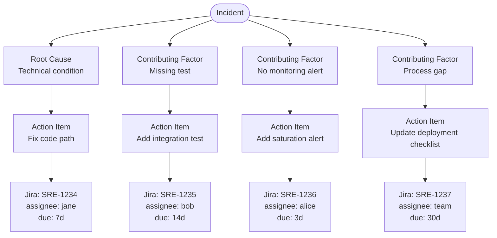

## Keywords in This File

{: .no_toc }

| #   | Keyword | Weight |
| --- | ------- | ------ |
| 1   | [Incident Response Lifecycle](#incident-response-lifecycle) | critical |
| 2   | [Postmortem Culture and Blameless Retrospectives](#postmortem-culture-and-blameless-retrospectives) | critical |

---

# Incident Response Lifecycle

🎯 Interview Weight: critical - the structured process that
distinguishes mature SRE teams from reactive operations; your
answer demonstrates whether you have managed incidents or only
observed them.

---

### 🎯 Model Answer

**30 seconds:**
> The incident response lifecycle has five phases: detection
> (something is wrong), triage (how bad, who is affected?),
> mitigation (stop the bleeding), resolution (fix the root cause),
> and postmortem (prevent recurrence). The phases are sequential
> but the most critical rule is: mitigate before you diagnose.
> Restoring service to users is always the priority over finding
> root cause.

**3 minutes (Senior):**
> Incident response is the most time-pressured engineering work
> SREs do. Under pressure, teams make predictable mistakes: they
> spend too long diagnosing before mitigating, they lack clear
> roles so everyone works in parallel on the same problem, and they
> communicate inconsistently with stakeholders. The incident
> response lifecycle is the structure that prevents these mistakes.
>
> Detection is not just alerting. Good detection includes synthetic
> monitoring (external probes), user-reported incidents, and business
> metric anomalies that lead users to report problems before technical
> alerts fire. The goal of detection is minimizing time-to-detection
> (TTD) - the interval between incident onset and engineer awareness.
>
> The most important role in a large incident is the Incident
> Commander (IC). The IC does not fix the problem - they coordinate.
> The IC tracks all active work streams, manages communication to
> stakeholders, makes the escalation and severity decisions, and
> prevents the "hero engineer" problem where one person works
> all threads simultaneously and becomes the bottleneck.
>
> Mitigation is explicitly separate from resolution. A mitigation
> might be a traffic rollback, a feature flag disable, or routing
> traffic to a healthy region. It stops user impact without fixing
> the root cause. Resolution is the subsequent engineering work
> to address the root cause. This distinction is critical: teams
> that conflate mitigation and resolution stay in incidents longer
> because they refuse to declare mitigation until root cause is
> known.

**Framework:** WHAT -> WHY -> HOW -> TRADE-OFF -> EXAMPLE

*Adapting up:* Staff adds: "Incident severity classification is
the mechanism that ensures the right level of organizational response.
P0 (complete outage, all users affected) requires immediate executive
notification, all-hands response, and dedicated comms. P3 (minor
degradation, small user fraction affected) requires a ticket and
next-day follow-up. The cost of under-classifying is inadequate
response; the cost of over-classifying is alert fatigue and
desensitization."

*Adapting down:* Junior: "When something breaks in production,
there is a sequence: (1) detect it, (2) figure out how bad it is,
(3) stop the damage to users, (4) fix the actual cause, (5) write
up what happened. The key rule: stopping the damage to users (step 3)
always comes before fixing the cause (step 4). Users first."

**Blank Mind Recovery:**

**(1) Restate:** "You are asking about the incident response
lifecycle - let me walk through the five phases and the key
principles that make each phase effective."

**(2) First principles:** "From first principles, an incident is
an unplanned interruption to a service. Effective incident response
must: detect it quickly, minimize user impact, restore service,
and prevent recurrence. These four goals map directly to the
lifecycle phases."

**(3) Bridge:** "Incident response is like an emergency room: triage
first (who is most critical?), stabilize (stop the bleeding before
surgery), then treat the underlying condition. An ER that performs
surgery before stabilizing the patient is doing it in the wrong order."

---

### 📘 Concept Explanation

**What it is:**
The incident response lifecycle is the structured sequence of
activities from incident onset to resolution and postmortem. It
provides a consistent process that enables multiple engineers
to coordinate effectively under time pressure.

**The problem it solves:**
Without structure, incident response degrades to individual heroics:
the senior engineer who knows the system best works all problems
simultaneously, communication to stakeholders is ad hoc, and the
team never learns from the incident because no systematic postmortem
exists. The lifecycle solves each of these problems.

**How it works:**

```
INCIDENT RESPONSE LIFECYCLE
============================

PHASE 1: DETECTION
  Goal: minimize time-to-detection (TTD)
  Sources:
    - Alerting (automated)
    - Synthetic monitoring (external probes)
    - User reports (support tickets, social)
    - Business metrics (revenue drops)
  Success metric: TTD < alert evaluation window

PHASE 2: TRIAGE
  Goal: determine severity and affected scope
  Questions to answer:
    - How many users affected? (scope)
    - Is core functionality broken? (severity)
    - Is the situation stable or worsening? (urgency)
  Output: severity classification (P0-P3)
    P0: total outage, all users, immediate executive notif
    P1: major degradation, many users, team-wide response
    P2: partial degradation, subset of users, on-call
    P3: minor issue, few users, next-day ticket
  Time target: triage complete < 5 minutes of detection

PHASE 3: MITIGATION (STOP THE BLEEDING)
  Goal: minimize time-to-mitigation (TTM)
  Priority: user impact over root cause understanding
  Common mitigations:
    - Traffic rollback (revert to last known good deploy)
    - Feature flag disable (turn off broken feature)
    - Traffic rerouting (shift to healthy region)
    - Rate limiting (protect service under load)
  Rule: MITIGATE FIRST, diagnose second

PHASE 4: RESOLUTION
  Goal: fix root cause, verify fix, close incident
  Activities:
    - Root cause identification
    - Fix implementation and verification
    - Monitoring confirmation (SLI healthy for 10 min)
    - Incident declaration: "all clear"
  Output: incident closed with documented timeline

PHASE 5: POSTMORTEM
  Goal: prevent recurrence
  Timeline: draft within 24h, review within 72h
  Content: timeline, root cause, action items
  Rule: blameless (individuals are not root causes)

INCIDENT COMMANDER ROLE
  Coordinates (does not execute)
  Manages stakeholder communication
  Owns severity classification
  Prevents parallel confusion
  Declares mitigation and resolution
```

**The key insight:**
Mitigation and resolution are explicitly separate phases. Mitigation
is the fastest path to stopping user impact - often a rollback or
feature flag. Resolution is the engineering work to fix the root cause.
Teams that insist on root-cause understanding before mitigating keep
users in the impact zone while engineers investigate. The SRE principle:
reduce MTTR by mitigating fast, then fix the root cause separately.

**When to use it:**
Apply the incident response lifecycle for all P0-P2 incidents. For P3
minor incidents, a simplified process (triage, ticket, resolve,
postmortem optional) is appropriate. The full lifecycle is warranted
when user impact is confirmed.

**When NOT to use it:**
Do not invoke the full P0 incident response process for minor
degradations. Over-classifying incidents leads to desensitization
and "incident fatigue" - the same problem as alert fatigue, but for
incident declarations.

**Alternatives:**
- ITIL change management process (heavyweight, less agile)
- War room ad hoc approach (no structure, high variance)
- On-call handbook (good reference, but needs live coordination)

**First-principles derivation:**
An incident requires: rapid detection (to minimize user impact time),
organized coordination (to prevent duplication and ensure coverage),
fast mitigation (to stop user impact), systematic root cause analysis
(to prevent recurrence), and knowledge capture (to improve future
response). These five needs map directly to the five lifecycle phases.

---

### 💻 Code Example

**Example 1: Incident severity classification script**

```python
# BAD: severity classified subjectively in Slack
# "seems pretty bad, let's say P1?"
# Result: inconsistent severity = inconsistent response

# GOOD: automated severity classification from SLI data
from enum import Enum
from dataclasses import dataclass

class Severity(Enum):
    P0 = 0  # Total outage: > 90% users affected
    P1 = 1  # Major: 20-90% affected or core broken
    P2 = 2  # Partial: < 20% affected, workaround exists
    P3 = 3  # Minor: < 1% affected, no immediate action

@dataclass
class IncidentContext:
    error_rate: float        # 0-1 fraction
    affected_user_pct: float # 0-100 percentage
    core_feature_broken: bool

def classify_severity(ctx: IncidentContext) -> Severity:
    """Classify incident severity from SLI data."""
    if ctx.affected_user_pct > 90 or ctx.error_rate > 0.9:
        return Severity.P0
    if (ctx.core_feature_broken or
            ctx.affected_user_pct > 20 or
            ctx.error_rate > 0.3):
        return Severity.P1
    if ctx.affected_user_pct > 1 or ctx.error_rate > 0.05:
        return Severity.P2
    return Severity.P3

# Example: payment service outage
ctx = IncidentContext(
    error_rate=0.85,
    affected_user_pct=45,
    core_feature_broken=True
)
severity = classify_severity(ctx)
print(f"Severity: {severity.name}")
# Severity: P1 (core broken + 45% affected)
```

> **Code walkthrough:** The BAD approach classifies severity in Slack
> with subjective language, leading to inconsistent responses. The
> GOOD approach derives severity from SLI data: error rate, affected
> user percentage, and core feature status. This makes classification
> objective, repeatable, and automatable. The function can be called
> from the alerting system to pre-classify incidents before the on-call
> engineer receives the page, reducing triage time.

**Example 2: Incident timeline logging**

```bash
# BAD: timeline reconstructed from Slack after the incident
# - Incomplete (people forgot to post updates)
# - Inconsistent timestamps (nobody agreed on timezone)
# - Missing key actions and findings
# Result: postmortem timeline is incorrect and incomplete

# GOOD: structured incident timeline via Slack bot
# During incident, each action is logged:

# Post to #incidents channel:
curl -X POST https://slack.com/api/chat.postMessage \
  -H "Authorization: Bearer $SLACK_TOKEN" \
  -H "Content-Type: application/json" \
  -d '{
    "channel": "C_INCIDENTS",
    "text": "[TIMELINE] 14:23 UTC - Rollback initiated to v2.4.1",
    "thread_ts": "'"$INCIDENT_THREAD_TS"'"
  }'

# At incident close, export timeline:
# Slack API: conversations.history with thread_ts
# Filter: messages starting with "[TIMELINE]"
# Format: timestamp | action | actor
# Output: structured timeline for postmortem

# Better: use PagerDuty incident timeline API
# POST /incidents/{id}/notes:
curl -X POST \
  "https://api.pagerduty.com/incidents/$INCIDENT_ID/notes" \
  -H "Authorization: Token $PD_KEY" \
  -H "Content-Type: application/json" \
  -d '{"note": {"content": "Rollback to v2.4.1 initiated"}}'
```

> **Code walkthrough:** The BAD approach relies on engineers
> remembering to post timeline updates in Slack after the fact.
> Post-incident timeline reconstruction is notoriously incomplete
> and unreliable. The GOOD approach uses structured timeline logging:
> every action in the incident is logged to the incident thread with
> a standardized format at the time of the action. The PagerDuty
> approach is even better - the incident timeline is captured in a
> structured API that can be exported for postmortem templates.

---

### 🎓 Answers by Seniority

**Junior / Mid (0-5 years):**
> The incident response lifecycle is the sequence of steps from
> detecting a problem to preventing recurrence: detect, triage, mitigate,
> resolve, postmortem. The most important rule is to mitigate before
> you diagnose - stop the user impact first, then find the root cause.
> The Incident Commander role is the key coordination role: they do not
> fix the problem, they ensure everyone is working on the right problem
> and stakeholders are informed.

*Push deeper:* Explain the severity classification matrix and what
each severity level triggers: P0 means all-hands plus executive
notification; P3 means a ticket. The severity decision determines
the organizational response.

---

**Senior / Staff (5+ years):**
> The failure mode I see most often in incident response is the
> "expert bottleneck" - one senior engineer who understands the
> system works all threads simultaneously while others wait. The IC
> role breaks this: it explicitly separates coordination from
> execution and ensures everyone has a clear work stream. The IC
> is the most valuable role in a large incident, even though they
> never touch the service.
>
> The other common failure: conflating mitigation with resolution.
> Teams stay in "incident state" for hours while they investigate
> root cause, when a rollback would have mitigated user impact in
> 10 minutes. Declare the mitigation as soon as users are no longer
> impacted, regardless of root cause status.

*Push deeper:* Staff angle: "Incident response is a practice that
degrades without active maintenance. The quarterly game day (simulated
incident) is how you ensure the process works when a real P0 occurs.
Teams that practice incident response in a low-stakes environment
respond 3x faster in real incidents."

---

### ⚠️ Common Misconceptions

| Misconception | Reality |
|---|---|
| The goal of incident response is to find root cause | The goal is to restore service; root cause investigation is the postmortem, which occurs after the incident is closed |
| The Incident Commander should be the most technical person | The IC coordinates and communicates - technical depth is less important than organizational calm and process discipline |
| An incident is closed when root cause is fixed | An incident is closed when user impact has stopped; root cause may still require follow-up work tracked as tickets |
| Postmortem should assign blame for failures | Blameless postmortems focus on system and process failures; individuals are never the root cause in a well-designed system |
| P0 declaration means the service is completely down | P0 can be declared for any user impact that exceeds the organizational response threshold; it is a coordination trigger, not only for total outages |

---

### 🚨 Failure Modes and Diagnosis

**Failure 1: Mitigation delayed by root cause investigation**

*Symptom:* P1 incident open for 45 minutes. Users affected
throughout. Team is investigating logs and metrics trying to
identify root cause before acting. Rollback option is available
but not taken because "we want to understand why first."

*Root cause:* Team has not internalized the mitigation-before-
resolution principle. Engineering instinct is to understand before
acting; incident response requires acting before understanding.

*Diagnostic:*
```
Post-incident question: "What was the time from
incident declaration to first mitigation attempt?"
If > 15 minutes: mitigation was delayed.
Follow-up: "Was a rollback option available at
the time of the delay?"
If yes: mitigation-first principle was not followed.
```

*Fix:* Add to the incident response checklist (first item after
triage): "Can we mitigate now? What is the fastest mitigation?
Execute it." Root cause investigation starts after mitigation.

*Prevention:* In incident response training, specifically address
the mitigation-vs-resolution distinction. Run game days where
teams must mitigate before investigating.

**Failure 2: Expert bottleneck - no Incident Commander**

*Symptom:* P1 incident. Senior engineer A is the only person
who understands the payment service. A is simultaneously: debugging
the issue, posting Slack updates, answering DMs from the VP of
Product, and explaining the issue to Customer Success. A takes
60 minutes to resolve an issue that should have taken 20.

*Root cause:* No IC role. Senior engineer is both executing
and coordinating. Communication overhead and context-switching
double MTTR.

*Diagnostic:*
```
Post-incident question: "Who owned the
communication to stakeholders?"
If answer: "I just posted to Slack when I could"
  -> no IC, all work fell to the executor.
"Who was coordinating between the debugging
streams and ensuring coverage of all work?"
If answer: "Nobody, everyone was just debugging"
  -> no IC, parallel work uncoordinated.
```

*Fix:* Designate an IC immediately at P1+ declaration. The IC
does not need to be the most senior person. Their first action:
set up the incident bridge, claim the IC role in Slack, assign
work streams.

*Prevention:* Incident response training for IC role. Every engineer
at senior level should be able to IC. Run quarterly game days with
explicit IC assignments.

**Failure 3: Severity over-classification leading to fatigue**

*Symptom:* Team declares P1 for every customer complaint.
The VP of Product joins every P1 bridge call. Engineers stop
treating P1s with urgency because they have been trained that
most P1 calls are minor issues. A real P1 (20% of users affected)
gets slow response because "P1s are always nothing."

*Root cause:* No objective severity classification criteria.
P1 is declared based on customer loudness or manager pressure,
not actual user impact data.

*Diagnostic:*
```
Count P1 incidents in last 90 days.
For each, check: what was the actual user impact?
If > 30% of P1s had < 5% user impact:
  over-classification is systematic.
Check: who is declaring P1?
If management override is common:
  classification authority is unclear.
```

*Fix:* Implement the objective severity classification matrix
(error rate, affected user percentage, core feature broken).
Document clearly: P1 requires confirmed 20%+ user impact or
core feature broken. Remove the ability to declare P1 by "feeling."

*Prevention:* Train on severity criteria. When management pressure
to classify higher occurs, have data to justify the classification.

---

### 🎯 Interview Deep-Dive

| Preparation | Target |
|---|---|
| Time to prep | 20 minutes |
| Core themes | Five phases, IC role, mitigation-first, severity matrix |
| Seniority signal | Junior: describes phases; Senior: IC role, mitigation-first discipline |
| Common trap | Conflating mitigation with resolution |
| Staff differentiator | Incident response practice decay, game days, severity classification design |

---

**Q1 [JUNIOR]: What are the phases of the incident response lifecycle?**

Five phases: detection (alert fires or user reports problem), triage
(classify severity, assess scope and impact), mitigation (stop user
impact using the fastest available action), resolution (fix root cause
and verify), and postmortem (document timeline, root cause, prevention).

The key rule: phase order matters. Mitigation comes before resolution.
Do not skip from triage directly to root cause investigation - mitigate
first, diagnose after user impact stops.

*What separates good from great:* Names phases AND explains the
mitigation-before-resolution principle as the most important rule.

---

**Q2 [MID]: What is the Incident Commander role and why is it important?**

The IC coordinates the incident response without executing. They
assign work streams, manage stakeholder communication, track progress
on all parallel investigation threads, make the severity and escalation
decisions, and declare mitigation and resolution.

Why it matters: without an IC, incidents create the "expert bottleneck"
where the senior engineer who understands the system works all threads
simultaneously, switches context constantly, and becomes the single
point of failure. The IC decouples coordination from execution, allowing
the most technical engineers to focus entirely on the problem.

The IC does not need to be the most senior engineer - they need process
discipline and organizational calm under pressure.

*What separates good from great:* Explains the expert bottleneck
failure mode that the IC prevents, not just the IC's responsibilities.

---

**Q3 [SENIOR]: How do you differentiate mitigation from resolution,
and why does it matter?**

Mitigation stops user impact using the fastest available action,
without necessarily fixing the root cause. Common mitigations: traffic
rollback, feature flag disable, traffic rerouting to healthy regions.
Resolution is the subsequent engineering work that fixes the root cause.

It matters because teams that conflate them keep users in the impact
zone for the duration of root cause investigation. A rollback might
take 5 minutes; root cause investigation might take 2 hours. If the
team insists on understanding the root cause before rolling back,
users suffer for 2 hours instead of 5 minutes.

The metric that captures this: time-to-mitigation (TTM) vs. time-to-
resolution (TTR). Healthy incidents have a TTM much shorter than TTR.
If TTM and TTR are the same, mitigation was not separated from resolution.

*What separates good from great:* Gives specific TTM vs. TTR metrics
and explains the user impact duration consequence of conflating the two.

---

**Q4 [SENIOR]: BEHAVIORAL - Tell me about a P1 incident you managed
as Incident Commander. What was the hardest decision you made?**

**Situation:** P1 incident: checkout service error rate at 35%, 3 PM
on a Friday. Root cause: unconfirmed, but recent deployment of payment
integration update 2 hours earlier was the leading suspect.

**Task:** IC for the incident. Hardest decision: rollback or investigate.
The deployment had been through full testing; the engineering lead was
confident it was not the cause. Rollback would delay a weekend promotion.

**Action:** Applied the mitigation-first principle explicitly. Said:
"We can re-deploy Monday with the root cause fixed, but we cannot
recover the revenue from the next 4 hours of checkout failures. Rollback
now." Communicated the decision to the VP with the reasoning. Rollback
executed at 35 minutes into the incident.

**Result:** Error rate returned to normal within 8 minutes of rollback.
Post-incident analysis confirmed the new deployment had a race condition
with the payment processor's session handling under high concurrency.
The mitigation decision was correct - investigation alone would have
taken 2+ hours.

*What separates good from great:* Describes a genuine trade-off (delay
feature vs. stop user impact), the decision-making framework applied,
and the confirmation that the mitigation-first decision was correct.

---

**Q5 [SENIOR]: How do you manage stakeholder communication during
a P1 incident?**

Stakeholder communication has three audiences with different needs:
executive leadership, customer success/support, and engineering.

Executive leadership: status updates every 15-20 minutes (frequency
depends on severity). Format: current status, user impact scope,
mitigation actions taken, next update ETA. Language: business impact,
not technical detail.

Customer success: real-time status page updates (automated from incident
management tool), templated communication for any enterprise customer
outreach, and clear "what we know, what we don't know, next update by"
messaging.

Engineering: Slack incident channel as the coordination medium. All
updates, findings, and actions go to the channel in real-time. No
sidebar DMs during the incident - all communication public in the channel
for IC visibility and timeline capture.

The IC manages executive communication. The on-call engineers focus on
the technical work and post to the incident channel. The IC synthesizes
channel updates into executive communication. This separation is critical:
engineers who manage executive communication during incidents get
distracted and make slower progress.

*What separates good from great:* Describes the three audiences, the
IC's role in synthesizing channel updates into executive communication,
and the importance of keeping engineering communication in the public channel.

---

**Q6 [STAFF]: How do you design an incident response process for a
distributed team across multiple time zones?**

Distributed incident response requires solving three problems: handoff,
on-call follow-the-sun, and communication latency.

Handoff: incidents that start in one region's business hours may
not be resolved before handoff to the next region's team. The IC role
must transfer with the incident. Handoff protocol: the outgoing IC
writes a structured handoff note (current status, open work streams,
next expected action, stakeholders in the loop) and synchronously
briefs the incoming IC before stepping down.

Follow-the-sun on-call: for P0 and P1 incidents, the on-call team
rotates with business hours. Each region's on-call is active during
its business hours. Critical: the incoming team cannot have a 2-hour
ramp-up during a P0. The handoff must be comprehensive.

Communication latency: asynchronous communication (Slack, email) is
insufficient for real-time incident coordination. Use a video bridge
for all P0 and P1 incidents regardless of time zone. Voice/video
reduces the communication round-trip from minutes to seconds.

Tooling: incident management platforms (PagerDuty, Opsgenie) with
global on-call policies and escalation chains. The runbook library
must be comprehensive enough that any engineer in any region can
follow it without regional knowledge.

*What separates good from great:* Addresses all three problems (handoff,
follow-the-sun, communication latency) and describes the IC handoff
protocol specifically.

---

**Q7 [STAFF]: How do you prevent incident response capability from
degrading over time when the team hasn't had a major incident recently?**

Incident response is a perishable skill. Teams that have not had a
P0 in 12 months will respond significantly more slowly to the next one
because the process is unfamiliar and tooling may have drifted.

The practice mechanism: quarterly game days. A game day is a simulated
incident (without real user impact) where the full incident response
process is exercised. A chaos engineering scenario is introduced in
a staging environment. The team detects, triages, mitigates, and runs
a postmortem as if it were real. Game days reveal: gaps in runbooks,
outdated tooling, engineers who have never ICed, and process confusion
in the team.

The measurement: mean time to mitigation in game days vs. real incidents.
If MTTM in game days increases quarter over quarter, incident response
capability is degrading.

Additionally: every postmortem should produce at least one process
improvement action item, not only technical fixes. Process improvements
accumulate over time into a mature incident response capability.

The cultural practice: treat incident response skill as a professional
capability to maintain, like production code quality. It requires
investment, practice, and measurement.

*What separates good from great:* Describes game days with specific
structure (quarterly, chaos engineering scenario, full process exercise),
the measurement (MTTM tracking), and the accumulating process improvement
mechanism from postmortems.

---

### ⚖️ Comparison Table

| Incident Process | Structure | Best for | Limitation |
|---|---|---|---|
| SRE Incident Response | Five-phase lifecycle with IC | Tech organizations with SLOs | Requires training and practice investment |
| ITIL Major Incident Process | Change management + CMDB-based | Enterprise regulated environments | Heavy bureaucracy, slow in fast-moving incidents |
| DevOps "You build it, you run it" | Teams own their own incidents | Small teams, ownership culture | Scales poorly; leads to expert bottleneck |
| War room ad hoc | No structure | When process breaks down | High variance in outcomes; every incident is different |
| NOC-escalation model | Tier 1/2/3 escalation | Large traditional ops | Long escalation chains; expert not reached fast enough |

---

### 🏛️ System Design

*(Omit: Incident Response Lifecycle is an operational process keyword.
System design for incident management tooling is addressed in the L4
Production Diagnostics file.)*

---

### 📊 Diagram

```
INCIDENT TIMELINE - PHASES AND METRICS
========================================
   Onset  Detect  Triage  Mitigate  Resolve  PMM
     |       |       |       |          |      |
-----+-------+-------+-------+----------+------+---->
     |<-TTD->|<-TT-->|<-TTM---------------->|
     |       |       |       |<-TTR-------->|
     TTD = Time to Detect
     TT  = Time to Triage (< 5 min target)
     TTM = Time to Mitigation (minimize)
     TTR = Time to Resolution (TTM << TTR)
     PMM = Postmortem (< 24h draft)
```



```mermaid
gantt
    title Incident Response Timeline
    dateFormat HH:mm
    section Detection
    Alert fires         :milestone, 00:00, 0m
    On-call notified    :done, 00:00, 3m
    section Triage
    Severity classified :active, 00:03, 5m
    IC assigned         :00:05, 3m
    section Mitigation
    Rollback executed   :crit, 00:08, 5m
    Users unblocked     :milestone, 00:13, 0m
    section Resolution
    Root cause found    :00:13, 45m
    Fix deployed        :00:58, 10m
    section Postmortem
    Draft written       :00:00, 0m
```

> **Diagram walkthrough:** The incident timeline reveals the key
> metrics: TTD (onset to detection), triage window (<5 min), TTM
> (onset to user impact stopped), and TTR (onset to root cause fixed).
> The critical relationship is TTM << TTR: mitigation happens early
> in the timeline (here at 13 minutes) while resolution extends to
> 68 minutes. This 55-minute separation represents user impact that
> would have occurred if mitigation waited for resolution. The Gantt
> chart shows the phase overlaps - triage and IC assignment can
> overlap with the mitigation execution.

---

### Field Q&A

**Production Failures:**

1. A P1 incident escalated to P0 when the executive escalation path
   was not followed. The CEO heard about the outage from a customer
   before the VP of Engineering did. What was the failure?
   > Communication escalation path was not executed. Either the IC
   > did not know the escalation protocol, the Slack notifications
   > did not reach the VP, or the protocol depended on manual steps
   > that were skipped under pressure. Fix: automate P0 executive
   > notification (PagerDuty policies trigger executive notification
   > automatically at P0 severity). Never rely on the IC remembering
   > to manually notify executives during a P0.

2. A deployment was rolled back during an incident. Error rate dropped
   from 35% to 1%. The IC declared the incident resolved. 2 hours later,
   error rate climbed back to 20%. What happened?
   > Premature incident closure. The "monitoring confirmation" step
   > (verify SLI is healthy for 10 minutes post-mitigation) was skipped.
   > The initial error rate drop was a false recovery - the underlying
   > condition (likely resource depletion or a slow leak) reasserted itself.
   > Fix: require a 10-minute "healthy SLI" window before incident closure.
   > Explicitly verify: is the error budget recovering (burn rate < 1x)?

3. MTTR has been increasing quarter over quarter despite no change in
   incident volume. Engineers report that runbooks are confusing and
   often wrong. What is the systemic failure?
   > Runbook drift - runbooks were written when the system was designed
   > but not maintained as the system evolved. The system changed (new
   > deployment tooling, refactored services, updated dependencies) but
   > the runbooks were not updated. Fix: assign runbook ownership to the
   > same team as the service. Require runbook review in the service change
   > review checklist. Add a quarterly runbook accuracy review as a team
   > hygiene practice.

---

**Candidate Mistakes:**

1. "I always try to find the root cause before taking any action."

   **What NOT to say:** Do not describe root-cause-first as the default approach.

   **Say instead:** "Mitigation-first is the SRE principle: stop user impact
   using the fastest available action, then diagnose. A 5-minute rollback
   is almost always available before root cause is clear. Keeping users in
   the impact zone for 45 minutes of diagnosis when a rollback would have
   taken 5 minutes is the wrong trade-off. Root cause investigation happens
   after the mitigation is confirmed."

2. "The most senior engineer should be the Incident Commander."

   **What NOT to say:** Do not tie IC seniority to technical expertise.

   **Say instead:** "The IC role requires process discipline and organizational
   calm, not necessarily the deepest technical knowledge. The most senior
   engineer is often best deployed executing the technical work while a
   separate person ICs. I have seen senior engineers IC effectively who
   barely understood the system - they were excellent at coordinating work
   streams and managing stakeholders. I have also seen senior engineers who
   were terrible ICs because they kept wanting to take over the debugging."

3. "Once the service is back to normal, the incident is done."

   **What NOT to say:** Do not skip the postmortem.

   **Say instead:** "The incident is mitigated when users are unblocked and
   resolved when root cause is fixed. The lifecycle continues with the
   postmortem: root cause documentation, timeline, and action items to
   prevent recurrence. Without the postmortem, the team will encounter the
   same incident again. The postmortem is the mechanism that converts
   incidents into permanent system improvements."

4. "We call everything P1 to ensure it gets attention."

   **What NOT to say:** Do not advocate for severity inflation.

   **Say instead:** "Severity inflation causes severity fatigue: if everything
   is P1, nothing is. A real P1 (20% of users affected) gets the same response
   as a 'P1' that is actually a 1-user configuration issue. I use objective
   criteria for severity: affected user percentage, error rate, and whether
   core functionality is broken. This ensures the organizational response is
   proportional to actual user impact."

---

**Questions to Ask the Interviewer:**

1. "What is the team's mean time to mitigation (TTM) for P1 incidents?
   Is it tracked as a metric?"

2. "Does the team have a dedicated Incident Commander training program,
   or is ICing learned informally?"

3. "How often does the team run incident response game days or chaos
   engineering exercises?"

4. "What incident management tooling does the team use, and is it
   well-integrated with the monitoring and alerting stack?"

---

---

# Postmortem Culture and Blameless Retrospectives

🎯 Interview Weight: critical - the cultural practice that converts
incidents into reliability improvements; your answer reveals
whether you understand SRE as a learning system or a blame system.

---

### 🎯 Model Answer

**30 seconds:**
> A postmortem is the structured analysis of an incident after
> it is resolved, focused on preventing recurrence. Blameless
> postmortems attribute failure to systems and processes, never
> to individuals. The reasoning: engineers operating within a
> system that allows the failure will, by the system's nature,
> eventually produce the failure again - removing the engineer
> does not fix the system. Only changing the system prevents
> recurrence.

**3 minutes (Senior):**
> The blameless postmortem is one of the most important cultural
> practices in SRE because it inverts the typical organizational
> response to failure. In blame-oriented cultures, incidents lead
> to identifying "who caused this" and punishing them. This produces
> three failure modes: people hide incidents to avoid punishment,
> people give incomplete testimony in postmortems to avoid blame,
> and the underlying system failure is never addressed because the
> "resolution" was firing or reprimanding the individual.
>
> The blameless approach applies the "Just Culture" framework:
> individuals are responsible for their actions, but organizations
> are responsible for the systems that make certain errors possible
> or likely. An engineer who deploys a change that takes down
> production acted within the change management process the
> organization designed. The postmortem asks: why did the change
> management process allow a problematic change to reach production?
> What automated check should have caught this? What deployment
> safeguard was missing?
>
> A high-quality postmortem has five sections: timeline (what happened
> in chronological order), root cause analysis (what technical condition
> caused the failure), contributing factors (what systemic or process
> issues enabled the failure), impact (users affected, duration, revenue
> impact), and action items (specific, assigned, time-bound improvements
> that prevent recurrence).
>
> The action items are the most important output. A postmortem without
> action items is a historical document; a postmortem with action items
> is a reliability improvement plan.

**Framework:** WHAT -> WHY -> HOW -> TRADE-OFF -> EXAMPLE

*Adapting up:* Staff adds: "The postmortem culture is a leading
indicator of organizational reliability maturity. Organizations that
publish postmortems publicly (Google, AWS, Cloudflare, Gremlin) have
achieved the highest reliability bar because public postmortems create
accountability and enable industry-wide learning. The willingness to
publish postmortems externally reflects a blameless culture at the
organizational level."

*Adapting down:* Junior: "After an incident, write up what happened,
why it happened, and what you will change so it does not happen again.
The key rule: do not blame people. Focus on what in the system allowed
the failure. If a deploy broke production, the question is not 'who
deployed it?' but 'why did the deploy pipeline not catch the problem?'"

**Blank Mind Recovery:**

**(1) Restate:** "You are asking about postmortem culture - let me
explain the blameless principle, what a good postmortem contains,
and how postmortem culture drives reliability improvement."

**(2) First principles:** "From first principles: if humans operating
a system will inevitably make errors, the system must be designed to
contain those errors. A postmortem that blames individuals does not
change the system; a postmortem that identifies systemic failures
and creates action items to change them does. Blameless postmortems
exist because they produce better outcomes, not because they are
more comfortable."

**(3) Bridge:** "A blameless postmortem is like an aviation crash
investigation. Investigators do not conclude 'the pilot was a bad
pilot.' They ask: what conditions led to this outcome? What checklists
were missing? What training was inadequate? What design created
the error-prone situation? The same incident investigated twice - one
by NTSB, one by the airline seeking to fire the pilot - will produce
completely different improvement outcomes."

---

### 📘 Concept Explanation

**What it is:**
A postmortem is a structured analysis conducted after a significant
incident, aimed at identifying root causes, contributing factors,
and action items to prevent recurrence. Blameless postmortems
explicitly attribute failures to systems and processes, not individuals,
because individuals operate within systems the organization designs.

**The problem it solves:**
Blame-oriented incident reviews create perverse incentives: engineers
hide incidents, give incomplete information to protect themselves, and
never address the system failures that made the incident possible.
This produces higher incident rates over time. Blameless postmortems
create the opposite incentives: full transparency, honest root cause
analysis, and systematic improvement.

**How it works:**

```
POSTMORTEM STRUCTURE
====================

TIMELINE
  Chronological sequence of events:
  - When the failure started
  - When it was detected
  - Each mitigation action and result
  - When service was restored
  Format: UTC timestamp | event | who observed

ROOT CAUSE
  The technical condition that caused the failure.
  Be specific: not "there was a bug" but:
  "The connection pool was exhausted because the
   new endpoint did not reuse existing connections,
   creating N+1 connection creation per request."
  Avoid: single root cause fallacy
    Most incidents have multiple contributing causes.

CONTRIBUTING FACTORS
  What systemic conditions allowed the root cause
  to reach production and create user impact?
  Examples:
  - No load testing for the new endpoint
  - Connection pool monitoring not alerting below 90%
  - Code review did not check connection usage patterns
  - Deployment to production on a Friday

IMPACT
  - Duration of user impact
  - % of users affected
  - Revenue or SLA impact
  - Error budget consumed (% of monthly budget)

ACTION ITEMS
  For each: what, who, due date, priority
  Categories:
    Detection: we should have alerted earlier
    Prevention: we should have caught this in review
    Mitigation: we should have recovered faster
    Process: our deployment process needs improvement
  Format: JIRA ticket number, assignee, target date
  Rule: every action item must be done, not "explore"

BLAMELESS PRINCIPLE
  Forbidden phrases:
  - "[Person] made a mistake"
  - "[Person] should have known"
  - "Human error"
  Allowed:
  - "The deployment process did not require X"
  - "The monitoring did not alert until Y"
  - "The code review process did not check for Z"
```

**The key insight:**
The action items are the return on investment of the postmortem.
A 2-hour postmortem meeting that produces 3 action items preventing
the same incident class for the next 5 years is a tremendous
investment. A 2-hour postmortem meeting that produces a nice document
and no follow-up actions is organizational theater.

**When to use it:**
Postmortems should be written for all P0, P1, and significant P2
incidents. The threshold: any incident that consumed meaningful error
budget, affected a significant user fraction, or revealed a process
gap that could repeat. For P3 incidents: optional, but encouraged
for novel failure modes.

**When NOT to use it:**
Do not write postmortems for every minor issue - this dilutes the
postmortem practice. The postmortem is for incidents significant
enough that the engineering organization needs to learn from them.

**Alternatives:**
- Five Whys analysis (simplified root cause technique, less structured)
- OODA loop (observe-orient-decide-act, more tactical)
- Incident report (traditional IT, often blame-oriented)
- Learning Review (some organizations use this term to emphasize
  the learning intent over the retrospective format)

**First-principles derivation:**
A reliability system that does not learn from failures will encounter
the same failures repeatedly. The postmortem is the learning mechanism.
For the learning to be complete and honest, the environment must be
psychologically safe - engineers must be able to give full accounts
of their actions without fear of punishment. Blamelessness is the
prerequisite for psychological safety in postmortems.

---

### 💻 Code Example

**Example 1: Postmortem action item tracking**

```python
# BAD: postmortem action items in a Google Doc
# - No owner tracking
# - No due dates in any system of record
# - No automated follow-up
# - Items "completed" when they are partially done
# Result: 60% of action items never get done

# GOOD: postmortem action items in Jira with automation
import requests
from datetime import datetime, timedelta

JIRA_BASE = "https://yourorg.atlassian.net"

def create_postmortem_action_item(
    title: str,
    description: str,
    assignee: str,
    priority: str,  # "High", "Medium", "Low"
    category: str,  # "detection|prevention|mitigation"
    incident_id: str,
    due_days: int = 30
) -> str:
    """Create a tracked postmortem action item in Jira."""
    due_date = (
        datetime.now() + timedelta(days=due_days)
    ).strftime("%Y-%m-%d")

    issue = {
        "fields": {
            "project": {"key": "SRE"},
            "issuetype": {"name": "Task"},
            "summary": f"[PMM-{incident_id}] {title}",
            "description": description,
            "assignee": {"name": assignee},
            "priority": {"name": priority},
            "duedate": due_date,
            "labels": [
                "postmortem",
                f"category:{category}",
                f"incident:{incident_id}"
            ]
        }
    }
    # POST to Jira API
    response = requests.post(
        f"{JIRA_BASE}/rest/api/2/issue",
        json=issue,
        auth=("sre-bot", "token-from-env")
    )
    return response.json()["key"]

# Usage:
ticket = create_postmortem_action_item(
    title="Add connection pool saturation alert at 80%",
    description=(
        "Alert did not fire until 100% pool exhaustion."
        " Add warning at 80% and critical at 95%."
    ),
    assignee="jane.smith",
    priority="High",
    category="detection",
    incident_id="INC-2024-0347",
    due_days=14
)
print(f"Created: {ticket}")
# Output: Created: SRE-1247
```

> **Code walkthrough:** The BAD approach tracks action items in a
> document that nobody is accountable to, with no automated reminders
> or completion verification. The GOOD approach creates Jira tickets
> with assignees, due dates, labels, and automated sprint integration.
> The Jira label `incident:INC-2024-0347` links the ticket to the
> postmortem for traceability. The `category:detection` label enables
> reporting: how many action items per quarter were in each category?
> This reveals whether the organization is improving its detection
> capability (more detection items = good learning).

**Example 2: Postmortem metrics dashboard**

```python
# Postmortem health tracking
# BAD: no tracking - "we do postmortems" is unverifiable

# GOOD: tracking key postmortem health metrics
from collections import defaultdict

def analyze_postmortem_health(postmortems: list) -> dict:
    """
    Analyze postmortem health metrics.
    postmortems: list of dicts with:
      incident_id, date, items_created, items_completed,
      days_to_draft, action_item_due_dates, severity
    """
    metrics = {
        "total_postmortems": len(postmortems),
        "avg_days_to_draft": 0,
        "action_item_completion_rate": 0,
        "items_per_postmortem": 0,
        "overdue_items": 0,
    }

    total_draft_days = 0
    total_items = 0
    completed_items = 0
    overdue = 0

    for pm in postmortems:
        total_draft_days += pm["days_to_draft"]
        total_items += pm["items_created"]
        completed_items += pm["items_completed"]
        # Check for overdue items
        for due_date in pm["action_item_due_dates"]:
            if due_date < datetime.now().date():
                overdue += 1

    n = len(postmortems)
    metrics["avg_days_to_draft"] = total_draft_days / n
    metrics["action_item_completion_rate"] = (
        completed_items / total_items if total_items > 0 else 0
    )
    metrics["items_per_postmortem"] = total_items / n
    metrics["overdue_items"] = overdue

    # Health assessment
    health = "HEALTHY"
    if metrics["avg_days_to_draft"] > 3:
        health = "DRAFT DELAY"  # Target: < 3 days
    if metrics["action_item_completion_rate"] < 0.7:
        health = "LOW COMPLETION"  # Target: > 70%
    if metrics["overdue_items"] > 0:
        health = "OVERDUE ITEMS"

    metrics["health"] = health
    return metrics
```

> **Code walkthrough:** Postmortem health tracking quantifies whether
> the postmortem practice is producing real improvements. The key
> metrics: draft delay (should be < 3 days while the incident is fresh),
> action item completion rate (target > 70%, if lower the practice is
> organizational theater), and overdue items (any overdue item is a
> reliability improvement delayed). The health assessment automatically
> flags the primary failure mode. This data is presented monthly at the
> reliability review - it converts "we do postmortems" into a measurable
> practice with a health status.

---

### 🎓 Answers by Seniority

**Junior / Mid (0-5 years):**
> A postmortem is the analysis after an incident focused on preventing
> recurrence. Blameless means we attribute failures to systems and
> processes, not individuals. The key outputs are: a timeline of what
> happened, root cause identification, contributing factors, and specific
> action items (what, who, by when). Action items are the most important
> output - without them, the postmortem is documentation, not improvement.
> The blameless principle ensures engineers give complete and honest
> accounts rather than protecting themselves.

*Push deeper:* Explain why blameless postmortems produce better reliability
outcomes than blame-oriented reviews: more complete information sharing,
root cause at the system level (which can be fixed), versus root cause
at the individual level (which cannot, at scale).

---

**Senior / Staff (5+ years):**
> The hardest part of building a blameless postmortem culture is
> not the postmortem format itself - it is the leadership behavior
> that enables it. When a VP asks in the postmortem meeting "who made
> this call?" with an implied tone of judgment, the blameless culture
> collapses. Building blameless culture requires leadership at every
> level to model the behavior: ask "what was the process that allowed
> this?" not "who did this?"
>
> The metric I use: action item completion rate. If > 70% of postmortem
> action items are completed by their due dates, the postmortem practice
> is healthy. Below 70%, the practice is organizational theater - teams
> write postmortems to satisfy a process requirement but do not follow
> through on improvements.

*Push deeper:* Staff angle: "Public postmortem culture is the highest
expression of blameless culture. When an organization publishes its
postmortems (as Google and AWS do), it has institutionalized the
principle that failure is a system property to learn from, not an
individual's failure to punish. Public postmortems also contribute
to industry-wide learning - other organizations improve their systems
based on your postmortem findings."

---

### ⚠️ Common Misconceptions

| Misconception | Reality |
|---|---|
| Blameless means no accountability | Blameless means individuals are not blamed for errors within systems they did not design; individuals are still accountable for deliberate policy violations |
| Postmortems are only for major incidents | Any incident that reveals a novel failure mode or process gap is worth a postmortem; the threshold should be "could this happen again and would we benefit from learning from it?" |
| Root cause is a single thing | Most incidents have multiple contributing factors; insisting on a single root cause leads to incomplete postmortems and prevents addressing all contributing conditions |
| Postmortems should be completed in a one-hour meeting | Draft should be written within 24 hours, review meeting scheduled within 72 hours; rushing postmortems produces incomplete analysis and missed action items |
| Action items from postmortems can be deprioritized | Postmortem action items represent known reliability risks; deprioritizing them is an explicit decision to accept the risk of recurrence |

---

### 🚨 Failure Modes and Diagnosis

**Failure 1: Blame seeping into blameless postmortems**

*Symptom:* Postmortem document uses passive voice to avoid naming
actions ("a deployment was made") but in the review meeting, a
senior manager asks "who approved this change?" and writes down
the answer with visible displeasure.

*Root cause:* Blameless culture was adopted in process (the document
format) but not in leadership behavior. The written postmortem is
blameless; the verbal review is not.

*Diagnostic:*
```
Qualitative signal: ask engineers who attended
the postmortem meeting:
  "Did the meeting feel safe to be fully honest?"
  "Were individuals singled out for criticism?"
  "Would you give the same account if you were
   directly involved in the failure?"
If "no" to any: culture is not blameless.
```

*Fix:* The most senior person in the postmortem meeting must
model blameless behavior by explicitly redirecting individual-
blame questions to system questions. "That question is less
useful than: what in the deployment process allowed this change
to reach production without catching the issue?"

*Prevention:* Include blameless culture norms in the postmortem
facilitation guide. Train postmortem facilitators to redirect
blame questions. The IC who ran the incident typically facilitates
the postmortem.

**Failure 2: Action items created but never completed**

*Symptom:* The team writes excellent postmortems with detailed
root causes and comprehensive action items. The same failure mode
recurs 8 months later. Review of the previous postmortem reveals
3 action items that would have prevented the recurrence - none
were completed.

*Root cause:* Postmortem action items compete with feature work
in sprint planning. They have no protected priority. When sprint
planning occurs, reliability improvements are deprioritized for
visible feature work.

*Diagnostic:*
```
Query Jira:
  label = "postmortem" AND
  status != "Done" AND
  duedate < today
Count results.
If > 0: overdue postmortem action items exist.
If > 10: systemic completion failure.

Track completion rate:
  (completed items) / (total items) per quarter
If < 70%: action items are not being followed through.
```

*Fix:* Postmortem action items flagged "High" priority must be
included in the next sprint as non-negotiable. Moderate priority
items must appear in the backlog with explicit sprint commitment
within 60 days. Track completion rate monthly.

*Prevention:* Include postmortem action item completion rate in
the monthly reliability review. Report to engineering VP. Treat
uncompleted action items as open reliability risks.

**Failure 3: Five Whys analysis stopping at first cause**

*Symptom:* Postmortem root cause: "the deployment broke the
service because the new code had a bug." Action item: "write
better code." No systemic improvements identified.

*Root cause:* The "Five Whys" technique was applied superficially.
The analysis stopped at the immediate cause without pursuing the
systemic conditions that allowed the bug to reach production.

*Diagnostic:*
```
Apply Five Whys to the stated root cause:
  "Deployment broke service because code had a bug."
  Why did the code have a bug?
    -> The change was not reviewed for edge cases.
  Why was the edge case not caught in review?
    -> Review was rushed; no time budget for edge cases.
  Why was review rushed?
    -> Deployment deadline created pressure to skip steps.
  Why was there pressure to skip steps?
    -> The change management process has no minimum review time.
  Why is there no minimum review time?
    -> The process was designed for speed, not reliability.
Root cause: change management process lacks
  minimum review time requirements.
Action item: add "minimum review time" to the
  change management checklist.
```

*Fix:* Train postmortem facilitators to push the Five Whys until
a process or system failure is identified. "Code had a bug" is
never the final root cause - it is the proximate cause.

*Prevention:* Every postmortem root cause must have a corresponding
systemic improvement. Action items of the form "write better code"
or "be more careful" are invalid - they do not change the system.

---

### 🎯 Interview Deep-Dive

| Preparation | Target |
|---|---|
| Time to prep | 20 minutes |
| Core themes | Blameless principle, postmortem structure, action items, culture |
| Seniority signal | Junior: describes format; Senior: explains why blameless produces better outcomes |
| Common trap | Saying "blameless means no accountability" |
| Staff differentiator | Leadership behavior as culture enabler, public postmortems, completion rate tracking |

---

**Q1 [JUNIOR]: What is a blameless postmortem and why does it matter?**

A blameless postmortem is a structured incident analysis that attributes
failures to systems and processes, never to individuals. When an engineer
makes a mistake within a system the organization designed, the blameless
postmortem asks "what in the system made this mistake possible?" not
"why did this engineer make this mistake?"

It matters for two reasons. First, it produces better outcomes: when
engineers are not afraid of punishment, they give complete and honest
accounts. Incomplete information leads to incomplete root cause analysis.
Second, it addresses the right problem: an individual who made an error
in a broken system will, if replaced, be replaced by another engineer
who will eventually make the same error in the same broken system. Only
fixing the system prevents recurrence.

*What separates good from great:* Explains the outcomes argument (complete
information, better root cause) not just the principle.

---

**Q2 [MID]: What are the required sections of a high-quality postmortem?**

Five sections are required in a high-quality postmortem:

Timeline: chronological sequence of events from onset to resolution,
with UTC timestamps, actions, and actors. Written from observation
records (Slack, PagerDuty, runbook notes) not from memory.

Root cause: the specific technical condition that caused the failure.
Not "there was a bug" but the exact mechanism: what code path, what
race condition, what configuration gap, what data condition.

Contributing factors: the systemic conditions that allowed the root cause
to reach production and affect users. Missing tests, inadequate monitoring,
deployment process gaps, knowledge silos.

Impact: duration of user impact, fraction of users affected, error budget
consumed, revenue impact if known.

Action items: specific, assigned, time-bound items that change the system.
One item per contributing factor. Each must have a Jira ticket number,
assignee, and due date.

The action items are the only output that prevents recurrence. Everything
else is historical documentation.

*What separates good from great:* Emphasizes action items as the ROI,
and distinguishes root cause (technical) from contributing factors (systemic).

---

**Q3 [MID]: How do you prevent the same incident from recurring
after a postmortem?**

Prevention requires completing the action items, not writing the postmortem.
The postmortem identifies what needs to change; the action items are the
mechanism for change.

Three practices ensure action item completion: ownership (every item has
a named engineer accountable for it), tracking (items are in Jira with
due dates, not in a Google Doc), and measurement (action item completion
rate is reported monthly at the reliability review).

The action items should address each contributing factor: better detection
(we should have caught this sooner), better prevention (this should not
have reached production), faster mitigation (we should have recovered
faster), and process improvement (the deployment/review/monitoring process
allowed this).

The most common failure: action items classified as "Low" priority are
perpetually deprioritized against feature work. Any action item that
directly prevents a recurrence of a P1 incident must be treated as "High"
and included in the next sprint.

*What separates good from great:* Focuses on action item completion
mechanisms (ownership, tracking, measurement) rather than the postmortem
writing process.

---

**Q4 [SENIOR]: How do you handle a postmortem when the root cause
involves a vendor or dependency outside your control?**

Vendor failures are a common postmortem scenario (cloud provider outage,
payment processor degradation, DNS provider failure). The temptation is
to write "vendor was down, nothing we could do."

The blameless postmortem for a vendor failure still produces internal
action items. The questions to ask: should we have detected the vendor
failure faster? (detection improvement). Should we have had a vendor
failover or degraded mode? (prevention/mitigation improvement). Was
our dependency on the vendor's availability explicit in our SLO? (SLO
improvement). Did the vendor's SLA violation trigger a business process?
(process improvement).

Typical action items from a vendor outage postmortem: add vendor health
monitoring to the alerting stack, implement a vendor failover path for
the critical integration, review the vendor SLA and add contractual
language for outage credits, and add the vendor's SLO contribution to
the composite availability model.

The vendor itself may also receive a postmortem request. For significant
outages, SREs should request the vendor's postmortem and review it for
action items on the vendor side that affect their SLO commitments.

*What separates good from great:* Does not accept "vendor was down"
as the end of the analysis. Generates internal action items for resilience
improvements and describes the vendor postmortem request process.

---

**Q5 [SENIOR]: BEHAVIORAL - Describe a postmortem you facilitated
that was particularly difficult. What made it difficult and how
did you handle it?**

**Situation:** A postmortem for a P1 incident caused by a configuration
change that a junior engineer made without following the change management
process. The change bypassed the review gate. A senior manager in the
review meeting pushed hard on "why did the engineer not follow the process?"

**Challenge:** Maintaining blameless culture under direct management
pressure while ensuring the postmortem produced real improvements.

**Action:** I redirected the question explicitly: "That is an important
observation - the more useful question for this postmortem is: why did
the change management system allow the process to be bypassed? That is
something we can fix." I then documented: the configuration system did
not enforce the review gate for this configuration type; the error
appeared only at deployment time, not at configuration time; and
there was no audit log that would have made the bypass visible.

The action items addressed these gaps: add enforcement (not advisory)
review gates to the configuration system, add audit logging for
configuration changes, and create a configuration change test environment.

**Result:** The postmortem produced 3 action items that were completed
in the next sprint. No further incidents from this configuration type.
The junior engineer stayed on the team. One month later, a second
engineer made a similar bypass attempt - the enforcement gate blocked it.

*What separates good from great:* Describes a specific blame-pressure
scenario, the explicit redirection technique, and the outcome that
confirms the system fix was more effective than individual punishment.

---

**Q6 [STAFF]: How do you build a postmortem culture in an
organization that has historically been blame-oriented?**

Culture change is the hardest kind of organizational change. For
postmortem culture, three levers matter most: leadership modeling,
safe environment creation, and visible success stories.

Leadership modeling: the most senior engineering leader must demonstrably
participate in blameless postmortems and redirect blame questions when
they arise. One VP who asks "who made this call?" in front of the team
undoes six months of blameless culture building. The engineering VP must
explicitly state: "We do blameless postmortems because they produce better
reliability outcomes. Individual blame is not useful here."

Safe environment creation: psychological safety is the prerequisite for
honest postmortems. Concretely: the names of individuals who made
decisions during the incident are not included in the postmortem document
(actions are attributed to roles, not names). The postmortem facilitator
has explicit authority to redirect blame questions.

Visible success stories: publish postmortems (at least internally) with
the action items completed and the recurrence prevented. When engineers
see "we ran a blameless postmortem, we fixed the system, and this has
not happened again," they build trust in the process. Early wins are
critical - choose the first public postmortems carefully to demonstrate
the value of the practice.

The timeline for culture change: 6-12 months before the blameless norm
is genuinely internalized. The metrics to track: psychological safety
survey scores, postmortem participation rate (are all relevant parties
attending?), and action item completion rate.

*What separates good from great:* Describes three specific levers
(leadership modeling, safe environment, visible successes), gives the
timeline for culture change, and identifies the metrics for tracking
cultural progress.

---

**Q7 [STAFF]: How do you prevent postmortem fatigue when incident
volume is high?**

Postmortem fatigue occurs when the engineering team is writing so many
postmortems that the quality degrades - engineers complete the form
without genuine analysis, action items are generic ("improve monitoring"),
and the practice loses its reliability improvement value.

The solution is calibration: not every incident requires a full postmortem.
Apply tiers: P0 and P1 require full postmortems (timeline, root cause,
contributing factors, action items). P2 incidents require a mini-postmortem
(root cause and action items only, no meeting). P3 incidents get a ticket
with a root cause note and no formal postmortem.

For high-incident-volume periods: if the team is writing > 3 full
postmortems per week, the incident rate is the problem, not the postmortem
frequency. Address the reliability issue driving the incident volume.

Additionally: de-duplicate. If three P2 incidents in a month share the
same root cause category, write one shared postmortem covering all three
rather than three separate documents. This is more efficient and often
produces more insightful contributing factor analysis because the pattern
is visible across multiple incidents.

The quality gate: if postmortem action items are not being completed
(completion rate < 70%), reduce postmortem production volume rather than
writing more documents that produce no improvements.

*What separates good from great:* Describes tiered postmortems, de-
duplication for pattern incidents, and the quality gate (completion
rate) as the primary driver for volume calibration.

---

**Q8 [STAFF]: What is the relationship between postmortem culture
and the organization's ability to innovate at speed?**

Blameless postmortem culture directly enables faster innovation. The
connection is error budgets and psychological safety.

Error budget connection: the error budget is the formal permission to
take risk (deploy new features). But the informal version of this is:
if engineers believe they will be blamed for failures, they stop taking
the risks that drive innovation. Over-cautious engineers who never deploy
without executive sign-off, who delay releases "just to be safe," who
over-engineer for edge cases - this is the behavior of engineers who
fear blame. Blameless postmortems remove the fear.

Psychological safety connection: Amy Edmondson's research (Harvard
Business School) shows that teams with high psychological safety take
more interpersonal risks - sharing incomplete ideas, questioning senior
decisions, reporting errors. These are the behaviors that produce high
performance. Blameless postmortems are a primary mechanism for creating
psychological safety in engineering organizations.

The practical evidence: Google's Project Aristotle found that psychological
safety was the strongest predictor of team performance. Teams that practiced
blameless retrospectives scored highest in psychological safety. The
correlation between blameless postmortem culture and deployment frequency
is observable but confounded - the causality runs through psychological
safety.

*What separates good from great:* Connects postmortem culture to
innovation velocity through two specific mechanisms (error budgets,
psychological safety), references Edmondson's research framework,
and acknowledges the confounded correlation.

---

**Q9 [STAFF]: How do you ensure postmortem action items don't
create more toil than they prevent?**

A poorly designed action item can create toil: a manual monthly audit
that was added to "prevent recurrence" but consumes 4 hours per month
and checks nothing that automated monitoring would not catch. Over time,
the postmortem action item backlog accumulates manual processes that
become part of the toil problem.

The test for each action item: is this a system change (automated,
permanent, scales with the service) or a process change (manual, periodic,
depends on humans remembering to do it)? Prefer system changes: a new
monitoring alert, a code change, a deployment gate. Deprioritize manual
process changes unless no automated solution exists.

Apply the toil criteria: manual, repetitive, automatable, linear with
scale. Any postmortem action item that would generate repetitive manual
work should be redesigned as automation.

The review mechanism: at quarterly reliability review, review all
postmortem action items from the past year. Classify: (a) completed
system changes (permanent improvement), (b) completed process changes
(manual ongoing overhead), (c) open items. For all (b) items, ask:
can this manual process be automated? If yes, create the automation
ticket. If no, is the manual process actually being followed?

*What separates good from great:* Applies the toil framework to postmortem
action items, gives the system-vs-process test, and describes the quarterly
review mechanism for cleaning up manual process overhead from old postmortems.

---

### ⚖️ Comparison Table

| Approach | Blame Level | Information Quality | Action Item Quality | Culture Effect |
|---|---|---|---|---|
| Blameless postmortem (SRE) | None - system blame only | High - full transparency | High - systemic fixes | Builds psychological safety |
| Traditional incident report | Individual-focused | Low - self-protective | Low - often "train harder" | Reduces transparency, hides incidents |
| Five Whys (simple) | Low | Medium - technique-limited | Medium - may stop too early | Neutral |
| Hot wash (military after-action) | Role accountability | High - structured process | High - specific lessons | Builds unit cohesion |
| Blame-free chaos review | None | Very high | High - designed for learning | Strong positive |

---

### 🏛️ System Design

*(Omit: Postmortem Culture is an organizational practice keyword.
System design for reliability improvement programs is addressed
in the L5 Architecture file.)*

---

### 📊 Diagram

```
POSTMORTEM CAUSAL CHAIN
=========================
         Incident
            |
     +------+------+
     v             v
Root Cause   Contributing Factors
(technical)   (systemic, multiple)
     |             |
     v             v
       Action Items
    (specific, assigned)
       |
  +----+----+
  v    v    v
Detect Prev Mitigate
Faster  ion  Faster
       (system changes,
        not manual processes)
```



> **Diagram walkthrough:** The postmortem causal chain shows that
> one incident typically has one technical root cause and multiple
> contributing factors. Each contributing factor generates at least
> one action item. Each action item becomes a Jira ticket with an
> assignee and due date. This 1:many relationship (one incident,
> many action items) is the mechanism by which postmortems produce
> compounding reliability improvements: each incident closes multiple
> gaps simultaneously.

---

### Field Q&A

**Production Failures:**

1. The same database deadlock failure recurred 6 months after a postmortem
   with 3 action items to prevent it. Investigation reveals 2 of the 3
   action items were never implemented. What is the systemic failure?
   > Action item tracking failure. The postmortem produced good items but
   > no enforcement mechanism for completion. Items were in a document (not
   > Jira), had no assignees, and no due dates. Fix: all postmortem action
   > items must be tracked in Jira with assignees and due dates. Monthly
   > reliability review must include "open postmortem action items" as a
   > standing agenda item. Critical items (P1 postmortem items) must be
   > in the next sprint.

2. Engineers are refusing to participate honestly in postmortems because
   a team lead was put on a Performance Improvement Plan (PIP) after a
   postmortem identified them as the engineer who deployed the breaking
   change. What is the consequence and how do you address it?
   > The blameless culture is destroyed. Engineers will now give protective
   > accounts in postmortems, postmortems will become incomplete, and the
   > organization will lose the reliability improvement value of the practice.
   > To address: the engineering VP must explicitly state that postmortem
   > participation cannot be used in performance evaluations. The PIP must
   > be removed (or clearly stated as related to a separate behavioral pattern
   > unrelated to the incident). This requires leadership action, not process
   > changes.

3. A postmortem meeting runs 3 hours and ends without agreement on root
   cause. Engineers disagree on whether the failure was caused by a code
   bug or a configuration management gap. What is the facilitation failure?
   > The facilitator did not separate "what happened" (timeline, factual)
   > from "why it happened" (root cause, interpretive). These require
   > different processes: timeline is fact-checking, root cause is analysis.
   > Mixing them creates disagreement loops. Fix: establish the timeline
   > first (everyone agrees on the sequence of events), then analyze root
   > cause from the agreed timeline. In this case, the disagreement suggests
   > both causes are contributing factors - document both and create action
   > items for both.

---

**Candidate Mistakes:**

1. "Blameless postmortems mean nobody is held accountable."

   **What NOT to say:** Do not equate blameless with no accountability.

   **Say instead:** "Blameless postmortems hold the system accountable,
   not individuals. Individuals who deliberately violated policy or acted
   outside normal operational practice are still accountable - that is
   a separate performance management process. Blameless postmortems specifically
   address the case where an engineer made a reasonable decision within
   the system the organization designed, and that decision produced an
   unexpected failure. In that case, blaming the engineer does not fix
   the system - it only teaches engineers to hide their decisions."

2. "Our postmortems always find the root cause."

   **What NOT to say:** Do not present finding a single root cause as
   always achievable.

   **Say instead:** "Most incidents have multiple contributing factors,
   not a single root cause. Insisting on a single root cause is a cognitive
   bias (we want a simple explanation) that leads to incomplete postmortems.
   I document the immediate root cause (technical condition) and all
   contributing factors (systemic conditions that allowed the root cause
   to produce user impact). The action items address all contributing
   factors, not just the root cause."

3. "A good postmortem is a thorough historical document."

   **What NOT to say:** Do not present the document as the goal.

   **Say instead:** "A good postmortem is a reliability improvement plan
   that happens to contain historical documentation. The timeline, root
   cause, and contributing factors serve one purpose: generating accurate,
   targeted action items. A postmortem with a perfect timeline and root
   cause analysis but no follow-up action items is a historical artifact.
   A postmortem with 3 specific, assigned, completed action items that
   prevent recurrence is a reliability improvement, even if the timeline
   is not perfectly polished."

4. "We write postmortems for every incident."

   **What NOT to say:** Do not present high postmortem volume as
   automatically good.

   **Say instead:** "Postmortem volume should be calibrated to the benefit
   of the practice. Every P0 and P1 warrants a full postmortem. P2s warrant
   a lightweight version. P3s get a ticket with a root cause note. Writing
   full postmortems for every P3 incident creates postmortem fatigue -
   the practice becomes a compliance checkbox rather than a genuine learning
   mechanism. The quality signal is action item completion rate (>70%),
   not postmortem count."

---

**Questions to Ask the Interviewer:**

1. "What is the team's postmortem action item completion rate? Is it
   tracked as a metric?"

2. "Has anyone on the team ever been disciplined or reprimanded as a
   result of a postmortem? How was that handled?"

3. "Does the team publish postmortems internally (company-wide) or
   externally? What is the culture around transparency?"

4. "How are postmortem action items prioritized relative to feature work
   in sprint planning? Are they protected or do they compete?"
