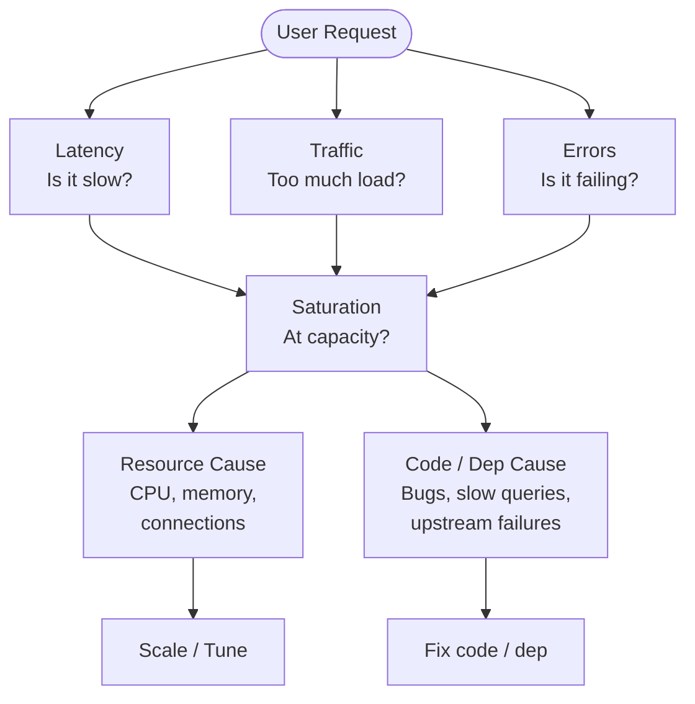
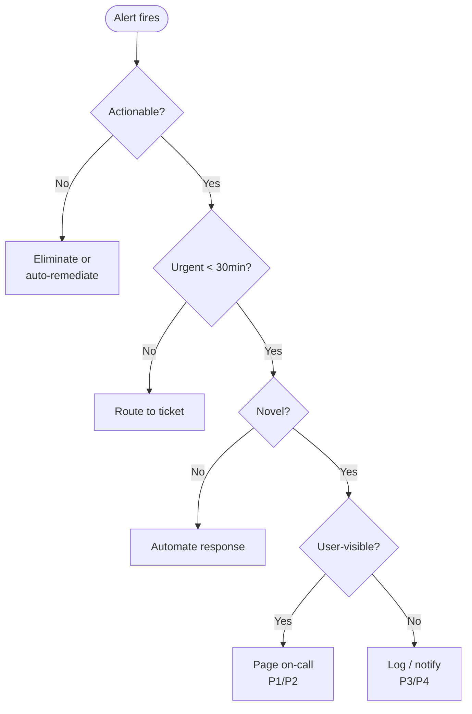

## Keywords in This File

{: .no_toc }

| #   | Keyword | Weight |
| --- | ------- | ------ |
| 1   | [Four Golden Signals](#four-golden-signals---latency-traffic-errors-saturation) | critical |
| 2   | [Alert Design and On-Call Hygiene](#alert-design-and-on-call-hygiene) | high |

---

# Four Golden Signals - Latency, Traffic, Errors, Saturation

🎯 Interview Weight: critical - the foundational monitoring
framework for any service; naming and explaining all four
with examples is a table-stakes SRE interview question.

---

### 🎯 Model Answer

**30 seconds:**
> The four golden signals are the minimum set of metrics needed to
> understand the health of any request-driven service. Latency: how
> long requests take. Traffic: how much load the service is handling.
> Errors: what fraction of requests fail. Saturation: how full the
> service is. If you monitor only these four, you can detect almost
> every user-visible service problem.

**3 minutes (Senior):**
> The four golden signals were defined in the Google SRE book as the
> most important metrics for any service. They form a diagnostic
> hierarchy: errors and latency tell you if users are being impacted
> right now; traffic tells you the scale of impact and whether the
> issue is load-related; saturation tells you where the system is
> approaching its limits.
>
> Latency must be measured as a distribution, not an average. An
> average latency of 200ms can hide a bimodal distribution: 99% of
> requests at 10ms and 1% at 20 seconds. The p99 and p999 latency
> values reveal the tail behavior that affects the worst-impacted
> users. For an SLI, latency is expressed as the fraction of requests
> completing below a threshold - not as a single percentile value.
>
> Errors should include all failure types: HTTP 5xx (server errors),
> HTTP 4xx that should not occur (404 from valid URLs, 429 from
> appropriate traffic), and successful responses that carry incorrect
> data (logical errors). The hardest errors to detect are the last
> kind - a service that returns 200 OK with incorrect content looks
> healthy to standard error rate monitoring.
>
> Saturation predicts future degradation before it happens. A CPU at
> 90% utilization is a saturation signal: the service is approaching
> capacity, and a traffic spike will push it over. Saturation metrics
> are leading indicators; errors and latency are lagging indicators.
>
> In practice, the four golden signals are the floor, not the ceiling.
> Most services add domain-specific signals on top: queue depth, cache
> hit rate, active connection count. The golden signals ensure no
> user-visible issue goes undetected; domain signals enable faster root
> cause analysis.

**Framework:** WHAT -> WHY -> HOW -> TRADE-OFF -> EXAMPLE

*Adapting up:* Staff adds: "The four golden signals are the user-
experience layer of observability. Below them sit the USE metrics
(Utilization, Saturation, Errors) for infrastructure, and distributed
tracing for request-path attribution. The golden signals tell you
something is wrong; tracing tells you where in the call graph it
is wrong."

*Adapting down:* Junior: "Four numbers you always monitor: how
fast requests are (latency), how many requests there are (traffic),
how many fail (error rate), and how close to full the system is
(saturation). Together they tell you whether your service is healthy
right now."

**Blank Mind Recovery:**

**(1) Restate:** "You are asking about the four golden signals -
let me walk through each one and why each is essential."

**(2) First principles:** "From first principles, a request-driven
service can fail in exactly four ways a user notices: it is slow
(latency), it is overloaded (traffic/saturation), it fails
(errors), or it is about to fail (saturation). One signal per
failure mode."

**(3) Bridge:** "The four golden signals are like the four vital
signs in medicine: blood pressure (saturation - system pressure),
heart rate (traffic - load rate), temperature (errors - something
is wrong), and respiration rate (latency - how quickly the system
processes). All four together give a complete health picture."

---

### 📘 Concept Explanation

**What it is:**
The four golden signals are the minimum set of metrics from which
any user-visible service problem can be detected. Defined in the
Google SRE book, they provide a consistent monitoring baseline for
any request-driven service regardless of technology or architecture.

**The problem it solves:**
Without a standard monitoring framework, teams monitor different
metrics for different services, making it hard to compare health
across services, train new engineers, or apply consistent alerting
standards. The four golden signals provide a common vocabulary and
minimum coverage guarantee.

**How it works:**

```
FOUR GOLDEN SIGNALS
===================

1. LATENCY - how long requests take
   Measure: distribution (p50, p95, p99, p999)
   Express as SLI: fraction of requests < threshold
   Key rule: measure separately for success and error
     (errors are often fast - 5ms 500 response
      inflates availability of "fast" failures)
   Symptom of: slow code, resource contention, DB lag

2. TRAFFIC - how much load the service handles
   Measure: requests/second, bytes/second,
     transactions/second (domain-appropriate unit)
   Key use: establishes baseline for anomaly detection;
     sudden traffic drops often indicate upstream issues;
     sudden traffic spikes precede saturation
   Symptom of: traffic spikes before saturation events

3. ERRORS - what fraction of requests fail
   Measure: error rate = errors/total requests
   Include: explicit 5xx, implicit (200 OK + bad data),
     policy violations (missing SLA responses)
   Key rule: distinguish between error categories
     5xx = service error (actionable by SRE)
     4xx = client error (may or may not be actionable)
   Symptom of: code bugs, dependency failures, data issues

4. SATURATION - how full the service is
   Measure: % of capacity used per constrained resource
   Common: CPU %, memory %, connection pool %, queue depth
   Key rule: identify the CONSTRAINED resource
     (the one that reaches 100% first)
   Leading indicator: precedes latency and error increases
   Symptom of: capacity issues, resource leaks, traffic growth

RELATIONSHIP
  Saturation -> Latency increases -> Errors spike
  (saturation predicts; errors/latency confirm)
  Traffic provides context for all three

MONITORING MINIMUM
  If monitoring only 4 metrics:
    error_rate, p99_latency, rps, cpu_utilization
  If monitoring 8 metrics: add
    p50_latency, p999_latency, memory_%, queue_depth
```

> **Code walkthrough:** This Latency, Traffic, Errors, Saturation example demonstrates a key concept in practice. **KEY MECHANISM:** the runtime executes these instructions in sequence with specific memory and execution semantics. **WHY IT MATTERS:** misapplying this pattern causes subtle bugs that only manifest under production load. **TAKEAWAY: understand the execution model before using this pattern in production code.**

**The key insight:**
Saturation is the only leading indicator among the four. Errors
and latency are lagging - they confirm degradation that users are
already experiencing. Saturation signals that degradation is coming.
A service at 85% CPU utilization with normal latency and error rates
is 15% away from saturation-driven degradation. Saturation alerts
are the most actionable for proactive capacity management.

**When to use it:**
Apply the four golden signals as the baseline monitoring for every
production service. They are the minimum required for a Production
Readiness Review. For batch and streaming services, adapt the
signals: latency becomes processing time, traffic becomes throughput
or record processing rate, saturation becomes queue depth and
consumer lag.

**When NOT to use it:**
The four golden signals are request-centric. For infrastructure
components (databases, load balancers, message queues), the USE
metrics (Utilization, Saturation, Errors) per resource are more
appropriate. For batch services, throughput and freshness SLIs
complement or replace latency.

**Alternatives:**
- RED metrics (Rate, Errors, Duration) - simpler, 3-metric version
  for microservices (omits saturation)
- USE metrics (Utilization, Saturation, Errors) - resource-focused,
  appropriate for infrastructure
- DORA metrics (deployment-focused, different dimension)

**First-principles derivation:**
A request-driven service has exactly four observable failure modes
from the user's perspective: the request is slow (latency), the
request fails (errors), there are too many requests for the service
to handle (saturation), and the volume of requests is changing
(traffic). These four dimensions cover the complete user-visible
failure space, which is why monitoring them is sufficient for
detecting all user-visible problems.

---

### 💻 Code Example

**Example 1: Four golden signals in Prometheus (wrong vs right)**


```promql
# BAD: anti-pattern shown for contrast
# This approach has the issues the GOOD example fixes
```

```promql
# BAD: monitoring infrastructure metrics only
# - CPU high/low
# - Memory usage
# These tell you about the server, not user experience.
node_cpu_seconds_total
node_memory_MemFree_bytes

# GOOD: Four golden signals implementation

# 1. LATENCY SLI (fraction of requests < 200ms)
sum(rate(http_request_duration_seconds_bucket{
  le="0.2"
}[5m]))
/
sum(rate(http_request_duration_seconds_count[5m]))

# 2. TRAFFIC (requests per second)
sum(rate(http_requests_total[5m]))

# 3. ERROR RATE (fraction of 5xx responses)
sum(rate(http_requests_total{
  status=~"5.."
}[5m]))
/
sum(rate(http_requests_total[5m]))

# 4. SATURATION (CPU utilization fraction)
1 - avg(rate(
  node_cpu_seconds_total{mode="idle"}[5m]
))
# Complement of idle fraction = utilization
```

> **Code walkthrough:** The BAD approach monitors infrastructureice. **KEY MECHANISM:** the runtime executes these instructions in sequence with specific memory and execution semantics. **WHY IT MATTERS:** misapplying this pattern causes subtle bugs that only manifest under production load. **TAKEAWAY: understand the execution model before using this pattern in production code.**
> (CPU seconds, memory bytes) - valid for capacity planning but
> not for user-experience monitoring. The GOOD approach implements
> all four golden signals as Prometheus queries. The latency signal
> uses the histogram bucket approach to compute the SLI ratio.
> The traffic signal is requests/second - a baseline for anomaly
> detection. The error rate divides 5xx responses by total. The
> saturation signal computes CPU utilization from the complement
> of idle time. Together these four queries cover all user-visible
> failure modes.

**Example 2: Identifying the constrained resource for saturation**


```promql
# BAD: anti-pattern shown for contrast
# This approach has the issues the GOOD example fixes
```

```promql
# BAD: monitoring only CPU for saturation
# Service may saturate on connections, memory, or
# threads before CPU reaches 100%.
avg(rate(node_cpu_seconds_total{mode!="idle"}[5m]))
# Returns: 0.60 = 60% CPU (looks fine)

# But the service may be connection-pool exhausted:

# GOOD: monitor all constrained resources
# Connection pool saturation (HikariCP example):
hikaricp_connections_active
/ hikaricp_connections_max
# Returns: 0.98 = 98% pool exhausted
# This will cause latency spikes before CPU hits 100%

# Thread pool saturation:
jvm_threads_live_threads
/ jvm_threads_peak_threads
# Queue depth (Kafka consumer):
kafka_consumer_group_lag_sum{group="my-service"}
# Memory saturation:
(jvm_memory_used_bytes / jvm_memory_max_bytes)
```

> **Code walkthrough:** The BAD approach monitors only CPU, whichice. **KEY MECHANISM:** the runtime executes these instructions in sequence with specific memory and execution semantics. **WHY IT MATTERS:** misapplying this pattern causes subtle bugs that only manifest under production load. **TAKEAWAY: understand the execution model before using this pattern in production code.**
> is often not the first resource to saturate. A Java service will
> often exhaust its database connection pool (98% full, causing
> queue buildup) while CPU is at 60% - the service looks healthy by
> CPU metrics but is already degraded. The GOOD approach monitors
> all constrained resources. The key is knowing which resource is
> the bottleneck for your specific service: connection pool for
> database-heavy services, thread pool for I/O-bound services,
> memory for caches, queue depth for consumers.

**Example 3: Separating success and error latency**

```promql
# BAD: measuring latency for all requests
# (includes fast error responses which hide slow successes)
histogram_quantile(0.99,
  rate(http_request_duration_seconds_bucket[5m])
)
# p99 = 50ms (looks great)
# But: errors return in 5ms (fast), successes take 500ms
# The fast errors pull the p99 DOWN, hiding latency problem.

# GOOD: measure latency for successful requests only
histogram_quantile(0.99,
  rate(http_request_duration_seconds_bucket{
    status=~"2.."
  }[5m])
)
# p99 success latency = 500ms (the real user experience)

# Separately track error rate and error latency:
histogram_quantile(0.99,
  rate(http_request_duration_seconds_bucket{
    status=~"5.."
  }[5m])
)
# p99 error latency = 5ms (fast failures - useful signal)
```

> **Code walkthrough:** The BAD approach measures latency for allice. **KEY MECHANISM:** the runtime executes these instructions in sequence with specific memory and execution semantics. **WHY IT MATTERS:** misapplying this pattern causes subtle bugs that only manifest under production load. **TAKEAWAY: understand the execution model before using this pattern in production code.**
> requests. Fast error responses (a 5ms 500 error is "fast") pull
> the aggregate p99 down, masking the slow success path. A service
> with 10% errors at 5ms each and 90% successes at 500ms will show
> a blended p99 around 400ms - which looks better than the 500ms
> users actually experience for successful operations. The GOOD
> approach separates success and error latency. Success latency is
> the user experience for fulfilled requests; error latency reveals
> whether errors are fast-fail (good) or slow-timeout (bad).

---

### 🎓 Answers by Seniority

**Junior / Mid (0-5 years):**
> The four golden signals are the minimum monitoring set for any
> service: latency (how long requests take), traffic (how many
> requests per second), errors (what fraction fail), and saturation
> (how close to capacity the service is). If all four are in normal
> ranges, the service is healthy. If any is anomalous, there is
> likely a user-visible problem. The SRE book defines these as the
> minimum, not the maximum - most services add domain-specific
> signals on top.

*Push deeper:* Explain why saturation is the only leading indicator.
Errors and latency are lagging (users already affected). Saturation
predicts degradation before it reaches users. This is why saturation
alerts can enable proactive capacity scaling.

---

**Senior / Staff (5+ years):**
> The four golden signals are the user-experience layer of a three-
> layer observability model. The golden signals tell you something
> is wrong from the user's perspective. Below them sit the USE metrics
> (Utilization, Saturation, Errors per resource) for infrastructure
> diagnosis. Below those sit distributed traces for request-path
> attribution to find where in the call chain the problem originates.
>
> The most common gap I see: teams monitor errors and latency but
> skip saturation. They then experience a pattern where everything
> looks normal, then latency spikes suddenly, then errors spike.
> The saturation signal (connection pool at 95%, thread pool at 90%)
> was the early warning they missed.

*Push deeper:* Staff angle: "The four golden signals combined with
burn rate alerting give you a complete SLO monitoring system.
Signals detect degradation; burn rate translates degradation into
business impact (how fast is the error budget being consumed?).
The combination eliminates both false positives (noise) and false
negatives (missed slow degradations)."

---

### ⚠️ Common Misconceptions

| Misconception | Reality |
|---|---|
| Average latency is sufficient for latency monitoring | Averages hide bimodal distributions; p99 and p999 latency reveal tail behavior that affects the worst-impacted users |
| All 4xx responses are client errors and should be excluded from error rate | 404s from valid internal API calls indicate routing problems; 429s from legitimate traffic indicate capacity issues; not all 4xx are client errors |
| CPU utilization is the best saturation metric | The constrained resource varies by service; a Java web service often saturates on database connections long before CPU reaches 100% |
| Traffic is just a nice-to-have context metric | Sudden traffic drops are often the first signal of upstream failures or DNS issues; traffic is as important for anomaly detection as errors |
| The four golden signals are enough for full observability | They are sufficient for detecting user-visible problems, but not for diagnosing root causes; tracing, profiling, and logs are needed for diagnosis |

---

### 🚨 Failure Modes and Diagnosis

**Failure 1: Service degraded but golden signals look normal**

*Symptom:* Users reporting slow performance. Error rate: 0%.
p99 latency: 180ms (below 200ms threshold). Saturation: 70%.
Traffic: normal. No alerts firing. Support tickets increasing.

*Root cause:* The SLI threshold is too generous - the service
is slower than users expect but not slow enough to breach the
200ms SLI threshold. The SLI captures the fraction below the
threshold, not the absolute latency.

*Diagnostic:*
```promql
# Check latency distribution more granularly
histogram_quantile(0.50,  # p50
  rate(http_request_duration_seconds_bucket[5m]))
# p50: 120ms (normal)
histogram_quantile(0.95,  # p95
  rate(http_request_duration_seconds_bucket[5m]))
# p95: 190ms (near threshold)
histogram_quantile(0.999, # p999
  rate(http_request_duration_seconds_bucket[5m]))
# p999: 2500ms (PROBLEM - 0.1% of users seeing 2.5s)
```

> **Code walkthrough:** This 0.1% of users seeing 2.5s) example demonstrates a key concept in practice. **KEY MECHANISM:** the runtime executes these instructions in sequence with specific memory and execution semantics. **WHY IT MATTERS:** misapplying this pattern causes subtle bugs that only manifest under production load. **TAKEAWAY: understand the execution model before using this pattern in production code.**

*Fix:* Add a p999 latency SLI in addition to the p99 threshold SLI.
The tail latency at p999 is often the canary for broader latency
problems. Investigate the 0.1% of requests taking 2.5 seconds.

*Prevention:* When designing SLIs, include at least one latency
SLI at the tail (p99 or p999 threshold). Absolute latency percentiles
complement the ratio-based SLI for monitoring.

**Failure 2: Error rate at 0% during total outage**

*Symptom:* Complete service outage. Users cannot connect. But
the error rate dashboard shows 0%. No alerts fired.

*Root cause:* Error rate is measured as (5xx / total requests).
During a DNS failure or load balancer outage, no requests reach
the service - both numerator and denominator are 0. Division by
zero produces no alert.

*Diagnostic:*
```promql
# Check traffic simultaneously with error rate
sum(rate(http_requests_total[5m]))
# Returns: 0 (no traffic at all)
# Traffic dropped to zero = upstream failure
# Error rate 0/0 = undefined, not "healthy"

# Add synthetic monitoring to detect this:
probe_success{job="blackbox"}
# External probe failing = connectivity issue
```

> **Code walkthrough:** This External probe failing = connectivity issue example demonstrates a key concept in practice. **KEY MECHANISM:** the runtime executes these instructions in sequence with specific memory and execution semantics. **WHY IT MATTERS:** misapplying this pattern causes subtle bugs that only manifest under production load. **TAKEAWAY: understand the execution model before using this pattern in production code.**

*Fix:* Add a traffic floor alert: if traffic drops below 10% of
normal baseline, alert even if error rate is 0. Also add synthetic
monitoring (external probes) to detect connectivity failures.

*Prevention:* When monitoring error rate, always monitor traffic
in conjunction. "Error rate 0% with traffic 0" should be an alert,
not a green signal.

**Failure 3: Connection pool saturation not monitored**

*Symptom:* Service experiences periodic 30-second latency spikes
under normal load. CPU is at 40%. Memory is fine. No 5xx errors.
Pattern correlates with specific database queries.

*Root cause:* Database connection pool is undersized. During peak
sub-second query bursts, the pool exhausts. New requests queue.
When connections are released, queued requests burst through.
CPU and memory show no anomaly.

*Diagnostic:*
```promql
# Check connection pool metrics
hikaricp_connections_active{pool="default"}
# Returns: 10 (10 active)
hikaricp_connections_max{pool="default"}
# Returns: 10 (pool max is 10)
# Pool is 100% saturated - this is the bottleneck

# Correlation: queue time appears in JVM monitoring
hikaricp_connections_acquire_ms{quantile="0.99"}
# Returns: 28000 (28 second wait for a connection)
```

> **Code walkthrough:** This Returns: 28000 (28 second wait for a connection) example demonstrates a key concept in practice. **KEY MECHANISM:** the runtime executes these instructions in sequence with specific memory and execution semantics. **WHY IT MATTERS:** misapplying this pattern causes subtle bugs that only manifest under production load. **TAKEAWAY: understand the execution model before using this pattern in production code.**

*Fix:* Increase connection pool size or optimize query patterns
to reduce connection hold time. Add pool saturation alert at 80%.

*Prevention:* Monitor connection pool saturation explicitly as
part of the saturation golden signal implementation. CPU alone
is insufficient.

---

### 🎯 Interview Deep-Dive

| Preparation | Target |
|---|---|
| Time to prep | 20 minutes |
| Core themes | All four signals with examples, leading vs lagging, USE vs golden signals |
| Seniority signal | Junior: names all four; Senior: explains saturation as leading indicator |
| Common trap | Forgetting saturation or treating average latency as sufficient |
| Staff differentiator | Observability layers (golden signals + USE + tracing), burn rate connection |

---

**Q1 [JUNIOR]: What are the four golden signals and what does
each measure?**

*Why they ask:* Table-stakes SRE vocabulary. Naming all four
with definitions is required.

*Likely follow-up:* "Which of the four is the most important?"

The four golden signals are defined in the Google SRE book:

Latency: how long requests take to complete. Measured as a
distribution (p50, p95, p99). Key rule: measure success and error
latency separately. Errors are often fast (5ms timeout) and can
dilute the apparent latency of slow successes.

Traffic: the volume of demand on the service. Measured as
requests per second, bytes per second, or transactions per second.
Establishes the baseline for anomaly detection. Sudden drops signal
upstream failures.

Errors: the rate of failed requests. Measured as (5xx or failed)
/ total. Includes both explicit errors (HTTP 5xx) and implicit errors
(200 OK with corrupt data). The most direct measure of user impact.

Saturation: how full the service is relative to its capacity.
Measured as percentage of the most constrained resource (CPU,
memory, connection pool, thread pool, queue depth). The only
leading indicator among the four.

None is "most important" in isolation - they form a diagnostic
hierarchy. Saturation predicts problems, errors confirm them, and
latency characterizes the user experience.

*What separates good from great:* Most candidates name all four.
Great candidates explain the saturation-as-leading-indicator
distinction and the success/error latency separation.

---

**Q2 [MID]: Why should success and error latency be measured
separately?**

*Why they ask:* Operational depth question. The blended latency
trap is common in real monitoring implementations.

*Likely follow-up:* "When would a low p99 latency be misleading?"

Error responses are often fast because they fail early: a timeout
check, an authentication failure, a circuit breaker trip. These
return in 2-5ms. Success responses take the full processing path
and may take 200ms+.

If you measure blended latency (all requests, success and error),
the fast errors pull the average and percentiles down. A service
with 20% errors (each 5ms) and 80% success (each 400ms) has a
blended "average" latency of 321ms. The p99 will appear better
than it is because the fast-error responses count in the distribution.

This is misleading in two ways. First, users who succeed have
a 400ms experience, not the blended 321ms. Second, users who
get errors get a fast response, but a failed response is not
"fast" from the user's perspective - it is just a fast failure.

The right approach: one latency SLI for success latency (what users
who succeed experience), one error rate SLI (what fraction fail),
and optionally an error latency signal (are errors fast-fail or
slow-timeout?).

*What separates good from great:* Most candidates are not aware
of the blended latency trap. Great candidates explain the mathematical
effect of fast errors on aggregate latency and describe the separate
signal design.

---

**Q3 [MID]: What is the relationship between the four golden
signals and the USE metrics framework?**

*Why they ask:* Framework comparison question testing breadth
of monitoring knowledge.

*Likely follow-up:* "When would you use USE metrics instead of
the golden signals?"

The four golden signals and the USE metrics (Utilization, Saturation,
Errors per resource) answer different questions.

Golden signals answer: "Is the service providing a good experience
to users?" They are user-facing metrics. If errors are up and latency
is high, users are impacted regardless of the cause.

USE metrics answer: "What is the health of each resource the service
uses?" Utilization (what fraction of resource capacity is in use),
Saturation (is demand exceeding capacity?), and Errors (are there
errors at the resource level?). USE metrics help diagnose what is
causing the golden signal degradation.

The workflow: golden signals detect the user-visible problem;
USE metrics diagnose the resource-level root cause. If error rate
is up (golden signal), use USE metrics to find which resource is
causing it: CPU at 100% (saturation)? Disk I/O errors (errors)?
Memory at 98% with swapping (saturation + implicit errors)?

Apply golden signals to services (request-driven systems). Apply
USE metrics to infrastructure (CPUs, disks, network interfaces,
databases).

*What separates good from great:* Most candidates know one framework
or the other. Great candidates explain the diagnostic relationship:
golden signals detect, USE metrics diagnose.

---

**Q4 [SENIOR]: How do you implement saturation monitoring for
a Java microservice backed by a connection pool?**

*Why they ask:* Production implementation question that tests
whether the candidate can apply the saturation signal to a
specific technology stack.

*Likely follow-up:* "What alert thresholds would you set for
connection pool saturation?"

For a Java service using HikariCP (the standard connection pool),
saturation monitoring requires exposing HikariCP metrics to
Prometheus via the Micrometer integration.

The key saturation metrics:

```promql
# Pool utilization (active / max)
hikaricp_connections_active / hikaricp_connections_max
# Alert at > 0.8 (80% - gives time to respond before full)

# Connection acquisition time (leading indicator
# of pool exhaustion - requests waiting for connections)
histogram_quantile(0.99,
  rate(hikaricp_connections_acquire_seconds_bucket[5m])
)
# Alert at > 0.1 seconds (100ms acquisition wait)

# Pool timeout rate (requests that couldn't get connection)
rate(hikaricp_connections_timeout_total[5m])
# Alert on any non-zero rate
```

> **Code walkthrough:** This Alert on any non-zero rate example demonstrates a key concept in practice. **KEY MECHANISM:** the runtime executes these instructions in sequence with specific memory and execution semantics. **WHY IT MATTERS:** misapplying this pattern causes subtle bugs that only manifest under production load. **TAKEAWAY: understand the execution model before using this pattern in production code.**

The pool saturation alert hierarchy: 80% utilization (warning,
investigate before peak traffic), 95% utilization (critical, scale
pool or reduce query rate immediately), timeout events (page
immediately - users are failing).

The root cause decision tree when pool is saturating: increase
pool size (if DB can handle more connections), optimize queries
to hold connections for shorter duration, add a connection pool
proxy (PgBouncer for PostgreSQL), or scale horizontally to
distribute the load.

*What separates good from great:* Most candidates describe generic
saturation monitoring. Great candidates give specific metric names,
thresholds, and the root cause decision tree for connection pool
saturation.

---

**Q5 [SENIOR]: How do the four golden signals change for a
streaming or batch service compared to a request-driven service?**

*Why they ask:* Framework adaptation question. Not all services
are request-driven; this tests whether the candidate can apply
the model flexibly.

*Likely follow-up:* "What are the golden signals for a Kafka
consumer service?"

For a request-driven service, the golden signals map directly:
HTTP requests map naturally to latency (duration per request),
traffic (requests/second), errors (5xx rate), and saturation
(connection pool, CPU).

For a Kafka consumer service, the signals must be adapted:

Latency -> Processing time (how long does processing one message
take?) or end-to-end latency (time from message publish to
successful processing).

Traffic -> Throughput (messages consumed per second) or records
processed per second.

Errors -> Processing error rate (messages that fail to process
and are sent to a dead letter queue or skipped).

Saturation -> Consumer group lag (the number of unprocessed
messages in the queue). This is the most important streaming
saturation signal: if lag is growing, the consumer cannot keep
up with production and will eventually fall behind permanently.

For a batch ETL service:

Latency -> Job duration (how long the batch job runs).
Traffic -> Records processed per run.
Errors -> Failed record rate (records that fail to transform or load).
Saturation -> Queue depth of pending jobs, or job backlog.

*What separates good from great:* Most candidates describe golden
signals for HTTP services only. Great candidates adapt each signal
to the service type and give specific metrics for streaming services.

---

**Q6 [SENIOR]: BEHAVIORAL: Tell me about a time you used the
four golden signals to diagnose a production incident.**

*Why they ask:* Real-world application question. Tests whether the
candidate has actually used the framework under pressure.

*Likely follow-up:* "What would you do differently in hindsight?"

**Situation:** A payment processing service started generating
customer support calls about failed payments. The error rate
dashboard showed 2% error rate (below the 5% alert threshold).
Latency was normal (p99 = 150ms). Saturation (CPU) was at 55%.
Traffic was 10% above normal (typical for the time of day).

**Task:** Determine whether the situation warranted incident
declaration and find the root cause.

**Action:** The combination of 2% error rate on a payment service
combined with normal CPU and latency was suspicious - payment
failures should be near-zero. I checked the error rate at a finer
granularity: the errors were concentrated on the credit card
processor integration endpoint (one of four payment methods).
Then I checked the saturation signal more carefully: the external
API call queue depth for the processor integration was at 95%
(not in the standard saturation dashboard).

The credit card processor was experiencing degraded API response
times. Requests were queuing in our integration layer. The queue
saturation was the signal that explained everything: the processor
was slow (causing their timeout threshold to be exceeded), payments
were failing, but our service was returning fast 500s so overall
p99 latency looked fine.

**Result:** Declared P2 incident. Activated processor failover
to secondary provider. Customer impact duration: 22 minutes. The
queue depth metric was added to the standard saturation dashboard.

*What separates good from great:* Most candidates describe golden
signals theoretically. Great candidates describe a specific incident
with the diagnostic sequence: which signal was anomalous, what that
led them to investigate, and what the root cause was.

---

**Q7 [STAFF]: How do you design a golden signals dashboard
that is useful under incident pressure?**

*Why they ask:* Operational design question for staff candidates
building monitoring infrastructure.

*Likely follow-up:* "What are the most common dashboard design
mistakes?"

A golden signals dashboard under incident pressure must satisfy
three constraints: instant comprehension (what is wrong in 10
seconds?), drill-down capability (where specifically is it wrong?),
and time-range flexibility (when did it start?).

The top-level layout: one row per golden signal, one panel per
major service component. The panels should use traffic-light color
coding (green/yellow/red) against SLO thresholds so the on-call
can glance at the dashboard and identify the affected signal and
component in 10 seconds or less.

The drill-down design: every panel is clickable and leads to a
detailed view of that signal with percentiles, breakdown by status
code, and breakdown by API endpoint or path. The detailed view
enables the "which endpoint?" question that the top-level panel
cannot answer.

Time range: default to the last 30 minutes (enough to see the
onset of most incidents) with quick-select buttons for 1h, 6h,
24h, and 7 days. The 7-day view is critical for correlating with
the last deployment.

Common dashboard mistakes: too many panels (cognitive overload
under pressure), no color coding (requires reading numbers under
stress), panels that aggregate across services (hides which
service is affected), and wrong time scale (1-second resolution
for a 24-hour window is unusable).

*What separates good from great:* Most candidates describe which
metrics to show. Great candidates describe the information architecture
for incident use (instant comprehension first, drill-down second)
and name specific anti-patterns.

---

**Q8 [STAFF]: How do you extend the four golden signals for
a multi-tenant SaaS service?**

*Why they ask:* Staff-level platform design question testing whether
the golden signals model scales to complex deployment patterns.

*Likely follow-up:* "What is a noisy tenant and how do the golden
signals help detect one?"

For a multi-tenant service, the four golden signals must be
segmented by tenant tier and, for the highest-priority tenants,
by individual tenant. This creates a two-level monitoring structure:

Level 1 (service-wide): the standard four golden signals aggregate
across all tenants. Used for overall service health, SLO compliance
reporting, and capacity planning.

Level 2 (tenant-level): the same four signals broken down by tenant
ID or tenant tier label. Used for per-tenant SLA monitoring and
noisy tenant detection.

A noisy tenant is detected when a specific tenant's traffic or
error signals are significantly above the per-tenant average.
If Tenant A generates 40% of all traffic (when they represent 5%
of the customer base) or 70% of all errors, they are a noisy tenant
affecting the service's aggregate golden signals.

The operational response: rate limit the noisy tenant (traffic
saturation), route them to isolated infrastructure (prevent error
propagation to other tenants), or engage them directly (if the
traffic pattern is legitimate and indicates a growth event requiring
capacity planning).

For enterprise SLAs: expose tenant-specific golden signal dashboards
to enterprise account managers and, with care, to the enterprise
customer directly (so they can self-serve health monitoring).

*What separates good from great:* Most candidates describe golden
signals per-service. Great candidates design the two-level monitoring
structure, describe noisy tenant detection specifically, and
mention enterprise customer-facing monitoring as a value add.

---

**Q9 [STAFF]: What is the relationship between the four golden
signals and distributed tracing?**

*Why they ask:* Advanced observability architecture question for
staff candidates building or selecting observability platforms.

*Likely follow-up:* "When does tracing add value beyond the
four golden signals?"

The four golden signals and distributed tracing answer different
questions at different levels of detail.

Golden signals at the service level tell you: "Service A has a
2% error rate and p99 latency of 800ms." This tells you something
is wrong and which service is affected.

Distributed tracing at the request level tells you: "The 800ms
p99 for Service A is caused by a 750ms database query in the
UserService.authenticate() method, called from ServiceA.processOrder()
every third request when the session cache is cold." This tells
you exactly where the problem is in the code path.

Tracing adds value beyond golden signals when: the golden signals
indicate a problem but the cause is not a resource saturation issue
(which USE metrics would reveal); the problem involves a specific
code path or request pattern; the problem involves latency contributed
by one specific downstream service in a complex call chain; or
you need to prove that a specific code change caused a latency
regression.

The observability stack design: golden signals for detection and
SLO measurement (always-on, low cardinality), USE metrics for
infrastructure diagnosis (always-on, per-resource), structured
logs for business context (always-on, high volume), and traces
for deep request-path analysis (sampled, high cost). All four
layers are needed for full production observability.

*What separates good from great:* Most candidates describe tracing
as the most important observability tool. Great candidates place
it in the four-layer observability model, explain when it adds
value beyond what golden signals provide, and describe the cost-
benefit of sampled vs. full tracing.

---

### ⚖️ Comparison Table

| Framework | Signals | Level | Best for | Limitation |
|---|---|---|---|---|
| Four Golden Signals | Latency, Traffic, Errors, Saturation | Service | User-visible health monitoring | Does not diagnose root cause |
| RED (Rate, Errors, Duration) | 3 signals | Service | Microservice request monitoring | Omits saturation |
| USE (Utilization, Saturation, Errors) | 3 signals per resource | Infrastructure | Resource capacity diagnosis | Not user-experience focused |
| DORA Metrics | Deployment frequency, lead time, change fail rate, MTTR | CI/CD pipeline | Delivery performance | Not real-time monitoring |
| Apdex | Combined availability + latency index | Service | Single health score | Loses signal detail in one number |

---

### 🏛️ System Design

*(Omit: Four Golden Signals is a monitoring framework keyword, not
a system architecture keyword. System design context appears in
the L4 Production Diagnostics file where monitoring architecture
for large-scale systems is addressed.)*

---

### 📊 Diagram

```
FOUR GOLDEN SIGNALS DIAGNOSTIC FLOW
====================================
           User Request
               |
   +-----------+-----------+
   |           |           |
   v           v           v
LATENCY    TRAFFIC     ERRORS
(slow?)  (too much?)  (failing?)
   |           |           |
   v           v           v
         SATURATION
       (at capacity?)
               |
    +----------+----------+
    |                     |
    v                     v
  CAUSE               CAUSE
(resource)           (code/deps)
```



> **Diagram walkthrough:** The four golden signals form a diagnostic
> hierarchy. Every user-visible problem manifests in at least one
> of the first three signals (latency, traffic, errors). Saturation
> is the common underlying cause: a saturated resource causes both
> latency increases and error spikes. The saturation signal thus
> bridges detection (golden signals) and root cause (resource vs.
> code/dependency). Monitoring all four creates a complete detection
> and diagnostic framework.

---

### Field Q&A

**Production Failures:**

1. A payment service's error rate spiked to 15% for 12 minutes before
   the alert fired. The p99 latency was 50ms (well within SLO) throughout.
   What happened?
   > The service was returning fast errors (low latency 500s). The error
   > rate alert threshold was too high or the evaluation window too long.
   > Fast errors keep p99 low while the error rate climbs. Root cause:
   > downstream payment processor returned errors quickly. Fix: set error
   > rate alert at 1% for payment services (zero-tolerance threshold),
   > and ensure multi-window burn rate alerting is active.

2. On-call received a saturation alert at 11 PM: CPU at 95%. They
   investigated, found CPU normal at 60%, and went back to sleep. The
   incident escalated at 3 AM with customers unable to log in.
   What was missed?
   > The CPU alert at 11 PM fired correctly. The SRE checked CPU (which
   > had self-corrected after a traffic burst) but did not check the
   > other saturation signals. At 11 PM, the thread pool was exhausted
   > (sessions queuing). CPU recovered as traffic subsided, but the
   > session state corruption from the thread pool exhaustion remained.
   > Fix: when a saturation alert fires, check ALL constrained resources,
   > not just the one that triggered the alert.

3. A service showed 100% success rate (no errors) during a 45-minute
   period where users reported inability to use the search feature.
   The SLI showed green.
   > Classic "implicit error" scenario. The search service was returning
   > HTTP 200 with empty result sets instead of actual results. The SLI
   > measured HTTP success rate (2xx / total) - all 200s counted as
   > "good." The logical failure (empty results) was not captured. Fix:
   > add a content validation probe - a synthetic test that not only
   > checks HTTP 200 but verifies the response contains expected fields.
   > Synthetic monitoring with content validation catches implicit errors.

---

**Candidate Mistakes:**

1. "Our p99 latency is 150ms and SLO is 200ms, so we are fine."

   **What NOT to say:** Do not present p99 compliance as complete
   latency health confirmation.

   **Say instead:** "P99 compliance is necessary but not sufficient. I also
   check p999 for tail latency outliers, separate success and error latency
   to avoid masking problems, and look at the absolute values (is p50
   drifting up, which precedes p99 degradation?). The SLO says 99% must
   be below 200ms - but if p95 is 190ms and trending up, we are one traffic
   spike away from a breach."

2. "We monitor CPU, memory, and disk for saturation - that covers it."

   **What NOT to say:** Do not present infrastructure resource saturation
   as covering all saturation signals.

   **Say instead:** "Infrastructure resources are one category of saturation.
   Application-layer saturation (database connection pools, thread pools,
   queue depths) often saturates before infrastructure. I add saturation
   monitoring for the application-layer constraints specific to the
   technology stack: HikariCP pool metrics for Java services, goroutine
   counts for Go, connection limits for Redis."

3. "Error rate 0% means the service is healthy."

   **What NOT to say:** Do not equate zero error rate with service health.

   **Say instead:** "Zero error rate is a necessary but not sufficient
   health signal. I also check traffic (zero errors during zero traffic
   is not healthy), latency (service could be slow even with no errors),
   and implicit errors (200 OK with empty/incorrect responses). For payment
   or authentication services, I use synthetic probes that validate business
   logic, not just HTTP status codes."

4. "Average latency is 120ms, we are well within our 200ms SLO."

   **What NOT to say:** Do not use average latency as an SLI.

   **Say instead:** "Average latency hides the distribution. I use the
   fraction of requests below the threshold (the SLI ratio) and look at
   multiple percentiles: p50 for typical experience, p95 for most users,
   p99 for the SLI threshold, p999 for the worst-impacted users. An average
   of 120ms with p999 of 10 seconds means 0.1% of users are experiencing
   terrible service."

---

**Questions to Ask the Interviewer:**

1. "What monitoring stack does the team currently use - Prometheus and
   Grafana, Datadog, or something else - and how standardized are the
   four golden signals across services?"

2. "When was the last time a service was onboarded without a golden
   signals dashboard? What was the consequence?"

3. "How does the team handle services where standard latency/error rate
   signals don't apply - like batch jobs or async event processors?"

4. "What is the team's experience with implicit errors - services that
   return HTTP 200 but with incorrect or degraded responses?"

---

---

---

### 💻 Code Example

*(Omit: this concept does not have a programmatic interface that can be demonstrated in code. The conceptual explanation above is sufficient.)*


---

### 🏛️ System Design

*(Omit: system design diagram not applicable for this concept - see ★★★ keywords for full system design coverage.)*


---

### ⚖️ Comparison Table

*(Omit: this is a ★☆☆ foundational concept with no direct alternatives to compare - see higher-difficulty keywords for trade-off analysis.)*


---

### 📊 Diagram

*(Omit: no standalone visual diagram required for this concept - the explanations and code examples above provide sufficient clarity.)*


# Alert Design and On-Call Hygiene

🎯 Interview Weight: high - separates candidates who have been
on-call (understand the human cost of bad alerts) from those
who have only designed systems.

---

### 🎯 Model Answer

**30 seconds:**
> Good alerts are actionable, urgent, and novel. An alert should only
> fire if a human must take an immediate action that software cannot
> take automatically. Every alert that fires without a human action
> contributes to alert fatigue - the condition where engineers stop
> trusting the paging system. On-call hygiene is the practice of
> continuously reducing noise and ensuring alerts reflect real user
> impact.

**3 minutes (Senior):**
> Alert design is one of the highest-leverage SRE activities because
> bad alerts degrade the entire on-call system. An alert that wakes
> an engineer at 3 AM for a self-resolving condition has three costs:
> the 15-minute resolution time, the 2-hour sleep disruption, and the
> gradual erosion of trust in the paging system. When engineers stop
> trusting pages, they respond more slowly to real incidents.
>
> Good alert design follows three principles. First: actionability.
> Every alert must have a corresponding runbook that tells the on-call
> what to do. If there is no runbook, the alert is not ready to page.
> Second: urgency. Not all alerts are equally urgent. A disk filling
> at a rate that will reach 100% in 6 days is important but not urgent.
> A payment service error rate at 10% for 5 minutes is both important
> and urgent. Routing non-urgent alerts to tickets rather than pages
> preserves the signal quality of pages. Third: novelty. An alert
> that fires for the same reason every Tuesday is not novel - it is
> a known condition that should be automated or eliminated.
>
> On-call hygiene is the maintenance practice that keeps the alerting
> system healthy. Every alert that fires without a human action
> becomes a candidate for elimination or automation. The weekly on-call
> review meeting reviews: what fired this week, was it actionable,
> and what is the automation project to eliminate it next quarter?
>
> The 5-hour on-call burden rule: if any engineer is spending more
> than 5 hours per week on on-call work (alerts, incidents, follow-ups),
> the on-call rotation is not sustainable. This is the operational
> equivalent of the 50% toil cap.

**Framework:** WHAT -> WHY -> HOW -> TRADE-OFF -> EXAMPLE

*Adapting up:* Staff adds: "Alert design is the interface between
monitoring and human judgment. The design question is: which conditions
require human judgment that cannot currently be automated? Every alert
is a claim that this condition requires human action. If the claim
is wrong (the condition resolves without human action), the alert is
a false positive. Good alert design is about making accurate claims."

*Adapting down:* Junior: "A good alert fires when something needs
a human to fix it right now. A bad alert fires too often, for things
that fix themselves, or without telling you what to do. On-call
hygiene means reviewing what fires each week and eliminating alerts
that are not actionable. Every unnecessary page trains engineers to
ignore pages."

**Blank Mind Recovery:**

**(1) Restate:** "You are asking about alert design and on-call
hygiene - let me walk through what makes a good alert, the principles
of on-call sustainability, and how to systematically improve both."

**(2) First principles:** "From first principles, an alert is a
request for human attention. Human attention is scarce and degrades
with overuse. Therefore, alerts must only consume human attention
when human judgment is genuinely required. Everything else should
be automated, ticketed, or eliminated."

**(3) Bridge:** "Alert fatigue is like a car alarm in a neighborhood.
After the first few false alarms, everyone stops responding. When a
real break-in happens, no one investigates. Good on-call hygiene
keeps the car alarm trusted by ensuring it only fires for real events."

---

### 📘 Concept Explanation

**What it is:**
Alert design is the engineering practice of defining when and how
monitoring systems page on-call engineers. On-call hygiene is the
continuous process of reviewing and improving the alerting system
to reduce noise, increase actionability, and maintain engineer trust.

**The problem it solves:**
Alert fatigue is the condition where on-call engineers receive so
many non-actionable alerts that they begin to ignore all alerts,
including real incidents. Alert fatigue causes delayed incident
response, engineer burnout, and attrition. Good alert design and
on-call hygiene prevent alert fatigue.

**How it works:**

```
ALERT CLASSIFICATION FRAMEWORK
===============================

ALERT QUALITY TESTS (all must pass):
  1. Is it actionable?
     Is there a specific human action to take?
     If auto-resolvable: eliminate or automate
  2. Is it urgent?
     Does this require action in < 30 minutes?
     If not urgent: route to ticket, not page
  3. Is it novel?
     Is this a new situation or a known pattern?
     If known and recurring: automate the response
  4. Is it symptomatic?
     Does it represent a user-visible problem?
     If internal noise: suppress or reclassify

ALERT ROUTING
  Page (immediate human attention):
    - User-visible impact confirmed
    - Requires action in < 15 minutes
    - Cannot be auto-remediated
  Ticket (next business day):
    - Trend indicating future problem
    - Informational, no immediate action
    - Recurring known patterns
  Dashboard / Notification:
    - Informational only
    - Historical tracking

ON-CALL BURDEN METRICS
  Healthy:
    < 2 pages per on-call shift
    < 10 tickets per week
    < 5 hours total on-call work per week
    Page resolution time < 30 minutes (median)
  Unhealthy:
    > 5 pages per shift
    > 25% of pages require no action
    Engineers acknowledge and ignore without reading
    On-call rotation dreaded / avoided

ON-CALL REVIEW PROCESS (weekly)
  For each alert that fired:
    Was it actionable? (human action taken?)
    Was it urgent? (required < 30 min response?)
    Was it novel? (or recurring known pattern?)
  If any "no": add to alert debt backlog
  Each quarter: eliminate 5 alerts from backlog
```

> **Code walkthrough:** This Alert Design and On-Call Hygiene example demonstrates a key concept in practice. **KEY MECHANISM:** the runtime executes these instructions in sequence with specific memory and execution semantics. **WHY IT MATTERS:** misapplying this pattern causes subtle bugs that only manifest under production load. **TAKEAWAY: understand the execution model before using this pattern in production code.**

**The key insight:**
Every non-actionable alert has a cost that compounds over time.
The immediate cost is the engineer's time. The hidden cost is the
erosion of trust in the alerting system. When trust erodes,
engineers respond more slowly to all alerts, including real
incidents. Non-actionable alerts do not just waste time - they
make real incidents harder to respond to.

**When to use it:**
Alert hygiene is a continuous operational practice, not a one-time
audit. Weekly on-call review meetings are the primary mechanism.
Alert quality metrics (actionability ratio, MTTA, on-call burden)
should be tracked monthly and included in team health reports.

**When NOT to use it:**
Do not suppress all alerts in the name of hygiene. Some alerts are
valuable even when they fire infrequently or require manual investigation.
The goal is to ensure every alert that fires is genuinely worth
waking an engineer for.

**Alternatives:**
- Anomaly detection-based alerting (reduces manual threshold management)
- SLO-based burn rate alerting (replaces symptom-based alerting)
- Error budget alerting (user-visible impact-based)

**First-principles derivation:**
An alert is justified only when: a condition exists that a human
can resolve faster than automation can; and the cost of not resolving
it quickly exceeds the cost of waking a human to respond. When
these conditions are met, alerting is the right mechanism. When
they are not met, automation, ticketing, or elimination is better.

---

### 💻 Code Example

**Example 1: Alert definition - wrong vs right**


```yaml
# BAD: anti-pattern shown for contrast
# This approach has the issues the GOOD example fixes
```


```yaml
# BAD: symptom-free infrastructure alert
# No runbook, no user-impact context, too sensitive
- alert: HighCPU
  expr: node_cpu_utilization > 0.80
  for: 1m
  labels:
    severity: warning
  annotations:
    summary: "CPU is high"
# Problems:
# 1. No indication of user impact
# 2. No runbook URL
# 3. 80% CPU may be fine for many services
# 4. 1-minute window too short - high false positive rate
# 5. "warning" severity pages on-call? Or ticket?

# GOOD: user-impact-based alert with runbook
- alert: PaymentAPIErrorBudgetBurnFast
  expr: |
    (
      error_burn_rate:1h{service="payment-api"} > 14.4
      AND
      error_burn_rate:5m{service="payment-api"} > 14.4
    )
  for: 2m
  labels:
    severity: critical
    team: payments
    slo: payment-availability
  annotations:
    summary: >
      Payment API error budget burning at
      {{ $value | humanize }}x rate
    description: >
      Error budget will be exhausted in
      ~{{ 1 / $value * 24 * 30 | humanizeDuration }}.
      User-visible payment failures increasing.
    runbook_url: >
      https://wiki/runbooks/payment-error-budget-burn
    dashboard_url: >
      https://grafana/d/payment-slo
```


> **Code walkthrough:** The BAD alert fires on infrastructure CPUice. **KEY MECHANISM:** the runtime executes these instructions in sequence with specific memory and execution semantics. **WHY IT MATTERS:** misapplying this pattern causes subtle bugs that only manifest under production load. **TAKEAWAY: understand the execution model before using this pattern in production code.**
> with no user-impact context and no runbook. It will generate false
> positives (80% CPU is normal during traffic bursts for many services),
> provides no diagnosis path, and does not indicate whether this
> is page-worthy or ticket-worthy. The GOOD alert fires only when
> the error budget is burning at a rate that would exhaust it in
> 2 days, uses multi-window confirmation (1h AND 5m) to prevent
> false positives, includes the runbook URL so the on-call knows
> what to do, and provides the estimated time to budget exhaustion
> for urgency context.

**Example 2: Alert for gradual degradation with burn rate**


```yaml
# Slow burn alert (catches gradual degradations
# that threshold alerts miss)

- alert: CheckoutSLOSlowBurn
  expr: |
    (
      error_burn_rate:6h{service="checkout"} > 6
      AND
      error_burn_rate:1h{service="checkout"} > 6
    )
  for: 15m
  labels:
    severity: warning  # ticket, not page
    team: checkout
  annotations:
    summary: >
      Checkout SLO slow burn: budget ~5 days
    description: >
      Checkout error budget burning at {{ $value }}x.
      Not urgent but will exhaust in ~5 days.
      Investigate during business hours.
    runbook_url: >
      https://wiki/runbooks/checkout-slo-slow-burn

# Comparison: the WRONG approach
# This fires too often on normal variance:
- alert: CheckoutErrorRateHigh_BAD
  expr: |
    rate(checkout_errors_total[5m]) > 0.01
  for: 1m
  labels:
    severity: critical  # Pages immediately
# Problem: fires on every 1% error rate spike
# Normal variance triggers this multiple times daily
```


> **Code walkthrough:** The slow burn alert detects a sustained 6xice. **KEY MECHANISM:** the runtime executes these instructions in sequence with specific memory and execution semantics. **WHY IT MATTERS:** misapplying this pattern causes subtle bugs that only manifest under production load. **TAKEAWAY: understand the execution model before using this pattern in production code.**
> burn rate - the error budget will be exhausted in 5 days (30/6)
> if not addressed. Using a 15-minute confirmation window and 6h+1h
> multi-window confirmation prevents false positives from transient
> spikes. Severity is "warning" because 5-day horizon is not urgent
> enough to page. The BAD alert uses a raw error rate threshold with
> a 1-minute window: every normal traffic spike above 1% error rate
> triggers it. It fires multiple times per day and trains engineers
> to ignore it.

---

### 🎓 Answers by Seniority

**Junior / Mid (0-5 years):**
> A good alert is actionable (there is something a human must do),
> urgent (it needs action within minutes, not hours), and novel
> (it is not a recurring known pattern). Bad alerts - ones that
> fire for self-resolving conditions, have no runbook, or go off
> every week for the same reason - create alert fatigue. Alert fatigue
> is dangerous: when engineers see too many false alarms, they stop
> trusting pages, and real incidents get missed. On-call hygiene means
> reviewing what fired each week and building a backlog of alerts to
> eliminate or automate.

*Push deeper:* Explain the difference between page vs. ticket
routing. Not every alert warrants waking an engineer. A slow
capacity trend is important but not urgent - route to ticket.
A payment service error rate spike is urgent - page immediately.

---

**Senior / Staff (5+ years):**
> I have run on-call programs for teams where engineers dreaded
> on-call weeks because they were paged 30+ times per shift. Fixing
> this is not a technical problem, it is an operational hygiene
> problem. The fix is systematic: weekly review of what fired, was
> it actionable, and what automation project eliminates it. I track
> on-call burden per engineer per week as a team health metric and
> report it monthly. When it exceeds 5 hours, there is an escalation
> to engineering management.
>
> The cultural shift required: every non-actionable page must be
> tracked as technical debt. It is not acceptable to say "we know
> this alert is noisy" without a date by which it will be fixed.
> The on-call review meeting is the forcing function.

*Push deeper:* Staff angle: "SLO-based burn rate alerting is the
architectural solution to alert fatigue. Instead of 20 threshold
alerts across different metrics, you have 2-4 burn rate alerts
per service (fast burn page + slow burn ticket). This reduces alert
count by 80% while improving coverage, because burn rate alerts
only fire for conditions that are actually consuming the error budget."

---

### ⚠️ Common Misconceptions

| Misconception | Reality |
|---|---|
| More alerts means better monitoring coverage | More alerts means more noise; good monitoring has fewer, higher-quality alerts rather than alerting on every metric |
| Alert fatigue means engineers are lazy | Alert fatigue is a rational response to a broken alerting system; when non-actionable pages train engineers that pages are low-signal, it is the system that is broken |
| P99 latency alerts prevent all latency incidents | Single-threshold latency alerts have high false positive rates from traffic variance; burn rate alerting is more reliable and less noisy |
| Runbooks are optional - good engineers figure it out | Runbooks reduce MTTR from 45 minutes to 10 minutes for known failure modes; they are the single highest-ROI on-call investment after alert design |
| On-call should be on-call 24/7 | On-call should be on-call for urgent, actionable issues; a well-designed on-call program pages engineers rarely enough that the rotation is sustainable |

---

### 🚨 Failure Modes and Diagnosis

**Failure 1: Alert storm during major incident**

*Symptom:* A database goes down. 150 alerts fire in 2 minutes,
all for different symptoms of the same root cause. On-call is
unable to identify which alert represents the real issue. MTTR
doubles due to investigation overhead.

*Root cause:* Alerts are designed for symptoms, not causes. A
single database failure manifests in 150 downstream service
alerts simultaneously. No correlation mechanism.

*Diagnostic:*
```
Retrospective questions:
- How many unique root causes drove the 150 alerts?
  If 1 root cause -> alert storm, not 150 problems
- Do alerts have correlation IDs or parent alerts?
  If no correlation: redesign as cause-based alerts
- What was the first alert to fire?
  Isolate the leading indicator (usually saturation)
```

> **Code walkthrough:** This Normal variance triggers this multiple times daily example demonstrates a key concept in practice. **KEY MECHANISM:** the runtime executes these instructions in sequence with specific memory and execution semantics. **WHY IT MATTERS:** misapplying this pattern causes subtle bugs that only manifest under production load. **TAKEAWAY: understand the execution model before using this pattern in production code.**

*Fix:* Implement alert grouping (AlertManager groups related
alerts). Design parent alerts for infrastructure failures that
suppress downstream symptoms when the infrastructure alert is
active. Add a "dependency failure" inhibition rule.

*Prevention:* Design alerts at the cause level where possible.
One alert for "database down" suppresses 50 alerts for
"service X cannot connect to database."

**Failure 2: On-call rotation with 30%+ false positive rate**

*Symptom:* 30% of pages require no human action (they resolve
before the engineer arrives, or the issue is not real). On-call
engineers acknowledge pages without reading the details. A real
incident is delayed 20 minutes because the on-call assumed it
was another false positive.

*Root cause:* Alerts are not reviewed and improved. No on-call
hygiene practice. False positives accumulate and are accepted
as "normal."

*Diagnostic:*
```
Measure actionability ratio:
  (pages with human action) / (total pages)
  If < 0.7 (70%): unacceptable false positive rate

Track per-alert false positive rate:
  For each alert, count:
    fires without human action in last 30 days /
    total fires in last 30 days
  Alerts with > 20% false positive rate: priority fix
```

> **Code walkthrough:** This Normal variance triggers this multiple times daily example demonstrates a key concept in practice. **KEY MECHANISM:** the runtime executes these instructions in sequence with specific memory and execution semantics. **WHY IT MATTERS:** misapplying this pattern causes subtle bugs that only manifest under production load. **TAKEAWAY: understand the execution model before using this pattern in production code.**

*Fix:* Weekly on-call review meeting. For each alert with >20%
false positive rate: either fix the threshold, add confirmation
window, or eliminate. Monthly target: eliminate 3 alerts from
the false positive list.

*Prevention:* Track actionability ratio as a team KPI. Target:
> 80% of pages result in human action. Report monthly.

**Failure 3: Runbooks missing or outdated**

*Symptom:* On-call receives a page at 2 AM. The runbook URL
in the alert links to a 404 page. The engineer spends 40 minutes
investigating from scratch. Post-incident: "the runbook was
deleted when we migrated wikis 8 months ago."

*Root cause:* Runbooks are not treated as production artifacts.
No link validation, no review process, no ownership.

*Diagnostic:*
```bash
# Check runbook link health
# Extract runbook_urls from all alert definitions:
grep -r "runbook_url" prometheus/rules/ \
  | awk -F'"' '{print $2}' > runbook_urls.txt

# Check each URL for 200 response:
while read url; do
  status=$(curl -s -o /dev/null -w "%{http_code}" "$url")
  if [ "$status" != "200" ]; then
    echo "BROKEN: $url (HTTP $status)"
  fi
done < runbook_urls.txt
```

> **Code walkthrough:** This Check each URL for 200 response: example demonstrates HTTP request from shell using HTTP client. **KEY MECHANISM:** curl by default follows redirects and suppresses errors; -f flag makes it return non-zero on HTTP errors. **WHY IT MATTERS:** piping curl output to shell without verification runs untrusted code - a supply-chain attack vector. **TAKEAWAY: always use curl -f --retry and verify checksums before piping to bash.**

*Fix:* Run runbook link validation in CI/CD. Broken runbook
URL = alert definition merge blocked. Assign runbook ownership
to the same team as the alert. Review runbooks quarterly.

*Prevention:* Runbooks are production documents with the same
ownership and review requirements as code. Alert definition PRs
must include runbook URL as a required field.

---

### 🎯 Interview Deep-Dive

| Preparation | Target |
|---|---|
| Time to prep | 20 minutes |
| Core themes | Alert quality tests, alert fatigue, burn rate alerting, on-call sustainability |
| Seniority signal | Junior: describes what makes alerts good; Senior: explains systematic hygiene |
| Common trap | Describing alert design without the human/cultural dimension |
| Staff differentiator | Burn rate as architectural solution to alert fatigue; on-call burden as team health KPI |

---

**Q1 [JUNIOR]: What makes an alert good vs. bad?**

*Why they ask:* Baseline assessment of operational maturity. The
answer reveals whether the candidate has been on-call or only
designed systems.

*Likely follow-up:* "Have you ever eliminated an alert? Why?"

A good alert satisfies three tests: it is actionable (there is a
specific human action to take - not just "investigate"), it is
urgent (the action must happen within 15-30 minutes or conditions
will worsen), and it is novel (not a recurring known pattern that
should be automated).

A bad alert fails one or more tests. Examples: an alert for disk
space at 70% utilization with a 6-month fill rate - important but
not urgent, should be a ticket not a page. An alert for a connection
pool at 60% that always hits this level during peak traffic - not
novel, should be tuned or automated. An alert for "high CPU" with
no runbook - not actionable.

Good alerts also have: a runbook URL in the alert annotations,
a human-readable description of the user impact (not just the
metric value), and a clear severity that determines routing
(page vs. ticket vs. dashboard).

*What separates good from great:* Most candidates describe alert
quality technically (thresholds, evaluation windows). Great candidates
describe the human cost of bad alerts and the three quality tests.

---

**Q2 [MID]: What is alert fatigue and how do you prevent it?**

*Why they ask:* On-call health question. Alert fatigue is the
central operational challenge in SRE.

*Likely follow-up:* "How do you measure whether a team has alert
fatigue?"

Alert fatigue is the condition where on-call engineers receive
enough non-actionable alerts that they begin to discount all alerts,
including real incidents. It is a rational response to a broken
alerting system: when 40% of pages require no action, acknowledging
and going back to sleep becomes the statistically correct response.
The danger is when a real incident is dismissed as "another false
alarm."

Prevention has two layers: design and hygiene.

Design: alerts should fire only for user-visible conditions that
require immediate human action. SLO-based burn rate alerting reduces
alert count by replacing 20 threshold alerts with 2-4 burn rate alerts
per service.

Hygiene: weekly on-call review that classifies every alert as
actionable or not. Actionability ratio (pages with human action /
total pages) is tracked monthly. Target: > 80% of pages are
genuinely actionable. Alerts with persistent false positive rates
are in the backlog for elimination.

Measurement: survey the on-call engineers. "On a scale of 1-5,
how much do you trust that a page requires your attention?" Below
4 = the team has alert fatigue.

*What separates good from great:* Most candidates describe alert
fatigue as a configuration problem. Great candidates describe it
as a human trust problem with both technical (burn rate) and
cultural (weekly review, actionability tracking) solutions.

---

**Q3 [MID]: What is the difference between symptom-based and
cause-based alerting?**

*Why they ask:* Alert architecture question testing advanced
monitoring design thinking.

*Likely follow-up:* "Should you ever use symptom-based alerts?"

Symptom-based alerting fires when user-visible conditions are bad:
high error rate, high latency. It answers "is the user affected?"
and fires regardless of cause. This is what golden signal alerts are.

Cause-based alerting fires when a root cause condition occurs:
database connection pool exhausted, certificate about to expire,
disk filling. It answers "what is wrong?" before users are affected.

Both are valuable but for different purposes. Symptom-based alerts
are the primary on-call trigger: the user is affected, wake someone
up. They should always be actionable because they have user impact.

Cause-based alerts are often better as tickets or warnings: "the
database primary CPU is at 80% trending up" is important to know
but may not require immediate action. The error is that cause-
based alerts are often set with page severity when they should
be tickets.

The relationship: cause-based alerts with high confidence of
imminent user impact should page (disk at 99% filling at 1GB/hour).
Cause-based alerts with early warning of future issues should
be tickets (disk at 70%). The alert storm problem (single root
cause generating 150 alerts) occurs when cause-based and symptom-
based alerts overlap without correlation.

*What separates good from great:* Most candidates describe alerting
as purely symptom-based. Great candidates explain the two types,
their different purposes, and the routing difference (symptom =
page, cause = ticket unless high-confidence imminent impact).

---

**Q4 [SENIOR]: How does SLO-based burn rate alerting solve
the alert fatigue problem architecturally?**

*Why they ask:* Advanced alerting architecture question. Burn
rate alerting is the modern SRE solution to alert fatigue.

*Likely follow-up:* "What are the two burn rate tiers and
why are there two?"

Traditional symptom-based alerting generates many false positives
because metric thresholds do not account for normal variance. A
p99 latency threshold at 200ms will fire during every traffic
spike, even if the spike is brief and does not consume significant
error budget.

Burn rate alerting fires only when error budget is being consumed
faster than the allowed rate. It is inherently proportional to
business impact: a 14x burn rate means the budget will be exhausted
in 2 days - unambiguously urgent. A 1x burn rate means normal
budget consumption - no alert needed.

The two tiers handle the two alert design failure modes:

Fast burn tier (14.4x, 1h+5m windows): catches severe sudden
degradations. At 14.4x burn, the budget is exhausted in ~2 days.
The 5-minute confirmation window filters momentary spikes while
the 1-hour window ensures the issue is sustained.

Slow burn tier (6x, 6h+1h windows): catches gradual degradations
that threshold alerts miss. At 6x burn, the budget is exhausted
in ~5 days. A slow degradation that would take weeks to notice
with threshold alerting is caught in hours with burn rate alerting.

The result: 2 alerts per service instead of 20 threshold alerts,
with better coverage. This is the architectural solution to alert
fatigue.

*What separates good from great:* Most candidates describe burn
rate conceptually. Great candidates explain both tiers with specific
numbers, explain why two tiers are needed (fast vs. slow burn
failure modes), and quantify the alert count reduction.

---

**Q5 [SENIOR]: BEHAVIORAL: Tell me about a time you fixed an
on-call rotation that was unsustainable.**

*Why they ask:* Leadership and operational management question.
Fixing alert fatigue requires organizational change, not just
technical changes.

*Likely follow-up:* "How did you get buy-in to prioritize
alert hygiene over feature work?"

**Situation:** I inherited an on-call rotation where engineers
were receiving 40-60 pages per week. Approximately 35% required
no human action (they auto-resolved before the engineer could
respond). The team was burning out and two engineers had transferred
to other teams citing on-call burden.

**Task:** Reduce on-call burden to a sustainable level (< 10 pages
per engineer per week) without reducing monitoring coverage.

**Action:** I started with measurement. For 4 weeks, I tracked
every alert: did it require human action? Was the action different
from the previous time this alert fired? The data showed: 12 alerts
accounted for 70% of all pages, and 8 of those 12 had a >40%
false positive rate.

I brought the data to the engineering manager with a specific
ask: allocate 20% of sprint capacity for 2 quarters to alert
hygiene. The ROI calculation: reducing on-call burden by 30 pages
per week saves 15 hours per week of engineering time (assuming
30 minutes per page) = 7.5 FTE-weeks per quarter.

For each of the 12 high-volume alerts, we classified the work:
automate the remediation (5 alerts), tune the threshold with
a confirmation window (4 alerts), eliminate entirely (2 alerts),
and migrate to SLO burn rate alerting (1 alert). After 2 quarters,
on-call burden dropped to 8 pages per engineer per week.

**Result:** Two engineers who had transferred expressed regret
and interest in returning. The team rated on-call as "acceptable"
in the next annual survey.

*What separates good from great:* Most candidates describe fixing
alert thresholds. Great candidates describe the measurement-first
approach, the business case for management buy-in, and the
specific classification framework for each alert type.

---

**Q6 [SENIOR]: How do you design an on-call handoff process
that doesn't lose context between shifts?**

*Why they ask:* Operational process question. Shift handoffs are
a common source of incident mismanagement.

*Likely follow-up:* "What format does an effective handoff
document follow?"

A good shift handoff captures four categories of information:
active incidents, ongoing reliability concerns, alert state, and
pending actions.

Active incidents: any P1/P2 incidents that started during the
shift and are not yet resolved. For each: current status, last
action taken, suspected root cause, next expected action, and
escalation contacts.

Ongoing reliability concerns: any alerts or trends that are not
incident-level but need monitoring. "The payment processor's p99
latency has been trending up since Tuesday - not yet breaching
SLO but watch it" is ongoing context that would not be in the
incident database.

Alert state: which alerts were noisy this shift (false positives
to be aware of), which were silenced and why, and any alerting
configuration changes made during the shift.

Pending actions: follow-up items from incidents or alerts that
require action in the next 24-48 hours.

The handoff format that works in practice: a 15-minute synchronous
overlap period between shifts, a written document completed
30 minutes before shift end, and a brief verbal walkthrough of
the most important items. The verbal handoff catches nuances that
the written document does not capture ("that alert at 2 AM was
specifically from the EU region, not global - keep an eye on EU
error rates tonight").

*What separates good from great:* Most candidates describe a
written document. Great candidates describe the four categories,
the synchronous overlap, and the verbal nuance that written
handoffs cannot capture.

---

**Q7 [STAFF]: How do you design alerting for a service that
has both SLA-committed customers and free-tier users?**

*Why they ask:* Commercial-aware design question for staff
candidates building reliability programs for tiered products.

*Likely follow-up:* "How do SLO targets differ for paid vs.
free tiers?"

A service with SLA-committed and free-tier users has two distinct
reliability contracts: paid customers with financial SLA consequences
and free users with best-effort service. The alerting design must
reflect this.

For SLA-committed customers: alert thresholds derived from the SLO
that creates the SLA buffer. If the SLA is 99.9% and the SLO is
99.95%, the burn rate alert fires when the 99.95% SLO is at risk
of breach. The alert also includes SLA customer count and ARR at
risk in the annotations - this ensures the business impact context
is in every page notification.

For free-tier users: alert thresholds can be more lenient. The
SLO might be 99.5% (much lower than the paid SLO), so alerts fire
less frequently. This is acceptable because free users have no
contractual expectation.

The monitoring architecture: paid-tier traffic routes through
dedicated endpoints or gets tagged with customer tier labels.
SLIs are computed separately for paid vs. free traffic. Burn rate
alerts for paid traffic use stricter burn rate thresholds.

The operational policy: any alert affecting SLA customers escalates
immediately to the SRE lead regardless of severity. Any alert
affecting only free users follows the standard on-call protocol.

*What separates good from great:* Most candidates describe one
SLO for all users. Great candidates design the tiered SLO with
separate alerting, describe the traffic tagging architecture,
and define the escalation difference for SLA vs. free tier.

---

**Q8 [STAFF]: What does a healthy on-call culture look like,
and how do you build it?**

*Why they ask:* Staff-level culture-building question. Technical
solutions are insufficient; the human dimension of on-call is
equally important.

*Likely follow-up:* "What are the signs that an on-call culture
is unhealthy?"

A healthy on-call culture has three characteristics: engineers trust
that pages are actionable, on-call burden is sustainable (< 5 hours
per week), and the rotation is genuinely shared (not carried by
a few heroes).

Building it requires systematic practices: weekly on-call review
meetings that review every alert against actionability criteria;
monthly on-call health reports that track burden, false positive
rate, and MTTA; and explicit management commitment that alert
hygiene is engineering work, not overhead.

The cultural element that is hardest to change: the "always-on
hero" norm. In many engineering organizations, the on-call engineers
who handle the most incidents are praised as "rockstars." This
creates an incentive to be the hero who handles incidents rather
than the engineer who eliminates them. Healthy on-call culture
reverses this: the recognition goes to the engineer who reduces
on-call burden, not the one who handles the most pages.

Signs of unhealthy on-call culture: engineers volunteer to not
be in the rotation ("I'm not ready" that never ends), people
check their phones during vacation, escalations skip the rotation
and go directly to the same person every time, and new engineers
are not onboarded to on-call because "they are not ready yet."

The management intervention: treat on-call burden as a safety
metric. If any engineer is carrying disproportionate on-call weight,
that is a management problem to fix, not a personal standard to
celebrate.

*What separates good from great:* Most candidates describe technical
on-call hygiene. Great candidates describe the cultural dimension
(hero culture, rotation equity, burden as safety metric) and give
specific organizational practices that build healthy on-call culture.

---

**Q9 [STAFF]: How do you design alerting for a multi-region
active-active service to avoid duplicate pages?**

*Why they ask:* Advanced multi-region alerting design for staff
candidates building global services.

*Likely follow-up:* "What happens if AlertManager itself is
unavailable in one region?"

Multi-region active-active services have the alert deduplication
problem: a US-East region failure may fire both a US-East-specific
alert and a global aggregate alert for the same underlying event.
This creates duplicate pages for the same incident.

The design solution has three layers:

Layer 1 - Regional vs. global alerts: distinguish between regional
alerts (US-East error rate above SLO) and global alerts (global
error rate above SLO). Regional alerts page the regional on-call;
global alerts page the global SRE lead or on-call. Never have both
fire simultaneously for the same event.

Layer 2 - Inhibition rules: when a regional alert fires, inhibit
the downstream symptom alerts from that region. AlertManager
inhibition rules: "if alert A is firing for region X, suppress
alert B for the same region." This prevents the 150-alert storm
from a single regional failure.

Layer 3 - Cross-region aggregation: global alerts aggregate SLIs
across all regions. A regional failure that the global load balancer
routes around may not breach the global SLO. Only fire the global
alert when the aggregate SLI is breaching, not when any single
region is.

For AlertManager high availability: run AlertManager in every
region with mesh gossip for deduplication. If one region's
AlertManager is down, the others continue. The gossip protocol
ensures duplicate alerts from multiple AlertManagers for the
same event are deduplicated even across regions.

*What separates good from great:* Most candidates describe per-
region alerting. Great candidates describe the three-layer design
(regional vs. global, inhibition, cross-region aggregation) and
address the AlertManager availability question.

---

### ⚖️ Comparison Table

| Alerting Approach | False Positive Rate | Detection Speed | Coverage | Operational Complexity |
|---|---|---|---|---|
| Threshold alerting (static) | High - fires on normal variance | Fast (1-minute windows) | Good for known failure modes | Low |
| Burn rate alerting (SLO-based) | Low - requires sustained impact | Moderate (1-hour windows) | Excellent - all budget-consuming failures | Medium |
| Anomaly detection | Variable - depends on model | Variable | Broad - catches unknowns | High |
| Composite alerts (multiple conditions) | Low - multiple conditions required | Slower | Medium - specific known patterns | Medium |
| Synthetic monitoring | Very low - controlled probes | Fast (minute intervals) | Limited to tested paths | Medium |

---

### 🏛️ System Design

*(Omit: Alert design is an operational practices keyword, not a
system architecture keyword. The observability platform architecture
appears in the L4 Production Diagnostics file.)*

---

### 📊 Diagram

```
ALERT ROUTING DECISION TREE
============================
Alert fires
    |
    +---> Is it actionable?
    |         YES: continue
    |         NO: eliminate or auto-remediate
    |
    +---> Is it urgent (< 30 min)?
    |         YES: page on-call
    |         NO: route to ticket
    |
    +---> Is it novel?
    |         YES: continue
    |         NO: automate response
    |
    +---> Is it user-visible?
              YES: P1/P2 severity
              NO: P3/P4 severity
```



> **Diagram walkthrough:** The alert routing decision tree enforces
> the three quality tests at the architectural level. Every alert
> must pass actionability, urgency, and novelty gates before reaching
> the on-call engineer. Non-actionable alerts are eliminated; non-
> urgent alerts are routed to tickets; non-novel alerts are automated.
> Only user-visible, urgent, actionable, novel conditions generate
> pages. This design reduces page volume while ensuring no user-
> visible incident goes undetected.

---

### Field Q&A

**Production Failures:**

1. The monitoring system showed all green at the time of a P1 incident
   that lasted 45 minutes. How does this happen and how do you prevent it?
   > "All green during an incident" typically means one of three things:
   > the SLI is measured at the wrong point (server-side during a DNS outage),
   > the error type is implicit (200 OK with incorrect data), or the alert
   > threshold is too lenient (SLO target too far from actual service health).
   > Prevention: add synthetic external probes for connectivity failures,
   > add content validation probes for implicit errors, and baseline SLOs
   > from actual user experience research rather than technical thresholds.

2. During a major incident, the on-call received 85 pages in 20 minutes
   and could not identify the root cause alert. What is the design flaw
   and fix?
   > Alert storm from a single root cause (likely database or shared
   > infrastructure failure). 85 symptom alerts fired simultaneously
   > because no alert deduplication or inhibition was in place. Fix:
   > implement AlertManager inhibition rules where a root-cause alert
   > (database down) suppresses downstream symptom alerts (service X
   > cannot connect). Also implement alert grouping by service/component
   > to consolidate related alerts into single notifications.

3. An SRE team tracks 0 alerts eliminated in the past 6 months despite
   a weekly on-call review meeting. What is likely happening?
   > The review meeting lacks a follow-through mechanism. Identifying
   > poor alerts in the meeting without creating backlog items or assigning
   > owners means the work never happens. Fix: every noisy or non-actionable
   > alert identified in the review gets a Jira ticket assigned to a specific
   > engineer with a one-sprint deadline. Track "alerts eliminated per quarter"
   > as a team metric in the quarterly reliability report.

---

**Candidate Mistakes:**

1. "We alert on p99 latency > threshold - that covers our latency SLO."

   **What NOT to say:** Do not equate p99 threshold alerting with reliable
   SLO monitoring.

   **Say instead:** "P99 threshold alerting has high false positive rates from
   normal traffic variance. I use burn rate alerting derived from the latency
   SLI (fraction of requests below the threshold). This fires only when the
   SLO is being breached at a rate that will exhaust the error budget in
   a business-significant timeframe. Burn rate alerting reduces alert volume
   by 80% while improving coverage for the failure modes that actually
   consume error budget."

2. "On-call rotation should cover all possible failure scenarios with
   specific alerts."

   **What NOT to say:** Do not advocate for comprehensive symptom coverage
   as the alerting philosophy.

   **Say instead:** "Comprehensive symptom coverage creates alert storms and
   alert fatigue. The SRE approach is cause-based where possible, with SLO
   burn rate as the catch-all: if any condition is consuming error budget
   faster than the allowed rate, the burn rate alert fires regardless of
   root cause. This is the safety net. Specific alerts for known failure modes
   are added on top, not as the primary strategy."

3. "The on-call engineer should figure out what to do from the alert
   - that is what we pay them for."

   **What NOT to say:** Do not dismiss runbooks as unnecessary for skilled
   engineers.

   **Say instead:** "At 3 AM with an active P1 incident, even a senior engineer's
   cognitive capacity is impaired. Runbooks document the first 5 steps to
   take for any known alert, which reduces MTTR from 45 minutes to 10 minutes
   for common failure modes. A runbook is not a replacement for engineering
   judgment - it handles the known-good responses so engineers can focus their
   judgment on novel situations."

4. "We rotate on-call weekly - that is standard."

   **What NOT to say:** Do not present weekly on-call rotation as inherently
   correct without considering on-call burden.

   **Say instead:** "Weekly rotation frequency is fine if on-call burden is
   sustainable (< 5 hours per week per engineer). If burden is higher, a
   shorter rotation period (3-4 days) reduces the maximum cumulative burden
   per stint, at the cost of more context-switching. The right rotation
   length depends on on-call burden, time-to-productivity ramp for each
   engineer, and team size. I track burden per engineer per week as the
   primary metric, not rotation duration."

---

**Questions to Ask the Interviewer:**

1. "What is the current actionability ratio for on-call pages - what
   fraction of pages require a human action?"

2. "How does the team handle the weekly on-call review - is it a standing
   meeting, and does it produce backlog items with owners?"

3. "What is the average on-call burden in hours per week per engineer?
   Is that sustainable for the team?"

4. "Does the team use SLO-based burn rate alerting, or are most alerts
   threshold-based? Has there been an initiative to migrate?"

---

### 💻 Code Example

*(Omit: this concept does not have a programmatic interface that can be demonstrated in code. The conceptual explanation above is sufficient.)*


---

### 🏛️ System Design

*(Omit: system design diagram not applicable for this concept - see ★★★ keywords for full system design coverage.)*


---

### ⚖️ Comparison Table

*(Omit: this is a ★☆☆ foundational concept with no direct alternatives to compare - see higher-difficulty keywords for trade-off analysis.)*


---

### 📊 Diagram

*(Omit: no standalone visual diagram required for this concept - the explanations and code examples above provide sufficient clarity.)*


