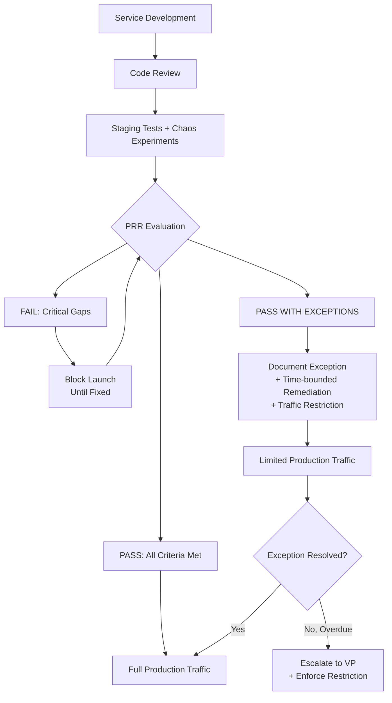

## Keywords in This File

{: .no_toc }

| #   | Keyword | Weight |
| --- | ------- | ------ |
| 1   | [Chaos Engineering Principles and Practice](#chaos-engineering-principles-and-practice) | high |
| 2   | [Production Readiness Review (PRR)](#production-readiness-review-prr) | critical |

---

# Chaos Engineering Principles and Practice

🎯 Interview Weight: high - demonstrates proactive reliability
thinking; distinguishes candidates who prevent failures from those
who only respond to them.

---

### 🎯 Model Answer

**30 seconds:**
> Chaos engineering is the practice of deliberately injecting failures
> into a system to discover reliability weaknesses before they manifest
> as production incidents. The scientific approach: form a hypothesis
> about system behavior (the service will remain available when one
> instance fails), run a controlled experiment (kill one instance),
> observe the outcome (was the hypothesis correct?), and fix any
> discovered weaknesses. The goal is not to cause incidents - it is
> to find unknown unknowns before they cause incidents.

**3 minutes (Senior):**
> Chaos engineering differs from random failure injection (the
> misunderstanding) and from load testing (a related but different
> practice). The discipline comes from the scientific method: each
> experiment has a steady-state hypothesis (the observable normal
> behavior), a failure mode to inject, and a measurement of the
> blast radius (how many users are affected, and for how long).
>
> The chaos experimentation ladder starts with isolated component
> failures in staging (killing one pod, timing out one dependency)
> and only moves to production after confidence is established.
> Production chaos experiments begin with the lowest-risk failure
> modes and apply the "blast radius minimization" principle: inject
> failures in off-peak hours, with automated recovery mechanisms in
> place, and with real-time monitoring active. The experiment is
> stopped immediately if the steady-state is violated beyond expectations.
>
> The highest-value chaos experiments target unknown unknowns: failure
> modes that the team believes are handled but has never verified.
> The most valuable experiments I have run: network partition between
> two microservices (discovered that circuit breakers were misconfigured
> and the failure cascaded instead of being contained), dependency
> timeout injection (discovered that a single slow external API
> exhausted the HTTP thread pool), and zone failure simulation
> (discovered that the load balancer health check had a 45-second
> delay before removing failed instances).

**Framework:** WHAT -> WHY -> HOW -> TRADE-OFF -> EXAMPLE

**Blank Mind Recovery:**

**(1) Restate:** "You are asking about chaos engineering - let me
walk through the scientific approach, the experiment ladder, and the
types of failure modes that produce the highest value discoveries."

**(2) First principles:** "Reliability assumptions are only validated
by testing them. Chaos engineering is structured testing of reliability
assumptions. If you believe the service handles pod failures gracefully,
kill a pod and verify it. If the belief is correct, confidence is earned.
If incorrect, the failure is discovered in a controlled experiment
rather than during a production incident."

**(3) Bridge:** "Chaos engineering is like a fire drill for production
systems. You do not wait for a real fire to discover whether the evacuation
plan works. You run drills to validate the plan, discover gaps, and
train the team to respond correctly. Each chaos experiment is a reliability
drill."

---

### 📘 Concept Explanation

**What it is:**
Chaos engineering is the discipline of experimenting on a system to
build confidence in its ability to withstand turbulent conditions in
production. It involves deliberately injecting known failure modes
to discover unknown weaknesses before they cause customer-impacting incidents.

**The problem it solves:**
Complex distributed systems have emergent failure modes that are not
discoverable through code review, testing, or architecture review alone.
Chaos engineering discovers the gap between "we believe this is handled"
and "we have verified this works."

**How it works:**

```
CHAOS ENGINEERING PROCESS
===========================

STEP 1: DEFINE STEADY STATE
  The observable normal behavior of the system:
    - 99.9% availability on 1-minute windows
    - p99 latency < 500ms
    - Error rate < 0.1%
  This is the comparison baseline for the experiment.

STEP 2: FORM HYPOTHESIS
  "When [failure mode] occurs, the system will
   maintain steady-state because [resilience mechanism]."
  Example: "When one of three API pods is killed,
   the service will maintain 99.9% availability
   because Kubernetes restarts the pod within 30s
   and the load balancer routes around the failed pod."

STEP 3: DESIGN EXPERIMENT
  Failure type selection:
    Infrastructure: instance failure, zone failure
    Network: latency injection, packet loss, partition
    Dependency: timeout, error rate, slow response
    Application: memory pressure, CPU contention
    Data: corrupt input, large payload
  
  Blast radius control:
    Start with staging (zero user impact)
    Move to production off-peak only after staging passes
    In production: inject at lowest traffic hour
    Have automated recovery script ready

STEP 4: RUN EXPERIMENT
  Tools:
    ChaosBlade, Chaos Monkey, Gremlin, LitmusChaos
  Execute:
    1. Confirm steady-state before injection
    2. Inject failure
    3. Monitor system behavior continuously
    4. Stop if: breach exceeds expected blast radius
                OR new unexpected failure mode observed
  Duration: 5-15 minutes for most experiments

STEP 5: ANALYZE AND FIX
  Outcome 1 (expected): system maintained steady-state
    -> Hypothesis confirmed, confidence earned
  Outcome 2 (unexpected): system degraded more than expected
    -> Weakness discovered, file remediation ticket
  Outcome 3 (catastrophic): experiment spiraled out of control
    -> Process failure - review blast radius controls
       and staging coverage before next experiment

CHAOS EXPERIMENT TYPES (ordered by risk level)
  Low risk (start here):
    Single pod failure (Kubernetes restart test)
    Dependency latency injection (50ms extra)
    Single read replica failure
  
  Medium risk:
    Full dependency timeout simulation
    Memory pressure injection
    Network partition between services
  
  High risk (production only, off-peak, full monitoring):
    Availability zone failure
    Database failover simulation
    Full dependency outage
```

**The key insight:**
The highest-value chaos experiments are the ones that disprove a
hypothesis. When the team is confident that a failure mode is handled,
and the chaos experiment shows it is not, that is a prevented production
incident. Experiments that confirm hypotheses build confidence. Experiments
that disprove hypotheses reveal weaknesses. Both are valuable; the
hypothesis-disprovers are more actionable.

**When to use it:**
Chaos engineering is appropriate when: the service has runbooks for
failure scenarios that have never been tested, new services are being
deployed to production (validate resilience before load), or after major
architectural changes (validate that resilience mechanisms still work).

**When NOT to use it:**
Do not run chaos experiments when: the service has no observability
(you cannot detect the blast radius), the team is already overwhelmed
with incident response (recovery capacity must be available), or the
failure mode being tested has a high probability of causing data loss
without clear recovery.

**Alternatives:**
- Game days: broader scope than individual experiments; teams simulate
  full failure scenarios in collaborative exercises
- Load testing: tests capacity limits, not failure mode handling
- Fault injection testing in staging: safer but misses production-
  specific conditions

---

### 💻 Code Example

**Example 1: Kubernetes pod failure chaos experiment**

```yaml
# BAD: No chaos experiment ever run on pod failure.
# Team believes Kubernetes auto-restarts will keep
# service available. Belief never validated.
# Reality: readiness probe was misconfigured,
# and load balancer continued routing to crashed pods
# for 90 seconds.

# GOOD: LitmusChaos experiment to validate pod
# failure handling (run in staging first)

apiVersion: litmuschaos.io/v1alpha1
kind: ChaosEngine
metadata:
  name: pod-delete-experiment
  namespace: default
spec:
  appinfo:
    appns: default
    applabel: app=api-service
    appkind: deployment
  # Abort if steady state is violated
  engineState: active
  annotationCheck: false

  experiments:
    - name: pod-delete
      spec:
        components:
          env:
            # Kill 1 of N pods
            - name: TOTAL_CHAOS_DURATION
              value: "30"          # seconds
            - name: CHAOS_INTERVAL
              value: "10"          # kill every 10s
            - name: PODS_AFFECTED_PERC
              value: "33"          # 1 of 3 pods
            - name: FORCE
              value: "false"       # graceful kill

  # Steady state checks run before/after
  steadyStateHypothesis:
    title: "Service maintains availability"
    probes:
      - name: http-availability
        type: httpProbe
        mode: Continuous
        httpProbe/inputs:
          url: http://api-service/health
          insecureSkipVerify: true
          responseTimeout: 2000
        runProperties:
          probeTimeout: 3000
          interval: 5s
          retry: 3
          # Fail if availability drops below this
        data: "200"
```

> **Code walkthrough:** The BAD state is an unvalidated assumption
> about Kubernetes pod recovery. The GOOD experiment uses LitmusChaos
> to kill 33% of pods (1 of 3) every 10 seconds for 30 seconds while
> continuously checking HTTP availability. The steady-state probe runs
> before and after the experiment; if it fails during the experiment,
> the hypothesis is disproved. Key parameters: `PODS_AFFECTED_PERC: 33`
> limits blast radius to 1 pod, `FORCE: false` uses graceful termination
> (test graceful shutdown), and `probeTimeout: 3000` allows for Kubernetes
> rolling restart latency.

**Example 2: Dependency timeout chaos experiment**

```python
#!/usr/bin/env python3
# BAD: Dependency timeout assumed to be handled
# (timeout configured but never tested).
# Result: when payment provider is slow, all
# HTTP threads block waiting for response.
# Service saturates at thread pool.

# GOOD: Chaos experiment to validate timeout handling
# Using tc (traffic control) for network degradation

import subprocess
import time
import requests
import statistics

def run_latency_injection_experiment(
    target_interface: str = "eth0",
    delay_ms: int = 5000,         # 5 second injection
    duration_seconds: int = 60,
    service_url: str = "http://localhost:8080",
    endpoint: str = "/api/payments"
) -> dict:
    """
    Injects network latency on a specific interface
    and measures service behavior.
    Requires: tc (traffic control), CAP_NET_ADMIN.
    Run only in staging.
    """
    # Baseline measurement (30 requests before injection)
    print("Measuring baseline...")
    baseline_latencies = []
    for _ in range(30):
        start = time.time()
        try:
            response = requests.get(
                f"{service_url}{endpoint}",
                timeout=10.0
            )
            elapsed = (time.time() - start) * 1000
            baseline_latencies.append(elapsed)
        except requests.exceptions.Timeout:
            baseline_latencies.append(10000)  # timeout
        time.sleep(1)

    baseline_p99 = statistics.quantiles(
        baseline_latencies, n=100
    )[-1]

    # Inject 5-second latency
    print(f"Injecting {delay_ms}ms latency...")
    subprocess.run([
        "tc", "qdisc", "add", "dev", target_interface,
        "root", "netem", "delay", f"{delay_ms}ms"
    ], check=True)

    # Measure during injection
    experiment_latencies = []
    experiment_errors = 0
    experiment_start = time.time()
    while time.time() - experiment_start < duration_seconds:
        start = time.time()
        try:
            response = requests.get(
                f"{service_url}{endpoint}",
                timeout=10.0      # service timeout
            )
            elapsed = (time.time() - start) * 1000
            experiment_latencies.append(elapsed)
            if response.status_code >= 500:
                experiment_errors += 1
        except requests.exceptions.Timeout:
            experiment_errors += 1
            experiment_latencies.append(10000)
        time.sleep(1)

    # Remove latency injection
    subprocess.run([
        "tc", "qdisc", "del", "dev",
        target_interface, "root"
    ])

    experiment_p99 = statistics.quantiles(
        experiment_latencies, n=100
    )[-1] if experiment_latencies else 0

    error_rate = experiment_errors / len(
        experiment_latencies
    ) if experiment_latencies else 1.0

    return {
        "baseline_p99_ms": f"{baseline_p99:.0f}ms",
        "experiment_p99_ms": f"{experiment_p99:.0f}ms",
        "error_rate": f"{error_rate:.2%}",
        "hypothesis_validated": error_rate < 0.05,
        "finding": (
            "PASS: Service handled dependency latency "
            "within error budget"
            if error_rate < 0.05 else
            "FAIL: Service exceeded error budget during "
            "dependency latency injection. "
            "Check timeout configuration and circuit breakers."
        )
    }
```

> **Code walkthrough:** This experiment injects 5-second network latency
> (simulating a slow downstream dependency) using Linux tc (traffic control)
> and measures the service's error rate and latency during the injection.
> The hypothesis: the service handles dependency latency gracefully with
> < 5% error rate (using its configured timeout + circuit breaker).
> If the error rate exceeds 5%, the hypothesis is disproved - the timeout
> and circuit breaker are not working as expected. The `tc qdisc del`
> cleanup ensures latency is removed even if the script terminates early.

---

### 🎓 Answers by Seniority

**Junior / Mid (0-5 years):**
> Chaos engineering is structured failure injection to validate resilience
> assumptions. The process: form a hypothesis (the service will stay
> available when X fails), inject the failure in staging, observe the
> outcome, fix any weaknesses found. Start with low-risk experiments
> (single pod failure) before attempting high-risk ones (zone failure).
> The goal is not to cause incidents - it is to find reliability
> weaknesses in controlled conditions.

---

**Senior / Staff (5+ years):**
> The most valuable chaos experiments are not the dramatic ones (full
> zone failure) but the subtle ones (dependency latency injection, circuit
> breaker validation, connection pool exhaustion under load). These are
> the failure modes that engineers assume are handled but have never
> verified. I prioritize experiments that test specific runbook
> assumptions: "we have a runbook that says to do X when Y happens -
> let's verify that Y actually behaves as the runbook expects."

---

### ⚠️ Common Misconceptions

| Misconception | Reality |
|---|---|
| Chaos engineering means randomly breaking things | Chaos engineering is a scientific discipline: each experiment has a specific hypothesis, controlled blast radius, and measured outcome |
| You need Chaos Monkey or Gremlin to do chaos engineering | The discipline is conceptual; experiments can be run with standard Linux tools (tc, kill), Kubernetes commands, or any injection mechanism |
| Chaos experiments should be automated and always running (like Netflix Chaos Monkey) | Most organizations should start with controlled, manually-triggered experiments; always-on automated chaos requires mature observability and recovery automation |
| Chaos engineering is only for large organizations | Any service with multiple instances and distributed dependencies benefits from chaos experiments, regardless of organization size |
| A passed chaos experiment means the service is reliable | A passed experiment means the specific hypothesis was validated under the specific conditions tested; new failure modes are discovered with each new experiment |

---

### 🚨 Failure Modes and Diagnosis

**Failure 1: Chaos experiment cascades beyond intended scope**

*Symptom:* A database connection failure injection in staging propagates
to the production monitoring system because staging and production share
the same monitoring database. The monitoring database becomes unavailable
during the experiment, causing false production alerts and on-call pages.

*Root cause:* Blast radius was not fully analyzed before the experiment.
Staging and production sharing infrastructure components was not documented
or accounted for in the experiment design.

*Fix:* Before any chaos experiment, map all shared infrastructure between
the target environment and other environments. Staging should be fully
isolated from production at the infrastructure level for chaos experiments.

*Prevention:* Chaos experiment approval checklist: "Does the target
environment share any infrastructure with production? If yes, list them
and confirm they are excluded from the blast radius."

---

### 🎯 Interview Deep-Dive

| Preparation | Target |
|---|---|
| Time to prep | 15 minutes |
| Core themes | Steady-state hypothesis, experiment ladder, blast radius control |
| Seniority signal | Junior: describes the concept; Senior: experiment ladder, hypothesis-based design |
| Common trap | Describing chaos as random failure injection |
| Staff differentiator | Game days, always-on chaos with mature observability |

---

**Q1 [MID]: What is the scientific basis for chaos engineering experiments?**

Chaos engineering uses the scientific method: hypothesis, experiment,
observation, conclusion. The steady-state hypothesis defines what "normal"
looks like for the system. The experiment injects a specific failure mode.
The observation measures whether the system maintained steady state during
and after the failure. The conclusion: hypothesis confirmed (resilience
mechanism works) or disproved (weakness discovered, remediation required).

The scientific rigor requires: a specific, falsifiable hypothesis (not
"the service will be fine"), controlled variables (inject one failure
mode at a time), measurable outcome (specific SLI metrics), and
reproducibility (the experiment can be run again to verify the fix).

Without this structure, failure injection is random destruction, not
engineering. The structure is what makes chaos engineering a reliability
practice rather than a chaos practice.

*What separates good from great:* Uses the scientific method vocabulary
explicitly and explains why each element (falsifiable hypothesis, controlled
variables, measurable outcome) is necessary.

---

**Q2 [SENIOR]: BEHAVIORAL: Describe a chaos experiment that
revealed an unexpected weakness.**

**Hypothesis:** When the payment provider API takes 5 seconds to respond
(slow, not down), the service uses its configured 3-second timeout to
fail fast and the circuit breaker opens after 5 failed requests.

**Experiment:** Injected 5-second latency using tc on the interface used
for payment provider communication in staging.

**Unexpected finding:** The HTTP timeout was configured correctly (3
seconds), but the circuit breaker was using the wrong metric. It was
counting connection errors, not timeout errors. After 5 timeouts, the
circuit breaker did not open. The HTTP thread pool filled with threads
waiting 3 seconds each. After 90 seconds, thread pool was exhausted
and all requests (not just payment requests) returned 503.

**Root cause:** Circuit breaker library was counting `java.net.ConnectException`
(connection refused) as errors, not `java.net.SocketTimeoutException`.
The configuration was wrong and had never been tested with timeout failures.

**Remediation:** Updated circuit breaker configuration to count all
exception types including timeouts. Validated with a follow-up experiment
that confirmed the circuit breaker opened correctly after 5 timeouts.

**Impact prevented:** This configuration error would have caused a full
service outage during any payment provider slowdown. The chaos experiment
discovered it in staging with zero user impact.

*What separates good from great:* Gives the unexpected finding with
the specific root cause (wrong exception type in circuit breaker), explains
the impact it would have had in production, and describes the validation
of the fix.

---

**Q3 [STAFF]: How do you scale chaos engineering to an organization
with 100+ microservices?**

At 100+ services, individual experiments designed from scratch for each
service cannot scale. The approach must be systematic: service templates
with standard experiments, game days for cross-service scenarios, and
platform-level chaos integration.

Service templates: define a standard chaos experiment suite for each
service archetype. For HTTP API services: pod failure, dependency latency,
dependency timeout, memory pressure. For data pipeline services: input
partition failure, output backpressure, partial input corruption. Each
new service runs the standard suite against its archetype on the path
to production readiness.

Game days: quarterly cross-service chaos exercises where specific failure
scenarios (dependency zone failure, shared database unavailability, cascading
circuit breaker opens) are simulated with full team participation. Game
days test the organizational response (on-call rotation, communication,
incident command) as well as the technical resilience.

Platform integration: chaos experiments run as part of the CI/CD pipeline
for Tier 1 services. The deployment pipeline includes a "chaos gate":
a short suite of standard experiments that must pass before promotion
to production. This catches resilience regressions introduced by code
changes.

The maturity model: start with quarterly game days (organization-wide),
then implement service-specific experiments on the PRR path, then integrate
into CI/CD for Tier 1 services.

*What separates good from great:* Describes all three mechanisms (service
templates, game days, CI/CD integration) as complementary, and gives the
maturity model for sequencing the investment.

---

### ⚖️ Comparison Table

| Chaos Experiment Type | Risk Level | Discovery Value | Implementation | Best for |
|---|---|---|---|---|
| Pod failure | Low | Medium (validates restart) | kubectl delete pod | Service restart resilience |
| Dependency latency | Low-medium | High (validates timeouts, circuit breakers) | tc netem, Gremlin | Dependency timeout handling |
| Network partition | Medium | Very high (reveals unknown coupling) | iptables, Gremlin | Distributed system coupling |
| Zone failure | High | High (validates AZ redundancy) | Cloud provider stop | Multi-AZ deployment |
| Database failover | High | High (validates connection recovery) | Cloud provider | Database failover resilience |
| Always-on (Chaos Monkey) | High | High (continuous validation) | Chaos Monkey, Gremlin | Mature orgs with full observability |

---

### 🏛️ System Design

*(Omit: Chaos Engineering is a practices keyword. System design for
resilient architectures is addressed in the software-architecture topic.)*

---

### 📊 Diagram

*(Omit: The chaos engineering process flow is adequately described
in the numbered steps in the Concept Explanation section. A diagram
does not significantly improve comprehension for this process-oriented
keyword.)*

---

---

# Production Readiness Review (PRR)

🎯 Interview Weight: critical - the most direct SRE mechanism for
preventing incidents before services go live; inability to describe
PRR criteria is a strong signal of SRE inexperience.

---

### 🎯 Model Answer

**30 seconds:**
> A Production Readiness Review is a structured assessment of whether
> a new service is ready for production traffic. It checks that the
> service meets the organization's standards for observability, alerting,
> scalability, security, incident response, and operational documentation.
> A service that passes PRR is one where the SRE on-call team can
> respond to incidents, the service can scale under load, and the
> failure modes are understood and documented.

**3 minutes (Senior):**
> The PRR is the organizational mechanism for encoding reliability
> standards at service creation rather than retrofitting them after
> incidents. It covers five critical dimensions.
>
> Observability: does the service have the four golden signals
> instrumented and available in the standard observability platform?
> Can the on-call diagnose issues from dashboards alone without having
> to SSH into instances?
>
> Alerting: are alerts configured to page on SLO-breach conditions
> (not on infrastructure metrics)? Are alert thresholds set to fire
> before user impact (leading indicator) rather than after?
>
> Capacity: has the service been load-tested to 2x expected peak
> traffic? Are auto-scaling policies configured? Has the saturation
> point been identified?
>
> Runbooks: is there a runbook for every alert that fires? Does the
> runbook describe the diagnosis, the fix, and the escalation path?
> Has the runbook been validated against a staged failure?
>
> Security: has a security review been completed? Are secrets managed
> (not hardcoded)? Is the attack surface documented?
>
> A service that has not passed PRR for all five dimensions should
> not receive production traffic from customers. It can receive internal
> traffic, beta traffic, or low-priority requests while the gaps are
> addressed.

**Framework:** WHAT -> WHY -> HOW -> TRADE-OFF -> EXAMPLE

*Adapting up:* Staff adds: "PRR is most valuable as a cultural change
mechanism, not just a checklist. When development teams know that
observability, alerting, and runbooks are required for production, they
build these things in during development rather than retrofitting them
before the PRR. The PRR shifts reliability from an SRE afterthought
to a development prerequisite."

*Adapting down:* Junior: "A PRR is a pre-launch checklist that asks:
does the service have monitoring? Does it have alerts? Has it been
load-tested? Is there a runbook for each alert? Is security reviewed?
If any answer is 'no,' the service is not ready for production. Fix
the gaps first."

**Blank Mind Recovery:**

**(1) Restate:** "You are asking about Production Readiness Reviews -
let me walk through the five critical dimensions, the common failure
modes of each, and how PRR changes the organizational relationship
between development and SRE."

**(2) First principles:** "A production service will have incidents.
The question is: when the incident occurs, will the on-call team be
able to diagnose it? Will the service be able to scale under load?
Will the failure be contained? PRR validates the answers before launch,
not after the first incident."

**(3) Bridge:** "PRR is like a preflight checklist for aircraft.
The pilot does not take off and then check if the fuel is loaded.
The checklist exists because the cost of discovering a problem in flight
is much higher than the cost of checking before flight. PRR is the
preflight checklist for production services."

---

### 📘 Concept Explanation

**What it is:**
A Production Readiness Review (PRR) is a structured evaluation conducted
before a new service is promoted to production, verifying that the service
meets the organization's reliability, security, and operational standards.
It is typically conducted by the SRE team in collaboration with the
development team.

**The problem it solves:**
Without PRR, services go to production missing observability, alerting,
runbooks, or security controls. The first production incident on a service
without PRR is also the discovery that the service is not observable.
The on-call team cannot diagnose the incident because there are no dashboards
or runbooks.

**How it works:**

```
PRR CHECKLIST - FIVE DIMENSIONS
==================================

1. OBSERVABILITY (must-have)
   [ ] Four golden signals instrumented:
       - Latency (p50, p95, p99)
       - Traffic (requests per second)
       - Errors (error rate, broken down by error type)
       - Saturation (resource utilization)
   [ ] Logs structured (JSON), with request ID
       for distributed tracing
   [ ] Service included in standard dashboard
       (or custom dashboard created)
   [ ] Dependency health visible (upstream/downstream)
   
   FAIL criteria: any golden signal missing

2. ALERTING (must-have)
   [ ] SLO-based alerts configured (error budget
       burn rate alerts at 2% and 10% burn rate)
   [ ] Every alert has a runbook linked in the body
   [ ] Alerts fire before SLO breach (< 60 min warning)
   [ ] On-call team has been added to alert routing
   [ ] No alert fires without a human response
       (all alerts are actionable or silenced by design)
   
   FAIL criteria: alert without runbook, alert on
   non-actionable metric

3. CAPACITY (must-have)
   [ ] Load test completed at 2x expected peak traffic
   [ ] Saturation point documented (from load test)
   [ ] Auto-scaling policies configured with tested targets
   [ ] Resource limits set (CPU request/limit, memory limit)
   [ ] Database connection pool sized correctly
       for peak load

   FAIL criteria: no load test, no saturation point
   documented

4. RUNBOOKS (must-have)
   [ ] Runbook for every alert that can fire
   [ ] Each runbook includes: diagnosis steps,
       remediation steps, escalation path
   [ ] At least one runbook validated against a
       real or staged failure
   [ ] Postmortem template filled in for any
       major incident during staging testing

   FAIL criteria: alert without linked runbook

5. SECURITY (must-have)
   [ ] No secrets hardcoded in source code or config
   [ ] Secrets managed via vault/secret manager
   [ ] Principle of least privilege: service account
       has only required permissions
   [ ] Sensitive data encrypted at rest and in transit
   [ ] Security review completed (threat model)
   [ ] Dependencies scanned for known CVEs
   
   FAIL criteria: hardcoded secrets, missing encryption

PRR OUTCOMES
  PASS: all five dimensions green
    -> Service approved for production traffic
  PASS WITH EXCEPTIONS: non-critical gaps documented
    -> Service approved with time-bounded remediation plan
  FAIL: critical gaps in observability, alerting,
        security, or no load test
    -> Service not approved until gaps resolved
```

**The key insight:**
The PRR is most effective when it is not a gate controlled by the SRE
team but a shared standard co-owned by development and SRE. When developers
understand the PRR criteria and build to them during development (not
at the end), PRR becomes a natural quality check rather than an external
gatekeeper. The cultural goal: "PRR criteria are the definition of done
for production readiness."

**When to use it:**
Conduct PRR for every new service before it receives customer traffic.
Also run a PRR re-check after major architectural changes, after long
periods without incidents (to verify runbooks are still accurate), or
when a service is transferred to a new team (new team must validate
they can operate the service).

**When NOT to use it:**
Internal tooling, developer utilities, and experimental services that
will never receive customer traffic can use a lighter-weight checklist
rather than a full PRR.

---

### 💻 Code Example

**Example 1: PRR checklist automation**

```python
# BAD: PRR conducted manually from a Google Doc
# checklist. Different reviewers check different things.
# No version control of PRR criteria.
# Service goes to production with missing runbooks
# because the reviewer forgot to check.

# GOOD: Automated PRR validation with scored output

from dataclasses import dataclass
from typing import Optional
import requests

@dataclass
class PRRCheckResult:
    category: str
    check: str
    passed: bool
    severity: str  # "CRITICAL", "MAJOR", "MINOR"
    detail: Optional[str] = None

def run_prr_checks(
    service_name: str,
    grafana_url: str,
    prometheus_url: str,
    alert_manager_url: str
) -> list[PRRCheckResult]:
    """
    Automated PRR checks that can be executed in CI/CD
    or as a pre-production gate.
    """
    results = []

    # ---- OBSERVABILITY CHECKS ----

    # Check 1: Error rate metric exists
    resp = requests.get(
        f"{prometheus_url}/api/v1/query",
        params={"query": f'http_requests_total{{app="{service_name}"}}'},
        timeout=10
    )
    metric_exists = bool(
        resp.json().get("data", {}).get("result")
    )
    results.append(PRRCheckResult(
        category="Observability",
        check="Error rate metric instrumented",
        passed=metric_exists,
        severity="CRITICAL",
        detail=(
            "http_requests_total metric not found"
            if not metric_exists else None
        )
    ))

    # Check 2: Latency histogram metric exists
    resp = requests.get(
        f"{prometheus_url}/api/v1/query",
        params={
            "query": (
                f'http_request_duration_seconds_bucket'
                f'{{app="{service_name}"}}'
            )
        },
        timeout=10
    )
    latency_exists = bool(
        resp.json().get("data", {}).get("result")
    )
    results.append(PRRCheckResult(
        category="Observability",
        check="Latency histogram instrumented",
        passed=latency_exists,
        severity="CRITICAL",
        detail=(
            "http_request_duration_seconds not found"
            if not latency_exists else None
        )
    ))

    # ---- ALERTING CHECKS ----

    # Check 3: SLO alert exists in AlertManager
    resp = requests.get(
        f"{alert_manager_url}/api/v2/alerts",
        timeout=10
    )
    alerts = resp.json() if resp.ok else []
    slo_alert_exists = any(
        a.get("labels", {}).get("app") == service_name
        and "SLO" in a.get("labels", {}).get(
            "alertname", ""
        )
        for a in alerts
    )
    results.append(PRRCheckResult(
        category="Alerting",
        check="SLO burn rate alert configured",
        passed=slo_alert_exists,
        severity="CRITICAL",
        detail=(
            "No SLO burn rate alert found for service"
            if not slo_alert_exists else None
        )
    ))

    # Return sorted by severity and pass status
    return sorted(
        results,
        key=lambda r: (
            {"CRITICAL": 0, "MAJOR": 1, "MINOR": 2}
            [r.severity],
            0 if not r.passed else 1
        )
    )

def generate_prr_report(
    checks: list[PRRCheckResult]
) -> dict:
    critical_failures = [
        c for c in checks
        if not c.passed and c.severity == "CRITICAL"
    ]
    return {
        "overall_result": (
            "FAIL" if critical_failures else "PASS"
        ),
        "critical_failures": len(critical_failures),
        "details": [
            f"[{c.severity}] {c.category}: {c.check}"
            f" - {c.detail}"
            for c in checks if not c.passed
        ]
    }
```

> **Code walkthrough:** The BAD approach relies on a manual checklist
> that is inconsistently applied. The GOOD approach automates the PRR
> by querying Prometheus for required metrics and AlertManager for required
> alert configurations. Critical failures (missing observability or alerting)
> block production approval. The function generates a structured report
> that can be integrated into CI/CD as a production promotion gate.
> This ensures PRR criteria are consistently applied across all services.

---

### 🎓 Answers by Seniority

**Junior / Mid (0-5 years):**
> A Production Readiness Review checks five things before a service
> goes to production: observability (four golden signals), alerting
> (SLO-based alerts with runbooks), capacity (load test at 2x peak),
> runbooks (one per alert, validated), and security (no hardcoded secrets,
> threat model). A service that fails any must-have criterion does not
> get production traffic until it is fixed. The PRR prevents the most
> common category of "new service" incidents: missing monitoring and
> no runbooks.

---

**Senior / Staff (5+ years):**
> The PRR is most valuable as a cultural artifact, not just a checklist.
> When developers know that observability, alerting, runbooks, and a
> load test are required before production, they build these during
> development rather than scrambling to add them before launch. The
> PRR converts reliability from an afterthought to a development
> prerequisite. The technical checklist is secondary to the organizational
> change in when reliability is addressed.
>
> I have seen teams that treat PRR as a bureaucratic gate to work around,
> and teams that use it as a shared definition of "done." The latter
> teams have dramatically fewer new-service incidents.

---

### ⚠️ Common Misconceptions

| Misconception | Reality |
|---|---|
| PRR is a gate the SRE team uses to block releases | PRR is most effective as a shared standard co-owned by development and SRE; when it feels like an external gate, teams work around it |
| Passing PRR once is sufficient | PRR criteria should be re-checked after major changes, team transitions, or long periods without incidents (runbooks become stale) |
| PRR must cover everything to be useful | A PRR covering only the must-haves (observability, alerting, runbook for each alert) provides 80% of the value; the perfect PRR checklist is the enemy of the consistently applied PRR |
| The PRR reviewer is responsible for production readiness | Production readiness is the development team's responsibility; the SRE does the PRR to verify, not to create the readiness |
| PRR only applies to new services | PRR criteria should apply to significant changes: major refactors, new dependencies, scaling changes |

---

### 🚨 Failure Modes and Diagnosis

**Failure 1: PRR passed with incomplete runbooks**

*Symptom:* Service passes PRR. Three weeks after production launch,
an alert fires. On-call opens the runbook linked in the alert. The
runbook says "TBD - to be completed after launch." On-call spends
45 minutes diagnosing from first principles during a P1 incident.

*Root cause:* PRR checklist checked "runbook exists" but not "runbook
is complete and validated." A link to a stub runbook passed the check.

*Fix:* PRR criteria must specify runbook completeness:
(1) runbook has diagnosis steps, (2) runbook has remediation steps,
(3) runbook has been validated against a staged or real failure.
The automated PRR check should verify the runbook has content above
a minimum word count and includes required sections.

*Prevention:* Runbook template with required sections. PRR checklist
requires all sections to be non-empty before approval.

**Failure 2: Service launched without load test**

*Symptom:* Service passes PRR under time pressure with load test
marked "in progress - will complete next sprint." Service goes to
production. Two weeks later, a marketing campaign drives 3x normal
traffic. Service saturates at database connection pool. P1 incident.

*Root cause:* Load test was deferred as an exception. The exception
was not tracked or enforced.

*Fix:* The load test criterion is non-negotiable. Services with
exceptions documented should have those exceptions tracked in the
PRR record and the exceptions must have a completion date. Any exception
that passes 2 sprints without completion triggers an automatic service
tier downgrade (lower traffic limit, no marketing campaigns) until
resolved.

---

### 🎯 Interview Deep-Dive

| Preparation | Target |
|---|---|
| Time to prep | 20 minutes |
| Core themes | 5 PRR dimensions, cultural impact, automation, exception handling |
| Seniority signal | Junior: lists the dimensions; Senior: explains cultural impact, exception policy |
| Common trap | Describing PRR as an SRE gate rather than a shared standard |
| Staff differentiator | PRR as cultural change mechanism, automated PRR in CI/CD, tiered PRR for different service criticalities |

---

**Q1 [MID]: What are the five key dimensions of a Production
Readiness Review?**

Observability: the four golden signals (latency, traffic, errors,
saturation) must be instrumented and available in the standard monitoring
platform. Without this, the on-call team cannot diagnose incidents.

Alerting: SLO-based alerts configured with runbooks linked in the
alert body. Alert thresholds should fire before user impact (leading
indicator), and every alert must be actionable.

Capacity: load test at 2x expected peak traffic, with the saturation
point documented and auto-scaling policies configured. This ensures
the service can handle traffic spikes without saturation.

Runbooks: a runbook for every alert, containing diagnosis steps,
remediation steps, and the escalation path. At least one runbook should
be validated against a real or staged failure.

Security: no hardcoded secrets, secrets managed via a secret manager,
principle of least privilege for service accounts, encryption at rest
and in transit, and a threat model or security review completed.

Critical failures in observability, alerting, or security should block
production promotion. Capacity and runbook gaps can be accepted with
a time-bounded remediation plan, but should be resolved within one sprint.

*What separates good from great:* Lists all five dimensions with specific
failure criteria, distinguishes must-have from can-be-deferred.

---

**Q2 [SENIOR]: BEHAVIORAL: Describe a PRR you conducted that
prevented a production incident.**

**Situation:** New customer-facing API service was scheduled for launch
in 5 days. Development team asked for PRR.

**PRR findings:** During the observability review, I discovered that
the service was logging at DEBUG level in production configuration
(30GB/day log volume at expected traffic). During the alerting review:
SLO alerts were configured but linked to a runbook that did not exist
(404). During the capacity review: no load test had been run; the service
used a shared database connection pool sized for 20 services, and this
service's expected traffic would alone saturate it.

**Actions:** (1) Debug logging: switched to INFO level in production,
reducing to 500MB/day. (2) Runbook: required development team to create
the runbook before launch approval; blocked approval on this. (3) Connection
pool: identified that the shared pool was inadequate; provisioned a
dedicated pool for this service and ran a 2x load test confirming it
handled expected peak.

**Result:** Launch proceeded 2 days late (PRR remediation took 2 days).
The service handled the launch traffic without incidents. The logging
issue alone would have cost $2,400/month in log storage.

*What separates good from great:* Uses specific findings (30GB/day logs,
404 runbook, shared connection pool), quantifies the impact (2 days delay,
$2,400/month), and explains the reasoning for blocking on the runbook.

---

**Q3 [STAFF]: How do you design a PRR process for an organization
with 50 teams and 200+ services?**

Individual SRE-conducted PRRs for 200 services do not scale. The process
must have two variants: full PRR for Tier 1 services (SRE-led), and
self-service PRR for Tier 2/3 services (development team self-certifies
against a checklist, SRE reviews exceptions).

Self-service PRR mechanics: standardized PRR checklist in the service
template. Automated validation script run during CI/CD (checks for
required metric instrumentation, alert configuration, runbook links).
Development team certifies completion. SRE reviews any critical exceptions
or Tier 1 services.

The PRR record: every service has a PRR record in the service catalog
(Backstage or similar). The record shows: current PRR status (pass/fail/
exceptions), last review date, and outstanding remediation items. This
is visible to the on-call team: "this service passed PRR with a deferred
load test" tells the on-call what to expect.

PRR triggers for re-review: service tier upgrade (from Tier 3 to Tier 2),
major architectural change (new database, new dependency added), team
transition (new team taking ownership), or a postmortem action item that
surfaces a PRR gap.

The SRE team's role evolves from "PRR conductor" to "PRR standard owner":
maintain the checklist, run training, review exceptions, and audit the
self-service process quarterly.

*What separates good from great:* Describes the tiered model (full vs.
self-service PRR), the service catalog record, and the SRE role shift
from conductor to standard owner.

---

**Q4 [STAFF]: How do you handle a service that fails PRR but is
under pressure to launch immediately?**

The pressure to launch despite PRR failure is a real organizational
dynamic. The SRE response must balance reliability standards with
business reality.

First, understand which PRR criteria failed and the severity. Critical
failures (no observability, no alerts, security vulnerabilities) are
non-negotiable: a service with no monitoring cannot be supported on-
call. Non-critical failures (load test not completed, runbook stubs)
can be deferred with conditions.

For critical failures: offer to help fix them immediately. A service
without metric instrumentation can often be fixed in hours (add a library,
deploy a new version). A service with hardcoded secrets must be fixed
before launch regardless of timeline - the risk of a secret leak is
higher than any launch timeline pressure. Present the remediation plan
and timeline, not just the block.

For non-critical failures with a launch requirement: document the
exception explicitly in the PRR record. Define a time-bounded commitment
(load test within 1 week, runbooks within 2 sprints). Apply a traffic
restriction (no more than X% of traffic until load test passes). This
manages risk while allowing the launch.

The organizational escalation: if leadership overrides a critical PRR
failure, the SRE must document the override, the risk accepted, and
the business justification. This creates accountability: if an incident
occurs because of the gap that the PRR found, the decision to override
is documented.

The key communication: "We are not blocking this launch to slow you
down. We are ensuring the on-call team can support this service. Here
is what we need to make that possible."

*What separates good from great:* Distinguishes critical from non-critical
failures, offers to help fix, provides the traffic restriction as a
middle ground, and describes the documentation requirement for overrides.

---

**Q5 [STAFF]: How should the PRR criteria evolve as an organization
matures in SRE practices?**

PRR criteria evolution follows the organization's SRE maturity. At each
stage, new criteria become achievable that were not practical earlier.

Stage 1 (SRE program starting): PRR focuses on the must-haves: golden
signals instrumented, SLO-based alerts, runbook for each alert, no
hardcoded secrets. These require no SRE platform investment - just standards
that development teams must meet.

Stage 2 (observability platform established): PRR adds distributed tracing
(request IDs propagated through all services), standardized dashboard
templates, and SLO error budget dashboards. These are now possible because
the platform provides them.

Stage 3 (chaos engineering practice established): PRR adds a required
chaos experiment gate: the service must pass at least two chaos experiments
(pod failure and dependency latency injection) before production approval.
This is now practical because the chaos tooling exists and the team has
experience running experiments.

Stage 4 (platform engineering mature): PRR becomes largely automated:
the CI/CD pipeline validates observability, alerting, and security
automatically. Human PRR review focuses only on architectural decisions
and exception handling. The platform provides everything else.

The evolution principle: PRR criteria should reflect what the organization
can actually consistently achieve, not aspirational standards. Adding
criteria that the development teams cannot realistically meet produces
exceptions, not compliance.

*What separates good from great:* Describes four maturity stages with
specific criteria at each stage, and explains the evolution principle
(criteria must be achievable, not aspirational).

---

### ⚖️ Comparison Table

| PRR Approach | Consistency | Scalability | SRE Effort | Best for |
|---|---|---|---|---|
| SRE-conducted full PRR | High | Low (1:1 per service) | High | Tier 1 customer-facing services |
| Self-service PRR with SRE review of exceptions | Medium-high | High | Medium | Tier 2 internal services |
| Automated PRR gate in CI/CD | High (for automatable checks) | Very high | Low (maintenance) | All services with standard tooling |
| Lightweight PRR (observability + alerting only) | Medium | High | Low | Tier 3 supporting services |
| No PRR | None | N/A | None | Development environments only |

---

### 🏛️ System Design

*(Omit: Production Readiness Review is a process keyword. System
design for developer platforms with PRR automation is addressed
in the DevOps CI/CD topic.)*

---

### 📊 Diagram

```
PRR GATE IN SERVICE LIFECYCLE
================================
         Development
              |
         Code Review
              |
        Staging Tests
              |
         PRR CHECK
         /    |    \
   FAIL CRIT  EXC   PASS
       |       |      |
   Block   Document  Production
   launch   + time    traffic
   until    bound     enabled
   fixed    + restrict
```



> **Diagram walkthrough:** The PRR gate sits between staging and production
> in the service lifecycle. Three outcomes are possible: critical failure
> blocks launch entirely until fixed; pass-with-exceptions allows limited
> production traffic with documented remediation commitments; full pass
> allows unrestricted production traffic. The exception path includes
> both time-bounding and traffic restriction, ensuring exceptions do not
> become permanent. Overdue exceptions escalate to VP, creating organizational
> accountability for the deferred risk.

---

### Field Q&A

**Production Failures:**

1. A service passed PRR 6 months ago. A new engineer joined the team
   and made significant changes to the alert configuration without
   running a PRR re-review. The new alerts are not SLO-based and
   have no runbooks. What process failed?
   > PRR must have a trigger for significant changes, not just new
   > service launches. Alert configuration changes that affect production
   > monitoring quality are a PRR-triggering change. Fix: define change
   > categories that require PRR re-review: alert configuration changes,
   > new service dependencies, architectural changes, team ownership transfer.
   > The service catalog should have a "last PRR review" date that triggers
   > a reminder if > 6 months without re-review.

2. During a high-traffic event, a service that passed PRR saturates
   unexpectedly. Investigation reveals the load test was done with
   10 simulated users, not 2x peak traffic (1,000 users). The load
   test criterion was technically met (load test exists) but was
   inadequate. What was the PRR gap?
   > PRR criteria must specify what "load test" means quantitatively.
   > "Load test completed" is insufficient. The criteria should be: "Load
   > test at 2x expected peak traffic (document the number) with no errors
   > and saturation below 80% for all resource dimensions." The criteria
   > must include the traffic level, error rate, and saturation outcome.
   > Without quantitative criteria, teams satisfy the letter but not the
   > spirit of the requirement.

3. A security vulnerability was found in production in a component that
   passed PRR. The vulnerability was in a third-party library that had
   a known CVE at the time of PRR. How was this missed?
   > The PRR security check did not include automated dependency CVE
   > scanning. A manual security review can miss known CVEs in transitive
   > dependencies. Fix: add automated dependency scanning (OWASP Dependency
   > Check, Snyk, or similar) to the PRR security criterion - and to the
   > CI/CD pipeline for ongoing scanning after launch. Known CVEs above
   > a severity threshold should block PRR approval.

---

**Candidate Mistakes:**

1. "PRR is the SRE team's way of controlling what goes to production."

   **What NOT to say:** Do not describe PRR as an SRE control mechanism.

   **Say instead:** "PRR is most effective as a shared standard, not an
   SRE gate. When developers treat PRR as an external control, they work
   around it. When they treat it as the shared definition of 'production-
   ready,' they build to it during development. The SRE team's role is
   to own the standards and consult on gaps, not to gatekeep. The error
   budget and policy do the gatekeeping."

2. "PRR takes too long for a fast-moving team."

   **What NOT to say:** Do not accept that PRR is inherently slow.

   **Say instead:** "The PRR overhead is proportional to how much
   production readiness work is done before the review. A team that builds
   observability, alerting, and runbooks during development (because PRR
   requires it) completes PRR in 2-4 hours. A team that does none of this
   during development needs weeks. The PRR creates urgency for reliability
   work; it does not slow down teams that do it right."

3. "Once a service passes PRR, it is permanently production-ready."

   **What NOT to say:** Do not describe PRR as a permanent certification.

   **Say instead:** "PRR validity degrades over time. Runbooks become stale.
   Alert thresholds drift. New dependencies are added. Team ownership changes.
   PRR should be re-run when any of these trigger conditions occur, and there
   should be a maximum review cadence (for example, re-review annually or
   after any major change). The service catalog should track last-reviewed
   date and trigger automated reminders."

4. "We do not need PRR because we have a good staging environment."

   **What NOT to say:** Do not substitute staging for PRR.

   **Say instead:** "Staging validates functional behavior and catches
   obvious defects. PRR validates operational readiness: can the on-call
   team diagnose incidents? Can the service scale? Are runbooks ready for
   each alert? These are not questions staging answers. A service can pass
   all staging tests and still fail PRR because of missing observability
   or no runbooks."

---

**Questions to Ask the Interviewer:**

1. "Does the team have a formal PRR process, or is production readiness
   checked informally before launches? Who conducts the PRR?"

2. "What are the criteria for a new service to pass PRR - is it documented,
   and is there a checklist?"

3. "Has the PRR process ever blocked a launch? What happened when it did?"

4. "How does the team handle PRR for significant changes to existing
   services, not just new services?"
