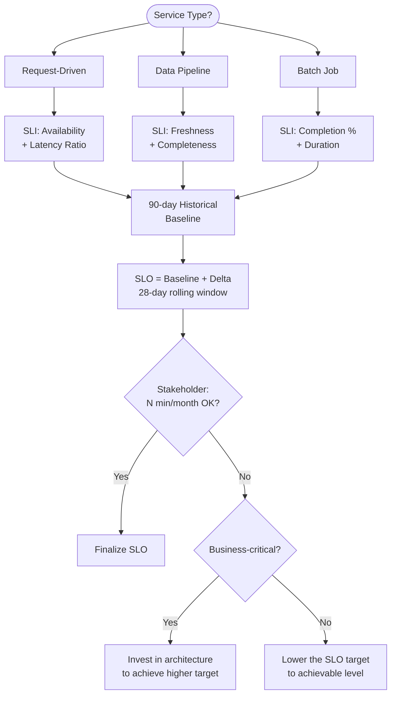

## Keywords in This File

{: .no_toc }

| #   | Keyword | Weight |
| --- | ------- | ------ |
| 1   | [SRE Anti-Patterns - What Breaks Reliability Programs](#sre-anti-patterns---what-breaks-reliability-programs) | high |
| 2   | [SLO Decision Framework](#slo-decision-framework) | critical |

---

# SRE Anti-Patterns - What Breaks Reliability Programs

🎯 Interview Weight: high - demonstrates whether you have seen
SRE succeed and fail in real organizations, not just studied it
from books.

---

### 🎯 Model Answer

**30 seconds:**
> The most common SRE anti-patterns are: SLOs set as aspirational
> targets rather than from historical data, error budgets tracked
> but never enforced, on-call teams drowning in toil with no
> reduction strategy, and SRE positioned as reliability police
> rather than reliability partners. Each of these turns the SRE
> model from an alignment tool into an adversarial one.

**3 minutes (Senior):**
> The SRE model can fail in predictable ways. The most dangerous
> anti-pattern is "SRE as reliability police": when SREs are positioned
> as gatekeepers who must approve every deployment and who block
> teams for reliability reasons, they become the enemy of product
> velocity. Engineers route around them, deployments happen without
> SRE involvement, and the SRE team has no visibility into changes
> that affect reliability. The error budget is the antidote: instead
> of SRE saying "no," the error budget says "the policy says no."
> SRE becomes the policy executor, not the gatekeeper.
>
> The second major anti-pattern is aspirational SLOs. An SLO set
> at "what the business wants" rather than "what the system actually
> achieves" produces an error budget that is perpetually exhausted.
> A perpetually exhausted budget means deployments are always frozen,
> which trains the team to ignore the budget, which makes the budget
> meaningless. Setting SLOs from the 90-day historical baseline and
> improving them incrementally is the only way to keep the budget
> operational.
>
> The third anti-pattern is toil accumulation without measurement.
> When on-call burden is not tracked, toil accumulates invisibly.
> The team hires more SREs (treating toil as a staffing problem
> rather than an engineering problem), but on-call burden per engineer
> stays constant because the new SREs join the same broken rotation.
> The toil ratio measurement is the forcing function that reveals
> the pattern.
>
> The fourth: SRE team positioned as the sole owner of reliability.
> When developers believe reliability is the SRE team's problem,
> they do not design for reliability and they do not participate in
> postmortems or on-call. Reliability is a shared responsibility;
> the SRE team provides the tools, measurement, and consultation,
> not the sole ownership.

**Framework:** WHAT -> WHY -> HOW -> TRADE-OFF -> EXAMPLE

**Blank Mind Recovery:**

**(1) Restate:** "You are asking about SRE anti-patterns - let me
walk through the four most common failure modes and why each breaks
the SRE model."

**(2) First principles:** "SRE is a model for creating shared
reliability accountability through measurement. The anti-patterns
all violate one of: measurement (no SLOs, no toil tracking), shared
accountability (SRE as sole owner), or policy enforcement (SLOs
tracked but not enforced)."

**(3) Bridge:** "SRE anti-patterns are like quality control anti-
patterns in manufacturing. QC that only inspects at the end (not
built-in) catches defects late. SRE that only enforces reliability
at deployment time (not built into development) catches problems
late. Both create adversarial dynamics between quality and speed."

---

### 📘 Concept Explanation

**What it is:**
SRE anti-patterns are organizational and technical patterns that
are common in SRE programs but that undermine the reliability model.
They typically arise from misapplication of SRE principles, incomplete
adoption, or organizational resistance to the model's accountability
requirements.

**The problem it solves:**
Understanding anti-patterns prevents teams from adopting SRE practices
superficially (the form without the substance). Many organizations
implement SLO dashboards without error budgets, or error budgets without
policies, and then declare "SRE doesn't work for us."

**How it works:**

```
THE SIX CRITICAL SRE ANTI-PATTERNS
=====================================

1. ASPIRATIONAL SLO SYNDROME
   What it looks like:
     SLO: 99.99% (never achieved historically)
     Actual: 99.7% consistently
   Effect:
     Error budget exhausted week 1 of every month
     Deployment freezes become constant
     Budget enforcement abandoned
   Why it happens:
     SLO set to "what customers want" not
     "what the system currently delivers"
   Fix:
     Baseline from 90-day rolling average
     SLO = baseline + small margin
     Improve incrementally per quarter

2. ERROR BUDGET WITHOUT POLICY
   What it looks like:
     Dashboard shows budget at 12% remaining
     Deployments continue as normal
     "We track the budget but don't enforce it"
   Effect:
     Budget is a vanity metric
     No organizational behavior change
     Reliability does not improve
   Fix:
     Policy must be agreed at VP level before first use
     CI/CD enforcement (not documentation)
     Exception path documented and required to use

3. TOIL ACCUMULATION WITHOUT MEASUREMENT
   What it looks like:
     Team is always busy but can't describe what they do
     On-call burden is "just how it is"
     SREs hired to absorb toil, not eliminate it
   Effect:
     Linear team growth with systems
     Attrition from on-call burnout
     No engineering work gets done
   Fix:
     Measure toil ratio immediately
     Present data to leadership
     Protect 20% capacity for toil elimination

4. SRE AS RELIABILITY POLICE
   What it looks like:
     SRE approves/blocks every deployment
     Engineers request SRE permission to operate
     "We need an SRE ticket to do that"
   Effect:
     SRE is the bottleneck
     Engineers route around SRE
     SRE loses visibility into changes
   Fix:
     SRE enables self-service, does not gate-keep
     Error budget is the gate, not the SRE team
     SRE role: tooling, consulting, standardization

5. HERO-DRIVEN ON-CALL
   What it looks like:
     Same 1-2 engineers handle all major incidents
     Others "aren't ready yet for on-call"
     Hero engineers are celebrated for handling incidents
   Effect:
     Single point of failure in incident response
     Heroes burn out
     Knowledge not distributed
   Fix:
     All engineers at senior level must be rotation-eligible
     Celebrate incident reduction, not incident handling
     Pair junior engineers with heroes during incidents

6. RELIABILITY OWNERSHIP SILOS
   What it looks like:
     Developers say "reliability is the SRE team's job"
     SRE team owns on-call for services they didn't write
     Postmortems attended only by SRE, not developers
   Effect:
     Developers do not design for reliability
     SRE cannot fix reliability without code access
     Postmortems produce SRE-only action items
   Fix:
     Each service team owns its on-call
     SRE consults and provides tooling
     Postmortems include service developers as authors
```

**The key insight:**
Every anti-pattern is a predictable consequence of adopting the form
of SRE without the substance. SLO dashboards without error budget policy
is the form without the substance. On-call tooling without toil measurement
is the form without the substance. The substance requires organizational
commitment: VP-level buy-in on error budget policy, protected engineering
time for toil reduction, and shared reliability ownership with developers.

---

### 💻 Code Example

**Example 1: Detecting aspirational SLO anti-pattern**

```python
# Script to detect aspirational SLOs by comparing
# SLO targets to historical SLI performance

import requests
from datetime import datetime

PROMETHEUS_URL = "http://prometheus:9090"

def detect_aspirational_slo(
    service: str,
    slo_target: float,
    lookback_days: int = 90
) -> dict:
    """
    Compare SLO target to historical performance.
    Returns analysis of whether SLO is aspirational.
    """
    # Query historical SLI (28-day rolling, sampled daily)
    query = f"""
    avg_over_time(
        (
            increase(http_requests_total{{
                status=~"2..", app="{service}"
            }}[28d])
            /
            increase(http_requests_total{{
                app="{service}"
            }}[28d])
        )[{lookback_days}d:1d]
    )
    """

    response = requests.get(
        f"{PROMETHEUS_URL}/api/v1/query",
        params={"query": query}
    )
    data = response.json()

    if not data["data"]["result"]:
        return {"error": f"No data for {service}"}

    historical_sli = float(
        data["data"]["result"][0]["value"][1]
    )

    slo_achievable = historical_sli >= slo_target
    gap = slo_target - historical_sli

    return {
        "service": service,
        "slo_target": f"{slo_target:.4%}",
        "historical_sli": f"{historical_sli:.4%}",
        "achievable": slo_achievable,
        "gap": f"{gap:.4%}" if not slo_achievable else "0",
        "recommendation": (
            "SLO is aspirational. Baseline to current "
            f"performance: {historical_sli:.4%}"
            if not slo_achievable else
            "SLO appears achievable."
        )
    }

result = detect_aspirational_slo(
    service="payment-api",
    slo_target=0.9999,  # 99.99% target
    lookback_days=90
)
print(result)
# {
#   "service": "payment-api",
#   "slo_target": "99.9900%",
#   "historical_sli": "99.7200%",
#   "achievable": false,
#   "gap": "0.2700%",
#   "recommendation": "SLO is aspirational..."
# }
```

> **Code walkthrough:** This script detects the most common SRE
> anti-pattern by comparing the SLO target against the actual 90-day
> historical SLI. A gap of 0.27% (SLO target 99.99%, actual 99.72%)
> confirms the aspirational SLO: the error budget is exhausted in the
> first 3 days of every month, making enforcement impossible. The output
> drives the organizational conversation: "Here is the data showing the
> SLO needs to be reset to 99.72% (current baseline) before we can
> make error budget policy meaningful."

---

### 🎓 Answers by Seniority

**Junior / Mid (0-5 years):**
> The most common SRE anti-patterns are: SLOs set too high
> (aspirational, always exhausted), error budgets tracked but
> not enforced (vanity metrics), and the SRE team positioned as
> a gatekeeper (SRE blocks deploys instead of enabling self-service).
> Each of these turns the SRE model from an alignment tool into an
> adversarial system. The key test for any SRE program: does the
> error budget change organizational behavior, or is it just a dashboard?

---

**Senior / Staff (5+ years):**
> The most dangerous anti-pattern is what I call "cargo-cult SRE":
> adopting SRE vocabulary (SLOs, error budgets, toil) and tooling
> (dashboards, alerting) without the organizational commitment that
> makes them work. I have seen organizations with beautiful SLO
> dashboards and never-enforced error budgets, elaborate postmortem
> templates that produce no action items, and toil measurement that
> shows 70% toil ratio for years without management response. The
> form without the substance is actually worse than no SRE program,
> because it creates the illusion of reliability management while
> the underlying problems compound.

---

### ⚠️ Common Misconceptions

| Misconception | Reality |
|---|---|
| More SRE headcount solves reliability problems | If the root cause is aspirational SLOs or unenforced error budgets, more SREs inherit the same broken system |
| SRE anti-patterns are rare | Most organizations adopting SRE encounter at least 2-3 of these patterns; they are the default failure modes, not edge cases |
| The solution to toil is automation | Automation addresses toil, but the anti-pattern is not-measuring toil; measurement comes first, automation follows |
| Aspirational SLOs motivate teams to improve | Aspirational SLOs that are always breached teach teams that SLOs are meaningless; they demotivate rather than motivate |
| SRE works only at Google scale | Many anti-patterns become worse at small organizations where there is less organizational power to enforce the model's requirements |

---

### 🚨 Failure Modes and Diagnosis

**Failure 1: Cargo-cult SRE adoption**

*Symptom:* Organization announces "we are adopting SRE." Six months
later: SLO dashboards exist, nobody looks at them. Error budget
is at -300% (exhausted for months). Postmortem template is filled
out but action items are never tracked. On-call burden is unchanged.
Developers still say "reliability is the SRE team's problem."

*Root cause:* SRE was adopted as a tooling initiative (dashboards,
templates) without the organizational commitment (VP-level policy
enforcement, protected reliability time, shared ownership culture).

*Diagnostic:*
```
Three questions that reveal cargo-cult SRE:
  1. "When was the last deployment blocked by the
     error budget policy?" If answer is "never":
     the policy is not enforced.
  2. "What is the team's toil ratio?" If answer is
     "I don't know": toil is not measured.
  3. "Who is responsible for the reliability of
     service X?" If answer is "the SRE team":
     ownership is siloed.
One "never" or "I don't know" = cargo-cult signal.
```

*Fix:* Executive reset: identify the one anti-pattern with the
highest organizational cost (usually aspirational SLOs or unenforced
policy). Resolve it at VP level with explicit commitment. Build
credibility from one improvement before attempting all six.

---

### 🎯 Interview Deep-Dive

| Preparation | Target |
|---|---|
| Time to prep | 15 minutes |
| Core themes | 6 anti-patterns, cargo-cult SRE, measurement-first approach |
| Seniority signal | Junior: names patterns; Senior: explains why each fails and the fix |
| Common trap | Describing anti-patterns without organizational context |
| Staff differentiator | Cargo-cult SRE, executive buy-in as prerequisite, measurement-first |

---

**Q1 [MID]: What is the most damaging SRE anti-pattern in your
experience and why?**

The most damaging is the "aspirational SLO" because it cascades into
every other anti-pattern. When the SLO is set above what the system
achieves historically, the error budget is immediately exhausted. An
exhausted budget forces either: constant deployment freezes (which
teams resist and route around) or enforcement abandonment (which makes
the budget a vanity metric). Either way, the error budget - the central
organizational mechanism of SRE - becomes meaningless. Without a working
error budget, the toil conversation ("we can't deploy while budget is
exhausted, so we have no incentive to reduce toil") fails, and the
shared accountability model collapses.

The fix is data-driven SLO setting: use the 90-day historical SLI as
the baseline and set the SLO 0.1-0.5 percentage points above it. This
ensures the budget is achievable, enforcement is possible, and the
organization can start the reliability improvement cycle.

*What separates good from great:* Explains the cascade from aspirational
SLO to broken error budget to failed SRE model.

---

**Q2 [SENIOR]: How do you fix a reliability police culture where
SRE has become a gatekeeper?**

The SRE-as-reliability-police pattern requires two changes: technical
and cultural.

Technical: replace manual SRE approval gates with automated policy
enforcement. The error budget gate in the CI/CD pipeline replaces the
SRE approval step for deployment decisions. The configuration policy
in OPA replaces the SRE review for configuration changes. Remove the
SRE from the critical path for decisions that can be policy-automated.

Cultural: shift the SRE value proposition from gatekeeping to enabling.
SRE becomes the team that builds the tools that let product teams deploy
safely and monitor their own services. Instead of "ask SRE before
deploying," the model becomes "use the platform SRE built to deploy
safely without asking."

This requires SRE to give up control in exchange for scale. An SRE team
that gates 10 services can do it manually. An SRE team that enables 100
services must use policy automation. The reluctance to give up manual
control is the cultural barrier.

The organizational message: "SRE's job is to make reliability easy for
developers, not to be the reliability team. We succeed when developers
can deploy safely without us."

*What separates good from great:* Separates the technical (policy
automation replaces approval gates) from the cultural (shift from
gatekeeping to enabling) and explains the SRE incentive to give up control.

---

**Q3 [STAFF]: How do you introduce SRE practices into an organization
without creating anti-patterns from the start?**

Start with measurement before tooling. Before building any SLO dashboard
or error budget calculator, measure the current state: what is the current
availability? What is the toil ratio? How long does the average incident
last? This creates the baseline and the data-driven case for the investment.

Secure executive buy-in for the policy mechanism before implementing
the measurement. The error budget is only useful if the policy is enforced.
Get VP-level agreement on the policy (what happens when budget is exhausted)
before the first SLO is set. Without this, the SLO is documentation.

Start with one team and one service, not the whole organization. Pick
a team that is motivated, a service with reasonable historical data, and
a VP who understands the model. Get one success story - the error budget
policy enforced once, with positive outcome. Then expand.

Avoid the six anti-patterns by design: set SLOs from historical data
(not aspirational targets), get policy sign-off before implementing,
measure toil from day one, build self-service tooling rather than approval
gates, create shared on-call from the beginning, and make postmortem
participation open to developers.

*What separates good from great:* Gives the measurement-first approach,
the executive-buy-in prerequisite, and the one-team-first rollout strategy
as the three key elements of anti-pattern prevention.

---

### ⚖️ Comparison Table

| Anti-Pattern | Root Cause | Organizational Symptom | Fix |
|---|---|---|---|
| Aspirational SLO | SLO set from business wish, not data | Budget always exhausted, enforcement abandoned | Reset to historical baseline + increment quarterly |
| Budget without policy | Policy not agreed at VP level | Budget tracked but never enforced | VP sign-off on policy before SLO launch |
| Toil accumulation | No measurement | Linear team growth, burnout, no engineering work | Measure toil ratio; protect 20% for elimination |
| Reliability police | SRE owns gates, not enablement | Developers route around SRE, visibility lost | Replace approval gates with policy automation |
| Hero culture | Individual celebrated, not system | Burnout, SPOF, knowledge silo | Celebrate reduction, require all seniors on rotation |
| Ownership silos | "Reliability is SRE's problem" | No reliability in dev design, SRE cannot fix without code | Shared on-call; SRE as consultant, not owner |

---

### 🏛️ System Design

*(Omit: SRE Anti-Patterns is an organizational patterns keyword.
System design for reliability programs is addressed in the L5
Architecture file.)*

---

### 📊 Diagram

*(Omit: The six anti-patterns are best presented in table format as
shown in the Concept Explanation section. A diagram does not add
significant value for this conceptual keyword.)*

---

---

# SLO Decision Framework

🎯 Interview Weight: critical - the most common SRE interview
question at senior level; your ability to reason through SLO
design decisions demonstrates whether you can apply SRE
practice to real services.

---

### 🎯 Model Answer

**30 seconds:**
> The SLO decision framework answers: what to measure, what threshold
> to set, and what window to use. Measure what users actually experience
> (availability or latency ratio, not infrastructure metrics). Set the
> threshold from historical performance data plus a small improvement
> margin. Use a rolling 28-day window to prevent reset-race behavior.
> Every SLO decision must be validated with a stakeholder: "If this
> service performs below this threshold, is that a business problem?"

**3 minutes (Senior):**
> SLO design has three decisions, each with a specific method. First:
> what to measure (the SLI selection). The SLI must reflect the user's
> experience of the service. For a request-driven service, the primary
> SLI is availability (fraction of requests returning 2xx within the
> latency threshold). For a data pipeline, it might be freshness
> (fraction of data available within the SLA window). For a batch job,
> processing completeness (fraction of records processed successfully).
> The wrong SLI is an infrastructure metric (CPU utilization, disk
> space) - these do not directly capture user experience.
>
> Second: what threshold to set. Start with the 90-day historical average
> SLI value. Set the SLO target slightly above this baseline (typically
> 0.1 to 0.5 percentage points). This ensures the error budget is non-
> trivially achievable. As reliability improves each quarter, tighten
> the SLO to match the new baseline.
>
> Third: what window to use. Rolling 28-day windows are preferred over
> calendar-month windows because they prevent the "reset race" behavior
> where teams deplete their budget in the first week after a reset,
> knowing it will reset again in 3 weeks. Rolling windows create
> consistent incentives regardless of when in the month you are.
>
> The validation test: after selecting the SLI, threshold, and window,
> present the SLO to the business stakeholder: "If this service delivers
> below this threshold 1 day per month, is that a customer-impacting
> business problem?" If the answer is "no," the SLO is too strict.
> If the answer is "yes, we would lose customers," the SLO is appropriately
> calibrated.

**Framework:** WHAT -> WHY -> HOW -> TRADE-OFF -> EXAMPLE

*Adapting up:* Staff adds: "The hardest SLO design challenge is for
services where the user expectation is implicit and the failure mode
is subtle. A recommendation service that returns "good enough" recommendations
when the ML model is degraded is 'available' by standard SLI measurement
but is providing a degraded experience. For these services, quality SLIs
(fraction of requests returning high-confidence recommendations) replace
or supplement availability SLIs."

*Adapting down:* Junior: "An SLO is a target for service behavior.
Setting one requires three decisions: what to measure (use something
users notice if it fails), what threshold (start from historical
average, not wishful thinking), and what time window (28 rolling days).
The simplest validation: could a business stakeholder explain this SLO
to a customer without confusion?"

**Blank Mind Recovery:**

**(1) Restate:** "You are asking about the SLO decision framework -
let me walk through the three decisions: SLI selection, threshold
setting, and window selection, with the reasoning for each."

**(2) First principles:** "An SLO is a quantitative commitment about
service behavior. To be useful, it must: measure what users experience,
be achievable based on historical performance, and convert violations
into organizational action. Each of the three decisions serves one
of these requirements."

**(3) Bridge:** "Setting an SLO is like setting a performance target
for a sales team. You measure what drives the business (revenue, not
activities). You set the target slightly above historical average
(achievable but improving). You use a consistent measurement window
(annual quota, not weekly quotas that reset and create gaming)."

---

### 📘 Concept Explanation

**What it is:**
The SLO decision framework is the structured approach to designing
Service Level Objectives that are measurable, meaningful, achievable,
and operationally useful. It produces three outputs: the SLI (what
to measure), the SLO target (what threshold), and the measurement window.

**The problem it solves:**
Without a framework, SLOs are set by intuition or stakeholder pressure,
leading to aspirational targets that are perpetually breached or trivially
low targets that provide no improvement incentive. A structured framework
produces SLOs that drive the reliability improvement cycle.

**How it works:**

```
SLO DECISION FRAMEWORK - 5 STEPS
===================================

STEP 1: IDENTIFY THE USER JOURNEY
  Map the critical paths users take through the service.
  For each path, identify: what does success look like
  for the user? What does failure look like?
  Example: Checkout service
    Success: payment confirmed within 3 seconds
    Failure: error returned, or timeout, or wrong amount

STEP 2: SELECT THE SLI
  The SLI must measure the user's success/failure
  directly, not infrastructure proxies.

  SLI selection guide:
    Service type   | Primary SLI | Secondary SLI
    Request-driven | Availability | Latency
    Data pipeline  | Freshness    | Completeness
    Batch job      | Completion % | Duration
    Storage        | Durability   | Throughput
    Search/ML      | Quality      | Availability

  SLI formula options:
    Request availability:
      good_requests / total_requests
    Latency (fraction below threshold):
      requests_below_threshold / total_requests
    Freshness:
      requests_with_fresh_data / total_requests

STEP 3: SET THE TARGET FROM DATA
  Data requirements:
    - 90 days of historical SLI data minimum
    - Per-service, not shared with dependencies
    - Request-based (not time-based)
  
  Target formula:
    Look at 90-day p50 SLI (typical performance)
    Add small improvement delta (0.1 - 0.5%)
    Round to practical precision (99.x%)
  
  Anti-pattern: setting from business wish
    "We want 99.99% because our competitors claim it"
    -> Aspirational SLO, budget always exhausted

STEP 4: CHOOSE THE WINDOW
  Rolling 28-day window (recommended):
    Pros: consistent incentives, no reset race
    Cons: recovery after major incidents is slow
  Calendar month (simpler):
    Pros: aligns with billing cycles
    Cons: reset race behavior in first week post-reset
  Rule: rolling 28-day unless billing alignment required

STEP 5: VALIDATE WITH STAKEHOLDERS
  Present to business owner:
    "At [SLO target], this service can be unavailable for
     [N minutes] per month without breaching the SLO.
     Is that acceptable?"
  Validate with engineering:
    "Can this service achieve this target given current
     architecture and team investment level?"
  Both must answer "yes" before the SLO is finalized.
```

**The key insight:**
The SLO is a contract between the reliability team and the business.
For the contract to be meaningful, both parties must have agreed to
it before the first measurement period. An SLO imposed by SRE on product
is a technical metric. An SLO agreed upon by product and SRE is a
business commitment. The stakeholder validation step is what makes
the SLO a shared commitment.

**When to use it:**
Apply the SLO decision framework to every production service before
it goes live. For existing services without SLOs, apply retroactively
using historical data. The SLO sets the baseline; the error budget
and policy then follow automatically.

**When NOT to use it:**
Internal tooling, development environments, and services with no
external users may not require formal SLOs. The overhead of maintaining
an SLO is justified only when the service's reliability affects users
or business outcomes.

**Alternatives:**
- SLA-first approach: work backward from customer SLA commitments
  to internal SLO targets. Appropriate when customer contracts are fixed.
- Service tiers: different SLO templates for tier 1 (customer-facing),
  tier 2 (internal), tier 3 (supporting). Reduces per-service design
  overhead.

**First-principles derivation:**
An SLO must answer: "How much unreliability can this service tolerate
before users notice or the business suffers?" The framework operationalizes
this question: SLI selection answers "what do users notice?", threshold
setting answers "how much is tolerable based on historical reality?",
and window selection answers "over what period should we measure?"

---

### 💻 Code Example

**Example 1: SLI selection by service type**

```python
# BAD: SLI based on infrastructure metrics
# Infrastructure metrics do not reflect user experience.
# CPU high does not mean users are affected;
# CPU normal does not mean users are not affected.
SLI = "CPU utilization < 80%"

# GOOD: SLI based on user-visible service behavior
# Example 1: Request-driven API service
SLI_REQUEST_AVAILABILITY = """
  sum(rate(http_requests_total{status=~"2.."}[5m]))
  /
  sum(rate(http_requests_total[5m]))
"""
# Target: 99.9% of requests succeed

# Example 2: Latency SLI (for latency-sensitive service)
SLI_LATENCY = """
  sum(rate(
    http_request_duration_seconds_bucket{le="0.3"}[5m]
  ))
  /
  sum(rate(
    http_request_duration_seconds_count[5m]
  ))
"""
# Target: 95% of requests complete within 300ms

# Example 3: Freshness SLI (for data pipeline)
SLI_FRESHNESS = """
  sum(
    data_pipeline_rows_fresh_count[1h]
  )
  /
  sum(
    data_pipeline_rows_total_count[1h]
  )
"""
# Target: 99% of data is < 1 hour old

# Example 4: Batch job completion SLI
SLI_COMPLETION = """
  batch_job_records_processed_total
  /
  batch_job_records_submitted_total
"""
# Target: 99.5% of submitted records are processed
```

> **Code walkthrough:** The BAD SLI (CPU utilization) is an
> infrastructure metric - it does not measure what users experience.
> The GOOD examples show SLI selection by service type. The request
> availability SLI measures user-visible success rate directly. The
> latency SLI measures the fraction of requests within the user-
> acceptable latency threshold. The freshness SLI measures whether
> data is current enough for users - relevant for data pipelines
> where stale data is the failure mode. Each SLI is a ratio that
> directly captures the user-visible success dimension.

**Example 2: SLO target from historical data**

```python
#!/usr/bin/env python3
# SLO target calculation from historical SLI data
# Uses Prometheus API to query 90-day SLI history

import requests
import statistics

def calculate_slo_target(
    service: str,
    slo_type: str = "availability",
    lookback_days: int = 90,
    improvement_delta: float = 0.001  # 0.1%
) -> dict:
    """
    Calculate recommended SLO target from
    historical performance data.
    """
    # Build query based on SLO type
    if slo_type == "availability":
        sli_query = f"""
            avg_over_time(
                (increase(http_requests_total{{
                    status=~"2..", app="{service}"
                }}[1d])
                /
                increase(http_requests_total{{
                    app="{service}"
                }}[1d])
                )[{lookback_days}d:1d]
            )
        """

    response = requests.get(
        "http://prometheus:9090/api/v1/query",
        params={"query": sli_query}
    )

    # Get the average SLI over the period
    avg_sli = float(
        response.json()["data"]["result"][0]["value"][1]
    )

    # Recommended SLO: historical average + delta
    # Round to 3 decimal places (nearest 0.1%)
    recommended_slo = round(avg_sli + improvement_delta, 3)

    # Error budget at recommended SLO
    monthly_minutes = 30 * 24 * 60  # 43,200 min
    budget_minutes = (
        (1 - recommended_slo) * monthly_minutes
    )

    return {
        "service": service,
        "historical_avg_sli": f"{avg_sli:.4%}",
        "recommended_slo_target": f"{recommended_slo:.3%}",
        "monthly_error_budget_minutes": (
            f"{budget_minutes:.1f} min/month"
        ),
        "recommendation": (
            f"Set SLO to {recommended_slo:.3%}. "
            f"This gives {budget_minutes:.0f} min/month "
            f"error budget."
        )
    }

result = calculate_slo_target(
    service="checkout-api",
    improvement_delta=0.001  # Target 0.1% above baseline
)
print(result)
```

> **Code walkthrough:** This script automates the SLO target calculation
> by querying 90 days of historical SLI data from Prometheus. The
> recommended SLO is the historical average plus a 0.1% improvement
> delta - this ensures the SLO is achievable (based on historical
> reality) while providing a small improvement incentive. The output
> also calculates the resulting monthly error budget in minutes,
> making the business conversation concrete: "the recommended SLO
> gives you 43 minutes per month of allowed downtime."

---

### 🎓 Answers by Seniority

**Junior / Mid (0-5 years):**
> The SLO decision framework has three steps: select the SLI (measure
> what users experience, not infrastructure), set the target from
> historical data (90-day average plus a small improvement margin),
> and choose a 28-day rolling window (prevents reset racing). Validate
> with the business: "At this target, the service can be down N minutes
> per month - is that acceptable?" The anti-pattern: setting SLOs
> from business wish rather than historical data creates aspirational
> targets that are always breached.

---

**Senior / Staff (5+ years):**
> The hardest part of SLO design is the stakeholder conversation.
> Technical teams default to "five nines" because it sounds good.
> Business stakeholders default to "we want 100% reliability." Neither
> reflects reality. The framework converts this into a data conversation:
> "Here is what the service has actually delivered over the last 90
> days. The proposed SLO is slightly above this baseline. At this SLO,
> the service can be unavailable for 43 minutes per month. Is that
> acceptable for a service used for internal reporting? For customer
> payments?"
>
> The answer is different for different service criticalities, which
> is why SLO design requires business stakeholder involvement - the
> engineers do not know which 43 minutes of downtime the business
> can absorb.

---

### ⚠️ Common Misconceptions

| Misconception | Reality |
|---|---|
| SLOs should be set at the business's desired availability | SLOs must be set from historical achievable performance; aspirational SLOs produce perpetually exhausted budgets |
| One SLO per service is sufficient | Most services need multiple SLOs: one for availability, one for latency, potentially one for quality or freshness; each captures a different failure mode |
| SLOs never change once set | SLOs should be reviewed and tightened quarterly as reliability improves; they are a continuous improvement mechanism, not a fixed target |
| The SLO should match the SLA | The SLO should be stricter than the SLA to create a buffer; SLO breach does not immediately trigger SLA breach, giving time to remediate |
| SLO tightness is purely a technical decision | SLO targets have business implications (deployment freeze triggers, engineering investment requirements); they must be agreed at the business stakeholder level |

---

### 🚨 Failure Modes and Diagnosis

**Failure 1: SLO set without stakeholder validation**

*Symptom:* The SRE team sets SLOs for all 50 services in a
two-week sprint. Six months later, product teams complain that
the SLOs are arbitrary, the error budgets do not reflect business
priority, and the deployment freeze policy is blocking important
releases.

*Root cause:* SLOs were set as a technical exercise without
business stakeholder involvement. The SLOs were technically
correct (based on historical data) but not validated against
business requirements.

*Diagnostic:*
```
Ask product managers and business owners:
  "Were you involved in setting the SLO
  for your service?"
  "Does the SLO threshold represent a level
  of service that is meaningful to users?"
  "When the error budget is exhausted, does
  the deployment freeze make sense for your
  product roadmap?"
If all "no": SLOs were set without stakeholders.
```

*Fix:* Conduct SLO review sessions with product owners for all
Tier 1 services. Present: current SLO, historical performance,
error budget, what triggers a deployment freeze. Adjust SLO
thresholds based on business criticality.

**Failure 2: Multiple competing SLOs create conflicting obligations**

*Symptom:* A search service has an availability SLO (99.9%),
a latency SLO (95% of requests < 200ms), and a quality SLO
(90% of queries return relevant results). During a degraded state,
the service is available and fast but quality is low. The quality
SLO is breached but availability and latency are fine. Nobody
knows which SLO takes precedence or what the error budget policy
should do.

*Root cause:* Multiple SLOs without a priority ordering or a
composite SLO design.

*Fix:* Define SLO priority: customer-facing availability is
primary, customer-facing latency is secondary, quality is tertiary.
When the error budget policy triggers, it applies to whichever
SLO is breached first. Alternatively, create a composite SLO:
a request counts as "good" only if it meets all three criteria.

*Prevention:* When designing multiple SLOs for a service, define
the priority ordering and the composite SLO definition in advance.

---

### 🎯 Interview Deep-Dive

| Preparation | Target |
|---|---|
| Time to prep | 20 minutes |
| Core themes | SLI selection, data-driven target setting, window selection, stakeholder validation |
| Seniority signal | Junior: names the steps; Senior: explains SLI selection and historical baseline |
| Common trap | Proposing aspirational SLO targets without historical data |
| Staff differentiator | Quality SLIs, composite SLOs, SLO tightening roadmap |

---

**Q1 [MID]: Walk me through how you would set an SLO for a payment
processing API from scratch.**

Five steps: user journey, SLI selection, historical baseline, target
setting, and stakeholder validation.

User journey: "A user submits a payment and receives confirmation."
Success: payment confirmed with HTTP 200 within 3 seconds. Failure:
error response, timeout, or incorrect amount.

SLI selection: two SLIs. Primary: availability (successful payments /
total payment attempts). Secondary: latency (fraction of payments
confirmed within 3 seconds). Payment accuracy would be a third SLI
but requires business-logic verification beyond standard monitoring.

Historical baseline: query the last 90 days. Suppose availability was
99.72% on average and p99 latency was 1.8 seconds (all under 3 seconds).

Target setting: availability SLO = 99.8% (above the 99.72% baseline).
Latency SLO = 99% of requests within 3 seconds. These give the error
budget: 99.8% availability means 86.4 minutes/month of allowed downtime.

Stakeholder validation: "A payment service at 99.8% availability can
have 86 minutes of downtime per month without breaching the SLO. During
peak periods (holidays, weekends), is 86 minutes of downtime acceptable,
or does this service require a stricter SLO?" If the business says "86
minutes is too much for Black Friday," tighten for the peak window or
invest in higher availability architecture.

*What separates good from great:* Walks through all five steps with
specific numbers, includes two SLIs (availability and latency), and
raises the peak-period question for stakeholder validation.

---

**Q2 [SENIOR]: How do you design SLOs for a data pipeline where
availability and latency are not the right metrics?**

Data pipelines fail in ways that request-driven services do not:
data arrives late, data is incomplete, data is incorrect. Standard
availability SLIs (fraction of successful requests) do not capture
these failures.

The three relevant SLI types for data pipelines:

Freshness SLI: what fraction of data is available within the expected
freshness window? If the SLA says "data is updated every 30 minutes,"
the SLI measures the fraction of reporting windows where data was updated
within 30 minutes. Formula: (windows with fresh data / total windows).

Completeness SLI: what fraction of expected records arrived? If the
pipeline expects 1 million records per day, completeness measures
(records received / records expected). A completeness of 95% means
5% of records were dropped.

Quality SLI: what fraction of records pass validation checks (correct
schema, valid values, referential integrity)? This catches data corruption
that completeness misses.

For the SLO design: each pipeline gets freshness + completeness SLIs.
Quality SLI is added for pipelines where data quality is business-critical.
The targets are set the same way: historical baseline plus improvement
delta, validated with the data consumers (BI team, product analytics,
finance) who are the "users" of the data pipeline.

*What separates good from great:* Identifies all three data pipeline SLI
types, explains why standard availability SLIs are insufficient, and
identifies the "users" for stakeholder validation.

---

**Q3 [SENIOR]: BEHAVIORAL: Tell me about a time you convinced a
stakeholder to accept a lower SLO than they initially requested.**

**Situation:** Product VP requested a 99.99% SLO for the recommendation
service, reasoning that competitors claimed four-nines availability.

**Task:** Explain why 99.99% was unachievable and agree on an appropriate
SLO.

**Action:** Prepared three data points: the service's 90-day historical
SLI (99.65%), the cost of 99.99% availability (approximately $1.2M in
additional infrastructure and engineering), and a comparison with the
actual user impact of the current reliability level (average user experience
includes 3 hours per year of degraded recommendations - they get generic
suggestions, not personalized ones).

I reframed the conversation: "99.99% means 52 minutes per year of any
failure. Our current performance has 30 hours per year of degraded state.
The SLO that reflects what we actually deliver is 99.65%. The path to
99.9% requires 6 months of reliability investment. The path to 99.99%
requires 18 months and $1.2M. Let's set the SLO at 99.65% now and create
a quarterly improvement roadmap."

**Result:** VP agreed to 99.65% SLO with a roadmap to 99.9% in 2 quarters.
The roadmap was funded. Six months later, the service achieved 99.87%.
The SLO was tightened to 99.9%.

*What separates good from great:* Uses specific numbers (30 hours/year
of degradation, 99.65% historical, $1.2M cost), proposes a roadmap rather
than just rejecting the request, and reports the outcome.

---

**Q4 [STAFF]: How do you design a tiered SLO program for 100 services?**

Designing individual SLOs for 100 services takes months and creates
inconsistency. A tiered approach reduces the design overhead while
maintaining appropriate differentiation.

Tier 1 (customer-facing, revenue-critical): 15-20 services. Full SLO
design process: SLI selection, historical baseline, stakeholder validation,
quarterly review. SLO targets are tightest because business impact of
degradation is highest.

Tier 2 (internal-facing, business-important): 30-40 services. Standardized
SLO template: availability 99.5%, latency 95th percentile within 500ms.
Teams select their SLI from a standard menu. Stakeholder validation is
a lightweight review with the internal consumer team.

Tier 3 (supporting services, infrastructure): remaining services. Standard
SLO applied automatically at service creation: availability 99.0%. No
per-service customization required. Teams can opt into a higher tier
by requesting the full design process.

The enabling platform: a standard SLI/SLO template applied to all services
at creation (via service mesh, standard dashboards, or Kubernetes admission
controls). Every service gets baseline monitoring and SLO tracking without
manual SRE involvement.

The quarterly SLO review: Tier 1 services are reviewed quarterly against
business requirements. Tier 2 services are reviewed annually or after
major incidents. Tier 3 services are reviewed when they approach Tier 2
criticality.

*What separates good from great:* Designs three tiers with specific
targets and review cadences, describes the enabling platform mechanism,
and explains the criteria for tier promotion.

---

**Q5 [STAFF]: How do you handle SLOs for services with external
dependencies that you don't control?**

External dependencies (cloud provider APIs, payment processors, third-party
SaaS) create a composite availability challenge: the service's SLO is
limited by the dependency's reliability.

Three approaches, with trade-offs:

Absorb the dependency into the SLO: measure composite availability (service
+ dependency) as the SLI. The SLO reflects what users actually experience.
If the payment processor has 99.9% availability, the payment service's
SLO ceiling is 99.9%. This is honest but means the service can never
outperform its dependency.

Exclude dependency failures with explicit carve-out: define the SLI as
"availability excluding periods of confirmed dependency failure." Requires
dependency health tracking and incident annotation. Appropriate when
the dependency SLA is contractually guaranteed and the carve-out is
in the user-facing SLA.

Implement resilience to reduce dependency coupling: failover to a secondary
provider, cached fallback responses, graceful degradation. This improves
the composite SLI beyond the dependency's SLI floor. A payment service
with a backup processor can achieve 99.99% composite availability even
when primary processor is 99.9%.

The recommendation: use approach 3 for business-critical dependencies
where the investment is justified, approach 1 for secondary dependencies
where carve-outs are impractical, and approach 2 for SLA compliance
contexts where contractual accuracy is required.

*What separates good from great:* Describes all three approaches with
trade-offs, recommends resilience (approach 3) as the highest reliability
solution, and describes the context where each is appropriate.

---

**Q6 [STAFF]: What is the difference between an SLO and an SLA,
and how should the SLO be set relative to the SLA?**

An SLO (Service Level Objective) is an internal reliability target that
the engineering team commits to achieving. It drives the error budget,
deployment policy, and reliability investments.

An SLA (Service Level Agreement) is an external contractual commitment
to customers, with financial penalties (credits, refunds) for breach.
SLAs are negotiated with customers and have legal consequences.

The relationship: the SLO must be stricter than the SLA by a defined
margin. The margin is the "SLO buffer" - the difference between the SLO
threshold and the SLA threshold. When the SLO is breached, the team has
time to remediate before the SLA breach occurs.

Example: SLA commits to 99.9% monthly availability. The internal SLO
should be 99.95%. This gives a 0.05% buffer (approximately 21 minutes/month)
between SLO breach and SLA breach. When the SLO is breached (budget at
risk), the team has 21 minutes of remediation time before customer credits
are triggered.

The SLO buffer should be sized based on: the team's typical MTTR (can
they remediate within the buffer?), the cost of SLA breach (higher penalty
= larger buffer needed), and the historical variance of the SLI around
the SLO threshold.

*What separates good from great:* Gives a specific numerical example
of the SLO-SLA relationship, explains the buffer sizing factors, and
connects the buffer to MTTR.

---

**Q7 [STAFF]: How do you convince engineers to accept a tighter
SLO that will require architectural changes?**

Engineers often resist SLO tightening because it implies reliability
investment work that competes with feature development. The resistance
is legitimate - tighter SLOs require real engineering work.

The conversation framework has four elements:

Data presentation: show the current SLI performance over the last 90
days. Show the user-visible incidents that occurred. Quantify the
business impact of those incidents (revenue, support tickets, churn
risk). This converts an abstract reliability discussion into a business
cost conversation.

Incremental roadmap: do not propose moving from 99.5% to 99.99% in
one quarter. Propose quarterly increments: 99.5% -> 99.7% -> 99.9%
-> 99.95%. Each quarter, the team achieves the increment with targeted
reliability investments. The incremental approach reduces the perceived
magnitude of each step.

Engineering investment: identify the specific architectural changes
required for the next increment. Estimate the engineering cost. Propose
it as a reliability investment with an expected return (reduced incidents,
reduced on-call burden, potential SLA improvement).

Protected time: get management commitment to allocate 20% of engineering
capacity to reliability work. Without protected time, reliability
improvements are perpetually deprioritized. The SLO tightening roadmap
is only credible if the time investment is guaranteed.

*What separates good from great:* Provides a four-element framework
(data, incremental roadmap, engineering investment, protected time)
and explains why each element is necessary for successful SLO negotiation.

---

### ⚖️ Comparison Table

| SLO Design Approach | Accuracy | Stakeholder Alignment | Implementation Speed | When to Use |
|---|---|---|---|---|
| Historical baseline (recommended) | High - based on actual performance | Medium - requires stakeholder negotiation | Medium | New SLO programs with data available |
| Aspirational (avoid) | Low - usually unachievable | High initially (stakeholders like big numbers) | Fast | Never - produces broken error budgets |
| SLA-derived | Medium - uses contractual target | High - aligns with customer commitments | Medium | When customer SLA is fixed first |
| Industry benchmark | Low-medium - different architectures | Medium | Fast | Starting point only, not final target |
| Tiered template | Medium - not per-service optimized | Low-medium | Very fast | 100+ services, standardization needed |

---

### 🏛️ System Design

*(Omit: SLO Decision Framework is an analytical process keyword.
The system design for SLO monitoring infrastructure is addressed
in the L4 Production Diagnostics file.)*

---

### 📊 Diagram

```
SLO DESIGN DECISION TREE
===========================
        Service Type?
       /    |      \
 Request  Data    Batch
-driven  Pipeline  Job
   |         |       |
 Avail +  Fresh +  Completion
Latency  Complete  + Duration
   |         |       |
    \        |      /
     Historical baseline
          (90 days)
          |
    SLO = baseline + delta
          |
    Window: 28-day rolling
          |
    Stakeholder validation:
    "Is N min/month acceptable?"
          |
       YES -> Finalize
        NO -> Adjust target or architecture
```



> **Diagram walkthrough:** The SLO design decision tree starts with
> service type classification to select the appropriate SLI category.
> All paths then converge on the historical baseline calculation and
> target setting. The stakeholder validation step is the critical gate:
> if the business cannot accept the achievable SLO, the choice is
> between investing in architecture to improve the baseline or accepting
> a lower SLO that matches business requirements. Both are valid outcomes;
> the framework ensures the decision is explicit and informed.

---

### Field Q&A

**Production Failures:**

1. A team set an SLO of 99.99% for a service that had historically
   delivered 99.6%. The error budget was exhausted in 2 hours on
   month 1. All deployments were frozen for 28 days. What was the
   process failure and how do you fix it?
   > Aspirational SLO set without historical data analysis. The 0.39%
   > gap between target (99.99%) and historical (99.6%) meant the error
   > budget was exhausted in minutes. Fix: reset the SLO to 99.6%
   > (current historical baseline). Run the 5-step decision framework.
   > Create a quarterly improvement roadmap: 99.6% -> 99.7% -> 99.8%
   > -> 99.9%, with each increment funded and tracked.

2. A service has two SLOs: availability (99.9%) and latency (95th
   percentile < 200ms). During a degraded period, availability is
   99.95% but latency p95 is 350ms. The availability error budget is
   healthy, but the latency budget is exhausted. Product requests to
   continue deploying because "availability is fine." What is the
   correct policy response?
   > Both SLOs are independent. An exhausted latency error budget
   > is an exhausted error budget. The deployment freeze policy applies
   > to any exhausted budget, not just the availability budget. The
   > distinction: users are experiencing a service that is technically
   > "available" but failing its latency commitment. This is a real
   > user-visible degradation. The correct response: pause non-emergency
   > deployments, investigate the latency regression, resolve it before
   > the deployment freeze is lifted.

3. A 100-service organization spent 6 months setting individual SLOs
   for each service. The SLOs are technically accurate but product teams
   say the SLO targets don't reflect the services' actual business
   criticality (tier 3 supporting services have the same strict SLOs
   as tier 1 customer-facing). What went wrong?
   > The SLO program was technically-driven without business priority
   > tiering. All 100 services received the same rigorous process, but
   > the strictness of the SLO should reflect the business criticality.
   > Fix: implement a three-tier system. Retroactively reclassify services
   > into tiers based on business impact. Relax SLO targets for tier 3
   > services (from 99.9% to 99.0%). This reduces monitoring overhead and
   > error budget management burden for non-critical services.

---

**Candidate Mistakes:**

1. "I would set the SLO to whatever the customer expects."

   **What NOT to say:** Do not conflate customer expectation with
   achievable SLO target.

   **Say instead:** "Customer expectation defines the SLA, not the SLO.
   The SLO must be based on what the system can actually achieve, with
   a buffer above the SLA. If customers expect 99.99% but the service
   historically delivers 99.7%, the SLA might be 99.9% (with a buffer),
   and the SLO should be 99.95%. The gap between historical performance
   and SLA is the reliability investment roadmap."

2. "All services should target five nines."

   **What NOT to say:** Do not propose five nines as a universal standard.

   **Say instead:** "Five nines means 5 minutes of downtime per year and
   requires an investment proportional to the criticality of the service.
   A tier-1 payment service might justify that investment. An internal
   analytics dashboard does not. SLO targets should reflect business
   criticality, historical performance, and the investment the organization
   is willing to make. One SLO target for all services creates either
   aspirational targets or under-investment in critical services."

3. "The SLO window should be a calendar month to align with billing."

   **What NOT to say:** Do not advocate for calendar-month windows
   without acknowledging the trade-off.

   **Say instead:** "Calendar-month windows align with billing cycles,
   which is valuable for SLA reporting. But they create reset-race
   behavior: teams can spend their entire budget in the first week
   of the month, knowing it resets in 3 weeks. Rolling 28-day windows
   are preferred operationally because the incentive to maintain
   reliability is constant. If billing alignment is required, use
   both: rolling 28-day for operational decisions and calendar-month
   for SLA reporting."

4. "Once we set SLOs, we should keep them stable."

   **What NOT to say:** Do not advocate for stable SLOs as always correct.

   **Say instead:** "SLOs should be reviewed quarterly and tightened
   as reliability improves. An SLO set from the historical baseline
   should be tightened once the service consistently exceeds it for
   2-3 quarters. A service that maintained 99.87% for 3 quarters should
   have its 99.8% SLO tightened to 99.9%. This creates the reliability
   improvement cycle: SLO drives investment, investment improves SLI,
   improved SLI enables tighter SLO."

---

**Questions to Ask the Interviewer:**

1. "How are SLO targets set for existing services - from historical
   data or from business requirements? Have they been validated with
   product stakeholders?"

2. "Does the organization have a tiered SLO program for different service
   criticality levels, or are all services treated the same?"

3. "How often are SLOs reviewed and updated? What is the process for
   tightening an SLO when reliability improves?"

4. "Are SLOs for internal services set with the same rigor as SLOs for
   customer-facing services? How does the organization distinguish them?"
