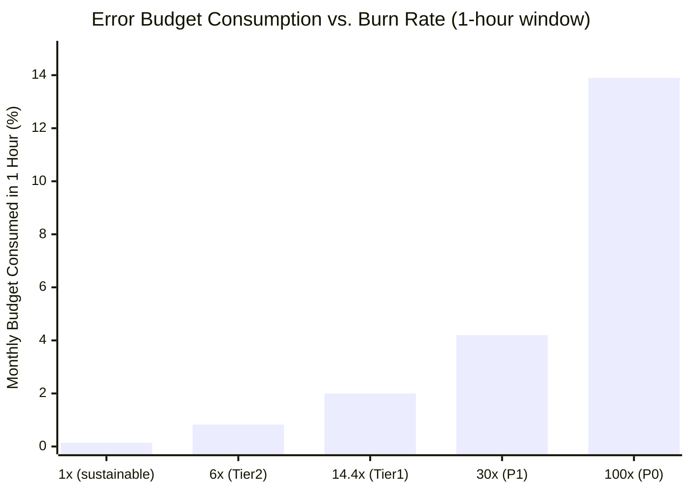

## Keywords in This File

{: .no_toc }

| #   | Keyword | Weight |
| --- | ------- | ------ |
| 1   | [Error Budget Policy - Burn Rate Alerts and SLO Enforcement](#error-budget-policy---burn-rate-alerts-and-slo-enforcement) | expert |

---

# Error Budget Policy - Burn Rate Alerts and SLO Enforcement

🎯 Interview Weight: expert - the organizational mechanism that makes
SRE more than a monitoring practice; candidates who can explain burn
rate alerting and enforcement dynamics are demonstrably senior.

---

### 🎯 Model Answer

**30 seconds:**
> The error budget policy defines what happens when the error budget is
> consumed at different rates. Burn rate alerts detect budget consumption
> faster than raw availability alerts - a 14x burn rate over 1 hour
> means the monthly budget will be consumed in 2 days even if availability
> appears fine. Enforcement means: when burn rate alerts fire at the
> critical threshold, deployments freeze until the budget recovers.
> The policy converts the error budget from a dashboard metric into an
> organizational forcing function.

**3 minutes (Senior):**
> Burn rate alerting solves the sensitivity problem of raw SLO alerts.
> A standard availability alert fires when the SLO is already breached -
> the budget is gone by the time you know. Burn rate alerting detects
> when the budget is being consumed faster than the allowed rate, giving
> you a multi-hour warning before the SLO is breached.
>
> The burn rate formula: burn rate = (error rate / (1 - SLO_target)) * 28.
> A burn rate of 1 means you will consume exactly the monthly budget in
> 28 days (sustainable). A burn rate of 14 means you will consume the
> monthly budget in 2 days. Google SRE recommends a two-tier alerting
> approach: a fast alert (2% budget in 1 hour = burn rate >= 14.4x) for
> rapid budget consumption, and a slow alert (5% budget in 6 hours = burn
> rate >= 6x) for gradual degradation that the fast alert misses.
>
> The enforcement policy is what separates SRE programs that work from
> those that do not. The policy has three thresholds: budget healthy
> (> 50%), budget at risk (20-50%), and budget critical (< 20%). At
> each threshold, the policy defines what is permitted: full deployments,
> reviewed deployments, and no deployments respectively. The critical
> detail: the policy must be agreed at VP level before it is ever
> invoked, encoded in the CI/CD pipeline, and not negotiable in the
> moment. A policy that can be overridden by product pressure in the
> moment is not a policy.

**Framework:** WHAT -> WHY -> HOW -> TRADE-OFF -> EXAMPLE

*Adapting up:* Principal adds: "The error budget policy is the
organizational bridge between product and engineering. Without it,
every deployment decision is a negotiation between product velocity
and reliability. With it, the policy is the arbiter - not the SRE team.
When product says 'we must deploy despite the frozen budget,' the SRE
responds with: 'The policy requires a VP override; here is the form.'
This depersonalizes the conflict and puts the accountability where it
belongs: on the leadership that agreed to the policy."

*Adapting down:* Junior: "The error budget policy says: when the
error budget is almost gone, stop deploying until it recovers. Burn
rate alerts tell you how fast the budget is being consumed - like a
fuel gauge that shows you will run out in 2 hours, not just 'low fuel'
when you are already on empty."

**Blank Mind Recovery:**

**(1) Restate:** "You are asking about error budget policy and burn
rate alerts - let me walk through the burn rate formula, the two-tier
alert design, and the enforcement policy structure."

**(2) First principles:** "The error budget is the amount of unreliability
the business has agreed to tolerate in a period. Burn rate is how fast
that budget is being spent. If the spend rate is too high, the budget
will run out before the period ends. Alerting on burn rate rather than
on the moment of exhaustion gives time to act."

**(3) Bridge:** "Burn rate alerting is like a car's range estimator
that says 'at current speed, you will run out of fuel in 80 miles'
rather than just a low-fuel warning. The range estimate gives you
time to stop for fuel. The burn rate alert gives you time to stop
deploying and fix the reliability issue."

---

### 📘 Concept Explanation

**What it is:**
Error budget policy is the organizational agreement that defines what
actions are permitted at different levels of error budget consumption.
Burn rate alerting is the technical mechanism that detects budget
consumption velocity, enabling early warning before the budget is exhausted.

**The problem it solves:**
Without burn rate alerting, SLO monitoring detects budget exhaustion
after the fact. Without an enforcement policy, the error budget is a
vanity metric that does not change organizational behavior.

**How it works:**

```
BURN RATE FORMULA
==================

Error budget fraction = 1 - SLO_target
  Example: SLO = 99.9% -> error budget = 0.001 (0.1%)

Burn rate = current error rate / error budget fraction
  Example: SLO 99.9%, current error rate 1.4%:
    Burn rate = 0.014 / 0.001 = 14

Budget time remaining =
  (remaining_budget_fraction / current_error_rate)
  * window_duration
  Example: 50% budget remaining, burn rate 14:
    Time to exhaustion = (0.5 * 0.001) / 0.014
                       = 0.0357 * 28 days
                       = 1 day remaining

GOOGLE SRE TWO-TIER BURN RATE ALERT (standard)
  Tier 1 - Fast burn (detect rapid degradation)
    Window: 1 hour
    Condition: consumed 2% of monthly budget in 1 hour
    Burn rate threshold: >= 14.4x
    Action: page on-call immediately
    Math: 2% / (1h/720h) = 2% * 720 = 14.4x

  Tier 2 - Slow burn (detect gradual degradation)
    Window: 6 hours
    Condition: consumed 5% of monthly budget in 6 hours
    Burn rate threshold: >= 6x
    Action: page on-call (lower urgency than Tier 1)
    Math: 5% / (6h/720h) = 5% * 120 = 6x

  Why two tiers:
    Tier 1 catches fast burns (sudden spike in errors)
    Tier 2 catches slow burns that Tier 1 misses
    (gradual degradation at burn rate 7-14x
    fires Tier 2 before Tier 1)

ERROR BUDGET ENFORCEMENT POLICY
  (must be agreed at VP level, enforced in CI/CD)

  Budget > 50% remaining:
    All deployments permitted
    Standard canary deployment process applies
    Reliability investments optional

  Budget 20-50% remaining:
    All deployments require canary + monitoring plan
    No off-hours deployments without SRE approval
    Reliability investments recommended

  Budget < 20% remaining:
    All deployments require SRE lead review
    No non-critical deployments
    Reliability investment sprint triggered
    (block of 2 weeks: reliability work only)

  Budget 0% (exhausted):
    No deployments except P0 security patches
    P0 security patches require VP approval
    All engineering capacity to reliability work
    SLA credit review triggered

ENFORCEMENT MECHANISM
  CI/CD pipeline checks budget before each deploy:
    query Prometheus for current error budget %
    if below threshold: block deploy with policy message
    include override form link (VP required)
```

**The key insight:**
The error budget policy is the organizational change mechanism. Without
the policy, SLOs are measurement systems. With the policy, they are
accountability systems. The moment the organization agrees to the
policy (before any budget is consumed), it has agreed that reliability
is a shared priority that takes precedence over feature velocity when
the budget signal demands it. The SRE team does not enforce reliability;
the pre-agreed policy enforces it.

**When to use it:**
Implement the error budget policy before any error budget is consumed.
The policy must be agreed in advance; agreeing it during a deployment
freeze is a negotiation, not a policy.

**When NOT to use it:**
Internal services with no customer-facing SLA do not need the full
enforcement policy. A lightweight policy (reduce deploy frequency when
budget is consumed) is sufficient.

**Alternatives:**
- Manual reliability reviews: SRE team reviews each deployment request;
  subjective, creates SRE-as-gatekeeper dynamic
- Advisory error budget: track the budget, send warnings, no enforcement;
  produces no behavioral change
- Time-based change windows: schedule deploys for low-risk windows;
  does not account for reliability state

---

### 💻 Code Example

**Example 1: Burn rate alert rule in Prometheus**

```yaml
# BAD: Alert on raw SLO breach
# Fires only AFTER the SLO window is violated.
# By the time this fires, the budget is gone.
- alert: SLOBreach
  expr: |
    sum(rate(http_requests_total{status!~"5.."}[28d]))
    /
    sum(rate(http_requests_total[28d]))
    < 0.999
  for: 5m
  labels:
    severity: critical

# GOOD: Multi-window, multi-burn-rate alerting
# Based on Google SRE chapter 5 burn rate approach

# Tier 1: Fast burn - 2% budget consumed in 1 hour
# (burn rate >= 14.4x, fires if issue persists > 1h)
- alert: SLOBurnRateFast
  expr: |
    (
      sum(rate(
        http_requests_total{
          status=~"5..", app="payment-api"
        }[1h]
      ))
      /
      sum(rate(
        http_requests_total{app="payment-api"}[1h]
      ))
    )
    /
    (1 - 0.999)
    >= 14.4
  for: 5m
  labels:
    severity: page
    team: sre
  annotations:
    summary: "Fast burn rate detected"
    description: >
      Payment API is consuming error budget at >= 14.4x
      the sustainable rate. At this rate, the monthly
      budget will be exhausted in < 2 days.
      Current error rate: {{ $value | humanizePercentage }}
    runbook_url: https://runbooks/payment-api/high-error-rate

# Tier 2: Slow burn - 5% budget in 6 hours
# (burn rate >= 6x, catches gradual degradation)
- alert: SLOBurnRateSlow
  expr: |
    (
      sum(rate(
        http_requests_total{
          status=~"5..", app="payment-api"
        }[6h]
      ))
      /
      sum(rate(
        http_requests_total{app="payment-api"}[6h]
      ))
    )
    /
    (1 - 0.999)
    >= 6
  for: 30m
  labels:
    severity: warning
    team: sre
  annotations:
    summary: "Slow burn rate detected"
    description: >
      Payment API burn rate >= 6x for 30m.
      Error budget at risk if trend continues.
      Current error rate: {{ $value | humanizePercentage }}
    runbook_url: https://runbooks/payment-api/high-error-rate
```

> **Code walkthrough:** The BAD alert fires only after the 28-day SLO
> window shows a breach - by then, the error budget is consumed. The
> GOOD approach implements the two-tier burn rate alert from Google SRE
> best practices. Tier 1 (fast burn): if the 1-hour error rate divided
> by the error budget fraction exceeds 14.4, the monthly budget would be
> exhausted in under 2 days - page immediately. Tier 2 (slow burn): if
> the 6-hour rate exceeds 6x, the budget is being consumed faster than
> sustainable but not critically - notify with lower urgency. The `for: 5m`
> on Tier 1 prevents false positives from brief spikes.

**Example 2: CI/CD error budget enforcement gate**

```python
#!/usr/bin/env python3
# BAD: No CI/CD enforcement - error budget policy
# is a wiki document that product managers do not read.
# Deployments proceed regardless of budget state.

# GOOD: CI/CD gate that checks error budget before deploy

import os
import sys
import requests
from datetime import datetime

PROMETHEUS_URL = os.environ.get(
    "PROMETHEUS_URL", "http://prometheus:9090"
)
JIRA_URL = os.environ.get("JIRA_URL", "https://jira")

def get_error_budget_status(
    service_name: str,
    slo_target: float
) -> dict:
    """
    Query current error budget consumption.
    Returns budget remaining (0.0 to 1.0).
    """
    # Query 28-day error budget consumption
    query = f"""
    1 - (
        sum(rate(
            http_requests_total{{
                status=~"5..", app="{service_name}"
            }}[28d]
        ))
        /
        sum(rate(
            http_requests_total{{app="{service_name}"}}[28d]
        ))
    )
    /
    (1 - {slo_target})
    """
    # Result: 1.0 = budget fully remaining
    #         0.0 = budget fully consumed
    #        -0.5 = 50% over budget

    resp = requests.get(
        f"{PROMETHEUS_URL}/api/v1/query",
        params={"query": query},
        timeout=10
    )
    result = resp.json()["data"]["result"]
    if not result:
        return {"status": "unknown", "remaining": 1.0}

    remaining = float(result[0]["value"][1])
    remaining = max(0.0, remaining)  # floor at 0

    if remaining > 0.50:
        status = "healthy"
        action = "PROCEED"
    elif remaining > 0.20:
        status = "at_risk"
        action = "REVIEW_REQUIRED"
    elif remaining > 0.0:
        status = "critical"
        action = "BLOCK"
    else:
        status = "exhausted"
        action = "BLOCK"

    return {
        "service": service_name,
        "remaining_pct": f"{remaining:.1%}",
        "status": status,
        "action": action,
        "message": {
            "healthy": (
                "Error budget healthy. Deployment permitted."
            ),
            "at_risk": (
                "Error budget at risk. Canary required + "
                "SRE lead notification."
            ),
            "critical": (
                "Error budget critical (< 20%). Deploy blocked."
                " Create SRE exception ticket for override."
            ),
            "exhausted": (
                "Error budget exhausted. Deploy blocked. "
                "VP override required via JIRA."
            )
        }[status]
    }

def enforce_error_budget_gate(
    service_name: str,
    slo_target: float = 0.999
) -> bool:
    """
    CI/CD gate: check error budget, block if policy requires.
    Returns True if deployment should proceed.
    """
    status = get_error_budget_status(service_name, slo_target)
    print(f"Error Budget Gate: {status['message']}")
    print(f"  Service: {service_name}")
    print(f"  Budget remaining: {status['remaining_pct']}")
    print(f"  Status: {status['status']}")

    if status["action"] == "BLOCK":
        print(
            f"\n[DEPLOYMENT BLOCKED]"
            f"\nCreate exception ticket: {JIRA_URL}"
            f"/create?template=error-budget-override"
        )
        return False

    return True

if __name__ == "__main__":
    service = sys.argv[1] if len(sys.argv) > 1 else "api"
    proceed = enforce_error_budget_gate(service)
    sys.exit(0 if proceed else 1)  # nonzero = pipeline block
```

> **Code walkthrough:** The BAD approach is policy-as-documentation
> that nobody reads during a deployment decision. The GOOD approach
> implements the error budget policy as a CI/CD gate: the script queries
> the current 28-day error budget consumption, maps it to the four policy
> states (healthy, at-risk, critical, exhausted), and exits with code 1
> (blocking the pipeline) when the policy requires it. The JIRA link
> for the exception form is included in the block message, providing the
> VP override path. This is the mechanism that makes the error budget
> an enforcement tool rather than a metric.

**Example 3: Error budget burn rate calculation from first principles**

```python
# BAD: Compute error rate and compare to SLO directly.
# Does not indicate consumption velocity.
error_rate = errors / total_requests
if error_rate > (1 - slo_target):
    print("SLO breached")  # fires only after breach

# GOOD: Burn rate as consumption velocity indicator

def calculate_burn_rate(
    current_error_rate: float,  # fraction, e.g. 0.014 for 1.4%
    slo_target: float,          # e.g. 0.999 for 99.9%
    window_hours: float         # hours in measurement window
) -> dict:
    """
    Compute burn rate and budget exhaustion estimate.
    """
    error_budget = 1 - slo_target
    # Burn rate: how many times faster than sustainable
    # are we consuming the budget?
    burn_rate = current_error_rate / error_budget

    # Hours until budget exhaustion at current rate
    # Assumes full budget remaining for simplicity
    # In practice, query remaining budget from Prometheus
    monthly_hours = 28 * 24
    hours_to_exhaustion = monthly_hours / burn_rate

    # Alert threshold: will this deplete budget in window?
    budget_consumed_in_window = (
        current_error_rate * window_hours
        / (monthly_hours * error_budget)
    )

    return {
        "burn_rate": f"{burn_rate:.1f}x",
        "hours_to_exhaustion": (
            f"{hours_to_exhaustion:.1f}h"
            if burn_rate > 1 else "Not consuming budget"
        ),
        "days_to_exhaustion": (
            f"{hours_to_exhaustion/24:.1f} days"
            if burn_rate > 1 else None
        ),
        "budget_consumed_pct_in_window": (
            f"{budget_consumed_in_window:.2%}"
        ),
        "alert_tier": (
            "TIER_1_PAGE"
            if burn_rate >= 14.4 and window_hours == 1
            else "TIER_2_WARNING"
            if burn_rate >= 6 and window_hours == 6
            else "NONE"
        )
    }

# Example: SLO 99.9%, current error rate 1.4%, 1h window
result = calculate_burn_rate(
    current_error_rate=0.014,
    slo_target=0.999,
    window_hours=1
)
# {
#   "burn_rate": "14.0x",
#   "hours_to_exhaustion": "48.0h",
#   "days_to_exhaustion": "2.0 days",
#   "budget_consumed_pct_in_window": "1.94%",
#   "alert_tier": "TIER_1_PAGE"
# }
```

> **Code walkthrough:** The BAD approach compares error rate to SLO
> directly - this fires only when the SLO is already violated. The GOOD
> approach calculates the burn rate (14x means consuming budget 14 times
> faster than sustainable) and hours to exhaustion (48 hours at current
> rate). At 1.94% budget consumed in 1 hour, Tier 1 fires (threshold
> 2%). This is the pre-breach warning that gives the on-call team time
> to act before the SLO is violated.

---

### 🎓 Answers by Seniority

**Junior / Mid (0-5 years):**
> The error budget policy says: when the error budget is almost gone,
> stop deploying. The error budget burn rate is how fast the budget is
> being consumed. Burn rate of 1 = sustainable (budget lasts exactly
> 28 days). Burn rate of 14 = you will consume the monthly budget in 2
> days. Burn rate alerts fire before the budget is exhausted, giving
> time to act. The policy converts this from a metric into an organizational
> rule: deployments freeze when burn rate exceeds the critical threshold.

---

**Senior / Staff (5+ years):**
> The most important thing I have learned about error budget policy:
> it must be agreed before any budget is ever consumed. Once you have
> a budget-consuming incident and you try to enforce the policy for the
> first time, you are in a negotiation with product management during
> a deployment freeze. That negotiation produces exceptions, precedents,
> and resentment. The policy agreed in advance - with VP sign-off - is
> not a negotiation; it is a documented organizational commitment.
>
> The second lesson: CI/CD enforcement is non-negotiable. Policy
> documentation that engineers are expected to check before deploying
> will not be checked. The pipeline check is the only reliable enforcement
> mechanism.

---

### ⚠️ Common Misconceptions

| Misconception | Reality |
|---|---|
| Burn rate of 1 is fine (sustainable) | A burn rate of 1 means you consume exactly the budget over the window - any additional incidents will exceed it; practical healthy state is burn rate < 0.5 most of the time |
| The error budget policy should be enforced by the SRE team | The policy should be enforced by the CI/CD pipeline; SRE enforcing it creates adversarial dynamics |
| Burn rate alerts replace SLO alerts | Burn rate alerts are for fast detection; SLO window alerts are for compliance reporting; both serve different purposes |
| A deployment freeze always helps recover the budget | Freezing deploys prevents new budget-consuming changes but does not fix the existing reliability problem; the reliability fix (finding the bug, repairing the service) is what recovers the budget |
| Error budget can be borrowed from future months | Error budgets are calculated over the measurement window; there is no carry-forward or carry-back; each window starts fresh |

---

### 🚨 Failure Modes and Diagnosis

**Failure 1: Burn rate alert fires on a known maintenance window**

*Symptom:* A scheduled database maintenance window at 2 AM causes
error rates to spike for 15 minutes. The burn rate alert fires and
pages the on-call. The on-call investigates for 8 minutes before
recognizing it is the maintenance window. 8 minutes of wasted on-
call time; engineer is now irritated and alert-fatigued.

*Root cause:* Burn rate alerting does not account for planned
maintenance windows.

*Fix:* AlertManager silencing for the duration of the maintenance
window. The silence is created by the maintenance automation before
the window starts and removed after. Silences should be narrow:
exact duration of the maintenance window plus a 10-minute buffer,
and narrow to the specific alert (not silencing all alerts).

*Prevention:* Scheduled silences are created in AlertManager as part
of the maintenance runbook. Any maintenance that will cause error spikes
must include a silencing step.

**Failure 2: Error budget policy overridden repeatedly, losing credibility**

*Symptom:* Product management has requested VP override of the
deployment freeze 6 times in 3 months. Each time, the VP approved.
Engineers have learned that the policy has no teeth. Response rate
to error budget alerts drops. The policy is effectively abandoned.

*Root cause:* The policy did not define when VP overrides are
acceptable. Every override request was treated as reasonable.

*Fix:* Define the override policy: VP overrides are acceptable only
for P0 security patches or business-critical releases with documented
SLA commitments at risk. All other requests are declined. The SRE
presents the override policy at the VP level as part of the original
policy agreement.

*Prevention:* Track override frequency. If overrides exceed 1 per
quarter, the error budget policy re-negotiation is required: either
the SLO is too strict (aspirational), the architecture is insufficiently
reliable to meet the SLO at current deployment frequency, or the
business priority for reliability needs to be re-calibrated.

---

### 🎯 Interview Deep-Dive

| Preparation | Target |
|---|---|
| Time to prep | 25 minutes |
| Core themes | Burn rate formula, two-tier alerting, enforcement policy, override mechanism |
| Seniority signal | Junior: describes the policy; Senior: gives the burn rate formula, explains CI/CD enforcement |
| Common trap | Treating error budget policy as the SRE team's enforcement mechanism |
| Staff differentiator | Override credibility management, policy pre-negotiation, SLO-budget recovery analysis |

---

**Q1 [MID]: Explain how burn rate alerting improves on raw SLO alerts.**

A raw SLO alert fires when the SLO compliance falls below the target
over the measurement window. For a 28-day window and 99.9% SLO, this
fires when the 28-day availability drops below 99.9% - meaning the
budget is already exhausted by the time the alert fires.

Burn rate alerting detects the velocity of budget consumption rather
than the exhaustion itself. The burn rate formula: current error rate
divided by the error budget fraction. A 99.9% SLO has a 0.1% error
budget. If the current error rate is 1.4%, burn rate = 0.014 / 0.001
= 14x. At 14x, the monthly budget would be consumed in 2 days.

The two-tier approach: Tier 1 (fast burn) fires if 2% of the monthly
budget is consumed in 1 hour (burn rate >= 14.4x). Tier 2 (slow burn)
fires if 5% is consumed in 6 hours (burn rate >= 6x). Tier 2 catches
gradual degradation that Tier 1 misses (burn rate 7-14x would not trigger
Tier 1 for hours but would consume significant budget).

The result: instead of learning about the budget exhaustion after the
fact, the on-call is alerted with 2-48 hours of warning, giving time
to diagnose and fix before the SLO is violated.

*What separates good from great:* Gives the exact burn rate formula,
calculates the specific thresholds for both tiers, and explains why
the two-tier approach is necessary (covers both fast and slow burns).

---

**Q2 [SENIOR]: BEHAVIORAL: Describe implementing an error budget
enforcement policy that initially faced organizational resistance.**

**Situation:** The SRE team had SLO dashboards and error budget tracking
but no enforcement policy. Product managers would see "budget 15%
remaining" on the dashboard and continue deploying. Reliability problems
persisted.

**Initial proposal:** Presented the enforcement policy to engineering
leadership: budget < 20% = deploy freeze. Received pushback: "SRE is
trying to block product."

**Response:** Reframed the proposal as a pre-agreed business decision
rather than an SRE rule. Prepared a 30-minute working session with the
engineering VP, product VP, and SRE lead. The agenda: "Given our current
SLAs, how much unreliability can we afford? When should we prioritize
reliability over feature velocity?"

**Working session outcome:** Both VPs agreed to the policy thresholds.
Key concession: added the VP override path (critical releases with SLA
risk can override with VP approval and documentation). Added: overrides
are tracked and reviewed quarterly.

**Result:** Policy was encoded in CI/CD within 2 weeks of the working
session. First enforcement: 6 weeks later, budget hit 18%. Pipeline
blocked two deploys. Product manager escalated to VP; VP reviewed the
policy and declined to override (not SLA-critical). The policy held.
Three months later, the same product manager said "the freeze was annoying
but the reliability improvement that month was real."

*What separates good from great:* Describes the reframing from "SRE rule"
to "joint business decision," the specific working session approach, the
VP override concession, and the credibility moment when the policy held
under pressure.

---

**Q3 [SENIOR]: How do you handle the error budget policy when the
SLO itself is wrong (aspirational)?**

If the SLO is aspirational (set above historical performance), the error
budget will be perpetually exhausted, making the policy permanently in
"freeze" mode. This is the most common way error budget policies fail.

Diagnosis: if the error budget is exhausted in week 1 of every month,
the SLO is aspirational. Calculate what the historical SLI would be over
the last 90 days and compare it to the SLO target. If the historical
average is below the SLO target, the SLO must be reset.

The reset process: present the data to the business stakeholder (VP, product
manager). The conversation: "Our service has delivered X% availability
over the last 90 days. The SLO target is Y%. The gap means our budget
is always exhausted by day 3. We have two options: invest to achieve Y%
availability (here is the engineering cost and timeline), or reset the
SLO to X% and create a roadmap to improve to Y% over N quarters."

Most organizations choose the roadmap approach. The new SLO is set at
the historical baseline, the budget enforcement becomes operational, and
the roadmap tracks quarterly improvement.

The enforcement policy only works when the budget is achievable. Fixing
the SLO is the prerequisite for fixing the enforcement policy.

*What separates good from great:* Identifies the aspirational SLO as
the root cause, gives the diagnosis method (week 1 exhaustion), and
describes the business conversation with both options.

---

**Q4 [STAFF]: How do you design error budget policies for a
microservices architecture with 50+ services?**

Individual policies for 50+ services produce 50+ different enforcement
mechanisms, exception processes, and VP override paths. This does not
scale.

Three-tier service classification:
Tier 1 (customer-facing, revenue-critical): full error budget policy
with CI/CD enforcement, VP override path, quarterly review. 10-20 services.

Tier 2 (internal-facing, business-important): standard error budget policy
with team lead override path. 20-30 services.

Tier 3 (supporting services, infrastructure): advisory policy (budget
tracked, no deployment freeze, team notification only). Remaining services.

Platform enforcement: the CI/CD gate queries a service metadata registry
to determine the service's tier and applies the appropriate policy. A
single enforcement codebase handles all tiers.

Error budget recovery prioritization: when multiple Tier 1 services have
burned budgets simultaneously, the SRE cannot fix them all. Priority order:
services with SLA commitments first (SLA breach risk), then services with
highest business impact (revenue per incident minute), then services by
remaining budget (closest to SLA breach).

Cross-service budget aggregation: for services that share a database
or critical dependency, the shared dependency's error budget affects
all dependent services. Model the dependency graph so that a database
reliability improvement is credited against all dependent services'
budgets.

*What separates good from great:* Describes the three-tier classification,
platform enforcement as the scalability mechanism, recovery prioritization
criteria, and dependency budget aggregation.

---

**Q5 [STAFF]: How do you use the error budget burn rate trend
to drive reliability investment conversations?**

A single burn rate snapshot (current budget at X%) does not drive
investment. The burn rate trend over 6 months does.

The trend analysis: calculate the average monthly burn rate for the
last 6 months. If the trend is: burn rate declining (improvement), burn
rate stable (no change), or burn rate increasing (degradation). The
direction of the trend, not the current value, drives the conversation.

The investment case: an increasing burn rate trend means that the current
reliability investment is insufficient to keep pace with system growth.
Each month, slightly more budget is consumed. Without investment, the
service will breach its SLA within a predictable number of months (the
trend extrapolation).

The quantified case: "At the current burn rate increase of 15% per month,
the service will exhaust its monthly budget on average by day 15 (instead
of the current day 20) within 4 months. This puts the service at SLA
breach risk in Q3. Preventing this requires X engineering weeks of
reliability investment. The investment prevents an estimated Y SLA
credits at $Z per incident."

The board-level framing: reliability investment is not a cost center;
it is an SLA credit prevention mechanism with a quantifiable ROI.

*What separates good from great:* Gives the trend analysis methodology
(not snapshot but trend direction), the extrapolation to SLA breach
timeline, and the ROI framing for the investment conversation.

---

**Q6 [STAFF]: What is the relationship between the error budget policy
and the deployment cadence? Can frequent deployments exhaust the budget?**

Deployment frequency and error budget are connected through the deployment
failure rate. If each deployment has a 0.1% probability of causing a
1-hour service degradation, deploying twice per day produces more expected
budget consumption than deploying twice per week.

The formula: expected budget consumption per deployment =
P(deployment failure) * expected error rate during failure * MTTR.
If P(failure) = 0.1%, error rate during failure = 10%, MTTR = 30 minutes:
expected consumption = 0.001 * 0.1 * 0.5 hours / 720 hours = 0.007%
of monthly budget per deploy.

Deploying 50 times/month consumes 0.35% of budget from deployments.
For a 99.9% SLO (0.1% error budget), this is 35% of the budget from
deployments alone, before background failure rate.

The policy implications: high deployment frequency is only sustainable
if deployment safety mechanisms (canary, automated rollback) reduce
the expected per-deployment budget consumption. A service that deploys
50 times/month without canary will exhaust its budget from deploy-
caused incidents. A service that deploys 50 times/month with canary
(reducing per-deploy failure exposure to 5% of users for 5 minutes)
consumes dramatically less budget per deploy.

The budget is the feedback mechanism: if frequent deployments are
consuming budget faster than sustainable, the burn rate alert fires.
This is the signal to: improve deployment safety, slow the deploy
cadence, or invest in reliability to increase the error budget baseline.

*What separates good from great:* Gives the per-deployment budget
consumption formula with specific numbers, explains why canary reduces
per-deploy budget consumption, and describes the budget as the feedback
mechanism for deployment cadence.

---

**Q7 [STAFF]: How do you handle error budget policy for services
with external SLA commitments versus internal services?**

External SLA services require a tighter error budget policy because
SLA breaches have financial and contractual consequences. The SLO
must be set with a buffer above the SLA (SLO stricter than SLA by
the MTTR margin), and the enforcement policy must be correspondingly
tighter.

For external SLA services: the error budget policy triggers at higher
remaining budget percentages. Instead of deploying freely at > 50%
remaining, the threshold shifts to > 60% remaining. The "critical"
threshold shifts from < 20% to < 30%. This provides more headroom
between the enforcement trigger and the SLA breach point.

For internal services: the policy can be more permissive because there
are no SLA credits or contract consequences. The deployment freeze is
advisory rather than hard-blocking, and the recovery timeline is
measured in weeks rather than hours.

The dual-tracking requirement: external SLA services must track both
the internal SLO budget (for operational decisions) and the external
SLA compliance (for contract reporting). The SLO breach does not equal
the SLA breach; the SLO should breach first, giving time to remediate
before the SLA is violated.

The customer communication protocol: when an external SLA service
breaches its SLO, the engineering team initiates customer communication
review even if the SLA has not yet been violated. Customers who discover
reliability issues independently before receiving communication have
a much worse experience than customers who receive proactive updates.

*What separates good from great:* Gives specific threshold adjustments
for external SLA services, explains the dual-tracking requirement
(SLO + SLA), and includes the customer communication protocol.

---

**Q8 [STAFF]: How do you recover the error budget after exhaustion,
and what is the engineering approach?**

Error budget recovery requires fixing the reliability problem that caused
the exhaustion. Freezing deployments alone does not recover the budget -
it prevents further consumption but the budget only recovers when the
error rate returns to below the sustainable rate for long enough to
accumulate budget.

Recovery calculation: for a 99.9% SLO with 28-day window, recovering
1% of budget requires 1% * 720 hours = 7.2 hours of error-free operation
at sustainable rate. Recovering from exhaustion requires the full 28
days of error-free operation (the budget accumulates linearly over the
window as old error events age out).

The engineering approach has three phases:

Phase 1 (hours): immediate stabilization. Stop the active error rate.
This may require rolling back the problematic change, mitigating the
failing dependency, or capacity scaling. The goal: return to a sustainable
burn rate (< 1x) as fast as possible.

Phase 2 (days): root cause elimination. Fix the underlying problem
that caused the high error rate. This is the reliability engineering
work: changing the architecture, fixing the bug, hardening the
dependency handling.

Phase 3 (weeks): reliability improvement investment. If the exhaustion
was caused by a pattern that will recur (example: every deployment
risks a 5% error spike), this phase improves deployment safety to
reduce expected per-deploy error rate.

The budget recovery timeline: after Phase 1, the budget begins recovering
as old error events age out of the 28-day window. Full recovery takes
28 days of clean operation. The organization should not wait for full
recovery to resume normal deployments; the policy defines the budget
thresholds for each deploy level.

*What separates good from great:* Gives the budget recovery calculation
(28 days for full recovery), distinguishes the three phases with specific
timelines, and explains that the policy thresholds guide the return to
normal deployment cadence.

---

**Q9 [STAFF]: How do you address the scenario where the error
budget policy creates a perverse incentive to set low SLOs?**

The perverse incentive: if engineers set low SLOs, they have more error
budget to "spend" before the deployment freeze triggers. A team that
sets a 95% SLO instead of 99.9% has a 5% error budget versus 0.1%,
meaning they can have 50x more errors before the policy freezes deploys.

This is real: I have seen teams in SRE programs set lower SLOs than
the business requires specifically to reduce enforcement pressure.

The countermeasures are organizational, not technical:

SLO validation with business stakeholders: SLOs must be reviewed and
accepted by the product owner and the customer-facing business unit,
not just set by the engineering team. A product owner who accepts a
95% SLO is also accepting 36 hours of downtime per month for their product.
When presented that way, most product owners set appropriate SLOs.

Customer SLA backstop: if the service has a customer-facing SLA, the
internal SLO must be stricter. This is a hard floor that prevents the
perverse incentive from operating for customer-facing services.

SLO improvement incentives: the error budget policy should include a
positive incentive: teams that maintain budget surplus across 4
consecutive quarters are rewarded with a discretionary infrastructure
budget (use it for reliability improvements, tooling, or new technology
exploration). This rewards teams that set appropriate SLOs and operate
reliably, not teams that game the SLO.

*What separates good from great:* Identifies the specific mechanism
of the perverse incentive, gives three countermeasures (stakeholder
validation, SLA backstop, positive incentive), and acknowledges the
incentive is real and requires organizational design to prevent.

---

**Q10 [STAFF]: BEHAVIORAL: Tell me about a time you enforced the
error budget policy against significant organizational pressure.**

**Situation:** Major product launch scheduled. Error budget for the
payment API was at 8% remaining. The deployment freeze policy triggered:
CI/CD blocked the 3 release candidate deployments needed for the launch.
The product VP requested an emergency override.

**My response:** Prepared for the VP conversation with three items:
(1) The error budget status: 8% remaining means the service can have
6 minutes of downtime in the next 3 weeks before the SLO is violated.
(2) The last 7 days of incidents: showed that the budget was consumed
by 4 deployment-related incidents in 7 days (3 minutes each). (3) The
option analysis: override and risk a 60% probability of a payment failure
during the launch, or delay launch by 3 business days to complete two
targeted reliability fixes.

**The VP's question:** "What is the business cost of a 3-day delay?"
The product VP estimated $150,000 in delayed revenue.

**My response:** "A payment failure during the launch would affect 100%
of launch-day payments. Last week's incidents averaged 3 minutes each.
At launch transaction volume, 3 minutes of payment outage is approximately
$280,000 in payment failures plus the customer trust cost."

**Outcome:** VP chose the 3-day delay. The two reliability fixes were
completed and validated. The launch proceeded with the error budget at
32% remaining. No payment incidents during the launch.

**Post-launch:** The VP sent a note to the team: "Good call on the delay."

*What separates good from great:* Uses specific numbers throughout
(8% budget, $150K delay cost, $280K incident cost), demonstrates the
quantified risk comparison that drove the decision, and reports the
VP's acknowledgment as confirmation that the data-driven approach worked.

---

**Q11 [STAFF]: How do you handle error budget policy for a service
that is undergoing a major reliability investment (expected to improve
significantly in 3 months)?**

A service in active reliability investment is a special case: current
reliability is low (budget consumed frequently), but reliability is
improving. The standard policy (full deployment freeze when budget is
low) would freeze the very deployments that are improving reliability.

The handling: differentiate between "reliability-improving deployments"
and "feature deployments." The policy freezes feature deployments but
should not freeze reliability deployments.

Implementation: each deployment is tagged in the CI/CD pipeline as
"feature" or "reliability." The error budget gate checks the tag:
feature deployments are blocked by the policy; reliability deployments
bypass the gate with logging (for audit purposes).

The accountability mechanism: reliability deployments that actually
reduce the error rate (observable from burn rate metrics in the week
after deploy) validate the bypass. Reliability deployments that increase
the error rate (a bad "fix") lose their bypass status and the engineer
must go through the standard override process.

The time bound: the investment classification lasts 1 quarter. At the
end of the quarter, the service is evaluated: has reliability improved?
If yes, the budget should be recovering. If not, the classification is
not renewed - the "investment" is either mislabeled or not working.

*What separates good from great:* Distinguishes feature from reliability
deployments as the key mechanism, describes the CI/CD tag implementation,
and provides the accountability mechanism (burn rate validation of
reliability claims).

---

**Q12 [STAFF]: How does the error budget connect to on-call
compensation and engineering culture?**

The cultural connection between error budget and on-call is the most
important human dimension of SRE. When engineers are required to be
on-call for services they did not design for reliability, on-call becomes
a burden to be survived rather than a feedback mechanism. The error budget
changes this when the connection is explicit.

The alignment: if the team's error budget is healthy, the on-call is
lighter (fewer incidents). If the budget is being consumed, the on-call
is heavier (more incidents). This creates a direct feedback loop: teams
that invest in reliability have better on-call. Teams that do not have
worse on-call. When teams own their own on-call, the incentive is aligned.

The "you build it, you run it" cultural model: when the development team
owns the on-call for their services, they have a direct incentive to
build for reliability. When a central SRE team owns all on-call, the
development team has no on-call consequence for poor reliability choices.

On-call compensation: fair on-call compensation includes explicit on-call
pay (most organizations provide this), but the more important factor is
on-call burden. Engineers who are paged 10 times per night are not
compensated fairly regardless of the stipend. The error budget drives
on-call quality: engineers who fix reliability issues (reducing future
on-call burden) are doing the most valuable on-call work.

The health metric connection: error budget consumption rate correlates
with on-call interrupt frequency. If the SRE team's annual plan includes
an on-call health target (< 2 interrupts/shift), the reliability investment
required to achieve it can be back-calculated from the error budget trend.

*What separates good from great:* Connects the error budget to the "you
build it, you run it" cultural model, explains the incentive alignment
mechanism, and describes the on-call health target as derivable from the
budget trend.

---

### ⚖️ Comparison Table

| Alert Approach | Detection Speed | False Positive Rate | Window | Best for |
|---|---|---|---|---|
| Raw SLO (28-day window) | Very slow (fires after breach) | Low | 28 days | Compliance reporting |
| Burn rate Tier 1 (1h, 14.4x) | Fast (pre-breach, hours) | Low-medium | 1 hour | Fast budget consumption |
| Burn rate Tier 2 (6h, 6x) | Medium (pre-breach, day) | Low | 6 hours | Gradual degradation |
| Real-time error rate alert | Immediate (in-breach) | Medium-high | 5 minutes | Known high-impact conditions |
| Budget remaining alert (< 20%) | Slow (consumption-based) | Very low | Rolling 28d | Policy enforcement gate |

---

### 🏛️ System Design

**Problem:** Design the error budget policy enforcement system for an
organization with 50 services, weekly deployments, and customer SLAs.

**Architecture:**

```
ERROR BUDGET ENFORCEMENT SYSTEM
==================================

[SLO Data Layer]
  Prometheus: stores SLI metrics (error rate per service)
  SLO rules: burn rate calculations for all services
  Retention: 30 days minimum for 28-day window queries

[Burn Rate Alert Engine]
  AlertManager: receives Prometheus alerts
  Two-tier rules: Tier 1 (1h, 14.4x), Tier 2 (6h, 6x)
  Routing: Tier 1 -> PagerDuty page
           Tier 2 -> Slack notification + ticket
  Inhibition: suppress Tier 2 if Tier 1 already active

[Error Budget Policy API]
  Service: /budget-status/{service}
  Returns: budget_remaining_pct, policy_status, action
  Auth: CI/CD pipeline service account
  Cache: 60 seconds (SLI queries are expensive at scale)

[CI/CD Enforcement Gate]
  Called by deployment pipelines before each deploy
  Input: service name, deploy type (feature/reliability)
  Logic: query policy API, apply tier rules, block or proceed
  Override path: Jira ticket + VP approval required
  Audit log: all deployment decisions logged (immutable)

[Policy Override Workflow]
  Jira template: override request form
  Required fields: business justification, risk acceptance,
    VP approver name
  Workflow: requester -> SRE lead review -> VP approval
  SLA: VP must respond within 2 business hours
  Tracking: all overrides reviewed in monthly SRE review

[Budget Recovery Dashboard]
  Shows: current budget for all Tier 1 services
  Budget trend: 7-day rolling average burn rate
  Recovery timeline: days until X% budget recovered
  Deployment status: can-deploy / review-required / blocked
  Leadership view: services at risk of SLA breach

[Monthly SRE Review Integration]
  Budget consumption by service (last 30 days)
  Override frequency and approval patterns
  Burn rate trends (improving/stable/degrading)
  Toil correlation: incidents that caused budget consumption
```

The key design decisions: the Policy API is a shared service (not duplicated
in every CI/CD pipeline), uses a 60-second cache to handle high deployment
frequency without overloading Prometheus, and returns structured JSON that
the CI/CD pipeline can interpret. The override workflow is integrated
into the standard ticket system (not email or Slack) to ensure auditability.

---

### 📊 Diagram

```
BURN RATE DETECTION ZONES
===========================
Budget            Burn Rate (1h window)
Consumed  |
in 1h     |
          |               TIER 1 FIRES
  2%      +- - - - - - - - - -+--------
          |           (14.4x) |       ^
          |                   |       | Page
  1%      |                   |       | on-call
          |                   |
  0.5%    |   TIER 2          |
          |   FIRES   (6x)    |
          |    +-----+        |
  0%      +----+-----+--------+--- Burn rate
         0x   6x   14.4x   30x
               ^     ^
            Warning  Page
```



> **Diagram walkthrough:** The burn rate detection zones show the
> relationship between budget consumption velocity and alert tiers.
> At 1x burn rate, 0.14% of the monthly budget is consumed per hour -
> sustainable. At 6x (Tier 2 threshold), 0.83% is consumed per hour
> and the 30-minute sustained alert fires. At 14.4x (Tier 1 threshold),
> 2% is consumed in 1 hour - the fast burn alert fires. The xychart
> makes the non-linear relationship clear: small increases in burn rate
> at the high end produce large increases in budget consumption. This
> visual communicates why the Tier 1 threshold matters: above 14.4x,
> the budget can be consumed in hours, not days.

---

### Field Q&A

**Production Failures:**

1. Burn rate Tier 1 fires at 14:45. By the time the on-call investigates
   and resolves the issue at 15:30, the error budget has consumed 18%
   in 45 minutes. The SLO has not breached. What caused the high burn
   rate and how was the budget not breached?
   > The burn rate of ~18x for 45 minutes consumed 18% * 0.45h = about
   > 8% of the monthly budget. The SLO has not breached because the 28-day
   > window requires the total error count over 28 days to exceed 0.1% of
   > requests. The 45-minute spike, while severe, represents only a fraction
   > of the rolling 28-day total. The value of burn rate alerting is
   > exactly this: it fires while the SLO is still technically compliant,
   > giving 45 minutes of warning before the budget would have been
   > exhausted. Without burn rate alerting, this incident would not have
   > been detected until the SLO window calculation showed a breach.

2. After implementing the error budget enforcement policy, a team set
   its SLO to 95% to avoid the enforcement threshold. Under the 95% SLO,
   they have 5% error budget, meaning the Tier 1 burn rate threshold
   requires 14.4 * (1 - 0.95) / (1 - 0.999) = 144x the default burn
   rate to fire. The team never gets paged. What organizational fix is
   needed?
   > This is the perverse incentive in action. The SLO is too low to
   > be meaningful. Fix: require all customer-facing services to meet a
   > minimum SLO floor (99.5% for Tier 1, 99% for Tier 2). This floor
   > is set by the SRE team based on business requirements, not by the
   > service team. The service team can only set a stricter SLO, not a
   > more permissive one. Additionally, run the SLO through product
   > owner validation: "Your 95% SLO means 36 hours of downtime per
   > month. Does your product manager accept that?"

3. The CI/CD error budget gate was implemented. In the first month, it
   blocked 12 deployments. All 12 were approved for VP override within
   1 hour. The policy has no effect on deployment behavior. What failed?
   > The override process is too easy. If every override is approved
   > in 1 hour, the gate is theater. Fix: (1) VP override SLA is 4 business
   > hours, not 1 hour, creating friction proportional to the urgency
   > of the override. (2) Override requests require a post-incident review
   > if the deployment causes an incident. (3) Override frequency is
   > reviewed monthly in the SRE leadership meeting: more than 3 overrides
   > per month per team triggers a policy conversation. The goal is not
   > zero overrides but to ensure overrides are genuinely exceptional.

---

**Candidate Mistakes:**

1. "I would set the burn rate alert threshold at exactly when the SLO
   will be breached."

   **What NOT to say:** Do not propose a threshold based solely on
   SLO breach timing.

   **Say instead:** "The alert should fire early enough to take corrective
   action before the SLO is breached. Google SRE recommends the two-tier
   approach: Tier 1 fires when 2% of budget is consumed in 1 hour (14.4x
   burn rate), and Tier 2 fires when 5% is consumed in 6 hours (6x burn
   rate). These thresholds give 2-48 hours of warning before exhaustion,
   enough time for diagnosis and remediation. An alert that fires at the
   moment of SLO breach provides no warning at all."

2. "The error budget policy should be enforced by the SRE team's
   approval."

   **What NOT to say:** Do not propose SRE as the enforcement agent.

   **Say instead:** "SRE enforcing the policy directly creates a
   reliability-police dynamic where product teams resent SRE and work
   around them. The policy should be enforced by the CI/CD pipeline -
   an objective, automated gate that applies the pre-agreed policy
   consistently. When the pipeline blocks a deployment, it is not the
   SRE team's decision; it is the policy working as designed. SRE's
   role is to maintain the policy and the enforcement mechanism, not
   to be the gatekeeper."

3. "The error budget resets at the start of each month, so teams can
   deploy freely in the last week knowing the budget resets soon."

   **What NOT to say:** Do not accept the calendar-month reset incentive
   as acceptable behavior.

   **Say instead:** "This is the 'reset race' anti-pattern, and it is
   why rolling 28-day windows are preferred over calendar-month windows.
   With rolling windows, the budget incentive is constant - there is no
   'early in the month' vs. 'late in the month' behavior change. The
   current consumption rate matters regardless of the calendar position.
   If the organization requires calendar-month windows for SLA billing
   alignment, use rolling windows for the operational error budget and
   calendar windows only for SLA compliance reporting."

---

**Questions to Ask the Interviewer:**

1. "Has the error budget policy been enforced in practice - has it ever
   blocked a deployment? What happened?"

2. "How are burn rate alerts designed - are they two-tier, and what
   are the specific thresholds for each tier?"

3. "Is the error budget enforcement automated in CI/CD, or is it
   a manual process? Who decides when to override?"

4. "How does the error budget policy interact with external SLA
   commitments - does the SLO have a buffer above the customer-
   facing SLA?"
