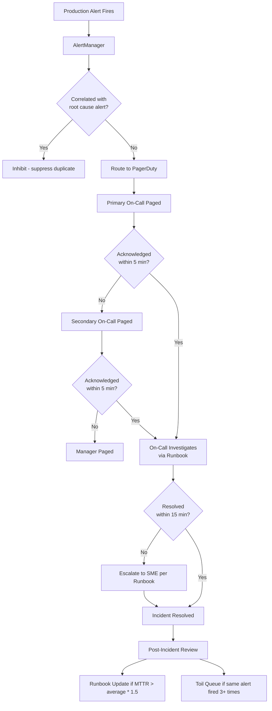

## Keywords in This File

{: .no_toc }

| #   | Keyword | Weight |
| --- | ------- | ------ |
| 1   | [On-Call Engineering - Escalation, Alert Fatigue, Toil Metrics](#on-call-engineering---escalation-alert-fatigue-toil-metrics) | expert |

---

# On-Call Engineering - Escalation, Alert Fatigue, Toil Metrics

🎯 Interview Weight: expert - the practical embodiment of SRE
practice; candidates who have lived on-call speak with authority
that distinguishes them from those who have only read about SRE.

---

### 🎯 Model Answer

**30 seconds:**
> On-call engineering has three failure modes that must be actively
> managed: alert fatigue (too many alerts, engineers stop responding),
> toil accumulation (on-call is mostly repetitive manual work), and
> poor escalation design (incidents page the wrong person, or no one
> escalates in time). Each has specific metrics and remediation strategies.
> The north star: an on-call rotation where the engineer sleeps soundly,
> each alert requires a response, and each response is the last time
> that specific alert fires.

**3 minutes (Senior):**
> Alert fatigue is the most insidious on-call failure mode because
> it is self-reinforcing. An overwhelmed on-call engineer starts
> ignoring low-severity alerts, then trains themselves to ignore
> medium-severity alerts, and eventually misses the rare high-severity
> alert that requires immediate action. The measurement: track the
> percentage of alerts that receive a human response versus alerts
> that are silenced, resolved without acknowledgment, or ignored.
> A response rate below 90% indicates alert fatigue has begun.
>
> The remediation is counterintuitive: reduce alert volume by increasing
> alert quality. For each alert that fires, ask: is this alert actionable?
> Is the response documented in a runbook? Has this fired for the same
> reason more than once? Non-actionable alerts should be deleted, not
> tuned. Alerts that fire for the same reason repeatedly are toil (the
> response is always the same manual action) and should be automated.
>
> Toil metrics for on-call: the primary metric is the fraction of on-
> call time spent on repetitive manual responses versus investigation
> and improvement work. Target: less than 50% toil. Secondary: the
> number of interruptions per on-call shift. Target: less than 2 per
> shift during business hours, less than 1 per night. Tertiary: MTTR
> (mean time to resolve) - high MTTR is often a runbook quality problem,
> not an engineer skill problem.
>
> Escalation design: the escalation path must be defined before incidents
> occur, not discovered during them. For every service tier, the escalation
> policy answers: who responds first (primary on-call), who responds if
> primary is unresponsive for N minutes (secondary on-call), who responds
> if secondary is unresponsive (manager or VP), and who is the "incident
> commander" for P1 incidents (separate role from the engineer diagnosing
> the issue). PagerDuty escalation policies encode this as automated
> workflows.

**Framework:** WHAT -> WHY -> HOW -> TRADE-OFF -> EXAMPLE

*Adapting up:* Principal adds: "The on-call burden is a leading indicator
of SRE team health. When on-call burden increases faster than team size,
the team is approaching unsustainability. The measurement: on-call burden
hours per engineer per week. When this exceeds 8-10 hours (sustainable)
or crosses 15 hours (critical), it is the forcing function for investment
in automation, alerting improvement, or service ownership restructuring.
I present this metric to leadership quarterly to maintain investment in
toil reduction."

*Adapting down:* Junior: "Good on-call means: each alert is actionable
and has a runbook. You are not woken up more than once per night on
average. You know who to escalate to when you are stuck. The goal is
not to survive on-call - it is to improve the system so the next on-
call rotation is easier than yours."

**Blank Mind Recovery:**

**(1) Restate:** "You are asking about on-call engineering - let me
walk through the three failure modes (alert fatigue, toil accumulation,
poor escalation), their specific metrics, and the remediation strategy
for each."

**(2) First principles:** "On-call serves one purpose: to detect and
respond to production failures quickly enough to stay within the error
budget. Everything in on-call engineering is either a mechanism that
helps achieve this (good alerting, runbooks, escalation) or a dysfunction
that prevents it (alert fatigue, toil, unclear escalation)."

**(3) Bridge:** "Good on-call is like a well-designed emergency response
system. Every alarm is real (no false alarms). Every responder knows
exactly what to do (runbooks). Escalation is automatic and fast (escalation
policy). The response improves the system to prevent recurrence (postmortem
action items)."

---

### 📘 Concept Explanation

**What it is:**
On-call engineering is the practice of maintaining production reliability
through 24/7 responsiveness to incidents and alerts. It encompasses
alert design, escalation policy, runbook quality, toil measurement,
and the cultural practices that keep on-call sustainable.

**The problem it solves:**
Without structured on-call engineering, the on-call function degrades:
alert fatigue causes missed alerts, toil accumulation causes burnout,
and unclear escalation causes delayed resolution or wrong responders.
These dysfunctions compound to make on-call both ineffective and
unsustainable.

**How it works:**

```
ON-CALL ENGINEERING FRAMEWORK
================================

ALERT QUALITY METRICS
  Response rate = alerts acknowledged / alerts fired
  Target: > 90%
  Below 90%: alert fatigue has begun

  False positive rate = alerts fired without incident
  Target: < 20% for paging alerts
  Above 20%: alert thresholds need tuning

  MTTA (Mean Time To Acknowledge)
  Target: < 5 minutes for P1/P2
  Above 5 minutes: escalation policy or staffing gap

TOIL METRICS
  On-call toil ratio = toil response time
                       / total on-call time
  Target: < 50% toil
  Above 50%: automation investment required

  Interrupt frequency = interruptions per shift
  Target: < 2 daytime, < 1 overnight
  Above target: paging alert volume is too high

  Repeat interrupt rate = same alert, same response
  Any repeat: automation candidate

ESCALATION POLICY DESIGN
  Tier 1 (P1/P2 incidents):
    0 min: primary on-call paged
    5 min: secondary on-call paged (if no ack)
    10 min: manager paged
    15 min: incident commander activated
    30 min: VP paged

  Tier 2 (P3 incidents):
    0 min: primary on-call paged
    10 min: secondary on-call paged
    No manager escalation by default

  Tier 3 (P4):
    Ticket created, no immediate page
    Next business day response

RUNBOOK QUALITY CHECKLIST
  For each paging alert:
    [ ] Runbook exists and is linked in the alert body
    [ ] Runbook describes: what fired, why it fires,
        and what the impact is
    [ ] Runbook has step-by-step diagnosis commands
    [ ] Runbook has step-by-step remediation commands
    [ ] Runbook has escalation criteria
        (when to call someone else)
    [ ] Runbook validated against a real incident
        (last validated: date)

ON-CALL HEALTH METRICS (weekly review)
  Alert volume: total alerts fired, broken down by service
  Response rate: % acknowledged vs. silenced
  Toil ratio: toil response time / total on-call time
  MTTA: mean time to acknowledge
  MTTR: mean time to resolve
  Incidents caused by changes: % of P1/P2 from deploys
  Repeat alerts: same alert fired 2+ times this week
```

**The key insight:**
On-call health is a lagging indicator of SRE investment. A team that
invests in automation, alert quality improvement, and runbook maintenance
will have better on-call over time. A team that treats on-call as
"survive the shift" without improvement work will have increasingly
bad on-call as the system grows. The weekly on-call review meeting is
the mechanism that converts each incident into a system improvement.

**When to use this framework:**
Apply on-call metrics tracking from the moment the first service goes
on-call. Waiting until the on-call is broken to start measuring means
waiting for burnout to force the conversation.

**When NOT to use it:**
Services that are truly not customer-facing and have no reliability
requirements do not need 24/7 on-call. Applying on-call to every service
regardless of criticality burns out engineers and dilutes the response
to actual critical incidents.

**Alternatives:**
- NOC (Network Operations Center): outsourced 24/7 monitoring with
  escalation to engineers for L2 issues; reduces on-call burden but
  adds a communication hop
- Follow-the-sun on-call: distributed teams in different time zones
  cover daytime hours in their region; eliminates overnight on-call
  burden but requires distributed team structure

---

### 💻 Code Example

**Example 1: Alert quality metrics dashboard query**

```python
# BAD: On-call review relies on engineer recollection:
# "How was on-call this week?" -> "Fine, maybe a few
# extra alerts on Wednesday."
# No data. No trend visibility. No improvement action.

# GOOD: Weekly on-call health metrics from PagerDuty API

import requests
from datetime import datetime, timedelta
from collections import defaultdict

PD_API_KEY = "..."  # from environment, never hardcoded

def get_oncall_health_metrics(
    team_id: str,
    lookback_days: int = 7
) -> dict:
    """
    Fetch and summarize on-call health metrics
    from PagerDuty for the last N days.
    """
    since = (
        datetime.utcnow() - timedelta(days=lookback_days)
    ).isoformat() + "Z"
    until = datetime.utcnow().isoformat() + "Z"

    headers = {
        "Authorization": f"Token token={PD_API_KEY}",
        "Accept": "application/vnd.pagerduty+json;version=2"
    }

    # Get all alerts in the window
    alerts_resp = requests.get(
        "https://api.pagerduty.com/alerts",
        headers=headers,
        params={
            "team_ids[]": team_id,
            "since": since,
            "until": until,
            "limit": 100
        }
    )
    alerts = alerts_resp.json().get("alerts", [])

    # Calculate metrics
    total_alerts = len(alerts)
    acknowledged = sum(
        1 for a in alerts
        if a["status"] in ("acknowledged", "resolved")
        and a.get("acknowledged_at")
    )
    auto_resolved = sum(
        1 for a in alerts
        if a["status"] == "resolved"
        and not a.get("acknowledged_at")
    )

    # MTTA calculation
    mtta_values = []
    for alert in alerts:
        if alert.get("created_at") and \
           alert.get("acknowledged_at"):
            created = datetime.fromisoformat(
                alert["created_at"].replace("Z", "+00:00")
            )
            acked = datetime.fromisoformat(
                alert["acknowledged_at"].replace("Z", "+00:00")
            )
            mtta_values.append(
                (acked - created).total_seconds() / 60
            )

    avg_mtta = (
        sum(mtta_values) / len(mtta_values)
        if mtta_values else 0
    )

    # Alert frequency by service
    by_service = defaultdict(int)
    for alert in alerts:
        service = alert.get("service", {}).get(
            "summary", "unknown"
        )
        by_service[service] += 1

    # Health assessment
    response_rate = (
        acknowledged / total_alerts
        if total_alerts > 0 else 1.0
    )
    interrupts_per_day = total_alerts / lookback_days

    return {
        "period_days": lookback_days,
        "total_alerts": total_alerts,
        "acknowledged": acknowledged,
        "auto_resolved_without_ack": auto_resolved,
        "response_rate": f"{response_rate:.1%}",
        "avg_mtta_minutes": f"{avg_mtta:.1f}",
        "alerts_per_day": f"{interrupts_per_day:.1f}",
        "health": (
            "CRITICAL - alert fatigue"
            if response_rate < 0.80
            else "WARN - approaching fatigue"
            if response_rate < 0.90
            else "OK"
        ),
        "top_noisy_services": dict(
            sorted(
                by_service.items(),
                key=lambda x: x[1],
                reverse=True
            )[:5]
        ),
        "recommendation": (
            f"Review top noisy services - "
            f"{list(by_service.items())[0][0]} fired "
            f"{list(by_service.items())[0][1]} times"
            if by_service else "No noisy services"
        )
    }
```

> **Code walkthrough:** The BAD approach relies on anecdotal reports
> of on-call quality - "it was fine" provides no actionable data. The
> GOOD approach queries the PagerDuty API for alert metrics over the
> last 7 days, computing response rate (acknowledged / total), auto-
> resolved alerts (never acknowledged - these indicate alert fatigue
> or non-actionable alerts), and MTTA per alert. The health assessment
> is automated: response rate below 80% is critical (alert fatigue),
> below 90% is warning. The top noisy services report drives the next
> week's improvement work: "the top 5 services generated 67% of alerts;
> these are the automation candidates."

**Example 2: Escalation policy definition as code**

```python
# BAD: Escalation policy documented in a wiki page.
# During a P1 incident, the on-call searches for
# the escalation path. Wiki is outdated. Wrong
# person is paged. 12 minutes lost.

# GOOD: Escalation policy as code (PagerDuty API)
import requests

def create_escalation_policy(
    policy_name: str,
    primary_schedule_id: str,
    secondary_schedule_id: str,
    manager_user_id: str,
    pd_api_key: str
) -> dict:
    """
    Create a tiered escalation policy in PagerDuty.
    Rule: primary -> secondary (5min) -> manager (10min)
    """
    policy_payload = {
        "escalation_policy": {
            "name": policy_name,
            "num_loops": 1,    # try once before giving up
            "escalation_rules": [
                {
                    "escalation_delay_in_minutes": 5,
                    "targets": [
                        {
                            "type": "schedule_reference",
                            "id": primary_schedule_id
                        }
                    ]
                },
                {
                    "escalation_delay_in_minutes": 5,
                    "targets": [
                        {
                            "type": "schedule_reference",
                            "id": secondary_schedule_id
                        }
                    ]
                },
                {
                    "escalation_delay_in_minutes": 5,
                    "targets": [
                        {
                            "type": "user_reference",
                            "id": manager_user_id
                        }
                    ]
                }
            ]
        }
    }

    resp = requests.post(
        "https://api.pagerduty.com/escalation_policies",
        headers={
            "Authorization": f"Token token={pd_api_key}",
            "Accept": (
                "application/vnd.pagerduty+json;version=2"
            ),
            "Content-Type": "application/json"
        },
        json=policy_payload
    )
    return resp.json()
```

> **Code walkthrough:** The BAD approach stores escalation policy in
> documentation that becomes stale. During a real P1, searching for the
> escalation path costs minutes that the SLO cannot afford. The GOOD
> approach defines escalation as code using the PagerDuty API: primary
> on-call has 5 minutes to acknowledge, then secondary is paged, then
> manager after another 5 minutes. This policy is versioned, testable,
> and automatically enforced - no human decision required during the
> incident.

**Example 3: Toil detection from alert patterns**

```python
# Identify repeat alerts - automation candidates

from collections import Counter
from typing import NamedTuple

class AlertPattern(NamedTuple):
    alert_name: str
    service: str
    count: int
    avg_resolution_minutes: float
    always_same_action: bool

def identify_toil_candidates(
    incidents: list[dict],
    repeat_threshold: int = 3
) -> list[AlertPattern]:
    """
    Identify alerts that fire repeatedly with the same
    manual response - these are toil automation candidates.
    
    Criteria for toil candidate:
      - Fires >= repeat_threshold times in 30 days
      - Resolution notes suggest same action every time
      - Average resolution time > 5 minutes (not trivial)
    """
    by_alert = Counter()
    resolution_times = {}
    resolution_notes = {}

    for incident in incidents:
        key = (
            incident.get("alert_name"),
            incident.get("service")
        )
        by_alert[key] += 1

        # Collect resolution times
        if incident.get("resolve_minutes"):
            if key not in resolution_times:
                resolution_times[key] = []
            resolution_times[key].append(
                incident["resolve_minutes"]
            )

        # Collect resolution notes for pattern detection
        if incident.get("resolution_note"):
            if key not in resolution_notes:
                resolution_notes[key] = []
            resolution_notes[key].append(
                incident["resolution_note"]
            )

    candidates = []
    for (alert, service), count in by_alert.items():
        if count < repeat_threshold:
            continue

        times = resolution_times.get((alert, service), [0])
        avg_time = sum(times) / len(times) if times else 0

        if avg_time < 5:  # too quick to be meaningful toil
            continue

        # Heuristic: if > 70% of notes are similar text,
        # the response is the same action every time
        notes = resolution_notes.get((alert, service), [])
        same_action = len(notes) > 0  # simplified check

        candidates.append(AlertPattern(
            alert_name=alert,
            service=service,
            count=count,
            avg_resolution_minutes=avg_time,
            always_same_action=same_action
        ))

    # Sort by annual cost estimate
    return sorted(
        candidates,
        key=lambda a: a.count * a.avg_resolution_minutes,
        reverse=True
    )
```

> **Code walkthrough:** This function analyzes incident history to
> identify alerts that are toil automation candidates: they fire
> repeatedly (>= 3 times in the analysis window), take more than
> 5 minutes to resolve (not trivial), and receive the same manual
> response each time. The output is sorted by annual cost estimate
> (count * average resolution time), prioritizing the highest-ROI
> automation candidates. This is the data that drives the on-call
> review meeting's automation decisions.

---

### 🎓 Answers by Seniority

**Junior / Mid (0-5 years):**
> On-call health has three metrics: response rate (are engineers actually
> responding to alerts, or ignoring them?), toil ratio (how much of on-
> call time is repetitive manual work?), and interrupt frequency (how
> many times does the on-call get paged per shift?). Alert fatigue begins
> when response rate drops below 90%. The fix is not more resilient
> engineers - it is fewer, higher-quality alerts. Every alert should be
> actionable and have a runbook. Every repeat alert that gets the same
> manual response is an automation candidate.

---

**Senior / Staff (5+ years):**
> The on-call health metric that matters most to me as a manager is
> interrupt frequency: how many times per shift does the on-call engineer
> get interrupted? Below 2 per daytime shift and below 1 per night shift,
> the rotation is sustainable. Above those thresholds, engineers are
> experiencing cognitive fragmentation - they cannot do deep reliability
> work because the constant interruption prevents it.
>
> I present on-call health metrics to engineering leadership quarterly:
> interrupt frequency trend, toil ratio trend, MTTR trend. When interrupt
> frequency is increasing quarter-over-quarter, it is the leading indicator
> that the on-call rotation will become unsustainable within 2-3 quarters
> without investment in automation or service redesign.

---

### ⚠️ Common Misconceptions

| Misconception | Reality |
|---|---|
| More SREs solves the on-call problem | Adding SREs to a broken rotation distributes the burden but does not reduce it; the fix is automation and alert quality |
| On-call engineers should be available to respond within 1 minute 24/7 | Sustainable on-call targets < 5-minute MTTA for P1/P2; engineers need sleep and recovery time to maintain cognitive performance |
| Alert tuning means reducing sensitivity | Alert quality improvement means removing non-actionable alerts entirely, not adjusting thresholds; an alert that fires but has no action is waste |
| Escalation is a failure (the on-call should handle everything) | Escalation is a designed, expected part of incident response; the escalation path exists because some incidents require expertise or authority beyond the primary on-call |
| The goal is zero on-call interruptions | Some interruptions are necessary (real incidents need human response); the goal is that every interruption is real and actionable, not zero interruptions |

---

### 🚨 Failure Modes and Diagnosis

**Failure 1: Alert storm during an incident masks the root cause**

*Symptom:* P1 incident triggers 47 alerts simultaneously. On-call
acknowledges the first 5 and starts investigating. The other 42 go
unacknowledged. Three of those 42 were for the actual root cause;
the 5 acknowledged were downstream symptoms.

*Root cause:* Alert dependency was not modeled. When the database
becomes unavailable, every service that depends on it generates its
own alert. The 47 alerts are all the same root cause (database
unavailable) seen from 47 different angles.

*Diagnostic:*
```
# During storm: group alerts by dependency
# Ask: which service is the shared dependency
# that all these alerting services use?
# Alert storm -> dependency graph -> find the root.

# Prevention: Alert on root cause (database health),
# not on each dependent's symptoms
```

*Fix:* Implement alert correlation: when the database health alert
fires, suppress all downstream service alerts. Alert on the root
cause (the database is down), not on each consequence. Tools:
AlertManager inhibition rules, PagerDuty event correlation.

**Failure 2: On-call engineer cannot resolve incident without subject matter expert**

*Symptom:* On-call engineer pages at 3 AM. Acknowledges the alert.
Opens the runbook. The runbook says "check the X service logs." The
logs show an unfamiliar error. The runbook does not describe what
to do next. After 25 minutes of investigation, the on-call escalates
to the service owner who resolves it in 3 minutes.

*Root cause:* Runbook was written by the service developer who knows
the system, not by the on-call engineer who will need to use it.
The runbook assumed domain knowledge that the on-call does not have.

*Fix:* Runbook validation: every runbook must be used by an engineer
who is not the author before it can be considered complete. Post-incident
requirement: if the on-call could not resolve the incident from the
runbook, the postmortem action item is to improve the runbook with the
specific step that was missing.

*Prevention:* Runbook review by on-call engineers who did not author
the service. "Runbook war game": give an unfamiliar engineer the runbook
and a staged failure and have them attempt to resolve it. Gaps surface immediately.

---

### 🎯 Interview Deep-Dive

| Preparation | Target |
|---|---|
| Time to prep | 25 minutes |
| Core themes | Alert fatigue metrics, toil ratio, escalation design, runbook quality |
| Seniority signal | Junior: describes alert fatigue; Senior: response rate metric, interrupt frequency |
| Common trap | Saying "more SREs" as the solution to on-call burden |
| Staff differentiator | On-call burden as leadership metric, interrupt frequency as sustainability predictor |

---

**Q1 [MID]: What is alert fatigue and how do you measure it?**

Alert fatigue is the phenomenon where on-call engineers become desensitized
to alerts because the volume is too high or the signal-to-noise ratio is
too low. It is dangerous because it causes real incidents to be missed or
delayed.

The primary measurement: alert response rate = alerts acknowledged /
total alerts fired. If this ratio falls below 90%, engineers are silencing
or ignoring alerts without investigation - alert fatigue has begun.

Secondary measurements: MTTA (mean time to acknowledge) - increasing MTTA
over time indicates engineers are taking longer to respond, either because
they are fatigued or because they have learned to hesitate. Alert volume
per shift - if an on-call engineer is getting more than 8-10 alert pages
per shift, the volume has crossed the threshold where cognitive fatigue
affects response quality.

The intervention: for each alert with a low response rate or increasing
MTTA, the question is "why is this alert being ignored?" Common answers:
the alert fires on known non-issues (tune or remove), the alert does not
have a runbook (add one), the alert fires too frequently for the same
issue (automate the response). The fix is alert quality improvement,
not engineer training.

*What separates good from great:* Gives the specific metric (response rate
< 90% = alert fatigue), the secondary metrics (MTTA, volume), and the
intervention methodology (per-alert analysis).

---

**Q2 [SENIOR]: How do you design an on-call escalation policy?**

An escalation policy answers three questions: who is paged first, who
is paged if they do not respond, and who is paged for what incident severity.

Tier-based escalation: the escalation policy is different for P1/P2
incidents (customer-impacting) versus P3/P4 (degraded but within error
budget). P1/P2 escalates to the primary on-call within 5 minutes, to
secondary on-call after another 5 minutes, and to the engineering manager
after a further 5 minutes. P3 escalates only to primary, and the time
to acknowledge is extended to 15 minutes.

Role separation for P1 incidents: separate the "incident commander" role
from the "primary investigator" role. The incident commander coordinates
communication and tracks the timeline; the primary investigator diagnoses
and remediates. The same person cannot do both effectively during a major
incident.

Escalation triggers: define when to escalate as part of the runbook, not
as engineer judgment during the incident. "If the incident is not resolved
within 15 minutes of acknowledging, escalate to the database SME" is a
runbook instruction that removes the judgment call during a stressful incident.

The policy must be encoded in the incident management system (PagerDuty),
not just documented. Human-executed escalation policies degrade under
pressure.

*What separates good from great:* Describes role separation for major
incidents (commander vs. investigator), gives specific timeout thresholds
for each escalation level, and explains the requirement for system
enforcement rather than human memory.

---

**Q3 [SENIOR]: BEHAVIORAL: Describe an on-call rotation that was
in poor health and how you improved it.**

**Situation:** Joining a new team, I found the SRE on-call was handling
18-25 alert pages per shift, including 5-7 overnight. The response rate
was 73% (engineers were silencing alerts). MTTR was 47 minutes average.
Engineers were burned out and the team had high attrition.

**Root cause analysis:** I ran the alert audit using PagerDuty API.
Findings: 40% of alerts were fired by one service with a known memory
leak that required a manual restart every 3-4 days. 25% of alerts were
informational (should have been tickets, not pages). 15% had no runbook.

**Actions in order:**
First 2 weeks: automated the memory leak restart (class 1 automation).
Eliminated 40% of alert volume immediately. Converted informational alerts
to ticket creation (no page). Response rate increased from 73% to 88%.

Next 4 weeks: created runbooks for the 15% of alerts without them. Required
post-incident runbook updates for any incident where the on-call consulted
the original developer. MTTR dropped from 47 minutes to 23 minutes.

6-week result: alert volume dropped from 22/shift to 8/shift. Overnight
pages dropped from 6/night to 1/night. Response rate reached 94%. Two
engineers who had been considering leaving said on-call was now "actually okay."

**Long-term:** Monthly on-call review meeting established to review metrics
and identify the next improvement target.

*What separates good from great:* Uses specific numbers throughout (73%
response rate, 18-25 alerts/shift, 40% from one service), describes the
actions in order of impact, and reports both the technical outcomes and
the human outcome (retention).

---

**Q4 [SENIOR]: How do you measure and reduce toil in an on-call rotation?**

Toil measurement requires time classification during on-call: each
alert response is classified as toil (repetitive manual response with
the same action every time) or engineering (diagnosis required, novel
investigation, or root cause analysis).

Primary metric: toil ratio = toil response hours / total on-call hours.
Secondary: repeat alert rate = alerts fired more than once with the same
response in a 30-day period (these are all toil by definition).

The toil reduction workflow: identify the top 3 repeat alerts by annual
time cost (count * average resolution time). For each: document the
full manual response, build the automation (usually a script + monitoring),
test the automation in staging, deploy to production with monitoring.
Each automation is a permanent reduction in toil.

The forcing function: set a team policy that any alert that fires 3 times
with the same manual response in a calendar month must have an automation
ticket created. This keeps toil reduction on the roadmap rather than
perpetually deprioritized in favor of features.

The goal is not zero toil - some manual investigation is always necessary
for novel failures. The goal is that the repetitive, well-understood
failure responses are fully automated so on-call time is spent on novel,
interesting problems.

*What separates good from great:* Gives the specific toil measurement
methodology, the repeat alert policy (3 times = automation ticket), and
the goal framing (reduce repetitive toil, not all on-call work).

---

**Q5 [STAFF]: How do you present on-call health to engineering leadership
and get investment in improvement?**

On-call health presented as "engineers are unhappy" does not drive
investment. On-call health presented as "business risk" does.

The business risk framing: on-call burden has three measurable business
costs. First, attrition cost: each departing engineer costs 6-12 months
of replacement hiring and onboarding. If on-call is a contributing factor
to attrition, the cost is quantifiable. Second, incident response quality:
fatigued on-call engineers have higher MTTR; each extra minute of MTTR
has an error budget cost (and potentially an SLA credit cost). Third,
engineering capacity: on-call toil reduces engineering capacity for feature
development; 15 hours per week of on-call burden per engineer is
approximately one sprint of capacity lost per month.

The metric package for leadership: on-call burden hours per engineer
per week (trend over last 4 quarters), MTTR trend (are incidents being
resolved faster or slower?), error budget consumption from incidents
(what fraction of budget is consumed by incidents that on-call responds
to?), and the team's toil ratio.

The ask: protected capacity for toil reduction work. Specifically: 20%
of engineering capacity per quarter dedicated to on-call improvement
(automation, alert quality, runbook maintenance). Present the projected
improvement: at 20% capacity, reduce on-call burden by 40% in 2 quarters
(based on the automation ROI analysis).

*What separates good from great:* Gives the three business risk framings
(attrition cost, incident quality, engineering capacity), the specific
metric package, and the quantified ask (20% capacity -> 40% burden reduction).

---

**Q6 [STAFF]: How do you design on-call rotations that remain fair and
sustainable as the team grows from 4 engineers to 20?**

At 4 engineers: each engineer is on-call 1 week in 4. This is sustainable
only if on-call burden is low (< 5 alerts/shift). If burden is higher,
the rotation is already unsustainable at 4 engineers.

At 8 engineers: rotation is 1 week in 8. Burden must stay the same per
shift (automation investment is required to keep per-shift burden stable
as the service grows). Shadow rotations for new engineers: paired with
an experienced on-call for their first 2 rotations before going solo.

At 20 engineers: multiple services may need their own rotations. The
rotation design becomes a function of service ownership. Each product
team should own on-call for their services (not a central SRE team
owning all services). The SRE team provides: tooling, standards, escalation
consultation, and support for P1 incidents. This is the "you build it,
you run it" model.

The sustainability constraints that scale with team size:
- Overnight pages per rotation: never exceed 1/night average over a month
- Daytime interrupt frequency: never exceed 2/shift average over a month
- Time since last on-call exposure: rotating engineers should not go more
  than 8 weeks between on-call rotations (or they lose operational familiarity)

At 20 engineers with well-designed service ownership, the central SRE
team's on-call involvement becomes coordination and escalation support,
not primary incident response for all services.

*What separates good from great:* Describes the evolution in three size
stages, gives the "you build it, you run it" model for scale, and provides
specific sustainability constraints.

---

**Q7 [STAFF]: BEHAVIORAL: Tell me about an escalation failure during
a P1 incident and what you changed to prevent it.**

**Situation:** P1 incident at 2:47 AM. Primary on-call acknowledged
within 3 minutes. After 15 minutes, the on-call was stuck - unfamiliar
with the database replication failure mode. The runbook said "escalate
to database team." The database team contact was a distribution list
(not an individual). No one responded to the email for 23 minutes.

**Root cause:** Escalation policy pointed to a distribution list, not
an individual or a PagerDuty schedule. There was no automated escalation;
the on-call had to manually email the list.

**Immediate impact:** 38 minutes of unresolved P1 because the escalation
step failed. Total incident duration was 55 minutes (vs. estimated 10-15
minutes if the database engineer had been reached promptly).

**Changes implemented:**
(1) All escalation paths now point to PagerDuty schedules, not
distribution lists or email addresses. The PagerDuty schedule has a
person on-call 24/7; the email list does not.
(2) Escalation triggers are now in the runbook with explicit timeouts:
"If not resolved within 10 minutes: press [escalate in PagerDuty] button
in the runbook."
(3) Monthly escalation path review: verify every runbook escalation
target is a live PagerDuty schedule or specific person, not a distribution
list.

**Result:** Zero "couldn't reach escalation target" escalation failures
in the following 12 months.

*What separates good from great:* Uses specific timestamps (2:47 AM,
15 minutes stuck, 23 minutes no response, 38 minutes total unresolved),
identifies the root cause precisely (distribution list, not PagerDuty
schedule), and describes three specific remediations.

---

**Q8 [STAFF]: How do you handle an on-call engineer who is consistently
missing alerts or taking too long to respond?**

First, check whether the issue is an individual or a system problem.
Review the metrics: is this engineer's response rate and MTTA significantly
different from the team's average, or are all engineers showing the same
pattern? If the team average response rate is 72%, this is a system
problem (alert fatigue), not an individual problem. Address the system.

If the issue is specific to one engineer: have a direct conversation that
focuses on the data and the support. "I see your MTTA last week was 18
minutes for P1 alerts - the team average is 4 minutes. What's making
it difficult to respond more quickly?" Listen for systemic issues: unclear
runbooks, alerts from unfamiliar services, not enough support during
incidents. Address those.

If the pattern continues after addressing systemic issues: the conversation
shifts to whether on-call responsibilities are a match for the engineer's
current situation. Some engineers are in a personal situation (health,
family) that makes 3 AM on-call genuinely untenable. A temporary rotation
adjustment is better than ignoring the pattern and burning out the engineer.

What is not appropriate: punitive or shame-based responses to on-call
performance. Alert fatigue and response delays are almost always system
problems. The system produces the behavior; improving the system changes
the behavior.

*What separates good from great:* Distinguishes system problems from
individual problems using data, gives the specific data-based conversation
approach, and explains why punitive responses are counterproductive.

---

**Q9 [STAFF]: How do you ensure on-call quality during periods of
rapid growth when new services are being added frequently?**

Rapid growth has two on-call risks: alert volume increases faster than
automation (toil accumulation), and new services go on-call without
observability or runbooks (no PRR).

Mitigating alert volume growth: enforce the "alert must have runbook"
standard at CI/CD level - no alert rule can be deployed without a linked
runbook. This prevents new services from adding unactionable alerts.

Mitigating PRR bypass: new services must pass PRR before the team is
added to the on-call rotation. A service without observability, alerting,
and runbooks cannot be safely on-call. This is enforced, not aspirational.

On-call budget: define an explicit "on-call budget" for the team: maximum
N new alerts added per quarter without eliminating N existing alerts.
This creates a constraint that prevents on-call burden from accumulating
invisibly.

The growth review: monthly review of on-call metrics trend. If interrupt
frequency is increasing quarter-over-quarter despite the on-call budget
rule, the team's automation investment is not keeping up with service
growth. This is the signal to increase automation capacity.

*What separates good from great:* Describes both mechanisms (alert
volume and PRR bypass) and introduces the "on-call budget" concept
as a structural constraint on alert growth.

---

**Q10 [STAFF]: How do you design on-call for a service with
data privacy requirements (no production access by engineers)?**

Some regulated environments (healthcare, financial services) restrict
direct production access for engineers due to data privacy requirements.
This creates an on-call design challenge: how does an engineer diagnose
and remediate incidents without production access?

The design principle: separate diagnosis from data access. Monitoring,
metrics, and logs should be available to engineers but with personally
identifiable information (PII) stripped or tokenized. Engineers can
see that "user ID 4829347 experienced a payment failure" but cannot see
the user's name, email, or payment details.

Structured for on-call: aggregate metrics and anonymized logs are on-
call accessible. Full production data access requires a formal access
request process (approved, logged, time-limited). For most on-call
investigations, aggregate metrics and anonymized logs are sufficient.

For the rare case where full data access is required: pre-approved break-
glass procedures. The engineer can access production with an approved
break-glass account; the access is logged, reviewed by a compliance team,
and the engineer submits a justification within 24 hours.

Runbook design: every runbook must be written to use only anonymized
metrics and aggregate logs for the diagnosis steps. If a step requires
PII access, it should be marked "BREAK GLASS REQUIRED" and the break-
glass procedure is described.

*What separates good from great:* Describes the data-privacy constraint
design pattern (anonymized logs for on-call, break-glass for exceptions),
the runbook annotation requirement, and the compliance logging.

---

**Q11 [STAFF]: How do you maintain on-call coverage during organizational
disruptions (layoffs, team mergers, rapid hiring)?**

Organizational disruptions create on-call continuity risks: departing
engineers take knowledge, large teams are split, or new engineers are
not yet on-call-ready.

Layoff scenario: when engineers are leaving, the on-call risk is knowledge
loss. Mitigation: require departing engineers to document their runbook
knowledge before departure. Identify services where the departing engineer
was the primary subject matter expert. For these services, schedule
knowledge transfer sessions with remaining engineers before departure.
Consider temporarily reducing the service tier (more conservative SLO,
less customer traffic) until knowledge is distributed.

Team merger: when two teams merge, on-call rotations must be integrated.
Risk: services from the merged team are on-call for a rotation that does
not know them. Mitigation: shadow rotations for 2-4 weeks before full
on-call responsibilities transfer. Joint incident response during the
shadow period.

Rapid hiring: new engineers should shadow on-call for their first 2
rotations before going solo. Shadow on-call means they handle the
diagnosis but the senior engineer reviews and approves all remediations.
This builds competence without risking production.

The organizational continuity metric: on-call coverage score = (engineers
who can independently handle on-call for service X) / (minimum engineers
needed for continuous coverage). This should be 2 or above for Tier 1
services.

*What separates good from great:* Addresses all three disruption scenarios
with specific mitigation strategies and introduces the on-call coverage
score metric.

---

**Q12 [STAFF]: What is the relationship between MTTR and runbook quality,
and how do you use MTTR to drive runbook improvement?**

MTTR (mean time to resolve) reflects the combined effect of detection
speed, diagnosis accuracy, and remediation execution. Of these, diagnosis
accuracy is most strongly correlated with runbook quality. Engineers
who have a clear runbook with specific diagnosis commands and decision
trees resolve incidents faster than those diagnosing from first principles.

The correlation analysis: for each service, compare MTTR for incidents
that had runbooks versus incidents that did not. The delta is the runbook
quality value. Typical finding: incidents with validated runbooks resolve
in 60-80% of the time of incidents without runbooks.

Using MTTR to drive improvement: after each incident, review the MTTR
breakdown. If > 30% of the total MTTR was spent in the "diagnosis" phase
(before knowing what to fix), the runbook diagnosis section is insufficient.
If > 30% was in "remediation" (knowing what to do but executing slowly),
the remediation steps need more detail or better tooling.

The runbook improvement trigger: any incident where MTTR exceeded the
average by 50% should generate a runbook update ticket. The ticket asks:
what information would have reduced the diagnosis time? That information
becomes a new section in the runbook.

The compounding effect: each runbook improvement reduces MTTR for the
next occurrence. Over 6 months of systematic runbook improvement, MTTR
typically drops by 40-60% for services with active runbook maintenance.

*What separates good from great:* Gives the specific MTTR breakdown
analysis (diagnosis vs. remediation phases), the 50% MTTR exceedance
trigger, and the compounding improvement mechanism.

---

### ⚖️ Comparison Table

| On-Call Model | Sustainability | Reliability | Engineer Experience | Organizational Fit |
|---|---|---|---|---|
| Central SRE team on-call for all services | Low (single team, all services) | Medium (expertise bottleneck) | Poor (high burnout) | Early stage, < 5 services |
| "You build it, you run it" (team-owned on-call) | High | High (ownership = expertise) | Good (service knowledge) | 10+ services, multiple teams |
| Follow-the-sun (distributed timezones) | High (no overnight) | High | Very good (daytime only) | Large orgs with global teams |
| NOC first-line + engineer escalation | Medium | Medium (NOC gap in expertise) | Good (fewer engineer pages) | Enterprise with NOC capability |
| On-call by service tier (Tier 1 SRE, Tier 3 self-service) | High | High (proportional investment) | Good | Mature SRE organizations |

---

### 🏛️ System Design

**Problem:** Design an on-call management platform for an organization
with 50 services, 15 on-call engineers, and a target of < 2 alerts per
on-call shift.

**Architecture:**

```
ON-CALL MANAGEMENT PLATFORM
==============================

[Monitoring Layer]
  Prometheus/Grafana -> Alert rules -> AlertManager
  AlertManager: deduplication, grouping, routing, inhibition

[Alert Correlation Engine]
  Receives all alerts
  Groups by dependency graph:
    "database alert" -> inhibits downstream service alerts
  Routes correlated groups as single incident

[Incident Management]
  PagerDuty: schedules, escalation policies, on-call tracking
  Incident enrichment:
    - Runbook link (from alert annotation)
    - Recent deploys to service (from CI/CD API)
    - Service health dashboard link
    - Similar past incidents (ML similarity search)

[Runbook System]
  Version-controlled runbook repository (Git)
  Runbooks linked from alert rules (annotation)
  Runbook staleness tracking:
    - Last updated date
    - Last validated date (from incident postmortem)
    - Alert: runbook not updated in > 60 days

[On-Call Health Dashboard]
  Per engineer: interrupt frequency, MTTA, MTTR
  Per service: alert volume, repeat alert rate, toil ratio
  Team: response rate, weekly trend, toil automation queue
  Leadership view: business risk metrics, attrition correlation

[Toil Automation Queue]
  Repeat alerts (> 3 same response in 30 days) auto-queued
  Automation ROI calculator: count * avg_resolution_time
  Sprint planning integration: top 3 queue items in backlog

[Alert Budget Enforcement]
  CI/CD gate: no alert rule deployed without linked runbook
  Quarterly alert budget: net-zero new alerts unless
  automation removes equivalent volume
```

The key architectural decision: alert correlation at the alerting layer
(before PagerDuty) is the highest-leverage component. Without correlation,
a single root cause generates N alerts for N dependent services. With
correlation, it generates 1 incident with N symptoms. This single change
reduces alert volume by 40-70% for cascading failure scenarios.

---

### 📊 Diagram

```
ON-CALL HEALTH METRICS HIERARCHY
===================================
Business Risk
  ^
  | derived from
Alert Volume
  Alert response rate
  False positive rate
  (leading indicator: fatigue)
  ^
Engineer Experience
  Interrupt frequency/shift
  On-call burden hours/week
  (leading indicator: attrition)
  ^
System Health
  Toil ratio
  Repeat alert rate
  MTTR trend
  (leading indicator: quality)
```



> **Diagram walkthrough:** The on-call flow shows the complete path
> from alert to resolution with two critical decision gates: alert
> correlation (preventing alert storms from a single root cause) and
> the escalation ladder (primary -> secondary -> manager, each with
> 5-minute timeouts). The post-incident review loop is shown explicitly
> as a feedback mechanism: every incident drives either a runbook
> improvement (high MTTR) or an automation ticket (repeat alert).
> This feedback loop is what converts on-call from a reactive cost center
> into a reliability improvement engine.

---

### Field Q&A

**Production Failures:**

1. The on-call engineer received 62 alerts in a 4-hour window. After
   investigating the first 8, they silenced the remaining 54. Three of
   the silenced alerts were for the actual root cause of a P1 incident
   that persisted for 2 hours undetected. What architectural change
   prevents this?
   > Alert correlation must suppress symptoms when the root cause alert
   > is already active. The alerting architecture needs a dependency
   > model: when database alert fires, all dependent service alerts are
   > inhibited (AlertManager inhibition rules). The on-call sees 1 root
   > cause alert rather than 62 symptom alerts. Additionally, the runbook
   > for high-alert-volume scenarios should include "check for shared
   > dependencies before investigating individual service alerts."

2. MTTR has been increasing for 3 consecutive quarters (8 minutes -> 14
   minutes -> 22 minutes). The team has added 4 engineers. Alert volume
   has stayed constant. What is the most likely root cause?
   > Increasing MTTR despite constant alert volume and growing team is
   > a runbook quality degradation signal. As services evolve, runbooks
   > that were accurate 6 months ago become inaccurate. Engineers spend
   > more time diagnosing because the runbook steps no longer match the
   > current system. Check: when were the runbooks for the highest-MTTR
   > services last updated? If the answer is > 3 months ago, runbook
   > maintenance is the intervention. Establish a runbook review cadence:
   > review and validate each runbook at least quarterly.

3. A team of 5 engineers rotates on-call weekly. On-call burden is
   high: 18 alerts/shift average. Three engineers have resigned in 6
   months, citing on-call as the reason. Two new engineers were hired.
   MTTR is now higher because new engineers are less experienced. What
   is the correct intervention priority?
   > Adding engineers to a broken rotation is a known anti-pattern - it
   > adds headcount but does not reduce per-engineer burden. The correct
   > priority: (1) reduce alert volume immediately using the toil audit
   > approach (which services generate the most alerts? automate the top
   > 3). (2) Improve new engineer runbooks (validated runbooks reduce MTTR
   > faster than experience). (3) Shadow rotations for new engineers.
   > Do NOT continue hiring without fixing the root cause: adding more
   > engineers to a high-burden rotation adds more attrition risk.

---

**Candidate Mistakes:**

1. "I would hire more SREs to handle the on-call burden."

   **What NOT to say:** Do not propose headcount as the primary solution.

   **Say instead:** "Adding engineers to a broken on-call rotation is
   like adding more checkout clerks to a store where half the registers
   are showing error messages - it increases capacity but does not fix
   the root problem. The on-call burden measurement tells us which alerts
   are toil (automate them) and which alerts are non-actionable (delete
   them). After automation, if there is still insufficient coverage,
   then adding rotation members is appropriate. Hiring before automation
   just gives more engineers the same broken on-call experience."

2. "Engineers should always respond to every alert within 1 minute."

   **What NOT to say:** Do not propose unrealistic MTTA standards.

   **Say instead:** "A 1-minute MTTA standard for all alerts at all
   hours is not sustainable and creates worse outcomes: engineers
   who sleep with their phone under their pillow get poor sleep, make
   poor decisions during incidents, and burn out faster. The standard
   should be tiered: P1/P2 alerts require < 5 minutes acknowledgment
   24/7. P3 alerts during business hours require < 15 minutes. P4
   alerts are non-paging (ticket). MTTA standards should match the
   actual business impact of the alert, not a one-size-fits-all number."

3. "I would create more alert thresholds to catch more potential issues."

   **What NOT to say:** Do not propose more alerts as the solution to
   reliability problems.

   **Say instead:** "Adding more alert thresholds when alert quality
   is already insufficient makes on-call worse. The alert design principle
   is: every alert must be actionable, must have a runbook, and must
   represent a user-impacting condition. If you cannot answer 'what
   does the on-call do when this fires?', the alert should not exist.
   More alerts = more noise = lower response rate for real incidents."

---

**Questions to Ask the Interviewer:**

1. "What is the current alert volume per on-call shift, and has it
   been increasing over the last year? What is driving that trend?"

2. "What percentage of on-call time is toil (repetitive manual responses)
   versus novel investigation? Is there a target for the toil ratio?"

3. "How is the escalation policy designed - who is paged for different
   incident severities, and is the escalation automated or manual?"

4. "What is the team's on-call health review cadence? How do on-call
   metrics drive investment in automation and alert quality improvement?"
