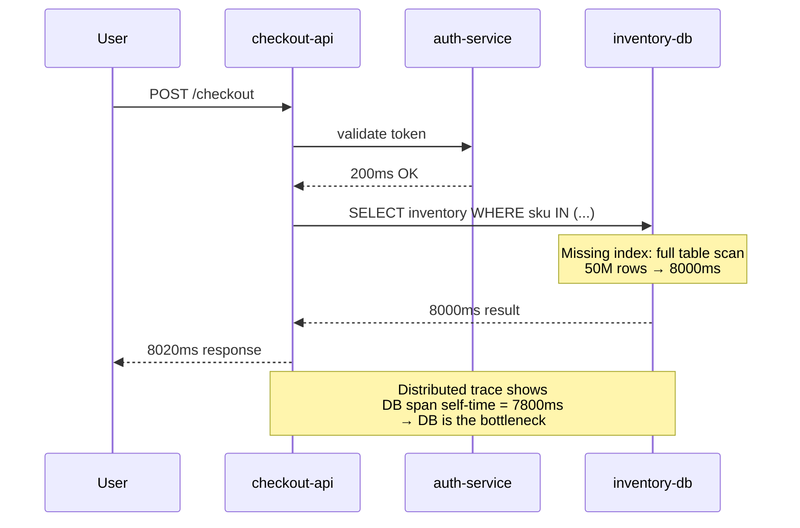

## Keywords in This File

{: .no_toc }

| #   | Keyword | Weight |
| --- | ------- | ------ |
| 1   | [Production Incident Diagnosis - RCA, Distributed Tracing, Runbooks](#production-incident-diagnosis---rca-distributed-tracing-runbooks) | expert |

---

# Production Incident Diagnosis - RCA, Distributed Tracing, Runbooks

🎯 Interview Weight: expert - the most practical SRE skill; candidates
who can describe a systematic diagnostic methodology with concrete
commands demonstrate real operational experience.

---

### 🎯 Model Answer

**30 seconds:**
> Production incident diagnosis follows a structured process: triage
> (define the scope and impact), locate (find the failing component
> using distributed tracing and metrics), understand (identify root
> cause by tracing the causal chain), and fix (remediate + validate).
> Distributed tracing shows which service and which operation is the
> performance bottleneck. RCA goes one step further: not "the database
> was slow" but "the database was slow because a new index was not
> created and a query changed from O(1) to O(n) after the last deploy."

**3 minutes (Senior):**
> The critical discipline in production incident diagnosis is separating
> symptoms from causes. The on-call engineer's first instinct is to fix
> the symptom (restart the service). The RCA discipline requires asking
> "why" until the root cause is identified - the condition that, if
> eliminated, prevents the incident from recurring.
>
> The five-why technique is the simplest RCA method: ask "why did X
> happen?" five times. Each why goes one level deeper in the causal
> chain. "The service was unavailable" -> "because the pod crash-looped"
> -> "because it ran out of memory" -> "because a memory leak was
> introduced in the last deploy" -> "because the memory profiling test
> in CI was not covering the new code path" -> "because there was no
> integration test for that path." The root cause is the missing test,
> not the OOM.
>
> Distributed tracing accelerates the "locate" phase. When a request
> fails or is slow, the trace shows the complete call graph: which
> service handled it, which downstream calls were made, how long each
> took, and which failed. Without tracing, the on-call examines each
> service's logs in sequence, manually reconstructing the call chain.
> With tracing, the failed service and the failure point are visible
> in 30 seconds.
>
> Runbooks are the organizational memory for diagnostic procedures.
> A runbook for a specific alert encodes the diagnostic steps (what
> commands to run, what to look for) and remediation steps (what to
> do when the diagnosis confirms the expected failure mode). Good runbooks
> reduce MTTR by 60-80% by eliminating the "what do I try next?" decision
> loop during an incident.

**Framework:** WHAT -> WHY -> HOW -> TRADE-OFF -> EXAMPLE

*Adapting up:* Principal adds: "The most valuable investment in production
diagnostics is not better tooling - it is systematic knowledge capture
after every incident. Each postmortem action item that improves a runbook,
adds a diagnostic check, or creates an alert for a new failure mode is
a permanent improvement to the organization's diagnostic capability.
After 3 years of this practice, the on-call engineer for a mature service
can diagnose and resolve incidents that would have taken 2 hours in year
1 in under 15 minutes."

*Adapting down:* Junior: "When something breaks: (1) find the error in
the logs, (2) trace back to why the error happened (the cause, not the
symptom), (3) fix the cause. Distributed tracing tools show you which
service in a chain is failing. The runbook tells you what to do when
a specific alert fires."

**Blank Mind Recovery:**

**(1) Restate:** "You are asking about production incident diagnosis -
let me walk through the triage-locate-understand-fix process, the role
of distributed tracing in the locate phase, and RCA methodology."

**(2) First principles:** "Production incidents have a root cause that,
if fixed, prevents recurrence. Symptom-fixing (restarting the service)
addresses the immediate pain but leaves the root cause. The diagnostic
discipline is to push past symptoms to causes, using the tools available
(traces, logs, metrics) to identify the causal chain."

**(3) Bridge:** "Production diagnosis is like medical diagnosis. A patient
has a fever (symptom). The doctor does not treat the fever - they find
the infection (root cause). Treating the fever makes the patient
comfortable but does not cure the disease. Treating the infection cures
the disease and the fever resolves."

---

### 📘 Concept Explanation

**What it is:**
Production incident diagnosis is the systematic process of identifying
the root cause of a production failure, implementing a fix, and validating
recovery. It combines distributed tracing (for locating the failing
component in a distributed system), log analysis, metric analysis, and
structured RCA methodology.

**The problem it solves:**
Without structured diagnosis, on-call engineers fix symptoms (restart
the service, scale the instance) without finding root causes. The same
incident recurs because the underlying cause is never addressed.

**How it works:**

```
PRODUCTION INCIDENT DIAGNOSIS PROCESS
========================================

PHASE 1: TRIAGE (first 5 minutes)
  What is the business impact?
    Services: which service(s) are affected?
    Users: what % of users are affected?
    Severity: P1 (service down) / P2 (degraded) /
              P3 (within error budget)?
    Time: when did it start? (look at deployments)

  Immediate check: "Has anything changed?"
    Recent deployments? -> rollback candidate
    Configuration changes? -> revert candidate
    Traffic spike? -> scaling response
    Dependency change? -> dependency investigation

PHASE 2: LOCATE (next 5-15 minutes)
  Method 1: Distributed trace analysis
    Find a failing trace in Jaeger/Zipkin/Tempo
    Identify: which span is slow or erroring?
    That span's service is the primary suspect

  Method 2: Golden signals correlation
    Error rate spike: which service?
    Latency spike: which service, which endpoint?
    Saturation: which resource dimension?
    Cross-correlate: did multiple signals spike together?

  Method 3: Dependency graph traversal
    Start at the user-facing service with errors
    For each downstream call with errors: was it
      already degraded before the upstream called it?
    The first degraded service in the chain is the suspect

PHASE 3: UNDERSTAND (next 5-20 minutes)
  Five-why root cause analysis:
    Why 1: Why is the service returning errors?
      -> Specific error from logs
    Why 2: Why is the error occurring?
      -> Code path, stack trace, resource state
    Why 3: Why is the code path reaching this condition?
      -> Input state, configuration, dependency state
    Why 4: Why did this condition arise now?
      -> Change, traffic growth, time-based trigger
    Why 5: Why was the condition not caught before?
      -> Missing test, missing alert, missing runbook
    Root cause = the 5th why answer

  Change correlation:
    "What changed in the last 24 hours?"
    Deployments, configuration changes, data changes,
    traffic changes, dependency changes
    Root cause is almost always a change

PHASE 4: FIX AND VALIDATE
  Immediate mitigation (if root cause unclear):
    Rollback the last deploy (if change-caused)
    Scale up (if saturation-caused)
    Circuit break the failing dependency

  Root cause remediation (after service is stable):
    Fix the code / configuration / query
    Test the fix in staging
    Deploy via canary

  Validation:
    Error rate returns to baseline
    Golden signals nominal
    Error budget recovery confirmed

COMMON DIAGNOSTIC COMMANDS
  # Is this service the source of errors or a symptom?
  kubectl logs -l app=payment-api --since=15m | \
    grep ERROR | sort | uniq -c | sort -rn | head -20

  # What changed in the last hour?
  kubectl rollout history deployment/payment-api

  # What is the error rate?
  promtool query instant \
    'sum(rate(http_requests_total{status=~"5.."}[5m]))'

  # Distributed trace for a failing request
  # (requires trace ID from log or error)
  curl jaeger:16686/api/traces/{trace_id}
```

> **Code walkthrough:** This (requires trace ID from log or error) example demonstrates a key concept in practice using HTTP client. **KEY MECHANISM:** the runtime executes these instructions in sequence with specific memory and execution semantics. **WHY IT MATTERS:** misapplying this pattern causes subtle bugs that only manifest under production load. **TAKEAWAY: understand the execution model before using this pattern in production code.**

**The key insight:**
The most common error in incident diagnosis is fixing the immediate
symptom without identifying the root cause. Every incident that recurs
within 30 days is evidence of a symptom-fix rather than a root-cause
fix. The five-why technique is not optional - it is the mechanism that
prevents recurrence.

**When to use it:**
Apply the full diagnosis process to every P1 and P2 incident. For P3
and P4 incidents within the error budget, a lighter-weight process is
acceptable (identify the change that caused it, add it to the postmortem
backlog).

**When NOT to use it:**
During active mitigation, the priority is service restoration, not
root cause analysis. First restore service, then do RCA. A mitigation
runbook that includes "find the root cause" steps is a poorly designed
runbook.

---

### 💻 Code Example

**Example 1: Distributed trace analysis for latency diagnosis**


```python
# BAD: anti-pattern - see GOOD example below
```

```python
#!/usr/bin/env python3
# BAD: Manual log search across 5 services to
# reconstruct which service caused the slow request.
# "Let me check each service's logs for request ID X..."
# Takes 20-40 minutes for a distributed system.

# GOOD: Distributed trace analysis via Jaeger API
# Finds the slow span in the trace in < 2 minutes

import requests
from typing import Optional

JAEGER_URL = "http://jaeger:16686"

def find_slow_spans(
    service_name: str,
    min_duration_ms: int = 1000,
    lookback_hours: int = 1
) -> list[dict]:
    """
    Find the slowest spans in the last N hours.
    Returns list of {trace_id, span, duration, operation}.
    """
    lookback_us = lookback_hours * 3600 * 1_000_000

    resp = requests.get(
        f"{JAEGER_URL}/api/traces",
        params={
            "service": service_name,
            "operation": "",
            "start": 0,  # will be overridden by lookback
            "limit": 20,
            "lookback": f"{lookback_hours}h",
            "minDuration": f"{min_duration_ms}ms"
        },
        timeout=10
    )

    traces = resp.json().get("data", [])
    results = []

    for trace in traces:
        trace_id = trace["traceID"]
        for process_id, process in \
                trace["processes"].items():
            pass  # process metadata

        for span in trace["spans"]:
            duration_ms = span["duration"] / 1000

            if duration_ms < min_duration_ms:
                continue

            # Find the bottleneck span
            # (long duration without long child spans)
            child_duration = sum(
                s["duration"] for s in trace["spans"]
                if any(
                    r["refType"] == "CHILD_OF"
                    and r["spanID"] == span["spanID"]
                    for s in trace["spans"]
                    for r in s.get("references", [])
                )
            ) / 1000

            self_time_ms = duration_ms - child_duration

            results.append({
                "trace_id": trace_id,
                "span_id": span["spanID"],
                "operation": span["operationName"],
                "service": trace["processes"].get(
                    span["processID"], {}
                ).get("serviceName", "unknown"),
                "duration_ms": f"{duration_ms:.0f}ms",
                "self_time_ms": f"{self_time_ms:.0f}ms",
                "likely_bottleneck": self_time_ms > 500
            })

    return sorted(
        results,
        key=lambda x: float(
            x["self_time_ms"].replace("ms", "")
        ),
        reverse=True
    )

# Diagnostic usage during an incident:
slow_spans = find_slow_spans(
    service_name="payment-api",
    min_duration_ms=500
)
print("Top slow spans (likely bottlenecks):")
for s in slow_spans[:5]:
    print(
        f"  {s['service']}.{s['operation']}: "
        f"self_time={s['self_time_ms']}, "
        f"total={s['duration_ms']}"
        f"  {'<-- BOTTLENECK' if s['likely_bottleneck'] else ''}"
    )
```

> **Code walkthrough:** The BAD approach requires manually searchingice. **KEY MECHANISM:** the runtime executes these instructions in sequence with specific memory and execution semantics. **WHY IT MATTERS:** misapplying this pattern causes subtle bugs that only manifest under production load. **TAKEAWAY: understand the execution model before using this pattern in production code.**
> each service's logs to reconstruct which service in a chain was slow -
> a 20-40 minute process in a complex distributed system. The GOOD approach
> queries the Jaeger distributed tracing API to find slow spans automatically.
> The key calculation is "self time" (span duration minus child span
> durations), which identifies the span that is actually doing slow work
> rather than waiting for a downstream service. A span with high total
> duration but low self time is a victim (waiting for a slow downstream);
> a span with high self time is the bottleneck.

**Example 2: Five-why RCA structured documentation**


```python
# BAD: anti-pattern - see GOOD example below
```

```python
#!/usr/bin/env python3
# BAD: Postmortem entry: "Service was slow. Fixed by
# restarting. Will monitor."
# No root cause. No prevention. Same incident
# will happen again next month.

# GOOD: Structured five-why RCA with action items

from dataclasses import dataclass, field
from datetime import datetime
from enum import Enum

class ActionItemStatus(Enum):
    OPEN = "open"
    IN_PROGRESS = "in_progress"
    DONE = "done"

@dataclass
class ActionItem:
    description: str
    owner: str
    due_date: str
    prevents_recurrence: bool
    status: ActionItemStatus = ActionItemStatus.OPEN

@dataclass
class FiveWhyRCA:
    incident_id: str
    service: str
    symptom: str  # What the user experienced
    why_1: str    # Why the symptom occurred
    why_2: str    # Why why_1 occurred
    why_3: str    # Why why_2 occurred
    why_4: str    # Why why_3 occurred
    why_5: str    # Root cause (why why_4 occurred)
    root_cause_category: str  # Code, Config, Process, External
    contributing_factors: list[str] = field(
        default_factory=list
    )
    action_items: list[ActionItem] = field(
        default_factory=list
    )

    def validate(self) -> list[str]:
        """Check RCA completeness."""
        issues = []
        if not all([
            self.why_1, self.why_2, self.why_3,
            self.why_4, self.why_5
        ]):
            issues.append(
                "All five whys must be completed"
            )
        prevention_items = [
            a for a in self.action_items
            if a.prevents_recurrence
        ]
        if not prevention_items:
            issues.append(
                "At least one action item must "
                "prevent recurrence"
            )
        return issues

# Example: Complete five-why RCA for a real incident
rca = FiveWhyRCA(
    incident_id="INC-2024-0847",
    service="checkout-api",
    symptom=(
        "Users could not complete checkout for 23 minutes "
        "on 2024-03-15 14:32-14:55"
    ),
    why_1=(
        "checkout-api returned HTTP 503 for all requests "
        "because its HTTP thread pool was exhausted"
    ),
    why_2=(
        "The thread pool exhausted because threads blocked "
        "waiting for the inventory service which was "
        "responding in 8-12 seconds instead of < 100ms"
    ),
    why_3=(
        "The inventory service was slow because a new "
        "database query introduced in deploy v2.4.1 at "
        "14:28 was missing an index, causing a full table "
        "scan on a 50M row table"
    ),
    why_4=(
        "The missing index was not caught because the "
        "query performed adequately with the 10,000 row "
        "staging database but degraded severely with "
        "production's 50M rows"
    ),
    why_5=(
        "Root cause: staging database is 5000x smaller "
        "than production, making it unable to detect "
        "O(n) query regressions introduced by code changes"
    ),
    root_cause_category="Process",
    contributing_factors=[
        "No per-request timeout on inventory service calls "
        "from checkout-api (circuit breaker not configured)",
        "No slow query monitoring alert for queries > 500ms"
    ],
    action_items=[
        ActionItem(
            description=(
                "Add EXPLAIN ANALYZE output to CI pipeline "
                "for all new database queries"
            ),
            owner="platform-team",
            due_date="2024-03-29",
            prevents_recurrence=True
        ),
        ActionItem(
            description=(
                "Configure circuit breaker on inventory "
                "service calls from checkout-api "
                "(5 second timeout, 50% error rate threshold)"
            ),
            owner="checkout-team",
            due_date="2024-03-22",
            prevents_recurrence=True
        ),
        ActionItem(
            description=(
                "Add alert for queries > 100ms on "
                "inventory database"
            ),
            owner="sre-team",
            due_date="2024-03-19",
            prevents_recurrence=True
        )
    ]
)

issues = rca.validate()
if issues:
    print(f"RCA incomplete: {issues}")
else:
    print(f"RCA complete for {rca.incident_id}")
    print(f"Root cause: {rca.why_5}")
    print(
        f"Action items: {len(rca.action_items)}, "
        f"preventing recurrence: "
        f"{sum(1 for a in rca.action_items if a.prevents_recurrence)}"
    )
```

> **Code walkthrough:** The BAD postmortem is "fixed by restarting" -ice. **KEY MECHANISM:** the runtime executes these instructions in sequence with specific memory and execution semantics. **WHY IT MATTERS:** misapplying this pattern causes subtle bugs that only manifest under production load. **TAKEAWAY: understand the execution model before using this pattern in production code.**
> the symptom was masked but the root cause (missing database index) and
> the contributing factors (no circuit breaker, no slow query alert) are
> unaddressed. The GOOD approach implements the five-why RCA as a structured
> data model that validates completeness (all five whys present, at least
> one action item that prevents recurrence). The five-why chain traces from
> symptom (user-visible) through thread pool exhaustion, slow inventory
> service, missing index, staging inadequacy, to root cause (staging-
> production size gap). The three action items address the root cause and
> both contributing factors.

---

### 🎓 Answers by Seniority

**Junior / Mid (0-5 years):**
> Production diagnosis follows triage (what is broken, who is affected),
> locate (which service is the source of the failure using traces and
> logs), understand (apply five-why to find root cause), and fix
> (remediate then validate). Distributed tracing is the most efficient
> tool for locating the failing service in a multi-service system -
> it shows the entire call chain with per-service latency in one view.
> Good runbooks reduce diagnosis time by providing specific commands
> for known failure patterns.

---

**Senior / Staff (5+ years):**
> The most valuable diagnostic practice I have learned is separating
> the "restoration" phase from the "diagnosis" phase explicitly. During
> an incident, the pressure to fix the service now is intense - and it
> should be. But if you apply the fix before you understand the root cause,
> you may fix the wrong thing or mask the root cause so that diagnosis
> becomes harder.
>
> I establish this explicitly at the start of every P1: one engineer
> owns restoration (mitigation now), one engineer owns diagnosis (root
> cause investigation). They share findings but have different timelines.
> The restoration engineer may rollback the deploy to stop the bleeding;
> the diagnosis engineer continues investigating why the deploy caused
> the failure, producing the root cause for the postmortem.

---

### ⚠️ Common Misconceptions

| Misconception | Reality |
|---|---|
| Root cause is always a code bug | Root causes are frequently organizational (process, testing, deployment safety, monitoring gap) or infrastructure (dependency failure, capacity); treating RCA as code-only misses the systemic causes |
| Five-why must produce exactly 5 whys | The number is a heuristic; stop when you reach a root cause you can fix to prevent recurrence. Some RCAs need 3 whys, some need 7 |
| Distributed tracing shows all failures | Tracing shows request-level failures; it does not capture async failures, batch job failures, or failures that don't produce traces (infrastructure-level issues) |
| A good postmortem assigns blame | Blameless postmortems produce better action items because contributors share information freely; blame produces defensiveness and incomplete information |
| MTTR is the most important incident metric | MTTR measures how fast you fix symptoms; repeat incident rate (same incident recurs within 30 days) measures whether you fixed the root cause |

---

### 🚨 Failure Modes and Diagnosis

**Failure 1: Diagnosis interrupted by restoration pressure**

*Symptom:* P1 incident. The on-call identifies the failing service
but the service is restored via rollback before the root cause is
identified. Three weeks later, the same incident recurs when the
feature is re-deployed.

*Root cause:* The team did not separate restoration from root cause
investigation. When the rollback restored service, the incident was
closed and the root cause was never identified.

*Fix:* Establish a post-restoration protocol: after the service is
restored, the incident is not closed. The on-call or a designated
engineer continues the root cause investigation (from logs, traces,
and the rollback confirmation) until the five-why chain is complete.
The incident is closed only when the root cause and action items are
documented in the postmortem.

**Failure 2: Trace sampling prevents diagnosis of rare failures**

*Symptom:* The service has 0.1% error rate. Distributed tracing is
configured with 1% sampling (1 in 100 requests traced). Most failed
requests are not traced. The on-call cannot find a trace for the
failing requests.

*Root cause:* Default trace sampling rate is insufficient for
diagnosing rare failure modes.

*Fix:* Implement error-biased sampling: always trace requests that
receive or return errors. Error traces are 100% sampled; success
traces use the standard rate. This ensures that the failures you
need to diagnose are always captured.

---

### 🎯 Interview Deep-Dive

| Preparation | Target |
|---|---|
| Time to prep | 25 minutes |
| Core themes | Triage-locate-understand-fix, five-why, distributed tracing, runbook design |
| Seniority signal | Junior: describes the process; Senior: five-why with specific RCA examples, trace analysis |
| Common trap | Treating RCA as optional or as happening during restoration |
| Staff differentiator | Organizational RCA vs. technical RCA, error-biased sampling, postmortem effectiveness |

---

**Q1 [MID]: Walk me through your process for diagnosing a P2 latency
incident in a microservices architecture.**

Starting with triage: what is the user-visible impact? Which services
are showing elevated latency? When did it start? (Check deploy timeline.)

Locating: open the distributed tracing tool. Filter for slow traces
(p99 latency > threshold) in the last 15 minutes. Find a representative
slow trace. The trace shows the complete call chain with per-span latency.
Identify the span with the highest self-time (total duration minus child
duration) - that is the bottleneck service.

Understanding: in the bottleneck service, look at the last 15 minutes
of logs for the slow endpoint. Is there an error? A warning? A slow
database query logged? Check if the latency increase correlates with
the last deployment to that service (if yes, rollback is the likely
mitigation). Apply five-why to identify the root cause.

Fixing: if the bottleneck is a slow database query, the immediate mitigation
might be adding an index (if safe to do in production) or increasing
the connection pool. The root cause fix (missing index check in CI) is
a postmortem action item. After mitigation, confirm golden signals return
to baseline and the slow traces disappear.

*What separates good from great:* Uses "self-time" to identify the
actual bottleneck vs. victim services, distinguishes mitigation (immediate)
from root cause fix (postmortem action item), and confirms via golden
signals after fix.

---

**Q2 [SENIOR]: BEHAVIORAL: Describe the most complex root cause
analysis you have conducted and what you found.**

**Situation:** An e-commerce service experienced a 6.4% error rate
on checkout every Wednesday between 14:00-15:30 for 3 consecutive weeks.
No alerts fired during the first occurrence (below alert threshold).
First identified from customer reports.

**Investigation approach:** The weekly recurrence pattern immediately
suggested a scheduled job or time-based trigger. I cross-referenced the
timing with all scheduled jobs in the system.

**Finding from schedule analysis:** A weekly pricing recalculation job
ran every Wednesday at 14:00. It executed 40 million UPDATE statements
against the products table over 90 minutes.

**Root cause chain:**
- Why: checkout error rate elevated -> database query timeout
- Why: database queries timing out -> table locks from pricing job
- Why: pricing job creates table locks -> UPDATE statements on a table
  without row-level granularity (the ORM was generating lock-escalating
  queries)
- Why: ORM using table-level locks -> ORM version from 2 years ago
  did not support row-level locking for this pattern
- Root cause: no integration test between the pricing job and the
  checkout service had ever been run; the two operations were developed
  by different teams and the interaction was unknown.

**Action items:**
1. Upgraded ORM to version with row-level locking support (2 days)
2. Added checkout performance test to the pricing job CI pipeline
3. Created cross-team integration test suite for database-sharing services

*What separates good from great:* The weekly recurrence pattern was the
diagnostic key. Identifying scheduled jobs as the suspect immediately
focused the investigation. The root cause was organizational (two teams
sharing a database with no integration testing between their workloads).

---

**Q3 [SENIOR]: How do you ensure runbooks remain accurate as the
system evolves?**

Runbooks degrade in accuracy as the system changes: new services are
added, existing services change their error behavior, infrastructure
changes alter the diagnostic commands. A runbook that was accurate
6 months ago may be dangerously wrong today.

Three mechanisms for runbook accuracy maintenance:

Post-incident update: every incident where the on-call had to deviate
from the runbook (the runbook was wrong or incomplete) generates a runbook
update ticket as a P1 postmortem action item. This is the most reliable
source of runbook updates because it is triggered by a real divergence
between the runbook and reality.

Quarterly runbook review: each SRE does a structured review of their
assigned runbooks, validating that the diagnostic commands still work
(the CLI syntax is correct, the service names are current, the log
format matches current logs). Runbooks that cannot be validated in 30
minutes are flagged for full review.

Runbook war gaming: once per half-year, each runbook is tested against
a staged failure or a game day scenario. An engineer unfamiliar with
the service executes the runbook. Steps that require knowledge not in
the runbook are identified and added.

The staleness detection automation: each runbook has a "last validated"
date. A Slack alert fires if a runbook's "last validated" date is more
than 60 days in the past. This prevents runbooks from drifting for months
without detection.

*What separates good from great:* Gives three complementary mechanisms
(post-incident, quarterly review, war gaming), explains the staleness
detection automation, and identifies the post-incident update as the
most reliable source of truth.

---

**Q4 [STAFF]: How do you design an observability architecture that
supports fast incident diagnosis?**

Fast incident diagnosis requires three observability capabilities:
signals (what is happening), context (why is it happening), and correlation
(which signals are related).

Signals are the golden signals: error rate, latency (p50, p95, p99),
traffic, and saturation for each service and each endpoint. These must
be pre-computed (stored in Prometheus) and available in standard dashboards.
During an incident, the on-call should be able to see the error rate
trend and latency trend for any service in 30 seconds.

Context is logs and traces. Logs must be structured (JSON), correlated
by trace ID and request ID, and searchable in real time (5-second index
latency in OpenSearch or similar). Traces must capture the complete call
graph and include the trace ID in all error logs.

Correlation is the hardest capability. When an incident fires, the on-
call must quickly determine: which services are affected, which is the
source (not the symptom), and what changed. This requires: service
topology graphs (which services call which), deployment event markers
on dashboards (vertical line when a deploy occurred), and alert
correlation rules (suppress downstream alerts when root cause alert is
active).

The implementation priority: logs and traces without correlation capability
still require 20-40 minutes to diagnose. Correlation (topology graph +
deploy event markers + alert inhibition) reduces this to 5-10 minutes.
Start with correlation infrastructure early.

*What separates good from great:* Identifies correlation as the highest-
value capability and the hardest to build, describes deploy event markers
as the key correlation tool, and prioritizes the implementation order.

---

**Q5 [STAFF]: How do you conduct a blameless postmortem that produces
high-quality action items?**

The blameless postmortem goal is not to assign blame (which produces
defensiveness and incomplete information) but to identify the system
conditions that made the incident possible and to change those conditions.

The pre-read: distribute the incident timeline 24 hours before the
postmortem. The timeline is factual (what happened, when, what actions
were taken). Attendees review before the meeting, reducing the time
spent reconstructing events in the meeting.

The structured discussion:
1. Timeline review (5 minutes): confirm the pre-read timeline is accurate.
2. What went well (10 minutes): processes and tools that worked. These
   are reinforced, not taken for granted.
3. What went poorly (20 minutes): gaps in detection, diagnosis,
   communication, and recovery. No person-blaming - focus on system gaps.
4. Action items (15 minutes): for each gap, one action item. Each action
   item: specific description, single owner, due date. Action items must
   be achievable within 2 sprints.

The quality criteria for action items: each action item must answer
"if this action item had been completed before the incident, would the
incident have been prevented or resolved faster?" If the answer is "no,"
the action item is insufficient.

Post-meeting: publish the postmortem within 5 business days. Track action
items in the sprint backlog. Review completion at next postmortem. A
postmortem with no completed action items at 60 days is a failed postmortem.

*What separates good from great:* Gives the structured 5-section agenda
with time allocations, the action item quality test, and the 60-day
completion review as the accountability mechanism.

---

**Q6 [STAFF]: How do you handle a production incident where the
root cause is in an external dependency you do not control?**

External dependency failures are common and require a different RCA
approach: you cannot fix the root cause (the dependency), so the focus
shifts to resilience (how to prevent the dependency failure from causing
a user-visible incident).

The diagnosis still applies the five-why technique:
- Why 1: User-visible failure
- Why 2: Dependency returned errors
- Why 3: Dependency degraded (external, root cause beyond control)
- Why 4: Our service did not handle the dependency degradation gracefully
- Why 5: Circuit breaker was not configured / timeout was too long /
  fallback was not implemented

The "real" root cause from our perspective is the gap in our resilience
implementation (why 4 and why 5). These are fixable.

Action items for external dependency failures:
1. Implement circuit breaker on the dependency call
2. Implement fallback behavior (degraded mode, cached response, skip)
3. Add a dependency health SLI to the service dashboard
4. Track the dependency's SLA; if it does not meet its SLA, initiate
   a contractual conversation

The business escalation: if the external dependency is critical and
not meeting its SLA commitments, this is a procurement and legal issue,
not just an engineering one. The SRE team should quantify the cost of
dependency failures (error budget consumed, SLA credits triggered) and
escalate to the team responsible for the vendor relationship.

*What separates good from great:* Distinguishes the "uncontrollable"
root cause (dependency failure) from the "controllable" root cause (our
resilience gap), gives specific action items for each, and describes
the business escalation for chronic dependency failures.

---

**Q7 [STAFF]: How do you scale incident diagnosis capability across
a team of 20 engineers with different service familiarity?**

At 20 engineers, not all engineers can know all services deeply. The
on-call engineer for a service they are unfamiliar with will have much
higher MTTR. Scaling diagnostic capability requires making service knowledge
accessible rather than concentrated.

Runbook quality as the primary mechanism: runbooks that provide step-
by-step diagnostic commands (not "check the logs" but "run kubectl logs
-l app=service-x --since=30m | grep ERROR | sort | uniq -c | sort -rn")
allow an unfamiliar engineer to diagnose confidently. The target: an
engineer with no prior exposure to the service can follow the runbook
to resolution for 80% of alerts.

Service documentation: each service has a 1-page architecture overview
("what this service does, what it calls, what calls it, what data it owns,
what breaks it") linked from the on-call documentation. Reading this
1-page before starting diagnosis gives unfamiliar engineers the context
to interpret what they find.

Shadow on-call: for the first 2 rotations on any new service, engineers
shadow (observe, not act) an experienced on-call. This transfers tacit
knowledge that does not fit in runbooks.

Escalation path: every runbook for every alert includes an explicit
escalation path: "If not resolved within 15 minutes, page [name] who
is the service subject matter expert." This ensures unfamiliar engineers
can always reach the expert quickly.

The forcing function: MTTR by engineer vs. service familiarity. If
MTTR is consistently higher for engineers diagnosing unfamiliar services,
the runbooks are insufficient. Track this correlation and improve runbooks
for high-variance services.

*What separates good from great:* Gives the 80% runbook coverage target,
the 1-page architecture overview as context, and the MTTR-by-familiarity
analysis as the forcing function for runbook improvement.

---

**Q8 [STAFF]: How do you use RCA findings to improve automated testing
to prevent incident recurrence?**

The most valuable postmortem action items close the gap between the test
environment and production, preventing the "worked in staging, failed in
production" failure class.

The test gap analysis: after each incident, identify "what test, if it
had existed, would have caught this failure before production?"

Common test gap types:
- Load test gap: the failure occurred because of load (query performance
  at production scale). Action: add load tests with production-scale data.
- Integration test gap: the failure was caused by an unexpected interaction
  between two systems. Action: add an integration test that exercises that
  interaction.
- Data boundary test gap: the failure was caused by an edge case in
  production data not present in staging. Action: add a test with that
  data boundary.
- Configuration drift: the failure was caused by a configuration difference
  between staging and production. Action: add configuration parity checks.

The implementation: each postmortem should include a "test gap" action
item that names the specific test to add, who owns it, and the expected
due date. Testing action items that are "add more tests" without specifics
produce nothing; "add a load test for the product query with 50M rows
that verifies < 100ms p99" is actionable.

The tracking: maintain a test coverage improvement log that maps each
incident to the test added. Over time, this demonstrates the compounding
value of the postmortem practice: each incident that recurs within 60
days of a completed test-gap action item indicates the test was insufficient
or the wrong test was added.

*What separates good from great:* Names four specific test gap types,
gives an example of a specific vs. non-specific test action item, and
describes the tracking mechanism that validates the test additions.

---

**Q9 [STAFF]: How do you investigate a production memory leak in
a long-running Java service without restarting it?**

A live Java memory leak investigation requires capturing a heap dump
and analyzing it without disrupting service - an important constraint
because restarts clear the evidence.

Phase 1: confirm it is a memory leak (not a configuration or load issue)
```
# Check JVM heap usage trend (should be sawtooth)
# If heap grows monotonically without GC releasing:
# memory leak suspected

# Get live JVM heap summary
jmap -histo <PID> | head -30
# Shows: objects, bytes by class
# A class with growing count across multiple samples = suspect
```

> **Code walkthrough:** This A class with growing count across multiple samples = suspect example demonstrates a key concept in practice. **KEY MECHANISM:** the runtime executes these instructions in sequence with specific memory and execution semantics. **WHY IT MATTERS:** misapplying this pattern causes subtle bugs that only manifest under production load. **TAKEAWAY: understand the execution model before using this pattern in production code.**

Phase 2: capture a heap dump (minimal service disruption)
```
# Heap dump pauses the JVM for 1-3 minutes
# Do during off-peak; notify on-call of expected pause
jmap -dump:format=b,file=/tmp/heap.hprof <PID>
ls -lh /tmp/heap.hprof  # verify size (typically 1-10 GB)
```

> **Code walkthrough:** This Do during off-peak; notify on-call of expected pause example demonstrates a key concept in practice. **KEY MECHANISM:** the runtime executes these instructions in sequence with specific memory and execution semantics. **WHY IT MATTERS:** misapplying this pattern causes subtle bugs that only manifest under production load. **TAKEAWAY: understand the execution model before using this pattern in production code.**

Phase 3: analyze with Eclipse MAT or similar
```
# Transfer heap dump for offline analysis
# (do not analyze on the production host)
# scp heap.hprof analyst-machine:/analysis/

# In MAT: run "Leak Suspects" report
# Look for: single large object dominating heap
#   OR large collection with growing entries
#   OR many instances of same class
```

> **Code walkthrough:** This OR many instances of same class example demonstrates a key concept in practice. **KEY MECHANISM:** the runtime executes these instructions in sequence with specific memory and execution semantics. **WHY IT MATTERS:** misapplying this pattern causes subtle bugs that only manifest under production load. **TAKEAWAY: understand the execution model before using this pattern in production code.**

Phase 4: correlate with code changes
```
# Memory leak classes often narrow to 1-2 classes
# Cross-reference with recent changes to those classes
git log --since="30 days ago" -- src/main/java/...LeakClass.java
```

> **Code walkthrough:** This Cross-reference with recent changes to those classes example demonstrates a key concept in practice. **KEY MECHANISM:** the runtime executes these instructions in sequence with specific memory and execution semantics. **WHY IT MATTERS:** misapplying this pattern causes subtle bugs that only manifest under production load. **TAKEAWAY: understand the execution model before using this pattern in production code.**

*What separates good from great:* Gives the specific commands (jmap,
heap dump), addresses the "without restarting" constraint explicitly
(transfer dump for offline analysis), and includes the code change
correlation step.

---

**Q10 [STAFF]: What is the incident commander role and why is it
important for P1 incidents?**

The incident commander (IC) role separates the communication and
coordination function from the technical diagnosis function. Without
an IC, a single engineer is expected to simultaneously diagnose the
incident, communicate status to stakeholders, make escalation decisions,
and coordinate multiple parallel investigation threads. This cognitive
overload degrades both diagnosis speed and communication quality.

The IC's responsibilities:
- Communication: maintains a running incident timeline in the incident
  channel; provides status updates every 15 minutes to stakeholders;
  declares and closes the incident
- Coordination: assigns investigation threads to engineers; removes
  blockers; escalates when engineers are stuck; decides when to
  rollback vs. investigate further
- Decision making: makes time-sensitive decisions (do we rollback now
  or wait for diagnosis?) without requiring consensus
- Documentation: ensures the incident timeline is captured in real time
  for the postmortem

The IC is NOT the best technical engineer - they are the best coordinator.
The most experienced engineer should be investigating, not coordinating.
Assigning the most senior person as IC wastes their diagnostic capability.

The IC training: every engineer at senior level should have IC certification
(typically: shadow 2 P1 incidents as IC, lead 1 P1 as IC with mentorship).
The IC skill is learnable and should be distributed across the on-call
rotation.

*What separates good from great:* Explains the cognitive load separation
(diagnosis vs. coordination), states explicitly that the IC is not the
most technical person, describes the IC certification program.

---

**Q11 [STAFF]: How do you diagnose and resolve a production incident
when you have no runbook for the specific failure mode?**

No runbook means novel failure mode - but the diagnostic process still
applies. The difference: each step takes longer because the commands
must be determined from knowledge rather than the runbook.

The methodology is unchanged: triage -> locate -> understand -> fix.
The execution is slower. Key principles for no-runbook diagnosis:

Document in real time: create the runbook during the investigation.
Every command you run, every finding, every decision point - write it
in the incident channel. This creates the runbook for the postmortem,
and it helps the next person who searches for the same failure.

Use the observability hierarchy: golden signals first (which metric is
out of baseline?), then traces (which service?), then logs (what is the
error?), then application-specific debugging (what code path produced
this error?). The hierarchy is always the same regardless of the specific
failure.

Time-box investigation phases: 15 minutes for locate, 15 minutes for
understand, 5 minutes for mitigation decision. If you cannot locate
the failing service in 15 minutes, escalate to the service owner. Unlimited
investigation time during an active P1 is a symptom of insufficient
observability (the signals are not clear enough) or insufficient escalation
discipline.

Mitigation before full understanding: if locating the root cause is
taking more than 30 minutes and service is still degraded, apply the
most conservative mitigation (rollback last deploy) to restore service.
Continue investigation post-restoration. Never sacrifice service restoration
for RCA completeness during the active incident.

Postmortem action item: every incident where no runbook existed must
produce a new runbook as the primary action item.

*What separates good from great:* Describes the real-time documentation
practice (creating the runbook during the incident), the time-boxing
discipline, and the postmortem obligation to create the missing runbook.

---

**Q12 [STAFF]: BEHAVIORAL: Describe a postmortem that initially
blamed an individual engineer and how you redirected it to a systemic
fix.**

**Situation:** A junior engineer deployed a configuration change that
caused a 45-minute P1. The configuration change disabled TLS on an
internal service. The postmortem discussion opened with "engineer X made
an incorrect change."

**Intervention:** I interrupted the discussion and reframed: "The question
is not why engineer X made this change; people make mistakes. The question
is: why did the system allow this change to be made without validation,
and why did we not detect it for 45 minutes?"

**Investigation redirected:**
- Why did the configuration not validate before applying? No schema
  validation on config files; TLS=false was a valid configuration value.
- Why was no alert triggered when TLS was disabled? No monitoring for
  TLS certificate validation failures on this service.
- Why was the engineer making this change in production directly? No
  staging environment for this service's configuration; all changes
  go directly to production.

**Root causes found:**
1. No configuration schema validation
2. No TLS health monitoring
3. No staging configuration environment

**Action items:**
1. Add JSON schema validation to CI/CD pipeline for all configuration changes
2. Add TLS certificate expiry and status monitoring to all services
3. Create a staging configuration environment (approved budget)

**Outcome:** No further TLS-related incidents in 18 months following
these changes. The engineer remained on the team and contributed the
TLS monitoring implementation.

*What separates good from great:* Uses the specific intervention technique
(reframe from "why did X do this?" to "why did the system allow it?"),
names three specific systemic root causes, and includes the human outcome
(engineer stayed and contributed to the fix).

---

### ⚖️ Comparison Table

| Diagnostic Method | Time to Locate | Coverage | Complexity | Best for |
|---|---|---|---|---|
| Distributed tracing (Jaeger/Zipkin) | 2-5 minutes | High (request path) | Medium (requires instrumentation) | Request-level latency and error diagnosis |
| Golden signals dashboard | 1-3 minutes | Medium (service level) | Low | Initial triage, scope determination |
| Log correlation (OpenSearch) | 5-20 minutes | High (all events) | Medium | Detailed error investigation |
| Five-why RCA | N/A (post-incident) | Very high (root cause) | Low-medium | Root cause prevention |
| Heap dump analysis | 30-120 minutes | High (memory) | High | Memory leak diagnosis |
| Flamegraph profiling | 15-60 minutes | High (CPU) | Medium | CPU performance bottleneck |

---

### 🏛️ System Design

**Problem:** Design the observability platform that enables P1 incidents
to be diagnosed in < 15 minutes with minimal prior service knowledge.

**Architecture:**

```
OBSERVABILITY PLATFORM FOR FAST DIAGNOSIS
==========================================

[Signals Layer - Golden Signals]
  Prometheus: scrapes all services every 15s
  Standard metrics: http_requests_total (status, service),
    http_request_duration_seconds_bucket (service, endpoint)
  Pre-computed: burn rate, error rate, saturation
  Retention: 90 days

[Context Layer - Logs]
  Fluentd: collects structured JSON logs from all pods
  OpenSearch: indexes logs in real time (< 5s latency)
  Correlation: trace_id, request_id in all log entries
  Retention: 30 days

[Context Layer - Traces]
  OpenTelemetry SDK: auto-instruments all services
  Tempo: stores traces (2-week retention)
  Sampling: 100% error traces, 1% success traces
  Service topology: auto-derived from trace data

[Correlation Layer - Key for Fast Diagnosis]
  Grafana: unified view of metrics + logs + traces
  Deploy event markers: Argo CD deploys shown
    as vertical markers on all dashboards
  Alert correlation: AlertManager inhibition rules
    suppress downstream when root cause active
  Service topology graph: visualizes which services
    call which, with live health overlay

[Runbook Integration]
  Every alert annotation includes runbook_url
  Runbooks link to Tempo trace filter for the alert
  Runbooks link to OpenSearch query for error log
  "One-click" diagnostic: from alert -> trace -> log

[On-Call Diagnostics Interface]
  Pre-built diagnosis dashboards (one per service tier)
  "What changed?" view: last 24h deploys + config changes
  Dependency health: shows upstream/downstream status
  SLO dashboard: current budget remaining, burn rate
```

> **Code walkthrough:** This Unknown example demonstrates a key concept in practice using container. **KEY MECHANISM:** the runtime executes these instructions in sequence with specific memory and execution semantics. **WHY IT MATTERS:** misapplying this pattern causes subtle bugs that only manifest under production load. **TAKEAWAY: understand the execution model before using this pattern in production code.**

The design key: the correlation layer is the highest-value component.
Without it, metrics, logs, and traces are three separate systems that
require manual correlation. With deploy event markers, topology graphs,
and alert inhibition, the on-call can navigate from alert -> root cause
service -> failing trace -> error log -> deploy correlation in 5-8 minutes.

---

### 📊 Diagram

```
PRODUCTION DIAGNOSIS CALL CHAIN
===================================
User          API           Auth          DB
 |               |              |              |
 |--checkout---->|              |              |
 |               |--validate--->|              |
 |               |<-- 200ms ----|              |
 |               |--query------>|              |
 |               |              |--- SQL ----->|  <- SLOW
 |               |              |<-- 8000ms --|     bottleneck
 |               |<-- 8000ms ---|              |
 |<-- 8020ms ----|              |              |

Trace view shows: DB span self-time = 7800ms
 -> DB is the bottleneck, not Auth
```



> **Diagram walkthrough:** The sequence diagram shows how distributed
> tracing reveals the bottleneck in a multi-service call chain. The
> checkout request calls auth (fast, 200ms) and then the inventory
> database (slow, 8000ms). Without tracing, the on-call would investigate
> the API service first (it's reporting high latency) and then auth
> (the first call it makes) before eventually finding the database
> query. With tracing, the DB span's self-time of 7800ms immediately
> identifies the database as the bottleneck. The missing index is the
> root cause; the trace reduces diagnosis time from 20-40 minutes to
> under 5 minutes.

---

### Field Q&A

**Production Failures:**

1. An engineer runs jmap on a production JVM to get a heap dump during
   an incident. The JVM pauses for 3 minutes. Traffic spikes during the
   pause as requests queue. The incident gets worse. What should the
   engineer have done differently?
   > Heap dumps pause the JVM (stop-the-world). Never run jmap on a
   > production instance during an active P1 incident - the 3-minute
   > pause makes the incident significantly worse. The correct approach:
   > (1) Mitigate the incident first (failover traffic to a healthy instance).
   > (2) Take the heap dump on an isolated instance that has been removed
   > from the load balancer. (3) Restore the instance after the dump.
   > For memory leak investigation, always remove the instance from rotation
   > before capturing a heap dump.

2. A postmortem was completed with 7 action items. Six months later,
   the same incident recurs. Investigation shows 5 of the 7 action items
   were never completed. What process failed?
   > Action item tracking was not integrated into the team's sprint process.
   > Postmortem action items that live only in the postmortem document
   > get deprioritized against feature work. Fix: create Jira tickets for
   > every action item before the postmortem meeting ends. Assign tickets
   > to specific engineers. Include a "postmortem due date" on each ticket.
   > The SRE team reviews open postmortem tickets in the weekly sprint
   > review. Any postmortem action item open more than 60 days without
   > progress is escalated to the engineering manager.

3. During diagnosis of a P1, distributed tracing shows that the payment
   service received the request, called the fraud service, and the fraud
   service returned in 50ms. The payment service then took 8 seconds to
   respond. But the payment service's code review shows no obvious slow
   path. What should the on-call investigate next?
   > The high self-time on the payment service span (8 seconds - 50ms =
   > ~8 seconds) suggests the slow work is happening within the payment
   > service itself, not in its downstream calls. The most common causes:
   > (1) database query within the payment service (check slow query log),
   > (2) synchronous call to an external service not captured in tracing
   > (check for un-instrumented HTTP calls), (3) I/O operation (file,
   > cache, message queue write) not captured in the trace. Check the
   > payment service's own database slow query log for the time window
   > and correlate with the trace timestamps.

---

**Candidate Mistakes:**

1. "I would restart the service to fix the incident."

   **What NOT to say:** Do not propose restart as the primary fix.

   **Say instead:** "Restarting may be an appropriate mitigation to
   restore service temporarily, but it is not a fix - it is a symptom
   mask. If the service restarts and the same condition recurs in 2 hours,
   we are back where we started. The fix requires identifying why the
   service needed to be restarted: OOM? Memory leak? Resource exhaustion?
   Dependency failure? The root cause determines the fix. Restart first
   to restore users; investigate immediately after to prevent recurrence."

2. "The root cause was human error - the engineer deployed a bad config."

   **What NOT to say:** Do not accept "human error" as a root cause.

   **Say instead:** "Human error is a description of the immediate cause,
   not a root cause. The five-why technique asks: why was the engineer
   able to deploy an invalid configuration? Was there no validation?
   No staging environment? No peer review? The answer to why the system
   allowed the error is the root cause - and it points to a fixable
   system gap, not a human one. Blameless postmortems reject 'human error'
   as a root cause because it produces no actionable fix."

3. "Distributed tracing is too complex to set up; we use logs instead."

   **What NOT to say:** Do not present logs as a sufficient substitute
   for distributed tracing in a microservices architecture.

   **Say instead:** "Logs work for single-service diagnosis but become
   insufficient in microservices architectures with 10+ services. A single
   request touches 3-10 services; reconstructing the call chain from logs
   across each service takes 20-40 minutes of manual correlation. OpenTelemetry
   provides auto-instrumentation for most frameworks - the setup is measured
   in hours, not weeks. The MTTR improvement (40 minutes to 5 minutes for
   distributed diagnosis) justifies the investment within the first month."

---

**Questions to Ask the Interviewer:**

1. "What distributed tracing infrastructure is in place - Jaeger, Zipkin,
   or another tool? What percentage of services are instrumented?"

2. "What is the current average MTTR for P1 and P2 incidents? What is
   the target?"

3. "How are postmortem action items tracked? What percentage of action
   items from postmortems in the last 6 months are complete?"

4. "Is there a blameless postmortem culture, or do postmortems tend to
   focus on individual mistakes? How is this enforced?"

---

### 💻 Code Example

*(Omit: this concept does not have a programmatic interface that can be demonstrated in code. The conceptual explanation above is sufficient.)*


---

### 🏛️ System Design

*(Omit: system design diagram not applicable for this concept - see ★★★ keywords for full system design coverage.)*


---

### ⚖️ Comparison Table

*(Omit: this is a ★☆☆ foundational concept with no direct alternatives to compare - see higher-difficulty keywords for trade-off analysis.)*


---

### 📊 Diagram

*(Omit: no standalone visual diagram required for this concept - the explanations and code examples above provide sufficient clarity.)*


