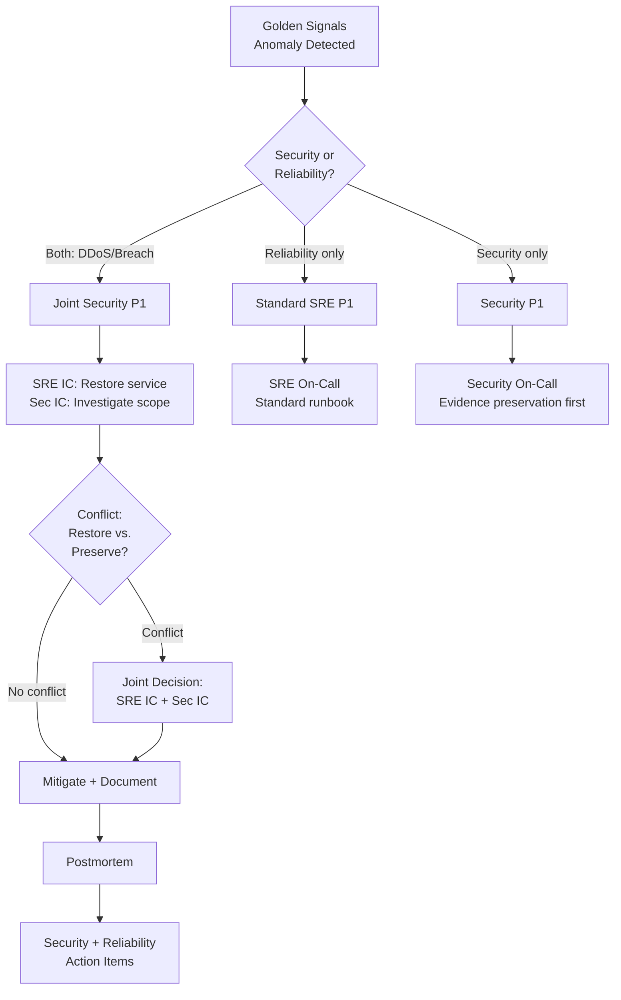

## Keywords in This File

{: .no_toc }

| #   | Keyword | Weight |
| --- | ------- | ------ |
| 1   | [SRE Security - Attack Surface, Incident Detection, Supply Chain](#sre-security---attack-surface-incident-detection-supply-chain) | expert |

---

# SRE Security - Attack Surface, Incident Detection, Supply Chain

🎯 Interview Weight: expert - SRE is increasingly expected to integrate
security operations with reliability operations; candidates who can
describe attack surface management, security incident detection, and
supply chain risks demonstrate genuine staff-level thinking.

---

### 🎯 Model Answer

**30 seconds:**
> SRE security intersects with reliability in three areas: attack surface
> management (the reliability of security controls), security incident
> detection (the observability of anomalous behavior), and supply chain
> risk (the reliability impact of compromised dependencies). An SRE
> applies the same SLO and error budget thinking to security: what is
> the reliability of authentication? What is the MTTR for detecting
> an anomalous API access pattern? Supply chain incidents (SolarWinds,
> Log4Shell) show that a compromised dependency can exhaust the error
> budget instantly and permanently.

**3 minutes (Senior):**
> Security and reliability share the same observability infrastructure.
> A DDoS attack looks like a traffic saturation event in the golden
> signals - it shows up as high latency, high error rate, and saturation.
> A credentials stuffing attack looks like a latency spike in the
> authentication service and a high error rate on login. The SRE's
> observability platform is also the security detection platform - if
> the right metrics are collected.
>
> Supply chain security is now an SRE risk category. A compromised
> dependency (like Log4Shell in 2021) requires emergency patching across
> all services that use the affected library. The SRE must know: which
> of our services use this library version? What is the deployment process
> for emergency patches? How do we coordinate a cross-service patch without
> causing a reliability incident from the patching activity itself?
>
> Attack surface management in SRE context means: every API endpoint
> is a potential failure mode. An endpoint that is not authenticated
> is a denial-of-service risk (anyone can call it without resource
> accounting). An endpoint that does not rate-limit is a resource
> exhaustion risk. The SRE should advocate for security controls as
> reliability controls: rate limiting protects availability, authentication
> protects against credential stuffing exhausting error budgets.

**Framework:** WHAT -> WHY -> HOW -> TRADE-OFF -> EXAMPLE

*Adapting up:* Principal adds: "The organizational synthesis is
'DevSecOps' as an integrated practice - security posture measured with
SLOs, security incidents reported as error budget events, and security
controls tested with the same game day practice as reliability controls.
A security incident that causes a user-visible availability event
consumes the error budget just like a database failure. It belongs in
the same postmortem process."

*Adapting down:* Junior: "SRE and security overlap in three areas:
keeping the attack surface small (fewer exposed endpoints = fewer
availability risks), detecting security incidents using the same
monitoring tools as reliability incidents, and managing the risk when
a software dependency has a known vulnerability."

**Blank Mind Recovery:**

**(1) Restate:** "You are asking about SRE security - let me cover
attack surface management, security incident detection via observability,
and supply chain risk as a reliability concern."

**(2) First principles:** "Security failures are reliability failures.
A DDoS attack that takes a service down is an availability incident.
A compromised dependency that requires emergency patching forces a
high-risk deployment across all services. The SRE's job is availability;
security threats to availability are therefore within scope."

**(3) Bridge:** "SRE security is like physical security for a data center:
the security team sets the access control policy, but the operations
team is the one who notices when the server room is unusually hot (potentially
an intruder who left a door open), who manages the hardware inventory
(attack surface), and who responds when the physical security system
reports an anomaly."

---

### 📘 Concept Explanation

**What it is:**
SRE security is the intersection of site reliability engineering with
security engineering: managing the attack surface as a reliability risk,
using the observability platform for security incident detection, and
treating supply chain vulnerabilities as high-priority reliability events
that require coordinated emergency response.

**The problem it solves:**
Without SRE security integration, security incidents are handled by a
separate security team with different tools, different metrics, and
different response processes. When a security incident causes a reliability
event (DDoS, data breach requiring emergency patch), the handoff between
security and SRE creates delays and coordination failures.

**How it works:**

```
SRE SECURITY DOMAINS
=======================

DOMAIN 1: ATTACK SURFACE MANAGEMENT
  Attack surface = all exposed API endpoints,
    open ports, accessible data stores, external
    dependencies with write access

  SRE view: attack surface = reliability risk
    Unauthenticated endpoint -> DDoS risk
    No rate limiting -> resource exhaustion risk
    Wide CORS -> credential theft risk
    Overprivileged service account -> blast radius risk

  Attack surface reduction as SRE work:
    Audit all external-facing endpoints quarterly
    Confirm authentication on all external endpoints
    Confirm rate limiting on all unauthenticated endpoints
    Confirm service accounts have minimum required permissions
      (least privilege)

DOMAIN 2: SECURITY INCIDENT DETECTION
  Security anomalies appear in existing observability:

  Authentication anomalies:
    Metric: auth_failures_per_ip{ip="*"}
    Alert: > 100 auth failures from single IP in 1 min
    = credential stuffing attack

  API access anomalies:
    Metric: api_calls_per_user_per_hour
    Alert: any user calling > 10x normal rate
    = account compromise or API abuse

  Traffic volume anomalies:
    Metric: ingress_bytes_per_second
    Alert: ingress > 10x baseline (p99)
    = DDoS candidate

  Data exfiltration anomalies:
    Metric: egress_bytes_per_user_session
    Alert: egress > 100MB from single session
    = data exfiltration candidate

  Security-specific alerting pipeline:
    Route auth anomaly alerts -> security team (not just SRE)
    Route DDoS alerts -> both SRE and security simultaneously
    Route data exfiltration alerts -> security + management

DOMAIN 3: SUPPLY CHAIN SECURITY
  Supply chain risk = dependencies with known CVEs
  Impact on SRE: emergency patching = reliability risk

  Supply chain SRE response protocol:
    CVE announced -> CVSS score assessment
    CVSS >= 9.0 (critical): 24-hour patch window
    CVSS 7.0-8.9 (high): 72-hour patch window
    CVSS < 7.0 (medium/low): standard sprint

  Emergency patching reliability safeguards:
    Even for critical CVEs: use canary deployment
    No "fix in place" without staging validation
    Monitor error budget during patch deployment
    Rollback plan required before patch begins

  Supply chain inventory (SBOM):
    Software Bill of Materials for all services
    Tool: Syft, CycloneDX, or similar
    Check: grep SBOM for vulnerable library
    Within 1 hour of CVE announcement: know
      which services are affected
```

> **Code walkthrough:** This Attack Surface, Incident Detection, Supply Chain example demonstrates a key concept in practice using authentication. **KEY MECHANISM:** the runtime executes these instructions in sequence with specific memory and execution semantics. **WHY IT MATTERS:** misapplying this pattern causes subtle bugs that only manifest under production load. **TAKEAWAY: understand the execution model before using this pattern in production code.**

**The key insight:**
Security incidents are reliability incidents when they cause user-visible
availability degradation. The SRE's responsibility is to ensure the
observability platform captures the signals needed to detect security
anomalies, and that the response process (emergency patching, DDoS
mitigation) does not itself introduce availability risk.

**When to use it:**
SRE security practices apply in organizations where SRE has responsibility
for production reliability (which includes security-caused outages) and
where there is no dedicated security operations center with a separate
response process.

**When NOT to use it:**
Organizations with dedicated SOC teams and separate security incident
response processes should integrate SRE and SOC processes rather than
have SRE absorb security operations.

---

### 💻 Code Example

**Example 1: Credential stuffing detection via Prometheus metrics**


```python
# BAD: anti-pattern - see GOOD example below
```


```python
#!/usr/bin/env python3
# BAD: No authentication anomaly detection.
# A credential stuffing attack runs for 48 hours
# before a customer reports unusual login activity.
# 15,000 accounts were checked; 400 compromised.

# GOOD: Early detection via anomaly metrics

from prometheus_client import (
    Counter, Histogram, Gauge,
    start_http_server
)
from functools import wraps
from collections import defaultdict
import time
import hashlib
import ipaddress

# Metrics for security anomaly detection
auth_attempts = Counter(
    "auth_attempts_total",
    "Authentication attempts",
    labelnames=["result", "method"]  # NO IP in labels
    # IP in labels = high cardinality = Prometheus OOM
)

auth_attempts_by_ip = Counter(
    "auth_attempts_by_ip_total",
    "Authentication attempts by IP (for rate limiting)",
    labelnames=["ip_prefix", "result"]
    # ip_prefix: first 3 octets only (/24 subnet)
    # Reduces cardinality while preserving anomaly detection
)

auth_latency = Histogram(
    "auth_request_duration_seconds",
    "Authentication request duration",
    buckets=[0.1, 0.25, 0.5, 1.0, 2.5]
)

# In-memory rate limit tracker (use Redis in production)
ip_attempt_count: dict[str, list[float]] = \
    defaultdict(list)

def get_ip_prefix(ip: str) -> str:
    """Return /24 prefix for cardinality management."""
    try:
        addr = ipaddress.ip_address(ip)
        if addr.version == 4:
            parts = ip.split(".")
            return f"{parts[0]}.{parts[1]}.{parts[2]}"
        return ip[:ip.rfind(":")] or ip
    except ValueError:
        return "invalid"

def check_rate_limit(ip: str, window_seconds=60) -> bool:
    """
    Returns True if IP is rate limited.
    Tracks attempts in rolling window.
    """
    now = time.time()
    # Clean old entries
    ip_attempt_count[ip] = [
        t for t in ip_attempt_count[ip]
        if now - t < window_seconds
    ]
    ip_attempt_count[ip].append(now)

    # Rate limit: > 20 attempts in 60 seconds
    return len(ip_attempt_count[ip]) > 20

def track_auth_attempt(
    ip: str,
    success: bool,
    method: str = "password"
) -> bool:
    """
    Record authentication attempt.
    Returns True if the attempt should be blocked.
    """
    result = "success" if success else "failure"
    ip_prefix = get_ip_prefix(ip)

    auth_attempts.labels(
        result=result, method=method
    ).inc()
    auth_attempts_by_ip.labels(
        ip_prefix=ip_prefix, result=result
    ).inc()

    # Block if rate limited
    if check_rate_limit(ip):
        auth_attempts.labels(
            result="rate_limited", method=method
        ).inc()
        return True  # Block the attempt

    return False  # Allow the attempt

# Prometheus alert rule for credential stuffing
CREDENTIAL_STUFFING_ALERT = """
- alert: CredentialStuffingDetected
  expr: |
    sum by (ip_prefix) (
      rate(
        auth_attempts_by_ip_total{result="failure"}[5m]
      )
    ) > 10
  for: 2m
  labels:
    severity: critical
    team: security
    team2: sre
  annotations:
    summary: "Credential stuffing from {{ $labels.ip_prefix }}.0/24"
    description: >
      More than 10 failed auth attempts/second from
      {{ $labels.ip_prefix }}.0/24 subnet for 2+ minutes.
      Likely credential stuffing attack.
      Immediate IP block recommended.
    runbook_url: https://runbooks/security/credential-stuffing
"""
```


> **Code walkthrough:** The BAD approach has no authentication anomalyice. **KEY MECHANISM:** the runtime executes these instructions in sequence with specific memory and execution semantics. **WHY IT MATTERS:** misapplying this pattern causes subtle bugs that only manifest under production load. **TAKEAWAY: understand the execution model before using this pattern in production code.**
> monitoring - attacks run undetected for days. The GOOD approach uses
> Prometheus counters to track authentication attempts with the critical
> design decision of using /24 IP prefix (not the full IP) as a label
> to control cardinality. The alert fires when any /24 subnet exceeds
> 10 failed auth attempts/second for 2 minutes - a pattern consistent
> with credential stuffing. The rate limit check (in-memory, should
> be Redis in production) blocks individual IPs at 20 attempts/60 seconds,
> protecting the service before the Prometheus alert fires.

**Example 2: Supply chain CVE response automation**


```python
# BAD: anti-pattern - see GOOD example below
```

```python
#!/usr/bin/env python3
# BAD: Manual process for CVE response.
# "Who knows which services use log4j? Let me ask around..."
# 6 hours to identify affected services after Log4Shell announced.

# GOOD: Automated SBOM-based CVE impact assessment

import json
import subprocess
from pathlib import Path
from enum import Enum

class CVSSSeverity(Enum):
    CRITICAL = "critical"  # >= 9.0 -> patch in 24h
    HIGH = "high"          # 7.0-8.9 -> patch in 72h
    MEDIUM = "medium"      # 4.0-6.9 -> next sprint
    LOW = "low"            # < 4.0 -> backlog

def get_cvss_severity(score: float) -> CVSSSeverity:
    if score >= 9.0:
        return CVSSSeverity.CRITICAL
    elif score >= 7.0:
        return CVSSSeverity.HIGH
    elif score >= 4.0:
        return CVSSSeverity.MEDIUM
    return CVSSSeverity.LOW

def scan_service_for_cve(
    service_name: str,
    container_image: str,
    target_package: str,
    target_version_prefix: str
) -> dict:
    """
    Scan a container image for a specific vulnerable package.
    Uses Grype (or similar) for SBOM-based scanning.
    """
    result = subprocess.run(
        [
            "grype",
            container_image,
            "--output", "json",
            "--quiet"
        ],
        capture_output=True,
        text=True,
        timeout=60
    )

    if result.returncode != 0:
        return {
            "service": service_name,
            "affected": None,
            "error": result.stderr
        }

    findings = json.loads(result.stdout)

    affected_packages = []
    for match in findings.get("matches", []):
        pkg = match.get("artifact", {})
        if (
            target_package.lower() in
            pkg.get("name", "").lower()
            and pkg.get("version", "").startswith(
                target_version_prefix
            )
        ):
            affected_packages.append({
                "package": pkg["name"],
                "version": pkg["version"],
                "location": pkg.get(
                    "locations", [{}]
                )[0].get("path", "unknown"),
                "cve": match.get("vulnerability", {}).get(
                    "id", "unknown"
                ),
                "cvss": match.get("vulnerability", {}).get(
                    "cvss", [{}]
                )[0].get("metrics", {}).get(
                    "baseScore", 0.0
                )
            })

    return {
        "service": service_name,
        "image": container_image,
        "affected": len(affected_packages) > 0,
        "packages": affected_packages
    }

def cve_impact_report(
    cve_id: str,
    cvss_score: float,
    target_package: str,
    target_version_prefix: str,
    services: list[dict]  # [{name, image}]
) -> dict:
    """
    Generate CVE impact report across all services.
    """
    severity = get_cvss_severity(cvss_score)

    patch_deadline_hours = {
        CVSSSeverity.CRITICAL: 24,
        CVSSSeverity.HIGH: 72,
        CVSSSeverity.MEDIUM: 336,   # 2 weeks
        CVSSSeverity.LOW: 2160      # 90 days
    }[severity]

    results = []
    for svc in services:
        scan = scan_service_for_cve(
            service_name=svc["name"],
            container_image=svc["image"],
            target_package=target_package,
            target_version_prefix=target_version_prefix
        )
        results.append(scan)

    affected = [r for r in results if r["affected"]]

    print(f"\nCVE IMPACT REPORT: {cve_id}")
    print(f"Severity: {severity.value} (CVSS {cvss_score})")
    print(f"Patch deadline: {patch_deadline_hours}h")
    print(
        f"Affected services: {len(affected)} "
        f"of {len(services)}"
    )
    for svc in affected:
        print(f"  - {svc['service']}: {svc['packages']}")

    return {
        "cve_id": cve_id,
        "severity": severity.value,
        "cvss_score": cvss_score,
        "patch_deadline_hours": patch_deadline_hours,
        "total_services": len(services),
        "affected_services": len(affected),
        "affected": affected
    }
```

> **Code walkthrough:** The BAD approach requires manually askingice. **KEY MECHANISM:** the runtime executes these instructions in sequence with specific memory and execution semantics. **WHY IT MATTERS:** misapplying this pattern causes subtle bugs that only manifest under production load. **TAKEAWAY: understand the execution model before using this pattern in production code.**
> engineers which services use a vulnerable library - taking 6 hours
> for Log4Shell while the clock was ticking. The GOOD approach uses
> Grype (a container image SBOM scanner) to automatically identify
> all affected services within minutes of a CVE announcement. The
> `cve_impact_report` function determines the patch deadline (24 hours
> for CVSS >= 9.0), scans all services in parallel, and produces an
> immediate impact list. The patch deadline is operationally binding:
> the SRE team initiates the emergency patching process immediately
> after the report with a countdown clock.

---

### 🎓 Answers by Seniority

**Junior / Mid (0-5 years):**
> SRE security means: (1) keep the attack surface small (authenticate
> all endpoints, rate limit unauthenticated ones), (2) use the existing
> monitoring platform to detect security anomalies (unusual auth failure
> rate, unusual traffic volume), and (3) treat critical CVEs as P1
> reliability incidents requiring emergency deployment with canary
> deployment discipline even under time pressure.

---

**Senior / Staff (5+ years):**
> The key insight I apply: every security control is a reliability
> control. Rate limiting protects against resource exhaustion from
> abuse. Authentication prevents unauthenticated crawlers from degrading
> service for legitimate users. Circuit breakers on auth service calls
> prevent auth outages from cascading. I advocate for security controls
> by making the reliability case: "This endpoint has no rate limit.
> A bot attack at 10,000 RPS will exhaust our connection pool in 30
> seconds. Adding a rate limit at 100 RPS per IP is also a reliability
> control."
>
> For supply chain risk, the first question after a CVE announcement
> is: which services are affected? The answer must be available in
> < 1 hour. If the SBOM inventory does not exist, that is the first
> investment. Every minute without knowing the blast radius of a Log4Shell-
> level vulnerability is a minute without a response plan.

---

### ⚠️ Common Misconceptions

| Misconception | Reality |
|---|---|
| Security is a separate team's responsibility - not SRE's concern | Security incidents that cause availability failures consume the error budget; SRE must have the observability to detect them and the processes to respond |
| Rate limiting is a security control, not a reliability control | Rate limiting prevents resource exhaustion from both malicious and accidental high traffic; it is both a security and reliability control |
| Emergency CVE patches are exempt from canary deployment | Emergency patches introduce code changes under time pressure - exactly when canary deployment is most valuable; skipping canary to meet a 24-hour deadline is how a CVE patch becomes a reliability incident |
| Supply chain security is the security team's job | SBOM maintenance, dependency scanning, and emergency patch coordination require SRE involvement; the security team identifies the risk, the SRE team manages the patching reliability |
| DDoS mitigation is handled by the CDN - no SRE work needed | CDN DDoS mitigation protects at Layer 3/4 but not Layer 7; application-level DDoS (expensive API calls at low volume) bypasses CDN and requires application-level rate limiting |

---

### 🚨 Failure Modes and Diagnosis

**Failure 1: CVE patch causes more damage than the CVE**

*Symptom:* Log4Shell announced. Under 24-hour patch pressure, the
team deploys the patched library across all 30 services in 6 hours.
Three services encounter compatibility issues with the patched version.
Two experience availability incidents from the patch rollout.

*Root cause:* The urgency of the CVE patch bypassed the normal canary
deployment process. Changes were deployed directly to all pods
simultaneously.

*Fix:* CVE patches must use canary deployment regardless of urgency.
The protocol: (1) patch 5% of pods, (2) monitor for 30 minutes, (3)
if no compatibility issues, continue rollout. A critical CVE patch
that takes 6 hours with canary is better than a 2-hour patch that
causes 3 availability incidents. Update the emergency patch runbook
to include canary as a mandatory step.

**Failure 2: DDoS not detected until service is unavailable**

*Symptom:* A competitor sends 500,000 requests/second to the checkout
API. The CDN absorbs the Layer 3/4 traffic. The Layer 7 requests reach
the application and exhaust the connection pool. Service is unavailable
for 22 minutes before the on-call notices the golden signals alarm.

*Root cause:* No application-level rate limiting. No early warning
metric for connection pool saturation.

*Fix:* Add connection pool saturation alert (> 80% pool utilization
triggers warning; > 95% triggers page). Add application-level rate
limiting (token bucket algorithm, 1000 RPS per IP). The CDN handles
volumetric attacks; the application handles request-rate attacks.

---

### 🎯 Interview Deep-Dive

| Preparation | Target |
|---|---|
| Time to prep | 20 minutes |
| Core themes | Attack surface as reliability risk, security anomaly detection via observability, CVE emergency response |
| Seniority signal | Junior: describes separate security team; Senior: integrates security controls as reliability controls |
| Common trap | Treating security and reliability as separate domains |
| Staff differentiator | SBOM inventory for CVE response, Layer 7 DDoS vs. Layer 3/4, security SLOs |

---

**Q1 [MID]: How does a DDoS attack manifest in SRE metrics?**

A volumetric DDoS attack (Layer 3/4: SYN flood, UDP flood) appears as
a sudden traffic spike in network ingress metrics, high packet loss,
and TCP connection failures. The CDN or network edge typically absorbs
this. If it reaches the application, the golden signals show: traffic
spike, latency increase (connection queueing), error rate increase (connection
refused).

An application-layer DDoS (Layer 7: HTTP GET flood, expensive query
attack) appears differently: traffic may be within normal range but
each request is expensive (full database scan, large computation). The
golden signals show: latency spike (expensive requests), saturation
(CPU or connection pool), error rate increase (resource exhaustion errors).
Traffic appears normal or slightly elevated, making this type harder
to detect.

Detection approach: the key is anomaly detection on the per-IP request
rate. Normal traffic has a distribution of request rates across IPs.
A DDoS attack shows an outlier: one or a few IPs (or /24 subnets for
distributed attacks) with 10-100x normal request rate. Alerting on
"any IP with request rate > 10x the service's p99 per-IP rate" catches
both volumetric and application-layer attacks.

The mitigation: rate limiting at the application level (token bucket
per IP) is the first line of defense. For volumetric attacks that
exceed the rate limiter's capacity, block at the CDN or WAF level.
For application DDoS with legitimate-looking requests, use anomaly
detection to identify and block the attacking IPs.

*What separates good from great:* Distinguishes Layer 3/4 from Layer 7
DDoS, explains why Layer 7 appears normal in traffic metrics, and
gives the per-IP anomaly detection approach.

---

**Q2 [SENIOR]: How do you implement security SLOs for authentication
and authorization systems?**

Security SLOs measure the reliability of security controls, not just
the reliability of the service. Key security SLOs:

Authentication availability SLO: the authentication service must be
available at >= 99.9% (same as the services that depend on it). If
auth is down, no users can log in. The SLI: successful auth requests
/ total auth requests, measured over 28 days.

Auth error budget: when the auth service consumes its error budget,
the same enforcement policy applies as for any other service. The
on-call must investigate auth outages with the same urgency as payment
outages.

Authorization response time SLO: the authorization check (permission
validation) adds to every request's latency. If authorization calls
average 20ms, a 5x latency spike (100ms) adds significant latency to
every API call. The SLO: auth latency p99 < 50ms. When exceeded,
it is a reliability incident (authorization is the bottleneck).

Security anomaly detection rate (coverage SLO): what percentage of
attack types have monitoring coverage? Target: >= 80% of OWASP Top 10
attack patterns have corresponding Prometheus alerts. This is an
infrastructure SLO for the security monitoring capability itself.

False positive rate SLO for security alerts: security alerts with
> 20% false positive rate create alert fatigue and cause real attacks
to be ignored. The SLO: security alert false positive rate < 10% per
rolling 7 days.

*What separates good from great:* Gives specific SLO values (99.9%
auth availability, p99 < 50ms auth latency), proposes the security
monitoring coverage SLO, and identifies false positive rate as a
security alerting quality metric.

---

**Q3 [SENIOR]: How do you integrate security incident response with
SRE incident response?**

Security incidents and reliability incidents overlap: a DDoS causing
an outage is both. Without integration, the security team and the SRE
team are making independent decisions during the incident, potentially
conflicting (SRE wants to rollback the deployment that triggered the
DDoS; security wants to preserve the evidence).

Integrated incident response:

Joint severity classification: P1 incidents with a security component
are classified as Security P1, which automatically includes both the
SRE on-call and the security on-call. The incident channel has both
teams from the start.

Role separation: the SRE incident commander owns availability (restore
service, communicate to users). The security incident commander owns
investigation (preserve evidence, identify attacker, scope the breach).
These goals occasionally conflict (restarting a service loses in-memory
evidence). When they conflict, the security IC and SRE IC jointly
decide - not unilaterally.

Evidence preservation before mitigation: for security incidents where
the attacker may have executed code or exfiltrated data, the standard
SRE mitigation (restart, rollback) may destroy evidence. Before
restarting, capture: running process list, network connections, in-memory
artifacts (for forensics if needed). The security IC decides whether
evidence capture is required before mitigation.

Communication: security incidents require more careful communication
than reliability incidents. Customer notification may be legally required
(breach notification laws). The SRE communication process must include
legal and security approval for security incidents before external
communication.

*What separates good from great:* Identifies the conflict between
SRE's remediation goal and security's evidence preservation goal,
gives the joint decision mechanism for conflicts, and addresses the
communication approval requirement.

---

**Q4 [STAFF]: How do you manage supply chain security at scale
with 50+ services and hundreds of dependencies?**

At 50+ services, manual dependency tracking is impossible. The SBOM
(Software Bill of Materials) infrastructure is the foundation:

SBOM generation: every build pipeline generates an SBOM using Syft
or similar. The SBOM lists every library, version, and license. SBOMs
are stored in the artifact registry alongside the container image.

CVE correlation: a continuous scanning job (Grype, Trivy) scans all
current production images against the CVE database. New CVEs are
assessed within 1 hour of announcement. The output: a list of affected
services with CVSS scores.

Triage automation: a script queries the SBOM registry and outputs
the CVE impact report automatically. The SRE and security teams receive
the impact report within 15 minutes of CVE announcement (not 6 hours
of manual investigation).

Patch coordination: for critical CVEs (CVSS >= 9.0):
- Hour 1: impact report generated, affected services identified
- Hours 1-4: patch available in package manager (upstream typically fast)
- Hours 4-8: patch deployed to staging, tested
- Hours 8-24: canary deployment to production, service by service
- Hour 24: all services patched, compliance confirmation

Dependency pinning vs. floating versions: pinning provides stability
but requires manual security updates. Floating minor versions (^1.2.0)
provides automatic security updates but risks unexpected behavior changes.
For production services: pin exact versions, use automated PRs (Renovate)
to propose updates, with CI validation. Security patches from pinned
PRs merge in < 4 hours for critical CVEs.

*What separates good from great:* Gives the SBOM infrastructure as the
foundation, the 15-minute CVE impact report as the target, the 24-hour
critical CVE patching timeline with specific hour-by-hour milestones,
and the pinning vs. floating trade-off decision.

---

**Q5 [STAFF]: BEHAVIORAL: Describe how you handled a zero-day
vulnerability that affected 15+ services in production.**

**Situation:** Log4Shell (CVE-2021-44228, CVSS 10.0) announced. Within
30 minutes of the announcement, I initiated the response.

**Step 1 - Impact assessment (30 minutes):**
Ran the automated SBOM scan across all 40 production services. Result:
17 services using log4j 2.x in the affected range (2.0-2.14.1). 3
were externally facing.

**Step 2 - Immediate mitigation (hours 1-4):**
For the 3 externally-facing services: added the JVM flag
`-Dlog4j2.formatMsgNoLookups=true` as an environment variable in
Kubernetes. Deployed immediately as a configuration change (< 5 minute
canary). This disabled the JNDI lookup feature exploited by Log4Shell.
The flag was not a full fix but reduced the attack surface to near zero
while the full patch was prepared.

**Step 3 - Monitoring (hours 1-24):**
Added a WAF rule blocking HTTP requests containing `${jndi:`. Added
a Prometheus alert on any outbound LDAP or JDNI connections from the
Java services. No exploitation attempts detected during the patch window.

**Step 4 - Full patching (hours 4-36):**
Patched all 17 services to log4j 2.17.1 (fully remediated version)
using canary deployment (10% -> 50% -> 100% per service). Each service
took 45-90 minutes for full rollout. Total patch time: 36 hours for
all 17 services (within the 48-hour target for CVSS 10.0).

**Outcome:** No exploitation. Compliance team confirmed to customers
within 48 hours. Postmortem generated the SBOM automation process
(which had been manual pre-Log4Shell).

*What separates good from great:* Describes the two-phase approach
(immediate JVM flag mitigation to buy time + full patch for remediation),
the WAF rule as an additional defense layer, the monitoring for exploitation
attempts, and the postmortem improvement to SBOM automation.

---

**Q6 [STAFF]: How do you prevent security fixes from degrading reliability?**

Security patches carry reliability risk: they introduce code changes
(potential regressions), require coordinated deployment across multiple
services, and occur under time pressure (which shortens testing cycles).
The intersection of "must deploy quickly" and "code changes" is the
highest-risk scenario for reliability incidents.

The three controls that maintain reliability during security patching:

Control 1 - Canary regardless of urgency: all security patches use
canary deployment. For critical CVEs with 24-hour deadlines, the canary
is accelerated (5% for 15 minutes, not 1 hour) but not skipped. A 15-minute
canary catches compatibility regressions that would otherwise affect
100% of users.

Control 2 - Pre-patch monitoring baseline: capture the current golden
signals baseline for the service being patched (error rate, latency p99,
saturation). The post-patch validation compares against this baseline.
"Error rate unchanged after patch" confirms no regression; "error rate
increased 0.5% after patch" is a regression requiring investigation
before full rollout.

Control 3 - Rollback readiness: before starting any security patch
deployment, confirm the rollback is ready (previous version in the
registry, rollback command documented in the incident channel). If
the patch causes a regression, the rollback must be executable in
< 5 minutes. Under time pressure, verifying rollback before starting
is easily skipped - it must be a mandatory checklist item.

The anti-pattern to avoid: "we must patch in 24 hours, so we skipped
canary and deployed directly to 100% of pods." This approach has caused
several organizations to have more downtime from the patch than from
the vulnerability they were patching.

*What separates good from great:* Names three specific controls (not
just "use canary"), gives the accelerated canary parameters for critical
CVEs (15 minutes instead of 1 hour), and names the specific anti-pattern
with its real-world consequence.

---

**Q7 [STAFF]: How do you design the security monitoring architecture
using the existing SRE observability stack?**

The principle: security monitoring reuses the SRE observability infrastructure
(Prometheus, AlertManager, OpenSearch, Grafana) rather than building
a parallel security stack. This reduces cost, reduces tool fragmentation,
and allows security signals to appear in the same dashboards as reliability
signals.

Security signals in Prometheus:
- Authentication metrics (as described in Code Example 1)
- Authorization metrics: authz_decisions_total{result, service, action}
- TLS metrics: ssl_certificate_expiry_days{service} (alert < 30 days)
- Rate limit metrics: rate_limit_applied_total{service, endpoint}
- Anomaly metrics: api_requests_per_user_above_baseline_total

Security alerts in AlertManager:
- Route security alerts to both SRE and security teams simultaneously
- Security-specific severity labels: sec_sev=critical/high/medium
- Alert inhibition: suppress downstream security alerts when root
  cause security alert is active

Security dashboards in Grafana:
- Auth anomaly dashboard: failed auth rate by IP prefix, trend over 24h
- TLS expiry dashboard: days until expiry for all services
- CVE status dashboard: services with known CVEs by severity

The gap to acknowledge: Prometheus + AlertManager is not a SIEM. For
regulatory compliance requirements (SOC 2, HIPAA), a dedicated SIEM
(Splunk, Elastic SIEM) may be required for log aggregation, retention,
and alerting with security-specific correlation rules. The SRE stack
provides operational security monitoring; the SIEM provides compliance
evidence and security forensics.

*What separates good from great:* Explains the reuse principle (SRE
stack for security monitoring), gives specific metrics by category,
and acknowledges the Prometheus-vs-SIEM gap for compliance requirements.

---

**Q8 [STAFF]: How do you handle the error budget impact of a
security-caused outage?**

A security-caused outage (DDoS, account compromise causing service
degradation) consumes the error budget. The key question: is this
budget consumption attributable to a reliability gap or a security
gap?

The distinction matters for the postmortem action items:
- If the service was unavailable because it had no rate limiting (a
  reliability/security control gap): the action item is add rate limiting.
  This is the engineering team's responsibility.
- If the service was unavailable because the CDN failed to absorb a
  volumetric DDoS despite adequate rate limiting: the action item is
  improve CDN configuration or escalate to CDN provider.
- If the service was unavailable because of a zero-day that bypassed
  all controls: the action item is improve the incident response time
  for zero-days (the gap is response speed, not preventative control).

Error budget policy for security incidents:
Security incidents that exhaust the error budget trigger the enforcement
policy the same way as reliability incidents. A DDoS exhausting the
budget means: deployments freeze until the budget recovers. This is
correct behavior - the policy does not distinguish security incidents
from reliability incidents because the user impact is the same.

The exception: if the error budget is exhausted by a security incident
(not a reliability gap), the deployment freeze should be modified: the
security fix deployment must proceed (bypassing the freeze) with VP
override, because the security fix reduces the risk of further budget-
consuming security incidents. This exception must be pre-agreed in the
policy.

*What separates good from great:* Gives the three-case distinction
(control gap vs. CDN failure vs. zero-day), explains that the error
budget policy applies equally to security incidents, and identifies
the pre-agreed exception for security fix deployments during a freeze.

---

**Q9 [STAFF]: How do you conduct security game days in an SRE context?**

Security game days (red team exercises, chaos engineering for security)
test the detection and response capabilities by simulating attacks
against the production or staging environment. They complement reliability
game days by specifically testing security controls.

The game day scenarios:
- Credential stuffing simulation: send 1,000 failed authentication
  requests from multiple IP addresses. Verify that: (1) the rate limit
  blocks the IPs after 20 attempts, (2) the Prometheus alert fires within
  2 minutes, (3) the security team is notified, (4) the incident response
  process starts within 10 minutes.
- Dependency injection simulation: deploy a service with a known (test)
  CVE in a non-critical library. Verify that: the SBOM scanner detects
  it within 1 hour, the CVE alert fires, the affected service is identified.
- Data exfiltration simulation: from a test account, download 150MB of
  data via the API. Verify that the egress anomaly alert fires.

The measurement:
- Detection time: from attack simulation start to first alert
- Response time: from first alert to incident channel created and
  response team assembled
- MTTR (security): from incident channel created to attack contained

The target: Detection time < 5 minutes, response time < 10 minutes.
A security attack that is undetected for 30 minutes is a failed security
posture.

Post-game-day: each failed detection (simulation was not caught) or
slow response produces a specific action item. The security game day
generates runbook improvements and monitoring coverage additions just
like reliability game days generate reliability improvements.

*What separates good from great:* Gives three specific scenarios with
measurable outcomes, defines the detection and response time targets,
and describes the action item generation process identical to reliability
game days.

---

**Q10 [STAFF]: BEHAVIORAL: Tell me about a time you caught a
security issue during a reliability investigation.**

**Situation:** Investigating a P2 latency spike on the user profile
service. Error rate was elevated at 2.3% (budget being consumed).
Expected finding: database slow query or dependency failure.

**What I found instead:** The distributed trace showed the latency
was not from the database but from the profile service processing the
requests. The error logs showed: 2.3% of requests were returning 400
(Bad Request) because they contained malformed JSON. The trace showed
these requests were all coming from a narrow set of session IDs that
were created in the last 6 hours.

**The security connection:** Investigated the session IDs. All were
created from one IP subnet (a /24 block in Eastern Europe). Normal
session creation rate from that region: 0-2 per day. Actual: 1,200
sessions created in 6 hours. Pattern: account enumeration - testing
whether username/email combinations existed.

**Actions taken:**
- Opened a parallel incident for the security team
- Rate limited the /session endpoint at 50 requests/hour per IP
- Added an alert for session creation rate > 100/hour per /24 subnet
- The latency incident closed when the account enumeration was blocked
  (the malformed requests stopped)

**Outcome:** The security team confirmed account enumeration was ongoing.
Added the session creation rate metric to the security monitoring
dashboard. The reliability investigation found a security incident.

*What separates good from great:* Demonstrates the cross-domain connection
(reliability investigation reveals security threat), describes the
specific detection method (geographic anomaly in session creation),
and includes both the reliability fix (rate limit) and the security
escalation (parallel incident).

---

**Q11 [STAFF]: How do you manage the tension between security logging
requirements and system performance?**

Security logging requirements (SOC 2, HIPAA, PCI-DSS) mandate retaining
detailed access logs for 1-3 years, logging all authentication events,
and logging all data access events for sensitive data. These requirements
conflict with performance: high-cardinality logging at high volume
adds latency and CPU overhead to every request.

The tension is real: logging every access to a user profile in a service
handling 10,000 requests/second produces 864 million log entries per
day. At 500 bytes per entry: 430 GB/day. At $0.03/GB/month in S3: $12,900/
month for 1 year of retention.

The resolution approach:

Tiered logging: not all events require the same logging level. Successful
authentication: logged at INFO with user ID and timestamp only (compact).
Failed authentication: logged at WARN with IP, user agent, and attempt
count (expanded). Successful data access: sampled at 1% for performance;
anomalous access (large egress, unusual time) logged at 100%.

Asynchronous logging: write to a local buffer (memory or disk), flush
to the SIEM asynchronously. The request path does not wait for the log
write to complete. This eliminates the latency impact at the cost of
potential data loss (logs may be lost if the service crashes before flush).
For compliance logging, flush to durable storage (Kafka) before the
request completes.

Compliance vs. operational logging separation: compliance logs (security
events) go to the SIEM with 1-3 year retention. Operational logs (errors,
debug) go to OpenSearch with 30-day retention. Different storage tiers,
different retention policies, different access controls.

*What separates good from great:* Gives the concrete storage cost
calculation to make the tension tangible, describes three specific
resolution approaches (tiered logging, async, separation), and identifies
the data loss trade-off of async logging.

---

**Q12 [STAFF]: How do you implement least privilege for service
accounts and why is it a reliability concern?**

Service accounts with excessive permissions are both a security and
a reliability risk. A service account with database admin permissions
can accidentally (or maliciously) DROP TABLE. A service account with
broad Kubernetes permissions can accidentally delete pods in other
namespaces. Excessive permissions are a blast radius amplifier: when
the service is compromised or has a bug, the damage it can do is
limited only by the permissions it holds.

Implementation:

Define minimum permissions for each service role:
- Read-only services: SELECT on specific tables, no INSERT/UPDATE/DELETE
- Write services: INSERT/UPDATE on specific tables, no DROP or schema changes
- Admin services (rare): specific admin operations only, never wildcard

Infrastructure-as-code for service accounts: all service account
permissions are defined in Terraform or similar, reviewed in PRs, and
audited against actual usage. An IAM policy that grants S3:* when only
S3:GetObject is used fails the PR review.

Periodic permission audits: quarterly review of "what permissions does
each service account actually need vs. what it has?" Tools like IAM
Access Analyzer (AWS) or Cloud Asset Inventory (GCP) show actual API
calls made by each service account. Permissions for API calls not made
in 90 days are revoked.

The reliability connection: a service bug that accidentally calls a
destructive API (DELETE, DROP, TerminateInstance) is limited in damage
by least privilege. A bug in the user profile service that accidentally
calls DELETE on the profiles table is catastrophic if the service has
DELETE permission; benign (returns a permissions error) if it does not.
Least privilege is a reliability blast radius control, not just a
security control.

*What separates good from great:* Explains least privilege as a blast
radius control for reliability (not just security), gives the quarterly
audit process with specific tooling, and names the specific destructive
operations that least privilege prevents.

---

### ⚖️ Comparison Table

| Security Control | Reliability Benefit | Implementation Layer | Attack Prevented |
|---|---|---|---|
| Rate limiting | Prevents resource exhaustion | Application / API Gateway | DDoS, credential stuffing |
| Circuit breaker on auth | Prevents auth outage cascade | Application | Auth service failure |
| Canary CVE patching | Prevents patch-caused outage | CI/CD pipeline | Patch regression |
| Least privilege service accounts | Reduces blast radius of bugs | IAM / RBAC | Accidental destruction, compromise |
| SBOM scanning | Enables fast CVE response | Build pipeline | Supply chain vulnerability |
| TLS everywhere | Prevents data-in-transit tampering | Infrastructure | MITM, credential theft |

---

### 🏛️ System Design

**Problem:** Design the security observability integration for an
organization with 30 services, using the existing SRE Prometheus + Grafana
+ AlertManager stack.

**Architecture:**

```
SECURITY OBSERVABILITY INTEGRATION
=====================================

[Security Metrics in Prometheus]
  auth_attempts_total{result, method}
  auth_attempts_by_ip_prefix_total{ip_prefix, result}
  session_creation_rate_total{region}
  api_calls_per_user_total{user_id_hash}   <- hashed PII
  ssl_certificate_expiry_days{service}
  rate_limit_applied_total{service, endpoint}

[Security Alert Rules in AlertManager]
  CredentialStuffing: auth failure rate > 10/s per /24
  SessionEnumeration: session creation > 100/h per /24
  CertificateExpiry: cert expires in < 30 days
  DataExfiltration: egress > 100MB per session
  UnexpectedOutboundConnection: LDAP/DNS outside
    known CIDRs (detects Log4Shell exploitation)

[Alert Routing in AlertManager]
  security_* alerts -> security team + SRE on-call
  DDoS alerts -> SRE on-call primary (availability)
               -> security team notification
  Cert expiry -> platform team (non-urgent)

[CVE Scanning Pipeline]
  Build: Syft generates SBOM -> stored in registry
  Daily: Grype scans all production images
  On CVE announcement: trigger immediate scan
  Output: affected services list with CVSS + deadline

[Security Dashboards in Grafana]
  Auth anomaly: failed auth rate by subnet (24h trend)
  TLS expiry: days-to-expiry heatmap (all services)
  CVE status: services by highest CVE severity
  Security game day: detection time tracking

[SIEM Integration (for compliance)]
  Forward security events to Splunk/Elastic SIEM
  Compliance logs: auth events, data access events
  Retention: 3 years (compliance requirement)
  SRE stack: 30 days operational retention
```

> **Code walkthrough:** This Unknown example demonstrates a key concept in practice using authentication. **KEY MECHANISM:** the runtime executes these instructions in sequence with specific memory and execution semantics. **WHY IT MATTERS:** misapplying this pattern causes subtle bugs that only manifest under production load. **TAKEAWAY: understand the execution model before using this pattern in production code.**

---

### 📊 Diagram

```
SRE SECURITY INCIDENT RESPONSE FLOW
=======================================
Golden Signals
Anomaly Detected
     |
  +--v---+     Security    +-------+
  | SRE  |---> or Reliability? <---| SIEM  |
  | Alert|     |           |       +-------+
  +------+  Security    Reliability
            |                |
         Security          SRE
         P1 created        On-Call
            |                |
            +----> Joint <---+
                  Channel
                     |
              IC assignment
              SRE IC: availability
              Sec IC: investigation
```



> **Diagram walkthrough:** The flowchart shows the triage decision
> that determines whether an anomaly is a reliability incident, a
> security incident, or both (the most complex case). The joint
> channel approach ensures both the SRE incident commander (focused
> on availability restoration) and the security incident commander
> (focused on investigation and evidence preservation) are coordinated
> from the start. The critical decision point - "restore vs. preserve"
> - represents the genuine tension in security-reliability incidents:
> restarting the service loses forensic evidence. The joint decision
> mechanism prevents either team from unilaterally resolving this
> conflict in a way that harms the other team's objectives.

---

### Field Q&A

**Production Failures:**

1. A credential stuffing attack runs for 6 hours before detection.
   The attacker has successfully authenticated with 800 compromised
   accounts. The auth failure rate was 3% above baseline throughout.
   Why was the Prometheus alert not triggered?
   > The Prometheus alert threshold was set for absolute failure count,
   > not for anomaly above baseline. If the normal failure rate is 2%
   > and the threshold is 5%, a 3% increase brings the total to 5% -
   > which triggers the absolute threshold only if the service is already
   > near the threshold. The fix: alert on relative change from baseline
   > (> 2x the rolling 24-hour average) rather than absolute threshold.
   > This makes the alert sensitive to anomalous patterns regardless of
   > the current baseline. A credential stuffing attack that doubles the
   > failure rate is anomalous whether the baseline is 0.1% or 3%.

2. An emergency Log4Shell patch deployment was completed. Three hours
   after patching, the service error rate increases from 0.3% to 1.8%.
   The patch is suspected. What is the investigation process?
   > Check the deploy history: did the error rate change correlate
   > precisely with the patch deployment? If yes, the patch introduced
   > a regression. Next: compare the error log content before and after
   > the patch. Are the errors new (different stack trace than before)
   > or pre-existing errors now occurring more frequently? If the error
   > is new: rollback the patch to restore service, then investigate the
   > compatibility issue in staging. Critical nuance: for Log4Shell,
   > rolling back to the vulnerable version is not acceptable. The rollback
   > must be to the version with the JVM flag mitigation applied (the
   > intermediate mitigation), not to the unpatched version.

3. A service account with S3:* permission is used by a data export job.
   A bug in the export job logic accidentally deletes 50,000 objects
   from S3. The objects cannot be recovered (versioning was not enabled).
   What two controls would have prevented this?
   > Control 1: least privilege - the export job only needs S3:GetObject
   > and S3:ListBucket. S3:DeleteObject should never have been in the
   > policy. If the bug called DeleteObject, it would have received a
   > permissions denied error (no data loss). Control 2: S3 versioning
   > and MFA delete - even with DeleteObject permission, S3 versioning
   > retains deleted objects for 30 days, allowing recovery. MFA delete
   > requires a second factor to permanently delete. Both controls
   > are standard SRE reliability practices as well as security practices.

---

**Candidate Mistakes:**

1. "Security is handled by the security team. The SRE team focuses on
   reliability."

   **What NOT to say:** Do not separate security and reliability as
   disconnected domains.

   **Say instead:** "Security failures cause reliability failures. A DDoS
   attack, a compromised service account deleting data, a CVE that requires
   emergency patching at 2 AM - all of these consume the error budget and
   require SRE involvement. Modern SRE teams treat security controls as
   reliability controls: rate limiting is both a security and availability
   protection, least privilege reduces blast radius for both security
   incidents and bugs, and SBOM inventory enables fast CVE response. SRE
   and security teams collaborate; neither can operate in isolation."

2. "For a critical CVE, we skip canary to meet the 24-hour patch deadline."

   **What NOT to say:** Do not accept skipping safety mechanisms under time pressure.

   **Say instead:** "The 24-hour deadline is for completing the patch, not
   for skipping safety. An accelerated canary (5% for 15 minutes instead
   of 1 hour) adds 30 minutes to the patch timeline but catches compatibility
   regressions that would otherwise affect 100% of users. Organizations
   that skip canary under CVE pressure regularly have patch-caused availability
   incidents on top of the CVE response. An accelerated canary is the
   minimum viable safety mechanism; removing it is how you turn a security
   response into a reliability incident."

3. "We don't need SBOM because we track our dependencies manually."

   **What NOT to say:** Do not accept manual dependency tracking for
   security response.

   **Say instead:** "Manual tracking works for 5 services with 20
   dependencies. For 30 services with 300 dependencies, manual tracking
   means a 6-hour delay between CVE announcement and knowing which services
   are affected - while the 24-hour clock is running. Log4Shell demonstrated
   this gap at scale: organizations with automated SBOM scanning identified
   their affected services in 15 minutes; organizations with manual tracking
   took 6-12 hours. The SBOM infrastructure is a one-time investment that
   pays off at the first critical CVE."

---

**Questions to Ask the Interviewer:**

1. "Does SRE have involvement in the security incident response process,
   or is security handled by a separate team with a separate process?"

2. "What is the current SBOM or dependency scanning practice? How quickly
   can you identify which services are affected by a new critical CVE?"

3. "Are security events (auth failures, rate limiting) tracked in the
   same observability stack as reliability events, or in a separate system?"

4. "What is the policy for emergency CVE patches - do they still go
   through canary deployment, or is there an exception for critical CVEs?"

---

### 💻 Code Example

*(Omit: this concept does not have a programmatic interface that can be demonstrated in code. The conceptual explanation above is sufficient.)*


---

### 🏛️ System Design

*(Omit: system design diagram not applicable for this concept - see ★★★ keywords for full system design coverage.)*


---

### ⚖️ Comparison Table

*(Omit: this is a ★☆☆ foundational concept with no direct alternatives to compare - see higher-difficulty keywords for trade-off analysis.)*


---

### 📊 Diagram

*(Omit: no standalone visual diagram required for this concept - the explanations and code examples above provide sufficient clarity.)*


