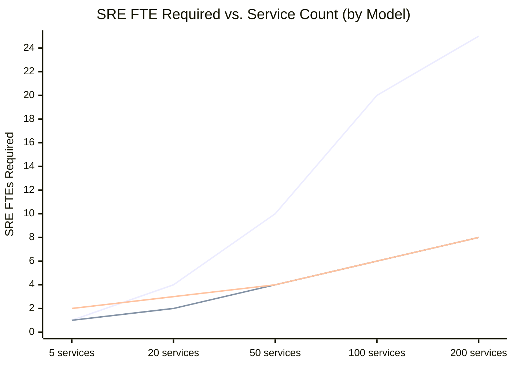

## Keywords in This File

{: .no_toc }

| #   | Keyword | Weight |
| --- | ------- | ------ |
| 1   | [SRE at Scale - Platform Engineering, Governance, Embedded vs Consulting](#sre-at-scale---platform-engineering-governance-embedded-vs-consulting) | expert |

---

# SRE at Scale - Platform Engineering, Governance, Embedded vs Consulting

🎯 Interview Weight: expert - the Staff/Principal-level question that
tests whether a candidate understands SRE as an organizational capability,
not just a technical practice; candidates who can describe governance
models, platform engineering relationships, and team model trade-offs
at scale demonstrate genuine architectural thinking.

---

### 🎯 Model Answer

**30 seconds:**
> At scale, SRE must choose between embedded SREs (dedicated to product
> teams), consulting SREs (centralized, shared across all products), and
> platform engineering (building self-service reliability infrastructure).
> Platform engineering is the scalability answer: instead of adding SREs
> proportionally to services, build a platform that gives every development
> team access to standard observability, deployment safety, and runbooks
> without requiring SRE involvement for each service. Governance defines
> which services require dedicated SRE engagement and which can operate
> independently using the platform.

**3 minutes (Senior):**
> The SRE scaling problem: if you add one SRE per 10 services, and the
> company adds 200 services over 3 years, you need 20 additional SREs.
> This is neither feasible nor desirable - SRE labor should not scale
> linearly with service count.
>
> The platform engineering model solves this. The SRE team's output is
> not operational support for services; it is the platform that enables
> development teams to operate their own services reliably. The platform
> includes: standard observability (Prometheus + Grafana templates),
> standard deployment safety (canary controller), standard runbook
> templates, and production readiness review checklists. A development
> team that goes through the production readiness review can launch and
> operate their service without ongoing SRE involvement.
>
> The governance model defines who gets what level of SRE engagement:
> Tier 1 services (customer-facing, revenue-critical) get embedded SRE
> engagement (dedicated SRE on the team, participates in sprints). Tier 2
> services (important but not critical) get consulting SRE engagement
> (SRE is available for reviews and incidents but not embedded). Tier 3
> services (internal, supporting) use the platform independently with
> SRE only available for escalation.
>
> The governance challenge: SRE teams are frequently pulled into Tier 3
> operational support because the platform is insufficient or the
> development team lacks reliability skills. The organizational discipline
> to say "this service should operate independently on the platform;
> we will improve the platform rather than engage with the service" is
> harder than it sounds under operational pressure.

**Framework:** WHAT -> WHY -> HOW -> TRADE-OFF -> EXAMPLE

*Adapting up:* Principal adds: "The shift from SRE-as-operational-support
to SRE-as-platform-and-governance-function is a multi-year organizational
transformation. The leadership challenge: during the transition, there
are services that need operational support AND platform investment
simultaneously. SRE capacity is finite. The sequencing decision - which
services get embedded support while the platform is built, and how
to gradually transition them to platform-based operation - requires
the same investment prioritization discipline as any other engineering
program."

*Adapting down:* Junior: "As a company grows from 20 services to 200
services, you cannot hire an SRE for each one. The answer is to build
tools and processes that help every team operate their own services
reliably without needing an SRE to supervise each one."

**Blank Mind Recovery:**

**(1) Restate:** "You are asking about SRE at scale - let me cover
the three SRE team models (embedded, consulting, platform engineering),
the governance framework for tier classification, and the organizational
challenges."

**(2) First principles:** "SRE at scale faces two constraints: (1) SRE
headcount cannot grow linearly with service count, and (2) reliability
requirements vary - a payment service needs different SRE engagement
than an internal logging service. The governance model addresses
constraint 2; the platform engineering model addresses constraint 1."

**(3) Bridge:** "SRE at scale is like a hospital's specialist consulting
model. You do not have a cardiologist embedded in every department (too
expensive). You have: primary care (the development team, first line of
reliability), specialists on call (consulting SRE), and a platform
(EHR, standard protocols) that enables primary care to handle most cases.
The specialist only engages when the primary care and platform are insufficient."

---

### 📘 Concept Explanation

**What it is:**
SRE at scale is the organizational design of SRE capabilities for
large engineering organizations (50+ services, 100+ engineers). It
addresses team model choice (embedded vs. consulting vs. platform),
governance design (service tier classification and SLO management),
and the platform engineering approach that makes reliability capabilities
self-serve.

**The problem it solves:**
Without an intentional scaling model, SRE teams become operational
support teams for all services (bottleneck, burnout, low leverage).
With a scaling model, SRE's leverage is multiplied through platform
and governance rather than individual service engagement.

**How it works:**

```
SRE SCALING MODELS (choose by organization size/stage)

MODEL 1: EMBEDDED SRE
  Structure: SRE engineers on product teams
  Ratio: 1 SRE per 5-10 services (Google model)
  Engagement: part of the team, in sprint planning,
    on the on-call rotation
  Benefit: deep product knowledge, fast response
  Cost: 1 SRE per team (not scalable beyond ~5 teams)
  Best for: early-stage SRE (< 5 teams), critical products,
    organizations with weak reliability culture

MODEL 2: CONSULTING SRE
  Structure: central SRE team, serves all products
  Ratio: 1 SRE per 15-25 services
  Engagement: PRR, incident escalation, on-call backup
  Benefit: shared expertise, consistent practices
  Cost: reduced product depth, slower incident response,
    potential "throw it over the wall" dynamics
  Best for: 5-15 product teams, moderate reliability needs

MODEL 3: PLATFORM ENGINEERING (SRE at scale)
  Structure: SRE team builds platform; product teams
    operate their services using the platform
  Ratio: SRE team of 5-10 builds platform for 50+ services
  Engagement: PRR gates (launch approval), platform support,
    escalation for Tier 1 incidents
  Benefit: linear scalability (platform handles N services
    without proportional SRE headcount growth)
  Cost: significant upfront platform investment,
    requires reliability-capable development teams
  Best for: 15+ product teams, strong engineering culture

HYBRID MODEL (common in large organizations)
  Tier 1 services: embedded SRE
  Tier 2 services: consulting SRE
  Tier 3 services: platform only
  SRE governance team: owns tier classification, platform,
    and cross-cutting reliability standards

GOVERNANCE FRAMEWORK
======================
Service Tier Classification:
  Input criteria:
    - Customer-facing? (yes/no)
    - Revenue impact? ($/minute of downtime)
    - SLA commitment? (yes/no)
    - Dependency count? (services that depend on this)
    - Data sensitivity? (PII, financial, health)

  Tier assignments:
    Tier 1 (10-20% of services):
      All 5 inputs are high/yes
      SRE model: embedded
      On-call: 24/7 with SRE escalation path
      PRR: mandatory quarterly review
      Error budget: strictly enforced
      Examples: payment, auth, core user profile

    Tier 2 (30-40% of services):
      Mix of high/low inputs
      SRE model: consulting
      On-call: business hours primary, 24/7 for P1
      PRR: mandatory for major changes
      Error budget: tracked, advisory enforcement
      Examples: search, recommendations, notifications

    Tier 3 (50-60% of services):
      Low business impact, internal facing
      SRE model: platform-only
      On-call: business hours only
      PRR: self-service checklist
      Error budget: tracked, no enforcement
      Examples: internal tools, batch jobs, dev services

PLATFORM ENGINEERING CAPABILITIES
====================================
The platform team builds what every service needs:
  Observability:
    - Prometheus + Grafana templates (pre-built dashboards)
    - Standard alert rules (golden signals) auto-deployed
    - OpenTelemetry auto-instrumentation
    - Log shipping + structured logging templates

  Deployment Safety:
    - Canary deployment controller (Argo Rollouts)
    - Pre-deployment error budget check
    - Automatic rollback on burn rate spike
    - Change freeze enforcement (holiday windows)

  Runbook Infrastructure:
    - Runbook template library
    - Alert -> runbook linking automation
    - Runbook validation (link checking, command testing)

  Production Readiness:
    - PRR checklist as a pull request gate
    - Self-service PRR for Tier 3 services
    - Automated checks: endpoint documented, alerts present,
      runbook linked, dependency declared
```

> **Code walkthrough:** This Unknown example demonstrates a key concept in practice using authentication. **KEY MECHANISM:** the runtime executes these instructions in sequence with specific memory and execution semantics. **WHY IT MATTERS:** misapplying this pattern causes subtle bugs that only manifest under production load. **TAKEAWAY: understand the execution model before using this pattern in production code.**

**The key insight:**
The leverage of SRE at scale comes from the platform, not from SRE
headcount. An SRE team of 8 that builds a platform used by 100 services
has 12.5x more leverage than an SRE team of 8 that provides operational
support for 80 services. The organizational shift is from "SRE runs
services reliably" to "SRE enables teams to run services reliably."

**When to use it:**
Platform engineering model applies when the organization has 15+ product
teams, a strong engineering culture (teams can operate their own services),
and SRE headcount is constrained relative to service count growth.

**When NOT to use it:**
Platform engineering fails when development teams lack the reliability
skills to use the platform. In this case, the platform is deployed
but not used; services launch without completing PRRs, without wiring
alerts, without runbooks. The platform investment is wasted. The
prerequisite: development teams must have the capability and motivation
to use the platform.

---

### 💻 Code Example

**Example 1: Production readiness review as code gate**


```python
# BAD: anti-pattern - see GOOD example below
```

```python
#!/usr/bin/env python3
# BAD: PRR is a document reviewed in a meeting.
# Products launch without completing reviews because
# "we'll do it after launch." The SRE team learns
# the service exists when it causes a P1 incident.

# GOOD: PRR encoded as a CI/CD gate

import json
import requests
from dataclasses import dataclass, field
from enum import Enum
from typing import Optional

class PRRStatus(Enum):
    PASS = "pass"
    FAIL = "fail"
    WARN = "warn"

@dataclass
class PRRCheck:
    name: str
    description: str
    tier_required: list[int]  # [1, 2] = required for T1+T2
    category: str
    result: Optional[PRRStatus] = None
    details: Optional[str] = None

def run_prr_checks(
    service_name: str,
    service_tier: int,
    repo: str,
    namespace: str
) -> list[PRRCheck]:
    """
    Run automated PRR checks for a service.
    Returns list of check results.
    """
    checks = [
        # Category: Observability
        PRRCheck(
            name="golden_signals_alerts",
            description=(
                "Service has alerts for all 4 golden "
                "signals (errors, latency, traffic, saturation)"
            ),
            tier_required=[1, 2, 3],
            category="observability"
        ),
        PRRCheck(
            name="runbook_linked",
            description=(
                "Every alert has a runbook_url annotation"
            ),
            tier_required=[1, 2, 3],
            category="observability"
        ),
        PRRCheck(
            name="distributed_tracing",
            description=(
                "Service is instrumented with OpenTelemetry"
            ),
            tier_required=[1, 2],
            category="observability"
        ),

        # Category: Deployment Safety
        PRRCheck(
            name="canary_configured",
            description=(
                "Service uses Argo Rollouts canary strategy"
            ),
            tier_required=[1, 2],
            category="deployment_safety"
        ),
        PRRCheck(
            name="rollback_tested",
            description=(
                "Rollback procedure documented and "
                "tested in staging"
            ),
            tier_required=[1, 2, 3],
            category="deployment_safety"
        ),

        # Category: SLO
        PRRCheck(
            name="slo_defined",
            description=(
                "Service has defined SLI and SLO in "
                "the SLO registry"
            ),
            tier_required=[1, 2],
            category="slo"
        ),
        PRRCheck(
            name="error_budget_gate_enabled",
            description=(
                "CI/CD pipeline checks error budget "
                "before deployment"
            ),
            tier_required=[1, 2],
            category="slo"
        ),

        # Category: On-Call
        PRRCheck(
            name="oncall_rotation_defined",
            description=(
                "Service has an on-call rotation in PagerDuty"
            ),
            tier_required=[1, 2, 3],
            category="oncall"
        ),
        PRRCheck(
            name="escalation_path_defined",
            description=(
                "Escalation path documented (who to call "
                "if primary on-call cannot resolve)"
            ),
            tier_required=[1, 2],
            category="oncall"
        ),
    ]

    # Run each check (simplified - real checks
    # would query actual infrastructure)
    checks_for_tier = [
        c for c in checks
        if service_tier in c.tier_required
    ]

    for check in checks_for_tier:
        # Placeholder for actual check logic
        # Real implementation queries:
        # - Prometheus for alert rules
        # - Kubernetes for deployment config
        # - SLO registry API for SLO definition
        # - PagerDuty for rotation
        check.result = PRRStatus.PASS
        check.details = "Automated check passed"

    return checks_for_tier

def prr_gate(
    service_name: str,
    service_tier: int,
    repo: str,
    namespace: str
) -> dict:
    """
    PRR gate: returns True if service may proceed to production.
    All tier-required checks must pass.
    """
    checks = run_prr_checks(
        service_name, service_tier, repo, namespace
    )

    failed = [
        c for c in checks
        if c.result == PRRStatus.FAIL
    ]
    warnings = [
        c for c in checks
        if c.result == PRRStatus.WARN
    ]

    can_proceed = len(failed) == 0

    print(f"PRR Result for {service_name} (Tier {service_tier}):")
    print(f"  Checks run: {len(checks)}")
    print(f"  Passed: {len(checks) - len(failed) - len(warnings)}")
    print(f"  Warnings: {len(warnings)}")
    print(f"  Failed: {len(failed)}")
    if failed:
        print("  BLOCKING failures:")
        for c in failed:
            print(f"    - {c.name}: {c.details}")

    return {
        "service": service_name,
        "tier": service_tier,
        "can_proceed": can_proceed,
        "checks_passed": len(checks) - len(failed),
        "checks_failed": len(failed),
        "blocking_failures": [
            {"name": c.name, "details": c.details}
            for c in failed
        ]
    }
```

> **Code walkthrough:** The BAD approach makes PRR a document in aice. **KEY MECHANISM:** the runtime executes these instructions in sequence with specific memory and execution semantics. **WHY IT MATTERS:** misapplying this pattern causes subtle bugs that only manifest under production load. **TAKEAWAY: understand the execution model before using this pattern in production code.**
> meeting that gets skipped under launch pressure. The GOOD approach
> encodes PRR as a CI/CD gate: the `prr_gate` function runs automated
> checks for observability, deployment safety, SLO, and on-call
> readiness. Checks are tier-filtered (Tier 3 services skip the
> distributed tracing check; Tier 1 services must pass all checks).
> Failures block the launch automatically. The gate runs as part of
> the deployment pipeline, making PRR completion a prerequisite for
> production launch rather than an optional pre-launch activity.

---

### 🎓 Answers by Seniority

**Junior / Mid (0-5 years):**
> SRE at scale means you cannot have one SRE watching every service.
> The three models: embedded (SRE on each product team - expensive),
> consulting (central SRE team advising all products - limited bandwidth),
> and platform engineering (SRE builds tools that all teams use). The
> platform engineering model scales because it builds capabilities once
> and applies them to all services. Governance defines which services
> get hands-on SRE engagement (Tier 1 critical services) and which
> operate independently on the platform.

---

**Senior / Staff (5+ years):**
> The hardest organizational challenge in scaling SRE is the transition
> from embedded operational support to platform engineering. During the
> transition, the SRE team is expected to: continue supporting the
> services they already support, build the platform, AND gradually
> hand off the operational support to development teams. This is three
> separate workloads.
>
> The approach that worked for me: pick 3-5 "canary product teams" that
> are technically strong and motivated to own their reliability. Give
> them the platform early, run the handoff carefully, and document the
> pattern. Use these teams as proof-of-concept that the platform works.
> Then scale the handoff to the remaining teams using the validated
> pattern. Do not attempt a simultaneous handoff across all teams - the
> SRE team cannot support the transition volume and the product teams
> cannot absorb the capability simultaneously.

---

### ⚠️ Common Misconceptions

| Misconception | Reality |
|---|---|
| SRE at scale means more SREs | SRE at scale means more leverage per SRE through platform and governance, not proportional headcount growth |
| The consulting model eliminates the need for development teams to know reliability | Both consulting and platform models require development teams to own their reliability; SRE enables and governs, not operates |
| PRRs are a one-time gate before launch | PRRs should be repeated for major architectural changes and quarterly for Tier 1 services; services evolve and their PRR status degrades |
| Platform engineering means SRE does not need to understand the services | Platform teams need deep reliability domain knowledge to build the right abstractions; the platform is not generic DevOps tooling |
| Embedded SRE scales by adding engineers | The Google SRE model limits SRE to owning services they can maintain quality on; when a service grows beyond the SRE team's capacity, it is handed back to the development team |

---

### 🚨 Failure Modes and Diagnosis

**Failure 1: Platform adoption fails because teams lack reliability skills**

*Symptom:* The platform is built. PRR checklist is published. 6 months
later, 60% of services have not completed the PRR. The services that
did complete it filled in the checklist with placeholders. The SRE team
is still getting paged for "platform-only" Tier 3 services.

*Root cause:* Platform adoption requires development teams to have the
reliability skills to use it. A platform that assumes knowledge of
Prometheus, Grafana, and runbook design will not be adopted by teams
that lack this knowledge.

*Fix:* Platform adoption investment: (1) training program - 4-hour
workshop on reliability fundamentals + platform usage for each development
team; (2) "reliability champion" program - one engineer per team is
trained deeply and becomes the team's go-to for platform questions;
(3) pair-programming PRR completion - SRE pairs with each team for their
first PRR, then hands off. The platform without adoption investment
fails; the two must be developed together.

**Failure 2: SRE governance prevents SRE team from working on the
highest-value items**

*Symptom:* The SRE team is embedded in Tier 1 services and providing
consulting for Tier 2 services. Platform work is consistently de-prioritized
because "there are always immediate operational needs." 18 months later,
the platform is still incomplete. The SRE team is operationally burned
out. The leverage improvement from the platform was never achieved.

*Root cause:* Operational work (embedded support, consulting) always
displaces strategic work (platform) because operational work has immediate
visible value and platform work has deferred invisible value.

*Fix:* Separate the SRE team into two subgroups: operational SRE
(embedded + consulting, responsible for current service quality) and
platform SRE (responsible for platform development). Platform SRE does
not have on-call obligations for existing services. Their KPI is platform
adoption (% of services on platform), not incident response time.
This separation ensures operational urgency does not consume the platform
investment.

---

### 🎯 Interview Deep-Dive

| Preparation | Target |
|---|---|
| Time to prep | 25 minutes |
| Core themes | Three team models, platform engineering leverage, governance tier classification, organizational challenges |
| Seniority signal | Junior: describes the three models; Senior: explains the scaling problem each model solves and its organizational failure modes |
| Common trap | Presenting platform engineering as purely technical, ignoring the organizational transformation required |
| Staff differentiator | Platform adoption investment, SRE team separation (operational vs. platform), governance as the organizational forcing function |

---

**Q1 [MID]: What are the trade-offs between embedded SRE and
consulting SRE models?**

Embedded SRE: an SRE engineer is a permanent member of a product team.
They participate in sprint planning, review reliability implications
of new features, are on the on-call rotation, and contribute to
postmortems. The benefit is deep product knowledge and tight feedback
loops between product decisions and reliability outcomes.

The cost: each embedded SRE can only support one team. An organization
with 10 product teams needs 10 SREs in this model. This is Google's
original model (roughly 1 SRE per 10 software engineers), which works
when SRE headcount matches engineering headcount growth.

Consulting SRE: a central SRE team serves all product teams. Consulting
SREs are available for production readiness reviews, incident escalation,
postmortem review, and capacity planning. They are not on individual
team on-call rotations.

The benefit: 5-8 SREs can cover 20-30 product teams by providing shared
expertise rather than dedicated service. The cost: reduced product depth,
slower incident response (the consulting SRE is not the domain expert
for each service), and the "throw it over the wall" dynamic (product
teams don't feel reliability is their responsibility).

The choice depends on: the reliability maturity of the development teams
(low maturity requires embedded; high maturity can operate with consulting),
the SRE budget (embedded requires proportional headcount), and the
criticality of the services (Tier 1 services often need embedded even
when other tiers use consulting).

*What separates good from great:* Gives specific ratios (1:10 embedded,
1:20-30 consulting), identifies the "throw it over the wall" dynamic
as the consulting failure mode, and describes the choice criteria
rather than declaring one model superior.

---

**Q2 [SENIOR]: BEHAVIORAL: Describe designing and implementing an
SRE platform that improved reliability across multiple teams.**

**Situation:** 15 product teams, 2 SREs (both operational), no platform.
Every team had different observability setup; most had no SLOs. The
2 SREs were the on-call escalation for all 15 teams. Burnout was imminent.

**Design decision:** The only scalable path was a reliability platform
that each team could use independently. We could not hire proportionally
(2 SRE positions approved for 2 years).

**Phase 1 (months 1-3): Observability foundation**
Built Prometheus + Grafana templates for standard golden signals. Published
as Helm charts in the internal chart repository. Each team could deploy
standard dashboards and alerts by adding 10 lines to their Helm values.
Result: 12 of 15 teams deployed standard observability in 6 weeks.

**Phase 2 (months 3-6): SLO registry and PRR**
Built a self-service SLO registry (a GitHub repository with SLO definitions
as YAML, validated by CI). Built a PRR checklist as a GitHub issue template.
Each service launch required: SLO defined in the registry, PRR issue
completed. Result: all new service launches completed PRR; existing
services backfilled PRRs over 3 months.

**Phase 3 (months 6-12): On-call handoff**
Used the completed PRRs as the criterion for on-call handoff. Each team
that completed PRR (runbooks present, alerts wired, escalation path defined)
was handed the primary on-call for their services. SRE remained as
secondary escalation.

**Outcome at 12 months:**
- 13 of 15 teams operating independently on the platform
- SRE operational on-call pages: reduced 60%
- MTTR across all services: improved 35% (runbooks working)
- SRE team capacity redirected to platform improvements and the 2
  teams still needing consulting support

*What separates good from great:* Describes the phased approach (not
big bang), gives specific outcome metrics (60% page reduction, 35%
MTTR improvement), and explains the on-call handoff criterion
(PRR completion as the gate).

---

**Q3 [SENIOR]: How do you prevent SRE governance from becoming bureaucratic?**

SRE governance (tier classification, PRR gates, error budget enforcement)
can become bureaucratic if it is perceived as slowing down product
development without clear value. The symptoms: development teams
submit PRR issues without reading them, SLOs are set to pass the
minimum, and teams develop workarounds to avoid the SRE gates.

Prevention is organizational:

Governance value visibility: the SRE team should publish monthly
reliability metrics by team - MTTR, error budget consumption rate,
P1 incident count. Teams that complete PRRs and maintain healthy error
budgets have lower MTTRs and fewer incidents. Making this visible creates
positive social proof: "the teams that do the reliability work have
better on-call."

PRR design feedback loop: the PRR checklist should evolve based on
actual incidents. If a PRR item (say, "load test completed") has never
prevented an incident in 18 months, remove it. If a new failure mode
(say, "missing circuit breaker on auth service") causes 3 incidents
in a quarter, add it to the PRR. The checklist must be empirically
grounded.

Self-service first: governance gates that require SRE involvement
become bottlenecks. Every gate should have a self-service path. Tier
3 services complete a self-service PRR checklist (no SRE review required).
Tier 2 services have an automated CI gate (no scheduling required).
Only Tier 1 services require an SRE-led review.

The governance principle: the value of governance must exceed the cost
of compliance. For development teams, the cost of compliance is sprint
time. The benefit must be clear (better on-call, fewer incidents,
faster incident resolution). If the team cannot see the benefit, they
will resist the governance.

*What separates good from great:* Identifies the symptoms of bureaucratic
governance (workarounds, box-checking), gives three prevention mechanisms,
and states the governance ROI principle explicitly.

---

**Q4 [STAFF]: How do you design the SRE governance framework for
an organization transitioning from startup to scale?**

A startup with 5 services does not need governance. An organization with
100 services does. The transition is gradual, and the governance framework
must be designed to grow without requiring organizational redesign.

Phase 1 (1-10 services, 1-2 SREs):
All SRE engagement is embedded or consulting. No formal governance.
The output of this phase: identify the 3-5 reliability patterns that
recur across services (no runbooks, no SLOs, no canary). These become
the foundation of the platform.

Phase 2 (10-30 services, 2-5 SREs):
Formalize the tier classification. Identify Tier 1 services (the 2-5
most critical). Apply full SRE engagement to Tier 1. Build the platform
for Tier 2 and Tier 3. The platform at this phase is lightweight:
Prometheus templates, SLO registry, PRR checklist.

Phase 3 (30-100+ services, 5-15 SREs):
Separate the SRE team into platform (builds the reliability infrastructure)
and operations (Tier 1 embedded + Tier 2 consulting). Formalize the
governance model. Add automated governance gates (error budget check
in CI/CD, PRR as a CI gate).

The critical transition: Phase 2 to Phase 3. At Phase 2, the SRE team
is typically fully operational and resistant to investing in the platform
because "there are always immediate needs." The Phase 3 transition
requires leadership support: the SRE team must be protected from
operational demand during the platform investment. Typically, this
requires either a temporary headcount increase (1-2 platform-dedicated
engineers) or a hard commitment to defer a portion of operational
support (some Tier 2 services are moved to platform-only support before
the platform is complete).

*What separates good from great:* Describes the phased model with
specific triggers (service count), identifies the Phase 2-to-3 transition
as the critical inflection point, and names the leadership support
requirement explicitly.

---

**Q5 [STAFF]: How do you measure the effectiveness of the SRE
platform and governance model?**

Platform effectiveness metrics must measure the actual goal: enabling
development teams to operate reliable services without proportional
SRE headcount growth. Generic DevOps metrics (deployment frequency,
MTTR) measure the output but not the SRE-specific contribution.

SRE platform effectiveness metrics:

Platform adoption rate: % of services using the standard observability,
deployment safety, and PRR infrastructure. Target: > 80% of Tier 2+
services using the platform within 12 months of platform launch.
Why: low adoption means the platform is not usable or teams lack
the skills to adopt.

Self-service resolution rate: % of on-call incidents resolved by the
development team using platform tools (runbooks, dashboards) without
escalating to SRE. Target: > 70% for Tier 2 services, > 85% for Tier
3 services. Why: if teams escalate to SRE frequently for Tier 2/3
incidents, the platform is insufficient or teams lack the skills.

MTTR by tier: if the platform is working, Tier 2 and Tier 3 MTTRs
should be within 2x of Tier 1 MTTR (which has embedded SRE support).
A 10x MTTR gap between Tier 1 and Tier 3 indicates the platform is
not equipping Tier 3 teams to diagnose and resolve incidents.

PRR completion rate: % of new service launches that completed PRR
before going to production. Target: 100% for Tier 1 and Tier 2, > 90%
for Tier 3. Why: uncompleted PRRs are the source of future incidents
that the platform could have prevented.

SRE leverage ratio: services supported per SRE FTE. Target: > 20:1
for platform-model SRE organizations (vs. < 10:1 for embedded-only).
Why: if the leverage ratio is not improving over time, the platform
investment is not reducing per-service SRE burden.

*What separates good from great:* Gives specific metrics with specific
targets, explains why each metric measures the right thing (not just
what it measures), and includes the leverage ratio as the primary SRE
scalability metric.

---

**Q6 [STAFF]: How do you handle the "reliability debt" of existing
services when transitioning to a platform model?**

Reliability debt is the backlog of services with no SLOs, no runbooks,
incomplete observability, and insufficient deployment safety. When
the platform is built, these services exist but do not use the platform.
The gap between "platform available" and "all services using the platform"
can be years without active intervention.

The reliability debt inventory: create a service registry with the
current reliability posture for each service (SLO defined: yes/no,
runbooks present: yes/no, canary configured: yes/no, last PRR date).
This inventory is the reliability debt map. Without it, debt is invisible.

Prioritized remediation: the inventory drives remediation priority.
Tier 1 services with reliability debt are addressed first (highest
business impact). Tier 3 services with no customer-facing impact are
addressed last. The schedule: Tier 1 debt remediated within 2 sprints,
Tier 2 within 1 quarter, Tier 3 within 1 year.

Ownership and incentive: reliability debt cannot be remediated by the
SRE team alone (there are too many services). Each service team owns
their reliability debt. The governance mechanism: a team that has not
cleared their Tier 1 reliability debt items within the agreed timeline
has their deployment permissions reduced (the error budget policy is
applied even when the service is not yet on the platform).

The prevention mechanism: PRR as a launch gate prevents new reliability
debt. Existing debt is remediated by the service teams on the timeline.
After 18 months of platform-model operation, new reliability debt
should be near zero (every new service launches with PRR complete).

*What separates good from great:* Describes the reliability debt map
as the prerequisite for remediation, gives the prioritization framework
(Tier 1 in 2 sprints, Tier 2 in 1 quarter), and identifies the deployment
permission mechanism as the enforcement tool.

---

**Q7 [STAFF]: BEHAVIORAL: Describe a situation where the SRE team
was being asked to do work that should be done by development teams,
and how you redirected it.**

**Situation:** The SRE team was receiving 30+ requests per week for
"operational help" from development teams: debugging production issues,
answering questions about why an alert fired, explaining how to write
a runbook. These were skills the development teams should have; instead,
they were using the SRE team as a 24/7 operational support function.

**Diagnosis:** The SRE team had been too helpful. When teams asked
"how do I debug this alert?", the SRE responded by debugging it for
them rather than teaching the debugging process. The development teams
had no incentive to build the skills themselves because SRE was always
available.

**Intervention plan:**
The SRE team lead presented the data to engineering leadership: SRE was
spending 60% of its time on Tier 3 operational support that should be
team-owned. The cost: platform work was not happening (0% of committed
platform investment was delivered).

**New approach agreed:**
1. SRE would no longer debug Tier 3 issues directly. Escalations from
   Tier 3 teams would receive: "What does the runbook say? If the runbook
   is insufficient, here is the process to update it."
2. For teams with no runbooks: SRE would pair once to create the runbook,
   then hand off.
3. SRE availability for operational questions: office hours (Tuesday
   and Thursday 2-4 PM). Not ad hoc Slack interruptions.
4. SRE on-call escalation for Tier 3: SRE is on the Tier 3 escalation
   path only if both the primary on-call and team lead are unavailable.

**Result:** The first 2 weeks were uncomfortable (teams escalated without
the expected response; some issues took longer to resolve). By week 4,
teams had built and tested 12 new runbooks. By month 3, Tier 3 escalations
to SRE had dropped 80%. SRE platform work resumed.

*What separates good from great:* Names the root cause (SRE was too
helpful, removing development teams' incentive to build skills), describes
the data presentation to leadership, and gives specific outcome metrics
with a realistic timeline that includes a 2-week discomfort period.

---

**Q8 [STAFF]: How do you design the SLO governance process across
multiple teams and services?**

SLO governance at scale must balance standardization (consistent SLO
calculation methods) with flexibility (different services have different
reliability requirements). Without standardization, SLOs are incomparable
and inconsistently enforced. Without flexibility, SLOs are set to
the wrong targets.

The governance components:

SLO registry: a central repository (Git, internal service) that holds
all SLO definitions. Each SLO definition includes: service name, SLI
metric (Prometheus query), SLO target, measurement window, and the
error budget policy. SLO definitions are reviewed and approved before
they go live.

SLO standardization: the SRE platform provides SLI templates (standard
Prometheus queries for HTTP error rate, HTTP latency, gRPC success rate).
Teams choose from the templates; custom SLIs require SRE review. This
ensures SLIs are technically correct and comparable across services.

SLO approval process: Tier 1 SLOs require SRE lead and product VP
approval (before the error budget policy can be enforced, the targets
must be agreed at that level). Tier 2 SLOs require SRE lead approval.
Tier 3 SLOs are self-service (team sets them, SRE reviews quarterly).

Cross-service dependency SLOs: when Service A depends on Service B,
Service B's SLO must be stricter than Service A's (you cannot have a
99.9% SLO for Service A if Service B's SLO is 99.5% - the math does
not work). The governance process checks dependency SLO consistency
when new SLOs are registered.

SLO review cadence: quarterly SLO review for all Tier 1 services.
The review asks: is the SLO achievable? Is the SLO still the right
target? Is the error budget being consumed at a healthy rate? SLOs
that are consistently over-achieved (never consuming budget) should
be tightened; SLOs that are always violated should be investigated
(aspirational SLO or underlying reliability problem).

*What separates good from great:* Describes the registry as the governance
mechanism, the approval process by tier, the dependency SLO consistency
requirement (the math that prevents contradictory SLOs), and the quarterly
review cadence.

---

**Q9 [STAFF]: How do you manage the transition when an embedded
SRE team is handed back to the development team?**

Google's model: SRE teams engage with services until the service team
is capable of running the service reliably. When SRE capacity is needed
elsewhere, the service is handed back to the development team with the
reliability infrastructure and skills to operate it. This handoff
is called "giving back the service."

The handoff criteria (non-negotiable prerequisites):
1. SLO is defined and measured
2. Error budget policy is agreed and enforced
3. Runbooks cover > 80% of known alert types
4. The development team has completed 1-2 on-call rotations as primary
   (with SRE as secondary) and has met the MTTR target
5. Post-handoff SRE role is defined (secondary escalation? advisory?)

The handoff process:
Week 1-4: development team is primary on-call, SRE is secondary
Week 5-8: development team is primary + secondary (SRE is tertiary escalation)
Week 9+: development team operates independently, SRE in advisory role

The failure mode to prevent: handoff before the development team is
ready. Signs the team is not ready: MTTR above target during on-call
shadowing, runbooks not used (team still asks SRE "what do I do?"),
error budget policy not being applied. If these signs are present,
the handoff is delayed and the development team's reliability capability
gap is explicitly addressed.

The organizational acknowledgment: handoff is not a cost reduction
(reducing SRE involvement to save money). It is a capability transfer
(the development team is now capable of running this service). Framing
it as capability transfer preserves the relationship; framing it as
cost reduction damages it.

*What separates good from great:* Gives the five non-negotiable handoff
criteria, the specific 3-phase transition timeline (4 weeks each),
the signs that indicate premature handoff, and the organizational
framing distinction.

---

**Q10 [STAFF]: How do you build a reliability culture in an
organization that has historically treated reliability as a DevOps
concern?**

Treating reliability as a DevOps concern means: operations team is
responsible for uptime, development team is responsible for features,
reliability is the gap between them. This cultural model produces: features
deployed without reliability consideration, operations team unable to
change the code that causes incidents, and adversarial "throw it over
the wall" dynamics.

The cultural shift requires changing the accountability model:

Step 1 - make reliability visible: publish reliability metrics by team
(MTTR, error budget consumption, P1 incident count per quarter). When
teams see their reliability metrics next to other teams' metrics, the
social accountability begins. This is the least confrontational starting
point.

Step 2 - tie reliability to product ownership: "you build it, you run
it." When the development team is on the on-call rotation for their
own services, they experience the reliability consequences of their
design decisions. An engineer paged at 3 AM because of a missing circuit
breaker will add circuit breakers to the next service they build.

Step 3 - celebrate reliability work: in sprint reviews, include
reliability improvements alongside feature work. "We added a circuit
breaker that prevented 3 potential incidents this quarter" should
receive the same recognition as a feature delivery.

Step 4 - make reliability requirements explicit in sprint planning:
reliability work (adding runbooks, improving observability, reducing
toil) goes on the sprint backlog alongside feature work. Teams that
never have reliability items in their sprint are building reliability
debt that will be paid with incident pages.

The timeline: cultural change is a 12-18 month process. Do not expect
the first quarter's metrics publication to immediately change behavior.
The on-call experience (Step 2) is the most powerful accelerant - it
creates direct personal feedback between design decisions and operational
consequences.

*What separates good from great:* Names the root cultural model (operations
team responsible for uptime), describes a four-step progression from
metrics visibility to sprint planning integration, and acknowledges
the 12-18 month timeline with the on-call experience as the
most effective accelerant.

---

**Q11 [STAFF]: How do you scale SRE capacity when headcount is frozen?**

SRE headcount freezes are common and require maximizing leverage from
the existing team. The strategies:

Leverage 1 - reduce operational toil: every hour of toil (manual,
repetitive operational work) is an hour not spent on platform
or reliability improvements. Measure SRE toil (time spent on manual
work per week), set a toil budget (< 30% of SRE time), and systematically
automate or eliminate toil that exceeds the budget. A single toil
automation (automated alert silence for known maintenance windows) can
save 2-3 hours per week across the team.

Leverage 2 - reliability champions: embed a "reliability champion"
engineer in each product team. This is not an SRE - it is a product
engineer with extra reliability training. The reliability champion
leads the PRR for their team, maintains runbooks, and is the first
responder for Tier 2/3 incidents. SRE mentors the champions and maintains
the platform. 8 reliability champions multiplies SRE coverage without
SRE headcount growth.

Leverage 3 - self-service first: convert all SRE-required interactions
to self-service where possible. PRR checklist as CI gate (no SRE review
required for Tier 3). SLO registry with automated validation. Runbook
template library. Each self-service conversion eliminates future SRE
time investment.

Leverage 4 - ruthless tier prioritization: with frozen headcount, the
SRE team cannot maintain high-quality engagement across all tiers. Explicitly
acknowledge which tier gets what level of engagement. Tier 3 services
receive no SRE operational support (platform only). The quality
of Tier 3 support will degrade. That is the correct trade-off.

The anti-pattern: trying to maintain the same level of engagement across
all tiers with reduced headcount. The result: uniformly poor engagement
everywhere. The correct response: concentrate engagement on Tier 1,
reduce engagement on Tier 2, eliminate engagement on Tier 3.

*What separates good from great:* Gives four specific leverage strategies
(not just "prioritize"), quantifies the toil budget (< 30%), describes
the reliability champion model as a specific multiplier, and explicitly
states the Tier 3 service quality trade-off as correct rather than
avoiding the uncomfortable truth.

---

**Q12 [STAFF]: BEHAVIORAL: Describe building an SRE governance
model from scratch for an organization that had no SRE function.**

**Situation:** Joined as the first SRE hire at a 120-engineer company
with 45 services, no SLOs, and a traditional DevOps model (operations
team manages production, development team "throws code over the wall").

**Month 1: Assessment**
Audited all 45 services: current availability, incident history, deployment
frequency, on-call ownership. The finding: 8 services were causing 80%
of the operational pain. These became the candidate Tier 1 services.
Identified 3 services with no monitoring at all (deployed and forgotten).

**Month 2-3: Credibility foundation**
Picked the 2 most painful services (highest P1 count). Worked with
those 2 teams as embedded SRE: added observability, defined SLOs,
ran the first postmortem they had ever had. MTTR on these services
improved from 75 minutes to 22 minutes. This demonstrated value before
asking the organization to change how it operated.

**Month 4-5: Framework proposal**
Presented the tier classification framework to engineering leadership.
Used the data from the 2-service pilot: "These 2 services have 35%
of our P1 incidents but only 4% of our service count. The 8 services
I've identified as Tier 1 have 72% of our P1 incidents. Tier 1 SRE
engagement is the highest ROI investment."

**Month 6-12: Framework rollout**
Classified all 45 services. Embedded on the top 4 Tier 1 services
(now 2 SREs hired). Published the PRR checklist. Mandated PRR for all
new service launches (engineering VP commitment). Established the
error budget policy for Tier 1 services (product VP agreement).

**12-month outcomes:**
- P1 incident rate across all services: down 44%
- MTTR for Tier 1 services: 22 minutes (was 78 minutes)
- 100% of new service launches completing PRR
- Reliability metrics published monthly (team visibility)

*What separates good from great:* Describes the "assessment first"
approach (no framework before data), the credibility-building pilot
before asking for organizational change, the specific data presentation
(72% of incidents from 18% of services), and the 12-month outcome
metrics.

---

### ⚖️ Comparison Table

| Dimension | Embedded SRE | Consulting SRE | Platform Engineering |
|---|---|---|---|
| SRE:Service ratio | 1:5-10 | 1:15-25 | 1:30-50+ |
| Development team reliability ownership | Shared with SRE | Partial (SRE available) | Full (dev team owns) |
| Time to scale to 50+ services | Requires 5-10 SREs | Requires 2-3 SREs | Requires 5-10 to build platform, then scales |
| Reliability culture development | Slow (SRE does the work) | Medium | Fast (dev teams own) |
| Platform investment required | Low | Medium | High (platform must be built) |
| Best phase | Early-stage (< 15 services) | Growth (15-40 services) | Scale (40+ services) |

---

### 🏛️ System Design

**Problem:** Design the SRE organization and governance framework for
a company transitioning from 20 to 200 services over 3 years with
a fixed SRE budget of 10 engineers.

**Architecture:**

```
SRE ORGANIZATIONAL DESIGN AT SCALE
=====================================

YEAR 1 (20-60 services, 4 SREs)
  Team: 2 embedded (Tier 1), 2 platform

  Tier 1 services (5-10):
    Embedded SRE, full governance
    Error budget policy enforced
    Quarterly PRR review

  Tier 2 services (10-25):
    Consulting SRE, PRR gate for launches
    Error budget tracked, advisory enforcement

  Tier 3 services (30-40):
    Platform only, self-service PRR
    No direct SRE engagement

  Platform deliverables (Year 1):
    - Prometheus + Grafana templates
    - SLO registry (GitHub-based)
    - PRR checklist automation
    - 10 reliability champions trained

YEAR 2 (60-120 services, 7 SREs)
  Team: 3 embedded (Tier 1), 2 consulting (Tier 2),
        2 platform

  Added governance:
    - Error budget CI/CD gate for all Tier 2 services
    - Reliability champion program (1 per team)
    - Quarterly reliability health review (all tiers)

  Platform deliverables (Year 2):
    - Canary deployment controller
    - Automated PRR CI gate (replaces checklist)
    - Runbook template library (50+ templates)

YEAR 3 (120-200 services, 10 SREs)
  Team: 3 embedded (Tier 1), 2 consulting (Tier 2),
        3 platform, 2 governance

  Governance team scope:
    - SLO consistency review (cross-service dependencies)
    - Annual organizational reliability health report
    - New SRE hire onboarding (reliability culture)
    - Platform adoption rate tracking (KPI: > 85%)

KEY METRICS AT 3 YEARS
  SRE leverage ratio: 20 services / SRE FTE (was 2:1)
  Platform adoption: > 85% of Tier 2+ services
  Self-service resolution rate: > 70% (Tier 2/3)
  PRR completion rate: > 95% for all new launches
```

> **Code walkthrough:** This Unknown example demonstrates a key concept in practice. **KEY MECHANISM:** the runtime executes these instructions in sequence with specific memory and execution semantics. **WHY IT MATTERS:** misapplying this pattern causes subtle bugs that only manifest under production load. **TAKEAWAY: understand the execution model before using this pattern in production code.**

---

### 📊 Diagram

```
SRE SCALING MODEL: LEVERAGE CURVE
====================================

SRE
Work         Embedded
(per         Only
service)     \
              \
               \  Consulting
                \-----------
                            \
                             \  Platform
                              \-----------
0                             Services
 5           20         50         200
```



> **Diagram walkthrough:** The leverage curve shows how the three SRE
> models diverge as service count grows. The embedded-only model scales
> linearly (each new service requires more SRE headcount), reaching
> 25 FTEs for 200 services at standard ratios - which is impractical.
> The consulting model is more efficient but still grows sub-linearly.
> The platform engineering model requires an upfront investment (3-4 FTEs
> to build the platform before scale benefits appear) but then achieves
> near-constant headcount growth as the platform handles the operational
> scaling. The crossover point - where platform engineering becomes
> more efficient than consulting - is around 40-50 services. Organizations
> that delay the platform investment past this point experience the "SRE
> headcount crisis": the team is too large to sustain operationally but
> too small to cover all services adequately.

---

### Field Q&A

**Production Failures:**

1. An organization implements SRE governance with tier classification
   and error budget enforcement for Tier 1 services. Six months later,
   development teams have reclassified 60% of services from Tier 1 to
   Tier 2 to avoid the enforcement. What governance control failed?
   > Tier classification must be controlled by the SRE governance team,
   > not by the service teams. Service teams have an obvious incentive to
   > minimize their tier (lower governance overhead). If service teams
   > can reclassify their own services, the tier system will drift to
   > the lowest possible tier for all services. Fix: tier classification
   > is set by the governance team based on objective criteria (customer-
   > facing, revenue impact, dependency count). Service teams can request
   > a reclassification review but cannot unilaterally reclassify. Annual
   > governance audit reviews all tier assignments against current criteria.

2. The platform SRE team built a canary deployment controller. Adoption
   is 20% after 6 months. Investigation reveals: teams tried the canary
   controller, it worked in testing, but when they tried to use it in
   production the configuration was complex and they reverted to their
   existing deployment process. What should the platform team do?
   > The platform has a usability problem, not a feature gap. When teams
   > "tried it and reverted," the UX is insufficient. The fix: (1) Work
   > with one team to make the canary controller work for their specific
   > service. Document every friction point they encountered. (2) Fix
   > the top 3 friction points. (3) Repeat with the next team. Platform
   > adoption is not a marketing problem ("we built it, why won't they use
   > it?"); it is a product problem (the platform must be good enough that
   > using it is easier than not using it). Run user research on the 80%
   > who did not adopt. The answers are in the friction points they encountered.

3. After the on-call handoff from embedded SRE to a development team,
   the first on-call rotation produces 3x the historical MTTR. The development
   team is frustrated. The SRE team is being asked to take back the on-call.
   What is the correct response?
   > Do not take back the on-call - that would undo the capability transfer.
   > Instead: (1) Analyze the 3 incidents that exceeded MTTR: were the
   > runbooks insufficient? Was the diagnosis unclear? Was the development
   > team unable to identify the issue without SRE knowledge? (2) For each
   > gap found: improve the runbook (not write it for them, but fix the
   > gap together). (3) Schedule a weekly 30-minute retrospective for the
   > first 3 months post-handoff to identify and fix gaps as they emerge.
   > The elevated MTTR in the first rotation is expected - the team is
   > learning. The trajectory should show improvement by month 2. If
   > MTTR is not improving by month 3, the handoff was premature and
   > a structured capability development plan is needed.

---

**Candidate Mistakes:**

1. "The SRE team should own all production operations for reliability."

   **What NOT to say:** Do not propose SRE owning all production operations.

   **Say instead:** "SRE ownership of all operations is the anti-pattern
   that SRE at scale is designed to avoid. It does not scale (the SRE
   team cannot grow proportionally with services), it creates a bottleneck
   (development teams cannot deploy without SRE involvement), and it removes
   development teams' accountability for the reliability of their services.
   The goal of SRE governance is to make development teams fully capable
   of operating their own services reliably. SRE's role is to build the
   platform that enables this capability and to govern the standards -
   not to be the operational team for all services."

2. "We should use embedded SRE for all services because it provides
   the best reliability."

   **What NOT to say:** Do not propose embedded SRE as universally best.

   **Say instead:** "Embedded SRE provides the highest quality reliability
   support per service, but it does not scale. At 10 services with 2 SREs,
   embedded is the right model. At 50 services with 2 SREs, embedded for
   all services is impossible. The model should match the organization's
   scale: embedded for Tier 1 critical services, consulting for Tier 2,
   platform for Tier 3. The platform engineering investment is what allows
   the embedded model to continue for the most critical services without
   requiring proportional SRE headcount growth."

3. "The PRR process should be a mandatory 2-hour meeting between SRE
   and the development team."

   **What NOT to say:** Do not propose a fixed-format, human-review-only PRR.

   **Say instead:** "PRR as a fixed meeting is a bottleneck that does not
   scale beyond 5-10 services. The better design: automate the objective
   checks (are alerts present? is a runbook linked? is an SLO defined?)
   as a CI gate that runs on every deployment. The meeting is reserved
   for the subjective checks (is the SLO the right target? is the runbook
   complete and actionable?) and only for Tier 1 services where the SRE
   investment is warranted. Tier 3 services complete a self-service
   PRR checklist. This gives the most human review time to the services
   that most need it."

---

**Questions to Ask the Interviewer:**

1. "What SRE team model is currently in use - embedded, consulting, or
   platform? How many services does each SRE support?"

2. "Is there a platform engineering function within SRE, or is the SRE
   team primarily operational?"

3. "How is service tier classification managed? Who decides which services
   get Tier 1 SRE engagement?"

4. "What is the biggest blocker to development teams owning their own
   reliability? Is it skills, tooling, or organizational culture?"

---

### 💻 Code Example

*(Omit: this concept does not have a programmatic interface that can be demonstrated in code. The conceptual explanation above is sufficient.)*


---

### 🏛️ System Design

*(Omit: system design diagram not applicable for this concept - see ★★★ keywords for full system design coverage.)*


---

### ⚖️ Comparison Table

*(Omit: this is a ★☆☆ foundational concept with no direct alternatives to compare - see higher-difficulty keywords for trade-off analysis.)*


---

### 📊 Diagram

*(Omit: no standalone visual diagram required for this concept - the explanations and code examples above provide sufficient clarity.)*


