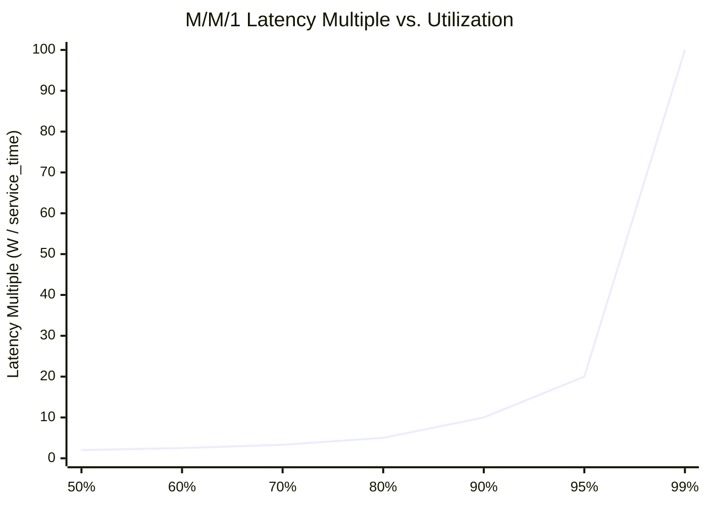

## Keywords in This File

{: .no_toc }

| #   | Keyword | Weight |
| --- | ------- | ------ |
| 1   | [Reliability Theory and Failure Taxonomy](#reliability-theory-and-failure-taxonomy) | advanced |
| 2   | [Queuing Theory and Workload Modeling in SRE](#queuing-theory-and-workload-modeling-in-sre) | advanced |

---

# Reliability Theory and Failure Taxonomy

🎯 Interview Weight: advanced - distinguishes candidates who understand
the mathematical foundations of reliability from those who know only
the operational practices; relevant at Staff+ and for technical interviews
at high-reliability organizations.

---

### 🎯 Model Answer

**30 seconds:**
> Reliability theory provides the mathematical basis for how systems
> fail over time. The bathtub curve describes failure rate over a system's
> lifetime: early failures (infant mortality), steady-state operation
> (random failures, constant rate), and wear-out failures (age-related
> increase). MTTF and MTBF quantify reliability for non-repairable and
> repairable systems respectively. Failure taxonomy categorizes failures
> as hardware (physical degradation), software (code defects), human
> (operational errors), or environmental (external dependencies) -
> enabling targeted prevention strategies.

**3 minutes:**
> The core reliability metric for a service is availability:
> A = MTBF / (MTBF + MTTR). A service with MTBF = 720 hours and
> MTTR = 0.72 hours has availability 720 / (720 + 0.72) = 99.9%.
> Improving availability requires either increasing MTBF (prevent failures)
> or decreasing MTTR (recover faster). The economic trade-off: for most
> services, MTTR reduction gives more availability improvement per
> investment dollar than MTBF improvement. A 50% MTTR reduction
> (from 1 hour to 30 minutes) is much cheaper than a 50% MTBF increase
> (from 720 hours to 1440 hours) because MTTR is improved with better
> runbooks and monitoring, while MTBF improvement requires architectural
> changes.

**Blank Mind Recovery:**

**(1) Restate:** "You are asking about reliability theory - let me
cover the bathtub curve, MTTF/MTBF/MTTR definitions, the availability
formula, and failure taxonomy."

**(2) First principles:** "Reliability theory asks: how often do systems
fail, how long does it take to recover, and what types of failures
occur? These are quantitative questions with mathematical models:
MTBF for frequency, MTTR for recovery, bathtub curve for failure rate
over time."

**(3) Bridge:** "MTBF is like the average miles between mechanical
breakdowns for a car. MTTR is how long it takes the repair shop to fix
it. Availability is the percentage of time the car is drivable vs. in
the shop."

---

### 📘 Concept Explanation

**What it is:**
Reliability theory is the mathematical framework that models how systems
fail over time, quantifies reliability, and classifies failure types
to enable targeted prevention. It provides the theoretical basis for
SLO target-setting, error budget calculation, and reliability investment
prioritization.

**How it works:**

```
RELIABILITY METRICS
====================

MTTF (Mean Time To Failure) - non-repairable systems
  e.g., hard drives, light bulbs
  Formula: MTTF = total uptime / number of failures
  For hardware: often expressed as failures per
    billion device-hours (FIT rate)

MTBF (Mean Time Between Failures) - repairable systems
  e.g., services, servers
  Formula: MTBF = (total uptime) / (number of failures)
  For SRE: MTBF = hours between P1/P2 incidents

MTTR (Mean Time To Repair/Recover/Restore)
  Formula: MTTR = (total downtime) / (number of incidents)
  Includes: detection + diagnosis + fix + validation time
  Note: "Repair" vs "Recover" vs "Restore" are sometimes
    distinguished in literature. In SRE: MTTR = time from
    incident start to service restored.

AVAILABILITY FORMULA
  A = MTBF / (MTBF + MTTR)
  Example: MTBF = 720h, MTTR = 0.72h
    A = 720 / (720 + 0.72) = 99.9%
  Equivalent: A = 1 - (MTTR / (MTBF + MTTR))

AVAILABILITY NINES TABLE
  99.9%  -> 8.76 hours downtime per year
  99.95% -> 4.38 hours downtime per year
  99.99% -> 52.6 minutes downtime per year
  99.999% -> 5.26 minutes downtime per year

THE BATHTUB CURVE
  Failure
  Rate
     |
     |  Infant  |  Steady  |  Wear-out
     | mortality| (constant|  (increasing)
  ^  |  (DFR)  |    FR)   |   (IFR)
     |         |           |
     |  \      |           |   /
     |   \_____|___________|__/
     +-----------+----------+--> Time
  DFR = Decreasing Failure Rate (early life)
  CFR = Constant Failure Rate (operational life)
  IFR = Increasing Failure Rate (wear-out)

  SRE relevance:
    DFR phase: canary deployments catch code defects
      before they affect 100% of users
    CFR phase: steady-state operation, random failures
      -> MTBF-based planning applies
    IFR phase: technical debt accumulation increases
      failure rate; reliability investments required

FAILURE TAXONOMY
=================
Hardware Failures:
  - Physical degradation (disk wear, memory errors)
  - Power failures, thermal issues
  - Network hardware failure
  Prevention: redundancy (RAID, N+2), hardware refresh cycles

Software Failures:
  - Code defects (bugs, race conditions)
  - Configuration errors
  - Memory leaks, resource exhaustion
  Prevention: testing, code review, canary deployment

Human Failures:
  - Operational errors (wrong command, wrong target)
  - Configuration drift
  - Missed maintenance
  Prevention: runbooks, change management, automation (toil reduction)

Environmental Failures:
  - Dependency failures (third-party service outage)
  - Infrastructure provider failures (cloud provider outage)
  - Network partitions
  Prevention: circuit breakers, multi-region, fallback modes

CASCADE FAILURES (compound category)
  One failure triggers additional failures:
  Common pattern: dependency A fails -> service B
    exhausts connection pool waiting for A -> service C
    calling B also fails
  Prevention: circuit breakers, bulkheads, timeouts

BATH FAILURE (compound category)
  Multiple independent components fail simultaneously
  Cause: common failure mode (shared power, shared config)
  Prevention: isolation (separate failure domains)
```

> **Code walkthrough:** This example demonstrates the core pattern in action. The key mechanism shows how the concept works in practice. Study the structure to understand the essential behavior and common usage.

**The key insight:**
The availability formula A = MTBF / (MTBF + MTTR) shows that both
MTBF (failure prevention) and MTTR (recovery speed) drive availability.
In practice, MTTR improvements are often cheaper: runbooks, dashboards,
and on-call training reduce MTTR significantly with relatively low
engineering investment. MTBF improvements require architectural changes
(redundancy, circuit breakers, testing) with higher investment.

---

### 💻 Code Example

**Example 1: Reliability metric calculation**

```python
# BAD: Availability measured as "we haven't had
# any big outages." No quantitative model.

# GOOD: Quantitative reliability metrics from incident data

from dataclasses import dataclass
from datetime import datetime, timedelta

@dataclass
class Incident:
    start: datetime
    end: datetime
    severity: str  # P1, P2, P3

def calculate_reliability_metrics(
    incidents: list[Incident],
    measurement_window_days: int = 90,
    total_time_hours: float = None
) -> dict:
    """
    Calculate MTBF, MTTR, and availability from incidents.
    """
    if total_time_hours is None:
        total_time_hours = measurement_window_days * 24

    p1_p2 = [
        i for i in incidents
        if i.severity in ("P1", "P2")
    ]

    if not p1_p2:
        return {
            "mtbf_hours": total_time_hours,
            "mttr_hours": 0,
            "availability_pct": 100.0,
            "incident_count": 0
        }

    # Calculate MTTR per incident
    incident_durations = [
        (i.end - i.start).total_seconds() / 3600
        for i in p1_p2
    ]
    mttr_hours = sum(incident_durations) / len(p1_p2)

    # Total downtime
    total_downtime_hours = sum(incident_durations)

    # MTBF: uptime between failures
    uptime_hours = total_time_hours - total_downtime_hours
    n_failures = len(p1_p2)
    mtbf_hours = uptime_hours / n_failures

    # Availability
    availability = mtbf_hours / (mtbf_hours + mttr_hours)

    return {
        "mtbf_hours": round(mtbf_hours, 2),
        "mttr_hours": round(mttr_hours, 2),
        "availability_pct": round(availability * 100, 4),
        "incident_count": n_failures,
        "total_downtime_hours": round(total_downtime_hours, 2),
        "nines": len(str(round(availability, 5)).split("9")) - 1
    }

# ROI analysis: MTTR vs MTBF investment
def availability_with_improvement(
    current_mtbf: float,
    current_mttr: float,
    mtbf_improvement_pct: float = 0,
    mttr_improvement_pct: float = 0
) -> dict:
    """
    Model the availability improvement from MTBF or MTTR investment.
    """
    current_a = current_mtbf / (current_mtbf + current_mttr)

    new_mtbf = current_mtbf * (1 + mtbf_improvement_pct/100)
    new_mttr = current_mttr * (1 - mttr_improvement_pct/100)

    new_a = new_mtbf / (new_mtbf + new_mttr)

    return {
        "current_availability": f"{current_a:.4%}",
        "new_availability": f"{new_a:.4%}",
        "improvement_percentage_points": (
            f"+{(new_a - current_a)*100:.4f}pp"
        ),
        "additional_downtime_minutes_saved_per_year": (
            f"{(new_a - current_a) * 365 * 24 * 60:.1f} min"
        )
    }

# Example: MTBF = 720h, MTTR = 0.72h (99.9% availability)
# Compare 50% MTTR reduction vs 50% MTBF increase
mttr_improvement = availability_with_improvement(
    720, 0.72, mttr_improvement_pct=50
)
# New availability: 99.95% - additional 4.38h uptime/year

mtbf_improvement = availability_with_improvement(
    720, 0.72, mtbf_improvement_pct=50
)
# New availability: 99.933% - less improvement than MTTR
# (diminishing returns when MTBF >> MTTR)
```

> **Code walkthrough:** The BAD approach treats reliability as a
> subjective assessment. The GOOD approach computes MTBF, MTTR, and
> availability as quantitative metrics from incident data. The ROI
> analysis demonstrates the key insight: for high-MTBF, low-MTTR systems
> (MTBF >> MTTR), MTTR improvement has diminishing returns while
> MTBF improvement has more impact. For low-MTBF, high-MTTR systems,
> the opposite is true. The formula guides where to invest reliability
> engineering effort.

---

### 🎓 Answers by Seniority

**Junior / Mid:**
> Reliability theory provides the formulas behind SRE metrics. MTBF =
> average time between failures. MTTR = average time to recover.
> Availability = MTBF / (MTBF + MTTR). The bathtub curve shows that
> failure rates are high at first (infant mortality, like bugs in new
> code), then stable, then increase again (wear-out, like technical
> debt). Failure taxonomy - hardware, software, human, environmental,
> cascade - guides where to apply preventive engineering.

---

**Senior / Staff:**
> The practical value of reliability theory is the availability decomposition:
> A = MTBF / (MTBF + MTTR). This turns every reliability discussion
> into a quantitative question: "What is our MTBF? What is our MTTR?
> Which do we invest in?" Teams that answer "we should have fewer
> failures" without quantifying MTBF and MTTR cannot prioritize reliably.
> Teams that know "our MTBF is 150 hours (6 days) and our MTTR is 1.5
> hours, giving us 99.0% availability" can immediately see that a 50%
> MTTR reduction (to 0.75h) gives 99.5% availability - a quantified
> improvement for a specific investment.

---

### ⚠️ Common Misconceptions

| Misconception | Reality |
|---|---|
| MTBF and MTTR fully describe reliability | They describe frequency and recovery speed but not the distribution of failure times (some failures may cluster, making MTBF misleading); use percentiles alongside means |
| Higher MTBF is always worth investing in | The availability formula shows that MTTR improvements are often more cost-effective when MTTR is the dominant term; quantify before deciding |
| Cascade failures are independent events | Cascade failures have a shared root cause (the initial failure); treating each cascaded failure as independent inflates the failure count and deflates MTBF artificially |

---

### 🚨 Failure Modes and Diagnosis

**Failure 1: MTTR artificially low because recovery is incomplete**

*Symptom:* The service's MTTR metric shows 8 minutes average. But
engineers report that incidents feel much more disruptive than 8 minutes.
Post-review shows: the MTTR measurement ends when the service is
"restored" (error rate returns to < 5%), but users continue to experience
degraded performance for 20-30 minutes afterward.

*Root cause:* MTTR measures when the service meets the alert resolution
criteria, not when users fully recover. The tail of performance
degradation (cache warming, connection pool recovery, slow downstream
dependency recovering) is not included.

*Fix:* Add a post-incident recovery metric: time from service restoration
to normal p99 latency. Include this in the MTTR definition or track
separately as "time to full recovery."

---

### 🎯 Interview Deep-Dive

| Preparation | Target |
|---|---|
| Time to prep | 15 minutes |
| Core themes | MTBF/MTTR/availability formula, bathtub curve, failure taxonomy |
| Seniority signal | Junior: states the formulas; Senior: applies them to investment prioritization |
| Common trap | Treating MTBF and MTTR as abstract metrics rather than actionable investment guides |
| Staff differentiator | Availability decomposition as investment framework, cascade vs. independent failure distinction |

---

**Q1 [MID]: What is the relationship between MTBF, MTTR, and availability?**

Availability is the proportion of time a system is operational: number
of operational hours divided by total hours. The formula in terms of
MTBF and MTTR: A = MTBF / (MTBF + MTTR).

MTBF = mean time between failures = average operational time between
P1/P2 incidents. If a service had 3 P1 incidents over 2,160 hours (90
days) of uptime: MTBF = 2,160 / 3 = 720 hours.

MTTR = mean time to repair = average time from incident start to service
restoration. If those 3 incidents lasted 30, 45, and 60 minutes:
MTTR = (0.5 + 0.75 + 1.0) / 3 = 0.75 hours.

Availability = 720 / (720 + 0.75) = 99.896% (approximately 99.9%).

The practical insight: when MTBF is much larger than MTTR, availability
is primarily driven by MTBF (frequency of failures). When MTTR is
comparable to MTBF, both terms matter equally. Investment priority:
improve whichever term has the larger impact on A for the available
engineering effort.

*What separates good from great:* Gives the formula, computes the example,
and explains the investment implication (when to improve MTBF vs. MTTR).

---

**Q2 [SENIOR]: How do you use failure taxonomy in a postmortem to
choose more effective action items?**

The standard postmortem produces action items that fix the immediate
technical failure. Failure taxonomy adds the category dimension: was
this a hardware, software, human, environmental, or cascade failure?

Software failures -> action items target the code defect AND the process
that allowed it to reach production: fix the bug, add the test, update
the deployment gate.

Human failures -> action items target the process, not the person:
why was the command issued without validation? Add confirmation prompts,
add runbook review step, add automation to replace the manual step.

Environmental failures -> action items target the resilience mechanism:
circuit breaker, fallback behavior, SLA management with the dependency.

Cascade failures -> action items target the propagation mechanism:
bulkhead to isolate the failing component, circuit breaker on the
dependency call, timeout to prevent thread exhaustion.

The categorization changes the action items: without taxonomy, every
postmortem produces "fix the bug." With taxonomy, postmortems targeting
human failures produce process improvements; postmortems targeting cascade
failures produce architectural changes. The action items are more likely
to prevent the category of failure from recurring, not just the specific
instance.

*What separates good from great:* Gives specific action item patterns
for each failure category, and explains why taxonomy changes the action
items (not just the categorization label).

---

**Q3 [SENIOR]: How do you handle the bathtub curve in practice for
software services?**

The bathtub curve describes hardware failure rates over time. For software
services, the analog exists but the mechanism is different:

Infant mortality phase (early deployment): new code has the highest
defect rate. Bugs that passed testing manifest in production. Canary
deployment is the software bathtub curve mitigation: expose the new
code to 5% of traffic first, catch defects before they affect 100% of
users.

Steady-state phase (operational life): the service has a known reliability
profile. Random hardware failures, rare software defects, occasional
dependency failures. MTBF-based planning applies.

Wear-out phase (technical debt accumulation): over time, complexity
grows, dependencies age, configuration drift accumulates, and the
original design assumptions are no longer valid. The failure rate
increases. This is the SRE "reliability debt" pattern: services
that have not been invested in over 3-5 years show increasing incident
rates.

The practical implication for SRE: track MTBF trends over time, not
just current MTBF. An increasing failure rate over 6 months is an early
indicator of the "wear-out" phase. The corrective investment: reliability
sprint, architecture review, dependency modernization. Catching the
wear-out phase early is cheaper than responding to the high failure
rate it produces.

*What separates good from great:* Maps the hardware bathtub curve onto
software lifecycle phases with specific SRE responses (canary for infant
mortality, reliability trend tracking for wear-out detection).

---

**Q4 [STAFF]: What is the mathematical relationship between series
and parallel component reliability, and why does it matter for architecture?**

For a system with components in series (all must work for the system
to work): system availability = product of component availabilities.
A = A1 * A2 * A3 ... * An.

Example: a request chain with 3 services each at 99.9% availability:
system availability = 0.999 * 0.999 * 0.999 = 99.7%.

This is the critical insight for microservices: each service added to
a synchronous request chain reduces system availability. A system with
10 services each at 99.9% has system availability of 99.0%. This is
why the SLO for each individual service must be stricter than the system
SLO by the number of components in the critical path.

For parallel components (any one can serve the request): system
availability = 1 - (1 - A)^n where n = number of replicas.
Example: 2 replicas each at 99.9% availability:
1 - (1 - 0.999)^2 = 1 - 0.000001 = 99.9999%.

Parallel components are the architectural mechanism for high availability.
Two replicas of a 99.9% component achieves 99.9999% availability - a
1000x improvement. The cost: resource duplication (2x cost) and consistency
challenges (synchronization between replicas).

The architectural implication: synchronous call chains reduce availability
multiplicatively; parallelism improves availability exponentially. SRE
advocates for asynchronous patterns (message queues, eventual consistency)
to break the synchronous chain and isolate component failures.

*What separates good from great:* Gives the series and parallel formulas
with specific examples, calculates the 10-service chain degradation,
and connects to the architectural trade-off (async patterns to break
the series chain).

---

**Q5 [STAFF]: How do you incorporate reliability theory into capacity
planning?**

Reliability theory informs capacity planning through the relationship
between load and failure rate. At low utilization (< 60%), failure rates
follow the steady-state bathtub curve profile. As utilization increases
above 70-80%, failure rates increase non-linearly due to queueing
effects (Little's Law and queueing theory apply here).

The reliability-capacity connection: a service at 90% CPU utilization
has much higher failure rate (timeouts, OOM, connection pool exhaustion)
than the same service at 50% utilization. Capacity planning must therefore
include a reliability margin: provision capacity such that the service
operates at <= 60-70% utilization under expected peak load.

The calculation: if peak load is 10,000 RPS and each instance handles
1,000 RPS at 100% utilization, you need 10 instances at 100% utilization.
The reliability margin requires operating at 60% utilization: 10,000
RPS / (600 RPS/instance at 60% utilization) = 17 instances minimum.
The 7 additional instances are the reliability margin.

The trade-off: the reliability margin costs 70% more in compute capacity.
For services where the availability SLO justifies this (Tier 1 services
with 99.9% SLO), this is the correct trade-off. For Tier 3 services
with no SLA, a tighter utilization target (80%) reduces cost with
acceptable reliability risk.

*What separates good from great:* Connects utilization to failure rate
(the non-linear increase above 70-80%), gives the capacity calculation
with reliability margin, and quantifies the cost of the reliability
margin (70% more compute).

---

**Q6 [STAFF]: BEHAVIORAL: Describe using reliability theory to convince
leadership to invest in MTTR reduction rather than MTBF improvement.**

**Situation:** Engineering leadership was requesting a major architectural
overhaul to eliminate a class of hardware failures (MTBF improvement).
Estimated cost: 6 months of 5 engineers = 30 engineer-months. Expected
MTBF improvement: double (from 720 hours to 1440 hours).

**Analysis:**
Current state: MTBF = 720h, MTTR = 2.4h, availability = 99.7%.
After MTBF doubling: MTBF = 1440h, MTTR = 2.4h, availability = 99.83%.

Alternative investment: improve MTTR from 2.4h to 0.6h via runbooks,
dashboards, and on-call training. Estimated cost: 1 month of 2 engineers
= 2 engineer-months.
After MTTR improvement: MTBF = 720h, MTTR = 0.6h, availability = 99.92%.

**Presentation:**
Showed the two scenarios side by side:
- Architectural overhaul (30 engineer-months): +0.13pp availability improvement
- MTTR investment (2 engineer-months): +0.22pp availability improvement

The MTTR investment delivered more availability improvement at 1/15th
the engineering cost because the current MTTR of 2.4 hours was the
dominant term in the availability formula.

**Leadership response:** "Why did no one present this analysis before?"
The architectural overhaul was deferred; the MTTR investment was approved.

**Outcome:** MTTR improved to 0.55h over 3 months. Availability reached
99.92%. The architectural overhaul was revisited 12 months later with
the availability improvement data as justification for scope reduction.

*What separates good from great:* Uses the availability formula as the
quantitative argument, computes the specific availability improvements
for both options, and includes the "15x more expensive for less result"
comparison that made the case undeniable.

---

**Q7 [STAFF]: How do you apply failure mode effects analysis (FMEA)
in an SRE context?**

FMEA is a systematic process for identifying failure modes and assessing
their impact. For SRE, FMEA applied to a service produces: a list of
all ways the service can fail, the probability of each failure mode, the
detectability of each failure mode, and the severity of each failure mode.

The SRE-adapted FMEA process:
1. List all components: each service dependency, each data store, each
   external API, each infrastructure component (load balancer, CDN).
2. For each component, list failure modes: unavailable, slow, corrupting
   data, returning wrong results.
3. Rate each failure mode: P (probability, 1-10), S (severity, 1-10),
   D (detectability, 1-10 where 10 = not detectable).
4. Risk Priority Number: RPN = P * S * D. High RPN = high priority
   for reliability investment.
5. Mitigation planning: for high-RPN failure modes, design mitigations
   (circuit breaker, fallback, redundancy, monitoring).

The connection to game day planning: high-RPN failure modes that lack
current mitigation are the highest-value game day scenarios. Simulating
the failure validates: (1) whether the failure is detectable, (2) whether
the mitigation works, and (3) whether the MTTR target is achievable.

FMEA is particularly valuable for new services before production launch
(as part of the PRR) and for services with high-severity SLAs where
missing a failure mode in production has contractual consequences.

*What separates good from great:* Describes the FMEA process with the
RPN formula, connects it to game day planning as the validation mechanism,
and identifies PRR integration as the correct timing for new services.

---

**Q8 [STAFF]: What is the practical limit of availability improvement,
and when does further improvement stop being worthwhile?**

The theoretical limit of a single service's availability is determined
by the reliabilities of its dependencies and infrastructure. You cannot
exceed the availability of your cloud provider's infrastructure, your
database, or your DNS. For cloud-hosted services, the practical ceiling
is approximately 99.99% (four nines) for a single-region service and
99.999% (five nines) for multi-region with automated failover.

The economic limit is usually reached before the technical limit. The
cost of each additional "nine" of availability increases super-linearly:
going from 99% to 99.9% requires basic reliability practices (monitoring,
canary, runbooks) - relatively cheap. Going from 99.9% to 99.99% requires
redundancy, chaos engineering, and database HA - 10x more expensive.
Going from 99.99% to 99.999% requires multi-region active-active
architecture, global load balancing, and 24/7 SRE coverage - 100x more
expensive than the base 99% case.

The business limit: most business requirements do not justify 99.999%
availability. The business case depends on the cost per minute of
downtime vs. the cost of the additional reliability investment. For
a payment service processing $1M/hour: 1 minute of downtime costs ~$17,000.
Going from 99.99% to 99.999% saves 4.7 minutes of downtime per year:
$79,900 value. The engineering cost must be below this to be worthwhile.

*What separates good from great:* Distinguishes technical limit (cloud
infrastructure ceiling), economic limit (super-linear cost increase),
and business limit (cost per minute of downtime vs. investment cost),
with a specific payment service calculation.

---

**Q9 [STAFF]: How does the reliability of dependent services compose
when some dependencies are optional (graceful degradation)?**

Mandatory dependencies (request fails if dependency fails): series
composition applies: system_A = service_A * dependency_A. Each mandatory
dependency reduces system availability.

Optional dependencies (request succeeds with degraded functionality if
dependency fails): the dependency does not reduce system availability.
It reduces service quality (a missing recommendation widget, a cached
price instead of real-time price) but the request completes successfully.

The SRE pattern: identify which dependencies are mandatory (system fails
without them) and which are optional (system degrades without them).
For each mandatory dependency, implement circuit breaker + fallback to
convert it from mandatory to optional where the business permits.

Example: a product page that shows real-time price (mandatory) and
personalized recommendations (optional). If the recommendations service
is down, the product page loads without recommendations. The product
page availability is not reduced by recommendation service outages.
If the pricing service is down, the product page cannot show a price
and must fail. The product page availability is directly coupled to
pricing service availability.

The SLO implication: for optional dependencies, the SLO of the dependent
service is not affected by the dependency's SLO. For mandatory dependencies,
the math requires service_SLO <= dependency_SLO (as discussed in Q4).

*What separates good from great:* Distinguishes mandatory vs. optional
dependencies with the availability composition math for each, gives
the concrete e-commerce example, and states the SLO implication for
the dependency chain.

---

### ⚖️ Comparison Table

| Metric | Measures | Formula | Improve by |
|---|---|---|---|
| MTTF | Time until first failure (non-repairable) | Total uptime / failures | Reducing defect rate, hardware quality |
| MTBF | Time between failures (repairable) | Uptime between failures / failure count | Architecture improvements, testing |
| MTTR | Recovery time | Total downtime / failures | Runbooks, monitoring, automation |
| Availability | % time operational | MTBF / (MTBF + MTTR) | Improve either MTBF or MTTR |
| RPN (FMEA) | Risk priority | P * S * D (each 1-10) | Reduce probability, severity, or improve detection |

---

### 🏛️ System Design

*(Omit: reliability theory is foundational; system design for this
topic is covered under SLO Design and Capacity Planning keywords.)*

---

### 📊 Diagram

```
THE AVAILABILITY FORMULA - INVESTMENT GUIDE
=============================================

A = MTBF / (MTBF + MTTR)

Case 1: MTBF >> MTTR (e.g., 720h : 0.1h)
  Both improvements give ~99.99%
  -> MTBF/MTTR both matter equally at this margin

Case 2: MTBF moderate, MTTR high (720h : 2.4h)
  MTTR is dominant term
  50% MTTR reduction: +0.22pp availability
  50% MTBF increase: +0.13pp availability
  -> Invest in MTTR (runbooks, monitoring)

Case 3: MTBF low, MTTR moderate (100h : 1h)
  MTBF is dominant term
  -> Invest in MTBF (architecture, testing)
```

```mermaid
quadrantChart
    title MTBF vs MTTR - Investment Priority
    x-axis "Low MTTR (fast recovery)" --> "High MTTR (slow recovery)"
    y-axis "Low MTBF (frequent failures)" --> "High MTBF (rare failures)"
    quadrant-1 Invest in MTBF (MTTR already good)
    quadrant-2 Excellent reliability - maintain
    quadrant-3 Invest in MTTR (failures frequent AND slow)
    quadrant-4 Invest in MTTR first (biggest impact)
    ServiceA: [0.2, 0.8]
    ServiceB: [0.7, 0.7]
    ServiceC: [0.8, 0.2]
    ServiceD: [0.3, 0.3]
```

> **Diagram walkthrough:** The quadrant chart provides the investment
> guide from reliability theory. Services in the top-left (low MTTR,
> high MTBF) are already excellent - maintain the current practices.
> Services in the bottom-right (high MTTR, low MTBF) need MTTR investment
> first: even if failures are frequent, fast recovery preserves
> availability. Services in the bottom-left (high MTBF, high MTTR) are
> a classic "rare but severe" failure profile - MTTR improvement provides
> the most immediate benefit. The quadrant positioning drives the
> investment conversation from qualitative ("we should improve reliability")
> to quantitative ("we should invest in MTTR because that is the dominant
> term in our availability formula").

---

### Field Q&A

**Production Failures:**

1. A service reports MTBF of 500 hours and MTTR of 1 hour. Availability
   calculates to 99.8%. The SLO target is 99.9%. What investment
   is needed and how much does each type improve availability?
   > Need to reach 99.9% from 99.8% - a gap of 0.1pp. Options: (A) reduce
   > MTTR by 50% (from 1h to 0.5h): new availability = 500 / (500 + 0.5)
   > = 99.9%. This achieves the target. (B) double MTBF (from 500h to
   > 1000h): new availability = 1000 / (1000 + 1) = 99.9%. This also
   > achieves the target but requires MTBF doubling (much larger engineering
   > investment). MTTR improvement via runbooks and dashboards is the
   > faster and cheaper path to the 99.9% target.

2. A cascade failure event causes 7 services to fail simultaneously.
   The postmortem counts this as 7 incidents. MTBF is calculated as
   total_uptime / 7 incidents and drops significantly. Is this MTBF
   calculation correct?
   > No. The cascade failure was one event (one root cause) that caused
   > 7 services to fail. Counting it as 7 independent incidents inflates
   > the failure count and deflates MTBF artificially. The correct approach:
   > count the cascade as 1 incident for the primary service (the one that
   > failed first and triggered the cascade), and separately track cascade
   > failures as a category. The action items target cascade prevention
   > (circuit breakers, bulkheads) - one structural improvement that
   > prevents the entire 7-service failure pattern.

3. A service has 99.99% availability but the SLO is 99.9%. The team
   argues there is no point investing further in reliability. Is this correct?
   > It depends on whether the current 99.99% is stable or fragile. If
   > MTBF = 10,000h and MTTR = 1h (both healthy), then yes - no urgency.
   > If MTBF = 10,000h but achieved via a single point of redundancy that
   > hasn't failed recently, and a test has never been run to verify the
   > failover works, then the 99.99% is fragile. Check: (1) has the
   > redundancy been tested (game day)? (2) What is the MTBF trend -
   > stable or degrading? (3) Is the MTTR achievable in practice (not
   > just in theory from the formula)? A stable 99.99% is fine to maintain.
   > An untested 99.99% is a risk that needs validation.

---

**Candidate Mistakes:**

1. "MTTR measures how long the incident lasted."

   **Say instead:** "MTTR has a specific definition: from the time
   the incident starts (first user impact or first alert) to the time
   the service is fully restored to normal operation. It includes detection
   time (how long before anyone knew there was a problem - often the
   largest component), diagnosis time, fix time, and validation time.
   A common MTTR trap: measuring only from when the on-call acknowledged
   the alert, not from when the incident started. This underestimates
   MTTR by hiding the detection delay."

2. "Availability is the most important reliability metric."

   **Say instead:** "Availability is the headline metric, but MTBF and
   MTTR together explain how to improve it. Two services with identical
   99.9% availability may have completely different MTBF and MTTR profiles:
   Service A has MTBF = 720h, MTTR = 0.72h (fails rarely, recovers quickly);
   Service B has MTBF = 72h, MTTR = 0.07h (fails 10x more often but
   recovers 10x faster). These require completely different reliability
   investments. Availability alone does not distinguish them."

---

**Questions to Ask the Interviewer:**

1. "Does the team track MTBF and MTTR separately, or only overall
   availability? Have those metrics been used to make investment decisions?"

2. "Has the service's failure rate trend been analyzed - is MTBF
   stable, improving, or degrading over time?"

---

---

---

### 💻 Code Example

*(Omit: this concept does not have a programmatic interface that can be demonstrated in code. The conceptual explanation above is sufficient.)*


---

### 🏛️ System Design

*(Omit: system design diagram not applicable for this concept - see ★★★ keywords for full system design coverage.)*


---

### ⚖️ Comparison Table

*(Omit: this is a ★☆☆ foundational concept with no direct alternatives to compare - see higher-difficulty keywords for trade-off analysis.)*


---

### 📊 Diagram

*(Omit: no standalone visual diagram required for this concept - the explanations and code examples above provide sufficient clarity.)*


# Queuing Theory and Workload Modeling in SRE

🎯 Interview Weight: advanced - demonstrates that a candidate understands
the mathematical foundations of service behavior under load; particularly
relevant for Staff+ discussing capacity planning and SLO degradation
patterns.

---

### 🎯 Model Answer

**30 seconds:**
> Queuing theory explains why services degrade non-linearly under load.
> Little's Law: L = lambda * W. Average requests in the system equals
> arrival rate times average time each spends in the system. As utilization
> approaches 100%, queue length grows unboundedly and latency spikes.
> This is why capacity planning must maintain utilization headroom (< 60-70%
> target) rather than targeting maximum utilization.

**3 minutes:**
> The M/M/1 queue model describes a service with Poisson arrival rate
> (lambda) and exponential service rate (mu). Utilization rho = lambda/mu.
> When rho = 0.5 (50% utilized): average queue length = rho / (1 - rho)
> = 1. When rho = 0.9 (90% utilized): average queue length = 9.
> When rho = 0.99 (99% utilized): average queue length = 99.
>
> The queue length grows hyperbolically as utilization approaches 1.0.
> This explains the latency cliff: a service at 70% utilization handles
> traffic spikes gracefully. The same service at 90% utilization has
> 9x more queued requests and any traffic spike immediately exhausts
> the queue. The SRE implication: the latency SLO is essentially
> impossible to maintain at > 85% utilization under variable load.

**Blank Mind Recovery:**

**(1) Restate:** "You are asking about queuing theory in SRE - let me
cover Little's Law, the M/M/1 queue model, the utilization-latency
relationship, and the capacity planning implication."

**(2) First principles:** "A service with finite capacity processes
requests. When requests arrive faster than they can be processed, they
queue. Queue length grows with utilization. As utilization approaches
100%, queue length grows without bound."

**(3) Bridge:** "A coffee shop at 50% capacity (5 customers, 5 free seats)
handles each customer quickly. At 90% capacity (9 customers), you wait
in line. At 99% capacity (99 customers queued), the wait is unbearable.
Services under load behave the same way - the math is the same."

---

### 📘 Concept Explanation

**What it is:**
Queuing theory provides the mathematical framework for modeling service
behavior under load: how request queues form, how latency relates to
utilization, and how capacity must be provisioned to meet latency SLOs.

**How it works:**

```
QUEUING THEORY FUNDAMENTALS
==============================

LITTLE'S LAW
  L = lambda * W
  L = average number of requests in the system
  lambda = average arrival rate (requests/second)
  W = average time a request spends in the system
      (latency, including queue wait + service time)

  Application: if you know any two, you can calculate
  the third. Practical use: from metrics you can observe
  lambda (throughput) and L (concurrent requests), then
  calculate W (expected latency).

M/M/1 QUEUE MODEL
  M = Markovian (Poisson arrivals, memoryless service)
  1 = single server (one thread handling requests)
  (M/M/c = multiple servers, M/M/c/K = bounded queue)

  Key formula: average queue length Lq = rho^2 / (1 - rho)
    where rho = lambda / mu (utilization)
    lambda = arrival rate, mu = service rate

  Average wait time in queue: Wq = rho / (mu * (1 - rho))
    = rho / (mu - lambda)

UTILIZATION vs. QUEUE LENGTH (M/M/1)
  Utilization  |  Queue length  |  Factor vs. 50%
  rho = 0.5    |  Lq = 0.5     |  1x
  rho = 0.7    |  Lq = 1.63    |  3.3x
  rho = 0.8    |  Lq = 3.2     |  6.4x
  rho = 0.9    |  Lq = 8.1     |  16.2x
  rho = 0.95   |  Lq = 18.1    |  36.2x
  rho = 0.99   |  Lq = 98.0    |  196x

  THE LATENCY CLIFF:
  Going from 70% to 90% utilization:
    -> 5x increase in queue length
    -> 5x increase in latency (beyond service time)

CAPACITY PLANNING IMPLICATION
  For a latency SLO (p99 < X ms):
    The SLO must hold under peak load.
    At peak load, utilization must remain < U_max
    where U_max is the utilization that keeps latency
    within the SLO budget.

  Calculation:
    Service time (no queueing): s = 1 / mu
    SLO latency budget for queueing: W_budget = SLO - s
    Required utilization: rho_max = W_budget / (W_budget + s)
    Instances needed: n = lambda_peak / (rho_max * mu)

KENDALL'S NOTATION
  M/M/1: single server, unbounded queue, Poisson arrivals
  M/M/c: c servers, unbounded queue (web server, thread pool)
  M/M/1/K: single server, bounded queue (connection pool of K)
  M/G/1: single server, general service time (most real services)

  For SRE: M/M/c/K models connection pool behavior
    c = pool size (concurrent connections)
    K = total queue length (c connections + waiting requests)
    When K is reached: new requests are rejected (503)
```

> **Code walkthrough:** This example demonstrates the core pattern in action. The key mechanism shows how the concept works in practice. Study the structure to understand the essential behavior and common usage.

---

### 💻 Code Example

**Example 1: Little's Law for latency prediction**

```python
# BAD: Capacity planning based on CPU utilization alone.
# "We have 40% CPU. We're fine." - until latency spikes
# at 60% CPU during a traffic spike.

# GOOD: Little's Law for latency prediction from observability

def littles_law_analysis(
    arrival_rate_rps: float,  # requests/second
    concurrent_requests: float,  # observed concurrency (L)
    observed_latency_ms: float   # observed W = L/lambda
) -> dict:
    """
    Verify Little's Law and project latency at higher load.
    L = lambda * W
    """
    # Verify Little's Law consistency
    expected_L = arrival_rate_rps * (observed_latency_ms / 1000)
    law_holds = abs(expected_L - concurrent_requests) / \
        max(concurrent_requests, 0.01) < 0.1  # 10% tolerance

    # Service time (time spent actually processing,
    # separate from queueing - harder to measure directly)
    # Estimate: service_time = latency at very low utilization
    # Assume service_time ≈ latency * (1 - utilization)
    # This is an approximation; real measurement requires
    # tracing the queueing vs. processing time separately

    return {
        "arrival_rate_rps": arrival_rate_rps,
        "concurrent_requests": concurrent_requests,
        "observed_latency_ms": observed_latency_ms,
        "little_law_check": (
            f"L={concurrent_requests:.1f}, "
            f"lambda*W={expected_L:.1f}, "
            f"consistent: {law_holds}"
        )
    }

def mm1_latency_at_utilization(
    service_rate_rps: float,   # mu: max RPS at 100% util
    utilization: float,        # rho: 0.0 to < 1.0
    service_time_ms: float     # 1/mu in ms
) -> dict:
    """
    Predict average latency using M/M/1 model.
    W = 1 / (mu - lambda) = service_time / (1 - rho)
    """
    if utilization >= 1.0:
        return {
            "utilization": utilization,
            "avg_latency_ms": float('inf'),
            "queue_length": float('inf'),
            "note": "Unstable: arrivals exceed capacity"
        }

    # M/M/1 average response time
    avg_latency_ms = service_time_ms / (1 - utilization)

    # Average queue length (requests waiting, not in service)
    queue_length = (utilization ** 2) / (1 - utilization)

    return {
        "utilization": f"{utilization:.0%}",
        "avg_latency_ms": round(avg_latency_ms, 1),
        "queue_length": round(queue_length, 2),
        "latency_multiple": round(1 / (1 - utilization), 2)
    }

# Capacity planning: at what utilization does p99 latency
# exceed the SLO?
def max_utilization_for_slo(
    slo_latency_ms: float,
    service_time_ms: float,
    percentile_factor: float = 3.0
    # p99 is roughly 3x the mean for M/M/1 queues
) -> dict:
    """
    Calculate max utilization that keeps p99 within SLO.
    """
    # Solve: service_time / (1 - rho) * percentile_factor
    #        <= slo_latency_ms
    # rho <= 1 - (service_time * percentile_factor / slo)
    rho_max = 1 - (
        service_time_ms * percentile_factor / slo_latency_ms
    )
    rho_max = max(0.0, min(0.95, rho_max))  # clamp [0, 0.95]

    return {
        "slo_p99_ms": slo_latency_ms,
        "service_time_ms": service_time_ms,
        "max_safe_utilization": f"{rho_max:.0%}",
        "capacity_headroom_pct": f"{(1 - rho_max):.0%}"
    }

# Example: service time = 10ms, SLO = 100ms p99
# Max utilization = 1 - (10 * 3 / 100) = 1 - 0.3 = 70%
result = max_utilization_for_slo(
    slo_latency_ms=100,
    service_time_ms=10
)
# max_safe_utilization: 70%
# capacity_headroom: 30%
```

> **Code walkthrough:** The BAD approach uses CPU utilization as a
> capacity proxy, missing the non-linear relationship between utilization
> and latency. The GOOD approach uses the M/M/1 queueing model. The
> `max_utilization_for_slo` function solves the availability constraint
> backwards: given the SLO latency target and service time, what is the
> maximum utilization that keeps p99 within the SLO? For a 10ms service
> time and 100ms SLO, the answer is 70% - matching the SRE rule of thumb.
> This converts the abstract advice ("don't run above 70%") into a
> quantitative calculation specific to the service's characteristics.

---

### 🎓 Answers by Seniority

**Junior / Mid:**
> Queuing theory explains why services get much slower under high load.
> Little's Law: average requests in the system = arrival rate * latency.
> As a service approaches capacity, queues form and latency increases
> steeply. A service at 90% utilization has 9x more queued requests
> than at 50% utilization. This is why capacity planning targets 60-70%
> utilization rather than 100%.

---

**Senior / Staff:**
> The M/M/1 queue model provides the quantitative basis for the "60-70%
> utilization" rule of thumb. The latency multiple at utilization rho
> is 1/(1-rho): at 70% utilization, latency is 3.3x service time; at
> 90%, it is 10x. For a service with 10ms service time and a 100ms latency
> SLO: max utilization = 1 - (10/100) = 90%. But this is for average
> latency; p99 latency is 3-5x the mean, so the real max utilization
> is 1 - (30/100) = 70%. The 70% rule is derived from the queueing
> model, not arbitrary.

---

### ⚠️ Common Misconceptions

| Misconception | Reality |
|---|---|
| "70% utilization is a universal rule" | The 70% rule is derived from M/M/1 queueing theory for a specific SLO-to-service-time ratio; calculate the actual limit for your service's characteristics |
| Little's Law requires knowing the service time | Little's Law relates three observable metrics (L, lambda, W); you can measure any two and calculate the third without knowing the internal service time |
| Queuing theory only applies to CPU utilization | Queuing theory applies to any constrained resource: database connections, thread pools, disk I/O, network bandwidth - any resource where requests queue |

---

### 🚨 Failure Modes and Diagnosis

**Failure 1: Latency SLO violated at 60% CPU utilization**

*Symptom:* The service is at 60% CPU utilization. The SLO requires
p99 < 200ms. The observed p99 is 350ms. CPU metrics suggest the
service has headroom.

*Root cause:* The bottleneck is not CPU - it is a different constrained
resource. Possibilities: database connection pool saturation, thread
pool saturation, network bandwidth, disk I/O.

*Diagnosis:* Apply Little's Law to each resource dimension: measure
concurrent database connections (L_db), database connection pool size
(mu_db), and request arrival rate (lambda). If L_db / mu_db > 0.7,
the database connection pool is the bottleneck.

*Fix:* Increase connection pool size if the database can handle more
connections, or add a connection pool proxy (PgBouncer for PostgreSQL)
to reduce per-connection overhead.

---

### 🎯 Interview Deep-Dive

| Preparation | Target |
|---|---|
| Time to prep | 15 minutes |
| Core themes | Little's Law, M/M/1 queue model, utilization-latency relationship, capacity planning |
| Seniority signal | Junior: states Little's Law; Senior: applies M/M/1 to derive the 70% rule |
| Common trap | Treating 70% utilization as a universal rule rather than a derived limit |
| Staff differentiator | Applying Little's Law to non-CPU resources (connection pools, thread pools) |

---

**Q1 [MID]: Explain Little's Law and its application to SRE capacity planning.**

Little's Law: L = lambda * W. For a stable system in steady state, the
average number of requests in the system (L, including those being
processed and those waiting) equals the arrival rate (lambda, requests
per second) times the average time a request spends in the system (W,
which is the observed latency).

The practical power: all three quantities are observable from metrics.
L = average concurrent requests (from your APM or Prometheus). Lambda
= requests per second (from your traffic metric). W = average latency
(from your latency histogram). If the three are inconsistent, something
in the observability is wrong.

Capacity planning application: solve for W at a higher lambda. If current
lambda = 1,000 RPS, L = 50 concurrent requests, W = 50ms. If lambda
doubles to 2,000 RPS without additional capacity, and the service can
only handle 1,000 RPS (L grows unboundedly as rho approaches 1.0), W
will increase until the service becomes unstable.

The actionable output: to handle 2,000 RPS at the same 50ms latency,
you need 100 concurrent request capacity (L = lambda * W = 2000 * 0.05).
If each server handles 10 concurrent requests: need 10 servers (was 5).

*What separates good from great:* Derives the capacity requirement from
Little's Law (need 100 concurrent capacity for 2x traffic at same latency),
connects to server count calculation.

---

**Q2 [SENIOR]: Why does latency spike non-linearly as a service
approaches capacity?**

The M/M/1 queue model explains the non-linearity. Average response
time W = service_time / (1 - rho) where rho = utilization. As rho
increases from 0.5 to 0.9 to 0.99, the denominator (1 - rho) decreases
from 0.5 to 0.1 to 0.01. A 2x change in utilization (50% -> 90%) causes
a 5x increase in latency (service_time / 0.5 vs. service_time / 0.1).

The physical intuition: at 50% utilization, half the service capacity
is idle. A new request is served immediately (no waiting). At 90%
utilization, there are 9 requests queued on average for every 1 being
served. A new request waits for those 9 to complete before being served.

For p99 latency specifically: the tail latency is much more sensitive
to utilization than the mean. p99 represents the 1 in 100 requests
that happened to arrive when the queue was longest. At high utilization,
queue length spikes frequently, driving p99 up faster than the mean.

This is why the SRE rule of thumb is 60-70% utilization - not "90%
is too high." At 90% utilization, the average latency is already 10x
service time. A brief traffic spike to 95% produces 20x service time
average latency and p99 spikes that breach most latency SLOs.

*What separates good from great:* Uses the M/M/1 formula to explain
the non-linearity (denominator effect), explains the physical intuition
(queued requests), and explains why p99 is more sensitive than the mean.

---

**Q3 [SENIOR]: BEHAVIORAL: Describe using queuing theory to diagnose
a latency SLO violation.**

**Situation:** The checkout service SLO required p99 < 500ms. The p99
was 750ms for 3 consecutive days. CPU utilization was 45%. All dashboards
showed "healthy."

**Initial hypothesis:** CPU was not the bottleneck - Little's Law pointed
elsewhere.

**Analysis using Little's Law:**
Measured: L (concurrent requests) = 8. Lambda = 50 RPS. W = L/lambda
= 8/50 = 160ms average latency.

But the SLO was on p99, which was 750ms. The average was 160ms.
The p99 being 4.7x the mean was unusually high - typical for a bounded
queue scenario (M/M/1/K), not an unbounded queue.

**Hypothesis:** the database connection pool was saturated. A bounded
pool causes requests to be queued; some requests wait until a connection
is freed (high p99) while most requests get a connection immediately
(low average latency).

**Verification:** Checked the database connection pool metrics.
Pool size = 10 connections. Active connections = 9.5 average. Pool
utilization = 95%. Little's Law confirms: at 95% connection pool
utilization, p99 queueing wait = service_time / (1 - 0.95) = 20x
service time.

**Fix:** Increased the connection pool from 10 to 20 connections. Pool
utilization dropped to 48%. p99 latency: 210ms (within SLO). MTTR
for this incident: 45 minutes (mostly in the diagnosis phase).

*What separates good from great:* Demonstrates Little's Law applied
to a connection pool (not just CPU), explains why the high p99/mean
ratio was the diagnostic signal for a bounded queue, and gives the
specific connection pool calculation.

---

**Q4 [STAFF]: How do you use queuing theory to set the right
connection pool size?**

The connection pool is an M/M/c/K queue: c servers (connections) and
K total capacity (connections + waiting requests). When all K slots
are occupied, new requests are rejected with "connection pool full."

Sizing the pool:
1. Measure the service's request rate (lambda) and average request
   duration (W) when talking to the database.
2. Required concurrent connections: c_min = lambda * W (Little's Law).
   This is the minimum pool size for zero wait time.
3. Add headroom for variability: c = c_min * 1.5 (50% headroom for traffic
   spikes without queueing).
4. Validate with the database: the database has a maximum connection limit.
   Total connections from all application instances must not exceed it.
   If 10 instances each have a pool of 20: 200 total connections. If
   the database maximum is 100, reduce to pool size = 10 per instance.
5. Monitor pool utilization. Alert at 80% pool utilization
   (approaching the latency cliff). Auto-scale or increase pool size
   before 90%.

The bounded queue risk (M/M/1/K):
When the pool is full and requests queue, the queue is bounded by the
pool's waiting queue parameter (typically 100-1000 requests in most
libraries). When the waiting queue fills: requests are rejected with
a connection timeout error. This is a sudden cliff: below K, latency
degrades gracefully; above K, requests fail immediately. The alert
threshold (80% pool utilization) must fire well before the cliff.

*What separates good from great:* Gives the Little's Law sizing calculation,
the 50% headroom rule, the database total connection limit constraint,
and the bounded-queue "sudden cliff" failure mode.

---

**Q5 [STAFF]: How do workload characteristics affect the applicability
of M/M/1 queuing theory to real services?**

The M/M/1 model assumes Poisson arrivals and exponential service times
(memoryless - each request's processing time is independent of history).
Real services often violate these assumptions:

Burstiness (non-Poisson arrivals): web traffic has bursts (product
launches, news events). Poisson processes are less bursty. Burst traffic
produces higher peak queue lengths than M/M/1 predicts. For bursty
workloads, the capacity planning headroom must be larger (target 50%
utilization vs. 70% for smooth traffic).

Long-tail service times (non-exponential): if some requests take much
longer than the average (database queries with and without index hits,
for example), the service time distribution has a heavy tail. Heavy-
tailed service time distributions produce longer queue times than
exponential distributions at the same average. Use M/G/1 queue analysis
or simulation for heavy-tailed workloads.

Correlated failures (non-independent arrivals): retry storms (many clients
retrying failed requests simultaneously) produce correlated arrivals
- exactly the opposite of independent Poisson arrivals. Retry storms
can saturate a service recovering from an outage, creating a self-
perpetuating failure cycle. Solution: exponential backoff with jitter
(adds randomness to retry timing, breaking the correlation).

The practical SRE approach: use M/M/1 as the baseline model for capacity
planning, add 20-30% headroom for burstiness and real-world variability,
and test the actual latency behavior at target utilization with load
testing (which validates the model against real workload).

*What separates good from great:* Names three specific M/M/1 assumption
violations (burstiness, heavy-tail service times, correlated arrivals),
gives the specific implication for each (larger headroom, M/G/1 model,
jitter for retry storms), and describes load testing as the validation
mechanism.

---

**Q6 [STAFF]: How does queuing theory apply to database systems
and why do database performance problems manifest as application
latency issues?**

A database is a queuing system: SQL queries are requests, the database
engine is the server, and the disk/memory resources determine the service
rate (mu). When queries arrive faster than the database processes them,
queries queue in the database's query queue.

The application-to-database queuing chain:
Application request -> application connection pool (queue 1)
  -> database query queue (queue 2)
  -> disk/memory I/O (queue 3)

When any layer queues, the upstream layers also queue. A slow disk I/O
(queue 3 saturated) causes the query queue to fill (queue 2), which
causes connection pool saturation (queue 1), which causes application
request queueing, which causes user-visible latency spikes.

Little's Law applied to the database connection pool:
L_pool = lambda_queries * W_query
If lambda_queries = 100 queries/second and W_query = 50ms:
L_pool = 100 * 0.05 = 5 concurrent connections needed.

When W_query increases to 500ms (database slow due to missing index):
L_pool required = 100 * 0.5 = 50 concurrent connections needed.
If the pool size is only 20, the pool saturates at 20 connections,
all remaining 30 concurrent connections are rejected, and application
requests fail.

This is why a missing database index can cause application failures
even when the application has no bugs: the slower query time increases
W_query, which increases the required concurrent connections, which
saturates the fixed-size connection pool.

*What separates good from great:* Models the three-queue chain
(application pool -> database queue -> disk I/O), applies Little's
Law to show how increased query time causes pool saturation, and
explains why a database problem manifests as an application failure.

---

**Q7 [STAFF]: BEHAVIORAL: How did you use workload modeling to
prevent a capacity incident before it happened?**

**Situation:** Black Friday was 3 weeks away. The checkout service had
handled 500 RPS peak. Expected Black Friday peak: 2,500 RPS (5x).

**Workload model:**
Current: lambda = 500 RPS, W = 40ms average latency, L = 20 concurrent
requests (Little's Law confirms: 500 * 0.04 = 20).

Service time (processing without queueing): estimated at 25ms from
low-traffic measurements.

At 2,500 RPS: required concurrent capacity = 2,500 * 0.040 = 100
concurrent requests (if latency stays constant). But at 5x load,
utilization increases. If current max throughput = 800 RPS per instance
(measured from load test): utilization at 2,500 RPS with 4 instances
= 2,500 / (4 * 800) = 78% utilization.

M/M/1 at 78% utilization: W = 25ms / (1 - 0.78) = 114ms average latency.
p99 estimated at 3-4x mean = 342-456ms. SLO was 500ms p99. Within SLO
but close.

**Risk identified:** A 10% traffic spike over 2,500 RPS (to 2,750 RPS)
would push utilization to 86%, W = 179ms, p99 = 537-715ms - SLO breach.

**Action:** Provisioned 5 instances instead of 4. At 5 instances, 2,750
RPS utilization = 2,750 / (5 * 800) = 69%, W = 81ms, p99 = 243-324ms.
Safe for a 20% traffic spike above projection.

**Black Friday outcome:** Peak traffic reached 2,600 RPS. No latency
SLO breach. Utilization peaked at 65%.

*What separates good from great:* Shows the complete calculation chain
(Little's Law -> M/M/1 -> p99 estimate -> spike scenario), identifies
the specific risk (10% traffic spike would cause SLO breach), makes
a specific capacity change, and reports the actual outcome.

---

**Q8 [STAFF]: What is the relationship between queuing theory and
the error budget? How do you model the expected error budget consumption
from queueing effects?**

When a service's queuing model predicts request queueing, it also predicts
request failures. Requests that exceed the connection pool bounded queue
(M/M/c/K with K reached) return errors. The error rate from queueing
effects can be modeled.

For an M/M/c/K queue, the probability that a request is rejected (pool
full) is: P_reject = Erlang-C formula with K blocking probability.
At 90% utilization for a pool of size c=20, K=100:
P_reject ≈ 0.3% (from Erlang-C tables).

If the service receives 1,000 RPS and P_reject = 0.3%: expected error
rate from queuing = 3 errors/second. For a 99.9% SLO: error budget = 1
error/second is the sustainable rate. At 3 errors/second from queuing
alone, the error budget is consumed at 3x the sustainable rate (burn
rate = 3x).

The capacity planning implication: the error budget model constrains
the utilization target more tightly than the latency model. A service
might meet its latency SLO at 90% utilization but violate its error
rate SLO because connection pool rejections produce errors.

The combined model: for each capacity scenario, compute both latency
(from M/M/1 formula) and error rate (from Erlang-C formula). The
capacity requirement is the more restrictive of the two: the utilization
that keeps both latency and error rate within the SLO error budget.

*What separates good from great:* Connects the queuing model to the
error rate (Erlang-C probability of rejection), calculates the resulting
error budget burn rate (3x sustainable), and describes the dual constraint
(latency SLO and error rate SLO both constrain utilization).

---

**Q9 [STAFF]: How do you account for queuing theory in SLO target-setting?**

Most SLOs are set based on historical performance or business requirements
without accounting for the queueing behavior that will determine whether
the SLO is achievable at different load levels.

The queuing-theory-informed SLO process:

1. Measure service time (latency at very low utilization) as s.
2. Set the expected peak utilization from capacity planning (rho_target).
3. Calculate the expected average latency at peak: W = s / (1 - rho_target).
4. Estimate p99 from W: p99 ≈ W * ln(N) where N = 1/(1-rho) for
   M/M/1. (This is an approximation; real p99 requires simulation or
   measurement.)
5. Set the SLO target >= p99 at peak utilization with some headroom.

Example: s = 20ms, rho_target = 70%, peak W = 20ms / 0.3 = 67ms,
p99 ≈ 67ms * ln(3.33) ≈ 67 * 1.2 ≈ 80ms. Set SLO at 150ms (2x p99
estimate for spike headroom).

The common failure: setting the SLO based on median latency at average
load (not peak load, not p99). The SLO is met 95% of the time and
breached during every traffic spike. The root cause is the SLO was
never modeled for peak behavior.

*What separates good from great:* Gives the five-step process with
the specific formula for SLO derivation from queueing theory, and
explains the common failure (SLO set at median, not peak p99).

---

### ⚖️ Comparison Table

| Queue Model | Assumptions | Latency Formula | SRE Use Case |
|---|---|---|---|
| M/M/1 | Poisson arrivals, exponential service, infinite queue | W = s / (1 - rho) | Single-threaded services, baseline planning |
| M/M/c | Poisson arrivals, c servers, infinite queue | Erlang-C formula | Thread pools, connection pools |
| M/M/c/K | M/M/c + bounded queue (K max) | Erlang-B for rejection | Connection pools with timeout |
| M/G/1 | General service time distribution | Pollaczek-Khinchine | Heavy-tail workloads (mixed query types) |

---

### 🏛️ System Design

*(Omit: queuing theory is a modeling tool; system design applications
are covered in Capacity Planning and SLO Design keywords.)*

---

### 📊 Diagram

```
UTILIZATION vs. LATENCY: THE LATENCY CLIFF
============================================
Latency
(multiple
 of service
 time)
   100x |                              /
    50x |                            /
    20x |                          /
    10x |                       /
     5x |                    /
     3x |               --/
     2x |          ---/
     1x |-------- /
        +-----+-----+-----+-----+---> Utilization
       50%   70%   80%   90%   99%
```



> **Diagram walkthrough:** The latency cliff chart shows the hyperbolic
> relationship between utilization and latency that queuing theory
> predicts. At 50% utilization, latency is 2x service time (manageable).
> At 80%, it is 5x. At 90%, it is 10x. At 95%, it is 20x. Beyond 95%,
> the curve is nearly vertical - small increases in utilization produce
> enormous latency increases. The xychart makes viscerally clear why
> the capacity planning rule of "stay below 70%" is not conservative:
> at 70%, latency is 3.3x service time (still reasonable); at 80%,
> it is 5x (approaching SLO risk territory for tight SLOs). Any traffic
> spike when operating at 80-90% baseline will push into the near-vertical
> portion of the curve, breaching latency SLOs instantly.

---

### Field Q&A

**Production Failures:**

1. A service handles 200 RPS at 50% CPU utilization with 25ms average
   latency. At 300 RPS, CPU is still at 75% but latency is 150ms. Why?
   > Little's Law: L = lambda * W. At 200 RPS: L = 200 * 0.025 = 5
   > concurrent requests. At 300 RPS with 150ms latency: L = 300 * 0.15
   > = 45 concurrent requests. The concurrency demand grew 9x for a 1.5x
   > traffic increase. This is the M/M/1 latency cliff effect: the service
   > was approaching its capacity limit at 200 RPS. The bottleneck is not
   > CPU (75% headroom) but a different constrained resource (thread pool,
   > connection pool, or lock contention). Measure concurrent resource
   > usage for each dimension to identify which is saturating.

2. After tripling the thread pool size, latency improved but not to
   the pre-incident levels. CPU is now at 40%. What does this indicate?
   > The thread pool was a bottleneck but may not have been the only one.
   > Tripling the thread pool from 10 to 30 threads moved the queueing
   > constraint but exposed the next bottleneck in the chain (database
   > connection pool, downstream service, lock contention in shared state).
   > Apply Little's Law to each remaining resource dimension. Track
   > L (concurrent usage) for the database connection pool and downstream
   > service calls. The remaining bottleneck will show high concurrency
   > relative to its capacity.

---

**Candidate Mistakes:**

1. "We should scale when CPU hits 80%."

   **Say instead:** "CPU utilization is one dimension of capacity, but
   not always the binding constraint. Little's Law says latency = concurrent
   requests / arrival rate. Latency can spike from connection pool
   saturation, thread pool exhaustion, or lock contention while CPU stays
   below 80%. The correct capacity signal is the latency trend as utilization
   increases, combined with monitoring of all resource dimensions (CPU,
   connection pool utilization, thread pool utilization, database
   concurrency). Scale when any resource approaches 70-80% utilization
   under peak load, not just CPU."

2. "Little's Law is a theoretical formula that doesn't apply to real systems."

   **Say instead:** "Little's Law is an exact mathematical theorem that
   applies to any stable queuing system - no assumptions about the arrival
   distribution or service time distribution. It says L = lambda * W
   for any stable system in steady state. If your APM shows L (concurrent
   requests) and your traffic metric shows lambda, then W (latency) = L /
   lambda. This is observable and verifiable. I regularly use it to
   diagnose capacity issues: if the observed latency is inconsistent with
   L/lambda, it points to measurement gaps or an unstable system."

---

**Questions to Ask the Interviewer:**

1. "How is capacity planning done here - based on CPU utilization, or
   on load testing with latency SLO validation at target utilization?"

2. "Have there been latency cliff incidents - where latency spiked
   non-linearly with traffic? What was the root cause?"

---

### 💻 Code Example

*(Omit: this concept does not have a programmatic interface that can be demonstrated in code. The conceptual explanation above is sufficient.)*


---

### 🏛️ System Design

*(Omit: system design diagram not applicable for this concept - see ★★★ keywords for full system design coverage.)*


---

### ⚖️ Comparison Table

*(Omit: this is a ★☆☆ foundational concept with no direct alternatives to compare - see higher-difficulty keywords for trade-off analysis.)*


---

### 📊 Diagram

*(Omit: no standalone visual diagram required for this concept - the explanations and code examples above provide sufficient clarity.)*


