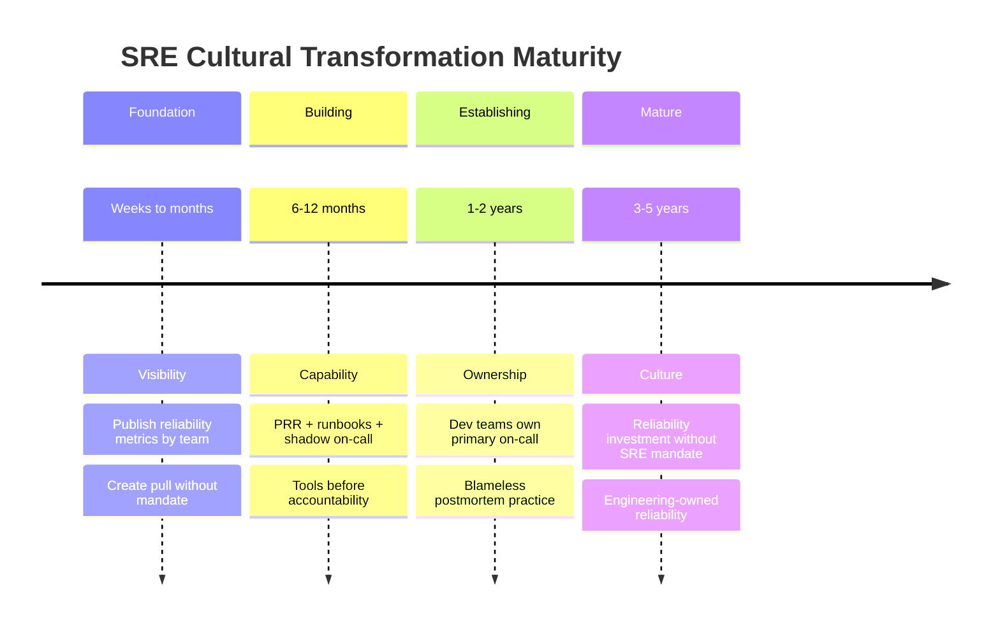

## Keywords in This File

{: .no_toc }

| #   | Keyword | Weight |
| --- | ------- | ------ |
| 1   | [SRE Interview Thinking Patterns](#sre-interview-thinking-patterns) | foundational |
| 2   | [Error Budget Negotiation and Stakeholder Management](#error-budget-negotiation-and-stakeholder-management) | foundational |
| 3   | [SRE Cultural Transformation](#sre-cultural-transformation) | foundational |

---

# SRE Interview Thinking Patterns

🎯 Interview Weight: foundational - the meta-skill that differentiates
candidates who can answer individual SRE questions from those who think
like SREs; demonstrating these patterns in every answer signals genuine
SRE maturity.

---

### 🎯 Model Answer

**30 seconds:**
> SRE thinking starts with: "What is the failure mode?" For any design
> question, the SRE asks how it fails before asking how it works. The
> second pattern: quantify before you qualify. "The service was slow"
> becomes "the p99 latency exceeded 500ms for 15 minutes, consuming 8%
> of the monthly error budget." The third: systems-first attribution.
> When something goes wrong, the SRE asks "what in the system made this
> possible?" before asking "who did this?"

**3 minutes:**
> The SRE interview mindset is measurable: every problem has a metric.
> Not "the service is reliable" but "the service has maintained 99.94%
> availability over the last 90 days with MTTR < 20 minutes." Not
> "we're working on reliability" but "we've reduced the burn rate from
> 8x to 1.5x over the last 6 weeks." Candidates who quantify
> demonstrate credibility; candidates who speak in adjectives raise doubt.
>
> The second pattern is proportionate response. SRE does not prescribe
> the same solution to every problem. A service with 99% availability
> and 4 engineers on-call needs different advice than a service with
> 99.9% availability and 1 engineer sharing on-call with 4 other services.
> Effective SRE interview answers include the context that determines
> the recommendation: team size, service tier, error budget state,
> organizational maturity.
>
> The third pattern is learning orientation. Every failure is an input
> to the system that produced it. The blameless mindset asks "what does
> this failure tell us about our system?" not "who is responsible?" This
> orientation is observable in how you describe past incidents: do you
> focus on what was learned and what changed, or on what went wrong and
> who was involved?

**Blank Mind Recovery:**

**(1) Restate:** "You are asking about SRE thinking patterns - the
mental models that shape how SREs approach problems."

**(2) First principles:** "SRE is an engineering approach to operations.
Engineering implies: measurement, modeling, and systematic improvement.
The thinking patterns that follow from this are: quantify, model the
failure, and apply proportionate solutions."

**(3) Bridge:** "SRE thinking is like a doctor's diagnostic reasoning:
before treating, measure (symptoms, vitals). Before diagnosing, model
(what could produce these measurements). Before prescribing, assess
proportionality (this patient's situation determines the treatment,
not a one-size-fits-all protocol)."

---

### 📘 Concept Explanation

**What it is:**
SRE interview thinking patterns are the mental models and reasoning
habits that trained SREs apply across all problem types. Demonstrating
these patterns transforms interview answers from technical recitations
into evidence of SRE capability.

**The five SRE thinking patterns:**

```
PATTERN 1: QUANTIFY BY DEFAULT
  BAD: "The service was slow."
  GOOD: "p99 latency was 850ms vs. SLO of 200ms. This consumed
    7% of our monthly error budget in 2 hours - a burn rate of
    14x. The SLO window showed 99.87% availability for the day."

  Apply to: every incident description, every recommendation,
    every "we improved X" claim. Numbers are credibility.

PATTERN 2: FAILURE-FIRST DESIGN
  BAD: "We built a canary deployment system."
  GOOD: "We needed canary deployment because each deploy was
    consuming 2-5% of our error budget. With 20 deploys/month,
    deployments alone were consuming 40-100% of the budget.
    Canary reduced per-deploy budget consumption by 90% because
    we were rolling back before the degradation reached 100% of users."

  Apply to: every design explanation. Start with the failure mode
    the solution addresses. End with the failure modes the solution
    does NOT address.

PATTERN 3: PROPORTIONATE RESPONSE
  BAD: "You should implement circuit breakers for every service."
  GOOD: "For a Tier 1 service with a 99.9% SLO and a dependency
    that has 99.5% availability, the math requires a circuit
    breaker: without it, the dependency failure cascades and
    consumes the budget in hours. For a Tier 3 internal service,
    the overhead of circuit breaker configuration outweighs the
    benefit. Context determines the recommendation."

  Apply to: every recommendation. Tier, SLO, team size,
    org maturity, and budget state all modify the answer.

PATTERN 4: SYSTEMS ATTRIBUTION
  BAD: "The engineer deployed a bad configuration."
  GOOD: "The system did not validate the configuration before
    applying it. The engineer triggered an expected human error;
    the system should have prevented the consequence. Action items
    target the system gap: add config validation to CI/CD."

  Apply to: every incident description, every postmortem summary.
    People make errors; systems should prevent their consequences.

PATTERN 5: LEARNING ORIENTATION
  BAD: "We had an outage last month. We fixed it."
  GOOD: "We had an outage last month. It taught us that our
    circuit breaker was not configured for the payment dependency,
    and that our runbook for auth failures was 18 months out of
    date. We updated both. Three months later, a similar payment
    dependency failure caused no user-visible impact."

  Apply to: every "tell me about a failure" question. The learning
    is the story, not the failure.
```

---

### 💻 Code Example

*(Omit: META Patterns are conceptual frameworks, not code-implementable.)*

---

### 🎓 Answers by Seniority

**Junior / Mid:**
> The most useful SRE thinking pattern for interviews: quantify everything.
> Replace adjectives with numbers. "The service improved significantly"
> becomes "MTTR went from 45 minutes to 12 minutes, a 73% improvement.
> This reduced error budget consumption from 4% per incident to 1%."
> Numbers replace vagueness with credibility.

---

**Senior / Staff:**
> The pattern I apply most in senior interviews: failure-first design.
> When I describe any system I built, I start with the failure it was
> built to address: "The problem was X, which manifested as Y in production.
> The design addresses this by Z. It does NOT address Q, which would require
> a separate investment." This framing signals: I built this because I
> understood the failure mode, not because it was a best practice I copied.

---

### ⚠️ Common Misconceptions

| Misconception | Reality |
|---|---|
| Quantification means having exact numbers | Rough estimates with stated confidence are better than vague adjectives; "approximately 15% error budget consumed" is better than "a significant portion" |
| Systems attribution means no accountability | Systems attribution determines what to fix (the system gap); accountability determines who addresses it; both exist in the blameless model |
| Proportionate response means ignoring best practices | Best practices are defaults; the proportionate response question is "does this default apply to this specific context?" |

---

### 🚨 Failure Modes and Diagnosis

**Failure 1: Quantitative claims without data**

*Symptom:* In an interview, you say "we reduced MTTR by 50%" but when
asked "how did you measure that?" you cannot answer. The interviewer
loses confidence in all your quantitative claims.

*Prevention:* Only quantify what you measured. If you did not measure
it, say "I estimated roughly X based on Y." The qualification preserves
credibility; an unsupported specific number destroys it.

---

### 🎯 Interview Deep-Dive

| Preparation | Target |
|---|---|
| Time to prep | 10 minutes |
| Core themes | Five SRE thinking patterns |
| Seniority signal | Junior: identifies the patterns; Senior: applies them in every answer without prompting |

---

**Q1 [MID]: How do you approach answering SRE interview questions?**

I apply five patterns to every answer: (1) Quantify: replace adjectives
with numbers - availability percentage, MTTR in minutes, error budget
burn rate. (2) Failure-first: when describing a design, start with the
failure mode it addresses. (3) Proportionate: tailor the recommendation
to the context - service tier, team size, org maturity. (4) Systems
attribution: when describing incidents, ask what in the system made the
failure possible. (5) Learning orientation: describe what the failure
taught you and what changed as a result.

These patterns are not interview techniques - they are how I think
about reliability engineering day-to-day. In interviews, I try to make
the underlying reasoning visible by narrating the pattern I'm applying.

*What separates good from great:* States the five patterns explicitly
and frames them as daily reasoning habits, not interview performance.

---

**Q2 [SENIOR]: How do you demonstrate SRE thinking in a behavioral
interview question?**

For "tell me about a time when..." questions, the SRE thinking patterns
provide structure beyond STAR:

Situation: add the quantitative context. Not "the service was unreliable"
but "the service had 99.3% availability with MTTR of 45 minutes, consuming
7% of its error budget per incident."

Task: add the failure-first framing. Not "I needed to improve reliability"
but "The failure mode was X, which produced the 99.3% availability. My
task was to address that specific failure mode."

Action: add the proportionate response. Not "I implemented best practices"
but "Given the service was Tier 1 with an external SLA, I chose to invest
in X over Y because the error budget math showed X would have 3x more
impact."

Result: add the learning. Not "we improved" but "availability improved
to 99.87% and MTTR to 12 minutes. More importantly, the postmortem
process we built has now been applied to 5 similar incidents, each
with < 15 minute MTTR."

*What separates good from great:* Shows how the five patterns map onto
the STAR structure, adding quantification, failure framing, and proportionality.

---

**Q3 [SENIOR]: BEHAVIORAL: Describe a time when quantitative thinking
changed your approach to a reliability problem.**

**Situation:** The team believed the primary reliability problem was
"too many deployments." The instinct was to reduce deployment frequency.

**Quantitative investigation:** Analyzed 6 months of incidents. Deployments
caused 35% of budget consumption. But the distribution was highly skewed:
3 of the 40 services caused 90% of the deployment-caused incidents.
The other 37 services had near-zero deployment incident rates.

**Insight from the data:** The problem was not deployment frequency -
it was 3 specific services with poor deployment safety (no canary,
no automated rollback). Reducing deployment frequency for all 40 services
would slow the entire team while solving only 10% of the problem.

**Action:** Targeted deployment safety investment on the 3 problematic
services. Canary deployment + automated rollback took 3 weeks for each.

**Result:** Deployment-caused budget consumption dropped 85%. Overall
deployment frequency unchanged. The quantitative analysis prevented
a broad policy change that would have harmed 37 teams to address
a concentrated problem in 3.

*What separates good from great:* The number - 3 services causing
90% of incidents - is the crux. Without quantification, the solution
would have been a broad (and wrong) policy. With quantification, the
solution was targeted and proportionate.

---

**Q4 [STAFF]: How do you handle an interviewer who pushes back on
your SRE recommendation with "but that's not how we do it here"?**

I treat pushback as information. "That's not how we do it here" means
either: (1) my recommendation is wrong for their specific context,
(2) there is an organizational constraint I don't know about, or
(3) the interviewer is testing how I handle disagreement.

For (1) and (2): I ask questions. "What does the current approach look
like? What are the constraints I should be aware of?" I update my
recommendation based on the new context. Proportionate response requires
contextual information; I should be updating when I get it.

For (3): I maintain my recommendation with humility. "I understand the
current approach is different. Based on the failure mode I described -
[specific quantitative description] - my recommendation is still X
because [specific reasoning]. I'd want to understand more about the
constraints before fully abandoning it, but I'm open to being convinced."

I never abandon a quantitative recommendation under pushback alone.
"We don't do it that way" is not a counter-argument; it is a starting
point for a conversation. If the interviewer can provide data or constraints
that change the calculus, I update. If they cannot, I respectfully
maintain the recommendation while acknowledging the organizational
difference.

*What separates good from great:* Distinguishes the three types of
pushback and gives different responses for each, including maintaining
the quantitative recommendation under non-data-based pushback.

---

**Q5 [STAFF]: How do you balance SRE rigor with organizational pragmatism?**

SRE rigor applied without organizational awareness becomes dogmatism:
"you must have canary deployment for every service" when the team
has 2 engineers and 30 services is technically correct but practically
impossible. Pragmatism without rigor produces reliability theater.

The balance I apply: lead with the principle (canary deployment prevents
deploy-caused incidents), quantify the current cost of not having it
(X% of error budget per deploy), and propose a pragmatic implementation
(start with the 3 highest-risk services, implement lightweight canary
using existing tooling, expand over 2 quarters).

The ordering matters: principle first establishes why it matters. The
quantification creates urgency without urgency theater. The pragmatic
path addresses the organizational constraint. This sequence produces
better outcomes than either "you must do this by next week" or "you're
right, it's too complicated, never mind."

The signal I watch for: organizations where pragmatism always wins
("we'll do it later, we have feature work") are accumulating reliability
debt that will eventually force an emergency investment. Part of SRE's
role is to make the debt visible and propose a payment schedule before
the debt becomes a crisis.

*What separates good from great:* Gives the specific ordering (principle ->
quantify -> pragmatic path), explains why the ordering matters, and
identifies the "pragmatism always wins" anti-pattern as a debt accumulation
signal.

---

**Q6 [STAFF]: What are the questions every SRE should be able to
answer about any service they support?**

The seven questions every SRE should be able to answer:

1. "What does this service do?" - 30-second summary of the user-visible
   behavior and the critical downstream services it depends on.

2. "What is the SLO?" - specific SLI metric, target percentage,
   measurement window.

3. "How full is the error budget?" - current budget remaining percentage
   and current burn rate.

4. "What is the on-call process?" - who is the primary on-call, what
   is the escalation path, where is the runbook.

5. "What are the top failure modes?" - the 3 most common ways this service
   fails, the expected symptoms, and the first diagnostic steps for each.

6. "What changed recently?" - last 5 deployments with dates, any
   configuration changes, dependency updates.

7. "What is the recovery procedure?" - the manual intervention steps
   required to restore service for each top failure mode.

A service where the on-call engineer cannot answer these 7 questions
in 5 minutes is under-documented and will produce high MTTR incidents.
The PRR process ensures new services answer all 7 before launch. Runbooks
and service documentation ensure the answers remain current.

*What separates good from great:* Gives all seven questions with specific
(not vague) descriptions, and frames the inability to answer them as
a measurable risk indicator (high MTTR prediction).

---

**Q7 [STAFF]: How do you prepare for a Staff SRE interview?**

A Staff SRE interview evaluates system-level thinking, organizational
design, and technical depth simultaneously. Preparation:

Technical depth - pick 3 areas where you have the deepest experience
and prepare to go to 5 levels of depth on each. Not "I know Prometheus"
but "I can explain the TSDB block format, why it matters for query
performance, what cardinality limits mean mathematically, how federation
scales it, and what happens to query performance at 10M active series."

Organizational design - prepare 2-3 examples of SRE programs you have
designed or significantly contributed to: the initial state, the problem,
the solution architecture, the organizational change required, and the
measured outcome. Staff interviews are as much about organizational
impact as technical solutions.

Failure stories - prepare 3 incident stories where you were the diagnostic
lead or the decision-maker under pressure. Include the quantitative context,
the diagnostic process, the decision points, and what you would do
differently. The learning orientation matters at Staff level.

Quantitative fluency - be able to calculate availability from MTBF/MTTR,
burn rate from error rate and SLO target, and latency from Little's Law
for any scenario the interviewer introduces. These calculations should
be fluent (< 30 seconds with rough mental math), not labored.

*What separates good from great:* Specifies depth (5 levels for 3 technical
areas), includes organizational design preparation, and identifies
quantitative fluency as a distinct preparation area.

---

### ⚖️ Comparison Table

| Pattern | BAD signal | GOOD signal |
|---|---|---|
| Quantify by default | "The service was much better after the fix" | "MTTR improved from 45 minutes to 12 minutes, a 73% reduction" |
| Failure-first design | "I built canary deployment for the payment service" | "Payment deploys were consuming 5% of error budget each. I built canary to catch post-deploy degradation at 10% traffic before it affected all users" |
| Proportionate response | "Every service should have a circuit breaker" | "Tier 1 services with external SLAs need circuit breakers; Tier 3 services' overhead cost exceeds the benefit" |
| Systems attribution | "The engineer deployed a bad config" | "The CI/CD pipeline allowed an invalid config through; action item: add schema validation" |
| Learning orientation | "We had an outage and fixed it" | "The outage revealed our runbook was outdated; we updated it and ran 2 game day exercises; MTTR for similar incidents dropped 60%" |

---

### 🏛️ System Design

*(Omit: META Patterns are reasoning frameworks, not system designs.)*

---

### 📊 Diagram

*(Omit: META Patterns are represented in text structure rather than
visually.)*

---

### Field Q&A

**Candidate Mistakes:**

1. "The most important thing in SRE is having good monitoring."

   **What NOT to say:** Any single-factor answer.

   **Say instead:** "Monitoring is a necessary but not sufficient condition
   for reliability. The SRE thinking pattern says: what failure mode does
   monitoring address? It addresses the detection gap - incidents that
   are not detected for minutes to hours after they start. But monitoring
   does not reduce MTBF (it does not prevent failures), and it only
   partially reduces MTTR (it reduces detection time but not diagnosis
   or fix time). A complete reliability approach addresses the full
   MTTR chain: detection (monitoring), diagnosis (runbooks + tracing),
   fix (canary rollback), and prevention (testing, architecture)."

---

**Questions to Ask the Interviewer:**

1. "What does the SRE interview process test for at the Staff level here -
   system design, organizational design, or both?"

2. "How does the team balance quantitative rigor (SLOs, error budgets)
   with pragmatic delivery speed?"

---

---

# Error Budget Negotiation and Stakeholder Management

🎯 Interview Weight: foundational - the human dimension of SRE that
separates engineers who understand the mechanics from those who can
implement SRE in a real organization; critical for Senior and above.

---

### 🎯 Model Answer

**30 seconds:**
> Error budget negotiation is the process of getting organizational
> agreement on SLO targets and enforcement policies before they are
> needed. The key: negotiate the error budget policy with VP-level
> stakeholders in advance, not during a deployment freeze when product
> and engineering are in conflict. Stakeholder management is the ongoing
> communication that keeps the error budget visible and credible: monthly
> budget reports to product, quarterly SLO reviews with engineering
> leadership, and a clear override process that preserves policy
> credibility while providing a safety valve.

**3 minutes:**
> The error budget only works as a decision mechanism if the stakeholders
> who need to respect it - product managers, engineering managers, business
> VPs - have agreed to it in advance and understand what it means for
> their decisions. An error budget policy that engineering agreed to
> without product buy-in will be overridden the first time it matters.
>
> The negotiation framing: not "SRE is setting limits on deployments"
> but "the business is deciding how much unreliability to accept and
> what to prioritize when reliability is at risk." This framing gives
> the business stakeholder the decision-making power they need to accept
> the policy - because it is their decision, not SRE's imposition.
>
> Ongoing stakeholder management: the error budget is only effective
> if stakeholders see it regularly. A monthly one-page budget report
> (which services are in budget, which are at risk, which are burned)
> keeps the budget visible before it becomes a crisis. Stakeholders who
> learn about the budget state only when a deployment is being blocked
> will perceive the block as a surprise. Stakeholders who receive monthly
> budget updates will see the deployment freeze as an expected consequence
> of a trend they have been watching.

**Blank Mind Recovery:**

**(1) Restate:** "You are asking about error budget negotiation and
stakeholder management - the organizational process of getting agreement
on SLO targets and keeping stakeholders engaged with budget status."

**(2) First principles:** "The error budget is a shared business decision:
how much unreliability will we tolerate? This is not an engineering
decision alone. Getting the business to make this decision explicitly
is the negotiation; keeping them informed of the consequences is the
management."

**(3) Bridge:** "Error budget negotiation is like a home renovation
budget: the contractor (SRE) cannot decide how much to spend; the owner
(product/business) decides the budget. The contractor implements within
the budget and flags when decisions are pushing against it. The framing -
owner decides, contractor implements - is what makes the conversation
productive."

---

### 📘 Concept Explanation

**What it is:**
Error budget negotiation is the process of aligning SLO targets, error
budget policies, and enforcement mechanisms with business stakeholders.
Stakeholder management is the ongoing communication practice that keeps
the error budget visible, credible, and respected as a decision tool.

**The stakeholder landscape:**

```
STAKEHOLDER LANDSCAPE FOR ERROR BUDGET
=========================================

Engineering VP:
  Interest: engineering team's ability to deploy and ship
  Concern: deployment freezes blocking feature work
  SRE message: "The policy protects the team from emergency
    incidents caused by deploying with low budget. The policy
    was agreed at your level to avoid in-the-moment conflicts."
  Meeting cadence: quarterly SLO review

Product VP:
  Interest: feature velocity and customer commitments
  Concern: reliability blocks slowing product roadmap
  SRE message: "When the budget is consumed, the business
    has already accepted more unreliability than it agreed to.
    Continuing to deploy risks more customer-visible failures
    on top of existing ones."
  Meeting cadence: monthly budget report

Product Manager:
  Interest: sprint commitments and launch timelines
  Concern: individual launch being blocked
  SRE message: "Your service's budget is at X% remaining.
    At the current burn rate, it will be at the enforcement
    threshold in N days. Here is what you can do: [specific
    options with trade-offs]."
  Communication: budget status in launch planning

Engineering Manager:
  Interest: team reliability and on-call health
  Concern: on-call burden from reliability incidents
  SRE message: "The budget consumption rate correlates
    with on-call interrupt frequency. Investing reliability
    work into the next sprint will reduce on-call burden
    for the team this quarter."
  Meeting cadence: monthly 1:1

NEGOTIATION TIMING AND SEQUENCE
  Pre-agreement (before any budget is consumed):
    Step 1: Present the error budget concept to Eng VP and
      Product VP jointly. Use the reliability-feature trade-off
      framing: "When the budget is consumed, what should we do?"
    Step 2: Draft the policy with the three thresholds and
      their enforcement actions. Include the VP override path.
    Step 3: Get explicit sign-off from both VPs. This is the
      policy agreement meeting.
    Step 4: Encode the policy in CI/CD. Announce to all teams.

  In-flight management (after policy is active):
    Monthly: budget status report to product VP and product
      managers for Tier 1 services
    Quarterly: SLO review with engineering leadership
    On budget alert: immediate notification to product manager
      and engineering manager with specific options
    On enforcement trigger: deployment block with policy
      reference and override form link
```

---

### 💻 Code Example

*(Omit: Stakeholder management is a communication process, not a code-
implementable pattern.)*

---

### 🎓 Answers by Seniority

**Junior / Mid:**
> Getting product managers to support the error budget policy requires
> making the policy's benefit visible: "When the budget is consumed and
> we keep deploying, we risk P1 incidents during your most important
> releases. The deployment pause during low budget is the cheap option
> compared to a payment failure on launch day." The business case for
> reliability protection must be made in business terms, not technical ones.

---

**Senior / Staff:**
> The hardest part of error budget negotiation is the timing: you must
> get agreement on the policy when there is no active deployment freeze
> and no budget crisis. Once a freeze is triggered, you are negotiating
> under pressure and the policy will be modified to release the freeze.
> The policy agreed under pressure is always more permissive than the
> policy agreed in advance. The SRE's job: get the pre-agreement,
> document it, encode it in the pipeline, and never negotiate the policy
> during a freeze. The policy should say: "to modify the thresholds,
> schedule a policy review meeting - not a same-day conversation."

---

### ⚠️ Common Misconceptions

| Misconception | Reality |
|---|---|
| Error budget negotiation is a one-time event | It is an ongoing relationship; SLOs must be reviewed quarterly and the policy must be re-negotiated when the business context changes |
| Product managers are adversaries of reliability | Product managers want their products to be reliable; they resist reliability work that slows features without visible benefit. SRE's job is to make the reliability benefit visible and quantified |
| The error budget policy is SRE's decision | The policy is a joint business decision that SRE facilitates; SRE provides the framework and the data, the business makes the call on thresholds |

---

### 🚨 Failure Modes and Diagnosis

**Failure 1: Budget policy negotiated with engineering but not product**

*Symptom:* The engineering VP agreed to the error budget policy. First
deployment freeze: the product VP had never heard of it and overrode it
immediately. The policy is permanently ineffective.

*Root cause:* The negotiation was incomplete. The error budget affects
product velocity; the product VP must be a party to the agreement.

*Fix:* Re-run the policy negotiation as a joint engineering/product
working session. Document the joint agreement. Both VP signatures on
the policy document. The "VP override" path in the policy requires
sign-off from both VPs (engineering and product), not either one
independently.

---

### 🎯 Interview Deep-Dive

| Preparation | Target |
|---|---|
| Time to prep | 10 minutes |
| Core themes | Pre-negotiation timing, framing the budget as a business decision, ongoing communication cadence |
| Seniority signal | Junior: describes the policy; Senior: describes the pre-agreement process and the framing that makes it work |

---

**Q1 [MID]: How do you explain the error budget to a non-technical
product manager?**

I use the downtime-minutes translation. "The error budget is the amount
of unreliability your product can have in a month before it breaches
its customer commitments. For a 99.9% availability SLO, that is 44
minutes of downtime per month. When those 44 minutes are consumed, any
further deployment that causes even a 1-minute outage pushes us past
the commitment."

Then I make the budget concrete for the current state: "Your service
is at 15% budget remaining. That means we have 6.6 minutes of downtime
left this month before the SLO is violated. The burn rate alert fired
because we are consuming budget faster than sustainable."

Finally, I present options - not a lecture: "Option 1: pause non-critical
deployments this week to let the budget recover naturally. Option 2:
complete the investigation into what is consuming the budget and fix
it. Option 3: accept the risk of a potential SLO violation and continue
deploying. You decide - here is the trade-off for each option."

The product manager's job is to decide business trade-offs. Present the
trade-offs; let them decide.

*What separates good from great:* Uses minutes (not percentages) for
the initial translation, presents specific numbers for the current state,
and gives options rather than a directive.

---

**Q2 [SENIOR]: BEHAVIORAL: Describe negotiating an error budget policy
that initially received pushback.**

**Situation:** Presented the error budget policy to the engineering VP
and received immediate pushback: "This will slow down our team. We can't
have engineering blocked by a policy."

**Reframe:** "The policy does not block engineering. It changes what
engineering works on. When the budget is consumed, engineers shift
from feature work to reliability work - which directly benefits their
on-call. The policy is about how we use engineering capacity, not
whether we can use it."

**The VP's concern:** "But what if we have a critical feature launch?"

**Response:** "The override path handles that. Any deployment can proceed
with VP sign-off and a documented business justification. The policy
is not a hard stop - it is a friction point that requires a deliberate
decision. This prevents accidental deployments during low budget, while
allowing intentional ones when the business requires it."

**Working session outcome:** The VP requested a 90-day pilot: implement
the policy, track every deployment decision (blocked, proceeded, overridden),
and review the data at 90 days. Result: 4 deployments blocked (budget
< 20%), all 4 were non-critical and rescheduled without impact. Zero
overrides requested. The pilot data made the permanent adoption easy.

*What separates good from great:* The pilot proposal converts a policy
debate into a data-gathering exercise. The 90-day data is undeniable:
4 blocks, 0 business impact. The policy was permanently adopted based
on evidence, not persuasion.

---

**Q3 [SENIOR]: How do you communicate a budget enforcement event
to a product manager?**

Communication must be: (1) factual, (2) non-accusatory, (3) action-
oriented, and (4) timely.

Factual: "The [service name] error budget is at [X%] remaining. The
CI/CD pipeline has blocked the [feature name] deployment per the error
budget policy agreed on [date]. The policy triggers at < 20% budget."

Non-accusatory: do not imply the product manager should have known or
should have prevented this. They receive monthly budget reports; if they
read them, they already know. If they did not, that is a communication
improvement opportunity, not a blame opportunity.

Action-oriented: "You have three options: [Option 1 - pause and wait
for budget recovery: timeline and risk]. [Option 2 - investigate and
fix the active budget consumption: engineering cost and timeline].
[Option 3 - VP override: link to the override form, SLA for VP response]."

Timely: communicate immediately when the block triggers, not after the
product manager has already noticed the deployment failed. The first
notification should come from SRE, not from the product manager's
discovery that the pipeline is red.

Template: a pre-written communication template for budget enforcement
events removes the cognitive load during the stressful moment of
enforcement. The template ensures all four components are present.

*What separates good from great:* Names all four components, gives the
specific template structure, and emphasizes timeliness (SRE notifies
before the product manager discovers the block).

---

**Q4 [STAFF]: How do you build long-term credibility for the SRE
function with business stakeholders?**

SRE credibility with business stakeholders is built on three dimensions:

Prediction accuracy: when SRE says "this service will breach its SLO
in 3 weeks at the current burn rate," and it does, credibility increases.
When SRE says "the deployment freeze will allow budget recovery in 10
days," and it does, credibility increases. Make specific predictions
with specific data; validate them when the outcome is known.

Business language fluency: SRE recommendations framed as "MTTR reduction
from 45 to 12 minutes" land with engineers. Framed as "risk of SLA credits
in Q3 reduced from 35% probability to under 5% by the same investment"
- that lands with business VPs. Translating between technical metrics
and business outcomes is a core SRE credibility skill.

Responsiveness under pressure: when a P1 hits, the business stakeholders
watch whether SRE responds quickly, communicates clearly, and recovers
the service. The incident is a credibility moment that accumulates over
time. An SRE team that handles P1s with clear communication and fast
recovery builds trust faster than any governance document.

*What separates good from great:* Names all three dimensions (prediction
accuracy, business language, incident responsiveness), gives specific
translation examples for business language, and frames incidents as
trust-building moments.

---

**Q5 [STAFF]: How do you handle a VP who regularly overrides the
error budget policy?**

Regular VP overrides indicate one of three problems: (1) the policy
thresholds are wrong (SLO is aspirational, causing budget to always
be exhausted), (2) the VP does not believe the enforcement rationale,
or (3) the VP does not have visibility into the cost of their overrides.

For (1): present the data. If the budget is exhausted by week 2 every
month, the SLO target is aspirational. Reset the SLO to the achievable
baseline with a roadmap to improve. Once the budget is achievable, regular
overrides will decline naturally.

For (2): schedule a 30-minute data review with the VP. Show the correlation
between override deployments and subsequent budget consumption and
incidents. "These 5 override deployments in Q2 were followed by 3 P2
incidents that consumed 40% of budget. Here is the causal chain."
Data changes minds; argument rarely does.

For (3): add a cost-of-override report to the monthly budget communication.
For each override: "Override on [date] - [feature] deployed at 8% budget.
Subsequent incident consumed 15% budget. Net cost: 18-minute MTTR incident
equivalent to $X in engineering cost and $Y in customer-visible downtime."

If none of the three approaches works, the error budget policy is not
actually organizational policy - it is SRE policy that the business
has not agreed to. The fix: escalate to both VPs jointly to either
re-agree the policy with appropriate thresholds or explicitly retire it.

*What separates good from great:* Diagnoses three specific root causes,
gives a different response for each, and identifies the "policy the
business hasn't actually agreed to" meta-diagnosis as the deepest failure.

---

**Q6 [STAFF]: BEHAVIORAL: Tell me about building a reliability program
that required sustained organizational change.**

**Situation:** Joined an organization where "reliability" was the operations
team's job. The 3-person operations team was handling all production
incidents for 12 development teams. The operations team was burned out;
MTTR was 4+ hours; the development teams had no visibility into or
accountability for their services' reliability.

**Year 1 - visibility:** Published weekly reliability metrics by team:
MTTR, incident count, error budget status. Made the metrics visible in
the engineering all-hands. Within 2 months, 3 development team leads
asked what they could do to improve their team's metrics. Visibility
created pull without mandate.

**Year 1 - quick wins:** Worked with the 3 requesting team leads to
implement basic runbooks and alerts for their top 3 failure modes. MTTR
for those teams improved from 4+ hours to 45 minutes. Published the
improvement as a case study in the engineering newsletter.

**Year 2 - error budget policy:** With demonstrated value from 3 teams,
proposed the error budget policy to engineering and product VPs. The
case study data (3 teams, 10x MTTR improvement with 1 week of investment)
made the VP conversation easy. Policy agreed. Expanded to all Tier 1 services.

**Year 2 - on-call transfer:** As teams developed reliability capability
(runbooks, alerts, postmortem practice), transferred primary on-call
ownership from operations to the development teams. Operations became
Tier 2 escalation. The operations team's page volume dropped 70%.

**3-year outcome:**
- Operations team MTTR: 4+ hours -> 18 minutes
- Incident pages to operations team: down 70%
- 12 of 12 development teams have own reliability ownership
- Company presented the transformation at SREcon

*What separates good from great:* The visibility-first approach (publish
metrics before mandating change) is the organizational change insight.
The case study ("3 teams improved X with investment Y") is the VP
conversation enabler. The 3-year timeline acknowledges this is organizational
transformation, not a quarterly initiative.

---

**Q7 [STAFF]: How do you present the ROI of SRE to a business
executive who is skeptical?**

The skeptical executive has seen "reliability initiatives" before that
consumed engineering time without visible business benefit. The ROI
case must be concrete, business-metric focused, and honest about uncertainty.

The ROI framework:

Cost of current state: calculate the business cost of the current
reliability profile. For each service: (downtime per year in hours)
* (revenue per hour) + (P1 engineering hours per year) * (engineer
cost per hour) + (SLA credit exposure per year). This is the annual
reliability cost.

Cost of SRE investment: engineer-months of SRE investment * blended
rate. For the first year, typically 2-4 engineer-months to establish
the program.

Expected benefit: estimate the improvement from the SRE investment
(conservative: 30-50% improvement in MTTR, 20-30% reduction in
incident frequency based on industry benchmarks and similar case studies).
Apply to the current state cost: expected annual reliability cost savings.

ROI = (annual savings - annual investment cost) / annual investment cost.

Honest caveat: the estimates are based on benchmarks; actual results
depend on execution quality. Propose a 90-day pilot with one service:
measure the before/after MTTR and incident rate, calculate the actual
ROI for that service, and use the real data for the broader investment
decision.

The executive response to honest uncertainty + a measurable pilot is
almost always positive. Executives who have seen over-promised reliability
programs appreciate the data-first approach.

*What separates good from great:* Gives the three-component cost
calculation (downtime revenue, engineering cost, SLA exposure), is
explicit about the estimation uncertainty, and proposes the pilot as
the de-risking mechanism.

---

### ⚖️ Comparison Table

| Stakeholder | Primary Concern | SRE Message | Meeting Cadence |
|---|---|---|---|
| Engineering VP | Team shipping velocity | Policy prevents incident-caused disruptions that are worse than planned pauses | Quarterly SLO review |
| Product VP | Feature roadmap and customer commitments | Budget consumption is a signal that customer reliability is already at risk | Monthly budget report |
| Engineering Manager | On-call team health | Budget consumption correlates with on-call burden; reliability investment reduces interrupt load | Monthly 1:1 |
| Product Manager | Sprint commitments | Budget status and specific options - you decide the trade-off | On-demand + budget alerts |

---

### 🏛️ System Design

*(Omit: stakeholder management is a communication and organizational
process, not a system architecture.)*

---

### 📊 Diagram

*(Omit: the stakeholder communication patterns are represented in
the Concept Explanation table above.)*

---

### Field Q&A

**Candidate Mistakes:**

1. "I would enforce the error budget policy even if product management
   disagrees."

   **Say instead:** "Enforcing the policy unilaterally without product
   agreement creates an adversarial dynamic where SRE becomes 'the team
   that blocks deployments.' The policy must be agreed in advance by
   both product and engineering leadership. Once agreed, enforcement is
   not SRE enforcing it - it is the pipeline enforcing a joint business
   decision. SRE's role in enforcement is to explain the policy and present
   the override path, not to be the decision-maker."

---

**Questions to Ask the Interviewer:**

1. "Has the error budget policy been discussed with product leadership
   here? Is there joint agreement on enforcement?"

2. "How are reliability metrics communicated to product managers and
   business stakeholders? Do they see the error budget regularly?"

---

---

# SRE Cultural Transformation

🎯 Interview Weight: foundational - the organizational change perspective
that Staff+ candidates need to demonstrate; shows ability to implement
SRE beyond technical tooling into sustainable organizational practice.

---

### 🎯 Model Answer

**30 seconds:**
> SRE cultural transformation changes an organization from "operations
> team is responsible for uptime" to "development teams own the reliability
> of what they build." The transformation requires: visibility (reliability
> metrics by team), accountability (you build it, you run it), tools
> (the platform that enables teams to operate reliably), and psychological
> safety (blameless postmortem culture that makes it safe to report failures).
> The order matters: tools before accountability; visibility before mandate.

**3 minutes:**
> The three failure modes of SRE cultural transformation:
> First: accountability without tools. "You now own your on-call" before
> the team has runbooks, dashboards, or an escalation path. The team
> is set up to fail; trust in SRE is destroyed.
>
> Second: tools without accountability. The platform is built but
> development teams still escalate everything to SRE. The investment
> in platform is not leveraged because the cultural change did not happen.
>
> Third: cultural mandate without visibility. "You are responsible for
> reliability" when teams cannot see their own reliability metrics. Teams
> cannot improve what they cannot measure.
>
> The right sequence: build the platform (tools), publish the metrics
> (visibility), develop capability (training + shadowing), transfer
> ownership (accountability). Only when the first three are in place
> does accountability work as a motivator rather than a burden.

**Blank Mind Recovery:**

**(1) Restate:** "You are asking about SRE cultural transformation -
the organizational change that makes reliability a shared ownership
across development and operations teams."

**(2) First principles:** "Culture is the sum of what behavior is
incentivized, what is measured, and what is safe to say and do. To
change reliability culture: change the incentives (accountability for
own on-call), change the measurements (reliability metrics visible by
team), and change the safety (blameless postmortems)."

**(3) Bridge:** "SRE cultural transformation is like teaching a team
to drive. You do not hand them the keys and mandate driving without
lessons (tools before accountability). You do not give them lessons
without requiring them to drive (tools without accountability). You give
lessons, supervise practice, and gradually hand over control."

---

### 📘 Concept Explanation

**What it is:**
SRE cultural transformation is the organizational change process that
moves an organization from centralized operations ownership (operations
team responsible for uptime) to distributed reliability ownership
(development teams responsible for the services they build, enabled
by the SRE platform and governance).

**The transformation pillars:**

```
FOUR PILLARS OF SRE CULTURAL TRANSFORMATION
=============================================

PILLAR 1: VISIBILITY
  What: reliability metrics by team, visible to all
  How: publish monthly reliability scorecard
    (MTTR, incident count, error budget status per team)
  Why first: you cannot change what you cannot measure;
    visibility creates pull without mandate
  Timeline: weeks (metrics already exist, just need presentation)

PILLAR 2: CAPABILITY
  What: reliability skills in development teams
  How: training (PRR, runbooks, incident response);
    reliability champions per team;
    shadow on-call rotations with SRE
  Why second: accountability before capability is a setup for failure
  Timeline: months (skills take time to develop)

PILLAR 3: ACCOUNTABILITY
  What: "you build it, you run it" - dev teams own on-call
  How: gradually transfer primary on-call ownership
    after capability is demonstrated (PRR complete,
    runbooks in place, shadow on-call completed)
  Why third: accountability works after capability is in place;
    premature accountability destroys trust
  Timeline: 1-2 years for full organizational transition

PILLAR 4: PSYCHOLOGICAL SAFETY
  What: blameless postmortem culture where failures
    are safe to report and analyze
  How: explicit framing in every postmortem ("we are here
    to learn, not to assign blame"); leadership modeling
    (if the VP blameless postmortems their own decisions,
    engineers will believe it)
  Why concurrent: psychological safety enables the
    other pillars; without it, teams hide failures instead
    of learning from them
  Timeline: years (cultural change is slow and fragile)

CHANGE RESISTANCE PATTERNS
===========================

Pattern 1: "Operations team should handle it"
  Root cause: operations team has been doing it for years;
    development teams have no incentive to own it
  Response: make the on-call burden visible to development
    team leadership; on-call alerts that go to the development
    manager (not just the operations team) create incentive

Pattern 2: "We don't have time for reliability work"
  Root cause: reliability work is not on the sprint board;
    all sprint capacity goes to features
  Response: present the on-call interrupt cost (hours
    per week per engineer) as a reliability investment
    alternative; 4 hours/week of on-call interrupts =
    10% of sprint capacity already spent on reliability

Pattern 3: "SRE makes reliability too complicated"
  Root cause: the SRE governance overhead (PRR, SLO
    definitions, error budget tracking) appears to add
    work without visible benefit
  Response: start with the simplest reliable service
    implementation (basic alerts, basic runbook) and
    demonstrate the MTTR improvement before adding
    governance complexity

CULTURAL HEALTH INDICATORS
  Positive: development teams proactively improve runbooks
    after incidents without SRE mandate
  Positive: teams discuss error budget in sprint planning
  Positive: postmortems identify process improvements,
    not individuals
  Positive: on-call engineers ask for reliability work
    to reduce interrupt frequency
  Negative: SRE is the first call for all production issues
  Negative: postmortems focus on who rather than what
  Negative: error budget is mentioned only when the pipeline blocks
  Negative: reliability work never appears in feature-team sprints
```

---

### 💻 Code Example

*(Omit: cultural transformation is an organizational process, not
code-implementable.)*

---

### 🎓 Answers by Seniority

**Junior / Mid:**
> SRE cultural transformation means development teams start caring about
> the reliability of their own services. The mechanism: give them visibility
> into their metrics, train them on runbooks and incident response, and
> eventually transfer on-call ownership. The prerequisite for "you run it"
> is "you can run it" - capability must come before accountability.

---

**Senior / Staff:**
> The most underestimated obstacle to SRE cultural transformation is
> psychological safety. Engineers who have been blamed for incidents
> (formally or informally) will hide failures rather than report them.
> Blameless postmortem culture sounds easy to implement ("we just don't
> blame people") but is actually very fragile: one incident where a
> manager mentions an individual's name in a "lessons learned" meeting
> can set back the safety culture by 6 months. Leadership modeling is
> the only reliable mechanism: if the VP is willing to say "my decision
> to approve this deploy despite the low budget was a mistake - what
> process would have caught this?" in a public forum, engineers believe
> the blameless culture is real.

---

### ⚠️ Common Misconceptions

| Misconception | Reality |
|---|---|
| Blameless postmortem means no accountability | Blameless identifies the system gaps to fix (accountability for the fix); it does not mean everyone is equally responsible or that repeated negligence has no consequence |
| Cultural transformation can be mandated | Mandate drives compliance, not cultural change; culture changes when behaviors change because they are incentivized and demonstrated by leadership |
| SRE cultural transformation is a one-year project | The structural elements (platform, metrics, on-call transfer) may complete in 1-2 years; the cultural internalization (teams proactively investing in reliability) takes 3-5 years |

---

### 🚨 Failure Modes and Diagnosis

**Failure 1: Psychological safety destroyed by one blame incident**

*Symptom:* After 18 months of blameless postmortems, a VP publicly
names an engineer in a company all-hands as responsible for an outage.
The next postmortem produces less information than usual. Engineers begin
describing their actions as "the system behaved unexpectedly" rather
than "I made the following decision." The blameless culture regressed
in 2 weeks.

*Root cause:* The blameless culture was not sufficiently embedded in
leadership behavior.

*Fix:* The VP publicly acknowledges the mistake ("I named the engineer,
and that was incorrect - I am sorry; our culture is blameless because
blame produces less information and less improvement"). This is difficult
but necessary; without the correction, the cultural regression accelerates.
Add explicit training for VP/director-level leadership on blameless
communication.

---

### 🎯 Interview Deep-Dive

| Preparation | Target |
|---|---|
| Time to prep | 10 minutes |
| Core themes | Four transformation pillars, change resistance patterns, psychological safety |
| Seniority signal | Junior: describes the "you build it you run it" principle; Senior: explains the four pillars and the sequencing rationale |

---

**Q1 [MID]: What does "you build it, you run it" mean in SRE context?**

"You build it, you run it" means the team that develops a service is
also responsible for its production operations, including on-call. This
is in contrast to the traditional model where a separate operations team
maintains all production systems regardless of which team built them.

The reliability benefit: engineers who are on-call for their own services
experience the operational consequences of their design decisions. An
engineer paged at 3 AM because a missing circuit breaker caused a cascade
failure will never omit a circuit breaker from the next service they design.
The feedback loop is direct and immediate.

The organizational benefit: the operations team is no longer the bottleneck
for reliability improvements. The team that built the service has the
code access, context, and motivation to fix it.

The prerequisite: the development team must have the capability to
run the service reliably. This requires: observability (they can see
what is happening), runbooks (they know what to do when they see it),
and escalation paths (they know who to call when they cannot resolve it).
Transferring on-call ownership without these prerequisites is setting
the team up to fail.

*What separates good from great:* Explains the direct feedback loop
as the mechanism (paged at 3 AM for decisions made in sprint planning),
names the prerequisite (capability before accountability).

---

**Q2 [SENIOR]: BEHAVIORAL: Describe leading an SRE cultural transformation
that involved significant resistance.**

**Situation:** A 15-engineer platform team had been running production
for all 8 product teams for 3 years. The product teams had no production
access, no runbooks, and no incident response training. The platform
team was on-call 24/7 for all services.

**Initial resistance:** When I proposed transferring on-call ownership,
the platform team lead said "the product teams will just make the
incidents worse." The product team leads said "we don't have time to
deal with production."

**Strategy:** I did not argue. I proposed a 3-month pilot with one
willing product team (the payments team, which had the most incidents
and the most motivated team lead).

**Pilot execution:**
Month 1: SRE paired with payments team for 3 runbook creation sessions.
Payments team ran 2 shadow on-call rotations. Month 2: payments team
ran primary on-call with SRE as shadow. 4 incidents: payments team
resolved 3 independently, escalated 1. MTTR: 18 minutes average (was
65 minutes when platform team handled payments incidents). Month 3:
payments team owned primary on-call fully. SRE removed from rotation.
MTTR: 14 minutes.

**Data-driven expansion:** Presented the pilot results at the quarterly
engineering review. Both the platform team lead and product team leads
saw the 14-minute MTTR vs. the old 65-minute MTTR. Four teams immediately
volunteered for the next pilot cohort.

**24-month outcome:** All 8 teams running their own on-call. Platform
team redeployed to platform development (the work they actually wanted
to do). Zero team requested reverting.

*What separates good from great:* Does not force the transformation -
uses a single willing team's success to create organizational pull.
The MTTR data (14 vs. 65 minutes) is the argument. The data does the
convincing work that argument cannot.

---

**Q3 [SENIOR]: How do you implement blameless postmortem culture
in an organization where blame is the historical norm?**

Historical blame culture produces defensive behavior: engineers minimize
their role, attribute failures to "the system" without specifics, and
avoid postmortems entirely. The information quality in postmortems is
low because sharing information feels risky.

Transitioning to blameless requires:

Explicit framing at every postmortem: the facilitator opens with "we are
here to learn, not to assign blame. Every action taken was reasonable
given what the engineer knew at the time. If the action seems unreasonable
now, ask: what information was the engineer missing?" This framing must
be stated every time until it is internalized.

Vocabulary change: replace "X did Y and caused the outage" with "at step
3, the system was in state S, and the action Y was taken because of
[the information available at the time], which produced the outcome O."
This vocabulary is not natural at first; the facilitator must actively
redirect person-focused language to system-focused language.

Leadership modeling: the first time a senior leader says "my approval
of this deployment when the budget was at 8% was a contributing factor -
what process would catch this in the future?" the cultural permission
for honest participation is established. Blameless culture requires
leadership demonstrating vulnerability, not just not-blaming engineers.

Reward for disclosure: when an engineer proactively reports a near-miss
(a mistake they caught before it caused an incident), this must be
visibly rewarded ("this near-miss report by X is exactly what blameless
culture looks like - thank you"). Reward disclosure; do not just
not-punish it.

*What separates good from great:* Gives the specific vocabulary change
(step/state/action/outcome vs. person/did/caused), identifies leadership
modeling as the critical enabler (not just rule-setting), and distinguishes
rewarding disclosure from only not-punishing it.

---

**Q4 [STAFF]: How do you measure the progress of an SRE cultural
transformation?**

Cultural transformation cannot be measured directly, but its proxies
are measurable:

Behavioral metrics (most direct):
- Reliability items in product team sprint backlogs (% of teams with
  at least 1 reliability item per sprint)
- Runbook update frequency (postmortems that produce runbook updates
  without SRE mandate)
- Near-miss reporting rate (engineers proactively reporting close calls)
- Time to postmortem completion (blameless cultures complete postmortems
  faster because contributors share information freely)

Outcome metrics (lagging indicators):
- MTTR trend over 12 months (improving = capability building working)
- Error budget consumption rate (declining = reliability investment working)
- Repeat incident rate (same incident within 30 days; decreasing = RCA quality improving)
- On-call page volume (decreasing = proactive reliability investment working)

Attitude indicators (survey-based):
- "I am confident in my ability to diagnose and resolve production incidents
  for my service" (1-5 scale, quarterly pulse survey)
- "It is safe to report mistakes and near-misses in this organization"
  (1-5 scale, quarterly pulse survey)
- "Reliability work is valued by my team's leadership" (1-5 scale)

The leading indicators (behavioral) predict the lagging indicators
(outcomes). If runbook update frequency and near-miss reporting are
increasing, MTTR improvement will follow within 1-2 quarters.

*What separates good from great:* Distinguishes behavioral (leading),
outcome (lagging), and attitude (diagnostic) metric categories, gives
specific survey questions for attitude measurement, and explains the
leading-to-lagging relationship.

---

**Q5 [STAFF]: BEHAVIORAL: Describe a failed SRE cultural transformation
and what you learned from it.**

**Situation:** Implemented SRE cultural transformation at an organization
by mandate. The engineering director announced: "All teams now own their
production on-call. Starting next quarter." No pilot, no training, no
platform investment.

**What happened in the first 3 months:**
5 of 8 teams struggled. P1 MTTR averaged 3+ hours (worse than before
because the operations team was no longer available). Three teams escalated
every incident back to operations. Two team leads complained to the
director. The director asked me to "make the transformation work faster."

**What I did (ineffective):** pushed harder. Added weekly reliability
reviews per team. Required runbooks to be complete by a specific date.
Created more process. Teams felt micromanaged; resentment toward SRE
increased.

**What I should have done:**
The mandate approach was wrong from the start. The transformation should
have been: (1) start with one willing team, demonstrate success, (2)
use the success to create pull, (3) provide the platform before the
transfer, (4) transfer when capability is demonstrated.

I had skipped steps 1-3 entirely.

**Recovery approach:**
Paused the mandate. Proposed a restart: we will transfer ownership one
team at a time, only after that team's PRR is complete and they have
completed 2 shadow on-call rotations. We will not mandate a timeline.

**Outcome:** The restart took 18 months instead of the original 3-month
plan. All teams eventually transitioned. The 3-month failure cost credibility
that took 18 months to rebuild.

**What I learned:** Cultural transformation by mandate produces compliance
without capability. The only sustainable path is sequential, capability-
first, starting with willing participants.

*What separates good from great:* Describes a genuine failure (not a
"challenge that turned out fine"), identifies the specific mistake (mandate
before capability), describes the ineffective recovery attempt (pushing
harder), and states the clear lesson with a specific counter-approach.

---

**Q6 [STAFF]: How do you maintain SRE cultural transformation momentum
over 2-3 years?**

Cultural transformation over 2-3 years faces the momentum problem:
enthusiasm is high in year 1, skepticism increases in year 2 when results
are not yet dramatic, and in year 3 the "we already did this" fatigue sets in.

Momentum maintenance strategies:

Year 1: celebrate every win. First team to complete PRR: public recognition.
First postmortem that produced a systemic action item rather than individual
blame: highlight it. First time a development team resolves a P1 without
escalating to SRE: share the outcome. Early wins require active amplification.

Year 2: publish the cumulative data. 12 months of reliability improvement
data tells a story that individual wins do not. "In year 1, P1 incidents
across all teams reduced 35%, MTTR improved from 68 minutes to 31 minutes,
and on-call burden for the operations team reduced by 55%." This data
answers the "is it working?" doubt.

Year 3: institutionalize. The transformation is complete when it is no
longer an SRE initiative - it is how engineering works. Indicators of
institutionalization: new engineers are onboarded with reliability ownership
as an expectation, not an additional duty; team leads include reliability
metrics in performance conversations; product planning includes reliability
investment without SRE prompting. Year 3 success is when SRE does not
need to maintain the momentum because the organization maintains it itself.

The failure mode to prevent: letting year 2 doubt stall the transformation
into a permanent pilot. Year 2 doubt is resolved with data; the data
must be collected and presented proactively.

*What separates good from great:* Gives year-by-year strategies with
specific actions (not generic "maintain momentum" advice), identifies
institutionalization indicators (engineering ownership vs. SRE initiative),
and names the year 2 doubt as the primary risk.

---

**Q7 [STAFF]: How do you handle engineers who are resistant to the
"you build it, you run it" model?**

Resistance from engineers typically comes from three sources: workload
concern ("I'm already overloaded with feature work"), skill gap anxiety
("I don't know how to diagnose production issues"), and experience with
poor on-call ("I've been burned by on-call before and don't want to
repeat it").

For workload concern: quantify the hidden cost of the current model.
"The operations team resolves your service's P2 incidents for you. Last
quarter that took 40 engineer-hours. If you had owned that on-call with
runbooks, it would have taken 6 hours (15% of what operations spent)
because you know your service better. You are already spending the
cost through slower ops team response and re-investigation time."

For skill gap anxiety: offer the capability pathway before the transfer.
"You will not own on-call until you have completed the training and
demonstrated you can resolve the common failure modes. I will be with
you for your first 2 months of on-call."

For poor on-call experience: acknowledge the specific pain. "You were
on-call for a service that was unreliable and had no runbooks. That is
genuinely bad. The transfer to your new service will include: runbooks
for every alert, an SLO that is achievable, and an escalation path for
any issue you cannot resolve in 15 minutes. The on-call experience will
be different."

The common thread: resistance is information about the gap between the
proposed model and the engineer's current experience. Address the specific
gap, not the resistance itself.

*What separates good from great:* Names three specific resistance types
with different responses for each, uses quantification for the workload
concern (40 hours vs. 6 hours), and frames resistance as information
rather than obstruction.

---

### ⚖️ Comparison Table

| Dimension | Traditional Ops Model | SRE Cultural Model |
|---|---|---|
| Reliability ownership | Operations team | Development team (SRE platform enables) |
| Incident response | Operations team primary | Development team primary, SRE escalation |
| Postmortem culture | Often blame-focused | Blameless, system-focused |
| Reliability metrics visibility | Operations team internal | Published by team, visible to all |
| Feature-reliability trade-off | Engineering decides, ops absorbs cost | Joint decision using error budget |
| On-call burden distribution | Concentrated in operations | Distributed across development teams |

---

### 🏛️ System Design

*(Omit: SRE cultural transformation is an organizational change model,
not a technical system design.)*

---

### 📊 Diagram

```
SRE CULTURAL TRANSFORMATION - MATURITY MODEL
==============================================

Stage 4: Culture     Teams invest in reliability
(3-5 years)          without mandate

Stage 3: Ownership   Dev teams own on-call +
(1-2 years)          postmortem quality high

Stage 2: Capability  Teams can operate their
(6-12 months)        own services reliably

Stage 1: Visibility  Teams can see their own
(weeks-months)       reliability metrics
```



> **Diagram walkthrough:** The maturity model shows the four-stage
> progression from visibility to culture, with time estimates for each
> stage. The key insight is the sequence: visibility creates pull (stage 1),
> capability investment prepares teams for ownership (stage 2), ownership
> builds the behavioral habit (stage 3), and the cultural internalization
> that makes reliability self-sustaining follows naturally from sustained
> ownership (stage 4). The timeline makes clear that cultural transformation
> is a multi-year commitment - not a quarterly project. Organizations
> that attempt to jump stages (mandate ownership without capability)
> will regress to an earlier stage. Organizations that respect the sequence
> build sustainable reliability culture.

---

### Field Q&A

**Candidate Mistakes:**

1. "Blameless means we don't hold anyone accountable."

   **Say instead:** "Blameless and accountable are not opposites. Blameless
   means the postmortem does not assign personal fault for the incident -
   people make errors, and the system should prevent their consequences.
   Accountability means: the action items from the postmortem are owned
   by specific people with specific deadlines, and incomplete action items
   have consequences. We are blameless about what happened; we are accountable
   for what we do next. This distinction is important because organizations
   that collapse blameless into 'no consequences at all' lose the action
   item accountability that makes postmortems valuable."

2. "We implemented SRE and now all our teams own their on-call."

   **What NOT to say:** Do not present on-call transfer as the end state.

   **Say instead:** "On-call transfer is the ownership milestone, but it
   is not the cultural transformation endpoint. The mature state is when
   development teams proactively invest in reliability work without being
   asked - when improving their runbooks, adding alerts for new failure
   modes, and completing PRRs are things teams do because they value their
   on-call quality, not because SRE mandated it. I measure cultural maturity
   by how many reliability improvements happen without SRE initiation."

---

**Questions to Ask the Interviewer:**

1. "Where would you say the organization is on the reliability ownership
   spectrum - centralized operations model, or distributed development
   team ownership?"

2. "Do development teams run their own on-call, or is there a central
   operations team?"

3. "What does a postmortem look like here - is it blameless in practice,
   not just in principle?"
