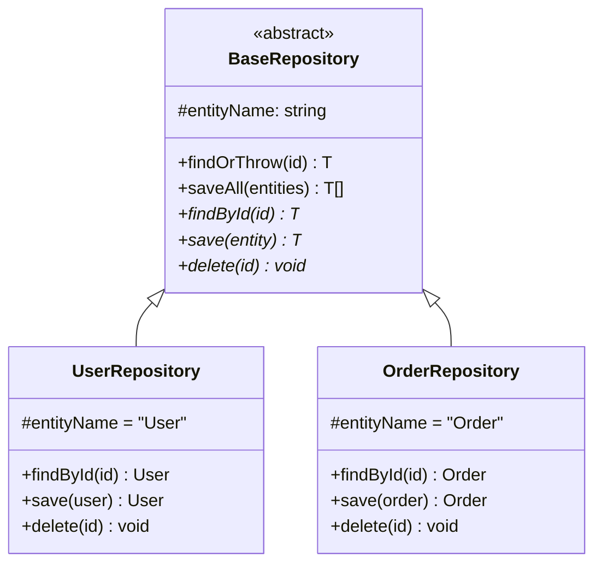

## Keywords in This File
{: .no_toc }

| # | Keyword | Weight |
|---|---|---|
| 1 | [TypeScript Classes and Access Modifiers](#typescript-classes-and-access-modifiers) | working |
| 2 | [TypeScript Decorators](#typescript-decorators) | working |

---

# TypeScript Classes and Access Modifiers

🎯 **Interview Weight:** working (★★☆) - classes and access modifiers
are tested in every TypeScript interview; critical for OOP-focused roles

---

### 🎯 Model Answer

**30 seconds:**

> TypeScript extends JavaScript classes with access modifiers (`public`,
> `private`, `protected`, `readonly`), abstract classes, parameter
> properties, and type-safe implementations. `private` is TypeScript-only
> (enforced at compile time). `#name` is JavaScript private (enforced
> at runtime). `abstract` prevents direct instantiation and forces
> subclass implementation.

**3 minutes:**

> TypeScript class features beyond JavaScript:
>
> Access modifiers: `public` (default), `private` (compile-time only),
>   `protected` (accessible in subclasses), `readonly` (after init, immutable)
> Parameter properties: `constructor(private name: string)` - declares
>   AND assigns in one line
> Abstract classes: `abstract class Animal { abstract sound(): string }` -
>   defines interface + default behavior without direct instantiation
> Interfaces: `implements IRepository<T>` - structural conformance check
> JS private fields: `#field` - truly private (not on prototype, not
>   accessible via type assertion or bracket notation)
> `override` keyword: explicit signal that method overrides parent

**Blank Mind Recovery:**

**(1) Restate:** "Access modifiers: public (default), private (compile-time),
protected (subclasses), readonly. Parameter properties: `constructor(private x)`
shorthand. Abstract classes: define contract + partial implementation.
`#field`: truly private at runtime."

---

### 📘 Concept Explanation

**What it is:**

TypeScript's class system extends JavaScript classes with compile-time
access control, abstract class patterns, explicit override markers,
and structural interface implementations.

**The problem it solves:**

JavaScript classes have no access control. TypeScript adds compile-time
enforcement of visibility (public/private/protected), explicit contracts
via abstract classes and interfaces, and defensive patterns like
readonly fields.

**How it works:**

```
TYPESCRIPT CLASS FEATURES:

  ACCESS MODIFIERS:

    class BankAccount {
      // public = default (accessible everywhere)
      public readonly id: string;

      // private = TypeScript only (compile-time enforcement)
      private _balance: number;

      // protected = accessible in subclasses
      protected ownerId: string;

      // parameter property shorthand:
      constructor(
        private readonly accountNumber: string,
        public readonly currency: string = 'USD'
      ) {
        this.id = crypto.randomUUID();
        this._balance = 0;
        this.ownerId = '';
      }
    }

    // TypeScript private vs JS private:
    class Safe {
      private tsPrivate = 1;   // TypeScript-only
      #jsPrivate = 2;          // JavaScript runtime
    }
    const s = new Safe();
    (s as any).tsPrivate;  // OK at runtime (still on prototype)
    (s as any).#jsPrivate; // Syntax error at runtime

  ABSTRACT CLASSES:

    abstract class Repository<T, ID> {
      // Abstract method: must be implemented
      abstract findById(id: ID): Promise<T | null>;
      abstract save(entity: T): Promise<T>;

      // Concrete method: shared logic
      async findOrThrow(id: ID): Promise<T> {
        const result = await this.findById(id);
        if (!result) throw new Error(`Not found: ${String(id)}`);
        return result;
      }
    }

    class UserRepository extends Repository<User, string> {
      // Must implement abstract methods:
      async findById(id: string): Promise<User | null> { ... }
      async save(user: User): Promise<User> { ... }
      // findOrThrow: inherited (not needed)
    }

  OVERRIDE KEYWORD:

    class Animal {
      sound(): string { return 'generic'; }
    }
    class Dog extends Animal {
      override sound(): string { return 'woof'; }
      // 'override' ensures this method exists in parent
      // Without 'override': silent if parent renames 'sound'
    }

  IMPLEMENTS vs EXTENDS:

    interface Serializable<T> {
      serialize(): string;
      static deserialize(data: string): T;
    }

    class User implements Serializable<User> {
      // Must implement ALL interface methods
      serialize(): string { return JSON.stringify(this); }
    }
```

> **Code walkthrough:** This TypeScript Classes and Access Modifiers example demonstrates contract definition using async/await. **KEY MECHANISM:** the JVM uses dynamic dispatch for all interface method calls. **WHY IT MATTERS:** interfaces with default methods can conflict at compile time via diamond problem. **TAKEAWAY: interfaces define contracts; prefer them over abstract classes for unrelated types.**

**Why it matters:**

Abstract classes enable template method patterns in TypeScript.
Parameter properties reduce boilerplate in data classes. The
distinction between TypeScript `private` and JavaScript `#field` is
a common interview question that reveals understanding of TypeScript's
compile-only nature.

**Mental model:**

> TypeScript access modifiers are documentation enforced by the compiler.
> They communicate intent to other developers and catch mistakes at
> compile time. But they're gone at runtime - `private` fields are
> still accessible via `(obj as any).field`. JavaScript `#field` is
> the only truly private field.

**Scale behavior:**

In large TypeScript codebases, abstract base classes reduce code
duplication across similar implementations (repositories, services,
validators). The abstract contract forces consistent APIs across
implementations.

---

### 💻 Code Example

**Repository pattern with abstract class**


```typescript
// BAD: using any defeats type safety
```

```typescript
// BAD: duplicated logic in every repository
class UserRepository {
  async findOrThrow(id: string): Promise<User> {
    const user = await this.findById(id);
    if (!user) throw new NotFoundException(`User ${id} not found`);
    return user;
  }
  // Same 3 lines in OrderRepository, ProductRepository...
}

// GOOD: abstract base class with shared logic
abstract class BaseRepository<T, ID> {
  protected abstract entityName: string;

  abstract findById(id: ID): Promise<T | null>;
  abstract save(entity: T): Promise<T>;
  abstract delete(id: ID): Promise<void>;

  // Shared logic: implemented once
  async findOrThrow(id: ID): Promise<T> {
    const result = await this.findById(id);
    if (!result) {
      throw new NotFoundException(
        `${this.entityName} ${String(id)} not found`
      );
    }
    return result;
  }

  async saveAll(entities: T[]): Promise<T[]> {
    return Promise.all(entities.map(e => this.save(e)));
  }
}

// Concrete implementation:
class UserRepository extends BaseRepository<User, string> {
  protected entityName = 'User';

  // Must implement all abstract methods:
  async findById(id: string): Promise<User | null> {
    return db.users.findUnique({ where: { id } });
  }

  async save(user: User): Promise<User> {
    return db.users.upsert({ where: { id: user.id }, data: user });
  }

  async delete(id: string): Promise<void> {
    await db.users.delete({ where: { id } });
  }

  // findOrThrow and saveAll: INHERITED from BaseRepository
}

// Parameter property shorthand:
class UserService {
  constructor(
    private readonly userRepo: UserRepository,
    private readonly emailService: EmailService,
    private readonly logger: Logger
  ) {
    // All three declared AND assigned - no separate fields needed
  }
}
```

> **Code walkthrough:** The `BaseRepository<T, ID>` abstract class usesice. **KEY MECHANISM:** the runtime executes these instructions in sequence with specific memory and execution semantics. **WHY IT MATTERS:** misapplying this pattern causes subtle bugs that only manifest under production load. **TAKEAWAY: understand the execution model before using this pattern in production code.**
> generics to work with any entity type. The `protected abstract entityName`
> forces each subclass to name itself for error messages. The concrete
> `findOrThrow` and `saveAll` methods are implemented once and inherited
> by all repositories - adding a new `archiveOld` method to the base
> immediately gives it to all subclasses. The `UserService` constructor
> uses TypeScript parameter property shorthand: `private readonly userRepo`
> declares the field, assigns it, and makes it readonly in a single line
> instead of three separate declarations.

---

### 🎓 Answers by Seniority

**Junior / Mid:**

> TypeScript adds access modifiers to JavaScript classes. `public` is
> the default (accessible anywhere). `private` is only accessible within
> the class (enforced by TypeScript compiler, not at runtime). `protected`
> is accessible in the class and subclasses. `readonly` can only be
> set during initialization. `abstract` classes cannot be instantiated
> directly and force subclasses to implement abstract methods.

**Senior / Staff:**

> TypeScript's access modifiers are compile-time contracts, not runtime
> enforcement. The distinction matters for security-sensitive code:
> `private _secret` is still accessible as `(obj as any)._secret` at
> runtime. For true runtime privacy, use JavaScript `#field` or closures.
> Abstract classes serve a different purpose than interfaces: they combine
> a contract (abstract methods) with shared implementation (concrete
> methods). The template method pattern - abstract base with hooks for
> subclasses to implement - is the most powerful OOP pattern TypeScript
> abstract classes enable. The `override` keyword (TypeScript 4.3+) is
> underused but critical: it catches the silent rename bug where a parent
> class renames a method and the child's override becomes a new method.

---

### ⚖️ Comparison Table

| Feature | Access | Compile | Runtime | Use case |
|---|---|---|---|---|
| `public` | Everywhere | Yes | Yes | Default visibility |
| `private` | Class only | Yes | No | TS encapsulation |
| `protected` | Class + subclasses | Yes | No | Inheritance |
| `readonly` | Read-only after init | Yes | No | Immutable fields |
| `#field` | Class only | Yes | Yes | True privacy |
| `abstract` | N/A | Yes | No | Contract + template |

---

### 📊 Diagram

```
ABSTRACT CLASS vs INTERFACE:

  ABSTRACT CLASS:           INTERFACE:
  +------------------+      +------------------+
  | AbstractRepo<T>  |      | IRepository<T>   |
  |------------------|      |------------------|
  | + findOrThrow()  |      | + findById()     |
  | # abstract:      |      | + save()         |
  |   findById()     |      | + delete()       |
  |   save()         |      +------------------+
  |   delete()       |              |
  +------------------+         implements
          |
        extends
          |
  +------------------+
  | UserRepository   |
  |------------------|
  | + findById()  <- must implement abstract
  | + save()      <- must implement abstract
  | + delete()    <- must implement abstract
  | findOrThrow() <- inherited (free!)
  +------------------+

  DECISION:
    Abstract class -> shared implementation needed
    Interface -> structural contract only
```



> **Diagram walkthrough:** `BaseRepository` declares abstract methods
> (marked with `*`) that subclasses must implement. The `findOrThrow`
> and `saveAll` concrete methods are inherited automatically. All
> repositories share identical error messages and batch save logic
> without duplication. Adding a new method to `BaseRepository` gives
> it to all subclasses at once.

---

### ⚠️ Common Misconceptions

**"TypeScript private fields are private at runtime"**

TypeScript `private` is ONLY enforced by the TypeScript compiler. After
compilation, it's stripped entirely from JavaScript output. The field
is still on the prototype and accessible via `(obj as any).field`,
through reflection, or in tests using bracket notation. For runtime
privacy: use JavaScript `#field` (true private field, not on prototype)
or closures (private variable in factory function scope). The choice
depends on whether security or IDE autocomplete hiding is the goal.

---

### 🚨 Failure Modes and Diagnosis

**The override rename bug (silent method becomes orphan):**

```typescript
// SYMPTOM: overriding method never called, parent method runs instead
// CAUSE: parent class renamed the method but child class wasn't updated

// V1 of parent class:
class Animal { sound(): string { return 'generic'; } }

// Child class:
class Dog extends Animal {
  sound(): string { return 'woof'; }  // overrides Animal.sound
}

// V2: parent class renames method to makeSound():
class Animal { makeSound(): string { return 'generic'; } }

// WITHOUT override keyword: Dog.sound() silently becomes
// a NEW method instead of an override. Calling animal.makeSound()
// on a Dog returns 'generic' (parent version).

// WITH override keyword:
class Dog extends Animal {
  override sound(): string { return 'woof'; }
  // TypeScript Error: 'sound' does not exist in type 'Animal'
  // Compile-time catch of the rename!
}
```

> **Code walkthrough:** This Unknown example demonstrates type alias definition using SQL. **KEY MECHANISM:** type aliases are erased at compile time; they create no runtime overhead. **WHY IT MATTERS:** circular type aliases cause infinite recursion during type checking. **TAKEAWAY: prefer type aliases for union types and mapped types; interfaces for object shapes.**

---

### 🎯 Interview Deep-Dive

| Scenario | Time | Key Signal |
|---|---|---|
| public vs private vs protected | 2-3 min | Visibility rules |
| TypeScript private vs JS #field | 3-4 min | Compile vs runtime |
| Abstract class vs interface | 3-4 min | When to use each |
| Parameter property shorthand | 2-3 min | Syntax + limits |
| override keyword purpose | 2-3 min | Rename bug catch |
| readonly on class fields | 2-3 min | After constructor |
| Template method pattern | 3-4 min | Abstract + concrete |
| implements vs extends | 2-3 min | Contract vs reuse |
| Abstract class with generics | 3-4 min | Repository pattern |

---

**[SENIOR] Q1 - [MECHANISM] What is the difference between TypeScript private and JS #field?**

> **Answer:**
>
> ```typescript
> class Safe {
>   // TypeScript private: compile-time only
>   private tsSecret = 'ts-private';
>
>   // JavaScript private: runtime enforced
>   #jsSecret = 'js-private';
> }
>
> const s = new Safe();
>
> // TypeScript private: accessible at runtime!
> (s as any).tsSecret;  // 'ts-private' - no runtime error
> console.log(Object.keys(s));
> // ['tsSecret', '#jsSecret'] at runtime
>
> // JavaScript private: truly private
> (s as any).['#jsSecret'];  // undefined (not on object)
> s.#jsSecret;  // SyntaxError (even via bracket notation)
>
> // Also: JS #fields break with subclasses in different ways:
> class Sneaky extends Safe {
>   steal() {
>     return (this as any).tsSecret;  // OK
>     return this.#jsSecret;  // SyntaxError: must define #jsSecret
>   }
> }
> ```
>
> *What separates good from great:* This distinction is not just
> academic - it matters for security. TypeScript `private` is sufficient
> for internal API hygiene (preventing accidental access by other
> developers on the same team). JavaScript `#field` is needed when
> you cannot trust the runtime consumer (untrusted code, browser
> extension, third-party SDK). The performance characteristic also
> differs: `#field` stores data in the object's "private slot" using
> WeakMap internally in some engines, which has different memory
> characteristics than prototype properties.

**[JUNIOR] Q2 - [TRADE-OFF] When would you choose abstract class over interface?** `[SENIOR]`**

> **Answer:**
>
> Choose based on whether shared implementation is needed:
>
> ```typescript
> // Use INTERFACE when:
> // - Only defining a contract (no implementation)
> // - Multiple inheritance needed (class implements A, B, C)
> // - Simple structural typing (duck typing)
> interface Serializable {
>   serialize(): string;
>   deserialize(data: string): this;
> }
>
> // Use ABSTRACT CLASS when:
> // - Sharing implementation (template method pattern)
> // - Shared state between implementations
> // - Providing hooks (abstract) with defaults (concrete)
> abstract class BaseValidator<T> {
>   // Shared implementation:
>   validate(input: unknown): T {
>     const parsed = this.parse(input);
>     this.postValidate(parsed);  // hook with default
>     return parsed;
>   }
>
>   // Abstract: each validator implements parsing
>   protected abstract parse(input: unknown): T;
>
>   // Hook with default: subclass can override
>   protected postValidate(value: T): void { /* noop */ }
> }
>
> class EmailValidator extends BaseValidator<string> {
>   protected parse(input: unknown): string {
>     if (typeof input !== 'string') throw new Error('Not a string');
>     if (!input.includes('@')) throw new Error('Not an email');
>     return input.toLowerCase();
>   }
>   // postValidate: inherited noop - no override needed
> }
> ```
>
> *What separates good from great:* Abstract classes implement the
> Gang of Four "Template Method" pattern in TypeScript. The concrete
> `validate()` method defines the algorithm structure; subclasses
> fill in the blanks via `abstract parse()`. This is significantly
> different from interfaces, which define contracts with zero
> implementation. The practical rule: interface first, abstract
> class only when you have shared logic to extract (the rule of
> three - when three implementations share the same code, abstract it).

**[MID] Q3 - [MECHANISM] How do parameter properties work and what are their limits?**

> **Answer:**
>
> ```typescript
> // WITHOUT parameter properties:
> class UserService {
>   private readonly repo: UserRepository;
>   private readonly logger: Logger;
>
>   constructor(repo: UserRepository, logger: Logger) {
>     this.repo = repo;  // Manual assignment
>     this.logger = logger;
>   }
> }
>
> // WITH parameter properties (TypeScript shorthand):
> class UserService {
>   constructor(
>     private readonly repo: UserRepository,
>     private readonly logger: Logger
>   ) {
>     // No body needed - TypeScript handles field declaration
>     // and assignment automatically
>   }
> }
>
> // Limits:
> // 1. Only works in constructors (not other methods)
> // 2. Cannot use parameter property for non-class fields
> //    (interface implementations)
> // 3. 'protected' parameter properties mean:
> //    "assign and expose to subclasses"
>
> // Mixed: parameter property + regular parameter
> class FileService {
>   private path: string;
>   constructor(
>     private readonly config: Config,  // parameter property
>     basePath: string  // regular parameter (NOT a property)
>   ) {
>     this.path = basePath + config.prefix;  // uses both
>   }
> }
> ```
>
> *What separates good from great:* Parameter properties are purely
> syntactic sugar - the compiled JavaScript output is identical to
> the manual version. The limit that matters in practice: parameter
> properties with `public` modifier mean the field is directly mutable
> from outside, which can violate encapsulation. Prefer `private readonly`
> for injected dependencies and `public readonly` only for value objects
> where the field is part of the public API.

---

---

---

### 💻 Code Example

*(Omit: this concept does not have a programmatic interface that can be demonstrated in code. The conceptual explanation above is sufficient.)*


---

### 🏛️ System Design

*(Omit: system design diagram not applicable for this concept - see ★★★ keywords for full system design coverage.)*


---

### ⚖️ Comparison Table

*(Omit: this is a ★☆☆ foundational concept with no direct alternatives to compare - see higher-difficulty keywords for trade-off analysis.)*


---

### 📊 Diagram

*(Omit: no standalone visual diagram required for this concept - the explanations and code examples above provide sufficient clarity.)*


# TypeScript Decorators

🎯 **Interview Weight:** working (★★☆) - decorators are used extensively
in NestJS, Angular, and TypeORM; tested in framework-heavy TypeScript roles

---

### 🎯 Model Answer

**30 seconds:**

> TypeScript decorators are functions that modify classes, methods,
> properties, or parameters at declaration time. They're used by NestJS
> (`@Controller`, `@Injectable`), Angular (`@Component`), TypeORM
> (`@Entity`, `@Column`), and class-validator (`@IsEmail`). There are
> two decorator specifications: legacy (TypeScript's `experimentalDecorators`
> flag) and TC39 Stage 3 (ECMAScript decorators, TypeScript 5.0+).

**3 minutes:**

> Decorator targets:
> - Class decorators: `@Injectable()` - modify class constructor/prototype
> - Method decorators: `@Get('/users')` - wrap method behavior
> - Property decorators: `@Column({ type: 'varchar' })` - metadata
> - Parameter decorators: `@Body()` - route parameter extraction
> - Accessor decorators: `@memoize` - getter/setter transforms
>
> Current state: TypeScript 5.0+ supports both:
> - TC39 Stage 3 decorators (default): `@decorator` syntax, new semantics
> - Legacy (`experimentalDecorators: true`): required by Angular, NestJS,
>   TypeORM until they migrate

**Blank Mind Recovery:**

**(1) Restate:** "Decorators are functions modifying classes/methods/
properties at declaration. Targets: class, method, property, parameter.
Legacy (`experimentalDecorators`) used by Angular/NestJS. Stage 3 decorators
in TypeScript 5+ are the new standard."

---

### 📘 Concept Explanation

**What it is:**

Decorators are special functions applied with `@decorator` syntax that
run at class definition time (not call time). They receive the decorated
target and can modify, wrap, or annotate it. TypeScript decorators are
a meta-programming mechanism.

**The problem it solves:**

Cross-cutting concerns (logging, caching, validation, authorization,
DI registration) would require manual wrapping or inheritance chains
without decorators. Decorators apply these concerns declaratively,
keeping business logic clean.

**How it works:**

```
DECORATOR EXECUTION MODEL:

  @classDecorator
  class Service {
    @methodDecorator
    handle(@paramDecorator req: Request): Response { ... }

    @propertyDecorator
    name: string;
  }

  EXECUTION ORDER (legacy experimentalDecorators):
    1. Parameter decorators (@paramDecorator on each param)
    2. Method/property decorators (bottom to top, outer to inner)
    3. Class decorator (@classDecorator) - outermost last

LEGACY DECORATOR SIGNATURES:

  // Class decorator:
  function Injectable<T extends new (...args: any[]) => any>(
    target: T
  ): T | void {
    Reflect.defineMetadata('injectable', true, target);
    return target;  // or modified class
  }

  // Method decorator:
  function Log(
    target: Object,          // class prototype
    key: string,             // method name
    descriptor: PropertyDescriptor
  ): PropertyDescriptor {
    const original = descriptor.value;
    descriptor.value = function (...args: unknown[]) {
      console.log(`${key} called with:`, args);
      const result = original.apply(this, args);
      console.log(`${key} returned:`, result);
      return result;
    };
    return descriptor;
  }

  // Property decorator:
  function Column(options: ColumnOptions) {
    return function(target: Object, key: string) {
      // Store metadata (TypeORM pattern)
      Reflect.defineMetadata('column', options, target, key);
    };
  }

  // Parameter decorator:
  function Body() {
    return function(
      target: Object,
      key: string,
      parameterIndex: number
    ) {
      // Mark parameter as request body (NestJS pattern)
      const params = Reflect.getMetadata('body_params', target, key)
        || [];
      params.push(parameterIndex);
      Reflect.defineMetadata('body_params', params, target, key);
    };
  }

TC39 STAGE 3 (TypeScript 5.0+, no flag):

  // Class decorator - new API:
  function Injectable(target: Function, context: ClassDecoratorContext) {
    context.addInitializer(function(this: any) {
      // Runs after class is initialized
    });
    return target;
  }

  // Key difference: context object instead of raw prototype
  // context.name, context.kind, context.addInitializer, context.metadata
```

> **Code walkthrough:** This TypeScript Decorators example demonstrates a key concept in practice. **KEY MECHANISM:** the runtime executes these instructions in sequence with specific memory and execution semantics. **WHY IT MATTERS:** misapplying this pattern causes subtle bugs that only manifest under production load. **TAKEAWAY: understand the execution model before using this pattern in production code.**

**Why it matters:**

Decorators are the foundation of NestJS, Angular, TypeORM, and
class-validator. Understanding them is essential for enterprise
TypeScript roles. The current (2024) state with two decorator
systems is a common interview topic.

**Mental model:**

> A decorator is a wrapper function that runs at class definition
> time. `@Injectable()` on a class is equivalent to `Injectable(class UserService {...})`.
> The decorator sees the class definition and can annotate it, modify
> its prototype, or return a new class. Metadata decorators (most common)
> just store information for frameworks to read later with `Reflect.getMetadata`.

**Scale behavior:**

Heavy decorator use (every method and property in TypeORM entities)
increases startup time because all decorators run at module load.
Class-validator benchmarks show decorator-heavy validation is slower
than plain Zod schemas. Acceptable tradeoff for most CRUD applications.

---

### 💻 Code Example

**Building a minimal DI container with decorators**


```typescript
// BAD: using any defeats type safety
```

```typescript
import 'reflect-metadata';  // Required for Reflect.metadata

// BAD: manual dependency registration
class UserController {
  // Must manually instantiate everything
  private service = new UserService(
    new UserRepository(database),
    new Logger('UserService')
  );
}

// GOOD: decorator-based DI
// 1. Mark class as injectable (stores constructor metadata)
function Injectable(): ClassDecorator {
  return function(target: Function) {
    Reflect.defineMetadata('injectable', true, target);
  };
}

// 2. Get parameter types automatically (reflects TypeScript types)
function getParamTypes(target: Function): Function[] {
  return Reflect.getMetadata('design:paramtypes', target) || [];
}

// 3. Simple DI container:
class Container {
  private registry = new Map<string, any>();

  register<T>(token: string, instance: T): void {
    this.registry.set(token, instance);
  }

  resolve<T>(target: new (...args: any[]) => T): T {
    const paramTypes = getParamTypes(target);
    const deps = paramTypes.map(type => {
      const token = type.name;
      const dep = this.registry.get(token);
      if (!dep) throw new Error(`No provider for ${token}`);
      return dep;
    });
    return new target(...deps);
  }
}

// Usage:
@Injectable()
class UserService {
  constructor(
    private repo: UserRepository,
    private logger: Logger
  ) {}
}

@Injectable()
class UserController {
  constructor(private service: UserService) {}
}

const container = new Container();
container.register('Logger', new Logger());
container.register('UserRepository', new UserRepository(db));
container.register('UserService', container.resolve(UserService));
const ctrl = container.resolve(UserController);
// UserController with UserService with UserRepository + Logger
```

> **Code walkthrough:** The `@Injectable()` decorator stores metadataice. **KEY MECHANISM:** the runtime executes these instructions in sequence with specific memory and execution semantics. **WHY IT MATTERS:** misapplying this pattern causes subtle bugs that only manifest under production load. **TAKEAWAY: understand the execution model before using this pattern in production code.**
> using `Reflect.defineMetadata`. The critical piece is `design:paramtypes` -
> TypeScript with `emitDecoratorMetadata: true` automatically calls
> `Reflect.metadata('design:paramtypes', [UserRepository, Logger])`
> on classes, recording their constructor parameter types at compile
> time. The `Container.resolve()` reads these stored types to auto-wire
> dependencies. This is the core of NestJS's DI system - the same
> `design:paramtypes` metadata that TypeScript emits powers automatic
> dependency resolution without any runtime type information.

---

### 🎓 Answers by Seniority

**Junior / Mid:**

> TypeScript decorators are functions that modify classes, methods,
> or properties using `@decorator` syntax. They run at class definition
> time, not when methods are called. NestJS uses decorators for
> routing (`@Get`, `@Controller`), Angular for component metadata
> (`@Component`), and TypeORM for database mapping (`@Entity`, `@Column`).
> You need `experimentalDecorators: true` in tsconfig for the legacy
> decorator syntax used by these frameworks.

**Senior / Staff:**

> Decorators are meta-programming via reflection. The `Reflect.metadata`
> API + TypeScript's `emitDecoratorMetadata` is the foundation of every
> DI container (NestJS, Inversify). The key insight: `design:paramtypes`
> metadata makes constructor dependencies resolvable at runtime without
> any separate registration step. Current complexity: TypeScript 5.0
> added TC39 Stage 3 decorators with breaking changes from the legacy
> API. Angular, NestJS, and TypeORM all still use legacy decorators
> (switching is a major migration). Most new projects should use Stage 3,
> but projects with NestJS/Angular must stay on `experimentalDecorators: true`.

---

### ⚖️ Comparison Table

| Approach | When runs | Use case | Frameworks |
|---|---|---|---|
| Class decorator | Class definition | DI, ORM mapping | NestJS, TypeORM |
| Method decorator | Class definition | Logging, auth, caching | All |
| Property decorator | Class definition | Column mapping, validation | TypeORM, class-validator |
| Parameter decorator | Class definition | Route params, DI tokens | NestJS |
| Higher-order function | Call time | Manual wrapping | Vanilla JS |

---

### 📊 Diagram

*(Omit: decorators are code-level meta-programming)*

---

### ⚠️ Common Misconceptions

**"Decorators run every time the method is called"**

Class, method, property, and parameter decorators run ONCE at class
DEFINITION time (when the module loads), not when methods are called.
Only the WRAPPER function returned by a method decorator runs at call
time. `@Log` on a method: the decorator function runs at module load
to wrap the method; the wrapper runs at each call. This is why startup
time increases with many decorators but call-time overhead is minimal
(just the wrapper's own logic).

---

### 🚨 Failure Modes and Diagnosis

**Missing reflect-metadata import causes undefined paramtypes:**

```typescript
// SYMPTOM: NestJS/Inversify DI fails: "No providers for X"
//          or "cannot read property of undefined" in DI container
// CAUSE: reflect-metadata not imported early enough

// BAD: import after other imports
import { UserService } from './user.service';
import 'reflect-metadata';  // Too late! metadata already processed
// OR: missing entirely

// FIX: reflect-metadata MUST be the FIRST import in main.ts:
import 'reflect-metadata';  // Line 1
import { NestFactory } from '@nestjs/core';
import { AppModule } from './app.module';

// VERIFY: check tsconfig.json has both flags:
{
  "compilerOptions": {
    "experimentalDecorators": true,   // Required
    "emitDecoratorMetadata": true     // Required for design:paramtypes
  }
}

// DIAGNOSE: check if metadata is being captured:
import 'reflect-metadata';
@Injectable()
class TestService {}
console.log(
  Reflect.getMetadata('design:paramtypes', TestService)
);
// Should print [] or [dep types], not undefined
```

> **Code walkthrough:** BAD pattern: This Unknown example demonstrates type assertion using container. **KEY MECHANISM:** as tells TypeScript to treat the value as a specific type without runtime check. **WHY IT MATTERS:** asserting an incompatible type causes runtime errors that TypeScript cannot catch. **WHAT BREAKS: use type guards (typeof, instanceof, is) instead of as for safe narrowing.**

---

### 🎯 Interview Deep-Dive

| Scenario | Time | Key Signal |
|---|---|---|
| What are decorators? | 2-3 min | Definition-time functions |
| Legacy vs Stage 3 decorators | 3-4 min | Current state |
| Method decorator implementation | 3-4 min | Descriptor wrap |
| DI with design:paramtypes | 3-4 min | reflect-metadata |
| Decorator execution order | 2-3 min | Bottom to top |
| Class decorator returning new class | 2-3 min | Mixin pattern |
| Property decorator (TypeORM) | 2-3 min | Metadata storage |
| When NOT to use decorators | 2-3 min | Alternatives |
| emitDecoratorMetadata flag | 2-3 min | Type reflection |

---

**[JUNIOR] Q1 - [MECHANISM] How would you implement a caching decorator?** `[SENIOR]`**

> **Answer:**
>
> ```typescript
> function Cache(ttlMs: number = 60_000): MethodDecorator {
>   return function (
>     target: Object,
>     key: string | symbol,
>     descriptor: PropertyDescriptor
>   ) {
>     const original = descriptor.value as Function;
>     const cache = new Map<string, { value: any; expires: number }>();
>
>     descriptor.value = async function (...args: unknown[]) {
>       const cacheKey = JSON.stringify(args);
>       const cached = cache.get(cacheKey);
>
>       if (cached && Date.now() < cached.expires) {
>         return cached.value;
>       }
>
>       const result = await original.apply(this, args);
>       cache.set(cacheKey, {
>         value: result,
>         expires: Date.now() + ttlMs
>       });
>       return result;
>     };
>
>     return descriptor;
>   };
> }
>
> // Usage:
> class UserService {
>   @Cache(30_000)  // Cache for 30 seconds
>   async getUserById(id: string): Promise<User> {
>     return this.userRepo.findById(id);  // DB hit only on miss
>   }
> }
> ```
>
> *What separates good from great:* This implementation has a subtle
> issue: the cache `Map` is shared across ALL instances of the class
> because it's closed over in the decorator function. To make it
> per-instance, use a `WeakMap<object, Map>` keyed by `this`. For
> production use, also consider cache invalidation (the hard part):
> methods that mutate data need to clear related caches. NestJS's
> `@CacheKey()` and `@CacheTTL()` decorators solve this by delegating
> to a configurable cache store (Redis, in-memory) with key-based
> invalidation.

**[SENIOR] Q2 - [MECHANISM] What is the difference between legacy and TC39 Stage 3 decorators?**

> **Answer:**
>
> Two fundamentally different APIs:
>
> ```typescript
> // LEGACY (experimentalDecorators: true):
> // Used by Angular, NestJS, TypeORM
> function log(
>   target: Object,
>   key: string,
>   descriptor: PropertyDescriptor
> ) {
>   // target = class prototype
>   // key = method name
>   // descriptor = { value, writable, enumerable, configurable }
>   return descriptor;
> }
>
> // STAGE 3 (TypeScript 5.0+, no flag):
> // New ECMAScript standard
> function log<T extends Function>(
>   target: T,
>   context: ClassMethodDecoratorContext
> ) {
>   // context.name = method name
>   // context.kind = 'method'
>   // context.addInitializer() = run after class creation
>   // context.metadata = shared metadata object
>   return function(this: any, ...args: any[]) {
>     console.log(`${String(context.name)} called`);
>     return (target as any).apply(this, args);
>   };
> }
>
> // CURRENT GUIDANCE (2024):
> // - New projects with no framework: use Stage 3
> // - NestJS/Angular/TypeORM: must use legacy
> //   (add experimentalDecorators: true to tsconfig)
> // - Check framework release notes for Stage 3 migration status
> ```
>
> *What separates good from great:* The key breaking change is that
> Stage 3 decorators don't receive the prototype - they receive a
> `context` object with a `metadata` property that's shared across
> all decorators on a class. This enables decorator interoperability
> (decorators can communicate via `context.metadata`) which wasn't
> possible with the legacy API. The `addInitializer` callback is the
> Stage 3 replacement for returning a new class from a class decorator.

**[STAFF] Q3 - [MECHANISM] How does emitDecoratorMetadata enable dependency injection?**

> **Answer:**
>
> With `emitDecoratorMetadata: true`, TypeScript automatically calls
> `Reflect.metadata('design:paramtypes', target, paramTypes)` for any
> decorated class, recording its constructor parameter types:
>
> ```typescript
> // TypeScript source:
> @Injectable()
> class UserService {
>   constructor(
>     private repo: UserRepository,
>     private logger: Logger
>   ) {}
> }
>
> // Compiled JavaScript output includes:
> __decorate([Injectable()], UserService);
> __metadata('design:paramtypes', [UserRepository, Logger]);
> // TypeScript AUTOMATICALLY adds this metadata call!
>
> // DI container reads it:
> const paramTypes = Reflect.getMetadata(
>   'design:paramtypes',
>   UserService
> );
> // [UserRepository, Logger] - the actual constructor functions!
>
> // Container can now auto-resolve:
> const deps = paramTypes.map(type => container.get(type));
> const service = new UserService(...deps);
> ```
>
> *What separates good from great:* This is the mechanism behind
> "zero-config" DI. NestJS doesn't require you to say "UserService
> depends on UserRepository" explicitly - it reads the TypeScript types
> directly from the compiled metadata. The catch: this only works when
> the class is decorated with at least one decorator (TypeScript only
> emits `design:paramtypes` for decorated classes), when
> `emitDecoratorMetadata` is true, and when `reflect-metadata` is
> imported globally before any decorated classes load.

---

### 💻 Code Example

*(Omit: this concept does not have a programmatic interface that can be demonstrated in code. The conceptual explanation above is sufficient.)*


---

### 🏛️ System Design

*(Omit: system design diagram not applicable for this concept - see ★★★ keywords for full system design coverage.)*


---

### ⚖️ Comparison Table

*(Omit: this is a ★☆☆ foundational concept with no direct alternatives to compare - see higher-difficulty keywords for trade-off analysis.)*


---

### 📊 Diagram

*(Omit: no standalone visual diagram required for this concept - the explanations and code examples above provide sufficient clarity.)*


