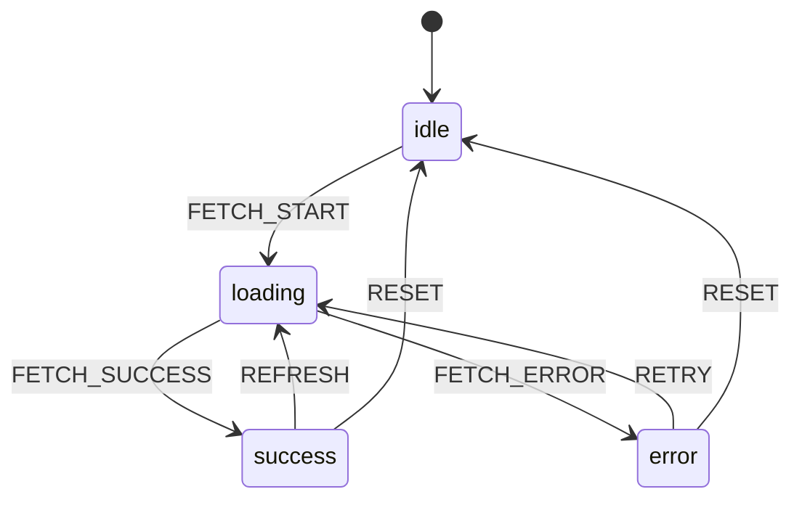

# TypeScript Design Patterns

🎯 **Interview Weight:** intermediate (★★☆) - TypeScript-idiomatic
patterns distinguish candidates who write typesafe code from those
who fight the type system

---

### 🎯 Model Answer

**30 seconds:**

> TypeScript-idiomatic patterns: discriminated unions (sum types for
> state machines), the builder pattern with method chaining and return
> types, branded types (opaque IDs), the satisfies operator (validate
> type without widening), and const assertions. These patterns make
> illegal states unrepresentable - a core TypeScript design principle.

**3 minutes:**

> Key TypeScript patterns:
>
> Discriminated unions: `{ type: 'loading' } | { type: 'error'; message: string }`
>   - exhaustive switch, no invalid state combinations
> Branded types: `string & { __brand: 'UserId' }` - prevent ID mixups
> Builder pattern: fluent API with `this` return type for chaining
> `satisfies` operator: check shape without widening type
> `as const` assertions: narrow literals to their exact values
> Discriminated tuple: `[true, User] | [false, Error]` for go-style errors
> Opaque modules: module-level private with branded types

**Blank Mind Recovery:**

**(1) Restate:** "Key TypeScript patterns: discriminated unions (state
machines, illegal states impossible), branded types (ID safety), `satisfies`
operator (validate without widening), `as const` (narrow to literal),
builder pattern with chained `this` type."

---

### 📘 Concept Explanation

**What it is:**

TypeScript design patterns leverage the type system itself as a constraint
engine. Unlike JavaScript patterns that are purely structural, TypeScript
patterns embed correctness guarantees into types - making certain bugs
impossible to compile.

**The problem it solves:**

Without TypeScript patterns, types are documentation (easy to ignore).
With them, types become compiler-enforced contracts. The goal: make
illegal states unrepresentable, so wrong state combinations cannot be
expressed in code.

**How it works:**

```
PATTERN 1: DISCRIMINATED UNIONS

  // Illegal state: loading=true AND error set simultaneously
  type BadState = {
    isLoading: boolean;
    error: string | null;    // Can be set when isLoading = false?
    data: User | null;       // Can be set when error exists?
  };

  // GOOD: Each state is a separate type with exact shape
  type State =
    | { status: 'idle' }
    | { status: 'loading' }
    | { status: 'success'; data: User }
    | { status: 'error'; message: string; code: number };
  // Impossible: { status: 'success', message: 'err' }

  function render(state: State): string {
    switch (state.status) {
      case 'idle': return 'Initial';
      case 'loading': return 'Loading...';
      case 'success': return `Hello ${state.data.name}`;
      case 'error': return `Error ${state.code}: ${state.message}`;
      // Exhaustive: TypeScript errors if new status added
    }
  }

PATTERN 2: BRANDED TYPES (OPAQUE)

  declare const __brand: unique symbol;
  type Brand<T, B> = T & { [__brand]: B };

  type UserId = Brand<string, 'UserId'>;
  type OrderId = Brand<string, 'OrderId'>;

  function createUserId(raw: string): UserId {
    if (!isValidId(raw)) throw new Error('invalid');
    return raw as UserId;  // Only place we cast
  }

  function getUser(id: UserId): Promise<User> { ... }

  const uid = createUserId('usr_123');
  const oid = 'ord_456' as OrderId;
  getUser(uid);  // OK
  getUser(oid);  // Error: OrderId is not UserId
  getUser('raw'); // Error: string is not UserId

PATTERN 3: SATISFIES OPERATOR

  type Config = Record<string, string | number>;

  // BAD: type annotation widens (loses specific type info)
  const cfg: Config = { host: 'localhost', port: 3000 };
  cfg.port.toFixed();  // Error: might be string

  // GOOD: satisfies validates shape but keeps narrow type
  const cfg = {
    host: 'localhost',
    port: 3000
  } satisfies Config;
  cfg.port.toFixed();   // OK: TypeScript knows port is number
  cfg.host.toUpperCase(); // OK: TypeScript knows host is string
  cfg.unknown;  // Error: unknown key not in Config... wait
  // Note: satisfies doesn't restrict extra keys by default

PATTERN 4: AS CONST ASSERTIONS

  const ROUTES = {
    HOME: '/',
    ABOUT: '/about',
    USER: '/users/:id'
  } as const;
  // Type: { readonly HOME: '/'; readonly ABOUT: '/about'; ... }
  // Without as const: { HOME: string; ABOUT: string; ... }

  type Route = typeof ROUTES[keyof typeof ROUTES];
  // = '/' | '/about' | '/users/:id'
  // Derived from the actual values (not manually maintained)

PATTERN 5: BUILDER WITH THIS TYPE

  class QueryBuilder {
    private filters: string[] = [];
    private _limit?: number;

    where(condition: string): this {
      this.filters.push(condition);
      return this;  // 'this' type enables subclass chaining
    }

    limit(n: number): this {
      this._limit = n;
      return this;
    }

    build(): string {
      const where = this.filters.join(' AND ');
      const limit = this._limit ? ` LIMIT ${this._limit}` : '';
      return `SELECT * FROM table WHERE ${where}${limit}`;
    }
  }

  class TypedQueryBuilder extends QueryBuilder {
    orderBy(column: string): this {
      // ... add ordering
      return this;
    }
  }
  // Chaining works on subclass:
  // new TypedQueryBuilder().where('age > 18').orderBy('name').build()
  // Returns TypedQueryBuilder, not QueryBuilder!
```

**Why it matters:**

Discriminated unions replace boolean flags and null checks. Branded
types prevent the "passed orderId where userId required" class of bugs.
The `satisfies` operator (TypeScript 4.9+) resolves the tension between
type-checking and type inference. These patterns appear in large TypeScript
codebases and in senior TypeScript interviews.

**Mental model:**

> TypeScript patterns are "illegal state prevention." A state machine
> with 3 boolean flags could have 8 states but only 3-4 are valid.
> Discriminated unions make only the valid 3-4 states expressible -
> the other 4-5 cannot be constructed at all. The type system enforces
> the state machine invariants.

**Scale behavior:**

Discriminated unions with many variants (10+) can slow down TypeScript
type-checking. Extract expensive discriminated union checks into helper
functions to improve performance. Branded types have zero runtime cost.

---

### 💻 Code Example

**State machine with discriminated unions**

```typescript
// BAD: boolean soup - all combinations possible, most are invalid
interface LoadState {
  isLoading: boolean;
  hasError: boolean;
  error: Error | null;
  data: User[] | null;
  // isLoading=true, hasError=true? Invalid but possible!
  // isLoading=false, hasError=false, data=null? Weird initial state
}

// GOOD: each valid state is its own type
type UserListState =
  | { phase: 'idle' }
  | { phase: 'loading'; startedAt: number }
  | { phase: 'success'; users: User[]; loadedAt: number }
  | { phase: 'error'; error: Error; retryCount: number };

function UserList({ state }: { state: UserListState }) {
  switch (state.phase) {
    case 'idle':
      return null;
    case 'loading':
      const elapsed = Date.now() - state.startedAt;
      return <Spinner elapsed={elapsed} />;
    case 'success':
      return <UserTable users={state.users} />;
    case 'error':
      return (
        <ErrorPanel
          error={state.error}
          canRetry={state.retryCount < 3}
        />
      );
    // TypeScript: exhaustive - adding a new phase errors here
  }
}

// TRANSITIONS: only valid state changes expressible
function reducer(
  state: UserListState,
  action: UserAction
): UserListState {
  switch (action.type) {
    case 'FETCH_START':
      return { phase: 'loading', startedAt: Date.now() };
    case 'FETCH_SUCCESS':
      // Can only access users if we received them
      return { phase: 'success', users: action.users, loadedAt: Date.now() };
    case 'FETCH_ERROR':
      const retryCount = state.phase === 'error'
        ? state.retryCount + 1 : 0;  // Track retries
      return { phase: 'error', error: action.error, retryCount };
    default:
      return state;
  }
}
```

> **Code walkthrough:** The `UserListState` union makes four and only
> four phases possible. The `loading` phase carries `startedAt` which
> only makes sense during loading - it's part of the loading STATE,
> not a separate field that could get out of sync. Similarly, `retryCount`
> is only on the `error` phase - no chance of accidentally reading
> `retryCount` when not in error state. The reducer's `state.retryCount + 1`
> check first verifies `state.phase === 'error'` before accessing `retryCount`,
> which TypeScript enforces via narrowing. Adding a new phase to
> `UserListState` immediately flags the switch statement as non-exhaustive.

---

### 🎓 Answers by Seniority

**Junior / Mid:**

> TypeScript patterns leverage the type system for safety. Discriminated
> unions model state machines where each state has only the data it
> needs - impossible combinations cannot be created. Branded types
> prevent passing the wrong kind of ID. `as const` narrows object
> properties to their exact values instead of their general type
> (string, number).

**Senior / Staff:**

> The central principle is "make illegal states unrepresentable" (Yaron
> Minsky's functional programming phrase, directly applicable to
> TypeScript). Discriminated unions model finite state machines where
> the type system enforces valid transitions. Branded types handle
> domain-level constraints (valid IDs, positive numbers, sorted arrays)
> that structural typing cannot express. The `satisfies` operator
> resolves the classic tension between explicit type annotation (safe
> but widens type) and type inference (narrow but unchecked). Using
> these patterns in production codebases reduces entire categories of
> bugs to compile errors.

---

### ⚖️ Comparison Table

| Pattern | Prevents | Runtime cost | Complexity |
|---|---|---|---|
| Discriminated union | Invalid state combinations | None | Low-Medium |
| Branded types | Type confusion (ID mixups) | None | Low |
| `satisfies` operator | Type widening | None | Low |
| `as const` | Literal widening | None | None |
| Builder + `this` | Method chaining breaks | None | Low |
| Go-style tuples | Missing error handling | None | Medium |

---

### 📊 Diagram

```
DISCRIMINATED UNION STATE MACHINE:

  [idle] --------FETCH_START-------> [loading]
     ^                                  |
     |                           success|failed
     |                                  |
     +-------RESET----- [error] <-------+-------> [success]
                                    FETCH_START         |
                                                    FETCH_START
                                                        |
                                                    [loading]

  Type safety: only these transitions are expressible in code.
  You cannot be in [success] and [error] simultaneously.
  TypeScript enforces this at compile time via narrowing.
```



> **Diagram walkthrough:** Each node is a discriminant value. TypeScript
> narrowing means: in the `loading` state, only `startedAt` is accessible;
> in `success`, only `users` and `loadedAt`. Invalid transitions are not
> expressible as code - you cannot write a reducer that goes from `idle`
> directly to `success` because `success` requires `users` which only
> exists after a successful fetch.

---

### ⚠️ Common Misconceptions

**"Discriminated unions are only for error handling"**

Discriminated unions model any finite state machine - not just success/error.
They model: request lifecycle (idle/loading/success/error), auth state
(anonymous/loading/authenticated/expired), form state (pristine/touched/
valid/invalid/submitting), WebSocket connection (connecting/open/closing/closed).
Any time you have mutually exclusive states where each carries different
data, a discriminated union is the correct representation. The "error
handling" use case is just the most commonly cited example.

---

### 🚨 Failure Modes and Diagnosis

**Non-exhaustive switch on discriminated union:**

```typescript
// SYMPTOM: new state variant added but switch doesn't handle it
//          TypeScript shows no error -> wrong!
// CAUSE: missing exhaustive check

type Phase = 'idle' | 'loading' | 'success' | 'error';

// BAD: no exhaustive check, new 'cancelled' phase silently ignored
function render(phase: Phase): string {
  switch (phase) {
    case 'idle': return 'Idle';
    case 'loading': return 'Loading';
    case 'success': return 'Done';
    case 'error': return 'Error';
    // Added 'cancelled' to Phase -> this switch silently doesn't handle it
    // No TypeScript error because switch doesn't need default
  }
}

// GOOD: exhaustive check via never:
function assertNever(x: never): never {
  throw new Error(`Unhandled case: ${JSON.stringify(x)}`);
}

function render(phase: Phase): string {
  switch (phase) {
    case 'idle': return 'Idle';
    case 'loading': return 'Loading';
    case 'success': return 'Done';
    case 'error': return 'Error';
    default: return assertNever(phase);
    // Adding 'cancelled' -> TypeScript Error on assertNever call
    // "Argument of type 'string' is not assignable to type 'never'"
  }
}
```

---

### 🎯 Interview Deep-Dive

| Scenario | Time | Key Signal |
|---|---|---|
| Discriminated union design | 3-4 min | State machine thinking |
| Branded types implementation | 3-4 min | Type safety pattern |
| satisfies vs type annotation | 2-3 min | Narrow vs wide |
| Exhaustive switch with never | 3-4 min | Compiler enforcement |
| as const use cases | 2-3 min | Route tables, configs |
| Builder pattern with this type | 3-4 min | Subclass chaining |
| Go-style result tuples | 2-3 min | Error handling pattern |
| State machine invalid states | 3-4 min | Boolean soup problem |
| Branded vs nominal typing | 2-3 min | TypeScript limitation |

---

**Q1: How do discriminated unions prevent impossible states?** `[SENIOR]`
MECHANISM

> **Answer:**
>
> ```typescript
> // PROBLEM: boolean flags allow 8 states, only 3 are valid
> type BadFetch = {
>   loading: boolean;  // true/false
>   data: User | null; // User/null
>   error: Error | null; // Error/null
>   // loading=true AND error != null? Invalid!
>   // loading=false AND data=null AND error=null? Weird initial state
> };
>
> // SOLUTION: each state explicitly defines its EXACT shape
> type FetchState<T> =
>   | { status: 'idle' }
>   | { status: 'loading' }
>   | { status: 'success'; data: T }
>   | { status: 'error'; error: Error };
>
> // Now: only 4 valid states exist. "loading + error" cannot be
> // constructed because there's no union member with both fields.
>
> // Accessing fields requires narrowing:
> function process(state: FetchState<User>) {
>   if (state.status === 'success') {
>     state.data.name;  // OK: narrowed to success variant
>   }
>   state.data;  // Error: data doesn't exist on all variants
>   state.error; // Error: error doesn't exist on all variants
> }
>
> // Adding state: 'cancelled' -> forces all switches to handle it
> // via the assertNever() pattern
> ```
>
> *What separates good from great:* The phrase "make illegal states
> unrepresentable" comes from Yaron Minsky's talk "Effective ML Revisited."
> The same principle applies to TypeScript. The boolean flag version
> has 8 representable states but only 4 valid ones. Any code path that
> reaches an invalid state is a silent bug. The discriminated union has
> exactly 4 representable states - the invalid ones cannot be constructed.
> This eliminates an entire class of defensive checks.

**Q2: How do you implement the satisfies operator correctly?** `[SENIOR]`
MECHANISM

> **Answer:**
>
> ```typescript
> type ThemeColors = Record<string, string>;
>
> // Problem 1: type annotation WIDENS type
> const colors: ThemeColors = {
>   primary: '#007bff',
>   secondary: '#6c757d',
> };
> colors.primary.toUpperCase();  // Error! Type is 'string', could be any string
>
> // Problem 2: no annotation LOSES validation
> const colors = {
>   primary: '#007bff',
>   secondary: '#6c757d',
>   invalid: 42,  // Should fail! Number in string-only config
> };
> // No error - TypeScript doesn't know it should be ThemeColors
>
> // SOLUTION: satisfies validates shape without widening
> const colors = {
>   primary: '#007bff',
>   secondary: '#6c757d',
>   invalid: 42,  // TypeScript Error: number not assignable to string!
> } satisfies ThemeColors;
>
> // AND the type is kept narrow:
> colors.primary.toUpperCase();    // OK! Type is '#007bff' (literal)
> colors.secondary.toUpperCase();  // OK! Type is '#6c757d' (literal)
>
> // KEY: satisfies runs the type check at the expression site
> //      but the variable type is the inferred (narrow) type
> ```
>
> *What separates good from great:* `satisfies` was added in TypeScript
> 4.9 specifically for configuration objects and lookup tables - cases
> where you want both "validate this matches the interface" and "keep
> the specific literal values accessible." Before `satisfies`, you had
> to choose one or the other. Common use case: theme config, permission
> tables, route definitions, i18n message objects. The `satisfies`
> operator also works with generic types and is more explicit than
> `as const` + type annotation because it doesn't just narrow to literals
> but also validates the SHAPE.

**Q3: How do branded types work and what do they prevent?** `[SENIOR]`
MECHANISM

> **Answer:**
>
> ```typescript
> // Structural typing allows swapping compatible types:
> type UserId = string;
> type OrderId = string;
>
> function getOrder(id: OrderId): Promise<Order> { ... }
> const userId: UserId = 'usr_123';
> getOrder(userId);  // No error! But WRONG - passing user ID to order!
>
> // BRANDED TYPES: add a phantom property to distinguish types
> declare const __brand: unique symbol;
> type Branded<T, B> = T & { readonly [__brand]: B };
>
> type UserId = Branded<string, 'UserId'>;
> type OrderId = Branded<string, 'OrderId'>;
>
> // Only these functions can create branded values:
> function createUserId(raw: string): UserId {
>   return raw as UserId;  // Single cast, controlled factory
> }
>
> function getOrder(id: OrderId): Promise<Order> { ... }
>
> const userId = createUserId('usr_123');
> getOrder(userId);  // TypeScript Error: UserId is not assignable to OrderId!
> getOrder('raw');   // TypeScript Error: string is not assignable to OrderId!
>
> // ZERO runtime cost: the brand property never exists at runtime
> // It's purely a type-system phantom
> ```
>
> *What separates good from great:* Branded types solve a real production
> class of bugs in financial/e-commerce systems: passing an account ID
> where a transaction ID is expected silently does the wrong query.
> The `declare const __brand: unique symbol` pattern uses a symbol
> that is UNIQUE to this declaration - two different files declaring
> `const __brand: unique symbol` create DIFFERENT symbols. This prevents
> accidental compatibility between brand definitions from different
> files.

---

---

# TypeScript Anti-patterns and Pitfalls

🎯 **Interview Weight:** intermediate (★★☆) - anti-pattern awareness
signals TypeScript experience; interviewers probe for what candidates
know to AVOID

---

### 🎯 Model Answer

**30 seconds:**

> Critical TypeScript anti-patterns: type assertions (`as X`) instead
> of narrowing (silent runtime crashes), `any` escape hatches, `Object`
> and `{}` types (accept anything), `Function` type (no signature),
> forced non-null (`!`) without checking, `enum` in shared APIs (numeric
> footgun), and `declare global` without care. These patterns suppress
> TypeScript's safety without fixing the underlying problem.

**3 minutes:**

> Anti-patterns grouped:
>
> Type system escape: `as X` (assertion), `as any`, `@ts-ignore`,
>   `@ts-expect-error` overuse
> Structural pitfalls: `Object` and `{}` (accept non-null anything),
>   `Function` (no parameter info), `object` (allows any non-primitive)
> Null handling: `!` non-null assertion, `?? undefined` redundancy
> Enum pitfalls: numeric enums (values change on reorder), const enum
>   (inlining breaks across packages)
> Type widening: `const x: string = 'hello'` (loses literal),
>   not using `as const` on config objects
> Mutation: `Partial<T>` for everything instead of proper immutability

**Blank Mind Recovery:**

**(1) Restate:** "Anti-patterns: `as X` suppresses errors instead of
fixing them, `any` loses all safety, `{}` accepts anything non-null,
`Function` loses signature, `!` is an unchecked assertion, numeric
enums reorder = bug, `@ts-ignore` hides errors."

---

### 📘 Concept Explanation

**What it is:**

TypeScript anti-patterns are patterns that either suppress the type
checker's safety (without solving the underlying issue) or misuse
TypeScript's type system in ways that create false confidence in
type safety.

**The problem it solves:**

Knowing what NOT to do is as important as knowing what to do. Anti-patterns
are often the "quick fix" path that feels correct but creates subtle,
hard-to-find bugs.

**How it works:**

```
ANTI-PATTERN CATALOG:

  AP-1: TYPE ASSERTION AS ESCAPE HATCH
    // BAD: assert instead of narrow
    function getUser(data: unknown): User {
      return data as User;  // Lies to TypeScript
      // Runtime crash if data doesn't have User shape
    }

    // GOOD: validate then narrow
    function getUser(data: unknown): User {
      if (!isUser(data)) throw new Error('Not a User');
      return data;  // Narrowed by type guard
    }

  AP-2: ANY ESCAPE HATCH
    // BAD: any kills type checking for that value
    function process(data: any) {
      data.foo.bar.baz;  // No error, runtime crash
    }

    // GOOD: unknown + explicit narrowing
    function process(data: unknown) {
      if (typeof data === 'object' && data !== null && 'foo' in data) {
        // Now safely access
      }
    }

  AP-3: EMPTY OBJECT TYPE {}
    // BAD: {} is NOT "empty object" - it's "any non-null value"!
    function process(data: {}) {
      process(42);       // OK! (number is non-null)
      process('hello'); // OK! (string is non-null)
      process(null);    // Error (null)
    }

    // Types that ACTUALLY mean "any object":
    type AnyObject = Record<string, unknown>;  // string-keyed object
    // or: { [key: string]: unknown }

  AP-4: FUNCTION TYPE (no signature info)
    // BAD: Function = any function signature
    function call(fn: Function, arg: unknown) {
      fn(arg);  // TypeScript can't check args or return type
    }

    // GOOD: typed function signatures
    function call<T, R>(fn: (arg: T) => R, arg: T): R {
      return fn(arg);  // All types checked
    }

  AP-5: NON-NULL ASSERTION (!)
    // BAD: ! is an unchecked assertion (runtime crash if null)
    const user = getUser()!;  // "trust me it's not null"
    user.name;  // crash if getUser() returns null

    // GOOD: explicit check
    const user = getUser();
    if (!user) throw new Error('User not found');
    user.name;  // safe

  AP-6: NUMERIC ENUM REORDER BUG
    // BAD: numeric enum (values are 0, 1, 2...)
    enum Status { Active, Inactive, Banned }
    // Active=0, Inactive=1, Banned=2
    // Stored in DB as numbers
    // If team reorders: Active=0, PENDING=1, Inactive=2, Banned=3
    // All existing DB records for Inactive (1) now mean PENDING!

    // GOOD: string enum (self-documenting, reorder-safe)
    enum Status {
      Active = 'ACTIVE',
      Inactive = 'INACTIVE',
      Banned = 'BANNED'
    }
    // String values are stable regardless of declaration order

  AP-7: @ts-ignore ABUSE
    // BAD: suppress error without explaining why
    // @ts-ignore
    const result = dangerousCode();  // Hidden error

    // BETTER: @ts-expect-error + explanation
    // @ts-expect-error: Library type definition is wrong for v3.x,
    // tracked in https://github.com/org/repo/issues/123
    const result = dangerousCode();
    // ts-expect-error ERRORS if no error exists (catches when fixed)
```

**Why it matters:**

Anti-patterns create "TypeScript theater" - code that appears type-safe
but has the same runtime risk as untyped JavaScript. Code reviews should
flag these patterns. Production incidents have been traced to `as X`
assertions that bypassed type checking.

**Mental model:**

> TypeScript anti-patterns are pressure release valves. Under pressure
> to make code compile, developers reach for `as X`, `!`, `any`, or
> `@ts-ignore`. Each is a loan against future reliability - you
> avoid the error today but pay with a runtime crash later. The
> discipline is to solve the TYPE error by fixing the code, not by
> suppressing the compiler.

**Scale behavior:**

In large codebases, anti-patterns compound. A single `any` in a utility
function propagates `any` to every caller. A `!` assertion in a service
method causes crashes in every code path that calls it with null data.
TypeScript metrics (percentage of `any` usage) correlate with defect rates.

---

### 💻 Code Example

**Refactoring anti-patterns to correct patterns**

```typescript
// Anti-pattern 1: as X instead of type guard
// BAD:
async function fetchUser(id: string): Promise<User> {
  const response = await fetch(`/api/users/${id}`);
  const data = await response.json();
  return data as User;  // Lies! JSON is unknown shape
}
// If API changes, TypeScript doesn't know - runtime crash

// GOOD: validate unknown API response
import { z } from 'zod';  // or use a custom guard
const UserSchema = z.object({
  id: z.string(),
  name: z.string(),
  email: z.string()
});

async function fetchUser(id: string): Promise<User> {
  const response = await fetch(`/api/users/${id}`);
  const data: unknown = await response.json();
  return UserSchema.parse(data);  // Throws if shape wrong
  // TypeScript knows return type is User (from Zod inference)
}

// Anti-pattern 2: Non-null assertion chain
// BAD:
const city = user!.address!.city!;
// 3 runtime crash points if any is null/undefined

// GOOD: optional chaining + default
const city = user?.address?.city ?? 'Unknown';

// Anti-pattern 3: any in shared utilities
// BAD: any propagates to all callers
function parseJson(input: string): any {
  return JSON.parse(input);  // Returns any
}
const result = parseJson('{"name":"Alice"}');
result.nonExistentField.nested;  // No error, runtime crash

// GOOD: unknown forces callers to narrow
function parseJson(input: string): unknown {
  return JSON.parse(input);
}
const result = parseJson('{"name":"Alice"}');
// Callers MUST check the type before using it
if (typeof result === 'object' && result !== null && 'name' in result) {
  console.log((result as { name: string }).name);
}
```

> **Code walkthrough:** The `fetchUser` refactor shows the most
> impactful anti-pattern fix: replacing `as User` (a lie to the
> compiler) with runtime validation via Zod. The `UserSchema.parse()`
> call validates the actual JSON against the expected shape at runtime
> and throws a descriptive error if it doesn't match. TypeScript
> infers the return type from the Zod schema, so the `User` type
> in the signature is actually verified. The non-null assertion chain
> refactor eliminates 3 potential runtime crashes with a single
> optional chain + nullish coalescing fallback.

---

### 🎓 Answers by Seniority

**Junior / Mid:**

> Common TypeScript anti-patterns to avoid: using `as X` type assertions
> instead of type guards, using `any` which removes type checking, using
> `!` non-null assertions without verifying the value isn't null, and
> using numeric enums where the order matters. These patterns make
> TypeScript compile but can cause runtime crashes.

**Senior / Staff:**

> Anti-patterns fall into two categories: (1) escape hatches that
> suppress the type checker (`as X`, `any`, `!`, `@ts-ignore`) and
> (2) structural misuse that creates false confidence (`{}` meaning
> "non-null anything", `Function` with no signature, `Object` type).
> The most dangerous: `as X` in API response parsing - the API contract
> is the trust boundary, and assuming shape without validating creates
> TypeScript theater. Production rule: `as X` is allowed ONLY in
> type guard implementations (where you narrow after validation) and
> in rare framework interop. A PR with `as X` in business logic is
> a review blocker.

---

### ⚖️ Comparison Table

| Anti-pattern | Risk | Correct pattern |
|---|---|---|
| `as X` (blind assertion) | Runtime crash | Type guard + narrowing |
| `any` | Full type loss | `unknown` + explicit narrow |
| `{}` type | Accepts non-null anything | `Record<string, unknown>` |
| `Function` type | No signature info | `(arg: T) => R` |
| `!` assertion | Unchecked null crash | Optional chain or explicit check |
| Numeric enum | Reorder = data corruption | String enum or literal union |
| `@ts-ignore` | Hides real errors | `@ts-expect-error` + comment |

---

### 📊 Diagram

*(Omit: anti-patterns are code-level, not visual)*

---

### ⚠️ Common Misconceptions

**"as unknown as X is safer than as X"**

Double assertion (`as unknown as X`) does NOT add safety - it just
bypasses the TypeScript error that would occur with a direct `as X`.
TypeScript prevents direct assertions between incompatible types
(e.g., `string as User`) but allows the two-step version. Both produce
identical JavaScript (no cast exists at runtime). The `as unknown as X`
pattern is an even more explicit lie: "I know this is wrong but I'm
forcing it anyway." It should be used ONLY when interfacing with code
that has fundamentally incompatible but correct types (rare framework
interop). It is never a solution to a type error in business logic.

---

### 🚨 Failure Modes and Diagnosis

**Detecting anti-patterns with ESLint and TypeScript:**

```typescript
// Install @typescript-eslint:
// npm install -D @typescript-eslint/eslint-plugin @typescript-eslint/parser

// .eslintrc.json rules to catch anti-patterns:
{
  "rules": {
    "@typescript-eslint/no-explicit-any": "error",
    // Catches: function(x: any), let y: any
    // Allows: JSON.parse return type (controlled)

    "@typescript-eslint/no-non-null-assertion": "warn",
    // Catches: user!.name
    // Warn (not error) because ! is sometimes legitimate

    "@typescript-eslint/consistent-type-assertions": ["error", {
      "assertionStyle": "never"
      // Disables as X (except in .d.ts files)
    }],

    "@typescript-eslint/no-unsafe-assignment": "error",
    // Catches: const x = anyTypedValue

    "no-restricted-syntax": ["error", {
      "selector": "TSTypeReference[typeName.name='Function']",
      "message": "Use explicit function signature instead of Function"
    }],

    // Find {} type:
    "@typescript-eslint/ban-types": ["error", {
      "types": {
        "{}": "Use 'Record<string, unknown>' or 'object' instead",
        "Object": "Use 'object' instead",
        "Function": "Use explicit function signature instead"
      }
    }]
  }
}

// Checking anti-pattern density:
// grep -rn "as any\|!\." src/ | wc -l
// Goal: < 10 per 10,000 lines (< 0.1%)
```

---

### 🎯 Interview Deep-Dive

| Scenario | Time | Key Signal |
|---|---|---|
| List 5 TypeScript anti-patterns | 3-4 min | Anti-pattern awareness |
| as X vs type guard | 3-4 min | Safety mechanism |
| Why is {} dangerous? | 2-3 min | Non-null anything |
| String vs numeric enum | 2-3 min | Data stability |
| any vs unknown comparison | 3-4 min | Checked vs unchecked |
| Non-null assertion risks | 2-3 min | Unverified assumption |
| ESLint for anti-pattern detection | 2-3 min | Tooling |
| @ts-ignore vs @ts-expect-error | 2-3 min | Suppress safely |
| as unknown as X pattern | 2-3 min | Double assertion risks |

---

**Q1: Why is the {} type dangerous in TypeScript?** `[SENIOR]` MECHANISM

> **Answer:**
>
> ```typescript
> // Counterintuitive: {} does NOT mean "empty object"
> // It means: "any value that is NOT null or undefined"
>
> function process(data: {}) {
>   // These ALL compile without error:
>   process(42);          // number
>   process('hello');     // string
>   process(true);        // boolean
>   process([1, 2, 3]);   // array
>   process(() => {});    // function
>   // Only null and undefined fail:
>   process(null);        // Error!
>   process(undefined);   // Error!
> }
>
> // WHY: {} is the TypeScript type "any object OR primitive (non-null)"
> // Because every non-null value has Object.prototype (structurally)
>
> // What you PROBABLY wanted:
> type AnyObject = Record<string, unknown>;     // string-keyed object
> type AnyPlainObject = { [K: string]: unknown };  // same
> type NonNullAny = NonNullable<unknown>;       // non-null (explicit)
>
> // MOST dangerous use: generic constraints
> function getProperty<T extends {}, K extends keyof T>(
>   obj: T, key: K
> ): T[K] {
>   return obj[key];
> }
> getProperty(42, 'toString');  // OK... but weird
> // 42 is a valid T extends {} (numbers have properties via boxing)
>
> // SAFE constraint:
> function getProperty<T extends object, K extends keyof T>(
>   obj: T, key: K
> ): T[K] {
>   return obj[key];
> }
> getProperty(42, 'toString');  // Error: number is not object
> ```
>
> *What separates good from great:* The `{}` gotcha stems from TypeScript's
> structural typing: structurally, every value except `null` and
> `undefined` satisfies the empty object interface (they all have
> prototype methods like `toString`). The correct types to use:
> `object` (any non-primitive), `Record<string, unknown>` (string-keyed
> object), or explicit interface shapes. This is caught by `@typescript-eslint/ban-types`.

**Q2: What is the difference between any and unknown?** `[MID]`
MECHANISM

> **Answer:**
>
> `any` opts OUT of type checking. `unknown` is the type-safe alternative:
>
> ```typescript
> // any: unsafe escape hatch
> function withAny(data: any) {
>   data.foo.bar;        // No error (TypeScript trusts you)
>   data[0].length;      // No error
>   const x: number = data;  // No error (any -> any type)
> }
>
> // unknown: safe - forces you to narrow before use
> function withUnknown(data: unknown) {
>   data.foo;         // Error: Object is of type 'unknown'
>   data[0];          // Error: cannot index unknown
>
>   // Must narrow first:
>   if (typeof data === 'string') {
>     data.toUpperCase(); // OK (narrowed to string)
>   }
>   if (Array.isArray(data)) {
>     data[0];  // OK (narrowed to any[])
>   }
> }
>
> // USE unknown WHEN:
> // - API responses: const data: unknown = await response.json()
> // - catch(error): TypeScript 4.4+ uses unknown by default
> // - function parameters accepting any input
>
> // USE any ONLY WHEN:
> // - Migrating JavaScript files (temporary)
> // - Framework interop where types are genuinely unpredictable
> // - Performance: unknown checks add code; any doesn't
> ```
>
> *What separates good from great:* `unknown` is the correct top type.
> `any` is a bypass. The practical transition: replace `any` return types
> with `unknown` in utility functions, then add narrowing in callers.
> This forces each caller to explicitly handle the case where the data
> doesn't match expectations - making the error handling visible in code
> instead of silently crashing at runtime.

**Q3: When is a type assertion (as X) actually appropriate?** `[SENIOR]`
DECISION

> **Answer:**
>
> Type assertions are appropriate in exactly three scenarios:
>
> ```typescript
> // SCENARIO 1: Type guard implementation
> // The assertion is protected by an explicit runtime check
> function isUser(data: unknown): data is User {
>   return (
>     typeof data === 'object' &&
>     data !== null &&
>     'id' in data &&
>     'name' in data &&
>     typeof (data as User).id === 'string' // Safe: checked object type
>   );
> }
>
> // SCENARIO 2: Framework / library interop
> // When type definitions are wrong or missing
> // @ts-expect-error: Library typing bug, tracked in issue #123
> const element = document.querySelector('.my-el') as HTMLInputElement;
> // Acceptable IF: we KNOW the selector returns an input element
>
> // SCENARIO 3: TypeScript can't infer but we're certain
> // Return type from heavy computation that TypeScript loses track of
> const result = complexGenericFn() as SpecificType;
> // Acceptable only with unit tests that verify the actual type
>
> // NEVER appropriate:
> const user = apiResponse as User;  // API is a trust boundary
> const element = document.getElementById('id')!;  // Unknown if exists
>
> // RULE: assertion must be "I have verified this" not "I assume this"
> ```
>
> *What separates good from great:* The key distinction is "verified assertion"
> vs "assumed assertion." Verified: "I checked it's an HTMLInputElement
> because I know the DOM structure." Assumed: "I think the API returns
> a User." In code review, a type assertion should always be accompanied
> by either: a comment explaining WHY the type is correct, a preceding
> runtime check, or a test that verifies the actual value shape.

**Q4: What is wrong with numeric enums and how do you fix it?** `[MID]`
MECHANISM

> **Answer:**
>
> ```typescript
> // BAD: Numeric enum stored in database
> enum OrderStatus {
>   Pending,    // 0
>   Processing, // 1
>   Shipped,    // 2
>   Delivered,  // 3
> }
> // Stored: orders WHERE status = 2 (Shipped)
>
> // REORDER BUG: Team decides to add Confirmed between Pending and Processing
> enum OrderStatus {
>   Pending,    // 0 (same)
>   Confirmed,  // 1 (NEW - shifts everything!)
>   Processing, // 2 (was 1 -> now 2)
>   Shipped,    // 3 (was 2 -> now 3)
>   Delivered,  // 4 (was 3 -> now 4)
> }
> // All existing DB records for Processing (1) now mean Confirmed!
> // Data corruption: no migration ran, no warning, TypeScript was happy
>
> // GOOD: String enum (reorder-safe)
> enum OrderStatus {
>   Pending = 'PENDING',
>   Processing = 'PROCESSING',
>   Shipped = 'SHIPPED',
>   Delivered = 'DELIVERED',
> }
> // DB stores: 'PENDING', 'PROCESSING' (strings, stable)
>
> // EVEN BETTER: literal union (no enum overhead, same safety)
> type OrderStatus = 'PENDING' | 'PROCESSING' | 'SHIPPED' | 'DELIVERED';
> // No reverse mapping, no const enum inlining issues, plain string
> ```
>
> *What separates good from great:* Numeric enums have a second footgun:
> TypeScript allows assigning ANY number to a numeric enum variable:
> `const status: OrderStatus = 99;` - valid TypeScript! String enums
> don't have this problem. The idiomatic TypeScript recommendation (2024):
> use string literal unions (`'PENDING' | 'PROCESSING'`) over enums
> entirely. They're simpler (no reverse mapping), smaller in compiled
> output, work with JSON directly, and don't have the numeric footguns.
> Enums are useful for grouping related constants with autocompletion,
> but the string literal alternative is almost always better.
