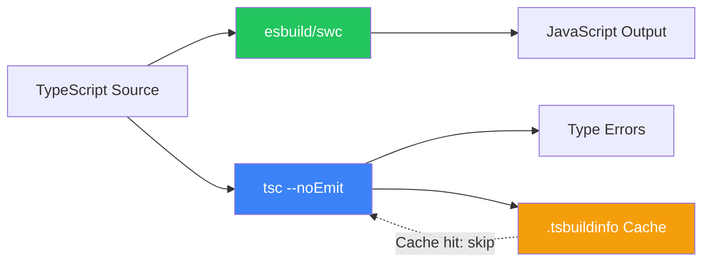

# TypeScript Build Performance at Scale

🎯 **Interview Weight:** expert (★★★) - build performance is a production
concern tested at senior/staff roles in TypeScript-heavy organizations

---

### 🎯 Model Answer

**30 seconds:**

> TypeScript build performance at scale requires: incremental compilation
> (`incremental: true` + `.tsbuildinfo`), project references for monorepos
> (`composite: true`), `skipLibCheck: true` for faster lib validation,
> separating type-checking from transpilation (tsc for types, esbuild/swc
> for compilation), and profiling with `--extendedDiagnostics`. The key
> insight: TypeScript compilation and type-checking are separable concerns.

**3 minutes:**

> Performance levers in order of impact:
>
> 1. Transpile-only for non-type-check steps: esbuild/swc transforms
>    TypeScript 10-100x faster than tsc (they skip type-checking entirely)
> 2. Incremental compilation: `incremental: true` caches parsed files
>    in `.tsbuildinfo` - only reprocesses changed files
> 3. Project references: `composite: true` splits large codebases into
>    units, enabling parallel compilation and cross-project caching
> 4. `skipLibCheck: true`: skip `.d.ts` file validation (~20-30% faster
>    in declaration-heavy projects)
> 5. `isolatedModules: true`: ensures each file is self-contained,
>    allowing file-parallel tools to work correctly
> 6. Type complexity reduction: `any`-heavy imports, named intermediate
>    types instead of inline complex types

**Blank Mind Recovery:**

**(1) Restate:** "TypeScript build performance: separate transpilation
(esbuild/swc, fast) from type-checking (tsc, correct). Incremental builds
with `.tsbuildinfo`. Project references for monorepos. skipLibCheck for
faster startup. Profile with --extendedDiagnostics."

---

### 📘 Concept Explanation

**What it is:**

TypeScript build performance is the set of strategies for reducing
compilation time in development (watch mode) and CI/CD pipelines.
TypeScript compilation has two distinct phases: transpilation (convert
TS to JS) and type-checking (verify types). These can be run separately
with different tools.

**The problem it solves:**

In large codebases (100K+ lines, 50+ packages), `tsc` compilation can
take 2-10+ minutes. This breaks developer flow (long wait times) and
slow CI pipelines (expensive). Build performance optimization reduces
this to seconds.

**How it works:**

```
TYPESCRIPT BUILD PHASES:

  1. PARSING: read .ts files, build AST
  2. BINDING: resolve names, build symbol table
  3. TYPE-CHECKING: verify type correctness
  4. EMITTING: produce .js + .d.ts + .map output

  TOOLS BY PHASE:

    tsc (TypeScript compiler):
      All 4 phases
      Slow: O(n) type-checking for each file change
      Correct: full type safety

    esbuild / swc / Babel:
      Phases 1 + 4 only (skip type-checking)
      Fast: ~100x faster than tsc
      Unsafe: no type errors caught

    Vite (development):
      Uses esbuild for transpilation
      Optional tsc --noEmit for type-checking (separate step)

    ts-jest / @swc/jest:
      swc for test transpilation (10-40x faster than ts-jest)

INCREMENTAL COMPILATION:

  // tsconfig.json:
  { "compilerOptions": {
      "incremental": true,
      "tsBuildInfoFile": ".tsbuildinfo"
  } }

  // First build: full compilation (slow)
  // Subsequent builds: only changed files + their dependents
  // .tsbuildinfo tracks which files changed (hash-based)

  // Savings: 90%+ time reduction for small changes

  // NOTE: incremental does NOT skip type-checking
  //       it skips re-parsing unchanged files

PROJECT REFERENCES (monorepo):

  // packages/core/tsconfig.json:
  {
    "compilerOptions": {
      "composite": true,     // Required
      "declaration": true,   // Required: must emit .d.ts
      "outDir": "dist"
    }
  }

  // packages/api/tsconfig.json:
  {
    "references": [{ "path": "../core" }]
  }

  // Build command:
  tsc --build packages/api
  // Only rebuilds core if it changed
  // Parallelizes independent packages

  // Benefits:
  //   - Incremental per-package (not per-file)
  //   - Parallel compilation of independent packages
  //   - Type errors in core caught before api build

TRANSPILE-ONLY SPLIT:

  // Development watch (fast iteration):
  // package.json:
  {
    "scripts": {
      "dev": "tsx watch src/index.ts",  // tsx = fast, no type-check
      "type-check": "tsc --noEmit",     // types only, no emit
      "build": "tsc"                    // full compilation
    }
  }

  // CI pipeline:
  // Step 1: npx tsc --noEmit  (type-check only, ~30s)
  // Step 2: npx esbuild src/index.ts --bundle (transpile, ~1s)

  // Developer workflow:
  // - File save -> tsx reloads in <1s (no type check)
  // - On demand: tsc --noEmit (full type check)
  // - Pre-commit: tsc --noEmit (catches all errors before push)

PROFILING COMMANDS:

  # Check compilation time:
  npx tsc --noEmit --diagnostics
  # Output: Files: 234, Lines: 45678, Check time: 8.21s

  # Detailed phase timing:
  npx tsc --noEmit --extendedDiagnostics
  # Shows: ioReadTime, parseTime, bindTime, checkTime, emitTime

  # Trace type resolution:
  npx tsc --noEmit --traceResolution 2>&1 | head -50
  # Shows every file TypeScript attempted to find

  # Find the slowest types:
  npx tsc --noEmit --generateTrace ./trace-output/
  # Produces a Chrome DevTools trace for type-checking analysis
```

**Why it matters:**

Slow builds kill developer productivity. A 5-minute CI TypeScript check
is a $0.50+ per commit waste and kills feedback loops. Understanding
build performance enables choosing the right tool for each situation:
esbuild for speed, tsc for correctness.

**Mental model:**

> TypeScript build performance is like separating "spelling check"
> (transpilation) from "grammar check" (type-checking). Spelling check
> (esbuild) is 100x faster - just transform the text. Grammar check
> (tsc) is thorough but slow - it understands the whole program.
> For development speed: run spelling check continuously. For correctness:
> run grammar check before shipping.

**Scale behavior:**

In a 100-package monorepo, without project references, any change
triggers a full rebuild of everything. With project references, only
the changed package and its direct/indirect dependents rebuild. At
Stripe/Slack scale (1M+ TS lines), this difference is hours vs minutes.

---

### 💻 Code Example

**Measuring and optimizing TypeScript build performance**

```typescript
// STEP 1: MEASURE BASELINE
// npx tsc --noEmit --diagnostics
// Output:
//   Files:            347
//   Lines of Library: 23456
//   Lines of Source:  89012
//   Symbols:          456789
//   Types:            123456
//   Memory used:      512 MB
//   Check time:       45.21s  <- This is the problem

// STEP 2: DIAGNOSE with extendedDiagnostics
// npx tsc --noEmit --extendedDiagnostics
// ioReadTime:       2.5s
// parseTime:        3.2s
// bindTime:         4.1s
// checkTime:        38.8s  <- Type-checking is the bottleneck
// emitTime:         0.0s   <- noEmit skips this

// STEP 3: APPLY FIXES

// Fix A: skipLibCheck (quick win, ~20-30% faster)
// tsconfig.json:
{
  "compilerOptions": {
    "skipLibCheck": true  // Skip .d.ts type validation
  }
}
// Before: 45.21s -> After: 34.5s

// Fix B: incremental compilation
{
  "compilerOptions": {
    "incremental": true,
    "tsBuildInfoFile": ".tsbuildinfo"
  }
}
// First build: 34.5s, Subsequent (single file change): 3.2s

// Fix C: Split type-check from transpile
// package.json scripts:
{
  "dev": "tsx watch src/index.ts",      // 0.1s reload (no types)
  "type-check": "tsc --noEmit --watch", // parallel type checking
  "build:types": "tsc --emitDeclarationOnly",
  "build:js": "esbuild src/index.ts --bundle --outdir=dist"
}

// Fix D: Move complex types to named aliases
// BAD: inline complex type (re-evaluated at each usage)
function transform<T>(
  items: T[],
  fn: (item: T, idx: number, all: T[]) => unknown
) { ... }

// GOOD: named intermediate type
type Transformer<T> = (item: T, idx: number, all: T[]) => unknown;
function transform<T>(items: T[], fn: Transformer<T>) { ... }
// TypeScript caches Transformer<T> by name

// STEP 4: PROJECT REFERENCES for monorepo
// Before (no references): tsc compiles all 100 packages every time
// After (with references): tsc --build api only rebuilds core if changed
// Reduction: 45s -> 6s for typical single-package change
```

> **Code walkthrough:** The diagnostic output shows checkTime dominates
> at 38.8 seconds out of 45.21 total. This is typical for type-heavy
> codebases. `skipLibCheck` removes `.d.ts` validation - risky in
> libraries (might miss type errors in dependencies) but standard in
> applications. Incremental compilation is the highest-value change
> for development builds: the first build is still slow, but a single
> file change rebuild drops from 34s to 3s. The `tsx watch` script
> bypasses TypeScript type-checking entirely for the dev server restart
> loop - developers get <100ms hot reload while TypeScript type-checking
> runs in a parallel terminal.

---

### 🎓 Answers by Seniority

**Junior / Mid:**

> TypeScript builds can be slow in large projects. Key optimizations:
> `skipLibCheck: true` skips .d.ts validation (faster but less safe).
> `incremental: true` caches compilation between runs. For development,
> tools like `tsx` or `ts-node --transpile-only` skip type-checking
> for faster restarts. Run `tsc --noEmit` separately for type checking.

**Senior / Staff:**

> The core insight is that TypeScript compilation and type-checking
> are separable concerns. In a typical build pipeline: esbuild handles
> transpilation (10-100x faster than tsc, zero type-checking). tsc
> `--noEmit` handles type-checking (parallel, non-blocking). Project
> references enable per-package incremental compilation in monorepos.
> Profiling with `--generateTrace` identifies the specific types causing
> slow compilation - often a single complex conditional type or deeply
> recursive type. The `tsc --diagnostics` output's "Types" count is
> the early warning indicator: >100K types means complex inference is
> happening; >500K types means there's a performance problem.

---

### ⚖️ Comparison Table

| Tool | Speed | Type-safe | Use case |
|---|---|---|---|
| `tsc` (full) | Slow (minutes) | Yes | CI final type check, library build |
| `tsc --noEmit` | Medium (seconds) | Yes | Type-check only step |
| `esbuild` | Fast (< 1s) | No | Development build, bundling |
| `swc` | Fast (< 1s) | No | Jest transforms, fast transpile |
| `tsx` / `ts-node` | Fast (< 1s) | No | Development server |
| `tsc --incremental` | Medium (after cache) | Yes | CI incremental check |
| Project references | Medium (per package) | Yes | Monorepo builds |

---

### 🏛️ System Design

**TypeScript build pipeline for a large monorepo**

```
MONOREPO STRUCTURE:
  packages/
    shared/     (utilities, no deps)
    models/     (domain types, depends on shared)
    api/        (service, depends on models + shared)
    web/        (frontend, depends on models + shared)

BUILD PIPELINE (CI/CD):

  PARALLEL TYPE-CHECK:
    shared: tsc --noEmit        (baseline check)
    models: tsc --noEmit        (baseline check)
    api:    tsc --noEmit        (after models done)
    web:    tsc --noEmit        (after models done)

  PARALLEL TRANSPILE (after type-check passes):
    api:    esbuild --bundle    (< 2 seconds)
    web:    vite build          (< 30 seconds)

  TIMING:
    Without optimization: 8 min (sequential tsc for all)
    With project refs:    90s (parallel per package)
    With type-check split: 60s (type-check) + 30s (build) = 90s
    With cache hit:       15s (only changed packages)

DEVELOPER WORKFLOW:
  Terminal A: tsx watch src/index.ts   # <100ms restarts
  Terminal B: tsc --noEmit --watch     # background type errors
  Terminal C: jest --watch             # test feedback

  Pre-push hook:
    npx tsc --noEmit  # must pass before push
```

---

### 📊 Diagram

```
TYPESCRIPT BUILD PIPELINE:

  SOURCE (.ts files)
       |
       +----> esbuild/swc -----> JavaScript (.js)  [fast, no types]
       |          ^10-100x faster
       |
       +----> tsc --noEmit ----> Type errors        [slow, correct]
                  |
                  +-> incremental: .tsbuildinfo cache

  MONOREPO:

  shared/ (composite: true)
    |
    +----> models/ (references: [shared])
               |
               +----> api/ (references: [shared, models])
               |
               +----> web/ (references: [shared, models])

  tsc --build api: only rebuilds shared/models if they changed
```



> **Diagram walkthrough:** The pipeline splits on two lanes. The esbuild
> lane (green) produces JavaScript output without type-checking at
> 10-100x tsc speed. The tsc lane (blue) produces type error reports
> without JavaScript output via `--noEmit`. The `.tsbuildinfo` cache
> (yellow) allows the tsc lane to skip unchanged files. In practice:
> the esbuild lane runs on every save; the tsc lane runs in background
> watch mode or as a pre-commit hook.

---

### ⚠️ Common Misconceptions

**"esbuild or swc replace TypeScript type checking"**

esbuild and swc are TRANSPILERS - they convert TypeScript to JavaScript
by stripping types without validating them. They do NOT run type-checking.
You can write `const x: string = 42` and esbuild/swc will compile it
without error. For production code, `tsc --noEmit` must run as a separate
step to catch type errors. The common CI pattern: esbuild handles the
build (fast), tsc handles type validation (parallel, blocking promotion
if it fails). Skipping `tsc --noEmit` means TypeScript is providing
zero runtime safety - it's just expensive import syntax.

---

### 🚨 Failure Modes and Diagnosis

**Diagnosing slow TypeScript compilation:**

```typescript
// STEP 1: Get the baseline
// npx tsc --noEmit --diagnostics
// Look for:
//   - Files > 500 -> check if you're accidentally including node_modules
//   - Types > 100K -> complex type inference happening
//   - Check time > 30s -> type complexity problem

// STEP 2: Check for accidentally included files
// npx tsc --noEmit --listFiles | head -30
// Common issue: node_modules included via bad tsconfig
// Check tsconfig.json include/exclude:
{
  "include": ["src/**/*"],  // Be explicit
  "exclude": [              // Explicitly exclude
    "node_modules",
    "dist",
    "**/*.test.ts"
  ]
}

// STEP 3: Generate trace for deep analysis
// npx tsc --noEmit --generateTrace ./trace
// Open trace/trace.json in chrome://tracing
// Look for: "checkSourceFile" entries with > 1s duration
// These are the files with expensive types

// STEP 4: Find expensive types
// Regex search for common slow patterns:
// - Deep conditional types: T extends X ? Y : Z nested 5+ levels
// - Recursive types: type Deep<T> = T extends object ? ...
// - Large mapped types over huge unions

// STEP 5: Fix expensive types
// SLOW: inline complex type (re-evaluated everywhere)
function process<T extends { data: unknown[] }>(x: T) { ... }
// FAST: named intermediate type
type DataHolder = { data: unknown[] };
function process<T extends DataHolder>(x: T) { ... }

// VERIFY improvement:
// npx tsc --noEmit --diagnostics
// Confirm check time dropped
```

---

### 🎯 Interview Deep-Dive

| Scenario | Time | Key Signal |
|---|---|---|
| tsc vs esbuild vs swc | 3-4 min | What each does |
| incremental compilation | 3-4 min | .tsbuildinfo mechanism |
| Project references for monorepo | 4-5 min | composite + references |
| skipLibCheck tradeoffs | 2-3 min | Speed vs safety |
| Transpile vs type-check split | 3-4 min | Pipeline design |
| --extendedDiagnostics usage | 2-3 min | Profiling |
| isolatedModules requirement | 2-3 min | Bundler compat |
| Named types for perf | 2-3 min | Caching behavior |
| generateTrace for deep analysis | 3-4 min | Chrome tracing |
| CI pipeline design | 4-5 min | Parallel type-check |
| Watch mode strategies | 2-3 min | Developer experience |
| Slow compilation root causes | 3-4 min | Diagnosis |

---

**Q1: How would you design a TypeScript build pipeline for a 50-package
monorepo?** `[STAFF]` SYSTEM DESIGN

> **Answer:**
>
> ```
> MONOREPO BUILD DESIGN:
>
> PACKAGE STRUCTURE:
>   shared/       # no deps (L0)
>   models/       # depends on shared (L1)
>   services/     # depends on shared, models (L2)
>   api/          # depends on all (L3)
>   web/          # depends on shared, models (L3)
>
> TSCONFIG PER PACKAGE:
>   // shared/tsconfig.json
>   { "compilerOptions": { "composite": true, "declaration": true } }
>
>   // api/tsconfig.json
>   { "references": [
>       { "path": "../shared" },
>       { "path": "../models" },
>       { "path": "../services" }
>   ] }
>
> CI PIPELINE (parallel stages):
>   Stage 1: tsc --build shared (1 package)
>   Stage 2: tsc --build models, tsc --build services (parallel)
>   Stage 3: tsc --build api, tsc --build web (parallel)
>
>   Total: 3 serial stages (vs 50 sequential without refs)
>
> DEVELOPMENT:
>   pnpm turbo dev    # Turborepo handles incremental per package
>   Package watch:    tsx watch src/index.ts (per package)
>   Type-check watch: tsc --build --watch (across refs)
>
> CACHING (Turborepo/Nx):
>   .tsbuildinfo per package
>   Remote cache (S3): CI builds reuse cache across PRs
>   Cache key: hash of source files + tsconfig
> ```
>
> *What separates good from great:* The layered dependency graph enables
> parallelization. `tsc --build` respects the reference graph and only
> rebuilds packages whose inputs (source files or upstream package types)
> changed. With remote caching (Turborepo, Nx, Bazel), even the initial
> build on a fresh CI runner can use cache from previous runs on the
> same commit. The rule: L0 packages are always fast to build (no deps);
> the build graph depth, not breadth, determines minimum build time.

**Q2: What is the difference between incremental compilation and project
references?** `[SENIOR]` MECHANISM

> **Answer:**
>
> ```
> INCREMENTAL COMPILATION (single package):
>   - Flag: "incremental": true
>   - Scope: within a single tsconfig / package
>   - Mechanism: .tsbuildinfo tracks which files changed (by hash)
>   - Benefit: skip re-parsing unchanged files
>   - Limit: still re-type-checks all files in the project
>   - Savings: 60-90% reduction for small changes (parse dominates)
>
> PROJECT REFERENCES (across packages):
>   - Flags: "composite": true + "references": [...]
>   - Scope: across multiple packages/tsconfigs
>   - Mechanism: each package emits .d.ts files
>     consuming packages import from .d.ts (not source .ts)
>   - Benefit: completely skip unchanged packages
>   - Limit: requires "declaration": true, adds build step
>   - Savings: 90%+ for large monorepos (package-level skip)
>
> COMPARISON:
>   Single package (100 files), 1 file changed:
>     Without incremental: parse all 100 files (3s)
>     With incremental:    parse 1 file (0.1s)
>
>   Monorepo (50 packages), 1 package changed:
>     Without references: rebuild all 50 (120s)
>     With references:    rebuild 1 + dependents (15s)
>
> COMBINE BOTH:
>   "composite": true implies "incremental": true
>   Use both for maximum coverage
> ```
>
> *What separates good from great:* Project references are architecturally
> significant beyond performance: they enforce package boundaries at
> compile time. A package can only import from packages listed in its
> `references`. Circular references cause a compile error (preventing
> circular package dependencies which cause runtime issues). The `.d.ts`
> contract between packages means implementation details leak less -
> consumers see only the declared types, not the implementation source.

**Q3: When should you use esbuild/swc vs tsc for compilation?** `[SENIOR]`
DECISION

> **Answer:**
>
> ```
> USE tsc WHEN:
>   - Emitting .d.ts files for a library
>     (esbuild can't generate accurate declaration files)
>   - You need to verify types in the same step as compilation
>   - Using TypeScript features that esbuild doesn't support:
>     * const enum (inlined by tsc, not by esbuild)
>     * emitDecoratorMetadata (required for NestJS DI)
>     * Paths aliases (esbuild needs separate plugin)
>
> USE esbuild/swc WHEN:
>   - Development builds (speed > safety)
>   - CI transpilation step (after tsc type-check passes)
>   - Jest transforms (replace ts-jest with @swc/jest)
>   - Serverless functions where cold start matters
>
> PRACTICAL SPLIT:
>   Development: tsx (esbuild-based) for server
>   Type-check:  tsc --noEmit --watch (parallel terminal)
>   CI:          npx tsc --noEmit (type gate)
>               + esbuild/vite for actual bundle
>   Library:     tsc --declaration --emitDeclarationOnly
>               + esbuild for .js output (or tsc for both)
>
> CAUTION with esbuild:
>   - const enum: esbuild emits the enum as object (not inlined)
>     -> types differ from tsc output
>   - emitDecoratorMetadata: not supported
>     -> NestJS must use tsc or ts-jest
>   - Paths: require plugins or post-processing
> ```
>
> *What separates good from great:* The const enum difference is a
> subtle footgun. TypeScript with `const enum { A = 0, B = 1 }` inlines
> usages to `0` and `1` - no object at runtime. esbuild keeps the enum
> as a regular JavaScript object. If library A is compiled with tsc
> (inlined const enum) and consumed by application B compiled with
> esbuild (object enum), the types disagree. This is one reason the
> TypeScript team discourages `const enum` in published libraries.

**Q4: How do you use --generateTrace to diagnose slow type checking?**
`[STAFF]` DEBUGGING

> **Answer:**
>
> ```typescript
> // STEP 1: Generate trace
> npx tsc --noEmit --generateTrace ./trace-output
> // Creates: ./trace-output/trace.json and types.json
>
> // STEP 2: Open Chrome DevTools trace
> // Navigate to chrome://tracing
> // Load trace-output/trace.json
>
> // STEP 3: Identify expensive type operations
> // Look for "checkSourceFile" with long duration
> // These are source files with expensive type inference
>
> // STEP 4: Identify slow type instantiations
> // types.json lists type instantiation counts
> // High count = type is instantiated many times
>
> // COMMON FINDINGS:
>
> // Finding: checkSourceFile "prisma.d.ts" = 15s
> // Fix: skipLibCheck: true (skip declaration file checking)
>
> // Finding: type "DeepPartial<Config>" instantiated 5000 times
> // Fix: compute once and cache:
> type CachedDeepPartial = DeepPartial<Config>;
> // Use CachedDeepPartial everywhere instead of DeepPartial<Config>
>
> // Finding: recursive type causing depth limit
> // Error: "Type instantiation is excessively deep and possibly infinite"
> // Fix: limit recursion depth or use a different approach:
>
> // SLOW: unlimited recursion
> type Nested<T> = T extends object
>   ? { [K in keyof T]: Nested<T[K]> }
>   : T;
>
> // FAST: bounded depth (pragmatic limit)
> type Nested<T, Depth extends number = 5> =
>   Depth extends 0 ? T :
>   T extends object ? {
>     [K in keyof T]: Nested<T[K], [-1,0,1,2,3,4][Depth]>
>   } : T;
> ```
>
> *What separates good from great:* The `--generateTrace` output is a
> full type-checking execution trace compatible with Chrome's performance
> profiler. It shows every type instantiation, every source file check,
> and the exact time spent on each. The `types.json` file specifically
> lists types by instantiation count - a type instantiated 10,000 times
> is a performance problem even if each instantiation is fast. This is
> how the TypeScript team and library authors (Prisma, TypeORM) diagnose
> performance regressions in their type definitions.

**Q5: What is isolatedModules and why is it important for build tools?**
`[SENIOR]` MECHANISM

> **Answer:**
>
> ```typescript
> // isolatedModules: true ensures each file can be compiled in isolation
> // (without reading other .ts files)
> // Required by: esbuild, swc, Babel, Vite (they process one file at a time)
>
> // PATTERN 1 THAT BREAKS isolatedModules:
> // Re-exporting types without 'type' keyword
> // source.ts:
> export interface User { name: string }  // type-only export
>
> // re-export.ts:
> export { User } from './source';
> // ERROR with isolatedModules: "User" may be a type
> // A single-file compiler can't know if User is a value or type
>
> // FIX: explicit type re-export
> export type { User } from './source';
> // 'type' keyword = safe to strip without cross-file analysis
>
> // PATTERN 2 THAT BREAKS:
> const enum Direction { Up, Down }
> // ERROR: const enum requires cross-file analysis to inline
> // FIX: use regular enum or string literal union
>
> // PATTERN 3 THAT BREAKS:
> namespace MyNS { export function helper() {} }
> // ERROR: namespaces (non-module) require global scope analysis
> // FIX: use ES modules instead of namespaces
>
> // WHY IT MATTERS:
> // Vite, esbuild, swc all process one file at a time (parallelizable)
> // With isolatedModules, TypeScript catches patterns that ONLY work
> // with full cross-file analysis -> ensures tool compatibility
> // Without it: your code type-checks but esbuild compilation fails at runtime
> ```
>
> *What separates good from great:* `isolatedModules: true` is a contract
> between your TypeScript code and the build tools. It prevents you from
> using patterns that only work with full TypeScript compiler analysis.
> The `export type { User }` syntax it requires is also better practice
> regardless: it's explicit about intent and enables better dead code
> elimination (bundlers can safely drop type-only imports without
> side-effect analysis). Vite sets `isolatedModules: true` by default
> in its generated tsconfig - and any TypeScript project using Vite
> should respect this.
