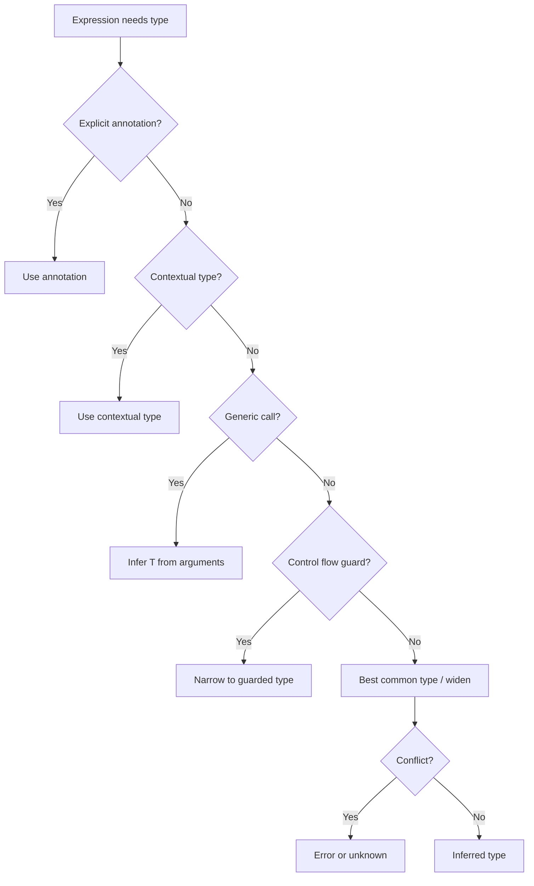

## Keywords in This File
{: .no_toc }

| # | Keyword | Weight |
|---|---|---|
| 1 | [TypeScript Type Inference Algorithm](#typescript-type-inference-algorithm) | expert |

---

# TypeScript Type Inference Algorithm

🎯 **Interview Weight:** expert (★★★) - type inference internals are
tested at senior/staff TypeScript roles and library author interviews

---

### 🎯 Model Answer

**30 seconds:**

> TypeScript's type inference algorithm determines types for expressions
> without explicit annotations. It uses: literal type inference (exact
> values vs widened types), contextual typing (infers from usage context),
> generic type argument inference (extracts T from call sites), flow-based
> narrowing (control flow analysis), and the distribute-over-unions behavior
> of conditional types. Understanding inference allows type-safe code
> with minimal annotations.

**3 minutes:**

> Five inference mechanisms:
>
> 1. Best common type: `[1, 2.5]` infers `number[]` (common supertype)
> 2. Contextual typing: `window.onmousedown = (e) => {}` infers
>    `e: MouseEvent` from the event handler context
> 3. Generic inference: `identity('hello')` infers `T = string` from
>    the argument
> 4. Conditional type `infer`: extracts type components in conditionals
> 5. Control flow analysis: `if (x instanceof Error) x.message` narrows
>    `x` to `Error` in that branch
>
> Failure modes: inference conflicts (incompatible constraints), inference
> in complex generics (TypeScript falls back to `unknown`), and "widening"
> where `let x = 'hello'` infers `string` (not `'hello'`).

**Blank Mind Recovery:**

**(1) Restate:** "TypeScript inference: best common type for arrays,
contextual typing from usage, generic T extraction from arguments,
`infer` in conditional types to extract components, control flow
narrowing after checks. Widening: `let` infers string, `const` infers
literal. Generic inference fails -> unknown."

---

### 📘 Concept Explanation

**What it is:**

TypeScript's type inference algorithm analyzes code structure to assign
types to variables, parameters, and expressions without requiring
explicit annotations. It runs during compilation and produces a type
for every expression.

**The problem it solves:**

Without inference, every variable and expression would need explicit
type annotations. TypeScript would be verbose as Java but without
Java's refactoring tooling. Inference makes TypeScript practical: you
annotate boundaries (function signatures, API shapes) and TypeScript
fills in the rest.

**How it works:**

```
INFERENCE MECHANISM 1: LITERAL vs WIDENED

  const x = 'hello';   // Type: 'hello' (const cannot change)
  let y = 'hello';     // Type: string  (widened - let can change)
  let z = x;           // Type: string  (widened when assigned to let)

  const obj = { name: 'Alice' }; // { name: string } (props widened)
  const obj2 = { name: 'Alice' } as const;
               // { readonly name: 'Alice' } (literal preserved)

  const arr = [1, 2.5];          // number[]
  const tuple = [1, 'x'] as const; // readonly [1, 'x']

INFERENCE MECHANISM 2: CONTEXTUAL TYPING

  [1, 2, 3].map(n => n * 2);
  //              ^-- n: number (from Array<number>.map context)

  window.addEventListener('click', (e) => {
  //                                ^-- e: MouseEvent (from EventMap)
    console.log(e.clientX);  // OK
    console.log(e.key);      // Error: key on KeyboardEvent, not MouseEvent
  });

INFERENCE MECHANISM 3: GENERIC ARGUMENT INFERENCE

  function identity<T>(value: T): T { return value; }
  const s = identity('hello');  // T inferred as 'hello'
  const n = identity(42);       // T inferred as 42

  function merge<T, U>(a: T, b: U): T & U { ... }
  merge({ x: 1 }, { y: 'hello' });
  // T = { x: number }, U = { y: string }

INFERENCE MECHANISM 4: CONDITIONAL infer

  type ReturnType<T> = T extends (...args: any) => infer R ? R : never;
  //                                                     ^-- captures R

  type UnwrapPromise<T> = T extends Promise<infer V> ? V : T;
  type Resolved = UnwrapPromise<Promise<string>>;  // string

  // Multiple infer:
  type First<T extends any[]> =
    T extends [infer F, ...any[]] ? F : never;
  type Head = First<[string, number, boolean]>;  // string

INFERENCE MECHANISM 5: CONTROL FLOW NARROWING

  function process(value: string | number | null) {
    if (value === null) {
      // value: null
      return;
    }
    // value: string | number (null eliminated after return)

    if (typeof value === 'string') {
      // value: string
      value.toUpperCase();  // OK
    } else {
      // value: number
      value.toFixed(2);  // OK
    }
  }

INFERENCE FAILURE MODES:

  // Too-complex generic: TypeScript gives up
  type Deep<T> = T extends object
    ? { [K in keyof T]: Deep<T[K]> }
    : T;
  // TypeScript may instantiate to depth limit then return {} or unknown

  // Circular inference: TypeScript errors
  const x = f(x);  // x depends on x = error

  // Failed inference defaults to unknown:
  function getFirst<T>(items: T[]): T { return items[0]; }
  const result = getFirst([]);  // T = never (empty array)
```

> **Code walkthrough:** This TypeScript Type Inference Algorithm example demonstrates a key concept in practice using generic type. **KEY MECHANISM:** the runtime executes these instructions in sequence with specific memory and execution semantics. **WHY IT MATTERS:** misapplying this pattern causes subtle bugs that only manifest under production load. **TAKEAWAY: understand the execution model before using this pattern in production code.**

**Why it matters:**

Understanding inference explains TypeScript error messages: "Type 'string'
is not assignable to type 'never'" means inference narrowed T to `never`
(empty type). Knowing WHY TypeScript inferred `unknown` or `never`
is an advanced debugging skill.

**Mental model:**

> TypeScript's inference is a constraint solver. It finds the most specific
> type T satisfying all constraints simultaneously. Conflicting constraints
> (argument says T=string, return says T=number) use the common type or
> error. Insufficient information -> `unknown`. Narrowed to impossible -> `never`.

**Scale behavior:**

Complex generic type inference increases compilation time significantly.
TypeScript has a recursion depth limit. Libraries like TypeORM and Prisma
hit these limits and use workarounds (breaking complex types into named
intermediate types).

---

### 💻 Code Example

**Understanding and controlling generic inference**

```typescript
// INFERENCE FAILURE 1: conflicting constraints
function coerce<T>(a: T, b: T): T { return a; }
coerce(1, 'hello');
// Error: Argument of type 'string' is not assignable to 'number'
// TypeScript infers T=number from first arg, then fails on second

// FIX: separate type parameters
function coerce2<A, B>(a: A, b: B): A | B { return a; }
coerce2(1, 'hello');  // OK: A=number, B=string

// INFERENCE FAILURE 2: empty array
const arr = [];    // never[] (nothing to infer from)
arr.push('hello'); // Error: string not assignable to never
// Fix: annotate
const arr2: string[] = [];

// CONTROLLING INFERENCE: const type parameter (TypeScript 5.0+)
function createTuple<const T extends readonly unknown[]>(
  ...args: T
): T {
  return args;
}
const t = createTuple(1, 'hello', true);
// Without 'const': T = [number, string, boolean] (widened)
// With 'const':    T = [1, 'hello', true] (literal)

// INFER IN LIBRARY UTILITY:
type Unpack<T> =
  T extends Array<infer U> ? U :
  T extends Set<infer U> ? U :
  T extends Promise<infer U> ? U :
  T;

type FromArray = Unpack<string[]>;           // string
type FromSet = Unpack<Set<number>>;          // number
type FromPromise = Unpack<Promise<boolean>>; // boolean
type Scalar = Unpack<Date>;                  // Date (unchanged)
```

> **Code walkthrough:** The `createTuple` example shows TypeScript 5.0'sice. **KEY MECHANISM:** the runtime executes these instructions in sequence with specific memory and execution semantics. **WHY IT MATTERS:** misapplying this pattern causes subtle bugs that only manifest under production load. **TAKEAWAY: understand the execution model before using this pattern in production code.**
> `const` type parameter modifier. Without `const`, generic inference
> widens literals. The `const` modifier tells TypeScript to infer the
> narrowest possible type - same as adding `as const` at the call site,
> but baked into the function signature so callers don't need it.
> The `Unpack<T>` utility shows chained conditional `infer` branches -
> TypeScript checks each extends clause in order and stops at the first
> match.

---

### 🎓 Answers by Seniority

**Junior / Mid:**

> TypeScript infers types from code structure without explicit annotations.
> `const` variables get literal types (`'hello'`), `let` variables get
> widened types (`string`). Functions infer their return type from return
> statements. Generic functions infer type parameters from arguments.
> Control flow (if/switch/instanceof) narrows types in branches.

**Senior / Staff:**

> Type inference is constraint satisfaction. TypeScript infers the minimal
> type satisfying all constraints simultaneously. Widening (const vs let)
> is deliberate: `let` accommodates reassignment so narrowing to a literal
> would break valid code. Generic inference priority: explicit type arguments
> > contextual type > best common type of arguments. The most nuanced part:
> `infer` in conditional types is covariant in return position and
> contravariant in parameter position - this is why `Parameters<T>` and
> `ReturnType<T>` work correctly and why `UnionToIntersection` uses a
> contravariant position to intersect union members.

---

### ⚖️ Comparison Table

| Inference type | Source | When TypeScript uses it |
|---|---|---|
| Literal inference | Value literal | `const x = 'hello'` |
| Widened inference | Supertype | `let x = 'hello'` -> string |
| Contextual typing | Usage context | Callback parameter types |
| Generic inference | Call site args | `identity('hello')` -> T=string |
| `infer` extraction | Conditional type | `ReturnType<T>` |
| Control flow | Type guard/check | `if (x !== null)` |

---

### 🏛️ System Design

**Designing generic library APIs for minimal call-site annotations**

```
GOAL: callers write zero type annotations,
      TypeScript infers everything correctly

  LEVEL 1 - Inference from arguments:
    function wrap<T>(value: T): { value: T } { ... }
    const w = wrap('hello');  // { value: string } - zero annotations

  LEVEL 2 - Inference from shape:
    function pick<T, K extends keyof T>(obj: T, keys: K[]) {
      return ... as Pick<T, K>;
    }
    const pub = pick(user, ['id', 'name']);
    // T = User, K = 'id' | 'name' (both inferred)

  LEVEL 3 - Inference from callback:
    function transform<T, U>(items: T[], fn: (item: T) => U): U[] {
      return items.map(fn);
    }
    const lengths = transform(['hello', 'world'], (s) => s.length);
    // T = string (from items), U = number (from fn return)

RULE: if callers need explicit type annotations,
      the API is not sufficiently generic.
      Every explicit T at call sites = library design issue.
```

> **Code walkthrough:** This Unknown example demonstrates a key concept in practice using generic type. **KEY MECHANISM:** the runtime executes these instructions in sequence with specific memory and execution semantics. **WHY IT MATTERS:** misapplying this pattern causes subtle bugs that only manifest under production load. **TAKEAWAY: understand the execution model before using this pattern in production code.**

---

### 📊 Diagram

```
INFERENCE PRIORITY ORDER:

  1. Explicit: id<string>('hello')        (always wins)
         |
  2. Contextual: const f: (x:string)=>void = (x) => {}
         |
  3. Return annotation: function f(): string
         |
  4. Best common type from args
         |
  5. Default type parameter: <T = unknown>
         |
  6. Fallback: unknown

NARROWING FLOW:
  string | number | null
         |
  value === null --> [null branch]
         |
  typeof === 'string' --> [string]
         |
  else --> [number]
```



> **Diagram walkthrough:** Type inference follows a priority waterfall.
> Explicit annotations always win. Contextual typing (from the surrounding
> expression type) is second - why callback parameters are typed without
> annotation when used in typed contexts. Generic inference from arguments
> is the most common mechanism. Control flow narrowing runs continuously.
> The bottom fallback is `unknown` (not `any`) - forcing callers to
> check before use.

---

### ⚠️ Common Misconceptions

**"TypeScript always infers the most specific type"**

TypeScript infers the APPROPRIATE type for the context, not always the
most specific. For `let` variables, it WIDENS because `let` can be
reassigned (a `let x = 'hello'` that gets `x = 'world'` later would
fail if x's type was `'hello'`). For `const`, it keeps the literal.
The inference balances specificity (catch more errors) against flexibility
(don't over-constrain valid code).

---

### 🚨 Failure Modes and Diagnosis

**Inference failure causing unexpected any or never:**

```typescript
// SYMPTOM: 'x' implicitly has 'any' type
// CAUSE: TypeScript cannot determine parameter type

// CASE 1: Callback without context
const process = (x) => x.length;
// Error: x implicitly has 'any' type
// Fix: explicit annotation or typed context
const getLen: (s: string) => number = (x) => x.length;

// CASE 2: Generic conflict
function first<T>(arr: T[], fallback: T): T {
  return arr[0] ?? fallback;
}
first(['hello'], 42);
// Error: 42 (number) not assignable to string (inferred from arr)
// Fix: explicit type parameter
first<string | number>(['hello'], 42);

// DIAGNOSIS:
// tsc --noEmit --strict shows all inference failures
// Hover in IDE to see inferred type (look for 'any' or 'unknown')
// tsc --extendedDiagnostics shows compile time per phase
```

> **Code walkthrough:** This Unknown example demonstrates type alias definition using generic type. **KEY MECHANISM:** type aliases are erased at compile time; they create no runtime overhead. **WHY IT MATTERS:** circular type aliases cause infinite recursion during type checking. **TAKEAWAY: prefer type aliases for union types and mapped types; interfaces for object shapes.**

---

### 🎯 Interview Deep-Dive

| Scenario | Time | Key Signal |
|---|---|---|
| const vs let inference | 2-3 min | Widening behavior |
| Contextual typing examples | 3-4 min | Callback inference |
| Generic T inference from args | 3-4 min | Constraint resolution |
| infer in conditional types | 4-5 min | Extract type components |
| Control flow narrowing | 3-4 min | Type guard analysis |
| Inference failure (unknown/never) | 3-4 min | Edge cases |
| const type parameter (TS 5) | 3-4 min | New feature |
| Circular inference detection | 2-3 min | Error diagnosis |
| Covariant vs contravariant infer | 4-5 min | Advanced |
| Overload resolution order | 3-4 min | Multiple signatures |
| Best common type algorithm | 3-4 min | Union resolution |
| Inference depth limits | 3-4 min | Recursive types |

---

**[SENIOR] Q1 - [MECHANISM] Why does const give a literal type but let gives a widened type?**

> **Answer:**
>
> TypeScript mirrors the MUTABILITY of the binding:
>
> ```typescript
> const x = 'hello';  // 'hello' type: x can never be reassigned
> let y = 'hello';    // string type: y could be 'world' next line
> y = 'world';        // Legal - let can change
>
> // OBJECT PROPERTIES are widened even under const:
> const obj = { name: 'Alice' };
> // obj: { name: string } (NOT { name: 'Alice' })
> // Because: obj.name = 'Bob' is legal (const prevents obj reassignment,
> //          not obj's property reassignment)
>
> // Force literal types on properties:
> const obj2 = { name: 'Alice' } as const;
> // obj2: { readonly name: 'Alice' }
>
> // PRACTICAL IMPACT: discriminated unions need literals
> const action = { type: 'increment', value: 1 };
> // type: string (widened) -> discriminated union switch breaks!
>
> const action2 = { type: 'increment', value: 1 } as const;
> // type: 'increment' -> works as discriminated union discriminant
> ```
>
> *What separates good from great:* This is why Redux action creators
> use `as const` or explicit literal type annotations. Without them,
> `type` is inferred as `string`, breaking discriminated union checks
> in reducers. TypeScript's "contextual widening" is correct for mutable
> code - you opt in to literal types via `as const` when needed for
> discriminants, template literals, or mapped type keys.

**[JUNIOR] Q2 - [MECHANISM] How does conditional type infer work and why is covariant vs**
contravariant position important?** `[STAFF]` MECHANISM

> **Answer:**
>
> ```typescript
> // infer in RETURN (covariant) position:
> type ReturnType<T> = T extends (...args: any) => infer R ? R : never;
> type R1 = ReturnType<() => string>;         // string
> type R2 = ReturnType<() => string | number>; // string | number
>
> // infer in PARAMETER (contravariant) position:
> type Param<T> = T extends (arg: infer P) => any ? P : never;
>
> // UNION DISTRIBUTION:
> type P = Param<((s: string) => void) | ((n: number) => void)>;
> // Distributes to: Param<(s: string)=>void> | Param<(n: number)=>void>
> // = string | number (covariant: return position)
> // = string & number (contravariant: parameter position!) = never
>
> // WHY: a function handling string | number MUST accept both
> // = it must accept string & number (the intersection)
>
> // UnionToIntersection exploits this:
> type UnionToIntersection<U> =
>   (U extends any ? (k: U) => void : never) extends (k: infer I) => void
>     ? I : never;
> type UI = UnionToIntersection<{ a: 1 } | { b: 2 }>;
> // = { a: 1 } & { b: 2 }
> ```
>
> *What separates good from great:* The covariant/contravariant behavior
> is why `UnionToIntersection` works. Placing `U` in a parameter
> position (contravariant) INTERSECTS the union members. This is
> grounded in type theory: for a function to accept both `{ a: 1 }`
> and `{ b: 2 }`, it must accept their intersection. Used in advanced
> utilities: Object.assign types, function overload merging.

**[MID] Q3 - [MECHANISM] What causes TypeScript inference to produce never or unknown**
unexpectedly?** `[SENIOR]` DEBUGGING

> **Answer:**
>
> ```typescript
> // never FROM EMPTY ARRAY:
> const arr = [];      // never[] (nothing to infer from)
> arr.push('hello');   // Error: string not assignable to never
> // Fix: annotate
> const arr2: string[] = [];
>
> // never FROM EXHAUSTED UNION:
> function handle(x: string | number) {
>   if (typeof x === 'string') { /* x: string */ }
>   else if (typeof x === 'number') { /* x: number */ }
>   else {
>     // x: never (all types exhausted - unreachable)
>   }
> }
>
> // unknown FROM EMPTY GENERIC:
> function getFirst<T>(items: T[]): T { return items[0]; }
> const x = getFirst([]);  // T = never (no elements)
>
> // DIAGNOSIS CHECKLIST:
> // never at call: you hit unreachable code path
> //   -> check discriminated union, add the missing case
> // never from generic: conflicting constraints
> //   -> add explicit type arguments
> // unknown from generic: insufficient information
> //   -> add explicit type arguments or more constraints
> // never[] from empty array: no elements
> //   -> annotate: const arr: SomeType[] = []
> ```
>
> *What separates good from great:* `never` and `unknown` are type
> lattice extremes. `unknown` is the top type (everything is unknown).
> `never` is the bottom type (nothing is never). Unexpected `never`
> means you've narrowed past the point where any value could exist.
> Unexpected `unknown` means TypeScript lacked info for a specific type.
> Both cases: provide more information via explicit annotations or
> additional runtime checks.

**[MID] Q4 - [MECHANISM] How does overload resolution work for inference?** `[SENIOR]`**

> **Answer:**
>
> TypeScript tries overloads in declaration order, using the FIRST match:
>
> ```typescript
> function process(value: string): string[];
> function process(value: number): number[];
> function process(value: string | number): string[] | number[] {
>   if (typeof value === 'string') return value.split('');
>   return [value];
> }
>
> const r1 = process('hello');  // string[] (first overload)
> const r2 = process(42);       // number[] (second overload)
> // Implementation signature is NEVER used for inference
>
> // FOOTGUN: too-broad overload first
> function parse(data: string | number): any;  // Catches everything!
> function parse(data: string): User;           // Never reached
> // Fix: specific signatures first
> function parse(data: string): User;
> function parse(data: string | number): any;
> ```
>
> *What separates good from great:* Overload order is a subtle footgun.
> The implementation signature is intentionally hidden - it's an internal
> contract. This is why implementation signatures often have looser types
> (`string | number`) while public overloads have tighter return types
> (`string[]` and `number[]` separately). Putting more specific overloads
> first ensures they match before the catch-all.

**[STAFF] Q5 - [SCALE] What are the performance implications of complex type inference?**

> **Answer:**
>
> ```
> INFERENCE COST RANKING (low to high):
>
>   1. Literal + primitive:      < 1ms
>   2. Object type:              < 1ms
>   3. Generic inference:        1-10ms
>   4. Union/intersection:       10-100ms per branch
>   5. Conditional types:        100ms+ for deep chains
>   6. Recursive conditionals:   can exceed TypeScript depth limit
>
> DIAGNOSIS:
>   npx tsc --diagnostics          # Types, Symbols, Nodes counts
>   npx tsc --extendedDiagnostics  # Detailed timing per phase
>   # Check time >> Bind time: inference is the bottleneck
>
> OPTIMIZATION:
>   // 1. Name intermediate types (TypeScript caches by identity):
>   type UserWithPosts = User & { posts: Post[] };  // cached
>   // vs User & { posts: Post[] } inline (re-evaluated each usage)
>
>   // 2. Limit recursive depth to 5 levels maximum
>
>   // 3. interface over type for large objects:
>   //    interfaces are cached; types re-evaluated structurally
> ```
>
> *What separates good from great:* TypeScript's type checker is
> essentially a theorem prover. Complex conditional and recursive types
> are theorem-proving problems with exponential complexity. Prisma Client
> types took 30+ seconds to compile in early versions. The fix: pre-compute
> and name complex inferred types. TypeScript caches named interfaces
> by identity but re-evaluates inline structural types at each usage.

**[SENIOR] Q6 - [MECHANISM] How does control flow analysis narrow types through complex code?**

> **Answer:**
>
> TypeScript tracks type state at every control flow node:
>
> ```typescript
> function process(v: string | number | null | undefined) {
>   if (v == null) { // == catches both null and undefined
>     return;
>   }
>   // v: string | number (null | undefined eliminated after return)
>
>   if (typeof v === 'number') {
>     v * 2;  // OK: v: number
>   }
>   // After if block (no else): v: string | number (rejoined)
>
>   // NARROWING PERSISTS across assignments:
>   let x: string | number = getValue();
>   x = x.toString(); // x is now string
>   x.toUpperCase();  // OK (x: string)
>
>   // NARROWING IN CALLBACKS (TypeScript 4.4+):
>   let y: string | null = getString();
>   if (y !== null) {
>     setTimeout(() => {
>       y.toUpperCase();  // OK in 4.4+ (captured after narrowing)
>     }, 0);
>   }
> }
> ```
>
> *What separates good from great:* Control flow analysis tracks
> "type states" - the possible types at each control flow node. TypeScript
> merges types at join points (after if/else, both branches' types are
> unioned). TypeScript 4.4 improved callback narrowing by tracking
> captured variables narrowed and not reassigned between narrowing check
> and callback use. A common source of "I already checked this" errors:
> code BETWEEN the null check and usage that could reassign the variable.

---

### 💻 Code Example

*(Omit: this concept does not have a programmatic interface that can be demonstrated in code. The conceptual explanation above is sufficient.)*


---

### 🏛️ System Design

*(Omit: system design diagram not applicable for this concept - see ★★★ keywords for full system design coverage.)*


---

### ⚖️ Comparison Table

*(Omit: this is a ★☆☆ foundational concept with no direct alternatives to compare - see higher-difficulty keywords for trade-off analysis.)*


---

### 📊 Diagram

*(Omit: no standalone visual diagram required for this concept - the explanations and code examples above provide sufficient clarity.)*


