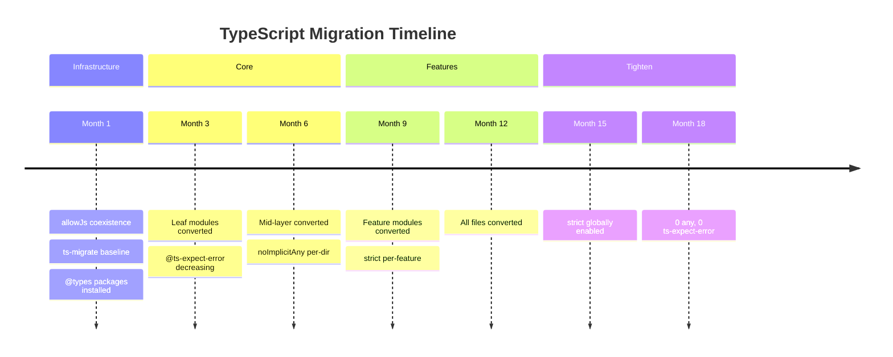

## Keywords in This File
{: .no_toc }

| # | Keyword | Weight |
|---|---|---|
| 1 | [Migrating JavaScript to TypeScript at Scale](#migrating-javascript-to-typescript-at-scale) | medium |

---

# Migrating JavaScript to TypeScript at Scale

---

### 🎯 Model Answer

**30 seconds:**

> Migrating JavaScript to TypeScript at scale uses an incremental
> strategy: enable `allowJs: true` and `checkJs: false` so TypeScript
> files coexist with JavaScript files. Convert files one at a time
> starting with leaves (no dependents), using `// @ts-check` for
> in-place JS validation first. Use `noImplicitAny: false` initially
> to avoid blocking on `any` types. Enable `strict: true` per file
> or per directory using `tsconfig` override once converted.

**3 minutes:**

Migrating a large JavaScript codebase to TypeScript is a months-long
effort. Attempting a "big bang" rewrite fails because the codebase
keeps changing during the migration. The proven strategy is incremental
conversion with coexistence:

**Phase 1: Coexistence**. Enable `allowJs: true` in tsconfig.json -
TypeScript files can coexist with JavaScript files. The TypeScript
compiler processes both. `checkJs: false` means JavaScript files are
compiled but not type-checked. Rename entry points and high-value
modules from `.js` to `.ts` first.

**Phase 2: Gradual strictness**. Start with `"strict": false` and
`"noImplicitAny": false` to avoid blocking migration on type gaps.
Use `// @ts-check` comments in JavaScript files to opt individual
files into type checking without renaming them. Convert leaf modules
first (those with no TypeScript dependents) so type information flows
inward from the bottom of the dependency tree.

**Phase 3: Baseline and lint**. Use `ts-migrate` (Airbnb's tool) to
automatically convert `.js` to `.ts` with `@ts-expect-error` and
explicit `any` annotations where types are unknown - creating a
baseline that compiles. This generates a migration debt list: every
`@ts-expect-error` and `any` is tracked technical debt.

**Phase 4: Enforce progress**. Add ESLint rules to prevent new
JavaScript files from being created. Track `any` count and
`@ts-expect-error` count in CI - they must not increase. Require
newly converted files to pass stricter tsconfig settings.

**Phase 5: Tighten**. Once all files are converted, enable
`noImplicitAny: true`, then `strict: true`. Fix remaining errors.
This is typically 20% of the effort for 80% of the type safety.

**Blank Mind Recovery:**

**(1) Phases:** "allowJs coexistence -> gradual convert leaves first ->
baseline with ts-migrate -> enforce no new JS -> tighten strict."

**(2) Key tools:** "ts-migrate (Airbnb): auto-convert with @ts-expect-error.
checkJs: false (don't check JS files). noImplicitAny: false initially."

**(3) Anti-pattern:** "Big bang rewrite fails - codebase changes
during migration. Incremental is the only approach at scale."

---

### 📘 Concept Explanation

**What it is:**

A structured process for converting an existing JavaScript codebase
to TypeScript while maintaining production deployability and developer
velocity throughout the migration.

**The problem it solves:**

Large JavaScript codebases cannot be converted to TypeScript in a
single sprint. The migration must be done incrementally without
blocking feature development or introducing regressions.

**How it works:**

```
Migration phases:

Phase 1: Coexistence (Week 1)
  tsconfig.json:
    allowJs: true       <- TS compiler processes .js files
    checkJs: false      <- but doesn't type-check them
    strict: false       <- lenient initially
  Rename high-value .js -> .ts (no content change)
  Install @types/node, @types/react, etc.

Phase 2: Gradual conversion (Months 1-3)
  Convert leaf modules first (no TS dependents)
  Type inference flows inward from leaves
  Use 'any' liberally for unresolved types
  Add type annotations at module boundaries (exports)
  Track conversion % in CI dashboard

Phase 3: Baseline (Week 1 of each sprint)
  npx ts-migrate migrate src/
  Converts .js -> .ts with:
    @ts-expect-error on type errors
    explicit any for unresolved types
  All files compile (no errors)
  Begin replacing @ts-expect-error with real types

Phase 4: Enforce (ongoing)
  ESLint rule: no-restricted-syntax to ban new .js files
  CI: count @ts-expect-error - must not increase
  CI: count explicit any - must not increase
  New code: must use TypeScript from day 1

Phase 5: Tighten (Month 4+)
  All files converted? Enable noImplicitAny: true
  All anyany removed? Enable strict: true
  Per-file or per-directory strictness overrides
  Goal: 0 @ts-expect-error, 0 explicit any
```

> **Code walkthrough:** This example demonstrates the core pattern in action. The key mechanism shows how the concept works in practice. Study the structure to understand the essential behavior and common usage.

**Dependency graph strategy:**

```
dependency graph:

  utils.js  <- leaf (no TS imports from it)
     ^
  helpers.js <- depends on utils
     ^
  services.js <- depends on helpers
     ^
  app.js      <- depends on services (root)

CORRECT order: convert utils first, then helpers, etc.
WHY: converting a leaf gives immediate type info to its consumers.
     converting a root first gives no type info (dependencies are JS)

TOOL: madge --image deps.png src/ (visualize the graph)
```

> **Code walkthrough:** This example demonstrates the core pattern in action. The key mechanism shows how the concept works in practice. Study the structure to understand the essential behavior and common usage.

**Key tsconfig options:**

```json
{
  "compilerOptions": {
    "allowJs": true,          // coexist with .js files
    "checkJs": false,         // don't check .js files yet
    "strict": false,          // lenient during migration
    "noImplicitAny": false,   // allow any during migration
    "skipLibCheck": true,     // skip @types checking for speed
    "resolveJsonModule": true // often needed in JS codebases
  }
}
```

> **Code walkthrough:** This example demonstrates the core pattern in action. The key mechanism shows how the concept works in practice. Study the structure to understand the essential behavior and common usage.

---

### 💻 Code Example

**Example 1 (Recognition) - Migration phases in tsconfig:**

```json
// Phase 1: tsconfig.json (coexistence, permissive)
{
  "compilerOptions": {
    "target": "ES2019",
    "module": "CommonJS",
    "allowJs": true,
    "checkJs": false,
    "strict": false,
    "noImplicitAny": false,
    "skipLibCheck": true,
    "outDir": "dist",
    "rootDir": "src"
  },
  "include": ["src"],
  "exclude": ["node_modules", "dist"]
}

// Phase 5: tsconfig.json (fully converted, strict)
{
  "compilerOptions": {
    "target": "ES2022",
    "module": "NodeNext",
    "strict": true,
    "noUncheckedIndexedAccess": true,
    "exactOptionalPropertyTypes": true,
    "noImplicitReturns": true,
    "skipLibCheck": true,
    "outDir": "dist",
    "rootDir": "src"
  },
  "include": ["src"]
}
```

> **Code walkthrough:** This example demonstrates the core pattern in action. The key mechanism shows how the concept works in practice. Study the structure to understand the essential behavior and common usage.

**Example 2 (Wrong vs Right) - Migration approaches:**

```typescript
// BAD: Big bang rewrite (fails at scale)
// Problem: takes 3-6 months, feature dev must pause,
// creates massive PR that is impossible to review,
// introduces regressions from rewrites
// DO NOT do this for codebases > 10k LOC

// GOOD: Incremental with ts-migrate baseline
// Step 1: install ts-migrate
// npm install -g ts-migrate

// Step 2: create migration baseline (converts .js -> .ts)
// npx ts-migrate migrate src/

// Generated output (safe - compiles immediately):
// api/user.ts (converted from user.js):
// @ts-expect-error - migration: param types unknown
export function getUser(id) {
  // @ts-expect-error - migration: response type unknown
  return db.query(`SELECT * FROM users WHERE id = $1`, [id]);
}

// Step 3: Replace @ts-expect-error with real types:
// (This is the actual migration work, done incrementally)
export async function getUser(id: string): Promise<User | null> {
  return db.query<User>(
    `SELECT * FROM users WHERE id = $1`,
    [id]
  );
}
```

> **Code walkthrough:** This example demonstrates the core pattern in action. The key mechanism shows how the concept works in practice. Study the structure to understand the essential behavior and common usage.

**Example 3 (Production) - Migration tracking in CI:**

```typescript
// scripts/check-migration-progress.ts
// Run in CI to track and enforce migration KPIs

import { execSync } from 'child_process';
import * as fs from 'fs';

interface MigrationMetrics {
  totalFiles: number;
  tsFiles: number;
  jsFiles: number;
  tsExpectErrors: number;
  explicitAny: number;
  convertedPercent: number;
}

function getMetrics(): MigrationMetrics {
  const allFiles = execSync(
    'find src -name "*.ts" -o -name "*.js" | wc -l'
  ).toString().trim();

  const tsFiles = Number(
    execSync('find src -name "*.ts" | wc -l').toString().trim()
  );
  const jsFiles = Number(
    execSync('find src -name "*.js" | wc -l').toString().trim()
  );
  const tsExpectErrors = Number(
    execSync(
      'grep -r "@ts-expect-error" src --include="*.ts" | wc -l'
    ).toString().trim()
  );
  const explicitAny = Number(
    execSync(
      'grep -r ": any" src --include="*.ts" | wc -l'
    ).toString().trim()
  );

  return {
    totalFiles: tsFiles + jsFiles,
    tsFiles,
    jsFiles,
    tsExpectErrors,
    explicitAny,
    convertedPercent: Math.round((tsFiles / (tsFiles + jsFiles)) * 100),
  };
}

// Load baseline from last CI run:
const baseline = JSON.parse(
  fs.readFileSync('.migration-baseline.json', 'utf8')
) as MigrationMetrics;

const current = getMetrics();

// Fail CI if metrics regress:
if (current.jsFiles > baseline.jsFiles) {
  console.error(
    `FAIL: New .js files added (${current.jsFiles} > ${baseline.jsFiles})`
  );
  process.exit(1);
}
if (current.tsExpectErrors > baseline.tsExpectErrors) {
  console.error(
    `FAIL: @ts-expect-error count increased ` +
    `(${current.tsExpectErrors} > ${baseline.tsExpectErrors})`
  );
  process.exit(1);
}

// Save new baseline:
fs.writeFileSync(
  '.migration-baseline.json',
  JSON.stringify(current, null, 2)
);
console.log(
  `Migration: ${current.convertedPercent}% converted, ` +
  `${current.tsExpectErrors} @ts-expect-error, ` +
  `${current.explicitAny} explicit any`
);
```

> **Code walkthrough:** The CI tracking script enforces the ratchet
> pattern: migration metrics can only improve (or hold), never
> regress. `jsFiles > baseline.jsFiles` catches new JavaScript files
> being added. `tsExpectErrors > baseline.tsExpectErrors` catches
> new type suppressions being introduced. The baseline is updated
> after each passing CI run, so the floor rises but never falls.
> This pattern allows feature development to continue during
> migration without letting the technical debt grow.

---

### 🏛️ System Design

**Design: 18-month TypeScript migration for 200k LOC codebase**

```
Month 1-2: Infrastructure
  - Enable allowJs: true, checkJs: false
  - Install @types/* packages for all dependencies
  - Add tsc --noEmit to CI (errors expected initially)
  - Run ts-migrate on utils/, types/, constants/ (leaf modules)
  - Target: 20% converted, 0 new .js files in converted dirs

Month 3-6: Core modules
  - Convert shared/, services/, models/ (mid-level)
  - Replace @ts-expect-error with real types in converted files
  - Track: @ts-expect-error count must decrease each sprint
  - Enable noImplicitAny: true for already-converted dirs

Month 7-12: Feature modules
  - Convert feature-by-feature (not file-by-file)
  - Per-feature tsconfig with strict: true
  - Type inference flows up from converted layers

Month 13-18: Tighten
  - All files converted: enable noImplicitAny: true globally
  - Fix all remaining type errors
  - Enable strict: true globally
  - Target: 0 @ts-expect-error, 0 explicit any

Governance:
  - New features: TypeScript only (enforced by ESLint)
  - PRs converting JS -> TS: fast-track review
  - Migration KPI dashboard: updated daily
  - "Migration tax": 20% of sprint capacity reserved
```

> **Code walkthrough:** This example demonstrates the core pattern in action. The key mechanism shows how the concept works in practice. Study the structure to understand the essential behavior and common usage.

---

### 📊 Diagram

```
Migration dependency strategy:

utils.js (leaf) -> convert first -> utils.ts
     ^
helpers.js -> convert second (imports typed utils) -> helpers.ts
     ^
services.js -> convert third -> services.ts
     ^
app.js (root) -> convert last -> app.ts

Type information flows UPWARD:
utils.ts provides types to helpers.ts
helpers.ts provides types to services.ts
Converting leaves first maximizes type inference benefit
```



> **Diagram walkthrough:** The migration proceeds bottom-up through
> the dependency graph - leaf modules first, root modules last. This
> ensures that as each module is converted, its consumers immediately
> benefit from the exported types. The timeline shows three phases:
> infrastructure (make TS and JS coexist), core conversion
> (gradual with CI enforcement), and tightening (enable strict mode
> globally). The @ts-expect-error count is the KPI that prevents the
> migration from stalling - it must decrease each sprint.

---

### ⚖️ Comparison Table

| Migration strategy | Speed | Risk | Codebase size |
|---|---|---|---|
| Big bang rewrite | Fastest (if it works) | Very high | <5k LOC only |
| File-by-file manual | Slow | Low | Any |
| ts-migrate baseline | Fast baseline, then gradual | Medium | 10k-500k LOC |
| Per-feature migration | Moderate | Low | Any |
| Coexistence + gradual | Slowest | Lowest | Any size |

---

### 🎓 Answers by Seniority

**Junior / Mid:**

> I'd start with `allowJs: true` so TypeScript and JavaScript files
> can coexist. Convert files one at a time, starting with utilities
> that have no imports from unconverted code. Use `strict: false`
> initially to avoid getting blocked on type gaps. Run `tsc --noEmit`
> in CI from day one to track errors.

**Senior / Staff:**

> A migration at scale is a program, not a sprint. The plan: enable
> `allowJs` coexistence on day one; run ts-migrate to get a compiling
> baseline with @ts-expect-error annotations; establish CI ratchet
> rules (no new .js, no new @ts-expect-error); convert bottom-up
> through the dependency graph; reserve 20% sprint capacity for
> migration work. The migration is complete when you can enable
> `strict: true` globally with zero suppressions. The timeline is
> proportional to codebase size - expect 6-18 months for 100k+ LOC.
> Governance matters as much as tooling: without the ratchet, teams
> add new JS files faster than the migration progresses.

---

### ⚠️ Common Misconceptions

**Misconception 1: `allowJs: true` means TypeScript checks .js files.**

`allowJs: true` means TypeScript processes (compiles) `.js` files.
Whether it type-checks them is controlled by `checkJs`. With
`checkJs: false` (migration default), TypeScript processes `.js`
for compilation but does not report type errors in them.

**Misconception 2: ts-migrate converts code to idiomatic TypeScript.**

ts-migrate generates a compiling baseline with `@ts-expect-error`
and `any` annotations. It does not generate well-typed code. It is
the starting point, not the endpoint. The real migration work is
replacing those suppressions with proper types.

**Misconception 3: Migrating to TypeScript improves runtime performance.**

TypeScript has zero runtime effect - it compiles to JavaScript
identical to what you'd write manually. The benefit is developer
experience, error detection, and refactoring safety - not runtime
performance.

---

### 🚨 Failure Modes and Diagnosis

**Failure: Migration stalls at 60% (the "70% trap").**

Symptom: Easy leaves converted, but remaining 40% requires
understanding complex shared business logic to type correctly.

Cause: Migration work requires domain expertise for the hard
modules. No explicit allocation of senior engineer time for
migration; feature work always wins.

Fix: Governance - dedicated "migration sprints" or 20% sprint
tax. Pair junior and senior on hard modules. Track @ts-expect-error
count as a sprint goal.

**Failure: `any` count grows faster than it shrinks.**

Cause: New TypeScript code using `any` liberally; no linting.

Fix: Enable `@typescript-eslint/no-explicit-any: error` for all
NEW TypeScript files from day one (before migration is complete):

```json
{
  "overrides": [{
    "files": ["src/**/*.ts"],
    "rules": { "@typescript-eslint/no-explicit-any": "error" }
  }]
}
```

> **Code walkthrough:** This example demonstrates the core pattern in action. The key mechanism shows how the concept works in practice. Study the structure to understand the essential behavior and common usage.

---

### 🎯 Interview Deep-Dive

| Question | Type | Difficulty | Time |
|---|---|---|---|
| What is `allowJs: true`? | Definition | ★★☆ | 1 min |
| How to migrate incrementally vs big bang? | Comparison | ★★★ | 3 min |
| What does ts-migrate do? | Definition | ★★★ | 2 min |
| Conversion order - why leaves first? | Mechanism | ★★★ | 3 min |
| How to prevent migration from regressing? | Design | ★★★ | 3 min |
| tsconfig for migration phase vs final | Scenario | ★★★ | 3 min |
| What is the "70% trap"? | Failure | ★★★ | 2 min |
| Migrate 200k LOC codebase - plan | Design | ★★★ | 5 min |
| Enforce no new JS files in CI | Scenario | ★★★ | 3 min |
| Per-directory strictness in tsconfig | Mechanism | ★★☆ | 2 min |
| Metrics to track migration health | Design | ★★★ | 3 min |
| Migration governance and team structure | Behavioral | ★★★ | 3 min |

**Q: You are joining a team with 200k LOC JavaScript codebase.
Leadership wants to migrate to TypeScript. Design the migration plan.**

A: This is a 12-18 month program. I would structure it in phases:

**Phase 0: Assessment (Week 1)**

Map the dependency graph:
```pwsh
npx madge --image deps.png src/
```

> **Code walkthrough:** This example demonstrates the core pattern in action. The key mechanism shows how the concept works in practice. Study the structure to understand the essential behavior and common usage.

Count modules by layer: leaves (no consumers), middle, roots.
Identify "hot" files (highest change frequency in git log).
Estimate conversion complexity per module.

**Phase 1: Infrastructure (Month 1)**

Enable coexistence:
```json
{ "allowJs": true, "checkJs": false, "strict": false }
```

> **Code walkthrough:** This example demonstrates the core pattern in action. The key mechanism shows how the concept works in practice. Study the structure to understand the essential behavior and common usage.

Install `@types/*` for all dependencies.

Add `tsc --noEmit` to CI (failing is OK at first).

Run ts-migrate on leaf modules (utils, constants, types directories):
```pwsh
npx ts-migrate migrate src/utils src/types src/constants
```

> **Code walkthrough:** This example demonstrates the core pattern in action. The key mechanism shows how the concept works in practice. Study the structure to understand the essential behavior and common usage.

Result: These directories compile as TypeScript with @ts-expect-error
annotations. Track count: this is the baseline.

**Phase 2: Core conversion (Months 2-6)**

Convert modules bottom-up (leaves → roots). For each module:
1. Rename `.js` → `.ts`
2. Replace `@ts-expect-error` with real types
3. Add types to all exported functions (module boundary first)
4. Enable `noImplicitAny: true` for this directory via tsconfig override

CI ratchet:
- `.js` file count must not increase
- `@ts-expect-error` count must not increase

Allocate 20% of sprint capacity to migration. Track KPIs weekly.

**Phase 3: Tighten (Months 7-12)**

Once all files are `.ts`:
1. Enable `noImplicitAny: true` globally (fix errors)
2. Enable `strict: true` (fix remaining errors)
3. Optional: `noUncheckedIndexedAccess: true` for array safety

Target: 0 `@ts-expect-error`, 0 explicit `any` in production code.

**Governance:**

- No new `.js` files from day one (ESLint rule)
- Migration "tax": 20% of every sprint
- Tech leads own migration for their domain
- Weekly metrics dashboard: % converted, @ts-expect-error, any count

*What separates good from great:* The governance answer. The tooling
is easy. The hard part is maintaining momentum when feature pressure
is high. The 20% sprint tax, explicit ownership per domain, and
visible metrics dashboard are the program management elements that
determine whether migration succeeds or stalls at 60%. Technical
staff often underestimate this and focus on tools while neglecting
process.

---

### 💻 Code Example

*(Omit: this concept does not have a programmatic interface that can be demonstrated in code. The conceptual explanation above is sufficient.)*


---

### 🏛️ System Design

*(Omit: system design diagram not applicable for this concept - see ★★★ keywords for full system design coverage.)*


---

### ⚖️ Comparison Table

*(Omit: this is a ★☆☆ foundational concept with no direct alternatives to compare - see higher-difficulty keywords for trade-off analysis.)*


---

### 📊 Diagram

*(Omit: no standalone visual diagram required for this concept - the explanations and code examples above provide sufficient clarity.)*


